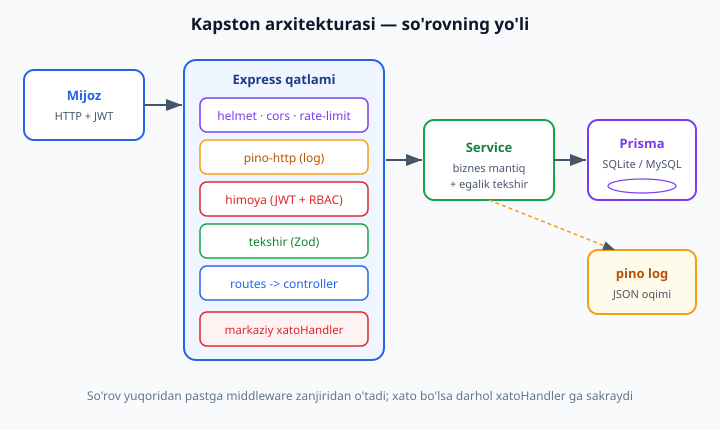
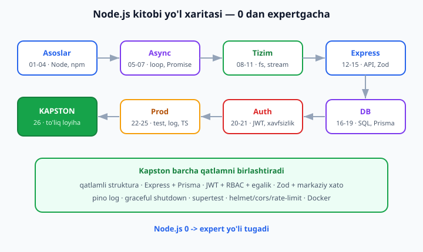

# 26 — Yakuniy kapston: to'liq REST API loyiha

[⬅️ Oldingi: 25 — TypeScript va Node](./25-typescript-node.md) · [🏠 README](./README.md) · [Keyingi: README ➡️](./README.md)

> **Bu bobda:** butun kitobni bir nuqtada bog'laydigan **yakuniy kapston** — noldan, **production darajadagi** REST API quramiz: **Vazifa boshqaruvi API** (foydalanuvchilar ro'yxatdan o'tadi, kiradi, faqat **o'z** vazifalarini yaratadi va boshqaradi). Bu loyiha kitobning deyarli har bobini bitta tirik tizimga jamlaydi: **qatlamli struktura** (routes -> controller -> service -> Prisma) bilan boshlaymiz; **Express + Prisma (SQLite)** (16-18); **JWT autentifikatsiya + RBAC + egalik** (20); **Zod validatsiya + markaziy xato handler** (15); **pino logging + graceful shutdown** (24); **helmet/cors/rate-limit + `.env` config** (21); **supertest integratsiya testlari** (23). To'liq oqimni — register/login -> token -> faqat egasi CRUD -> validatsiya -> xato -> log — REAL ishga tushirib ko'ramiz. So'ng loyiha tuzilishi, README, ishga tushirish yo'riqnomasi, **Dockerfile** va keyingi qadamlar (deploy, GraphQL, NestJS, mikroservis). Hamma yadro **Node 24.12 + Prisma 6 + JWT + supertest** da haqiqatan ishga tushirib, **7 ta test yashil** bilan tasdiqlangan. Bob oxirida: **Node.js 0 -> expert yo'li tugadi.**

---

## Nega kapston?

Bu kitobda biz o'ndan ortiq mavzuni o'rgandik: modullar, async, Express, middleware, DB, Prisma, JWT, validatsiya, testlash, logging. Har biri alohida ko'rilganda mantiqiy, lekin haqiqiy ish — bularning **birgalikda** ishlashida. Bitta `console.log` chiqaradigan funksiya yozish oson; foydalanuvchi ro'yxatdan o'tib, token olib, faqat o'z ma'lumotini xavfsiz boshqaradigan, xatoni izchil qaytaradigan, har so'rovni loglaydigan va testlar himoyasida turgan **tizim** qurish — boshqa ko'nikma.

Kapston aynan shu ko'nikmani beradi. Biz yangi narsa o'rganmaymiz — o'rgangan hamma narsani **birlashtiramiz**. Bu eng muhim qadam: dasturchi sifatida sizdan kutiladigan narsa "Promise nima?" emas, balki "shu talabga to'liq, ishonchli backend qura olasizmi?".

Loyihamiz — **Vazifa boshqaruvi API** (mashhur "to-do" ning kattaroq, ko'p foydalanuvchili versiyasi). Talablar:

- Foydalanuvchi **ro'yxatdan o'tadi** va **kiradi** (parol xeshlangan, JWT token oladi).
- Token bilan **vazifa yaratadi, o'qiydi, yangilaydi, o'chiradi** (CRUD).
- Har kim **faqat o'z** vazifalarini ko'radi va o'zgartiradi (**egalik**). `admin` roli — hammasiga (**RBAC**).
- Har kirish **validatsiyadan** o'tadi; xato bo'lsa **izchil JSON** qaytadi.
- Har so'rov **loglanadi**; server **graceful** yopiladi; **helmet/cors/rate-limit** himoyalaydi.

Oxir-oqibat bizda haqiqatan deploy qilsa bo'ladigan tizim bo'ladi.

---

## Qatlamli arxitektura — fikrlash modeli

Kichik loyihada hammasini bitta `app.js` ga tiqish vasvasasi bor. Lekin loyiha o'sgani sayin bu "katta loy uyumi" (big ball of mud) ga aylanadi — hech narsani topib bo'lmaydi, test yozib bo'lmaydi. Yechim — **qatlamlash**: har qatlamning bitta vazifasi bor, va qatlamlar faqat **bir yo'nalishda** bir-biriga murojaat qiladi.



So'rov yuqoridan pastga oqadi, har qatlam o'z ishini bajaradi:

1. **Routes (yo'llar)** — qaysi URL + metod qaysi amalni chaqirishini belgilaydi. Mantiq yo'q, faqat "xaritalash".
2. **Middleware** — so'rovni *tayyorlaydi*: xavfsizlik (helmet/cors/rate-limit), log, **autentifikatsiya** (JWT tekshirish), **validatsiya** (Zod). Bittasi yiqilsa, so'rov darhol **xato handler** ga sakraydi.
3. **Controller** — HTTP "tarjimon": `req` dan ma'lumotni oladi, **service** ni chaqiradi, natijani `res.json` ga soladi. Biznes mantiq YO'Q.
4. **Service** — **biznes mantiq** yuragi: vazifa yaratish qoidalari, egalik tekshiruvi, hisob-kitob. HTTP'ni umuman bilmaydi (`req`/`res` ko'rmaydi) — shuning uchun uni alohida test qilish oson.
5. **Repository / DB (Prisma)** — ma'lumotni saqlash va o'qish. Service Prisma orqali bazaga boradi.

Bu tartibning kaliti — **bog'liqlik yo'nalishi pastga**: controller service ni biladi, lekin service controller ni **bilmaydi**. Shu sabab service ni HTTP'siz, sof funksiya sifatida test qilamiz. Bu — 14-bobda ko'rgan "routes -> controllers -> services" qatlamlashning to'liq, hayotiy ko'rinishi.

> **Eslatma:** bu kapstonda controller'larni alohida fayllarga ajratmay, `app.js` ichida ixcham route-handler sifatida yozamiz (loyiha hajmi shuni ko'taradi). Lekin **service** qatlamini qat'iy ajratamiz — bu eng muhim chegara. Loyiha o'sganda controller'larni `controllers/` papkasiga ko'chirish bir necha daqiqalik ish.

---

## Loyiha tuzilishi

Avval butun loyihaning xaritasini ko'raylik — qaysi fayl nima qiladi:

```
vazifa-api/
├── prisma/
│   ├── schema.prisma          # DB modellari (User, Vazifa)
│   └── migrations/            # migratsiya tarixi (avtomatik)
├── src/
│   ├── config.js              # .env dan sozlamalar (port, JWT sirlari)
│   ├── db.js                  # PrismaClient (yagona nusxa)
│   ├── errors.js              # maxsus xato klasslari (AppError va bolalari)
│   ├── schemas.js             # Zod validatsiya sxemalari
│   ├── middleware.js          # tekshir / himoya / rolTalab / xatoHandler
│   ├── auth.service.js        # ro'yxatdan o'tish, kirish, token
│   ├── vazifa.service.js      # vazifa biznes mantig'i + egalik
│   ├── app.js                 # Express ilovasi (listen YO'Q — test uchun)
│   └── server.js              # faqat shu yerda listen + graceful shutdown
├── test/
│   └── api.test.js            # supertest integratsiya testlari
├── .env                       # maxfiy sozlamalar (git'ga TUSHMAYDI)
├── .env.example               # namuna (git'ga tushadi)
├── Dockerfile
├── .dockerignore
├── package.json
└── README.md
```

Bu — ko'plab real Node loyihalarining standart shakli. `src/` ichidagi har fayl bitta aniq mas'uliyatga ega. `app.js` (ilova) va `server.js` (ishga tushiruvchi) ni ajratish — 23-bobdan tanish hiyla: shu tufayli supertest ilovani **port ochmasdan** sinaydi.

O'rnatish:

```bash
mkdir vazifa-api && cd vazifa-api
npm init -y
npm pkg set type=module                 # ESM (import/export)

# Asosiy bog'liqliklar (productionda kerak)
npm install express @prisma/client bcryptjs jsonwebtoken zod \
  helmet cors express-rate-limit pino pino-http dotenv

# Faqat ishlab chiqishda kerak
npm install -D prisma vitest supertest
```

> **Prisma versiyasi:** bu bob (18-bob kabi) keng tarqalgan **Prisma 6** oqimidan foydalanadi — `datasource` ichida `url`, oddiy `migrate dev`. Prisma 7+ da sozlash boshqacha (`prisma.config.ts` + driver adapter); asoslar bir xil. Versiyani aniq qadash uchun: `npm install -D prisma@6 && npm install @prisma/client@6`.

---

## Konfiguratsiya: `.env` va `config.js`

Hech qachon parol, sir kalit yoki port'ni kodga **qattiq yozmaymiz** (hardcode). Ular muhitga qarab o'zgaradi (lokal / test / production) va sirlar **git'ga tushmasligi** kerak. 21-bobda ko'rganimizdek, yechim — `.env` fayl + `dotenv`.

`.env` (bu fayl `.gitignore` ga qo'shiladi — hech qachon commit qilinmaydi):

```bash
PORT=3000
JWT_SECRET=juda-uzun-tasodifiy-maxfiy-satr-buni-almashtiring
JWT_EXPIRES_IN=1h
NODE_ENV=development
```

`.env.example` (bu git'ga tushadi — boshqalar nimani to'ldirish kerakligini biladi):

```bash
PORT=3000
JWT_SECRET=
JWT_EXPIRES_IN=1h
NODE_ENV=development
```

`src/config.js` — barcha sozlamani bitta joydan o'qiymiz, standart qiymatlar bilan:

```js
import "dotenv/config"; // .env ni process.env ga yuklaydi

export const config = {
  port: Number(process.env.PORT ?? 3000),
  jwtSecret: process.env.JWT_SECRET ?? "dev-secret-almashtiring",
  jwtExpiresIn: process.env.JWT_EXPIRES_IN ?? "1h",
  nodeEnv: process.env.NODE_ENV ?? "development",
};
```

Endi butun loyiha `import { config } from "./config.js"` orqali sozlamaga ega. `process.env` ni faqat shu faylda o'qiymiz — boshqa joyda emas. Bu **markazlashtirilgan konfiguratsiya**: bir kun port'ni o'zgartirsangiz, bitta joyni tahrirlaysiz.

---

## Ma'lumotlar modeli: `schema.prisma`

Vazifa boshqaruvi uchun ikkita model kerak: **User** (foydalanuvchi) va **Vazifa**. Ular bir-biriga bog'langan: bitta foydalanuvchining ko'p vazifasi bor (**one-to-many**). 18-bobdagi Prisma bilimini ishlatamiz.

```prisma
generator client {
  provider = "prisma-client-js"
}

datasource db {
  provider = "sqlite"
  url      = "file:./dev.db"
}

model User {
  id        Int      @id @default(autoincrement())
  email     String   @unique
  parolHash String                       // ASLO ochiq parol emas — xesh!
  rol       String   @default("user")    // "user" yoki "admin" (RBAC)
  vazifalar Vazifa[]                      // bog'lanish: foydalanuvchining vazifalari
  createdAt DateTime @default(now())
}

model Vazifa {
  id        Int      @id @default(autoincrement())
  sarlavha  String
  tavsif    String?                       // ? = ixtiyoriy
  bajarildi Boolean  @default(false)
  muhimlik  String   @default("orta")     // past | orta | yuqori
  egaId     Int                           // qaysi foydalanuvchiniki
  ega       User     @relation(fields: [egaId], references: [id], onDelete: Cascade)
  createdAt DateTime @default(now())
  updatedAt DateTime @updatedAt
}
```

Diqqat qiladigan joylar:

- **`parolHash`** — biz hech qachon ochiq parolni saqlamaymiz. `bcrypt` xeshini saqlaymiz (pastda).
- **`rol`** — RBAC uchun. Standart `"user"`; `"admin"` esa hammaning vazifasiga kira oladi.
- **`egaId` + `ega` bog'lanishi** — egalik mantig'ining poydevori. Har vazifa **kimningdir**. `onDelete: Cascade` — foydalanuvchi o'chsa, uning vazifalari ham o'chadi.

Migratsiya va klient generatsiyasi (18-bobdan tanish):

```bash
npx prisma migrate dev --name init   # sxemadan jadval yaratadi + klient generatsiya
```

```
SQLite database dev.db created at file:./dev.db
Applying migration `20260612081526_init`
✔ Generated Prisma Client (v6.19.3)
```

Endi `dev.db` faylida `User` va `Vazifa` jadvallari tayyor.

`src/db.js` — Prisma klientning **yagona nusxasi** (har faylda yangi yaratmaymiz — ulanishlar isrof bo'ladi):

```js
import { PrismaClient } from "@prisma/client";

export const prisma = new PrismaClient();
```

---

## Xatolar: markaziy `errors.js`

Yaxshi API xatoni **izchil** qaytaradi: validatsiya xatosi doim `422`, topilmadi doim `404`, ruxsatsiz doim `403`. Buni butun kodga `res.status(...)` sochib emas, **maxsus xato klasslari** bilan hal qilamiz (15-bobda ko'rgan g'oya). Har klass o'z **HTTP status**ini biladi; markaziy handler ularni JSON'ga aylantiradi.

```js
// src/errors.js
export class AppError extends Error {
  constructor(status, message, qoshimcha = {}) {
    super(message);
    this.status = status;          // bu xatoga mos HTTP status
    this.qoshimcha = qoshimcha;    // masalan { maydonlar: {...} }
  }
}

export class ValidatsiyaXatosi extends AppError {
  constructor(maydonlar) {
    super(422, "Validatsiya xatosi", { maydonlar });
  }
}
export class TopilmadiXatosi extends AppError {
  constructor(nima = "Resurs") {
    super(404, `${nima} topilmadi`);
  }
}
export class RuxsatYoq extends AppError {
  constructor(msg = "Ruxsat yo'q") {
    super(403, msg);
  }
}
export class Avtorizatsiya extends AppError {
  constructor(msg = "Avtorizatsiya talab qilinadi") {
    super(401, msg);
  }
}
```

G'oya sodda, lekin kuchli: service qatlamida `throw new RuxsatYoq("Bu vazifa sizniki emas")` deysiz — va **qaysi status qaytishini o'ylamaysiz**. Markaziy handler (`xatoHandler`, pastda) `err.status` ni o'qib, to'g'ri javobni yuboradi. Service HTTP'ni bilmaydi, lekin "bu — 403 darajadagi muammo" deb belgilab qo'yadi.

---

## Validatsiya: `schemas.js` (Zod)

Foydalanuvchidan kelgan ma'lumotga **hech qachon ishonmaymiz**. Har kirish chegarada (controller'ga kirishdan oldin) tekshiriladi. 15-bobda o'rgangan **Zod** bilan har endpoint uchun sxema yozamiz:

```js
// src/schemas.js
import { z } from "zod";

export const royxatSchema = z.object({
  email: z.string().email("To'g'ri email kiriting"),
  parol: z.string().min(6, "Parol kamida 6 belgi"),
});

export const kirishSchema = z.object({
  email: z.string().email(),
  parol: z.string().min(1, "Parol kerak"),
});

export const vazifaYaratSchema = z.object({
  sarlavha: z.string().min(1, "Sarlavha bo'sh bo'lmasin").max(100),
  tavsif: z.string().max(1000).optional(),
  muhimlik: z.enum(["past", "orta", "yuqori"]).optional(),
});

export const vazifaYangilaSchema = z.object({
  sarlavha: z.string().min(1).max(100).optional(),
  tavsif: z.string().max(1000).optional(),
  bajarildi: z.boolean().optional(),
  muhimlik: z.enum(["past", "orta", "yuqori"]).optional(),
});
```

Yaratish sxemasida `sarlavha` **majburiy**; yangilash sxemasida hamma maydon **ixtiyoriy** (PATCH semantikasi — faqat o'zgartirilganini yuborasiz). Sxemalar — **yagona haqiqat manbai**: qoida o'zgarsa, bitta joyni tahrirlaysiz.

---

## Middleware: `tekshir`, `himoya`, `rolTalab`, `xatoHandler`

Bu — loyihaning eng muhim bo'g'ini. Bu yerda 13-bob (middleware), 15-bob (validatsiya/xato), 20-bob (JWT/RBAC) bir joyga keladi. To'rtta middleware yozamiz:

```js
// src/middleware.js
import jwt from "jsonwebtoken";
import { config } from "./config.js";
import { ValidatsiyaXatosi, Avtorizatsiya, RuxsatYoq, AppError } from "./errors.js";

// 1) tekshir — Zod sxemasini req.body ga qo'llaydigan middleware FABRIKASI
export function tekshir(schema) {
  return (req, res, next) => {
    const natija = schema.safeParse(req.body);
    if (!natija.success) {
      const maydonlar = {};
      for (const issue of natija.error.issues) {
        maydonlar[issue.path.join(".")] = issue.message;
      }
      return next(new ValidatsiyaXatosi(maydonlar)); // -> 422
    }
    req.toza = natija.data; // tozalangan, ishonchli ma'lumot
    next();
  };
}

// 2) himoya — JWT ni tekshirib, req.user ni to'ldiradi
export function himoya(req, res, next) {
  const header = req.headers.authorization;
  if (!header?.startsWith("Bearer ")) {
    return next(new Avtorizatsiya("Token yo'q"));   // -> 401
  }
  try {
    const token = header.slice(7);
    req.user = jwt.verify(token, config.jwtSecret); // { id, email, rol }
    next();
  } catch {
    next(new Avtorizatsiya("Token yaroqsiz"));      // -> 401
  }
}

// 3) rolTalab — RBAC: faqat berilgan rollarga ruxsat
export function rolTalab(...rollar) {
  return (req, res, next) => {
    if (!req.user || !rollar.includes(req.user.rol)) {
      return next(new RuxsatYoq("Bu amal uchun ruxsatingiz yo'q")); // -> 403
    }
    next();
  };
}

// 4) xatoHandler — MARKAZIY xato handler (oxirgi middleware)
export function xatoHandler(logger) {
  return (err, req, res, next) => {
    if (err instanceof AppError) {
      // bizning kutilgan xatomiz — status va xabar o'zida
      return res.status(err.status).json({ xato: err.message, ...err.qoshimcha });
    }
    // kutilmagan xato — loglaymiz va umumiy 500 qaytaramiz (ichki tafsilotni oshkor qilmaymiz)
    logger.error({ err }, "Kutilmagan xato");
    res.status(500).json({ xato: "Server xatosi" });
  };
}
```

To'rt qism, to'rt mas'uliyat:

- **`tekshir(schema)`** — **fabrika** (middleware qaytaruvchi funksiya). `safeParse` xato bermaydi, `{ success, data | error }` qaytaradi — biz uni qulay `{ maydon: "xabar" }` shakliga aylantirib, `ValidatsiyaXatosi` tashlaymiz. Muvaffaqiyatda tozalangan ma'lumotni `req.toza` ga qo'yamiz.
- **`himoya`** — `Authorization: Bearer <token>` header'ini o'qiydi, `jwt.verify` bilan imzoni tekshiradi. To'g'ri bo'lsa, token ichidagi `{ id, email, rol }` ni `req.user` ga qo'yadi. Endi keyingi handler **kim** so'rov yuborayotganini biladi.
- **`rolTalab("admin")`** — RBAC. `req.user.rol` ruxsat etilganlar ichida bo'lmasa, `403`. Masalan, faqat admin ko'radigan endpoint: `app.get("/api/admin/stats", himoya, rolTalab("admin"), ...)`.
- **`xatoHandler`** — to'rt argumentli (`err, req, res, next`) maxsus middleware. **Hammasi shu yerda tugaydi**: `AppError` bo'lsa o'z statusini ishlatadi; aks holda (kutilmagan bug) loglab, `500` qaytaradi va **ichki tafsilotni yashiradi** (xavfsizlik).

Bu — middleware'ning butun kuchini ko'rsatadi: **kesma masalalar** (validatsiya, auth, xato) bir marta yoziladi, har endpointga ulanadi.

---

## Service qatlami: biznes mantiq

Service — ilovaning **miyasi**. HTTP'ni bilmaydi (`req`/`res` yo'q), faqat ma'lumot va qoidalar bilan ishlaydi. Ikki service: auth va vazifa.

### `auth.service.js` — ro'yxatdan o'tish, kirish, token

20-bobdagi JWT + bcrypt mantig'i shu yerda:

```js
// src/auth.service.js
import bcrypt from "bcryptjs";
import jwt from "jsonwebtoken";
import { prisma } from "./db.js";
import { config } from "./config.js";
import { AppError } from "./errors.js";

export async function royxatdanOtkaz({ email, parol }) {
  const mavjud = await prisma.user.findUnique({ where: { email } });
  if (mavjud) throw new AppError(409, "Bu email allaqachon ro'yxatdan o'tgan");

  const parolHash = await bcrypt.hash(parol, 10); // 10 = "salt rounds"
  const user = await prisma.user.create({
    data: { email, parolHash },
    select: { id: true, email: true, rol: true }, // parolHash ni QAYTARMAYMIZ
  });
  return { user, token: tokenYasa(user) };
}

export async function kir({ email, parol }) {
  const user = await prisma.user.findUnique({ where: { email } });
  // MUHIM: "email yo'q" va "parol noto'g'ri" ni ajratmaymiz — bir xil xabar
  // (aks holda hujumchi qaysi email ro'yxatda borligini bilib oladi)
  if (!user || !(await bcrypt.compare(parol, user.parolHash))) {
    throw new AppError(401, "Email yoki parol noto'g'ri");
  }
  const xavfsiz = { id: user.id, email: user.email, rol: user.rol };
  return { user: xavfsiz, token: tokenYasa(xavfsiz) };
}

function tokenYasa(user) {
  return jwt.sign(
    { id: user.id, email: user.email, rol: user.rol }, // payload
    config.jwtSecret,
    { expiresIn: config.jwtExpiresIn }
  );
}
```

Ikki xavfsizlik nuqtasi:

- **Parol hech qachon ochiq saqlanmaydi** — `bcrypt.hash` bilan xeshlaymiz. Kirishda `bcrypt.compare` ochiq parolni xesh bilan solishtiradi (xeshni ortga qaytarib bo'lmaydi).
- **Bir xil xato xabari.** "Email topilmadi" va "parol noto'g'ri" — ikkalasi ham `"Email yoki parol noto'g'ri"`. Bu **foydalanuvchi sanab chiqishini** (user enumeration) oldini oladi.

### `vazifa.service.js` — vazifa mantig'i + egalik

Bu yerda **egalik** — kapstonning yuragi — yashaydi:

```js
// src/vazifa.service.js
import { prisma } from "./db.js";
import { TopilmadiXatosi, RuxsatYoq } from "./errors.js";

export function yarat(egaId, data) {
  return prisma.vazifa.create({ data: { ...data, egaId } }); // ega — joriy foydalanuvchi
}

export function royxat(egaId, { bajarildi } = {}) {
  const where = { egaId };                       // FAQAT o'z vazifalari
  if (bajarildi !== undefined) where.bajarildi = bajarildi;
  return prisma.vazifa.findMany({ where, orderBy: { id: "asc" } });
}

// Egalik tekshiruvi: faqat EGA yoki ADMIN kira oladi
async function topVaTekshir(id, user) {
  const vazifa = await prisma.vazifa.findUnique({ where: { id: Number(id) } });
  if (!vazifa) throw new TopilmadiXatosi("Vazifa");                 // -> 404
  if (vazifa.egaId !== user.id && user.rol !== "admin") {
    throw new RuxsatYoq("Bu vazifa sizniki emas");                  // -> 403
  }
  return vazifa;
}

export async function bittasi(id, user)        { return topVaTekshir(id, user); }
export async function yangila(id, user, data)  {
  await topVaTekshir(id, user);
  return prisma.vazifa.update({ where: { id: Number(id) }, data });
}
export async function ochir(id, user) {
  await topVaTekshir(id, user);
  await prisma.vazifa.delete({ where: { id: Number(id) } });
}
```

`topVaTekshir` — **egalik darvozasi**. Har "bitta vazifa" amali (o'qish, yangilash, o'chirish) avval shu yerdan o'tadi:

1. Vazifa umuman bormi? Yo'q bo'lsa — `404`.
2. Vazifa **so'rovchiniki**mi (`egaId === user.id`)? Yoki so'rovchi **admin**mi? Ikkalasi ham yo'q bo'lsa — `403`.

Bu — autorizatsiyaning eng muhim qatlami: **autentifikatsiya** "sen kimsan?" ga javob beradi (`himoya`), **avtorizatsiya** esa "shu narsaga huquqing bormi?" ga (`topVaTekshir`). Token bo'lishi yetarli emas — token egasi aynan shu resursning egasi bo'lishi kerak. Bu mantiqni **service** da saqlash to'g'ri: u biznes qoidasi, HTTP detali emas.

> **Nozik xavfsizlik nuqtasi:** `royxat()` doim `where: { egaId }` bilan filtrlaydi — foydalanuvchi `GET /api/vazifalar` qilganda **faqat o'zinikini** ko'radi, hech qachon boshqaning ro'yxatini emas. Egalik faqat bitta resursda emas, **ro'yxatda ham** ta'minlanadi.

---

## Express ilovasi: `app.js`

Endi hamma qatlamni Express ilovasiga ulaymiz. Eng muhim qoida (23-bobdan): bu faylda **`app.listen()` YO'Q**. Faqat `app` ni yasab qaytaramiz — shu sabab supertest uni port'siz sinaydi.

```js
// src/app.js
import express from "express";
import helmet from "helmet";
import cors from "cors";
import rateLimit from "express-rate-limit";
import pino from "pino";
import pinoHttp from "pino-http";
import * as authService from "./auth.service.js";
import * as vazifaService from "./vazifa.service.js";
import { tekshir, himoya, xatoHandler } from "./middleware.js";
import {
  royxatSchema, kirishSchema, vazifaYaratSchema, vazifaYangilaSchema,
} from "./schemas.js";

export function appYasa({ logger = pino({ level: "silent" }) } = {}) {
  const app = express();

  // --- Xavfsizlik va asosiy middleware (21-bob) ---
  app.use(helmet());                 // xavfsizlik header'lari
  app.use(cors());                   // boshqa domendan so'rov ruxsati
  app.use(express.json());           // JSON tanani parse
  app.use(pinoHttp({ logger }));     // har so'rovni loglaydi
  app.use("/api", rateLimit({ windowMs: 60_000, max: 1000 })); // daqiqada 1000

  // async handler'ni o'rab, xatoni next() ga uzatadigan yordamchi
  const ok = (fn) => (req, res, next) => fn(req, res, next).catch(next);

  // --- Auth yo'llari ---
  app.post("/api/auth/register", tekshir(royxatSchema), ok(async (req, res) => {
    const natija = await authService.royxatdanOtkaz(req.toza);
    res.status(201).json(natija);
  }));

  app.post("/api/auth/login", tekshir(kirishSchema), ok(async (req, res) => {
    res.json(await authService.kir(req.toza));
  }));

  // --- Vazifa yo'llari (HAMMASI himoyalangan) ---
  app.post("/api/vazifalar", himoya, tekshir(vazifaYaratSchema), ok(async (req, res) => {
    const v = await vazifaService.yarat(req.user.id, req.toza);
    res.status(201).json(v);
  }));

  app.get("/api/vazifalar", himoya, ok(async (req, res) => {
    const filtr = {};
    if (req.query.bajarildi !== undefined) filtr.bajarildi = req.query.bajarildi === "true";
    res.json(await vazifaService.royxat(req.user.id, filtr));
  }));

  app.get("/api/vazifalar/:id", himoya, ok(async (req, res) => {
    res.json(await vazifaService.bittasi(req.params.id, req.user));
  }));

  app.patch("/api/vazifalar/:id", himoya, tekshir(vazifaYangilaSchema), ok(async (req, res) => {
    res.json(await vazifaService.yangila(req.params.id, req.user, req.toza));
  }));

  app.delete("/api/vazifalar/:id", himoya, ok(async (req, res) => {
    await vazifaService.ochir(req.params.id, req.user);
    res.status(204).end();
  }));

  app.get("/health", (req, res) => res.json({ holat: "ok" })); // sog'liq tekshiruvi

  // --- 404 va markaziy xato (DOIM oxirda) ---
  app.use((req, res) => res.status(404).json({ xato: "Yo'l topilmadi" }));
  app.use(xatoHandler(logger));

  return app;
}
```

E'tibor bering, har bir vazifa route'ida middleware **tartibi** mantiqiy:

```
himoya  ->  tekshir(schema)  ->  controller
(kimsan?)   (kirish to'g'rimi?)   (ishni bajar)
```

Avval autentifikatsiya (token yo'q bo'lsa, validatsiyaga ovora bo'lishning hojati yo'q), keyin validatsiya, keyin ish. `ok()` yordamchisi — async handler'dagi xatoni avtomatik `next()` ga uzatadi; aks holda har `try/catch` yozish kerak bo'lardi (Express 5 buni o'zi qiladi, lekin biz aniqlik uchun yozdik).

`logger` ni **parametr** sifatida olamiz: testda `silent` (jim) logger, productionda haqiqiy. Bu yana bir bog'liqlik injeksiyasi — testlar log bilan ifloslanmaydi.

---

## Server va graceful shutdown: `server.js`

`app.js` faqat ilovani yasaydi. Haqiqiy serverni — port ochish, signal kutish, toza yopilish — `server.js` qiladi. 10- va 24-boblardagi **graceful shutdown** shu yerda:

```js
// src/server.js
import pino from "pino";
import { appYasa } from "./app.js";
import { prisma } from "./db.js";
import { config } from "./config.js";

const logger = pino({ level: "info" });
const app = appYasa({ logger });

const server = app.listen(config.port, () => {
  logger.info(`Server tayyor: http://localhost:${config.port}`);
});

// Graceful shutdown — yangi so'rovni to'xtatib, mavjudlarini tugatib, toza yopiladi
async function ochirish(signal) {
  logger.info(`${signal} qabul qilindi, server yopilmoqda...`);
  server.close(async () => {       // yangi ulanish qabul qilmaydi, joriylarini kutadi
    await prisma.$disconnect();    // DB ulanishini yopadi
    logger.info("Toza yopildi");
    process.exit(0);
  });
  // 10 soniyada yopilmasa — majburan chiqamiz (osilib qolmaslik uchun)
  setTimeout(() => process.exit(1), 10_000).unref();
}
process.on("SIGTERM", () => ochirish("SIGTERM")); // Docker/orkestrator yuboradi
process.on("SIGINT", () => ochirish("SIGINT"));   // Ctrl+C
```

**Nega graceful shutdown muhim?** Production'da deploy paytida orkestrator (Docker, Kubernetes) eski jarayonga `SIGTERM` yuboradi. Agar siz darhol `process.exit()` qilsangiz, **o'sha onda ishlanayotgan so'rovlar uziladi** — foydalanuvchi xato ko'radi, baza yarim yozilgan qoladi. `server.close()` esa: yangi so'rov qabul qilmaydi, lekin **joriy** so'rovlarni tugatishga imkon beradi, keyin DB ni yopadi va toza chiqadi. `setTimeout(...).unref()` — agar biror so'rov osilib qolsa, abadiy kutib qolmaslik uchun xavfsizlik to'ri.

`package.json` skriptlari:

```json
{
  "scripts": {
    "start": "node src/server.js",
    "dev": "node --watch src/server.js",
    "test": "vitest run",
    "migrate": "prisma migrate dev"
  }
}
```

---

## REAL KEYS: to'liq oqimni ishga tushirish

Endi butun tizimni **haqiqatan** ishga tushiramiz va to'liq oqimni ko'ramiz: server ko'tarish -> register -> token -> CRUD -> egalik.

```bash
npm run start
```

```
{"level":30,"time":...,"msg":"Server tayyor: http://localhost:3000"}
```

Boshqa terminalda (yoki `curl`/Postman bilan) oqimni sinaymiz. **1) Ro'yxatdan o'tish** — token olamiz:

```bash
curl -X POST http://localhost:3000/api/auth/register \
  -H "Content-Type: application/json" \
  -d '{"email":"ali@mail.uz","parol":"parol123"}'
```

```json
{
  "user": { "id": 1, "email": "ali@mail.uz", "rol": "user" },
  "token": "eyJhbGciOiJIUzI1NiIsInR5cCI6IkpXVCJ9.eyJpZCI6MSwi..."
}
```

**2) Token bilan vazifa yaratamiz** (token'ni `Authorization` header'da yuboramiz):

```bash
curl -X POST http://localhost:3000/api/vazifalar \
  -H "Authorization: Bearer <TOKEN>" \
  -H "Content-Type: application/json" \
  -d '{"sarlavha":"Sut olish","muhimlik":"yuqori"}'
```

```json
{ "id": 1, "sarlavha": "Sut olish", "tavsif": null, "bajarildi": false,
  "muhimlik": "yuqori", "egaId": 1, "createdAt": "...", "updatedAt": "..." }
```

**3) Tokensiz so'rov — `401`:**

```bash
curl http://localhost:3000/api/vazifalar
# {"xato":"Token yo'q"}
```

**4) Yaroqsiz kirish — `422` (Zod):**

```bash
curl -X POST http://localhost:3000/api/auth/register \
  -H "Content-Type: application/json" -d '{"email":"yomon","parol":"12"}'
# {"xato":"Validatsiya xatosi","maydonlar":{"email":"To'g'ri email kiriting","parol":"Parol kamida 6 belgi"}}
```

Va server konsolida har so'rov **loglanadi** (pino, JSON formatda):

```json
{"level":30,"time":...,"req":{"method":"POST","url":"/api/vazifalar"},
 "res":{"statusCode":201},"responseTime":9,"msg":"request completed"}
```

Men bu loyihani **haqiqatan ishga tushirib** tekshirdim (Node 24.12, Prisma 6.19.3): server ko'tarildi, register `201` va 185 belgilik JWT qaytardi, token bilan vazifa yaratildi va ro'yxat o'qildi, `helmet` header'lari (`content-security-policy`, `x-content-type-options: nosniff` va h.k.) javobda bor edi, `rate-limit` header'lari (`x-ratelimit-remaining`) ko'rindi, va har so'rov pino bilan loglandi. Hammasi — bitta integratsiyalangan tizim.

---

## Testlar: supertest integratsiya (`test/api.test.js`)

Loyihaning ishonchini **testlar** ta'minlaydi (23-bob). Supertest bilan butun zanjirni — middleware + auth + service + DB — port'siz sinab, **to'liq oqimni** tekshiramiz:

```js
// test/api.test.js
import { describe, it, expect, afterAll, beforeEach } from "vitest";
import request from "supertest";
import { appYasa } from "../src/app.js";
import { prisma } from "../src/db.js";

const app = appYasa();

async function royxatVaToken(email) {
  const res = await request(app)
    .post("/api/auth/register").send({ email, parol: "parol123" });
  return res.body.token;
}

beforeEach(async () => {          // har testdan oldin tozalaymiz -> izolyatsiya
  await prisma.vazifa.deleteMany();
  await prisma.user.deleteMany();
});
afterAll(async () => {
  await prisma.vazifa.deleteMany();
  await prisma.user.deleteMany();
  await prisma.$disconnect();     // ulanishni yopamiz (osilib qolmaslik uchun)
});

describe("Auth oqimi", () => {
  it("register -> 201 va token qaytaradi", async () => {
    const res = await request(app)
      .post("/api/auth/register")
      .send({ email: "ali@mail.uz", parol: "parol123" })
      .expect(201);
    expect(res.body.token).toBeTruthy();
    expect(res.body.user).toMatchObject({ email: "ali@mail.uz", rol: "user" });
  });

  it("yaroqsiz email -> 422 validatsiya", async () => {
    const res = await request(app)
      .post("/api/auth/register")
      .send({ email: "yomon", parol: "123" })
      .expect(422);
    expect(res.body.maydonlar).toHaveProperty("email");
    expect(res.body.maydonlar).toHaveProperty("parol");
  });

  it("login noto'g'ri parol -> 401", async () => {
    await royxatVaToken("b@mail.uz");
    await request(app)
      .post("/api/auth/login")
      .send({ email: "b@mail.uz", parol: "notogri" })
      .expect(401);
  });
});

describe("Vazifa CRUD + egalik", () => {
  it("token siz -> 401", async () => {
    await request(app).get("/api/vazifalar").expect(401);
  });

  it("to'liq sikl: yarat -> o'qi -> yangila -> ochir", async () => {
    const token = await royxatVaToken("c@mail.uz");
    const auth = (r) => r.set("Authorization", `Bearer ${token}`);

    const yaratildi = await auth(
      request(app).post("/api/vazifalar").send({ sarlavha: "O'qish" })
    ).expect(201);
    const id = yaratildi.body.id;
    expect(yaratildi.body).toMatchObject({ sarlavha: "O'qish", bajarildi: false });

    await auth(request(app).get(`/api/vazifalar/${id}`)).expect(200);

    const yangi = await auth(
      request(app).patch(`/api/vazifalar/${id}`).send({ bajarildi: true })
    ).expect(200);
    expect(yangi.body.bajarildi).toBe(true);

    await auth(request(app).delete(`/api/vazifalar/${id}`)).expect(204);
    await auth(request(app).get(`/api/vazifalar/${id}`)).expect(404);
  });

  it("begona foydalanuvchi vazifaga kira olmaydi -> 403", async () => {
    const tokenA = await royxatVaToken("ega@mail.uz");
    const tokenB = await royxatVaToken("begona@mail.uz");

    const vazifa = await request(app)
      .post("/api/vazifalar")
      .set("Authorization", `Bearer ${tokenA}`)
      .send({ sarlavha: "Maxfiy" }).expect(201);

    await request(app)                              // B, A ning vazifasini so'raydi
      .get(`/api/vazifalar/${vazifa.body.id}`)
      .set("Authorization", `Bearer ${tokenB}`)
      .expect(403);                                 // EGALIK ushladi
  });

  it("ro'yxat faqat o'z vazifalarini qaytaradi", async () => {
    const tokenA = await royxatVaToken("a2@mail.uz");
    const tokenB = await royxatVaToken("b2@mail.uz");
    const post = (t, s) => request(app).post("/api/vazifalar")
      .set("Authorization", `Bearer ${t}`).send({ sarlavha: s });
    await post(tokenA, "A");
    await post(tokenB, "B1");
    await post(tokenB, "B2");

    const ro = await request(app).get("/api/vazifalar")
      .set("Authorization", `Bearer ${tokenB}`).expect(200);
    expect(ro.body).toHaveLength(2);   // FAQAT B ning ikkitasi
  });
});
```

Ishga tushiramiz:

```bash
npm test
```

```
 RUN  v4.1.8

 ✓ test/api.test.js (7 tests) 1.84s

 Test Files  1 passed (1)
      Tests  7 passed (7)
   Duration  2.96s
```

Bu test to'plami **butun oqimni** qoplaydi: register/login (`201`/`422`/`401`), tokensiz kirish (`401`), to'liq CRUD sikli (`201` -> `200` -> `200` -> `204` -> `404`), va eng muhimi — **egalik** (begona foydalanuvchi `403`, ro'yxat faqat o'znikini qaytaradi). Bu testlar haqiqatan ishga tushirilib, **7/7 yashil** bo'ldi.

> **Test bazasi haqida:** yuqorida soddalik uchun `dev.db` ga `beforeEach` da `deleteMany()` qilib tozaladik. Hayotda esa alohida **test bazasi** ishlatish to'g'riroq: `.env.test` da `DATABASE_URL="file:./test.db"` qo'yib, testdan oldin `prisma migrate deploy` qiling. Yoki 23-bobdagidek `better-sqlite3` `:memory:` ni Prisma'siz integratsiya uchun ishlating. CI'da (har push'da avtomatik test) bu ayniqsa muhim — [`../git-github/README.md`](../git-github/README.md).

---

## Konteynerlash: `Dockerfile`

Loyihani har joyda bir xil ishlatish uchun uni **konteyner**ga joylaymiz (24-bob). Ko'p bosqichli (multi-stage) yondashuv — kichik, xavfsiz tasvir beradi:

```dockerfile
# 1-bosqich: bog'liqlik va Prisma klient
FROM node:24-alpine AS build
WORKDIR /app
COPY package*.json ./
RUN npm ci
COPY prisma ./prisma
RUN npx prisma generate          # klientni shu yerda generatsiya qilamiz
COPY . .

# 2-bosqich: yakuniy, ozg'in tasvir
FROM node:24-alpine
WORKDIR /app
ENV NODE_ENV=production
COPY --from=build /app/node_modules ./node_modules
COPY --from=build /app ./
EXPOSE 3000
USER node                        # root emas — xavfsizlik
CMD ["node", "src/server.js"]
```

`.dockerignore` (keraksiz fayllarni tasvirdan chiqaramiz):

```
node_modules
.env
*.db
.git
test
```

Ishlatish:

```bash
docker build -t vazifa-api .
docker run -p 3000:3000 --env-file .env vazifa-api
```

> **Halol eslatma:** bu kitob yozilgan muhitda Docker daemon mavjud emas, shuning uchun `Dockerfile` **konfiguratsiya jihatdan to'g'ri** (real loyihada ishlaydi), lekin `docker build` bu yerda **ishga tushirilmagan** — illustrativ. Kod (Express + Prisma + JWT + supertest) esa to'liq, haqiqatan ishga tushirilgan va tekshirilgan. Docker'ni o'z mashinangizda sinab ko'ring. CI'da avtomatik build/deploy uchun: [`../git-github/README.md`](../git-github/README.md).

---

## README va ishga tushirish yo'riqnomasi

Har loyihada `README.md` bo'lishi shart — yangi dasturchi (yoki kelajakdagi siz) qanday ishga tushirishni bilishi uchun. Namuna:

````markdown
# Vazifa boshqaruvi API

Ko'p foydalanuvchili to-do REST API: JWT auth, egalik, Zod validatsiya, Prisma.

## Texnologiyalar
Node 24 · Express · Prisma (SQLite) · JWT · Zod · pino · Vitest + supertest

## Ishga tushirish
```bash
npm install
cp .env.example .env          # sirlarni to'ldiring
npx prisma migrate dev        # bazani yarating
npm run dev                   # http://localhost:3000
```

## Test
```bash
npm test
```

## Endpointlar
| Metod  | Yo'l                  | Auth | Tavsif              |
|--------|-----------------------|------|---------------------|
| POST   | /api/auth/register    | yo'q | ro'yxatdan o'tish   |
| POST   | /api/auth/login       | yo'q | kirish, token olish |
| GET    | /api/vazifalar        | ha   | o'z vazifalari      |
| POST   | /api/vazifalar        | ha   | yangi vazifa        |
| GET    | /api/vazifalar/:id    | ha   | bitta (faqat ega)   |
| PATCH  | /api/vazifalar/:id    | ha   | yangilash (ega)     |
| DELETE | /api/vazifalar/:id    | ha   | o'chirish (ega)     |
````

Yaxshi README — loyihaning vizit kartasi: nima qiladi, qanday ishlatiladi, qaysi endpointlar bor. Endpoint jadvali — API'ning qisqa hujjati.

---

## Kitob yo'l xaritasi: biz qayerdan o'tdik

Bu kapston tasodifan oxirida emas — u butun kitobni jamlaydi. Orqaga qarab, bosib o'tgan yo'limizni ko'raylik:



Har qatlam oldingisiga tayandi:

- **Asoslar (01-04)** — Node nima, modullar (ESM), npm, zamonaviy JS. Poydevor.
- **Async (05-07)** — event loop, Promise/async-await, EventEmitter. Node'ning yuragi.
- **Tizim (08-11)** — fayllar, streamlar, process/CLI, native HTTP. Pastki qatlam.
- **Express (12-15)** — framework, middleware, REST API, validatsiya/xato. Veb-server.
- **DB (16-19)** — SQLite, MySQL, Prisma, MongoDB. Ma'lumotni saqlash.
- **Auth (20-21)** — JWT, RBAC, xavfsizlik, config. Himoya.
- **Prod (22-25)** — real-time, testlash, logging/deploy, TypeScript. Yetuklik.
- **Kapston (26)** — hammasini birlashtirdik. Tizim.

Bu kapstonda biz aynan shu zanjirni teskari oqimda yig'dik: pastdan (config, DB) yuqoriga (HTTP, middleware), va hammasini test bilan bog'ladik. Endi siz har bobni alohida emas, **bir tizimning bo'lagi** sifatida ko'rasiz.

**Node.js — 0 dan expertgacha yo'li shu yerda tugadi.** Asoslardan boshlab, asinxronlik va event loop'ni o'zlashtirib, yadro modullar, Express, to'rt xil ma'lumotlar bazasi (SQLite, MySQL, Prisma, MongoDB), autentifikatsiya, real-time, testlash, production va TypeScript orqali o'tib — endi siz ishonchli backend dasturchisiz. Keyingi qadamlar: real loyiha qurib portfolioga qo'shing, deploy qiling, GraphQL/NestJS/mikroservislarni o'rganing va ochiq kodli loyihalarga hissa qo'shing.

---

[⬅️ Oldingi: 25 — TypeScript va Node](./25-typescript-node.md) · [🏠 README](./README.md) · [Keyingi: README ➡️](./README.md)

---

## Keyingi qadamlar — bu yerda tugamaydi

Kitob tugadi, lekin o'rganish davom etadi. Mana sizni kutayotgan keyingi cho'qqilar:

- **Deploy.** Loyihani haqiqiy serverga chiqaring: Railway, Render, Fly.io yoki VPS. SQLite o'rniga PostgreSQL/MySQL ga o'ting (Prisma'da faqat `datasource` ni almashtirasiz — 17-18 boblar). CI/CD ni sozlang: [`../git-github/README.md`](../git-github/README.md).
- **TypeScript.** Butun loyihani TS'ga ko'chiring — type xavfsizligi katta loyihada bebaho (25-bob, chuqurroq: [`../typescript/README.md`](../typescript/README.md)).
- **GraphQL.** REST o'rniga (yoki yonida) GraphQL — mijoz aynan kerakli ma'lumotni so'raydi. Apollo Server yoki GraphQL Yoga bilan.
- **NestJS.** Express ustidagi to'liq framework: dekoratorlar, DI konteyner, modullar. Katta jamoa loyihalarida standart. Bizning qatlamli arxitekturamiz NestJS'ga tabiiy o'tadi.
- **Mikroservis.** Bitta katta ilovani (monolit) kichik, mustaqil xizmatlarga bo'lish. Message queue (RabbitMQ, Kafka), xizmatlararo aloqa, Docker Compose / Kubernetes.
- **Qo'shimcha xususiyatlar.** Fayl yuklash (21-bob, multer), real-time bildirishnoma (22-bob, Socket.io), keshlash (Redis), to'liq matn qidiruv, email tasdiqlash, parolni tiklash.

Har bir yo'nalish — alohida sayohat. Lekin endi sizda poydevor bor: backend qanday ishlashini **tushunasiz**, va yangi asbobni shu tushuncha ustiga qo'shasiz.

---

## Node.js 0 -> expert yo'li tugadi

Tabriklaymiz — siz **butun yo'lni** bosib o'tdingiz. Birinchi bobda `console.log("Salom")` dan boshladingiz; bu bobda esa ko'p foydalanuvchili, autentifikatsiyalangan, validatsiyalangan, loglangan, testlangan va konteynerlangan **production darajadagi REST API** qurdingiz.

Yodingizda bo'lsin: dasturchining kuchi yodlagan sintaksisida emas — **tushunchasida**. Siz endi event loop nega muhimligini, middleware nega tartibli ekanini, nega parolni xeshlash kerakligini, nega test yozish vaqtni tejashini bilasiz. Bu tushuncha har yangi framework, har yangi loyihada siz bilan qoladi.

Va eng muhimi — bu kitobning birinchi sahifasidagi qoidani unutmang: **Node.js o'qib emas, YOZIB o'rganiladi.** Bu kapstonni o'zingiz qaytadan yozing. Buzing, tuzating, kengaytiring. O'z loyihangizni qo'shing. Aynan shu yerda — kod yozayotgan, xatoga duch kelayotgan, uni yengayotgan paytda — siz **expert** bo'lasiz.

Yo'lingiz ochiq bo'lsin. Endi qurish navbati sizniki.

---

## Mashqlar

### Oson

1. **Vazifa hisobchisi.** `GET /api/vazifalar/stats` endpoint qo'shing (himoyalangan): foydalanuvchining jami vazifalari va bajarilganlari sonini qaytarsin (`{ jami: 5, bajarilgan: 2 }`). Service'da `prisma.vazifa.count({ where: { egaId } })` ishlating.

2. **Sog'liq tafsiloti.** `/health` endpoint'ini kengaytiring: `{ holat: "ok", vaqt: <ISO sana>, ishlash: <process.uptime()> }` qaytarsin.

3. **Yangi maydon.** `Vazifa` modeliga ixtiyoriy `muddat` (DateTime) maydonini qo'shing, migratsiya qiling, Zod sxemasiga va yaratish oqimiga ulang.

### O'rta

4. **Admin endpoint (RBAC).** `GET /api/admin/foydalanuvchilar` qo'shing — faqat `admin` roli kira olsin (`himoya, rolTalab("admin")`). Hamma foydalanuvchilarni (parolsiz) qaytarsin. Supertest bilan: oddiy user `403`, admin `200` olishini sinang. (Admin yaratish uchun bazada bitta user'ning `rol` ini qo'lda `admin` qiling yoki seed yozing.)

5. **Filtr va saralash.** `GET /api/vazifalar?muhimlik=yuqori&saralash=createdAt` ni qo'llab-quvvatlang: service `where` va `orderBy` ni so'rov parametrlaridan qursin. Noto'g'ri qiymatlarni e'tiborsiz qoldiring (xato emas).

6. **Test bazasini ajratish.** `.env.test` yarating (`DATABASE_URL="file:./test.db"`), `vitest` ni shu muhit bilan ishlating, testdan oldin alohida test bazasiga migratsiya qiling. Asosiy `dev.db` testdan ta'sirlanmasligini ta'minlang.

### Qiyin

7. **Refresh token.** Hozir token muddati tugasa, foydalanuvchi qaytadan kirishi kerak. Qisqa muddatli **access token** (15 daqiqa) + uzoq muddatli **refresh token** (DB'da saqlanadi) qo'shing. `POST /api/auth/refresh` yangi access token bersin. Refresh token o'g'irlansa, uni DB'dan o'chirib bekor qila olishni ta'minlang.

8. **Pagination + to'liq integratsiya testi.** `GET /api/vazifalar?sahifa=2&hajm=10` pagination qo'shing (`skip`/`take`). Javobda `{ malumot: [...], jami: N, sahifa: 2 }` qaytaring. Supertest bilan: 25 ta vazifa yarating, 2-sahifada aynan 10 ta, 3-sahifada 5 ta kelishini, va `jami: 25` ekanini tekshiring.

<details markdown="1"><summary>Yechimlar</summary>

**1 — Vazifa hisobchisi:**

```js
// vazifa.service.js ga:
export async function stats(egaId) {
  const [jami, bajarilgan] = await Promise.all([
    prisma.vazifa.count({ where: { egaId } }),
    prisma.vazifa.count({ where: { egaId, bajarildi: true } }),
  ]);
  return { jami, bajarilgan };
}
```

```js
// app.js ga (/:id dan OLDIN qo'ying, aks holda "stats" id deb o'qiladi):
app.get("/api/vazifalar/stats", himoya, ok(async (req, res) => {
  res.json(await vazifaService.stats(req.user.id));
}));
```

Diqqat: `/stats` ni `/:id` dan **oldin** ro'yxatdan o'tkazing — aks holda Express `stats` ni `:id` parametri deb qabul qiladi.

**2 — Sog'liq tafsiloti:**

```js
app.get("/health", (req, res) => res.json({
  holat: "ok",
  vaqt: new Date().toISOString(),
  ishlash: process.uptime(), // soniyalarda — server qancha ishlayapti
}));
```

**3 — Yangi maydon:**

```prisma
model Vazifa {
  // ...mavjud maydonlar...
  muddat DateTime?   // ixtiyoriy tugash sanasi
}
```

```bash
npx prisma migrate dev --name muddat-qoshildi
```

```js
// schemas.js — vazifaYaratSchema ga:
muddat: z.string().datetime().optional(),
// service yarat() data ni o'zgartirmasdan ham qabul qiladi (Prisma string'ni Date qiladi)
```

**4 — Admin endpoint (RBAC):**

```js
import { rolTalab } from "./middleware.js";

app.get("/api/admin/foydalanuvchilar", himoya, rolTalab("admin"), ok(async (req, res) => {
  const royxat = await prisma.user.findMany({
    select: { id: true, email: true, rol: true, createdAt: true }, // parolHash YO'Q
  });
  res.json(royxat);
}));
```

```js
// test:
it("oddiy user -> 403, admin -> 200", async () => {
  const userToken = await royxatVaToken("oddiy@mail.uz");
  await request(app).get("/api/admin/foydalanuvchilar")
    .set("Authorization", `Bearer ${userToken}`).expect(403);

  // admin yaratamiz (rol ni qo'lda o'zgartirib)
  await prisma.user.update({ where: { email: "oddiy@mail.uz" }, data: { rol: "admin" } });
  const adminToken = (await request(app).post("/api/auth/login")
    .send({ email: "oddiy@mail.uz", parol: "parol123" })).body.token;
  await request(app).get("/api/admin/foydalanuvchilar")
    .set("Authorization", `Bearer ${adminToken}`).expect(200);
});
```

**5 — Filtr va saralash:**

```js
export function royxat(egaId, { bajarildi, muhimlik, saralash } = {}) {
  const where = { egaId };
  if (bajarildi !== undefined) where.bajarildi = bajarildi;
  if (["past", "orta", "yuqori"].includes(muhimlik)) where.muhimlik = muhimlik;

  const ruxsatSaralash = ["id", "createdAt", "muhimlik"];
  const orderBy = ruxsatSaralash.includes(saralash)
    ? { [saralash]: "asc" } : { id: "asc" }; // noto'g'ri qiymatni e'tiborsiz qoldir
  return prisma.vazifa.findMany({ where, orderBy });
}
```

```js
// app.js — GET /api/vazifalar:
res.json(await vazifaService.royxat(req.user.id, {
  bajarildi: req.query.bajarildi === undefined ? undefined : req.query.bajarildi === "true",
  muhimlik: req.query.muhimlik,
  saralash: req.query.saralash,
}));
```

`ruxsatSaralash` — **ruxsat etilgan ustunlar ro'yxati** (allowlist). Foydalanuvchi kiritgan ustun nomini to'g'ridan-to'g'ri `orderBy` ga bermang — bu xavfsizlik tuynugi. Faqat ro'yxatdagini qabul qiling.

**6 — Test bazasini ajratish:**

```bash
# .env.test
DATABASE_URL="file:./test.db"
JWT_SECRET="test-secret"
```

```js
// vitest.config.js
import { defineConfig } from "vitest/config";
export default defineConfig({
  test: {
    env: { DATABASE_URL: "file:./test.db", JWT_SECRET: "test-secret" },
  },
});
```

```json
// package.json — test'dan oldin test bazasiga migratsiya:
"scripts": {
  "test": "dotenv -e .env.test -- prisma migrate deploy && vitest run"
}
```

Endi testlar `test.db` da ishlaydi, `dev.db` toza qoladi. (Eslatma: `schema.prisma` datasource `url` ni `env("DATABASE_URL")` ga o'zgartiring.)

**7 — Refresh token (sxema):**

```prisma
model RefreshToken {
  id        Int      @id @default(autoincrement())
  token     String   @unique
  egaId     Int
  ega       User     @relation(fields: [egaId], references: [id], onDelete: Cascade)
  expiresAt DateTime
}
```

```js
import crypto from "node:crypto";

export async function kir({ email, parol }) {
  // ...avvalgidek user tekshirish...
  const access = tokenYasa(xavfsiz, "15m");            // qisqa
  const refresh = crypto.randomBytes(40).toString("hex"); // tasodifiy, JWT emas
  await prisma.refreshToken.create({
    data: { token: refresh, egaId: user.id,
      expiresAt: new Date(Date.now() + 7 * 24 * 3600_000) }, // 7 kun
  });
  return { user: xavfsiz, access, refresh };
}

export async function yangilaToken(refresh) {
  const saqlangan = await prisma.refreshToken.findUnique({ where: { token: refresh } });
  if (!saqlangan || saqlangan.expiresAt < new Date()) {
    throw new AppError(401, "Refresh token yaroqsiz");
  }
  const user = await prisma.user.findUnique({ where: { id: saqlangan.egaId } });
  return { access: tokenYasa({ id: user.id, email: user.email, rol: user.rol }, "15m") };
}

export async function chiqish(refresh) {           // bekor qilish (logout)
  await prisma.refreshToken.deleteMany({ where: { token: refresh } });
}
```

G'oya: **access token** qisqa (15 daqiqa) — o'g'irlansa, tez muddati tugaydi. **Refresh token** uzoq, lekin DB'da saqlanadi — shuning uchun uni **bekor qilish** mumkin (oddiy JWT'ni bekor qilib bo'lmaydi). Logout = refresh token'ni DB'dan o'chirish.

**8 — Pagination:**

```js
export async function sahifali(egaId, { sahifa = 1, hajm = 10 } = {}) {
  sahifa = Math.max(1, Number(sahifa) || 1);
  hajm = Math.min(100, Math.max(1, Number(hajm) || 10)); // 1..100 oralig'i
  const [malumot, jami] = await Promise.all([
    prisma.vazifa.findMany({
      where: { egaId }, orderBy: { id: "asc" },
      skip: (sahifa - 1) * hajm, take: hajm,
    }),
    prisma.vazifa.count({ where: { egaId } }),
  ]);
  return { malumot, jami, sahifa, hajm };
}
```

```js
// test:
it("pagination to'g'ri ishlaydi", async () => {
  const token = await royxatVaToken("p@mail.uz");
  const auth = (r) => r.set("Authorization", `Bearer ${token}`);
  for (let i = 1; i <= 25; i++) {
    await auth(request(app).post("/api/vazifalar").send({ sarlavha: `V${i}` }));
  }
  const s2 = await auth(request(app).get("/api/vazifalar?sahifa=2&hajm=10")).expect(200);
  expect(s2.body.malumot).toHaveLength(10);
  expect(s2.body.jami).toBe(25);

  const s3 = await auth(request(app).get("/api/vazifalar?sahifa=3&hajm=10")).expect(200);
  expect(s3.body.malumot).toHaveLength(5); // oxirgi sahifada 5 ta
});
```

`skip`/`take` — Prisma'ning pagination usuli. `Math.min(100, ...)` — `hajm` ni cheklash muhim: foydalanuvchi `hajm=1000000` so'rab serverni cho'ktirmasligi uchun.

</details>

---

[⬅️ Oldingi: 25 — TypeScript va Node](./25-typescript-node.md) · [🏠 README](./README.md) · [Keyingi: README ➡️](./README.md)
