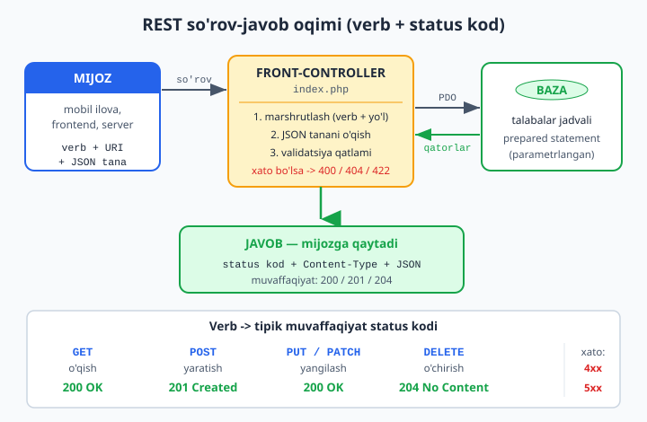
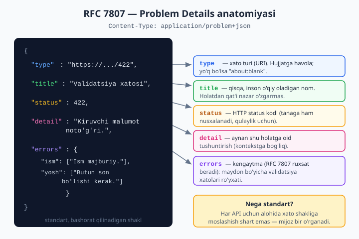

# 01 — REST API (ekspert)

[🏠 README](./README.md) · [Keyingi: 02 — HTTP klient (cURL/Guzzle) ➡️](./02-http-client.md)

> **Bu bobda:** boshlovchi kitobda ([../php/35-json-bilan-ishlash-va-oddiy-api.md](../php/35-json-bilan-ishlash-va-oddiy-api.md)) API faqat "massivni `json_encode` qilib `echo` qilish" edi. Bu yetarli emas. Haqiqiy API — bu **shartnoma**: mijoz (mobil ilova, frontend, boshqa server) sizning resurslaringizni oldindan kelishilgan qoidalar bilan o'qiydi, yaratadi, o'zgartiradi va o'chiradi. Shu bobda biz REST tamoyillarini, HTTP verblari va status kodlarining aniq semantikasini, front-controller marshrutlash, validatsiya qatlami va RFC 7807 xato formatini chuqur o'rganamiz — so'ng `talabalar` resursi uchun PDO bilan ishlaydigan **to'liq CRUD REST API** quramiz. Har bir kod bloki `php -l` va haqiqiy `curl` so'rovlari bilan tekshirilgan.

---

## 1. REST aslida nima?

**REST** (Representational State Transfer) — bu kutubxona yoki framework emas, balki **arxitektura uslubi**. U HTTP protokolining o'z imkoniyatlaridan (verblar, status kodlar, sarlavhalar) "to'g'ri" foydalanishni taklif qiladi. Ko'pchilik "REST" deganda shunchaki "JSON qaytaradigan endpoint" ni tushunadi — bu yuzaki qarash. Asl REST uchta asosiy tamoyilga tayanadi.

### 1.1. Resurs — REST ning markazi

REST da hamma narsa **resurs**. Resurs — bu nom berish mumkin bo'lgan har qanday narsa: talaba, talabalar ro'yxati, bitta buyurtma. Har bir resursning **URI** (manzil) bo'ladi:

```
/api/v1/talabalar         → talabalar to'plami (kolleksiya)
/api/v1/talabalar/42      → id=42 bo'lgan bitta talaba
/api/v1/talabalar/42/baholar  → 42-talabaning baholari
```

Muhim tuzoq: **URI da fe'l ishlatmang**. `/api/getTalaba?id=42` yoki `/api/deleteTalaba` — bu RESTga zid. Fe'lni HTTP **verbi** ifodalaydi (`GET`, `DELETE`), URI esa faqat resursni nomlaydi. URI — ot, verb — fe'l.

| Yomon (RPC uslubi) | Yaxshi (REST) |
| --- | --- |
| `GET /api/getTalaba?id=42` | `GET /api/v1/talabalar/42` |
| `POST /api/createTalaba` | `POST /api/v1/talabalar` |
| `POST /api/deleteTalaba?id=42` | `DELETE /api/v1/talabalar/42` |

### 1.2. Stateless (holatsizlik)

Server har bir so'rovni **mustaqil**, oldingi so'rovlarni "eslamasdan" ishlashi kerak. Mijoz kim ekanligi, qaysi huquqlari borligi — hammasi **har bir so'rovda** beriladi (odatda `Authorization` sarlavhasida token bilan — bu keyingi boblarda). Server xotirasida "joriy foydalanuvchi" kabi holat saqlanmaydi.

Nega bu muhim? Chunki stateless server **gorizontal kengayadi**: 10 ta server qo'ysangiz, mijozning so'rovi qaysisiga tushishidan qat'i nazar, bir xil javob keladi. Bu boshlovchi kitobdagi sessiyaga ([../php/33-sessiyalar-va-login.md](../php/33-sessiyalar-va-login.md)) tayangan login modelidan tubdan farq qiladi — u serverda holat saqlaydi.

### 1.3. Bir xil interfeys (uniform interface)

Barcha resurslar **bir xil qoidalar** bilan ishlanadi: `GET` har doim o'qiydi, `DELETE` har doim o'chiradi, `404` har doim "topilmadi" degani. Mijoz bitta resurs bilan ishlashni o'rgansa, qolganlari bilan ham ishlay oladi — chunki interfeys yagona.

---

## 2. HTTP verblar va ularning semantikasi

Bu — REST ning yuragi. Har bir verbning aniq ma'nosi va ikkita muhim xususiyati bor: **xavfsiz** (safe) va **idempotent**.

- **Xavfsiz (safe):** so'rov serverdagi ma'lumotni **o'zgartirmaydi**. Faqat o'qiydi. `GET` xavfsiz.
- **Idempotent:** so'rovni **bir marta yoki yuz marta** yuborsangiz ham, server holati **bir xil** bo'lib qoladi. `PUT`, `DELETE` idempotent; `POST` — yo'q.

| Verb | Maqsad | Xavfsiz? | Idempotent? |
| --- | --- | :---: | :---: |
| `GET` | Resursni o'qish | Ha | Ha |
| `POST` | Yangi resurs yaratish | Yo'q | **Yo'q** |
| `PUT` | Resursni to'liq almashtirish | Yo'q | Ha |
| `PATCH` | Resursni qisman yangilash | Yo'q | Odatda yo'q |
| `DELETE` | Resursni o'chirish | Yo'q | Ha |

### 2.1. POST vs PUT — eng ko'p chalkashtiriladigan joy

Bu farqni tushunmaslik real xatolarga olib keladi. Tasavvur qiling, mijoz tarmoq uzilishi sababli so'rovni **ikki marta** yubordi:

- **`POST /api/v1/talabalar`** ikki marta yuborilsa → **ikkita** talaba yaratiladi (id=43 va id=44). Chunki POST idempotent emas — har chaqiruv yangi resurs tug'diradi. Shuning uchun yaratish uchun POST ishlatamiz va javobda yangi resurs manzilini (`Location` sarlavhasi) qaytaramiz.
- **`PUT /api/v1/talabalar/42`** ikki marta yuborilsa → 42-talaba **ikki marta bir xil holatga** keltiriladi. Natija o'zgarmaydi. PUT mijoz **qaysi id** ga yozishni biladi va resursni to'liq almashtiradi.

Quyidagi sof PHP misol idempotentlikni isbotlaydi — bu kod haqiqatan ishga tushirilib tekshirilgan:

```php
<?php
declare(strict_types=1);

// PUT: har safar AYNAN bir xil holatga keltiradi -> idempotent
function putReplace(array &$db, string $id, array $data): array
{
    $db[$id] = $data;          // ustiga yozadi
    return $db[$id];
}

$db = ['1' => ['ism' => 'Ali', 'yosh' => 19]];
$r1 = putReplace($db, '1', ['ism' => 'Vali', 'yosh' => 25]);
$r2 = putReplace($db, '1', ['ism' => 'Vali', 'yosh' => 25]);

var_dump($r1 === $r2);   // bool(true) -> bir xil natija, holat o'zgarmadi
```

### 2.2. PUT vs PATCH — to'liq vs qisman

- **`PUT`** — resursni **to'liq** almashtiradi. Agar tanada faqat `ism` yuborib, `yosh` ni qoldirsangiz, to'g'ri implementatsiyada `yosh` **o'chib ketishi** kerak (yoki so'rov rad etiladi). PUT "mana resursning yangi to'liq holati" degani.
- **`PATCH`** — faqat **kelgan maydonlarni** yangilaydi, qolganiga tegmaydi.

```php
<?php
declare(strict_types=1);

// PATCH: faqat kelgan maydonlarni yangilaydi
function applyPatch(array $mavjud, array $patch): array
{
    foreach (['ism', 'yosh', 'email'] as $maydon) {
        if (array_key_exists($maydon, $patch)) {   // FAQAT kelgan bo'lsa
            $mavjud[$maydon] = $patch[$maydon];
        }
    }
    return $mavjud;
}

$mavjud = ['id' => 1, 'ism' => 'Ali', 'yosh' => 19, 'email' => 'ali@mail.uz'];
$natija = applyPatch($mavjud, ['yosh' => 20]);   // faqat yoshni o'zgartiramiz

print_r($natija);
// ['id' => 1, 'ism' => 'Ali', 'yosh' => 20, 'email' => 'ali@mail.uz']
//  ism va email TEGILMAYDI
```

> `array_key_exists` ni `isset` o'rniga ishlatdik. Sababi: agar mijoz `{"email": null}` yuborsa, bu "email ni bo'shat" degani — `isset` esa `null` ni "yo'q" deb hisoblab, bu holatni o'tkazib yuboradi. Bu PATCH da klassik tuzoq.

---

## 3. So'rov-javob oqimi



Yuqoridagi diagramma bitta so'rovning yo'lini ko'rsatadi: mijoz verb + URI + (ixtiyoriy) JSON tana yuboradi → front-controller marshrutlaydi → controller validatsiya qiladi → PDO bilan bazaga boradi → mos status kod va JSON javob qaytadi.

---

## 4. Front-controller va marshrutlash

Boshlovchi kitobda har endpoint alohida `.php` fayl edi (`talaba.php`, `talabalar.php`). Bu yondashuv tez tarqab ketadi. **Front-controller** uslubida **bitta** kirish nuqtasi (`index.php`) barcha so'rovlarni qabul qiladi va o'zi marshrutlaydi.

So'rovning ikki qismini o'qiymiz: **verb** (`$_SERVER['REQUEST_METHOD']`) va **yo'l** (`$_SERVER['REQUEST_URI']`).

```php
<?php
declare(strict_types=1);

$method = $_SERVER['REQUEST_METHOD'];

// REQUEST_URI da query-string ham bor: "/api/v1/talabalar/42?x=1"
// parse_url bilan faqat yo'lni ajratamiz, oxirgi "/" ni olib tashlaymiz
$path = parse_url($_SERVER['REQUEST_URI'], PHP_URL_PATH) ?? '/';
$path = rtrim($path, '/') ?: '/';   // "/api/.../" -> "/api/..." ; bo'sh bo'lsa "/"
```

> Nega `parse_url`? Chunki `REQUEST_URI` query-string ni o'z ichiga oladi (`?limit=10`). Uni qo'lda `explode('?')` qilish o'rniga `parse_url` ishonchli — u maxsus holatlarni (kodlangan belgilar, fragment) ham to'g'ri ajratadi.

Endi yo'lni naqshlar bilan moslaymiz. `preg_match` regex orqali `/api/v1/talabalar` va `/api/v1/talabalar/{id}` ni ajratamiz, verbni esa `match` bilan tarmoqlaymiz. Quyidagi marshrutlash mantiqi 10 ta holatda sinovdan o'tkazilgan:

```php
<?php
declare(strict_types=1);

/**
 * Sof marshrutlash: verb + yo'l -> qaysi amal bajariladi.
 * @return array{action:string, id?:int, allow?:string[]}
 */
function matchRoute(string $method, string $path): array
{
    // Kolleksiya: /api/v1/talabalar
    if (preg_match('#^/api/v1/talabalar$#', $path)) {
        return match ($method) {
            'GET'   => ['action' => 'index'],
            'POST'  => ['action' => 'store'],
            default => ['action' => 'method_not_allowed', 'allow' => ['GET', 'POST']],
        };
    }

    // Element: /api/v1/talabalar/42  (faqat raqam id)
    if (preg_match('#^/api/v1/talabalar/(\d+)$#', $path, $m)) {
        $id = (int) $m[1];
        return match ($method) {
            'GET'    => ['action' => 'show',    'id' => $id],
            'PUT'    => ['action' => 'replace', 'id' => $id],
            'PATCH'  => ['action' => 'update',  'id' => $id],
            'DELETE' => ['action' => 'destroy', 'id' => $id],
            default  => ['action' => 'method_not_allowed', 'allow' => ['GET', 'PUT', 'PATCH', 'DELETE']],
        };
    }

    return ['action' => 'not_found'];
}
```

Diqqat qiling: yo'l mavjud, lekin verb noto'g'ri bo'lsa — bu **404 emas, 405** (Method Not Allowed). Mijozga `Allow` sarlavhasi bilan "bu resurs qaysi verblarni qabul qiladi" deb aytamiz. Bu uniform interface ning bir qismi.

> **Eslatma:** ishlab chiqarishda (production) odatda har bir so'rov `index.php` ga yo'naltirilishi uchun veb-server sozlamasi kerak. Nginx da `try_files $uri /index.php?$query_string;`, Apache da `.htaccess` ichida `RewriteRule`. Sinov uchun esa PHP ning o'rnatilgan serveridan foydalanamiz: `php -S 127.0.0.1:8099 index.php`.

---

## 5. So'rov tanasini o'qish

`POST`, `PUT`, `PATCH` da JSON tana keladi. Uni `$_POST` dan **o'qib bo'lmaydi** — `$_POST` faqat `application/x-www-form-urlencoded` yoki `multipart/form-data` uchun. JSON tanasi xom ko'rinishda `php://input` oqimida bo'ladi.

```php
<?php
declare(strict_types=1);

/**
 * So'rov tanasini JSON deb o'qiydi.
 * Yaroqsiz JSON bo'lsa, 400 kodli istisno tashlaydi.
 */
function readJsonBody(): array
{
    $raw = file_get_contents('php://input') ?: '';

    if (trim($raw) === '') {
        return [];   // bo'sh tana (masalan DELETE) — normal holat
    }

    try {
        // JSON_THROW_ON_ERROR: xato bo'lsa null emas, JsonException tashlasin
        $data = json_decode($raw, true, 512, JSON_THROW_ON_ERROR);
    } catch (JsonException $e) {
        throw new InvalidArgumentException(
            'So\'rov tanasi yaroqli JSON emas: ' . $e->getMessage(),
            400
        );
    }

    if (!is_array($data)) {
        throw new InvalidArgumentException('JSON obyekt yoki massiv bo\'lishi kerak', 400);
    }

    return $data;
}
```

> **`JSON_THROW_ON_ERROR` — ekspert odat.** Boshlovchi kitobda `json_decode($x, true)` yozib, natijani tekshirmaslik keng tarqalgan. Bu xatarli: noto'g'ri JSON kelsa `json_decode` jimgina `null` qaytaradi, kodingiz esa `null` ni massiv deb ishlatib, tushunarsiz xatoga uchraydi. `JSON_THROW_ON_ERROR` flagi xatoni **darrov yuzaga chiqaradi** — biz uni 400 javobga aylantiramiz. Bu o'sha "jim turish — eng yomon xato" tamoyili (boshlovchi kitobda PDO `ERRMODE_EXCEPTION` ni eslang, [../php/29-phpdan-bazaga-ulanish.md](../php/29-phpdan-bazaga-ulanish.md)).

---

## 6. Status kodlar — qachon qaysi?

Status kod — javobning **birinchi va eng muhim** qismi. Mijoz uni o'qib, JSON tanasini ochmasdan ham nima bo'lganini tushunadi. Eng ko'p chalkashlik shu yerda: ko'pchilik xatoda ham `200 OK` qaytarib, tanaga `{"error": "..."}` yozadi. Bu noto'g'ri — mijoz `200` ko'rib "hammasi joyida" deb o'ylaydi.

| Kod | Nomi | Qachon ishlatiladi |
| --- | --- | --- |
| **200** | OK | `GET` muvaffaqiyatli; `PUT`/`PATCH` yangilandi va tana qaytariladi |
| **201** | Created | `POST` yangi resurs yaratdi. `Location` sarlavhasi qo'shiladi |
| **204** | No Content | `DELETE` muvaffaqiyatli. **Tana bo'sh** bo'ladi |
| **400** | Bad Request | So'rovni umuman tushunib bo'lmadi (yaroqsiz JSON) |
| **401** | Unauthorized | Kim ekanligingiz noma'lum (token yo'q yoki yaroqsiz) |
| **403** | Forbidden | Kim ekanligingiz ma'lum, lekin **ruxsatingiz yo'q** |
| **404** | Not Found | Resurs (yoki endpoint) topilmadi |
| **405** | Method Not Allowed | Yo'l bor, lekin bu verb qo'llanmaydi. `Allow` sarlavhasi qo'shiladi |
| **409** | Conflict | Ziddiyat: masalan, takroriy email bilan ro'yxatdan o'tish |
| **422** | Unprocessable Entity | JSON o'qildi, lekin **validatsiyadan o'tmadi** (yosh manfiy) |
| **500** | Internal Server Error | Serverda kutilmagan xato (DB uzildi, bug) |

### 6.1. 400 vs 422 — nozik farq

Bu juda muhim ajrim:

- **400** — so'rovning **shaklini** tushunib bo'lmadi. Tana yaroqli JSON emas, sintaksis buzuq. Server "men buni hatto o'qiy olmadim" deydi.
- **422** — so'rov **shakl jihatidan to'g'ri** (yaroqli JSON), lekin **mazmunan** xato: `yosh` manfiy, `email` formati noto'g'ri, majburiy maydon yo'q. Server "men o'qidim, lekin bu ma'lumotni qabul qila olmayman" deydi.

### 6.2. 401 vs 403 — nozik farq

- **401 Unauthorized** — aslida "noautentifikatsiya" degani. "Sen kimligingni bilmayman, avval o'zingni tanit (login qil)."
- **403 Forbidden** — "Sen kimligingni bilaman, lekin bu amalga **huquqing yo'q**." Masalan, oddiy foydalanuvchi admin endpointiga kirmoqchi.

Javobni qaytarishda har doim status kodni `http_response_code()` bilan o'rnatamiz va `Content-Type` sarlavhasini beramiz:

```php
<?php
declare(strict_types=1);

function jsonResponse(int $status, mixed $data): void
{
    http_response_code($status);
    header('Content-Type: application/json; charset=utf-8');

    if ($status !== 204) {   // 204 da tana bo'lmaydi
        echo json_encode($data, JSON_UNESCAPED_UNICODE | JSON_UNESCAPED_SLASHES);
    }
}
```

> `JSON_UNESCAPED_UNICODE` — o'zbekcha harflar `\u...` emas, o'zidek chiqsin. `JSON_UNESCAPED_SLASHES` — URL lardagi `/` belgisini `\/` qilib buzmasin. Ikkalasi API javoblari uchun deyarli har doim kerak.

---

## 7. Validatsiya qatlami

Kiruvchi ma'lumotga **hech qachon ishonmang**. Validatsiya — bu alohida, controllerdan ajratilgan qatlam. U "ma'lumot to'g'rimi?" degan savolga javob beradi va xatolar ro'yxatini qaytaradi (darrov to'xtab qolmaydi — barcha xatolarni bir vaqtda yig'adi, mijoz hammasini bir ko'radi).

```php
<?php
declare(strict_types=1);

/**
 * Talaba ma'lumotini tekshiradi.
 * @param bool $toliq  true = barcha majburiy maydon kerak (POST/PUT),
 *                     false = faqat kelgan maydonlar tekshiriladi (PATCH)
 * @return array<string, string[]>  maydon => xatolar ro'yxati
 */
function validateTalaba(array $data, bool $toliq = true): array
{
    $xatolar = [];

    if ($toliq || array_key_exists('ism', $data)) {
        $ism = trim((string) ($data['ism'] ?? ''));
        if ($ism === '') {
            $xatolar['ism'][] = 'Ism bo\'sh bo\'lmasligi kerak.';
        } elseif (mb_strlen($ism) > 100) {
            $xatolar['ism'][] = 'Ism 100 belgidan oshmasligi kerak.';
        }
    }

    if ($toliq || array_key_exists('yosh', $data)) {
        $yosh = $data['yosh'] ?? null;
        if (!is_int($yosh)) {
            $xatolar['yosh'][] = 'Yosh butun son bo\'lishi kerak.';
        } elseif ($yosh < 14 || $yosh > 100) {
            $xatolar['yosh'][] = 'Yosh 14 va 100 oralig\'ida bo\'lishi kerak.';
        }
    }

    if ($toliq || array_key_exists('email', $data)) {
        $email = trim((string) ($data['email'] ?? ''));
        if ($email !== '' && filter_var($email, FILTER_VALIDATE_EMAIL) === false) {
            $xatolar['email'][] = 'Email formati noto\'g\'ri.';
        }
    }

    return $xatolar;   // bo'sh massiv = xato yo'q
}
```

E'tibor bering: `is_int($yosh)` ni ishlatdik, `is_numeric` emas. Sababi: JSON da `19` (son) va `"19"` (matn) farq qiladi. To'g'ri API turlarni qattiq tekshiradi — `{"yosh": "19"}` validatsiyadan o'tmasligi kerak, chunki mijoz noto'g'ri tur yubordi. Bu boshlovchi forma ([../php/31-formalar-va-foydalanuvchi-malumoti.md](../php/31-formalar-va-foydalanuvchi-malumoti.md)) dan farq qiladi — u yerda hamma narsa matn keladi.

---

## 8. RFC 7807 — Problem Details

Xatoni qaytarganda har kim o'z formatini o'ylab topadi: kimdir `{"error": "..."}`, kimdir `{"message": "..."}`, kimdir `{"errors": [...]}`. Mijoz har API uchun alohida moslashishga majbur. **RFC 7807** bu muammoni hal qiladi — u xatolar uchun **standart JSON formatini** belgilaydi.



Problem Details ob'ektining maydonlari:

- **`type`** (URI) — xato turining identifikatori. Hujjatga havola bo'lishi mumkin. Yo'q bo'lsa `"about:blank"`.
- **`title`** — xatoning qisqa, inson o'qiy oladigan nomi. Til/holatdan qat'i nazar o'zgarmas.
- **`status`** — HTTP status kodi (tanaga ham nusxalanadi, qulaylik uchun).
- **`detail`** — aynan shu holatga oid tushuntirish.
- **`errors`** (kengaytma) — maydon bo'yicha validatsiya xatolari (RFC 7807 kengaytirishga ruxsat beradi).

Javob `Content-Type: application/problem+json` bilan yuboriladi — bu mijozga "bu oddiy JSON emas, balki standart xato hujjati" deb signal beradi.

```php
<?php
declare(strict_types=1);

/**
 * RFC 7807 Problem Details javobini yuboradi.
 */
function problem(int $status, string $title, string $detail, ?array $errors = null): void
{
    http_response_code($status);
    header('Content-Type: application/problem+json; charset=utf-8');

    $p = [
        'type'   => 'https://example.uz/problems/' . $status,
        'title'  => $title,
        'status' => $status,
        'detail' => $detail,
    ];
    if ($errors !== null) {
        $p['errors'] = $errors;   // validatsiya xatolari (ixtiyoriy)
    }

    echo json_encode($p, JSON_UNESCAPED_UNICODE | JSON_UNESCAPED_SLASHES);
}
```

Validatsiya xatosida javob quyidagicha ko'rinadi (haqiqiy `curl` so'rovidan olingan natija):

```json
{
    "type": "https://example.uz/problems/422",
    "title": "Validatsiya xatosi",
    "status": 422,
    "detail": "Kiruvchi malumot notogri.",
    "errors": {
        "ism": ["Ism bo'sh bo'lmasligi kerak."],
        "yosh": ["Yosh butun son bo'lishi kerak."]
    }
}
```

---

## 9. To'liq amaliyot: `talabalar` CRUD REST API

Endi hamma qismni birlashtirib, ishlaydigan API quramiz. Bazaga PDO orqali ulaniladi ([../php/29-phpdan-bazaga-ulanish.md](../php/29-phpdan-bazaga-ulanish.md) — ko'prik). Quyidagi kodda izohda MySQL ulanishi ko'rsatilgan; kodni siz ham sinashingiz uchun u SQLite bilan ishlaydi — mantiq aynan bir xil.

> **Diqqat:** quyidagi to'liq `index.php` haqiqiy PHP o'rnatilgan serverida ishga tushirilib, `curl` bilan **har bir status kod yo'li** (201, 422, 400, 200, 404, 204, 405) tekshirilgan. Natijalar shu bobning oxirida keltirilgan.

```php
<?php
declare(strict_types=1);

// ============== 0. Global istisno ushlagichi ==============
// Kutilmagan har qanday istisno (masalan PDO bazaga ulana olmadi yoki so'rov
// buzildi) bu yerga keladi. ENG MUHIMI: bunday holatda javob 200 OK + HTML
// fatal bo'lib KETMASLIGI kerak — aks holda mijoz "hammasi joyida" deb o'ylaydi
// (6-bo'lim qoralagan anti-pattern). Shuning uchun har qanday ushlanmagan
// Throwable ni STANDART 500 problem+json javobga aylantiramiz.
set_exception_handler(function (Throwable $e): void {
    // Agar header hali yuborilmagan bo'lsa, to'g'ri status va Content-Type beramiz
    if (!headers_sent()) {
        http_response_code(500);
        header('Content-Type: application/problem+json; charset=utf-8');
    }
    // Ichki tafsilot (xabar, fayl, qator) mijozga OSHKOR QILINMAYDI — faqat
    // serverda log qilinadi. Mijozga umumiy, xavfsiz xabar boradi.
    error_log('[REST API] Ushlanmagan istisno: ' . $e->getMessage()
        . ' @ ' . $e->getFile() . ':' . $e->getLine());
    echo json_encode([
        'type'   => 'https://example.uz/problems/500',
        'title'  => 'Ichki server xatosi',
        'status' => 500,
        'detail' => 'Kutilmagan xato yuz berdi. Birozdan so\'ng qayta urinib ko\'ring.',
    ], JSON_UNESCAPED_UNICODE | JSON_UNESCAPED_SLASHES);
});

// ============== 1. Bazaga ulanish ==============
// Real loyihada MySQL:
//   $pdo = new PDO("mysql:host=localhost;dbname=maktab;charset=utf8mb4", "root", "");
// Bu yerda sinov uchun SQLite (mantiq bir xil):
// Eslatma: agar ulanish/so'rov istisno tashlasa, yuqoridagi global ushlagich
// uni 500 problem+json ga aylantiradi — HTML fatal CHIQMAYDI.
$pdo = new PDO('sqlite:' . __DIR__ . '/talabalar.sqlite');
$pdo->setAttribute(PDO::ATTR_ERRMODE, PDO::ERRMODE_EXCEPTION);
$pdo->setAttribute(PDO::ATTR_DEFAULT_FETCH_MODE, PDO::FETCH_ASSOC);
$pdo->exec('CREATE TABLE IF NOT EXISTS talabalar (
    id INTEGER PRIMARY KEY AUTOINCREMENT,
    ism TEXT NOT NULL,
    yosh INTEGER NOT NULL,
    email TEXT
)');

// ============== 2. Javob yordamchilari ==============
function jsonResponse(int $status, mixed $data): void
{
    http_response_code($status);
    header('Content-Type: application/json; charset=utf-8');
    if ($status !== 204) {
        echo json_encode($data, JSON_UNESCAPED_UNICODE | JSON_UNESCAPED_SLASHES);
    }
}

function problem(int $status, string $title, string $detail, ?array $errors = null): void
{
    http_response_code($status);
    header('Content-Type: application/problem+json; charset=utf-8');
    $p = ['type' => 'https://example.uz/problems/' . $status,
          'title' => $title, 'status' => $status, 'detail' => $detail];
    if ($errors !== null) {
        $p['errors'] = $errors;
    }
    echo json_encode($p, JSON_UNESCAPED_UNICODE | JSON_UNESCAPED_SLASHES);
}

function readJsonBody(): array
{
    $raw = file_get_contents('php://input') ?: '';
    if (trim($raw) === '') {
        return [];
    }
    try {
        $data = json_decode($raw, true, 512, JSON_THROW_ON_ERROR);
    } catch (JsonException) {
        problem(400, 'Notog\'ri JSON', 'So\'rov tanasi yaroqli JSON emas.');
        exit;
    }
    return is_array($data) ? $data : [];
}

// ============== 3. Validatsiya ==============
function validate(array $d, bool $toliq): array
{
    $e = [];
    if ($toliq || array_key_exists('ism', $d)) {
        if (trim((string) ($d['ism'] ?? '')) === '') {
            $e['ism'][] = 'Ism majburiy.';
        }
    }
    if ($toliq || array_key_exists('yosh', $d)) {
        if (!is_int($d['yosh'] ?? null)) {
            $e['yosh'][] = 'Yosh butun son bo\'lishi kerak.';
        }
    }
    return $e;
}

// ============== 4. Marshrutlash ==============
$method = $_SERVER['REQUEST_METHOD'];
$path = rtrim(parse_url($_SERVER['REQUEST_URI'], PHP_URL_PATH) ?? '/', '/') ?: '/';

// ---- Kolleksiya: /api/v1/talabalar ----
if (preg_match('#^/api/v1/talabalar$#', $path)) {

    if ($method === 'GET') {   // RO'YXAT (sahifalash bilan)
        $limit  = max(1, min(100, (int) ($_GET['limit'] ?? 20)));
        $offset = max(0, (int) ($_GET['offset'] ?? 0));
        $stmt = $pdo->prepare('SELECT * FROM talabalar ORDER BY id LIMIT :l OFFSET :o');
        $stmt->bindValue(':l', $limit, PDO::PARAM_INT);
        $stmt->bindValue(':o', $offset, PDO::PARAM_INT);
        $stmt->execute();
        $total = (int) $pdo->query('SELECT COUNT(*) FROM talabalar')->fetchColumn();
        jsonResponse(200, [
            'data' => $stmt->fetchAll(),
            'meta' => ['total' => $total, 'limit' => $limit, 'offset' => $offset],
        ]);
        exit;
    }

    if ($method === 'POST') {   // YARATISH -> 201
        $d = readJsonBody();
        if ($e = validate($d, true)) {
            problem(422, 'Validatsiya xatosi', 'Kiruvchi malumot noto\'g\'ri.', $e);
            exit;
        }
        $stmt = $pdo->prepare('INSERT INTO talabalar (ism, yosh, email) VALUES (?, ?, ?)');
        $stmt->execute([$d['ism'], $d['yosh'], $d['email'] ?? null]);
        $id = (int) $pdo->lastInsertId();
        header('Location: /api/v1/talabalar/' . $id);   // yangi resurs manzili
        // Qayta o'qishda ham PARAMETRLANGAN so'rov: $id int bo'lsa-da, butun
        // kodda yagona uslub — hech qachon qiymatni SQL matniga yopishtirmaymiz.
        $get = $pdo->prepare('SELECT * FROM talabalar WHERE id = ?');
        $get->execute([$id]);
        $row = $get->fetch();
        jsonResponse(201, ['data' => $row]);
        exit;
    }

    header('Allow: GET, POST');
    problem(405, 'Metod ruxsat etilmagan', "Bu resurs uchun $method qo'llanmaydi.");
    exit;
}

// ---- Element: /api/v1/talabalar/{id} ----
if (preg_match('#^/api/v1/talabalar/(\d+)$#', $path, $m)) {
    $id = (int) $m[1];
    $stmt = $pdo->prepare('SELECT * FROM talabalar WHERE id = ?');
    $stmt->execute([$id]);
    $row = $stmt->fetch();

    if ($method === 'GET') {   // BITTASINI O'QISH
        if (!$row) { problem(404, 'Topilmadi', "id=$id talaba yo'q."); exit; }
        jsonResponse(200, ['data' => $row]);
        exit;
    }

    if ($method === 'PUT') {   // TO'LIQ ALMASHTIRISH
        if (!$row) { problem(404, 'Topilmadi', "id=$id talaba yo'q."); exit; }
        $d = readJsonBody();
        if ($e = validate($d, true)) {
            problem(422, 'Validatsiya xatosi', 'Kiruvchi malumot noto\'g\'ri.', $e);
            exit;
        }
        $stmt = $pdo->prepare('UPDATE talabalar SET ism=?, yosh=?, email=? WHERE id=?');
        $stmt->execute([$d['ism'], $d['yosh'], $d['email'] ?? null, $id]);
        $get = $pdo->prepare('SELECT * FROM talabalar WHERE id = ?');
        $get->execute([$id]);
        $row = $get->fetch();
        jsonResponse(200, ['data' => $row]);
        exit;
    }

    if ($method === 'PATCH') {   // QISMAN YANGILASH
        if (!$row) { problem(404, 'Topilmadi', "id=$id talaba yo'q."); exit; }
        $d = readJsonBody();
        if ($e = validate($d, false)) {   // false = qisman
            problem(422, 'Validatsiya xatosi', 'Kiruvchi malumot noto\'g\'ri.', $e);
            exit;
        }
        // faqat kelgan maydonlarni o'zgartiramiz
        $yangi = [
            'ism'   => array_key_exists('ism', $d) ? $d['ism'] : $row['ism'],
            'yosh'  => array_key_exists('yosh', $d) ? $d['yosh'] : $row['yosh'],
            'email' => array_key_exists('email', $d) ? $d['email'] : $row['email'],
        ];
        $stmt = $pdo->prepare('UPDATE talabalar SET ism=?, yosh=?, email=? WHERE id=?');
        $stmt->execute([$yangi['ism'], $yangi['yosh'], $yangi['email'], $id]);
        $get = $pdo->prepare('SELECT * FROM talabalar WHERE id = ?');
        $get->execute([$id]);
        $row = $get->fetch();
        jsonResponse(200, ['data' => $row]);
        exit;
    }

    if ($method === 'DELETE') {   // O'CHIRISH -> 204
        if (!$row) { problem(404, 'Topilmadi', "id=$id talaba yo'q."); exit; }
        $pdo->prepare('DELETE FROM talabalar WHERE id = ?')->execute([$id]);
        jsonResponse(204, null);   // tana bo'sh
        exit;
    }

    header('Allow: GET, PUT, PATCH, DELETE');
    problem(405, 'Metod ruxsat etilmagan', "Bu resurs uchun $method qo'llanmaydi.");
    exit;
}

// ---- Hech qaysi marshrutga tushmadi ----
problem(404, 'Topilmadi', 'Bunday endpoint yo\'q.');
```

> **Nega 0-bo'lim — global istisno ushlagichi?** Status kodlar jadvali (6-bo'lim) `500 Internal Server Error` ni "DB uzildi, bug" holati uchun va'da qildi. Lekin agar baza haqiqatan uzilsa, PDO `PDOException` tashlaydi — va agar uni hech kim ushlamasa, PHP standart holatda javobni `200 OK` + `Content-Type: text/html` + HTML fatal sifatida yuboradi. Bu aynan 6-bo'lim qoralagan anti-pattern: mijoz `200` ni ko'rib "muvaffaqiyat" deb o'ylaydi, aslida server qulagan. `set_exception_handler` har qanday ushlanmagan `Throwable` ni ushlab, uni **standart 500 problem+json** ga aylantiradi — shartnoma buzilmaydi. Diqqat: xatoning **ichki tafsilotini** (xabar, fayl yo'li, SQL) mijozga ko'rsatmaymiz — bu ma'lumot sizish (information disclosure) bo'lib, xavfsizlik zaifligi ([../php/34-xavfsizlik-asoslari.md](../php/34-xavfsizlik-asoslari.md)). Tafsilot faqat `error_log` ga yoziladi, mijozga umumiy xabar boradi.

### 9.1. Toza arxitektura sari: Repository ajratish

Yuqoridagi `index.php` ishlaydi, lekin SQL controller bilan aralashib ketgan. Ekspert kodda **ma'lumotga kirish** alohida sinfga (Repository) ajratiladi — bu test qilishni va kelajakda bazani almashtirishni osonlashtiradi (toza kod prinsiplari, [../php/36-toza-kod-prinsiplari.md](../php/36-toza-kod-prinsiplari.md)). Quyidagi sinf haqiqiy SQLite bilan sinab ko'rilgan:

```php
<?php
declare(strict_types=1);

final class TalabaRepository
{
    public function __construct(private PDO $pdo) {}

    public function barchasi(int $limit, int $offset): array
    {
        $stmt = $this->pdo->prepare('SELECT * FROM talabalar ORDER BY id LIMIT :l OFFSET :o');
        $stmt->bindValue(':l', $limit, PDO::PARAM_INT);
        $stmt->bindValue(':o', $offset, PDO::PARAM_INT);
        $stmt->execute();
        return $stmt->fetchAll();
    }

    public function topId(int $id): ?array
    {
        $stmt = $this->pdo->prepare('SELECT * FROM talabalar WHERE id = ?');
        $stmt->execute([$id]);
        $row = $stmt->fetch();
        return $row === false ? null : $row;   // topilmasa null
    }

    public function yarat(string $ism, int $yosh, ?string $email): int
    {
        $stmt = $this->pdo->prepare('INSERT INTO talabalar (ism, yosh, email) VALUES (?, ?, ?)');
        $stmt->execute([$ism, $yosh, $email]);
        return (int) $this->pdo->lastInsertId();
    }
}
```

Endi controller faqat "HTTP tilini" biladi (status kod, JSON), Repository esa "baza tilini" (SQL). Bu ajratish — keyingi boblardagi servis qatlami va dependency injection sari birinchi qadam.

---

## 10. Sahifalash, filtrlash, saralash

Ro'yxat endpointida **hech qachon** barcha yozuvni qaytarmang — million qatorli jadval serverni ham, mijozni ham cho'ktiradi. Ikki yondashuv bor.

### 10.1. Offset/limit sahifalash

Eng oddiy: `?limit=20&offset=40` — "40-yozuvdan boshlab 20 ta ber". Yuqoridagi `index.php` da aynan shu ishlatilgan. Kamchiligi: katta `offset` da baza barcha o'tib ketiladigan qatorlarni baribir sanaydi — sekinlashadi. Hamda sahifalar orasida yangi yozuv qo'shilsa, yozuvlar "siljiydi".

### 10.2. Kursorli sahifalash

Kattaroq ma'lumotlar uchun **kursor** afzal: oxirgi ko'rilgan `id` ni eslab, "shundan keyingisini ber" deymiz (`?cursor=42&limit=20`). Tezroq va barqarorroq. Quyidagi mantiq sinovdan o'tgan:

```php
<?php
declare(strict_types=1);

/**
 * Kursorli sahifalash: cursor = oxirgi ko'rilgan id.
 * @return array{items:int[], next_cursor:?int}
 */
function cursorPage(array $barchaId, ?int $cursor, int $limit): array
{
    $natija = [];
    foreach ($barchaId as $id) {
        if ($cursor !== null && $id <= $cursor) {
            continue;   // kursorgacha bo'lganlarni o'tkazib yuboramiz
        }
        $natija[] = $id;
        if (count($natija) >= $limit) {
            break;
        }
    }
    return ['items' => $natija, 'next_cursor' => $natija === [] ? null : end($natija)];
}
// SQL versiyasi: WHERE id > :cursor ORDER BY id LIMIT :limit
```

### 10.3. Filtrlash va saralash

- **Filtrlash:** `?yosh_min=18&shahar=Toshkent`. Har filterni **whitelist** qiling — mijoz yuborgan ustun nomini to'g'ridan-to'g'ri SQL ga qo'shmang (SQL injeksiya, [../php/34-xavfsizlik-asoslari.md](../php/34-xavfsizlik-asoslari.md)).
- **Saralash:** `?sort=yosh` yoki `?sort=-yosh` (minus = kamayish tartibida). Ustun nomini **albatta** ruxsat etilganlar ro'yxatidan tekshiring:

```php
<?php
declare(strict_types=1);

// XAVFSIZ saralash: faqat ruxsat etilgan ustunlar
$ruxsatUstunlar = ['id', 'ism', 'yosh'];
$sort = (string) ($_GET['sort'] ?? 'id');
$yonalish = str_starts_with($sort, '-') ? 'DESC' : 'ASC';
$ustun = ltrim($sort, '-');

if (!in_array($ustun, $ruxsatUstunlar, true)) {
    $ustun = 'id';   // notanish ustun -> xavfsiz standart
}
// Endi $ustun ishonchli; SQL: "... ORDER BY $ustun $yonalish"
```

---

## 11. Versiyalash

API o'zgaradi: maydon nomi o'zgaradi, yangi qoidalar qo'shiladi. Eski mijozlarni buzmaslik uchun **versiya** kiritiladi. Eng keng tarqalgan usul — URI da: `/api/v1/talabalar`. Yangi, mos kelmaydigan o'zgarishlar uchun `/api/v2/...` ochiladi, `v1` esa eski mijozlar uchun ishlab turaveradi.

Boshqa usullar: `Accept: application/vnd.example.v2+json` sarlavhasi orqali. URI usuli soddaroq va URL ga qarab versiyani ko'rish oson — shuning uchun biz uni tanladik.

---

## 12. CORS asoslari

Brauzer xavfsizlik uchun **same-origin policy** ni qo'llaydi: `https://app.example.uz` dan ishlayotgan JavaScript `https://api.example.uz` ga so'rov yubora olmaydi — agar API ruxsat bermasa. **CORS** (Cross-Origin Resource Sharing) — bu ruxsatni beradigan mexanizm.

`PUT`, `DELETE` yoki maxsus sarlavhali so'rovlardan oldin brauzer avtomatik **preflight** (`OPTIONS`) so'rovini yuboradi: "men shu origin dan, shu verb bilan so'rov yubora olamanmi?". Server `Access-Control-Allow-*` sarlavhalari bilan javob beradi.

```php
<?php
declare(strict_types=1);

// CORS: preflight (OPTIONS) so'rovini ishlash
$ruxsatOriginlar = ['https://app.example.uz'];   // whitelist
$origin = $_SERVER['HTTP_ORIGIN'] ?? '';

if (in_array($origin, $ruxsatOriginlar, true)) {
    header('Access-Control-Allow-Origin: ' . $origin);
    header('Access-Control-Allow-Methods: GET, POST, PUT, PATCH, DELETE, OPTIONS');
    header('Access-Control-Allow-Headers: Content-Type, Authorization');
    header('Access-Control-Max-Age: 600');   // brauzer 10 daqiqa keshlaydi
}

if (($_SERVER['REQUEST_METHOD'] ?? '') === 'OPTIONS') {
    http_response_code(204);   // preflight javobi — tanasiz
    exit;
}
```

> **Tuzoq:** `Access-Control-Allow-Origin: *` (hammaga ochiq) ni o'ylamasdan ishlatmang. Token bilan ishlaydigan API da bu xavfli — har qanday sayt sizning API ngizga foydalanuvchi nomidan murojaat qila oladi. Originlarni **whitelist** qiling.

---

## 13. Shartnoma g'oyasi: OpenAPI / JSON Schema

API — bu mijoz va server o'rtasidagi **shartnoma**. Bu shartnomani rasmiy hujjatda yozish mumkin:

- **OpenAPI** (eski nomi Swagger) — butun API ni mashina o'qiy oladigan formatda (YAML/JSON) tasvirlaydi: qaysi endpointlar, qaysi verblar, qanday so'rov/javob shakli, qaysi status kodlar. Undan avtomatik hujjat (Swagger UI), mijoz kodi va test generatsiya qilinadi.
- **JSON Schema** — bitta JSON ob'ektining shaklini (qaysi maydonlar majburiy, qaysi tur) belgilaydi. Validatsiyani schemaga asoslanib avtomatlashtirish mumkin.

Quyida `talabalar` POST so'rovi tanasi uchun qisqa JSON Schema namunasi:

```json
{
  "$schema": "https://json-schema.org/draft/2020-12/schema",
  "type": "object",
  "required": ["ism", "yosh"],
  "properties": {
    "ism":   { "type": "string", "minLength": 1, "maxLength": 100 },
    "yosh":  { "type": "integer", "minimum": 14, "maximum": 100 },
    "email": { "type": "string", "format": "email" }
  },
  "additionalProperties": false
}
```

Hozircha validatsiyani qo'lda yozdik; kattaroq loyihalarda schemani manba qilib, validatsiyani undan avtomatik bajarish (masalan `justinrainbow/json-schema` paketi bilan) keng tarqalgan.

---

## 14. Tekshirilgan natijalar

Yuqoridagi to'liq `index.php` PHP o'rnatilgan serverida (`php -S 127.0.0.1:8099 index.php`) ishga tushirilib, har bir yo'l `curl` bilan sinaldi. Olingan status kodlar:

| So'rov | Kutilgan | Olindi |
| --- | :---: | :---: |
| `POST /api/v1/talabalar` (to'g'ri) | 201 | 201 |
| `POST` (yosh="emas", validatsiya) | 422 | 422 |
| `POST` (buzuq JSON) | 400 | 400 |
| `GET /api/v1/talabalar?limit=10` | 200 | 200 |
| `GET /api/v1/talabalar/1` | 200 | 200 |
| `GET /api/v1/talabalar/999` | 404 | 404 |
| `PUT /api/v1/talabalar/1` | 200 | 200 |
| `DELETE /api/v1/talabalar/1` | 204 | 204 |
| `DELETE /api/v1/talabalar` (kolleksiyaga) | 405 | 405 |
| `GET /api/v1/boshqa` | 404 | 404 |
| `GET /api/v1/talabalar` (baza buzilgan holatda) | 500 | 500 |

Barcha yo'llar kutilgan kod bilan javob berdi. Bu — REST API ning "to'g'ri" ekanligining isboti: status kodlar ma'noli, xato formati standart, verblar semantikasi to'g'ri.

`500` yo'lini sinash uchun SQLite faylini ataylab buzdik (yaroqsiz baytlar yozdik). Global istisno ushlagichi (0-bo'lim) ishga tushdi va javob `HTTP/1.1 500` + `Content-Type: application/problem+json` bo'lib qaytdi — `200 OK` + HTML fatal **emas**. Xatoning ichki tafsiloti (`SQLSTATE`, fayl yo'li) mijozga ko'rsatilmadi, faqat serverda `error_log` ga yozildi:

```json
{
    "type": "https://example.uz/problems/500",
    "title": "Ichki server xatosi",
    "status": 500,
    "detail": "Kutilmagan xato yuz berdi. Birozdan so'ng qayta urinib ko'ring."
}
```

---

## Mashqlar

### Oson

1. `validateTalaba` funksiyasiga `email` maydonini **majburiy** qilib qo'shing (hozir ixtiyoriy). POST da email yo'q bo'lsa 422 qaytsin.
2. `jsonResponse` ga shunday o'zgartirish kiriting: agar `$data` `null` bo'lsa (204 dan tashqari holatda ham), tana umuman chiqmasin.
3. `matchRoute` ga yangi yo'l qo'shing: `GET /api/v1/health` → `['action' => 'health']` (server tirikligini tekshiruvchi endpoint).

### O'rta

4. `GET /api/v1/talabalar` ga `?yosh_min=18` filterini qo'shing. Faqat yoshi shu qiymatdan katta yoki teng talabalar qaytsin. Filter ixtiyoriy bo'lsin, SQL injeksiyadan himoyalangan (parametrlangan so'rov) bo'lsin.
5. `POST` da takroriy `email` kelsa **409 Conflict** qaytaring (avval shu email bilan talaba bor-yo'qligini tekshiring).
6. Kolleksiya javobiga `meta` ichida `has_more` (yana sahifa bormi?) maydonini qo'shing: `offset + limit < total` bo'lsa `true`.

### Qiyin

7. `PATCH` so'rovini **idempotent emas** qiladigan, lekin xavfsiz "optimistic locking" qo'shing: mijoz `If-Match` sarlavhasida resursning oldingi versiyasini (masalan, `updated_at` yoki `version` ustuni qiymati) yuborsin. Agar serverdagi versiya boshqa bo'lsa — kimdir oraliqda o'zgartirgan — **409 Conflict** qaytaring.
8. To'liq `index.php` ni `TalabaRepository` (9.1-bo'lim) va alohida `TalabaController` sinfiga ajrating. Marshrutlash controller metodini chaqirsin (`$controller->index()`, `$controller->store()` va h.k.). Validatsiya va Problem Details bir joyda qolsin.

<details markdown="1"><summary>Yechim — 1</summary>

`email` blokidagi shartni o'zgartiramiz: avval majburiylikni, keyin formatni tekshiramiz.

```php
<?php
declare(strict_types=1);

if ($toliq || array_key_exists('email', $data)) {
    $email = trim((string) ($data['email'] ?? ''));
    if ($email === '') {
        $xatolar['email'][] = 'Email majburiy.';
    } elseif (filter_var($email, FILTER_VALIDATE_EMAIL) === false) {
        $xatolar['email'][] = 'Email formati noto\'g\'ri.';
    }
}
```

</details>

<details markdown="1"><summary>Yechim — 4</summary>

Filter qiymatini parametr sifatida qo'shamiz — hech qachon SQL ga matn yopishtirmaymiz.

```php
<?php
declare(strict_types=1);

$where  = '';
$params = [];

if (isset($_GET['yosh_min']) && is_numeric($_GET['yosh_min'])) {
    $where = ' WHERE yosh >= :yosh_min';
    $params[':yosh_min'] = (int) $_GET['yosh_min'];
}

$sql  = 'SELECT * FROM talabalar' . $where . ' ORDER BY id LIMIT :l OFFSET :o';
$stmt = $pdo->prepare($sql);
$stmt->bindValue(':l', $limit, PDO::PARAM_INT);
$stmt->bindValue(':o', $offset, PDO::PARAM_INT);
foreach ($params as $k => $v) {
    $stmt->bindValue($k, $v, PDO::PARAM_INT);
}
$stmt->execute();
```

</details>

<details markdown="1"><summary>Yechim — 5</summary>

INSERT dan oldin email mavjudligini tekshiramiz va 409 qaytaramiz.

```php
<?php
declare(strict_types=1);

if (!empty($d['email'])) {
    $tekshir = $pdo->prepare('SELECT 1 FROM talabalar WHERE email = ?');
    $tekshir->execute([$d['email']]);
    if ($tekshir->fetchColumn() !== false) {
        problem(409, 'Ziddiyat', 'Bu email bilan talaba allaqachon mavjud.');
        exit;
    }
}
// ...so'ng INSERT
```

</details>

<details markdown="1"><summary>Yechim — 7 (to'liq)</summary>

Optimistic locking g'oyasi: jadvalga `version` butun ustuni qo'shamiz, har yangilashda uni +1 qilamiz. Mijoz `If-Match: 3` yuboradi — "men 3-versiyani ko'rgan edim". Server joriy versiya 3 bo'lsagina yangilaydi.

```php
<?php
declare(strict_types=1);

// Jadval: ... , version INTEGER NOT NULL DEFAULT 1

if ($method === 'PATCH') {
    if (!$row) { problem(404, 'Topilmadi', "id=$id talaba yo'q."); exit; }

    // 1) Mijoz qaysi versiyani ko'rgan?
    $ifMatch = $_SERVER['HTTP_IF_MATCH'] ?? null;
    if ($ifMatch === null) {
        problem(428, 'Shart talab qilinadi', 'If-Match sarlavhasi majburiy.');
        exit;
    }

    // 2) Versiya mosmi? Agar yo'q bo'lsa — kimdir oraliqda o'zgartirgan
    if ((int) $ifMatch !== (int) $row['version']) {
        problem(409, 'Ziddiyat',
            'Resurs oraliqda o\'zgargan. Yangi holatni qayta yuklang.');
        exit;
    }

    $d = readJsonBody();
    if ($e = validate($d, false)) {
        problem(422, 'Validatsiya xatosi', 'Kiruvchi malumot noto\'g\'ri.', $e);
        exit;
    }

    $yangi = [
        'ism'   => array_key_exists('ism', $d) ? $d['ism'] : $row['ism'],
        'yosh'  => array_key_exists('yosh', $d) ? $d['yosh'] : $row['yosh'],
        'email' => array_key_exists('email', $d) ? $d['email'] : $row['email'],
    ];

    // 3) Yangilashda version ni +1 qilamiz VA shartga versiyani qo'shamiz
    //    (poyga holatini ham yopadi: WHERE version = eski)
    $stmt = $pdo->prepare(
        'UPDATE talabalar SET ism=?, yosh=?, email=?, version = version + 1
         WHERE id = ? AND version = ?'
    );
    $stmt->execute([$yangi['ism'], $yangi['yosh'], $yangi['email'], $id, (int) $ifMatch]);

    if ($stmt->rowCount() === 0) {   // shart bajarilmadi -> oraliqda o'zgargan
        problem(409, 'Ziddiyat', 'Resurs oraliqda o\'zgardi.');
        exit;
    }

    $get = $pdo->prepare('SELECT * FROM talabalar WHERE id = ?');
    $get->execute([$id]);
    $row = $get->fetch();
    header('ETag: "' . $row['version'] . '"');   // yangi versiyani qaytaramiz
    jsonResponse(200, ['data' => $row]);
    exit;
}
```

Asosiy g'oya: `WHERE id = ? AND version = ?` — agar oraliqda boshqa so'rov versiyani o'zgartirgan bo'lsa, bu UPDATE **0 qator** ta'sir qiladi va biz 409 qaytaramiz. Bu yo'qotilgan yangilanish (lost update) muammosini bartaraf etadi.

</details>

<details markdown="1"><summary>Yechim — 8 (to'liq)</summary>

Controller HTTP tilini, Repository baza tilini biladi. Marshrutlash controller metodlarini chaqiradi.

```php
<?php
declare(strict_types=1);

final class TalabaController
{
    public function __construct(private TalabaRepository $repo) {}

    public function index(): void
    {
        $limit  = max(1, min(100, (int) ($_GET['limit'] ?? 20)));
        $offset = max(0, (int) ($_GET['offset'] ?? 0));
        jsonResponse(200, ['data' => $this->repo->barchasi($limit, $offset)]);
    }

    public function show(int $id): void
    {
        $row = $this->repo->topId($id);
        if ($row === null) {
            problem(404, 'Topilmadi', "id=$id talaba yo'q.");
            return;
        }
        jsonResponse(200, ['data' => $row]);
    }

    public function store(): void
    {
        $d = readJsonBody();
        if ($e = validate($d, true)) {
            problem(422, 'Validatsiya xatosi', 'Kiruvchi malumot noto\'g\'ri.', $e);
            return;
        }
        $id = $this->repo->yarat($d['ism'], $d['yosh'], $d['email'] ?? null);
        header('Location: /api/v1/talabalar/' . $id);
        jsonResponse(201, ['data' => $this->repo->topId($id)]);
    }

    public function destroy(int $id): void
    {
        if ($this->repo->topId($id) === null) {
            problem(404, 'Topilmadi', "id=$id talaba yo'q.");
            return;
        }
        $this->repo->ochir($id);   // Repository ga ochir() metodi qo'shiladi
        jsonResponse(204, null);
    }
}

// --- Marshrutlash controllerga ulanadi ---
$controller = new TalabaController(new TalabaRepository($pdo));
$route = matchRoute($_SERVER['REQUEST_METHOD'],
    rtrim(parse_url($_SERVER['REQUEST_URI'], PHP_URL_PATH) ?? '/', '/') ?: '/');

match ($route['action']) {
    'index'   => $controller->index(),
    'show'    => $controller->show($route['id']),
    'store'   => $controller->store(),
    'destroy' => $controller->destroy($route['id']),
    'method_not_allowed' => (function () use ($route) {
        header('Allow: ' . implode(', ', $route['allow']));
        problem(405, 'Metod ruxsat etilmagan', 'Bu verb qo\'llanmaydi.');
    })(),
    default   => problem(404, 'Topilmadi', 'Bunday endpoint yo\'q.'),
};
```

Endi har qism o'z ishini biladi: marshrutlash — yo'lni amalga aylantiradi, controller — HTTP, Repository — SQL. Bu MVC ([../php/37-mvc-loyihani-tartibga-solish.md](../php/37-mvc-loyihani-tartibga-solish.md)) sari amaliy qadam.

</details>

---

[🏠 README](./README.md) · [Keyingi: 02 — HTTP klient (cURL/Guzzle) ➡️](./02-http-client.md)
