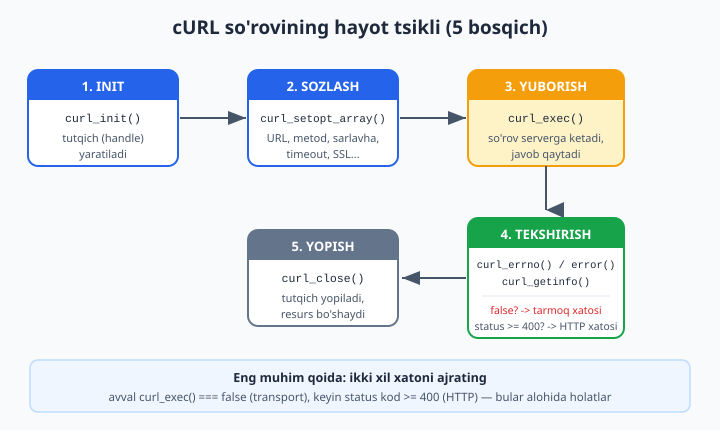
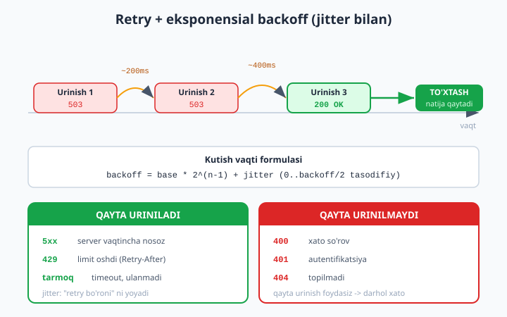

# 02 — HTTP klient: cURL va Guzzle

[⬅️ Oldingi: 01 — REST API](./01-rest-api.md) · [🏠 README](./README.md) · [Keyingi: 03 — Authorization va RBAC ➡️](./03-authorization-rbac.md)

> **Bu bobda:** o'tgan bobda siz **server** bo'ldingiz — boshqalar sizning API ngizga so'rov yubordi. Endi rol almashadi: sizning PHP kodingiz **mijoz** (client) bo'lib, boshqa serverlarga so'rov yuboradi. To'lov tizimi (Payme, Click), SMS shlyuzi (Eskiz, Play Mobile), ob-havo, valyuta kurslari, geolokatsiya — bularning hammasi tashqi HTTP API orqali ishlaydi. Boshlovchi kitobda ([../php/35-json-bilan-ishlash-va-oddiy-api.md](../php/35-json-bilan-ishlash-va-oddiy-api.md)) biz faqat JSON **qaytarishni** o'rgandik; tashqi xizmatdan JSON **olib kelishni** umuman ko'rmaganmiz. Bu bobda biz native `cURL` ni boshidan oxirigacha (init, setopt, exec, getinfo, error, close), so'ng zamonaviy **Guzzle** (PSR-18) klientini, ishonchlilik naqshlarini (timeout, retry + eksponensial backoff, circuit-breaker) va webhook qabul qilib HMAC imzosini timing-safe tekshirishni o'rganamiz. Har bir kod bloki `php -l` bilan tekshirilgan, asosiy misollar **haqiqiy** ochiq API (Markaziy Bank kurslari) ga so'rov yuborib sinab ko'rilgan.

---

## 1. Nega umuman tashqi API chaqiriladi?

Hech bir jiddiy dastur "yolg'iz orol" emas. Ko'pchilik real funksiya boshqa birovning serverida yashaydi:

| Vazifa | Tashqi xizmat | Siz yuborasiz | Qaytaradi |
| --- | --- | --- | --- |
| To'lov qabul qilish | Payme, Click, Stripe | summa, karta tokeni | tranzaksiya holati |
| SMS yuborish | Eskiz, Play Mobile | telefon, matn | yuborildi/xato |
| Valyuta kursi | Markaziy Bank API | (yoki valyuta kodi) | kurs raqami |
| Ob-havo | OpenWeather | shahar/koordinata | harorat, namlik |
| Manzilni koordinataga | Yandex/Google Geocoding | manzil matni | lat/lng |

Bularni o'zingiz yozolmaysiz — bankning to'lov tizimini qaytadan qurish mantiqsiz. Demak sizning serveringiz **boshqa serverga HTTP so'rov yuborishi** kerak. Bu — "server tomonidan server-ga so'rov" (server-to-server). Brauzerdagi `fetch()` dan farqi: bu yerda **PHP jarayoni** mijoz rolida ishlaydi, CORS yo'q, lekin tarmoq, timeout va xavfsizlik o'zingizning yelkangizda.

> **Asosiy ogohlantirish — tashqi chaqiruv ishonchsiz.** O'z bazangizga so'rov yuborganda (PDO, [../php/29-phpdan-bazaga-ulanish.md](../php/29-phpdan-bazaga-ulanish.md)) deyarli har doim millisekundlarda javob keladi. Tashqi API esa sekin bo'lishi, javob bermasligi, 500 qaytarishi yoki yarim javob yuborishi mumkin. Shuning uchun bu bobning yarmi **kod yozish**, yarmi esa **xato bo'lganda nima qilish** haqida.

---

## 2. Native cURL: poydevor

PHP da HTTP so'rov yuborishning eng quyi va eng keng tarqalgan yo'li — `cURL` kengaytmasi (`ext-curl`). Guzzle ham, Symfony HttpClient ham ich-ichida ko'pincha aynan cURL ni chaqiradi. Shuning uchun avval poydevorni tushunamiz — keyin abstraksiya nimani yashirayotganini bilib turasiz.

cURL so'rovi har doim **bir xil hayot tsikli** bilan ishlaydi:



1. `curl_init()` — yangi "tutqich" (handle) yaratadi.
2. `curl_setopt()` / `curl_setopt_array()` — so'rovni sozlaydi (URL, metod, sarlavhalar, timeout...).
3. `curl_exec()` — so'rovni **yuboradi** va javobni qaytaradi.
4. `curl_getinfo()` / `curl_errno()` / `curl_error()` — natijani tekshiradi.
5. `curl_close()` — tutqichni yopadi va resursni bo'shatadi.

### 2.1. Eng oddiy GET

```php
<?php
declare(strict_types=1);

$ch = curl_init();                                  // 1. tutqich
curl_setopt($ch, CURLOPT_URL, 'https://cbu.uz/uz/arkhiv-kursov-valyut/json/USD/');
curl_setopt($ch, CURLOPT_RETURNTRANSFER, true);     // javobni QAYTAR (echo qilma!)

$body = curl_exec($ch);                             // 3. yubor
$status = curl_getinfo($ch, CURLINFO_HTTP_CODE);    // 4. status kod
curl_close($ch);                                    // 5. yop

echo "Status: {$status}\n";
echo $body;
```

> **Eng ko'p qilinadigan birinchi xato:** `CURLOPT_RETURNTRANSFER` ni unutish. U `true` bo'lmasa, `curl_exec()` javobni **to'g'ridan-to'g'ri ekranga chop etadi** va `false`/`true` qaytaradi — siz esa `$body` da javob bor deb o'ylab turasiz. Har doim `RETURNTRANSFER => true` qo'ying.

### 2.2. `curl_setopt_array` — o'qiladigan yo'l

Har bir optsiyani alohida `curl_setopt()` qatori bilan yozish — uzun va xato. `curl_setopt_array()` bilan hammasini bitta massivda beramiz. Quyida — **ishlab chiqarishga yaroqli** GET yordamchisi. Har bir optsiyaning nega kerakligi izohda:

```php
<?php
declare(strict_types=1);

/**
 * Native cURL bilan GET. Status va tanani qaytaradi yoki istisno tashlaydi.
 *
 * @return array{status:int, body:string}
 */
function httpGet(string $url, int $timeout = 10): array
{
    $ch = curl_init();
    curl_setopt_array($ch, [
        CURLOPT_URL            => $url,
        CURLOPT_RETURNTRANSFER => true,   // javobni qaytar, ekranga chiqarma
        CURLOPT_FOLLOWLOCATION => true,   // 301/302 yo'naltirishlarni kuzat
        CURLOPT_MAXREDIRS      => 3,      // cheksiz redirect tsiklidan himoya
        CURLOPT_CONNECTTIMEOUT => 5,      // ULANISH uchun maks 5s
        CURLOPT_TIMEOUT        => $timeout, // BUTUN so'rov uchun maks 10s
        CURLOPT_SSL_VERIFYPEER => true,   // SSL sertifikatni TEKSHIR (xavfsizlik!)
        CURLOPT_SSL_VERIFYHOST => 2,      // sertifikat domeni mos kelishini tekshir
        CURLOPT_HTTPHEADER     => ['Accept: application/json'],
        CURLOPT_USERAGENT      => 'php-expert-client/1.0',
    ]);

    $body = curl_exec($ch);

    // Transport darajasidagi xato: DNS topilmadi, ulanish uzildi, timeout...
    if ($body === false) {
        $errno = curl_errno($ch);
        $error = curl_error($ch);
        curl_close($ch);
        throw new RuntimeException("Tarmoq xatosi ({$errno}): {$error}");
    }

    $status = (int) curl_getinfo($ch, CURLINFO_HTTP_CODE);
    curl_close($ch);

    return ['status' => $status, 'body' => $body];
}
```

Eng muhim optsiyalarni alohida ko'rib chiqamiz, chunki bu yerda real tuzoqlar yashiringan.

### 2.3. Ikki xil timeout — `CONNECTTIMEOUT` vs `TIMEOUT`

Bu ikkisini ko'pchilik chalkashtiradi:

- **`CURLOPT_CONNECTTIMEOUT`** — TCP/TLS **ulanishi** o'rnatilishi uchun maksimal vaqt. Server umuman javob bermayotgan bo'lsa, shu vaqtdan keyin to'xtaydi.
- **`CURLOPT_TIMEOUT`** — **butun** so'rov (ulanish + ma'lumot uzatish) uchun maksimal vaqt.

> **Tuzoq:** timeout umuman qo'ymaslik — eng xavfli xato. Standart holatda cURL **cheksiz** kutishi mumkin. Tashqi API osilib qolsa, sizning PHP-FPM ishchisingiz ham o'sha so'rovda osilib qoladi. Bir nechta sekin tashqi so'rov butun saytni "yotqizishi" mumkin. **Har doim ikkala timeout ni ham qo'ying.**

### 2.4. `SSL_VERIFYPEER` — uni HECH QACHON o'chirmang

Internetda ko'p "yechim" da SSL xatosini shunday "tuzatish" maslahat beriladi:

```php
// ❌ HECH QACHON BUNDAY QILMANG — bu xavfsizlikni butunlay o'chiradi
curl_setopt($ch, CURLOPT_SSL_VERIFYPEER, false);
curl_setopt($ch, CURLOPT_SSL_VERIFYHOST, false);
```

Bu — "qulfni ochib qo'yib, o'g'ri kirmasin" deganga o'xshaydi. `VERIFYPEER => false` bilan har qanday o'rtadagi hujumchi (MITM) o'zini "bank serveri" qilib ko'rsata oladi va siz to'lov ma'lumotini **unga** yuborasiz. Asl muammo odatda eskirgan CA sertifikatlar to'plamidir — uni `php.ini` da `curl.cainfo` orqali yangi `cacert.pem` ga yo'naltirib hal qiling, tekshiruvni o'chirib emas.

### 2.5. `curl_exec` `false` qaytdi vs status 4xx/5xx — ikki xil xato

Bu **eng muhim tushuncha** bu bo'limda. cURL da ikki **butunlay alohida** xato turi bor:

| Tur | Qachon | Qanday bilamiz |
| --- | --- | --- |
| **Transport xatosi** | DNS topilmadi, ulanmadi, timeout, SSL nosoz | `curl_exec()` → `false`, `curl_errno() > 0` |
| **HTTP xatosi** | Ulandik, lekin server `404`/`500` qaytardi | `curl_exec()` → tana (string), `curl_getinfo(...HTTP_CODE)` ≥ 400 |

`404` yoki `500` — bu cURL uchun **xato emas**. Server javob berdi-ku, demak so'rov "muvaffaqiyatli" yetib bordi. Shuning uchun har doim **ikkala** holatni ham tekshirish kerak: avval `$body === false` mi, keyin status kod 2xx mi.

```php
<?php
declare(strict_types=1);

require __DIR__ . '/http_get.php'; // yuqoridagi httpGet()

try {
    $res = httpGet('https://cbu.uz/uz/arkhiv-kursov-valyut/json/USD/');

    // HTTP darajasidagi tekshiruv
    if ($res['status'] < 200 || $res['status'] >= 300) {
        throw new RuntimeException("API muvaffaqiyatsiz status qaytardi: {$res['status']}");
    }

    // JSON ni xavfsiz parse qilamiz (JSON_THROW_ON_ERROR — xato bo'lsa istisno)
    $data = json_decode($res['body'], true, 512, JSON_THROW_ON_ERROR);

    $usd = $data[0]; // CBU USD endpointi bitta elementli massiv qaytaradi
    echo "1 USD = {$usd['Rate']} so'm (sana: {$usd['Date']}, o'zgarish: {$usd['Diff']})\n";

} catch (JsonException $e) {
    // Server JSON o'rniga HTML xato sahifasi qaytargan bo'lishi mumkin
    echo "Javobni o'qib bo'lmadi: {$e->getMessage()}\n";
} catch (RuntimeException $e) {
    echo "So'rov xatosi: {$e->getMessage()}\n";
}
```

Bu kod **haqiqatan ishlaydi** — Markaziy Bank API si quyidagicha javob qaytaradi:

```
1 USD = 12054.03 so'm (sana: 11.06.2026, o'zgarish: 18.81)
```

> **Tuzoq — redirect va JSON.** Yuqorida `FOLLOWLOCATION => true` qo'ydik. Agar uni qo'ymasangiz va API `301` qaytarsa, `curl_exec()` HTML li `<html>...</html>` redirect sahifasini qaytaradi, `json_decode()` esa "Syntax error" tashlaydi. Sinov paytida aynan shu yuz berdi — `FOLLOWLOCATION` qo'shilgach hal bo'ldi.

### 2.6. POST — JSON tanasi bilan

Tashqi API ga ma'lumot yuborish (to'lov, SMS) odatda `POST` orqali, tanasi JSON bo'ladi. Bu yerda uchta narsa muhim: `CURLOPT_POST => true`, JSON ni `CURLOPT_POSTFIELDS` ga qo'yish va `Content-Type: application/json` sarlavhasi.

```php
<?php
declare(strict_types=1);

/**
 * Native cURL bilan JSON tanali POST.
 *
 * @param array<string,mixed> $payload  JSON ga aylantiriladigan ma'lumot
 * @param array<int,string>   $headers  Qo'shimcha sarlavhalar (masalan Authorization)
 * @return array{status:int, body:string}
 */
function httpPostJson(string $url, array $payload, array $headers = [], int $timeout = 10): array
{
    // JSON_THROW_ON_ERROR: kodlanmasa istisno tashlaydi (jim false qaytarmaydi)
    $json = json_encode($payload, JSON_THROW_ON_ERROR);

    $ch = curl_init();
    curl_setopt_array($ch, [
        CURLOPT_URL            => $url,
        CURLOPT_RETURNTRANSFER => true,
        CURLOPT_POST           => true,        // metod = POST
        CURLOPT_POSTFIELDS     => $json,       // tana = JSON satri
        CURLOPT_CONNECTTIMEOUT => 5,
        CURLOPT_TIMEOUT        => $timeout,
        CURLOPT_SSL_VERIFYPEER => true,
        CURLOPT_HTTPHEADER     => array_merge([
            'Content-Type: application/json',
            'Accept: application/json',
            'Content-Length: ' . strlen($json),
        ], $headers),
    ]);

    $body = curl_exec($ch);
    if ($body === false) {
        $err = curl_error($ch);
        curl_close($ch);
        throw new RuntimeException("cURL POST xatosi: {$err}");
    }
    $status = (int) curl_getinfo($ch, CURLINFO_HTTP_CODE);
    curl_close($ch);

    return ['status' => $status, 'body' => $body];
}

// Foydalanish (masalan, SMS yuborish API si):
$res = httpPostJson('https://api.example.com/sms/send', [
    'phone'   => '998901234567',
    'message' => 'Tasdiqlash kodi: 4821',
], headers: ['Authorization: Bearer SIZNING_TOKENINGIZ']);

echo "SMS API status: {$res['status']}\n";
```

> **Nuance — `POSTFIELDS` massiv bo'lsa.** Agar `CURLOPT_POSTFIELDS` ga **massiv** bersangiz (string emas), cURL uni `multipart/form-data` deb yuboradi va `Content-Type` ni o'zi o'zgartiradi. JSON yuborish uchun **albatta** avval `json_encode()` qilib, **string** bering. Bu ko'p uchraydigan adashish.

`PUT`/`PATCH`/`DELETE` uchun `CURLOPT_POST` o'rniga `CURLOPT_CUSTOMREQUEST => 'PUT'` ishlatiladi (tana baribir `POSTFIELDS` da beriladi).

---

## 3. Guzzle: zamonaviy yo'l (PSR-18)

Native cURL ishlaydi, lekin u **past darajali**: har safar `setopt`, qo'lda xato tekshiruvi, JSON ni qo'lda kodlash. Real loyihalarda buning o'rniga **Guzzle** ishlatiladi — PHP olamida HTTP klientning amaldagi standarti. U PSR-7 (so'rov/javob obyektlari) va PSR-18 (klient interfeysi) standartlariga amal qiladi.

O'rnatish (boshlovchi kitobdagi Composer bobi — [../php/39-composer-tashqi-kutubxonalar.md](../php/39-composer-tashqi-kutubxonalar.md)):

```bash
composer require guzzlehttp/guzzle
```

### 3.1. Guzzle bilan GET — bir necha qator

Yuqoridagi cURL ning butun GET yordamchisi Guzzle da shunchaki:

```php
<?php
declare(strict_types=1);

require __DIR__ . '/vendor/autoload.php';

use GuzzleHttp\Client;
use GuzzleHttp\Exception\RequestException;
use GuzzleHttp\Exception\ConnectException;

$client = new Client([
    'base_uri' => 'https://cbu.uz',
    'timeout'  => 10.0,   // butun so'rov timeouti (sekundlarda)
]);

try {
    $response = $client->request('GET', '/uz/arkhiv-kursov-valyut/json/USD/', [
        'headers' => ['Accept' => 'application/json'],
    ]);

    $status = $response->getStatusCode();           // int, masalan 200
    $body   = (string) $response->getBody();         // javob tanasi (string)
    $data   = json_decode($body, true, 512, JSON_THROW_ON_ERROR);

    echo "Status: {$status}\n";
    echo "1 USD = {$data[0]['Rate']} so'm\n";

} catch (ConnectException $e) {
    // Tarmoq/ulanish darajasidagi xato (cURL ning $body===false ekvivalenti)
    echo "Ulanib bo'lmadi: {$e->getMessage()}\n";
} catch (RequestException $e) {
    // 4xx/5xx (standart sozlamada Guzzle bularda istisno tashlaydi)
    $code = $e->hasResponse() ? $e->getResponse()->getStatusCode() : 0;
    echo "So'rov xatosi (status {$code}): {$e->getMessage()}\n";
}
```

Bu kod ham **haqiqatan sinaldi** va `1 USD = 12054.03 so'm` qaytardi.

> **Muhim farq cURL dan:** Guzzle standart holatda `4xx`/`5xx` status kodlarida **istisno tashlaydi** (`http_errors => true`). cURL esa `404` ni "muvaffaqiyat" deb hisoblardi. Demak Guzzle da status kodni qo'lda tekshirish shart emas — `try/catch` yetarli. Agar istisnosiz, faqat status olishni xohlasangiz: optsiyaga `'http_errors' => false` qo'shing.

### 3.2. Guzzle optsiyalari — eng foydalilari

Guzzle ning kuchi — `request()` ning ikkinchi argumentidagi optsiyalar massivi. Eng ko'p ishlatiladiganlari:

```php
<?php
declare(strict_types=1);

use GuzzleHttp\Client;

$client = new Client(['timeout' => 10]);

// 'query' — URL ga ?from=USD&to=EUR qo'shadi (qo'lda yopishtirish shart emas)
$client->request('GET', 'https://api.example.com/rates', [
    'query' => ['from' => 'USD', 'to' => 'EUR'],
]);

// 'json' — massivni avtomatik json_encode qiladi VA Content-Type: application/json qo'yadi
$client->request('POST', 'https://api.example.com/sms', [
    'json'    => ['phone' => '998901234567', 'message' => 'Salom'],
    'headers' => ['Authorization' => 'Bearer TOKEN'],
    'timeout' => 5,
]);

// 'form_params' — oddiy HTML forma ko'rinishidagi POST (application/x-www-form-urlencoded)
$client->request('POST', 'https://api.example.com/login', [
    'form_params' => ['username' => 'ali', 'password' => 'maxfiy'],
]);
```

`'json' => [...]` — bu cURL dagi `json_encode` + `Content-Type` + `Content-Length` ning hammasini bitta qatorda bajaradi. Aynan shuning uchun Guzzle real loyihalarda afzal: kamroq kod, kamroq xato.

### 3.3. Javobni o'qish — `getStatusCode` va `getBody`

Guzzle javobi — PSR-7 `ResponseInterface` obyekti:

```php
$response = $client->request('GET', '/uz/arkhiv-kursov-valyut/json/USD/');

$response->getStatusCode();                  // 200 (int)
$response->getReasonPhrase();                // "OK"
$response->getHeaderLine('Content-Type');    // "application/json"
(string) $response->getBody();               // tana (string ga aylantirib o'qiymiz)
```

> **Tuzoq — `getBody()` bir martalik oqim.** `getBody()` PSR-7 oqimini qaytaradi. Uni `(string)` ga aylantirsangiz to'liq o'qiladi, lekin **ikkinchi marta** o'qisangiz bo'sh chiqishi mumkin (kursor oxirida). Yechimi — bir marta o'zgaruvchiga oling: `$body = (string) $response->getBody();` va keyin shuni ishlating.

### 3.4. Symfony HttpClient — qisqa eslatma

Guzzle yagona variant emas. Symfony ekotizimida **`symfony/http-client`** ishlatiladi (Laravel esa o'zining `Http` fasadini Guzzle ustiga quradi). Sintaksisi biroz farq qiladi, lekin g'oyasi bir xil:

```php
<?php
declare(strict_types=1);

use Symfony\Component\HttpClient\HttpClient;

$client = HttpClient::create();

$response = $client->request('GET', 'https://cbu.uz/uz/arkhiv-kursov-valyut/json/USD/', [
    'timeout' => 10,
]);

$status = $response->getStatusCode();    // 200
$data   = $response->toArray();          // JSON ni avtomatik massivga aylantiradi
```

`toArray()` — Symfony ning qulayligi: JSON ni o'zi parse qiladi. Tanlovingiz odatda **loyiha ekotizimiga** bog'liq: Laravel/mustaqil — Guzzle, Symfony — HttpClient. Ikkalasi ham PSR-18 ga mos, almashtirilishi qiyin emas.

---

## 4. Ishonchlilik naqshlari

Endi eng muhim qismga keldik. Yuqoridagi kod **hammasi yaxshi ketganda** ishlaydi. Real hayotda tashqi API: sekinlashadi, vaqtincha `503` qaytaradi, bir soniya javob bermaydi, keyin yana tiklanadi. Professional kod bularga **tayyor** bo'ladi.

### 4.1. Timeout — eng birinchi himoya

Buni allaqachon ko'rdik, lekin takrorlash arziydi: **timeout yo'q kod — buzilgan kod**. Tashqi so'rovga har doim chegara qo'ying. Qaysi qiymat? Odatda 5-10 sekund; foydalanuvchi kutib turgan so'rovlar uchun kamroq (2-3s), fon (background) vazifalar uchun ko'proq bo'lishi mumkin.

### 4.2. Retry + eksponensial backoff

Tarmoq vaqtinchalik "chayqaladi". `503 Service Unavailable` yoki `429 Too Many Requests` — ko'pincha **bir lahzalik** holat. Darhol taslim bo'lish o'rniga, biroz kutib **qayta urinish** kerak. Lekin uchta nozik qoida bor:

1. **Hammasini qayta urinmang.** `404` (topilmadi), `400` (xato so'rov), `401` (autentifikatsiya) — bularni qayta urinish foydasiz, faqat `5xx` va `429` ni qayta uriniladi.
2. **Eksponensial backoff** — har urinishda kutish vaqtini ikki barobar oshiring: 200ms → 400ms → 800ms. Aks holda yiqilgan serverni so'rovlar bilan yana "bombardimon" qilasiz.
3. **Jitter** (tasodifiy qo'shimcha) — agar 1000 ta klient bir vaqtda bir xil backoff bilan qayta ursa, ular yana **bir vaqtda** keladi ("retry bo'roni"). Kichik tasodifiy qo'shimcha buni yoyadi.



```php
<?php
declare(strict_types=1);

/**
 * So'rovni qayta urinish bilan bajaradi: eksponensial backoff + jitter.
 * Faqat 5xx va 429 status kodlari yoki tarmoq istisnolari qayta uriniladi.
 *
 * @param callable():int $attempt Bitta urinish; status kodni qaytaradi yoki istisno tashlaydi.
 */
function withRetry(callable $attempt, int $maxRetries = 3, float $baseMs = 200.0): int
{
    $tries = 0;

    while (true) {
        $tries++;
        try {
            $status = $attempt();

            // Muvaffaqiyat yoki "qayta urinib bo'lmaydigan" xato -> darhol qaytaramiz
            if ($status < 500 && $status !== 429) {
                return $status;
            }
            $lastReason = "status {$status}";

        } catch (RuntimeException $e) {
            // Tarmoq darajasidagi xato (timeout, ulanmadi) -> qayta urinishga arziydi
            $lastReason = $e->getMessage();
        }

        // Urinishlar tugadimi?
        if ($tries > $maxRetries) {
            throw new RuntimeException("Qayta urinish tugadi ({$tries} marta): {$lastReason}");
        }

        // backoff = base * 2^(n-1):  200, 400, 800 ...
        $backoff = $baseMs * (2 ** ($tries - 1));
        // jitter: 0 dan backoff/2 gacha tasodifiy qo'shimcha
        $jitter  = random_int(0, (int) ($backoff / 2));
        $sleepMs = (int) ($backoff + $jitter);

        usleep($sleepMs * 1000); // millisekundni mikrosekundga
    }
}
```

Bu mantiqni biz **haqiqatan ishga tushirib** sinab ko'rdik (kutish o'rniga ketma-ketlikni simulyatsiya qilib):

```php
// Dastlabki 2 urinish 503, uchinchisi 200 -> yakuniy natija 200 bo'lishi kerak
$seq = [503, 503, 200];
$i = 0;
// DIQQAT: bu yerda `fn` arrow-funksiya EMAS, balki `use (..., &$i)` li closure kerak.
// Arrow-funksiya $i ni QIYMAT bo'yicha ushlaydi: $i++ tashqi $i ni o'zgartirmaydi,
// natijada har chaqiruvda $seq[0] = 503 o'qiladi va 200 ga hech qachon yetmaymiz.
// Havola (&$i) bilan esa hisoblagich haqiqatan oldinga siljiydi: 503, 503, 200.
$result = withRetry(function () use ($seq, &$i): int {
    return $seq[$i++];
}, maxRetries: 3, baseMs: 100);
echo "Yakuniy status: {$result}\n";   // 200

// 404 -> umuman qayta urinmaydi (1 marta chaqiriladi)
$calls = 0;
withRetry(function () use (&$calls): int { $calls++; return 404; });
echo "404 urinishlar soni: {$calls}\n";  // 1
```

Chiqish (haqiqiy ishga tushirishdan, PHP 8.4):

```
Yakuniy status: 200
404 urinishlar soni: 1
```

Mantiq to'g'ri: birinchi ikki urinishda `503` qaytdi, ular qayta urinildi (orada ~100ms va ~200ms backoff), uchinchi urinishda `200` kelishi bilan funksiya to'xtab `200` qaytardi; `404` esa "qayta urinib bo'lmaydigan" xato bo'lgani uchun bir martada to'xtadi (hisoblagich `1`).

### 4.3. Guzzle bilan retry — `Middleware::retry`

Guzzle da retry ni qo'lda yozish shart emas — `HandlerStack` ga middleware qo'yiladi. Bu butun klientga bir marta o'rnatiladi va har bir so'rovga avtomatik qo'llanadi:

```php
<?php
declare(strict_types=1);

require __DIR__ . '/vendor/autoload.php';

use GuzzleHttp\Client;
use GuzzleHttp\HandlerStack;
use GuzzleHttp\Middleware;
use Psr\Http\Message\RequestInterface;
use Psr\Http\Message\ResponseInterface;

$stack = HandlerStack::create();

$stack->push(Middleware::retry(
    // 1-funksiya: qayta urinish kerakmi? (true -> qayta uringin)
    function (
        int $retries,
        RequestInterface $request,
        ?ResponseInterface $response = null,
        ?Throwable $e = null
    ): bool {
        if ($retries >= 3) {
            return false;                       // urinishlar chegarasi
        }
        if ($e !== null) {
            return true;                        // tarmoq xatosi -> qayta urin
        }
        if ($response !== null && $response->getStatusCode() >= 500) {
            return true;                        // server xatosi -> qayta urin
        }
        return false;                           // 2xx/4xx -> qayta urinma
    },
    // 2-funksiya: necha ms kutish? (eksponensial: 1s, 2s, 4s)
    fn (int $retries): int => (int) (1000 * (2 ** $retries))
));

$client = new Client(['handler' => $stack, 'timeout' => 10]);

$res = $client->request('GET', 'https://cbu.uz/uz/arkhiv-kursov-valyut/json/USD/');
echo "Status: {$res->getStatusCode()}\n";   // sinaldi: 200
```

Bu kod **haqiqatan ishga tushirildi** va `Status: 200` qaytardi.

### 4.4. Circuit-breaker (qisqa asoslari)

Retry yaxshi, lekin tasavvur qiling: tashqi API **butunlay** yiqildi va 10 daqiqa ishlamaydi. Har bir so'rovda 3 marta qayta urinsak, har bir foydalanuvchi 3× timeout (masalan 30 sekund) kutadi — bu sizning serveringizni ham "bo'g'adi". Yechim — **circuit-breaker** ("avtomatik o'chirgich"):

- **Closed** (yopiq, normal): so'rovlar o'tadi. Ketma-ket bir necha xato (masalan 5 ta) bo'lsa → **Open** ga o'tadi.
- **Open** (ochiq): so'rov **umuman yuborilmaydi**, darhol xato qaytariladi (foydalanuvchi 30s kutmaydi). Bir muddat (cooldown, masalan 30s) o'tgach → **Half-open**.
- **Half-open** (yarim ochiq): bitta sinov so'rovi yuboriladi. Muvaffaqiyatli bo'lsa → **Closed**, yana xato bo'lsa → yana **Open**.

Eng oddiy ko'rinishi (xotiradagi; real loyihada holat Redis/baza da saqlanadi, chunki har bir so'rov alohida jarayon):

```php
<?php
declare(strict_types=1);

final class CircuitBreaker
{
    private int $failures = 0;
    private ?int $openedAt = null;

    public function __construct(
        private readonly int $threshold = 5,    // necha xatodan keyin "ochiladi"
        private readonly int $cooldownSec = 30, // qancha vaqt yopiq turadi
    ) {}

    /** So'rov yuborishdan oldin chaqiramiz: ochiq bo'lsa, umuman urinmaymiz. */
    public function isOpen(): bool
    {
        if ($this->openedAt === null) {
            return false;                        // hech qachon ochilmagan
        }
        if (time() - $this->openedAt >= $this->cooldownSec) {
            return false;                        // cooldown o'tdi -> half-open (sinab ko'r)
        }
        return true;                             // hali ochiq -> urinma
    }

    public function recordSuccess(): void
    {
        $this->failures = 0;
        $this->openedAt = null;                  // tiklandi -> closed
    }

    public function recordFailure(): void
    {
        $this->failures++;
        if ($this->failures >= $this->threshold) {
            $this->openedAt = time();            // chegaraga yetdi -> open
        }
    }
}
```

Foydalanish g'oyasi:

```php
$breaker = new CircuitBreaker(threshold: 5, cooldownSec: 30);

if ($breaker->isOpen()) {
    // Tashqi xizmat yiqilgan — uzoq kutmaymiz, zaxira (cache) qiymatni qaytaramiz
    throw new RuntimeException('Xizmat vaqtincha mavjud emas');
}

try {
    $res = $client->request('GET', $url);
    $breaker->recordSuccess();
} catch (Throwable $e) {
    $breaker->recordFailure();
    throw $e;
}
```

Biz bu klassni ham **sinab ko'rdik**: 3 chegarali breaker 3-xatodan keyin `isOpen() === true` bo'ldi, `recordSuccess()` dan keyin yana `false` ga qaytdi. Production da `OPcache`/Redis da holat saqlanadi — chunki har bir HTTP so'rov yangi PHP jarayoni, xotiradagi `$failures` saqlanmaydi.

---

## 5. Webhook qabul qilish va imzo tekshirish

Hozirgacha biz **so'rov yubordik**. Endi teskari yo'nalish: tashqi xizmat **sizga** so'rov yuboradi. Bu — **webhook**. Misol: to'lov tizimi "to'lov muvaffaqiyatli bo'ldi" deb sizning serveringizga `POST` qiladi. Siz buni qabul qilib, buyurtmani "to'langan" deb belgilaysiz.

Muammo: bu manzilni boshqa har kim ham biladi. Yomon niyatli odam "to'lov muvaffaqiyatli" deb **soxta** webhook yuborsa-chi? Shuning uchun har bir webhook **imzolanadi** va siz imzoni **tekshirishingiz shart**.

### 5.1. HMAC imzosi qanday ishlaydi

Yuboruvchi va siz **umumiy maxfiy kalitni** (secret) oldindan kelishasiz. Yuboruvchi har bir webhook tanasi uchun:

```
imzo = HMAC-SHA256(tana, maxfiy_kalit)
```

hisoblab, uni `X-Signature` sarlavhasida yuboradi. Siz **xuddi shu** hisobni o'zingizda bajarasiz. Agar natijalar mos kelsa — webhook haqiqatan kalitni biladigan tomondan kelgan. Kalitni bilmaganlar to'g'ri imzoni yarata olmaydi.

```php
<?php
declare(strict_types=1);

/**
 * Webhook imzosini tekshiradi (HMAC-SHA256, timing-safe).
 *
 * @param string $rawBody         So'rovning XOM tanasi (file_get_contents('php://input'))
 * @param string $signatureHeader Yuboruvchi bergan imzo, masalan "sha256=abc123..."
 * @param string $secret          Oldindan kelishilgan maxfiy kalit
 */
function verifyWebhook(string $rawBody, string $signatureHeader, string $secret): bool
{
    $expected = 'sha256=' . hash_hmac('sha256', $rawBody, $secret);

    // DIQQAT: oddiy === EMAS, hash_equals! (timing hujumidan himoya)
    return hash_equals($expected, $signatureHeader);
}
```

### 5.2. Nega `===` emas, `hash_equals`?

Bu — nozik, lekin muhim xavfsizlik nuqtasi. Oddiy `===` (yoki `strcmp`) ikkita satrni **belgi-belgi** solishtiradi va birinchi farqda **to'xtaydi**. Demak ikki imzo `aaa...` bilan boshlansa, taqqoslash uzoqroq davom etadi — ya'ni taqqoslash **vaqti** to'g'ri belgilar soniga bog'liq. Hujumchi shu vaqt farqini o'lchab, imzoni **belgi-belgi taxmin** qila oladi (timing attack).

`hash_equals()` — **doim bir xil vaqt** sarflaydigan (constant-time) taqqoslash. U vaqt orqali hech qanday ma'lumot "sizdirmaydi". Parol/token/imzo solishtirilganda **har doim** `hash_equals()` ishlating. (Bu boshlovchi kitobdagi xavfsizlik bobiga — [../php/34-xavfsizlik-asoslari.md](../php/34-xavfsizlik-asoslari.md) — qo'shimcha qatlam.)

### 5.3. To'liq webhook qabul qiluvchi (endpoint)

```php
<?php
declare(strict_types=1);

require __DIR__ . '/verify_webhook.php';

$secret = getenv('WEBHOOK_SECRET') ?: '';

// 1. XOM tanani o'qiymiz — PARSE QILISHDAN OLDIN.
//    Imzo aynan baytlar ustidan hisoblangan; $_POST orqali emas!
$rawBody = file_get_contents('php://input') ?: '';

// 2. Imzo sarlavhasini olamiz
$signature = $_SERVER['HTTP_X_SIGNATURE'] ?? '';

// 3. Tekshiramiz
if ($secret === '' || !verifyWebhook($rawBody, $signature, $secret)) {
    http_response_code(401);
    echo json_encode(['error' => 'Imzo notogri']);
    exit;
}

// 4. Endi tanaga ISHONISH mumkin — parse qilamiz
try {
    $event = json_decode($rawBody, true, 512, JSON_THROW_ON_ERROR);
} catch (JsonException) {
    http_response_code(400);
    echo json_encode(['error' => 'Yaroqsiz JSON']);
    exit;
}

// 5. Hodisani qayta ishlaymiz
if (($event['event'] ?? '') === 'payment.success') {
    $orderId = (int) ($event['order_id'] ?? 0);
    // ... buyurtmani "to'langan" deb belgilash (PDO bilan bazaga yozish)
}

// 6. Tez 200 qaytaramiz — aks holda yuboruvchi qayta-qayta yuboradi
http_response_code(200);
echo json_encode(['ok' => true]);
```

Bu mantiqni **haqiqatan ishga tushirib** sinadik. Yuboruvchi tomon imzoni `hash_hmac` bilan hisoblaydi, biz tekshiramiz:

```php
$secret = 'super-maxfiy-kalit';
$body   = '{"event":"payment.success","order_id":42}';
$validSig = 'sha256=' . hash_hmac('sha256', $body, $secret);

var_dump(verifyWebhook($body, $validSig, $secret));        // bool(true)  — to'g'ri imzo
var_dump(verifyWebhook($body, 'sha256=qalbaki', $secret)); // bool(false) — soxta imzo
var_dump(verifyWebhook($body . 'x', $validSig, $secret));  // bool(false) — tana o'zgargan
var_dump(verifyWebhook($body, $validSig, 'boshqa-kalit')); // bool(false) — kalit notog'ri
```

Natija (haqiqiy chiqish): `true`, `false`, `false`, `false` — tana, kalit yoki imzo birortasi o'zgarsa, tekshiruv darhol rad etadi.

> **Uchta webhook qoidasi:** (1) imzoni **parse qilishdan oldin**, xom tana (`php://input`) ustidan tekshiring; (2) `hash_equals` ishlating, `===` emas; (3) ish bajarilgach **tez `200`** qaytaring — ko'p webhook tizimlari `200` kelmasa, hodisani qayta-qayta yuboradi (shu sababli ishlov **idempotent** bo'lishi kerak: bir xil to'lovni ikki marta hisoblamang).

---

## 6. Native cURL vs Guzzle — qachon qaysi biri?

| Mezon | Native cURL | Guzzle |
| --- | --- | --- |
| Qo'shimcha o'rnatish | Yo'q (`ext-curl` odatda bor) | `composer require` kerak |
| Kod hajmi | Ko'p (qo'lda setopt) | Kam (optsiyalar massivi) |
| Xato boshqaruvi | Qo'lda (2 xil tekshiruv) | Istisnolar (4xx/5xx avto) |
| Retry/middleware | Qo'lda yozasiz | Tayyor `Middleware::retry` |
| PSR-18 mosligi | Yo'q | Ha (almashtirsa bo'ladi) |
| Qachon | Bitta kichik skript, minimal bog'liqlik | Har qanday jiddiy loyiha |

**Qoida:** o'rganish va tushunish uchun cURL ni biling (abstraksiya ostida nima borligini), lekin **real loyihada Guzzle** (yoki Symfony HttpClient) ishlating. Qayta urinish, timeout, PSR-18 moslik — bularning hammasi sizga tayyor keladi.

---

## Mashqlar

### Oson

1. `httpGet()` yordamchisini ishlating va Markaziy Bank API sidan (`https://cbu.uz/uz/arkhiv-kursov-valyut/json/`) **barcha** valyutalar ro'yxatini oling. Faqat `Ccy` (kod) va `Rate` (kurs) ni chop eting.
2. Yuqoridagi GET dan `CURLOPT_RETURNTRANSFER` optsiyasini olib tashlang va `php` da ishga tushiring. Nima o'zgaradi? `$body` da nima bo'ladi?
3. Guzzle ni `composer require guzzlehttp/guzzle` bilan o'rnating va 3.1-bo'limdagi GET ni ishga tushiring. Status kodni va USD kursini chop eting.

### O'rta

4. `httpPostJson()` ni shunday o'zgartiring-ki, u javob tanasini **avtomatik** `json_decode` qilib, massiv qaytarsin (status bilan birga). JSON xato bo'lsa istisno tashlasin.
5. Guzzle bilan, `'http_errors' => false` qo'yib, qasddan mavjud bo'lmagan URL ga (`/yoq-bunday-sahifa`) so'rov yuboring. Status kod nima? Istisno tashlanadimi?
6. `withRetry()` ga **`Retry-After` sarlavhasini hurmat qilish** xususiyatini qo'shing: agar `429` javobida `Retry-After: 5` bo'lsa, backoff o'rniga **aynan** 5 sekund kuting.

### Qiyin

7. `verifyWebhook()` ga **vaqt oynasi (replay) himoyasini** qo'shing: webhook tanasida `timestamp` bo'lsin; agar u 5 daqiqadan eski bo'lsa, imzo to'g'ri bo'lsa ham **rad eting** (eski webhookni qayta yuborish hujumidan himoya).
8. To'liq **ishonchli klient** klassini yozing: ichida Guzzle, retry middleware **va** circuit-breaker birga ishlasin. `get(string $url): array` metodi bo'lsin — circuit ochiq bo'lsa darhol istisno tashlasin, yopiq bo'lsa so'rov yuborib, natijani circuit holatiga yozsin.

---

<details markdown="1"><summary>Yechim — 1</summary>

```php
<?php
declare(strict_types=1);

require __DIR__ . '/http_get.php';

$res  = httpGet('https://cbu.uz/uz/arkhiv-kursov-valyut/json/');
$data = json_decode($res['body'], true, 512, JSON_THROW_ON_ERROR);

foreach ($data as $valyuta) {
    printf("%-5s = %s so'm\n", $valyuta['Ccy'], $valyuta['Rate']);
}
```

`printf` bilan `%-5s` — valyuta kodini 5 belgi kenglikda chapga tekislaydi, jadval ko'rinishida chiqadi.
</details>

<details markdown="1"><summary>Yechim — 2</summary>

`CURLOPT_RETURNTRANSFER` bo'lmasa, `curl_exec()` javobni **to'g'ridan-to'g'ri ekranga** chop etadi va `$body` ga `true` (muvaffaqiyat) yoki `false` (xato) **boolean** qaytadi — JSON satri emas. Natijada `json_decode($body)` `true` ni dekodlashga urinib `null` qaytaradi, sizning parse qilingan ma'lumotingiz yo'qoladi. Shuning uchun u **har doim** `true` bo'lishi shart.
</details>

<details markdown="1"><summary>Yechim — 4</summary>

```php
<?php
declare(strict_types=1);

/**
 * @param array<string,mixed> $payload
 * @return array{status:int, data:mixed}
 */
function httpPostJsonDecoded(string $url, array $payload, array $headers = [], int $timeout = 10): array
{
    $res  = httpPostJson($url, $payload, $headers, $timeout); // oldingi yordamchi
    $data = json_decode($res['body'], true, 512, JSON_THROW_ON_ERROR);

    return ['status' => $res['status'], 'data' => $data];
}
```

`JSON_THROW_ON_ERROR` tufayli yaroqsiz JSON (masalan server HTML xato sahifasi qaytarsa) `JsonException` tashlaydi — uni chaqiruvchi `try/catch` da tutadi.
</details>

<details markdown="1"><summary>Yechim — 5</summary>

`'http_errors' => false` bilan Guzzle `4xx`/`5xx` da **istisno tashlamaydi**. So'rov bajariladi, `$response->getStatusCode()` `404` qaytaradi. Endi status kodni **siz qo'lda** tekshirishingiz kerak:

```php
$response = $client->request('GET', 'https://cbu.uz/yoq-bunday-sahifa', [
    'http_errors' => false,
]);
echo $response->getStatusCode() . "\n"; // 404 (yoki shunga o'xshash), istisnosiz
```

Demak `http_errors => false` cURL ning standart xulqiga (404 ham "natija") qaytaradi — status kodni o'zingiz tekshirasiz.
</details>

<details markdown="1"><summary>Yechim — 6</summary>

`withRetry()` ichida urinish funksiyasi status bilan birga `Retry-After` qiymatini ham qaytarishi kerak. G'oyani soddalashtirib, urinish `array{status:int, retryAfter:?int}` qaytarsin:

```php
<?php
declare(strict_types=1);

/** @param callable():array{status:int, retryAfter:?int} $attempt */
function withRetryAfter(callable $attempt, int $maxRetries = 3, float $baseMs = 200.0): int
{
    $tries = 0;
    while (true) {
        $tries++;
        $r = $attempt();
        if ($r['status'] < 500 && $r['status'] !== 429) {
            return $r['status'];
        }
        if ($tries > $maxRetries) {
            throw new RuntimeException("Qayta urinish tugadi: status {$r['status']}");
        }
        if ($r['status'] === 429 && $r['retryAfter'] !== null) {
            $sleepMs = $r['retryAfter'] * 1000;          // serverning ko'rsatmasi — hurmat qilamiz
        } else {
            $backoff = $baseMs * (2 ** ($tries - 1));
            $sleepMs = (int) ($backoff + random_int(0, (int) ($backoff / 2)));
        }
        usleep($sleepMs * 1000);
    }
}
```

Asosiy g'oya: server `Retry-After` orqali "qachon qaytishni" aytsa, **uni hurmat qiling** — o'zingizning backoff hisobingizni emas.
</details>

<details markdown="1"><summary>Yechim — 7 (replay himoyasi)</summary>

Imzo to'g'ri bo'lishi yetarli emas: hujumchi **eski, to'g'ri imzolangan** webhookni ushlab olib, qayta yuborishi mumkin (replay attack). Himoya — tanaga `timestamp` qo'shish va uni vaqt oynasi bilan tekshirish. Imzo timestamp ni ham qamrab olgani uchun, hujumchi timestamp ni yangilab imzoni qayta hisoblay olmaydi (kalitni bilmaydi).

```php
<?php
declare(strict_types=1);

/**
 * Imzo VA vaqt oynasini tekshiradi.
 *
 * @param int $toleranceSec Ruxsat etilgan maksimal "eskirish" (sekund)
 */
function verifyWebhookFresh(
    string $rawBody,
    string $signatureHeader,
    string $secret,
    int $toleranceSec = 300
): bool {
    // 1. Imzoni tekshiramiz (timing-safe)
    $expected = 'sha256=' . hash_hmac('sha256', $rawBody, $secret);
    if (!hash_equals($expected, $signatureHeader)) {
        return false;
    }

    // 2. Tanadagi timestamp ni olamiz
    $data = json_decode($rawBody, true);
    if (!is_array($data) || !isset($data['timestamp'])) {
        return false;                         // timestamp yo'q -> rad
    }

    // 3. Vaqt oynasini tekshiramiz: hozir bilan farqi tolerance dan oshmasin
    $age = time() - (int) $data['timestamp'];
    if ($age < 0 || $age > $toleranceSec) {
        return false;                         // kelajakdan yoki juda eski -> rad
    }

    return true;
}
```

Sinov mantig'i:

```php
$secret = 'maxfiy';

// Yangi (hozirgi vaqt) — qabul qilinadi
$bodyNew = json_encode(['event' => 'payment.success', 'timestamp' => time()]);
$sigNew  = 'sha256=' . hash_hmac('sha256', $bodyNew, $secret);
var_dump(verifyWebhookFresh($bodyNew, $sigNew, $secret));  // true

// Eski (10 daqiqa oldin) — imzo TO'G'RI bo'lsa ham RAD etiladi
$bodyOld = json_encode(['event' => 'payment.success', 'timestamp' => time() - 600]);
$sigOld  = 'sha256=' . hash_hmac('sha256', $bodyOld, $secret);
var_dump(verifyWebhookFresh($bodyOld, $sigOld, $secret));  // false (eskirgan)
```

Diqqat: `$age < 0` tekshiruvi ham muhim — "kelajakdagi" timestamp (soat noto'g'ri yoki qasddan) ham shubhali, uni ham rad etamiz. Real production da bundan tashqari **idempotency** kaliti (har webhook ning yagona `id` si) bazada saqlanadi, shu bilan bir xil webhook ikki marta ishlov berilmaydi.
</details>

<details markdown="1"><summary>Yechim — 8 (to'liq ishonchli klient)</summary>

Bu yechim Guzzle, retry middleware va circuit-breaker ni bitta klassda birlashtiradi. Circuit-breaker so'rov yuborishdan **oldin** tekshiriladi (ochiq bo'lsa — tez taslim), so'rov natijasi esa breaker holatiga yoziladi.

```php
<?php
declare(strict_types=1);

require __DIR__ . '/vendor/autoload.php';

use GuzzleHttp\Client;
use GuzzleHttp\HandlerStack;
use GuzzleHttp\Middleware;
use Psr\Http\Message\RequestInterface;
use Psr\Http\Message\ResponseInterface;

final class ReliableHttpClient
{
    private Client $client;
    private int $failures = 0;
    private ?int $openedAt = null;

    public function __construct(
        private readonly int $cbThreshold = 5,
        private readonly int $cbCooldownSec = 30,
        int $maxRetries = 3,
        float $timeout = 10.0,
    ) {
        $stack = HandlerStack::create();
        $stack->push(Middleware::retry(
            function (int $retries, RequestInterface $req, ?ResponseInterface $res = null, ?Throwable $e = null) use ($maxRetries): bool {
                if ($retries >= $maxRetries) {
                    return false;
                }
                if ($e !== null) {
                    return true;                                   // tarmoq xatosi
                }
                return $res !== null && $res->getStatusCode() >= 500; // server xatosi
            },
            fn (int $retries): int => (int) (1000 * (2 ** $retries)) // 1s, 2s, 4s
        ));

        $this->client = new Client([
            'handler'     => $stack,
            'timeout'     => $timeout,
            'http_errors' => true,
        ]);
    }

    /**
     * @return array{status:int, data:mixed}
     */
    public function get(string $url): array
    {
        if ($this->isCircuitOpen()) {
            throw new RuntimeException('Circuit ochiq: tashqi xizmat vaqtincha mavjud emas');
        }

        try {
            $res  = $this->client->request('GET', $url, [
                'headers' => ['Accept' => 'application/json'],
            ]);
            $this->recordSuccess();

            $body = (string) $res->getBody();
            $data = json_decode($body, true, 512, JSON_THROW_ON_ERROR);

            return ['status' => $res->getStatusCode(), 'data' => $data];

        } catch (Throwable $e) {
            $this->recordFailure();
            throw new RuntimeException("So'rov muvaffaqiyatsiz: {$e->getMessage()}", previous: $e);
        }
    }

    private function isCircuitOpen(): bool
    {
        if ($this->openedAt === null) {
            return false;
        }
        if (time() - $this->openedAt >= $this->cbCooldownSec) {
            return false;                       // cooldown o'tdi -> half-open
        }
        return true;
    }

    private function recordSuccess(): void
    {
        $this->failures = 0;
        $this->openedAt = null;
    }

    private function recordFailure(): void
    {
        $this->failures++;
        if ($this->failures >= $this->cbThreshold) {
            $this->openedAt = time();
        }
    }
}

// Foydalanish:
$http = new ReliableHttpClient();
try {
    $result = $http->get('https://cbu.uz/uz/arkhiv-kursov-valyut/json/USD/');
    echo "Status: {$result['status']}\n";
    echo "USD: {$result['data'][0]['Rate']} so'm\n";
} catch (RuntimeException $e) {
    echo "Xato: {$e->getMessage()}\n";
}
```

**Muhim eslatma — holatni saqlash.** Bu yerda circuit holati (`$failures`, `$openedAt`) obyekt xotirasida. Bitta uzoq ishlaydigan jarayonda (masalan worker, queue consumer) bu yetarli. Lekin oddiy web-so'rovda **har bir so'rov yangi PHP jarayoni** — `$failures` saqlanmaydi. Production uchun bu holatni **Redis** yoki bazada (umumiy, jarayonlar orasida) saqlash kerak. Aks holda circuit hech qachon "ochilmaydi", chunki har so'rovda `$failures` noldan boshlanadi.

`previous: $e` orqali asl istisnoni saqlab qolish ham muhim — log da to'liq sababni ko'rasiz, "stack" yo'qolmaydi.
</details>

---

[⬅️ Oldingi: 01 — REST API](./01-rest-api.md) · [🏠 README](./README.md) · [Keyingi: 03 — Authorization va RBAC ➡️](./03-authorization-rbac.md)
