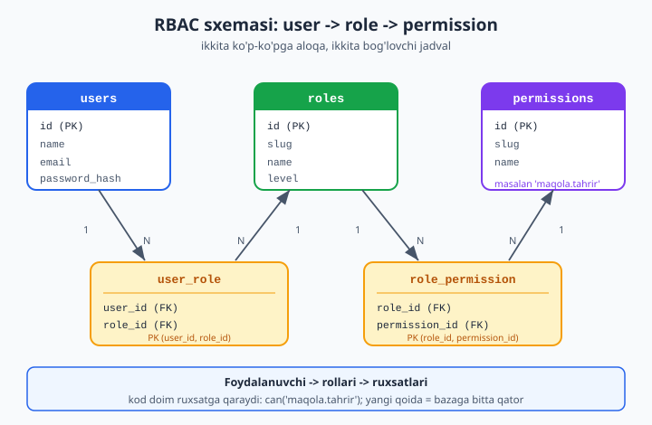
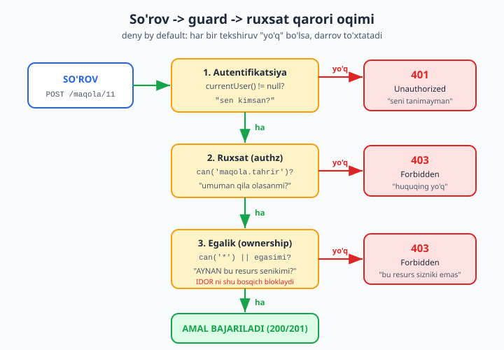

# 03 — Authorization va RBAC

[⬅️ Oldingi: 02 — HTTP klient (cURL/Guzzle)](./02-http-client.md) · [🏠 README](./README.md) · [Keyingi: 04 — JWT va stateless auth ➡️](./04-jwt-auth.md)

> **Bu bobda:** "kimsan?" (autentifikatsiya) va "nima qila olasan?" (avtorizatsiya) orasidagi tub farqni; boshlovchi kitobdagi sodda `empty($_SESSION)` tekshiruvi nega yetarli emasligini; bitta `role` ustunidan to'liq **RBAC** (Role-Based Access Control) modeliga o'tishni; `users / roles / permissions / role_permission / user_role` jadvallari sxemasini; foydalanuvchining barcha ruxsatlarini SQL bilan yig'ib `can('maqola.tahrir')` metodini qurishni; **Policy/Gate** naqshini (har resurs uchun qoida); marshrutni himoyalovchi **guard** (`requirePermission`) ni; **deny by default** va **eng kam imtiyoz** tamoyillarini; egalik (ownership) tekshiruvi orqali **IDOR / broken access control** ni oldini olishni hamda qisqacha **rol ierarxiyasi**ni o'rganamiz. Oxirida to'liq, ishlaydigan kichik RBAC tizimini quramiz. Bu bob boshlovchi kitobdagi [sessiyalar va login](../php/33-sessiyalar-va-login.md) va [xavfsizlik asoslari](../php/34-xavfsizlik-asoslari.md) boblariga tayanadi.

---

## Autentifikatsiya va avtorizatsiya: ikki boshqa savol

Ko'pchilik bu ikki so'zni aralashtirib yuboradi, holbuki ular ketma-ket javob beriladigan ikki **boshqa** savolga tegishli:

- **Autentifikatsiya** (authentication, *authn*) — **"Sen kimsan?"** Login va parol (yoki token) orqali foydalanuvchining shaxsini tasdiqlash. Natija: tizim "bu — 42-ID li Laylo" deb biladi.
- **Avtorizatsiya** (authorization, *authz*) — **"Sen nima qila olasan?"** Shaxsi tasdiqlangan foydalanuvchiga aniq bir amalga (masalan, *bu* maqolani o'chirishga) ruxsat bor-yo'qligini hal qilish.

Tartib doim shu: **avval authn, keyin authz**. Kim ekanligini bilmasdan, nima qila olishini hal qilib bo'lmaydi. Lekin shaxsi tasdiqlangan foydalanuvchi ham hamma narsani qila olmaydi — aynan shu yerda avtorizatsiya boshlanadi.

Analogiya: aeroportda **pasport nazorati** — autentifikatsiya (siz haqiqatan o'sha odammisiz). **Chiptangizdagi o'rin va biznes-klass zaliga kirish huquqi** — avtorizatsiya (qayerga borishingiz mumkin). Pasportingiz haqiqiy bo'lishi sizni avtomatik biznes-klassga kiritmaydi.

| | Autentifikatsiya (authn) | Avtorizatsiya (authz) |
|---|---|---|
| Savol | Sen kimsan? | Sen nima qila olasan? |
| Qachon | Birinchi | Ikkinchi |
| Natija | Foydalanuvchi shaxsi | Ruxsat bor / yo'q (qaror) |
| Xatolik HTTP kodi | **401** Unauthorized | **403** Forbidden |
| Misol | Login + parol tekshiruvi | "Bu maqolani o'chira olasanmi?" |

> **❗ Eng ko'p uchraydigan chalkashlik — 401 va 403:**
> - **401 Unauthorized** — "men seni *tanimayman*". Token yo'q, eskirgan yoki yaroqsiz. Yechim: qayta login qil.
> - **403 Forbidden** — "men seni *taniyman*, lekin bu amalga huquqing yo'q". Qayta login yordam bermaydi — sodda o'quvchi har qancha login qilsa ham admin paneliga kira olmaydi.
>
> Nomi chalkash: `401` "Unauthorized" deyiladi, lekin aslida *authentication* xatosi. `403` esa haqiqiy *authorization* xatosi. Buni yodda tuting.

Boshlovchi kitobdagi [sessiyalar va login](../php/33-sessiyalar-va-login.md) bobi faqat **birinchi** yarmini — autentifikatsiyani — qamragan: `empty($_SESSION['user_id'])` bo'lsa, login sahifasiga yo'naltirasiz. Bu bobda biz **ikkinchi** yarmni — avtorizatsiyani — jiddiy quramiz.

---

## Sodda yo'l: bitta `role` ustuni — va uning chegarasi

Avtorizatsiyaning eng birinchi qadami odatda shunday bo'ladi: `users` jadvaliga `role` nomli matn ustuni qo'shasiz (`'admin'`, `'muharrir'`, `'oquvchi'`) va kerakli joyda tekshirasiz.

```php
<?php
declare(strict_types=1);

// Boshlovchi kitobdagi login sodda kengaytmasi: sessiyada role saqlanadi
session_start();

// ❌ Bunday "qattiq kodlangan" tekshiruv tez orada og'riqqa aylanadi
if (($_SESSION['role'] ?? '') !== 'admin') {
    http_response_code(403);
    exit('Faqat administratorlar uchun');
}
// ... admin amali
```

Bu **kichik** loyihada ishlaydi va undan uyalmang — ko'p ilovalar shu yerdan boshlanadi. Muammo loyiha o'sganda boshlanadi:

- **Yangi ruxsat = kod o'zgartirish.** "Muharrirlar ham izohlarni o'chira olsin" desangiz, izoh-o'chirish kodini topib `role === 'admin' || role === 'muharrir'` ga o'zgartirishingiz kerak. Ruxsatlar logikasi butun kod bo'ylab **sochilib** ketadi.
- **Rollar qattiq.** Foydalanuvchi bir vaqtning o'zida ham "muharrir", ham "moderator" bo'lolmaydi — ustun bitta qiymat saqlaydi.
- **Mayda-chuyda nazorat yo'q.** "Falonchi faqat *maqola o'chira oladi, lekin foydalanuvchi o'chira olmaydi*" deyishning iloji yo'q — rol — bo'linmas blok.
- **Audit qiyin.** "Kim nimaga ruxsatga ega?" degan savolga javob berish uchun butun kodni o'qib chiqishingiz kerak, chunki ruxsatlar ma'lumotlar bazasida emas, `if` lar ichida yashiringan.

Asosiy g'oya: **rol bilan ruxsatni ajratish kerak.** Foydalanuvchi *rol* oladi, rol esa *ruxsatlar to'plami*ni beradi. Kodingiz hech qachon "rol" ga emas, doim **ruxsat**ga qaraydi: `if ($user->can('maqola.tahrir'))`. Yangi qoida kerak bo'lsa — kodga emas, **ma'lumotlar bazasiga** yozasiz. Bu — RBAC.

---

## RBAC modeli: rollar, ruxsatlar va ularning bog'lanishi

RBAC (Role-Based Access Control) — sanoat standarti bo'lgan model. Uchta asosiy tushuncha bor:

- **Permission (ruxsat)** — eng mayda birlik: bitta aniq amal. Masalan `maqola.tahrir`, `izoh.ochirish`, `foydalanuvchi.boshqarish`. Nomlash uchun `resurs.amal` shaklidagi konvensiya qulay.
- **Role (rol)** — ruxsatlarning nomlangan to'plami. `muharrir` = `{maqola.korish, maqola.yaratish, maqola.tahrir}`. Rollar — sizga ruxsatlarni "bo'lib berishni" osonlashtiruvchi vosita.
- **User (foydalanuvchi)** — bir yoki bir nechta rolga ega bo'ladi va shu rollar orqali ruxsatlarni "meros qilib oladi".

Bog'lanishlar ko'p-ko'pga (many-to-many): bitta foydalanuvchi bir nechta rolga ega bo'lishi mumkin, bitta rol bir nechta ruxsatga ega bo'lishi mumkin. Ko'p-ko'pga aloqalar **bog'lovchi jadval** (junction table) talab qiladi — buni boshlovchi kitobdagi [jadvallarni bog'lash](../php/28-jadvallarni-boglash.md) bobida ko'rgansiz.



### Ma'lumotlar bazasi sxemasi

Beshta jadval: ikki "asosiy" (`roles`, `permissions`), bittasi mavjud (`users`) va ikkita "bog'lovchi" (`role_permission`, `user_role`).

```sql
-- Foydalanuvchilar (boshlovchi kitobdan tanish; soddalashtirilgan)
CREATE TABLE users (
    id            INTEGER PRIMARY KEY,
    name          TEXT    NOT NULL,
    email         TEXT    NOT NULL UNIQUE,
    password_hash TEXT    NOT NULL
);

-- Rollar. level - ierarxiya uchun (pastda ko'ramiz)
CREATE TABLE roles (
    id    INTEGER PRIMARY KEY,
    slug  TEXT    NOT NULL UNIQUE,   -- 'admin', 'muharrir', 'oquvchi'
    name  TEXT    NOT NULL,          -- "Administrator"
    level INTEGER NOT NULL DEFAULT 0 -- 100, 50, 10 ...
);

-- Ruxsatlar. slug - kodda ishlatadigan kalit
CREATE TABLE permissions (
    id   INTEGER PRIMARY KEY,
    slug TEXT    NOT NULL UNIQUE,    -- 'maqola.tahrir'
    name TEXT    NOT NULL            -- "Maqolani tahrirlash"
);

-- Bog'lovchi: qaysi rolda qaysi ruxsatlar bor (ko'p-ko'pga)
CREATE TABLE role_permission (
    role_id       INTEGER NOT NULL REFERENCES roles(id) ON DELETE CASCADE,
    permission_id INTEGER NOT NULL REFERENCES permissions(id) ON DELETE CASCADE,
    PRIMARY KEY (role_id, permission_id)
);

-- Bog'lovchi: qaysi foydalanuvchida qaysi rollar bor (ko'p-ko'pga)
CREATE TABLE user_role (
    user_id INTEGER NOT NULL REFERENCES users(id)  ON DELETE CASCADE,
    role_id INTEGER NOT NULL REFERENCES roles(id)  ON DELETE CASCADE,
    PRIMARY KEY (user_id, role_id)
);
```

Diqqat qiling: bog'lovchi jadvallarda **kompozit birlamchi kalit** (`PRIMARY KEY (role_id, permission_id)`) bor. Bu bir xil juftlikni ikki marta kiritishni avtomatik taqiqlaydi — bitta rolga bitta ruxsatni qayta-qayta bog'lab bo'lmaydi. `ON DELETE CASCADE` esa rol yoki ruxsat o'chirilganda bog'lovchi yozuvlar ham avtomatik o'chishini ta'minlaydi (ma'lumotlar bazasi "osilib qolgan" havolalardan tozalanadi).

> **Tuzoq — `slug` ni o'zgartirmang:** kodingiz `'maqola.tahrir'` matniga bog'lanadi. Bu slug — bu **kontrakt**. Uni keyinroq o'zgartirsangiz, har bir `can('maqola.tahrir')` chaqiruvini ham yangilashingiz kerak bo'ladi. Slug ni bir marta puxta tanlang va barqaror saqlang; ko'rinadigan nom (`name`) esa istalgancha o'zgartirilsa bo'ladi.

### Boshlang'ich ma'lumot (seed)

```sql
INSERT INTO roles (id, slug, name, level) VALUES
    (1, 'admin',    'Administrator', 100),
    (2, 'muharrir', 'Muharrir',       50),
    (3, 'oquvchi',  'Oquvchi',        10);

INSERT INTO permissions (id, slug, name) VALUES
    (1, 'maqola.korish',           'Maqolalarni korish'),
    (2, 'maqola.yaratish',         'Maqola yaratish'),
    (3, 'maqola.tahrir',           'Maqolani tahrirlash'),
    (4, 'maqola.ochirish',         'Maqolani ochirish'),
    (5, 'foydalanuvchi.boshqarish','Foydalanuvchilarni boshqarish');

-- admin: hamma ruxsat
INSERT INTO role_permission (role_id, permission_id) VALUES
    (1,1),(1,2),(1,3),(1,4),(1,5);
-- muharrir: korish + yaratish + tahrir
INSERT INTO role_permission (role_id, permission_id) VALUES
    (2,1),(2,2),(2,3);
-- oquvchi: faqat korish
INSERT INTO role_permission (role_id, permission_id) VALUES
    (3,1);
```

E'tibor bering: muharrirda `maqola.ochirish` **yo'q**. Bu — ataylab. **Eng kam imtiyoz** tamoyili (quyida) shuni talab qiladi: har bir rolga *faqat zarur* ruxsatlar beriladi, ortig'i emas.

---

## Foydalanuvchining barcha ruxsatlarini yig'ish

Endi eng muhim savol: berilgan foydalanuvchining **barcha** ruxsatlarini qanday topamiz? Foydalanuvchi -> rollar -> ruxsatlar zanjirini uchta jadval orqali `JOIN` qilib o'tamiz. Bu boshlovchi kitobdagi [PHP dan bazaga ulanish](../php/29-phpdan-bazaga-ulanish.md) va [jadvallarni bog'lash](../php/28-jadvallarni-boglash.md) ko'nikmalariga tayanadi.

```php
<?php
declare(strict_types=1);

/**
 * Foydalanuvchining BARCHA ruxsatlarini (hamma rollari orqali) yig'adi.
 *
 * @return list<string> ruxsat sluglar royxati, masalan ['maqola.korish', ...]
 */
function loadPermissions(\PDO $db, int $userId): array
{
    $sql = 'SELECT DISTINCT p.slug
            FROM user_role ur
            JOIN role_permission rp ON rp.role_id = ur.role_id
            JOIN permissions p      ON p.id        = rp.permission_id
            WHERE ur.user_id = :uid';

    $stmt = $db->prepare($sql);
    $stmt->execute([':uid' => $userId]);

    return $stmt->fetchAll(\PDO::FETCH_COLUMN);
}
```

So'rovni qism-qism o'qiymiz:

1. `user_role ur WHERE ur.user_id = :uid` — foydalanuvchining barcha **rollari**ni oladi.
2. `JOIN role_permission rp` — har bir rolning ruxsat ID larini topadi.
3. `JOIN permissions p` — ID larni o'qiladigan slug larga aylantiradi.
4. `DISTINCT` — **muhim**: foydalanuvchida ikkita rol bo'lib, ikkalasida ham `maqola.korish` bo'lsa, u takrorlanmaydi.

`:uid` — **bog'langan parametr** (bound parameter). Foydalanuvchi ID sini hech qachon SQL satriga to'g'ridan-to'g'ri qo'shmang — bu SQL injeksiyaga yo'l ochadi (bu haqda boshlovchi kitobning [xavfsizlik asoslari](../php/34-xavfsizlik-asoslari.md) bobida). `prepare` + `execute` doim xavfsiz.

> **Ishlash haqida:** bu so'rov har so'rovda bir marta bajariladi va natija (kichik ro'yxat) kesh qilinadi (`User` obyekti ichida xotirada). Har bir `can()` chaqiruvi uchun ma'lumotlar bazasiga qaytib bormaydi. Katta tizimda bu ro'yxatni sessiya yoki Redis da keshlash mumkin.

---

## `User` sinfi va `can()` metodi

Endi ruxsatlarni ushlovchi va tekshiruvchi sinf yozamiz. Asosiy metod — `can(string $permission): bool`. Kodingiz **doim** shu metodga qaraydi, hech qachon rolga emas.

```php
<?php
declare(strict_types=1);

final class User
{
    /** @var list<string> normallashtirilgan (noyob) ruxsat sluglar */
    private array $permissions;

    /**
     * @param list<string> $roles       foydalanuvchi rollari (sluglar)
     * @param list<string> $permissions yig'ilgan ruxsatlar
     */
    public function __construct(
        public readonly int $id,
        public readonly array $roles,
        array $permissions,
    ) {
        $this->permissions = array_values(array_unique($permissions));
    }

    /** Foydalanuvchi shu ruxsatga ega-mi? */
    public function can(string $permission): bool
    {
        // 1) Super-admin: '*' hamma narsani qoplaydi
        if (in_array('*', $this->permissions, true)) {
            return true;
        }
        // 2) Aniq moslik
        if (in_array($permission, $this->permissions, true)) {
            return true;
        }
        // 3) Resurs darajasidagi wildcard: 'maqola.*' -> 'maqola.tahrir'
        [$resource] = explode('.', $permission, 2);
        return in_array($resource . '.*', $this->permissions, true);
    }

    /** can() ning teskarisi - o'qish uchun qulay */
    public function cannot(string $permission): bool
    {
        return ! $this->can($permission);
    }

    /** Berilgan rollardan kamida bittasi bormi? */
    public function hasRole(string $role): bool
    {
        return in_array($role, $this->roles, true);
    }
}
```

`can()` uch bosqichli:

1. **Super-admin** (`'*'`) — agar ruxsatlar ichida `'*'` bo'lsa, foydalanuvchi hamma narsaga ega. Bu admin rolini soddalashtiradi: har bir yangi ruxsatni admin ga qo'shib yurish shart emas. (Ehtiyot bo'ling — `'*'` ni faqat haqiqiy super-adminlarga bering.)
2. **Aniq moslik** — odatiy holat: `maqola.tahrir` ro'yxatda bormi?
3. **Wildcard** — `maqola.*` "barcha maqola amallari"ni anglatadi. Bu ixtiyoriy qulaylik; agar kerak bo'lmasa, bu bosqichni olib tashlasangiz ham bo'ladi.

Diqqat: `in_array` ning **uchinchi argumenti `true`** (qat'iy taqqoslash). Buni doim yozing — aks holda PHP bo'sh satr `''` ni `0` bilan tenglashtirib, kutilmagan natija berishi mumkin.

Endi `loadPermissions` va `User` ni birlashtirib, foydalanuvchini "yig'uvchi" yordamchi:

```php
<?php
declare(strict_types=1);

function loadUser(\PDO $db, int $userId): ?User
{
    // Rollar
    $rstmt = $db->prepare(
        'SELECT r.slug
         FROM user_role ur
         JOIN roles r ON r.id = ur.role_id
         WHERE ur.user_id = :uid'
    );
    $rstmt->execute([':uid' => $userId]);
    $roles = $rstmt->fetchAll(\PDO::FETCH_COLUMN);

    if ($roles === []) {
        // Foydalanuvchi topildi-yu, lekin hech qanday roli yo'q ->
        // deny by default: ruxsatlari bo'sh User qaytaramiz (yoki null)
        return new User($userId, [], []);
    }

    $permissions = loadPermissions($db, $userId);

    return new User($userId, $roles, $permissions);
}
```

### Sinovdan o'tkazamiz

Quyidagi mantiq haqiqatan ishlashini `php` bilan yugurtirib tekshirdim (xotiradagi SQLite ustida — buni siz ham takrorlay olasiz):

```php
<?php
declare(strict_types=1);

$muharrir = new User(7, ['muharrir'], ['maqola.korish', 'maqola.tahrir', 'maqola.yaratish']);
$oquvchi  = new User(9, ['oquvchi'],  ['maqola.korish']);
$admin    = new User(1, ['admin'],    ['*']);
$moder    = new User(3, ['moderator'],['izoh.*']);

var_dump($muharrir->can('maqola.tahrir'));   // true  - ro'yxatda bor
var_dump($oquvchi->can('maqola.tahrir'));     // false - yo'q
var_dump($oquvchi->cannot('maqola.tahrir'));  // true
var_dump($admin->can('maqola.ochirish'));     // true  - '*' hammasini qoplaydi
var_dump($moder->can('izoh.ochirish'));       // true  - 'izoh.*' wildcard
var_dump($moder->can('maqola.tahrir'));       // false - boshqa resurs
```

Bu blok ishga tushganda aynan `true false true true true false` chiqadi — `can()` mantiqi kutilganidek ishlaydi.

---

## Policy / Gate naqshi: shartli qoidalar uchun

`can('maqola.tahrir')` "umumiy" ruxsatga javob beradi: "foydalanuvchi *umuman* maqola tahrirlay oladimi?". Lekin real savol ko'pincha *kontekstga* bog'liq: "**bu aniq** maqolani tahrirlay oladimi?". Muharrir maqola tahrirlay oladi — lekin **kimning** maqolasini? Faqat o'zinikinimi yoki hammanikinimi?

Bunday **resurs-bog'liq** qarorlar uchun bitta `can()` yetmaydi. **Policy** (siyosat) yoki **Gate** (darvoza) naqshi kiradi: har bir "qobiliyat" (ability) uchun foydalanuvchi *va* resursni qabul qilib, `true/false` qaytaruvchi **qoida** (closure yoki sinf) belgilaysiz.



```php
<?php
declare(strict_types=1);

final class AuthorizationException extends \RuntimeException
{
    public function __construct(
        public readonly int $status,
        string $message,
    ) {
        parent::__construct($message);
    }
}

final class Gate
{
    /** @var array<string, callable(User, mixed): bool> */
    private array $policies = [];

    /** Qoida ro'yxatdan o'tkazish: $ability uchun $rule closure */
    public function define(string $ability, callable $rule): void
    {
        $this->policies[$ability] = $rule;
    }

    /** Ruxsat bormi? Aniqlanmagan qoida -> DENY BY DEFAULT */
    public function allows(string $ability, User $user, mixed $resource = null): bool
    {
        $rule = $this->policies[$ability] ?? null;
        if ($rule === null) {
            return false;   // qoida yo'q = taqiq (xavfsiz default)
        }
        return (bool) $rule($user, $resource);
    }

    public function denies(string $ability, User $user, mixed $resource = null): bool
    {
        return ! $this->allows($ability, $user, $resource);
    }

    /**
     * Guard: ruxsat bo'lmasa istisno chiqaradi (403).
     * Marshrut boshida chaqiriladi.
     */
    public function authorize(string $ability, User $user, mixed $resource = null): void
    {
        if ($this->denies($ability, $user, $resource)) {
            throw new AuthorizationException(403, "Taqiqlangan amal: {$ability}");
        }
    }
}
```

Endi qoidalarni belgilaymiz. E'tibor bering — qoida ichida ham `can()` (umumiy ruxsat), ham **egalik** (bu resurs unikimi) tekshiriladi:

```php
<?php
declare(strict_types=1);

$gate = new Gate();

// Maqolani tahrirlash: umumiy ruxsat BOR va (egasi YOKI to'liq tahrir huquqi)
$gate->define('maqola.tahrir', function (User $u, array $maqola): bool {
    if ($u->cannot('maqola.tahrir')) {
        return false;                       // umuman tahrir huquqi yo'q
    }
    // Admin ('*') hammasini tahrirlaydi; oddiy muharrir faqat o'zinikini.
    // DIQQAT: author_id ni (int) ga keltiramiz - bazadan u STRING bo'lib
    // kelishi mumkin (pastdagi ogohlantirishga qarang).
    return $u->can('*') || (int) $maqola['author_id'] === $u->id;
});

// Maqolani o'chirish: faqat aniq 'maqola.ochirish' ruxsati bor kishi
$gate->define('maqola.ochirish', function (User $u, array $maqola): bool {
    return $u->can('maqola.ochirish');
});
```

> **⚠️ Tuzoq — egalik tekshiruvida `===` va ma'lumotlar bazasidan kelgan tur:** yuqorida `(int) $maqola['author_id'] === $u->id` deb **ataylab** `(int)` ga keltirdik. Sababi nozik, lekin xavfsizlik uchun hal qiluvchi. `$u->id` — `int` (`User` sinfida shunday e'lon qilingan). Lekin `$maqola` massivi odatda ma'lumotlar bazasidan keladi, va **PDO standart holatda butun-son ustunlarni ham `string` qilib qaytaradi** (ayniqsa MySQL drayverida, `PDO::ATTR_EMULATE_PREPARES` yoqilgan bo'lsa — bu ko'p o'rnatmalarda standart). Natijada `$maqola['author_id']` `'2'` (satr) bo'lib qoladi. Qat'iy taqqoslash esa turni ham solishtiradi: `'2' === 2` -> **`false`**. Ya'ni `(int)` siz yozsangiz, haqiqiy egasi ham "begona" deb topiladi, yoki yomoni — natija kutilmagan bo'lib, egalik tekshiruvi **jimgina** ishlamay qoladi va IDOR ochiq qoladi. Shuning uchun bazadan kelgan ID ni **doim** `(int)` ga keltiring (yoki bilib turib bo'shashgan `==` ishlating — lekin aniq `(int)` o'qishliroq va xavfsizroq). Bu xuddi shu sabab `ownsArticle` ichida ham `(int) $authorId === $userId` deb yozilgan (quyida ko'rasiz).
>
> Bu darslikdagi sof-PHP misollar xotiradagi SQLite ustida ishlaydi va u butun sonni `int` qaytaradi — shuning uchun `(int)` siz ham "ishlaydi". Aynan shu narsa tuzoqni xavfli qiladi: lokalda o'tadi, real MySQL'da jimgina buziladi. Odatni hoziroq to'g'ri shakllantiring.

> **Nega closure?** Kichik loyihada closure yetarli va o'qish oson. Loyiha o'sganda har resurs uchun alohida **Policy sinfi** (`ArticlePolicy` da `edit()`, `delete()`, `view()` metodlari) qulayroq — Laravel xuddi shu naqshni ishlatadi. Mohiyat bir xil: avtorizatsiya logikasi bitta joyda jamlanadi, kontroller esa faqat uni *chaqiradi*.

Sinovdan o'tkazganimda (xotirada) natija aynan kutilgandek bo'ldi:

```php
<?php
declare(strict_types=1);

$laylo  = new User(2, ['muharrir'], ['maqola.tahrir']);
$botir  = new User(3, ['muharrir'], ['maqola.tahrir']);
$maqola = ['id' => 10, 'author_id' => 2]; // Laylo ning maqolasi

var_dump($gate->allows('maqola.tahrir', $laylo, $maqola)); // true  - egasi
var_dump($gate->allows('maqola.tahrir', $botir, $maqola)); // false - boshqa
var_dump($gate->allows('nomalum.qoida', $laylo, $maqola)); // false - DENY BY DEFAULT

try {
    $gate->authorize('maqola.tahrir', $botir, $maqola);
} catch (AuthorizationException $e) {
    echo "status={$e->status}\n"; // status=403
}
```

`nomalum.qoida` uchun hech qanday qoida belgilanmagan — va natija avtomatik `false`. Bu **deny by default** ning kuchi (keyingi bo'limda).

---

## Guard / middleware: marshrutni himoyalash

Yuqorida `Gate::authorize` — bu sinf ichidagi guard. Lekin amalda biz **marshrut boshida**, kontroller logikasiga *kirishdan oldin* tekshiruv qo'yamiz. REST API kontekstida (bu [01 — REST API](./01-rest-api.md) da ko'rilgan front-controller naqshiga ulanadi) bu funksiya HTTP javob kodini to'g'ri qaytarishi kerak:

- Foydalanuvchi **autentifikatsiyadan o'tmagan** bo'lsa -> **401** (kim ekanini bilmaymiz).
- O'tgan, lekin **ruxsati yo'q** bo'lsa -> **403** (taniymiz, lekin huquqi yo'q).

```php
<?php
declare(strict_types=1);

/**
 * Joriy foydalanuvchini sessiyadan oladi.
 * Boshlovchi kitobdagi sessiya/login modeliga tayanadi (php/33).
 */
function currentUser(\PDO $db): ?User
{
    if (session_status() !== \PHP_SESSION_ACTIVE) {
        session_start();
    }
    $uid = $_SESSION['user_id'] ?? null;
    if ($uid === null) {
        return null;                 // login qilinmagan
    }
    return loadUser($db, (int) $uid);
}

/**
 * GUARD: berilgan ruxsat bo'lmasa, mos HTTP kod bilan so'rovni to'xtatadi.
 */
function requirePermission(?User $user, string $permission): User
{
    // 1) Authn yo'q -> 401
    if ($user === null) {
        http_response_code(401);
        header('Content-Type: application/json');
        echo json_encode([
            'error' => 'unauthorized',
            'message' => 'Avval tizimga kiring',
        ], \JSON_UNESCAPED_UNICODE);
        exit;
    }
    // 2) Authn bor, lekin ruxsat yo'q -> 403
    if ($user->cannot($permission)) {
        http_response_code(403);
        header('Content-Type: application/json');
        echo json_encode([
            'error' => 'forbidden',
            'message' => 'Bu amalga ruxsatingiz yo\'q',
            'required' => $permission,
        ], \JSON_UNESCAPED_UNICODE);
        exit;
    }
    // 3) O'tdi -> foydalanuvchini qaytaramiz (zanjirda davom etish uchun)
    return $user;
}
```

Endi himoyalangan endpoint shunday ko'rinadi — guard birinchi qator, **deny by default** bo'yicha hech narsa guard dan oldin bajarilmaydi:

```php
<?php
declare(strict_types=1);

// POST /api/maqolalar  - yangi maqola yaratish
$me = requirePermission(currentUser($db), 'maqola.yaratish');
// ⬆️ bu qatordan o'tdik degani: foydalanuvchi tasdiqlangan VA ruxsati bor

// ... endi bemalol maqola yaratamiz; $me->id - muallif
$stmt = $db->prepare('INSERT INTO articles (author_id, title) VALUES (:a, :t)');
$stmt->execute([':a' => $me->id, ':t' => $_POST['title'] ?? 'Nomsiz']);
http_response_code(201);
```

> **Tuzoq — "yashirish" himoya emas:** ko'pchilik faqat *interfeysda* tugmani yashiradi ("Tahrir" tugmasini ko'rsatmaydi) va shu bilan o'zini himoyalangan deb hisoblaydi. Bu **xato**. Hujumchi tugmani ko'rmasa ham, `POST /api/maqolalar/10` so'rovini `curl` bilan to'g'ridan-to'g'ri yuborishi mumkin. **Har bir** server endpoint i mustaqil `requirePermission` bilan himoyalanishi shart. UI tugmani yashirishi — faqat qulaylik, himoya emas.

> **Guard ni `exit` siz qilish:** yuqorida sodda hodisa uchun `exit` ishlatdik. To'liq REST API da `exit` o'rniga **istisno** (`AuthorizationException`) chiqarib, uni markaziy xatolik ishlovchisi RFC 7807 Problem Details javobiga aylantirgani yaxshiroq — bu naqsh [01 — REST API](./01-rest-api.md) da batafsil ko'rsatilgan.

---

## Deny by default: ruxsat berilmagani — taqiqlangan

Bu — xavfsiz avtorizatsiyaning eng muhim tamoyili. Ikki yondashuvni solishtiring:

- **Allow by default (xavfli):** "Taqiqlanmagan hamma narsa — ruxsat etilgan". Yangi endpoint qo'shasiz, himoyalashni unutasiz — u **hammaga ochiq** bo'lib qoladi. Xato — **ochiq eshik**.
- **Deny by default (xavfsiz):** "Aniq ruxsat berilmagan hamma narsa — taqiqlangan". Yangi endpoint qo'shasiz, himoyalashni unutasiz — u **hech kimga ishlamaydi**. Xato — **yopiq eshik**.

Ikkala holatda ham xato qilasiz (inson xato qiladi), lekin **oqibati** tubdan farq qiladi. Deny by default da unutilgan endpoint *ishlamay qoladi* — buni darrov sezasiz va tuzatasiz. Allow by default da unutilgan endpoint *ochiq qoladi* — buni hujumchi sizdan oldin sezadi.

Kodda bu shunday ko'rinadi:

```php
<?php
declare(strict_types=1);

// ✅ TO'G'RI: ruxsatni AYNAN tekshiramiz, default - rad
function authorize(User $u, string $perm): bool
{
    return $u->can($perm);   // can() ro'yxatda yo'qni avtomatik false qiladi
}

// ❌ NOTO'G'RI: "qora ro'yxat" mantiqi - default ruxsat
function authorizeWrong(User $u, string $perm): bool
{
    $taqiqlangan = ['foydalanuvchi.ochirish'];
    return ! in_array($perm, $taqiqlangan, true);
    // ⬆️ yangi maxfiy amal qo'shsangiz va ro'yxatga kiritmasangiz - OCHIQ qoladi
}
```

`Gate::allows` da ham xuddi shu tamoyil: qoidasi yo'q ability uchun `false` qaytdik. Hech qachon "topilmadi -> ruxsat ber" qilmang.

---

## Eng kam imtiyoz (least privilege)

**Eng kam imtiyoz** tamoyili: har bir foydalanuvchi (va rol) o'z vazifasini bajarish uchun **kerakli minimal** ruxsatlarga ega bo'lishi kerak — bir donaga ham ko'p emas.

Amaliy oqibatlar:

- **Yangi rolni bo'sh ruxsatdan boshlang**, keyin zarurini qo'shing. "Hammasini berib, keyin ortig'ini olib tashlash" — xavfli yo'l: bir narsani olib tashlashni unutasiz.
- **`'*'` (super-admin) ni juda ehtiyot bilan bering.** Har bir admin ga `'*'` bermang — ko'pincha "maqola admin" ga faqat `maqola.*` yetadi.
- **Vaqtinchalik ruxsatni vaqtincha qiling.** Kimgadir bir martalik amal uchun ruxsat berdingizmi — vazifadan keyin qaytarib oling.
- **Auditni osonlashtiradi.** "Kim nimaga ega?" degan savolga RBAC bilan `SELECT` orqali javob berasiz. Eng kam imtiyozda bu ro'yxat qisqa va o'qiladigan bo'ladi.

Yuqoridagi seed da muharrirga `maqola.ochirish` bermaganimiz — aynan shu tamoyilning amaliy ko'rinishi. Muharrirga o'chirish *kerak emas*, demak bermaymiz. Kerak bo'lib qolsa — ma'lumotlar bazasiga bitta qator qo'shamiz, kodga tegmaymiz.

---

## ABAC va egalik tekshiruvi: IDOR ni oldini olish

RBAC savolga shunday javob beradi: "muharrir maqola tahrirlay oladimi?" — **ha**. Lekin u **qaysi** maqolani degan savolga javob bermaydi. Mana shu yerda eng keng tarqalgan va xavfli zaiflik tug'iladi.

**IDOR** (Insecure Direct Object Reference) — yoki kengroq atamada **broken access control** — OWASP Top 10 ning birinchi o'rnidagi zaiflik. Mohiyati: foydalanuvchi URL dagi ID ni **boshqa birovning** ID siga o'zgartirib, o'zga resursga kiradi.

```php
<?php
declare(strict_types=1);

// ❌ ZAIF: RBAC bor, lekin EGALIK tekshirilmagan
$me = requirePermission(currentUser($db), 'maqola.tahrir'); // umumiy ruxsat OK
$articleId = (int) ($_GET['id'] ?? 0);

$stmt = $db->prepare('UPDATE articles SET title = :t WHERE id = :id');
$stmt->execute([':t' => $_POST['title'], ':id' => $articleId]);
// ⬆️ Laylo /tahrir?id=11 ga so'rov yuboradi -> BOTIR ning maqolasini o'zgartiradi!
//    'maqola.tahrir' ruxsati bor, lekin bu MAQOLA uniki emas. IDOR.
```

Bu yerda RBAC "aldanadi": Laylo da haqiqatan `maqola.tahrir` bor, shuning uchun guard o'tkazib yuboradi. Lekin u **o'z** maqolasini emas, **Botir** nikini tahrirlamoqda. Yechim — **egalik** (ownership) tekshiruvi: ruxsatga qo'shimcha, resurs aynan shu foydalanuvchiga tegishli ekanini ham tekshirish.

Bu — **ABAC** (Attribute-Based Access Control) ning sodda ko'rinishi: qaror nafaqat rolga, balki **atributlar**ga (bu yerda — resursning `author_id` si va foydalanuvchining `id` si) bog'liq.

```php
<?php
declare(strict_types=1);

/** Resurs aynan shu foydalanuvchiga tegishlimi? */
function ownsArticle(\PDO $db, int $userId, int $articleId): bool
{
    $stmt = $db->prepare('SELECT author_id FROM articles WHERE id = :id');
    $stmt->execute([':id' => $articleId]);
    $authorId = $stmt->fetchColumn();

    // Maqola yo'q (false) yoki egasi boshqa -> false
    return $authorId !== false && (int) $authorId === $userId;
}

// ✅ TO'G'RI: ruxsat VA egalik (yoki super-admin)
$me = requirePermission(currentUser($db), 'maqola.tahrir');
$articleId = (int) ($_GET['id'] ?? 0);

if (! $me->can('*') && ! ownsArticle($db, $me->id, $articleId)) {
    http_response_code(403);
    exit(json_encode(['error' => 'forbidden', 'message' => 'Bu sizning resursingiz emas']));
}

// Endi xavfsiz: ruxsat bor VA maqola uniki (yoki u super-admin)
$stmt = $db->prepare('UPDATE articles SET title = :t WHERE id = :id');
$stmt->execute([':t' => $_POST['title'], ':id' => $articleId]);
```

Bu mantiqni `php` da yugurtirib tasdiqladim:

```php
<?php
declare(strict_types=1);
// Laylo (id=2) ga maqola 10 (author_id=2), Botir (id=3) ga maqola 11 tegishli
var_dump(ownsArticle($db, 2, 10)); // true  - Laylo o'z maqolasi
var_dump(ownsArticle($db, 3, 10)); // false - Botir Laylo maqolasiga ega emas
```

> **Eng yaxshi amaliyot — egalikni so'rovning O'ZIGA singdiring:** alohida `SELECT` o'rniga, yangilash so'roviga `WHERE` shart qo'shing:
> ```sql
> UPDATE articles SET title = :t WHERE id = :id AND author_id = :me
> ```
> Agar `author_id` mos kelmasa, `rowCount()` `0` bo'ladi — birorta qator o'zgarmaydi. Bu eng ishonchli usul, chunki tekshiruv va amal **bitta atomik** so'rovda bajariladi (poyga holati — race condition — bo'lishi mumkin emas). Admin uchun (`'*'`) `author_id` shartini olib tashlash mumkin.

---

## Rol ierarxiyasi (qisqacha)

Ba'zan rollar **tabiiy tartib**da bo'ladi: `admin > muharrir > oquvchi`. Yuqori rol pastlarning *barcha* huquqlariga ham ega bo'lishi kutiladi. Buni amalga oshirishning ikki yo'li bor:

1. **Ruxsatlar darajasida (tavsiya etiladi):** ierarxiyani alohida modellamaysiz. Shunchaki yuqori rolga pastlarning ruxsatlarini ham *biriktirib qo'yasiz* (seed paytida). Admin rolida muharrirning hamma ruxsatlari bo'ladi — bu allaqachon `can()` orqali ishlaydi. Sodda, aniq, kutilmagan hodisasiz.

2. **Daraja (level) raqami orqali:** har rolga `level` beriladi (`admin=100, muharrir=50, oquvchi=10`) va "kamida muharrir darajasi" kabi tekshiruvlar qilinadi:

```php
<?php
declare(strict_types=1);

/**
 * Foydalanuvchi roli kamida talab qilingan rol darajasidami?
 * @param array<string,int> $levels rol -> daraja
 */
function roleAtLeast(array $levels, string $userRole, string $required): bool
{
    $u = $levels[$userRole] ?? -1;             // noma'lum rol -> eng past
    $r = $levels[$required] ?? \PHP_INT_MAX;    // noma'lum talab -> erishib bo'lmas
    return $u >= $r;
}

$levels = ['oquvchi' => 10, 'muharrir' => 50, 'admin' => 100];
var_dump(roleAtLeast($levels, 'admin', 'muharrir'));    // true  - admin yuqoriroq
var_dump(roleAtLeast($levels, 'muharrir', 'admin'));    // false - muharrir pastroq
var_dump(roleAtLeast($levels, 'oquvchi', 'muharrir'));  // false
```

Diqqat qiling, noma'lum rol `-1` (eng past) ga, noma'lum talab `PHP_INT_MAX` (erishib bo'lmas) ga tushiriladi — bu yerda ham **deny by default**: shubhada bo'lsa, taqiqla.

> **Qaysi yo'l?** Amaliyotda **birinchi** yo'l (ruxsatlarni biriktirish) deyarli har doim yaxshiroq, chunki u **aniq**: "admin nimani qila oladi?" degan savolga ma'lumotlar bazasidagi ruxsatlar ro'yxati to'liq javob beradi. Daraja-raqami yondashuvi "yashirin" qoidalar yaratadi va murakkab tizimlarda chalkashlikka olib keladi. Daraja-raqamini faqat haqiqiy chiziqli ierarxiya (masalan, tashkilot lavozimlari) bo'lganda ishlating.

---

## Amaliy: to'liq kichik RBAC tizimi

Endi hamma qismni bitta ishlaydigan faylga jamlaymiz. Bu — minimal, lekin to'liq ishlaydigan RBAC yadrosi: sxema + seed + `User::can()` + `Gate` + `requirePermission` guard + himoyalangan amal. Quyidagi kod `php` da to'liq ishga tushirildi va kutilgan natijani berdi.

```php
<?php
declare(strict_types=1);

// ============ 1. Ma'lumotlar bazasi (xotirada SQLite — sinov uchun) ============
$db = new \PDO('sqlite::memory:');
$db->setAttribute(\PDO::ATTR_ERRMODE, \PDO::ERRMODE_EXCEPTION);

$db->exec(<<<'SQL'
    CREATE TABLE users (id INTEGER PRIMARY KEY, name TEXT NOT NULL);
    CREATE TABLE roles (id INTEGER PRIMARY KEY, slug TEXT UNIQUE NOT NULL, level INTEGER NOT NULL DEFAULT 0);
    CREATE TABLE permissions (id INTEGER PRIMARY KEY, slug TEXT UNIQUE NOT NULL);
    CREATE TABLE role_permission (role_id INTEGER, permission_id INTEGER, PRIMARY KEY (role_id, permission_id));
    CREATE TABLE user_role (user_id INTEGER, role_id INTEGER, PRIMARY KEY (user_id, role_id));
    CREATE TABLE articles (id INTEGER PRIMARY KEY, author_id INTEGER NOT NULL, title TEXT NOT NULL);
SQL);

$db->exec(<<<'SQL'
    INSERT INTO users VALUES (1,'Oqil'),(2,'Laylo'),(3,'Botir');
    INSERT INTO roles VALUES (1,'admin',100),(2,'muharrir',50),(3,'oquvchi',10);
    INSERT INTO permissions VALUES
        (1,'maqola.korish'),(2,'maqola.yaratish'),(3,'maqola.tahrir'),(4,'maqola.ochirish'),(5,'*');
    -- admin rolida '*' (super-admin) - shu sabab admin->can('*') = true
    INSERT INTO role_permission VALUES (1,5),(2,1),(2,2),(2,3),(3,1);
    INSERT INTO user_role VALUES (1,1),(2,2),(3,3);
    INSERT INTO articles VALUES (10,2,'Laylo maqolasi'),(11,3,'Botir maqolasi');
SQL);

// ============ 2. User sinfi ============
final class User
{
    /** @var list<string> */
    private array $permissions;

    /** @param list<string> $permissions */
    public function __construct(public readonly int $id, array $permissions)
    {
        $this->permissions = array_values(array_unique($permissions));
    }

    public function can(string $perm): bool
    {
        if (in_array('*', $this->permissions, true)) {
            return true;
        }
        return in_array($perm, $this->permissions, true);
    }

    public function cannot(string $perm): bool
    {
        return ! $this->can($perm);
    }
}

// ============ 3. Foydalanuvchini ruxsatlari bilan yuklash ============
function loadUser(\PDO $db, int $userId): User
{
    $stmt = $db->prepare(
        'SELECT DISTINCT p.slug
         FROM user_role ur
         JOIN role_permission rp ON rp.role_id = ur.role_id
         JOIN permissions p ON p.id = rp.permission_id
         WHERE ur.user_id = :uid'
    );
    $stmt->execute([':uid' => $userId]);
    return new User($userId, $stmt->fetchAll(\PDO::FETCH_COLUMN));
}

// ============ 4. Guard ============
final class Denied extends \RuntimeException
{
    public function __construct(public readonly int $status, string $msg)
    {
        parent::__construct($msg);
    }
}

/** Ruxsat bo'lmasa istisno (sinov uchun exit o'rniga). */
function requirePermission(?User $user, string $perm): User
{
    if ($user === null) {
        throw new Denied(401, 'Avval tizimga kiring');          // authn yo'q
    }
    if ($user->cannot($perm)) {
        throw new Denied(403, "Ruxsat yo'q: {$perm}");           // authz yo'q
    }
    return $user;
}

/** Egalik (yoki super-admin) tekshiruvi — IDOR oldini olish. */
function requireOwnership(\PDO $db, User $user, int $articleId): void
{
    if ($user->can('*')) {
        return;                                                  // admin -> o'tadi
    }
    $stmt = $db->prepare('SELECT author_id FROM articles WHERE id = :id');
    $stmt->execute([':id' => $articleId]);
    $authorId = $stmt->fetchColumn();
    if ($authorId === false || (int) $authorId !== $user->id) {
        throw new Denied(403, 'Bu sizning resursingiz emas');
    }
}

// ============ 5. Himoyalangan amal: maqolani tahrirlash ============
function editArticle(\PDO $db, ?User $user, int $articleId, string $newTitle): string
{
    $me = requirePermission($user, 'maqola.tahrir'); // 1) ruxsat
    requireOwnership($db, $me, $articleId);           // 2) egalik
    $stmt = $db->prepare('UPDATE articles SET title = :t WHERE id = :id');
    $stmt->execute([':t' => $newTitle, ':id' => $articleId]);
    return "OK: maqola {$articleId} yangilandi";
}

// ============ 6. Sinov: turli foydalanuvchilar, turli natija ============
$admin    = loadUser($db, 1); // hamma ruxsat
$laylo    = loadUser($db, 2); // muharrir, maqola 10 egasi
$botir    = loadUser($db, 3); // muharrir, maqola 11 egasi

function tryEdit(callable $fn): string
{
    try {
        return $fn();
    } catch (Denied $e) {
        return "{$e->status} {$e->getMessage()}";
    }
}

echo tryEdit(fn() => editArticle($db, $laylo, 10, 'Yangi sarlavha')), "\n";
// OK: maqola 10 yangilandi  (Laylo o'z maqolasi)

echo tryEdit(fn() => editArticle($db, $laylo, 11, 'Buzg\'unchilik')), "\n";
// 403 Bu sizning resursingiz emas  (Laylo Botir maqolasiga tega olmaydi - IDOR bloklandi)

echo tryEdit(fn() => editArticle($db, $admin, 11, 'Admin tuzatdi')), "\n";
// OK: maqola 11 yangilandi  (admin '*' - egalik shart emas)

echo tryEdit(fn() => editArticle($db, null, 10, 'Anonim')), "\n";
// 401 Avval tizimga kiring  (login qilinmagan)

$oquvchi = new User(99, ['maqola.korish']); // faqat o'qish huquqi
echo tryEdit(fn() => editArticle($db, $oquvchi, 10, 'Oquvchi')), "\n";
// 403 Ruxsat yo'q: maqola.tahrir  (umuman tahrir huquqi yo'q)
```

Bu fayl ishga tushganda quyidagi natija chiqadi (men `php` bilan yugurtirib tasdiqladim):

```
OK: maqola 10 yangilandi
403 Bu sizning resursingiz emas
OK: maqola 11 yangilandi
401 Avval tizimga kiring
403 Ruxsat yo'q: maqola.tahrir
```

Beshta holat — beshta to'g'ri qaror: egasi o'tadi, begona IDOR bloklanadi, admin hamma joyga kiradi, anonim 401 oladi, ruxsatsiz foydalanuvchi 403 oladi. Aynan shu — to'g'ri ishlaydigan avtorizatsiya qatlami.

Ishlab chiqarish uchun keyingi qadamlar: `currentUser()` ni haqiqiy sessiyaga ulash ([sessiyalar va login](../php/33-sessiyalar-va-login.md)), guard ni front-controller marshrutlash bilan birlashtirish ([01 — REST API](./01-rest-api.md)), va keyingi bobda sessiya o'rniga **JWT** tokeniga o'tish ([04 — JWT va stateless auth](./04-jwt-auth.md)), unda `role`/ruxsatlarni token ichiga joylash mumkin.

---

## Xulosa va eslab qolish kerak bo'lganlar

- **Authn** ("kimsan?") va **authz** ("nima qila olasan?") — ikki boshqa savol. Xato kodi: 401 (authn) vs 403 (authz).
- Bitta `role` ustuni kichik loyihaga yetadi, lekin o'sganda **kod o'zgartirmasdan ruxsat boshqarish** kerak bo'ladi — bu **RBAC**.
- RBAC = `users / roles / permissions` + ikki bog'lovchi jadval. Kod **doim `can('resurs.amal')`** ga qaraydi, hech qachon rolga emas.
- **Gate/Policy** — kontekstga bog'liq qarorlar uchun; **guard** (`requirePermission`) marshrutni himoyalaydi.
- **Deny by default**: ruxsat berilmagani — taqiqlangan. **Eng kam imtiyoz**: faqat zarurini ber.
- **RBAC yetmaydi** — egalik (ownership / ABAC) tekshiruvi **IDOR / broken access control** ni oldini oladi. Eng ishonchlisi — `WHERE author_id = :me` ni so'rovning o'ziga singdirish.
- UI da tugmani yashirish — **himoya emas**. Har bir server endpoint i mustaqil himoyalanishi shart.

---

## Mashqlar

### Oson

1. `users` jadvaliga `Sardor` ismli foydalanuvchi qo'shing va unga **ham** `muharrir`, **ham** `moderator` rollarini bering (ikki yozuv `user_role` da). `loadPermissions` ikkala rolning ruxsatlarini `DISTINCT` bilan birlashtirib qaytarishini tekshiring.
2. `User` sinfiga `canAny(array $perms): bool` metodini qo'shing: berilgan ruxsatlardan **kamida bittasi** bo'lsa `true` qaytarsin. `canAll(array $perms): bool` — **hammasi** bo'lsa `true`.
3. `loadPermissions` so'rovini qo'lda (phpMyAdmin yoki `sqlite3` da) ishga tushiring va `oquvchi` rolidagi foydalanuvchi uchun faqat `maqola.korish` chiqishini tasdiqlang.

### O'rta

4. `Gate` sinfidan foydalanib `izoh.ochirish` qobiliyati uchun qoida belgilang: izohni **o'chirish** faqat (a) izoh egasi YOKI (b) `izoh.boshqarish` ruxsatiga ega kishi tomonidan mumkin bo'lsin. Ikkala holatni sinab ko'ring.
5. `requirePermission` guard ini istisno (`Denied`) o'rniga RFC 7807 Problem Details JSON javobiga aylantiruvchi `denyResponse(int $status, string $detail)` funksiyasi yozing (`Content-Type: application/problem+json`). [01 — REST API](./01-rest-api.md) dagi Problem Details ga tayaning.
6. IDOR ni so'rov darajasida bartaraf eting: `editArticle` ichidagi alohida `requireOwnership` o'rniga, `UPDATE articles SET title=:t WHERE id=:id AND author_id=:me` so'rovini ishlating va `rowCount() === 0` bo'lsa 403 qaytaring. Admin (`'*'`) uchun `author_id` shartini olib tashlang.

### Qiyin

7. Har bir resurs uchun alohida **Policy sinfi** naqshini joriy eting: `ArticlePolicy` sinfida `view(User $u, array $a)`, `edit(User $u, array $a)`, `delete(User $u, array $a)` metodlari bo'lsin. `Gate` ni shunday kengaytiringki, `$gate->authorize('article.edit', $user, $article)` chaqiruvi avtomatik `ArticlePolicy::edit` ni topib chaqirsin (`ability` ni `resurs.amal` shaklidan sinf+metodga moslang).
8. **Ruxsat keshlash**ni qo'shing: `loadPermissions` har so'rovda ma'lumotlar bazasiga bormasin. Foydalanuvchi ruxsatlarini sessiyaga (yoki sodda fayl/APCu keshiga) `version` raqami bilan saqlang. Rol/ruxsat o'zgarganda `version` ni oshirib, keshni avtomatik bekor qiluvchi mexanizm yozing.

---

<details markdown="1"><summary>Yechim — 1</summary>

```php
<?php
declare(strict_types=1);

// Sardor (id=4) ga muharrir(2) va moderator(4) rollarini beramiz
$db->exec("INSERT INTO users VALUES (4,'Sardor')");
$db->exec("INSERT INTO roles VALUES (4,'moderator',40)");
$db->exec("INSERT INTO permissions VALUES (10,'izoh.ochirish')");
$db->exec("INSERT INTO role_permission VALUES (4,1),(4,10)"); // moderator: korish + izoh.ochirish
$db->exec("INSERT INTO user_role VALUES (4,2),(4,4)");        // ikkala rol

print_r(loadPermissions($db, 4));
// maqola.korish (muharrir+moderator ikkalasida ham - DISTINCT bitta marta),
// maqola.yaratish, maqola.tahrir (muharrir), izoh.ochirish (moderator)
```

`DISTINCT` tufayli `maqola.korish` ikki rolda bo'lsa ham bir marta chiqadi — `loadPermissions` ni o'zgartirish shart emas, so'rov allaqachon to'g'ri yozilgan.

</details>

<details markdown="1"><summary>Yechim — 2</summary>

```php
// User sinfi ichida (3.2-bo'limdagi User sinfiga qo'shiladi):
public function canAny(array $perms): bool
{
    foreach ($perms as $p) {
        if ($this->can($p)) {
            return true;   // bittasi yetarli
        }
    }
    return false;
}

public function canAll(array $perms): bool
{
    foreach ($perms as $p) {
        if ($this->cannot($p)) {
            return false;  // bittasi yetmasa - false
        }
    }
    return true;
}
```

`canAny` — masalan "ko'rish YOKI tahrir bo'lsa sahifani ko'rsat". `canAll` — "yaratish VA nashr qilish ikkalasi ham kerak" kabi murakkab amallar uchun.

</details>

<details markdown="1"><summary>Yechim — 4</summary>

```php
<?php
declare(strict_types=1);

$gate = new Gate();
$gate->define('izoh.ochirish', function (User $u, array $izoh): bool {
    // (a) egasi YOKI (b) izoh.boshqarish ruxsati.
    // (int): author_id bazadan STRING bo'lib kelishi mumkin (matndagi ogohlantirish).
    return (int) $izoh['author_id'] === $u->id || $u->can('izoh.boshqarish');
});

$egasi   = new User(5, ['izoh.ochirish']);            // izoh egasi, lekin boshqarish yo'q
$moder   = new User(6, ['izoh.boshqarish']);          // egasi emas, lekin boshqaradi
$begona  = new User(7, ['izoh.ochirish']);            // na egasi, na boshqaruvchi
$izoh    = ['id' => 1, 'author_id' => 5];

var_dump($gate->allows('izoh.ochirish', $egasi,  $izoh)); // true  - egasi
var_dump($gate->allows('izoh.ochirish', $moder,  $izoh)); // true  - boshqaruvchi
var_dump($gate->allows('izoh.ochirish', $begona, $izoh)); // false - na u, na bu
```

</details>

<details markdown="1"><summary>Yechim — 5</summary>

```php
<?php
declare(strict_types=1);

/** RFC 7807 Problem Details bilan rad javobi (01-bobga tayanadi). */
function denyResponse(int $status, string $detail, string $type = 'about:blank'): never
{
    http_response_code($status);
    header('Content-Type: application/problem+json; charset=utf-8');
    $titles = [401 => 'Unauthorized', 403 => 'Forbidden'];
    echo json_encode([
        'type'   => $type,
        'title'  => $titles[$status] ?? 'Error',
        'status' => $status,
        'detail' => $detail,
    ], \JSON_UNESCAPED_UNICODE | \JSON_PRETTY_PRINT);
    exit;
}

function requirePermission(?User $user, string $perm): User
{
    if ($user === null) {
        denyResponse(401, 'Avval tizimga kiring');
    }
    if ($user->cannot($perm)) {
        denyResponse(403, "Bu amalga ruxsatingiz yo'q: {$perm}");
    }
    return $user;
}
```

`: never` qaytish turi PHP ga "bu funksiya hech qachon qaytmaydi" (doim `exit`) deb aytadi — bu tahlilchilarga (statik analiz) yordam beradi va guard dan keyingi kod "erishilmaydigan" ekanini bildiradi.

</details>

<details markdown="1"><summary>Yechim — 6 (IDOR ni so'rov darajasida)</summary>

```php
<?php
declare(strict_types=1);

function editArticleSecure(\PDO $db, User $me, int $articleId, string $title): bool
{
    if ($me->can('*')) {
        // Admin: egalik sharti yo'q
        $stmt = $db->prepare('UPDATE articles SET title = :t WHERE id = :id');
        $stmt->execute([':t' => $title, ':id' => $articleId]);
    } else {
        // Oddiy foydalanuvchi: faqat O'Z maqolasi - egalik so'rovga singdirilgan
        $stmt = $db->prepare(
            'UPDATE articles SET title = :t WHERE id = :id AND author_id = :me'
        );
        $stmt->execute([':t' => $title, ':id' => $articleId, ':me' => $me->id]);
    }
    // 0 qator o'zgargani = maqola yo'q YOKI egasi boshqa -> ruxsat yo'q
    return $stmt->rowCount() > 0;
}

// Sinov
$laylo = new User(2, ['maqola.tahrir']);
var_dump(editArticleSecure($db, $laylo, 10, 'Mening'));  // true  - Laylo maqolasi 10
var_dump(editArticleSecure($db, $laylo, 11, 'Begona'));  // false - 11 Botir niki -> 0 qator
```

Bu — IDOR ga qarshi eng ishonchli usul: tekshiruv va yangilash **bitta atomik so'rov**da. Alohida `SELECT ... WHERE id` keyin `UPDATE` qilishda nazariy "poyga holati" (TOCTOU — vaqt-tekshiruvi/vaqt-ishlatilishi) bo'lishi mumkin; `WHERE id AND author_id` esa buni butunlay yo'q qiladi. `rowCount() === 0` ni 403 ga aylantiring (yoki maqola yo'qligini yashirish uchun 404 — bu mavzu [01 — REST API](./01-rest-api.md) da muhokama qilingan).

</details>

<details markdown="1"><summary>Yechim — 7 (Policy sinfi naqshi)</summary>

```php
<?php
declare(strict_types=1);

/** Maqola uchun barcha avtorizatsiya qoidalari bitta joyda. */
final class ArticlePolicy
{
    public function view(User $u, array $a): bool
    {
        return $u->can('maqola.korish');
    }

    public function edit(User $u, array $a): bool
    {
        if ($u->cannot('maqola.tahrir')) {
            return false;
        }
        // (int): author_id bazadan STRING bo'lib kelishi mumkin (yuqoridagi ogohlantirish)
        return $u->can('*') || (int) $a['author_id'] === $u->id;
    }

    public function delete(User $u, array $a): bool
    {
        return $u->can('*') || ($u->can('maqola.ochirish') && (int) $a['author_id'] === $u->id);
    }
}

final class PolicyGate
{
    /** @var array<string, object> resurs -> policy obyekti */
    private array $policies = [];

    public function register(string $resource, object $policy): void
    {
        $this->policies[$resource] = $policy;
    }

    /** 'maqola.edit' -> ArticlePolicy::edit ni topib chaqiradi */
    public function allows(string $ability, User $user, mixed $resource = null): bool
    {
        [$res, $action] = array_pad(explode('.', $ability, 2), 2, '');
        $policy = $this->policies[$res] ?? null;

        // DENY BY DEFAULT: policy yoki metod yo'q -> taqiq
        if ($policy === null || ! method_exists($policy, $action)) {
            return false;
        }
        return (bool) $policy->$action($user, $resource);
    }

    public function authorize(string $ability, User $user, mixed $resource = null): void
    {
        if (! $this->allows($ability, $user, $resource)) {
            throw new Denied(403, "Taqiqlangan: {$ability}");
        }
    }
}

// --- Sinov ---
$gate = new PolicyGate();
$gate->register('maqola', new ArticlePolicy());

$laylo  = new User(2, ['maqola.tahrir', 'maqola.korish']);
$maqola = ['id' => 10, 'author_id' => 2];

var_dump($gate->allows('maqola.edit',   $laylo, $maqola)); // true  - egasi + ruxsat
var_dump($gate->allows('maqola.delete', $laylo, $maqola)); // false - maqola.ochirish yo'q
var_dump($gate->allows('maqola.nomalum',$laylo, $maqola)); // false - metod yo'q (deny default)
```

**Nega bu naqsh kuchli?** Maqolaga oid *barcha* avtorizatsiya qoidalari `ArticlePolicy` da jamlangan — kontroller faqat `$gate->authorize('maqola.edit', $user, $article)` deb chaqiradi. Yangi qoida o'zgartirsangiz, faqat bitta sinfga qaraysiz, butun kodbazani titkilamaysiz. `method_exists` tekshiruvi **deny by default** ni saqlaydi: noma'lum amal avtomatik rad etiladi. Laravel ning avtorizatsiya tizimi aynan shu naqshga asoslangan.

</details>

<details markdown="1"><summary>Yechim — 8 (ruxsat keshlash, versiyalash bilan)</summary>

```php
<?php
declare(strict_types=1);

/**
 * Foydalanuvchi ruxsatlarini keshlaydi. "Permission version" yondashuvi:
 * har bir foydalanuvchining rol/ruxsatlari o'zgarganda versiya oshadi va
 * keshdagi eski yozuv avtomatik yaroqsiz bo'ladi.
 */
final class PermissionCache
{
    /** @var array<int, array{version:int, perms:list<string>}> in-memory kesh */
    private array $cache = [];

    public function __construct(private \PDO $db) {}

    /** Joriy versiya - users jadvalidagi perm_version ustuni */
    private function currentVersion(int $userId): int
    {
        $stmt = $this->db->prepare('SELECT perm_version FROM users WHERE id = :id');
        $stmt->execute([':id' => $userId]);
        return (int) $stmt->fetchColumn();
    }

    /** Ruxsatlarni keshdan yoki bazadan oladi */
    public function get(int $userId): array
    {
        $version = $this->currentVersion($userId);
        $entry = $this->cache[$userId] ?? null;

        // Kesh bor VA versiya mos -> keshdan qaytaramiz (bazaga bormaymiz)
        if ($entry !== null && $entry['version'] === $version) {
            return $entry['perms'];
        }

        // Aks holda bazadan o'qib, keshni yangilaymiz
        $perms = loadPermissions($this->db, $userId);
        $this->cache[$userId] = ['version' => $version, 'perms' => $perms];
        return $perms;
    }

    /** Foydalanuvchi rollari o'zgarganda chaqiriladi - keshni "buzadi" */
    public function invalidate(int $userId): void
    {
        $this->db->prepare('UPDATE users SET perm_version = perm_version + 1 WHERE id = :id')
                 ->execute([':id' => $userId]);
        unset($this->cache[$userId]); // mahalliy keshdan ham o'chiramiz
    }
}
```

**Mexanizm:** har bir `get()` chaqiruvi avval `perm_version` ni (yengil, bitta ustun) o'qiydi. Agar mahalliy keshdagi versiya mos bo'lsa — og'ir `JOIN` so'rovini umuman bajarmaydi. Foydalanuvchiga rol qo'shganda/olganda `invalidate()` ni chaqirasiz: u `perm_version` ni oshiradi, shu zahoti barcha serverlardagi keshlar (versiya endi mos kelmaydi) avtomatik yangilanadi.

**Nega versiya raqami, oddiy "o'chirish" emas?** Ko'p serverli muhitda 2-server 1-server keshini to'g'ridan-to'g'ri o'chira olmaydi. Lekin `perm_version` ma'lumotlar bazasida — umumiy haqiqat manbai. Har bir server o'z keshini *mustaqil* tekshiradi va eskirganini sezadi. Bu — **kesh invalidatsiyasi**ning ishonchli naqshi. Ishlab chiqarishda in-memory massiv o'rniga APCu, Redis yoki sessiya ishlatiladi; mantiq o'zgarmaydi.

> Eslatma: bu yechim `users` jadvalida `perm_version INTEGER NOT NULL DEFAULT 0` ustuni borligini taxmin qiladi. Migratsiya bilan qo'shing.

</details>

---

[⬅️ Oldingi: 02 — HTTP klient (cURL/Guzzle)](./02-http-client.md) · [🏠 README](./README.md) · [Keyingi: 04 — JWT va stateless auth ➡️](./04-jwt-auth.md)
