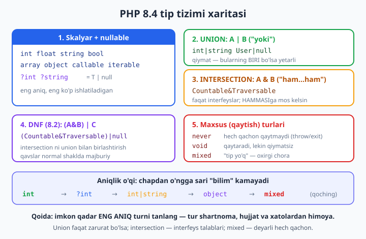
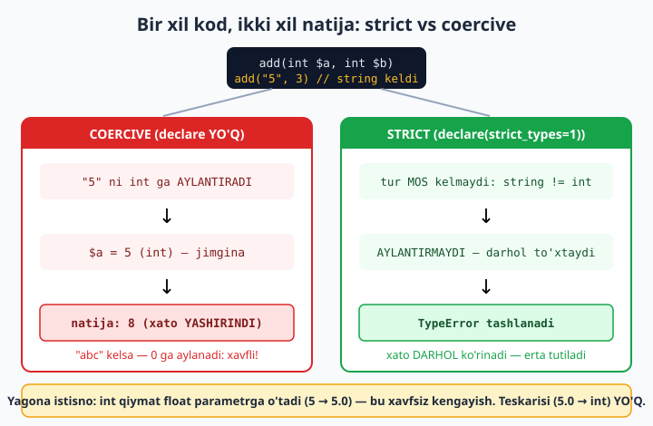

# 05 — Qat'iy tiplash va PHP 8.4 tip tizimi

[⬅️ Oldingi: 04 — JWT va stateless auth](./04-jwt-auth.md) · [🏠 README](./README.md) · [Keyingi: 06 — readonly, Value Object va variance ➡️](./06-value-object.md)

> **Bu bobda:** tip tizimini shunchaki "xato ushlagich" emas, balki **dizayn vositasi** sifatida ishlatishni o'rganamiz. Avval har faylda `declare(strict_types=1)` nega zarurligini va u o'chirilganda PHP "5" satrini jimgina `int` ga aylantirib qanday xavf tug'dirishini ko'ramiz. So'ng PHP 8.4 ning to'liq tip arsenalini ochamiz: skalyar turlar va `?T`, `A|B` union, `A&B` intersection, `(A&B)|C` DNF, hamda `never`/`void`/`mixed` va `false`/`true` literal turlari. Keyin **type narrowing** (`instanceof`, `is_*`, `match (true)`) bilan kompilyatorga "endi bu aniq shu tur" deb ishontiramiz, va nihoyat `==` vs `===` hamda son-satr solishtirish tuzoqlarini chetlab o'tamiz. Bu bob boshlovchi kitobdagi [class va obyekt](../php/14-class-va-obyekt-eng-asosiy-tushuncha.md), [kirish darajalari](../php/16-kirish-darajalari-public-va-private.md), [enum](../php/22-enum-cheklangan-tanlovlar.md) va [xatolarni boshqarish](../php/23-xatolarni-boshqarish.md) boblariga tayanadi — ularni qayta o'rgatmaymiz, balki ekspert nuqtayi nazaridan chuqurlashtiramiz.

---

## Nega tip — bu dizayn, xato ushlagich emas

Boshlovchi sifatida tipni odatda "qiymat int mi yoki string mi" degan texnik tafsilot deb qabul qilamiz. Ekspert nuqtayi nazaridan esa **tur — bu shartnoma (contract)**. `function add(int $a, int $b): int` deb yozganingizda siz uchta narsani bir vaqtda e'lon qilasiz:

1. **Hujjat** — bu funksiyani chaqiruvchi kishi nima berishi va nima olishini izohsiz biladi.
2. **Himoya** — noto'g'ri tur kelsa, PHP ishlashni davom ettirmay, **darhol** `TypeError` tashlaydi. Xato chuqurga kirib, allaqachon ma'lumotni buzgandan keyin emas, balki **kirish chegarasida** tutiladi.
3. **Tahlil imkoni** — PHPStan/Psalm kabi statik analizatorlar va IDE kodingizni *ishga tushirmasdan* tekshiradi: noto'g'ri tur, mavjud bo'lmagan metod, `null` ehtimoli — bularning hammasi kompilyatsiyagacha aniqlanadi.

Tipni qancha **aniq** (specific) qilsangiz, shartnoma shuncha kuchli bo'ladi. `mixed` — "har narsa bo'lishi mumkin", ya'ni aslida **hech qanday** shartnoma yo'q. `int` esa juda qattiq va'da. Shu sababli bu bobning markaziy qoidasi:

> **Oltin qoida:** imkon qadar **eng aniq** turni tanlang. `mixed` dan qoching, `?T` dan zarurat bo'lsa foydalaning, `A|B` faqat haqiqatan ikki xil natija bo'lganda, `A&B` — bir nechta interfeys talab qilinganda.



---

## `declare(strict_types=1)` — eng muhim bir qator

PHP ikki rejimda ishlaydi: **coercive** (jimgina aylantiruvchi, standart) va **strict** (qat'iy). Farqi shundaki — parametr turi mos kelmaganda PHP qiymatni **aylantiradimi yoki xato tashlaydimi**.

`declare(strict_types=1)` — bu **har bir PHP faylning birinchi qatori** (`<?php` dan keyin, boshqa har qanday koddan oldin) bo'lishi kerak bo'lgan direktiva. U joriy faylda yozilgan funksiya/metod chaqiruvlarini qat'iy rejimga o'tkazadi.

### Coercive rejim: yashirin aylantirish xavfi

Quyidagi faylda `declare` **yo'q** — demak coercive rejim:

```php
<?php
// DIQQAT: strict_types YO'Q — coercive rejim

function add(int $a, int $b): int {
    return $a + $b;
}

echo add("5", "3"), "\n";   // 8 — "5" va "3" jimgina int ga aylandi
```

Bu "ishladi", lekin **xavfli**: PHP `"5"` satrini so'ramasdan `5` ga aylantirdi. Kichik loyihada bilinmaydi, ammo katta tizimda bu "jimlik" sizni aldaydi. Aytaylik, foydalanuvchi formadan kelgan `"10 bananlar"` qiymati funksiyaga uzatildi:

```php
<?php
// coercive rejim

function add(int $a, int $b): int {
    return $a + $b;
}

echo add("10 bananlar", 5), "\n";   // ❌ TypeError (PHP 8.0+)
```

PHP 8.0 dan boshlab bunday "ifloslangan" satr coercive rejimda ham `TypeError` tashlaydi — bu yaxshilanish. Lekin tuzoq shundaki, **toza son-satrlar hamon jimgina o'tadi**:

```php
<?php
// coercive rejim — quyidagi uchala holatning XULQI har xil

function add(int $a, int $b): int { return $a + $b; }

echo add("10 ", 5), "\n";    // 15 — orqadagi bo'sh joy kesiladi, o'tadi
echo add("12.0", 0), "\n";   // 12 — int-ga-aniq-mos float-satr, o'tadi
echo add("12.5", 0), "\n";   // 12 + Deprecated: aniqlik yo'qoladi (12.5 -> 12)
```

Oxirgi qatorda `12.5` ning `.5` qismi **yo'qoldi** — bu jimgina yuz bergan ma'lumot yo'qotishi. Coercive rejim sizni shu kabi mayda, sezilmas xatolarga ochiq qoldiradi.

### Strict rejim: aylantirish o'chadi, `TypeError` keladi

Endi xuddi shu kodga `declare(strict_types=1)` qo'shamiz:

```php
<?php
declare(strict_types=1);

function add(int $a, int $b): int {
    return $a + $b;
}

echo add(5, 3), "\n";          // 8 — to'g'ri turlar, ishlaydi

try {
    echo add("5", 3), "\n";    // ❌ strict: aylantirmaydi -> TypeError
} catch (\TypeError $e) {
    echo "TypeError: ", $e->getMessage(), "\n";
    // add(): Argument #1 ($a) must be of type int, string given
}
```

Strict rejimda `"5"` **aylantirilmaydi** — turlar mos kelmaydi, demak `TypeError`. Xato darhol, kirish nuqtasida ko'rinadi. Bu — siz xohlagan xulq: nosozlik **jimgina davom etmaydi**.



### Yagona istisno: `int` → `float` kengayishi

Strict rejim ham bitta **xavfsiz** aylantirishga ruxsat beradi: `int` qiymatni `float` parametrga uzatish (chunki har bir butun son aniq float bo'la oladi, ma'lumot yo'qolmaydi):

```php
<?php
declare(strict_types=1);

function needFloat(float $x): float { return $x; }
echo needFloat(5), "\n";   // 5 — int->float kengayishi strict da ham O'TADI

function needInt(int $x): int { return $x; }
try {
    needInt(5.0);          // ❌ float->int: ma'lumot yo'qolishi mumkin -> TypeError
} catch (\TypeError $e) {
    echo "rad: float ni int parametrga berib bo'lmaydi\n";
}
```

E'tibor bering: kengayish faqat **bir yo'nalishda** (`int` → `float`). Teskarisi (`float` → `int`) `.5` kabi qismni yo'qotishi mumkinligi uchun strict rejimda taqiqlanadi.

> **Amaliy qoida:** loyihangizning **har bir** `.php` faylida `declare(strict_types=1)` yozing. Bu shartnomalaringizni haqiqiy qiladi. `strict_types` faqat **joriy fayldagi** chaqiruvlarga ta'sir qiladi (chaqirilgan funksiya qaysi faylda ekanligi muhim emas) — shuning uchun "bitta faylda yozdim, yetadi" degani noto'g'ri; uni hamma joyga yozish kerak.

---

## Skalyar turlar va `?T` (nullable)

PHP ning to'rt asosiy **skalyar** turi: `int`, `float`, `string`, `bool`. Bularga `array`, `object`, `callable`, `iterable`, hamda har bir sinf/interfeys nomi (`User`, `PDO`, ...) qo'shiladi. Bularni boshlovchi kitobda [class va obyekt](../php/14-class-va-obyekt-eng-asosiy-tushuncha.md) bobida ko'rgansiz; bu yerda ularning **tiplash** jihatiga e'tibor beramiz.

**Nullable** tur — `?T` — bu "`T` yoki `null`" degani. Bu eng ko'p uchraydigan union turi (aslida `?T` = `T|null` ning qisqa shakli):

```php
<?php
declare(strict_types=1);

final class User {
    public function __construct(
        public int $id,
        public string $email,
        public ?string $phone = null,   // telefon ixtiyoriy bo'lishi mumkin
    ) {}
}

function findEmail(?User $u): string {
    // $u null bo'lishi MUMKIN — buni hisobga olishimiz SHART
    if ($u === null) {
        return 'mehmon';
    }
    return $u->email;   // bu yerda $u aniq User (narrowing — quyida ko'ramiz)
}

echo findEmail(new User(1, 'a@b.uz')), "\n";  // a@b.uz
echo findEmail(null), "\n";                    // mehmon
```

`?T` ning kuchi shundaki, u "yo'qlik" (`null`) ehtimolini turning **o'ziga** yozadi. PHPStan endi sizdan `null` ni tekshirishingizni talab qiladi — aks holda `$u->email` "ehtimoliy null ga murojaat" deb ogohlantiriladi.

> **Tuzoq:** `?T` faqat `null` ni qo'shadi, "bo'sh string" yoki `0` ni emas. `?string` qiymati `""` (bo'sh satr) bo'lishi mumkin — bu `null` EMAS. Quyida `"" == 0` tuzog'ida bu farq muhim bo'ladi.

---

## `A|B` union: "yoki" turi

**Union** tur (`A|B`) qiymat **bir nechta turdan biri** bo'lishi mumkinligini bildiradi (PHP 8.0). Eng tabiiy ishlatilishi — funksiya **ikki xil natija** qaytarishi mumkin bo'lganda. Klassik misol: topildi/topilmadi.

`false` **literal turi** (8.2) bilan birga "topilmadi" holatini aniq ifodalaymiz:

```php
<?php
declare(strict_types=1);

final class User {
    public function __construct(public string $name) {}
}

function findUser(int $id): User|false {
    // bazadan qidirish o'rniga soddalashtirilgan misol
    return $id === 1 ? new User('Oqil') : false;
}

$u = findUser(1);
echo $u === false ? 'topilmadi' : $u->name, "\n";   // Oqil

var_dump(findUser(2) === false);                      // true — topilmadi
```

`User|false` — "User yoki false (topilmadi)" degan **o'qiladigan** shartnoma. Buni `User|null` bilan ham yozish mumkin; tanlov uslubga bog'liq, lekin `false` ko'pincha "muvaffaqiyatsizlik" ni, `null` esa "qiymat yo'q" ni bildiradi.

### Union — "Result" naqshining asosi

Union turlari xatolarni **exception siz** ifodalashning chiroyli usuli. Boshlovchi kitobda [xatolarni boshqarish](../php/23-xatolarni-boshqarish.md) da `try/catch` ni ko'rdingiz; ba'zan esa "xato — bu kutilgan natija" bo'ladi (masalan, foydalanuvchi kiritmasini tekshirish). Bunday holatda `Ok|Err` union tabiiyroq:

```php
<?php
declare(strict_types=1);

final class Ok  { public function __construct(public int $value) {} }
final class Err { public function __construct(public string $error) {} }

function parsePositive(string $in): Ok|Err {
    if (!ctype_digit($in)) {
        return new Err('raqam emas');
    }
    $n = (int) $in;
    return $n > 0 ? new Ok($n) : new Err('musbat emas');
}

$r = parsePositive('42');
echo $r instanceof Ok ? "OK={$r->value}" : "ERR={$r->error}", "\n";  // OK=42

$r = parsePositive('x');
echo $r instanceof Ok ? "OK={$r->value}" : "ERR={$r->error}", "\n";  // ERR=raqam emas
```

Bu yerda chaqiruvchi **majburan** ikkala holatni ko'rib chiqishi kerak — tur uni shunga undaydi. Bu exception dan farqi: xato "alohida kanal" emas, **oddiy qaytish qiymati**.

> **Qachon union?** Faqat haqiqatan bir nechta **mantiqan teng** natija bo'lganda. Agar union 4-5 turdan iborat bo'lsa — bu odatda dizayn xatosi belgisi; balki umumiy interfeys (`A&B` yoki abstract sinf) kerakdir.

---

## `A&B` intersection: "ham...ham" turi

**Intersection** tur (`A&B`) qiymat **bir vaqtda barcha** sanab o'tilgan turlarga mos kelishini talab qiladi (PHP 8.1). Muhim cheklov: intersection da **faqat interfeyslar** (va `class`/`interface` nomlari) ishlatiladi — skalyar turlar (`int&string` ma'nosiz) bo'lmaydi.

Bu nima uchun kerak? Tasavvur qiling, funksiyangiz obyekt **ham sanaladigan** (`Countable`), **ham aylanib chiqiladigan** (`Traversable`) bo'lishini xohlaydi:

```php
<?php
declare(strict_types=1);

interface HasId { public function id(): int; }
interface Named { public function name(): string; }

final class User implements HasId, Named {
    public function __construct(private int $id, private string $n) {}
    public function id(): int { return $this->id; }
    public function name(): string { return $this->n; }
}

// $e ham HasId, HAM Named bo'lishi shart:
function label(HasId&Named $e): string {
    return $e->id() . ':' . $e->name();   // ikkala interfeysga ham tayanamiz
}

echo label(new User(7, 'Olim')), "\n";   // 7:Olim
```

`HasId&Named` — "shu obyekt **ikkala** shartnomani ham bajaradi" degani. `User` ikkalasini ham `implements` qilgani uchun mos keladi. Faqat `HasId` ni amalga oshirgan boshqa sinf esa **mos kelmaydi** — bu aynan xohlagan qattiqlikingiz.

> **Union vs intersection:** `A|B` — "kamida biri" (kengroq, ko'proq qiymat o'tadi). `A&B` — "hammasi" (torroq, kamroq qiymat o'tadi, lekin ko'proq imkoniyat beradi, chunki ikkala interfeys metodlarini ham chaqira olasiz).

---

## `(A&B)|C` DNF: union va intersection birga

**DNF** (Disjunctive Normal Form, 8.2) — intersection va union ni **birga** ishlatish imkoni. Sintaksis: intersection guruhlari qavs ichida, ular `|` bilan birlashtiriladi. Eng ko'p uchraydigan zarurat — intersection turini **nullable** qilish:

```php
<?php
declare(strict_types=1);

interface HasId { public function id(): int; }
interface Named { public function name(): string; }

final class User implements HasId, Named {
    public function __construct(private int $id, private string $n) {}
    public function id(): int { return $this->id; }
    public function name(): string { return $this->n; }
}

function label(HasId&Named $e): string {
    return $e->id() . ':' . $e->name();
}

// (HasId&Named) YOKI null:
function maybe((HasId&Named)|null $e): string {
    return $e === null ? 'yoq' : label($e);
}

echo maybe(null), "\n";              // yoq
echo maybe(new User(9, 'Vali')), "\n"; // 9:Vali
```

`(HasId&Named)|null` ni `?(HasId&Named)` deb yozib **bo'lmaydi** — `?` qisqartmasi murakkab intersection bilan ishlamaydi, shuning uchun DNF zarur. Qavslar (`A&B`) atrofida **majburiy**: PHP turning "normal shaklini" talab qiladi.

> **Qachon DNF?** Amalda asosan `(A&B)|null` ko'rinishida. Murakkabroq `(A&B)|(C&D)` nazariy jihatdan mumkin, lekin kamdan-kam kerak bo'ladi — agar shunga ehtiyoj tug'ilsa, dizayningizni qayta ko'rib chiqing.

---

## Maxsus turlar: `never`, `void`, `mixed`

### `never` — funksiya hech qachon qaytmaydi (8.1)

`never` qaytish turi PHP ga (va analizatorlarga) "bu funksiya **hech qachon** normal yo'l bilan qaytmaydi" deb aytadi — u doim `throw` qiladi yoki `exit`/`die` chaqiradi:

```php
<?php
declare(strict_types=1);

function fail(string $msg): never {
    throw new \RuntimeException($msg);
    // bu yerdan keyin kod YO'Q — qaytish imkonsiz
}

function getOrFail(?string $value): string {
    return $value ?? fail('qiymat yo`q');
    // PHP biladi: fail() qaytmaydi, demak bu yerga yetganda $value aniq string
}

echo getOrFail('bor'), "\n";   // bor
try {
    getOrFail(null);
} catch (\RuntimeException $e) {
    echo "tutildi: ", $e->getMessage(), "\n";  // tutildi: qiymat yo`q
}
```

`never` ning kuchi — **boshqaruv oqimini tahlil qilishni** yaxshilaydi. Analizator `fail()` dan keyin kod "o'lik" ekanini biladi va `??` dan keyin `$value` ning `null` bo'la olmasligini tushunadi. `void` dan farqi: `void` "qaytadi, lekin qiymatsiz", `never` esa "**umuman** qaytmaydi".

### `void` — qaytaradi, lekin qiymatsiz

`void` — funksiya ish bajaradi, ammo **foydali qiymat qaytarmaydi** (yon-effekt uchun: log yozish, saqlash, chop etish):

```php
<?php
declare(strict_types=1);

function logMsg(string $m): void {
    echo "[LOG] $m\n";
    // 'return;' yozish mumkin (qiymatsiz), lekin 'return $x;' XATO
}

logMsg('boshlandi');   // [LOG] boshlandi
```

`void` funksiyadan qiymat qaytarsangiz (`return 5;`) — bu **xato**. `void` ning natijasini o'zgaruvchiga olsangiz, u `null` bo'ladi, lekin bunga tayanmaslik kerak — bu "natija yo'q" degani.

### `mixed` — "tip yo'q" degani (oxirgi chora)

`mixed` har qanday turni qabul qiladi: `int|float|string|bool|array|object|callable|null|resource`. Texnik jihatdan u "hamma narsa", **amalda esa "men turni bilmayman"** degani — ya'ni shartnomaning yo'qligi:

```php
<?php
declare(strict_types=1);

function dump(mixed $v): void {
    echo get_debug_type($v), "\n";  // qiymatning ANIQ turini chiqaradi
}

dump(1);            // int
dump(1.5);          // float
dump('x');          // string
dump([1, 2]);       // array
dump(null);         // null
dump(new stdClass); // stdClass
dump(fn() => 1);    // Closure
```

`get_debug_type()` — `gettype()` ga qaraganda aniqroq (sinf nomini to'liq beradi, "integer" emas "int" deydi). `mixed` ni faqat haqiqatan har qanday tur kelishi mumkin bo'lganda ishlating (masalan, umumiy serializatsiya, `var_dump` kabi vositalar). 99% holatda `mixed` — dizayningizni yetarli o'ylamaganingiz belgisi.

> **Eslatma:** `mixed` parametr — eng zaif shartnoma. Agar funksiyangiz `mixed` qabul qilsa, ichida deyarli har doim `is_*`/`instanceof` bilan **narrowing** qilishingiz kerak bo'ladi (keyingi bo'lim). Ko'pincha buning o'rniga aniq union (`int|string`) yozish to'g'riroq.

---

## `false`/`true` literal turlar (8.2)

PHP 8.2 dan `false` va `true` ni **mustaqil literal tur** sifatida ishlatish mumkin. `false` ni yuqorida `User|false` da ko'rdik. Yolg'iz `true` yoki `false` kamdan-kam, lekin ma'noli holatlari bor — masalan, har doim `true` qaytaradigan (yoki exception tashlaydigan) metod:

```php
<?php
declare(strict_types=1);

final class Validator {
    /** Tekshiruv o'tsa true; aks holda exception (hech qachon false qaytmaydi) */
    public function assertEmail(string $value): true {
        if (!str_contains($value, '@')) {
            throw new \InvalidArgumentException('email noto`g`ri');
        }
        return true;
    }
}

$v = new Validator();
var_dump($v->assertEmail('a@b.uz'));  // bool(true)
```

`: true` qaytish turi o'quvchiga "bu metod faqat `true` qaytaradi yoki umuman qaytmaydi (throw)" degan kuchli signal beradi. Bu — niyatni turga yozishning yana bir misoli.

---

## Qaytish turlari: `self` vs `static` vs `parent`

Sinf ichida qaytish turi sifatida uchta maxsus kalit so'z ishlatiladi. Ularning farqi **meros** (inheritance) da ko'rinadi:

- `self` — **shu sinf** (e'lon qilingan joydagi sinf), meros bo'lsa ham o'zgarmaydi.
- `static` — **chaqirilgan haqiqiy sinf** (kech statik bog'lanish, LSB). Bola sinfdan chaqirilsa, bola turini qaytaradi.
- `parent` — ota sinf turi (kamdan-kam).

```php
<?php
declare(strict_types=1);

class Model {
    public static function create(): static {  // "chaqirgan sinf" turi
        return new static();
    }
    public function copy(): self {              // doim Model
        return clone $this;
    }
}

final class Post extends Model {}

var_dump(Post::create() instanceof Post);   // true — static: Post qaytdi
var_dump(Model::create() instanceof Model); // true
```

`static` — fluent interfeys va fabrika (factory) metodlari uchun zarur: `Post::create()` chaqirilganda `Post` obyektini qaytaradi, `self` bo'lganida esa har doim `Model` qaytar edi. Bu **kovariant qaytish** (covariant return) ning bir ko'rinishi — bola sinf otaga nisbatan **aniqroq** turni qaytarishi mumkin. (Kovariantlik va variance ni keyingi [06-bobda](./06-value-object.md) chuqurroq ko'ramiz.)

---

## Type narrowing: kompilyatorga "endi bu aniq shu tur" deyish

**Narrowing** (toraytirish) — keng turdan (`mixed`, union, `?T`) aniqroq turga "o'tish". Siz `is_*` yoki `instanceof` bilan tekshirgandan keyin, shu shox ichida PHP (va analizator) qiymatning aniq turini biladi. Bu — union va `?T` ni xavfsiz ishlatishning asosiy mexanizmi.

### `null` tekshiruvi bilan narrowing

```php
<?php
declare(strict_types=1);

function greet(?string $name): string {
    if ($name === null) {
        return 'Salom, mehmon!';
    }
    // bu yerdan keyin $name aniq STRING — narrowing yuz berdi
    return "Salom, " . strtoupper($name) . "!";
}

echo greet('oqil'), "\n";  // Salom, OQIL!
echo greet(null), "\n";    // Salom, mehmon!
```

`null` ni boshida tekshirib, erta qaytarish ("early return") — eng toza naqsh. Keyingi kodda `$name` aniq `string`, demak `strtoupper()` xavfsiz.

### `instanceof` va `is_*` bilan union ni tarmoqlash

`match (true)` bilan tur bo'yicha tarmoqlash — narrowing ning eng ifodali shakli. Bu ko'pincha cheksiz `if/elseif` zanjiridan toza:

```php
<?php
declare(strict_types=1);

function describe(int|string|null $v): string {
    return match (true) {
        $v === null   => 'qiymat: yo`q',
        is_int($v)    => "butun son: $v",
        is_string($v) => "satr: \"$v\"",
    };
}

echo describe(42), "\n";       // butun son: 42
echo describe('salom'), "\n";  // satr: "salom"
echo describe(null), "\n";     // qiymat: yo`q
```

Real domenda bu naqsh "tur bo'yicha dispatcher" sifatida juda kuchli. Aytaylik, to'lov usuliga qarab har xil matn:

```php
<?php
declare(strict_types=1);

interface PaymentMethod {}
final class CardPayment   implements PaymentMethod { public function __construct(public string $last4) {} }
final class CashPayment   implements PaymentMethod { public function __construct(public int $amount) {} }
final class CryptoPayment implements PaymentMethod { public function __construct(public string $wallet) {} }

function receipt(PaymentMethod $p): string {
    return match (true) {
        $p instanceof CardPayment   => "Karta ***{$p->last4}",
        $p instanceof CashPayment   => "Naqd {$p->amount} so`m",
        $p instanceof CryptoPayment => "Kripto {$p->wallet}",
    };
}

echo receipt(new CardPayment('4242')), "\n";    // Karta ***4242
echo receipt(new CashPayment(50000)), "\n";     // Naqd 50000 so`m
echo receipt(new CryptoPayment('bc1q...')), "\n"; // Kripto bc1q...
```

Har bir `instanceof` shoxida `$p` ning aniq turi ma'lum bo'lgani uchun `$p->last4`, `$p->amount`, `$p->wallet` ga **xavfsiz** murojaat qila olamiz — IDE ham, analizator ham xato qilmaydi.

### `array_is_list` — massiv shaklini tekshirish

PHP massivlari "list" (0,1,2,... kalitli) yoki "assotsiativ" bo'lishi mumkin. `array_is_list()` (8.1) bu farqni aniqlaydi — JSON serializatsiyasi va validatsiyada zarur:

```php
<?php
declare(strict_types=1);

function jsonKind(array $a): string {
    if ($a === []) return 'bo`sh';
    return array_is_list($a) ? 'JSON massiv []' : 'JSON obyekt {}';
}

var_dump(array_is_list([1, 2, 3]));     // true  — list
var_dump(array_is_list([1 => 'a']));    // false — 0 dan boshlanmaydi
echo jsonKind(['a', 'b']), "\n";        // JSON massiv []
echo jsonKind(['id' => 1]), "\n";       // JSON obyekt {}
```

Bu narrowing ning massivlarga tatbiqi: bir "array" turi ichidagi ikki xil **shaklni** ajratamiz, chunki PHP ning tip tizimi `list<int>` vs `array<string,int>` farqini *o'zi* bilmaydi (buni faqat PHPStan/Psalm generiklari biladi).

---

## Type coercion tuzoqlari: `==`, `===` va son-satr solishtirish

Tiplashning eng zararli tuzog'i — **bo'sh (loose) solishtirish** `==`. U turlarni jimgina aylantirib solishtiradi, natijada kutilmagan haqiqat qiymatlari chiqadi. **Qoida: deyarli har doim `===` (qat'iy, tur ham mos kelsin) ishlating.**

PHP 8.0 son-satr solishtirishni **tuzatdi**: endi `int` ni `non-numeric string` bilan solishtirganda, son satr ga emas, **satr songa** aylanmaydi — ikkalasi satr sifatida solishtiriladi. Bu juda muhim xavfsizlik yaxshilanishi:

```php
<?php
declare(strict_types=1);

// PHP 8.0+ semantikasi:
var_dump(0 == "abc");    // false  (8.0 GACHA: true edi! — xavfli)
var_dump(0 == "");       // false  (8.0 gacha: true edi)
var_dump(0 == "0");      // true   ("0" — numeric, songa aylanadi)

var_dump("" == null);    // true   (ikkalasi "bo`sh" deb hisoblanadi)

var_dump("1" == "01");   // true   (ikkalasi numeric -> son sifatida: 1==1)
var_dump("10" == "1e1"); // true   (1e1 = 10.0, numeric)
var_dump(100 == "1e2");  // true   (1e2 = 100)

var_dump(0 === "0");     // false  (=== : int va string har xil tur)
```

`0 == "abc"` ning eski (8.0 gacha) `true` natijasi katta xavfsizlik kamchiligi edi: `if ($userInput == 0)` kabi tekshiruv "abc" kiritmasini ham `true` deb hisoblardi. PHP 8.0 buni tuzatdi, lekin **eski kodga tayanmang** — har doim `===` ishlating.

### `""` va `0` farqi — `??` vs `?:`

Yana bir tuzoq: `0`, `""`, `"0"`, `[]`, `null`, `false` — bularning hammasi `if` da "falsy". Lekin ular **bir-biridan farq qiladi**. `?:` (Elvis) "falsy" ni tekshiradi, `??` (null coalescing) esa faqat `null` ni:

```php
<?php
declare(strict_types=1);

function quantity(?int $n): int {
    // ❌ XATO: 0 ham "falsy" — foydalanuvchi 0 kiritganda ham 1 ga aylantiradi
    // return $n ?: 1;

    // ✅ TO'G'RI: faqat null bo'lsa standart qiymat
    return $n ?? 1;
}

echo quantity(0), "\n";     // 0  — to'g'ri (0 ham haqiqiy qiymat)
echo quantity(null), "\n";  // 1  — standart
echo quantity(5), "\n";     // 5
```

`?:` foydalanuvchi atayin kiritgan `0` yoki `""` ni "yo'q" deb xato talqin qiladi. `??` faqat `null` ni ushlaydi — shu sababli `?T` turidagi qiymatlar uchun **deyarli har doim `??`** to'g'riroq.

### Massiv kaliti coercion'i

Massiv kalitlari ham jimgina aylanadi: `"1"`, `1`, `true` — hammasi bitta kalit (`1`) ga aylanadi:

```php
<?php
declare(strict_types=1);

$arr = [];
$arr["1"] = 'a';   // "1" -> int kalit 1
$arr[1]   = 'b';   // o'sha kalit — ustiga yozadi
$arr[true] = 'c';  // true -> 1 — yana o'sha kalit

var_dump(count($arr));  // 1  — uchalasi bir kalitga tushdi
var_dump($arr[1]);      // "c"
```

Bu tuzoq — kalitlar foydalanuvchidan kelganda (masalan ID lar satr sifatida) kutilmagan ustiga-yozishni keltirib chiqaradi.

---

## To'liq tiplangan domen sinfi: hammasini birlashtiramiz

Endi yuqoridagi g'oyalarni real `Money` value object ida birlashtiramiz — har bir property, parametr va return turlangan, `readonly` bilan o'zgarmas (immutable), va xato turlar bilan himoyalangan. (`readonly` va value object dizaynini keyingi [06-bobda](./06-value-object.md) batafsil ochamiz; bu yerda tiplashga e'tibor.)

```php
<?php
declare(strict_types=1);

final class Money {
    public function __construct(
        public readonly int $amount,      // tiyinlarda (float emas — aniqlik uchun!)
        public readonly string $currency, // ISO kod: 'UZS', 'USD'
    ) {
        if ($amount < 0) {
            throw new \InvalidArgumentException('summa manfiy bo`la olmaydi');
        }
        if (strlen($currency) !== 3) {
            throw new \InvalidArgumentException('valyuta kodi 3 harf bo`lsin');
        }
    }

    public function add(Money $other): self {
        if ($this->currency !== $other->currency) {
            throw new \InvalidArgumentException('valyutalar mos emas');
        }
        return new self($this->amount + $other->amount, $this->currency);
    }

    public function format(): string {
        return number_format($this->amount / 100, 2) . ' ' . $this->currency;
    }
}

$wallet = new Money(150_00, 'UZS');          // 150.00 UZS (15000 tiyin)
$income = new Money(50_00, 'UZS');           // 50.00 UZS

$total = $wallet->add($income);
echo $total->format(), "\n";                  // 200.00 UZS

// ❌ readonly propertyni tashqaridan o'zgartirish -> Error
try {
    $total->amount = 9999;
} catch (\Error $e) {
    echo "Error: ", $e->getMessage(), "\n";   // Cannot modify readonly property Money::$amount
}

// ❌ valyuta mos kelmasa -> InvalidArgumentException
try {
    $wallet->add(new Money(10_00, 'USD'));
} catch (\InvalidArgumentException $e) {
    echo "rad: ", $e->getMessage(), "\n";     // rad: valyutalar mos emas
}
```

E'tibor bering: `amount` ni `float` emas, `int` (tiyinlarda) qildik — chunki `float` arifmetikasi pul uchun **xavfli** (yaxlitlash xatolari). Bu — turni dizayn vositasi sifatida ishlatishning yorqin misoli: tur tanlovingiz xatolikni **strukturaviy** ravishda oldini oladi.

---

## PHP 8.4 yangiligi: property hooks va asymmetric visibility

PHP 8.4 tiplangan property'larni yanada kuchaytirdi. **Property hooks** (`get`/`set`) — property o'qish/yozishda kod ishlatishga imkon beradi, lekin tashqaridan u oddiy property kabi ko'rinadi:

```php
<?php
declare(strict_types=1);

final class Temperature {
    public function __construct(private float $celsius) {}

    // hisoblanadigan property — saqlanmaydi, har o'qishda hisoblanadi
    public float $fahrenheit {
        get => $this->celsius * 9 / 5 + 32;
        set (float $f) { $this->celsius = ($f - 32) * 5 / 9; }
    }
}

$t = new Temperature(25.0);
echo $t->fahrenheit, "\n";   // 77 — get hook ishladi
$t->fahrenheit = 212.0;       // set hook: celsius ni qayta hisoblaydi
echo $t->fahrenheit, "\n";   // 212
```

`get`/`set` hook turlari ham qat'iy: `set (float $f)` faqat `float` qabul qiladi. Bu — getter/setter metodlarning toza, tiplangan muqobili.

**Asymmetric visibility** (`public private(set)`) — property'ni **tashqaridan o'qish** mumkin, lekin **faqat sinf ichidan yozish** mumkin qiladi. Bu boshlovchi kitobdagi [kirish darajalari](../php/16-kirish-darajalari-public-va-private.md) ning kuchaytirilgan shakli:

```php
<?php
declare(strict_types=1);

final class Account {
    // tashqaridan O'QISH ochiq, YOZISH faqat ichkaridan:
    public function __construct(public private(set) int $balance) {}

    public function deposit(int $amount): void {
        if ($amount <= 0) {
            throw new \InvalidArgumentException('summa musbat bo`lsin');
        }
        $this->balance += $amount;   // ichkaridan yozish — RUXSAT
    }
}

$a = new Account(100);
echo $a->balance, "\n";   // 100 — tashqaridan o'qish mumkin
$a->deposit(50);
echo $a->balance, "\n";   // 150

// ❌ tashqaridan yozish -> Error
try {
    $a->balance = 999;
} catch (\Error $e) {
    echo "rad: ", $e->getMessage(), "\n";  // Cannot modify private(set) property...
}
```

`public private(set)` `readonly` dan farq qiladi: `readonly` faqat **bir marta** (konstruktorda) yozishga ruxsat beradi; `private(set)` esa sinf ichidan **istalgancha** o'zgartirishga, lekin tashqaridan **umuman** yozishga ruxsat bermaydi. `balance` — aynan shunday: ichkarida o'zgaradi, tashqaridan faqat ko'rinadi.

### `#[Override]` atributi — meros xatolarini ushlash

PHP 8.3 ning `#[Override]` atributi metod haqiqatan ota sinf/interfeys metodini **qoplayotganini** tekshiradi. Agar metod nomini xato yozsangiz (yoki ota o'zgarib qolsa), kompilyatsiya xatosi olasiz — bu tip tizimining "shartnoma to'g'riligi" jihatini kuchaytiradi:

```php
<?php
declare(strict_types=1);

interface Repo {
    public function find(int $id): ?string;
}

final class MemoryRepo implements Repo {
    private array $data = [1 => 'birinchi'];

    #[\Override]   // "men Repo::find ni qoplayapman" — PHP tekshiradi
    public function find(int $id): ?string {
        return $this->data[$id] ?? null;
    }
}

$repo = new MemoryRepo();
var_dump($repo->find(1));   // string(8) "birinchi"
var_dump($repo->find(9));   // NULL
```

Agar `find` ni adashib `fnd` deb yozsangiz, `#[Override]` tufayli PHP "ota turida bunday metod yo'q" deb darhol xato beradi — narrowing/tiplash bilan birga, bu meros shartnomalarini ham himoya qiladi.

> **Ko'prik:** bu boblar (tip tizimi, value object, PSR standartlari) keyinroq o'z **mini-frameworkingizni** qurish (L4 — router + DI konteyner) uchun poydevor. Qat'iy tiplangan, intersection bilan ishlaydigan servislar DI konteynerga "qaysi interfeysni qaysi sinf bajaradi" deb ishonchli aytishga imkon beradi.

---

## Tip tizimini dizayn vositasi sifatida: xulosa

| Vosita | Qachon | Tuzoq |
|---|---|---|
| `declare(strict_types=1)` | **Har** faylda | Yo'q bo'lsa `"5"` jimgina `int` bo'ladi |
| `int`/`string`/... | Imkon bo'lsa har doim | Eng aniqini tanlang |
| `?T` (nullable) | Qiymat yo'q bo'lishi mumkin | `??` ishlating, `?:` emas |
| `A\|B` union | Bir nechta teng natija | 4-5 turdan ko'p — dizayn xatosi |
| `A&B` intersection | Bir nechta interfeys talab | Faqat interfeyslar |
| `(A&B)\|null` DNF | Intersection + nullable | Qavslar majburiy |
| `never` | Doim throw/exit | Oqim tahlilini yaxshilaydi |
| `void` | Yon-effekt, qiymatsiz | `return $x;` xato |
| `mixed` | Deyarli **hech qachon** | "Shartnoma yo'q" demak |
| `===` | Deyarli har doim | `==` jimgina aylantiradi |

Markaziy g'oya: **tur — bu sizning niyatingizning mashina o'qiy oladigan, majburlanadigan ifodasi.** Qancha aniq tiplasangiz, kodingiz shuncha o'zini-o'zi hujjatlaydi, IDE shuncha yordam beradi, xatolar shuncha erta — kirish chegarasida — tutiladi.

---

## Mashqlar

### Oson

1. Berilgan funksiyaga `declare(strict_types=1)` qo'shing va `add("5", 3)` chaqiruvi endi nima qilishini (natija yoki xato) ayting. Keyin `add(5, 3.0)` va `add(5.0, 3)` ni strict rejimda sinab, qaysi biri o'tishini tushuntiring.
2. `?string $name` parametrli `greet` funksiyasini yozing: `null` kelsa `"mehmon"`, aks holda nomni qaytarsin. `??` operatoridan foydalaning.
3. `describeType(mixed $v): string` funksiyasini `get_debug_type()` bilan yozing va `int`, `array`, `null`, `Closure` uchun sinab ko'ring. (Diqqat: funksiyani `getType` deb nomlamang — PHP funksiya nomlari **registrga befarq**, shuning uchun u o'rnatilgan `gettype()` bilan to'qnashadi va "Cannot redeclare" xatosi beradi.)

### O'rta

4. `User|false` qaytaradigan `findUserById(int $id): User|false` yozing (id=1 bo'lsa `User`, aks holda `false`). Chaqiruvchi tomonda `instanceof` yoki `=== false` bilan natijani to'g'ri tarmoqlang.
5. `match (true)` bilan `format(int|float|string $v): string` yozing: `int` -> `"butun: N"`, `float` -> `"kasr: N"`, `string` -> `"matn: ..."`.
6. Quyidagi solishtirishlarning **PHP 8.4** dagi natijasini (true/false) avval **bashorat qiling**, keyin run qilib tekshiring: `0 == "abc"`, `0 == "0"`, `"" == null`, `"1e2" == 100`, `0 === "0"`.

### Qiyin

7. `Shape` interfeysi va uni amalga oshiruvchi `Circle`, `Rectangle`, `Triangle` sinflarini yozing. So'ng `totalArea(Shape ...$shapes): float` funksiyasini yozing: `match (true)` va `instanceof` bilan har bir shaklning yuzini hisoblab, yig'indini qaytarsin. Har bir sinf `readonly` property bilan o'zgarmas bo'lsin.
8. `HasId` va `Timestamped` interfeyslarini yozing. `(HasId&Timestamped)|null` qabul qiluvchi `summary` funksiyasini yozing: `null` bo'lsa `"yo`q"`, aks holda `"#{id} ({yaratilgan_sana})"`. DNF turidan to'g'ri foydalaning va nima uchun `?(HasId&Timestamped)` yozib bo'lmasligini izohlang.

<details markdown="1"><summary>Yechim — 1</summary>

```php
<?php
declare(strict_types=1);

function add(int $a, int $b): int { return $a + $b; }

// add("5", 3): strict da "5" int ga AYLANTIRILMAYDI -> TypeError
try {
    add("5", 3);
} catch (\TypeError $e) {
    echo "add(\"5\", 3): TypeError\n";
}

// add(5, 3.0): 2-parametr int kutilyapti, 3.0 float -> TypeError
try {
    add(5, 3.0);
} catch (\TypeError $e) {
    echo "add(5, 3.0): TypeError (float ni int ga bermaymiz)\n";
}

// add(5.0, 3): xuddi shu sabab -> TypeError
try {
    add(5.0, 3);
} catch (\TypeError $e) {
    echo "add(5.0, 3): TypeError\n";
}
```

Strict rejimda **uchala** chaqiruv ham `TypeError` beradi: `"5"` satr, `3.0` va `5.0` float — birortasi `int` emas. Yagona istisno `int` qiymatni `float` parametrga berishdir (`needFloat(5)`), bu yerda esa aksincha (`float` ni `int` parametrga) — bu taqiqlangan.

</details>

<details markdown="1"><summary>Yechim — 2</summary>

```php
<?php
declare(strict_types=1);

function greet(?string $name): string {
    return 'Salom, ' . ($name ?? 'mehmon') . '!';
}

echo greet('Oqil'), "\n";   // Salom, Oqil!
echo greet(null), "\n";     // Salom, mehmon!
echo greet(''), "\n";       // Salom, !  — DIQQAT: "" null EMAS, shuning uchun o'tadi
```

`??` faqat `null` ni almashtiradi. Agar `?:` ishlatganingizda bo'sh satr `""` ham "mehmon" ga aylanardi — bu odatda noto'g'ri. `?T` bilan deyarli har doim `??` to'g'riroq.

</details>

<details markdown="1"><summary>Yechim — 3</summary>

```php
<?php
declare(strict_types=1);

function describeType(mixed $v): string {
    return get_debug_type($v);
}

echo describeType(42), "\n";          // int
echo describeType([1, 2]), "\n";      // array
echo describeType(null), "\n";        // null
echo describeType(fn() => 1), "\n";   // Closure
echo describeType(new stdClass), "\n";// stdClass
```

`get_debug_type()` `gettype()` dan afzal: u "integer" o'rniga "int", obyektlar uchun esa to'liq sinf nomini qaytaradi. Funksiyani `getType` deb nomlasak edi, PHP uni o'rnatilgan `gettype()` ning takrori deb hisoblab xato berardi — PHP funksiya nomlari registrga befarq.

</details>

<details markdown="1"><summary>Yechim — 4</summary>

```php
<?php
declare(strict_types=1);

final class User {
    public function __construct(public int $id, public string $name) {}
}

function findUserById(int $id): User|false {
    return $id === 1 ? new User(1, 'Oqil') : false;
}

$u = findUserById(1);
if ($u === false) {
    echo "topilmadi\n";
} else {
    echo "topildi: {$u->name}\n";   // narrowing: $u aniq User
}

var_dump(findUserById(2) === false);  // true
```

`=== false` (qat'iy) ishlatamiz, `== false` emas — chunki `== false` `null`, `0`, `""` ni ham `true` qilardi. `else` shoxida `$u` aniq `User` (narrowing), demak `$u->name` xavfsiz.

</details>

<details markdown="1"><summary>Yechim — 5</summary>

```php
<?php
declare(strict_types=1);

function format(int|float|string $v): string {
    return match (true) {
        is_int($v)    => "butun: $v",
        is_float($v)  => "kasr: $v",
        is_string($v) => "matn: $v",
    };
}

echo format(42), "\n";     // butun: 42
echo format(3.14), "\n";   // kasr: 3.14
echo format('salom'), "\n";// matn: salom
```

`is_int` ni `is_float` dan **oldin** tekshiramiz: tartib muhim, chunki shoxlar yuqoridan pastga tekshiriladi. `match (true)` to'liq qamrab olmasa `UnhandledMatchError` tashlaydi — bu yerda union ning uchala turi qoplangan.

</details>

<details markdown="1"><summary>Yechim — 6</summary>

```php
<?php
declare(strict_types=1);

var_dump(0 == "abc");    // false — 8.0+ : son-satr emas, satr sifatida
var_dump(0 == "0");      // true  — "0" numeric, songa aylanadi
var_dump("" == null);    // true  — ikkalasi "bo`sh"
var_dump("1e2" == 100);  // true  — 1e2 = 100.0 (numeric)
var_dump(0 === "0");     // false — === : int va string har xil tur
```

Asosiy saboq: `0 == "abc"` PHP 8.0 GACHA `true` edi (xavfli!), endi `false`. Lekin numeric satrlar (`"0"`, `"1e2"`) hamon songa aylanadi. Shuning uchun har doim `===` ishlatib, bu noaniqlikdan butunlay qoching.

</details>

<details markdown="1"><summary>Yechim — 7</summary>

```php
<?php
declare(strict_types=1);

interface Shape {}

final class Circle implements Shape {
    public function __construct(public readonly float $radius) {}
}
final class Rectangle implements Shape {
    public function __construct(
        public readonly float $width,
        public readonly float $height,
    ) {}
}
final class Triangle implements Shape {
    public function __construct(
        public readonly float $base,
        public readonly float $height,
    ) {}
}

function area(Shape $s): float {
    return match (true) {
        $s instanceof Circle    => M_PI * $s->radius ** 2,
        $s instanceof Rectangle => $s->width * $s->height,
        $s instanceof Triangle  => 0.5 * $s->base * $s->height,
    };
}

function totalArea(Shape ...$shapes): float {
    $sum = 0.0;
    foreach ($shapes as $s) {
        $sum += area($s);   // har bir shoxda $s ning aniq turi ma'lum
    }
    return $sum;
}

$total = totalArea(
    new Circle(2.0),        // ~12.566
    new Rectangle(3.0, 4.0),// 12.0
    new Triangle(6.0, 2.0), // 6.0
);

echo round($total, 3), "\n";   // ~30.566
```

Bu yerda bir nechta tip g'oyasi birga ishlaydi: `Shape` interfeysi umumiy shartnoma; `readonly` property'lar o'zgarmaslik beradi; `Shape ...$shapes` variadic parametr har biri `Shape` bo'lgan istalgancha argument qabul qiladi; `match (true)` + `instanceof` esa har bir aniq turga **narrowing** qilib, mos formulani tanlaydi. `area` ichida `$s instanceof Circle` shoxida `$s->radius` ga xavfsiz murojaat qilamiz — IDE va analizator buni tasdiqlaydi.

Agar yangi shakl (`Square`) qo'shsangiz va `area` da uni qo'shishni unutsangiz, `match (true)` `UnhandledMatchError` tashlaydi — bu "to'liqlik" xatosini run-time da bo'lsa ham ushlaydi (PHPStan esa buni static tahlilda ham aytadi).

</details>

<details markdown="1"><summary>Yechim — 8</summary>

```php
<?php
declare(strict_types=1);

interface HasId {
    public function id(): int;
}
interface Timestamped {
    public function createdAt(): string;
}

final class Order implements HasId, Timestamped {
    public function __construct(
        private int $id,
        private string $createdAt,
    ) {}
    public function id(): int { return $this->id; }
    public function createdAt(): string { return $this->createdAt; }
}

// (HasId&Timestamped) YOKI null — DNF
function summary((HasId&Timestamped)|null $e): string {
    if ($e === null) {
        return 'yo`q';
    }
    // narrowing: $e endi aniq HasId&Timestamped — ikkala metod ham xavfsiz
    return "#{$e->id()} ({$e->createdAt()})";
}

echo summary(null), "\n";                          // yo`q
echo summary(new Order(42, '2026-06-11')), "\n";   // #42 (2026-06-11)
```

**Nega `?(HasId&Timestamped)` emas?** PHP grammatikasi `?` qisqartmasini faqat **yagona** tur bilan ruxsat beradi (`?int`, `?User`). Intersection — murakkab tur, shuning uchun uni nullable qilish uchun DNF (to'liq) shaklini yozish kerak: `(HasId&Timestamped)|null`. Qavslar majburiy, chunki PHP "disjunktiv normal shakl" ni — ya'ni `|` bilan ajratilgan, har biri qavsdagi intersection guruhini — talab qiladi.

`Order` ikkala interfeysni ham `implements` qilgani uchun `HasId&Timestamped` ga mos keladi. `null` shoxidan keyin `$e` aniq `HasId&Timestamped` (narrowing), demak `$e->id()` ham `$e->createdAt()` ham — ikkala interfeys metodi — xavfsiz chaqiriladi.

</details>

---

[⬅️ Oldingi: 04 — JWT va stateless auth](./04-jwt-auth.md) · [🏠 README](./README.md) · [Keyingi: 06 — readonly, Value Object va variance ➡️](./06-value-object.md)
