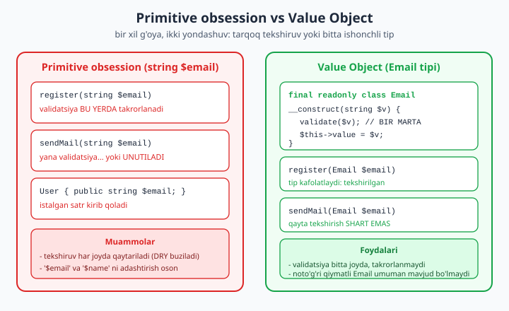
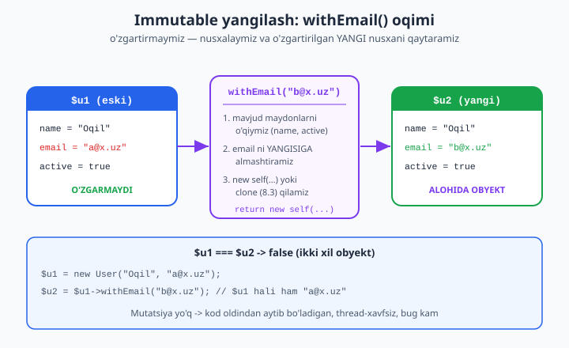

# 06 — readonly, Value Object va variance

[⬅️ Oldingi: 05 — Qat'iy tiplash va PHP 8.4 tip tizimi](./05-tip-tizimi.md) · [🏠 README](./README.md) · [Keyingi: 07 — Property hooks va asymmetric visibility ➡️](./07-property-hooks.md)

> **Bu bobda:** boshlovchi kitobda obyekt — bu "ichidagi maydonlarini istalgan vaqtda o'zgartirsa bo'ladigan quti" edi ([../php/14-class-va-obyekt-eng-asosiy-tushuncha.md](../php/14-class-va-obyekt-eng-asosiy-tushuncha.md)). Bu yondashuvning ulkan zaifligi bor: obyekt yaratilgandan keyin uning ichi qachon, kim tomonidan, qaysi xato tufayli o'zgarganini kuzatib bo'lmaydi. Shu bobda biz teskari falsafani o'rganamiz — **immutability** (o'zgarmaslik). PHP 8.1 `readonly` property va 8.2 `readonly class` bilan biz **bir marta yoziladigan, keyin hech kim buza olmaydigan** maydonlar yasaymiz. Bundan **Value Object** dizayni o'sib chiqadi: `Money`, `Email`, `Uuid` — ular `string $email` ni hamma joyga tarqatadigan **primitive obsession** ni o'ldiradi. Alohida e'tibor — **pul aniqligi**: nega `float` pulga MUTLAQO yaramaydi (`0.1 + 0.2` muammosi) va `bcmath` yoki butun-tiyin (minor units) qanday qutqaradi. So'ng **variance** ni — kovariantlik, kontravariantlik va Liskov prinsipini — `#[\Override]` (8.3) bilan birga ko'ramiz. Har bir kod bloki shu mashinada PHP 8.4.0 + bcmath da `php -l` va haqiqiy ishga tushirish bilan tekshirilgan; taqiqlangan misollar `// ❌` bilan belgilangan.

---

## 1. Mutatsiya — ko'rinmas dushman

Avval muammoni his qilaylik. Mana an'anaviy, "o'zgaruvchan" (mutable) obyekt:

```php
<?php
declare(strict_types=1);

final class Order
{
    public float $total = 0.0;
    public string $status = 'new';
}

$order = new Order();
$order->total = 100.0;
$order->status = 'paid';

// ... 500 qator kod, 10 ta funksiya keyin ...
processSomething($order); // bu funksiya $order->status ni 'cancelled' qilib qo'ydimi?
echo $order->status;       // endi nima? bilmaymiz
```

Bu yerda muammo shundaki, `$order` — **umumiy o'zgaruvchan holat**. Uni har qanday funksiya, har qanday joyda jimgina o'zgartirishi mumkin. Dastur kattalashganda, "bu maydon qayerda o'zgardi?" degan savol soatlab debug qildiradi. Bu — eng ko'p tarqalgan bug manbalaridan biri.

**Immutability** bu muammoni ildizidan yo'q qiladi: agar obyekt **yaratilgandan keyin o'zgarmasa**, u haqida bir marta o'ylab, keyin unutib qo'yish mumkin. Uch katta yutuq:

- **Oldindan aytib bo'ladigan kod (predictable):** obyektni qayergadir uzatsangiz, qaytib kelganda u o'sha-o'sha bo'ladi. "Kim o'zgartirdi?" degan savol yo'qoladi.
- **Thread-safe (oqimlar uchun xavfsiz):** o'zgarmaydigan ma'lumotni bir nechta jarayon/oqim bir vaqtda o'qisa, hech qanday poyga (race condition) bo'lmaydi — yozuv yo'q, faqat o'qish.
- **Bug kam:** holatning kutilmagan o'zgarishidan kelib chiqadigan butun bir bug sinfi yo'qoladi.

PHP bunga `readonly` kalit so'zi bilan til darajasida yordam beradi.

---

## 2. `readonly` property (PHP 8.1)

`readonly` property — bu **bir marta** (odatda konstruktorda) yoziladigan, keyin **hech qachon** o'zgartirib bo'lmaydigan maydon.

```php
<?php
declare(strict_types=1);

final class Point
{
    public function __construct(
        public readonly int $x,
        public readonly int $y,
    ) {}
}

$p = new Point(3, 4);
echo "x={$p->x}, y={$p->y}\n";   // x=3, y=4

$p->x = 10; // ❌ Cannot modify readonly property Point::$x
```

Oxirgi qator `\Error` tashlaydi:

```
PHP Fatal error: Uncaught Error: Cannot modify readonly property Point::$x
```

Diqqat: bu **`Exception` emas, `Error`** — ya'ni dasturchining mantiqiy xatosi, kutilmagan vaziyat emas. Uni `try/catch` bilan ushlash mumkin, lekin odatda **ushlamaslik kerak**: u kodingizda tuzatilishi lozim bo'lgan xatoni ko'rsatadi (xatolar ierarxiyasi haqida: [../php/23-xatolarni-boshqarish.md](../php/23-xatolarni-boshqarish.md)).

### 2.1. `readonly` ning aniq qoidalari

`readonly` ning xulq-atvori intuisiyaga zid bo'lishi mumkin, shuning uchun aniq sanab o'tamiz:

1. **Faqat tipli property** `readonly` bo'la oladi (`public readonly int $x` — ha; tipsiz — yo'q).
2. **Faqat bir marta**, deklaratsiya qilingan sinf doirasidan (`from within the declaring scope`) yoziladi. Konstruktordan tashqarida ham yozish mumkin, lekin faqat **birinchi** marta.
3. Bir marta initsializatsiya qilingandan keyin **hatto sinfning o'z ichidan ham** qayta yozib bo'lmaydi.
4. `unset()` ham mumkin emas.
5. Standart (default) qiymat berib bo'lmaydi: `public readonly int $x = 5;` — xato. Qiymat har doim konstruktorda beriladi.

Quyidagi misol 2-, 3- va 4-qoidalarni ishga tushirib ko'rsatadi:

```php
<?php
declare(strict_types=1);

final class Twice
{
    public readonly int $n;

    public function __construct()
    {
        $this->n = 1; // 1-yozuv: OK

        $this->n = 2; // ❌ Cannot modify readonly property Twice::$n
    }
}

new Twice();
```

Ishga tushirsak:

```
PHP Fatal error: Uncaught Error: Cannot modify readonly property Twice::$n
```

`unset()` ham taqiqlangan:

```php
<?php
declare(strict_types=1);

final class Single
{
    public function __construct(public readonly int $n) {}
}

$s = new Single(5);
unset($s->n); // ❌ Cannot unset readonly property Single::$n
```

> **Pedagogik eslatma:** `readonly` `private`/`public` o'rnini bosmaydi — ular boshqa o'qni boshqaradi. Kirish darajalari ([../php/16-kirish-darajalari-public-va-private.md](../php/16-kirish-darajalari-public-va-private.md)) "kim ko'ra/yoza oladi" ni belgilaydi; `readonly` esa "yozish umuman mumkinmi" ni. Ko'pincha `public readonly` ideal: tashqaridan **o'qish** ochiq, lekin **yozish** hech kimga (hatto sinfga ham, init dan keyin) yo'q.

---

## 3. `readonly class` (PHP 8.2)

Agar **barcha** propertylarni `readonly` qilmoqchi bo'lsangiz, har biriga alohida `readonly` yozish zerikarli. PHP 8.2 dan beri butun sinfni `readonly` deb e'lon qilish mumkin — shunda **hamma property avtomatik `readonly` bo'ladi**:

```php
<?php
declare(strict_types=1);

readonly class Coordinate
{
    public function __construct(
        public float $lat,   // avtomatik readonly
        public float $lon,   // avtomatik readonly
    ) {}
}

$c = new Coordinate(41.31, 69.24);
echo "lat={$c->lat}, lon={$c->lon}\n"; // lat=41.31, lon=69.24

$c->lat = 0.0; // ❌ Cannot modify readonly property Coordinate::$lat
```

`readonly class` qo'shimcha cheklovlar keltiradi:

- Sinfda **`readonly` bo'lmagan** property e'lon qilib bo'lmaydi (hammasi readonly bo'lishi shart).
- **Static property** bo'lishi mumkin emas (static holat — ta'rifan o'zgaruvchan global holat, immutability falsafasiga zid).
- **Tipsiz property** bo'lishi mumkin emas (chunki readonly faqat tipli maydonda ishlaydi).

Amalda Value Object lar deyarli har doim `final readonly class` bo'ladi: `final` — meros orqali xulqni buzishni to'xtatadi, `readonly` — holatni muzlatadi.

---

## 4. Value Object: primitive obsession ni o'ldirish

Endi `readonly` ni amaliy maqsadda ishlatamiz. **Value Object (VO)** — bu o'z identifikatori bo'lmagan, faqat **qiymati** bilan ahamiyatli, **o'zgarmas** kichik obyekt. Ikkita `Email` agar matnlari bir xil bo'lsa — bir xil (`id` si yo'q, taqqoslash qiymat bo'yicha).

### 4.1. Muammo: primitive obsession

Quyidagi kodga qarang. `$email` hamma joyda oddiy `string`:

```php
<?php
declare(strict_types=1);

// ❌ Primitive obsession: "string $email" hamma joyda
function register(string $email, string $name): void
{
    // bu yerda validatsiya
    if (!filter_var($email, FILTER_VALIDATE_EMAIL)) {
        throw new InvalidArgumentException('yomon email');
    }
    // ...
}

function sendWelcome(string $email): void
{
    // bu yerda YANA validatsiya... yoki UNUTILADI
}

// Eng yomoni — argumentlarni adashtirish oson:
register('Oqil', 'oqil@example.com'); // ❗ name va email joyi almashdi, lekin tip bir xil — PHP indamaydi
```

Muammolar:

- **Validatsiya takrorlanadi** (DRY buziladi) yoki bir joyda unutiladi.
- `string $email` va `string $name` — **bir xil tip**, shuning uchun ularni adashtirish oson, kompilyator yordam bermaydi.
- Funksiya `$email` olganida, u **tekshirilganmi yoki yo'qmi** — bilib bo'lmaydi. Har bir funksiya o'ziga ishonmasligi kerak.

Bu naqshning nomi — **primitive obsession** (primitiv tiplar bilan "obsessiya"): domen tushunchasini (email, pul, telefon) primitiv tip (`string`, `int`, `float`) bilan ifodalash.



### 4.2. Yechim: `Email` Value Object

```php
<?php
declare(strict_types=1);

final readonly class Email
{
    public string $value;

    public function __construct(string $value)
    {
        $value = strtolower(trim($value)); // normalizatsiya
        if (filter_var($value, FILTER_VALIDATE_EMAIL) === false) {
            throw new \InvalidArgumentException("Noto'g'ri email: {$value}");
        }
        $this->value = $value;
    }

    public function domain(): string
    {
        return substr($this->value, strpos($this->value, '@') + 1);
    }

    public function __toString(): string
    {
        return $this->value;
    }
}

$email = new Email('  Oqil@Example.COM ');
echo "Email: {$email}\n";           // oqil@example.com  (normalizatsiya bo'ldi)
echo "Domen: {$email->domain()}\n"; // example.com

new Email('bu-email-emas'); // ❌ InvalidArgumentException: Noto'g'ri email: bu-email-emas
```

Endi hamma narsa o'zgaradi:

```php
function register(Email $email, string $name): void { /* ... */ }
```

- `Email` tipini olgan funksiya **kafolatlangan tarzda tekshirilgan** email oladi — chunki yaroqsiz `Email` **umuman mavjud bo'lolmaydi** (konstruktor `throw` qiladi).
- Validatsiya **bitta joyda** — konstruktorda. Hech qayerda takrorlanmaydi.
- `Email` va `string $name` — **endi turli tiplar**. Argumentlarni adashtirsangiz, PHP `TypeError` beradi. Kompilyator endi siz tomonda.
- Normalizatsiya (`strtolower`, `trim`) ham bir joyda: butun tizim bo'ylab email har doim bir xil ko'rinishda bo'ladi.

### 4.3. `Uuid` Value Object

Aynan shu naqsh identifikatorlar uchun ham ishlaydi. `Uuid` — qat'iy formatli ID:

```php
<?php
declare(strict_types=1);

final readonly class Uuid
{
    public function __construct(public string $value)
    {
        $re = '/^[0-9a-f]{8}-[0-9a-f]{4}-[0-9a-f]{4}-[0-9a-f]{4}-[0-9a-f]{12}$/';
        if (!preg_match($re, $value)) {
            throw new \InvalidArgumentException("Noto'g'ri UUID: {$value}");
        }
    }

    public static function v4(): self
    {
        $b = random_bytes(16);
        $b[6] = chr((ord($b[6]) & 0x0f) | 0x40); // versiya 4
        $b[8] = chr((ord($b[8]) & 0x3f) | 0x80); // variant
        $hex = bin2hex($b);
        $str = sprintf(
            '%s-%s-%s-%s-%s',
            substr($hex, 0, 8),
            substr($hex, 8, 4),
            substr($hex, 12, 4),
            substr($hex, 16, 4),
            substr($hex, 20, 12),
        );
        return new self($str);
    }

    public function equals(self $o): bool
    {
        return $this->value === $o->value;
    }
}

$id = Uuid::v4();
echo "UUID: {$id->value}\n";        // masalan: 6cdffac2-b9ac-4ac4-8e0a-8192e493250d
var_dump($id->equals($id));         // bool(true)
var_dump($id->equals(Uuid::v4()));  // bool(false)
```

Bu yerda muhim naqsh — **named constructor** (`static` factory metod): `Uuid::v4()`. Konstruktorning o'zi (`new Uuid($str)`) faqat **mavjud** UUID matnini validatsiya qiladi; yangi tasodifiy UUID **yaratish** esa alohida `v4()` metodida. Bu — VO larda keng tarqalgan: `Money::of(...)`, `Email::fromString(...)` kabi gapiruvchi (semantik) yaratuvchilar.

> **Eslatma:** real loyihada UUID uchun `ramsey/uuid` yoki `symfony/uid` paketidan foydalaning — bizning misol pedagogik. Yodda tuting: `ext-sodium`/`ext-intl` bu mashinada yo'q, shuning uchun bu VO faqat `random_bytes` (core) ga tayanadi.

### 4.4. VO ni qachon ishlatish (va qachon yo'q)

VO ni **domen tushunchasi** o'z qoidalariga ega bo'lganda yasang: email (format), pul (valyuta + aniqlik), telefon, IBAN, foiz (0..100). Agar qiymat shunchaki "har qanday matn" yoki "har qanday son" bo'lsa va hech qanday qoidasi bo'lmasa — VO ortiqcha. **Enum** ham VO ga yaqin g'oya: cheklangan tanlovlar uchun ([../php/22-enum-cheklangan-tanlovlar.md](../php/22-enum-cheklangan-tanlovlar.md)) enum ishlatiladi, ochiq lekin qoidali qiymatlar uchun VO.

---

## 5. Pul: nega `float` MUTLAQO yaramaydi

Bu — eng muhim amaliy bo'lim. **Pulni hech qachon `float` da saqlamang.** Sababi — `float` ikkilik (binary) kasr bo'lib, `0.1`, `0.2`, `0.3` kabi o'nlik kasrlarni **aniq** ifodalay olmaydi.

```php
<?php
declare(strict_types=1);

$a = 0.1 + 0.2;
var_dump($a);               // float(0.30000000000000004)
var_dump($a === 0.3);       // bool(false)  ❗
echo number_format($a, 20); // 0.30000000000000004441
```

`0.1 + 0.2 !== 0.3` — bu PHP bug emas, bu IEEE 754 standartining tabiati (har qanday tilda shunday). Pulda bu **falokat**: `$0.30000000000000004` har bir tranzaksiyada to'planib, hisobotlar nomus bo'ladi, audit yiqiladi. Pulda yarim tiyin xato — qabul qilib bo'lmaydigan narsa.

Ikki to'g'ri yechim bor.

### 5.1. Yechim A — `bcmath` (ixtiyoriy aniqlikdagi arifmetika)

`bcmath` kengaytmasi sonlarni **string** sifatida saqlaydi va `scale` (kasr xona soni) bilan **aniq** hisoblaydi. Bu mashinada bcmath bor, shuning uchun ishlatamiz:

```php
<?php
declare(strict_types=1);

echo bcadd('0.1', '0.2', 2), "\n";     // 0.30   (aniq!)
echo bcsub('100.00', '0.01', 2), "\n"; // 99.99
echo bcmul('19.99', '3', 2), "\n";     // 59.97
echo bcdiv('10', '3', 4), "\n";        // 3.3333
echo bccomp('10.00', '10', 2), "\n";   // 0  (teng)
```

E'tibor bering: argumentlar — **string** (`'0.1'`, `'0.2'`), `float` emas. Uchinchi argument — `scale`, ya'ni natijada nechta kasr xona qoldirilsin. `bccomp` taqqoslash uchun: `-1` (kichik), `0` (teng), `1` (katta).

Endi shu asosda to'liq `Money` VO:

```php
<?php
declare(strict_types=1);

final readonly class Money
{
    private const SCALE = 2;

    public function __construct(
        public string $amount,   // string ko'rinishda saqlanadi (bcmath uchun)
        public string $currency,
    ) {
        if (!preg_match('/^-?\d+(\.\d+)?$/', $amount)) {
            throw new \InvalidArgumentException("Noto'g'ri summa: {$amount}");
        }
        if (!preg_match('/^[A-Z]{3}$/', $currency)) {
            throw new \InvalidArgumentException("Valyuta ISO-4217 (3 harf): {$currency}");
        }
    }

    public static function of(string $amount, string $currency): self
    {
        // normalizatsiya: doim SCALE xonaga keltirib saqlaymiz
        return new self(bcadd($amount, '0', self::SCALE), $currency);
    }

    private function assertSameCurrency(Money $other): void
    {
        if ($this->currency !== $other->currency) {
            throw new \DomainException(
                "Turli valyutalarni qo'shib bo'lmaydi: {$this->currency} vs {$other->currency}"
            );
        }
    }

    public function add(Money $other): self
    {
        $this->assertSameCurrency($other);
        return new self(bcadd($this->amount, $other->amount, self::SCALE), $this->currency);
    }

    public function subtract(Money $other): self
    {
        $this->assertSameCurrency($other);
        return new self(bcsub($this->amount, $other->amount, self::SCALE), $this->currency);
    }

    public function multiply(string $factor): self
    {
        return new self(bcmul($this->amount, $factor, self::SCALE), $this->currency);
    }

    public function equals(Money $other): bool
    {
        return $this->currency === $other->currency
            && bccomp($this->amount, $other->amount, self::SCALE) === 0;
    }

    public function isGreaterThan(Money $other): bool
    {
        $this->assertSameCurrency($other);
        return bccomp($this->amount, $other->amount, self::SCALE) === 1;
    }

    public function format(): string
    {
        return $this->amount . ' ' . $this->currency;
    }
}

$narx  = Money::of('19.99', 'USD');
$soliq = Money::of('1.60', 'USD');
$jami  = $narx->add($soliq);

echo "Narx:  " . $narx->format()  . "\n";  // 19.99 USD
echo "Jami:  " . $jami->format()  . "\n";  // 21.59 USD
echo "3 dona: " . $narx->multiply('3')->format() . "\n"; // 59.97 USD

// immutability: add() $narx ni o'zgartirmadi, yangi obyekt qaytardi
echo "Narx hali ham: " . $narx->format() . "\n";          // 19.99 USD

// tenglik QIYMAT bo'yicha:
var_dump(Money::of('10.00', 'USD')->equals(Money::of('10', 'USD')));    // bool(true)
var_dump(Money::of('10.00', 'USD')->equals(Money::of('10.00', 'EUR'))); // bool(false)

// turli valyuta -> domen xatosi
Money::of('5', 'USD')->add(Money::of('5', 'EUR'));
// ❌ DomainException: Turli valyutalarni qo'shib bo'lmaydi: USD vs EUR
```

Diqqat qiling: `Money` butunlay **immutable**. `add()`, `subtract()`, `multiply()` — hech biri obyektni o'zgartirmaydi, har biri **yangi `Money`** qaytaradi. `$narx->add($soliq)` dan keyin `$narx` hali ham `19.99 USD`. Bu — keyingi bo'limdagi `withX` naqshining o'zi.

Yana bir muhim qoida — **turli valyutalarni qo'shib bo'lmaydi**. `Money` buni `DomainException` bilan to'xtatadi: 5 dollar + 5 yevro = ma'nosiz amal. VO o'z domen qoidalarini o'zi himoya qiladi.

### 5.2. Yechim B — butun-tiyin (minor units)

Ikkinchi yondashuv: pulni eng kichik birlikda (tiyin, cent) **butun son** (`int`) sifatida saqlash. `$19.99` → `1999` cent. `float` umuman ishtirok etmaydi, oddiy `int` arifmetikasi aniq:

```php
<?php
declare(strict_types=1);

final readonly class MoneyMinor
{
    public function __construct(
        public int $minorUnits,   // masalan: cent / tiyin
        public string $currency,
    ) {
        if (!preg_match('/^[A-Z]{3}$/', $currency)) {
            throw new \InvalidArgumentException("Valyuta 3 harf: {$currency}");
        }
    }

    public static function fromDecimal(string $amount, string $currency): self
    {
        // "19.99" -> 1999. bcmath bilan aniq ko'paytirib, butunga aylantiramiz.
        $scaled = bcmul($amount, '100', 0); // scale 0
        return new self((int) $scaled, $currency);
    }

    public function add(self $o): self
    {
        if ($this->currency !== $o->currency) {
            throw new \DomainException('Valyuta mos emas');
        }
        return new self($this->minorUnits + $o->minorUnits, $this->currency);
    }

    public function format(): string
    {
        $major = intdiv($this->minorUnits, 100);
        $minor = abs($this->minorUnits % 100);
        return sprintf('%d.%02d %s', $major, $minor, $this->currency);
    }
}

$a = MoneyMinor::fromDecimal('19.99', 'USD');
$b = MoneyMinor::fromDecimal('0.02', 'USD');
echo $a->format(), "\n";          // 19.99 USD
echo $a->add($b)->format(), "\n"; // 20.01 USD
var_dump($a->minorUnits);         // int(1999)
```

**Qaysi yondashuv?**

| | `bcmath` (string) | Butun-tiyin (`int`) |
| --- | --- | --- |
| Aniqlik | ixtiyoriy (scale boshqariladi) | tabiiy butun aniqlik |
| Tezlik | sekinroq (string arifmetika) | juda tez (native int) |
| Bo'lish/foiz | qulay (`bcdiv`, scale bilan) | qo'lda yaxlitlash kerak |
| 3 dan ortiq kasr (krip valyuta) | oson | `int` overflow xavfi |

Amaliyot: **moliyaviy hisob-kitob, foiz, bo'lish ko'p bo'lsa** — `bcmath`. **Oddiy do'kon, faqat qo'shish/ayirish** — butun-tiyin tez va sodda. Eng muhimi — **ikkalasida ham `float` yo'q**.

### 5.3. Yaxlitlash (round) rejimi haqida

Bo'lish va foiz hisoblaganda qoldiq paydo bo'ladi (`bcdiv('10','3',2)` = `3.33`). `bcdiv`/`bcmul` o'zi qoldiqni **kesib tashlaydi** (trunc), yaxlitlamaydi. **Yangilik:** PHP 8.4 maxsus `bcround()` funksiyasini va `RoundingMode` enum'ini olib keldi — endi qo'lda hiyla qilish shart emas:

```php
<?php
declare(strict_types=1);

// PHP 8.4: bcround() native funksiya
echo bcround('3.335', 2), "\n"; // 3.34   (yarim yuqoriga, default)
echo bcround('3.334', 2), "\n"; // 3.33
echo bcround('2.005', 2), "\n"; // 2.01

// PHP 8.4: RoundingMode enum bilan rejimni aniq tanlash
echo bcround('2.5', 0, RoundingMode::HalfAwayFromZero), "\n"; // 3
echo bcround('2.5', 0, RoundingMode::HalfEven), "\n";         // 2  (bankcha yaxlitlash)
```

`RoundingMode::HalfEven` — "bankcha yaxlitlash" (banker's rounding): yarim qiymat eng yaqin **juft** songa boradi, bu uzoq vaqtda yaxlitlash xatosini muvozanatlaydi. Asosiy g'oya: qaysi yaxlitlash rejimini ishlatishingizni **ataylab tanlang** va butun tizimda izchil qo'llang — yaxlitlash farqi katta summalarda sezilarli xatoga aylanadi.

> **Tarixiy eslatma:** PHP 8.4 dan oldin `bcround()` mavjud emasdi va dasturchilar "summaga `0.005` qo'shib, keyin kesish" kabi qo'lda hiyla yozardilar. 8.4 da bu standartlashdi — bu bobning misollari shu mashinadagi PHP 8.4.0 ning **haqiqiy** `bcround()` i bilan tekshirilgan.

---

## 6. Immutable yangilash: `withX` naqshi

Immutable obyektni "o'zgartirish" kerak bo'lsa-chi? Javob: **o'zgartirmaymiz — o'zgartirilgan nusxani qaytaramiz**. Bu — `withX` naqshi (PSR-7 HTTP xabarlari ham aynan shunday ishlaydi).

```php
<?php
declare(strict_types=1);

final readonly class User
{
    public function __construct(
        public string $name,
        public string $email,
        public bool $active = true,
    ) {}

    public function withEmail(string $email): self
    {
        // readonly -> to'g'ridan-to'g'ri o'zgartira olmaymiz; YANGI obyekt yaratamiz
        return new self($this->name, $email, $this->active);
    }

    public function deactivate(): self
    {
        return new self($this->name, $this->email, false);
    }
}

$u1 = new User('Oqil', 'oqil@example.com');
$u2 = $u1->withEmail('new@example.com');
$u3 = $u2->deactivate();

echo "u1: {$u1->email}, active=" . var_export($u1->active, true) . "\n"; // oqil@example.com, active=true
echo "u2: {$u2->email}, active=" . var_export($u2->active, true) . "\n"; // new@example.com, active=true
echo "u3: {$u3->email}, active=" . var_export($u3->active, true) . "\n"; // new@example.com, active=false

var_dump($u1 === $u2); // bool(false) — har biri alohida obyekt
```

`$u1` hech qachon o'zgarmadi. Har bir `withX`/amal yangi obyekt qaytaradi. Bu oqimni diagramma yaxshi ko'rsatadi:



### 6.1. `__clone` ichida `readonly` ni o'zgartirish (PHP 8.3)

`withEmail` da hamma maydonni qo'lda `new self($this->name, $email, ...)` ko'rinishida uzatdik. Maydon ko'p bo'lsa (10 ta), bu zerikarli va xato qiladi (bittasini unutib qoldirasiz). PHP 8.3 dan beri **`__clone()` ichida `readonly` propertyni qayta yozish mumkin** — bu `clone` qilib, faqat kerakli maydonni o'zgartirishga imkon beradi:

```php
<?php
declare(strict_types=1);

final class Profile
{
    public function __construct(
        public readonly string $ism,
        public readonly string $bio,
        public readonly string $shahar,
    ) {}

    private ?string $_bio = null;
    private ?string $_shahar = null;

    public function withBio(string $bio): static
    {
        return $this->cloneWith(bio: $bio);
    }

    public function withShahar(string $shahar): static
    {
        return $this->cloneWith(shahar: $shahar);
    }

    private function cloneWith(?string $bio = null, ?string $shahar = null): static
    {
        $this->_bio = $bio;
        $this->_shahar = $shahar;
        $copy = clone $this;     // __clone() chaqiriladi
        $this->_bio = null;
        $this->_shahar = null;
        return $copy;
    }

    public function __clone(): void
    {
        // PHP 8.3: clone amaliyoti davomida readonly maydon QAYTA yoziladi
        if ($this->_bio !== null) {
            $this->bio = $this->_bio;
        }
        if ($this->_shahar !== null) {
            $this->shahar = $this->_shahar;
        }
        $this->_bio = null;
        $this->_shahar = null;
    }
}

$p1 = new Profile('Oqil', 'dasturchi', 'Toshkent');
$p2 = $p1->withBio('PHP eksperti');
$p3 = $p2->withShahar('Samarqand');

printf("p1: %s | %s | %s\n", $p1->ism, $p1->bio, $p1->shahar); // Oqil | dasturchi | Toshkent
printf("p2: %s | %s | %s\n", $p2->ism, $p2->bio, $p2->shahar); // Oqil | PHP eksperti | Toshkent
printf("p3: %s | %s | %s\n", $p3->ism, $p3->bio, $p3->shahar); // Oqil | PHP eksperti | Samarqand
```

Bu ishlaydi, chunki 8.3 da klonlangan obyektning `readonly` maydonini **`__clone()` doirasida** qayta initsializatsiya qilishga ruxsat berildi. 8.2 va undan oldin bu `Error` tashlardi. Diqqat: bu — ilg'or naqsh; oddiy hollarda (3-4 maydon) `new self(...)` aniqroq va tushunarliroq. `__clone` yondashuvi maydon juda ko'p bo'lganda foydali.

### 6.2. TUZOQ: `readonly` faqat referensiyani muzlatadi, ichkarini emas

Eng ko'p adashtiradigan joy. `readonly` property **maydonning o'zini** (ya'ni qaysi obyektga ishora qilishini) muzlatadi, lekin agar maydon ichida **o'zgaruvchan obyekt** bo'lsa, o'sha obyektning ichi o'zgarishi mumkin:

```php
<?php
declare(strict_types=1);

final class Holder
{
    public function __construct(public readonly \ArrayObject $data) {}
}

$ao = new \ArrayObject(['x' => 1]);
$h  = new Holder($ao);

$h->data['x'] = 999;  // ❗ obyekt ICHI o'zgardi — readonly buni TO'XTATMAYDI
echo "data[x] = {$h->data['x']}\n"; // data[x] = 999
```

`$h->data = $boshqaObjekt;` — bu `Error` (referensiya muzlatilgan). Lekin `$h->data['x'] = 999` — bu ruxsat etiladi, chunki siz `data` maydonini emas, **uning ichidagi obyektni** o'zgartiryapsiz. Chinakam immutability uchun ichki obyektlar ham immutable bo'lishi kerak (masalan `array` — qiymat tipi, xavfsiz; `ArrayObject` — obyekt, xavfli). Bu **transitiv immutability** (chuqur o'zgarmaslik) deyiladi va PHP uni avtomatik kafolatlamaydi — buni dizaynda o'zingiz ta'minlaysiz.

`array` esa xavfsiz, chunki PHP da massiv — **qiymat tipi** (copy-on-write):

```php
<?php
declare(strict_types=1);

final readonly class Basket
{
    public function __construct(public array $items = []) {}

    public function withItem(string $item): self
    {
        return new self([...$this->items, $item]); // yangi massiv
    }
}

$b  = new Basket(['olma']);
$b2 = $b->withItem('nok');
print_r($b->items);  // ['olma']          — o'zgarmadi
print_r($b2->items); // ['olma', 'nok']
```

---

## 7. Variance: meros, return va parametr turlari

Endi mavzuni o'zgartiramiz — **variance** (variatsiya). Bu meros (override) bilan tip tizimi qanday o'zaro ishlashini boshqaradigan qoidalar to'plami. Savol shu: **bola sinf** (subclass) metodni override qilganda, return va parametr turlarini qanchalik o'zgartirishi mumkin?

### 7.1. Kovariantlik: return turini TORAYTIRISH mumkin

**Kovariantlik (covariance):** override qilingan metod **torroq** (subtip) return turini qaytarishi mumkin. Mantiq oddiy: agar baza "men `Animal` qaytaraman" desa, bola "men aniqrog'ini — `Cat` qaytaraman" deyishi mijozni ranjitmaydi. `Cat` baribir `Animal`, demak shartnoma buzilmadi.

```php
<?php
declare(strict_types=1);

class Animal
{
    public function name(): string { return 'hayvon'; }
}

class Cat extends Animal
{
    public function name(): string { return 'mushuk'; }
}

abstract class AnimalShelter
{
    abstract public function adopt(): Animal; // bazada return turi: Animal
}

class CatShelter extends AnimalShelter
{
    // kovariant: Animal o'rniga uning TOR (subtip) turini qaytarish MUMKIN
    public function adopt(): Cat
    {
        return new Cat();
    }
}

$shelter = new CatShelter();
echo "Adopt: " . $shelter->adopt()->name() . "\n"; // Adopt: mushuk
```

Teskarisi — **return turini KENGAYTIRISH** — taqiqlangan. Agar baza `Cat` qaytaraman desa, bola `Animal` qaytarsa, mijoz `Cat` kutgan joyda `Animal` (balki `Dog`) oladi — shartnoma buziladi:

```php
<?php
declare(strict_types=1);

class Animal {}
class Cat extends Animal {}

abstract class CatShelter
{
    abstract public function adopt(): Cat; // tor tur va'da qilingan
}

class BadShelter extends CatShelter
{
    // ❌ return turini KENGAYTIRISH mumkin emas (Animal, Cat dan keng)
    public function adopt(): Animal
    {
        return new Animal();
    }
}
```

Bu kod **`php -l` (compile vaqti)** da yiqiladi:

```
PHP Fatal error: Declaration of BadShelter::adopt(): Animal
must be compatible with CatShelter::adopt(): Cat
```

### 7.2. Kontravariantlik: parametr turini KENGAYTIRISH mumkin

**Kontravariantlik (contravariance):** override qilingan metod **kengroq** (supertip) parametr turini qabul qilishi mumkin. Mantiq teskari yo'nalishda: agar baza "men `CatFood` qabul qilaman" desa, bola "men har qanday `Food` ni — `CatFood` ham, boshqasi ham — qabul qilaman" deyishi mijozni ranjitmaydi. Mijoz `CatFood` beradi; `CatFood` ham `Food`, demak bola uni qabul qiladi.

```php
<?php
declare(strict_types=1);

class Food {}
class CatFood extends Food {}

abstract class Feeder
{
    abstract public function feed(CatFood $food): void; // bazada TOR parametr turi
}

class UniversalFeeder extends Feeder
{
    // kontravariant: CatFood o'rniga uning KENG (supertip) turini qabul qilish MUMKIN
    public function feed(Food $food): void
    {
        echo "Ovqatlandi: " . $food::class . "\n";
    }
}

$f = new UniversalFeeder();
$f->feed(new CatFood()); // Ovqatlandi: CatFood
$f->feed(new Food());    // Ovqatlandi: Food   (kengaytirilgani uchun bu ham OK)
```

Eslab qolish uchun qulay qoida:

- **Return** — bola **toraytiradi** (kovariant): "ko'proq va'da ber".
- **Parametr** — bola **kengaytiradi** (kontravariant): "kamroq talab qil".

Ikkalasi ham **Robustness prinsipi** ning ifodasi: "qabul qilishda kengfe'l bo'l, qaytarishda aniq bo'l".

### 7.3. Liskov almashtirish prinsipi (LSP)

Yuqoridagi ikkala qoida ham bitta katta prinsipdan kelib chiqadi — **Liskov Substitution Principle**: *subtip har doim o'z bazasining o'rnini hech narsani buzmasdan bosa olishi kerak*. Ya'ni `Feeder` kutilgan har qanday joyda `UniversalFeeder` ishlashi shart:

```php
<?php
declare(strict_types=1);

class Food {}
class CatFood extends Food {}

abstract class Feeder
{
    abstract public function feed(CatFood $food): void;
}

class UniversalFeeder extends Feeder
{
    public function feed(Food $food): void
    {
        echo "Ovqatlandi: " . $food::class . "\n";
    }
}

// Bu funksiya FAQAT Feeder shartnomasini biladi:
function feedAnyFeeder(Feeder $feeder): void
{
    $feeder->feed(new CatFood()); // baza shartnomasi bo'yicha CatFood beradi
}

feedAnyFeeder(new UniversalFeeder()); // Ovqatlandi: CatFood
```

`feedAnyFeeder` faqat `Feeder` ni biladi va `CatFood` beradi. `UniversalFeeder` ni unga uzatsak ham ishlaydi — chunki u variance qoidalariga rioya qilgan. **Variance — bu LSP ni tilning o'zi majburlashidir.** PHP variance qoidasini buzgan kodni ishlatishga umuman yo'l qo'ymaydi (compile xato).

---

## 8. `#[\Override]` atributi (PHP 8.3)

Variance bilan bog'liq amaliy muammo: metod **override** qilyapman deb o'ylaysiz, lekin nomda **xato** qildingiz — yangi, mustaqil metod yaratib qo'yasiz. Baza metodi hech qachon chaqirilmaydi va bu bug jimgina yashaydi.

`#[\Override]` atributi shuni oldini oladi: "men chindan ham bazadagi metodni override qilyapman" deb e'lon qilasiz, va agar bunday baza metodi **mavjud bo'lmasa**, PHP compile xatosi beradi.

To'g'ri ishlatish:

```php
<?php
declare(strict_types=1);

abstract class Report
{
    abstract public function render(): string;
}

class HtmlReport extends Report
{
    #[\Override] // "men bazadagi render() ni override qilyapman" deklaratsiyasi
    public function render(): string
    {
        return '<h1>Hisobot</h1>';
    }
}

echo (new HtmlReport())->render(), "\n"; // <h1>Hisobot</h1>
```

Endi nomda xato qilsak (`render` o'rniga `renderr`):

```php
<?php
declare(strict_types=1);

abstract class Report
{
    abstract public function render(): string;
}

class PdfReport extends Report
{
    public function render(): string { return 'pdf'; }

    #[\Override] // ❌ "renderr" bazada yo'q
    public function renderr(): string
    {
        return 'typo';
    }
}
```

Bu **`php -l` (compile vaqti)** da yiqiladi:

```
PHP Fatal error: PdfReport::renderr() has #[\Override] attribute,
but no matching parent method exists
```

Atributsiz bo'lsa, `renderr()` jimgina yangi metod bo'lib qolardi va xato ishlash vaqtigacha sezilmasdi. `#[\Override]` ni har bir override qilingan metodga qo'yish — zamonaviy PHP da kuchli odat: u "refactoring paytida baza metod nomi o'zgarsa, men darrov bilaman" kafolatini beradi.

---

## 9. Hammasini birlashtirish: ekspert kontrol ro'yxati

- Pulni **hech qachon** `float` da saqlamang — `bcmath` (string) yoki butun-tiyin (`int`).
- Domen tushunchasi (email, pul, telefon, foiz) o'z qoidasiga ega bo'lsa — **Value Object** yasang, `string`/`int` tarqatib yurmang.
- VO ni `final readonly class` qiling: `final` xulqni, `readonly` holatni muzlatadi.
- Validatsiyani **konstruktorga** joylang: yaroqsiz VO umuman mavjud bo'lolmasin.
- "O'zgartirish" kerak bo'lsa — `withX` (yangi nusxa). 8.3 da maydon ko'p bo'lsa `__clone`.
- `readonly` faqat **referensiyani** muzlatadi; ichki obyektlar ham immutable bo'lsin (transitiv immutability).
- Override qilganda variance qoidalarini eslang: **return toraytiriladi, parametr kengaytiriladi.**
- Har bir override qilingan metodga `#[\Override]` qo'ying — typo bug larini compile vaqtida tuting.

Keyingi bobda holatni boshqarishning yana bir kuchli vositasini — **property hooks** va **asymmetric visibility** ni — ko'ramiz: `readonly` "umuman yozma" deydi, asymmetric visibility esa "tashqaridan o'qi, lekin faqat ichkaridan yoz" degan nozikroq nazoratni beradi.

---

## Mashqlar

### Oson

1. `Temperature` nomli `final readonly class` yozing: `public readonly float $celsius`. `toFahrenheit(): float` metodi `($celsius * 9/5) + 32` qaytarsin. Tashqaridan `$t->celsius = 100;` qilib ko'ring va qanday xato chiqishini yozing.
2. `Money::of('0.1', 'USD')->add(Money::of('0.2', 'USD'))` natijasini chop eting. Endi xuddi shu hisobni `float` bilan (`0.1 + 0.2`) qilib, ikki natijani solishtiring. Nega farq qiladi?
3. `Email` VO ga `equals(Email $other): bool` metodi qo'shing (matn bo'yicha taqqoslash, normalizatsiyadan keyin). `new Email('A@X.uz')->equals(new Email('a@x.uz'))` `true` qaytarishini tekshiring.

### O'rta

4. `Percentage` Value Object yozing: konstruktor `string $value` oladi, faqat `0..100` oralig'ida bo'lsin (aks holda `InvalidArgumentException`). `ofAmount(string $amount): string` metodi summaning shu foizini `bcmath` bilan hisoblasin. `(new Percentage('15'))->ofAmount('200.00')` → `30.00`.
5. `Animal`/`Cat` misolida `Dog extends Animal` qo'shing va `DogShelter extends AnimalShelter` yarating (`adopt(): Dog`). Endi `AnimalShelter` ga `#[\Override]` ni `adopt` ustiga qo'ying va atributni ataylab xato metodga (`adoptt`) ko'chiring — qanday xato chiqishini yozing.
6. `MoneyMinor` ga `multiply(int $factor): self` va `isZero(): bool` metodlarini qo'shing. `MoneyMinor::fromDecimal('19.99','USD')->multiply(0)->isZero()` `true` bo'lishini tekshiring.

### Qiyin

7. **Immutable `DateRange`**: `final readonly class DateRange` yozing — `DateTimeImmutable $start`, `DateTimeImmutable $end`. Konstruktor `start > end` bo'lsa xato bersin. `withEnd(DateTimeImmutable): self`, `overlaps(self): bool` (ikki oraliq kesishadimi) va `days(): int` metodlarini yozing. `withEnd` immutability ni buzmasligini (eski obyekt o'zgarmasligini) ko'rsating.
8. **Kovariant factory**: abstrakt `Shape` sinfi `abstract public function withScale(float $k): static` va `abstract public function area(): float` ga ega bo'lsin. `Square` (`readonly float $side`) ni amalga oshiring; `withScale` immutable bo'lib, masshtablangan yangi `Square` qaytarsin. `#[\Override]` ishlating. `static` qaytish turi nima uchun bu yerda `self` dan yaxshiroq ekanini izohlang.

---

<details markdown="1"><summary>Yechim — 1</summary>

```php
<?php
declare(strict_types=1);

final readonly class Temperature
{
    public function __construct(public float $celsius) {}

    public function toFahrenheit(): float
    {
        return ($this->celsius * 9 / 5) + 32;
    }
}

$t = new Temperature(100.0);
echo $t->toFahrenheit(), "\n"; // 212

$t->celsius = 0.0; // ❌ Cannot modify readonly property Temperature::$celsius
```

`$t->celsius = 0.0;` quyidagini beradi:

```
PHP Fatal error: Uncaught Error: Cannot modify readonly property Temperature::$celsius
```

Bu `\Error` — dasturchining xatosi, kutilmagan holat emas. Uni ushlamaslik, balki kodni tuzatish kerak.

</details>

<details markdown="1"><summary>Yechim — 2</summary>

```php
<?php
declare(strict_types=1);

// (Money sinfi 5.1-bo'limdagidek deb faraz qilamiz)
echo Money::of('0.1', 'USD')->add(Money::of('0.2', 'USD'))->format(), "\n";
// 0.30 USD   <- aniq

$float = 0.1 + 0.2;
var_dump($float === 0.3); // bool(false)
echo number_format($float, 17), "\n"; // 0.30000000000000004
```

`bcmath` aniq `0.30` beradi, chunki u o'nlik sonlarni string sifatida, belgilangan `scale` bilan hisoblaydi. `float` esa IEEE 754 ikkilik kasr bo'lib, `0.1` va `0.2` ni aniq ifodalay olmaydi — qoldiq `0.30000000000000004` paydo bo'ladi. Shuning uchun pulda hech qachon `float` ishlatilmaydi.

</details>

<details markdown="1"><summary>Yechim — 3</summary>

```php
<?php
declare(strict_types=1);

final readonly class Email
{
    public string $value;

    public function __construct(string $value)
    {
        $value = strtolower(trim($value));
        if (filter_var($value, FILTER_VALIDATE_EMAIL) === false) {
            throw new \InvalidArgumentException("Noto'g'ri email: {$value}");
        }
        $this->value = $value;
    }

    public function equals(Email $other): bool
    {
        return $this->value === $other->value; // konstruktor allaqachon normallashtirgan
    }
}

var_dump((new Email('A@X.uz'))->equals(new Email('a@x.uz'))); // bool(true)
```

Muhim nuqta: normalizatsiya (`strtolower`, `trim`) konstruktorda bo'lgani uchun, `equals` ichida qo'shimcha ish kerak emas — ikkala `Email` ham allaqachon bir xil ko'rinishda saqlangan.

</details>

<details markdown="1"><summary>Yechim — 4</summary>

```php
<?php
declare(strict_types=1);

final readonly class Percentage
{
    public function __construct(public string $value)
    {
        if (bccomp($value, '0', 2) < 0 || bccomp($value, '100', 2) > 0) {
            throw new \InvalidArgumentException("Foiz 0..100 oralig'ida: {$value}");
        }
    }

    public function ofAmount(string $amount): string
    {
        // amount * value / 100  (oraliqda scale 4, natijada 2)
        return bcdiv(bcmul($amount, $this->value, 4), '100', 2);
    }
}

echo (new Percentage('15'))->ofAmount('200.00'), "\n"; // 30.00

new Percentage('150'); // ❌ InvalidArgumentException: Foiz 0..100 oralig'ida: 150
```

E'tibor bering: oraliq ko'paytma `scale 4` da, yakuniy bo'lish `scale 2` da. Bu — yaxlitlash xatosini kamaytirish uchun: oraliq hisobni kengroq aniqlikda olib, faqat oxirida kerakli xonaga keltirasiz.

</details>

<details markdown="1"><summary>Yechim — 5</summary>

```php
<?php
declare(strict_types=1);

class Animal { public function name(): string { return 'hayvon'; } }
class Cat extends Animal { public function name(): string { return 'mushuk'; } }
class Dog extends Animal { public function name(): string { return 'it'; } }

abstract class AnimalShelter
{
    abstract public function adopt(): Animal;
}

class DogShelter extends AnimalShelter
{
    #[\Override] // to'g'ri: bazada adopt() bor; kovariant return (Dog, Animal subtipi)
    public function adopt(): Dog
    {
        return new Dog();
    }
}

echo (new DogShelter())->adopt()->name(), "\n"; // it
```

Endi atributni ataylab xato metodga ko'chirsak:

```php
class BadShelter extends AnimalShelter
{
    public function adopt(): Animal { return new Animal(); }

    #[\Override] // ❌ "adoptt" bazada yo'q
    public function adoptt(): Animal { return new Animal(); }
}
```

`php -l` darrov yiqiladi:

```
PHP Fatal error: BadShelter::adoptt() has #[\Override] attribute,
but no matching parent method exists
```

Bu aynan `#[\Override]` ning maqsadi: typo (`adoptt`) ni compile vaqtida ushlash, ishlash vaqtigacha kutmasdan.

</details>

<details markdown="1"><summary>Yechim — 6</summary>

```php
<?php
declare(strict_types=1);

final readonly class MoneyMinor
{
    public function __construct(
        public int $minorUnits,
        public string $currency,
    ) {
        if (!preg_match('/^[A-Z]{3}$/', $currency)) {
            throw new \InvalidArgumentException("Valyuta 3 harf: {$currency}");
        }
    }

    public static function fromDecimal(string $amount, string $currency): self
    {
        return new self((int) bcmul($amount, '100', 0), $currency);
    }

    public function multiply(int $factor): self
    {
        return new self($this->minorUnits * $factor, $this->currency);
    }

    public function isZero(): bool
    {
        return $this->minorUnits === 0;
    }

    public function format(): string
    {
        $major = intdiv($this->minorUnits, 100);
        $minor = abs($this->minorUnits % 100);
        return sprintf('%d.%02d %s', $major, $minor, $this->currency);
    }
}

$m = MoneyMinor::fromDecimal('19.99', 'USD');
var_dump($m->multiply(0)->isZero()); // bool(true)
echo $m->multiply(3)->format(), "\n"; // 59.97 USD
echo $m->format(), "\n";              // 19.99 USD  (immutable: o'zgarmadi)
```

`multiply` butun son arifmetikasi bo'lgani uchun mutlaqo aniq — `float` aralashmaydi. Va `multiply` immutable: original `$m` o'zgarmaydi.

</details>

<details markdown="1"><summary>Yechim — 7</summary>

```php
<?php
declare(strict_types=1);

final readonly class DateRange
{
    public function __construct(
        public \DateTimeImmutable $start,
        public \DateTimeImmutable $end,
    ) {
        if ($start > $end) {
            throw new \InvalidArgumentException("start, end dan keyin bo'la olmaydi");
        }
    }

    public function withEnd(\DateTimeImmutable $end): self
    {
        return new self($this->start, $end);
    }

    public function overlaps(self $o): bool
    {
        // ikki oraliq kesishadi <=> har birining boshi ikkinchisining oxiridan keyin emas
        return $this->start <= $o->end && $o->start <= $this->end;
    }

    public function days(): int
    {
        return (int) $this->start->diff($this->end)->days;
    }
}

$r1 = new DateRange(
    new \DateTimeImmutable('2026-01-01'),
    new \DateTimeImmutable('2026-01-10'),
);
$r2 = $r1->withEnd(new \DateTimeImmutable('2026-01-20'));

echo "r1 days = {$r1->days()}\n"; // r1 days = 9   (o'zgarmadi!)
echo "r2 days = {$r2->days()}\n"; // r2 days = 19

$other = new DateRange(
    new \DateTimeImmutable('2026-01-05'),
    new \DateTimeImmutable('2026-02-01'),
);
var_dump($r1->overlaps($other)); // bool(true)
```

Asosiy nuqtalar:

- **Immutability tasdiqi:** `withEnd` `$r2` yaratdi, lekin `$r1->days()` hali ham `9` — `$r1` o'zgarmadi. `withEnd` `new self(...)` qaytargani uchun original tegilmadi.
- **`DateTimeImmutable`** tanlangani muhim: oddiy `DateTime` o'zgaruvchan (mutable), uni VO ichida saqlash transitiv immutability ni buzardi (kimdir `$r1->start->modify('+1 day')` qilib qo'yishi mumkin edi). `DateTimeImmutable` esa o'zi immutable, demak butun `DateRange` chinakam o'zgarmas.
- **`overlaps` mantig'i:** ikki oraliq kesishadi, agar va faqat agar birinchisining boshi ikkinchisining oxiridan keyin **emas** va ikkinchisining boshi birinchisining oxiridan keyin **emas** bo'lsa.

</details>

<details markdown="1"><summary>Yechim — 8</summary>

```php
<?php
declare(strict_types=1);

abstract class Shape
{
    abstract public function withScale(float $k): static;
    abstract public function area(): float;
}

final class Square extends Shape
{
    public function __construct(public readonly float $side) {}

    #[\Override]
    public function withScale(float $k): static
    {
        return new self($this->side * $k); // immutable: yangi Square
    }

    #[\Override]
    public function area(): float
    {
        return $this->side ** 2;
    }
}

$sq  = new Square(2.0);
$big = $sq->withScale(3.0);

echo "kichik area = {$sq->area()}\n";  // 4   (o'zgarmadi)
echo "katta area  = {$big->area()}\n"; // 36
```

**Nega `static`, `self` emas?**

`self` — bu **shu sinfning o'zi** (`Square`) ni anglatadi, deklaratsiya qilingan joyda qotib qoladi. `static` esa **late static binding** — haqiqiy ishga tushgan sinfni anglatadi. Faraz qiling, kelajakda `Square` dan meros olgan `ColoredSquare` qildingiz:

- Agar `withScale(): self` bo'lganida, `(new ColoredSquare(...))->withScale(2)` baribir **oddiy `Square`** qaytarardi — rang yo'qolardi.
- `withScale(): static` bilan esa u **`ColoredSquare`** qaytaradi — bu kovariantlikning amaliy foydasi.

Shuning uchun immutable `withX`/factory metodlarda deyarli har doim `static` ishlatiladi: u meros ierarxiyasi bo'ylab "to'g'ri" tipni saqlab qoladi. `static` — `self` ning kovariant kengaytmasi: PHP buni override paytida tip-xavfsiz deb qabul qiladi.

</details>

---

[⬅️ Oldingi: 05 — Qat'iy tiplash va PHP 8.4 tip tizimi](./05-tip-tizimi.md) · [🏠 README](./README.md) · [Keyingi: 07 — Property hooks va asymmetric visibility ➡️](./07-property-hooks.md)
