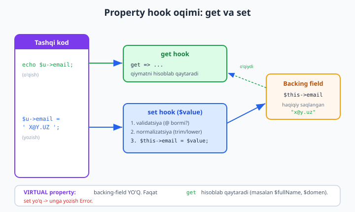
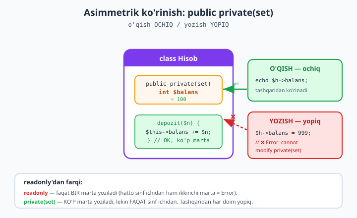

# 07 — Property hooks va asymmetric visibility (8.4)

[⬅️ Oldingi: 06 — readonly, Value Object va variance](./06-value-object.md) · [🏠 README](./README.md) · [Keyingi: 08 — Reflection, attributes va FFI ➡️](./08-reflection-attributes.md)

> **Bu bobda:** PHP 8.4 ning ikkita eng yangi va eng kutilgan imkoniyatini — **property hooks** va **asymmetric visibility** ni chuqur o'rganamiz. Property hook nima: `get` va `set` mantiqini propertyning *o'ziga* osib qo'yish — endi `getName()`/`setName()` boilerplate kerak emas. **Virtual property** — backing-field'siz, faqat hisoblanadigan xususiyat (masalan `$fullName`, `$domen`). **Asymmetric visibility** (`public private(set)`) — tashqaridan o'qiladi, lekin faqat sinf ichidan yoziladi. Bularning hammasi ayni shu kompyuterda **PHP 8.4.0** da haqiqatan ishlaydi — har bir misol `php` bilan ishga tushirilib tasdiqlangan, taqiqlangan urinishlar esa `// ❌` bilan belgilangan. Bu bob boshlovchi kitobdagi [kirish darajalari](../php/16-kirish-darajalari-public-va-private.md) va [class va obyekt](../php/14-class-va-obyekt-eng-asosiy-tushuncha.md) boblariga, hamda [06 — readonly va Value Object](./06-value-object.md) ga tayanadi.

---

## Muammo: getter/setter boilerplate

Boshlovchi kitobda [kirish darajalari](../php/16-kirish-darajalari-public-va-private.md) bilan tanishgansiz: propertyni `private` qilamiz, tashqi kod unga to'g'ridan-to'g'ri tegmasligi uchun, va `public` getter/setter metodlar orqali boshqaramiz. Bu klassik inkapsulyatsiya. Lekin bahosi bor — **boilerplate** (qayta-qayta yoziladigan, mazmunsiz kod):

```php
<?php
declare(strict_types=1);

// ESKI uslub: har property uchun getter + setter
final class EskiUser
{
    private string $name = '';

    public function getName(): string
    {
        return $this->name;
    }

    public function setName(string $name): void
    {
        $this->name = ucfirst(trim($name)); // mantiq shu yerda
    }
}

$e = new EskiUser();
$e->setName('  oqil ');
echo $e->getName(), PHP_EOL; // Oqil
```

Bitta `name` property uchun 8 qator. O'nta property bo'lsa — 80 qator deyarli bir xil kod. Va eng yomoni: chaqirayotgan tomon `$e->getName()` va `$e->setName(...)` deb yozishga majbur, garchi konseptual jihatdan bu shunchaki "name" xususiyati.

PHP 8.4 gacha yagona muqobil — `__get`/`__set` sehrli (magic) metodlar edi. Lekin ular butun obyekt uchun bitta "qora quti": IDE ularni avtot'ldira olmaydi, Reflection ko'rmaydi, va ular sekin. Bu kamchiliklarni pastda batafsil ko'ramiz.

**Property hooks** aynan shu muammoni hal qiladi: mantiqni metodga emas, propertyning o'ziga osasiz.

```php
<?php
declare(strict_types=1);

// YANGI uslub: hook propertyga "osilgan"
final class YangiUser
{
    public string $name = '' {
        set(string $value) {
            $this->name = ucfirst(trim($value));
        }
    }
}

$y = new YangiUser();
$y->name = '  oqil ';   // setName() EMAS - oddiy tayinlash, lekin hook ishlaydi
echo $y->name, PHP_EOL; // Oqil - getName() EMAS - oddiy o'qish
```

Chaqiruvchi tomon uchun `$y->name` — oddiy public property kabi ko'rinadi. Lekin orqada `set` hook har bir tayinlashda `ucfirst(trim(...))` ni bajaradi. Inkapsulyatsiya saqlandi, boilerplate yo'qoldi.

> **Eslatma:** bu bob mantiqni qayta o'rgatmaydi — `private`/`public` farqini boshlovchi kitobdan ([16-bob](../php/16-kirish-darajalari-public-va-private.md)) bilasiz deb taxmin qiladi. Bu yerda PHP 8.4 ning *yangi mexanizmlari* ga e'tibor qaratamiz.

---

## Property hook nima va u qanday ishlaydi

Property hook — bu propertyga biriktirilgan `get` va/yoki `set` "ilmoq"lari. Tashqi kod propertyni o'qiganda `get` hook chaqiriladi, yozganda `set` hook chaqiriladi. Quyidagi diagramma oqimni ko'rsatadi:



E'tibor bering: `set` hook **`$this->property` ga yozadi** — bu *backing field* (haqiqiy saqlash joyi). Hook ichida `$this->email = $value` deganda biz cheksiz rekursiyaga tushmaymiz: PHP backing fieldga to'g'ridan-to'g'ri yozayotganini biladi, hookni qayta chaqirmaydi.

### Qisqa sintaksis (arrow) va blok sintaksis

`get` hook ikki ko'rinishda yoziladi. **Qisqa (arrow)** sintaksis — bitta ifoda qaytaradigan oddiy holatlar uchun:

```php
<?php
declare(strict_types=1);

class Doira
{
    public function __construct(public float $radius) {}

    // Qisqa sintaksis: get => <ifoda>
    public float $yuza {
        get => M_PI * $this->radius ** 2;
    }
}

$d = new Doira(2.0);
printf("Yuza: %.4f%s", $d->yuza, PHP_EOL); // Yuza: 12.5664
```

**Blok** sintaksis — bir nechta amal yoki `set` uchun (validatsiya, normalizatsiya):

```php
<?php
declare(strict_types=1);

class Temperatura
{
    // Blok sintaksis: set { ... }
    public float $selsiy = 0.0 {
        set(float $value) {
            if ($value < -273.15) {
                throw new \InvalidArgumentException('Absolyut noldan past');
            }
            $this->selsiy = $value; // backing fieldga yozish
        }
    }

    public float $farengeyt {
        get => $this->selsiy * 9 / 5 + 32; // qisqa get
    }
}

$t = new Temperatura();
$t->selsiy = 25.0;
echo $t->farengeyt, PHP_EOL; // 77

// ❌ set hook validatsiyasi: mumkin emas
try {
    $t->selsiy = -300;
} catch (\InvalidArgumentException $e) {
    echo "Xato: ", $e->getMessage(), PHP_EOL; // Xato: Absolyut noldan past
}
```

Ishga tushirsangiz aynan shu chiqadi:

```
77
Xato: Absolyut noldan past
```

> **`$value` qayerdan keldi?** `set` hookda `set(float $value)` deb parametr e'lon qilasiz — bu propertyga tayinlanayotgan yangi qiymat. Nomi ixtiyoriy (`$value`, `$v`, `$narx` — farqi yo'q), turi esa propertyning turiga mos kelishi shart. Agar `set { ... }` deb parametrsiz yozsangiz, PHP avtomatik `$value` nomini beradi.

### `get` va `set` ni birga ishlatish

Bitta property ikkala hookga ham ega bo'lishi mumkin. Bu — `private` property + getter + setter ning eng zich ko'rinishi:

```php
<?php
declare(strict_types=1);

class Pul
{
    // Ichkarida tiyin sa, tashqarida so'm ko'rinadi
    private int $tiyin = 0;

    public float $som {
        get => $this->tiyin / 100;
        set(float $value) {
            $this->tiyin = (int) round($value * 100);
        }
    }
}

$p = new Pul();
$p->som = 19.99;
echo $p->som, PHP_EOL; // 19.99 (ichkarida 1999 tiyin saqlanadi)
```

Bu yerda `$som` — alohida backing field emas: u `$tiyin` ustidan ishlaydi. O'qiganda tiyindan so'mga, yozganda so'mdan tiyinga aylantiradi. Tashqi kod faqat so'mni ko'radi, ichki aniqlik (butun tiyin) yashirin.

---

## Virtual property: backing-field'siz hisoblanadigan xususiyat

Yuqoridagi `$farengeyt` va `$yuza` — bular **virtual property**. Ularning *o'z* saqlash joyi yo'q: ular har safar boshqa propertydan hisoblanadi. Faqat `get` hooki bor, `set` hooki yo'q.

Klassik misol — `$fullName`:

```php
<?php
declare(strict_types=1);

class Person
{
    public function __construct(
        public string $first,
        public string $last,
    ) {}

    // Virtual: hech qaerda saqlanmaydi, har o'qishda hisoblanadi
    public string $fullName {
        get => trim("$this->first $this->last");
    }
}

$p = new Person('Oqil', 'Imomnazarov');
echo $p->fullName, PHP_EOL; // Oqil Imomnazarov

$p->first = 'Laylo';
echo $p->fullName, PHP_EOL; // Laylo Imomnazarov - avtomatik yangilandi
```

`$fullName` hech qachon "eskirmaydi": `$first` o'zgarsa, keyingi o'qishda yangi qiymat chiqadi. Agar buni oddiy property qilsangiz (`public string $fullName = '...'`), uni qo'lda sinxron saqlashga majbur bo'lardingiz — xato manbai.

**Virtual ekanini qanday biladi PHP?** Agar hook ichida `$this->propertyNomi` ga *to'g'ridan-to'g'ri murojaat bo'lmasa* (ya'ni backing field ishlatilmasa), PHP propertyni virtual deb hisoblaydi va unga xotira ajratmaydi. Buni Reflection bilan tekshirsa bo'ladi (8-bobda batafsil):

```php
<?php
declare(strict_types=1);

class Doira
{
    public function __construct(public float $radius) {}
    public float $yuza {
        get => M_PI * $this->radius ** 2;
    }
}

$rp = new \ReflectionProperty(Doira::class, 'yuza');
var_dump($rp->isVirtual()); // bool(true)
var_dump($rp->hasHooks());  // bool(true)
```

> **❗ Virtual propertyga yozib bo'lmaydi.** `$fullName` faqat `get` ga ega — unga tayinlash urinishi Error tashlaydi:
>
> ```php
> $p->fullName = 'X'; // ❌ Error: Property Person::$fullName is read-only
> ```
>
> Agar virtual propertyga ham yozish kerak bo'lsa (masalan `$fullName = "Ali Vali"` ni `$first`/`$last` ga ajratish), unga `set` hook qo'shasiz — quyida "ko'p birlik" mashqida shuni quramiz.

### `set` hookda validatsiya va normalizatsiya

`set` hookning eng kuchli foydasi — yaroqsiz holatni *obyektga umuman kirita olmaslik*. Quyida email normalizatsiya (kichik harf, bo'shliqlarni olib tashlash) va validatsiya birga:

```php
<?php
declare(strict_types=1);

class Foydalanuvchi
{
    public string $email = '' {
        set(string $value) {
            $value = strtolower(trim($value));      // normalizatsiya
            if (! str_contains($value, '@')) {      // validatsiya
                throw new \InvalidArgumentException("Yaroqsiz email: {$value}");
            }
            $this->email = $value;
        }
    }
}

$u = new Foydalanuvchi();
$u->email = '  OQIL@Misol.UZ ';
echo $u->email, PHP_EOL; // oqil@misol.uz - tozalangan

// ❌ Yaroqsiz email obyektga kira olmaydi
try {
    $u->email = 'xato';
} catch (\InvalidArgumentException $e) {
    echo $e->getMessage(), PHP_EOL; // Yaroqsiz email: xato
}
```

Endi `$u->email` ni har kim o'qiy oladi, lekin u **doim** to'g'ri formatda — chunki yagona kirish nuqtasi `set` hookdan o'tadi. Bu — inkapsulyatsiyaning asl maqsadi: obyekt hech qachon yaroqsiz holatga tushmaydi (xatolarni boshqarish haqida ko'proq: [23-bob](../php/23-xatolarni-boshqarish.md)).

### Hook konstruktor promotion bilan

Hooklar [konstruktor promotion](../php/14-class-va-obyekt-eng-asosiy-tushuncha.md) bilan ham ishlaydi — `set` validatsiyasi obyekt yaratilganda ham qo'llanadi:

```php
<?php
declare(strict_types=1);

class Mahsulot
{
    public function __construct(
        public string $nom,
        public int $narx = 0 {
            set(int $value) {
                $this->narx = max(0, $value); // manfiy narx -> 0
            }
        },
    ) {}
}

$m = new Mahsulot('Kitob', -50);
echo $m->narx, PHP_EOL; // 0 - konstruktordagi qiymat ham hookdan o'tdi
```

---

## Hooks interfeysda ham e'lon qilinishi mumkin

Interfeys odatda metodlarni talab qiladi. PHP 8.4 da interfeys **property hook** ham talab qila oladi — ya'ni "bu interfeysni amalga oshirgan har bir sinfda o'qiladigan `fullName` property bo'lsin" deyish mumkin:

```php
<?php
declare(strict_types=1);

interface HasFullName
{
    // Interfeys: "get qilinadigan fullName property bo'lishi shart"
    public string $fullName { get; }
}

class Person implements HasFullName
{
    public function __construct(
        public string $first,
        public string $last,
    ) {}

    // Shartni virtual property bilan bajaramiz
    public string $fullName {
        get => trim("$this->first $this->last");
    }
}

$p = new Person('Oqil', 'Imomnazarov');
echo $p->fullName, PHP_EOL; // Oqil Imomnazarov
```

Interfeysda `{ get; }` — "o'qiladigan property kerak" demak; `{ get; set; }` — "o'qiladigan va yoziladigan property kerak". Bu kontrakt sinfni *qanday* amalga oshirishga majburlamaydi: kimdir oddiy public property, kimdir virtual hook, kimdir backing field bilan bajarishi mumkin. Muhimi — tashqi shartnoma bajariladi. Bu enum va interfeyslar bilan birga ([22-bob](../php/22-enum-cheklangan-tanlovlar.md)) kuchli mavhumlashtirish (abstraction) imkonini beradi.

> **Nega bu muhim?** Avval interfeys faqat `getFullName(): string` metodini talab qila olardi — ya'ni siz amalga oshirish detalini (metod ekanini) shartnomaga tiqib qo'yardingiz. Endi shartnoma "o'qiladigan `string $fullName` qiymati" deydi — qanday hosil bo'lishi sinfning ichki ishi. Bu toza dizayn.

---

## Asymmetric visibility: o'qish ochiq, yozish yopiq

Ikkinchi katta yangilik — **asimmetrik ko'rinish** (asymmetric visibility). Property uchun o'qish va yozish kirish darajalarini *alohida* belgilash mumkin:

```php
public private(set) int $balans;     // o'qish: public, yozish: private
public protected(set) string $holat; // o'qish: public, yozish: protected
```

`public private(set)` ni o'qing: "o'qish uchun **public**, yozish (`set`) uchun **private**". Ya'ni tashqi kod propertyni *ko'ra oladi*, lekin *o'zgartira olmaydi* — o'zgartirish faqat sinf ichidan mumkin.



```php
<?php
declare(strict_types=1);

final class Hisob
{
    // Tashqaridan o'qiladi, faqat ichkaridan yoziladi
    public private(set) int $balans = 0;

    public function depozit(int $miqdor): void
    {
        $this->balans += $miqdor; // ICHKARIDA yozish - OK
    }
}

$h = new Hisob();
$h->depozit(100);
echo $h->balans, PHP_EOL; // 100 - tashqaridan o'qish OK

// ❌ Tashqaridan yozish - Error
try {
    $h->balans = 999;
} catch (\Error $e) {
    echo "Error: ", $e->getMessage(), PHP_EOL;
}
```

Chiqishi:

```
100
Error: Cannot modify private(set) property Hisob::$balans from global scope
```

Avval bunga erishish uchun: property `private` qilib, qo'lga `getBalans()` getter yozardingiz va setterni *umuman bermasdingiz*. Endi bitta `public private(set)` shu maqsadni ifodalaydi — ortiqcha kod yo'q.

`protected(set)` esa subklassga ham yozishga ruxsat beradi:

```php
<?php
declare(strict_types=1);

class Asos
{
    public protected(set) string $holat = 'yangi';
}

class Buyurtma extends Asos
{
    public function yubor(): void
    {
        $this->holat = 'yuborildi'; // subklass yoza oladi (protected)
    }
}

$b = new Buyurtma();
$b->yubor();
echo $b->holat, PHP_EOL; // yuborildi
```

### readonly bilan farqi: bir marta emas, ko'p marta — lekin faqat ichkaridan

[06-bob](./06-value-object.md) da `readonly` property bilan ishlagansiz. `readonly` va `private(set)` ni adashtirmaslik muhim — ular *boshqa* cheklovlarni qo'yadi:

| Xususiyat | `readonly` | `public private(set)` |
|---|---|---|
| Tashqaridan o'qish | ✅ ochiq | ✅ ochiq |
| Tashqaridan yozish | ❌ yo'q | ❌ yo'q |
| Ichkaridan yozish | faqat **bir marta** (initsializatsiya) | **ko'p marta** |
| Maqsad | o'zgarmas (immutable) qiymat | tashqaridan himoyalangan, ichkaridan boshqariladigan holat |

```php
<?php
declare(strict_types=1);

// readonly: faqat BIR marta, hatto sinf ichidan ham
class RO
{
    public function __construct(public readonly int $x) {}
    public function ozgartir(): void
    {
        $this->x = 5; // ❌ ikkinchi marta yozib bo'lmaydi
    }
}

$r = new RO(1);
try {
    $r->ozgartir();
} catch (\Error $e) {
    echo "readonly: ", $e->getMessage(), PHP_EOL;
}

// private(set): KO'P marta, lekin faqat ichkaridan
class Counter
{
    public private(set) int $soni = 0;
    public function inc(): void { $this->soni++; } // ko'p marta - OK
}

$c = new Counter();
$c->inc();
$c->inc();
$c->inc();
echo "private(set) soni: ", $c->soni, PHP_EOL; // 3
```

Chiqishi:

```
readonly: Cannot modify readonly property RO::$x
private(set) soni: 3
```

**Xulosa:** balans, hisoblagich, status kabi *ichkaridan o'zgaradigan, lekin tashqaridan himoyalangan* holat uchun `private(set)`. Yaratilgandan keyin *umuman o'zgarmaydigan* qiymat (ID, koordinata, vaqt belgisi) uchun `readonly`.

### Asymmetric + hook birga

Eng kuchli kombinatsiya — asimmetrik ko'rinish va hookni birga ishlatish. O'qish ochiq, yozish faqat ichkaridan *va* har yozishda validatsiya:

```php
<?php
declare(strict_types=1);

final class Foydalanuvchi
{
    // Tashqaridan o'qiladi; ichkaridan, validatsiya bilan yoziladi
    public private(set) string $email = '' {
        set(string $value) {
            $value = strtolower(trim($value));
            if (! str_contains($value, '@')) {
                throw new \InvalidArgumentException("Yaroqsiz email: {$value}");
            }
            $this->email = $value;
        }
    }

    public private(set) int $login_soni = 0;

    // Virtual: emaildan domen qismi
    public string $domen {
        get => substr($this->email, strpos($this->email, '@') + 1);
    }

    public function __construct(string $email)
    {
        $this->email = $email; // set hook ichkarida ishlaydi
    }

    public function kirdi(): void
    {
        $this->login_soni++;
    }
}

$u = new Foydalanuvchi('  OQIL@Misol.UZ ');
echo $u->email, PHP_EOL;      // oqil@misol.uz
echo $u->domen, PHP_EOL;      // misol.uz
$u->kirdi();
$u->kirdi();
echo $u->login_soni, PHP_EOL; // 2

// ❌ tashqaridan email yozish - asymmetric
try { $u->email = 'boshqa@x.uz'; }
catch (\Error $e) { echo "1) ", $e->getMessage(), PHP_EOL; }

// ❌ virtual domenga yozish - set hook yo'q
try { $u->domen = 'x'; }
catch (\Error $e) { echo "2) ", $e->getMessage(), PHP_EOL; }
```

Chiqishi:

```
oqil@misol.uz
misol.uz
2
1) Cannot modify private(set) property Foydalanuvchi::$email from global scope
2) Property Foydalanuvchi::$domen is read-only
```

Bu kichik sinf uch xil himoyani birlashtiradi: `email` tashqaridan himoyalangan (asymmetric) va doim toza (set hook), `login_soni` faqat `kirdi()` orqali oshadi, `domen` esa har doim emailga mos virtual qiymat. Bularning hammasi — getter/setter metodlarsiz.

---

## Hooks vs sehrli `__get`/`__set`: nega hook afzal

PHP 8.4 gacha "propertyga mantiq osish" ning yagona usuli — `__get`/`__set` sehrli metodlar edi. Ular hali ham ishlaydi, lekin property hook deyarli har jihatdan ustun. Farqni tushunaylik.

```php
<?php
declare(strict_types=1);

// Sehrli __get - butun obyekt uchun bitta "qora quti"
class Sehrli
{
    private array $data = ['x' => 10];

    public function __get(string $name): mixed
    {
        return $this->data[$name] ?? null;
    }
}

$s = new Sehrli();
echo $s->x, PHP_EOL; // 10 - ishlaydi, LEKIN...

// Reflection / IDE 'x' propertyni KO'RMAYDI
var_dump(property_exists(Sehrli::class, 'x')); // bool(false)
```

Chiqishi:

```
10
bool(false)
```

`__get` butun obyekt darajasida ishlaydi — *mavjud bo'lmagan har qanday* propertyga murojaatni tutib oladi. Bu uchta jiddiy muammoni keltiradi:

1. **Aniqlik yo'q.** `__get` "har qanday property" ni qaytaradi — IDE qaysi propertylar borligini bilmaydi (avtoto'ldirish ishlamaydi), Reflection `x` ni propertylar ro'yxatida ko'rmaydi (`property_exists` `false`). Property hook esa **aniq e'lon qilingan property**ga osiladi: IDE va Reflection uni to'liq ko'radi.

2. **Performance.** `__get`/`__set` har murojaatda sehrli metodni chaqiradi — bu oddiy property kirishidan sezilarli sekin. Property hook esa faqat *o'sha bitta* propertyga ta'sir qiladi; hooksiz propertylar hech qanday qo'shimcha narxsiz, oddiy property tezligida ishlaydi.

3. **Faqat kerakli propertyga.** `__set` butun obyektni "qamrab oladi": agar bitta propertyga validatsiya kerak bo'lsa ham, `__set` har bir noma'lum propertyga tushadi va siz ichida `switch ($name)` yozishga majbursiz. Hook esa nuqta bilan, faqat kerakli propertyga qo'llanadi.

| Mezon | Property hook (8.4) | `__get`/`__set` (eski) |
|---|---|---|
| IDE avtoto'ldirish | ✅ ko'radi | ❌ ko'rmaydi |
| Reflection | ✅ to'liq (`getHooks`, `isVirtual`) | ❌ ko'rmaydi |
| Tezlik | hooksiz property = oddiy; hookli = arzon | har murojaatda sehrli chaqiruv (sekin) |
| Qamrov | faqat e'lon qilingan property | har qanday noma'lum property |
| Tur xavfsizligi | property turi tekshiriladi | qo'lda tekshirasiz |

> **Qachon `__get` hali kerak?** Faqat propertylar nomi *oldindan noma'lum* bo'lganda — masalan dinamik ORM yoki `stdClass`-kabi "ochiq" konteyner. Aniq, ma'lum propertylar uchun esa **doim hook** ishlating.

---

## Qachon hook kerak, qachon oddiy public property yetarli (over-engineering tanqidi)

Yangi imkoniyat paydo bo'lganda uni *hamma joyda* ishlatish vasvasasi bor. Bu — over-engineering. Hook **mantiq kerak bo'lganda** kerak, shunchaki "zamonaviy ko'rinish" uchun emas.

```php
<?php
declare(strict_types=1);

// ❌ KERAKSIZ: hook hech narsa qo'shmaydi - shunchaki o'qiydi/yozadi
final class YomonNuqta
{
    public int $x = 0 {
        get => $this->x;          // foydasiz - oddiy o'qish
        set(int $v) { $this->x = $v; } // foydasiz - oddiy yozish
    }
}

// ✅ TO'G'RI: mantiq yo'q bo'lsa - oddiy public property
final class Nuqta
{
    public function __construct(
        public int $x = 0,
        public int $y = 0,
    ) {}
}

$n = new Nuqta(3, 4);
echo "$n->x,$n->y", PHP_EOL; // 3,4
```

`YomonNuqta` dagi hooklar **hech qanday qiymat qo'shmaydi** — ular shunchaki qiymatni o'tkazib yuboradi, ortiqcha kod va ozgina sekinlik bilan. Bu — getter/setter boilerplate ning yangi qiyofadagi takrori.

**Hook (yoki asymmetric) qachon o'rinli:**

- `set` hook — **validatsiya** (yaroqsiz qiymatni rad etish) yoki **normalizatsiya** (trim, lower, round) kerak bo'lganda.
- `get` hook (virtual) — qiymat **boshqa propertylardan hisoblanadigan** bo'lsa (`$fullName`, `$yuza`, `$domen`).
- `private(set)` — property tashqaridan ko'rinishi, lekin faqat **sinf ichidan boshqarilishi** kerak bo'lganda (balans, status, hisoblagich).

**Oddiy public property qachon yetarli:**

- Hech qanday validatsiya/hisob/cheklov yo'q (DTO maydonlari, koordinatalar, oddiy konfiguratsiya qiymatlari).
- Bunda hook qo'shsangiz — faqat shovqin qo'shasiz.

> **Qoida:** hookni *mantiq* talab qilganda qo'shing, *odat* tariqasida emas. "Balki kelajakda kerak bo'lar" — bu over-engineering ning klassik bahonasi. Kerak bo'lganda qo'shasiz: hookni keyinroq qo'shish chaqiruvchi kodni umuman buzmaydi, chunki sintaksis bir xil (`$obj->prop`). Bu — hookning yana bir afzalligi: oddiy public propertydan hookli propertyga o'tish *qayta moslashuvsiz* (backward-compatible).

---

## Yana bir tuzoq: rekursiya va backing field

Bitta nozik tuzoqni alohida ta'kidlaymiz. `set` hook ichida `$this->property = $value` deyish backing fieldga yozadi — bu xavfsiz, hookni qayta chaqirmaydi. Lekin **`get` hook ichida `$this->property` ni o'qisangiz**, virtual propertyda bu cheksiz rekursiyaga olib keladi (chunki o'qish o'zini o'zi chaqiradi). Shu sababli virtual `get` hook *boshqa* propertylarni o'qishi kerak, o'zini emas:

```php
<?php
declare(strict_types=1);

class ToGri
{
    public function __construct(private float $kvadrat_tomon) {}

    public float $yuza {
        // ✅ TO'G'RI: boshqa property ($kvadrat_tomon) ni o'qiydi
        get => $this->kvadrat_tomon ** 2;
    }
}

$o = new ToGri(5.0);
echo $o->yuza, PHP_EOL; // 25
```

Agar backing fieldli (virtual emas) property kerak bo'lsa, `get` ichida `$this->property` ni o'qisangiz PHP buni backing fieldga murojaat deb tushunadi va rekursiya bo'lmaydi — lekin bunda property virtual emas, xotira oladi. Tafovutni Reflection (`isVirtual()`) bilan tekshirib ko'ring.

---

## Xulosa

- **Property hook** (8.4) — `get`/`set` mantiqini propertyning o'ziga osadi: `get => ...` (qisqa) yoki `{ get { ... } set { ... } }` (blok). Bu getter/setter boilerplateni o'ldiradi.
- **Virtual property** — backing-field'siz, faqat `get` — qiymat har o'qishda hisoblanadi (`$fullName`, `$domen`). Unga yozib bo'lmaydi.
- **`set` hook** `$value` parametrini oladi — validatsiya va normalizatsiya uchun yagona kirish nuqtasi; obyekt hech qachon yaroqsiz holatga tushmaydi.
- Hooklar **interfeysda** (`{ get; }`) e'lon qilinishi mumkin — toza shartnoma.
- **Asymmetric visibility** (`public private(set)` / `protected(set)`) — tashqaridan o'qiladi, faqat ichkaridan yoziladi. `readonly` dan farqi: bir marta emas, **ko'p marta** lekin faqat sinf ichidan.
- Hook `__get`/`__set` dan afzal: **aniqlik** (IDE/Reflection ko'radi), **tezlik** (sehrli emas), **nuqtali qamrov** (faqat kerakli property).
- Hookni *mantiq* talab qilganda qo'shing — odat tariqasida emas. Mantiqsiz holatda **oddiy public property** yetarli (over-engineering dan saqlaning).

Keyingi bobda Reflection bilan bu hooklarning ich-ichiga kiramiz, attributes va FFI ni o'rganamiz.

---

## Mashqlar

### Oson

1. **Doira virtual.** `Doira` sinfini yarating: `public float $radius` konstruktorda. Ikkita virtual property qo'shing — `$yuza` (`pi * r^2`) va `$perimetr` (`2 * pi * r`). Ularga yozib bo'lmasligini tekshiring.

2. **Foiz cheklovi.** `Progress` sinfida `public int $foiz` property bo'lsin; `set` hook qiymatni doim `0..100` oralig'iga qisib qo'ysin (`150` -> `100`, `-5` -> `0`).

### O'rta

3. **Slug.** `Maqola` sinfida oddiy `public string $sarlavha` va virtual `public string $slug` bo'lsin. `$slug` sarlavhani kichik harf qilib, harf/raqamdan tashqari belgilarni `-` ga almashtirsin (`"Salom Dunyo PHP 8.4"` -> `"salom-dunyo-php-8-4"`).

4. **Himoyalangan stok.** `Mahsulot` sinfida `public private(set) int $stok` bo'lsin. `qoshish(int $n)` va `sotish(int $n)` metodlari stokni o'zgartirsin; `sotish` da stok yetmasa istisno tashlansin. Tashqaridan `$m->stok = 999` mumkin emasligini tasdiqlang.

### Qiyin

5. **Ko'p birlik harorat.** `Harorat` sinfini yarating: ichki backing field — `private float $kelvin`. Uchta property — `$selsiy`, `$farengeyt`, `$kelvinlar` — har biri `get` va `set` ga ega bo'lsin (ya'ni har birini o'qish ham, yozish ham mumkin), lekin hammasi *bitta* `$kelvin` ustidan ishlasin. `set` da fizik chegaralar tekshirilsin (selsiy `>= -273.15`, kelvin `>= 0`). Birini o'zgartirsangiz, qolganlar avtomatik mos kelishi kerak.

<details markdown="1"><summary>Yechim — 1</summary>

```php
<?php
declare(strict_types=1);

final class Doira
{
    public function __construct(public float $radius) {}

    public float $yuza {
        get => M_PI * $this->radius ** 2;
    }

    public float $perimetr {
        get => 2 * M_PI * $this->radius;
    }
}

$d = new Doira(2.0);
printf("yuza=%.4f perimetr=%.4f%s", $d->yuza, $d->perimetr, PHP_EOL);

// ❌ virtual propertyga yozib bo'lmaydi
try {
    $d->yuza = 10;
} catch (\Error $e) {
    echo $e->getMessage(), PHP_EOL; // Property Doira::$yuza is read-only
}
```

Ikkala property ham virtual — `radius` ga to'liq bog'liq, o'z xotirasi yo'q. `radius` o'zgarsa, keyingi o'qishda ikkalasi ham yangilanadi.

</details>

<details markdown="1"><summary>Yechim — 2</summary>

```php
<?php
declare(strict_types=1);

final class Progress
{
    public int $foiz = 0 {
        set(int $v) {
            $this->foiz = max(0, min(100, $v)); // 0..100 ga qisish
        }
    }
}

$p = new Progress();
$p->foiz = 150;
echo $p->foiz, PHP_EOL; // 100
$p->foiz = -5;
echo $p->foiz, PHP_EOL; // 0
$p->foiz = 73;
echo $p->foiz, PHP_EOL; // 73
```

`max(0, min(100, $v))` — qiymatni pastdan `0`, tepadan `100` bilan cheklaydi. Bu — "clamp" naqshi.

</details>

<details markdown="1"><summary>Yechim — 3</summary>

```php
<?php
declare(strict_types=1);

final class Maqola
{
    public string $sarlavha = '';

    public string $slug {
        get => preg_replace('/[^a-z0-9]+/', '-', strtolower(trim($this->sarlavha)));
    }
}

$m = new Maqola();
$m->sarlavha = 'Salom Dunyo PHP 8.4';
echo $m->slug, PHP_EOL; // salom-dunyo-php-8-4
```

`$slug` — virtual property: u `$sarlavha` dan har o'qishda yangidan hisoblanadi. Avval `strtolower(trim(...))`, so'ng `preg_replace` harf/raqamdan tashqari ketma-ket belgilarni bitta `-` ga almashtiradi. Ishlab chiqarishda chekka `-` larni ham olib tashlash (`trim($slug, '-')`) tavsiya etiladi.

</details>

<details markdown="1"><summary>Yechim — 4</summary>

```php
<?php
declare(strict_types=1);

final class Mahsulot
{
    public private(set) int $stok = 0;

    public function qoshish(int $n): void
    {
        $this->stok += max(0, $n); // manfiy qo'shishni e'tiborsiz qoldirish
    }

    public function sotish(int $n): void
    {
        if ($n > $this->stok) {
            throw new \RuntimeException('Yetarli stok yo\'q');
        }
        $this->stok -= $n;
    }
}

$x = new Mahsulot();
$x->qoshish(10);
$x->sotish(3);
echo $x->stok, PHP_EOL; // 7

// ❌ tashqaridan yozish mumkin emas
try {
    $x->stok = 999;
} catch (\Error $e) {
    echo "Himoyalangan: ", $e->getMessage(), PHP_EOL;
}

// ❌ stok yetmasa istisno
try {
    $x->sotish(100);
} catch (\RuntimeException $e) {
    echo "Sotuv xatosi: ", $e->getMessage(), PHP_EOL;
}
```

`public private(set)` stokni tashqaridan o'qish mumkin (`echo $x->stok`), lekin yozishni faqat sinf metodlari (`qoshish`/`sotish`) orqali — va ular o'z qoidalarini (manfiy qo'shmaslik, yetmaganda rad etish) qo'llaydi. Bu — inkapsulyatsiyaning toza ifodasi.

</details>

<details markdown="1"><summary>Yechim — 5 (to'liq)</summary>

```php
<?php
declare(strict_types=1);

/**
 * Bitta haqiqat manbai - $kelvin. Uchala property ($selsiy, $farengeyt,
 * $kelvinlar) shu ustidan ishlaydi: get hisoblab beradi, set esa
 * fizik chegarani tekshirib $kelvin ni yangilaydi. Bir birlikni
 * o'zgartirsangiz, qolganlar avtomatik mos keladi - chunki manba bitta.
 */
final class Harorat
{
    private float $kelvin = 273.15; // standart: 0 C

    public float $selsiy {
        get => $this->kelvin - 273.15;
        set(float $v) {
            if ($v < -273.15) {
                throw new \InvalidArgumentException('Absolyut noldan past');
            }
            $this->kelvin = $v + 273.15;
        }
    }

    public float $farengeyt {
        get => ($this->kelvin - 273.15) * 9 / 5 + 32;
        set(float $v) {
            // Farengeytni selsiyga o'tkazib, $selsiy set hookidan o'tkazamiz
            $this->selsiy = ($v - 32) * 5 / 9;
        }
    }

    public float $kelvinlar {
        get => $this->kelvin;
        set(float $v) {
            if ($v < 0) {
                throw new \InvalidArgumentException('Kelvin manfiy bo\'lmaydi');
            }
            $this->kelvin = $v;
        }
    }
}

$h = new Harorat();

$h->selsiy = 100; // qaynash nuqtasi
printf("C=%.2f F=%.2f K=%.2f%s", $h->selsiy, $h->farengeyt, $h->kelvinlar, PHP_EOL);
// C=100.00 F=212.00 K=373.15

$h->farengeyt = 32; // muzlash nuqtasi - boshqa birlikni o'zgartirdik
printf("C=%.2f K=%.2f%s", $h->selsiy, $h->kelvinlar, PHP_EOL);
// C=0.00 K=273.15

// ❌ fizik chegara: manfiy kelvin mumkin emas
try {
    $h->kelvinlar = -1;
} catch (\InvalidArgumentException $e) {
    echo "Xato: ", $e->getMessage(), PHP_EOL; // Xato: Kelvin manfiy bo'lmaydi
}

// ❌ absolyut noldan past selsiy
try {
    $h->selsiy = -300;
} catch (\InvalidArgumentException $e) {
    echo "Xato: ", $e->getMessage(), PHP_EOL; // Xato: Absolyut noldan past
}
```

**Nega bu dizayn to'g'ri?**

- **Yagona haqiqat manbai (single source of truth):** faqat `$kelvin` saqlanadi. Uchala property — uning ustidagi *ko'rinishlar* (view). Shuning uchun ular hech qachon bir-biriga zid bo'lmaydi: `$selsiy` ni o'zgartirsangiz, `$farengeyt` keyingi o'qishda avtomatik yangi qiymatni hisoblaydi. Agar uchchalasini alohida backing field qilsangiz — qo'lda sinxron saqlashga majbur bo'lardingiz, bu esa xatoga sabab.

- **Validatsiya qatlami:** har bir `set` fizik chegarani tekshiradi. E'tibor bering, `$farengeyt` ning `set` i o'zi tekshirmaydi — u qiymatni `$selsiy` ga o'tkazadi, va `$selsiy` ning `set` hooki tekshiradi. Shunday qilib validatsiya bir joyda jamlangan (DRY).

- **Virtual:** uchchala property ham virtual — backing fieldsiz. Ular faqat `$kelvin` ni o'qiydi/yozadi, o'zlariga xotira olmaydi.

Bu naqsh — birlik aylantirish, valyuta, masofa (km/mil) kabi har qanday "bir necha ko'rinishli bitta qiymat" uchun ideal: ichda bitta kanonik birlikni saqlang, qolganlarni hook orqali ko'rsating.

</details>

---

[⬅️ Oldingi: 06 — readonly, Value Object va variance](./06-value-object.md) · [🏠 README](./README.md) · [Keyingi: 08 — Reflection, attributes va FFI ➡️](./08-reflection-attributes.md)
