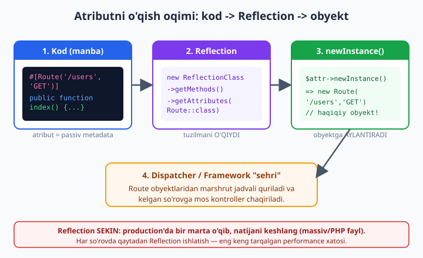
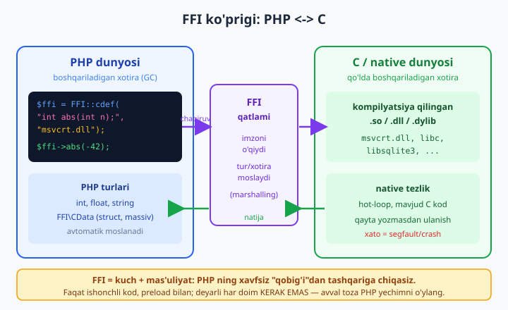

# 08 — Reflection, attributes va FFI

[⬅️ Oldingi: 07 — Property hooks va asymmetric visibility](./07-property-hooks.md) · [🏠 README](./README.md) · [Keyingi: 09 — WeakMap, SPL va reference ➡️](./09-weakmap-spl.md)

> **Bu bobda:** PHP ning eng "sehrli" ko'ringan imkoniyatlarining ichini ochamiz. Avval **meta-dasturlash** nima ekanini va dasturning ish vaqtida o'z tuzilishini qanday "ko'ra olishini" tushunamiz. So'ng **Reflection API** ni (`ReflectionClass`, `ReflectionMethod`, `ReflectionParameter`, `ReflectionNamedType`/`ReflectionUnionType`) chuqur o'rganamiz. Keyin PHP 8.0 da kelgan **atributlar**ni — `#[Attribute]` bilan o'z atributingni e'lon qilish, `TARGET_*` va `IS_REPEATABLE`, hamda Reflection bilan ularni O'QISH. Bularni birlashtirib **kichik atribut-asosli tizim** quramiz: `#[Route]` marshrutlovchi, `#[Validate]` validator va `#[Inject]` DI konteyner — aynan shu narsa Laravel/Symfony "sehri"ning asosi. Reflection **sekin** bo'lgani uchun uni qanday **keshlash** kerakligini ko'ramiz. Nihoyat **FFI** (Foreign Function Interface) bilan PHP dan to'g'ridan-to'g'ri C funksiyalarini chaqiramiz — qachon kerak, qachon kerak emas va xavfsizlik narxi. Bu bob boshlovchi kitobdagi [class va obyekt](../php/14-class-va-obyekt-eng-asosiy-tushuncha.md), [kirish darajalari](../php/16-kirish-darajalari-public-va-private.md), [enum](../php/22-enum-cheklangan-tanlovlar.md) va [xatolarni boshqarish](../php/23-xatolarni-boshqarish.md) boblariga tayanadi.

---

## Meta-dasturlash nima va Reflection nega kerak?

Odatdagi dasturda kod **ma'lumot ustida** ishlaydi: sonlarni qo'shadi, satrlarni birlashtiradi, bazadan qator oladi. **Meta-dasturlash** esa — kod **kodning o'zi ustida** ishlashi. Ya'ni dastur ish vaqtida (runtime) o'zining sinflari, metodlari, parametrlari haqida savol bera oladi: "bu sinfda qanday metodlar bor?", "bu metod qanday turdagi argument kutadi?", "bu propertyga qanday atribut yopishtirilgan?".

Aynan shu imkoniyatni PHP da **Reflection API** beradi. Reflection — "ko'zgu" degani: dastur o'ziga ko'zguda qaraydi va o'z tuzilishini o'qiydi.

**Nega bu kerak?** Tasavvur qiling, siz framework yozyapsiz. Foydalanuvchi o'z kontroller sinfini yozadi — siz uni oldindan bilmaysiz. Lekin siz uning metodlarini topib, mos so'rovda chaqirishingiz kerak. Yoki DI konteyner yozyapsiz: bir sinfning konstruktori qanday bog'liqliklarni so'rashini **avtomatik** aniqlab, ularni yetkazib berishingiz kerak. Bularning hammasi Reflection orqali bo'ladi. Qisqasi:

- **Routerlar** atributlardagi marshrutni o'qiydi (`#[Route('/users')]`).
- **DI konteynerlar** konstruktor turlaridan bog'liqlikni aniqlaydi (autowiring).
- **ORM lar** (Doctrine) entity propertylaridan jadval ustunlarini chiqaradi.
- **Validatorlar**, **serializatorlar**, **test frameworklar** (`@test`, `#[Test]`) — hammasi Reflection ustida.

> **Tuzoq (oldindan ogohlantirish):** Reflection — kuchli, lekin **sekin**. U sinfni tahlil qilish uchun ichki ishlarni bajaradi. Shuning uchun uni **har so'rovda** emas, **bir marta** ishlatib, natijani keshlash kerak. Buni bobning oxirida alohida ko'rib chiqamiz.

---

## ReflectionClass: sinfni ish vaqtida o'qish

Boshlanishi oddiy: sinf nomidan `ReflectionClass` obyektini yaratasiz, so'ng undan savol berasiz. Boshlovchi kitobdagi [class va obyekt](../php/14-class-va-obyekt-eng-asosiy-tushuncha.md) tushunchasi shu yerda kerak bo'ladi.

```php
<?php
declare(strict_types=1);

final class Hisoblagich
{
    public function __construct(private int $boshlang = 0) {}

    public function oshir(int $qadam = 1): int
    {
        return $this->boshlang += $qadam;
    }

    public function qiymat(): int
    {
        return $this->boshlang;
    }
}

$r = new ReflectionClass(Hisoblagich::class);

echo "Sinf nomi: " . $r->getShortName() . PHP_EOL;
echo "Final mi: " . ($r->isFinal() ? 'ha' : 'yoq') . PHP_EOL;

echo "--- Metodlar ---" . PHP_EOL;
foreach ($r->getMethods() as $m) {
    $params = array_map(
        fn(ReflectionParameter $p) => $p->getName(),
        $m->getParameters()
    );
    echo "  {$m->getName()}(" . implode(', ', $params) . ")" . PHP_EOL;
}

echo "--- Konstruktor parametrlari ---" . PHP_EOL;
$ctor = $r->getConstructor();
foreach ($ctor->getParameters() as $p) {
    $type = $p->getType();
    $typeName = $type instanceof ReflectionNamedType ? $type->getName() : 'aralash';
    $default = $p->isDefaultValueAvailable() ? var_export($p->getDefaultValue(), true) : 'yoq';
    echo "  \${$p->getName()}: {$typeName} (default: {$default})" . PHP_EOL;
}

// newInstanceArgs: konstruktorga argument massivi bilan obyekt yaratamiz
$obj = $r->newInstanceArgs([10]);
echo "Yangi obyekt qiymati: " . $obj->qiymat() . PHP_EOL;
$obj->oshir(5);
echo "Oshirilgandan keyin: " . $obj->qiymat() . PHP_EOL;
```

Chiqishi (tekshirilgan):

```
Sinf nomi: Hisoblagich
Final mi: ha
--- Metodlar ---
  __construct(boshlang)
  oshir(qadam)
  qiymat()
--- Konstruktor parametrlari ---
  $boshlang: int (default: 0)
Yangi obyekt qiymati: 10
Oshirilgandan keyin: 15
```

E'tibor bering: `newInstanceArgs([10])` `private int $boshlang` ni **konstruktor orqali** to'ldirdi — ya'ni biz qaysi propertylar borligini va konstruktor nima kutishini bilmasdan ham obyekt yarata oldik. Mana shu — frameworkning obyektlarni siz uchun yaratishining (instantiation) asosi.

### Reflection oilasidagi asosiy sinflar

| Sinf | Nimani aks ettiradi | Eng muhim metodlar |
|---|---|---|
| `ReflectionClass` | sinfning o'zi | `getMethods()`, `getProperties()`, `getAttributes()`, `getConstructor()`, `newInstanceArgs()`, `isFinal()`, `getInterfaceNames()` |
| `ReflectionMethod` | bitta metod | `getParameters()`, `getReturnType()`, `invoke()`, `isPublic()`, `isStatic()` |
| `ReflectionProperty` | bitta property | `getType()`, `getValue($obj)`, `setValue()`, `getAttributes()` |
| `ReflectionParameter` | metod/funksiya parametri | `getType()`, `getName()`, `isDefaultValueAvailable()`, `getDefaultValue()`, `allowsNull()` |
| `ReflectionNamedType` | bitta nomli tur (`int`, `App\User`) | `getName()`, `isBuiltin()`, `allowsNull()` |
| `ReflectionUnionType` | union tur (`int\|string`) | `getTypes()` (ichida `ReflectionNamedType` lar) |
| `ReflectionEnum` | enum ([22-bob](../php/22-enum-cheklangan-tanlovlar.md)) | `getCases()`, `isBacked()` |

### Tur tizimini o'qish: NamedType va UnionType

PHP 8 ning boy tip tizimi (union, nullable, `mixed`) Reflection orqali ham o'qiladi. Bu DI konteyner uchun hayotiy muhim — chunki konstruktor parametri turi bo'yicha bog'liqlikni yechadi.

```php
<?php
declare(strict_types=1);

final class Misol
{
    public function f(int|string $id, ?DateTimeInterface $vaqt, mixed $har): void {}
}

$m = new ReflectionMethod(Misol::class, 'f');

foreach ($m->getParameters() as $p) {
    $t = $p->getType();
    echo "\${$p->getName()}: ";

    if ($t instanceof ReflectionUnionType) {
        // int|string kabi union tur — tarkibiy turlarni ajratamiz.
        $names = array_map(
            fn(ReflectionNamedType $nt) => $nt->getName(),
            $t->getTypes()
        );
        echo 'union(' . implode('|', $names) . ')';
    } elseif ($t instanceof ReflectionNamedType) {
        // Oddiy tur. ?DateTimeInterface bo'lsa allowsNull() true bo'ladi.
        echo $t->getName();
        if ($t->allowsNull() && $t->getName() !== 'mixed') {
            echo ' (nullable)';
        }
    } else {
        echo 'turi belgilanmagan';
    }
    echo PHP_EOL;
}
```

Chiqishi:

```
$id: union(string|int)
$vaqt: DateTimeInterface (nullable)
$har: mixed
```

> **Diqqat:** `getType()` `null` qaytarishi mumkin — agar parametr turi umuman belgilanmagan bo'lsa. Shuning uchun har doim `instanceof` bilan tekshiring, to'g'ridan-to'g'ri `$t->getName()` chaqirmang. `isBuiltin()` esa turning ichki (`int`, `string`) yoki sinf (`App\User`) ekanini ajratadi — autowiring da faqat sinflarni yechamiz, ichki turlarni emas.

---

## Atributlar (PHP 8.0): kodga "yorliq" yopishtirish

Reflection sinf **tuzilishini** o'qiydi. Lekin ko'pincha bizga ko'proq ma'lumot kerak: "bu metod qaysi URL ga bog'lansin?", "bu propertyni qanday tekshirish kerak?". Bu **qo'shimcha metadata** ni kodning o'ziga yozish uchun **atributlar** ishlatiladi.

Atribut — bu metod, property, sinf, parametr yoki konstantaga yopishtiriladigan **strukturalangan yorliq**. Sintaksisi `#[...]`:

```php
#[Route('/users', 'GET')]
public function index(): string { /* ... */ }
```

PHP 8.0 dan oldin buni **doc-comment** larda (`/** @Route(...) */` — satr ichidagi izoh) qilishardi. Doctrine va Symfony shunday qilardi, lekin bu xato keltirib chiqarardi: izohlar oddiy matn, IDE ularni tekshirmaydi, yozilishida xato bo'lsa bilinmaydi. Atributlar esa — **tilning haqiqiy qismi**: noto'g'ri nom yozsangiz, PHP xato beradi.

> **Eng muhim tushuncha:** atribut — **passiv metadata**. PHP atributni o'zi ishga solmaydi, hech narsa qilmaydi. U shunchaki kodda "yotadi". Faqat siz uni **Reflection bilan o'qiganingizda** va `newInstance()` chaqirganingizda u haqiqiy obyektga aylanadi. "Sehr" — bu o'qish bosqichida sodir bo'ladi.



### O'z atributingni e'lon qilish

Atribut — bu shunchaki oddiy sinf, ustiga `#[Attribute]` qo'yilgan. `#[Attribute]` ning o'zi ham atribut — bu PHP ga "bu sinf atribut sifatida ishlatilishi mumkin" deb aytadi.

```php
<?php
declare(strict_types=1);

// 1) O'z atributimizni e'lon qilamiz. #[Attribute] ning o'zi ham atribut!
#[Attribute(Attribute::TARGET_METHOD)]
final class Route
{
    public function __construct(
        public string $path,
        public string $method = 'GET',
    ) {}
}
```

`#[Route('/users', 'GET')]` yozganingizda — bu aynan `new Route('/users', 'GET')` chaqiruvi (lekin faqat o'qilganda yaratiladi). Konstruktor argumentlari atributning argumentlariga to'g'ri keladi. Shuning uchun atribut sinfining konstruktorida `public` promoted property ([16-bob](../php/16-kirish-darajalari-public-va-private.md)) ishlatish qulay — o'qiganda to'g'ridan-to'g'ri `$route->path` ga kirasiz.

### TARGET_* — atribut qayerga qo'yilishi mumkin

`#[Attribute(...)]` ga **bayroq (flag)** beriladi: bu atribut qayerga qo'yilishi mumkin. Bayroqlarni `|` bilan birlashtirasiz.

| Bayroq | Qayerga |
|---|---|
| `Attribute::TARGET_CLASS` | sinf, interfeys, trait, enum |
| `Attribute::TARGET_METHOD` | metod |
| `Attribute::TARGET_PROPERTY` | property |
| `Attribute::TARGET_PARAMETER` | funksiya/metod parametri |
| `Attribute::TARGET_CLASS_CONSTANT` | sinf konstantasi |
| `Attribute::TARGET_FUNCTION` | global funksiya |
| `Attribute::TARGET_ALL` | hammasi (standart qiymat) |
| `Attribute::IS_REPEATABLE` | bitta joyga BIR NECHTA marta qo'yilishi mumkin |

TARGET cheklovi **majburlanadi**. Agar `TARGET_PROPERTY` atributini metodga qo'ysangiz, `newInstance()` chaqirilganda PHP `Error` otadi:

```php
<?php
declare(strict_types=1);

#[Attribute(Attribute::TARGET_PROPERTY)]
final class OnlyProp {}

final class X {
    // ❌ TARGET_PROPERTY atributini METODGA qo'ydik
    #[OnlyProp]
    public function f(): void {}
}

$r = new ReflectionMethod(X::class, 'f');
// newInstance() chaqirilganda PHP target mosligini tekshiradi va Error otadi:
$r->getAttributes(OnlyProp::class)[0]->newInstance();
// Error: Attribute "OnlyProp" cannot target method (allowed targets: property)
```

> **Nega muhim:** TARGET cheklovi xatoni **erta** ushlaydi. Foydalanuvchi atributni noto'g'ri joyga qo'ysa, tushunarli xato oladi. O'z atributingizni yozayotganda har doim aniq TARGET bering — `TARGET_ALL` ni faqat haqiqatan kerak bo'lganda ishlating.

---

## Amaliy tizim 1: atribut-asosli router (`#[Route]`)

Endi nazariyani birlashtiramiz. Mana frameworklarning "sehri"ning yuragi: kontroller metodlariga `#[Route]` qo'yamiz, so'ng Reflection bilan o'qib, marshrut jadvali quramiz va so'rovni mos metodga yo'naltiramiz. Bu — [01-bobdagi REST router](./01-rest-api.md) ning atribut-asosli, "kattalashgan" versiyasi.

```php
<?php
declare(strict_types=1);

// 1) O'z atributimizni e'lon qilamiz. #[Attribute] ning o'zi ham atribut!
#[Attribute(Attribute::TARGET_METHOD)]
final class Route
{
    public function __construct(
        public string $path,
        public string $method = 'GET',
    ) {}
}

// 2) Atributlarni metodlarga "yopishtiramiz" — bu shunchaki metadata,
//    PHP ularni o'zi ishga solmaydi.
final class UserController
{
    #[Route('/users', 'GET')]
    public function index(): string
    {
        return 'Barcha foydalanuvchilar';
    }

    #[Route('/users', 'POST')]
    public function create(): string
    {
        return 'Foydalanuvchi yaratildi';
    }

    #[Route('/users/{id}', 'GET')]
    public function show(): string
    {
        return 'Bitta foydalanuvchi';
    }

    // Atributsiz metod — marshrutga qo'shilmaydi.
    public function ichkiYordamchi(): void {}
}

// 3) Reflection bilan O'QIYMIZ va marshrut jadvalini quramiz.
function marshrutlarniYig(string $controllerClass): array
{
    $jadval = [];
    $r = new ReflectionClass($controllerClass);

    foreach ($r->getMethods(ReflectionMethod::IS_PUBLIC) as $method) {
        // Faqat #[Route] atributi bor metodlarni olamiz.
        $attrs = $method->getAttributes(Route::class);
        foreach ($attrs as $attr) {
            $route = $attr->newInstance(); // <-- bu yerda Route obyekti yaratiladi
            $jadval[] = [
                'method'     => $route->method,
                'path'       => $route->path,
                'controller' => $controllerClass,
                'action'     => $method->getName(),
            ];
        }
    }
    return $jadval;
}

$jadval = marshrutlarniYig(UserController::class);

echo "=== Marshrut jadvali ===" . PHP_EOL;
foreach ($jadval as $row) {
    printf("%-5s %-14s -> %s::%s%s",
        $row['method'], $row['path'], $row['controller'], $row['action'], PHP_EOL);
}

// 4) Soddalashtirilgan dispatcher: kelgan so'rovni topib, chaqiramiz.
function dispatch(array $jadval, string $method, string $path): string
{
    foreach ($jadval as $route) {
        if ($route['method'] === $method && $route['path'] === $path) {
            $obj = new $route['controller']();
            return $obj->{$route['action']}();
        }
    }
    return '404 Not Found';
}

echo PHP_EOL . "=== Dispatch sinovi ===" . PHP_EOL;
echo "GET /users  => " . dispatch($jadval, 'GET', '/users') . PHP_EOL;
echo "POST /users => " . dispatch($jadval, 'POST', '/users') . PHP_EOL;
echo "GET /yoq    => " . dispatch($jadval, 'GET', '/yoq') . PHP_EOL;
```

Chiqishi (tekshirilgan):

```
=== Marshrut jadvali ===
GET   /users         -> UserController::index
POST  /users         -> UserController::create
GET   /users/{id}    -> UserController::show

=== Dispatch sinovi ===
GET /users  => Barcha foydalanuvchilar
POST /users => Foydalanuvchi yaratildi
GET /yoq    => 404 Not Found
```

Mana — Symfony/Laravel routerining qalbi. Endi `#[Route]` qaerda "sehrli" emas: bu shunchaki Reflection + `getAttributes()` + `newInstance()`. Siz buni o'zingiz yozdingiz. Kelajakdagi L4 mini-framework boblarida shu naqshni to'liq routerga aylantiramiz.

> **`getAttributes(Route::class)` muhim:** argumentsiz `getAttributes()` HAMMA atributlarni qaytaradi. Sinf nomini bersangiz, faqat o'sha turdagilarni oladi — bu sizning kodingizni boshqa atributlardan (masalan `#[Deprecated]`) himoya qiladi.

---

## Amaliy tizim 2: validator (`#[Validate]`, IS_REPEATABLE)

Bitta propertyga **bir nechta qoida** qo'yish kerak bo'ladi (masalan "majburiy" VA "kamida 3 belgi"). Buning uchun `IS_REPEATABLE` bayrog'i kerak — usiz bitta joyga atributni faqat bir marta qo'ya olasiz.

```php
<?php
declare(strict_types=1);

// TARGET_PROPERTY + IS_REPEATABLE: bitta propertyga bir nechta qoida qo'yamiz.
#[Attribute(Attribute::TARGET_PROPERTY | Attribute::IS_REPEATABLE)]
final class Validate
{
    public function __construct(
        public string $rule,
        public ?int $param = null,
    ) {}

    public function tekshir(mixed $value): ?string
    {
        return match ($this->rule) {
            'required' => ($value === null || $value === '')
                ? 'majburiy maydon' : null,
            'email' => (is_string($value) && filter_var($value, FILTER_VALIDATE_EMAIL))
                ? null : 'email formati notogri',
            'min' => (is_string($value) && mb_strlen($value) >= ($this->param ?? 0))
                ? null : "kamida {$this->param} ta belgi kerak",
            default => null,
        };
    }
}

final class RoyxatdanOtish
{
    #[Validate('required')]
    #[Validate('min', 3)]
    public string $ism = '';

    #[Validate('required')]
    #[Validate('email')]
    public string $email = '';
}

// Validator: obyekt propertylarini Reflection orqali tekshiradi.
function validatsiya(object $obj): array
{
    $xatolar = [];
    $r = new ReflectionClass($obj);

    foreach ($r->getProperties() as $prop) {
        $qiymat = $prop->getValue($obj);
        foreach ($prop->getAttributes(Validate::class) as $attr) {
            $rule = $attr->newInstance();
            if ($xato = $rule->tekshir($qiymat)) {
                $xatolar[$prop->getName()][] = $xato;
            }
        }
    }
    return $xatolar;
}

$form = new RoyxatdanOtish();
$form->ism = 'Al';                 // juda qisqa
$form->email = 'notogri-email';    // notogri format

$xatolar = validatsiya($form);
echo "=== Validatsiya natijasi ===" . PHP_EOL;
echo json_encode($xatolar, JSON_PRETTY_PRINT | JSON_UNESCAPED_UNICODE) . PHP_EOL;

// To'g'ri to'ldirilgan forma:
$ok = new RoyxatdanOtish();
$ok->ism = 'Oqil';
$ok->email = 'oqil@misol.uz';
echo PHP_EOL . "Tugri forma xatolari: ";
echo json_encode(validatsiya($ok)) . PHP_EOL;
```

Chiqishi:

```
=== Validatsiya natijasi ===
{
    "ism": [
        "kamida 3 ta belgi kerak"
    ],
    "email": [
        "email formati notogri"
    ]
}

Tugri forma xatolari: []
```

E'tibor bering: `#[Validate('required')]` va `#[Validate('min', 3)]` — bitta propertyga ikkita atribut. `IS_REPEATABLE` siz bu xato bo'lardi. `getAttributes()` ikkalasini ham qaytaradi, biz har birini alohida `newInstance()` qilamiz.

> **Real loyihada:** [symfony/validator](https://symfony.com/doc/current/validation.html) aynan shunday ishlaydi — `#[Assert\NotBlank]`, `#[Assert\Email]`, `#[Assert\Length(min: 3)]`. Endi siz uning ichida nima borligini bilasiz.

---

## Amaliy tizim 3: DI konteyner va autowiring

Eng kuchli misol. **DI konteyner** — sinflarni siz uchun yaratuvchi, bog'liqliklarini avtomatik to'ldiruvchi obyekt. "Autowiring" — konstruktor **turlariga** qarab kerakli obyektlarni avtomatik yaratish. Bu yerda atribut shart emas, faqat Reflection + tur tizimi kifoya.

```php
<?php
declare(strict_types=1);

// Soddalashtirilgan DI konteyner: konstruktor turlariga qarab
// bog'liqliklarni avtomatik yaratadi (autowiring).
final class Logger
{
    public function yoz(string $msg): void
    {
        echo "[LOG] {$msg}" . PHP_EOL;
    }
}

final class UserRepository
{
    public function __construct(private Logger $logger) {}

    public function topish(int $id): string
    {
        $this->logger->yoz("User #{$id} qidirilmoqda");
        return "User#{$id}";
    }
}

final class UserService
{
    public function __construct(
        private UserRepository $repo,
        private Logger $logger,
    ) {}

    public function profil(int $id): string
    {
        $this->logger->yoz('Profil tayyorlanmoqda');
        return 'Profil: ' . $this->repo->topish($id);
    }
}

final class Container
{
    /** @var array<string, object> */
    private array $kesh = [];

    public function get(string $class): object
    {
        // Allaqachon yaratilgan bo'lsa, keshdan qaytaramiz (singleton).
        if (isset($this->kesh[$class])) {
            return $this->kesh[$class];
        }

        $r = new ReflectionClass($class);
        $ctor = $r->getConstructor();

        // Konstruktorsiz sinf — to'g'ridan-to'g'ri yaratamiz.
        if ($ctor === null) {
            return $this->kesh[$class] = new $class();
        }

        // Har bir parametr turini aniqlab, rekursiv ravishda yechamiz.
        $args = [];
        foreach ($ctor->getParameters() as $param) {
            $type = $param->getType();
            if (!$type instanceof ReflectionNamedType || $type->isBuiltin()) {
                throw new RuntimeException(
                    "Avtomatik yechib bolmaydi: \${$param->getName()}"
                );
            }
            $args[] = $this->get($type->getName()); // rekursiya
        }

        return $this->kesh[$class] = $r->newInstanceArgs($args);
    }
}

$container = new Container();
$service = $container->get(UserService::class);

echo "=== DI konteyner ishlamoqda ===" . PHP_EOL;
echo $service->profil(42) . PHP_EOL;

// Singleton tekshiruvi: ikkinchi marta so'ralsa, AYNAN o'sha obyekt.
$a = $container->get(Logger::class);
$b = $container->get(Logger::class);
echo PHP_EOL . "Bir xil Logger obyektimi? " . ($a === $b ? 'ha' : 'yoq') . PHP_EOL;
```

Chiqishi:

```
=== DI konteyner ishlamoqda ===
[LOG] Profil tayyorlanmoqda
[LOG] User #42 qidirilmoqda
Profil: User#42

Bir xil Logger obyektimi? ha
```

Bu yerda nima sodir bo'ldi: `get(UserService::class)` chaqirildi -> konstruktorda `UserRepository` va `Logger` kerak ekan -> ularni **rekursiv** yaratdi -> `UserRepository` esa `Logger` ni so'radi -> kesh tufayli ayni `Logger` qayta ishlatildi. Siz hech qachon `new UserService(new UserRepository(new Logger()), ...)` yozmadingiz — konteyner buni o'zi qildi. Mana shu — Laravel `app()` va Symfony konteynerining mohiyati.

> **`isBuiltin()` cheklovi:** agar konstruktor `int $port` so'rasa, konteyner uni yecha olmaydi (qaysi qiymat?) va `RuntimeException` otadi. Real konteynerlarda buni `#[Inject]` atributi yoki aniq sozlama (binding) bilan hal qilishadi — masalan `$container->bind('port', 8080)`. Bu esa keyingi tizimning vazifasi: `#[Inject]` ni Qiyin mashqda ko'ramiz.

---

## Reflection narxi va keshlash (production naqshi)

Reflection — qulay, lekin **bepul emas**. Har `new ReflectionClass()`, har `getAttributes()->newInstance()` qo'shimcha ish. Bir-ikki sinf uchun bu sezilmaydi, lekin yuzlab marshrut/entity bo'lgan ilovada **har so'rovda** qayta tahlil qilish — sezilarli sekinlik.

**Yechim — bir marta o'qib, natijani keshlash.** Frameworklar aynan shuni qiladi: `php artisan route:cache` yoki Symfony ning kompilyatsiya qilingan konteyneri — bularning hammasi "Reflection ni bir marta ishlatib, natijani oddiy PHP massiv/fayl sifatida saqlash" degani.

```php
<?php
declare(strict_types=1);

#[Attribute(Attribute::TARGET_METHOD)]
final class Route
{
    public function __construct(public string $path, public string $method = 'GET') {}
}

final class Demo
{
    #[Route('/a')] public function a(): void {}
    #[Route('/b', 'POST')] public function b(): void {}
}

// "Qimmat" qism: Reflection bilan o'qish.
function ogish(string $class): array
{
    $jadval = [];
    $r = new ReflectionClass($class);
    foreach ($r->getMethods(ReflectionMethod::IS_PUBLIC) as $method) {
        foreach ($method->getAttributes(Route::class) as $attr) {
            $route = $attr->newInstance();
            $jadval[] = [$route->method, $route->path, $method->getName()];
        }
    }
    return $jadval;
}

// Production naqshi: bir marta o'qib, oddiy massiv (PHP fayl) sifatida saqlaymiz.
$cacheFile = sys_get_temp_dir() . '/routes.cache.php';

if (is_file($cacheFile)) {
    $jadval = require $cacheFile;     // ARZON: faqat massivni include qilamiz
    $manba = 'kesh (Reflection ishlamadi)';
} else {
    $jadval = ogish(Demo::class);     // QIMMAT: faqat birinchi marta
    file_put_contents(
        $cacheFile,
        '<?php return ' . var_export($jadval, true) . ';'
    );
    $manba = 'Reflection (birinchi marta)';
}

echo "Manba: {$manba}" . PHP_EOL;
echo "Marshrutlar soni: " . count($jadval) . PHP_EOL;
echo json_encode($jadval) . PHP_EOL;

@unlink($cacheFile); // demo uchun tozalab qo'yamiz
```

Birinchi ishga tushirishda `Reflection (birinchi marta)`, keyingilarida `kesh` chiqadi (agar oxiridagi `unlink` ni olib tashlasangiz). Kesh fayli — oddiy `<?php return [...]` — uni `require` qilish Reflection dan **o'nlab marta** tezroq, chunki OPcache uni xotirada saqlaydi.

> **Oltin qoida:** development da Reflection ni to'g'ridan-to'g'ri ishlating (kod o'zgaradi, kesh halaqit beradi). Production da esa deploy paytida **bir marta** kesh quring va shuni o'qing. Hech qachon production da har so'rovda atributlarni qaytadan o'qimang.

---

## FFI: PHP dan to'g'ridan-to'g'ri C funksiyalarini chaqirish

Hozirgacha biz PHP ning **ichidagi** dunyoni o'qidik. **FFI** (Foreign Function Interface) — butunlay boshqa narsa: PHP dan **tashqaridagi**, C tilida yozilgan kompilyatsiya qilingan kutubxonalarni (`.so`/`.dll`/`.dylib`) to'g'ridan-to'g'ri chaqirish. Ya'ni C kutubxonasi uchun PHP kengaytmasi (extension) yozmasdan, uni PHP dan ishlatish.



### FFI::cdef bilan C funksiyasini e'lon qilish

`FFI::cdef()` ga ikkita narsa berasiz: C funksiya **imzosi** (faqat e'lon, tanasi emas) va kutubxona nomi. Quyidagi misol Windows da C ish vaqti kutubxonasi `msvcrt.dll` dan funksiyalar chaqiradi (Linux/macOS da `libc.so.6` yoki `libm.so` bo'ladi).

```php
<?php
declare(strict_types=1);

// FFI::cdef() — C funksiya imzosini e'lon qilamiz.
// Windows da standart C kutubxonasi: msvcrt.dll
// (Linux: "libc.so.6", macOS: odatda nomsiz / "libc.dylib").
$ffi = FFI::cdef(<<<'C'
    int abs(int n);
    double sqrt(double x);
C, "msvcrt.dll");

// Endi C funksiyalarini xuddi PHP metodidek chaqiramiz.
echo "abs(-42)  = " . $ffi->abs(-42) . PHP_EOL;
echo "sqrt(144) = " . $ffi->sqrt(144.0) . PHP_EOL;
```

Chiqishi (Windows da, tekshirilgan):

```
abs(-42)  = 42
sqrt(144) = 12
```

`$ffi->abs(-42)` — bu PHP funksiyasi emas! Bu to'g'ridan-to'g'ri `msvcrt.dll` ichidagi mashina kodidagi `abs` funksiyasiga chaqiruv. PHP soni C `int` ga aylandi, natija qaytib PHP soniga aylandi.

> **Portativlik tuzog'i (darhol e'tibor bering):** kutubxona nomi platformaga bog'liq. `"msvcrt.dll"` faqat Windows da, `"libc.so.6"` Linux da ishlaydi. Bu — FFI ning birinchi katta narxi: kod ko'chmas (non-portable) bo'lib qoladi. Standart `abs`/`sqrt` uchun esa FFI **umuman kerak emas** — PHP da `abs()` va `sqrt()` allaqachon bor va tezroq. Bu faqat **o'rgatuvchi misol**.

### String, struct va massivlar bilan ishlash

FFI faqat sonlar emas — string, C struct va massivlar bilan ham ishlaydi. PHP turlari C turlariga avtomatik moslanadi (marshalling).

```php
<?php
declare(strict_types=1);

// strlen: C funksiyasi PHP string ni qabul qiladi (const char*).
$ffi = FFI::cdef(<<<'C'
    typedef struct { int x; int y; } Point;
    size_t strlen(const char *s);
    int strcmp(const char *a, const char *b);
C, "msvcrt.dll");

$matn = "Salom, FFI!";
echo "C strlen('{$matn}') = " . $ffi->strlen($matn) . PHP_EOL;
echo "PHP strlen        = " . strlen($matn) . PHP_EOL;
echo "strcmp('a','b')   = " . $ffi->strcmp('a', 'b') . PHP_EOL;

// --- Struct: C tuzilmasini PHP da yaratish va to'ldirish ---
// MUHIM: new() ni $ffi INSTANSIYASIDAN chaqiramiz (statik FFI::new() 8.4 da deprecated).
$p = $ffi->new("Point");   // C struct uchun xotira ajratiladi
$p->x = 3;
$p->y = 4;
echo PHP_EOL . "Point({$p->x}, {$p->y})" . PHP_EOL;

// FFI massivi: C tipidagi 5 ta int.
$arr = $ffi->new("int[5]");
for ($i = 0; $i < 5; $i++) {
    $arr[$i] = $i * $i;
}
echo "arr[3] = {$arr[3]}, soni = " . count($arr) . PHP_EOL;
```

Chiqishi:

```
C strlen('Salom, FFI!') = 11
PHP strlen        = 11
strcmp('a','b')   = -1

Point(3, 4)
arr[3] = 9, soni = 5
```

> **8.4 tuzog'i:** `FFI::new("int[5]")` — statik chaqiruv — PHP 8.4 da **deprecated**. Yuqorida ko'rganingizdek, `$ffi->new(...)` — instansiya metodi sifatida chaqiring. C struct (`Point`) ham, massiv (`int[5]`) ham `FFI\CData` obyekti — uni xuddi oddiy PHP obyekti/massivi kabi ishlatasiz, lekin orqada C xotirasi yotadi.

### Qachon FFI KERAK va qachon KERAK EMAS

Bu — bobning eng muhim amaliy xulosasi. FFI kuchli, lekin **deyarli har doim kerak emas**.

| Qachon FFI mantiqiy | Qachon FFI KERAK EMAS (deyarli har doim) |
|---|---|
| Mavjud, katta C kutubxonasiga ulanish kerak, lekin uni PHP extension sifatida yozish juda qimmat (masalan ixtisoslashgan ilmiy/grafik kutubxona) | Funksiya allaqachon PHP da bor (`abs`, `sqrt`, `mb_strlen` ...) — toza PHP tezroq va xavfsiz |
| Hot-loop: juda ko'p marta takrorlanadigan og'ir hisob, C da sezilarli tez | Oddiy CRUD/web ilova — FFI chaqiruvi overhead, foydasi yo'q |
| Prototip: extension yozishdan oldin C API ni sinab ko'rish | Tayyor PHP extension yoki kutubxona (Composer) mavjud — uni ishlating |
| Tizim API si (masalan maxsus drayver) bilan to'g'ridan-to'g'ri muloqot | Portativlik muhim — FFI kodi platformaga bog'lanib qoladi |

**Narxlar:** (1) **xavfsizlik** — siz PHP ning xavfsiz qobig'idan tashqariga chiqasiz; C dagi xato `segfault` / butun jarayonning qulashiga (crash) olib keladi, PHP ning chiroyli `Exception` i emas; (2) **portativlik** — kutubxona nomi/ABI platformaga bog'liq; (3) **xotira** — C xotirasini ba'zan o'zingiz boshqarishingiz kerak (GC yordam bermaydi); (4) **murakkablik** — C turlari, pointerlar, ABI bilan tanish bo'lish shart.

> **Amaliy maslahat:** FFI ga murojaat qilishdan oldin o'zingizga uch savol bering: "Buni toza PHP da qila olamanmi?" (odatda — ha), "Tayyor Composer paketi yoki PHP extension bormi?" (ko'pincha — bor), "Bu haqiqatan hot-loop yoki noyob C kutubxonami?" (kamdan-kam — ha). Uch javob ham FFI ni qo'llab-quvvatlamasa, FFI dan voz keching.

### FFI xavfsizligi: preload va ishonchli kod

FFI — kuch, demak xavf. Agar tajovuzkor sizning ilovangizda ixtiyoriy FFI kodini ishga tushira olsa, u butun serverni egallashi mumkin (chunki FFI mashina darajasida ishlaydi). Shuning uchun:

- **`ffi.enable=preload` (tavsiya etilgan production sozlamasi):** FFI faqat **oldindan yuklangan** (preloaded) fayllardagina ishlaydi. Ya'ni FFI e'lonlari `php.ini` da `opcache.preload` orqali ko'rsatilgan ishonchli fayllarda bo'lishi shart — runtime da ixtiyoriy `FFI::cdef()` chaqirib bo'lmaydi. Bu eng xavfsiz rejim.
- **`ffi.enable=true`** — har joyda FFI ga ruxsat. Faqat ishonchli, izolyatsiyalangan muhitda (masalan CLI skript) ishlating.
- **`ffi.enable=false`** — butunlay o'chiq (web kontekst uchun standart va xavfsiz).
- **Hech qachon foydalanuvchi kiritmasini** (`$_GET`, `$_POST`) FFI imzosiga, kutubxona nomiga yoki funksiya argumentlariga ishonmasdan bermang.
- FFI kodini **faqat siz yozgan, ko'rib chiqilgan** fayllarda saqlang — uchinchi tomon kodiga FFI ishlatishga ruxsat bermang.

> **Xulosa:** FFI — "kuch + mas'uliyat" vositasi. Boshlovchi yoki o'rta darajadagi web ilovada deyarli hech qachon kerak bo'lmaydi. Uni bilish — ekspertlikning bir qismi, lekin **ishlatmaslikni bilish** undan ham muhim. [Xatolarni boshqarish bobida](../php/23-xatolarni-boshqarish.md) ko'rganingizdek, PHP ning xavfsiz xato-modeli FFI da ishlamaydi — C darajasidagi xato butun jarayonni o'ldiradi.

---

## Mashqlar

### Oson

1. `ReflectionClass` yordamida ixtiyoriy sinfning **interfeyslari** (`getInterfaceNames()`) va **ota-sinfi** (`getParentClass()`) nomlarini chop etuvchi funksiya yozing.
2. `#[Attribute(Attribute::TARGET_CLASS)]` bilan `#[Entity(table: 'users')]` atributini e'lon qiling. Bir sinfga qo'yib, Reflection bilan o'qib `table` qiymatini chop eting.
3. FFI bilan `msvcrt.dll` dan `int rand(void)` funksiyasini e'lon qiling va uni chaqirib bir tasodifiy son chop eting. (Eslatma: bu illustrativ — PHP da `random_int()` bor va yaxshiroq.)

### O'rta

4. `#[Validate]` validatorini kengaytiring: yangi `'max'` qoidasini qo'shing (`#[Validate('max', 20)]`) — satr `param` dan uzun bo'lsa xato qaytarsin. Test forma bilan tekshiring.
5. Router tizimiga `getAttributes()` argumentsiz versiyasidan foydalanib, bir metodda **bir nechta turdagi** atribut (`#[Route]` va yangi `#[Auth]`) bo'lganda ikkalasini ham o'qiydigan kod yozing. `#[Auth]` bo'lsa, marshrut "himoyalangan" deb belgilansin.
6. Reflection keshlash misolini o'zgartiring: kesh faylini o'chirmang va skriptni ikki marta ishga tushiring. Birinchi va ikkinchi ishga tushishda `Manba:` qatori farq qilishini kuzating va nega shundayligini izohlang.

### Qiyin

7. **`#[Inject]` bilan DI konteynerni kuchaytiring.** `Container::get()` ni shunday o'zgartiring: agar konstruktor parametri **ichki tur** (`int`, `string`) bo'lsa va unga `#[Inject('kalit')]` atributi qo'yilgan bo'lsa, qiymatni konteynerning sozlamalar jadvalidan (`bind('kalit', qiymat)`) olsin. Atributsiz ichki tur uchun esa standart qiymat (`isDefaultValueAvailable()`) ishlatilsin, u ham bo'lmasa `RuntimeException` otsin.
8. **Atribut-asosli serializator yozing.** `#[Column(name)]` va `#[Ignore]` atributlari bilan obyektni DB qatori shaklidagi massivga aylantiruvchi `toRow(object): array` funksiyasini quring: `#[Column]` bor propertylar massivga kirsin (`name` berilmasa, property nomi ishlatilsin), `#[Ignore]` bor yoki umuman atributsiz propertylar tashlab ketilsin.

<details markdown="1"><summary>Yechim — 7 (Inject bilan DI konteyner)</summary>

```php
<?php
declare(strict_types=1);

#[Attribute(Attribute::TARGET_PARAMETER)]
final class Inject
{
    public function __construct(public string $kalit) {}
}

final class Sozlama
{
    public function __construct(public string $dsn, public int $timeout) {}
}

final class Container
{
    /** @var array<string, mixed> */
    private array $bindings = [];
    /** @var array<string, object> */
    private array $kesh = [];

    public function bind(string $kalit, mixed $qiymat): void
    {
        $this->bindings[$kalit] = $qiymat;
    }

    public function get(string $class): object
    {
        if (isset($this->kesh[$class])) {
            return $this->kesh[$class];
        }

        $r = new ReflectionClass($class);
        $ctor = $r->getConstructor();
        if ($ctor === null) {
            return $this->kesh[$class] = new $class();
        }

        $args = [];
        foreach ($ctor->getParameters() as $param) {
            $type = $param->getType();

            // 1) Sinf turi -> rekursiv yechamiz (autowiring)
            if ($type instanceof ReflectionNamedType && !$type->isBuiltin()) {
                $args[] = $this->get($type->getName());
                continue;
            }

            // 2) Ichki tur + #[Inject('kalit')] -> bindings dan olamiz
            $injectAttrs = $param->getAttributes(Inject::class);
            if ($injectAttrs !== []) {
                $kalit = $injectAttrs[0]->newInstance()->kalit;
                if (!array_key_exists($kalit, $this->bindings)) {
                    throw new RuntimeException("Bog'lanmagan kalit: {$kalit}");
                }
                $args[] = $this->bindings[$kalit];
                continue;
            }

            // 3) Standart qiymat bo'lsa -> shuni olamiz
            if ($param->isDefaultValueAvailable()) {
                $args[] = $param->getDefaultValue();
                continue;
            }

            // 4) Hech narsa yo'q -> xato
            throw new RuntimeException(
                "Yechib bolmaydi: \${$param->getName()} (sinfda {$class})"
            );
        }

        return $this->kesh[$class] = $r->newInstanceArgs($args);
    }
}

// Konstruktorga #[Inject] qo'yilgan sinf:
final class Database
{
    public function __construct(
        #[Inject('db.dsn')] public string $dsn,
        #[Inject('db.timeout')] public int $timeout,
    ) {}
}

$c = new Container();
$c->bind('db.dsn', 'mysql:host=localhost;dbname=app');
$c->bind('db.timeout', 30);

$db = $c->get(Database::class);
echo "DSN: {$db->dsn}" . PHP_EOL;
echo "Timeout: {$db->timeout}" . PHP_EOL;
```

Chiqishi:

```
DSN: mysql:host=localhost;dbname=app
Timeout: 30
```

**Tushuntirish:** kalit g'oya — har bir konstruktor parametri uchun **tartib bilan** uch holatni tekshirish: (1) sinf turi bo'lsa avtomatik yaratish, (2) `#[Inject]` atributi bo'lsa sozlamalar jadvalidan olish, (3) standart qiymat bo'lsa shuni olish, aks holda xato. Bu — Laravel/PHP-DI konteynerlarining haqiqiy ish printsipi.

</details>

<details markdown="1"><summary>Yechim — 8 (atribut-asosli serializator)</summary>

```php
<?php
declare(strict_types=1);

#[Attribute(Attribute::TARGET_PROPERTY)]
final class Column
{
    public function __construct(public ?string $name = null) {}
}

#[Attribute(Attribute::TARGET_PROPERTY)]
final class Ignore {}

final class Mahsulot
{
    #[Column('id')]
    public int $id = 0;

    #[Column('mahsulot_nomi')]
    public string $nom = '';

    #[Column] // nom berilmasa, property nomidan foydalanamiz
    public float $narx = 0.0;

    #[Ignore]
    public string $ichkiHolat = 'maxfiy';

    // Atributsiz property — e'tiborga olinmaydi.
    public string $vaqtinchalik = '';
}

function toRow(object $obj): array
{
    $row = [];
    $r = new ReflectionObject($obj);

    foreach ($r->getProperties() as $prop) {
        // Ignore bo'lsa — tashlab ketamiz.
        if ($prop->getAttributes(Ignore::class) !== []) {
            continue;
        }
        $colAttrs = $prop->getAttributes(Column::class);
        if ($colAttrs === []) {
            continue; // Column yo'q — DB ustuni emas
        }
        $col = $colAttrs[0]->newInstance();
        $name = $col->name ?? $prop->getName();
        $row[$name] = $prop->getValue($obj);
    }
    return $row;
}

$m = new Mahsulot();
$m->id = 7;
$m->nom = 'Klaviatura';
$m->narx = 249.99;
$m->ichkiHolat = 'BU CHIQMASLIGI KERAK';
$m->vaqtinchalik = 'BU HAM CHIQMASLIGI KERAK';

echo json_encode(toRow($m), JSON_PRETTY_PRINT | JSON_UNESCAPED_UNICODE) . PHP_EOL;
```

Chiqishi:

```
{
    "id": 7,
    "mahsulot_nomi": "Klaviatura",
    "narx": 249.99
}
```

**Tushuntirish:** uchta nazorat: (1) `#[Ignore]` bor bo'lsa — to'liq tashlab ketamiz; (2) `#[Column]` umuman yo'q bo'lsa — bu DB ustuni emas, tashlab ketamiz; (3) `#[Column]` bor — `name` ni atributdan, bo'lmasa property nomidan olamiz. `ReflectionObject` — `ReflectionClass` ga o'xshash, lekin obyektdan to'g'ridan-to'g'ri yaratiladi; instance (non-static) propertyni o'qishda `getValue()` ga obyektni uzatish SHART (`ReflectionObject` yoki `ReflectionClass` farqi yo'q — usiz `TypeError` otiladi). Bu — Doctrine ORM va `symfony/serializer` ning soddalashtirilgan modeli.

</details>

<details markdown="1"><summary>Yechim — 4 (max validatsiya qoidasi)</summary>

`Validate::tekshir()` ning `match` ifodasiga yangi tarmoq qo'shing:

```php
'max' => (is_string($value) && mb_strlen($value) <= ($this->param ?? PHP_INT_MAX))
    ? null : "ko'pi bilan {$this->param} ta belgi",
```

So'ng `#[Validate('max', 20)]` ni propertyga qo'yib, 20 belgidan uzun qiymat bilan sinab ko'ring — `match` qolgan barcha qoidalar bilan birga ishlaydi, chunki `IS_REPEATABLE` har bir atributni alohida `newInstance()` qiladi.

</details>

---

Reflection va atributlar — zamonaviy PHP frameworklarining poydevori: router, DI, ORM, validator — hammasi shu ikki ustunga tayanadi. Endi siz ularning "sehrini" ko'rasiz: bu shunchaki `getAttributes()->newInstance()`. FFI esa — kamdan-kam, lekin kuchli vosita; uni bilish ekspertlik belgisi, ishlatmaslikni bilish esa undan ham muhim. Keyingi bobda PHP ning xotira va kolleksiya vositalariga — `WeakMap`, SPL va referencelarga — o'tamiz.

[⬅️ Oldingi: 07 — Property hooks va asymmetric visibility](./07-property-hooks.md) · [🏠 README](./README.md) · [Keyingi: 09 — WeakMap, SPL va reference ➡️](./09-weakmap-spl.md)
