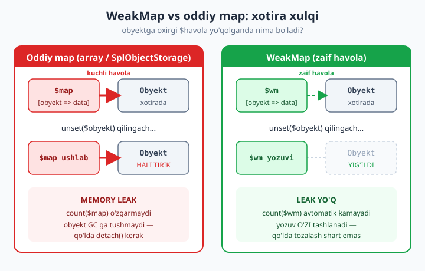
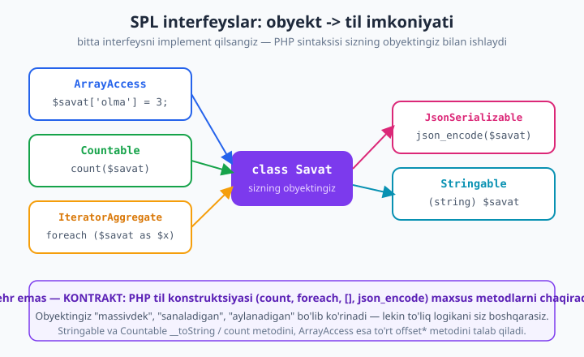

# 09 — WeakMap, SPL interfeyslar va reference semantikasi

[⬅️ Oldingi: 08 — Reflection, attributes va FFI](./08-reflection-attributes.md) · [🏠 README](./README.md) · [Keyingi: 10 — PSR standartlari va PHP-FIG ➡️](./10-psr-standartlar.md)

> **Bu bobda:** PHP ning xotira modelining uchta nozik, ammo amaliyotda tez-tez uchraydigan qatlamini o'rganamiz. Birinchidan, `WeakReference` va `WeakMap` (ikkalasi ham 8.0) — obyektni **tirik ushlamasdan** unga metadata bog'lash, ya'ni keshlar va kuzatuvchilarni **memory leak**siz qurish. Ikkinchidan, **SPL interfeyslar** (`ArrayAccess`, `Countable`, `IteratorAggregate`, `Iterator`, `JsonSerializable`, `Stringable`) — bular sizning oddiy obyektingizni massivdek indekslanadigan, `count()` qilinadigan, `foreach` da aylanadigan, `json_encode` qilinadigan va satrga aylanadigan qiladi. Uchinchidan, **reference semantikasi** — `&` qachon HAQIQATAN kerak (deyarli hech qachon), obyekt nega "handle", massivlar nega **copy-on-write** tufayli arzon uzatiladi va **sirkulyar havola**lar GC bilan qanday yig'iladi. Hammasi PHP 8.4 da haqiqatan run qilib tasdiqlangan. Bu bob boshlovchi kitobdagi [class va obyekt](../php/14-class-va-obyekt-eng-asosiy-tushuncha.md), [kirish darajalari](../php/16-kirish-darajalari-public-va-private.md) va [xatolarni boshqarish](../php/23-xatolarni-boshqarish.md) boblariga tayanadi.

---

## Nega bu mavzu muhim?

Yangi boshlovchi PHP dasturchi odatda "PHP o'zi xotirani boshqaradi, men o'ylamasam ham bo'ladi" deb o'ylaydi. Bu 90% holatda to'g'ri. Ammo qolgan 10% — uzoq ishlaydigan jarayonlar (worker, queue consumer, Swoole/RoadRunner serverlari), katta keshlar va kuzatuvchi (observer) tizimlar — aynan shu yerda "sezilmas" xotira oqishi (memory leak) sodir bo'ladi va dastur sekin-asta RAM ni to'ldirib, qulaydi.

Sababini tushunish uchun PHP xotira modelining bitta poydevor tushunchasini bilish kerak: **refcount** (havolalar sanog'i). Har bir obyektga nechta o'zgaruvchi ishora qilayotgani sanab boriladi. Sanoq 0 ga tushganda obyekt darhol xotiradan o'chiriladi. WeakMap, WeakReference va GC sikllari — barchasi shu sanoq atrofida aylanadi. Shuni o'zlashtirsangiz, ko'p "sehrli" xatti-harakatlar oddiy mantiqqa aylanadi.

> **Eslatma:** bu bob "ekspert" qatlami — boshlovchi kitobda obyekt nima ekanini o'rgangansiz deb hisoblaymiz. Agar `public`/`private` yoki `class` bo'yicha shubha bo'lsa, avval [class va obyekt](../php/14-class-va-obyekt-eng-asosiy-tushuncha.md) ga qayting.

---

## Refcount: hamma narsaning asosi

PHP da har bir qiymat (skalyar, massiv, obyekt) ichki `zval` strukturasida saqlanadi, va murakkab turlar (massiv, obyekt) uchun unga **refcount** biriktiriladi. Quyidagi misol tushunchani ko'rsatadi:

```php
<?php
declare(strict_types=1);

$obj = new stdClass();              // obyekt yaratildi, refcount = 1
$boshqa = $obj;                     // AYNI obyektga ikkinchi havola, refcount = 2

// spl_object_id ikkala o'zgaruvchi uchun BIR XIL — demak bitta obyekt
var_dump(spl_object_id($obj) === spl_object_id($boshqa)); // true

unset($boshqa);                     // refcount = 1
unset($obj);                        // refcount = 0 -> obyekt DARHOL o'chiriladi
```

Bu yerda muhim xulosa: `$boshqa = $obj` **yangi obyekt yaratmaydi**, faqat ayni obyektga yana bir havola qo'shadi. Refcount 0 ga tushgan zahoti (oxirgi havola yo'qolganda) PHP obyektni avtomatik tozalaydi. **Ko'pchilik leak — bu kimdir obyektga "keraksiz" havolani ushlab turgani** — refcount hech qachon 0 ga tushmaydi.

Mana shu nuqtada WeakReference sahnaga chiqadi.

---

## WeakReference: ushlamaydigan havola

`WeakReference` (8.0) — obyektga **zaif** (weak) havola yaratadi: u obyektni "kuzatadi", lekin refcount ni **oshirmaydi**. Demak, agar obyektga boshqa barcha (kuchli) havolalar yo'qolsa, obyekt yig'ib yuboriladi, WeakReference esa `null` qaytara boshlaydi.

```php
<?php
declare(strict_types=1);

class Hujjat
{
    public function __construct(public string $nom) {}
}

$hujjat = new Hujjat('hisobot.pdf');

// WeakReference obyektni "kuzatadi", lekin tirik USHLAMAYDI
$kuzatuvchi = WeakReference::create($hujjat);

var_dump($kuzatuvchi->get()?->nom); // string(11) "hisobot.pdf"

unset($hujjat); // yagona kuchli havola yo'qoldi

var_dump($kuzatuvchi->get());       // NULL — obyekt yig'ib yuborildi
```

`$kuzatuvchi->get()` har safar joriy holatni qaytaradi: obyekt tirik bo'lsa — uni, o'lgan bo'lsa — `null`. Bu yerda `?->` (nullsafe operatori) qulay: obyekt yo'q bo'lsa `null` qaytaradi, xato bermaydi.

**Qachon WeakReference kerak?** Sizga obyektga *ixtiyoriy* havola kerak bo'lganda — ya'ni "agar u hali tirik bo'lsa, men u bilan ishlayman, lekin men uning *sababi* bilan tirik turishini xohlamayman". Klassik misollar: kuzatuvchilar (observer) ro'yxati, kesh, ota-ona/bola munosabatidagi "orqaga havola" (child obyekt parentni weak ushlasa, sirkulyar havola hosil bo'lmaydi).

---

## WeakMap: leaksiz metadata va kesh

`WeakReference` bitta obyektni kuzatadi. Amalda esa ko'pincha **bir nechta obyektga metadata biriktirish** kerak bo'ladi — masalan, "bu obyekt necha marta ishlatildi", "bu so'rov uchun keshlangan natija nima". Aynan shu uchun `WeakMap` (8.0) bor: u kalit sifatida **obyektni** oladi, lekin kalitni (obyektni) **tirik ushlamaydi**. Obyekt boshqa joyda o'lsa, WeakMap dagi yozuv **o'zi yo'qoladi**.



### Asosiy xulq: yozuv o'zi tashlanadi

```php
<?php
declare(strict_types=1);

$map = new WeakMap();

$user = new stdClass();
$map[$user] = ['so_rovlar' => 0, 'oxirgi_kirish' => time()];

echo "WeakMap hajmi: " . count($map) . "\n";          // 1
$map[$user]['so_rovlar']++;
echo "so_rovlar: " . $map[$user]['so_rovlar'] . "\n"; // 1

// obyektga boshqa havola qolmaganda
unset($user);
echo "unset dan keyin hajmi: " . count($map) . "\n";  // 0 — yozuv O'ZI yo'qoldi
```

E'tibor bering: `unset($user)` dan keyin biz WeakMap ga **tegmadik**, lekin `count($map)` 1 dan 0 ga tushdi. Bu — WeakMap ning butun mohiyati: obyekt o'lsa, unga bog'liq metadata avtomatik tozalanadi. Hech qachon `unset($map[$user])` yozish kerak emas.

### Oddiy map (array / SplObjectStorage) bilan farqi

Endi eng muhim taqqoslash. Agar biz obyektni oddiy massivga yoki `SplObjectStorage` ga kalit qilib qo'ysak, ular obyektga **kuchli** havola ushlaydi — demak obyekt hech qachon o'lmaydi, garchi siz uni boshqa joyda `unset` qilsangiz ham:

```php
<?php
declare(strict_types=1);

// --- Oddiy map (SplObjectStorage) obyektni TIRIK ushlaydi ---
$storage = new SplObjectStorage();
$obj = new stdClass();
$storage[$obj] = 'metadata';
echo "SplObjectStorage hajmi: " . count($storage) . "\n";              // 1

$ref = WeakReference::create($obj);
unset($obj);
// $storage hali ham ichida KUCHLI havola saqlaydi -> obyekt o'lmaydi
echo "unset dan keyin SplObjectStorage hajmi: " . count($storage) . "\n"; // 1 (!)
var_dump($ref->get() !== null);  // true — obyekt hali TIRIK (storage ushlab turibdi)

// --- WeakMap esa qo'yib yuboradi ---
$wm = new WeakMap();
$obj2 = new stdClass();
$wm[$obj2] = 'metadata';
$ref2 = WeakReference::create($obj2);
unset($obj2);
echo "unset dan keyin WeakMap hajmi: " . count($wm) . "\n";  // 0
var_dump($ref2->get());          // NULL — obyekt yo'qoldi
```

Natija quyidagicha:

```
SplObjectStorage hajmi: 1
unset dan keyin SplObjectStorage hajmi: 1
bool(true)
unset dan keyin WeakMap hajmi: 0
NULL
```

`SplObjectStorage` da hajmi 1 ligicha qoldi va obyekt tirik — **bu memory leak**. Agar bu uzoq ishlaydigan worker bo'lsa va siz minglab obyektni shunday "metadata" bilan saqlasangiz, ular hech qachon yig'ilmaydi. `WeakMap` da esa hajmi 0 ga tushdi, obyekt yo'qoldi — **leak yo'q**.

> **Asosiy qoida:** obyektga *metadata* biriktirish kerak bo'lsa va siz o'sha metadata obyekt umridan uzoqroq yashashini XOHLAMASANGIZ — `WeakMap` ishlating, oddiy massiv yoki `SplObjectStorage` emas. `SplObjectStorage` ni faqat obyektlarni *atayin* tirik ushlash kerak bo'lganda (masalan, navbat yoki to'plam sifatida) ishlating.

### Amaliy misol: leaksiz memoizatsiya keshi

WeakMap ning klassik foydasi — obyekt asosida og'ir hisoblash natijasini keshlash. Obyekt yashasa — kesh ham yashaydi; obyekt o'lsa — kesh ham tozalanadi:

```php
<?php
declare(strict_types=1);

final class HisoblovchiKesh
{
    /** @var WeakMap<object, string> */
    private WeakMap $kesh;
    public int $hisoblashlarSoni = 0;

    public function __construct()
    {
        $this->kesh = new WeakMap();
    }

    public function natija(object $manba): string
    {
        if (isset($this->kesh[$manba])) {
            return $this->kesh[$manba]; // keshdan, qayta hisoblanmaydi
        }
        $this->hisoblashlarSoni++;
        $qiymat = strtoupper(spl_object_id($manba) . '-natija'); // "og'ir" hisoblash o'rniga
        $this->kesh[$manba] = $qiymat;
        return $qiymat;
    }
}

$kesh = new HisoblovchiKesh();
$a = new stdClass();

echo $kesh->natija($a) . "\n";   // hisoblanadi
echo $kesh->natija($a) . "\n";   // keshdan
echo "Hisoblashlar: {$kesh->hisoblashlarSoni}\n"; // 1 — bir marta hisoblandi

unset($a); // $a yo'qoldi -> WeakMap yozuvi ham avtomatik yo'qoldi (leak yo'q)
echo "Kesh avtomatik tozalandi\n";
```

`@var WeakMap<object, string>` — bu PHPDoc generik annotatsiyasi; statik tahlilchilar (PHPStan, Psalm, IDE) uni o'qiydi, lekin PHP ishga tushganda turini majburlamaydi. WeakMap kaliti **doim obyekt** bo'lishi shart — skalyar kalit (`int`, `string`) qabul qilinmaydi, chunki "zaif havola" tushunchasi faqat obyektlarga taalluqli.

> **Tuzoq:** WeakMap kaliti faqat obyekt. `$wm['string'] = 1;` -> `TypeError`. Agar sizga string kalit kerak bo'lsa, sizga WeakMap emas, oddiy massiv kerak.

---

## SPL interfeyslar: obyektni tilga "ulash"

PHP ning bir qancha til konstruktsiyalari — `count()`, `foreach`, `[]` indekslash, `json_encode()`, `(string)` cast — odatda massivlar va skalyarlar bilan ishlaydi. SPL (Standard PHP Library) interfeyslari aynan shu konstruktsiyalarni **sizning obyektingiz** bilan ishlatish imkonini beradi. Bu "sehr" emas — bu **kontrakt**: siz kelishilgan metodlarni yozasiz, PHP esa til konstruktsiyasini ishlatganda o'sha metodlarni chaqiradi.



Quyida bitta klassda beshta interfeysni birga ko'rsatamiz — "savat" (savatcha) misolida, har bir interfeys bir til imkoniyatini "ochadi".

```php
<?php
declare(strict_types=1);

/**
 * Bitta klass -> bir nechta til imkoniyatini "ochadi":
 *  - ArrayAccess        => $savat['olma']
 *  - Countable          => count($savat)
 *  - IteratorAggregate  => foreach ($savat as ...)
 *  - JsonSerializable   => json_encode($savat)
 *  - Stringable         => (string) $savat / echo
 */
final class Savat implements
    ArrayAccess,
    Countable,
    IteratorAggregate,
    JsonSerializable,
    Stringable
{
    /** @var array<string,int> */
    private array $mahsulotlar = [];

    // --- ArrayAccess: obyektni $savat['kalit'] qilib ishlatish ---
    public function offsetExists(mixed $offset): bool
    {
        return isset($this->mahsulotlar[$offset]);
    }
    public function offsetGet(mixed $offset): mixed
    {
        return $this->mahsulotlar[$offset] ?? null;
    }
    public function offsetSet(mixed $offset, mixed $value): void
    {
        if ($offset === null) {                       // $savat[] = ... holati
            throw new InvalidArgumentException('Savatga kalit kerak');
        }
        $this->mahsulotlar[$offset] = (int) $value;
    }
    public function offsetUnset(mixed $offset): void
    {
        unset($this->mahsulotlar[$offset]);
    }

    // --- Countable: count($savat) jami dona sonini qaytaradi ---
    public function count(): int
    {
        return array_sum($this->mahsulotlar);
    }

    // --- IteratorAggregate: foreach uchun ichki iteratorni beradi ---
    public function getIterator(): Iterator
    {
        return new ArrayIterator($this->mahsulotlar);
    }

    // --- JsonSerializable: json_encode chiqishini boshqarish ---
    public function jsonSerialize(): array
    {
        return [
            'qatorlar' => $this->mahsulotlar,
            'jami'     => $this->count(),
        ];
    }

    // --- Stringable: (string) va echo uchun ---
    public function __toString(): string
    {
        return "Savat(" . count($this->mahsulotlar) . " qator, {$this->count()} dona)";
    }
}

$savat = new Savat();
$savat['olma'] = 3;                 // offsetSet
$savat['nok']  = 2;

echo $savat['olma'], "\n";          // offsetGet -> 3
echo count($savat), "\n";           // Countable -> 5 (3+2)
var_dump(isset($savat['nok']));     // offsetExists -> true

foreach ($savat as $nom => $dona) { // IteratorAggregate
    echo "$nom => $dona\n";
}

echo json_encode($savat), "\n";     // JsonSerializable
echo $savat, "\n";                  // Stringable (__toString)
```

Natija:

```
3
5
bool(true)
olma => 3
nok => 2
{"qatorlar":{"olma":3,"nok":2},"jami":5}
Savat(2 qator, 5 dona)
```

Endi har bir interfeysni alohida, "nega/qachon/tuzoq" bilan ko'rib chiqamiz.

### ArrayAccess — obyektni massivdek indekslash

`ArrayAccess` to'rtta metodni talab qiladi: `offsetExists` (`isset($o['k'])`), `offsetGet` (`$o['k']`), `offsetSet` (`$o['k'] = ...`), `offsetUnset` (`unset($o['k'])`).

- **Qachon foydali:** konfiguratsiya konteynerlari (`$config['db']['host']`), DI konteynerlar, immutable to'plamlar — obyektni massiv kabi qulay sintaksis bilan ishlatish kerak bo'lganda.
- **Tuzoq 1:** `offsetSet($offset, $value)` da `$offset === null` — bu `$o[] = $value` holati (push). Buni alohida tekshiring, aks holda `null` kalit yaratiladi.
- **Tuzoq 2:** `$o['k']` *qiymatni qaytaradi*, lekin ichki massivga **havola emas**. Shuning uchun `$o['k'][] = 1` ("indirect modification") ko'pincha ishlamaydi yoki ogohlantirish beradi — chunki `offsetGet` nusxa qaytaradi. Bu ArrayAccess ning ma'lum cheklovi.

### Countable — count() ni boshqarish

`Countable` bitta metod — `count(): int` — talab qiladi. Endi `count($obj)` aynan shu metodni chaqiradi.

```php
<?php
declare(strict_types=1);

final class Jamoa implements Countable
{
    public function __construct(private array $azolar = []) {}
    public function count(): int { return count($this->azolar); }
}

$jamoa = new Jamoa(['Oqil', 'Laylo', 'Ali']);
echo count($jamoa), "\n"; // 3
```

- **Tuzoq:** `count()` qaytaradigan son obyektning *ichki holatiga* mos bo'lishini ta'minlang. Agar `count()` 5 qaytarsa-yu, `foreach` 3 element bersa — bu API foydalanuvchini chalg'itadi.

### IteratorAggregate va Iterator — foreach qilinadigan obyekt

`foreach` ishlashi uchun obyekt yo `IteratorAggregate` (oson yo'l), yo `Iterator` (to'liq nazorat) ni implement qilishi kerak.

- **`IteratorAggregate`** — bitta metod `getIterator(): Iterator`. Odatda ichki massivni `new ArrayIterator(...)` ga o'rab qaytarasiz. **99% holatda shu yetadi** va eng o'qiluvchan yo'l.
- **`Iterator`** — beshta metod (`rewind`, `valid`, `current`, `key`, `next`). Buni faqat **dangasa (lazy)** iteratsiya kerak bo'lganda — elementlarni oldindan emas, talab paytida generatsiya qilganda — ishlatasiz.

To'liq `Iterator` misoli (1..N kvadratlarini xotirada saqlamasdan generatsiya qiladi):

```php
<?php
declare(strict_types=1);

/** To'liq Iterator: kvadratlarni "dangasa" (lazy) generatsiya qiladi */
final class KvadratlarIteratori implements Iterator
{
    private int $pozitsiya = 0;
    public function __construct(private readonly int $chegara) {}

    public function rewind(): void   { $this->pozitsiya = 1; }
    public function valid(): bool    { return $this->pozitsiya <= $this->chegara; }
    public function current(): int   { return $this->pozitsiya ** 2; }
    public function key(): int       { return $this->pozitsiya; }
    public function next(): void     { $this->pozitsiya++; }
}

foreach (new KvadratlarIteratori(5) as $n => $kvadrat) {
    echo "$n^2 = $kvadrat\n";
}
// 1^2 = 1, 2^2 = 4, 3^2 = 9, 4^2 = 16, 5^2 = 25
```

> **Maslahat:** ko'pincha `Iterator` ni qo'lda yozish o'rniga **generator** (`yield`) ishlatish ancha qisqa va xatosizroq. Generator ichida ham `IteratorAggregate::getIterator()` dan `yield` qilsangiz, beshta metodni yozish shart emas. Generatorlar alohida mavzu — bu yerda biz interfeys mexanikasini ko'rsatish uchun qo'lda yozdik.

### JsonSerializable — json_encode chiqishini boshqarish

`json_encode($obj)` standart holatda obyektning **public** xossalarini oladi (private/protected tushib qoladi), lekin **nomlarni yoki strukturani boshqarib bo'lmaydi**. `JsonSerializable::jsonSerialize()` aynan shu nazoratni beradi:

```php
<?php
declare(strict_types=1);

class Foydalanuvchi
{
    public function __construct(
        public string $ism,
        private string $parol,   // private — JSON ga chiqmasligi kerak
    ) {}
}
// JsonSerializable YO'Q: faqat public chiqadi, lekin nomlarni boshqarib bo'lmaydi
echo json_encode(new Foydalanuvchi('Oqil', 'sirli123')), "\n";
// {"ism":"Oqil"}

class Foydalanuvchi2 implements JsonSerializable
{
    public function __construct(
        public string $ism,
        private string $parol,
    ) {}
    public function jsonSerialize(): array
    {
        return ['ism' => $this->ism, 'parolBor' => $this->parol !== ''];
    }
}
echo json_encode(new Foydalanuvchi2('Oqil', 'sirli123')), "\n";
// {"ism":"Oqil","parolBor":true}
```

- **Qachon foydali:** API javoblari — `created_at` ni ISO formatga, enum ni qiymatiga, parolni butunlay yashirishga aylantirish. DTO va resurs (resource) klasslari deyarli doim `JsonSerializable`.
- **Tuzoq:** `jsonSerialize()` *qiymat* qaytaradi (massiv yoki istalgan json-encodable narsa), JSON satr emas. `json_encode` o'zi uni kodlaydi — siz ichida yana `json_encode` chaqirmang.

### Stringable — __toString va tur belgisi

`Stringable` (8.0) — `__toString(): string` metodi bo'lgan har qanday klass **avtomatik** `Stringable` hisoblanadi (interfeysni alohida yozish shart emas, lekin yozsangiz — niyatni aniq bildiradi). U `string|Stringable` kabi tur belgilarida foydali:

```php
<?php
declare(strict_types=1);

final class Pul implements Stringable
{
    public function __construct(
        private int $tiyin,
    ) {}
    public function __toString(): string
    {
        return number_format($this->tiyin / 100, 2) . ' so\'m';
    }
}

function chiqar(string|Stringable $xabar): void { echo $xabar, "\n"; }

chiqar(new Pul(150_000)); // 1,500.00 so'm  (echo __toString ni chaqiradi)
```

- **Tuzoq:** `__toString` ICHIDA **istisno (exception) tashlamang** — eski PHP versiyalarida bu fatal xato berardi. 8.x da ruxsat etilgan, ammo baribir tavsiya etilmaydi: satrga aylantirish "xavfsiz" amal bo'lishi kerak.

---

## SPL data strukturalari: qisqacha sharh

SPL faqat interfeyslar emas, bir qancha tayyor **data strukturalar** ham beradi. Ular ichki C kodida amalga oshirilgan va ba'zi vazifalarda massivga qaraganda aniqroq niyatni bildiradi (ba'zan tezroq yoki kamroq xotira). Quyidagi misol asosiylarini ko'rsatadi:

```php
<?php
declare(strict_types=1);

// SplStack — LIFO (oxirgi kirgan birinchi chiqadi)
$stek = new SplStack();
$stek->push('a'); $stek->push('b'); $stek->push('c');
echo "Stek top: " . $stek->top() . "\n";   // c
echo "Stek pop: " . $stek->pop() . "\n";    // c

// SplQueue — FIFO (birinchi kirgan birinchi chiqadi)
$navbat = new SplQueue();
$navbat->enqueue('1'); $navbat->enqueue('2');
echo "Navbat dequeue: " . $navbat->dequeue() . "\n"; // 1

// SplPriorityQueue — eng yuqori prioritet birinchi chiqadi
$pq = new SplPriorityQueue();
$pq->insert('past-ish', 1);
$pq->insert('shoshilinch', 10);
$pq->insert('o\'rta', 5);
echo "Eng muhim: " . $pq->extract() . "\n"; // shoshilinch

// SplFixedArray — qat'iy o'lcham, kamroq xotira, tezroq indekslash
$fix = new SplFixedArray(3);
$fix[0] = 'x'; $fix[2] = 'z';
echo "SplFixedArray[0]=" . $fix[0] . ", o'lcham=" . $fix->getSize() . "\n";
try {
    $fix[5] = 'oops'; // ❌ chegaradan tashqari -> RuntimeException
} catch (RuntimeException $e) {
    echo "Xato: " . $e->getMessage() . "\n";
}

// SplDoublyLinkedList — ikki tomonlama bog'langan ro'yxat (Stack/Queue uchun asos)
$dll = new SplDoublyLinkedList();
$dll->push('bosh'); $dll->push('oxir');
$dll->unshift('eng-bosh');
echo "DLL birinchi: " . $dll->bottom() . ", oxirgi: " . $dll->top() . "\n";
```

`SplObjectStorage` ni esa yuqorida WeakMap bilan taqqoslaganda ko'rdik — u obyektlar to'plami yoki obyekt -> data xaritasi sifatida ishlatiladi (lekin obyektni TIRIK ushlaydi, buni unutmang):

```php
<?php
declare(strict_types=1);

$storage = new SplObjectStorage();
$o1 = new stdClass();
$o2 = new stdClass();
$storage->attach($o1, ['rol' => 'admin']);   // obyekt -> data
$storage->attach($o2, ['rol' => 'mehmon']);

echo "Saqlangan: " . count($storage) . "\n"; // 2
echo "o1 roli: " . $storage[$o1]['rol'] . "\n"; // admin
var_dump($storage->contains($o2));            // true

foreach ($storage as $obj) {
    echo "Data: " . $storage->getInfo()['rol'] . "\n"; // joriy obyekt datasi
}

$storage->detach($o1);
echo "Detach dan keyin: " . count($storage) . "\n"; // 1
```

**Qachon qaysi struktura?** Amalda quyidagi jadval yetarli:

| Struktura | Qachon foydali | Eslatma |
|---|---|---|
| `SplStack` | LIFO kerak bo'lganda (undo stek, DFS) | `array_push`/`array_pop` ham ishlaydi |
| `SplQueue` | FIFO kerak (vazifa navbati, BFS) | massiv bilan `array_shift` O(n), SplQueue O(1) |
| `SplPriorityQueue` | prioritetli navbat (planlovchi) | extract eng yuqori prioritetni beradi |
| `SplDoublyLinkedList` | ikkala uchidan tez qo'shish/olish | Stack/Queue uchun ichki asos |
| `SplObjectStorage` | obyektlar to'plami / obyekt->data | obyektni TIRIK ushlaydi (leak ehtimoli) |
| `SplFixedArray` | o'lcham oldindan ma'lum, juda ko'p element | kamroq xotira, faqat butun indeks |

> **Halol gap:** kundalik PHP kodida oddiy massiv (`[]`) 95% holatda yetarli va idiomatik. SPL strukturalarini niyatni aniq ifodalash (`SplStack` -> "bu LIFO"), O(1) navbat operatsiyalari yoki juda katta hajmda xotira tejash kerak bo'lganda tanlang — "shunchaki chiroyli" deb emas.

---

## Reference semantikasi: & qachon haqiqatan kerak?

Endi eng ko'p chalkashlik tug'diradigan mavzu — havolalar (`&`). Boshlovchilar ko'pincha "obyekt o'zgarishi uchun `&` kerak" deb o'ylaydi. **Bu noto'g'ri.** Aniq tushunish uchun uchta holatni ajratamiz: skalyar, obyekt, massiv.

### Skalyar: qiymat-bo'yicha (default)

Skalyar qiymatlar (`int`, `float`, `string`, `bool`) funksiyaga **nusxa** sifatida uzatiladi. Funksiya ichida o'zgartirish tashqaridagi asl qiymatga ta'sir qilmaydi:

```php
<?php
declare(strict_types=1);

// --- Qiymat-bo'yicha: nusxa o'zgaradi, asl o'zgarmaydi ---
function oshir(int $x): void { $x++; }
$a = 5;
oshir($a);
echo "Havolasiz: \$a = $a\n";   // 5 — o'zgarmadi

// --- & bilan: havola-bo'yicha (asl o'zgaradi) ---
function oshirHavola(int &$x): void { $x++; }
$b = 5;
oshirHavola($b);
echo "Havola bilan: \$b = $b\n"; // 6 — o'zgardi
```

Faqat shu yerda `&` chinakam "ish bajaradi" — skalyarni funksiya ichida o'zgartirib, natijani tashqariga "qaytarish". Lekin **bu deyarli hech qachon yaxshi dizayn emas**: o'rniga qiymatni `return` qiling. `&` kodni o'qiyotgan kishi uchun "ko'rinmas yon ta'sir" yaratadi.

### Obyekt = handle (havola emas, lekin handle nusxalanadi)

Mana eng muhim nuqta. **Obyekt o'zgaruvchisi obyektni emas, obyektga "handle" (tutqich) ni saqlaydi.** Funksiyaga obyekt uzatilganda — handle **nusxalanadi**, lekin nusxa ham **ayni obyektga** ishora qiladi. Shuning uchun obyekt ichini o'zgartirish `&` siz ham ishlaydi:

```php
<?php
declare(strict_types=1);

class Hisob { public int $balans = 100; }

// & YO'Q, lekin obyekt ichi o'zgaradi — chunki handle ayni obyektga ishora qiladi
function yech(Hisob $h): void { $h->balans -= 50; }
$hisob = new Hisob();
yech($hisob);
echo "Balans: {$hisob->balans}\n"; // 50 — o'zgardi (& kerak emas!)

// AMMO: handle ni QAYTA tayinlash tashqariga ta'sir qilmaydi
function almashtir(Hisob $h): void { $h = new Hisob(); $h->balans = 0; }
almashtir($hisob);
echo "Almashtirdan keyin: {$hisob->balans}\n"; // 50 — o'zgarmadi
```

Tahlil:
- `yech()` da biz obyektning **ichini** (`->balans`) o'zgartiramiz — handle hali o'sha obyektga ishora qiladi, demak tashqaridan ko'rinadi.
- `almashtir()` da biz mahalliy `$h` o'zgaruvchisiga **yangi** obyektni tayinlaymiz — bu faqat funksiya ichidagi handle nusxasini o'zgartiradi, tashqaridagi `$hisob` hali eski obyektga ishora qiladi.

Agar `almashtir()` da `&$h` ishlatsangiz, tashqaridagi `$hisob` ham yangi obyektga ishora qilardi. Lekin bunga ehtiyoj juda kam.

> **Asosiy xulosa:** obyekt ichini o'zgartirish uchun `&` HECH QACHON kerak emas. `&` faqat o'zgaruvchining O'ZINI (qaysi obyektga ishora qilishini) funksiya ichidan o'zgartirmoqchi bo'lganingizda kerak — bu esa noyob holat.

### Massiv va copy-on-write (COW)

Massivlar PHP da **qiymat-bo'yicha** uzatiladi (obyektdan farqli). Bu degani — funksiyaga massiv uzatsangiz, u nusxalanadi. Sodda nazariyada bu qimmat ko'rinadi (million elementli massivni nusxalash). Lekin PHP **copy-on-write (COW)** optimallashtirilishini qo'llaydi: massiv tayinlanganda yoki uzatilganda **haqiqiy nusxa olinmaydi** — faqat refcount oshadi. Nusxa faqat **kimdir massivni o'zgartirganda** olinadi:

```php
<?php
declare(strict_types=1);

$katta = range(1, 1_000_000);
$boshlangich = memory_get_usage();

$nusxa = $katta;                 // hali HAQIQIY nusxa EMAS (COW) — arzon
$tayinlashdanKeyin = memory_get_usage();
echo "Tayinlashdan keyin o'sish: " . ($tayinlashdanKeyin - $boshlangich) . " bayt\n"; // ~0

$nusxa[0] = 999;                 // MANA ENDI haqiqiy nusxa olinadi (write)
$yozgandanKeyin = memory_get_usage();
echo "Yozgandan keyin o'sish: " . ($yozgandanKeyin - $tayinlashdanKeyin) . " bayt\n"; // katta
echo "Asl o'zgarmadi: \$katta[0] = {$katta[0]}\n"; // 1
```

Natija (raqamlar mashinaga bog'liq):

```
Tayinlashdan keyin o'sish: 0 bayt
Yozgandan keyin o'sish: 18874480 bayt
Asl o'zgarmadi: $katta[0] = 1
```

Tahlil: `$nusxa = $katta` deyarli 0 bayt qo'shdi — chunki COW tufayli ikkala o'zgaruvchi ayni ichki massivni "baham ko'radi". Faqat `$nusxa[0] = 999` yozganimizda PHP haqiqiy nusxani ajratdi (~18 MB). Shuning uchun **massivni funksiyaga uzatishdan qo'rqmang** — agar funksiya uni o'zgartirmasa, nusxa umuman olinmaydi.

> **`&$massiv` qachon?** Juda katta massivni funksiyada **joyida** (in-place) o'zgartirish va nusxa narxidan qochish kerak bo'lgan, isbotlangan ishlash (performance) uzaq nuqtasida. Bu — mikrooptimizatsiya; avval profiling qiling, keyin `&` qo'shing.

### foreach (&$v) tuzog'i

Havolaning eng mashhur tuzog'i — `foreach` da `&` ishlatib, keyin `unset` qilishni unutish:

```php
<?php
declare(strict_types=1);

// To'g'ri yo'l: & dan keyin DARHOL unset
$ro_yxat = [1, 2, 3];
foreach ($ro_yxat as &$v) {
    $v *= 10;
}
unset($v);                       // MUHIM: havolani uzib qo'yamiz
echo implode(',', $ro_yxat) . "\n"; // 10,20,30 (to'g'ri)

// ❌ unset YODDAN chiqsa — keyingi foreach asl massivni BUZADI
$x = [1, 2, 3];
foreach ($x as &$r) {}           // $r endi $x[2] ga havola bo'lib QOLADI
foreach ($x as $r) {}            // har iteratsiya $x[2] ga yoziladi!
echo implode(',', $x) . "\n";    // 1,2,2 — BUZILGAN natija
```

Ikkinchi blok nega `1,2,2` beradi? Birinchi `foreach` dan keyin `$r` hali `$x[2]` ga havola. Ikkinchi `foreach` har iteratsiyada joriy elementni `$r` ga yozadi — ya'ni `$x[2]` ga. Oxirgi iteratsiyada `$x[2]` ning o'ziga `$x[2]` (ya'ni 2) yoziladi. Natija buziladi.

> **Qoida:** `foreach (... as &$v)` ishlatdingizmi — **darhol** keyin `unset($v)`. Yoki umuman `&` siz `foreach` qiling va yangi massiv quring (`array_map`). Funksional uslub bu tuzoqdan butunlay qochiradi.

---

## GC sikllari: sirkulyar havolalar va gc_collect_cycles

Yuqorida aytdik: refcount 0 ga tushganda obyekt darhol o'chadi. Lekin bitta holat bor — refcount o'zgaruvchilardan emas, **obyektlarning bir-birini ushlashidan** 0 ga tushmaydi. Bu **sirkulyar (aylanma) havola**:

```php
<?php
declare(strict_types=1);

class Tugun
{
    public ?Tugun $keyingi = null;
    public ?Tugun $oldingi = null;
    public function __construct(public string $nom) {}
}

function aylanaYarat(): void
{
    $a = new Tugun('A');
    $b = new Tugun('B');
    // Sirkulyar havola: A -> B va B -> A
    $a->keyingi = $b;
    $b->oldingi = $a;
    // Funksiya tugaydi: mahalliy $a, $b yo'qoladi,
    // lekin obyektlar BIR-BIRINI ushlab turibdi -> refcount 0 ga tushmaydi
}

gc_collect_cycles();             // boshlang'ich holatni tozalab olamiz

for ($i = 0; $i < 5; $i++) {
    aylanaYarat();               // har safar "yetim" aylana qoldiradi
}

$yigildi = gc_collect_cycles();  // sikl yig'uvchini QO'LDA chaqiramiz
echo "Yig'ilgan sirkulyar obyektlar: $yigildi\n"; // 10 (5 iteratsiya x 2 obyekt)

$status = gc_status();
echo "GC ishga tushishlar: {$status['runs']}\n";
echo "Hozir kuzatilayotgan ildizlar (roots): {$status['roots']}\n";
```

Natija:

```
Yig'ilgan sirkulyar obyektlar: 10
GC ishga tushishlar: 1
Hozir kuzatilayotgan ildizlar (roots): 0
```

Tahlil: `aylanaYarat()` har chaqirilganda ikkita obyekt yaratadi, ular bir-birini ushlaydi. Funksiya tugagach, mahalliy o'zgaruvchilar yo'qoladi, lekin obyektlarning refcounti 1 ligicha qoladi (bir-biriga ishora qiladi) — refcount mexanizmi ularni o'chira olmaydi. Aynan shu yerda **sikl yig'uvchi (cycle collector)** kerak: u "yetim aylanalar"ni topib o'chiradi. `gc_collect_cycles()` 10 obyektni yig'di (5 × 2).

**Amaliyotda nima qilish kerak?**
- Odatda — **hech narsa**. PHP sikl yig'uvchini avtomatik ishga tushiradi (ildizlar buferi to'lganda) va so'rov tugagach hamma narsa baribir tozalanadi. Qisqa umrli web-so'rovlarda muammo deyarli yo'q.
- **Uzoq ishlaydigan jarayonlarda** (worker, daemon, RoadRunner/Swoole) — agar siz juda ko'p sirkulyar struktura yaratsangiz, vaqti-vaqti bilan `gc_collect_cycles()` ni qo'lda chaqirish xotira o'sishini cheklaydi. `gc_status()` bilan holatni kuzating.
- **Eng yaxshi yechim** — sirkulyar havolalardan **qochish**: agar bola obyekt ota-onaga "orqaga havola" qilsa, uni `WeakReference` qiling. Shunda aylana umuman hosil bo'lmaydi va sikl yig'uvchiga ehtiyoj qolmaydi.

> **Tuzoq:** `__destruct()` metodi bo'lgan obyektlar sirkulyar aylanada bo'lsa, ularning destruktori chaqirilish tartibi kafolatlanmaydi. Destruktorga muhim mantiq (resurs yopish) qo'ymang — buni `try/finally` yoki aniq `close()` chaqiruvi bilan boshqaring.

---

## Yakuniy xulosa

- **Refcount** — hamma narsaning asosi: obyektga oxirgi havola yo'qolganda u darhol o'chadi. Leak — bu kimdir keraksiz havolani ushlab turgani.
- **`WeakReference`** — obyektni refcountni oshirmasdan kuzatadi; obyekt o'lsa `null` qaytaradi.
- **`WeakMap`** — obyektga metadata/kesh biriktiradi, obyekt o'lsa yozuv o'zi tozalanadi. Oddiy massiv yoki `SplObjectStorage` esa obyektni TIRIK ushlaydi (leak ehtimoli).
- **SPL interfeyslar** — sehr emas, kontrakt: `ArrayAccess` (`[]`), `Countable` (`count`), `IteratorAggregate`/`Iterator` (`foreach`), `JsonSerializable` (`json_encode`), `Stringable` (`(string)`).
- **`&`** — obyekt ichini o'zgartirish uchun KERAK EMAS (obyekt handle, handle nusxalanadi). Massivlar COW tufayli arzon uzatiladi. `&` deyarli hech qachon to'g'ri tanlov emas.
- **GC sikllari** — sirkulyar havolalarni `gc_collect_cycles()` yig'adi; eng yaxshisi — `WeakReference` bilan aylanaga yo'l qo'ymaslik.

---

## Mashqlar

### Oson

1. `WeakReference` yarating: bir obyektga zaif havola oling, `get()` orqali tirikligini tekshiring, so'ng obyektni `unset` qiling va `get()` endi `null` qaytarishini ko'rsating.
2. `Countable` ni implement qiluvchi `Ranglar` klassi yozing: ichida ranglar massivi bo'lsin, `count($ranglar)` ranglar sonini qaytarsin.
3. `Stringable` ni implement qiluvchi `Harorat` klassi yozing: `__toString()` "23.5°C" ko'rinishida qaytarsin (`°` belgisini ASCII bilan emas, `\u{00B0}` yoki oddiy "C gradus" bilan ifodalashingiz mumkin).

### O'rta

4. `WeakMap` asosida oddiy "so'rovlar sanog'i" tizimi yozing: `qayd(object $o)` har chaqirilganda o'sha obyekt uchun sanoqni 1 ga oshirsin, `sanoq(object $o)` joriy sanoqni qaytarsin. Obyekt `unset` qilingach `count(WeakMap)` kamayishini ko'rsating.
5. `ArrayAccess` + `Countable` ni implement qiluvchi `Sozlamalar` (config) klassi yozing: `$cfg['host']` o'qish/yozish ishlasin, mavjud bo'lmagan kalit uchun `offsetGet` `null` qaytarsin, `count($cfg)` kalitlar sonini bersin.
6. `JsonSerializable` ni implement qiluvchi `Sana` klassi yozing: ichida `DateTimeImmutable` saqlasin, `json_encode` esa uni ISO 8601 satr (`format('c')`) ko'rinishida chiqarsin.

### Qiyin

7. Tur-xavfsiz to'plam `UserCollection` yozing: faqat `User` obyektlarini qabul qilsin, `ArrayAccess` (`$c[] = $user`, `$c[0]`), `Countable` (`count($c)`) va `IteratorAggregate` (`foreach`) ni implement qilsin. `User` bo'lmagan qiymat qo'shilganda `TypeError` tashlasin.
8. `WeakMap` asosida "metadata reestri" (`MetadataReestri`) yozing: `set($obj, $kalit, $qiymat)`, `get($obj, $kalit)` va `kuzatilayotganlar(): int` metodlari bilan. Obyekt klassini o'zgartirmasdan unga tashqaridan xususiyat biriktirsin; obyekt `unset` qilingach reestrdan avtomatik tushib qolsin.
9. Sirkulyar havolali ikki yo'nalishli `Tugun` strukturasini yarating va `gc_collect_cycles()` qanchadan-qancha obyekt yig'ishini ko'rsating. So'ng `oldingi` havolani `WeakReference` ga aylantirib, endi sirkulyar havola HOSIL BO'LMASLIGINI (`gc_collect_cycles()` 0 yoki kam qaytarishini) ko'rsating.

---

<details markdown="1"><summary>Yechim — 1</summary>

```php
<?php
declare(strict_types=1);

$obj = new stdClass();
$obj->nom = 'test';

$weak = WeakReference::create($obj);
var_dump($weak->get()?->nom); // string(4) "test" — tirik

unset($obj);                  // yagona kuchli havola yo'qoldi
var_dump($weak->get());       // NULL — yig'ib yuborildi
```

`WeakReference::create()` refcount ni oshirmaydi, shuning uchun `unset($obj)` obyektni darhol o'chiradi va `get()` `null` qaytaradi.

</details>

<details markdown="1"><summary>Yechim — 2</summary>

```php
<?php
declare(strict_types=1);

final class Ranglar implements Countable
{
    /** @param list<string> $ranglar */
    public function __construct(private array $ranglar = []) {}
    public function count(): int { return count($this->ranglar); }
}

$r = new Ranglar(['qizil', 'ko\'k', 'yashil']);
echo count($r) . "\n"; // 3
```

</details>

<details markdown="1"><summary>Yechim — 3</summary>

```php
<?php
declare(strict_types=1);

final class Harorat implements Stringable
{
    public function __construct(private float $selsiy) {}
    public function __toString(): string
    {
        return number_format($this->selsiy, 1) . "\u{00B0}C";
    }
}

echo new Harorat(23.5), "\n"; // 23.5°C
```

`\u{00B0}` — Unicode kod nuqtasi (daraja belgisi); PHP 7+ da qo'sh tirnoq ichida ishlaydi. Bu — manba kodda ASCII saqlanib, chiqishda esa to'g'ri belgi berishning toza usuli.

</details>

<details markdown="1"><summary>Yechim — 4</summary>

```php
<?php
declare(strict_types=1);

final class SorovHisoblagich
{
    /** @var WeakMap<object,int> */
    private WeakMap $sanoq;
    public function __construct() { $this->sanoq = new WeakMap(); }

    public function qayd(object $o): void
    {
        $this->sanoq[$o] = ($this->sanoq[$o] ?? 0) + 1;
    }
    public function sanoq(object $o): int
    {
        return $this->sanoq[$o] ?? 0;
    }
    public function kuzatilayotganlar(): int
    {
        return count($this->sanoq);
    }
}

$h = new SorovHisoblagich();
$a = new stdClass();
$h->qayd($a); $h->qayd($a); $h->qayd($a);
echo "Sanoq: " . $h->sanoq($a) . "\n";              // 3
echo "Kuzatilayotgan: " . $h->kuzatilayotganlar() . "\n"; // 1

unset($a);
echo "unset dan keyin: " . $h->kuzatilayotganlar() . "\n"; // 0 — avtomatik tozalandi
```

WeakMap ichida sanoqni `($this->sanoq[$o] ?? 0) + 1` bilan oshiramiz. Obyekt `unset` qilingach yozuv o'zi yo'qoladi — leak yo'q.

</details>

<details markdown="1"><summary>Yechim — 5</summary>

```php
<?php
declare(strict_types=1);

final class Sozlamalar implements ArrayAccess, Countable
{
    /** @param array<string,mixed> $items */
    public function __construct(private array $items = []) {}

    public function offsetExists(mixed $offset): bool { return isset($this->items[$offset]); }
    public function offsetGet(mixed $offset): mixed   { return $this->items[$offset] ?? null; }
    public function offsetSet(mixed $offset, mixed $value): void
    {
        if ($offset === null) {
            throw new InvalidArgumentException('Sozlamaga kalit kerak');
        }
        $this->items[$offset] = $value;
    }
    public function offsetUnset(mixed $offset): void { unset($this->items[$offset]); }
    public function count(): int { return count($this->items); }
}

$cfg = new Sozlamalar(['host' => 'localhost']);
$cfg['port'] = 5432;
echo $cfg['host'] . ":" . $cfg['port'] . "\n"; // localhost:5432
var_dump($cfg['yoq']);                          // NULL — mavjud emas
echo count($cfg) . "\n";                        // 2
```

</details>

<details markdown="1"><summary>Yechim — 6</summary>

```php
<?php
declare(strict_types=1);

final class Sana implements JsonSerializable
{
    public function __construct(private \DateTimeImmutable $vaqt) {}
    public function jsonSerialize(): string
    {
        return $this->vaqt->format('c'); // ISO 8601
    }
}

$sana = new Sana(new \DateTimeImmutable('2026-06-11 10:30:00', new \DateTimeZone('UTC')));
echo json_encode(['yaratilgan' => $sana]) . "\n";
// {"yaratilgan":"2026-06-11T10:30:00+00:00"}
```

`jsonSerialize()` satr qaytaradi, `json_encode` esa uni JSON satr-qiymat sifatida o'raydi. `format('c')` — ISO 8601 standart formati.

</details>

<details markdown="1"><summary>Yechim — 7</summary>

```php
<?php
declare(strict_types=1);

final class User
{
    public function __construct(public string $ism) {}
}

/** @implements IteratorAggregate<int,User> */
final class UserCollection implements ArrayAccess, Countable, IteratorAggregate
{
    /** @var array<int,User> */
    private array $items = [];

    public function offsetExists(mixed $offset): bool { return isset($this->items[$offset]); }
    public function offsetGet(mixed $offset): ?User   { return $this->items[$offset] ?? null; }

    public function offsetSet(mixed $offset, mixed $value): void
    {
        if (!$value instanceof User) {
            throw new TypeError('Faqat User qabul qilinadi');
        }
        if ($offset === null) {
            $this->items[] = $value;   // $c[] = $user
        } else {
            $this->items[$offset] = $value;
        }
    }
    public function offsetUnset(mixed $offset): void { unset($this->items[$offset]); }
    public function count(): int { return count($this->items); }
    public function getIterator(): Iterator { return new ArrayIterator($this->items); }
}

$users = new UserCollection();
$users[] = new User('Oqil');
$users[] = new User('Laylo');

echo count($users) . "\n";   // 2
echo $users[0]->ism . "\n";  // Oqil
foreach ($users as $u) { echo "- {$u->ism}\n"; }

try {
    $users[] = 'User emas'; // ❌
} catch (TypeError $e) {
    echo "Rad etildi: " . $e->getMessage() . "\n"; // Rad etildi: Faqat User qabul qilinadi
}
```

Bu — to'liq tur-xavfsiz to'plam: `offsetSet` da `instanceof User` tekshiruvi noto'g'ri turni `TypeError` bilan rad etadi. `getIterator()` ichki massivni `ArrayIterator` ga o'rab `foreach` ni ta'minlaydi, `count()` esa elementlar sonini beradi.

</details>

<details markdown="1"><summary>Yechim — 8</summary>

```php
<?php
declare(strict_types=1);

/**
 * WeakMap asosida metadata reestri: obyekt klassini O'ZGARTIRMASDAN
 * unga tashqaridan xususiyat biriktiradi. Obyekt o'lsa, metadata avtomatik tozalanadi.
 */
final class MetadataReestri
{
    /** @var WeakMap<object, array<string,mixed>> */
    private WeakMap $store;

    public function __construct() { $this->store = new WeakMap(); }

    public function set(object $obj, string $kalit, mixed $qiymat): void
    {
        $joriy = $this->store[$obj] ?? [];
        $joriy[$kalit] = $qiymat;
        $this->store[$obj] = $joriy;       // WeakMap qiymatini almashtiramiz
    }

    public function get(object $obj, string $kalit): mixed
    {
        return ($this->store[$obj] ?? [])[$kalit] ?? null;
    }

    public function kuzatilayotganlar(): int
    {
        return count($this->store);
    }
}

$reestr = new MetadataReestri();
$a = new stdClass();
$b = new stdClass();

$reestr->set($a, 'rang', 'qizil');
$reestr->set($a, 'ogirlik', 5);
$reestr->set($b, 'rang', 'ko\'k');

echo $reestr->get($a, 'rang') . "\n";       // qizil
echo $reestr->get($a, 'ogirlik') . "\n";    // 5
echo "Kuzatilayotgan: " . $reestr->kuzatilayotganlar() . "\n"; // 2

unset($a);
echo "unset dan keyin: " . $reestr->kuzatilayotganlar() . "\n"; // 1 — $a yozuvi tushdi
```

**Nega WeakMap?** Agar bu yerda oddiy massiv yoki `SplObjectStorage` ishlatilsa, reestr `$a` ga kuchli havola ushlardi va `unset($a)` dan keyin ham obyekt xotirada qolardi — bu klassik metadata leak. WeakMap esa obyekt o'lishi bilanoq yozuvni o'zi tashlaydi.

**Nuance — WeakMap joyida o'zgartirishni QO'LLAB-QUVVATLAYDI.** WeakMap ichki (engine) klass bo'lgani uchun `$this->store[$obj]['kalit'] = ...` yoki `$this->store[$obj]['kalit']++` **bemalol ishlaydi** — bu bobning yuqorisidagi `$map[$user]['so_rovlar']++` misoli (PHP 8.4.0 da xatosiz `1` beradi) shuni isbotlaydi. Bu user-land `ArrayAccess` dagi mashhur "indirect modification of overloaded element has no effect" tuzog'idan farq qiladi: o'sha cheklov faqat siz yozgan `offsetGet` nusxa qaytaradigan klasslarga taalluqli, WeakMap esa istisno. Yuqorida biz baribir "avval massivni olamiz (`$joriy`), o'zgartiramiz, butun massivni qaytarib yozamiz" usulini tanladik — bu majburiyat emas, balki uslubiy tanlov: `set()` API si yagona kirish-nuqtasi bo'lib qoladi va o'qish oson. Xohlasangiz, joyida `$this->store[$obj][$kalit] = $qiymat;` deb ham yozaversangiz bo'ladi.

</details>

<details markdown="1"><summary>Yechim — 9 (to'liq)</summary>

```php
<?php
declare(strict_types=1);

// --- 1-qism: KUCHLI sirkulyar havola — GC yig'ishi kerak ---
class TugunKuchli
{
    public ?TugunKuchli $keyingi = null;
    public ?TugunKuchli $oldingi = null;   // KUCHLI orqaga havola
    public function __construct(public string $nom) {}
}

function kuchliAylana(): void
{
    $a = new TugunKuchli('A');
    $b = new TugunKuchli('B');
    $a->keyingi = $b;
    $b->oldingi = $a;      // A <-> B aylana hosil bo'ldi
}

gc_collect_cycles();       // toza boshlaymiz
for ($i = 0; $i < 5; $i++) {
    kuchliAylana();
}
$yigildi = gc_collect_cycles();
echo "KUCHLI havola: GC yig'di = $yigildi\n"; // 10 (5 x 2) — aylana bo'lgani uchun

// --- 2-qism: orqaga havolani WeakReference qilamiz — aylana HOSIL BO'LMAYDI ---
class TugunZaif
{
    public ?TugunZaif $keyingi = null;
    public ?WeakReference $oldingi = null; // ZAIF orqaga havola
    public function __construct(public string $nom) {}
}

function zaifAylana(): void
{
    $a = new TugunZaif('A');
    $b = new TugunZaif('B');
    $a->keyingi = $b;                          // kuchli oldinga
    $b->oldingi = WeakReference::create($a);   // ZAIF orqaga -> aylana yo'q
}

gc_collect_cycles();       // toza boshlaymiz
for ($i = 0; $i < 5; $i++) {
    zaifAylana();
}
$yigildi2 = gc_collect_cycles();
echo "ZAIF havola: GC yig'di = $yigildi2\n"; // 0 — sirkulyar havola yo'q, refcount o'zi tozaladi
```

Natija:

```
KUCHLI havola: GC yig'di = 10
ZAIF havola: GC yig'di = 0
```

**Tahlil:** birinchi holatda `$a->keyingi = $b` va `$b->oldingi = $a` ikki tomonlama KUCHLI aylana hosil qiladi. Funksiya tugagach, refcount 0 ga tushmaydi (obyektlar bir-birini ushlaydi), shuning uchun ularni faqat sikl yig'uvchi (`gc_collect_cycles`) o'chira oladi — 10 obyekt yig'ildi.

Ikkinchi holatda orqaga havola `WeakReference` — u refcount ni oshirmaydi. Funksiya tugashi bilan `$b` ga oxirgi kuchli havola yo'qoladi, `$b` o'ladi, so'ng `$a` ga ham havola qolmaydi va `$a` ham o'ladi — hammasi refcount orqali, sikl yig'uvchiga ehtiyojsiz. Shuning uchun `gc_collect_cycles()` 0 qaytaradi.

**Saboq:** ota-ona/bola yoki ikki tomonlama bog'langan strukturalarda "orqaga" havolani `WeakReference` qilish — sirkulyar leak ehtimolini butunlay yo'q qiladi va GC bosimi (pressure) ni kamaytiradi. Bu — katta obyekt grafikalarini quradigan har qanday tizimda kuchli amaliyot.

</details>

---

[⬅️ Oldingi: 08 — Reflection, attributes va FFI](./08-reflection-attributes.md) · [🏠 README](./README.md) · [Keyingi: 10 — PSR standartlari va PHP-FIG ➡️](./10-psr-standartlar.md)
