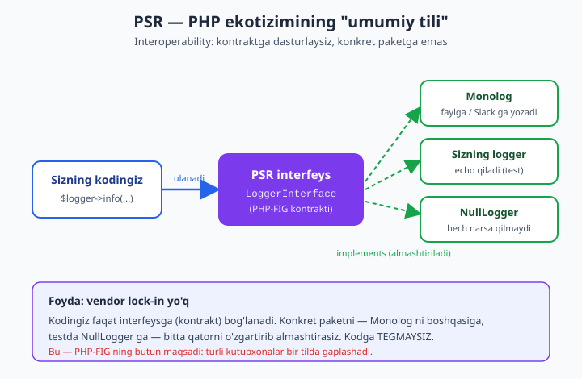
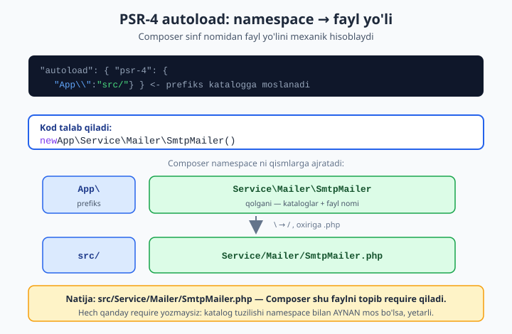

# 10 — PSR standartlari va PHP-FIG

[⬅️ Oldingi: 09 — WeakMap, SPL va reference](./09-weakmap-spl.md) · [🏠 README](./README.md) · [Keyingi: 11 — HTTP xabarlari: PSR-7 va PSR-17 ➡️](./11-psr7-http.md)

> **Bu bobda:** PHP ekotizimining "umumiy tili" — PSR standartlarini o'rganamiz. Avval **PHP-FIG nima** va **PSR** (PHP Standards Recommendation) **nima uchun** kerakligini — eng muhim g'oya **interoperability** (turli vendor paketlari bir-biriga moslashishi: istalgan PSR-3 logger ni istalgan framework ga ulay olish) — tushunamiz. So'ng amaliy standartlarni ketma-ket ochamiz: **PSR-1 / PSR-12** kod stili (+ avtomatlashtirish: PHP-CS-Fixer, phpcs, Composer scripts), **PSR-4** autoload (Composer namespace ni fayl yo'liga qanday moslaydi), **PSR-3** LoggerInterface (log darajalari, kontekst, nega aynan interfeys), **PSR-7 / PSR-17 / PSR-15** (HTTP Message immutable, factory, middleware — qisqacha, kelajakdagi framework boblariga ko'prik) va **PSR-11** ContainerInterface (DI konteyner kontrakti). Har bir PSR uchun bir xil sxema: **muammo → standart → foyda**. Amalda o'z kodimizni PSR-12 ga moslaymiz va konkret implementatsiyaga emas, **interfeysga dasturlash**ni ko'rsatamiz. Bu bob boshlovchi kitobdagi [class va obyekt](../php/14-class-va-obyekt-eng-asosiy-tushuncha.md), [kirish darajalari](../php/16-kirish-darajalari-public-va-private.md), [enum](../php/22-enum-cheklangan-tanlovlar.md), [xatolarni boshqarish](../php/23-xatolarni-boshqarish.md) va [namespace va autoloading](../php/namespace-autoloading.md) boblariga tayanadi.

---

## PHP-FIG va PSR: nima va nega kerak?

Tasavvur qiling: siz ikkita ajoyib kutubxonadan foydalanmoqchisiz. Biri — log yozadigan kutubxona (masalan Monolog), ikkinchisi — to'lov tizimi bilan ishlaydigan paket. To'lov paketi xatoliklarni **logga yozishi** kerak. Savol: u qaysi logger ni chaqirsin? Agar to'lov paketi muallifi "men faqat Monolog ni ishlataman" desa, siz boshqa logger ishlatsangiz (yoki testda logni o'chirmoqchi bo'lsangiz) — qiynalasiz. Har bir paket o'z logger ini, o'z HTTP klientini, o'z konteynerini talab qilsa — ular bir-biriga **mos kelmaydi**, kodingiz chalkash bo'lib ketadi.

Aynan shu muammoni hal qilish uchun **PHP-FIG** (PHP Framework Interoperability Group) tashkil etilgan. Bu — yirik PHP loyihalari (Symfony, Laravel, Drupal, Composer, Slim va boshqalar) vakillarining birlashmasi. Ular birgalikda **PSR** (PHP Standards Recommendation — "PHP standartlari tavsiyasi") deb ataladigan hujjatlarni yozadi. Har bir PSR raqamga ega (PSR-1, PSR-3, PSR-4, ...) va aniq bir muammoni standartlashtiradi.

> **Eng muhim so'z — interoperability (o'zaro moslashuv).** PSR larning bosh maqsadi shu: turli mualliflar yozgan, bir-birini umuman tanimaydigan paketlar **bitta umumiy interfeys** orqali bir-biriga ulanishi. Siz "logger" deganda nimani nazarda tutsangiz, men ham aynan shuni tushunishim kerak. Buni ta'minlovchi til — bu **interfeyslar** (bu — boshlovchi kitobdagi [class va obyekt](../php/14-class-va-obyekt-eng-asosiy-tushuncha.md) tushunchasining mantiqiy davomi).



### PSR turlari: standart vs tavsiya

PSR lar ikki guruhga bo'linadi va buni bilish muhim:

- **Kod stili PSR lari** (PSR-1, PSR-12) — kodni **qanday yozish** kerakligini aytadi: probel, qavs, nomlash. Bular kod o'qilishini birxillashtiradi. Mantiqqa ta'sir qilmaydi.
- **Interfeys PSR lari** (PSR-3, PSR-7, PSR-11, PSR-15, PSR-17, PSR-18) — bular `vendor/` ichidagi haqiqiy **PHP interfeyslari** (paketlar: `psr/log`, `psr/http-message`, `psr/container` va h.k.). Siz ularni Composer bilan o'rnatasiz va kodingizda **type hint** sifatida ishlatasiz.

Ikkinchi guruh kuchliroq, chunki ular shunchaki tavsiya emas — ular **kontrakt**. Bir paket "men PSR-3 logger qabul qilaman" desa, demak u `Psr\Log\LoggerInterface` tipini kutadi — va siz unga **istalgan** PSR-3 mos logger ni bera olasiz.

### Sxema: muammo → standart → foyda

Butun bob davomida har bir PSR ni shu uch savol bilan ko'ramiz:

| Savol | Mazmun |
|---|---|
| **Muammo** | PSR bo'lmasa nima sodir bo'ladi? Qaysi og'riq? |
| **Standart** | PSR aniq nimani belgilaydi? |
| **Foyda** | Buning natijasida nimaga erishamiz? |

---

## PSR-1 va PSR-12: kod stili

### Muammo

Bir loyihada uch dasturchi ishlaydi. Biri `function getName(){` deb yozadi (qavs shu qatorda), ikkinchisi `function getName()\n{` (qavs yangi qatorda), uchinchisi tab bilan, to'rtinchisi 2 probel bilan chekinish (otstup) qiladi. Pull request larda yarmi "kod" o'zgarishi emas, balki shunchaki **formatlash urushi** bo'lib qoladi. Diff lar shovqinga to'lib ketadi.

### Standart

**PSR-1** — eng asosiy qoidalar (Basic Coding Standard):

- PHP teglari faqat `<?php` yoki `<?=`.
- Fayl kodlamasi — **UTF-8 (BOM siz)**.
- Bir fayl **yoki** e'lon qiladi (sinf, funksiya, konstanta), **yoki** yon ta'sir qiladi (`echo`, `require`) — **ikkalasini birga emas**.
- Sinf nomlari — `StudlyCaps` (PascalCase): `UserRepository`.
- Metod nomlari — `camelCase`: `findById`.
- Konstantalar — `UPPER_CASE`: `MAX_RETRIES`.

**PSR-12** — kengaytirilgan stil (Extended Coding Style, PSR-2 ni almashtirgan). Asosiy qoidalar:

- Chekinish (otstup) — **4 probel** (tab emas).
- Qator uzunligi yumshoq chegarasi — **120 belgi**.
- Sinf va metod ochuvchi qavsi `{` — **yangi qatorda**.
- Boshqaruv tuzilmalari (`if`, `for`) qavsi — **shu qatorda**, kalit so'zdan keyin bitta probel.
- `<?php` dan keyin bitta bo'sh qator, keyin `declare(strict_types=1);`, keyin namespace, keyin `use` bloklari.
- Kalit so'zlar (`true`, `false`, `null`, `public`) — **kichik harf**.

Mana PSR-12 ga to'liq mos fayl skeleti (bu kod ishga tushadi):

```php
<?php

declare(strict_types=1);

namespace App\Notify;

use App\Contract\LoggerInterface;

// PSR-12 ga mos: <?php dan keyin bo'sh qator, declare alohida,
// namespace dan keyin bo'sh qator, sinf PascalCase, metod { yangi qatorda,
// kalit so'zlar kichik harf, 4 probel chekinish.
final class EmailNotifier
{
    public function __construct(
        private readonly LoggerInterface $logger,
    ) {
    }

    public function send(string $to, string $subject): bool
    {
        if ($to === '') {
            $this->logger->log('warning', 'Bo\'sh manzil');
            return false;
        }

        $this->logger->log('info', 'Yuborildi: {to}', ['to' => $to]);
        return true;
    }
}
```

E'tibor bering: konstruktor argumenti `private readonly LoggerInterface $logger` — biz konkret sinfga emas, **interfeysga** bog'lanyapmiz. Bu — butun bobning markaziy g'oyasi.

### Foyda

Stil bir xil bo'lganda kod **o'qilishi** osonlashadi, diff lar toza bo'ladi, yangi dasturchi loyihaga tez moslashadi. Eng yaxshisi — buni **qo'lda emas, avtomatlashtirib** ta'minlash mumkin.

### Avtomatlashtirish: PHP-CS-Fixer va phpcs

Stilni qo'lda tekshirmaysiz. Ikki vosita bor:

- **PHP_CodeSniffer** (`phpcs`) — qoidabuzarliklarni **topadi** (`phpcs`), `phpcbf` esa avtomatik **tuzatadi**.
- **PHP-CS-Fixer** — kodni standartga **moslab qayta yozadi** (eng ko'p ishlatiladi).

O'rnatish va ishlatish (illustrativ buyruqlar — bu mashinada bu paketlar o'rnatilmagan, lekin loyihangizda shunday qilasiz):

```bash
# dev-bog'liqlik sifatida o'rnatamiz
composer require --dev friendsofphp/php-cs-fixer
composer require --dev squizlabs/php_codesniffer

# tekshirish (faqat ko'rsatadi, o'zgartirmaydi)
vendor/bin/php-cs-fixer fix --dry-run --diff

# tuzatish (kodni PSR-12 ga moslaydi)
vendor/bin/php-cs-fixer fix
```

Eng kuchli usul — buni **Composer scripts** ga ulash, shunda jamoa bir xil buyruqdan foydalanadi. `composer.json`:

```json
{
    "scripts": {
        "cs:check": "php-cs-fixer fix --dry-run --diff",
        "cs:fix": "php-cs-fixer fix",
        "lint": [
            "@cs:check"
        ]
    }
}
```

Endi har kim `composer cs:fix` deb yozadi va kod avtomatik formatlanadi. Buni CI (continuous integration) da `composer cs:check` sifatida ishlatib, mos kelmagan PR larni rad etish mumkin — stil endi muhokama mavzusi emas, **mashina ishi**.

> **Tuzoq:** `php-cs-fixer` o'z konfiguratsiyasini `.php-cs-fixer.dist.php` faylidan o'qiydi. Unda `@PSR12` qoidalar to'plamini yoqib qo'ying, aks holda u o'z noyob qoidalarini qo'llashi mumkin. Jamoada bitta konfiguratsiyani git ga qo'shing, shunda hammada bir xil natija chiqadi.

---

## PSR-4: autoload (Composer ning yuragi)

### Muammo

Boshlovchi kitobdagi [namespace va autoloading](../php/namespace-autoloading.md) bobida ko'rdingiz: katta loyihada yuzlab sinf bor. Har birini `require 'src/Service/Mailer/SmtpMailer.php';` deb qo'lda ulash — jahannam. Bitta faylni ko'chirsangiz, o'nlab `require` ni yangilashga to'g'ri keladi.

### Standart

**PSR-4** namespace ni fayl yo'liga **mexanik** moslash qoidasini belgilaydi. Mantiq juda sodda:

1. Namespace **prefiksi** (masalan `App\`) bitta bazaviy **katalogga** (masalan `src/`) moslanadi.
2. Prefiksdan keyingi qism — **namespace ajratuvchi** `\` — **katalog ajratuvchi** `/` ga aylanadi.
3. Oxiriga `.php` qo'shiladi.



Composer da buni `composer.json` da e'lon qilasiz:

```json
{
    "autoload": {
        "psr-4": {
            "App\\": "src/"
        }
    }
}
```

So'ng `composer dump-autoload` buyrug'i bilan Composer optimallashtirilgan autoloader generatsiya qiladi. Endi `new \App\Service\Mailer\SmtpMailer()` yozsangiz, Composer avtomatik ravishda `src/Service/Mailer/SmtpMailer.php` faylini topib ulaydi.

### PSR-4 mexanizmini qo'lda ko'ramiz

Composer "sehri" aslida `spl_autoload_register` ga asoslangan oddiy funksiya. Mana uning yuragi (bu kod **ishlaydi** — pastda natijasini ko'rasiz). Avval sinfimiz, `src/Service/Mailer/SmtpMailer.php`:

```php
<?php
declare(strict_types=1);

namespace App\Service\Mailer;

final class SmtpMailer
{
    public function send(string $to): string
    {
        return "SMTP orqali $to ga yuborildi";
    }
}
```

Endi autoloader (`autoload.php`):

```php
<?php
declare(strict_types=1);

// PSR-4 ning eng yuragi: prefiks -> bazaviy katalog moslamasi.
// (Composer aynan shu mantiqni avtomatik generatsiya qiladi.)
spl_autoload_register(function (string $class): void {
    $prefix  = 'App\\';
    $baseDir = __DIR__ . '/src/';

    // Sinf shu prefiks bilan boshlanmasa - bu autoloader emas, boshqasiga yo'l beramiz.
    if (!str_starts_with($class, $prefix)) {
        return;
    }

    // Prefiksdan keyingi qism -> nisbiy sinf nomi.
    $relative = substr($class, strlen($prefix));

    // Namespace ajratuvchi \ ni katalog ajratuvchi / ga aylantiramiz, oxiriga .php.
    $file = $baseDir . str_replace('\\', '/', $relative) . '.php';

    if (is_file($file)) {
        require $file;
    }
});
```

Va foydalanish (`index.php`):

```php
<?php
declare(strict_types=1);

require __DIR__ . '/autoload.php';

// Hech qanday require yozmadik - autoloader sinfni o'zi topib yuklaydi:
$mailer = new \App\Service\Mailer\SmtpMailer();
echo $mailer->send('aziz@misol.uz') . PHP_EOL;
echo 'Sinf yuklandimi: ' . (class_exists(\App\Service\Mailer\SmtpMailer::class) ? 'ha' : 'yoq') . PHP_EOL;
```

Natija:

```
SMTP orqali aziz@misol.uz ga yuborildi
Sinf yuklandimi: ha
```

### Foyda

Bitta `require` yozmasdan butun loyiha sinflari avtomatik yuklanadi — **faqat katalog tuzilishi namespace bilan aynan mos bo'lsa**. Bu shuningdek **interoperability** ning poydevori: `vendor/` ichidagi har bir paket o'z PSR-4 moslamasini e'lon qiladi, Composer ularning hammasini bitta umumiy autoloader ga birlashtiradi.

> **Tuzoq:** PSR-4 da fayl nomi sinf nomiga **harf bo'yicha aniq** (case-sensitive) mos bo'lishi shart: `SmtpMailer` sinfi `SmtpMailer.php` da bo'lishi kerak, `smtpmailer.php` da emas. Windows da fayl tizimi case ni e'tiborsiz qoldirgani uchun kodingiz lokal ishlaydi, lekin Linux serverda **"class not found"** bilan yiqiladi. Bu — eng ko'p uchraydigan "menda ishlaydi-ku" xatosi.

---

## PSR-3: LoggerInterface

### Muammo

Har bir kutubxona log yozishi kerak. Lekin biri `echo`, biri faylga, biri Monolog, biri sizning maxsus tizimingizga yozadi. Agar to'lov paketi `new Monolog\Logger(...)` ni o'z ichida qattiq kodlasa (hardcode), siz uni almashtira olmaysiz. Bu — **qattiq bog'lanish** (tight coupling).

### Standart

**PSR-3** bitta interfeys belgilaydi — `Psr\Log\LoggerInterface`. U **sakkizta log darajasi** uchun metod beradi (RFC 5424 dan): `emergency`, `alert`, `critical`, `error`, `warning`, `notice`, `info`, `debug` — hamda umumiy `log($level, $message, $context)` metodi.

Darajalarni enum bilan modellashtirib, ularning ma'nosini ko'ramiz (boshlovchi kitobdagi [enum](../php/22-enum-cheklangan-tanlovlar.md) bobiga asoslanadi):

```php
<?php
declare(strict_types=1);

// PSR-3 sakkizta log darajasi (RFC 5424 dan). Enum bilan modellaymiz.
enum LogLevel: string
{
    case Emergency = 'emergency'; // tizim ishlamayapti
    case Alert     = 'alert';     // darhol chora kerak
    case Critical  = 'critical';  // jiddiy nosozlik
    case Error     = 'error';     // ish bajarilmadi
    case Warning   = 'warning';   // xato emas, lekin e'tibor
    case Notice    = 'notice';    // muhim, lekin normal
    case Info      = 'info';      // odatiy hodisalar
    case Debug     = 'debug';     // batafsil tahlil

    public function jiddiymi(): bool
    {
        return match ($this) {
            self::Emergency, self::Alert, self::Critical, self::Error => true,
            default => false,
        };
    }
}

foreach (LogLevel::cases() as $lvl) {
    echo $lvl->value . ' => ' . ($lvl->jiddiymi() ? 'jiddiy' : 'oddiy') . PHP_EOL;
}
```

Natija:

```
emergency => jiddiy
alert => jiddiy
critical => jiddiy
error => jiddiy
warning => oddiy
notice => oddiy
info => oddiy
debug => oddiy
```

### Kontekst va xabar interpolatsiyasi

PSR-3 da xabar matnida `{kalit}` ko'rinishidagi joy egasi (placeholder) bo'lishi mumkin, ular `$context` massividan to'ldiriladi. Bu strukturali log uchun muhim: xabar shabloni o'zgarmaydi, faqat qiymatlar almashadi.

Endi soddalashtirilgan, lekin **to'liq ishlaydigan** PSR-3 uslubidagi logger lar to'plamini ko'ramiz. Diqqat: foydalanuvchi xizmati (`OrderService`) **faqat interfeysga** bog'lanadi:

```php
<?php
declare(strict_types=1);

// PSR-3 LoggerInterface ning soddalashtirilgan ko'rinishi (illustrativ).
interface LoggerInterface
{
    public function log(string $level, string|\Stringable $message, array $context = []): void;
    public function info(string|\Stringable $message, array $context = []): void;
    public function error(string|\Stringable $message, array $context = []): void;
}

// Umumiy mantiqni bir joyda jamlovchi abstrakt asos.
abstract class AbstractLogger implements LoggerInterface
{
    public function info(string|\Stringable $message, array $context = []): void
    {
        $this->log('info', $message, $context);
    }
    public function error(string|\Stringable $message, array $context = []): void
    {
        $this->log('error', $message, $context);
    }
}

// 1-implementatsiya: ekranga chiqaradi.
final class EchoLogger extends AbstractLogger
{
    public function log(string $level, string|\Stringable $message, array $context = []): void
    {
        // {placeholder} larni kontekst bilan almashtiramiz (PSR-3 interpolatsiya).
        $replace = [];
        foreach ($context as $key => $val) {
            if (is_scalar($val) || $val instanceof \Stringable) {
                $replace['{' . $key . '}'] = (string) $val;
            }
        }
        $msg = strtr((string) $message, $replace);
        echo strtoupper($level) . ': ' . $msg . PHP_EOL;
    }
}

// 2-implementatsiya: hech narsa qilmaydi (Null Object naqshi - testda foydali).
final class NullLogger extends AbstractLogger
{
    public function log(string $level, string|\Stringable $message, array $context = []): void
    {
        // ataylab bo'sh
    }
}

// Foydalanuvchi kodi FAQAT interfeysga bog'lanadi:
final class OrderService
{
    public function __construct(private LoggerInterface $logger) {}

    public function place(int $orderId): void
    {
        $this->logger->info('Buyurtma qabul qilindi: {id}', ['id' => $orderId]);
    }
}

$svc = new OrderService(new EchoLogger());
$svc->place(42);

$silent = new OrderService(new NullLogger());
$silent->place(99); // hech narsa chiqarmaydi

(new EchoLogger())->error('Xato kodi {code}', ['code' => 500]);
```

Natija:

```
INFO: Buyurtma qabul qilindi: 42
ERROR: Xato kodi 500
```

### Nega aynan interfeys?

E'tibor bering: `OrderService` ni o'zgartirmasdan logger ni **almashtirdik** — `EchoLogger` dan `NullLogger` ga. Bu — **interfeysga dasturlash**ning butun kuchi. Agar `OrderService` ichida `new EchoLogger()` deb yozganimizda, uni almashtirish uchun xizmat kodini titkilashga to'g'ri kelardi.

Amalda siz hech qanday logger yozmaysiz — `composer require monolog/monolog` qilasiz. Monolog PSR-3 mos (`implements Psr\Log\LoggerInterface`), shuning uchun u to'g'ridan-to'g'ri sizning `OrderService` ga "joylashadi". Mana **interoperability**: siz kodingizni Monolog ga **emas**, PSR-3 ga bog'ladingiz; ertaga boshqa logger ga o'tsangiz — bitta qator o'zgaradi.

### Foyda

Kutubxona muallifi `LoggerInterface $logger` ni qabul qiladi va loyihangizdagi **istalgan** PSR-3 logger ishlaydi. Test paytida `NullLogger` berasiz — log shovqin qilmaydi. Production da Monolog berasiz — fayl, Slack, Sentry ga yoziladi. Xizmat kodi hech qachon o'zgarmaydi.

---

## PSR-7, PSR-17, PSR-15: HTTP qatlami

Bu uchta PSR birgalikda HTTP so'rov/javobni standartlashtiradi. Bu boblar **kelajakdagi framework internals** (o'z mini-framework ingizni qurish) uchun poydevor, shuning uchun bu yerda **qisqacha** ko'ramiz — chuqur amaliyot L4 boblarida bo'ladi.

### PSR-7: HTTP Message (immutable)

**Muammo:** har bir framework HTTP so'rovni o'zicha ifodalaydi (`$_GET`, `$_POST`, yoki o'z obyekti). Middleware yozsangiz, u faqat bitta framework da ishlaydi.

**Standart:** PSR-7 `RequestInterface`, `ResponseInterface`, `StreamInterface` va boshqalarni belgilaydi. Eng muhim xususiyat — ular **immutable** (o'zgarmas): obyektni o'zgartirmaysiz, balki `withHeader()`, `withBody()` kabi metodlar **yangi nusxa** qaytaradi.

Immutable'lik g'oyasini soddalashtirilgan `Message` da ko'ramiz (bu kod ishlaydi):

```php
<?php
declare(strict_types=1);

// PSR-7 immutable'lik g'oyasi (juda soddalashtirilgan, illustrativ).
final class Message
{
    /** @param array<string, string> $headers */
    public function __construct(
        private readonly string $body = '',
        private readonly array $headers = [],
    ) {}

    public function getBody(): string { return $this->body; }

    public function getHeader(string $name): ?string
    {
        return $this->headers[strtolower($name)] ?? null;
    }

    // "with*" - o'zini O'ZGARTIRMAYDI, YANGI nusxa qaytaradi (immutable).
    public function withHeader(string $name, string $value): self
    {
        $new = $this->headers;
        $new[strtolower($name)] = $value;
        return new self($this->body, $new);
    }

    public function withBody(string $body): self
    {
        return new self($body, $this->headers);
    }
}

$r1 = new Message('salom');
$r2 = $r1->withHeader('Content-Type', 'application/json');

// r1 o'zgarmadi - bu immutable'likning isboti:
var_dump($r1->getHeader('Content-Type')); // NULL
var_dump($r2->getHeader('Content-Type')); // application/json
var_dump($r1 === $r2);                     // false: boshqa obyekt
```

Natija:

```
NULL
string(16) "application/json"
bool(false)
```

**Nega immutable?** Chunki bir so'rov obyekti ko'p middleware orqali o'tadi. Agar har biri obyektni **joyida** o'zgartirsa, kim nimani o'zgartirgani chalkashadi (yashirin yon ta'sirlar). Immutable bo'lsa — har bir o'zgartirish yangi, aniq nusxa beradi. `readonly` xususiyatlar bu yerda ideal vosita.

### PSR-17: HTTP Factory

**Muammo:** PSR-7 obyektlarini **qanday yaratish** ham standartlashtirilmagan bo'lsa, har bir kutubxona o'z konstruktorini talab qiladi.

**Standart:** PSR-17 `RequestFactoryInterface`, `ResponseFactoryInterface`, `StreamFactoryInterface` ni beradi — PSR-7 obyektlarini yaratish uchun "fabrika" kontraktlari. Endi middleware "menga `ResponseFactoryInterface` bering, men javob yarataman" deydi, konkret sinfni bilmaydi.

### PSR-15: Server Request Handlers (middleware)

**Muammo:** middleware (autentifikatsiya, log, CORS) — har bir framework da boshqacha yoziladi, qayta ishlatib bo'lmaydi.

**Standart:** PSR-15 ikki interfeys beradi — `MiddlewareInterface` (`process($request, $handler)`) va `RequestHandlerInterface` (`handle($request)`). Middleware so'rovni oladi, ish qiladi va `$handler` ga uzatadi yoki erta javob qaytaradi.

Zanjir (pipeline) g'oyasini soddalashtirilgan ko'rinishda ko'ramiz (bu kod ishlaydi):

```php
<?php
declare(strict_types=1);

// PSR-15 g'oyasi: middleware zanjiri (soddalashtirilgan, illustrativ).
interface RequestHandler
{
    public function handle(array $request): array; // [status, body]
}

interface Middleware
{
    public function process(array $request, RequestHandler $next): array;
}

// Zanjirni o'rab, RequestHandler ko'rinishida beradigan adapter.
final class Pipeline implements RequestHandler
{
    /** @param list<Middleware> $queue */
    public function __construct(
        private array $queue,
        private RequestHandler $core,
    ) {}

    public function handle(array $request): array
    {
        if ($this->queue === []) {
            return $this->core->handle($request);
        }
        $current = array_shift($this->queue);
        return $current->process($request, $this);
    }
}

final class AuthMiddleware implements Middleware
{
    public function process(array $request, RequestHandler $next): array
    {
        if (($request['token'] ?? null) !== 'sirli') {
            return [401, 'Ruxsat yo\'q']; // zanjirni TO'XTATADI
        }
        return $next->handle($request);
    }
}

final class LogMiddleware implements Middleware
{
    public function process(array $request, RequestHandler $next): array
    {
        echo "LOG: so'rov keldi\n";
        $response = $next->handle($request);
        echo "LOG: javob status={$response[0]}\n";
        return $response;
    }
}

final class Controller implements RequestHandler
{
    public function handle(array $request): array
    {
        return [200, 'Salom, ' . $request['user']];
    }
}

$app = new Pipeline(
    [new LogMiddleware(), new AuthMiddleware()],
    new Controller(),
);

print_r($app->handle(['token' => 'sirli', 'user' => 'Oqil']));
```

Natija (to'g'ri token bilan):

```
LOG: so'rov keldi
LOG: javob status=200
Array
(
    [0] => 200
    [1] => Salom, Oqil
)
```

**Foyda:** bitta middleware ni yozasiz va u **istalgan** PSR-15 mos framework da (Slim, Mezzio, Laminas) ishlaydi. Bu — middleware larning butun ekotizimi (rate-limit, CORS, auth) bir-biriga moslashishi demak.

> **Ko'prik:** mana shu PSR-7/15/17 uchligi sizning **o'z mini-framework ingiz**ning HTTP qatlamini tashkil etadi — bu L4 (framework internals) boblarida to'liq quriladi. Hozircha asosiy g'oyani — immutable so'rov + middleware zanjiri — yodda saqlang.

---

## PSR-11: ContainerInterface

### Muammo

Ilova o'sib borgani sayin obyektlar bir-biriga bog'lanadi: `PaymentService` ga `LoggerInterface` kerak, unga `Db` kerak, unga konfiguratsiya kerak... Bularni qo'lda `new` bilan ulash — `new PaymentService(new ArrayLogger(), new Db(new Config(...)))` — chalkash va takrorlanuvchi. Bu vazifani **DI konteyner** (dependency injection container) bajaradi: u "qaysi xizmat qanday yasaladi" ni biladi va kerak bo'lganda yasab beradi.

### Standart

**PSR-11** konteyner uchun ikki metodli interfeys beradi — `Psr\Container\ContainerInterface`:

- `get(string $id): mixed` — xizmatni qaytaradi (kerak bo'lsa yasaydi).
- `has(string $id): bool` — xizmat mavjudligini tekshiradi.

Shuningdek ikki istisno kontrakti: `ContainerExceptionInterface` (umumiy xato) va `NotFoundExceptionInterface` (xizmat topilmadi). Bu istisnolar boshlovchi kitobdagi [xatolarni boshqarish](../php/23-xatolarni-boshqarish.md) bobidagi interfeys-istisno g'oyasiga asoslanadi.

Soddalashtirilgan, lekin **ishlaydigan** konteyner:

```php
<?php
declare(strict_types=1);

// PSR-11 ContainerInterface (soddalashtirilgan, illustrativ).
interface ContainerInterface
{
    public function get(string $id): mixed;
    public function has(string $id): bool;
}

// PSR-11 talab qiladigan istisnolar (markerli interfeyslar).
interface ContainerExceptionInterface extends \Throwable {}
interface NotFoundExceptionInterface extends ContainerExceptionInterface {}

final class NotFoundException extends \RuntimeException implements NotFoundExceptionInterface {}

final class Container implements ContainerInterface
{
    /** @var array<string, callable> fabrikalar */
    private array $factories = [];
    /** @var array<string, mixed> yaratilgan (kesh) */
    private array $instances = [];

    public function set(string $id, callable $factory): void
    {
        $this->factories[$id] = $factory;
    }

    public function get(string $id): mixed
    {
        if (array_key_exists($id, $this->instances)) {
            return $this->instances[$id]; // bir marta yaratiladi (singleton)
        }
        if (!isset($this->factories[$id])) {
            throw new NotFoundException("Xizmat topilmadi: $id");
        }
        return $this->instances[$id] = ($this->factories[$id])($this);
    }

    public function has(string $id): bool
    {
        return isset($this->factories[$id]) || array_key_exists($id, $this->instances);
    }
}

final class Db
{
    public function __construct(public readonly string $dsn) {}
}
final class UserRepo
{
    public function __construct(private Db $db) {}
    public function dsn(): string { return $this->db->dsn; }
}

$c = new Container();
$c->set(Db::class, fn() => new Db('sqlite::memory:'));
$c->set(UserRepo::class, fn(ContainerInterface $c) => new UserRepo($c->get(Db::class)));

$repo = $c->get(UserRepo::class);
echo $repo->dsn() . PHP_EOL;
var_dump($c->get(Db::class) === $c->get(Db::class)); // true: bir xil instans
var_dump($c->has('yoq'));

try {
    $c->get('NoSuchService');
} catch (NotFoundExceptionInterface $e) {
    echo 'Tutildi: ' . $e->getMessage() . PHP_EOL;
}
```

Natija:

```
sqlite::memory:
bool(true)
bool(false)
Tutildi: Xizmat topilmadi: NoSuchService
```

### Foyda

PSR-11 tufayli kutubxona "menga `ContainerInterface` bering" deydi va u **istalgan** konteyner (PHP-DI, Symfony DI, Laravel ning konteyneri) bilan ishlaydi. `NotFoundExceptionInterface` ni `catch` qilsangiz, qaysi konteyner ishlatilayotgani muhim emas.

> **Muhim chegara:** PSR-11 faqat **olish** (`get`/`has`) ni standartlashtiradi, xizmatlarni **ro'yxatga olish** (registratsiya) usulini emas. Har bir konteyner o'z `set()` / config sintaksisiga ega. Bu ataylab shunday: PSR-11 maqsadi — kutubxonalar konteynerdan xizmat **o'qiy** olishi, uni sozlash esa ilova ishi.

> **Ko'prik:** to'liq DI konteyner — avtomatik bog'liqlik aniqlash (autowiring, Reflection orqali), singleton vs har safar yangi, kontekstual bog'lanish — bularning hammasi L4 (framework internals) boblarida quriladi. Bu yerda muhim narsa: **kontrakt** PSR-11, **implementatsiya** esa har xil bo'lishi mumkin.

---

## Mashqlar

### Oson

1. `composer.json` ning `autoload.psr-4` blokiga `"Acme\\Blog\\": "modules/blog/src/"` moslamasi qo'shilgan. `Acme\Blog\Entity\Post` sinfi qaysi fayl yo'lida bo'lishi kerak?
2. PSR-3 ning sakkizta log darajasini eng jiddiydan eng kichigiga qarab yozing.
3. Quyidagi kod PSR-12 ni buzadi. Uchta qoidabuzarlikni toping: `<?php function Get_user(){return TRUE;}`
4. PSR-1 ga ko'ra fayl bir vaqtda nima qilmasligi kerak (sinf e'lon qilish va ... bir faylda)?

### O'rta

5. Bir xizmat konstruktorida `private Monolog\Logger $logger` deb yozilgan. Buni PSR-3 ga moslab, interoperability ni ta'minlash uchun nimaga o'zgartirasiz va nega?
6. `php-cs-fixer` ni Composer scripts ga ulang: `composer cs:fix` va `composer cs:check` buyruqlarini bering. `composer.json` ning `scripts` blokini yozing.
7. PSR-7 obyektlari nega immutable? `$response->setStatus(404)` o'rniga PSR-7 da qanday yoziladi va bu nima farq qiladi?
8. PSR-11 `get()` ikki marta chaqirilganda bir xil obyekt qaytishi shartmi? Standart bu haqda nima deydi va amalda nega ko'pincha shunday qilinadi?

### Qiyin

9. PSR-3 mos `PrefixLogger` yozing: u boshqa istalgan PSR-3 logger ni "o'rab" oladi (decorator) va har bir xabarga sobit prefiks (masalan `[BILLING]`) qo'shib, o'ralgan logger ga uzatadi. Konstruktor faqat interfeysga bog'lansin.
10. Soddalashtirilgan PSR-11 konteyner va PSR-3 logger ni birlashtiring: `PaymentService` ni konteynerda simlab, logger ni `ArrayLogger` dan `NullLogger` ga **xizmat kodini o'zgartirmasdan** almashtiring. Bu interoperability ni qanday namoyish qiladi?

<details markdown="1"><summary>Yechim — 1</summary>

Prefiks `Acme\Blog\` katalog `modules/blog/src/` ga moslangan. Qolgan qism `Entity\Post` — `\` ni `/` ga aylantirib, `.php` qo'shamiz:

```
modules/blog/src/Entity/Post.php
```

Diqqat: harf registri aniq mos bo'lishi shart (`Post.php`, `post.php` emas) — aks holda Linux serverda topilmaydi.

</details>

<details markdown="1"><summary>Yechim — 2</summary>

Eng jiddiydan kichigiga: `emergency` → `alert` → `critical` → `error` → `warning` → `notice` → `info` → `debug`. Bu RFC 5424 dagi tartib. Eslab qolish: `emergency` — tizim butunlay yiqildi; `debug` — eng mayda tafsilot.

</details>

<details markdown="1"><summary>Yechim — 3</summary>

Uchta (aslida ko'proq) qoidabuzarlik:

1. `Get_user` — metod/funksiya nomi `camelCase` bo'lishi kerak: `getUser`.
2. `TRUE` — kalit so'zlar kichik harf bo'lishi kerak: `true`.
3. `function Get_user(){` — ochuvchi `{` funksiya nomidan keyin yangi qatorda bo'lishi kerak, tana esa chekinish (otstup) bilan.

To'g'ri ko'rinish:

```php
<?php

declare(strict_types=1);

function getUser(): bool
{
    return true;
}
```

</details>

<details markdown="1"><summary>Yechim — 4</summary>

PSR-1 ga ko'ra fayl **yo e'lon qiladi** (sinf, interfeys, funksiya, konstanta), **yo yon ta'sir qiladi** (`echo`, `require`, `ini_set`, global o'zgaruvchini o'zgartirish) — lekin **ikkalasini bir faylda emas**. Sabab: e'lon qiluvchi faylni `require` qilsangiz, u hech qanday kutilmagan harakat (chiqarish, ulanish ochish) qilmasligi kerak. Bu autoloader bilan xavfsiz ishlashni ta'minlaydi.

</details>

<details markdown="1"><summary>Yechim — 5</summary>

`private Monolog\Logger $logger` ni `private \Psr\Log\LoggerInterface $logger` ga o'zgartirasiz.

**Nega:** `Monolog\Logger` — konkret sinf. Unga bog'lansangiz, xizmatingiz **faqat** Monolog bilan ishlaydi. Testda log ni o'chirmoqchi bo'lsangiz yoki boshqa logger ga o'tsangiz — qiynalasiz. `LoggerInterface` ga bog'lansangiz, xizmatga **istalgan** PSR-3 logger (Monolog, NullLogger, sizning maxsus logger ingiz) "joylashadi". Muhimi: Monolog ning o'zi `LoggerInterface` ni implements qiladi, shuning uchun mavjud Monolog instansingiz baribir ishlaydi — siz faqat tip e'lonini kengaytirdingiz. Bu — interoperability.

</details>

<details markdown="1"><summary>Yechim — 6</summary>

```json
{
    "scripts": {
        "cs:fix": "php-cs-fixer fix",
        "cs:check": "php-cs-fixer fix --dry-run --diff",
        "ci": [
            "@cs:check"
        ]
    }
}
```

Endi `composer cs:fix` kodni formatlaydi, `composer cs:check` esa faqat tekshiradi (o'zgartirmaydi) va mos kelmasa nol bo'lmagan chiqish kodi qaytaradi — bu CI uchun ideal. `@cs:check` — boshqa skriptga havola sintaksisi. Buni GitHub Actions da `composer ci` sifatida chaqirib, formatlanmagan PR larni avtomatik rad etish mumkin.

</details>

<details markdown="1"><summary>Yechim — 7</summary>

PSR-7 da `setStatus()` umuman **yo'q**. O'rniga `withStatus()` ishlatasiz, u **yangi nusxa** qaytaradi:

```php
$new = $response->withStatus(404);
// $response hali ham eski statusda - o'zgarmadi
```

**Nega immutable:** bir javob obyekti ko'p middleware orqali o'tadi. Agar har biri obyektni joyida o'zgartirsa (`setStatus`), kim nimani qachon o'zgartirgani noaniq — yashirin yon ta'sirlar paydo bo'ladi va xatolarni topish qiyinlashadi. `with*` har bir o'zgarishni aniq, kuzatib bo'ladigan yangi nusxaga aylantiradi. Shu sababli **qaytgan qiymatni o'zlashtirishni unutmaslik** kerak — `$response->withStatus(404)` ni o'zlashtirmasangiz, natija yo'qoladi (bu eng ko'p uchraydigan PSR-7 tuzog'i).

</details>

<details markdown="1"><summary>Yechim — 8</summary>

PSR-11 standarti `get()` ikki marta chaqirilganda **bir xil obyekt** qaytishini **majburlamaydi** — bu konteyner implementatsiyasiga bog'liq. Standart faqat "agar `has($id)` true bo'lsa, `get($id)` istisno tashlamasdan qiymat qaytarishi kerak" deydi.

**Amalda** ko'pchilik konteyner xizmatni bir marta yasab keshlaydi (singleton xulq-atvor), chunki ilovada `Db` ulanish yoki `Logger` kabi obyektlar **bitta** bo'lishi mantiqan to'g'ri va resurs tejaydi. Yuqoridagi `Container` misolimizda `$this->instances` aynan shu keshni amalga oshiradi: birinchi `get()` yasaydi, keyingilari keshdan qaytaradi (`var_dump($c->get(Db::class) === $c->get(Db::class))` → `true`). Lekin "har safar yangi" (factory/prototype) xulqni xohlagan implementatsiya ham PSR-11 ga mos bo'la oladi.

</details>

<details markdown="1"><summary>Yechim — 9 (PrefixLogger decorator)</summary>

```php
<?php
declare(strict_types=1);

interface LoggerInterface
{
    public function log(string $level, string $message, array $context = []): void;
}

// Oddiy logger - ekranga chiqaradi.
final class EchoLogger implements LoggerInterface
{
    public function log(string $level, string $message, array $context = []): void
    {
        $r = [];
        foreach ($context as $k => $v) {
            $r['{' . $k . '}'] = (string) $v;
        }
        echo strtoupper($level) . ': ' . strtr($message, $r) . PHP_EOL;
    }
}

// Decorator: boshqa LoggerInterface ni o'rab oladi va prefiks qo'shadi.
// Diqqat: o'ralgan logger - KONKRET sinf emas, INTERFEYS.
final class PrefixLogger implements LoggerInterface
{
    public function __construct(
        private readonly LoggerInterface $inner,
        private readonly string $prefix,
    ) {}

    public function log(string $level, string $message, array $context = []): void
    {
        // Prefiksni qo'shib, ishni o'ralgan logger ga topshiramiz.
        $this->inner->log($level, $this->prefix . ' ' . $message, $context);
    }
}

// Foydalanish: istalgan PSR-3 logger ni o'rashimiz mumkin.
$logger = new PrefixLogger(new EchoLogger(), '[BILLING]');
$logger->log('info', 'To\'lov bajarildi: {id}', ['id' => 77]);
$logger->log('error', 'Karta rad etildi');
```

Natija:

```
INFO: [BILLING] To'lov bajarildi: 77
ERROR: [BILLING] Karta rad etildi
```

**Nega bu naqsh kuchli?** `PrefixLogger` **ham** `LoggerInterface` ni implements qiladi, **ham** uni qabul qiladi. Demak u o'zi ham PSR-3 logger sifatida ishlatilishi mumkin — uni boshqa decorator ga o'rashingiz, yoki istalgan PSR-3 ni kutadigan xizmatga berishingiz mumkin. Ichkarida `EchoLogger` o'rniga Monolog ham bo'lishi mumkin edi — `PrefixLogger` farqini sezmaydi. Bu — **Decorator naqshi** va **interoperability** ning birgalikdagi kuchi: yangi xulq-atvorni (prefiks) mavjud kodga **tegmasdan** qo'shdik.

</details>

<details markdown="1"><summary>Yechim — 10 (konteyner + logger interoperability)</summary>

```php
<?php
declare(strict_types=1);

// --- Kontraktlar (PSR uslubidagi interfeyslar) ---
interface LoggerInterface
{
    public function log(string $level, string $message, array $context = []): void;
}

interface ContainerInterface
{
    public function get(string $id): mixed;
    public function has(string $id): bool;
}

// --- Container (PSR-11 uslubida) ---
final class Container implements ContainerInterface
{
    private array $factories = [];
    private array $cache = [];

    public function set(string $id, \Closure $f): void { $this->factories[$id] = $f; }

    public function get(string $id): mixed
    {
        return $this->cache[$id] ??= ($this->factories[$id]
            ?? throw new \RuntimeException("yo'q: $id"))($this);
    }
    public function has(string $id): bool { return isset($this->factories[$id]); }
}

// --- Ikki implementatsiya (almashtiriladi) ---
final class ArrayLogger implements LoggerInterface
{
    /** @var list<string> */
    public array $lines = [];
    public function log(string $level, string $message, array $context = []): void
    {
        $r = [];
        foreach ($context as $k => $v) { $r['{' . $k . '}'] = (string) $v; }
        $this->lines[] = strtoupper($level) . ': ' . strtr($message, $r);
    }
}

final class NullLogger implements LoggerInterface
{
    public function log(string $level, string $message, array $context = []): void {}
}

// --- Biznes xizmati: FAQAT LoggerInterface ga bog'liq ---
final class PaymentService
{
    public function __construct(private LoggerInterface $logger) {}
    public function charge(int $userId, int $amount): void
    {
        $this->logger->log('info', 'To\'lov: user={u}, summa={a}', ['u' => $userId, 'a' => $amount]);
    }
}

// --- Konteynerda simlash (1-variant: ArrayLogger) ---
$c = new Container();
$c->set(LoggerInterface::class, fn() => new ArrayLogger());
$c->set(PaymentService::class, fn(ContainerInterface $c) => new PaymentService($c->get(LoggerInterface::class)));

$c->get(PaymentService::class)->charge(7, 1500);
/** @var ArrayLogger $log */
$log = $c->get(LoggerInterface::class);
print_r($log->lines);

// --- 2-variant: NullLogger - PaymentService kodi O'ZGARMAYDI ---
$c2 = new Container();
$c2->set(LoggerInterface::class, fn() => new NullLogger());
$c2->set(PaymentService::class, fn(ContainerInterface $c) => new PaymentService($c->get(LoggerInterface::class)));
$c2->get(PaymentService::class)->charge(9, 200);
echo "NullLogger bilan: hech narsa chiqmadi (xizmat kodi bir xil)\n";
```

Natija:

```
Array
(
    [0] => INFO: To'lov: user=7, summa=1500
)
NullLogger bilan: hech narsa chiqmadi (xizmat kodi bir xil)
```

**Bu interoperability ni qanday namoyish qiladi?** `PaymentService` ning kodi **ikkala variantda ham bir xil** — u faqat `LoggerInterface` ga bog'langan. Qaysi konkret logger ishlatilishini **konteyner** (kompozitsiya joyi) hal qiladi, xizmatning o'zi emas. Bu ikki PSR ning kuchidir: **PSR-11** (konteyner) "qaysi xizmat qanday yasaladi" ni markazlashtiradi, **PSR-3** (interfeys) esa logger ni almashtirib bo'ladigan qiladi. Production da `ArrayLogger` o'rniga Monolog, testda esa `NullLogger` berasiz — `PaymentService` farqini bilmaydi. Mana shu — butun bobning markaziy g'oyasi: **kontraktga dasturlang, implementatsiyaga emas.**

</details>

---

## Xulosa va keyingisi

Bu bobda PHP ekotizimining "umumiy tili" — PSR standartlarini o'rgandik. Asosiy xulosalar:

- **PHP-FIG** PSR larni yozadi, ularning bosh maqsadi — **interoperability**: turli vendor paketlari umumiy interfeyslar orqali bir-biriga ulanishi.
- **PSR-1 / PSR-12** kod stilini birxillashtiradi; buni **PHP-CS-Fixer / phpcs** + Composer scripts bilan avtomatlashtiramiz.
- **PSR-4** namespace ni fayl yo'liga mexanik moslab, Composer autoload poydevorini tashkil etadi.
- **PSR-3** (logger), **PSR-7/17/15** (HTTP message/factory/middleware), **PSR-11** (konteyner) — bular `vendor/` dagi haqiqiy **interfeyslar** (kontraktlar). Ularga dasturlasangiz, konkret paketni xizmat kodiga tegmasdan almashtira olasiz.
- Takrorlanuvchi g'oya: **kontraktga (interfeysga) dasturlang, konkret implementatsiyaga emas.**

Bu — Wave 2 ning yakuniy bobi. Endi siz zamonaviy PHP tip tizimi, atributlar, Reflection, SPL va PSR standartlari bilan qurollangansiz. **Keyingisi — framework internals (L4):** PSR-11 ni haqiqiy, autowiring (Reflection orqali avtomatik bog'lash) qiladigan **DI konteyner** ga aylantirish; PSR-7/15 ustiga **o'z mini-framework ingizni** (router + middleware pipeline + konteyner) qurish. Shu bobda ko'rgan kontraktlar — o'sha framework ning skeletidir.

---

[⬅️ Oldingi: 09 — WeakMap, SPL va reference](./09-weakmap-spl.md) · [🏠 README](./README.md) · [Keyingi: 11 — HTTP xabarlari: PSR-7 va PSR-17 ➡️](./11-psr7-http.md)
