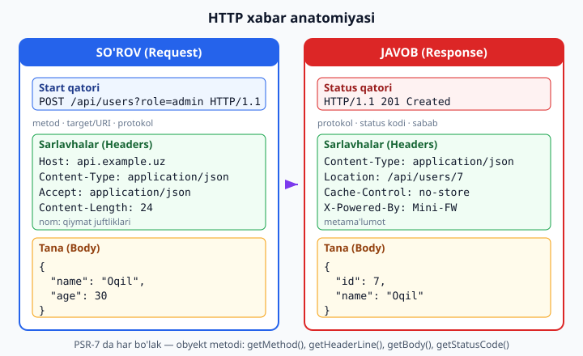
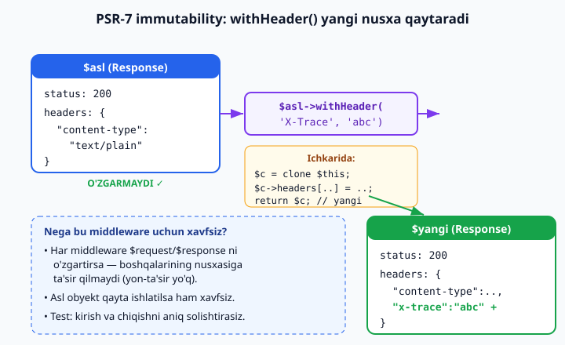

# 11 — HTTP xabarlari: PSR-7 va PSR-17

[⬅️ Oldingi: 10 — PSR standartlari va PHP-FIG](./10-psr-standartlar.md) · [🏠 README](./README.md) · [Keyingi: 12 — PSR-15 middleware pipeline ➡️](./12-middleware.md)

> **Bu bobda:** har qanday web-framework poydevorini — **HTTP xabarini obyekt sifatida** modellashtirishni o'rganamiz. Avval **HTTP so'rov/javob anatomiyasini** chuqur ochamiz (metod, target/URI, sarlavhalar, tana, status — har biri nima). So'ng PHP da boshlovchilar duch keladigan eng yomon odat — kod ichida hamma joyda `$_GET`/`$_POST`/`$_SERVER`/`php://input` ga to'g'ridan-to'g'ri murojaat qilishni — nima uchun **faqat I/O chegarasida** (eng chetda) qoldirish, ichkarida esa hammasini **obyekt** qilish kerakligini (test, qayta ishlatish, immutability) tushunamiz. Markaziy standart — **PSR-7** (`MessageInterface`, `ServerRequestInterface`, `ResponseInterface`, `UriInterface`, `StreamInterface`) va uning eng nozik xususiyati — **immutability**: `withHeader`/`withStatus`/`withBody` aslni o'zgartirmasdan **yangi nusxa** qaytaradi, va nega aynan shu narsa middleware pipeline ni xavfsiz qiladi. **PSR-17** (factory'lar) qanday rol o'ynashini ko'ramiz. Amalda: minimal PSR-7 ni o'zimiz yozamiz, keyin haqiqiy `nyholm/psr7` paketini Composer bilan o'rnatib ishlatamiz, globaldan `ServerRequest` quramiz, `Response` yaratib `withX` bilan zanjirlaymiz, immutability ni **jonli ishga tushirib isbotlaymiz**. Bu bob — Wave 3 (framework internals) ning birinchi g'ishti: u [05 — tip tizimi](./05-tip-tizimi.md), [08 — Reflection va atributlar](./08-reflection-attributes.md) va [10 — PSR standartlari](./10-psr-standartlar.md) ga tayanadi; boshlovchi MVC tushunchasi uchun [../php/37-mvc-loyihani-tartibga-solish.md](../php/37-mvc-loyihani-tartibga-solish.md) va [../php/38-foydali-dizayn-andozalari.md](../php/38-foydali-dizayn-andozalari.md) ga qarang.

---

## HTTP xabari nima: so'rov va javob anatomiyasi

Web — bu, mohiyatan, **xabarlar almashinuvi**. Brauzer (yoki boshqa klient) serverga **so'rov** (request) yuboradi, server **javob** (response) qaytaradi. Ikkalasi ham — oddiy **matnli xabar**, aniq tuzilishga ega. Framework yozish — bu o'sha matnni qulay obyektga aylantirish va aksincha demakdir. Shuning uchun avval xabarning ichki tuzilishini puxta bilishimiz kerak.

**So'rov (HTTP Request)** uch qismdan iborat:

1. **Start qatori (request line):** `POST /api/users?role=admin HTTP/1.1`
   - **Metod** (`GET`, `POST`, `PUT`, `PATCH`, `DELETE`, ...) — niyat: o'qishmi, yaratishmi, o'chirishmi.
   - **Target / URI** — qaysi resursga: yo'l (`/api/users`) va so'rov qatori (`?role=admin`).
   - **Protokol versiyasi** — `HTTP/1.1`, `HTTP/2`.
2. **Sarlavhalar (headers):** `nom: qiymat` juftliklari — metama'lumot. Masalan `Host`, `Content-Type`, `Accept`, `Authorization`, `Content-Length`.
3. **Tana (body):** ixtiyoriy yuk — `POST`/`PUT` da odatda JSON yoki forma ma'lumotlari. `GET` da ko'pincha bo'sh.

**Javob (HTTP Response)** ham xuddi shunday tuzilgan, faqat birinchi qatori boshqacha:

1. **Status qatori (status line):** `HTTP/1.1 201 Created`
   - **Protokol**, **status kodi** (`200`, `201`, `404`, `500`), **sabab iborasi** (reason phrase — `OK`, `Created`, `Not Found`).
2. **Sarlavhalar** — `Content-Type`, `Location`, `Cache-Control`, `Set-Cookie` va h.k.
3. **Tana** — qaytariladigan yuk (HTML, JSON, fayl).



Diqqat qiling: **so'rov ham, javob ham bir xil umumiy skeletga ega** — start/status qatori, sarlavhalar, tana. Aynan shu umumiylik PSR-7 da **`MessageInterface`** (umumiy poydevor) sifatida ajratilgan, undan esa `RequestInterface` va `ResponseInterface` meros oladi. Bu — yaxshi obyektga yo'naltirilgan modellashtirishga klassik misol: takrorlanuvchi qismni ota-interfeysga chiqarish.

### PHP da xabar qayerdan keladi: superglobal'lar

An'anaviy PHP da, web-server (Apache/nginx + PHP-FPM) so'rovni qabul qilib, uni **superglobal massivlarga** "yoyib" beradi:

| Manba | Nima |
|---|---|
| `$_GET` | URL dagi so'rov qatori (`?role=admin`) |
| `$_POST` | `application/x-www-form-urlencoded` yoki `multipart` forma tanasi |
| `$_SERVER` | metod, URI, protokol va **sarlavhalar** (`HTTP_*` prefiks bilan) |
| `$_COOKIE`, `$_FILES` | cookie'lar va yuklangan fayllar |
| `php://input` | **xom** tana (JSON ni o'qish uchun shu kerak, `$_POST` emas) |

Bu — qulay, lekin **tuzoq**. Keyingi bo'limda nima uchun bularga butun kod bo'ylab tayanish yomon ekanini ko'ramiz.

---

## Muammo: superglobal'larga to'g'ridan-to'g'ri tayanish

Boshlovchi PHP kodi odatda shunday ko'rinadi:

```php
<?php
declare(strict_types=1);

// ❌ Yomon: biznes-mantiq superglobal'larga to'g'ridan-to'g'ri bog'langan
function ruxsatBormi(): bool
{
    $role = $_GET['role'] ?? 'guest';        // ❌ global holatga bog'liq
    $token = $_SERVER['HTTP_AUTHORIZATION'] ?? '';  // ❌ yana global
    return $role === 'admin' && $token !== '';
}
```

Bu funksiyada uchta jiddiy nuqson bor:

1. **Test qilib bo'lmaydi.** `ruxsatBormi()` ni avtotestda chaqirish uchun `$_GET` va `$_SERVER` ni qo'lda "soxtalashtirish" kerak — global o'zgaruvchilarni o'zgartirish. Bu nopok, testlar bir-biriga ta'sir qiladi (biri `$_GET` ni o'zgartirsa, ikkinchisi buziladi).
2. **Qayta ishlatib bo'lmaydi.** Ushbu funksiyani CLI dan, navbat (queue) ishchisidan yoki ichki chaqiruvdan ishlata olmaysiz — u faqat "haqiqiy HTTP so'rov" bo'lgandagina ishlaydi.
3. **Manba yashirin.** Funksiya imzosiga qarab uning **nimaga bog'liqligini** bilolmaysiz. U `$_GET` ga ham, `$_SERVER` ga ham, balki yana o'ntasiga ham bog'liq bo'lishi mumkin — buni faqat butun tanani o'qib bilasiz.

**Yechim — bog'liqlikni oshkor qilish (explicit dependency).** Superglobal'lardan bir marta, **eng chetda** (front controller'da) o'qiymiz, ularni bitta **obyektga** (`ServerRequest`) joylaymiz va shu obyektni argument sifatida uzatamiz:

```php
<?php
declare(strict_types=1);

interface SoxtaSorov   // soddalashtirilgan ko'rinish (haqiqatda PSR-7 ServerRequestInterface)
{
    public function getQueryParams(): array;
    public function getHeaderLine(string $name): string;
}

// ✅ Yaxshi: bog'liqlik argumentda — oshkor, test qilinadigan, qayta ishlatiladigan
function ruxsatBormi(SoxtaSorov $req): bool
{
    $role = $req->getQueryParams()['role'] ?? 'guest';
    $token = $req->getHeaderLine('Authorization');
    return $role === 'admin' && $token !== '';
}
```

Endi funksiya imzosining o'zi aytadi: "menga `SoxtaSorov` (ya'ni so'rov obyekti) kerak". Testda biz **soxta so'rov obyekti** beramiz — hech qanday global holat yo'q. CLI dan ham, navbatdan ham — istalgan joydan so'rov obyektini yasab uzatish mumkin.

> **Asosiy g'oya — I/O chegarasi (boundary).** Superglobal'lar — bu **kirish/chiqish chegarasi**: ular tashqi dunyo (web-server) bilan tutashgan joy. Bu chegarani **eng yupqa** qiling. Chegarada bir marta `$_GET`/`$_SERVER`/`php://input` dan o'qib obyekt yasaysiz; undan keyin **butun ilova** faqat obyekt bilan ishlaydi. Bu — "imperative shell, functional core" tamoyili: nopok I/O ni chetga, sof mantiqni markazga.

Bu yondashuv [../php/38-foydali-dizayn-andozalari.md](../php/38-foydali-dizayn-andozalari.md) dagi **Dependency Injection** g'oyasining HTTP ga tatbiqidir: bog'liqlikni yashirma — argumentda ber.

---

## PSR-7: HTTP xabarlari uchun standart interfeyslar

Agar har bir framework o'zining "so'rov obyektini" yaratsa (Laravel `Request`, Symfony `Request`, Slim `Request` — har biri boshqacha), ularning kodi bir-biriga **mos kelmaydi**. Bir framework uchun yozilgan middleware ni boshqasida ishlata olmaysiz. Aynan shu muammoni [10-bobdagi](./10-psr-standartlar.md) **interoperability** g'oyasi bilan **PSR-7** hal qiladi: u HTTP xabarlari uchun **umumiy interfeyslarni** belgilaydi. Bu interfeyslar `psr/http-message` paketida yashaydi.

PSR-7 beshta asosiy interfeysni belgilaydi:

| Interfeys | Roli |
|---|---|
| **`MessageInterface`** | So'rov va javobning **umumiy** qismi: protokol, sarlavhalar, tana. |
| **`RequestInterface`** | `MessageInterface` + metod va URI (klient tomonidan yuboriladigan so'rov). |
| **`ServerRequestInterface`** | `RequestInterface` + server tarafidagi qo'shimchalar: query params, parsed body, cookie'lar, **atributlar** (router shu yerga ma'lumot joylaydi). |
| **`ResponseInterface`** | `MessageInterface` + status kodi va sabab iborasi. |
| **`UriInterface`** | URI ni qismlarga ajratib boshqarish: scheme, host, path, query. |
| **`StreamInterface`** | Tanani **oqim** (stream) sifatida modellashtiradi — katta tanani xotiraga to'liq yuklamasdan o'qish/yozish uchun. |

Nima uchun tana **oqim**? Chunki javob tanasi 2 GB lik fayl bo'lishi mumkin. Uni butunlay xotiraga yuklash o'rniga, `StreamInterface` orqali bo'lak-bo'lak uzatasiz. Kichik JSON uchun esa oddiy "matn ustidagi oqim" yetarli.

### Minimal PSR-7 ni o'zimiz yozamiz

Kontraktni chinakam tushunish uchun, avval **o'zimizning soddalashtirilgan PSR-7 ga o'xshash** versiyamizni yozamiz (haqiqiy `psr/http-message` interfeyslarining yengillashtirilgan ko'rinishi). Bu kodning har bir qismi ishlaydi — pastda jonli ishga tushiramiz. Eng muhim joy — `Response` da **immutability**:

```php
<?php
declare(strict_types=1);

// === PSR-7 interfeyslarining minimal, mustaqil ko'rinishi (o'quv maqsadida) ===
// Haqiqatda psr/http-message paketidan keladi. Bu yerda soddalashtirib beramiz.

interface StreamInterface
{
    public function __toString(): string;
    public function getContents(): string;
    public function getSize(): ?int;
}

interface MessageInterface
{
    public function getProtocolVersion(): string;
    public function getHeaders(): array;
    public function hasHeader(string $name): bool;
    public function getHeaderLine(string $name): string;
    public function withHeader(string $name, string $value): static;
    public function withoutHeader(string $name): static;
    public function getBody(): StreamInterface;
    public function withBody(StreamInterface $body): static;
}

interface ResponseInterface extends MessageInterface
{
    public function getStatusCode(): int;
    public function withStatus(int $code, string $reasonPhrase = ''): static;
    public function getReasonPhrase(): string;
}

// === Stream implementatsiyasi (oddiy, matn ustida) ===
final class StringStream implements StreamInterface
{
    public function __construct(private string $data = '') {}
    public function __toString(): string { return $this->data; }
    public function getContents(): string { return $this->data; }
    public function getSize(): ?int { return strlen($this->data); }
}

// === Response: IMMUTABLE — withX yangi nusxa qaytaradi ===
final class Response implements ResponseInterface
{
    /** @param array<string,string> $headers */
    public function __construct(
        private int $status = 200,
        private array $headers = [],
        private StreamInterface $body = new StringStream(''),
        private string $protocol = '1.1',
        private string $reason = 'OK',
    ) {}

    public function getProtocolVersion(): string { return $this->protocol; }
    public function getHeaders(): array { return $this->headers; }
    public function hasHeader(string $name): bool { return isset($this->headers[strtolower($name)]); }
    public function getHeaderLine(string $name): string { return $this->headers[strtolower($name)] ?? ''; }

    public function withHeader(string $name, string $value): static
    {
        $clone = clone $this;             // asl obyekt o'zgarmaydi
        $clone->headers[strtolower($name)] = $value;
        return $clone;                    // YANGI nusxa qaytadi
    }

    public function withoutHeader(string $name): static
    {
        $clone = clone $this;
        unset($clone->headers[strtolower($name)]);
        return $clone;
    }

    public function getBody(): StreamInterface { return $this->body; }
    public function withBody(StreamInterface $body): static
    {
        $clone = clone $this;
        $clone->body = $body;
        return $clone;
    }

    public function getStatusCode(): int { return $this->status; }
    public function getReasonPhrase(): string { return $this->reason; }
    public function withStatus(int $code, string $reasonPhrase = ''): static
    {
        $clone = clone $this;
        $clone->status = $code;
        $clone->reason = $reasonPhrase !== '' ? $reasonPhrase : $clone->reason;
        return $clone;
    }
}
```

Diqqat: har bir `withX` metodi `clone $this` qiladi, nusxani o'zgartiradi va **nusxani** qaytaradi. Asl obyekt **hech qachon** o'zgarmaydi. Buni qaytaruv tipi `static` (PHP 8 dan `$this` ni qaytaruvchi metodlar uchun) ham ifoda etadi: meros bo'lganda ham aniq sinf nusxasi qaytadi.

> **Eslatma — `getHeaderLine` da `strtolower`.** HTTP sarlavhalari nomi **harf registriga sezgir emas**: `Content-Type` va `content-type` — bir narsa. Shuning uchun ichkarida kalitlarni doim kichik harfga keltirib saqlaymiz (haqiqiy PSR-7 esa asl yozuvni ham eslab qoladi, biz soddalashtirdik).

---

## Immutability ni jonli isbotlaymiz

Endi yuqoridagi `Response` ni ishlatib, immutability **haqiqatan ham** ishlashini ko'ramiz. Quyidagi to'liq fayl yuqoridagi sinflarni o'z ichiga oladi (qisqalik uchun sinflar takrorlanmaydi — amalda ularni shu fayl boshiga qo'ying yoki `require` qiling):

```php
<?php
declare(strict_types=1);
// ... yuqoridagi StreamInterface, MessageInterface, ResponseInterface,
//     StringStream, Response sinflari shu yerda turibdi ...

// === IMMUTABILITY ISBOTI ===
$asl = new Response(200, ['content-type' => 'text/plain']);
$yangi = $asl
    ->withStatus(404, 'Not Found')
    ->withHeader('X-Powered-By', 'Mini-FW')
    ->withBody(new StringStream('Topilmadi'));

echo "ASL status      : {$asl->getStatusCode()} {$asl->getReasonPhrase()}\n";
echo "ASL X-Powered-By: '" . $asl->getHeaderLine('X-Powered-By') . "'\n";
echo "ASL body        : '" . (string)$asl->getBody() . "'\n";
echo "---\n";
echo "YANGI status      : {$yangi->getStatusCode()} {$yangi->getReasonPhrase()}\n";
echo "YANGI X-Powered-By: '" . $yangi->getHeaderLine('X-Powered-By') . "'\n";
echo "YANGI body        : '" . (string)$yangi->getBody() . "'\n";
echo "---\n";
echo "Boshqa obyektmi? " . ($asl !== $yangi ? 'ha' : "yo'q") . "\n";
```

Ishga tushiramiz (in-process, jonli server kerak emas) va chiqishni ko'ramiz:

```
ASL status      : 200 OK
ASL X-Powered-By: ''
ASL body        : ''
---
YANGI status      : 404 Not Found
YANGI X-Powered-By: 'Mini-FW'
YANGI body        : 'Topilmadi'
---
Boshqa obyektmi? ha
```

Mana isbot: `$asl` ga `withStatus`/`withHeader`/`withBody` zanjirini qo'llaganimizdan keyin ham `$asl` **butunlay o'zgarmadi** — status hali ham `200`, `X-Powered-By` bo'sh, tana bo'sh. Barcha o'zgarishlar `$yangi` ga ketdi. Va `$asl !== $yangi` — bular **ikki xil obyekt**.



### Nega immutability middleware uchun hayotiy

Bu xususiyat oddiy ko'rinadi, lekin u butun **middleware pipeline** (keyingi, [12-bob](./12-middleware.md)) ni xavfsiz qiladi. Tasavvur qiling, so'rov ketma-ket bir nechta middleware dan o'tadi: autentifikatsiya, jurnal, CORS. Agar so'rov obyekti **o'zgaruvchan** (mutable) bo'lsa:

- Bir middleware sarlavhani o'zgartirsa, **avvalgi** middleware ko'rgan obyekt ham jimgina o'zgaradi — kutilmagan yon-ta'sir.
- So'rovni ikki marta ishlatsangiz (masalan, qayta urinish), birinchi marta qo'shilgan "axlat" ikkinchisiga ta'sir qiladi.
- Konkurent (bir vaqtda bir nechta so'rovni qayta ishlatuvchi) muhitda — poyga holati (race condition).

Immutable bo'lsa, har bir `withX` **yangi nusxa** qaytarganligi sababli, har bir middleware o'z nusxasi bilan ishlaydi. Asl obyekt har doim "toza" qoladi. Pipeline shunday yoziladi: `$response = $next($request->withAttribute('user', $u));` — bu yerda `$next` ga **yangi** so'rov boradi, lekin joriy middleware ning `$request` i o'zgarmaydi. Bu — funksional dasturlashning "o'zgarmas ma'lumot" tamoyilining HTTP ga tatbiqi.

---

## Globaldan ServerRequest qurish

Endi I/O chegarasini yozamiz: superglobal'lardan (bu yerda — ularni simulyatsiya qiluvchi massivlardan) `ServerRequest` obyektini quramiz. Bu kodning go'zalligi shundaki, **jonli server kerak emas** — biz `$_SERVER`/`$_GET`/`php://input` qiymatlarini o'zimiz beramiz va natijani tekshiramiz. Aynan shu narsa testni mumkin qiladi:

```php
<?php
declare(strict_types=1);

// Minimal UriInterface + ServerRequestInterface (o'quv uchun)
interface UriInterface
{
    public function getScheme(): string;
    public function getHost(): string;
    public function getPath(): string;
    public function getQuery(): string;
    public function __toString(): string;
}

interface RequestInterface
{
    public function getMethod(): string;
    public function getUri(): UriInterface;
    public function getHeaderLine(string $name): string;
}

interface ServerRequestInterface extends RequestInterface
{
    public function getQueryParams(): array;
    public function getParsedBody(): null|array|object;
    public function getServerParams(): array;
    public function getAttribute(string $name, mixed $default = null): mixed;
    public function withAttribute(string $name, mixed $value): static;
}

final class Uri implements UriInterface
{
    public function __construct(
        private string $scheme = 'http',
        private string $host = 'localhost',
        private string $path = '/',
        private string $query = '',
    ) {}
    public function getScheme(): string { return $this->scheme; }
    public function getHost(): string { return $this->host; }
    public function getPath(): string { return $this->path; }
    public function getQuery(): string { return $this->query; }
    public function __toString(): string
    {
        $q = $this->query !== '' ? '?' . $this->query : '';
        return "{$this->scheme}://{$this->host}{$this->path}{$q}";
    }
}

final class ServerRequest implements ServerRequestInterface
{
    public function __construct(
        private string $method,
        private UriInterface $uri,
        private array $headers = [],
        private array $query = [],
        private null|array|object $parsedBody = null,
        private array $serverParams = [],
        private array $attributes = [],
    ) {}

    public function getMethod(): string { return $this->method; }
    public function getUri(): UriInterface { return $this->uri; }
    public function getHeaderLine(string $name): string { return $this->headers[strtolower($name)] ?? ''; }
    public function getQueryParams(): array { return $this->query; }
    public function getParsedBody(): null|array|object { return $this->parsedBody; }
    public function getServerParams(): array { return $this->serverParams; }
    public function getAttribute(string $name, mixed $default = null): mixed
    {
        return $this->attributes[$name] ?? $default;
    }
    public function withAttribute(string $name, mixed $value): static
    {
        $clone = clone $this;
        $clone->attributes[$name] = $value;
        return $clone;
    }
}

// === I/O CHEGARASI: superglobal'lardan ServerRequest qurish ===
// Bu yagona joy — bu yerdan keyin ichkarida hammasi obyekt.
function serverRequestFromGlobals(array $server, array $get, ?string $rawBody): ServerRequest
{
    $method = $server['REQUEST_METHOD'] ?? 'GET';
    $uriStr = $server['REQUEST_URI'] ?? '/';
    $path   = parse_url($uriStr, PHP_URL_PATH) ?? '/';
    $query  = $server['QUERY_STRING'] ?? '';

    // Sarlavhalarni $_SERVER dagi HTTP_ prefiksidan yig'amiz
    $headers = [];
    foreach ($server as $key => $value) {
        if (str_starts_with($key, 'HTTP_')) {
            $name = strtolower(str_replace('_', '-', substr($key, 5)));
            $headers[$name] = $value;
        }
    }

    // Tanani Content-Type ga qarab parslaymiz (php://input simulyatsiyasi: $rawBody)
    $parsedBody = null;
    $contentType = $headers['content-type'] ?? '';
    if ($rawBody !== null && str_contains($contentType, 'application/json')) {
        $parsedBody = json_decode($rawBody, true);
    }

    return new ServerRequest(
        method: $method,
        uri: new Uri('http', $server['HTTP_HOST'] ?? 'localhost', $path, $query),
        headers: $headers,
        query: $get,
        parsedBody: $parsedBody,
        serverParams: $server,
    );
}

// === SIMULYATSIYA: jonli server SHART EMAS — globaldagi qiymatlarni o'zimiz beramiz ===
$server = [
    'REQUEST_METHOD' => 'POST',
    'REQUEST_URI'    => '/api/users?role=admin',
    'QUERY_STRING'   => 'role=admin',
    'HTTP_HOST'      => 'api.example.uz',
    'HTTP_CONTENT_TYPE' => 'application/json',
    'HTTP_ACCEPT'    => 'application/json',
];
$get  = ['role' => 'admin'];
$rawBody = '{"name":"Oqil","age":30}';   // php://input o'rniga

$request = serverRequestFromGlobals($server, $get, $rawBody);

echo "Metod      : " . $request->getMethod() . "\n";
echo "URI        : " . (string)$request->getUri() . "\n";
echo "Path       : " . $request->getUri()->getPath() . "\n";
echo "Query[role]: " . ($request->getQueryParams()['role'] ?? '-') . "\n";
echo "Accept     : " . $request->getHeaderLine('Accept') . "\n";
echo "Body name  : " . ($request->getParsedBody()['name'] ?? '-') . "\n";

// Attribut qo'shish (router odatda shu yerga ma'lumot joylaydi) — immutable
$withUser = $request->withAttribute('userId', 42);
echo "Asl userId : " . var_export($request->getAttribute('userId'), true) . "\n";
echo "Yangi userId: " . $withUser->getAttribute('userId') . "\n";
```

Ishga tushirsak:

```
Metod      : POST
URI        : http://api.example.uz/api/users?role=admin
Path       : /api/users
Query[role]: admin
Accept     : application/json
Body name  : Oqil
Asl userId : NULL
Yangi userId: 42
```

E'tibor bering: haqiqiy server ishlamadi, lekin biz to'liq so'rovni "qo'lda" yasab, har bir qismini o'qib chiqdik. Aynan shu **testlash** uslubidir. Yana bir muhim joy: `withAttribute('userId', 42)` chaqirgandan keyin **asl `$request` ning `userId` si hali ham `NULL`** — chunki `ServerRequest` ham immutable. Atributlar — bu router/middleware so'rovga "biriktiradigan" ma'lumot (masalan, autentifikatsiyalangan foydalanuvchi yoki URL dan ajratilgan parametr).

> **`parsedBody` nima uchun `php://input` dan?** JSON API da klient tanani `application/json` sifatida yuboradi. Bunday tana `$_POST` ga **tushmaydi** — PHP faqat forma kodlashlarini avtomatik parslaydi. Shuning uchun JSON ni `file_get_contents('php://input')` bilan o'qib, `json_decode` qilasiz. Yuqorida `$rawBody` aynan shu xom tanani simulyatsiya qiladi.

---

## PSR-17: factory'lar

PSR-7 — bu interfeyslar to'plami. Lekin obyektni **kim yaratadi**? Agar kodingiz `new Nyholm\Psr7\Response()` deb yozsa, u konkret paketga bog'lanib qoladi — boshqa PSR-7 implementatsiyasiga o'tolmaysiz. Aynan shu "yaratish" bog'liqligini uzish uchun **PSR-17** (`psr/http-factory`) keladi: u **factory interfeyslarini** belgilaydi.

| Factory interfeysi | Nima yaratadi |
|---|---|
| `RequestFactoryInterface` | `RequestInterface` (`createRequest`) |
| `ResponseFactoryInterface` | `ResponseInterface` (`createResponse`) |
| `ServerRequestFactoryInterface` | `ServerRequestInterface` (`createServerRequest`) |
| `StreamFactoryInterface` | `StreamInterface` (`createStream`, `createStreamFromFile`) |
| `UriFactoryInterface` | `UriInterface` (`createUri`) |
| `UploadedFileFactoryInterface` | `UploadedFileInterface` |

Endi sizning kodingiz konkret sinfga emas, `ResponseFactoryInterface` ga bog'lanadi. Qaysi paket ishlatilishini — konteyner (DI) hal qiladi. Bu — yana o'sha [10-bobdagi](./10-psr-standartlar.md) "kontraktga dasturlang, implementatsiyaga emas" tamoyili.

### Haqiqiy paket bilan: nyholm/psr7

O'z minimal versiyamizni tushunganimizdan keyin, endi **production**-darajadagi paketni ishlatamiz. `nyholm/psr7` — eng yengil va keng tarqalgan PSR-7/PSR-17 implementatsiyasi. Composer bilan o'rnatamiz:

```bash
composer require nyholm/psr7
```

Bu paket o'zi bilan birga `psr/http-message` (PSR-7 interfeyslari) va `psr/http-factory` (PSR-17 interfeyslari) ni ham tortib keladi. `Nyholm\Psr7\Factory\Psr17Factory` — bir sinfning o'zi **barcha** factory interfeyslarini amalga oshiradi (Response, Request, Stream, Uri, ...). Quyidagi to'liq fayl — `composer require` dan keyin **haqiqatan ishga tushadi**:

```php
<?php
declare(strict_types=1);

require __DIR__ . '/vendor/autoload.php';

use Nyholm\Psr7\Factory\Psr17Factory;
use Psr\Http\Message\ResponseInterface;
use Psr\Http\Message\ServerRequestInterface;

// === PSR-17: factory'lar barcha PSR-7 obyektlarini yaratadi ===
// Psr17Factory bir vaqtning o'zida Request/Response/Stream/Uri/UploadedFile factory.
$factory = new Psr17Factory();

// 1) Response yaratish va withX bilan zanjirlash (immutable)
$response = $factory->createResponse(200)
    ->withHeader('Content-Type', 'application/json')
    ->withHeader('X-Powered-By', 'Mini-FW');

$response->getBody()->write(json_encode(['ok' => true, 'name' => 'Oqil']));

echo "Status     : " . $response->getStatusCode() . " " . $response->getReasonPhrase() . "\n";
echo "Content-Type: " . $response->getHeaderLine('Content-Type') . "\n";
echo "Body       : " . (string)$response->getBody() . "\n";

// 2) Immutability: withStatus asl obyektni o'zgartirmaydi
$xato = $response->withStatus(500, 'Internal Server Error');
echo "Asl status  : " . $response->getStatusCode() . "\n";   // 200
echo "Yangi status: " . $xato->getStatusCode() . "\n";        // 500
echo "Boshqa obyektmi? " . ($response !== $xato ? 'ha' : "yo'q") . "\n";

// 3) ServerRequest yaratish + attribut
$request = $factory->createServerRequest('POST', 'https://api.example.uz/users')
    ->withHeader('Accept', 'application/json')
    ->withAttribute('userId', 42);

echo "---\n";
echo "Req metod : " . $request->getMethod() . "\n";
echo "Req host  : " . $request->getUri()->getHost() . "\n";
echo "Req attr  : " . $request->getAttribute('userId') . "\n";

// Tip tekshiruv: bular haqiqiy PSR interfeyslari
echo "Response PSR-7? " . ($response instanceof ResponseInterface ? 'ha' : "yo'q") . "\n";
echo "Request  PSR-7? " . ($request instanceof ServerRequestInterface ? 'ha' : "yo'q") . "\n";
```

Chiqish:

```
Status     : 200 OK
Content-Type: application/json
Body       : {"ok":true,"name":"Oqil"}
Asl status  : 200
Yangi status: 500
Boshqa obyektmi? ha
---
Req metod : POST
Req host  : api.example.uz
Req attr  : 42
Response PSR-7? ha
Request  PSR-7? ha
```

Diqqat qiling: bizning minimal `Response` imiz ham, `nyholm/psr7` ning `Response` i ham **bir xil tarzda** ishlaydi — `withStatus` aslni o'zgartirmaydi, `$response !== $xato`. Bu — PSR-7 ning standartligi: implementatsiya almashsa ham, xulq-atvor bir xil. Va `$response instanceof ResponseInterface` — `true`, ya'ni nyholm obyekti haqiqiy PSR-7 kontraktiga mos.

> **Tana — oqim, shuning uchun `->getBody()->write(...)`.** PSR-7 da tana `StreamInterface`. Yangi Response ning tanasi bo'sh, yozish uchun `getBody()->write()` ishlatamiz. Bu yagona joy bo'lib, "immutable bo'lmagandek" ko'rinadi — chunki **oqimning o'zi** holatga ega (kursor). Aslida `Response` obyektining sarlavha/status holati immutable; faqat oqim ichiga yozish texnik sabablarga ko'ra mutable. Toza immutable xulq uchun ko'pincha `withBody(new Stream(...))` afzal ko'riladi.

---

## Hammasini birga: (Request) -> Response yadrosi

Endi butun g'oyani bitta amaliy misolda bog'laymiz. Framework ning yuragi — bu **sof funksiya**: `ServerRequestInterface` qabul qiladi, `ResponseInterface` qaytaradi. Bu yadro HTTP "tashqi dunyosi" haqida hech narsa bilmaydi — shuning uchun **to'liq test qilinadi**. Quyidagi kod `nyholm/psr7` bilan ishlaydi:

```php
<?php
declare(strict_types=1);

require __DIR__ . '/vendor/autoload.php';

use Nyholm\Psr7\Factory\Psr17Factory;
use Psr\Http\Message\ResponseInterface;
use Psr\Http\Message\ServerRequestInterface;

$factory = new Psr17Factory();

// === Mini "ilova": faqat (Request) -> Response funksiyasi ===
// HTTP haqida hech narsa bilmaydigan, sof, test qilinadigan yadro.
$app = function (ServerRequestInterface $req) use ($factory): ResponseInterface {
    $name = $req->getQueryParams()['name'] ?? 'mehmon';
    $payload = json_encode(['salom' => $name, 'metod' => $req->getMethod()]);

    $res = $factory->createResponse(200)->withHeader('Content-Type', 'application/json');
    $res->getBody()->write($payload);
    return $res;
};

// === IN-PROCESS TEST: jonli server kerak emas ===
// Soxta so'rov quramiz, app dan o'tkazamiz, Response ni tasdiqlaymiz.
$req = $factory->createServerRequest('GET', 'https://x.uz/?name=Oqil');
$res = $app($req);

assert($res->getStatusCode() === 200);
assert($res->getHeaderLine('Content-Type') === 'application/json');
$data = json_decode((string)$res->getBody(), true);
assert($data['salom'] === 'Oqil');
assert($data['metod'] === 'GET');

echo "Test o'tdi. Status=" . $res->getStatusCode() . " Body=" . (string)$res->getBody() . "\n";

// === jsonResponse yordamchisi (immutable zanjir) — keng ishlatiladigan andoza ===
function jsonResponse(Psr17Factory $f, mixed $data, int $status = 200): ResponseInterface
{
    $res = $f->createResponse($status)
        ->withHeader('Content-Type', 'application/json; charset=utf-8')
        ->withHeader('Cache-Control', 'no-store');
    $res->getBody()->write(json_encode($data, JSON_UNESCAPED_UNICODE));
    return $res;
}

$r = jsonResponse($factory, ['xato' => 'Topilmadi'], 404);
echo "jsonResponse: " . $r->getStatusCode() . " | " . $r->getHeaderLine('Content-Type') . " | " . (string)$r->getBody() . "\n";
```

Chiqish:

```
Test o'tdi. Status=200 Body={"salom":"Oqil","metod":"GET"}
jsonResponse: 404 | application/json; charset=utf-8 | {"xato":"Topilmadi"}
```

E'tibor bering: biz so'rovni **kodda** yasadik, `$app` ga uzatdik, javobni `assert` bilan tekshirdik — to'liq avtotest, jonli serversiz. Aynan shu naqsh PHPUnit funksional testlarining poydevoridir. Bu `$app` keyingi [12-bobda](./12-middleware.md) middleware pipeline va router bilan o'raladi, lekin **uning kontrakti — `(Request) -> Response` — o'zgarmaydi**.

---

## Xulosa va keyingisi

Bu bobda framework internals (Wave 3) ning birinchi g'ishtini qo'ydik:

- **HTTP xabari** (so'rov/javob) bir xil skeletga ega: start/status qatori, sarlavhalar, tana — PSR-7 da `MessageInterface` umumiy poydevor.
- **Superglobal'lar** (`$_GET`/`$_POST`/`$_SERVER`/`php://input`) faqat **I/O chegarasida** ishlatilishi kerak; ichkarida hamma narsa obyekt — bu test, qayta ishlatish va oshkor bog'liqlik uchun zarur.
- **PSR-7** beshta interfeys (`MessageInterface`, `ServerRequestInterface`, `ResponseInterface`, `UriInterface`, `StreamInterface`) bilan HTTP ni standartlashtiradi.
- **Immutability**: `withHeader`/`withStatus`/`withBody` aslni o'zgartirmasdan **yangi nusxa** qaytaradi (`clone $this`). Bu — middleware pipeline ni yon-ta'sirlardan himoya qiladigan asosiy mexanizm.
- **PSR-17** factory'lar obyekt yaratishni ham kontraktga bog'laydi (`createResponse`, `createServerRequest`), shu bois konkret paketni (`nyholm/psr7`) almashtirish oson.
- Framework yadrosi — sof **`(Request) -> Response`** funksiya; uni jonli serversiz, in-process tarzda to'liq test qilish mumkin.

**Keyingisi — [12-bob: PSR-15 middleware pipeline](./12-middleware.md).** Shu bobda yasagan `Request`/`Response` obyektlari ustiga **middleware zanjirini** quramiz: `MiddlewareInterface` va `RequestHandlerInterface` kontraktlari, "piyoz qatlamlari" modeli, va nima uchun aynan immutability bu pipeline ni xavfsiz qilishini ko'ramiz.

---

## Mashqlar

### Oson

1. Yuqoridagi minimal `Response` sinfini olib, `withHeader('X-A', '1')->withHeader('X-B', '2')` zanjirini qo'llang. Asl obyektda `getHeaderLine('X-A')` nima qaytaradi va nima uchun?
2. `getHeaderLine` metodida sarlavha nomi nima uchun `strtolower` qilinadi? `Content-Type` va `content-type` bilan tekshirib ko'rsating.
3. `nyholm/psr7` ni o'rnatib, `createResponse(404)` yarating va uning `getReasonPhrase()` nima qaytarishini chop eting (siz sabab iborasini bermadingiz).

### O'rta

4. `serverRequestFromGlobals` funksiyasini kengaytiring: agar `Content-Type` `application/x-www-form-urlencoded` bo'lsa, `$rawBody` ni `parse_str` bilan parslab `parsedBody` ga joylang. JSON va forma ikkala holatni ham bitta so'rov bilan test qiling.
5. `jsonResponse` yordamchisiga o'xshash `redirectResponse(Psr17Factory $f, string $url): ResponseInterface` yozing — u `302` status va `Location` sarlavhasini immutable tarzda qaytarsin. Test bilan tasdiqlang.
6. Immutability ni "buzadigan" **noto'g'ri** `withHeader` ni yozing (`clone` siz, to'g'ridan-to'g'ri `$this->headers[...] = ...; return $this;`) va asl obyekt qanday "ifloslanishini" ko'rsating. Keyin to'g'ri versiyani qaytaring.

### Qiyin

7. Minimal `ServerRequest` va `Response` ustiga juda kichik **middleware** mexanizmini yozing: `addHeaderMiddleware($next)` ko'rinishida — u so'rovni `$next` ga uzatadi, qaytgan javobga `X-Trace` sarlavhasini **immutable** qo'shadi. Ikki middleware ni zanjirlab, asl javob o'zgarmaganini va yakuniy javobda ikkala sarlavha borligini in-process test bilan isbotlang. (Bu — 12-bobning oldindan ko'rinishi.)

<details markdown="1"><summary>Yechim — 1</summary>

Asl obyektda `getHeaderLine('X-A')` **bo'sh satr** (`''`) qaytaradi. Sababi: `withHeader` har safar `clone $this` qilib **yangi** obyekt qaytaradi — sarlavha faqat o'sha yangi nusxaga qo'shiladi. Asl `Response` hech qachon o'zgarmaydi (immutability). Sarlavhalar faqat zanjir oxiridagi obyektda jamlanadi; agar natijani o'zgaruvchiga saqlamasangiz, ular "yo'qoladi".

</details>

<details markdown="1"><summary>Yechim — 2</summary>

HTTP standarti (RFC 7230) bo'yicha sarlavha nomlari **registriga sezgir emas** — `Content-Type`, `content-type`, `CONTENT-TYPE` bir xil sarlavha. Agar kalitlarni asl ko'rinishda saqlasak, `getHeaderLine('content-type')` `Content-Type` bilan saqlanganini topa olmaydi. Shuning uchun saqlashda ham, qidirishda ham `strtolower` qilamiz:

```php
<?php
declare(strict_types=1);
// (yuqoridagi Response sinfi)
$r = (new Response())->withHeader('Content-Type', 'text/html');
echo $r->getHeaderLine('content-type'), "\n";   // text/html — registr farqi yo'q
echo $r->getHeaderLine('CONTENT-TYPE'), "\n";    // text/html
```

</details>

<details markdown="1"><summary>Yechim — 3</summary>

```php
<?php
declare(strict_types=1);
require __DIR__ . '/vendor/autoload.php';
use Nyholm\Psr7\Factory\Psr17Factory;

$f = new Psr17Factory();
$res = $f->createResponse(404);
echo $res->getStatusCode() . " " . $res->getReasonPhrase() . "\n";  // 404 Not Found
```

Sabab iborasini bermaganimizga qaramay, `nyholm/psr7` standart status kodlari uchun **standart sabab iborasini** avtomatik qo'yadi — `404` uchun `Not Found`. Bu IANA HTTP status kodlari ro'yxatidan keladi.

</details>

<details markdown="1"><summary>Yechim — 4</summary>

```php
<?php
declare(strict_types=1);
// (yuqoridagi Uri, ServerRequest, ServerRequestInterface sinflari shu yerda)

function serverRequestFromGlobals(array $server, array $get, ?string $rawBody): ServerRequest
{
    $method = $server['REQUEST_METHOD'] ?? 'GET';
    $path   = parse_url($server['REQUEST_URI'] ?? '/', PHP_URL_PATH) ?? '/';

    $headers = [];
    foreach ($server as $key => $value) {
        if (str_starts_with($key, 'HTTP_')) {
            $headers[strtolower(str_replace('_', '-', substr($key, 5)))] = $value;
        }
    }

    $parsedBody = null;
    $ct = $headers['content-type'] ?? '';
    if ($rawBody !== null && str_contains($ct, 'application/json')) {
        $parsedBody = json_decode($rawBody, true);
    } elseif ($rawBody !== null && str_contains($ct, 'application/x-www-form-urlencoded')) {
        parse_str($rawBody, $parsedBody);     // forma -> massiv
    }

    return new ServerRequest($method, new Uri('http', $server['HTTP_HOST'] ?? 'localhost', $path),
        $headers, $get, $parsedBody, $server);
}

// JSON test
$j = serverRequestFromGlobals(
    ['REQUEST_METHOD' => 'POST', 'REQUEST_URI' => '/x', 'HTTP_CONTENT_TYPE' => 'application/json'],
    [], '{"a":1}'
);
echo "JSON a = " . $j->getParsedBody()['a'] . "\n";          // 1

// Forma test
$frm = serverRequestFromGlobals(
    ['REQUEST_METHOD' => 'POST', 'REQUEST_URI' => '/x', 'HTTP_CONTENT_TYPE' => 'application/x-www-form-urlencoded'],
    [], 'name=Oqil&age=30'
);
echo "Forma name = " . $frm->getParsedBody()['name'] . "\n"; // Oqil
```

`Content-Type` ga qarab to'g'ri parser tanlanadi: JSON uchun `json_decode`, forma uchun `parse_str`. Bu — har bir framework ning so'rov tanasini "qabul qilish" mantig'ining soddalashtirilgan ko'rinishi.

</details>

<details markdown="1"><summary>Yechim — 5</summary>

```php
<?php
declare(strict_types=1);
require __DIR__ . '/vendor/autoload.php';
use Nyholm\Psr7\Factory\Psr17Factory;
use Psr\Http\Message\ResponseInterface;

function redirectResponse(Psr17Factory $f, string $url): ResponseInterface
{
    return $f->createResponse(302)         // har withX yangi nusxa qaytaradi
        ->withHeader('Location', $url)
        ->withHeader('Cache-Control', 'no-store');
}

$f = new Psr17Factory();
$res = $redirect = redirectResponse($f, '/login');

assert($res->getStatusCode() === 302);
assert($res->getHeaderLine('Location') === '/login');
echo "Redirect OK: " . $res->getStatusCode() . " -> " . $res->getHeaderLine('Location') . "\n";
// Redirect OK: 302 -> /login
```

`createResponse(302)` boshlang'ich javobni beradi; har bir `withHeader` **yangi** nusxa qaytargani uchun, yakuniy `$res` ikkala sarlavhaga ham ega. Hech qaysi oraliq obyekt o'zgartirilmadi.

</details>

<details markdown="1"><summary>Yechim — 6</summary>

```php
<?php
declare(strict_types=1);
// (yuqoridagi StringStream, StreamInterface, MessageInterface, ResponseInterface)

final class YomonResponse extends Response   // yoki Response ni nusxalab o'zgartiring
{
    // ❌ NOTO'G'RI: clone yo'q, asl obyektni o'zgartiradi
    public function withHeaderYomon(string $name, string $value): static
    {
        $this->headers[strtolower($name)] = $value;   // ❌ aslni iflosladi
        return $this;                                  // ❌ o'zini qaytardi
    }
}
```

Eslatma: yuqoridagi `Response::$headers` `private` bo'lgani uchun amalda bu meros ishlamaydi — bu **ataylab** noto'g'ri kontseptual misol. To'g'ri yondashuv — `private` xususiyatlar va `clone $this`. Mantiqiy isbot:

```php
<?php
declare(strict_types=1);
// Soddalashtirilgan, public xususiyatli namoyish (faqat g'oyani ko'rsatish uchun)
final class Demo {
    public array $headers = [];
    // ❌ yomon
    public function yomon(string $k, string $v): static { $this->headers[$k] = $v; return $this; }
    // ✅ yaxshi
    public function yaxshi(string $k, string $v): static { $c = clone $this; $c->headers[$k] = $v; return $c; }
}

$asl = new Demo();
$x = $asl->yomon('A', '1');
echo "Yomon: asl[A] = " . ($asl->headers['A'] ?? 'yo\'q') . "\n";  // 1 — asl ifloslandi! ($asl === $x)

$asl2 = new Demo();
$y = $asl2->yaxshi('B', '2');
echo "Yaxshi: asl[B] = " . ($asl2->headers['B'] ?? 'yo\'q') . "\n"; // yo'q — asl toza ($asl2 !== $y)
```

Chiqish:

```
Yomon: asl[A] = 1
Yaxshi: asl[B] = yo'q
```

`yomon()` da asl obyekt o'zgardi (`$asl === $x`), `yaxshi()` da esa asl toza qoldi (`$asl2 !== $y`). Aynan shu farq — immutability ning butun qiymati. To'g'ri versiya — har doim `clone $this`.

</details>

<details markdown="1"><summary>Yechim — 7</summary>

Bu — keyingi bobning "yadrosi". Middleware — bu `(Request, $next) -> Response` ko'rinishidagi qatlam. `nyholm/psr7` bilan to'liq, ishlaydigan misol:

```php
<?php
declare(strict_types=1);

require __DIR__ . '/vendor/autoload.php';

use Nyholm\Psr7\Factory\Psr17Factory;
use Psr\Http\Message\ResponseInterface;
use Psr\Http\Message\ServerRequestInterface;

$factory = new Psr17Factory();

// Yakuniy handler: oddiy javob qaytaradi
$handler = function (ServerRequestInterface $req) use ($factory): ResponseInterface {
    $res = $factory->createResponse(200)->withHeader('Content-Type', 'text/plain');
    $res->getBody()->write('Salom');
    return $res;
};

// Middleware fabrikasi: javobga immutable tarzda sarlavha qo'shadi
function addHeaderMiddleware(string $name, string $value, callable $next): callable
{
    return function (ServerRequestInterface $req) use ($name, $value, $next): ResponseInterface {
        $res = $next($req);                       // ichki qatlamni chaqir
        return $res->withHeader($name, $value);   // YANGI nusxa qaytar (immutable)
    };
}

// Zanjir: A -> B -> handler ("piyoz qatlamlari")
$pipeline = addHeaderMiddleware('X-Trace', 'abc',
              addHeaderMiddleware('X-Powered-By', 'Mini-FW', $handler));

// IN-PROCESS TEST
$req = $factory->createServerRequest('GET', 'https://x.uz/');
$final = $pipeline($req);

// 1) Yakuniy javobda ikkala sarlavha bor
assert($final->getHeaderLine('X-Trace') === 'abc');
assert($final->getHeaderLine('X-Powered-By') === 'Mini-FW');

// 2) handler bergan asl javob o'zgarmagan (immutability isboti)
$asl = $handler($req);
assert($asl->getHeaderLine('X-Trace') === '');        // asl toza
assert($asl->getHeaderLine('X-Powered-By') === '');   // asl toza

echo "Yakuniy: X-Trace=" . $final->getHeaderLine('X-Trace')
   . ", X-Powered-By=" . $final->getHeaderLine('X-Powered-By')
   . ", Body=" . (string)$final->getBody() . "\n";
echo "Asl javob toza? " . ($asl->getHeaderLine('X-Trace') === '' ? 'ha' : "yo'q") . "\n";
echo "Hammasi o'tdi.\n";
```

Chiqish:

```
Yakuniy: X-Trace=abc, X-Powered-By=Mini-FW, Body=Salom
Asl javob toza? ha
Hammasi o'tdi.
```

**Tushuntirish:** har bir middleware `$next($req)` orqali ichki qatlamga o'tadi, qaytgan javobga `withHeader` bilan **yangi** sarlavha qo'shadi. Immutability tufayli `handler` qaytargan asl javob hech qachon "ifloslanmaydi" — `addHeaderMiddleware` har safar yangi nusxa yasaydi. Shuning uchun bir xil `handler` ni qayta ishlatsangiz ham, oldingi qatlamlar qo'shgan sarlavhalar unga "yopishib" qolmaydi. Aynan shu — [12-bobdagi](./12-middleware.md) PSR-15 pipeline ning poydevori; u yerda `callable` o'rniga rasmiy `MiddlewareInterface` va `RequestHandlerInterface` kontraktlarini ishlatamiz.

</details>

---

[⬅️ Oldingi: 10 — PSR standartlari va PHP-FIG](./10-psr-standartlar.md) · [🏠 README](./README.md) · [Keyingi: 12 — PSR-15 middleware pipeline ➡️](./12-middleware.md)
