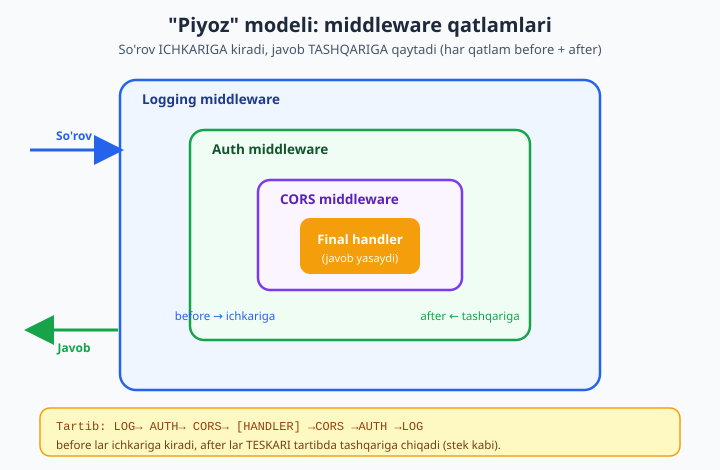
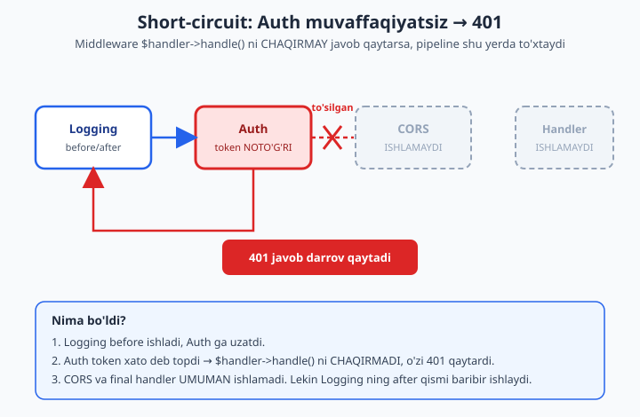

# 12 — PSR-15 middleware pipeline

[⬅️ Oldingi: 11 — HTTP xabarlari: PSR-7 va PSR-17](./11-psr7-http.md) · [🏠 README](./README.md) · [Keyingi: 13 — PSR-11 DI konteyner qurish ➡️](./13-di-konteyner.md)

> **Bu bobda:** har bir zamonaviy PHP framework (Laravel, Symfony, Slim, Mezzio) yuragida yotgan tushuncha — **middleware pipeline** ni noldan quramiz. Avval **middleware nima** va **nega** kerakligini ko'ramiz: auth, CORS, CSRF, logging, rate-limit — har biri so'rov bilan biznes-mantiq orasidagi **alohida, qayta ishlatiladigan qatlam**. So'ng eng muhim aqliy model — **"piyoz" (onion)** ni o'rganamiz: har middleware so'rovni **ichkariga** uzatadi va javobni **tashqariga** qaytaradi (`before`/`after` mantiq). Keyin **PSR-15** ning ikki interfeysini — `MiddlewareInterface::process()` va `RequestHandlerInterface::handle()` — inline yozib, ulardan **pipeline/dispatcher** quramiz: middleware steki + yakuniy handler, har middleware `$handler->handle()` ni chaqirib keyingisiga o'tadi. **Short-circuit** ni ko'rsatamiz: auth muvaffaqiyatsiz bo'lsa **darrov 401** qaytariladi, keyingi qatlamlarga umuman o'tilmaydi. Amalda 3 ta middleware (logging, auth, CORS) + final handler qurib, `ServerRequest` ni o'tkazib `Response` olamiz va `before`/`after` tartibini chiqishda **jonli** ko'rsatamiz. Bu bob [11 — PSR-7 HTTP xabarlari](./11-psr7-http.md) ga tayanadi (immutable so'rov/javob obyektlari) va [10 — PSR standartlari](./10-psr-standartlar.md) dagi "kontraktga dasturlash" g'oyasini davom ettiradi. Boshlovchi MVC tushunchasi uchun [37 — MVC loyihani tartibga solish](../php/37-mvc-loyihani-tartibga-solish.md) ga qarang.

---

## Middleware nima va nega kerak?

Tasavvur qiling: sizda o'nlab marshrut (route) bor — `/profil`, `/buyurtmalar`, `/admin/hisobot` va hokazo. Endi talab keldi: **har bir** so'rovni logga yozish kerak. Yana: `/admin/*` marshrutlari faqat tizimga kirgan foydalanuvchiga ochiq bo'lsin (auth). Yana: brauzerdan AJAX so'rovlari kelishi uchun CORS sarlavhalari qo'shilsin. Yana: bitta IP daqiqada 100 martadan ko'p so'rov yubormasin (rate-limit).

Bu mantiqni **har bir kontroller ichiga** ko'chirib yozish — falokat. Auth tekshiruvi 50 ta metodda takrorlanadi; logga yozish hamma joyda; bittasini o'zgartirsangiz qolganlari eskirib qoladi. Bu — **kesib o'tuvchi tashvish** (cross-cutting concern): u bitta marshrutga emas, **hammasiga** taalluqli.

**Middleware** — aynan shu muammoning yechimi. Middleware — bu so'rov (`ServerRequest`) framework ga kelganidan **keyin**, lekin yakuniy biznes-mantiq (kontroller/handler) ga **yetib bormasdan oldin** turadigan **qatlam**. Har bir tashvish — alohida middleware:

| Middleware | Vazifasi | `before` mantiq | `after` mantiq |
|---|---|---|---|
| **Logging** | So'rov/javobni qayd etish | so'rovni log qiladi | javob statusini log qiladi |
| **Auth** | Kirishni tekshirish | token/sessiyani tekshiradi, xato bo'lsa **to'xtatadi** | — |
| **CORS** | Brauzer ruxsatlari | — | javobga `Access-Control-*` qo'shadi |
| **CSRF** | Forma soxtalashtirilishidan himoya | tokenni solishtiradi | — |
| **Rate-limit** | So'rovlar sonini cheklash | hisoblagichni tekshiradi, oshsa **to'xtatadi** | — |

Har biri — **mustaqil, qayta ishlatiladigan** birlik. Bir loyihada yozgan `AuthMiddleware` ni boshqasiga ko'chirasiz. Tartibni almashtirasiz, birini o'chirasiz, yangisini qo'shasiz — **biznes-mantiqqa tegmasdan**. Bu — [10-bobdagi](./10-psr-standartlar.md) "kontraktga dasturlash" falsafasining HTTP qatlamiga tatbiqi.

> **Asosiy g'oya:** middleware so'rov bilan javob orasidagi **quvur** (pipeline) ni qatlamlarga ajratadi. Har qatlam — bitta vazifa. Quvurni yig'ish (qaysi middleware qaysi tartibda) — markazlashtirilgan joyda, biznes-mantiqdan ajratilgan holda bo'ladi.

---

## "Piyoz" (onion) modeli: ichkari va tashqari

Middleware ni tushunishning **eng muhim** aqliy modeli — bu **piyoz** (onion). Tasavvur qiling: yakuniy handler — piyozning **markazi**. Har middleware — uning atrofidagi **qatlam**. So'rov tashqi qatlamdan markazga **kiradi**, javob esa markazdan tashqariga **chiqadi**.



Har middleware ikki "qism" ga ega:

- **`before`** — so'rovni keyingi qatlamga uzatishdan **oldin** bajariladigan kod (masalan: tokenni tekshirish, log yozish, so'rovga atribut qo'shish).
- **`after`** — keyingi qatlam javob qaytargandan **keyin** bajariladigan kod (masalan: javobga sarlavha qo'shish, javob statusini log qilish).

Bu ikkalasi **bitta funksiya ichida** joylashadi — orada `$handler->handle($request)` chaqiruvi turadi. O'sha chaqiruv — "ichkariga o'tish" momenti:

```php
public function process($request, $handler)
{
    // === before: ichkariga kirishdan OLDIN ===

    $response = $handler->handle($request); // ICHKARIGA o'tamiz (keyingi qatlam)

    // === after: javob qaytgandan KEYIN ===

    return $response;
}
```

Eng muhim natija — **tartib**. Agar quvurda `Logging → Auth → CORS → Handler` bo'lsa, bajarilish ketma-ketligi shunday:

```
Logging.before
  Auth.before
    CORS.before
      Handler   ← markaz
    CORS.after
  Auth.after
Logging.after
```

`before` lar **kirish tartibida** (tashqaridan ichkariga), `after` lar esa **teskari tartibda** (ichkaridan tashqariga) ishlaydi — xuddi **stek** kabi. Logging eng tashqarida bo'lgani uchun u **birinchi boshlanadi va oxirgi tugaydi** — shuning uchun u butun so'rov-javob siklini "o'rab oladi" (masalan, umumiy vaqtni o'lchash uchun ideal).

> **Nega aynan piyoz?** Chunki har middleware **keyingisini o'z ichiga oladi**: `Logging` ning `process()` i `Auth` ni chaqiradi, `Auth` ning `process()` i `CORS` ni, `CORS` esa handler ni. Chaqiruvlar bir-birining ichida — funksiya stek kabi. `after` mantiq — bu funksiyaning `return` dan oldingi qismi, shuning uchun u tabiiy ravishda teskari tartibda ishlaydi.

---

## PSR-15 ning ikki interfeysi

[10-bobda](./10-psr-standartlar.md) ko'rganimizdek, PHP ekotizimi bu pattern ni **standartlashtirgan** — bu **PSR-15** (HTTP Server Request Handlers). U atigi **ikki** kichik interfeysdan iborat. Shularni inline yozib, ma'nosini ko'raylik (PSR-7 o'rniga vaqtincha oddiy `string` ishlatamiz — toza mantiqni ko'rsatish uchun):

```php
<?php

declare(strict_types=1);

// PSR-15 ning IKKI interfeysi (soddalashtirilgan, PSR-7 o'rniga string)
interface RequestHandlerInterface
{
    // So'rovni qabul qiladi, javob qaytaradi. "Oxirgi nuqta" yoki "keyingi qatlam".
    public function handle(string $request): string;
}

interface MiddlewareInterface
{
    // So'rovni oladi VA keyingi qatlamga ($handler) murojaat qila oladi.
    public function process(string $request, RequestHandlerInterface $handler): string;
}

// Bitta middleware: before mantiq -> keyingisini chaqiradi -> after mantiq
final class UpperMiddleware implements MiddlewareInterface
{
    public function process(string $request, RequestHandlerInterface $handler): string
    {
        $request = strtoupper($request);        // BEFORE: so'rovni o'zgartiramiz
        $response = $handler->handle($request); // ICHKARIGA uzatamiz
        return "[$response]";                   // AFTER: javobni o'raymiz
    }
}

// Yakuniy handler: shunchaki javob yasaydi
final class EchoHandler implements RequestHandlerInterface
{
    public function handle(string $request): string
    {
        return "javob:$request";
    }
}

// Middleware ni handler atrofiga "o'rab" chaqiramiz
$mw = new UpperMiddleware();
$final = new EchoHandler();

// $mw->process ichida $final->handle chaqiriladi
$result = $mw->process('salom', $final);
echo $result . "\n"; // kutiladi: [javob:SALOM]
```

Ishga tushiramiz:

```
[javob:SALOM]
```

Mana butun PSR-15 ning mohiyati shu uchta satrda:

1. **`RequestHandlerInterface::handle(request): response`** — "menga so'rov ber, men javob qaytaraman". Bu — yakuniy handler ham, "keyingi qatlam" ham bo'lishi mumkin. Bitta interfeys, ikki rol.
2. **`MiddlewareInterface::process(request, handler): response`** — "menga so'rov **va** keyingi qatlam ber. Men so'rovni ishlab, kerak bo'lsa keyingi qatlamni chaqiraman, javobni qaytaraman". `$handler` — bu "**ichkariga o'tish eshigi**".
3. `process()` ichidagi `$handler->handle($request)` — bu **piyozning bir qatlamga ichkariga kirishi**.

> **Nozik nuqta:** middleware `$handler->handle()` ni chaqirish **majburiyati yo'q**. Agar u o'zi javob qaytarsa (chaqirmasa), pipeline shu yerda **to'xtaydi** — bu **short-circuit** (keyinroq ko'ramiz). Aynan shu erkinlik auth/rate-limit ni mumkin qiladi.

Haqiqiy PSR-15 da `string` o'rniga PSR-7 obyektlari turadi (`Psr\Http\Message\ServerRequestInterface` va `ResponseInterface`), lekin interfeyslarning **shakli aynan shu**. Composer bilan o'rnatsangiz (`composer require psr/http-server-middleware`), aynan shu ikki interfeys keladi.

---

## PSR-7 asosida: ServerRequest va Response

Endi `string` o'rniga [11-bobdagi](./11-psr7-http.md) PSR-7 uslubidagi **immutable** obyektlarga o'tamiz. Bu blok keyingi barcha misollarning poydevori — uni o'qib chiqing, qolganlari shunga tayanadi. (PSR-7 ning to'liq interfeysi katta; bu — minimal, lekin haqiqiy uslubdagi implementatsiya; production da `nyholm/psr7` yoki `guzzlehttp/psr7` ishlatiladi.)

```php
<?php

declare(strict_types=1);

// === PSR-7 minimal (11-bobdan) ===
interface MessageInterface
{
    public function getHeaderLine(string $name): string;
    public function withHeader(string $name, string $value): static;
    public function getBody(): string;
}

final class ServerRequest implements MessageInterface
{
    /** @param array<string,string> $headers @param array<string,mixed> $attributes */
    public function __construct(
        public readonly string $method = 'GET',
        public readonly string $path = '/',
        private array $headers = [],
        private array $attributes = [],
        private string $body = '',
    ) {}

    public function getHeaderLine(string $name): string
    {
        return $this->headers[strtolower($name)] ?? '';
    }

    public function withHeader(string $name, string $value): static
    {
        $clone = clone $this;
        $clone->headers[strtolower($name)] = $value;
        return $clone;
    }

    public function getBody(): string { return $this->body; }

    public function getAttribute(string $name, mixed $default = null): mixed
    {
        return $this->attributes[$name] ?? $default;
    }

    public function withAttribute(string $name, mixed $value): static
    {
        $clone = clone $this;
        $clone->attributes[$name] = $value;
        return $clone;
    }
}

final class Response implements MessageInterface
{
    /** @param array<string,string> $headers */
    public function __construct(
        public readonly int $status = 200,
        private array $headers = [],
        private string $body = '',
    ) {}

    public function getHeaderLine(string $name): string
    {
        return $this->headers[strtolower($name)] ?? '';
    }

    public function withHeader(string $name, string $value): static
    {
        $clone = clone $this;
        $clone->headers[strtolower($name)] = $value;
        return $clone;
    }

    public function getBody(): string { return $this->body; }

    public function getStatus(): int { return $this->status; }
}
```

> **Nega `withAttribute()` muhim?** PSR-7 so'rovi **immutable** (o'zgarmas). Lekin middleware ko'pincha keyingi qatlamlarga **ma'lumot uzatishi** kerak — masalan, Auth middleware "bu so'rov foydalanuvchisi `oqil`" deb belgilashi kerak. Buni `withAttribute()` qiladi: u **yangi** so'rov nusxasini qaytaradi (eskisi o'zgarmaydi), unga atribut qo'shilgan. Handler keyin `getAttribute('user')` bilan o'qiydi. Bu — middleware lar orasidagi **rasmiy ma'lumot kanali**. Immutability nima va `clone` qanday ishlashini [11-bobda](./11-psr7-http.md) batafsil ko'rgansiz.

---

## PSR-15 kontraktlari va Pipeline (dispatcher)

Endi `string` o'rniga `ServerRequest`/`Response` ishlatadigan **haqiqiy** PSR-15 interfeyslarini va eng muhim qism — **Pipeline** (dispatcher) ni yozamiz. Pipeline — middleware steki ustida turuvchi mexanizm; uning vazifasi: stekni navbatma-navbat aylanib chiqish va oxirida final handler ga yetish.

```php
// === PSR-15 kontraktlari (INLINE) ===
interface RequestHandlerInterface
{
    public function handle(ServerRequest $request): Response;
}

interface MiddlewareInterface
{
    public function process(ServerRequest $request, RequestHandlerInterface $handler): Response;
}

// === Pipeline / Dispatcher ===
final class Pipeline implements RequestHandlerInterface
{
    /** @var list<MiddlewareInterface> */
    private array $queue = [];

    public function __construct(private RequestHandlerInterface $finalHandler) {}

    public function pipe(MiddlewareInterface $mw): self
    {
        $this->queue[] = $mw;
        return $this;
    }

    public function handle(ServerRequest $request): Response
    {
        // Stekdan keyingi middleware ni olamiz; tugasa - final handler.
        $mw = array_shift($this->queue);
        if ($mw === null) {
            return $this->finalHandler->handle($request);
        }
        // Hozirgi middleware ga "qolgan pipeline" ni handler sifatida beramiz.
        return $mw->process($request, $this);
    }
}
```

Bu — butun bobning **eng muhim 15 satri**. Diqqat bilan tahlil qilaylik:

1. `Pipeline` ning o'zi `RequestHandlerInterface` ni implement qiladi. Ya'ni **pipeline ham bitta handler**. Bu — fokusning siri.
2. `handle()` chaqirilganda stekdan **bitta** middleware ni `array_shift` bilan oladi.
3. Agar middleware qolmagan bo'lsa (`null`) — demak markazga yetdik, **final handler** ni chaqiramiz.
4. Aks holda — middleware ning `process()` iga so'rov **va** `$this` (ya'ni **pipeline ning o'zi**) ni "keyingi handler" sifatida beramiz.
5. Middleware ichida `$handler->handle()` ni chaqirsa, u **yana shu `handle()` metodiga** qaytadi — bu safar stekda bittaga kam middleware bor. Shunday qilib **rekursiya** orqali qatlamlar birin-ketin ochiladi.

> **Bu nega piyozni hosil qiladi?** Har `process()` chaqiruvi PHP stekida yangi kadr ochadi. `Logging.process` ichida `Auth.process`, uning ichida `CORS.process`, uning ichida `Handler.handle` — barchasi **biri ikkinchisining ichida**. Final handler `return` qilganda, stek **teskari** ochiladi: `CORS` ning `after` i, keyin `Auth` ning, keyin `Logging` ning. Piyoz aynan shu — chaqiruv stekining tabiiy shakli.

> **`array_shift` haqida ogohlantirish:** u `$queue` ni **o'zgartiradi** (element olib tashlaydi). Demak bu `Pipeline` obyekti **bir martalik** — bitta so'rovga ishlatiladi. Ko'p so'rov uchun har safar yangi `Pipeline` yarating (yoki indeks bilan ishlovchi immutable variantni — Mashq 3 da). Haqiqiy framework lar (Slim, Mezzio) indeksli, qayta ishlatiladigan dispatcher ishlatadi.

---

## Amaliy: 3 middleware + final handler

Endi to'liq misol — uchta haqiqiy middleware (Logging, Auth, CORS) va final handler. Har biri `echo` bilan **qachon** ishlaganini chiqaradi, shunda piyoz tartibini **o'z ko'zimiz bilan** ko'ramiz. Bu blok yuqoridagi ikki blok (PSR-7 + PSR-15/Pipeline) bilan **birga** ishlaydi.

```php
// === Final handler ===
final class HelloHandler implements RequestHandlerInterface
{
    public function handle(ServerRequest $request): Response
    {
        $user = $request->getAttribute('user', 'mehmon');
        echo "  [HANDLER] ish bajarildi (user={$user})\n";
        return new Response(200, ['content-type' => 'text/plain'], "Salom, {$user}!");
    }
}

// === 1) Logging middleware (before + after) ===
final class LoggingMiddleware implements MiddlewareInterface
{
    public function process(ServerRequest $request, RequestHandlerInterface $handler): Response
    {
        echo "[LOG before] {$request->method} {$request->path}\n";
        $response = $handler->handle($request);                // ICHKARIGA uzatamiz
        echo "[LOG after]  status={$response->getStatus()}\n"; // javob qaytdi
        return $response;
    }
}

// === 2) Auth middleware (short-circuit) ===
final class AuthMiddleware implements MiddlewareInterface
{
    public function __construct(private string $token = 'sirli') {}

    public function process(ServerRequest $request, RequestHandlerInterface $handler): Response
    {
        echo " [AUTH before] tokenni tekshiramiz\n";
        if ($request->getHeaderLine('Authorization') !== "Bearer {$this->token}") {
            echo " [AUTH] RAD ETILDI -> 401 (keyingilarga O'TMAYDI)\n";
            return new Response(401, ['content-type' => 'text/plain'], 'Ruxsat yo\'q');
        }
        $request = $request->withAttribute('user', 'oqil'); // keyingi qatlamlarga uzatamiz
        $response = $handler->handle($request);
        echo " [AUTH after]  o'tdi\n";
        return $response;
    }
}

// === 3) CORS middleware (faqat after - javobga header qo'shadi) ===
final class CorsMiddleware implements MiddlewareInterface
{
    public function process(ServerRequest $request, RequestHandlerInterface $handler): Response
    {
        echo "  [CORS before] (hech narsa)\n";
        $response = $handler->handle($request);
        echo "  [CORS after]  Access-Control-Allow-Origin qo'shildi\n";
        return $response->withHeader('Access-Control-Allow-Origin', '*');
    }
}

// === In-process run: MUVAFFAQIYATLI so'rov ===
echo "===== 1-SO'ROV: to'g'ri token =====\n";
$pipeline = new Pipeline(new HelloHandler());
$pipeline->pipe(new LoggingMiddleware())
         ->pipe(new AuthMiddleware('sirli'))
         ->pipe(new CorsMiddleware());

$req = new ServerRequest('GET', '/profil', ['authorization' => 'Bearer sirli']);
$res = $pipeline->handle($req);
echo "NATIJA: status={$res->getStatus()}, body=\"{$res->getBody()}\", "
   . "CORS=\"{$res->getHeaderLine('Access-Control-Allow-Origin')}\"\n";
```

Bu kodni in-process ishga tushirganda (jonli server **shart emas** — biz `ServerRequest` ni qo'lda qurib pipeline'dan o'tkazyapmiz) quyidagi chiqishni olamiz:

```
===== 1-SO'ROV: to'g'ri token =====
[LOG before] GET /profil
 [AUTH before] tokenni tekshiramiz
  [CORS before] (hech narsa)
  [HANDLER] ish bajarildi (user=oqil)
  [CORS after]  Access-Control-Allow-Origin qo'shildi
 [AUTH after]  o'tdi
[LOG after]  status=200
NATIJA: status=200, body="Salom, oqil!", CORS="*"
```

**Mana piyoz isboti!** Chekinishga (otstup) qarang — u qatlam chuqurligini ko'rsatadi:

- `before` lar **yuqoridan pastga** (LOG → AUTH → CORS) — tashqaridan ichkariga.
- O'rtada `[HANDLER]` — eng chuqur nuqta.
- `after` lar **teskari** (CORS → AUTH → LOG) — ichkaridan tashqariga.

Yana e'tibor bering: `[HANDLER]` chiqishida `user=oqil` — bu Auth middleware `withAttribute('user', 'oqil')` bilan qo'ygan atribut handler ga **yetib bordi**. Va yakuniy javobda `CORS="*"` — CORS ning `after` qismi javobga sarlavha qo'shgani isboti.

---

## Short-circuit: auth muvaffaqiyatsiz → darrov 401

Endi eng kuchli imkoniyat — **short-circuit** (qisqa tutashuv). Agar middleware `$handler->handle()` ni **chaqirmasdan** o'zi javob qaytarsa, pipeline shu yerda **to'xtaydi**: keyingi qatlamlar va final handler **umuman ishlamaydi**. Aynan shu narsa auth/rate-limit ni mumkin qiladi.



Bir xil pipeline ga **tokensiz** so'rov yuboraylik. `AuthMiddleware` ichidagi `if` ni eslang: token mos kelmasa, u **`return new Response(401, ...)`** qiladi — `$handler->handle()` ga **umuman yetmaydi**.

```php
// === In-process run: SHORT-CIRCUIT (noto'g'ri token) ===
echo "===== 2-SO'ROV: token yo'q (short-circuit) =====\n";
$pipeline2 = new Pipeline(new HelloHandler());
$pipeline2->pipe(new LoggingMiddleware())
          ->pipe(new AuthMiddleware('sirli'))
          ->pipe(new CorsMiddleware());

$req2 = new ServerRequest('GET', '/profil', []); // Authorization header yo'q
$res2 = $pipeline2->handle($req2);
echo "NATIJA: status={$res2->getStatus()}, body=\"{$res2->getBody()}\"\n";
```

Chiqish:

```
===== 2-SO'ROV: token yo'q (short-circuit) =====
[LOG before] GET /profil
 [AUTH before] tokenni tekshiramiz
 [AUTH] RAD ETILDI -> 401 (keyingilarga O'TMAYDI)
[LOG after]  status=401
NATIJA: status=401, body="Ruxsat yo'q"
```

Diqqat bilan solishtiring birinchi so'rov bilan:

- `[CORS before]`, `[HANDLER]`, `[CORS after]` — **butunlay yo'q**. Auth `$handler->handle()` ni chaqirmagani uchun ichkari qatlamlar ochilmadi.
- Lekin **`[LOG after]` baribir ishladi**! Nega? Chunki `Logging` `Auth` dan **tashqarida** — u `Auth.process()` ni chaqirgan, `Auth` esa unga 401 javobni qaytargan. Logging uchun bu shunchaki "qaytgan javob" — u uni log qiladi (`status=401`) va qaytaradi.

> **Bu nega kuchli?** Auth tekshiruvi **markazlashtirilgan**: handler hech qachon "foydalanuvchi kim?" deb tashvishlanmaydi — agar so'rov handler ga yetib kelgan bo'lsa, demak u allaqachon auth dan **o'tgan**. Va Logging tashqarida bo'lgani uchun **rad etilgan** so'rovlar ham logga tushadi. Tartib muhim: agar Logging ni Auth dan **ichkariga** qo'ysangiz, 401 bilan tugagan so'rovlar logga tushmasdi. Shuning uchun framework lar middleware tartibini jiddiy hujjatlashtiradi.

> **Real hayotda:** xuddi shu pattern bilan **rate-limit** (limitdan oshsa darrov `429 Too Many Requests`), **maintenance rejimi** (sayt yopiq bo'lsa darrov `503`), **CSRF** (token mos kelmasa `419`) ishlaydi. Hammasi — `$handler->handle()` ni chaqirmasdan javob qaytarish. Keyingi bo'limda rate-limit ni ko'ramiz.

---

## Short-circuit yana: rate-limit va closure middleware

Yana ikki amaliy texnikani ko'rsataylik: **rate-limit** middleware (holatni saqlovchi, short-circuit qiluvchi) va **closure adapter** — har safar to'liq sinf yozmasdan, oddiy funksiyani middleware ga aylantirish. Bu blok o'zini-tutgan (kerakli minimal sinflar shu yerda).

```php
<?php

declare(strict_types=1);

// Minimal qayta-ishlatiladigan asoslar
final class Req
{
    /** @param array<string,mixed> $attrs */
    public function __construct(public array $attrs = []) {}
    public function with(string $k, mixed $v): static
    {
        $c = clone $this; $c->attrs[$k] = $v; return $c;
    }
    public function get(string $k, mixed $d = null): mixed { return $this->attrs[$k] ?? $d; }
}
final class Resp
{
    public function __construct(public int $status = 200, public string $body = '') {}
}
interface Handler { public function handle(Req $r): Resp; }
interface Middleware { public function process(Req $r, Handler $h): Resp; }

final class Pipe implements Handler
{
    /** @var list<Middleware> */ private array $q = [];
    public function __construct(private Handler $final) {}
    public function pipe(Middleware $m): self { $this->q[] = $m; return $this; }
    public function handle(Req $r): Resp
    {
        $m = array_shift($this->q);
        return $m === null ? $this->final->handle($r) : $m->process($r, $this);
    }
}

// === Closure adapter: oddiy funksiyani middleware ga aylantiradi ===
final class CallableMiddleware implements Middleware
{
    /** @param callable(Req, Handler): Resp $fn */
    public function __construct(private mixed $fn) {}
    public function process(Req $r, Handler $h): Resp { return ($this->fn)($r, $h); }
}

// === Rate-limit middleware (short-circuit 429) ===
final class RateLimit implements Middleware
{
    private int $hits = 0;
    public function __construct(private int $max = 2) {}
    public function process(Req $r, Handler $h): Resp
    {
        if (++$this->hits > $this->max) {
            return new Resp(429, 'Juda ko\'p so\'rov'); // SHORT-CIRCUIT
        }
        return $h->handle($r);
    }
}

$final = new class implements Handler {
    public function handle(Req $r): Resp { return new Resp(200, 'OK#' . $r->get('n')); }
};

// Closure middleware: so'rovga atribut qo'shadi (to'liq sinf yozmasdan)
$timer = new CallableMiddleware(function (Req $r, Handler $h): Resp {
    $r = $r->with('t', 'belgilandi');
    return $h->handle($r);
});

$rl = new RateLimit(max: 2); // bitta obyekt - holat (hits) so'rovlar orasida saqlanadi

foreach ([1, 2, 3] as $n) {
    $pipe = (new Pipe($final))->pipe($timer)->pipe($rl);
    $res = $pipe->handle(new Req(['n' => $n]));
    echo "so'rov #{$n}: status={$res->status}, body=\"{$res->body}\"\n";
}
```

Chiqish:

```
so'rov #1: status=200, body="OK#1"
so'rov #2: status=200, body="OK#2"
so'rov #3: status=429, body="Juda ko'p so'rov"
```

Birinchi ikki so'rov o'tdi (limit `max=2`), uchinchisi — short-circuit bilan **429**. `RateLimit` obyekti **bitta** bo'lib, `$hits` holatini so'rovlar orasida saqladi. `CallableMiddleware` esa to'liq sinf yozish o'rniga **closure** ni middleware ga o'rashning qulay yo'lini ko'rsatadi — kichik, bir martalik mantiq uchun ideal.

> **Ko'prik:** bu pattern Slim Framework ning `$app->add(function($req, $handler) {...})` chaqiruviga to'g'ridan-to'g'ri mos keladi. Laravel da middleware — `handle($request, Closure $next)` (bu yerda `$next` = bizning `$handler`), Symfony da — event listener'lar. Nomi har xil, **mohiyati bir xil**: so'rov bilan handler orasidagi o'raluvchi qatlamlar.

---

## Tartib muhim: keng tarqalgan xatolar

Middleware **tartibi** — bu logik to'g'rilik masalasi, did emas. Ba'zi keng tarqalgan xatolar:

```php
// ❌ XATO: Auth ni Logging dan ICHKARIGA qo'ygan
$pipeline->pipe(new AuthMiddleware())     // tashqarida
         ->pipe(new LoggingMiddleware()); // ichkarida
// Natija: 401 bilan rad etilgan so'rovlar LOGGA TUSHMAYDI,
// chunki Auth short-circuit qilganda Logging ga umuman yetmaydi.

// ✅ TO'G'RI: Logging eng tashqarida - hamma narsani (rad etilganni ham) ko'radi
$pipeline->pipe(new LoggingMiddleware())  // tashqarida
         ->pipe(new AuthMiddleware());    // ichkarida
```

Yana bir tipik xato — **CORS ni Auth dan keyin** qo'yish: agar Auth 401 bilan short-circuit qilsa, CORS sarlavhalari javobga qo'shilmaydi, va brauzer 401 ni "CORS xatosi" deb noto'g'ri ko'rsatadi. Shuning uchun **CORS odatda eng tashqi qatlamlardan biri** bo'ladi.

Umumiy qoida sifatida tartib (tashqaridan ichkariga): **CORS → Logging → Rate-limit → Auth → CSRF → ... → Handler**. Lekin bu loyihaga bog'liq — muhimi, har bir qatlamning short-circuit holatida tashqi qatlamlar **baribir ishlashini** hisobga olish.

---

## Xulosa va keyingisi

Bu bobda zamonaviy PHP framework larining yuragi — **PSR-15 middleware pipeline** ni noldan qurdik. Asosiy xulosalar:

- **Middleware** — so'rov bilan biznes-mantiq orasidagi **alohida, qayta ishlatiladigan qatlam**. Auth, CORS, CSRF, logging, rate-limit kabi **kesib o'tuvchi tashvishlar** ni biznes-mantiqdan ajratadi.
- **"Piyoz" (onion) modeli** — har middleware keyingisini o'z ichiga oladi. So'rov ichkariga (`before`), javob tashqariga (`after`) — `after` lar **teskari tartibda**, xuddi stek kabi.
- **PSR-15** atigi **ikki** interfeysdan iborat: `RequestHandlerInterface::handle()` ("menga so'rov ber — javob beraman") va `MiddlewareInterface::process()` ("menga so'rov **va** keyingi qatlam ber").
- **Pipeline/dispatcher** — `RequestHandlerInterface` ni o'zi implement qiladi; `array_shift` bilan stekdan middleware larni navbatma-navbat olib, oxirida final handler ga yetadi. Rekursiya piyozni hosil qiladi.
- **Short-circuit** — middleware `$handler->handle()` ni chaqirmay javob qaytarsa, pipeline to'xtaydi (auth → 401, rate-limit → 429). Tashqi qatlamlarning `after` qismi baribir ishlaydi.
- **Tartib muhim**: Logging va CORS odatda eng tashqarida (rad etilgan so'rovlarni ham ko'rishi uchun).

So'rov bilan ishlaydigan pipeline tayyor. Lekin bitta savol qoldi: middleware lar va handler larga ularning bog'liqliklarini (logger, repozitoriy, ma'lumotlar bazasi ulanishi) **kim beradi**? Hozircha biz hammasini qo'lda `new` bilan yasayapmiz. **Keyingi bobda** — [13 — PSR-11 DI konteyner qurish](./13-di-konteyner.md) — bu muammoni hal qilamiz: Reflection ([08-bob](./08-reflection-attributes.md)) yordamida bog'liqliklarni **avtomatik** bog'laydigan (autowiring) konteyner quramiz. Pipeline + konteyner + router — bu uchlik birga sizning **shaxsiy mini-framework ingiz** ni tashkil etadi.

---

[⬅️ Oldingi: 11 — HTTP xabarlari: PSR-7 va PSR-17](./11-psr7-http.md) · [🏠 README](./README.md) · [Keyingi: 13 — PSR-11 DI konteyner qurish ➡️](./13-di-konteyner.md)

## Mashqlar

### Oson

**1.** `TimerMiddleware` yozing: u so'rov boshlanishida vaqtni qayd etadi (`hrtime(true)`), `$handler->handle()` ni chaqiradi, javob qaytgach o'tgan vaqtni millisekundda hisoblab `echo` qiladi. Bu qaysi "qism" (before/after) ga tegishli? Nega bu middleware eng **tashqi** qatlamda bo'lishi mantiqiy?

**2.** Yuqoridagi `CorsMiddleware` ni o'zgartiring: u faqat `Access-Control-Allow-Origin` emas, balki `Access-Control-Allow-Methods: GET, POST` sarlavhasini ham qo'shsin. Bu o'zgarish `before` ga ta'sir qiladimi yoki faqat `after` ga?

### O'rta

**3.** Joriy `Pipeline` `array_shift` bilan o'zini "iste'mol qiladi" (bir martalik). **Immutable** variant yozing: `IndexedPipeline` `$index` maydoni va `array $middleware` saqlasin; `handle()` da `$this->middleware[$index]` ni olib, keyingi qatlam sifatida **yangi** `IndexedPipeline($middleware, $index + 1)` bersin. Shunda bitta pipeline ni **ko'p marta** ishlatish mumkin bo'ladi. Ikki so'rov o'tkazib, ikkalasi ham to'g'ri ishlashini ko'rsating.

**4.** `MaintenanceMiddleware` yozing: konstruktor `bool $yopiq` qabul qiladi. Agar `$yopiq === true` bo'lsa, har qanday so'rovga darrov `503` "Sayt texnik ishlar uchun yopiq" qaytarsin (short-circuit). Aks holda so'rovni o'tkazib yuborsin. Buni pipeline ga eng **tashqi** qatlam qilib qo'shing va ikki holatni (yopiq/ochiq) sinab ko'ring.

### Qiyin

**5.** To'liq **mini-router + middleware** integratsiyasini yozing. `Router` (final handler vazifasini bajaradi) `ServerRequest->path` ga qarab ikki marshrutni ajratsin: `/ommaviy` (auth talab qilmaydi) va `/maxfiy` (auth talab qiladi). Buni **marshrutga-bog'liq middleware** orqali yeching: `/maxfiy` so'rovi `AuthMiddleware` dan o'tsin, `/ommaviy` esa o'tmasin. Maslahat: ikki alohida pipeline quring (biri auth bilan, biri auths) va `Router` so'rov path iga qarab tegishlisiga yo'naltirsin. To'rt so'rov bilan sinang: `/ommaviy` (tokensiz → 200), `/maxfiy` (tokensiz → 401), `/maxfiy` (token bilan → 200), `/noma'lum` (→ 404).

<details markdown="1"><summary>Yechim — 1</summary>

`TimerMiddleware` **ham before, ham after** qismidan foydalanadi: boshlanishni `before` da, hisoblashni `after` da qiladi. U eng tashqi qatlamda bo'lishi mantiqiy, chunki shunda u **butun** pipeline (barcha boshqa middleware + handler) sarflagan vaqtni o'lchaydi — agar ichkarida bo'lsa, faqat o'zidan ichkaridagi vaqtni ko'rardi.

```php
<?php

declare(strict_types=1);

// (Req, Resp, Handler, Middleware, Pipe sinflari oldingi bloklardan)
final class TimerMiddleware implements MiddlewareInterface
{
    public function process(ServerRequest $request, RequestHandlerInterface $handler): Response
    {
        $boshlandi = hrtime(true);              // BEFORE: vaqtni qayd etamiz
        $response = $handler->handle($request); // ichkariga
        $msek = (hrtime(true) - $boshlandi) / 1_000_000; // AFTER: o'tgan vaqt
        echo "Bajarilish vaqti: " . number_format($msek, 3) . " ms\n";
        return $response;
    }
}
```

</details>

<details markdown="1"><summary>Yechim — 2</summary>

Faqat `after` ga ta'sir qiladi — chunki sarlavhalar **javobga** qo'shiladi, javob esa `$handler->handle()` qaytgandan keyin mavjud bo'ladi. `before` (so'rov) o'zgarmaydi:

```php
final class CorsMiddleware implements MiddlewareInterface
{
    public function process(ServerRequest $request, RequestHandlerInterface $handler): Response
    {
        $response = $handler->handle($request); // before da hech narsa
        // after: ikki sarlavhani ketma-ket qo'shamiz (har withHeader yangi nusxa qaytaradi)
        return $response
            ->withHeader('Access-Control-Allow-Origin', '*')
            ->withHeader('Access-Control-Allow-Methods', 'GET, POST');
    }
}
```

`withHeader` immutable bo'lgani uchun zanjir (chaining) bilan ketma-ket qo'shamiz — har biri yangi `Response` nusxasi qaytaradi.

</details>

<details markdown="1"><summary>Yechim — 3</summary>

Asosiy farq: `array_shift` o'rniga `$index` ishlatamiz va keyingi qatlamni **yangi** obyekt qilib uzatamiz — joriy obyekt **o'zgarmaydi**, shuning uchun qayta ishlatish mumkin.

```php
<?php

declare(strict_types=1);

// (ServerRequest, Response, RequestHandlerInterface, MiddlewareInterface oldingi bloklardan)
final class IndexedPipeline implements RequestHandlerInterface
{
    /** @param list<MiddlewareInterface> $middleware */
    public function __construct(
        private array $middleware,
        private RequestHandlerInterface $finalHandler,
        private int $index = 0,
    ) {}

    public function handle(ServerRequest $request): Response
    {
        // Shu indeksda middleware bormi?
        if (!isset($this->middleware[$this->index])) {
            return $this->finalHandler->handle($request); // tugadi - final
        }
        $mw = $this->middleware[$this->index];
        // Keyingi qatlam - YANGI pipeline (index+1). Joriy obyekt o'zgarmaydi.
        $next = new self($this->middleware, $this->finalHandler, $this->index + 1);
        return $mw->process($request, $next);
    }
}

// Sinab ko'ramiz: bitta pipeline ni IKKI marta ishlatamiz
$mws = [new LoggingMiddleware(), new AuthMiddleware('sirli')];
$pipeline = new IndexedPipeline($mws, new HelloHandler());

$r1 = $pipeline->handle(new ServerRequest('GET', '/a', ['authorization' => 'Bearer sirli']));
echo "1: {$r1->getStatus()} {$r1->getBody()}\n";

// O'SHA pipeline obyekti - ikkinchi so'rov (chunki immutable, $index o'zgarmagan)
$r2 = $pipeline->handle(new ServerRequest('GET', '/b', []));
echo "2: {$r2->getStatus()} {$r2->getBody()}\n";
```

Kutilgan chiqish (loglardan tashqari):

```
1: 200 Salom, oqil!
2: 401 Ruxsat yo'q
```

Ikkala so'rov ham to'g'ri ishladi, chunki `IndexedPipeline` hech qachon o'z `$middleware` yoki `$index` ini o'zgartirmaydi — har chaqiruvda `$index` lokal, keyingi qatlam esa yangi obyekt. Bu — Slim/Mezzio uslubidagi production-tayyor yondashuv.

</details>

<details markdown="1"><summary>Yechim — 4</summary>

```php
<?php

declare(strict_types=1);

// (ServerRequest, Response, interfeyslar, Pipeline oldingi bloklardan)
final class MaintenanceMiddleware implements MiddlewareInterface
{
    public function __construct(private bool $yopiq) {}

    public function process(ServerRequest $request, RequestHandlerInterface $handler): Response
    {
        if ($this->yopiq) {
            // SHORT-CIRCUIT: handler ga umuman o'tmaymiz
            return new Response(503, ['retry-after' => '3600'], 'Sayt texnik ishlar uchun yopiq');
        }
        return $handler->handle($request); // ochiq - odatdagidek o'tkazamiz
    }
}

// 1-holat: sayt YOPIQ
$p1 = new Pipeline(new HelloHandler());
$p1->pipe(new MaintenanceMiddleware(yopiq: true))->pipe(new LoggingMiddleware());
$r1 = $p1->handle(new ServerRequest('GET', '/', []));
echo "Yopiq: {$r1->getStatus()} {$r1->getBody()}\n";

// 2-holat: sayt OCHIQ
$p2 = new Pipeline(new HelloHandler());
$p2->pipe(new MaintenanceMiddleware(yopiq: false))->pipe(new LoggingMiddleware());
$r2 = $p2->handle(new ServerRequest('GET', '/', []));
echo "Ochiq: {$r2->getStatus()} {$r2->getBody()}\n";
```

Kutilgan chiqish (loglardan tashqari):

```
Yopiq: 503 Sayt texnik ishlar uchun yopiq
Ochiq: 200 Salom, mehmon!
```

`MaintenanceMiddleware` eng tashqi qatlam bo'lgani uchun, yopiq holatda **boshqa hech narsa** (hatto logging ham) ishlamaydi — sayt to'liq qulflangan.

</details>

<details markdown="1"><summary>Yechim — 5</summary>

To'liq yechim: `Router` so'rov path iga qarab tegishli pipeline'ga (yoki to'g'ridan-to'g'ri 404 ga) yo'naltiradi. `/maxfiy` uchun auth'li pipeline, `/ommaviy` uchun auths pipeline ishlatamiz. Bu — marshrutga-bog'liq middleware ning eng sodda, ishonchli implementatsiyasi.

```php
<?php

declare(strict_types=1);

// === PSR-7 minimal + PSR-15 (oldingi bloklardan) ===
final class ServerRequest
{
    /** @param array<string,string> $headers */
    public function __construct(
        public readonly string $method = 'GET',
        public readonly string $path = '/',
        private array $headers = [],
        private array $attributes = [],
    ) {}
    public function getHeaderLine(string $n): string { return $this->headers[strtolower($n)] ?? ''; }
    public function getAttribute(string $n, mixed $d = null): mixed { return $this->attributes[$n] ?? $d; }
    public function withAttribute(string $n, mixed $v): static
    {
        $c = clone $this; $c->attributes[$n] = $v; return $c;
    }
}
final class Response
{
    public function __construct(public readonly int $status = 200, public string $body = '') {}
    public function getStatus(): int { return $this->status; }
    public function getBody(): string { return $this->body; }
}
interface RequestHandlerInterface { public function handle(ServerRequest $r): Response; }
interface MiddlewareInterface
{
    public function process(ServerRequest $r, RequestHandlerInterface $h): Response;
}

final class Pipeline implements RequestHandlerInterface
{
    /** @var list<MiddlewareInterface> */ private array $queue = [];
    public function __construct(private RequestHandlerInterface $final) {}
    public function pipe(MiddlewareInterface $m): self { $this->queue[] = $m; return $this; }
    public function handle(ServerRequest $r): Response
    {
        $m = array_shift($this->queue);
        return $m === null ? $this->final->handle($r) : $m->process($r, $this);
    }
}

// === Auth middleware ===
final class AuthMiddleware implements MiddlewareInterface
{
    public function __construct(private string $token = 'sirli') {}
    public function process(ServerRequest $r, RequestHandlerInterface $h): Response
    {
        if ($r->getHeaderLine('Authorization') !== "Bearer {$this->token}") {
            return new Response(401, 'Ruxsat yo\'q');
        }
        return $h->handle($r->withAttribute('user', 'oqil'));
    }
}

// === Yakuniy handler: kontent qaytaradi ===
final class PageHandler implements RequestHandlerInterface
{
    public function handle(ServerRequest $r): Response
    {
        $user = $r->getAttribute('user', 'mehmon');
        return new Response(200, "{$r->path} sahifasi (user={$user})");
    }
}

// === Router: path ga qarab tegishli pipeline ni tanlaydi ===
final class Router implements RequestHandlerInterface
{
    public function handle(ServerRequest $r): Response
    {
        return match ($r->path) {
            // ommaviy: auths pipeline (faqat handler)
            '/ommaviy' => (new Pipeline(new PageHandler()))->handle($r),
            // maxfiy: auth'li pipeline (avval AuthMiddleware, keyin handler)
            '/maxfiy'  => (new Pipeline(new PageHandler()))
                            ->pipe(new AuthMiddleware('sirli'))
                            ->handle($r),
            // mos marshrut yo'q
            default    => new Response(404, 'Topilmadi'),
        };
    }
}

// === Sinov: 4 so'rov ===
$router = new Router();
$cases = [
    ['GET', '/ommaviy', []],                                  // tokensiz -> 200
    ['GET', '/maxfiy', []],                                   // tokensiz -> 401
    ['GET', '/maxfiy', ['authorization' => 'Bearer sirli']],  // token -> 200
    ['GET', '/nomalum', []],                                  // -> 404
];
foreach ($cases as [$m, $path, $h]) {
    $res = $router->handle(new ServerRequest($m, $path, $h));
    echo str_pad($path, 12) . " -> {$res->getStatus()} | {$res->getBody()}\n";
}
```

Kutilgan chiqish:

```
/ommaviy     -> 200 | /ommaviy sahifasi (user=mehmon)
/maxfiy      -> 401 | Ruxsat yo'q
/maxfiy      -> 200 | /maxfiy sahifasi (user=oqil)
/nomalum     -> 404 | Topilmadi
```

**Tahlil:** `Router` ham `RequestHandlerInterface` ni implement qiladi — u "yakuniy handler" rolida, lekin ichida path ga qarab **turli pipeline larni** tanlaydi. `/ommaviy` da `AuthMiddleware` umuman yo'q (shuning uchun tokensiz ham 200, `user=mehmon`). `/maxfiy` da Auth bor — tokensiz 401 (short-circuit, `PageHandler` ga yetmaydi), token bilan esa Auth `withAttribute('user', 'oqil')` qo'yib o'tkazadi (`user=oqil`). `default` esa pipeline ga umuman kirmasdan 404 qaytaradi. Bu — Slim/Laravel dagi "route middleware" tushunchasining yadrosi: turli marshrutlarga turli middleware steki. Keyingi [13-bobda](./13-di-konteyner.md) bu marshrutlar va middleware larga bog'liqliklarni avtomatik beradigan **DI konteyner** ni qo'shamiz.

</details>
