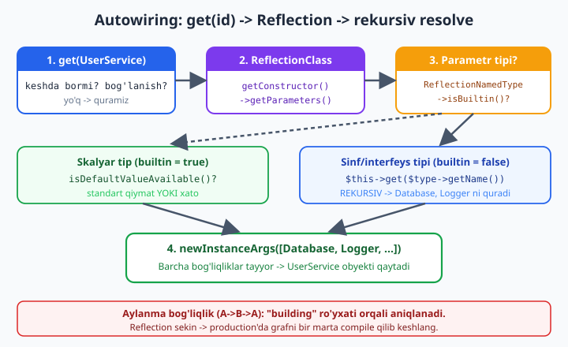
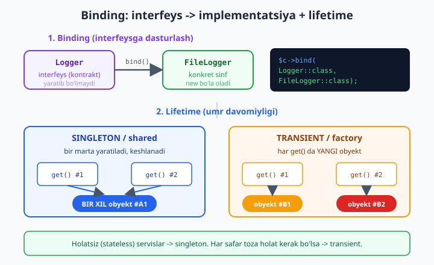

# 13 — PSR-11 DI konteyner qurish (autowiring)

[⬅️ Oldingi: 12 — PSR-15 middleware pipeline](./12-middleware.md) · [🏠 README](./README.md) · [Keyingi: 14 — Routing va front controller ➡️](./14-routing.md)

> **Bu bobda:** Framework yadrosining yuragi — **Dependency Injection konteyner**ini qo'lda quramiz. Avval **DI** (bog'liqlikni tashqaridan berish) va **DI konteyner** (bog'liqliklarni *avtomatik* yig'uvchi mexanizm) o'rtasidagi farqni aniqlaymiz. So'ng **service location** anti-pattern nega yomonligini ko'rsatamiz. **PSR-11** `ContainerInterface` kontraktini (`get`/`has`) inline yozamiz. Keyin asosiy "sehr" — **autowiring**: konstruktor parametrlarini `ReflectionClass`/`ReflectionParameter`/`ReflectionNamedType` bilan o'qib (bu [08-bob](./08-reflection-attributes.md) ga tayanadi), bog'liqliklarni rekursiv ravishda **avtomatik** quramiz. Undan keyin **binding** (interfeysni konkret implementatsiyaga bog'lash — "interfeysga dasturlash"), **lifetime** (singleton/shared vs transient/factory), **aylanma bog'liqlik** (A→B→A) ni aniqlash va aniq xato berish, hamda **compiled/cached konteyner** g'oyasini (Reflection sekin → production'da bir marta hisoblab kesh) o'rganamiz. Oxirida hamma narsani birlashtirgan, **haqiqatan ishlaydigan** kichik konteyner quramiz va in-process sinab ko'ramiz. Boshlovchi DI/MVC asoslari uchun [`../php/37-mvc-loyihani-tartibga-solish.md`](../php/37-mvc-loyihani-tartibga-solish.md) va [`../php/38-foydali-dizayn-andozalari.md`](../php/38-foydali-dizayn-andozalari.md) ga, Reflection uchun [`./08-reflection-attributes.md`](./08-reflection-attributes.md) ga, tip tizimi uchun [`./05-tip-tizimi.md`](./05-tip-tizimi.md) ga tayanamiz.

---

## DI vs DI konteyner: farqni aniqlaymiz

Boshlovchi kitobda ([`../php/38-foydali-dizayn-andozalari.md`](../php/38-foydali-dizayn-andozalari.md)) **Dependency Injection** g'oyasini ko'rib o'tgansiz: sinf o'ziga kerakli obyektni **ichkarida `new` qilib yaratmaydi**, balki uni **tashqaridan** (odatda konstruktor orqali) qabul qiladi. Bu — toza "DI" tamoyili va u **hech qanday konteynersiz** ham mavjud.

Quyida konteyner umuman yo'q — bu shunchaki qo'lda DI:

```php
<?php
declare(strict_types=1);

interface Mailer { public function send(string $to): string; }

final class SmtpMailer implements Mailer
{
    public function __construct(private string $host) {}
    public function send(string $to): string { return "{$this->host} -> {$to}"; }
}

final class Notifier
{
    // Bog'liqlik (Mailer) tashqaridan beriladi -> bu DI
    public function __construct(private Mailer $mailer) {}
    public function ping(): string { return $this->mailer->send('a@b.uz'); }
}

// Qo'lda yig'amiz: avval Mailer, keyin uni Notifier ga uzatamiz
$mailer = new SmtpMailer('smtp.local');
$notifier = new Notifier($mailer);

echo $notifier->ping() . "\n"; // smtp.local -> a@b.uz
```

Bu kod ajoyib: `Notifier` `Mailer` ga bog'liq, lekin uni o'zi yaratmaydi — shuning uchun testda soxta (mock) mailer berish oson, implementatsiyani almashtirish oson. **Muammo boshqa joyda:** loyiha o'sgani sari `new A(new B(new C(new D(...))))` zanjiri uzayib ketadi. Har bir kontroller, har bir servis uchun shu "yig'ish kodi"ni qo'lda yozish — zerikarli, takrorlanuvchi va xatoga moyil.

Aynan shu yerda **DI konteyner** kiradi. Konteyner — bu "obyektlar fabrikasi" bo'lib, undan **"menga `Notifier` ber"** deb so'rasangiz, u:

1. `Notifier` ning konstruktoriga qarab, unga `Mailer` kerakligini **avtomatik aniqlaydi**,
2. `Mailer` ni (yoki uning konkret implementatsiyasini) o'zi yaratadi,
3. uni `Notifier` ga uzatib, tayyor obyektni qaytaradi.

| | **DI (toza tamoyil)** | **DI konteyner** |
|---|---|---|
| Bog'liqlik | tashqaridan beriladi | tashqaridan beriladi |
| Kim yig'adi? | **siz**, qo'lda `new` bilan | **konteyner**, avtomatik (autowiring) |
| Kerakli kod | har joyda yig'ish zanjiri | bitta `get($id)` chaqiruvi |
| Asos | dizayn andozasi | Reflection + bog'lanishlar jadvali |

> **Asosiy fikr:** DI — bu *tamoyil* ("yaratma — qabul qil"). DI konteyner esa shu tamoyilni **avtomatlashtiruvchi vosita**. Konteyner DI ni majburlamaydi, lekin uni **miqyoslanadigan** (scalable) qiladi. Laravel ning `app()`, Symfony ning service container — aynan shu.

---

## Service location: nega bu anti-pattern?

Konteyner bilan ishlashning ikki yo'li bor va ular tubdan farq qiladi. Birinchisi — **dependency injection** (yaxshi): bog'liqliklar konstruktorga *aniq* tip sifatida keladi. Ikkinchisi — **service location** (yomon): sinf konteynerning o'zini qabul qiladi va kerak bo'lganda undan `get('...')` bilan xizmat **tortib oladi**.

```php
<?php
declare(strict_types=1);

interface Mailer { public function send(string $to): string; }
final class SmtpMailer implements Mailer
{
    public function __construct(private string $host) {}
    public function send(string $to): string { return "{$this->host} -> {$to}"; }
}

// Oddiy "service locator"
final class ServiceLocator
{
    /** @var array<string,object> */
    private array $services = [];
    public function set(string $id, object $s): void { $this->services[$id] = $s; }
    public function get(string $id): object { return $this->services[$id]; }
}

final class OrderServiceBad
{
    // ❌ Locator ni qabul qilib, ICHKARIDA get() chaqiramiz
    public function __construct(private ServiceLocator $locator) {}

    public function place(): string
    {
        // ❌ Imzo (signature) Mailer ga bog'liqligini YASHIRADI
        $mailer = $this->locator->get('mailer');
        return $mailer->send('x@y.uz');
    }
}

$loc = new ServiceLocator();
$loc->set('mailer', new SmtpMailer('smtp.bad'));
$bad = new OrderServiceBad($loc);
echo $bad->place() . "\n"; // smtp.bad -> x@y.uz
```

Kod ishlaydi, lekin u **anti-pattern**. Nima uchun?

- **Yashirin bog'liqlik.** `OrderServiceBad` ning konstruktoriga qarasangiz, u `ServiceLocator` ga bog'liqdek ko'rinadi. Aslida esa u `Mailer` ga bog'liq — lekin buni faqat metod **ichini** o'qib bilasiz. Imzo yolg'on gapiradi.
- **Test qiyin.** Bu sinfni testlash uchun butun boshli locator yasab, unga `'mailer'` kalitini to'g'ri nom bilan qo'yishingiz kerak. Konstruktor `Mailer` ni so'raganida esa testda shunchaki mock berasiz.
- **Kompilyatsiya vaqtida tekshirilmaydi.** `get('mailer')` — bu satr. `'maler'` deb adashsangiz, xato faqat ish vaqtida portlaydi. Tip esa ([05-bob](./05-tip-tizimi.md)) statik tahlilchi bilan oldindan ushlanadi.
- **Konteynerga bog'lanish.** Sinfingiz endi konteyner mavjudligini *biladi* va unga "yopishadi". Boshqa loyihaga ko'chirish qiyin.

> **Qoida:** Konteynerdan `get()` ni faqat **eng tashqi nuqtada** (front controller / router) chaqiring — u yerda "ildiz" obyektni so'raysiz. Undan keyin hamma narsa konstruktor injeksiyasi orqali oqib o'tsin. Servislaringiz ichida `$container->get(...)` ko'rsangiz — bu signal: siz service locator yozyapsiz.

---

## PSR-11: ContainerInterface kontrakti

Ekotizimdagi konteynerlar bir-biriga moslashishi uchun PHP-FIG **PSR-11** ni chiqargan ([10-bob](./10-psr-standartlar.md) da ko'rib o'tgan edik). Bu — `psr/container` paketidagi juda kichik interfeys. Kontraktni o'z ko'zingiz bilan ko'rishingiz uchun uni **inline** yozamiz:

```php
<?php
declare(strict_types=1);

namespace Psr\Container;

// Bazaviy istisno (marker) interfeyslari
interface ContainerExceptionInterface extends \Throwable {}
interface NotFoundExceptionInterface extends ContainerExceptionInterface {}

interface ContainerInterface
{
    /**
     * Berilgan id bo'yicha kirish (entry) ni topib qaytaradi.
     * @throws NotFoundExceptionInterface  id topilmasa
     * @throws ContainerExceptionInterface  boshqa xatolik bo'lsa
     */
    public function get(string $id): mixed;

    /** id mavjudligini tekshiradi (yaratmasdan). */
    public function has(string $id): bool;
}
```

Hammasi shu — atigi ikki metod. **`get($id)`** identifikator bo'yicha xizmatni qaytaradi (yo'q bo'lsa `NotFoundExceptionInterface` otadi), **`has($id)`** esa uni *yaratmasdan* mavjudligini aytadi. PSR-11 ataylab minimal: u konteyner *qanday* qurilishini (autowiring, config, ...) belgilamaydi — faqat **iste'mol qilish** tomonini standartlashtiradi.

> **Diqqat:** PSR-11 — bu **read-only** kontrakt. Unda `bind()`/`set()` yo'q. Sababi: kontrakt iste'molchi (masalan, router) uchun. *Qanday* ro'yxatdan o'tkazish — har bir konteynerning o'z ishi. Biz `bind()`/`singleton()` metodlarini qo'shamiz, lekin `get`/`has` PSR-11 ga aniq mos bo'ladi.

Amalda esa interfeysni qo'lda yozmaysiz — uni Composer bilan o'rnatasiz (paket juda kichik):

```bash
composer require psr/container
```

Keyin `use Psr\Container\ContainerInterface;` qilib, konteyneringiz shu interfeysni `implements` qiladi — natijada uni har qanday PSR-11 mos kutubxonaga ula olasiz.

---

## Autowiring: Reflection bilan avtomatik yig'ish

Endi yadroga keldik. **Autowiring** — konteynerning bir sinfni so'raganingizda uning konstruktorini **o'qib**, kerakli bog'liqliklarni **o'zi aniqlab**, ularni rekursiv yaratib berishi. Buning uchun [08-bobdagi](./08-reflection-attributes.md) Reflection API kerak.

Avval g'oyani bitta parametrda ko'raylik: bir sinfning konstruktor parametrining tipini Reflection bilan o'qiymiz.

```php
<?php
declare(strict_types=1);

interface Mailer { public function send(string $to): string; }
final class Notifier
{
    public function __construct(private Mailer $mailer) {}
}

$rc = new ReflectionClass(Notifier::class);
$param = $rc->getConstructor()->getParameters()[0];
$type = $param->getType();

echo "param nomi: {$param->getName()}\n";       // mailer
echo "tip: {$type->getName()}\n";                // Mailer
echo "builtin: " . var_export($type->isBuiltin(), true) . "\n"; // false
```

Mana avtomatik wiring uchun zarur bo'lgan barcha ma'lumot:

- **`getConstructor()`** — `ReflectionMethod` yoki konstruktor bo'lmasa `null`.
- **`getParameters()`** — `ReflectionParameter` massivi.
- **`$param->getType()`** — `ReflectionNamedType` (yoki union/null). Undan:
  - **`getName()`** — tip nomi (masalan `Mailer`).
  - **`isBuiltin()`** — bu **ichki** tipmi (`int`, `string`, `bool`, `array`...) yoki **sinf/interfeys**mi? Aynan shu — autowiring qarorining ayrigichi: `false` bo'lsa, biz uni rekursiv `get()` bilan yaratamiz.

Mana butun autowiring oqimi diagrammada:



Algoritm aniq:

1. `get($id)` — avval keshni va bog'lanishlarni tekshir; topilmasa, sinfni quramiz.
2. `ReflectionClass($id)` — konstruktorni o'qi. Konstruktor yo'q bo'lsa, shunchaki `new $id()`.
3. Har bir parametr uchun tipni ko'r:
   - **Sinf/interfeys** (`isBuiltin() === false`) → `$this->get($type->getName())` — **rekursiv**.
   - **Skalyar** (`isBuiltin() === true`) → standart qiymat bormi (`isDefaultValueAvailable()`), yoki `null` ruxsatmi, yoki xato.
4. Yig'ilgan argumentlar bilan `newInstanceArgs($args)` — tayyor obyekt.

---

## Binding: interfeysni implementatsiyaga bog'lash

Autowiring bitta jiddiy muammoga duch keladi: **interfeysni `new` qilib bo'lmaydi**. `Notifier` `Mailer` *interfeysini* so'rasa, konteyner `new Mailer()` qila olmaydi — qaysi konkret klassni? Aynan shu yerda **binding** kerak: biz konteynerga "`Mailer` so'ralganda `SmtpMailer` ber" deb aytamiz. Bu — "interfeysga dasturlash" tamoyilining konteyner darajasidagi ifodasi.



Diagrammaning yuqori qismi — binding: `bind(Logger::class, FileLogger::class)`. Endi `Logger` so'ralganda konteyner `FileLogger` ni quradi. Pastki qismi — **lifetime**, uni keyingi bo'limda ochamiz.

Binding turlari:

- **Interfeys → konkret sinf:** `bind(Mailer::class, SmtpMailer::class)`.
- **Factory closure:** `bind(Mailer::class, fn($c) => new SmtpMailer('smtp.local'))` — yaratish mantig'i murakkab bo'lsa (config'dan host olish kabi).
- **Tayyor instance:** `instance(Config::class, $config)` — allaqachon yasalgan obyektni ro'yxatga qo'yish.

---

## Lifetime: singleton vs transient

Konteyner obyektni **necha marta** yaratishi kerak? Ikki asosiy rejim bor:

- **Singleton (shared):** obyekt **bir marta** yaratiladi, keshlanadi va har keyingi `get()` da **o'sha** obyekt qaytadi. Mantiqan bitta nusxa bo'lishi kerak bo'lgan, **holatsiz** (stateless) yoki "qimmat" servislar uchun: ulanish hovuzi (connection pool), config, logger.
- **Transient (factory):** har `get()` chaqiruvida **yangi** obyekt yaratiladi. Har safar toza holat kerak bo'lganda: masalan, bir martalik buyruq (command) obyekti, request-ga bog'liq holat.

Diagrammaning pastki qismida farq aniq: singleton da `get() #1` va `get() #2` **bir xil** obyektni (`#A1`) qaytaradi; transient da esa **ikki xil** obyekt (`#B1`, `#B2`).

> **Tanlash qoidasi:** Servis ichida o'zgaruvchan holat bo'lmasa (faqat metodlar) → **singleton** (xotira tejaladi). Har chaqiruvda mustaqil, toza nusxa kerak bo'lsa → **transient**. Shubha bo'lsa, framework'lar odatda servislarni singleton qiladi.

---

## Aylanma bog'liqlik (circular dependency)

Tasavvur qiling: `A` konstruktorida `B` ni so'raydi, `B` esa konstruktorida `A` ni. Konteyner `A` ni qurish uchun `B` ni so'raydi, `B` ni qurish uchun yana `A` ni so'raydi... cheksiz rekursiya va dasturning qulashi. Bu — **aylanma bog'liqlik**, va yaxshi konteyner buni **aniq xato** bilan ushlashi shart, "Maximum function nesting" kabi tushunarsiz halokat bilan emas.

Yechim oddiy: hozir qurilayotgan sinflarni "**building**" ro'yxatida saqlaymiz. Agar allaqachon ro'yxatda turgan sinfni qayta qurishga harakat qilsak — zanjir aylangan, demak xato.

```php
// instantiate() ning boshida (to'liq kontekst keyingi bo'limda):
if (isset($this->building[$class])) {
    $zanjir = implode(' -> ', array_keys($this->building)) . " -> {$class}";
    throw new ContainerException("Aylanma bog'liqlik aniqlandi: {$zanjir}");
}
$this->building[$class] = true;   // qurishni boshladik
// ... bog'liqliklarni resolve qilamiz ...
unset($this->building[$class]);   // qurib bo'ldik (finally bilan)
```

`finally` bloki muhim: bog'liqlikni resolve qilishda xato chiqsa ham, sinfni `building` dan **olib tashlash** kerak, aks holda keyingi (haqiqiy) `get()` chaqiruvi yolg'on "aylanma" xatosi beradi.

---

## To'liq konteyner: hammasini birlashtiramiz

Endi yuqoridagi barcha g'oyalarni — PSR-11, autowiring, binding, lifetime, aylanma aniqlash — **bitta ishlaydigan konteynerga** yig'amiz. Avval PSR-11 interfeysini (yuqoridagidek) bering yoki `composer require psr/container` qiling. Quyidagi blok shu interfeys **mavjud** deb yozilgan.

```php
<?php
declare(strict_types=1);

use Psr\Container\ContainerInterface;
use Psr\Container\ContainerExceptionInterface;
use Psr\Container\NotFoundExceptionInterface;

// --- Istisnolar (PSR-11 marker interfeyslarini implement qiladi) ---
final class NotFoundException extends \Exception implements NotFoundExceptionInterface {}
final class ContainerException extends \Exception implements ContainerExceptionInterface {}

// --- Lifetime turi ---
enum Lifetime
{
    case Singleton;   // bir marta yaratiladi, keyin qayta ishlatiladi
    case Transient;   // har safar yangi obyekt
}

final class Binding
{
    /** @param \Closure|string|null $concrete Factory closure YOKI konkret sinf nomi */
    public function __construct(
        public readonly \Closure|string|null $concrete,
        public readonly Lifetime $lifetime,
    ) {}
}

final class Container implements ContainerInterface
{
    /** @var array<string, Binding> id => binding */
    private array $bindings = [];

    /** @var array<string, mixed> singleton keshlangan obyektlar */
    private array $instances = [];

    /** @var array<string, true> hozir resolve qilinayotgan id lar (circular aniqlash) */
    private array $building = [];

    /** Interfeys/sinf -> konkret sinf yoki factory bog'lash (transient). */
    public function bind(string $id, \Closure|string|null $concrete = null): void
    {
        $this->bindings[$id] = new Binding($concrete ?? $id, Lifetime::Transient);
    }

    /** Singleton bog'lash: bir marta yaratilib, keyin qayta ishlatiladi. */
    public function singleton(string $id, \Closure|string|null $concrete = null): void
    {
        $this->bindings[$id] = new Binding($concrete ?? $id, Lifetime::Singleton);
    }

    /** Tayyor qiymatni to'g'ridan-to'g'ri ro'yxatdan o'tkazish (config va h.k.). */
    public function instance(string $id, mixed $object): void
    {
        $this->instances[$id] = $object;
        $this->bindings[$id] = new Binding(null, Lifetime::Singleton);
    }

    public function has(string $id): bool
    {
        return isset($this->bindings[$id])
            || isset($this->instances[$id])
            || class_exists($id)
            || interface_exists($id);
    }

    public function get(string $id): mixed
    {
        // 1) Singleton keshda bormi?
        if (isset($this->instances[$id])) {
            return $this->instances[$id];
        }

        // 2) Aniq bog'lanish bormi?
        $binding = $this->bindings[$id] ?? null;

        // 3) Bog'lanish ham, sinf ham yo'q -> NotFound
        if ($binding === null && !class_exists($id)) {
            throw new NotFoundException("Konteynerda '{$id}' uchun bog'lanish topilmadi.");
        }

        $object = $this->build($id, $binding);

        // 4) Singleton bo'lsa keshlaymiz
        if ($binding !== null && $binding->lifetime === Lifetime::Singleton) {
            $this->instances[$id] = $object;
        }

        return $object;
    }

    private function build(string $id, ?Binding $binding): mixed
    {
        $concrete = $binding?->concrete ?? $id;

        // Factory closure bo'lsa: o'zini chaqiramiz, konteynerni beramiz
        if ($concrete instanceof \Closure) {
            return $concrete($this);
        }

        // Aks holda $concrete - sinf nomi: uni autowiring bilan quramiz
        return $this->instantiate($concrete);
    }

    /** Reflection bilan sinfni va uning bog'liqliklarini avtomatik quradi. */
    private function instantiate(string $class): object
    {
        // Aylanma: A -> B -> A bo'lsa, A allaqachon "building" da turibdi
        if (isset($this->building[$class])) {
            $zanjir = implode(' -> ', array_keys($this->building)) . " -> {$class}";
            throw new ContainerException("Aylanma bog'liqlik aniqlandi: {$zanjir}");
        }

        try {
            $reflector = new \ReflectionClass($class);
        } catch (\ReflectionException $e) {
            throw new NotFoundException("'{$class}' sinfini topib bo'lmadi.", 0, $e);
        }

        if (!$reflector->isInstantiable()) {
            throw new ContainerException(
                "'{$class}' ni yaratib bo'lmaydi (interfeys yoki abstrakt). "
                . "Avval bind() bilan konkret sinfga bog'lang."
            );
        }

        $constructor = $reflector->getConstructor();

        // Konstruktor yo'q -> shunchaki yangi obyekt
        if ($constructor === null) {
            return new $class();
        }

        $this->building[$class] = true;
        try {
            $args = array_map(
                fn (\ReflectionParameter $p) => $this->resolveParameter($p, $class),
                $constructor->getParameters(),
            );
        } finally {
            // Xato chiqsa ham building dan olib tashlash SHART
            unset($this->building[$class]);
        }

        return $reflector->newInstanceArgs($args);
    }

    /** Bitta konstruktor parametrini hal qiladi. */
    private function resolveParameter(\ReflectionParameter $param, string $owner): mixed
    {
        $type = $param->getType();

        // Sinf/interfeys tipidagi parametr -> rekursiv get()
        if ($type instanceof \ReflectionNamedType && !$type->isBuiltin()) {
            return $this->get($type->getName());
        }

        // Skalyar/ichki tur: standart qiymat bormi?
        if ($param->isDefaultValueAvailable()) {
            return $param->getDefaultValue();
        }

        // null qabul qiladimi?
        if ($type !== null && $type->allowsNull()) {
            return null;
        }

        throw new ContainerException(
            "'{$owner}' sinfining \${$param->getName()} parametrini hal qilib bo'lmadi "
            . "(tip yo'q yoki ichki tur, standart qiymat ham yo'q)."
        );
    }
}
```

Diqqat qiling: `resolveParameter()` da `getType()` `ReflectionNamedType` ekanini va `isBuiltin()` ni tekshiramiz. Union/intersection tiplar uchun bu yetarli emas (ular `ReflectionUnionType` qaytaradi) — ularni qo'shimcha mantiq bilan qo'llab-quvvatlash mumkin, lekin asosiy g'oya shu. Bu — [05-bobdagi](./05-tip-tizimi.md) tip tizimi va [08-bobdagi](./08-reflection-attributes.md) Reflection bilimining to'g'ridan-to'g'ri qo'llanishi.

### Konteynerni sinab ko'ramiz (in-process)

Endi konteynerni haqiqiy domen sinflarida ishga tushiramiz. Quyidagi test **butunlay o'zini tutadi** (yuqoridagi `Container` mavjud deb hisoblaydi) va `assert()` lar bilan har bir xususiyatni tekshiradi.

```php
<?php
declare(strict_types=1);

// (Yuqoridagi Container va PSR-11 interfeyslari shu yerda mavjud deb faraz qilamiz)

interface Logger { public function log(string $m): void; }
final class EchoLogger implements Logger
{
    public array $messages = [];
    public function log(string $m): void { $this->messages[] = $m; }
}
final class Database
{
    public function __construct(public readonly string $dsn = 'sqlite::memory:') {}
}
final class UserRepository
{
    public function __construct(
        public readonly Database $db,
        public readonly Logger $logger,
    ) {}
}
final class UserService
{
    public function __construct(public readonly UserRepository $repo) {}
    public function dsn(): string { return $this->repo->db->dsn; }
}

$c = new Container();
// Logger interfeysini konkret implementatsiyaga bog'laymiz
$c->bind(Logger::class, EchoLogger::class);

// AUTOWIRING: UserService -> UserRepository -> (Database + Logger) avtomatik
$service = $c->get(UserService::class);

assert($service instanceof UserService);
assert($service->repo instanceof UserRepository);
assert($service->repo->db instanceof Database);
assert($service->repo->logger instanceof EchoLogger); // interfeys -> impl
assert($service->dsn() === 'sqlite::memory:');        // skalyar default ishladi
echo "Autowiring + binding: OK\n";
```

`get(UserService::class)` bitta chaqiruvda butun grafni qurdi: `UserService` `UserRepository` ni, u esa `Database` (skalyar `$dsn` uchun standart qiymat) va `Logger` (interfeys → `EchoLogger`) ni so'radi. Hech qaysisini biz qo'lda `new` qilmadik.

Endi lifetime ni tekshiramiz:

```php
<?php
declare(strict_types=1);
// (Container, Logger, EchoLogger, Database yuqorida berilgan)

$c = new Container();
$c->bind(Logger::class, EchoLogger::class);   // transient
$c->singleton(Database::class);               // singleton

// SINGLETON: ikki get() bir xil obyekt
$a = $c->get(Database::class);
$b = $c->get(Database::class);
assert($a === $b, 'singleton bir xil bo\'lishi kerak');

// TRANSIENT: ikki get() har xil obyekt
$la = $c->get(Logger::class);
$lb = $c->get(Logger::class);
assert($la !== $lb, 'transient har xil bo\'lishi kerak');
echo "Singleton vs transient: OK\n";

// FACTORY closure: yaratish mantig'ini o'zimiz beramiz
$c2 = new Container();
$c2->singleton(Database::class, fn (Container $ct) => new Database('mysql:host=localhost'));
assert($c2->get(Database::class)->dsn === 'mysql:host=localhost');
echo "Factory closure: OK\n";

// AYLANMA bog'liqlik aniqlanadi
final class AlfaServis { public function __construct(public BetaServis $b) {} }
final class BetaServis { public function __construct(public AlfaServis $a) {} }

$c3 = new Container();
try {
    $c3->get(AlfaServis::class);
    echo "XATO: aylanma aniqlanmadi\n";
} catch (ContainerException $e) {
    assert(str_contains($e->getMessage(), 'Aylanma'));
    echo "Circular: OK -> {$e->getMessage()}\n";
}
```

Ishga tushirilganda chiqish:

```
Singleton vs transient: OK
Factory closure: OK
Circular: OK -> Aylanma bog'liqlik aniqlandi: AlfaServis -> BetaServis -> AlfaServis
```

Aylanma xatosi zanjirni aniq ko'rsatadi: `AlfaServis -> BetaServis -> AlfaServis`. Bu — yaxshi konteyner va yomon konteyner farqi. Yomon konteyner shunchaki "stack overflow" beradi; bizniki **muammoning aynan qayerdaligini** aytadi.

---

## Compiled/cached konteyner: Reflection sekin

Bizning konteyner toza, lekin bir kamchiligi bor: **har `get()` da Reflection ishlaydi**. `ReflectionClass` yaratish, konstruktorni o'qish, parametrlarni tahlil qilish — bularning hammasi nisbatan **sekin**. Bitta so'rovda o'nlab servis quriladigan real ilovada bu sezilarli sekinlikka aylanadi. [08-bobda](./08-reflection-attributes.md) ham aytganimizdek: Reflection — kuchli, lekin uni har so'rovda qaytadan ishlatish — eng keng tarqalgan performance xatosi.

**Yechim — compiled (kompilyatsiya qilingan) konteyner.** G'oya: bog'liqlik grafi development paytida o'zgaradi, lekin production'da **o'zgarmaydi**. Demak, Reflection ni **faqat bir marta** (deploy/build paytida) ishlatib, natijani — ya'ni "qaysi sinfni qanday yig'ish" rejasini — oddiy PHP fayl sifatida **yozib qo'yamiz**. Production'da shu fayl yuklanadi, Reflection **umuman ishlamaydi** — faqat to'g'ridan-to'g'ri `new` chaqiruvlari qoladi. Bu — aynan **Symfony** ning yondashuvi (`var/cache/.../Container.php` — minglab qatorlik avtogeneratsiya qilingan fayl) va Laravel ning `config:cache`/optimizatsiya g'oyasiga yaqin.

Quyida soddalashtirilgan namuna — graf bo'yicha factory massivini PHP fayl sifatida generatsiya qilamiz va keyin Reflection'siz yuklaymiz:

```php
<?php
declare(strict_types=1);

interface Cache { public function get(string $k): ?string; }
final class ArrayCache implements Cache
{
    public function get(string $k): ?string { return null; }
}
final class Repo
{
    public function __construct(public Cache $cache) {}
}

/**
 * COMPILE bosqichi: graf bo'yicha PHP kod-string generatsiya qiladi.
 * Real konteynerda bu reja Reflection bilan AVTOMATIK chiqariladi;
 * bu yerda natijani soddalashtirib ko'rsatamiz.
 */
function compileContainer(): string
{
    $code  = "<?php\nreturn [\n";
    $code .= "    Cache::class => fn() => new ArrayCache(),\n";
    $code .= "    Repo::class  => fn(\$c) => new Repo(\$c[Cache::class]()),\n";
    $code .= "];\n";
    return $code;
}

$file = sys_get_temp_dir() . '/cache_container.php';
file_put_contents($file, compileContainer());

// PRODUCTION yuklash: Reflection YO'Q, faqat tayyor factory massivi
$factories = require $file;
$repo = $factories[Repo::class]($factories);

assert($repo instanceof Repo);
assert($repo->cache instanceof ArrayCache);
echo "Compiled konteyner: OK (Reflection ishlatilmadi)\n";

@unlink($file);
```

Bu yerda muhim **kontseptsiya**, kod emas: development'da qulaylik (autowiring, "shunchaki ishlaydi"), production'da tezlik (oldindan hisoblangan, keshlangan plan). Ikki dunyoning ikkala yaxshi tomonini olamiz.

> **Amaliy maslahat:** O'zingiz konteyner yozmang — Symfony DI, Laravel container, yoki yengil `PHP-DI` dan foydalaning. Ammo bu bobni o'qiganingizdan keyin ular endi "sehr" emas. Siz autowiring, binding, lifetime va compile g'oyasining ostidagi mexanizmni bilasiz — bu xatolarni tushunish va to'g'ri konfiguratsiya qilishda hal qiluvchi ahamiyatga ega.

---

## Mashqlar

### Oson

1. `Container::get()` ni `try/catch` ichida chaqirib, **bog'lanmagan interfeys** (masalan, hech qachon `bind()` qilinmagan `Logger::class`) so'rang. Qaysi istisno otiladi — `NotFoundException` mi yoki `ContainerException` mi? Nega? (Maslahat: `class_exists('Logger')` interfeys uchun nima qaytaradi?)
2. Konteynerga `instance(Config::class, $config)` bilan tayyor obyekt qo'shing va `get(Config::class)` aynan o'sha obyektni (`===`) qaytarishini `assert` bilan tasdiqlang.
3. `has()` metodini sinab ko'ring: mavjud konkret sinf, mavjud interfeys va umuman yo'q nom (`'YoqMutlaqo'`) uchun navbati bilan `true`, `true`, `false` qaytishini tekshiring.

### O'rta

4. Konstruktorida **`?Logger $logger = null`** (nullable, standart `null`) parametri bo'lgan sinf yarating. Uni `Logger` bog'lanmagan konteynerdan `get()` qiling — `resolveParameter()` `null` qaytarishini va xato otilmasligini tasdiqlang. Nega bu xavfli bo'lishi mumkin?
5. `Container` ga **`make(string $class, array $params = [])`** metodini qo'shing: u autowiring qiladi, lekin `$params` da berilgan nomli argumentlar (masalan `['dsn' => 'pgsql:...']`) skalyar parametrlar uchun standart qiymat o'rniga ishlatilsin. Test bilan tekshiring.
6. Singleton va transient farqini **statistika** bilan ko'rsating: bir interfeysni `bind()` (transient) qiling, uni 3 marta `get()` qiling va har safar `spl_object_id()` har xil ekanini tasdiqlang. So'ng `singleton()` ga o'zgartiring va `spl_object_id()` bir xil ekanini ko'rsating.

### Qiyin

7. **`#[Inject]` atributi bilan skalyar injeksiya.** Konteynerni shunday kengaytiring: agar konstruktor parametri **ichki tur** (`int`, `string`) bo'lsa va unga `#[Inject('kalit')]` atributi qo'yilgan bo'lsa, qiymatni konteynerning sozlamalar jadvalidan oling; atribut bo'lmasa standart qiymat; u ham bo'lmasa istisno. (Bu autowiring'ni config injeksiyasi bilan birlashtiradi — Symfony ning `#[Autowire]` ga o'xshash.)
8. **Aylanma bog'liqlikni setter injeksiyasi bilan yeching.** Konstruktor injeksiyasi aylanma grafni qura olmaydi. `A` va `B` o'zaro bog'liq bo'lganda, birini konstruktorda, ikkinchisini `setB(B $b)` setter metodi orqali keyin in'ektsiya qiluvchi mexanizm qo'shing. Konteyner avval `A` ni (proxy/qisman) yaratib, keyin setterni chaqirishi kerak.

<details markdown="1"><summary>Yechim — 7</summary>

Asosiy g'oya: `resolveParameter()` da skalyar parametr uchun avval `#[Inject]` atributini tekshiramiz. Quyidagi yechim alohida, o'zini-tutgan konteyner sifatida (asosiy g'oyani izolyatsiyada ko'rsatish uchun) yozilgan va ishlaydi:

```php
<?php
declare(strict_types=1);

use Psr\Container\ContainerInterface; // psr/container yoki inline interfeys

#[Attribute(Attribute::TARGET_PARAMETER)]
final class Inject
{
    public function __construct(public string $key) {}
}

final class InjectAwareContainer implements ContainerInterface
{
    private array $config = [];
    private array $bindings = [];

    public function setConfig(string $key, mixed $val): void { $this->config[$key] = $val; }
    public function bind(string $id, string $concrete): void { $this->bindings[$id] = $concrete; }

    public function has(string $id): bool
    {
        return isset($this->bindings[$id]) || class_exists($id);
    }

    public function get(string $id): mixed
    {
        $class = $this->bindings[$id] ?? $id;
        $rc = new \ReflectionClass($class);
        $ctor = $rc->getConstructor();
        if ($ctor === null) {
            return new $class();
        }

        $args = [];
        foreach ($ctor->getParameters() as $p) {
            $type = $p->getType();

            // 1) Sinf/interfeys tipi -> rekursiv
            if ($type instanceof \ReflectionNamedType && !$type->isBuiltin()) {
                $args[] = $this->get($type->getName());
                continue;
            }

            // 2) #[Inject('kalit')] bormi?
            $attrs = $p->getAttributes(Inject::class);
            if ($attrs !== []) {
                $key = $attrs[0]->newInstance()->key;
                if (!array_key_exists($key, $this->config)) {
                    throw new \RuntimeException("Inject kaliti yo'q: {$key}");
                }
                $args[] = $this->config[$key];
                continue;
            }

            // 3) Standart qiymat
            if ($p->isDefaultValueAvailable()) {
                $args[] = $p->getDefaultValue();
                continue;
            }

            throw new \RuntimeException("\${$p->getName()} ni hal qilib bo'lmadi");
        }

        return $rc->newInstanceArgs($args);
    }
}

final class ApiKlient
{
    public function __construct(
        #[Inject('api.base_url')] public string $baseUrl,
        #[Inject('api.timeout')] public int $timeout = 30,
    ) {}
}

$c = new InjectAwareContainer();
$c->setConfig('api.base_url', 'https://api.example.uz');
$c->setConfig('api.timeout', 10);

$klient = $c->get(ApiKlient::class);
assert($klient->baseUrl === 'https://api.example.uz');
assert($klient->timeout === 10);
echo "#[Inject] skalyar injeksiya: OK -> {$klient->baseUrl}, t={$klient->timeout}\n";
```

Mantiq tartibi muhim: avval **sinf tipi** (rekursiv), keyin **`#[Inject]`** (config'dan), keyin **standart qiymat**, oxirida xato. `getAttributes(Inject::class)` ([08-bob](./08-reflection-attributes.md)) atributni o'qiydi, `newInstance()` esa undan `Inject` obyektini yaratib `key` ni beradi. Bu — `getType()->isBuiltin()` tekshiruvi (skalyarni sinfdan ajratish) va atribut o'qishning birlashmasi.

</details>

<details markdown="1"><summary>Yechim — 8</summary>

Konstruktor injeksiyasi aylanma uchun **fundamental** ishlamaydi: `A` ni qurish uchun `B` to'liq tayyor bo'lishi kerak, `B` ni qurish uchun esa `A` — bu hal qilib bo'lmaydigan tovuq-tuxum muammosi. Yagona yechim — **bir bog'liqlikni konstruktordan tashqariga** (setter yoki property injeksiyaga) chiqarish, shunda `A` "yarim tayyor" holatda yaratilib, keyin to'ldiriladi.

```php
<?php
declare(strict_types=1);

// A B ga konstruktorda bog'liq; B esa A ga SETTER orqali (aylanmani uzadi)
final class ServiceA
{
    public function __construct(public ServiceB $b) {}
    public function nom(): string { return 'A(' . $this->b->nom() . ')'; }
}

final class ServiceB
{
    private ?ServiceA $a = null;
    public function setA(ServiceA $a): void { $this->a = $a; }
    public function nom(): string { return 'B'; }
    public function hasA(): bool { return $this->a !== null; }
}

final class SetterContainer
{
    private array $instances = [];

    public function get(string $id): object
    {
        if (isset($this->instances[$id])) {
            return $this->instances[$id];
        }

        // ServiceB ni AVVAL (A'siz) yaratamiz va DARHOL keshlaymiz,
        // shunda ServiceA uni konstruktorda olganda aynan shu nusxa keladi.
        if ($id === ServiceB::class) {
            $b = new ServiceB();
            $this->instances[ServiceB::class] = $b; // keshga qo'yamiz
            return $b;
        }

        if ($id === ServiceA::class) {
            $b = $this->get(ServiceB::class);  // tayyor (yoki yangi) B
            $a = new ServiceA($b);
            $this->instances[ServiceA::class] = $a;
            $b->setA($a);                      // SETTER bilan aylanmani yopamiz
            return $a;
        }

        throw new \RuntimeException("Noma'lum: {$id}");
    }
}

$c = new SetterContainer();
$a = $c->get(ServiceA::class);
$b = $c->get(ServiceB::class);

assert($a instanceof ServiceA);
assert($b->hasA() === true);          // B ga A in'ektsiya qilindi
assert($a->b === $b);                 // bir xil B nusxasi
assert($b === $c->get(ServiceB::class)); // keshlangan
echo "Setter bilan aylanma yechildi: {$a->nom()}, B.hasA=" . var_export($b->hasA(), true) . "\n";
```

Kalit g'oyalar:
- **Erta keshlash:** `ServiceB` ni yaratgach, uni `ServiceA` qurishidan **oldin** keshga qo'yamiz. Shunda `ServiceA` konstruktorida olingan `B` va keyin setterga uzatilgan `A` bir-biriga to'g'ri "tugun" hosil qiladi.
- **Setter injeksiya:** aylanmaning bitta yo'nalishini konstruktordan setterga ko'chirish — bu aylanmani "kechiktirilgan" (lazy) bog'lashga aylantiradi.
- **Eng yaxshi yechim — qochish:** real loyihada aylanma bog'liqlik ko'pincha **dizayn xatosi** signali. Uni setter bilan "yamashdan" oldin, sinflarni qayta loyihalashtirish (umumiy mantiqni uchinchi sinfga chiqarish) ko'pincha to'g'riroq yo'l.

</details>

---

[⬅️ Oldingi: 12 — PSR-15 middleware pipeline](./12-middleware.md) · [🏠 README](./README.md) · [Keyingi: 14 — Routing va front controller ➡️](./14-routing.md)
