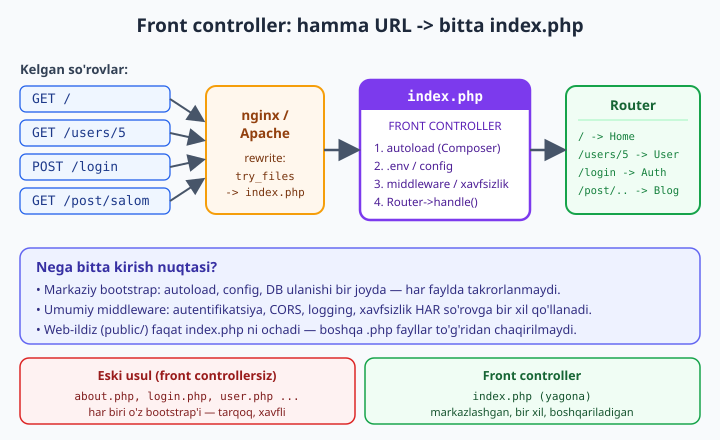
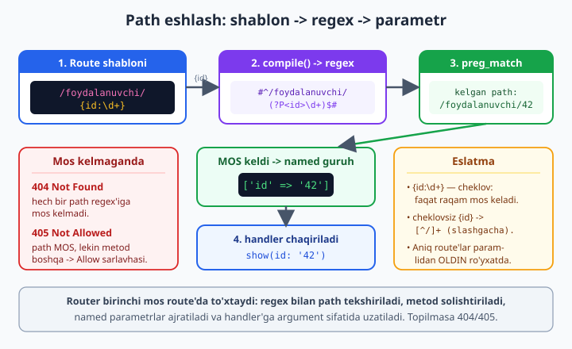

# 14 — Routing va front controller

[⬅️ Oldingi: 13 — PSR-11 DI konteyner qurish](./13-di-konteyner.md) · [🏠 README](./README.md) · [Keyingi: 15 — O'z mini-frameworkingizni yig'ish ➡️](./15-mini-framework.md)

> **Bu bobda:** har bir zamonaviy PHP framework (Laravel, Symfony, Slim) ning yuragini — **routing** ni va uning ostidagi **front controller** naqshini quramiz. Avval nega barcha so'rov bitta `index.php` ga yo'naltirilishi (web-server rewrite), va bu nima beradi — markaziy bootstrap, umumiy middleware, xavfsizlik — ni tushunamiz. So'ng **route table** (metod + path → handler) tuzilmasini, **path matching** ni (aniq mos kelish, so'ng `/foydalanuvchi/{id}` kabi **parametrli** route'larni regex'ga aylantirib ushlash), HTTP metod bo'yicha ajratishni va to'g'ri **404** (topilmadi) hamda **405** (metod ruxsat etilmagan) javoblarini yozamiz. Keyin framework "sehri" ning markazi — **atribut-asosli routing**: `#[Route('/path', 'GET')]` atributini kontroller metodlariga qo'yib, [Reflection](./08-reflection-attributes.md) bilan o'qib route table ni **avtomatik** quramiz. Oxirida **dispatch** — mos kontroller metodini topib, parametrlarni uzatib chaqirish. Hammasini jonli serversiz, so'rovni **jarayon ichida** simulyatsiya qilib tekshiramiz. Bu bob [08 — Reflection va atributlar](./08-reflection-attributes.md) ga, [10 — PSR standartlari](./10-psr-standartlar.md) (PSR-7/15) ga va boshlovchi kitobdagi [MVC](../php/37-mvc-loyihani-tartibga-solish.md) hamda [dizayn andozalari](../php/38-foydali-dizayn-andozalari.md) boblariga tayanadi.

---

## Muammo: URL ni kodga qanday bog'lash kerak?

Brauzer `https://sayt.uz/foydalanuvchi/42` so'rovini yuboradi. Server bu **URL** ni qabul qiladi va undan kerakli **PHP kod** ni ishga tushirishi kerak — masalan, 42-raqamli foydalanuvchini bazadan olib, sahifa qaytaruvchi metodni. Mana shu **"URL → kod"** aloqasini o'rnatish — **routing** (marshrutlash) deyiladi.

Eng sodda, "eski" yondashuvda har bir sahifa o'zining `.php` fayli edi:

```
public/
  index.php        -> bosh sahifa
  about.php        -> biz haqimizda
  login.php        -> login
  user.php?id=42   -> foydalanuvchi
```

Bu ishlaydi, lekin tez orada chalkashlikka aylanadi. **Nega?**

- **Takrorlanish.** Har bir fayl o'zining autoload'ini, bazaga ulanishini, sessiya boshlashini, xavfsizlik tekshiruvini takrorlaydi. Bir narsani o'zgartirsangiz — o'nlab faylni tahrirlaysiz.
- **Xavfsizlik teshiklari.** Web-ildiz (`public/`) ichidagi **har bir** `.php` faylni brauzerdan to'g'ridan-to'g'ri chaqirib bo'ladi. Tasodifan qoldirilgan `debug.php` yoki `config.php` ochiq qoladi.
- **URL fayl yo'liga bog'lanadi.** `user.php?id=42` — bu chiroyli URL emas. `/foydalanuvchi/42` ko'rinishidagi "toza" URL uchun har holda rewrite kerak.
- **Markaziy nazorat yo'q.** "Har so'rovdan oldin loglash" yoki "barcha sahifada CSRF tekshirish" qoidasini bir joyda qo'yib bo'lmaydi.

Yechim — **front controller** naqshi: **barcha** so'rovni bitta kirish nuqtasiga yig'amiz va keyin kod ichida qaror qabul qilamiz.

---

## Front controller naqshi: bitta kirish nuqtasi

**Front controller** — bu butun ilovaning **yagona kirish eshigi**: barcha HTTP so'rov, qaysi URL bo'lishidan qat'i nazar, bitta `index.php` faylga keladi. O'sha fayl ilovani **bootstrap** qiladi (autoload, config, ulanishlar), so'rovni **router** ga beradi, router mos kodni topadi va javob qaytaradi.



### Web-server rewrite: barcha URL'ni index.php ga yo'naltirish

Buning ishlashi uchun web-server (nginx yoki Apache) ga "agar so'ralgan fayl mavjud bo'lmasa, so'rovni `index.php` ga ber" deb aytamiz. Bu **rewrite** qoidasi.

**nginx** uchun:

```nginx
server {
    root /var/www/loyiha/public;   # web-ildiz faqat public/

    location / {
        # Avval haqiqiy fayl/papka bormi (rasm, css) tekshir;
        # bo'lmasa — hamma narsani index.php ga yo'nalt.
        try_files $uri $uri/ /index.php?$query_string;
    }

    location ~ \.php$ {
        fastcgi_pass unix:/run/php/php8.4-fpm.sock;
        fastcgi_param SCRIPT_FILENAME $document_root$fastcgi_script_name;
        include fastcgi_params;
    }
}
```

**Apache** uchun (`public/.htaccess`):

```apache
<IfModule mod_rewrite.c>
    RewriteEngine On
    # Haqiqiy fayl yoki papka bo'lsa — to'g'ridan ber (rasm, css):
    RewriteCond %{REQUEST_FILENAME} !-f
    RewriteCond %{REQUEST_FILENAME} !-d
    # Qolgan hamma narsani index.php ga:
    RewriteRule ^ index.php [QSA,L]
</IfModule>
```

Diqqat qiling: web-ildiz `public/` ga qaratilgan. Demak loyihaning qolgan kodi (`src/`, `config/`, `vendor/`, `.env`) web-ildizdan **tashqarida** — ularni brauzerdan ochib bo'lmaydi. Bu — front controller ning eng muhim xavfsizlik foydalaridan biri.

### index.php ning roli

`public/index.php` — eng nozik fayl, lekin **eng yupqasi** bo'lishi kerak. Uning vazifasi faqat ilovani yig'ish va so'rovni uzatish:

```php
<?php
declare(strict_types=1);

// public/index.php — FRONT CONTROLLER (eng yupqa fayl)

// 1. Composer autoload (PSR-4) — barcha sinflar shu yerdan topiladi
require __DIR__ . '/../vendor/autoload.php';

// 2. Konfiguratsiya / muhit o'zgaruvchilari (.env)
//    $config = require __DIR__ . '/../config/app.php';

// 3. Konteyner (13-bob) va router ni yig'ish
//    $container = require __DIR__ . '/../bootstrap/container.php';
//    $router    = require __DIR__ . '/../bootstrap/routes.php';

// 4. So'rovni qabul qilish va javobni yuborish:
//    $request  = ServerRequest::fromGlobals();   // PSR-7
//    $response = $router->handle($request);       // marshrut + dispatch
//    (new Emitter())->emit($response);            // javobni brauzerga
```

Ushbu **markazlashtirish** front controller ning butun foydasini ochadi:

- **Bitta bootstrap.** Autoload, config, baza ulanishi — bir joyda, bir marta.
- **Umumiy middleware.** Autentifikatsiya, CORS, logging, rate-limiting, CSRF — barcha so'rovga **bir xil** qo'llanadi (15-bobda middleware pipeline ni quramiz).
- **Xavfsizlik.** Faqat `index.php` ochiq; boshqa fayllar himoyalangan.
- **Moslashuvchanlik.** URL'lar fayl tuzilishiga bog'liq emas — istalgan URL'ni istalgan kodga ulashingiz mumkin.

> **Eslatma — PSR-7.** Yetuk frameworklar so'rov/javob uchun [PSR-7](./10-psr-standartlar.md) (`ServerRequestInterface` / `ResponseInterface`) interfeyslaridan foydalanadi. Bu bobda mohiyatga e'tibor qaratish uchun **minimal** `Request`/`Response` sinflarini o'zimiz yozamiz; 15-bobda PSR-7 ga o'tamiz. Asosiy g'oya bir xil: kiruvchi so'rovni **obyektga** o'rab, routerdan o'tkazib, **Response obyekti** olamiz.

---

## Route table: (metod + path → handler)

**Router** ning yuragi — **route table** (marshrutlar jadvali). Bu shunchaki ro'yxat: har bir yozuv **HTTP metod** (GET/POST/...) va **path** (URL yo'li) ni bir **handler** (chaqiriladigan kod) ga bog'laydi.

Eng sodda holatda bu PHP massivi bo'lishi mumkin. Avval **aniq mos kelish** (exact match) ni ko'ramiz — bunda kelgan path route'dagi path ga to'liq teng bo'lishi kerak:

```php
<?php
declare(strict_types=1);

// Eng oddiy route table: (metod + path) -> handler
$routes = [
    'GET'  => [
        '/'      => fn(): string => 'Bosh sahifa',
        '/about' => fn(): string => 'Biz haqimizda',
    ],
    'POST' => [
        '/login' => fn(): string => 'Login qabul qilindi',
    ],
];

function dispatch(array $routes, string $method, string $path): string
{
    // 1. Metod umuman bormi?
    if (!isset($routes[$method])) {
        return "405 Metod ruxsat etilmagan: {$method}";
    }
    // 2. Path aniq mos keladimi?
    if (!isset($routes[$method][$path])) {
        return "404 Topilmadi: {$path}";
    }
    $handler = $routes[$method][$path];
    return $handler();
}

echo dispatch($routes, 'GET', '/') . PHP_EOL;
echo dispatch($routes, 'GET', '/about') . PHP_EOL;
echo dispatch($routes, 'POST', '/login') . PHP_EOL;
echo dispatch($routes, 'GET', '/yoq') . PHP_EOL;       // 404
echo dispatch($routes, 'DELETE', '/') . PHP_EOL;        // 405 (path bor, metod yoq)
```

Chiqishi (tekshirilgan):

```
Bosh sahifa
Biz haqimizda
Login qabul qilindi
404 Topilmadi: /yoq
405 Metod ruxsat etilmagan: DELETE
```

Bu ishlaydi, lekin **ikki muammosi** bor:

1. **Aniq mos kelish yetarli emas.** `/foydalanuvchi/42` va `/foydalanuvchi/43` — har xil ID, lekin **bir xil** handler bo'lishi kerak. Har bir ID uchun alohida route yozib bo'lmaydi. Bizga **parametrli** route kerak.
2. **405 mantig'i noto'g'ri.** Bu yerda `DELETE /` 405 qaytardi, lekin sabab xato: `DELETE` metodi jadvalga umuman qo'shilmagan. To'g'ri 405 mantig'i: **path mavjud, lekin aynan o'sha metod uchun emas** bo'lganda 405 berish. Buni keyinroq tuzatamiz.

Birinchi muammoni — parametrli route'larni — hal qilaylik.

---

## Path matching: parametrli route'larni regex'ga aylantirish

Aniq mos kelish o'rniga, route shablonida **placeholder** (joy egasi) qo'yamiz: `/foydalanuvchi/{id}`. Bu yerda `{id}` — "shu joyda istalgan qiymat kelishi mumkin, uni `id` deb saqla" degani.

Path matching ni amalga oshirishning standart usuli — shablonni **regex** (muntazam ifoda) ga aylantirish. `{id}` ni **named capture group** `(?P<id>...)` ga o'giramiz; keyin `preg_match` mos kelganda ushbu guruhni nomi bilan ajratib oladi.



```php
<?php
declare(strict_types=1);

// Path shablonini ({id} bilan) regex'ga aylantirish
function shablonRegex(string $path): string
{
    // {name} yoki {name:\d+} ko'rinishidagi segmentlarni topamiz
    $regex = preg_replace_callback(
        '#\{([a-zA-Z_][a-zA-Z0-9_]*)(?::([^}]+))?\}#',
        function (array $m): string {
            $nom = $m[1];
            $tur = $m[2] ?? '[^/]+'; // cheklov berilmasa: slashdan boshqa hamma narsa
            // named capture group: keyin parametr nomini olamiz
            return "(?P<{$nom}>{$tur})";
        },
        $path
    );
    // Boshi va oxiri qat'iy; slashlarni # bilan to'qnashmaslik uchun
    return '#^' . $regex . '$#';
}

// Sinov
$tests = [
    '/foydalanuvchi/{id}'              => '/foydalanuvchi/42',
    '/foydalanuvchi/{id:\d+}'          => '/foydalanuvchi/abc', // mos kelmaydi (faqat raqam)
    '/post/{slug}/izoh/{izohId:\d+}'   => '/post/salom-dunyo/izoh/7',
];

foreach ($tests as $shablon => $kelgan) {
    $regex = shablonRegex($shablon);
    $mos = preg_match($regex, $kelgan, $m);
    echo "Shablon: {$shablon}" . PHP_EOL;
    echo "  Regex : {$regex}" . PHP_EOL;
    echo "  Kelgan: {$kelgan} -> " . ($mos ? 'MOS' : 'mos emas') . PHP_EOL;
    if ($mos) {
        // Faqat nomli (string kalitli) guruhlarni olamiz
        $params = array_filter($m, 'is_string', ARRAY_FILTER_USE_KEY);
        echo "  Param : " . json_encode($params, JSON_UNESCAPED_UNICODE) . PHP_EOL;
    }
    echo PHP_EOL;
}
```

Chiqishi (tekshirilgan):

```
Shablon: /foydalanuvchi/{id}
  Regex : #^/foydalanuvchi/(?P<id>[^/]+)$#
  Kelgan: /foydalanuvchi/42 -> MOS
  Param : {"id":"42"}

Shablon: /foydalanuvchi/{id:\d+}
  Regex : #^/foydalanuvchi/(?P<id>\d+)$#
  Kelgan: /foydalanuvchi/abc -> mos emas

Shablon: /post/{slug}/izoh/{izohId:\d+}
  Regex : #^/post/(?P<slug>[^/]+)/izoh/(?P<izohId>\d+)$#
  Kelgan: /post/salom-dunyo/izoh/7 -> MOS
  Param : {"slug":"salom-dunyo","izohId":"7"}
```

Bu yerda bir nechta muhim nuqtalar bor — ularni tushunish routerning sirini ochadi:

- **`(?P<nom>...)` — named capture group.** `preg_match` natija massivida `$m['id']` kabi **nom bilan** kirish imkonini beradi. Aynan shu nom route parametrining nomi bo'ladi.
- **Standart cheklov `[^/]+`.** Cheklov berilmasa, placeholder "slashdan boshqa bir yoki undan ko'p belgi" ni ushlaydi. Bu muhim: `/foydalanuvchi/{id}` route'i `/foydalanuvchi/42/posts` ga mos kelmasligi kerak (chunki `42/posts` da slash bor).
- **Maxsus cheklov `{id:\d+}`.** Ikki nuqtadan keyin o'z regex'ingizni berasiz. `\d+` — faqat raqam. Shuning uchun `/foydalanuvchi/abc` mos kelmadi — ID raqam bo'lishi shart.
- **`^...$` langarlar.** Boshi (`^`) va oxiri (`$`) qat'iy — regex butun path ni qoplashi kerak, qisman emas.
- **Ajratuvchi `#`.** Regex ajratuvchisi sifatida odatiy `/` o'rniga `#` ishlatdik — chunki path'larning o'zida `/` ko'p, va ularni ekranlash (`\/`) shart bo'lmasligi uchun.
- **`array_filter(..., ARRAY_FILTER_USE_KEY)`.** `preg_match` natijasida ham raqamli (`$m[0]`, `$m[1]`...), ham nomli (`$m['id']`) kalitlar bo'ladi. Bizga faqat nomlilari kerak — shuning uchun string kalitlilarini filtrlaymiz.

> **Tuzoq — route tartibi.** Regex'lar ro'yxat tartibida sinaladi va **birinchi** mos kelgan g'olib. Demak aniqroq route'lar oldinroq turishi kerak. Masalan `/users/me` route'i `/users/{id}` dan **oldin** ro'yxatga qo'shilishi shart — aks holda `/users/me` ni `{id}` ushlab oladi (`me` ni id deb biladi). Buni mashqlarda ko'ramiz.

---

## To'liq router: 404 va 405 ni to'g'ri farqlash

Endi parametrli matching ni va **to'g'ri** 404/405 mantig'ini birlashtiramiz. HTTP semantikasi bo'yicha:

- **404 Not Found** — bunday **path** umuman yo'q (hech qaysi route'ga mos kelmadi).
- **405 Method Not Allowed** — path **bor**, lekin so'ralgan **metod** uchun emas. Bu holda javobda `Allow` sarlavhasi bo'lishi **shart** — mijozga "bu path qaysi metodlarni qabul qiladi" deb aytadi (RFC 7231).

Buni amalga oshirish uchun: barcha route'larni aylanib chiqamiz, **path** mos kelganlarini topamiz. Agar shu orasida metod ham mos kelsa — topdik. Agar path mos keldi-yu metod hech qaysisida mos kelmasa — bu 405 (va mos kelgan metodlarni `Allow` ga yig'amiz). Hech qaysi path mos kelmasa — 404.

```php
<?php
declare(strict_types=1);

// --- Natija turlari (sodda Result obyekti) ---
final class RouteMatch
{
    /** @param array<string,string> $params */
    public function __construct(
        public readonly mixed $handler,
        public readonly array $params,
    ) {}
}

// 404 va 405 ni farqlash uchun maxsus istisno
final class MethodNotAllowed extends RuntimeException
{
    /** @param list<string> $allowed */
    public function __construct(public readonly array $allowed)
    {
        parent::__construct('405 Method Not Allowed');
    }
}

final class NotFound extends RuntimeException {}

// --- Router ---
final class Router
{
    /** @var list<array{method:string,regex:string,handler:mixed,path:string}> */
    private array $routes = [];

    public function add(string $method, string $path, mixed $handler): void
    {
        $this->routes[] = [
            'method'  => strtoupper($method),
            'regex'   => $this->compile($path),
            'handler' => $handler,
            'path'    => $path,
        ];
    }

    public function get(string $path, mixed $h): void    { $this->add('GET', $path, $h); }
    public function post(string $path, mixed $h): void   { $this->add('POST', $path, $h); }
    public function put(string $path, mixed $h): void    { $this->add('PUT', $path, $h); }
    public function delete(string $path, mixed $h): void { $this->add('DELETE', $path, $h); }

    private function compile(string $path): string
    {
        $regex = preg_replace_callback(
            '#\{([a-zA-Z_][a-zA-Z0-9_]*)(?::([^}]+))?\}#',
            fn(array $m): string => '(?P<' . $m[1] . '>' . ($m[2] ?? '[^/]+') . ')',
            $path
        );
        return '#^' . $regex . '$#';
    }

    public function match(string $method, string $path): RouteMatch
    {
        $method = strtoupper($method);
        $allowed = [];

        foreach ($this->routes as $route) {
            if (preg_match($route['regex'], $path, $m) === 1) {
                // Path mos keldi. Endi metodni tekshiramiz.
                if ($route['method'] === $method) {
                    $params = array_filter($m, 'is_string', ARRAY_FILTER_USE_KEY);
                    return new RouteMatch($route['handler'], $params);
                }
                // Path mos, metod boshqa -> bu metodni "ruxsat etilgan"lar ro'yxatiga
                $allowed[] = $route['method'];
            }
        }

        // Path biror marshrutga mos kelgan, lekin metod mos kelmagan -> 405
        if ($allowed !== []) {
            throw new MethodNotAllowed(array_values(array_unique($allowed)));
        }
        // Hech qaysi path mos kelmadi -> 404
        throw new NotFound("404: {$method} {$path}");
    }
}

// --- Sinov: dispatch ---
$r = new Router();
$r->get('/',                    fn() => 'Bosh sahifa');
$r->get('/foydalanuvchi/{id:\d+}', fn(string $id) => "Foydalanuvchi #{$id}");
$r->post('/foydalanuvchi',      fn() => 'Yangi foydalanuvchi yaratildi');
$r->get('/post/{slug}',         fn(string $slug) => "Post: {$slug}");

function process(Router $r, string $method, string $path): string
{
    try {
        $match = $r->match($method, $path);
        // Handlerni named parametrlar bilan chaqirish
        $natija = ($match->handler)(...$match->params);
        return "200 OK  | {$method} {$path} -> {$natija}";
    } catch (MethodNotAllowed $e) {
        return "405      | {$method} {$path} -> Allow: " . implode(', ', $e->allowed);
    } catch (NotFound $e) {
        return "404      | {$method} {$path} -> Topilmadi";
    }
}

echo process($r, 'GET',  '/') . PHP_EOL;
echo process($r, 'GET',  '/foydalanuvchi/42') . PHP_EOL;
echo process($r, 'GET',  '/foydalanuvchi/abc') . PHP_EOL; // 404 (regex \d+ mos emas)
echo process($r, 'POST', '/foydalanuvchi') . PHP_EOL;
echo process($r, 'GET',  '/post/salom-dunyo') . PHP_EOL;
echo process($r, 'DELETE', '/foydalanuvchi') . PHP_EOL;   // 405 (POST bor, DELETE yoq)
echo process($r, 'GET',  '/mavjud-emas') . PHP_EOL;       // 404
```

Chiqishi (tekshirilgan):

```
200 OK  | GET / -> Bosh sahifa
200 OK  | GET /foydalanuvchi/42 -> Foydalanuvchi #42
404      | GET /foydalanuvchi/abc -> Topilmadi
200 OK  | POST /foydalanuvchi -> Yangi foydalanuvchi yaratildi
200 OK  | GET /post/salom-dunyo -> Post: salom-dunyo
405      | DELETE /foydalanuvchi -> Allow: POST
404      | GET /mavjud-emas -> Topilmadi
```

Diqqat bilan qarang:

- **`DELETE /foydalanuvchi` → 405**, chunki `/foydalanuvchi` path'i mavjud (POST uchun ro'yxatga olingan), faqat DELETE metodi yo'q. `Allow: POST` mijozga to'g'ri javob beradi. Bu — birinchi sodda misoldagi xatoning tuzatilishi.
- **`GET /foydalanuvchi/abc` → 404**, chunki `{id:\d+}` faqat raqam ushlaydi; `abc` regex'ga mos kelmaydi, demak bu path **umuman yo'q**.
- **`($match->handler)(...$match->params)`** — bu PHP ning **spread** (`...`) operatori bilan named argumentlarni handlerga uzatish. `$match->params` — `['id' => '42']` kabi assotsiativ massiv; `...` uni `id: '42'` named argumentiga aylantiradi va handler `fn(string $id)` ni to'g'ri to'ldiradi.

`RouteMatch`, `MethodNotAllowed`, `NotFound` ni alohida sinflar qildik — bu **toza dizayn**: `match()` faqat marshrutni topish bilan shug'ullanadi, javobni qanday qaytarish (status kod, header) esa chaqiruvchi (dispatcher/controller) ning ishi. Bu mas'uliyatlarni ajratish (SRP) — toza kod prinsipi.

---

## Atribut-asoslli routing: framework "sehri"

Yuqorida route'larni **qo'lda** yozdik: `$r->get('/foydalanuvchi/{id}', ...)`. Bu ishlaydi, lekin yetuk frameworklar (Symfony, va Laravel yangi versiyalarida) boshqa, yanada qulay yo'lni taklif qiladi — **route'ni to'g'ridan-to'g'ri kontroller metodi ustiga atribut sifatida yozish**:

```php
#[Route('/foydalanuvchi/{id}', 'GET')]
public function show(string $id): string { ... }
```

Bu — "deklarativ" routing: route ta'rifi u boshqaradigan kod yonida turadi, ularni alohida faylda izlash shart emas. Bu qanday ishlaydi? Aynan shu yerda [08-bobdagi Reflection va atributlar](./08-reflection-attributes.md) ishga tushadi — **router kontroller sinflarini Reflection bilan skanerlab, atributlarni o'qiydi va route table ni avtomatik quradi**. Bu — frameworklar "sehri" ning eng aniq namunasi.

Avval `#[Route]` atributini e'lon qilamiz (08-bobni eslang: `#[Attribute(...)]` bilan target va takrorlanuvchanlikni belgilaymiz), so'ng kontrollerlarni yozamiz:

```php
<?php
declare(strict_types=1);

// --- Route atributi (08-bobdagi #[Attribute] ga tayanadi) ---
#[Attribute(Attribute::TARGET_METHOD | Attribute::IS_REPEATABLE)]
final class Route
{
    public function __construct(
        public string $path,
        public string $method = 'GET',
    ) {}
}

// --- Kontrollerlar: route'lar metodlarga atribut sifatida yopishtirilgan ---
final class HomeController
{
    #[Route('/', 'GET')]
    public function index(): string
    {
        return 'Bosh sahifa (HomeController::index)';
    }

    #[Route('/about', 'GET')]
    public function about(): string
    {
        return 'Biz haqimizda';
    }
}

final class UserController
{
    #[Route('/foydalanuvchi/{id:\d+}', 'GET')]
    public function show(string $id): string
    {
        return "Foydalanuvchi #{$id} (UserController::show)";
    }

    #[Route('/foydalanuvchi', 'POST')]
    #[Route('/foydalanuvchi/yaratish', 'POST')] // takrorlanuvchi (IS_REPEATABLE)
    public function create(): string
    {
        return 'Foydalanuvchi yaratildi';
    }
}
```

Diqqat: `Route` atributini `Attribute::TARGET_METHOD` (faqat metodlarga) va `Attribute::IS_REPEATABLE` (bir metodga bir nechta marta) deb belgiladik. Shuning uchun `create()` metodiga **ikki** `#[Route]` qo'ya oldik — bir handler ikki URL'ga xizmat qiladi.

Endi routerni — uning **`registerController()`** metodini — Reflection bilan yozamiz. Bu metod sinfdagi har bir public metodni ko'rib chiqadi, undagi `#[Route]` atributlarini `getAttributes(Route::class)` bilan oladi va `newInstance()` orqali haqiqiy `Route` obyektiga aylantiradi (08-bobning aynan o'sha naqshi):

```php
<?php
declare(strict_types=1);

// (Yuqoridagi Route atributi, HomeController va UserController shu yerda bo'lsin)
#[Attribute(Attribute::TARGET_METHOD | Attribute::IS_REPEATABLE)]
final class Route
{
    public function __construct(public string $path, public string $method = 'GET') {}
}

final class HomeController
{
    #[Route('/', 'GET')]
    public function index(): string { return 'Bosh sahifa (HomeController::index)'; }

    #[Route('/about', 'GET')]
    public function about(): string { return 'Biz haqimizda'; }
}

final class UserController
{
    #[Route('/foydalanuvchi/{id:\d+}', 'GET')]
    public function show(string $id): string { return "Foydalanuvchi #{$id} (UserController::show)"; }

    #[Route('/foydalanuvchi', 'POST')]
    #[Route('/foydalanuvchi/yaratish', 'POST')]
    public function create(): string { return 'Foydalanuvchi yaratildi'; }
}

// --- Router natija/istisno turlari ---
final class RouteMatch
{
    /** @param array<string,string> $params */
    public function __construct(
        public readonly array $handler, // [Kontroller::class, 'metod']
        public readonly array $params,
    ) {}
}
final class MethodNotAllowed extends RuntimeException
{
    /** @param list<string> $allowed */
    public function __construct(public readonly array $allowed)
    {
        parent::__construct('405');
    }
}
final class NotFound extends RuntimeException {}

// --- Router (atribut skanerlash bilan) ---
final class Router
{
    /** @var list<array{method:string,regex:string,handler:array}> */
    private array $routes = [];

    /** Kontroller sinfini Reflection bilan skanerlab route table quradi */
    public function registerController(string $klass): void
    {
        $ref = new ReflectionClass($klass);
        foreach ($ref->getMethods(ReflectionMethod::IS_PUBLIC) as $method) {
            // Bu metodga yopishtirilgan barcha #[Route] atributlarini olamiz
            foreach ($method->getAttributes(Route::class) as $attr) {
                $route = $attr->newInstance(); // -> Route obyekti
                $this->routes[] = [
                    'method'  => strtoupper($route->method),
                    'regex'   => $this->compile($route->path),
                    'handler' => [$klass, $method->getName()],
                ];
            }
        }
    }

    private function compile(string $path): string
    {
        $regex = preg_replace_callback(
            '#\{([a-zA-Z_][a-zA-Z0-9_]*)(?::([^}]+))?\}#',
            fn(array $m): string => '(?P<' . $m[1] . '>' . ($m[2] ?? '[^/]+') . ')',
            $path
        );
        return '#^' . $regex . '$#';
    }

    public function match(string $method, string $path): RouteMatch
    {
        $method = strtoupper($method);
        $allowed = [];
        foreach ($this->routes as $route) {
            if (preg_match($route['regex'], $path, $m) === 1) {
                if ($route['method'] === $method) {
                    $params = array_filter($m, 'is_string', ARRAY_FILTER_USE_KEY);
                    return new RouteMatch($route['handler'], $params);
                }
                $allowed[] = $route['method'];
            }
        }
        if ($allowed !== []) {
            throw new MethodNotAllowed(array_values(array_unique($allowed)));
        }
        throw new NotFound("404: {$method} {$path}");
    }
}

// --- Dispatcher: kontrollerni yaratib metodni chaqiradi ---
function dispatch(Router $r, string $method, string $path): string
{
    try {
        $match = $r->match($method, $path);
        [$klass, $metod] = $match->handler;
        $controller = new $klass();              // soddalik uchun; real holatda DI konteyner (13-bob)
        $natija = $controller->$metod(...$match->params);
        return "200 | {$method} {$path} -> {$natija}";
    } catch (MethodNotAllowed $e) {
        return "405 | {$method} {$path} -> Allow: " . implode(', ', $e->allowed);
    } catch (NotFound) {
        return "404 | {$method} {$path}";
    }
}

// --- Sinov ---
$r = new Router();
$r->registerController(HomeController::class);
$r->registerController(UserController::class);

echo dispatch($r, 'GET',    '/') . PHP_EOL;
echo dispatch($r, 'GET',    '/about') . PHP_EOL;
echo dispatch($r, 'GET',    '/foydalanuvchi/7') . PHP_EOL;
echo dispatch($r, 'POST',   '/foydalanuvchi') . PHP_EOL;
echo dispatch($r, 'POST',   '/foydalanuvchi/yaratish') . PHP_EOL; // takrorlanuvchi atribut
echo dispatch($r, 'DELETE', '/foydalanuvchi') . PHP_EOL;          // 405
echo dispatch($r, 'GET',    '/foydalanuvchi/abc') . PHP_EOL;      // 404 (\d+)
echo dispatch($r, 'GET',    '/yoq') . PHP_EOL;                    // 404
```

Chiqishi (tekshirilgan):

```
200 | GET / -> Bosh sahifa (HomeController::index)
200 | GET /about -> Biz haqimizda
200 | GET /foydalanuvchi/7 -> Foydalanuvchi #7 (UserController::show)
200 | POST /foydalanuvchi -> Foydalanuvchi yaratildi
200 | POST /foydalanuvchi/yaratish -> Foydalanuvchi yaratildi
405 | DELETE /foydalanuvchi -> Allow: POST
404 | GET /foydalanuvchi/abc
404 | GET /yoq
```

Mana, **biror route'ni qo'lda yozmadik** — router kontrollerlarni skanerlab, atributlardan to'liq route table ni o'zi qurdi. Bu yerda yuz bergan "sehr"ni qadamma-qadam ajratamiz:

1. **`new ReflectionClass($klass)`** — sinfni ish vaqtida "ko'zguda" ko'ramiz (08-bob).
2. **`getMethods(ReflectionMethod::IS_PUBLIC)`** — faqat public metodlarni olamiz (private metodlar route bo'la olmaydi).
3. **`$method->getAttributes(Route::class)`** — har bir metodga yopishtirilgan `#[Route]` atributlarini topamiz. `IS_REPEATABLE` tufayli ular bir nechta bo'lishi mumkin.
4. **`$attr->newInstance()`** — atributni **haqiqiy `Route` obyektiga** aylantiradi (`new Route('/...', 'GET')` chaqirilgandek). Endi `$route->path` va `$route->method` ga kira olamiz.
5. Olingan ma'lumotdan route table yozuvini quramiz. **Handler** bu safar closure emas, balki `[Sinf, 'metod']` ko'rinishidagi **callable** — uni dispatcher kontroller yaratib chaqiradi.

> **Tuzoq — har so'rovda skanerlash QILMANG.** Reflection — kuchli, lekin **sekin** (08-bobni eslang). `registerController()` ni **har HTTP so'rovda** chaqirish — eng keng tarqalgan performance xatosi. Production'da route table'ni **bir marta** qurib, natijani **keshlash** kerak — masalan, kompilatsiya qilingan PHP massivini faylga yozib (`route cache`). Laravel `php artisan route:cache`, Symfony esa cache katalogini aynan shu uchun ishlatadi. Keshda atribut emas, **tayyor regex'lar massivi** turadi — Reflection umuman ishlatilmaydi.

> **Ko'prik — dispatcher va DI.** Yuqorida soddalik uchun `new $klass()` qildik. Real frameworkda kontroller [DI konteyner](./13-di-konteyner.md) orqali yaratiladi — shunda kontroller konstruktorida so'ralgan bog'liqliklar (repository, logger, baza) avtomatik yetkaziladi. Bu — 13 va 14-boblarning birlashuvi, va aynan shuni 15-bobda mini-frameworkda yig'amiz.

---

## To'liq oqim: Request → Router → Response (front controller simulyatsiyasi)

Endi hammasini birlashtirib, haqiqiy front controller oqimini **jarayon ichida** (jonli serversiz) simulyatsiya qilamiz. Minimal `Request`/`Response` obyektlari quramiz (PSR-7 ruhida), so'ng routerni `handle(Request): Response` shaklida — front controller chaqiradigan ko'rinishda — yozamiz. So'rovlarni massiv sifatida berib, har biriga to'g'ri javob (200/404/405) qaytishini tasdiqlaymiz.

```php
<?php
declare(strict_types=1);

// --- Minimal Request/Response (PSR-7 ruhida, lekin sodda) ---
final class Request
{
    public function __construct(
        public readonly string $method,
        public readonly string $path,
        public readonly array $query = [],
        public readonly array $body = [],
    ) {}

    /** Real holatda bu $_SERVER / php://input dan quriladi */
    public static function fromGlobals(string $method, string $uri): self
    {
        $parts = parse_url($uri);
        $path = $parts['path'] ?? '/';
        $query = [];
        if (isset($parts['query'])) {
            parse_str($parts['query'], $query);
        }
        return new self(strtoupper($method), $path, $query);
    }
}

final class Response
{
    public function __construct(
        public readonly int $status,
        public readonly string $body,
        /** @var array<string,string> */
        public readonly array $headers = [],
    ) {}
}

// --- Route atributi ---
#[Attribute(Attribute::TARGET_METHOD)]
final class Route
{
    public function __construct(public string $path, public string $method = 'GET') {}
}

// --- Kontroller ---
final class BlogController
{
    #[Route('/', 'GET')]
    public function home(Request $req): Response
    {
        return new Response(200, 'Salom! Bosh sahifa.');
    }

    #[Route('/post/{slug}', 'GET')]
    public function show(Request $req, string $slug): Response
    {
        $izoh = $req->query['izoh'] ?? 'yoq';
        return new Response(200, "Post: {$slug} (izoh={$izoh})");
    }
}

// --- Router (atribut-asosli + 404/405) ---
final class Router
{
    private array $routes = [];

    public function registerController(string $klass): void
    {
        $ref = new ReflectionClass($klass);
        foreach ($ref->getMethods(ReflectionMethod::IS_PUBLIC) as $method) {
            foreach ($method->getAttributes(Route::class) as $attr) {
                $route = $attr->newInstance();
                $regex = preg_replace_callback(
                    '#\{([a-zA-Z_][a-zA-Z0-9_]*)(?::([^}]+))?\}#',
                    fn(array $m): string => '(?P<' . $m[1] . '>' . ($m[2] ?? '[^/]+') . ')',
                    $route->path
                );
                $this->routes[] = [
                    'method'  => strtoupper($route->method),
                    'regex'   => '#^' . $regex . '$#',
                    'handler' => [$klass, $method->getName()],
                ];
            }
        }
    }

    /** Front controller'ning yuragi: Request -> Response */
    public function handle(Request $req): Response
    {
        $allowed = [];
        foreach ($this->routes as $route) {
            if (preg_match($route['regex'], $req->path, $m) === 1) {
                if ($route['method'] === $req->method) {
                    $params = array_filter($m, 'is_string', ARRAY_FILTER_USE_KEY);
                    [$klass, $metod] = $route['handler'];
                    $controller = new $klass();
                    // Request'ni birinchi, keyin path parametrlarini uzatamiz
                    return $controller->$metod($req, ...array_values($params));
                }
                $allowed[] = $route['method'];
            }
        }
        if ($allowed !== []) {
            return new Response(405, '405 Method Not Allowed', [
                'Allow' => implode(', ', array_unique($allowed)),
            ]);
        }
        return new Response(404, '404 Not Found');
    }
}

// ============================================================
//  FRONT CONTROLLER (index.php roli) — hamma so'rov shu yerga
// ============================================================
$router = new Router();
$router->registerController(BlogController::class);

// Jonli server o'rniga so'rovlarni JARAYON ICHIDA simulyatsiya qilamiz
$sorovlar = [
    ['GET',  '/'],
    ['GET',  '/post/salom-dunyo?izoh=ha'],
    ['POST', '/post/salom-dunyo'], // 405
    ['GET',  '/mavjud-emas'],      // 404
];

foreach ($sorovlar as [$method, $uri]) {
    $req = Request::fromGlobals($method, $uri);
    $res = $router->handle($req);
    $allow = isset($res->headers['Allow']) ? " [Allow: {$res->headers['Allow']}]" : '';
    echo "{$res->status} | {$method} {$uri} -> {$res->body}{$allow}" . PHP_EOL;
}
```

Chiqishi (tekshirilgan):

```
200 | GET / -> Salom! Bosh sahifa.
200 | GET /post/salom-dunyo?izoh=ha -> Post: salom-dunyo (izoh=ha)
405 | POST /post/salom-dunyo -> 405 Method Not Allowed [Allow: GET]
404 | GET /mavjud-emas -> 404 Not Found
```

Bu — to'liq, ishlaydigan front controller oqimi. Diqqat qiling:

- **`handle(Request): Response`** — bu router ning PSR-15 `RequestHandlerInterface` ga eng yaqin shakli (Request kiradi, Response chiqadi). 15-bobda aynan shu imzoni PSR-7/15 interfeyslariga moslab middleware pipeline qo'shamiz.
- **Query string** (`?izoh=ha`) `Request::fromGlobals` ichida `parse_url` + `parse_str` orqali ajratildi va kontrollerga `$req->query` sifatida yetdi. Routing faqat **path** (`/post/salom-dunyo`) bilan ishlaydi — query routing'ga ta'sir qilmaydi.
- **Kontroller imzosi** `home(Request $req)` va `show(Request $req, string $slug)` — har bir kontroller avval so'rov obyektini, so'ng path parametrlarini oladi. Bu — yetuk frameworklarning kontroller chaqirish naqshiga juda yaqin.
- **`POST /post/salom-dunyo` → 405** `Allow: GET` bilan: path mavjud (GET uchun), lekin POST emas — to'g'ri HTTP semantikasi.

Mana shu — Laravel'ning `routes/web.php` + `php artisan serve` ortidagi, yoki Symfony'ning `#[Route]` atributlari ortidagi mexanizmning **soddalashtirilgan, lekin haqiqiy** modeli. Sehr emas — Reflection, regex va massiv.

---

## Amaliy nozikliklar: normalizatsiya va reverse routing

Production routerda yana bir nechta foydali narsa bor. Ularni qisqacha ko'rib chiqamiz va tekshiramiz.

```php
<?php
declare(strict_types=1);

// 1. Trailing slash normalizatsiyasi: /about/ -> /about
function normalize(string $path): string
{
    if ($path !== '/' && str_ends_with($path, '/')) {
        return rtrim($path, '/');
    }
    return $path;
}
echo normalize('/about/') . PHP_EOL;   // /about
echo normalize('/') . PHP_EOL;          // /
echo normalize('/a/b/') . PHP_EOL;      // /a/b

// 2. Route ustuvorligi: aniq mos parametrlidan oldin kelishi kerak
//    /users/me  vs  /users/{id}
$routes = [
    ['regex' => '#^/users/me$#',          'nom' => 'aniq: /users/me'],
    ['regex' => '#^/users/(?P<id>\d+)$#',  'nom' => 'param: /users/{id}'],
];
function topish(array $routes, string $path): string
{
    foreach ($routes as $r) {
        if (preg_match($r['regex'], $path) === 1) {
            return $r['nom'];
        }
    }
    return 'topilmadi';
}
echo "/users/me  -> " . topish($routes, '/users/me') . PHP_EOL;
echo "/users/42  -> " . topish($routes, '/users/42') . PHP_EOL;

// 3. Nomli route'dan URL qurish (reverse routing)
function urlYasa(string $shablon, array $params): string
{
    return preg_replace_callback(
        '#\{([a-zA-Z_][a-zA-Z0-9_]*)(?::[^}]+)?\}#',
        function (array $m) use ($params): string {
            $nom = $m[1];
            if (!isset($params[$nom])) {
                throw new InvalidArgumentException("Parametr yetishmaydi: {$nom}");
            }
            return (string) $params[$nom];
        },
        $shablon
    );
}
echo urlYasa('/foydalanuvchi/{id:\d+}', ['id' => 99]) . PHP_EOL; // /foydalanuvchi/99
echo urlYasa('/post/{slug}', ['slug' => 'salom']) . PHP_EOL;     // /post/salom
```

Chiqishi (tekshirilgan):

```
/about
/
/a/b
/users/me  -> aniq: /users/me
/users/42  -> param: /users/{id}
/foydalanuvchi/99
/post/salom
```

Uch foydali naqsh:

- **Trailing slash normalizatsiyasi** — `/about` va `/about/` bir xil sahifa bo'lishi kerak (SEO uchun ham muhim). Matching'dan oldin path'ni normallashtiramiz (faqat ildiz `/` ni qoldiramiz).
- **Route ustuvorligi** — aniq route (`/users/me`) **parametrli** route (`/users/{id}`) dan **oldin** ro'yxatda turishi shart, aks holda `{id}` `me` ni ham ushlab oladi. Router birinchi mos kelganda to'xtaganligi sababli, tartib muhim.
- **Reverse routing** (URL generatsiya) — shablon + parametrlardan **URL qurish**. Bu Laravel'dagi `route('user.show', ['id' => 99])` va shablonlarda qattiq URL yozmaslik (DRY) ning asosi. Route'ga **nom** berib (masalan `user.show`), keyin shu nom orqali URL yasash — production'da link'larni xavfsiz boshqarishning standart usuli.

---

## Mashqlar

### Oson

1. Yuqoridagi `Router` sinfiga `patch(string $path, $h)` va `head(string $path, $h)` qisqa-metodlarini qo'shing. `GET /salom` route'i avtomatik `HEAD /salom` ni ham qabul qilsin (HTTP standartiga ko'ra HEAD = body'siz GET) — buni `match()` ichida qanday qilasiz?

2. `Request::fromGlobals` ga `https://sayt.uz/qidiruv?q=php&sahifa=2` URI ni bering va `query` massivida `q` hamda `sahifa` to'g'ri ajralganini tekshiring.

### O'rta

3. `#[Route]` atributiga **ixtiyoriy `name` parametri** qo'shing (masalan `#[Route('/foydalanuvchi/{id}', 'GET', name: 'user.show')]`). Router barcha nomli route'larni alohida massivda saqlasin, so'ng `url(string $name, array $params): string` metodi reverse routing qilsin (yuqoridagi `urlYasa` g'oyasidan foydalaning).

4. Routerga **route guruhi prefiksi** qo'shing: `registerController` ga ikkinchi argument `string $prefix = ''` bersin, va u barcha route path'lariga old qo'shimcha sifatida qo'shilsin. Masalan `registerController(AdminController::class, '/admin')` — barcha route'lar `/admin/...` bilan boshlansin.

### Qiyin

5. **Route keshlash.** Atribut-asoslli routerni production'ga tayyorlang: `registerController` chaqiruvlaridan so'ng route table'ni (regex'lar, metodlar, handler'lar massivini) `var_export` bilan PHP fayliga yozadigan `compileToFile(string $path)` metodini yozing. So'ng `loadFromCache(string $path)` keshdan o'qib, **Reflection umuman ishlatilmasdan** routerni qaytarsin. Ikkala holatda ham bir xil so'rovlar bir xil javob berishini tekshiring. (Maslahat: handler `[Sinf, 'metod']` — bu `var_export` qila oladigan oddiy massiv, shuning uchun keshlash to'g'ri ishlaydi.)

<details markdown="1"><summary>Yechim — 1</summary>

`patch`/`head` qo'shish oson. HEAD = GET masalasi uchun eng toza yo'l — `match()` ichida, agar so'ralgan metod `HEAD` bo'lsa va aynan u uchun route topilmasa, `GET` bilan qayta urinish:

```php
public function patch(string $path, mixed $h): void { $this->add('PATCH', $path, $h); }
public function head(string $path, mixed $h): void  { $this->add('HEAD', $path, $h); }

public function match(string $method, string $path): RouteMatch
{
    $method = strtoupper($method);
    try {
        return $this->matchExact($method, $path);
    } catch (MethodNotAllowed | NotFound $e) {
        // HEAD topilmasa — GET bilan urinib ko'ramiz (body keyin tashlanadi)
        if ($method === 'HEAD') {
            return $this->matchExact('GET', $path);
        }
        throw $e;
    }
}
```

Bu yerda asl `match()` mantig'ini `matchExact()` ga ko'chiramiz. Mijozga HEAD javobida body yuborilmaydi (bu emitter qatlamining ishi) — lekin to'g'ri kontroller topiladi.

</details>

<details markdown="1"><summary>Yechim — 3</summary>

Atributga `name` qo'shamiz va routerda nomli route'lar massivini saqlaymiz:

```php
#[Attribute(Attribute::TARGET_METHOD | Attribute::IS_REPEATABLE)]
final class Route
{
    public function __construct(
        public string $path,
        public string $method = 'GET',
        public ?string $name = null,
    ) {}
}

// Router ichida:
private array $named = []; // ['user.show' => '/foydalanuvchi/{id}']

// registerController ichidagi sikl tanasida:
if ($route->name !== null) {
    $this->named[$route->name] = $route->path;
}

public function url(string $name, array $params = []): string
{
    if (!isset($this->named[$name])) {
        throw new InvalidArgumentException("Nomli route yo'q: {$name}");
    }
    return preg_replace_callback(
        '#\{([a-zA-Z_][a-zA-Z0-9_]*)(?::[^}]+)?\}#',
        function (array $m) use ($params, $name): string {
            if (!isset($params[$m[1]])) {
                throw new InvalidArgumentException("'{$name}' uchun parametr yetishmaydi: {$m[1]}");
            }
            return (string) $params[$m[1]];
        },
        $this->named[$name]
    );
}
```

Endi `$router->url('user.show', ['id' => 99])` `/foydalanuvchi/99` qaytaradi — shablonlarda qattiq URL yozish shart emas (DRY).

</details>

<details markdown="1"><summary>Yechim — 5 (to'liq)</summary>

G'oya: route table — bu oddiy massiv (`method`, `regex`, `handler` da `[Sinf, 'metod']`). `var_export` shunday massivlarni ijro etiladigan PHP kodiga aylantira oladi. Demak biz Reflection bilan **bir marta** qurib, natijani faylga `return [...]` ko'rinishida yozamiz; keyin shu faylni `require` qilib, Reflection'siz routerni tiklaymiz.

```php
<?php
declare(strict_types=1);

#[Attribute(Attribute::TARGET_METHOD | Attribute::IS_REPEATABLE)]
final class Route
{
    public function __construct(public string $path, public string $method = 'GET') {}
}

final class HelloController
{
    #[Route('/', 'GET')]
    public function home(): string { return 'Salom!'; }

    #[Route('/user/{id:\d+}', 'GET')]
    public function show(string $id): string { return "User #{$id}"; }
}

final class NotFound extends RuntimeException {}
final class MethodNotAllowed extends RuntimeException
{
    public function __construct(public readonly array $allowed) { parent::__construct('405'); }
}

final class Router
{
    /** @var list<array{method:string,regex:string,handler:array}> */
    private array $routes = [];

    /** @param list<array{method:string,regex:string,handler:array}> $routes */
    public static function fromCompiled(array $routes): self
    {
        $r = new self();
        $r->routes = $routes;
        return $r; // Reflection YO'Q
    }

    public function registerController(string $klass): void
    {
        $ref = new ReflectionClass($klass);
        foreach ($ref->getMethods(ReflectionMethod::IS_PUBLIC) as $method) {
            foreach ($method->getAttributes(Route::class) as $attr) {
                $route = $attr->newInstance();
                $regex = preg_replace_callback(
                    '#\{([a-zA-Z_][a-zA-Z0-9_]*)(?::([^}]+))?\}#',
                    fn(array $m): string => '(?P<' . $m[1] . '>' . ($m[2] ?? '[^/]+') . ')',
                    $route->path
                );
                $this->routes[] = [
                    'method'  => strtoupper($route->method),
                    'regex'   => '#^' . $regex . '$#',
                    'handler' => [$klass, $method->getName()],
                ];
            }
        }
    }

    public function compileToFile(string $path): void
    {
        $kod = "<?php\nreturn " . var_export($this->routes, true) . ";\n";
        file_put_contents($path, $kod);
    }

    public function dispatch(string $method, string $path): string
    {
        $method = strtoupper($method);
        $allowed = [];
        foreach ($this->routes as $route) {
            if (preg_match($route['regex'], $path, $m) === 1) {
                if ($route['method'] === $method) {
                    $params = array_filter($m, 'is_string', ARRAY_FILTER_USE_KEY);
                    [$klass, $metod] = $route['handler'];
                    return (new $klass())->$metod(...array_values($params));
                }
                $allowed[] = $route['method'];
            }
        }
        if ($allowed !== []) {
            return '405 Allow: ' . implode(', ', array_unique($allowed));
        }
        return '404';
    }
}

$cacheFile = sys_get_temp_dir() . '/route_cache.php';

// 1-bosqich: Reflection bilan qurib, keshga yozamiz
$r1 = new Router();
$r1->registerController(HelloController::class);
$r1->compileToFile($cacheFile);
echo "Kesh yozildi: {$cacheFile}" . PHP_EOL;

// 2-bosqich: keshdan o'qib, Reflection'SIZ router quramiz
$compiled = require $cacheFile;
$r2 = Router::fromCompiled($compiled);

// Ikkala router bir xil javob beradi:
foreach (['GET /' => ['GET', '/'], 'GET /user/5' => ['GET', '/user/5'],
          'POST /' => ['POST', '/'], 'GET /yoq' => ['GET', '/yoq']] as $label => [$m, $p]) {
    $a = $r1->dispatch($m, $p);
    $b = $r2->dispatch($m, $p);
    $bir = $a === $b ? 'BIR XIL' : 'FARQ!';
    echo str_pad($label, 14) . " -> {$b}  ({$bir})" . PHP_EOL;
}

@unlink($cacheFile);
```

Chiqishi (tekshirilgan):

```
Kesh yozildi: ...\route_cache.php
GET /          -> Salom!  (BIR XIL)
GET /user/5    -> User #5  (BIR XIL)
POST /         -> 405 Allow: GET  (BIR XIL)
GET /yoq       -> 404  (BIR XIL)
```

Production'da `compileToFile` ni deploy paytida (yoki `artisan route:cache` kabi komanda bilan) **bir marta** chaqirasiz; har so'rovda esa faqat `require $cacheFile` + `Router::fromCompiled` — Reflection umuman ishlatilmaydi, va routing bir necha mikrosekundda bajariladi. Aynan shu — yetuk frameworklarning route keshi ortidagi g'oya.

</details>

---

Endi sizda ishlaydigan, atribut-asoslli, parametrlarni regex bilan ushlaydigan va 404/405 ni to'g'ri ajratadigan router bor. [Keyingi bobda](./15-mini-framework.md) bularning hammasini — [DI konteyner (13-bob)](./13-di-konteyner.md), [PSR-7/15 (10-bob)](./10-psr-standartlar.md) middleware pipeline va shu routerni — **bitta mini-framework** ga yig'amiz: so'rov front controllerga kelib, middleware'lardan o'tib, routerda kontrollerga yetadi va Response qaytaradi. Sehr tugaydi — muhandislik boshlanadi.

[⬅️ Oldingi: 13 — PSR-11 DI konteyner qurish](./13-di-konteyner.md) · [🏠 README](./README.md) · [Keyingi: 15 — O'z mini-frameworkingizni yig'ish ➡️](./15-mini-framework.md)
