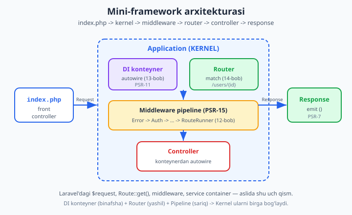
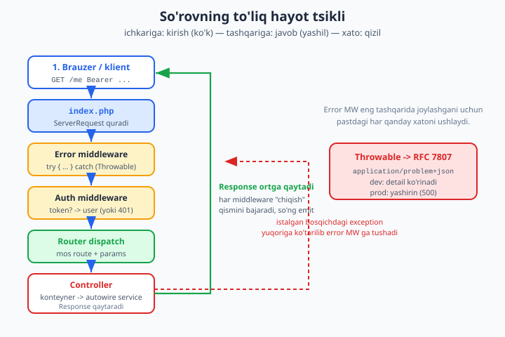

# 15 — O'z mini-frameworkingizni yig'ish

[⬅️ Oldingi: 14 — Routing va front controller](./14-routing.md) · [🏠 README](./README.md) · [Keyingi: 16 — Twig va xavfsiz shablon ➡️](./16-twig-shablon.md)

> **Bu bobda:** Wave 3 ning **cho'qqisiga** chiqamiz — oldingi to'rt bobda alohida qurgan qismlarni (PSR-7 so'rov/javob — 11-bob, PSR-15 middleware pipeline — 12-bob, DI konteyner — 13-bob, router — 14-bob) bitta **kernel** (`Application` sinfi) atrofida birlashtirib, **o'z mini-frameworkimizni** yig'amiz. Avval umumiy arxitekturani ko'ramiz: `index.php` (front controller) `ServerRequest` quradi, uni `Application::handle()` ga beradi, kernel **middleware pipeline -> router dispatch -> kontroller (konteynerdan autowire) -> Response** zanjirini boshqaradi, javob **emit** qilinadi. So'ng har bir bo'lakni kodda quramiz: minimal PSR-7, inline PSR-15/PSR-11 interfeyslar, autowire qiluvchi konteyner, regex router va matryoshka pipeline. **Xato boshqaruvini** jiddiy olamiz: `ErrorMiddleware` istalgan `Throwable` ni **RFC 7807 Problem Details** ga aylantiradi (dev'da batafsil, prod'da yashirin), `AuthMiddleware` esa 03-bobdagi RBAC guard ni pipeline ga ulaydi. Oxirida **to'liq ishlaydigan mini-app** ni (3+ route, JSON va HTML javob, DI bilan service, auth) **jarayon ichida** (`ServerRequest -> Application::handle -> Response`) ishga tushirib tekshiramiz — jonli server shart emas. Nihoyat **Slim / Symfony / Laravel internals** bilan solishtiramiz: "Laravel'da `$request`, `Route::get`, middleware, service container aslida **shu**" — sehrni mexanik tushuntiramiz va "qachon o'z framework, qachon tayyor" savoliga javob beramiz. Bu bob 11–14 boblarga to'g'ridan-to'g'ri tayanadi.

---

## Nega "hammasini birlashtirish" alohida bob?

Wave 3 ning oldingi boblari har biri bitta **mustaqil bo'lak** berdi:

- **11-bob (PSR-7)** — so'rov va javob **immutable obyekt** sifatida: `$request->getHeaderLine('...')`, `$response->withHeader('...')`.
- **12-bob (PSR-15)** — **middleware pipeline**: so'rovni o'rab oluvchi, bir-biriga ulanadigan qatlamlar (`MiddlewareInterface`, `RequestHandlerInterface`).
- **13-bob (DI konteyner)** — bog'liqliklarni **avtomatik yechuvchi** (autowire) konteyner (`Container`, PSR-11).
- **14-bob (router)** — URL ni kontrollerga **bog'lovchi** front controller (`/users/{id}` -> metod).

Ularning har biri ajoyib, lekin alohida turganda **ilova emas**. Ulardan ilova chiqishi uchun kimdir "rejissyorlik" qilishi kerak: so'rov kelganda **avval** middleware pipeline'dan o'tkazib, **keyin** router'dan mos route topib, **so'ng** konteynerdan kontrollerni autowire qilib, oxirida javobni qaytaradigan markaziy sinf. O'sha sinf — **kernel** (biznikida `Application`).

> **Asosiy g'oya:** framework — bu sehr emas. U **uchta oddiy mexanizm** (konteyner + router + pipeline) ni **bitta oqimga** bog'laydigan ~150 qatorlik kod. Buni o'z qo'lingiz bilan yozsangiz, Laravel yoki Symfony ichidagi "sehr" mexanik aniqlikka aylanadi — bu intervyuda ham, real debug'da ham bebaho.



Diagrammada uchta rangli quti — **DI konteyner** (binafsha), **Router** (yashil), **Middleware pipeline** (sariq) — kernel ichida birga ishlaydi. `index.php` so'rov quradi, kernel uni pipeline orqali kontrollerga olib boradi, kontroller `Response` qaytaradi, u emit qilinadi.

---

## 1-qism: PSR-7 — minimal so'rov va javob

Boshlash uchun so'rov va javob obyektlari kerak. To'liq PSR-7 paketi katta (`nyholm/psr7`), lekin frameworkning **mexanikasini** ko'rsatish uchun bizga uchta narsa yetadi: so'rovdan **header** o'qish, so'rovga **atribut** biriktirish (auth middleware foydalanuvchini shu yerga qo'yadi) va javobni **immutable** qurish. 11-bobdagi immutability tamoyilini saqlaymiz: `withX()` metodlari **yangi nusxa** qaytaradi.

```php
<?php

declare(strict_types=1);

// PSR-7 ning bizga kerakli minimal qismi (illustrativ).
// Haqiqiy loyihada: composer require nyholm/psr7
interface MessageInterface
{
    public function getHeaders(): array;
    public function getHeaderLine(string $name): string;
    public function withHeader(string $name, string $value): static;
    public function getBody(): string;
}

final class ServerRequest implements MessageInterface
{
    /** @var array<string,mixed> ixtiyoriy atributlar (router/auth shu yerga yozadi) */
    private array $attributes = [];

    public function __construct(
        public readonly string $method,
        public readonly string $path,
        private array $headers = [],
        private string $body = '',
        public readonly array $query = [],
    ) {}

    public function getHeaders(): array
    {
        return $this->headers;
    }

    public function getHeaderLine(string $name): string
    {
        // Header nomlari katta-kichik harfga befarq -> kalitni kichraytiramiz.
        return $this->headers[strtolower($name)] ?? '';
    }

    public function withHeader(string $name, string $value): static
    {
        $clone = clone $this;                     // immutable: yangi nusxa
        $clone->headers[strtolower($name)] = $value;
        return $clone;
    }

    public function getBody(): string
    {
        return $this->body;
    }

    /** Atribut o'qish (masalan, autentifikatsiya qilingan foydalanuvchi). */
    public function getAttribute(string $name, mixed $default = null): mixed
    {
        return $this->attributes[$name] ?? $default;
    }

    /** Immutable: atribut qo'shilgan YANGI so'rov qaytaradi. */
    public function withAttribute(string $name, mixed $value): static
    {
        $clone = clone $this;
        $clone->attributes[$name] = $value;
        return $clone;
    }
}
```

Javob ham xuddi shunday immutable, lekin unga ikkita qulay **fabrika** qo'shamiz — `json()` va `html()` — chunki bizning mini-app JSON ham, HTML ham qaytaradi:

```php
<?php

declare(strict_types=1);

final class Response implements MessageInterface
{
    public function __construct(
        public readonly int $status = 200,
        private array $headers = [],
        private string $body = '',
    ) {}

    public function getHeaders(): array
    {
        return $this->headers;
    }

    public function getHeaderLine(string $name): string
    {
        return $this->headers[strtolower($name)] ?? '';
    }

    public function withHeader(string $name, string $value): static
    {
        $clone = clone $this;
        $clone->headers[strtolower($name)] = $value;
        return $clone;
    }

    public function getStatus(): int
    {
        return $this->status;
    }

    public function getBody(): string
    {
        return $this->body;
    }

    /** JSON javob fabrikasi (Content-Type bilan birga). */
    public static function json(mixed $data, int $status = 200): self
    {
        $json = json_encode($data, JSON_UNESCAPED_UNICODE | JSON_PRETTY_PRINT);
        return new self($status, ['content-type' => 'application/json; charset=utf-8'], $json);
    }

    /** HTML javob fabrikasi. */
    public static function html(string $html, int $status = 200): self
    {
        return new self($status, ['content-type' => 'text/html; charset=utf-8'], $html);
    }
}
```

> **Eslatma:** bu — **soddalashtirilgan** PSR-7. Haqiqiy `ResponseInterface` da `getStatusCode()`, `StreamInterface` body, `withStatus()` va boshqalar bor. Biz mexanikaga e'tibor qaratamiz; frameworkning mantiqi bir xil qoladi. To'liq PSR-7 uchun **16-bobda** `nyholm/psr7` bilan ishlaymiz.

---

## 2-qism: PSR-15 — middleware kontrakti (inline)

Pipeline yadrosi PSR-15 ning ikki interfeysiga tayanadi. Ularni **inline** ko'rsatamiz, toki o'quvchi kontraktni ko'rsin (real loyihada `composer require psr/http-server-middleware`):

```php
<?php

declare(strict_types=1);

// PSR-15 (psr/http-server-handler + psr/http-server-middleware) kontrakti.
interface RequestHandlerInterface
{
    public function handle(ServerRequest $request): Response;
}

interface MiddlewareInterface
{
    // So'rovni qabul qiladi; ish qiladi; $handler ga uzatadi YOKI erta javob qaytaradi.
    public function process(ServerRequest $request, RequestHandlerInterface $handler): Response;
}
```

Bu ikki interfeys — butun pipeline'ning **butun shartnomasi**. Middleware ikki ish qila oladi: (1) `$handler->handle($request)` ni chaqirib **ichkariga uzatish**, (2) `$handler` ni chaqirmasdan **erta javob qaytarish** (masalan, auth muvaffaqiyatsiz bo'lsa 401). 12-bobda bu "piyoz" (onion) tartibini batafsil ko'rgandik.

### Pipeline tartibi: "piyoz" eslatmasi

Tartibni mustahkamlash uchun kichik mustaqil misol (uni alohida ishga tushirib ko'ring):

```php
<?php
declare(strict_types=1);

interface Handler { public function handle(string $req): string; }
interface Mw { public function process(string $req, Handler $next): string; }

final class LogMw implements Mw {
    public function __construct(private string $tag) {}
    public function process(string $req, Handler $next): string {
        echo ">> kirish: {$this->tag}\n";
        $res = $next->handle($req);          // ichkariga uzatadi
        echo "<< chiqish: {$this->tag}\n";
        return $res . " [{$this->tag}]";     // qaytishda javobni o'raydi
    }
}

final class Dispatcher implements Handler {
    /** @param Mw[] $stack */
    public function __construct(private array $stack, private Handler $final) {}
    public function handle(string $req): string {
        if ($this->stack === []) return $this->final->handle($req);
        $mw = array_shift($this->stack);
        return $mw->process($req, new self($this->stack, $this->final));
    }
}

final class Core implements Handler {
    public function handle(string $req): string { echo "** YADRO **\n"; return "javob"; }
}

$d = new Dispatcher([new LogMw('A'), new LogMw('B')], new Core());
echo "Natija: " . $d->handle("so'rov") . "\n";
```

Ishga tushirsangiz, aniq shu chiqadi:

```text
>> kirish: A
>> kirish: B
** YADRO **
<< chiqish: B
<< chiqish: A
Natija: javob [B] [A]
```

So'rov **tashqaridan ichkariga** (A -> B -> yadro), javob esa **ichkaridan tashqariga** (B -> A) yuradi. **Birinchi qo'shilgan middleware oxirgi bo'lib javobni ko'radi** — shuning uchun `ErrorMiddleware` ni **eng birinchi** (eng tashqi) qatlam qilamiz: u pastdagi **barcha** xatolarni ushlay oladi.

---

## 3-qism: DI konteyner — autowire bilan (PSR-11)

13-bobdagi konteyner mexanizmini eslatib, frameworkga ulanadigan ko'rinishda quramiz. Kalit imkoniyat — **autowire**: agar `Container::get('UserController')` so'ralsa-yu, ro'yxatga olinmagan bo'lsa, konteyner Reflection bilan uning konstruktorini o'qib, har bir parametrni **rekursiv** o'zi yechadi (bu mexanizm 08-bobdagi Reflection ga tayanadi).

```php
<?php

declare(strict_types=1);

// PSR-11 (psr/container) kontrakti — inline.
interface NotFoundExceptionInterface extends \Throwable {}
final class NotFoundException extends \RuntimeException implements NotFoundExceptionInterface {}

interface ContainerInterface
{
    public function get(string $id): mixed;
    public function has(string $id): bool;
}

final class Container implements ContainerInterface
{
    /** @var array<string,\Closure> qo'lda ro'yxatga olingan fabrikalar */
    private array $factories = [];
    /** @var array<string,mixed> bir marta yaratilgan (singleton) nusxalar */
    private array $instances = [];

    public function set(string $id, \Closure $factory): void
    {
        $this->factories[$id] = $factory;
        unset($this->instances[$id]);
    }

    public function has(string $id): bool
    {
        return isset($this->factories[$id]) || class_exists($id);
    }

    public function get(string $id): mixed
    {
        if (isset($this->instances[$id])) {
            return $this->instances[$id];          // singleton: qayta ishlatamiz
        }
        if (isset($this->factories[$id])) {
            return $this->instances[$id] = ($this->factories[$id])($this);
        }
        if (class_exists($id)) {
            return $this->instances[$id] = $this->autowire($id);  // sehr shu yerda
        }
        throw new NotFoundException("Xizmat topilmadi: {$id}");
    }

    /** Konstruktor parametrlarini Reflection orqali avtomatik to'ldiradi. */
    private function autowire(string $class): object
    {
        $ctor = (new \ReflectionClass($class))->getConstructor();
        if ($ctor === null) {
            return new $class();                   // konstruktor yo'q -> oddiy new
        }
        $args = [];
        foreach ($ctor->getParameters() as $param) {
            $type = $param->getType();
            if ($type instanceof \ReflectionNamedType && !$type->isBuiltin()) {
                $args[] = $this->get($type->getName());   // bog'liqlikni rekursiv yechadi
            } elseif ($param->isDefaultValueAvailable()) {
                $args[] = $param->getDefaultValue();
            } else {
                throw new NotFoundException(
                    "Avtowire qila olmadim: {$class}::\${$param->getName()}"
                );
            }
        }
        return new $class(...$args);
    }
}
```

Autowire ning kuchini ko'rish uchun mustaqil misol (uni ishga tushiring):

```php
<?php
declare(strict_types=1);
// ... yuqoridagi Container va interfeyslar shu yerda bo'lsin ...

final class Db { public string $dsn = 'sqlite::memory:'; }
final class Repo { public function __construct(public Db $db) {} }
final class Service { public function __construct(public Repo $repo) {} }

$c = new Container();
$svc = $c->get(Service::class);          // Service -> Repo -> Db avtomatik qurildi!
echo $svc->repo->db->dsn, "\n";          // sqlite::memory:
var_dump($c->get(Service::class) === $svc);  // bool(true) -> singleton
```

`get(Service::class)` ni so'radik — konteyner `Service` konstruktorida `Repo` kerakligini ko'rdi, `Repo` ni qurish uchun `Db` kerakligini ko'rdi, hammasini **o'zi** zanjirma-zanjir yasadi. Biz hech qaerda `new Db()` yozmadik. **Laravel'dagi "service container" aynan shu** — sinfni so'raysiz, u bog'liqliklarni o'zi keltiradi.

---

## 4-qism: Router — regex bilan moslash

14-bobdagi routerni frameworkga moslab quramiz. Har bir route — `method`, `pattern`, `handler` (`[Controller::class, 'metod']`) va **o'ziga xos middleware** ro'yxati. Router muhim detalni hisobga oladi: agar **yo'l** mos kelsa-yu, **metod** mos kelmasa — bu 404 emas, **405 Method Not Allowed**.

```php
<?php

declare(strict_types=1);

final class Route
{
    public function __construct(
        public readonly string $method,
        public readonly string $pattern,
        public readonly mixed $handler,           // [Controller::class, 'metod']
        public readonly array $middleware = [],   // shu route'ga xos middleware id'lari
    ) {}
}

final class Router
{
    /** @var Route[] */
    private array $routes = [];

    public function add(string $method, string $pattern, mixed $handler, array $middleware = []): void
    {
        $this->routes[] = new Route(strtoupper($method), $pattern, $handler, $middleware);
    }

    public function get(string $p, mixed $h, array $m = []): void { $this->add('GET', $p, $h, $m); }
    public function post(string $p, mixed $h, array $m = []): void { $this->add('POST', $p, $h, $m); }

    /**
     * So'rovga mos route topadi.
     * @return array{0:Route,1:array<string,string>}|array{0:'405',1:array}|null
     */
    public function match(ServerRequest $request): ?array
    {
        $pathMatched = false;
        foreach ($this->routes as $route) {
            if (preg_match($this->toRegex($route->pattern), $request->path, $m) === 1) {
                $pathMatched = true;
                if ($route->method === $request->method) {
                    // Faqat nomli ({id} kabi) parametrlarni qoldiramiz.
                    $params = array_filter($m, 'is_string', ARRAY_FILTER_USE_KEY);
                    return [$route, $params];
                }
            }
        }
        if ($pathMatched) {
            return ['405', []];      // yo'l bor, metod yo'q -> 405
        }
        return null;                 // yo'l ham yo'q -> 404
    }

    /** "/users/{id}" -> "#^/users/(?P<id>[^/]+)$#" */
    private function toRegex(string $pattern): string
    {
        $regex = preg_replace('#\{(\w+)\}#', '(?P<$1>[^/]+)', $pattern);
        return '#^' . $regex . '$#';
    }
}
```

---

## 5-qism: pipeline yadrosi — middleware'larni route'ga bog'lash

Endi eng nozik qism: middleware pipeline'ning **oxiri** route handler'ni chaqirishi kerak. Buning uchun ikki `RequestHandlerInterface` implementatsiyasi yozamiz:

- **`RouteRunner`** — pipeline oxiri. U kontrollerni **konteynerdan autowire** qilib, mos metodni chaqiradi.
- **`MiddlewareDispatcher`** — middleware'larni matryoshka qilib bir-biriga ulaydi (12-bobdagi `Dispatcher` ning aniq nusxasi).

```php
<?php

declare(strict_types=1);

/** Pipeline oxiri: route handler'ni konteynerdan autowire qilib chaqiradi. */
final class RouteRunner implements RequestHandlerInterface
{
    public function __construct(
        private readonly Container $container,
        private readonly mixed $handler,    // [Controller::class, 'metod']
        private readonly array $params,
    ) {}

    public function handle(ServerRequest $request): Response
    {
        [$class, $method] = $this->handler;
        $controller = $this->container->get($class);   // <-- autowire shu yerda
        return $controller->$method($request, $this->params);
    }
}

/** Middleware'larni ketma-ket bog'lovchi handler (matryoshka). */
final class MiddlewareDispatcher implements RequestHandlerInterface
{
    /** @param MiddlewareInterface[] $stack */
    public function __construct(
        private array $stack,
        private readonly RequestHandlerInterface $final,
    ) {}

    public function handle(ServerRequest $request): Response
    {
        if ($this->stack === []) {
            return $this->final->handle($request);     // pipeline tugadi -> route
        }
        $middleware = array_shift($this->stack);
        $next = new self($this->stack, $this->final);  // qolgan stack -> keyingi handler
        return $middleware->process($request, $next);
    }
}
```

> **Diqqat:** `RouteRunner::handle()` da `$this->container->get($class)` chaqiruvi butun frameworkning **belidagi tugun**: aynan shu joyda **router** (qaysi kontroller) va **konteyner** (kontrollerni qanday qurish) birlashadi. Laravel route'ni controller'ga `Route::get('/x', [Ctrl::class, 'm'])` deb bog'laganda, ichkarida xuddi shunday — controller'ni o'zining konteyneridan oladi.

---

## 6-qism: KERNEL — `Application` sinfi

Mana cho'qqi. `Application` — barcha bo'laklarni bog'laydigan **kernel**. Uning yagona umumiy metodi `handle(ServerRequest): Response`:

1. Router'dan mos route topadi (yo'q bo'lsa 404, metod mos kelmasa 405 — **Problem Details** formatida).
2. Route'ga xos middleware'larni konteynerdan oladi va global middleware bilan birlashtiradi.
3. `RouteRunner` ni pipeline oxiriga qo'yib, `MiddlewareDispatcher` ni ishga tushiradi.

```php
<?php

declare(strict_types=1);

final class Application
{
    /** @param MiddlewareInterface[] $globalMiddleware har so'rovga qo'llanadi */
    public function __construct(
        private readonly Container $container,
        private readonly Router $router,
        private array $globalMiddleware = [],
    ) {}

    public function handle(ServerRequest $request): Response
    {
        $match = $this->router->match($request);

        if ($match === null) {                         // mos yo'l yo'q
            return $this->problem('Not Found', 404);
        }
        if ($match[0] === '405') {                      // yo'l bor, metod yo'q
            return $this->problem('Method Not Allowed', 405);
        }

        [$route, $params] = $match;

        // Route middleware id'larini konteynerdan haqiqiy obyektga aylantiramiz.
        $routeMiddleware = array_map(
            fn(string $id): MiddlewareInterface => $this->container->get($id),
            $route->middleware
        );
        $stack = [...$this->globalMiddleware, ...$routeMiddleware];

        $runner = new RouteRunner($this->container, $route->handler, $params);
        $dispatcher = new MiddlewareDispatcher($stack, $runner);

        return $dispatcher->handle($request);
    }

    /** Router darajasidagi xatolar uchun RFC 7807 Problem Details. */
    private function problem(string $title, int $status): Response
    {
        return Response::json(
            ['type' => 'about:blank', 'title' => $title, 'status' => $status],
            $status
        )->withHeader('content-type', 'application/problem+json');
    }
}
```

Diqqat qiling: kernelda **biror biznes-logika yo'q**. U faqat **rejissyor**: kim kimni qachon chaqirishini boshqaradi. Butun "framework"ning mohiyati shu ~40 qatorda.

---

## 7-qism: Xato boshqaruvi — `ErrorMiddleware` (RFC 7807)

Eng muhim production-detal: **istalgan** joyda otilgan `Throwable` foydalanuvchiga **chiroyli, standart** javob bo'lib qaytishi kerak — oq ekran yoki stack-trace emas. Buni middleware bilan qilamiz, chunki middleware butun pipeline'ni `try/catch` ga o'rashi mumkin. Format — 01-bobdagi **RFC 7807 Problem Details** (`application/problem+json`).

Dev/prod farqi muhim: **dev**'da to'liq tafsilot (`detail`, `exception`) ko'rsatamiz, **prod**'da 500 xatolarda ichki ma'lumotni **yashiramiz** (foydalanuvchiga faqat "Internal Server Error").

```php
<?php

declare(strict_types=1);

/** Boshqariladigan HTTP xato (aniq status bilan). */
class HttpException extends \RuntimeException
{
    public function __construct(public readonly int $status, string $message)
    {
        parent::__construct($message);
    }
}

final class ErrorMiddleware implements MiddlewareInterface
{
    public function __construct(private readonly bool $debug = false) {}

    public function process(ServerRequest $request, RequestHandlerInterface $handler): Response
    {
        try {
            return $handler->handle($request);     // butun pastki pipeline shu yerda
        } catch (\Throwable $e) {
            $status = $e instanceof HttpException ? $e->status : 500;
            $problem = [
                'type'   => 'about:blank',
                'title'  => $e instanceof HttpException ? $e->getMessage() : 'Internal Server Error',
                'status' => $status,
            ];
            if ($this->debug && $status >= 500) {
                // Faqat dev'da: ichki tafsilot. Prod'da yashirin (ma'lumot sizib chiqmasin).
                $problem['detail'] = $e->getMessage();
                $problem['exception'] = $e::class;
            }
            return Response::json($problem, $status)
                ->withHeader('content-type', 'application/problem+json');
        }
    }
}
```

> **Nega `ErrorMiddleware` eng tashqi qatlam?** "Piyoz" tartibida birinchi qo'shilgan middleware oxirgi bo'lib chiqadi va u o'rab olgan **hamma narsa** uning `try` ichida bo'ladi. Shuning uchun kernelda uni `globalMiddleware` ning **birinchi** elementi qilamiz — shunda auth, router va kontroller'dagi har qanday xato unga tushadi. (`HttpException(401)` ham xuddi shu yo'l bilan ushlanadi va to'g'ri statusga aylanadi.)



---

## 8-qism: Auth middleware — RBAC guard'ni ulash (03-bobdan)

03-bobda **guard** g'oyasini ko'rgandik: so'rovni amalga qo'yishdan oldin "kimsan?" (401) va "huquqing bormi?" (403) ni tekshirish. Endi uni **PSR-15 middleware** sifatida pipeline'ga ulaymiz. U tokenni tekshiradi, topilmasa `HttpException(401)` otadi (uni `ErrorMiddleware` ushlaydi), topilsa foydalanuvchini so'rovga **atribut** sifatida biriktiradi — shunda kontroller `$request->getAttribute('user')` bilan oladi.

```php
<?php

declare(strict_types=1);

final class AuthMiddleware implements MiddlewareInterface
{
    /** @param array<string,array{id:int,role:string}> $tokens token -> foydalanuvchi */
    public function __construct(private readonly array $tokens) {}

    public function process(ServerRequest $request, RequestHandlerInterface $handler): Response
    {
        $auth = $request->getHeaderLine('authorization');
        $token = str_starts_with($auth, 'Bearer ') ? substr($auth, 7) : '';

        if (!isset($this->tokens[$token])) {
            throw new HttpException(401, 'Unauthorized');   // ErrorMiddleware ushlaydi
        }
        // Foydalanuvchini so'rovga biriktiramiz (immutable -> yangi so'rov).
        $request = $request->withAttribute('user', $this->tokens[$token]);
        return $handler->handle($request);
    }
}
```

Real loyihada bu yerda 04-bobdagi **JWT** ni dekod qilasiz yoki bazadan sessiyani o'qiysiz; agar 403 kerak bo'lsa (huquq yetmasa), `HttpException(403, 'Forbidden')` otasiz. Mexanika o'zgarmaydi.

---

## 9-qism: Service'lar va kontrollerlar

Frameworkning "foydalanuvchi kodi" qismi — DI bilan inject qilinadigan **service**'lar va **kontroller**'lar. Diqqat: kontroller konstruktorida shunchaki tipni so'raydi (`GreetingService $greeting`) — konteyner uni o'zi keltiradi.

```php
<?php

declare(strict_types=1);

/* --- Service'lar (DI bilan inject qilinadi) --- */

final class GreetingService
{
    public function greet(string $name): string
    {
        return "Salom, {$name}!";
    }
}

final class UserRepository
{
    /** @var array<int,array{id:int,name:string}> (real loyihada PDO) */
    private array $users = [
        1 => ['id' => 1, 'name' => 'Laylo'],
        2 => ['id' => 2, 'name' => 'Sardor'],
    ];

    public function find(int $id): ?array
    {
        return $this->users[$id] ?? null;
    }
}

/* --- Kontrollerlar --- */

final class HomeController
{
    // GreetingService konteyner tomonidan autowire qilinadi.
    public function __construct(private readonly GreetingService $greeting) {}

    public function index(ServerRequest $request, array $params): Response
    {
        return Response::html("<h1>{$this->greeting->greet('Dunyo')}</h1>");
    }
}

final class UserController
{
    public function __construct(private readonly UserRepository $repo) {}

    public function show(ServerRequest $request, array $params): Response
    {
        $id = (int) ($params['id'] ?? 0);
        $user = $this->repo->find($id);
        if ($user === null) {
            throw new HttpException(404, 'User Not Found');   // -> Problem Details
        }
        return Response::json($user);
    }

    public function me(ServerRequest $request, array $params): Response
    {
        // Auth middleware bu atributni qo'ygan.
        $user = $request->getAttribute('user');
        return Response::json(['authenticated' => true, 'user' => $user]);
    }
}

final class BoomController
{
    public function crash(ServerRequest $request, array $params): Response
    {
        // Ataylab: kutilmagan xato. ErrorMiddleware uni 500 ga aylantirishi kerak.
        throw new \LogicException('Bu ataylab portlash - error middleware ushlashi kerak');
    }
}
```

---

## 10-qism: Bootstrap/config — service va route'larni ro'yxatga olish

Endi hammasini bir joyda **ulaymiz**: konteynerga service'larni, routerga route'larni, kernelga global middleware'ni ro'yxatdan o'tkazamiz. Bu — Laravel'dagi `routes/web.php` + service provider'larning soddalashtirilgan analogi.

```php
<?php

declare(strict_types=1);

function bootstrap(bool $debug): Application
{
    $container = new Container();

    // Service'lar (singleton fabrikalari).
    $container->set(GreetingService::class, fn() => new GreetingService());
    $container->set(UserRepository::class, fn() => new UserRepository());

    // Auth middleware (token jadvali bilan).
    $container->set(AuthMiddleware::class, fn() => new AuthMiddleware([
        'sirli-token-123' => ['id' => 1, 'role' => 'admin'],
    ]));

    // Route'lar. /me marshruti AuthMiddleware bilan himoyalangan.
    $router = new Router();
    $router->get('/', [HomeController::class, 'index']);
    $router->get('/users/{id}', [UserController::class, 'show']);
    $router->get('/me', [UserController::class, 'me'], [AuthMiddleware::class]);
    $router->get('/boom', [BoomController::class, 'crash']);

    // Global middleware: ErrorMiddleware eng tashqi (birinchi) qatlam.
    return new Application($container, $router, [new ErrorMiddleware($debug)]);
}
```

### Haqiqiy `index.php` (front controller) skeleti

Jonli serverda kirish nuqtasi shunday ko'rinadi. Bu blok faqat web-server ostida mazmunli (in-process testda emit o'rniga `Response` ni bevosita tekshiramiz):

```php
<?php

declare(strict_types=1);

// require __DIR__ . '/../vendor/autoload.php';   // Composer autoload

// 1. Bootstrap (dev'mi yoki prod'mi?).
// $app = bootstrap(debug: getenv('APP_ENV') !== 'prod');

// 2. Global'lardan ($_SERVER, php://input) ServerRequest qurish.
// $request = ServerRequestFactory::fromGlobals();

// 3. Kernel orqali javob olish.
// $response = $app->handle($request);

// 4. Javobni emit qilish (brauzerga yuborish).
final class Emitter
{
    public static function emit(Response $response): void
    {
        http_response_code($response->getStatus());
        foreach ($response->getHeaders() as $name => $value) {
            header("{$name}: {$value}", true);
        }
        echo $response->getBody();
    }
}
// Emitter::emit($response);
```

---

## 11-qism: To'liq mini-app'ni JARAYON ICHIDA ishga tushirish

Endi eng qiziq qism: jonli server **ko'tarmasdan**, butun frameworkni **jarayon ichida** sinaymiz. Bu — frameworklarni test qilishning standart usuli (Laravel/Symfony funksional testlari ham aynan shunday `$response = $app->handle($request)` qiladi). Yuqoridagi **barcha bloklar** (PSR-7, PSR-15, konteyner, router, pipeline, kernel, middleware'lar, service va kontrollerlar, bootstrap) bitta faylda turibdi deb faraz qiling, va oxiriga shu qism qo'shiladi:

```php
<?php
declare(strict_types=1);
// ... yuqoridagi BARCHA bloklar shu faylda ...

$app = bootstrap(debug: true);

function simulate(Application $app, ServerRequest $req): void
{
    $res = $app->handle($req);
    echo sprintf(
        "%-4s %-14s -> %d  [%s]\n",
        $req->method,
        $req->path,
        $res->getStatus(),
        $res->getHeaderLine('content-type')
    );
    echo '    ' . str_replace("\n", "\n    ", trim($res->getBody())) . "\n\n";
}

echo "=== Mini-framework: in-process so'rovlar ===\n\n";

simulate($app, new ServerRequest('GET', '/'));                                    // HTML 200
simulate($app, new ServerRequest('GET', '/users/1'));                             // JSON 200
simulate($app, new ServerRequest('GET', '/users/999'));                           // 404
simulate($app, new ServerRequest('GET', '/me'));                                  // 401 (tokensiz)
simulate($app, new ServerRequest('GET', '/me', ['authorization' => 'Bearer sirli-token-123'])); // 200
simulate($app, new ServerRequest('POST', '/users/1'));                            // 405
simulate($app, new ServerRequest('GET', '/yoq'));                                 // 404
simulate($app, new ServerRequest('GET', '/boom'));                                // 500 + debug detail
```

Ishga tushirilganda (ushbu bobdagi kod **haqiqatan** `php` bilan tekshirilgan) aynan shu chiqadi:

```text
=== Mini-framework: in-process so'rovlar ===

GET  /              -> 200  [text/html; charset=utf-8]
    <h1>Salom, Dunyo!</h1>

GET  /users/1       -> 200  [application/json; charset=utf-8]
    {
        "id": 1,
        "name": "Laylo"
    }

GET  /users/999     -> 404  [application/problem+json]
    {
        "type": "about:blank",
        "title": "User Not Found",
        "status": 404
    }

GET  /me            -> 401  [application/problem+json]
    {
        "type": "about:blank",
        "title": "Unauthorized",
        "status": 401
    }

GET  /me            -> 200  [application/json; charset=utf-8]
    {
        "authenticated": true,
        "user": {
            "id": 1,
            "role": "admin"
        }
    }

POST /users/1       -> 405  [application/problem+json]
    {
        "type": "about:blank",
        "title": "Method Not Allowed",
        "status": 405
    }

GET  /yoq           -> 404  [application/problem+json]
    {
        "type": "about:blank",
        "title": "Not Found",
        "status": 404
    }

GET  /boom          -> 500  [application/problem+json]
    {
        "type": "about:blank",
        "title": "Internal Server Error",
        "status": 500,
        "detail": "Bu ataylab portlash - error middleware ushlashi kerak",
        "exception": "LogicException"
    }
```

Bu chiqishni o'qing — har qatorda **butun frameworkning bir imkoniyati** ko'rinadi:

- `GET /` — **HTML** javob, `GreetingService` **autowire** bo'lib kontrollerga inject qilindi.
- `GET /users/1` — **JSON** javob, `UserRepository` autowire.
- `GET /users/999` — kontroller `HttpException(404)` otdi -> **Problem Details**.
- `GET /me` (tokensiz) — `AuthMiddleware` 401 otdi -> guard ishladi.
- `GET /me` (Bearer token) — auth o'tdi, foydalanuvchi **atribut** orqali kontrollerga yetdi.
- `POST /users/1` — yo'l bor, metod yo'q -> **405**.
- `GET /yoq` — yo'l yo'q -> **404**.
- `GET /boom` — kutilmagan `LogicException` -> **500**, dev'da `detail` ko'rinadi (prod'da yashirin bo'lardi).

Bir o'qishda: **router + DI autowire + middleware pipeline + auth guard + RFC 7807 xato boshqaruvi + JSON/HTML** — hammasi ~250 qatorda, jonli server'siz, to'liq ishlaydi.

---

## 12-qism: Slim / Symfony / Laravel internals bilan solishtirish

Endi eng qimmatli xulosa. Siz qurgan mexanizmlar — **aynan** sanoat frameworklari ichidagi mexanizmlar. Faqat ular yanada sayqallangan, optimallashtirilgan va xususiyatga boy. Mana to'g'ridan-to'g'ri xarita:

| Bizning kod | Slim 4 | Symfony | Laravel |
|---|---|---|---|
| `ServerRequest` (PSR-7) | PSR-7 (nyholm/slim-psr7) | `Request` (HttpFoundation) | `Illuminate\Http\Request` |
| `Application::handle()` | `App::handle()` | `HttpKernel::handle()` | `Kernel::handle()` |
| `MiddlewareDispatcher` (PSR-15) | PSR-15 middleware | `RequestStack` + listeners | middleware "pipeline" |
| `Container` (autowire) | PSR-11 (PHP-DI) | Symfony DI Container | service container (`app()`) |
| `Router::match()` | `RouteCollector` (FastRoute) | Symfony Routing | `Route::get(...)` |
| `[Ctrl::class, 'm']` handler | route'ga callable | controller resolver | controller'ni konteynerdan oladi |
| `ErrorMiddleware` (RFC 7807) | `ErrorMiddleware` | `ExceptionListener` | `Handler::render()` |
| `AuthMiddleware` | middleware | Security firewall | `auth` middleware |
| `$request->getAttribute('user')` | request attribute | `$request->attributes` | `$request->user()` |

Ya'ni Laravel'da yozadigan tanish kod aslida nima qilishini endi **mexanik** tushunasiz:

```php
// Laravel:
Route::get('/users/{id}', [UserController::class, 'show'])->middleware('auth');

// Ichkarida (soddalashtirilgan) — aynan biz qurgan narsa:
// 1. Router /users/{id} ni topadi, {id} ni ajratadi.
// 2. 'auth' middleware pipeline'ga qo'shiladi (bizning AuthMiddleware kabi).
// 3. UserController service container'dan autowire bo'ladi (bizning Container kabi).
// 4. show() chaqiriladi, javob (Response) middleware'lar orqali ortga qaytadi.
```

```php
// Laravel kontrollerida:
public function show(Request $request, int $id) { ... }
// $request -> bizning ServerRequest. type-hint qilingan service'lar -> autowire.
```

> **Intervyu uchun:** "Laravel'da `$request` qayerdan keladi?" degan savolga endi "PHP super-global'lardan (`$_SERVER`, `php://input`) `ServerRequest` quriladi va kernel uni middleware pipeline orqali kontrollerga uzatadi" deya olasiz. "Middleware qanday ishlaydi?" — "PSR-15 piyoz: har qatlam so'rovni keyingisiga uzatadi yoki erta javob qaytaradi." "Service container nima?" — "Reflection bilan konstruktor bog'liqliklarini rekursiv yechadigan autowire konteyner." **Sehr emas — mexanika.**

### Qachon o'z framework, qachon tayyor?

To'g'ridan-to'g'ri javob: **deyarli har doim — tayyor framework** (Laravel, Symfony, yoki Slim/Mezzio mikro-framework). Sabablari:

- **Xavfsizlik** — tayyor framework yillar davomida auditdan o'tgan; siz CSRF, XSS, SQL-injection himoyasini noldan to'g'ri yozolmaysiz.
- **Ekotizim** — minglab paketlar (auth, queue, ORM, mailer) tayyor ulanadi.
- **Jamoa** — yangi dasturchi Laravel'ni biladi; sizning o'z frameworkingizni o'rganishi kerak.
- **Texnik qarz** — o'z frameworkingizni qo'llab-quvvatlash, hujjatlash, yangilash — bu doimiy yuk.

**Lekin** — bu bobni yozish vaqtingiz behuda ketmadi, aksincha bebaho:

- **Ichini bilish** production'da debug qilishni butunlay o'zgartiradi: "middleware tartibi noto'g'ri", "service singleton emas", "route konfliktda" kabi muammolarni **darrov** topasiz.
- **Mikro-framework** (Slim/Mezzio) tanlaganingizda yoki o'z paketingizni yozganingizda PSR-15/PSR-11 ni qo'lda ishlatasiz.
- Kichik, maxsus xizmatlar (bitta webhook qabul qiluvchi, lambda funksiya) uchun ba'zan ~200 qatorlik o'z kerneling Laravel'dan tezroq va yengilroq.

> **Oltin qoida:** mahsulot uchun **tayyor framework ishlat**, lekin uning **ichini o'z qo'ling bilan bir marta yozib ko'r**. Ikkinchisi birinchisini ming barobar yaxshiroq foydalanuvchiga aylantiradi.

---

## Yakuniy xulosa

- **Framework — uchta mexanizmni bog'lovchi kernel:** DI konteyner (qanday qurish) + router (qaysi kontroller) + middleware pipeline (qanday o'rash). Bizning `Application::handle()` ~40 qatorda hammasini birlashtirdi.
- **Oqim har doim bir xil:** `index.php` -> `ServerRequest` -> middleware pipeline -> router dispatch -> kontroller (autowire) -> `Response` -> emit.
- **Xato boshqaruvi middleware bilan:** `ErrorMiddleware` eng tashqi qatlam bo'lib, istalgan `Throwable` ni **RFC 7807 Problem Details** ga aylantiradi — dev'da batafsil, prod'da yashirin.
- **PSR'lar bog'lovchi yelim:** PSR-7 (so'rov/javob), PSR-15 (middleware), PSR-11 (konteyner) — shu kontraktlar tufayli bo'laklar bir-biriga toza ulanadi (10-bob).
- **In-process test** jonli serversiz ishonchni beradi: `$response = $app->handle($request)`.
- **Sanoat frameworklari aynan shu** — Slim/Symfony/Laravel ichida ham xuddi shu kernel + pipeline + container. Endi "sehr" siz uchun mexanika.
- **Production'da tayyor framework ishlat**, lekin ichini bilganing uchun uni chuqurroq egallaysan.

Keyingi bobda (**16-bob**) shu mini-framework ustiga **Twig** shablon mexanizmini ulaymiz — HTML javoblarni xavfsiz (auto-escaping bilan) va tartibli renderlash uchun.

---

## Mashqlar

### Oson

**1.** `Application` ga yangi `GET /salom/{ism}` route'ini qo'shing, u `Response::json(['salom' => $ism])` qaytarsin. `{ism}` ni route parametridan oling. Qaysi mavjud kontrollerga metod qo'shasiz?

**2.** `ErrorMiddleware` da `debug` `false` bo'lganda `GET /boom` qaysi JSON ni qaytaradi? `detail` va `exception` maydonlari bo'ladimi? Nega?

**3.** `simulate($app, new ServerRequest('DELETE', '/users/1'))` qaysi status kod qaytaradi — 404 yoki 405? Nega? (`Router::match()` mantiqiga qarang.)

### O'rta

**4.** Yangi `LoggingMiddleware` yozing: u har so'rovning `method` va `path` ini hamda javob `status` ini chiqarsin (`echo`). Uni **global** middleware qiling, lekin `ErrorMiddleware` dan **keyin** joylashtiring. Tartib nega muhim?

**5.** `AuthMiddleware` ga **403** qo'shing: token to'g'ri bo'lsa-yu, foydalanuvchi `role` `'admin'` bo'lmasa, faqat `/admin/*` route'larida `HttpException(403, 'Forbidden')` otsin. Buni middleware'ning o'zida yoki route konfiguratsiyasida qilasizmi — qaysi biri toza?

**6.** Konteyner hozir `class_exists($id)` bo'lsa avtowire qiladi. Agar autowire qilinayotgan sinf konstruktorida **skalyar** parametr (`int $timeout`) bo'lsa-yu, unga default qiymat bo'lmasa nima bo'ladi? Buni sinab ko'ring va xato xabarini tushuntiring.

### Qiyin

**7.** `Application::handle()` ni shunday o'zgartiringki, **404/405** javoblari ham **middleware pipeline'dan o'tsin** (hozir ular pipeline'ni chetlab o'tadi — masalan `LoggingMiddleware` 404'larni ko'rmaydi). Maslahat: "route topilmadi" holatini ham bir `RequestHandlerInterface` qiling.

**8.** Pipeline'ga **per-route** middleware tartibini sinab ko'ring: `[ErrorMiddleware, AuthMiddleware]` da agar `AuthMiddleware` 401 otsa, javob `application/problem+json` bo'lib qaytishini in-process test bilan tasdiqlang. Endi tartibni teskari qilsangiz (`[AuthMiddleware, ErrorMiddleware]`) nima buziladi?

<details markdown="1"><summary>Yechim — 3</summary>

**405 Method Not Allowed** qaytaradi. `Router::match()` barcha route'lar bo'ylab yuradi: `/users/{id}` **yo'li** `DELETE /users/1` ga regex bo'yicha mos keladi (`#^/users/(?P<id>[^/]+)$#`), shuning uchun `$pathMatched = true` bo'ladi. Lekin ro'yxatdagi route `GET` metodida, so'rov esa `DELETE` — metod mos kelmaydi. Sikl tugagach `$pathMatched` rost bo'lgani uchun `['405', []]` qaytariladi. Agar yo'lning o'zi hech bir route'ga mos kelmaganida (`/yoq`), `$pathMatched` `false` qolib **404** qaytardi. Bu farq REST API'da muhim: klient "yo'l noto'g'ri" (404) bilan "yo'l to'g'ri, lekin bu metod ruxsat etilmagan" (405) ni ajrata olishi kerak.

</details>

<details markdown="1"><summary>Yechim — 4</summary>

```php
<?php
declare(strict_types=1);

final class LoggingMiddleware implements MiddlewareInterface
{
    public function process(ServerRequest $request, RequestHandlerInterface $handler): Response
    {
        $response = $handler->handle($request);     // avval pastki pipeline ishlasin
        // Endi javob statusini bilamiz -> log qilamiz.
        echo "[LOG] {$request->method} {$request->path} -> {$response->getStatus()}\n";
        return $response;
    }
}

// bootstrap() ichida global middleware tartibi:
// return new Application($container, $router, [
//     new ErrorMiddleware($debug),     // 1) eng tashqi: hamma xatoni ushlaydi
//     new LoggingMiddleware(),         // 2) undan keyin: log
// ]);
```

**Nega `ErrorMiddleware` dan keyin?** Agar `LoggingMiddleware` `ErrorMiddleware` dan **oldin** (tashqaroqda) bo'lsa va pastda 500 xato otilsa, `ErrorMiddleware` uni ushlab `Response(500)` ga aylantiradi — `LoggingMiddleware` shu **500 javobini** ko'radi va log qiladi, hammasi joyida. Aksincha, `LoggingMiddleware` ichkarida (ErrorMiddleware'dan keyin) bo'lsa va pastda **ushlanmagan** exception otilsa, u `$handler->handle()` qatorida `try` siz uziladi — log qatori **bajarilmaydi**. Demak log qilingan status ishonchli bo'lishi uchun `LoggingMiddleware` `ErrorMiddleware` ning **ichida** (undan keyin ro'yxatda), ya'ni exception allaqachon javobga aylangandan keyin ishlashi kerak. Tartib middleware'da har doim shunday nozik — "kim kimni o'raydi" ni aniq o'ylash kerak.

</details>

<details markdown="1"><summary>Yechim — 7 (to'liq)</summary>

G'oya: hozir `Application::handle()` 404/405 ni `Response` qilib **darrov** qaytaradi va pipeline'ni chetlab o'tadi. Buni tuzatish uchun "route topilmadi" holatini ham bir `RequestHandlerInterface` ga aylantiramiz va uni **pipeline oxiriga** qo'yamiz — shunda global middleware (log, error) 404 ni ham ko'radi.

```php
<?php
declare(strict_types=1);
// ... oldingi BARCHA bloklar (PSR-7, PSR-15, Container, Router, pipeline) shu yerda ...

/** Pipeline oxiri: route bo'lsa runner, bo'lmasa Problem Details qaytaradi. */
final class RouteDispatchHandler implements RequestHandlerInterface
{
    public function __construct(
        private readonly Container $container,
        private readonly Router $router,
    ) {}

    public function handle(ServerRequest $request): Response
    {
        $match = $this->router->match($request);

        if ($match === null) {
            return $this->problem('Not Found', 404);
        }
        if ($match[0] === '405') {
            return $this->problem('Method Not Allowed', 405);
        }

        [$route, $params] = $match;

        // Route'ga xos middleware'larni ham shu yerda zanjirga ulaymiz.
        $routeMiddleware = array_map(
            fn(string $id): MiddlewareInterface => $this->container->get($id),
            $route->middleware
        );
        $runner = new RouteRunner($this->container, $route->handler, $params);
        $dispatcher = new MiddlewareDispatcher($routeMiddleware, $runner);

        return $dispatcher->handle($request);
    }

    private function problem(string $title, int $status): Response
    {
        return Response::json(
            ['type' => 'about:blank', 'title' => $title, 'status' => $status],
            $status
        )->withHeader('content-type', 'application/problem+json');
    }
}

/** Yangi, soddalashgan kernel: faqat global pipeline'ni boshqaradi. */
final class Application2
{
    /** @param MiddlewareInterface[] $globalMiddleware */
    public function __construct(
        private readonly Container $container,
        private readonly Router $router,
        private array $globalMiddleware = [],
    ) {}

    public function handle(ServerRequest $request): Response
    {
        // Pipeline OXIRI endi router-dispatch handler -> 404 ham pipeline'dan o'tadi.
        $final = new RouteDispatchHandler($this->container, $this->router);
        $dispatcher = new MiddlewareDispatcher($this->globalMiddleware, $final);
        return $dispatcher->handle($request);
    }
}
```

**Nima o'zgardi?** Avval `Application` route'ni topib, **keyin** pipeline qurardi — natijada 404/405 javoblari hech qaysi global middleware'dan o'tmasdi. Endi tartib teskari: **avval** global pipeline (`ErrorMiddleware`, `LoggingMiddleware`...) ishlaydi, **uning oxirida** `RouteDispatchHandler` turadi. Demak:

- 404/405 javoblari endi **butun global pipeline'dan o'tadi** — `LoggingMiddleware` ularni ham loglaydi, `ErrorMiddleware` ularni ham o'raydi.
- Route'ga xos middleware (masalan `AuthMiddleware`) esa faqat **route topilgach** ishlaydi — bu mantiqan to'g'ri, chunki auth tekshiruvi noma'lum route uchun ma'nosiz.

Bu — Slim 4 va Symfony ning aynan yondashuvi: routing **ham** middleware'ning bir qismi (Slim'da `RoutingMiddleware`). Frameworkning haqiqiy arxitekturasi shu — **hamma narsa pipeline ichida**, kernel faqat pipeline'ni ishga tushiradi.

</details>

<details markdown="1"><summary>Yechim — 8</summary>

Birinchi qism — `[ErrorMiddleware, AuthMiddleware]` (to'g'ri tartib):

```php
<?php
declare(strict_types=1);
// ... BARCHA bloklar + bootstrap ...

$app = bootstrap(debug: true);
$res = $app->handle(new ServerRequest('GET', '/me'));   // tokensiz

assert($res->getStatus() === 401);
assert($res->getHeaderLine('content-type') === 'application/problem+json');
echo "401 + problem+json tasdiqlandi\n";
```

`AuthMiddleware` 401 otadi, lekin u `ErrorMiddleware` **ichida** (undan keyin) ishlagani uchun exception yuqoriga ko'tarilib `ErrorMiddleware::process()` ning `catch` ga tushadi -> chiroyli `application/problem+json` 401 bo'lib qaytadi. 

**Teskari tartib (`[AuthMiddleware, ErrorMiddleware]`) nima buziladi?** Endi `AuthMiddleware` eng tashqi qatlam, `ErrorMiddleware` esa uning ichida. `AuthMiddleware::process()` `$this->tokens` da token yo'qligini ko'rib `throw new HttpException(401, ...)` qiladi — lekin bu `throw` `AuthMiddleware`ning **o'zida**, hech qanday `try/catch` bilan o'ralmagan (chunki yagona `try` `ErrorMiddleware` da, u esa **ichkarida**, allaqachon chaqirib bo'lingan handler zanjirida emas). Natijada exception butun pipeline'dan **ushlanmagan** holda chiqib ketadi va PHP fatal error beradi — foydalanuvchi chiroyli 401 o'rniga 500 (yoki oq ekran) oladi. 

**Xulosa:** `ErrorMiddleware` **doimo eng tashqi (birinchi)** bo'lishi shart, aks holda undan **tashqarida** otilgan har qanday exception ushlanmaydi. Bu — middleware tartibidagi eng muhim qoidalardan biri.

</details>

---

[⬅️ Oldingi: 14 — Routing va front controller](./14-routing.md) · [🏠 README](./README.md) · [Keyingi: 16 — Twig va xavfsiz shablon ➡️](./16-twig-shablon.md)
