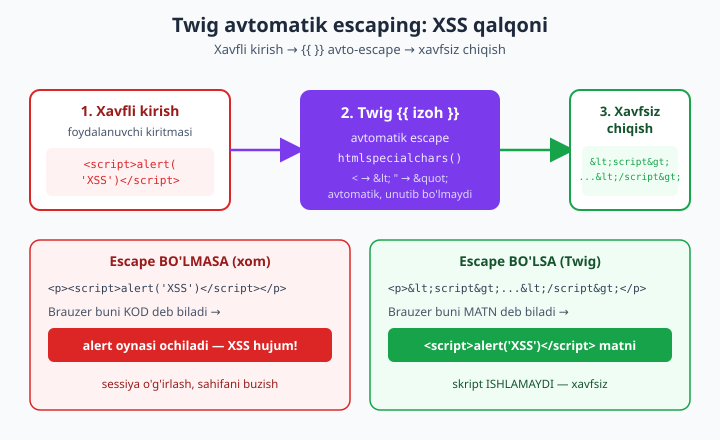
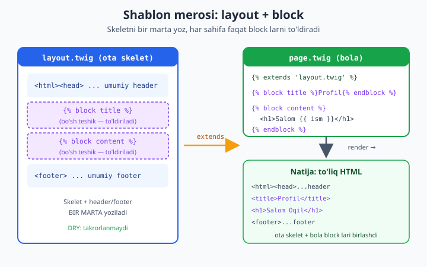

# 16 — Twig va xavfsiz shablon

[⬅️ Oldingi: 15 — O'z mini-frameworkingizni yig'ish](./15-mini-framework.md) · [🏠 README](./README.md) · [Keyingi: README ➡️](./README.md)

> **Bu bobda:** framework ning oxirgi qatlami — **view (ko'rinish) qatlami** ni quramiz. Avval PHP'ning O'ZI shablon dvigateli ekanini (`<?= ?>` bilan) ko'ramiz va uning eng katta tuzog'ini ochamiz: escaping **qo'lda** (`htmlspecialchars`) qilinadi — bir marta unutilsa **XSS** teshigi ochiladi (bu boshlovchi kitobdagi [xavfsizlik asoslari](../php/34-xavfsizlik-asoslari.md) ga to'g'ridan-to'g'ri ko'prik). So'ng **Twig** ni o'rganamiz: nega kerak (**avtomatik escaping** — XSS ni template **darajasida** oldini oladi), `composer require twig/twig`, `Environment` + `FilesystemLoader` sozlash, sintaksis (`{{ ifoda }}`, ``, filtrlar `|date`/`|upper`), **shablon merosi** (`` + ``, `` partial, makrolar = komponent g'oyasi). Keyin xavfsizlikning yuragi: **escaping konteksti** (`html` standart, `|e('js')`, `|e('url')` — qaysi joyda qaysi) va `|raw` ning xavfi. Oxirida view ni 15-bobdagi mini-framework ga ulaymiz: **kontroller → Twig render → Response**. Hamma natija haqiqiy `php` + `twig/twig` 3.27 bilan tasdiqlangan: XSS payload haqiqatan escape bo'lishini ko'rasiz.

---

## Nega view qatlami alohida muammo?

Front-controller dan router, router dan middleware pipeline, undan kontroller — 15-bobda hammasi tayyor bo'ldi. Kontroller ma'lumotni tayyorlaydi (foydalanuvchi, mahsulotlar ro'yxati, xato xabari) va uni **HTML** ga aylantirib brauzerga qaytarishi kerak. Aynan shu — **HTML hosil qilish** — view qatlamining vazifasi.

Savol oddiy ko'rinadi: "PHP ichida `echo "<h1>$ism</h1>"` yozsang bo'ldi-ku?". Lekin bu yo'lda ikkita jiddiy muammo bor:

1. **Aralashish** — biznes mantiq (PHP) va taqdimot (HTML) bir joyda chalkashadi. Kontroller `if`, sikl, `echo`, `<table>`, SQL — hammasi bitta faylda. O'qib bo'lmaydi, dizayner tegisha olmaydi.
2. **Xavfsizlik** — `$ism` foydalanuvchidan kelgan bo'lsa va siz uni xom holda HTML ichiga qo'ysangiz, hujumchi u yerga `<script>` yuborib **XSS** (Cross-Site Scripting) hujum qiladi. Buni oldini olish — har bir o'zgaruvchini **escape** qilish — va shu yerda inson omili ishga tushadi: bitta joyni unutsangiz — teshik.

Shablon dvigateli aynan shu ikki muammoni hal qiladi: taqdimotni alohida fayllarga ajratadi va (yaxshi dvigatel) escaping ni **avtomatik** qiladi.

> **Ko'prik.** Bu bob boshlovchi kitobdagi [MVC loyihani tartibga solish](../php/37-mvc-loyihani-tartibga-solish.md) (View qatlami g'oyasi) va [foydali dizayn andozalari](../php/38-foydali-dizayn-andozalari.md) ga tayanadi. Xavfsizlik tomoni esa to'liq [xavfsizlik asoslari](../php/34-xavfsizlik-asoslari.md) (XSS bo'limi) ning davomi — endi uni framework darajasida hal qilamiz.

---

## PHP'ning o'zi shablon dvigateli (va uning tuzog'i)

PHP tarixan **shablon tili** sifatida tug'ilgan: `<?php ?>` teglari HTML orasiga "sakrab kirish" uchun. `<?= $x ?>` — bu `<?php echo $x; ?>` ning qisqasi (short echo tag, har doim yoqilgan). Demak hech qanday kutubxonasiz ham shablon yoza olamiz:

```php
<?php
declare(strict_types=1);

// PHP'ning O'ZI shablon dvigateli: escaping QO'LDA
// Bu fayl Twig'siz, faqat native PHP

function e(string $s): string
{
    // ENT_QUOTES: ' va " ikkalasini ham escape qiladi
    // ENT_SUBSTITUTE: yaroqsiz UTF-8 baytini tashlab ketmaydi, almashtiradi
    return htmlspecialchars($s, ENT_QUOTES | ENT_SUBSTITUTE, 'UTF-8');
}

$ism  = 'Oqil';
$izoh = '<script>alert("XSS")</script>';  // foydalanuvchidan kelgan (ishonchsiz)

echo "=== NATIVE PHP: escape ESLAB ===\n";
ob_start();
?>
<h1>Salom, <?= e($ism) ?>!</h1>
<p>Izoh: <?= e($izoh) ?></p>
<?php
echo ob_get_clean();

echo "\n=== NATIVE PHP: escape UNUTILGAN (XAVFLI) ===\n";
ob_start();
?>
<p>Izoh: <?= $izoh /* ❌ escape yo'q -> XSS */ ?></p>
<?php
echo ob_get_clean();
echo "\n";
```

Bu kodni `php` bilan ishga tushirsak, aniq quyidagi chiqadi (haqiqiy natija):

```
=== NATIVE PHP: escape ESLAB ===

<h1>Salom, Oqil!</h1>
<p>Izoh: &lt;script&gt;alert(&quot;XSS&quot;)&lt;/script&gt;</p>

=== NATIVE PHP: escape UNUTILGAN (XAVFLI) ===

<p>Izoh: <script>alert("XSS")</script></p>
```

Diqqat qiling:

- **Birinchi holatda** (`e()` ishlatilgan) `<script>` belgisi `&lt;script&gt;` ga aylandi — brauzer buni **matn** deb biladi, skript ishlamaydi. Xavfsiz.
- **Ikkinchi holatda** (escape unutilgan) `<script>alert("XSS")</script>` xom holda chiqdi. Brauzer buni **kod** deb biladi va `alert` oynasini ochadi — bu XSS hujum.

> **Ana shu — native PHP shablon larining asosiy zaifligi.** Escaping **inson tomonidan, har bir o'zgaruvchi uchun alohida** eslab qilinadi. Yuzlab `<?= ... ?>` orasida bittasida `e()` ni unutsangiz — teshik ochildi. Bu "default xavfsiz emas" (insecure by default) yondashuv: standart holat — **xavfli**, xavfsizlikni siz qo'shasiz. Real loyihada esa har doim kimdir unutadi.

`htmlspecialchars` ning ichki ishini va XSS mexanikasini chuqurroq tushunish uchun [xavfsizlik asoslari](../php/34-xavfsizlik-asoslari.md) bobiga qarang. Bu yerda asosiy xulosa: **biz "default xavfsiz" dvigatel xohlaymiz** — escaping standart bo'lib, uni o'chirish ataylab qilinadigan, ko'rinadigan harakat bo'lsin. Aynan shuni Twig beradi.

---

## Twig: nega kerak va u nimani hal qiladi

**Twig** — Symfony jamoasi yaratgan, PHP ekotizimidagi eng keng tarqalgan shablon dvigateli (Symfony, Drupal, Laravel'da `laravel/twig` orqali ishlatiladi). Uning uchta asosiy ustunligi:

1. **Avtomatik escaping (auto-escape)** — `{{ x }}` yozsangiz, Twig `x` ni **avtomatik** `htmlspecialchars` qiladi. Escape ni "eslash" kerak emas — u **standart**. Escape ni o'chirish (`|raw`) — ataylab yoziladigan, ko'rinadigan harakat. Bu — "default xavfsiz" (secure by default).
2. **Toza, cheklangan sintaksis** — shablon ichida `{{ }}` (chiqarish) va `` (mantiq) bor. To'liq PHP emas — shablonga `file_put_contents` yoki SQL yozib bo'lmaydi. Bu dizaynerlar uchun xavfsiz va tushunarli; biznes mantiqni shablonga sudrab kirib ketishni qiyinlashtiradi.
3. **Meros va qayta ishlatish** — `extends`/`block` (skelet meros), `include` (partial), `macro` (komponent) — HTML takrorlanishini yo'q qiladi.

Twig shablonlari kompilyatsiya qilinadi: birinchi marta o'qilganda Twig `.twig` faylni optimallashtirilgan PHP klassiga aylantirib `cache` papkasiga yozadi. Keyingi so'rovlarda o'sha kompilyatsiya qilingan PHP ishlaydi — demak performance jihatdan native PHP shablonga deyarli teng, lekin xavfsizlik avtomatik.

### O'rnatish

```bash
composer require twig/twig
```

Bu mashinada o'rnatib tekshirdik — Twig **3.27.1** (PHP 8.4 da muammosiz). U faqat bir nechta kichik `symfony/polyfill-*` paketini olib keladi, og'ir emas.

### Eng minimal sozlash: Environment + FilesystemLoader

Twig ikki asosiy obyektdan tashkil topadi:

- **Loader** — shablon fayllarini qayerdan o'qishni biladi. `FilesystemLoader` — papkadan, `ArrayLoader` — PHP massividan (testda qulay).
- **Environment** — markaziy dvigatel: loader ni oladi, sozlamalarni (cache, autoescape) ushlaydi va `render()` qiladi.

`templates/layout.twig` va `templates/page.twig` fayllari (pastda meros bo'limida ko'rsatamiz) bo'lsa, render shunday:

```php
<?php
declare(strict_types=1);

require __DIR__ . '/vendor/autoload.php';

use Twig\Environment;
use Twig\Loader\FilesystemLoader;

// 1. Loader: shablonlar 'templates/' papkasida
$loader = new FilesystemLoader(__DIR__ . '/templates');

// 2. Environment: cache va autoescape sozlamalari
$twig = new Environment($loader, [
    'cache'      => __DIR__ . '/var/cache/twig', // production: papka; dev: false
    'autoescape' => 'html',                       // STANDART: html escaping yoqiq
    'strict_variables' => true,                   // mavjud bo'lmagan o'zgaruvchi -> xato
]);

// 3. Render: shablon nomi + ma'lumot massivi
$html = $twig->render('page.twig', [
    'ism'  => 'Oqil',
    'izoh' => '<script>alert("XSS")</script>',  // ishonchsiz kirish
]);

echo $html;
```

> **Sozlama maslahatlari.** `cache` ni production da papkaga, lokal ishlab chiqishda `false` ga qo'ying (har o'zgartirishda qayta kompilyatsiya). `strict_variables => true` — mavjud bo'lmagan o'zgaruvchiga murojaatda jim `null` o'rniga xato berib, xatolarni erta tutadi. `autoescape => 'html'` — standart va eng muhim sozlama; uni hech qachon `false` qilmang (sababini quyida ko'ramiz).

---

## Avtomatik escaping: XSS ni template darajasida o'ldirish

Endi Twig ning eng muhim xususiyatini **haqiqiy chiqish** bilan tasdiqlaymiz. Quyidagi to'liq, o'zini-tutgan dastur (`templates/layout.twig` va `templates/page.twig` keyingi bo'limda) XSS payload bilan render qiladi:

```php
<?php
declare(strict_types=1);

require __DIR__ . '/vendor/autoload.php';

use Twig\Environment;
use Twig\Loader\FilesystemLoader;

$loader = new FilesystemLoader(__DIR__ . '/templates');
$twig = new Environment($loader, ['cache' => false, 'autoescape' => 'html']);

// XSS payload sifatida foydalanuvchi kiritmasi
$xss = '<script>alert("XSS")</script>';

echo $twig->render('page.twig', [
    'ism'  => 'Oqil',
    'izoh' => $xss,
]);
```

Haqiqiy chiqish (asosiy qism):

```html
<h1>Salom, Oqil!</h1>
<p>Izoh: &lt;script&gt;alert(&quot;XSS&quot;)&lt;/script&gt;</p>
```

E'tibor bering: shablonda biz `{{ izoh }}` deb **oddiy** yozdik, hech qanday `e()` yoki `|escape` qo'shmadik. Lekin `<script>` baribir `&lt;script&gt;` ga aylandi. **Bu — avtomatik escaping.** Twig har bir `{{ }}` ifodasini chiqarishdan oldin `htmlspecialchars` dan o'tkazadi. Siz "esladingizmi?" deb o'ylamaysiz — u doim ishlaydi.



### Auto-escape vs qo'lda escaping — taqqoslash

| Jihat | Native PHP (`<?= ?>`) | Twig (`{{ }}`) |
|---|---|---|
| Escaping standart holati | **Yo'q** (xom chiqadi) | **Bor** (avtomatik) |
| Kim eslaydi | **Dasturchi**, har o'zgaruvchi uchun | **Dvigatel**, avtomatik |
| Bitta joyni unutsa | XSS teshigi | Teshik yo'q (default himoyalangan) |
| Escape ni o'chirish | Hech narsa yozmaslik (osongina sodir bo'ladi) | `\|raw` (ataylab, ko'rinadi) |
| Falsafa | Insecure by default | **Secure by default** |

Mana asosiy farq: native PHP da **xavfli holat — standart**, Twig da **xavfsiz holat — standart**. Inson xatosi ehtimoli tubdan kamayadi.

> **Lekin "avtomatik" sehrli o'q emas.** Avto-escape faqat **HTML matn konteksti** uchun to'g'ri. JavaScript, URL yoki HTML atribut ichiga qiymat qo'yganda boshqacha escaping kerak — buni quyida "escaping konteksti" bo'limida ochamiz. Twig buni ham qo'llab-quvvatlaydi, lekin to'g'ri kontekstni **siz tanlaysiz**.

---

## Sintaksis: chiqarish, mantiq, filtrlar

Twig sintaksisi uch turdagi tegdan iborat:

- `{{ ifoda }}` — **chiqarish** (avto-escape bilan). O'zgaruvchi, metod chaqiruvi, arifmetika.
- `` — **mantiq** (escape qilinmaydi): `if`, `for`, `block`, `set`, `include`.
- `{# izoh #}` — **izoh** (chiqishga tushmaydi).

### for va if

```php
<?php
declare(strict_types=1);

require __DIR__ . '/vendor/autoload.php';

use Twig\Environment;
use Twig\Loader\ArrayLoader;

// Inline shablon (ArrayLoader) bilan for/if ni sinaymiz
$loader = new ArrayLoader([
    'loop' => <<<TWIG
    
      AKTIV: {{ u.name }}PASSIV: {{ u.name }}
    
      Foydalanuvchi yo'q
    
    TWIG,
]);

$twig = new Environment($loader, ['autoescape' => 'html']);

echo $twig->render('loop', ['users' => [
    ['name' => 'Olim', 'active' => true],
    ['name' => 'Vali', 'active' => false],
]]);
```

Haqiqiy chiqish:

```
AKTIV: OlimPASSIV: Vali
```

Diqqat: `` ning `` shoxi bor — agar massiv **bo'sh** bo'lsa ishlaydi (PHP da buning uchun alohida `if (empty(...))` yozardingiz). `u.name` — Twig'da nuqta universal: u avval `$u['name']` (massiv), keyin `$u->name` (xossa), keyin `$u->getName()` (getter), keyin `$u->isName()` ni sinab ko'radi. `` — yonidagi bo'shliqlarni (whitespace) kesadi.

### Filtrlar: `|` bilan qiymatni o'zgartirish

Filtr — qiymatni chiqarishdan oldin qayta ishlovchi funksiya. Quvur (`|`) bilan ulanadi va zanjirlash mumkin (`{{ x|trim|upper }}`):

```php
<?php
declare(strict_types=1);

require __DIR__ . '/vendor/autoload.php';

use Twig\Environment;
use Twig\Loader\ArrayLoader;

$loader = new ArrayLoader([
    'filters' => <<<TWIG
    UPPER:  {{ 'salom'|upper }}
    DATE:   {{ sana|date('Y-m-d') }}
    LENGTH: {{ 'abc'|length }}
    DEFAULT:{{ yoq|default('standart') }}
    JOIN:   {{ ['a','b','c']|join(', ') }}
    TWIG,
]);

$twig = new Environment($loader, ['autoescape' => 'html']);

echo $twig->render('filters', ['sana' => '2026-06-11 10:00:00']);
```

Haqiqiy chiqish:

```
UPPER:  SALOM
DATE:   2026-06-11
LENGTH: 3
DEFAULT:standart
JOIN:   a, b, c
```

Eng ko'p ishlatiladigan filtrlar: `upper`/`lower`/`title`/`capitalize` (registr), `date` (sana formatlash), `length` (uzunlik), `default` (`null`/bo'sh bo'lsa zaxira qiymat), `join`/`split`, `trim`, `nl2br`, `number_format`, `json_encode`, va escaping filtrlar (`escape`/`e`, `raw`). To'liq ro'yxat — Twig hujjatlarida.

### O'z filtringizni yozish (qayta ishlatiladigan mantiq)

Loyihaga xos formatlashni (masalan, tiyinni "so'm" ga aylantirish) bir marta filtr qilib, hamma shablonda ishlatasiz:

```php
<?php
declare(strict_types=1);

require __DIR__ . '/vendor/autoload.php';

use Twig\Environment;
use Twig\Loader\ArrayLoader;
use Twig\TwigFilter;

$twig = new Environment(
    new ArrayLoader(['p' => '{{ narx|som }}']),
    ['autoescape' => 'html'],
);

// narx tiyinda saqlanadi; '|som' uni o'qiladigan formatga aylantiradi
$twig->addFilter(new TwigFilter('som', fn(int $tiyin): string =>
    number_format($tiyin / 100, 2, '.', ' ') . " so'm"
));

echo $twig->render('p', ['narx' => 1234567]);
```

Haqiqiy chiqish:

```
12 345.67 so&#039;m
```

E'tibor bering: filtr `so'm` matnini qaytardi, va Twig undagi apostrof (`'`) ni ham avtomatik `&#039;` ga escape qildi — chunki natija HTML kontekstiga tushyapti. Avto-escape **filtr natijasiga ham** qo'llaniladi. Bu — yana bir bor "default xavfsiz".

---

## Shablon merosi: extends, block, include, macro

HTML da har sahifa bir xil skeletni (`<html>`, `<head>`, header, footer, navbar) takrorlaydi. Buni har faylga ko'chirib yozish — DRY buzilishi (har o'zgarishni 50 joyda yangilash). Twig buni **meros** bilan hal qiladi.

### extends + block — skelet merosi

**Ota shablon** (skelet) `` bilan "to'ldiriladigan teshik" lar belgilaydi. **Bola shablon** `` bilan otani meros qiladi va faqat block larni to'ldiradi.

`templates/layout.twig` (ota skelet):

```twig
<!DOCTYPE html>
<html lang="uz">
<head><title>Standart</title></head>
<body>
<header>Sayt sarlavhasi</header>
<main></main>
</body>
</html>
```

`templates/page.twig` (bola — faqat block larni to'ldiradi):

```twig

{{ ism }} sahifasi

  <h1>Salom, {{ ism }}!</h1>
  <p>Izoh: {{ izoh }}</p>

```

`page.twig` ni `ism = 'Oqil'`, `izoh = '<script>alert("XSS")</script>'` bilan render qilganda haqiqiy chiqish:

```html
<!DOCTYPE html>
<html lang="uz">
<head><title>Oqil sahifasi</title></head>
<body>
<header>Sayt sarlavhasi</header>
<main>  <h1>Salom, Oqil!</h1>
  <p>Izoh: &lt;script&gt;alert(&quot;XSS&quot;)&lt;/script&gt;</p>
</main>
</body>
</html>
```

Skelet (`<html>`, header) `layout.twig` da **bir marta** yozildi; `page.twig` faqat `title` va `content` ni to'ldirdi. Va e'tibor bering — XSS payload bu yerda ham avtomatik escape bo'ldi. Meros xavfsizlikni buzmaydi.



> **`parent()` va ko'p qatlamli meros.** Bola block ichida `{{ parent() }}` yozsangiz, ota block ning mazmunini ham qo'shasiz (masalan, `title` ga sayt nomini qo'shish). Meros ko'p qatlamli bo'lishi mumkin: `base.twig` → `dashboard.twig` → `dashboard/users.twig`. Har qatlam o'z block larini aniqlashtiradi.

### include — partial (qism shablon)

Takrorlanuvchi mayda bo'lakni (alert, kartochka, navbar) alohida faylga ajratib, `include` bilan joylashtirasiz:

### macro — komponent g'oyasi

**Makro** — argument qabul qiladigan, qayta ishlatiladigan shablon "funksiyasi". Bu — komponent g'oyasiga eng yaqin narsa (forma inputi, tugma, kartochka). `include` faqat statik bo'lakni qo'shadi; makro esa **parametrlanadi**.

Quyida `include` va `macro` ni birga sinaymiz:

```php
<?php
declare(strict_types=1);

require __DIR__ . '/vendor/autoload.php';

use Twig\Environment;
use Twig\Loader\ArrayLoader;

$loader = new ArrayLoader([
    // include uchun partial
    '_alert.twig' => '<div class="alert alert-{{ turi }}">{{ matn }}</div>',

    // makro = komponent g'oyasi (parametrlangan input)
    'forma.twig' => <<<TWIG
    
      <input type="{{ turi }}" name="{{ nom }}" value="{{ qiymat }}">
    
    TWIG,

    'sahifa.twig' => <<<TWIG
    
    
    {{ input('email', user_email) }}
    {{ input('parol', '', 'password') }}
    TWIG,
]);

$twig = new Environment($loader, ['autoescape' => 'html']);

echo $twig->render('sahifa.twig', [
    'xabar'      => 'Xato: <b>noto\'g\'ri</b> parol',   // escape bo'lishi kerak
    'user_email' => 'a@b.uz" onfocus="alert(1)',         // attribut escape bo'lishi kerak
]);
```

Haqiqiy chiqish:

```html
<div class="alert alert-danger">Xato: &lt;b&gt;noto&#039;g&#039;ri&lt;/b&gt; parol</div><input type="text" name="email" value="a@b.uz&quot; onfocus=&quot;alert(1)">
<input type="password" name="parol" value="">
```

Ikki muhim natija:

1. **`include ... with {...}`** partial ga ma'lumot uzatadi (`turi`, `matn`). `_alert.twig` qayta ishlatiladigan bo'lak.
2. **`macro input(...)`** — `forma.twig` da bir marta yozildi, `sahifa.twig` da uch xil argument bilan chaqirildi. `` makroni keltirib oladi. Makro standart argument (`turi = 'text'`) ham qo'llab-quvvatlaydi.

Eng muhimi — `user_email` ichidagi hujum (`" onfocus="alert(1)`) **atribut kontekstida** ham to'g'ri escape bo'ldi: `"` belgisi `&quot;` ga aylanib, hujumchining `onfocus` atributini ochib qo'ya olmadi. Avto-escape makro va include ichida ham ishlaydi.

> **Makro vs include vs komponent.** `include` — statik bo'lak (parametrlar `with` orqali). `macro` — funksiya kabi (argumentli, qaytariladi). Zamonaviy frameworklarda (Symfony UX, Laravel Blade) bularning ustiga "komponent" abstraksiyasi qurilgan, lekin g'oya bir xil: HTML ni qayta ishlatiladigan, parametrlanadigan bo'laklarga ajratish.

---

## Escaping konteksti: html, js, url — qaysi joyda qaysi

Bu — bobning eng nozik va eng muhim bo'limi. Avtomatik escaping **standart holatda HTML kontekstini** himoya qiladi. Lekin qiymat har doim ham HTML matn ichiga tushmaydi — ba'zan u `<script>` ichidagi JS satriga, ba'zan `href="..."` ichidagi URL ga, ba'zan atribut qiymatiga tushadi. **Har bir kontekst boshqacha escaping talab qiladi.** HTML escaping JS kontekstida yetarli emas (va aksincha).

Twig'da kontekstni `|e('strategiya')` (yoki to'liq `|escape('strategiya')`) bilan tanlaysiz. Quyida bir xil xavfli payload ni to'rt xil kontekstda escape qilamiz:

```php
<?php
declare(strict_types=1);

require __DIR__ . '/vendor/autoload.php';

use Twig\Environment;
use Twig\Loader\ArrayLoader;

$loader = new ArrayLoader([
    'contexts' => <<<TWIG
    HTML:  <p>{{ payload }}</p>
    JS:    <script>var u = "{{ payload|e('js') }}";</script>
    URL:   <a href="/qidir?q={{ payload|e('url') }}">link</a>
    ATTR:  <input value="{{ payload|e('html_attr') }}">
    RAW:   <p>{{ trusted|raw }}</p>
    TWIG,
]);

$twig = new Environment($loader, ['autoescape' => 'html']);

$payload = '<script>"x" & y</script>';

echo $twig->render('contexts', [
    'payload' => $payload,
    'trusted' => '<b>ishonchli HTML</b>',
]);
```

Haqiqiy chiqish:

```
HTML:  <p>&lt;script&gt;&quot;x&quot; &amp; y&lt;/script&gt;</p>
JS:    <script>var u = "\u003Cscript\u003E\u0022x\u0022\u0020\u0026\u0020y\u003C\/script\u003E";</script>
URL:   <a href="/qidir?q=%3Cscript%3E%22x%22%20%26%20y%3C%2Fscript%3E">link</a>
ATTR:  <input value="&lt;script&gt;&quot;x&quot;&#x20;&amp;&#x20;y&lt;&#x2F;script&gt;">
RAW:   <p><b>ishonchli HTML</b></p>
```

Bitta payload — to'rt xil natija. Diqqat bilan ko'ring:

- **`html`** (standart, `{{ payload }}`): `<` → `&lt;`, `"` → `&quot;`, `&` → `&amp;`. HTML matn uchun to'g'ri.
- **`js`** (`|e('js')`): `"` → `\u0022`, `<` → `\u003C`, `>` → `\u003E`, `&` → `\u0026`, bo'shliq → `\u0020` (`/` esa `\/`). Bu — JavaScript satr ichidagi escaping: har bir xavfli belgi `\u00XX` Unicode-ekran ketma-ketligiga aylanadi, shu sababli satrdan "chiqib ketib" kod bajartirib bo'lmaydi. Diqqat: bu yerda `"` belgisi `&quot;` ga **emas**, balki `\u0022` ga aylanadi — chunki natija HTML matn emas, JS satridir. Agar bu yerda HTML escaping ishlatsangiz, `&quot;` JS uchun ma'nosiz va satrni buza olishi mumkin edi. JS uchun **JS escaping** kerak.
- **`url`** (`|e('url')`): `<` → `%3C`, bo'shliq → `%20`. Bu — URL/percent-encoding. `href="...?q=..."` ichidagi qiymat uchun.
- **`html_attr`** (`|e('html_attr')`): HTML matn escaping dan ham qattiqroq — bo'shliq ham (`&#x20;`) escape bo'ladi, chunki tirnoqsiz atributda bo'shliq atributni tugatadi. Tirnoq ichidagi murakkab atribut qiymatlari uchun.

> **Qoida.** Qiymat **qayerga** tushishini o'ylab, kontekstni shunga moslang:
> - HTML matn (`<p>{{ x }}</p>`) → standart (hech narsa qo'shma).
> - `<script>` ichidagi JS satri → `|e('js')`.
> - `href`/`src` dagi URL qismi → `|e('url')`.
> - Murakkab atribut qiymati → `|e('html_attr')`.
>
> Eng xavflisi — `<script>` ichiga `{{ x }}` ni **standart** (html) escape bilan qo'yish: u XSS ga ochiq qoladi, chunki html escaping JS ni himoya qilmaydi. Iloji bo'lsa, JS ga ma'lumot uzatishni `data-*` atributi yoki `<script type="application/json">` orqali qiling.

### `|raw` — escaping ni o'chirish (va uning xavfi)

Yuqoridagi chiqishda `RAW:` qatorida `<b>ishonchli HTML</b>` **xom** chiqdi — escape bo'lmadi. Bu — `|raw` filtri ning ishi: u avto-escape ni **o'chiradi**. Buni faqat **siz mutlaqo ishonadigan** HTML uchun ishlating (masalan, o'zingiz tozalagan Markdown chiqishi, admin yozgan kontent). Foydalanuvchi kiritmasiga `|raw` ishlatish — **to'g'ridan-to'g'ri XSS teshigi**:

```twig
{# ❌ FALOKAT: foydalanuvchi izohiga raw -> XSS #}
<p>{{ user_comment|raw }}</p>

{# ✅ to'g'ri: ishonchsiz kontent escape bo'lsin (standart) #}
<p>{{ user_comment }}</p>
```

`|raw` — Twig'dagi yagona "tahlika" tugmasi: u ko'rinadi, grep bilan topiladi, code review da darrov ko'zga tashlanadi. Bu native PHP dagi "escape ni unutish" dan farqli — bu yerda xavfsizlikni o'chirish **ataylab va ko'rinadigan** harakat. Loyihada `|raw` ni qidiring — har bittasi tekshiruvga loyiq.

### Ikki marta escape bo'lmaydimi?

Tabiiy savol: avto-escape yoqiq holatda `{{ x|e }}` yozsam, ikki marta escape bo'lmaydimi (`&` → `&amp;` → `&amp;amp;`)? Yo'q — Twig buni biladi:

```php
<?php
declare(strict_types=1);

require __DIR__ . '/vendor/autoload.php';

use Twig\Environment;
use Twig\Loader\ArrayLoader;

// DIQQAT: har bir Environment ga BOSHQA shablon nomi ('a','b','c') beramiz.
// Sabab: Twig kompilyatsiya kesh kalitini shablon NOMI + manbasidan hosil
// qiladi va 'autoescape' bayrog'ini kalitga qo'shmaydi. Agar uchchalasiga ham
// bir xil nom ('x') va bir xil manba bersak, ikkinchi/uchinchi Environment
// birinchisining (autoescape=false bilan tuzilgan) kompilyatsiya klassini
// QAYTA ishlatadi — natijada autoescape=html jim turib escape QILMAYDI.
// Boshqa nomlar har bir holatga o'z kompilyatsiya klassini kafolatlaydi.

// 1) autoescape o'CHIRILGAN bo'lsa XSS qaytadi (XAVF)
$t1 = new Environment(new ArrayLoader(['a' => '{{ p }}']), ['autoescape' => false]);
echo "autoescape=false: " . $t1->render('a', ['p' => '<script>x</script>']) . "\n";

// 2) autoescape='html' (standart, xavfsiz)
$t2 = new Environment(new ArrayLoader(['b' => '{{ p }}']), ['autoescape' => 'html']);
echo "autoescape=html:  " . $t2->render('b', ['p' => '<script>x</script>']) . "\n";

// 3) avto + qo'shimcha |e: ikki marta escape EMAS
$t3 = new Environment(new ArrayLoader(['c' => '{{ p|e }}']), ['autoescape' => 'html']);
echo "avto + |e:        " . $t3->render('c', ['p' => '<b>']) . "  (ikki marta emas)\n";
```

Haqiqiy chiqish:

```
autoescape=false: <script>x</script>
autoescape=html:  &lt;script&gt;x&lt;/script&gt;
avto + |e:        &lt;b&gt;  (ikki marta emas)
```

Uch muhim xulosa: (1) `autoescape => false` — payload **xom** chiqadi, ya'ni XSS — shuning uchun `autoescape` ni hech qachon o'chirmang; (2) standart `'html'` — escape qiladi; (3) `{{ p|e }}` da `<b>` faqat **bir marta** `&lt;b&gt;` bo'ldi (`&amp;lt;` emas) — Twig avto-escape qilingan qiymatni qayta escape qilmaydi.

---

## View ni mini-framework ga ulash: kontroller → Twig → Response

Endi hamma narsani 15-bobdagi mini-framework ga ulaymiz. Maqsad: **kontroller** faqat ma'lumot tayyorlasin (HTML yozmasin), **view qatlami** Twig orqali HTML hosil qilib **Response** ga o'rasin. Bu yerda PSR-7 ning soddalashtirilgan `Response` ini ishlatamiz (to'liq PSR-7 uchun [PSR standartlari](./10-psr-standartlar.md) ga qarang).

So'rovni **jarayon ichida simulyatsiya** qilamiz — jonfor server kerak emas, query massivini to'g'ridan-to'g'ri kontrollerga beramiz va Response ni tekshiramiz:

```php
<?php
declare(strict_types=1);

require __DIR__ . '/vendor/autoload.php';

use Twig\Environment;
use Twig\Loader\ArrayLoader;

// --- Minimal Response (PSR-7 soddalashtirilgani) ---
final class Response
{
    public function __construct(
        public readonly int $status = 200,
        public readonly string $body = '',
        /** @var array<string,string> */
        public readonly array $headers = ['Content-Type' => 'text/html; charset=utf-8'],
    ) {}
}

// --- View qatlami: Twig'ni o'rab, Response qaytaradi ---
final class TwigView
{
    public function __construct(private Environment $twig) {}

    /** @param array<string,mixed> $data */
    public function render(string $template, array $data = [], int $status = 200): Response
    {
        $html = $this->twig->render($template, $data);
        return new Response($status, $html);
    }
}

// --- Kontroller: faqat ma'lumot tayyorlaydi, HTML yozmaydi ---
final class ProfileController
{
    public function __construct(private TwigView $view) {}

    /** @param array<string,string> $query */
    public function show(array $query): Response
    {
        $ism = $query['ism'] ?? 'mehmon';   // foydalanuvchi kiritmasi (ishonchsiz)
        return $this->view->render('profile.twig', ['ism' => $ism]);
    }
}

// --- Sozlash (bootstrap) ---
$loader = new ArrayLoader([
    'profile.twig' => '<h1>Profil: {{ ism }}</h1>',
]);
$twig = new Environment($loader, ['autoescape' => 'html']);
$controller = new ProfileController(new TwigView($twig));

// --- So'rovni JARAYON ICHIDA simulyatsiya (jonli server SHART EMAS) ---
// Hujumchi query string orqali XSS urinmoqda
$response = $controller->show(['ism' => '']);

echo 'Status: ' . $response->status . "\n";
echo 'Content-Type: ' . $response->headers['Content-Type'] . "\n";
echo 'Body: ' . $response->body . "\n";

// Tasdiq: payload escape bo'lganmi?
$xavfli = str_contains($response->body, 'Profil: &lt;img src=x onerror=alert(1)&gt;</h1>
XSS payload xom holda bormi? YO'Q (escape qilindi)
```

Bu — to'liq oqim: **query (ishonchsiz kirish) → kontroller → `TwigView::render` → Twig avto-escape → `Response`**. Kontroller HTML haqida hech narsa bilmaydi — u faqat `ism` ni uzatadi. View qatlami Twig orqali xavfsiz HTML hosil qiladi. Hujumchining `` payload'i `&lt;img ... &gt;` ga aylanib, escape bo'ldi. Mana shu — view qatlamining mini-framework ga to'g'ri ulanishi.

> **Arxitektura jihati.** Real frameworkda `TwigView` konteynerga (DI) ro'yxatdan o'tadi (`Environment` ni autowiring bilan quradi), va kontrollerga konstruktor orqali inyeksiya qilinadi — bu [PSR-11 konteyner](./10-psr-standartlar.md) va 15-bobdagi mini-framework ning ishi. `Environment` ni bir marta sozlab (cache yoqiq), har so'rovda qayta ishlatasiz. Twig ning `addGlobal()` (har shablonga umumiy o'zgaruvchi: joriy foydalanuvchi, CSRF token) va `addFunction()` (masalan `path()`, `asset()`) metodlari aynan shu bootstrap bosqichida ulanadi.

---

## Mashqlar

### Oson

1. `{{ }}` va `` teglari orasidagi farq nima? Har biriga bittadan misol keltiring.
2. Native PHP shablon (`<?= $x ?>`) va Twig (`{{ x }}`) ning eng asosiy xavfsizlik farqi nimada? "Secure by default" iborasini shu kontekstda izohlang.
3. `{{ narx|number_format(0, '.', ' ') }}` va `{{ 'salom dunyo'|upper }}` nima qaytaradi (`narx = 1500000`)?
4. `FilesystemLoader` va `ArrayLoader` qachon qaysi biri qulay?

### O'rta

5. Quyidagi shablon `<script>` ichidagi JS satriga foydalanuvchi nomini qo'yadi: `<script>var u = "{{ ism }}";</script>`. Bu yerda standart (html) avto-escape **yetarlimi**? Nega? To'g'ri variantni yozing.
6. `layout.twig` da `Standart yon panel` bor. Bola shablonda bu blockni **ota mazmunini saqlagan holda** kengaytiring (yon panelga qo'shimcha element qo'shing). Qaysi funksiyadan foydalanasiz?
7. `|raw` filtri qachon **xavfsiz**, qachon **falokat**? Ikkala holatga bittadan misol yozing va farqni tushuntiring.
8. `autoescape => false` qilingan Environment xavfli. Lekin shablonda baribir xavfsizlikni qo'lda ta'minlamoqchisiz. `{{ x }}` ni qanday yozasiz va bu yondashuvning kamchiligi nima (native PHP bilan taqqoslang)?

### Qiyin

9. O'z Twig **filtringizni** yozing: `excerpt(uzunlik)` — matnni berilgan uzunlikkacha kesib, oxiriga `…` qo'shadi (agar matn kalta bo'lsa, o'zgartirmaydi). `TwigFilter` bilan ro'yxatdan o'tkazing va `{{ matn|excerpt(10) }}` ni ikki holatda (uzun/kalta matn) sinab, avto-escape filtr natijasiga ham qo'llanishini tasdiqlang.
10. To'liq **view qatlamini** mini-framework uslubida quring: `Response` (immutable), `TwigView::render(...): Response`, va `PostController::show(array $query): Response`. Kontroller `id` query parametrini olib, "post" ma'lumotini (sarlavha + ishonchsiz izoh, ichida XSS payload) shablonga uzatsin. So'rovni **jarayon ichida** simulyatsiya qilib, Response body da payload escape bo'lganini `str_contains` bilan tasdiqlang. Bonus: `extends`/`block` bilan `layout.twig` dan meros qiling.

<details markdown="1"><summary>Yechim — 1</summary>

`{{ ifoda }}` — **chiqarish**: qiymatni (avto-escape bilan) HTML ga yozadi. Misol: `{{ user.name }}`. `` — **mantiq/boshqaruv**: chiqishga hech narsa yozmaydi, balki oqimni boshqaradi. Misol: `...` yoki ``. Qisqasi: `{{ }}` — "nimani ko'rsatish", `` — "qanday qaror qilish".

</details>

<details markdown="1"><summary>Yechim — 2</summary>

Native PHP da `<?= $x ?>` o'zgaruvchini **xom** chiqaradi — escaping ni dasturchi har joyda `htmlspecialchars()` bilan **qo'lda** qilishi kerak. Bitta joyni unutsa — XSS teshigi. Standart holat **xavfli** (insecure by default). Twig da `{{ x }}` **avtomatik** escape qiladi — standart holat **xavfsiz** (secure by default), escape ni o'chirish (`|raw`) ataylab yoziladigan, ko'rinadigan harakat. Demak inson xatosi (escape ni unutish) Twig da deyarli imkonsiz, native PHP da esa doimiy xavf.

</details>

<details markdown="1"><summary>Yechim — 3</summary>

`{{ 1500000|number_format(0, '.', ' ') }}` → `1 500 000` (0 kasr, ming ajratkichi bo'shliq). `{{ 'salom dunyo'|upper }}` → `SALOM DUNYO`. Eslatma: `upper` o'zbek lotin harflari uchun ishlaydi, chunki ular ASCII; kirill yoki maxsus harflar uchun `mb_strtoupper` xulqi `mbstring` polyfill ga bog'liq.

</details>

<details markdown="1"><summary>Yechim — 4</summary>

`FilesystemLoader` — shablonlar `.twig` fayllar sifatida papkada saqlanganda (real loyihaning normal holati: `templates/` papkasi). `ArrayLoader` — shablonlar PHP massivida inline berilganda; ayniqsa **testlarda** va **bitta faylli misollarda** qulay (fayl yaratmasdan render ni sinash). Production da deyarli har doim `FilesystemLoader`; o'rganish/test uchun `ArrayLoader`.

</details>

<details markdown="1"><summary>Yechim — 5</summary>

**Yo'q, yetarli emas.** `{{ ism }}` standart (html) escape qiladi: `<` → `&lt;`, `"` → `&quot;`. Lekin qiymat `<script>` ning **JS satri** ichida. Agar `ism = '";alert(1);//'` bo'lsa, html escaping `"` ni `&quot;` qiladi-yu, lekin JS kontekstida brauzer `&quot;` ni JS satr chegarasi deb o'qimaydi — payload boshqacha buzilishi mumkin, ba'zi holatlarda XSS ochiladi. JS konteksti uchun **JS escaping** kerak:

```twig
<script>var u = "{{ ism|e('js') }}";</script>
```

`|e('js')` `"` ni `\u0022`, `<` ni `\u003C` ga aylantiradi (har bir xavfli belgi `\u00XX` Unicode-ekran ketma-ketligiga) — bu JS satr ichida xavfsiz: belgi `&quot;`/`&lt;` ga emas, balki JS o'zi tushunadigan `\u00XX` ga aylanadi. Eng yaxshisi esa: ma'lumotni `data-*` atribut yoki `<script type="application/json">` orqali uzatib, JS dan o'qish.

</details>

<details markdown="1"><summary>Yechim — 6</summary>

`{{ parent() }}` funksiyasidan foydalanasiz — u ota blockning mazmunini joriy joyga qo'yadi:

```twig
{# bola shablon #}

  {{ parent() }}            {# "Standart yon panel" saqlanadi #}
  <a href="/yangi">Yangi havola</a>

```

Natijada yon panelda ham ota mazmuni, ham qo'shimcha element bo'ladi. `parent()` siz yozsangiz — ota mazmuni **butunlay almashtiriladi** (o'chadi).

</details>

<details markdown="1"><summary>Yechim — 7</summary>

**Xavfsiz holat** — kontent siz **to'liq ishonadigan**, oldindan tozalangan HTML bo'lsa. Masalan, admin yozgan va siz tasdiqlagan blog kontenti, yoki o'zingiz xavfsiz Markdown-to-HTML konvertoridan o'tkazgan matn:

```twig
{# admin tomonidan kiritilgan, tozalangan HTML #}
<article>{{ post.bodyHtml|raw }}</article>
```

**Falokat holati** — kontent **foydalanuvchi kiritmasi** bo'lsa. Izoh, profil "bio", forum xabari — bularga `|raw` ishlatish to'g'ridan-to'g'ri XSS:

```twig
{# ❌ foydalanuvchi izohi -> XSS teshigi #}
<p>{{ comment.text|raw }}</p>
```

Farq: `|raw` escaping ni o'chiradi, demak HTML/JS xom o'tadi. Ishonchli manbada bu kerakli (formatli HTML ko'rsatish uchun), ishonchsiz manbada esa hujum vektori. Qoida: `|raw` ni faqat siz nazorat qiladigan kontentga, hech qachon foydalanuvchi kiritmasiga ishlatmang. Loyihada har bir `|raw` ni alohida tekshiring.

</details>

<details markdown="1"><summary>Yechim — 8</summary>

`autoescape => false` bo'lsa, har bir o'zgaruvchini qo'lda escape qilasiz: `{{ x|e }}` (yoki `{{ x|escape }}`):

```twig
{# autoescape o'chiq -> qo'lda escape KERAK #}
<p>{{ user_input|e }}</p>
```

**Kamchiligi:** bu native PHP dagi muammoning aynan o'zi — escaping yana **qo'lda va eslab** qilinadi. Bitta `{{ x }}` da `|e` ni unutsangiz — XSS teshigi. Ya'ni `autoescape => false` Twig ning eng katta foydasini (secure by default) o'chiradi va sizni native PHP darajasidagi xavfga qaytaradi. **Xulosa:** `autoescape` ni hech qachon o'chirmang; standart `'html'` holatda qoldiring va faqat aniq, ishonchli joylarda `|raw` ishlating.

</details>

<details markdown="1"><summary>Yechim — 9</summary>

To'liq, ishlaydigan yechim (haqiqiy chiqish bilan):

```php
<?php
declare(strict_types=1);

require __DIR__ . '/vendor/autoload.php';

use Twig\Environment;
use Twig\Loader\ArrayLoader;
use Twig\TwigFilter;

$twig = new Environment(
    new ArrayLoader(['x' => "{{ matn|excerpt(10) }}"]),
    ['autoescape' => 'html'],
);

// excerpt(uzunlik): matnni kesib, oxiriga … qo'shadi (kalta bo'lsa o'zgarmaydi)
$twig->addFilter(new TwigFilter('excerpt', function (string $matn, int $uzunlik): string {
    if (mb_strlen($matn) <= $uzunlik) {
        return $matn;
    }
    return mb_substr($matn, 0, $uzunlik) . '…';
}));

// Uzun matn (kesiladi) — ichida HTML belgisi escape bo'lishini ham tekshiramiz
echo "uzun:  " . $twig->render('x', ['matn' => 'Salom <b>dunyo</b> qalaysan']) . "\n";
// Kalta matn (o'zgarmaydi)
echo "kalta: " . $twig->render('x', ['matn' => 'qisqa']) . "\n";
```

Haqiqiy chiqish:

```
uzun:  Salom &lt;b&gt;d…
kalta: qisqa
```

Tahlil: uzun matn 10 belgida kesilib `…` qo'shildi; `<b>` belgisi `&lt;b&gt;` ga **avtomatik** escape bo'ldi — chunki avto-escape filtr natijasiga ham qo'llanadi (filtr ishonchli `string` qaytaradi, lekin uning ichidagi kontent HTML kontekstiga tushgani uchun Twig uni escape qiladi). Kalta matn o'zgarishsiz qoldi. Filtr matnni **mantiqan** o'zgartiradi, xavfsizlik esa avto-escape zimmasida — javobgarlik to'g'ri taqsimlangan.

</details>

<details markdown="1"><summary>Yechim — 10</summary>

To'liq view qatlami, meros bilan, in-process simulyatsiya orqali tasdiqlangan:

```php
<?php
declare(strict_types=1);

require __DIR__ . '/vendor/autoload.php';

use Twig\Environment;
use Twig\Loader\ArrayLoader;

// --- Immutable Response (PSR-7 soddalashtirilgani) ---
final class Response
{
    public function __construct(
        public readonly int $status,
        public readonly string $body,
        /** @var array<string,string> */
        public readonly array $headers = ['Content-Type' => 'text/html; charset=utf-8'],
    ) {}
}

// --- View qatlami ---
final class TwigView
{
    public function __construct(private Environment $twig) {}

    /** @param array<string,mixed> $data */
    public function render(string $tpl, array $data = [], int $status = 200): Response
    {
        return new Response($status, $this->twig->render($tpl, $data));
    }
}

// --- Kontroller: faqat ma'lumot, HTML yo'q ---
final class PostController
{
    public function __construct(private TwigView $view) {}

    /** @param array<string,string> $query */
    public function show(array $query): Response
    {
        $id = (int) ($query['id'] ?? 0);
        // "Baza" o'rniga sxema; izoh ICHIDA XSS payload (ishonchsiz)
        $post = [
            'id'    => $id,
            'title' => 'Birinchi post',
            'note'  => '<script>alert("XSS")</script> rahmat!',
        ];
        return $this->view->render('post.twig', ['post' => $post]);
    }
}

// --- Shablonlar: meros (layout + block) ---
$loader = new ArrayLoader([
    'layout.twig' => <<<TWIG
    <!DOCTYPE html><html><head><title></title></head>
    <body></body></html>
    TWIG,
    'post.twig' => <<<TWIG
    
    Post #{{ post.id }}
    <h1>{{ post.title }}</h1><p>{{ post.note }}</p>
    TWIG,
]);
$twig = new Environment($loader, ['autoescape' => 'html']);
$controller = new PostController(new TwigView($twig));

// --- So'rovni JARAYON ICHIDA simulyatsiya ---
$response = $controller->show(['id' => '42']);

echo 'Status: ' . $response->status . "\n";
echo 'Body:   ' . $response->body . "\n";

// Tasdiq: XSS payload escape bo'lganmi?
$xom = str_contains($response->body, '<script>alert');
echo "\nXSS xom bormi? " . ($xom ? 'HA (XAVFLI!)' : "YO'Q (escape qilindi)") . "\n";
```

Haqiqiy chiqish:

```
Status: 200
Body:   <!DOCTYPE html><html><head><title>Post #42</title></head>
<body><h1>Birinchi post</h1><p>&lt;script&gt;alert(&quot;XSS&quot;)&lt;/script&gt; rahmat!</p></body></html>

XSS xom bormi? YO'Q (escape qilindi)
```

Tahlil: kontroller faqat `post` massivini tayyorladi (HTML haqida bilmaydi); `TwigView` uni `post.twig` orqali render qildi; `post.twig` `layout.twig` dan **meros** oldi (`title` va `content` block larini to'ldirdi); izohdagi `<script>` payload avtomatik `&lt;script&gt;` ga escape bo'ldi. So'rov jonli serversiz, jarayon ichida `show(['id' => '42'])` chaqiruvi bilan simulyatsiya qilindi va Response body `str_contains` bilan tekshirildi — payload xom **emas**. Bu — to'liq, xavfsiz view qatlamining mini-framework ga ulanishi.

</details>

---

## Xulosa va keyingisi

Bu bobda framework ning oxirgi qatlami — **xavfsiz view qatlamini** qurdik:

- **Native PHP** ham shablon dvigateli (`<?= ?>`), lekin escaping **qo'lda** (`htmlspecialchars`) — bir joyni unutsang XSS. "Insecure by default".
- **Twig** "secure by default": `{{ x }}` **avtomatik** escape qiladi — XSS ni template darajasida oldini oladi. Buni haqiqiy render bilan tasdiqladik (`<script>` → `&lt;script&gt;`).
- Sintaksis: `{{ }}` (chiqarish), `` (mantiq), filtrlar (`|upper`, `|date`, `|join`, o'z filtringiz).
- **Meros**: `extends`/`block` (skelet DRY), `include` (partial), `macro` (komponent g'oyasi) — HTML takrorlanishini yo'q qiladi, escaping ularning ichida ham ishlaydi.
- **Escaping konteksti** xavfsizlikning yuragi: `html` (standart), `|e('js')`, `|e('url')`, `|e('html_attr')` — qiymat **qayerga** tushishiga qarab tanlang. `<script>` ichiga html escaping yetarli emas.
- **`|raw`** escaping ni o'chiradi — faqat ishonchli HTML uchun; foydalanuvchi kiritmasiga ishlatish — XSS.
- View ni mini-framework ga uladik: **kontroller → `TwigView::render` → Twig avto-escape → `Response`**, in-process simulyatsiya bilan tasdiqlab.

Bu — **Wave 3 (framework internals) ning yakuniy bobi.** Endi sizda to'liq framework skeleti bor: front-controller, router, [PSR-15 middleware pipeline](./10-psr-standartlar.md), [PSR-11 DI konteyner](./10-psr-standartlar.md), kontroller va xavfsiz Twig view qatlami. **Framework internals tugadi.** Keyingisi — ikki yo'nalishdan biri: **(1) sifat va testlash** — PHPStan (statik tahlil), Infection (mutation testing), CI quvuri (kodingiz ishlashini emas, **to'g'ri** ekanini avtomatik isbotlash); yoki **(2) performance va async** — OPcache/JIT, Fibers, va doimiy ishlovchi serverlar (RoadRunner/Swoole) bilan PHP'ning tezligini keyingi bosqichga olib chiqish.

---

[⬅️ Oldingi: 15 — O'z mini-frameworkingizni yig'ish](./15-mini-framework.md) · [🏠 README](./README.md) · [Keyingi: README ➡️](./README.md)
