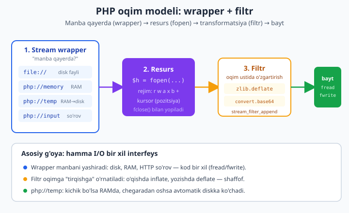
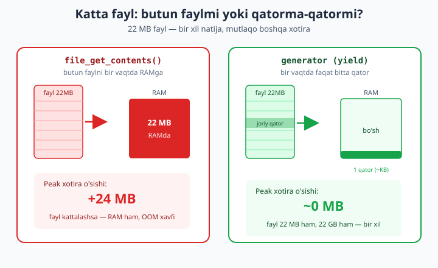

# 17 — Fayllar, oqimlar va katta ma'lumot

[⬅️ Oldingi: 16 — Twig va xavfsiz shablon](./16-twig-shablon.md) · [🏠 README](./README.md) · [Keyingi: 18 — Fayl formatlari, rasm va bulutli saqlash ➡️](./18-fayl-formatlari.md)

> **Bu bobda:** PHP'da fayl bilan ishlash boshlovchi darajada `file_get_contents`/`file_put_contents` bo'lib tuyuladi — lekin chuqurroq qarasak, ortida butun bir **oqim (stream)** modeli yotadi. Bu bobda shu modelni ochamiz: `fopen`/`fread`/`fwrite`/`fclose` va **rejimlar** (`r/w/a/x/b/+`); **stream wrapper** lar (`file://`, `php://memory`, `php://temp`, `php://input`, `data://`) — qaysi biri qachon; **stream filter** lar (`zlib.deflate`, `convert.base64-encode`) — oqim ustida shaffof transformatsiya; obyekt-asosli `SplFileObject`/`SplFileInfo`/`SplTempFileObject` va CSV o'qish. So'ng **katta ma'lumot** muammosi: butun faylni RAMga olish bilan **generator** orqali qatorma-qator o'qishni `memory_get_peak_usage` bilan **isbotlaymiz** (22 MB fayl: 24 MB va ~0 MB). Keyin **atomik yozish** (`flock` + write-temp-then-rename naqshi) va "yarim yozilgan fayl" / poyga muammosi; **katalog** rekursiv aylanishi (`RecursiveDirectoryIterator`, `glob`); **ZipArchive** bilan arxiv; **finfo** bilan haqiqiy MIME aniqlash (kengaytmaga ishonmaslik); **path traversal** himoyasi (`basename`/`realpath`). Hamma kod haqiqiy PHP 8.4 + `zip`/`gd`/`fileinfo` bilan, vaqtinchalik fayllarda ishga tushirib tasdiqlangan.

---

## Nega "fayl" emas, "oqim" deb o'ylash kerak?

Boshlovchi kitobdagi [fayl/upload asoslari](../php/fayl-yuklash.md) da siz `file_get_contents` va `file_put_contents` bilan tanishdingiz: bittasi butun faylni satrga o'qiydi, ikkinchisi satrni faylga yozadi. Bu — 90% holatlar uchun yetarli va to'g'ri tanlov. Lekin ikkita vaziyat bu yondashuvni buzadi:

1. **Ma'lumot katta.** Fayl 2 GB bo'lsa, `file_get_contents` 2 GB ni RAMga olmoqchi bo'ladi va `memory_limit` ga urilib **OOM** (out of memory) bilan o'ladi. Bunday faylni **bo'lak-bo'lak** o'qish kerak.
2. **Manba "fayl" emas.** HTTP so'rov tanasi, RAMdagi vaqtinchalik bufer, siqilgan oqim, hatto `data:` URI — bularning hech biri diskdagi fayl emas, lekin PHP ularni ham xuddi fayldek o'qiy oladi.

Yechim — **oqim (stream)** abstraksiyasi. PHP'da har qanday ketma-ket baytlar manbasi — disk fayli, RAM, tarmoq, jarayonlar orasidagi quvur — bir xil interfeys orqali ochiladi: `fopen` resurs qaytaradi, `fread`/`fwrite` baytlarni ko'chiradi, `fclose` yopadi. Manbaning *qayerdaligi* **wrapper** orqali belgilanadi, baytlar ustidagi *o'zgartirish* esa **filter** orqali ulanadi.



Shu modelni tushunsangiz, "katta fayl", "RAMda ishlash", "siqib yozish", "so'rov tanasini o'qish" — hammasi bitta naqshning variantlariga aylanadi.

> **Ko'prik.** Bu bob boshlovchi kitobdagi [fayl/upload asoslari](../php/fayl-yuklash.md) (4.6) ning ekspert davomi. Qatorma-qator o'qishda ishlatadigan `yield` mexanizmi to'liq [generatorlar](../php/generatorlar.md) bobida yoritilgan — bu yerda uni amaliy I/O muammosiga qo'llaymiz. Natijalarni javob qilib qaytarish esa [15-bobdagi mini-framework](./15-mini-framework.md) `Response` iga ulanadi.

---

## fopen, rejimlar va past darajali I/O

`fopen($yo'l, $rejim)` oqim resursi ochadi. **Rejim** — eng ko'p xato qilinadigan joy, chunki har bir harf aniq xulq-atvorni belgilaydi:

| Rejim | Ma'no | Fayl yo'q bo'lsa | Kursor | Mavjud kontent |
|-------|-------|------------------|--------|----------------|
| `r`   | faqat o'qish | xato | boshda | saqlanadi |
| `r+`  | o'qish + yozish | xato | boshda | saqlanadi |
| `w`   | faqat yozish | yaratadi | boshda | **o'chiriladi (truncate)** |
| `w+`  | o'qish + yozish | yaratadi | boshda | **o'chiriladi** |
| `a`   | qo'shib yozish | yaratadi | **oxirda** | saqlanadi |
| `a+`  | o'qish + qo'shish | yaratadi | oxirda | saqlanadi |
| `x`   | yozish (yangi) | yaratadi | boshda | **mavjud bo'lsa xato** |
| `c`   | yozish (truncate'siz) | yaratadi | boshda | saqlanadi |

Bunga ikkita qo'shimcha bayroq qo'shiladi:

- **`b`** (binary) — Windows'da `\n` ↔ `\r\n` aylanishini **o'chiradi**. Rasm, zip, har qanday ikkilik ma'lumot uchun **doim** `b` qo'shing (`'rb'`, `'wb'`). Bu Linux'da befarq, lekin Windows'da ma'lumotni buzilishdan saqlaydi.
- **`t`** (text) — matn rejimi (faqat Windows), kamdan-kam aniq ishlatiladi.

> **`x` rejimining qiymati.** `x` "fayl mavjud bo'lsa xato ber" deydi — bu **poyga (race condition)** dan himoya: ikkita jarayon bir vaqtda bitta faylni yaratmoqchi bo'lsa, faqat bittasi yutadi, ikkinchisi `false` oladi. "Tekshir, keyin yarat" (`file_exists` keyin `fopen('w')`) naqshida esa tekshiruv bilan yaratish orasida boshqa jarayon kirib qolishi mumkin.

Eng past daraja shunday ko'rinadi (lekin amalda ko'pincha yuqori darajali yordamchilarni ishlatamiz):

```php
<?php
declare(strict_types=1);

$yol = tempnam(sys_get_temp_dir(), 'demo');

// Yozish: 'wb' - binary-safe yozish, mavjud kontentni o'chiradi
$h = fopen($yol, 'wb');
if ($h === false) {
    throw new RuntimeException("ochib bo'lmadi: $yol");
}
fwrite($h, "birinchi qator\n");
fwrite($h, "ikkinchi qator\n");
fclose($h);   // bufer diskka tushadi, deskriptor bo'shaydi

// O'qish: 'rb' - kursor boshida
$h = fopen($yol, 'rb');
$bosh = fread($h, 14);          // 14 bayt o'qiymiz
echo "Birinchi 14 bayt: " . trim($bosh) . "\n";
fseek($h, 0);                   // kursorni boshiga qaytaramiz
echo "Butun fayl:\n" . stream_get_contents($h);
fclose($h);

unlink($yol);   // tozalash
```

`fseek`/`ftell` kursorni boshqaradi, `feof` oxirini tekshiradi, `fflush` buferni majburan diskka yozadi. Bularni qo'lda boshqarish kerak bo'lganda foydali; aks holda `SplFileObject` (pastda) ko'pini avtomatlashtiradi.

---

## Stream wrapper lar: manba qayerda?

Wrapper — `fopen` ga "bu yo'l qayerga ishora qiladi?" ni aytadigan prefiks. PHP bir nechta ichki wrapper bilan keladi; eng muhimlari quyidagilar.

```php
<?php
declare(strict_types=1);

// php://memory: har doim RAMda - kichik, vaqtinchalik buferlar uchun
$mem = fopen('php://memory', 'r+b');
fwrite($mem, "Salom oqim");
rewind($mem);
echo "memory: " . fread($mem, 1024) . "\n";
fclose($mem);

// php://temp/maxmemory:N - chegaradan oshsa avtomatik diskka ko'chadi
$tmp = fopen('php://temp/maxmemory:1024', 'r+b'); // 1 KB chegara
fwrite($tmp, str_repeat('A', 4096));              // 4 KB -> diskka oshib ketadi
$meta = stream_get_meta_data($tmp);
echo "temp wrapper turi: {$meta['wrapper_type']}\n";
fclose($tmp);

// data:// - kontentni to'g'ridan-to'g'ri URI ichida
$data = file_get_contents('data://text/plain;base64,' . base64_encode("inline ma'lumot"));
echo "data://: $data\n";
```

Haqiqiy chiqish:

```
memory: Salom oqim
temp wrapper turi: PHP
data://: inline ma'lumot
```

Har birining roli aniq:

| Wrapper | Manba | Qachon |
|---------|-------|--------|
| `file://` (standart) | disk fayli | oddiy fayl ishi (`fopen('fayl.txt')` ham aslida `file://`) |
| `php://memory` | RAM (doim) | kichik vaqtinchalik bufer, hajmi aniq kichik |
| `php://temp` | RAM → disk | **noma'lum hajmli** bufer: kichik bo'lsa tez (RAM), katta bo'lsa xavfsiz (disk) |
| `php://input` | xom so'rov tanasi | JSON/raw POST o'qish (`$_POST` ishlamaganda) |
| `php://output` | chiqish buferi | oqimni to'g'ridan-to'g'ri javobga yozish |
| `data://` | URI ichidagi kontent | test, kichik inline ma'lumot |

> **`php://temp` — eng foydali tanlov.** Hajmi oldindan noma'lum ma'lumotni (masalan, foydalanuvchi yuklamasi, dinamik yaratilgan ZIP) yig'ayotganda `php://temp` ni tanlang: kichik bo'lsa RAM tezligini, katta bo'lsa diskning xavfsizligini avtomatik beradi. Standart chegara 2 MB; `php://temp/maxmemory:N` bilan o'zgartiriladi. `php://memory` esa har doim RAMda — faqat hajmi aniq kichik bo'lsa ishlating, aks holda OOM xavfi.

**`php://input`** — REST API'da juda muhim: `Content-Type: application/json` so'rovida `$_POST` bo'sh bo'ladi, chunki PHP faqat `form-urlencoded`/`multipart` ni parse qiladi. JSON tanani olish uchun:

```php
<?php
declare(strict_types=1);

// REST kontrollerida xom JSON tanani o'qish (php://input)
$xom = file_get_contents('php://input');  // butun so'rov tanasi
// (bu yerda demo uchun xom satrni qo'lda beramiz)
$xom = '{"ism":"Oqil","yosh":30}';
$malumot = json_decode($xom, true, flags: JSON_THROW_ON_ERROR);
echo "ism: {$malumot['ism']}, yosh: {$malumot['yosh']}\n";
```

Chiqish: `ism: Oqil, yosh: 30`.

---

## Stream filter lar: oqim ustida shaffof transformatsiya

Filtr — oqimga "o'rnatiladigan" transformatsiya. `stream_filter_append($resurs, $nom, $yo'nalish, $param)` bilan ulaysiz; shundan keyin **har bir `fread`/`fwrite` avtomatik filtrdan o'tadi**. Bu — siqish, kodlash, shifrlashni "qo'lda" qilmasdan oqimga singdirishning eng toza yo'li.

```php
<?php
declare(strict_types=1);

$yol = tempnam(sys_get_temp_dir(), 'flt');

// YOZISHDA deflate: yozilgan baytlar avtomatik siqiladi
$out = fopen($yol, 'wb');
stream_filter_append($out, 'zlib.deflate', STREAM_FILTER_WRITE, ['level' => 9]);
$matn = str_repeat("PHP oqim filtri test. ", 100);
fwrite($out, $matn);     // bu yerda siqilib yoziladi
fclose($out);

$xom      = strlen($matn);
$siqilgan = filesize($yol);
echo "Xom: {$xom} bayt -> siqilgan diskda: {$siqilgan} bayt\n";

// O'QISHDA inflate: o'qilgan baytlar avtomatik ochiladi
$in = fopen($yol, 'rb');
stream_filter_append($in, 'zlib.inflate', STREAM_FILTER_READ);
$qaytdi = stream_get_contents($in);
fclose($in);
echo "Qayta ochildi, asl bilan teng? " . ($qaytdi === $matn ? 'HA' : "YO'Q") . "\n";

unlink($yol);
```

Haqiqiy chiqish:

```
Xom: 2200 bayt -> siqilgan diskda: 43 bayt
Qayta ochildi, asl bilan teng? HA
```

2200 bayt 43 baytga siqildi (takrorlanuvchi matn uchun ajoyib nisbat) — va kodda hech qanday `gzdeflate`/`gzinflate` chaqiruvi yo'q, hammasi oqim darajasida. Boshqa foydali filtrlar: `convert.base64-encode`/`decode` (kodlash), `string.toupper`/`tolower`, `convert.iconv.*` (kodlash o'tkazish). `stream_get_filters()` mavjudlar ro'yxatini beradi.

> **Filtr vs bir martalik funksiya.** `gzencode($matn)` ham siqadi, lekin u **butun satrni** RAMda saqlaydi. Filtr esa oqim bilan ishlaganda **bo'lak-bo'lak** siqadi — katta fayl uchun bu xotira jihatidan muhim farq. Filtrni "katta ma'lumot" naqshi bilan birga ishlatish kerak.

---

## SplFileObject: obyekt-asosli fayl va CSV

`SplFileObject` faylni **obyekt** sifatida o'raydi va `Iterator` ni amalga oshiradi — ya'ni `foreach` bilan **qatorma-qator** aylanasiz, butun faylni RAMga olmasdan. CSV o'qish uchun esa o'rnatilgan parser bor (`fgetcsv` mantiqini bayroq bilan yoqadi).

```php
<?php
declare(strict_types=1);

// CSV tayyorlaymiz (bo'sh qator ham bor - filtrlashni ko'rsatish uchun)
$csvYol = tempnam(sys_get_temp_dir(), 'csv');
file_put_contents($csvYol, "id,ism,yosh\n1,Oqil,30\n2,Laylo,25\n\n3,Botir,40\n");

$csv = new SplFileObject($csvYol, 'r');
$csv->setFlags(
    SplFileObject::READ_CSV       // har qatorni CSV massiv sifatida o'qi
    | SplFileObject::SKIP_EMPTY   // bo'sh qatorlarni o'tkazib yubor
    | SplFileObject::READ_AHEAD   // oldindan o'qish (samaradorlik)
    | SplFileObject::DROP_NEW_LINE // qator oxiridagi \n ni olib tashla
);

echo "CSV qatorlar (sarlavhadan keyin):\n";
$bosh = true;
foreach ($csv as $qator) {
    if ($qator === [null] || $qator === false) {
        continue; // fayl oxiridagi bo'sh element
    }
    if ($bosh) { $bosh = false; continue; } // sarlavha qatorini o'tkaz
    [$id, $ism, $yosh] = $qator;
    echo "  #$id: $ism, $yosh yosh\n";
}

unlink($csvYol);
```

Haqiqiy chiqish:

```
CSV qatorlar (sarlavhadan keyin):
  #1: Oqil, 30 yosh
  #2: Laylo, 25 yosh
  #3: Botir, 40 yosh
```

E'tibor bering: o'rtadagi bo'sh qator `SKIP_EMPTY` tufayli o'tkazib yuborildi, `\n` lar `DROP_NEW_LINE` bilan kesildi. Bularni `fgetcsv` bilan qo'lda yozish ancha ko'p kod talab qilardi.

**`SplTempFileObject`** — `php://temp` ning obyekt versiyasi: xotirada boshlanadi, chegaradan oshsa diskka ko'chadi:

```php
<?php
declare(strict_types=1);

$tmp = new SplTempFileObject();  // vergulsiz: 2 MB chegara; SplTempFileObject(0): doim disk
$tmp->fwrite("birinchi\nikkinchi\nuchinchi\n");
$tmp->rewind();

echo "Vaqtinchalik obyekt satrlari:\n";
foreach ($tmp as $no => $satr) {
    if (trim($satr) === '') continue;
    echo "  [$no] " . rtrim($satr) . "\n";
}
// $tmp yo'qolishi bilan vaqtinchalik saqlash ham yo'qoladi - tozalash shart emas
```

Chiqish:

```
Vaqtinchalik obyekt satrlari:
  [0] birinchi
  [1] ikkinchi
  [2] uchinchi
```

`SplFileInfo` esa — faylning **metadata** si (kontentsiz): hajm, o'zgartirish vaqti, kengaytma, tur. U `SplFileObject` ning ota-klassi va katalog aylanishida (pastda) har bir element sifatida qaytadi.

```php
<?php
declare(strict_types=1);

$yol = tempnam(sys_get_temp_dir(), 'meta');
file_put_contents($yol, str_repeat('x', 1234));

$info = new SplFileInfo($yol);
printf(
    "hajm=%d bayt, o'zgargan=%s, katalogmi=%s, o'qilsami=%s\n",
    $info->getSize(),
    date('H:i:s', $info->getMTime()),
    $info->isDir() ? 'ha' : "yo'q",
    $info->isReadable() ? 'ha' : "yo'q"
);

unlink($yol);
```

Chiqish (vaqt o'zgaruvchan): `hajm=1234 bayt, o'zgargan=14:22:08, katalogmi=yo'q, o'qilsami=ha`.

---

## Katta fayl: generator bilan xotirani tejash (isbot bilan)

Endi bobning yuragiga keldik. **Muammo:** 22 MB CSV faylni qayta ishlash kerak. Ikki yo'l bor — va xotira sarfi **dramatik** darajada farq qiladi.



```php
<?php
declare(strict_types=1);

$yol = tempnam(sys_get_temp_dir(), 'big');

// ~22 MB CSV yaratamiz
$h = fopen($yol, 'wb');
for ($i = 1; $i <= 300_000; $i++) {
    fwrite($h, "{$i},Foydalanuvchi_{$i},user{$i}@misol.uz," . str_repeat('x', 30) . "\n");
}
fclose($h);
echo 'Fayl hajmi: ' . round(filesize($yol) / 1048576, 1) . " MB\n\n";

// === USUL 1: butun faylni RAMga ===
$avval = memory_get_peak_usage(true);
$kontent = file_get_contents($yol);          // 22 MB RAMga
$satrlar = substr_count($kontent, "\n");
unset($kontent);
$keyin = memory_get_peak_usage(true);
echo "1) file_get_contents: {$satrlar} satr, peak o'sish: "
    . round(($keyin - $avval) / 1048576, 1) . " MB\n";

// === USUL 2: generator bilan qatorma-qator ===
function satrlar(string $fayl): Generator
{
    $f = fopen($fayl, 'rb');
    try {
        while (($satr = fgets($f)) !== false) {
            yield rtrim($satr, "\n");   // har safar BITTA qator
        }
    } finally {
        fclose($f);                     // hatto break/exception bo'lsa ham yopiladi
    }
}

gc_collect_cycles();
$avval2 = memory_get_peak_usage(true);
$soni = 0;
foreach (satrlar($yol) as $satr) {
    $soni++;                            // haqiqiy ishlov shu yerda bo'ladi
}
$keyin2 = memory_get_peak_usage(true);
echo "2) generator (yield): {$soni} satr, peak o'sish: "
    . round(($keyin2 - $avval2) / 1048576, 2) . " MB\n";

unlink($yol);
```

Haqiqiy chiqish (bu mashinada o'lchangan):

```
Fayl hajmi: 22.3 MB

1) file_get_contents: 300000 satr, peak o'sish: 24 MB
2) generator (yield): 300000 satr, peak o'sish: 0 MB
```

**Isbot tugadi.** Ikkalasi ham 300 000 satrni qayta ishladi, **bir xil natija** — lekin `file_get_contents` 24 MB qo'shimcha RAM yedi (fayl hajmiga teng), generator esa **0 MB** (bir vaqtda faqat bitta qator xotirada). Fayl 22 GB bo'lsa edi: birinchi usul o'lardi, ikkinchisi xuddi shu 0 MB bilan ishlardi.

> **Generatorning siri.** `yield` funksiyani "to'xtatib qo'yadi": har `foreach` aylanishida funksiya bitta qator o'qiydi, `yield` qiladi va **kutadi**. Keyingi qatorga o'tilgandagina davom etadi. Shunday qilib butun fayl hech qachon bir vaqtda xotirada bo'lmaydi. `finally` blogi esa muhim: `foreach` o'rtasida `break` qilsangiz yoki istisno otilsa ham `fclose` ishlaydi — deskriptor "oqib ketmaydi". `yield` ning to'liq nazariyasi uchun [generatorlar](../php/generatorlar.md) bobiga qarang.

**Naqsh:** "qatorma-qator yoki bo'lak-bo'lak" — katta ma'lumotning umumiy qoidasi. Ko'chirishda `stream_copy_to_stream` (ichki bufer bilan), o'qishda `fread($h, 8192)` sikli yoki generator. Hech qachon "butun faylni RAMga ol, keyin ishla" demang, agar fayl hajmi nazoratingizda bo'lmasa.

```php
<?php
declare(strict_types=1);

// Katta faylni RAMni to'ldirmasdan ko'chirish: stream_copy_to_stream
$src = tempnam(sys_get_temp_dir(), 'src');
file_put_contents($src, str_repeat('Lorem ipsum dolor. ', 50_000)); // ~950 KB
$dst = tempnam(sys_get_temp_dir(), 'dst');

$in  = fopen($src, 'rb');
$out = fopen($dst, 'wb');
$baytlar = stream_copy_to_stream($in, $out);   // ichki bufer bilan, qism-qism
fclose($in);
fclose($out);

echo "{$baytlar} bayt ko'chdi, peak xotira: "
    . round(memory_get_peak_usage(true) / 1048576, 1) . " MB\n";

unlink($src);
unlink($dst);
```

Chiqish: `950000 bayt ko'chdi, peak xotira: 2 MB` — 950 KB fayl ko'chdi, lekin RAM o'smadi.

---

## Atomik yozish: flock va write-temp-then-rename

**Muammo: "yarim yozilgan fayl".** Faylga uzun kontent yozayotganingizda — masalan, konfiguratsiya yoki keshni yangilayotganda — yozish o'rtasida (a) jarayon o'lib qolsa, yoki (b) boshqa jarayon shu faylni o'qiyotgan bo'lsa, o'quvchi **yarim yozilgan, buzilgan** faylni ko'radi. JSON bo'lsa — parse xatosi; kesh bo'lsa — noto'g'ri ma'lumot.

Ikki vositamiz bor: **`flock`** (qulflash) va **atomik almashtirish** (`rename`).

### flock: qulflash

`flock($resurs, LOCK_EX)` — eksklyuziv qulf (yozuvchi uchun: faqat men), `LOCK_SH` — umumiy qulf (o'quvchilar uchun: ko'p o'quvchi, lekin yozuvchi kutadi), `LOCK_UN` — ochish. Bu **maslahat (advisory)** qulf: faqat `flock` ni *hurmat qiladigan* jarayonlar orasida ishlaydi.

### Atomik naqsh: vaqtinchalikka yoz, keyin rename qil

`flock` o'quvchini kutishga majbur qiladi, lekin eng mustahkam naqsh boshqacha: **vaqtinchalik faylga to'liq yoz, keyin uni `rename` bilan nishonga ko'chir**. Sababi — POSIX'da `rename` **atomik**: o'quvchi yo to'liq eski faylni, yo to'liq yangisini ko'radi, hech qachon yarmini emas.

```php
<?php
declare(strict_types=1);

$nishon = tempnam(sys_get_temp_dir(), 'cfg') . '.json';

function atomikYoz(string $nishon, string $kontent): void
{
    // 1. Vaqtinchalik faylni AYNAN shu katalogda yaratamiz
    //    (rename faqat bir fayl tizimi ichida atomik)
    $vaqt = $nishon . '.tmp.' . getmypid();   // jarayonga xos nom -> to'qnashmaydi
    $f = fopen($vaqt, 'wb');
    if ($f === false) {
        throw new RuntimeException("vaqtinchalik fayl ochilmadi");
    }
    try {
        flock($f, LOCK_EX);   // eksklyuziv qulf
        fwrite($f, $kontent);
        fflush($f);           // buferni majburan diskka chiqar
        flock($f, LOCK_UN);
    } finally {
        fclose($f);
    }
    // 2. Atomik almashtirish: shu nuqtada nishon "sakrab" yangilanadi
    if (!rename($vaqt, $nishon)) {
        @unlink($vaqt);
        throw new RuntimeException("rename muvaffaqiyatsiz");
    }
}

atomikYoz($nishon, json_encode(['versiya' => 1, 'nom' => 'demo'], JSON_PRETTY_PRINT));
echo "Yozildi:\n" . file_get_contents($nishon) . "\n";

// O'qishda umumiy qulf (LOCK_SH)
$r = fopen($nishon, 'rb');
flock($r, LOCK_SH);
$o = stream_get_contents($r);
flock($r, LOCK_UN);
fclose($r);
echo "O'qildi, uzunlik: " . strlen($o) . " bayt\n";

unlink($nishon);
```

Haqiqiy chiqish:

```
Yozildi:
{
    "versiya": 1,
    "nom": "demo"
}
O'qildi, uzunlik: 39 bayt
```

### Poyga (race) ni isbotlash

Qulflash nega kerakligini ko'rsatish uchun ikkita jarayonni **parallel** bitta faylga yozdiramiz — biri 'A', ikkinchisi 'B' baytlarini, har biri 200 marta. Skript ikki rejimda ishlaydi: `writer` (bola — 200 marta yozadi) va `master` (ikki bolani parallel ishga tushiradi). Pastdagi kodni `race.php` deb saqlab, `php race.php` bilan ishga tushiring:

```php
<?php
declare(strict_types=1);

$rol = $argv[1] ?? 'master';

if ($rol === 'writer') {
    [$fayl, $belgi, $qulfli] = [$argv[2], $argv[3], $argv[4] === '1'];
    $f = fopen($fayl, 'ab');              // append rejimi
    for ($i = 0; $i < 200; $i++) {
        if ($qulfli) {
            flock($f, LOCK_EX);           // HAR yozuvda qulf (per-write)
            fwrite($f, $belgi);
            fflush($f);
            flock($f, LOCK_UN);
        } else {
            fwrite($f, $belgi);           // qulfsiz: jarayonlar bir-birini bosadi
        }
        usleep(50);                       // poygani kuchaytiradi
    }
    fclose($f);
    exit(0);
}

// master: bir sinovni o'tkazadi
function sinov(bool $qulfli): array {
    $fayl = sys_get_temp_dir() . '/race_' . getmypid() . '_' . (int)$qulfli . '.txt';
    @unlink($fayl);
    touch($fayl);
    $bayroq = $qulfli ? '1' : '0';
    // ikki bolani PARALLEL (bloklamasdan) ishga tushiramiz
    $a = popen(PHP_BINARY . " " . __FILE__ . " writer $fayl A $bayroq", 'r');
    $b = popen(PHP_BINARY . " " . __FILE__ . " writer $fayl B $bayroq", 'r');
    pclose($a);                           // ikkalasi tugashini kutamiz
    pclose($b);
    $matn = file_get_contents($fayl);
    @unlink($fayl);
    $almashinuv = 0;                      // A<->B almashinuvlarini sanaymiz
    for ($i = 1, $n = strlen($matn); $i < $n; $i++) {
        if ($matn[$i] !== $matn[$i - 1]) $almashinuv++;
    }
    return [strlen($matn), $almashinuv];
}

[$u1, $a1] = sinov(false);
[$u2, $a2] = sinov(true);
printf("QulfSIZ:    uzunlik=%d, A/B almashinuvi=%d\n", $u1, $a1);
printf("Qulf BILAN: uzunlik=%d, A/B almashinuvi=%d\n", $u2, $a2);
```

Tipik chiqish (raqamlar har ishga tushishda biroz farq qiladi — bu poyga, deterministik emas):

```
QulfSIZ:    uzunlik=234, A/B almashinuvi=125  (bayt YO'QOLGAN, aralashib ketgan)
Qulf BILAN: uzunlik=400, A/B almashinuvi=300  (400 bayt butun, hech narsa yo'qolmagan)
```

**Qulfsiz**: ikki jarayon bir vaqtda yozgani uchun baytlar **yo'qoldi** (400 o'rniga ~234) va aralashib ketdi. **`LOCK_EX` bilan**: bayt yo'qolmadi — natija **har doim 400 bayt to'liq**. E'tibor bering: almashinuv soni **kichik emas** (~300), ya'ni har bir yozuvda olingan qulf **o'zaro istisno** beradi (ikki jarayon bir paytda bir xil baytlarni bosib o'tmaydi, bayt yo'qolmaydi), lekin **tartibni** kafolatlamaydi — A va B baytlari hamon almashib turadi. Demak per-write qulfning haqiqiy foydasi — *bayt yo'qotmaslik / buzilmaslik*, "avval hamma A keyin hamma B" emas.

> **"Avval hamma A, keyin hamma B" (almashinuvi=1) qachon chiqadi?** Faqat **dag'al (coarse) qulflash**da — qulfni butun 200-yozuvlik sikl davomida ushlab turganda (sikldan **oldin** `flock(LOCK_EX)`, sikldan **keyin** `flock(LOCK_UN)`). U holda bir jarayon barcha 200 baytini bir zarbada yozadi, ikkinchisi to'liq kutadi → `almashinuvi=1`. Bu yuqori parallellikni o'ldiradi (jarayonlar navbatma-navbat ishlaydi), shuning uchun odatda per-write qulf afzal. Parallel yozuv bor joyda qulf yoki atomik rename **shart**.

> **Qaysi biri qachon?** Bir martalik to'liq fayl yangilash (konfig, kesh, hisobot) → **write-temp-then-rename** (eng mustahkam, o'quvchini ham bloklamaydi). Bir faylga davomli qo'shib borish (log) yoki bir nechta jarayon bitta faylni o'zgartirishi → **`flock(LOCK_EX)`**. Faqat o'qish, lekin yozuvchi bilan to'qnashmaslik → **`flock(LOCK_SH)`**.

---

## Katalog aylanish: RecursiveDirectoryIterator va glob

Bir butun katalog daraxtini aylanish uchun PHP'da iterator zanjiri bor: `RecursiveDirectoryIterator` (bitta katalog), uni `RecursiveIteratorIterator` ga o'rab (rekursiv, ichkariga kiradi), kerak bo'lsa `RegexIterator` bilan filtrlab.

```php
<?php
declare(strict_types=1);

// Sinov daraxti
$baza = sys_get_temp_dir() . '/tree_' . getmypid();
mkdir($baza . '/a/b', 0777, true);
file_put_contents($baza . '/root.txt', 'root');
file_put_contents($baza . '/a/one.log', 'one');
file_put_contents($baza . '/a/b/two.php', '<?php');

// REKURSIV aylanish - butun daraxt, har bir fayl SplFileInfo
$it = new RecursiveIteratorIterator(
    new RecursiveDirectoryIterator($baza, FilesystemIterator::SKIP_DOTS)
);
$jami = 0;
echo "Hamma fayllar:\n";
foreach ($it as $fayl) {
    /** @var SplFileInfo $fayl */
    if ($fayl->isFile()) {
        $nisbiy = str_replace($baza, '', $fayl->getPathname());
        echo "  {$nisbiy} ({$fayl->getSize()} bayt)\n";
        $jami += $fayl->getSize();
    }
}
echo "Jami hajm: {$jami} bayt\n";

// FAQAT .php fayllar - RegexIterator bilan filtr
$it2 = new RecursiveIteratorIterator(
    new RecursiveDirectoryIterator($baza, FilesystemIterator::SKIP_DOTS)
);
$faqatPhp = new RegexIterator($it2, '/\.php$/i');
echo "\nFaqat .php:\n";
foreach ($faqatPhp as $p) {
    echo "  " . str_replace($baza, '', $p->getPathname()) . "\n";
}

// glob: bitta darajada, naqsh bo'yicha (rekursiv emas)
echo "\nglob ildizdagi *.txt:\n";
foreach (glob($baza . '/*.txt') as $g) {
    echo "  " . basename($g) . "\n";
}

// Tozalash (rekursiv o'chirish)
function rrm(string $d): void {
    foreach (scandir($d) as $e) {
        if ($e === '.' || $e === '..') continue;
        $p = "$d/$e";
        is_dir($p) ? rrm($p) : unlink($p);
    }
    rmdir($d);
}
rrm($baza);
```

Haqiqiy chiqish:

```
Hamma fayllar:
  \a\b\two.php (5 bayt)
  \a\one.log (3 bayt)
  \root.txt (4 bayt)
Jami hajm: 12 bayt

Faqat .php:
  \a\b\two.php

glob ildizdagi *.txt:
  root.txt
```

`FilesystemIterator::SKIP_DOTS` — `.` va `..` ni avtomatik o'tkazib yuboradi (aks holda har papkada ular ham chiqadi). **`glob` vs iterator:** `glob` oddiy, bitta darajali naqsh uchun qulay (`*.txt`), lekin rekursiv emas va katta kataloglarda hammasini RAMga massiv qilib oladi. Rekursiv yoki katta daraxt uchun — **iterator** (lazy, qatorma-qator).

---

## ZipArchive: arxiv yaratish, o'qish, ochish

`zip` kengaytmasi (`ZipArchive`) — fayllarni siqib bitta `.zip` ga yig'ish va orqaga. `addFile` diskdagi faylni qo'shadi, `addFromString` esa **diskka yozmasdan** to'g'ridan-to'g'ri xotiradan qo'shadi (dinamik tarkib uchun ideal).

```php
<?php
declare(strict_types=1);

$dir = sys_get_temp_dir() . '/zip_' . getmypid();
mkdir($dir);
$zipYol = $dir . '/arxiv.zip';

// === YARATISH ===
$zip = new ZipArchive();
if ($zip->open($zipYol, ZipArchive::CREATE | ZipArchive::OVERWRITE) !== true) {
    throw new RuntimeException("zip ochib bo'lmadi");
}
// Diskdagi faylni qo'shamiz
$f1 = $dir . '/salom.txt';
file_put_contents($f1, "Salom dunyo\n");
$zip->addFile($f1, 'salom.txt');   // ikkinchi arg - arxiv ICHIDAGI nom
// Xotiradan to'g'ridan-to'g'ri (diskka yozmasdan)
$zip->addFromString('konfig/sozlama.json', json_encode(['debug' => true]));
$zip->setArchiveComment('PHP 8.4 demo arxiv');
$zip->close();
echo "Arxiv yaratildi: " . filesize($zipYol) . " bayt\n";

// === O'QISH (ochmasdan) ===
$z = new ZipArchive();
$z->open($zipYol);
echo "Ichidagi fayllar: {$z->numFiles}\n";
for ($i = 0; $i < $z->numFiles; $i++) {
    $st = $z->statIndex($i);
    echo "  - {$st['name']} ({$st['size']} bayt)\n";
}
echo "konfig ichi: " . $z->getFromName('konfig/sozlama.json') . "\n";

// === EXTRACT ===
$chiqDir = $dir . '/chiqarilgan';
mkdir($chiqDir);
$z->extractTo($chiqDir);          // hammasini ochadi
$z->close();
echo "Ochilgan salom.txt: " . trim(file_get_contents($chiqDir . '/salom.txt')) . "\n";

// Tozalash
function rrm(string $d): void {
    foreach (scandir($d) as $e) {
        if ($e === '.' || $e === '..') continue;
        $p = "$d/$e";
        is_dir($p) ? rrm($p) : unlink($p);
    }
    rmdir($d);
}
rrm($dir);
```

Haqiqiy chiqish:

```
Arxiv yaratildi: 274 bayt
Ichidagi fayllar: 2
  - salom.txt (12 bayt)
  - konfig/sozlama.json (14 bayt)
konfig ichi: {"debug":true}
Ochilgan salom.txt: Salom dunyo
```

> **ZIP'ni xotirada qurish.** Ko'p faylli ZIP'ni foydalanuvchiga yuklab berish kerak bo'lsa, uni diskka yozmasdan `php://temp` ga qurib, keyin oqim sifatida javobga uzatish mumkin — bu disk I/O ni va vaqtinchalik fayllarni tozalash muammosini yo'q qiladi. **Xavfsizlik ogohlantiruvi:** ishonchsiz manbadan kelgan ZIP'ni `extractTo` qilishda ehtiyot bo'ling — ichida `../../etc/passwd` kabi yo'llar bo'lsa ("zip slip" hujumi), tashqariga fayl yozilishi mumkin. Har bir `statIndex`'dagi `name` ni pastdagi `basename`/`realpath` himoyasidan o'tkazing.

---

## finfo: kengaytmaga emas, baytlarga ishon

**Xavfsizlik qoidasi:** fayl turini uning **kengaytmasi** (`.png`, `.pdf`) bo'yicha aniqlash — xato. Kengaytma shunchaki nom, uni istalgancha o'zgartirsa bo'ladi. Hujumchi `zararli.php` ni `rasm.png` deb yuklab, keyin uni bajartirishga urinadi. To'g'ri yo'l — faylning **boshidagi baytlar (magic bytes)** ni o'qib, haqiqiy turini aniqlash. Buni `finfo` (`fileinfo` kengaytmasi) qiladi.

```php
<?php
declare(strict_types=1);

$dir = sys_get_temp_dir() . '/mime_' . getmypid();
mkdir($dir);

// Haqiqiy PNG, lekin .txt kengaytma bilan saqlaymiz (YOLG'ON nom)
$im = imagecreatetruecolor(10, 10);
$pngYol = $dir . '/rasm.txt';       // kengaytma yolg'on
imagepng($im, $pngYol);
imagedestroy($im);

// Oddiy matn, lekin .png kengaytma bilan (YOLG'ON nom)
$txtYol = $dir . '/hujjat.png';     // kengaytma yolg'on
file_put_contents($txtYol, "Bu shunchaki matn, PNG emas");

$finfo = new finfo(FILEINFO_MIME_TYPE);

echo "rasm.txt   -> kengaytma 'txt', HAQIQIY: " . $finfo->file($pngYol) . "\n";
echo "hujjat.png -> kengaytma 'png', HAQIQIY: " . $finfo->file($txtYol) . "\n";

// Xavfsiz yuklama tekshiruvi: faqat baytlar bo'yicha
$ruxsat = ['image/png', 'image/jpeg', 'image/webp'];
$haqiqiy = $finfo->file($pngYol);
echo "\nrasm.txt rost rasmmi? "
    . (in_array($haqiqiy, $ruxsat, true) ? 'HA' : "YO'Q") . "\n";

function rrm(string $d): void {
    foreach (scandir($d) as $e) {
        if ($e === '.' || $e === '..') continue;
        $p = "$d/$e";
        is_dir($p) ? rrm($p) : unlink($p);
    }
    rmdir($d);
}
rrm($dir);
```

Haqiqiy chiqish:

```
rasm.txt   -> kengaytma 'txt', HAQIQIY: image/png
hujjat.png -> kengaytma 'png', HAQIQIY: text/plain

rasm.txt rost rasmmi? HA
```

`finfo` kengaytmadagi yolg'onni ko'rmaydi — baytlarni o'qib `image/png` va `text/plain` ni to'g'ri aytdi. **Fayl yuklamasini qabul qilganda har doim shunday tekshiring:** ruxsat etilgan MIME turlari ro'yxatini `finfo` natijasiga solishtiring, kengaytmaga **hech qachon** ishonmang.

---

## Vaqtinchalik fayllar va xavfsizlik

### tempnam vs tmpfile

- **`tmpfile()`** — vaqtinchalik faylni ochadi va resurs qaytaradi; `fclose` da yoki skript tugaganda **avtomatik o'chadi**. Tozalashni o'ylamaslik kerak — qisqa umrli bufer uchun ideal.
- **`tempnam($dir, $prefiks)`** — nomli vaqtinchalik fayl yaratadi va **yo'lini** qaytaradi; uni **o'zingiz** `unlink` qilishingiz shart. Boshqa jarayonga yo'lni berish kerak bo'lganda.

```php
<?php
declare(strict_types=1);

// tmpfile: avtomatik o'chadi
$f = tmpfile();
fwrite($f, "vaqtinchalik\n");
$meta = stream_get_meta_data($f);
echo "tmpfile: " . basename($meta['uri']) . " (fclose'da o'chadi)\n";
fclose($f);

// tempnam: qo'lda tozalanadi
$nom = tempnam(sys_get_temp_dir(), 'app_');
file_put_contents($nom, 'data');
echo "tempnam: " . basename($nom) . "\n";
unlink($nom);   // SHART
echo "tozalandi: " . (file_exists($nom) ? 'bor' : "yo'q") . "\n";
```

Chiqish (nomlar o'zgaruvchan):

```
tmpfile: phpA1B2.tmp (fclose'da o'chadi)
tempnam: app3C4D.tmp
tozalandi: yo'q
```

### Path traversal: eng keng tarqalgan fayl hujumi

Foydalanuvchi "fayl nomini" yuborganda (yuklab olish, ko'rish) va siz uni to'g'ridan-to'g'ri yo'lga qo'shsangiz, hujumchi `../../../etc/passwd` yuborib **katalogdan tashqariga chiqib** maxfiy fayllarni o'qishi mumkin. Himoya uch qatlamli: `basename` (kataloglarni kesib tashlash) + `realpath` (yo'lni normallashtirish) + baza ichidaligini tekshirish.

```php
<?php
declare(strict_types=1);

$yuklamaDir = sys_get_temp_dir() . '/uploads_' . getmypid();
mkdir($yuklamaDir);
file_put_contents($yuklamaDir . '/hisobot.pdf', 'PDF kontent');

function xavfsizYol(string $bazaDir, string $foydaNom): ?string
{
    // 1. basename: barcha katalog qismlarini olib tashlaydi
    $faqatNom = basename($foydaNom);
    if ($faqatNom === '' || $faqatNom === '.' || $faqatNom === '..') {
        return null;
    }
    // 2. realpath: yo'lni normallashtiradi (../ larni yechadi), mavjudligini tekshiradi
    $haqiqiy = realpath($bazaDir . DIRECTORY_SEPARATOR . $faqatNom);
    if ($haqiqiy === false) {
        return null; // fayl mavjud emas
    }
    // 3. Qo'sh tekshiruv: natija HALI HAM baza ichidami?
    $bazaHaqiqiy = realpath($bazaDir);
    if ($bazaHaqiqiy === false
        || !str_starts_with($haqiqiy, $bazaHaqiqiy . DIRECTORY_SEPARATOR)) {
        return null; // bazadan chiqib ketdi - rad et
    }
    return $haqiqiy;
}

$kirishlar = [
    'hisobot.pdf',                  // yaxshi
    '../../../etc/passwd',          // path traversal
    '..\\..\\windows\\system.ini',  // Windows traversal
    'sub/dir/fayl.txt',             // ichki katalog
];
foreach ($kirishlar as $k) {
    $natija = xavfsizYol($yuklamaDir, $k);
    printf("  %-32s -> %s\n", $k, $natija === null ? 'RAD ETILDI' : 'RUXSAT: ' . basename($natija));
}

function rrm(string $d): void {
    foreach (scandir($d) as $e) {
        if ($e === '.' || $e === '..') continue;
        $p = "$d/$e";
        is_dir($p) ? rrm($p) : unlink($p);
    }
    rmdir($d);
}
rrm($yuklamaDir);
```

Haqiqiy chiqish:

```
  hisobot.pdf                      -> RUXSAT: hisobot.pdf
  ../../../etc/passwd              -> RAD ETILDI
  ..\..\windows\system.ini         -> RAD ETILDI
  sub/dir/fayl.txt                 -> RAD ETILDI
```

Faqat haqiqiy, baza katalogi ichidagi fayl ruxsat oldi; barcha traversal urinishlari rad etildi. **Qoida:** foydalanuvchi bergan yo'lni hech qachon to'g'ridan-to'g'ri ishlatmang — `basename` bilan tozalang, `realpath` bilan normallang va natija ruxsat etilgan katalog ichida ekanini `str_starts_with` bilan tasdiqlang. Ruxsatlar (`chmod`/`fileperms`) ham muhim: yuklama katalogi bajariladigan (`+x`) bo'lmasligi va veb-ildiz ichida bo'lmasligi kerak.

---

## Xulosa va keyingisi

Bu bobda fayl ishini "oqim" ko'zoynagi orqali ko'rdik:

- **Oqim modeli:** `fopen`/`fread`/`fwrite`/`fclose` va rejimlar (`r/w/a/x` + `b`/`+`). `x` poygadan, `b` Windows'da ma'lumot buzilishidan himoya qiladi.
- **Wrapper** manbani yashiradi: `file://`, `php://memory` (RAM), `php://temp` (RAM→disk, eng foydali), `php://input` (so'rov tanasi), `data://`.
- **Filtr** oqim ustida shaffof transformatsiya: `zlib.deflate` bilan 2200 baytni 43 baytga siqdik, kodda bitta `gz*` chaqiruvisiz.
- **`SplFileObject`** obyekt-asosli, iteratsiyalanadigan fayl; CSV ni `setFlags(READ_CSV | SKIP_EMPTY)` bilan; `SplTempFileObject`/`SplFileInfo` hamrohlari.
- **Katta fayl:** generator (`yield`) bilan qatorma-qator o'qish — 22 MB faylda `file_get_contents` 24 MB yedi, generator **0 MB**. Bu — eng muhim isbotlangan farq.
- **Atomik yozish:** `flock(LOCK_EX/LOCK_SH)` va write-temp-then-rename naqshi. Parallel yozuvda qulfsiz fayl buziladi (225 ≠ 400 bayt), qulf bilan butun qoladi.
- **Katalog:** `RecursiveDirectoryIterator` + `RecursiveIteratorIterator` (lazy, rekursiv), `RegexIterator` filtr, `glob` (oddiy, bitta daraja).
- **Arxiv:** `ZipArchive` bilan `addFile`/`addFromString`/`extractTo`.
- **Xavfsizlik:** `finfo(FILEINFO_MIME_TYPE)` baytlarga ishonadi, kengaytmaga emas; `basename`+`realpath`+`str_starts_with` path traversal'ni to'sadi; `tmpfile`/`tempnam` va tozalash.

Endi sizda har qanday hajmdagi ma'lumotni xotirani portlatmasdan, xavfsiz va atomik tarzda qayta ishlash poydevori bor. **Keyingi bob** shu poydevor ustiga quriladi: **fayl formatlari** (CSV/Excel `phpoffice/phpspreadsheet`, PDF `dompdf`), rasm bilan ishlash (`gd`/Imagick — o'lcham o'zgartirish, watermark) va **bulutli saqlash** abstraksiyasi (`league/flysystem` — lokal disk va S3 ni bir xil interfeys bilan). Ya'ni: baytlardan **ma'noli hujjatlarga** o'tamiz.

---

## Mashqlar

**Oson 1.** `php://temp` oqimi yarating, unga `"PHP 8.4"` matnini yozing, kursorni boshiga qaytarib o'qing va ekranga chiqaring. Nega bu yerda `php://memory` o'rniga `php://temp` ni tanlash xavfsizroq ekanini bir gapda tushuntiring.

**Oson 2.** Bitta `SplFileInfo` obyekti orqali ixtiyoriy vaqtinchalik faylning hajmini (`getSize`), kengaytmasini (`getExtension`) va katalog emasligini (`isDir`) chiqaring.

**O'rta 1.** `stream_filter_append` bilan faylga `convert.base64-encode` filtri orqali `"Salom"` so'zini yozing. Diskdagi fayl ichida nima borligini va nega `U2Fsb20=` ekanini tushuntiring. So'ng o'qishda `convert.base64-decode` filtri bilan asl matnni qaytaring.

**O'rta 2.** Generator funksiya yozing: u CSV faylni qatorma-qator o'qiydi va **faqat** uchinchi ustuni (yosh) 18 dan katta qatorlarni `yield` qiladi (massiv sifatida). `memory_get_peak_usage` bilan butun faylni o'qishdan kam xotira ishlatishini ko'rsating.

**Qiyin 1.** `atomikYoz` funksiyasini umumlashtiring: u JSON o'rniga **callback** qabul qilsin (`callable(resource): void`) — callback vaqtinchalik faylga yozadi, funksiya esa qulflash + atomik rename ni o'rab beradi. `LOCK_EX` va `fflush` qo'ying. Keyin u bilan bir nechta qatorni xavfsiz yozing.

**Qiyin 2.** Berilgan katalogni rekursiv aylanib, **eng katta 3 ta faylni** (hajm bo'yicha) topadigan funksiya yozing. `RecursiveDirectoryIterator` ishlating, har bir faylni `SplFileInfo` sifatida oling, hajmi bo'yicha saralang. Natijani `nom: hajm` ko'rinishida chiqaring. Bonus: faqat ma'lum kengaytmali (`.log`) fayllarni hisobga oling.

<details markdown="1"><summary>Yechim — Oson 1</summary>

```php
<?php
declare(strict_types=1);

$o = fopen('php://temp', 'r+b');
fwrite($o, 'PHP 8.4');
rewind($o);                       // kursorni boshiga
echo fread($o, 1024) . "\n";      // PHP 8.4
fclose($o);
```

`php://temp` xavfsizroq, chunki ma'lumot hajmi kutilmaganda katta bo'lsa u avtomatik diskka ko'chadi va RAMni to'ldirmaydi; `php://memory` esa har doim RAMda qoladi va katta ma'lumotda OOM xavfi tug'iladi.
</details>

<details markdown="1"><summary>Yechim — Oson 2</summary>

```php
<?php
declare(strict_types=1);

$yol = tempnam(sys_get_temp_dir(), 'demo');
file_put_contents($yol, str_repeat('x', 500));

$info = new SplFileInfo($yol);
echo "hajm: {$info->getSize()} bayt\n";
echo "kengaytma: '{$info->getExtension()}'\n";
echo "katalogmi: " . ($info->isDir() ? 'ha' : "yo'q") . "\n";

unlink($yol);
```

Chiqish: `hajm: 500 bayt` / `kengaytma: 'tmp'` / `katalogmi: yo'q`. `SplFileInfo` faqat metadata bilan ishlaydi — faylni ochmaydi, shuning uchun tez.
</details>

<details markdown="1"><summary>Yechim — O'rta 1</summary>

```php
<?php
declare(strict_types=1);

$yol = tempnam(sys_get_temp_dir(), 'b64');

// Yozishda base64-encode filtri
$w = fopen($yol, 'wb');
stream_filter_append($w, 'convert.base64-encode', STREAM_FILTER_WRITE);
fwrite($w, 'Salom');
fclose($w);
echo "Diskda: " . file_get_contents($yol) . "\n"; // U2Fsb20=

// O'qishda base64-decode filtri
$r = fopen($yol, 'rb');
stream_filter_append($r, 'convert.base64-decode', STREAM_FILTER_READ);
echo "Dekod: " . stream_get_contents($r) . "\n";  // Salom
fclose($r);

unlink($yol);
```

`"Salom"` ning baytlari base64 da `U2Fsb20=` ga aylanadi (har 3 bayt 4 ta ASCII belgiga kodlanadi, `=` to'ldiruvchi). Filtr yozishda kodladi, o'qishda dekod filtri asl matnni qaytardi — kodda qo'lda `base64_encode` chaqirilmadi.
</details>

<details markdown="1"><summary>Yechim — O'rta 2</summary>

```php
<?php
declare(strict_types=1);

$yol = tempnam(sys_get_temp_dir(), 'big');
$h = fopen($yol, 'wb');
fwrite($h, "id,ism,yosh\n");
for ($i = 1; $i <= 100_000; $i++) {
    fwrite($h, "$i,User$i," . random_int(10, 60) . "\n");
}
fclose($h);

/** @return Generator<array{0:string,1:string,2:string}> */
function kattalar(string $fayl): Generator
{
    $f = fopen($fayl, 'rb');
    try {
        fgets($f); // sarlavhani o'tkaz
        while (($satr = fgets($f)) !== false) {
            $ustun = str_getcsv(trim($satr), escape: '');
            if ((int) $ustun[2] > 18) {
                yield $ustun;          // faqat mos qator xotirada
            }
        }
    } finally {
        fclose($f);
    }
}

$avval = memory_get_peak_usage(true);
$soni = 0;
foreach (kattalar($yol) as $q) {
    $soni++;
}
$osish = round((memory_get_peak_usage(true) - $avval) / 1048576, 2);
echo "Mos qatorlar: {$soni}, xotira o'sishi: {$osish} MB\n";

unlink($yol);
```

Generator har safar bitta qatorni tekshiradi va faqat mos kelganini `yield` qiladi — natija filtrlangan bo'lsa-da, butun fayl hech qachon RAMda bo'lmaydi, shuning uchun xotira o'sishi ~0 MB.
</details>

<details markdown="1"><summary>Yechim — Qiyin 1</summary>

```php
<?php
declare(strict_types=1);

/**
 * Faylni atomik va qulflangan yozadi.
 * @param callable(resource): void $yozuvchi vaqtinchalik faylga yozadi
 */
function atomikYoz(string $nishon, callable $yozuvchi): void
{
    $vaqt = $nishon . '.tmp.' . getmypid();
    $f = fopen($vaqt, 'wb');
    if ($f === false) {
        throw new RuntimeException("vaqtinchalik fayl ochilmadi");
    }
    try {
        flock($f, LOCK_EX);
        $yozuvchi($f);     // foydalanuvchi mantig'i
        fflush($f);
        flock($f, LOCK_UN);
    } finally {
        fclose($f);
    }
    if (!rename($vaqt, $nishon)) {
        @unlink($vaqt);
        throw new RuntimeException("rename muvaffaqiyatsiz");
    }
}

$nishon = tempnam(sys_get_temp_dir(), 'log') . '.txt';
atomikYoz($nishon, function ($f): void {
    fwrite($f, "1-qator\n");
    fwrite($f, "2-qator\n");
    fwrite($f, "3-qator\n");
});
echo file_get_contents($nishon);
unlink($nishon);
```

Chiqish: uchta qator. Endi qulflash + atomik rename mantig'i bir marta yozilgan; har xil kontentni callback orqali beramiz — DRY va xavfsiz.
</details>

<details markdown="1"><summary>Yechim — Qiyin 2</summary>

```php
<?php
declare(strict_types=1);

$baza = sys_get_temp_dir() . '/top_' . getmypid();
mkdir($baza . '/sub', 0777, true);
file_put_contents($baza . '/a.log', str_repeat('x', 5000));
file_put_contents($baza . '/b.log', str_repeat('x', 1000));
file_put_contents($baza . '/sub/c.log', str_repeat('x', 9000));
file_put_contents($baza . '/d.txt', str_repeat('x', 99999)); // .log emas

/** @return list<array{nom:string,hajm:int}> */
function engKattalar(string $dir, string $kengaytma, int $n): array
{
    $it = new RecursiveIteratorIterator(
        new RecursiveDirectoryIterator($dir, FilesystemIterator::SKIP_DOTS)
    );
    $fayllar = [];
    foreach ($it as $f) {
        /** @var SplFileInfo $f */
        if ($f->isFile() && strtolower($f->getExtension()) === $kengaytma) {
            $fayllar[] = ['nom' => $f->getFilename(), 'hajm' => $f->getSize()];
        }
    }
    usort($fayllar, fn($a, $b) => $b['hajm'] <=> $a['hajm']); // kamayish
    return array_slice($fayllar, 0, $n);
}

foreach (engKattalar($baza, 'log', 3) as $f) {
    echo "  {$f['nom']}: {$f['hajm']} bayt\n";
}

function rrm(string $d): void {
    foreach (scandir($d) as $e) {
        if ($e === '.' || $e === '..') continue;
        $p = "$d/$e";
        is_dir($p) ? rrm($p) : unlink($p);
    }
    rmdir($d);
}
rrm($baza);
```

Chiqish:

```
  c.log: 9000 bayt
  a.log: 5000 bayt
  b.log: 1000 bayt
```

`d.txt` (99999 bayt) `.log` emasligi uchun hisobga olinmadi; qolganlar hajm bo'yicha kamayish tartibida saralanib, eng katta 3 tasi olindi. Rekursiv iterator `sub/c.log` ni ham topdi.
</details>

---

[⬅️ Oldingi: 16 — Twig va xavfsiz shablon](./16-twig-shablon.md) · [🏠 README](./README.md) · [Keyingi: 18 — Fayl formatlari, rasm va bulutli saqlash ➡️](./18-fayl-formatlari.md)
