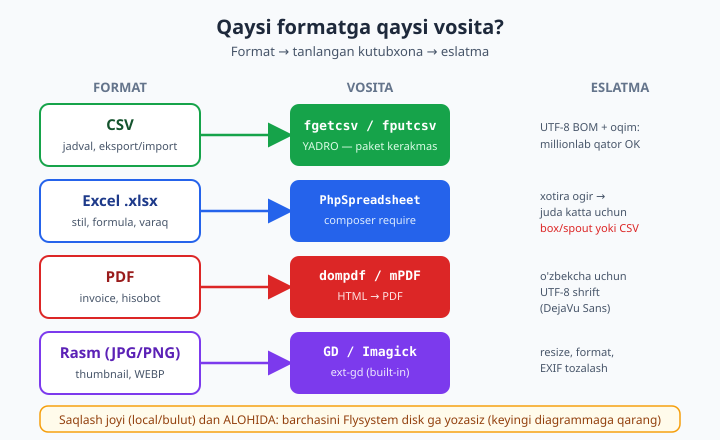
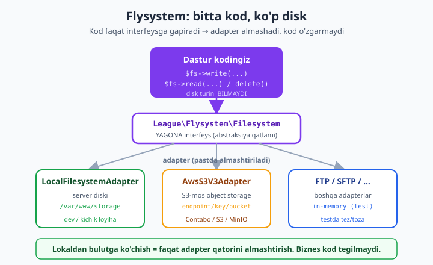

# 18 — Fayl formatlari, rasm va bulutli saqlash

[⬅️ Oldingi: 17 — Fayllar, oqimlar va katta ma'lumot](./17-fayllar-oqimlar.md) · [🏠 README](./README.md) · [Keyingi: README ➡️](./README.md)

> **Bu bobda:** 17-bobda baytlar, deskriptorlar va oqimlarning asosini qo'ydik. Endi shu asosning ustida **real dunyo formatlari** bilan ishlaymiz — har kuni biznes ilovasida uchraydigan to'rt narsa: **CSV** (eksport/import), **Excel** (`.xlsx` hisobot), **PDF** (invoice/hujjat) va **rasm** (yuklangan surat, thumbnail). So'ng eng muhimi — bularning hammasini **qayerga** saqlaymiz: lokal diskmi yoki bulutmi? Buni **Flysystem** abstraksiyasi bilan hal qilamiz, shunda lokaldan bulutga ko'chish kodga tegmasdan bo'ladi. **CSV** ni chuqur ko'ramiz: `fgetcsv`/`fputcsv`, ajratgich/qochirish belgisi, Excel uchun **UTF-8 BOM**, va million qatorni **RAM'ga olmasdan** oqim bilan o'qish/yozish. **Excel** uchun `phpoffice/phpspreadsheet`: o'qish/yozish, stil, `fromArray`, formula — va katta fayl ogohlantirish. **PDF** uchun `dompdf/dompdf`: HTML → PDF, o'zbekcha shrift muammosi va yechimi. **Rasm** uchun **GD**: yuklangan suratni resize/thumbnail, format aylantirish (JPG/PNG/WEBP), EXIF metadata tozalash (maxfiylik). **Bulut** uchun `league/flysystem`: yagona interfeys orqali `local`/`S3` disklarga `write`/`read`/`delete`, `writeStream` bilan katta fayl. Hamma kod haqiqiy `php` 8.4 + composer paketlar bilan ishga tushirilib tasdiqlangan: `.xlsx`, `.pdf`, thumbnail va disk fayllari **chindan** yaratildi.

---

## Nega bu bob alohida?

17-bobda biz "fayl" deganda baytlar ketma-ketligini — `fopen`, `fread`, `stream_copy_to_stream` — o'rgandik. Lekin amaliyotda fayl hech qachon shunchaki "baytlar" emas. U bir **format**ga ega: CSV — vergullar bilan ajratilgan jadval, XLSX — ichida XML bo'lgan ZIP arxiv, PDF — murakkab hujjat formati, JPEG — siqilgan piksel matritsasi. Har biriga o'z **vositasi** kerak.

Va bu yerda ikkita injenerlik qarori bor:

1. **Qaysi vosita?** Yadro (`fgetcsv`) yetadimi, yoki composer paketmi? Paketni qachon olib kelish kerak — bu xotira/tezlik kompromislari bilan bog'liq.
2. **Qayerda saqlash?** Lokal disk dev uchun yetadi, lekin production'da bir nechta server bo'lsa, yuklangan rasm hamma serverda bo'lishi kerak — demak **bulut** (object storage). Buni shunday yozish kerakki, lokaldan bulutga o'tish bitta qatorni o'zgartirish bo'lsin.

Quyidagi xarita — bu bobning skeletining birinchi yarmi: qaysi format qaysi vositaga ulanadi.



> **Ko'prik.** Bu bob 17-bobning ([fayllar, oqimlar va katta ma'lumot](./17-fayllar-oqimlar.md)) bevosita davomi — oqim g'oyasini (`fopen`/`fwrite`/`fgets`) shu yerda haqiqiy formatlarga qo'llaymiz. Foydalanuvchi yuklagan fayl asoslari uchun boshlovchi kitobdagi [fayl yuklash bo'limi](../php/fayl-yuklash.md) ga, lazy iteratsiya (generator) uchun esa [generatorlar](../php/generatorlar.md) ga tayanamiz.

---

## CSV chuqur: oddiy ko'rinadi, tuzoqlari ko'p

CSV (Comma-Separated Values) — eng keng tarqalgan ma'lumot almashish formati. "Vergul bilan ajrat, qator bilan tugat" — bolalar o'yini kabi. Lekin bir nechta nozik holat bor:

- Qiymat ichida **vergul** bo'lsa-chi? (`Toshkent, Yunusobod`)
- Qiymat ichida **qo'shtirnoq** bo'lsa-chi?
- Qiymat ichida **yangi qator** bo'lsa-chi?
- Excel o'zbekcha harflarni to'g'ri ochsin desangiz-chi?

Aynan shu sabab CSV ni **qo'lda** `explode(',', $line)` bilan parslash xato — u yuqoridagilarning hech birini hal qilmaydi. PHP yadrosida buning uchun ikki funksiya bor: `fputcsv` (yozish) va `fgetcsv` (o'qish). Ular qochirish (escaping) va o'rashni (quoting) avtomatik bajaradi.

### `fputcsv` / `fgetcsv` va UTF-8 BOM

```php
<?php
declare(strict_types=1);

// === CSV yozish: fputcsv ===
$tmp = tempnam(sys_get_temp_dir(), 'csv_');
$rows = [
    ['ism', 'shahar', 'izoh'],
    ['Oqil', 'Toshkent', 'oddiy'],
    ['Aziza', 'Samarqand', 'vergul, ichida'],   // vergul -> qo'shtirnoq bilan o'raladi
    ['Bek', 'Buxoro', 'qosh"tirnoq'],            // qo'shtirnoq -> ikkilantiriladi ("")
];
$fh = fopen($tmp, 'wb');
fwrite($fh, "\xEF\xBB\xBF");          // UTF-8 BOM (Excel o'zbekchani to'g'ri ochishi uchun)
foreach ($rows as $r) {
    // PHP 8.4: $escape ni ALBATTA bering (default o'zgaradi -> deprecation)
    fputcsv($fh, $r, separator: ',', enclosure: '"', escape: '\\');
}
fclose($fh);

echo "=== Xom fayl ===\n";
echo file_get_contents($tmp);

// === CSV o'qish: fgetcsv ===
echo "\n=== O'qilgan ===\n";
$fh = fopen($tmp, 'rb');
$first = fgets($fh);
if (str_starts_with((string) $first, "\xEF\xBB\xBF")) {
    fseek($fh, 3);   // BOM 3 bayt -> uni o'tkazib yubor
} else {
    rewind($fh);
}
$header = fgetcsv($fh, 0, ',', '"', '\\');
echo 'Sarlavha: ' . implode(' | ', $header) . "\n";
while (($row = fgetcsv($fh, 0, ',', '"', '\\')) !== false) {
    echo '  ' . implode(' / ', $row) . "\n";
}
fclose($fh);
unlink($tmp);
```

Haqiqiy chiqish (`php` bilan ishlatilgan):

```
=== Xom fayl ===
ism,shahar,izoh
Oqil,Toshkent,oddiy
Aziza,Samarqand,"vergul, ichida"
Bek,Buxoro,"qosh""tirnoq"

=== O'qilgan ===
Sarlavha: ism | shahar | izoh
  Oqil / Toshkent / oddiy
  Aziza / Samarqand / vergul, ichida
  Bek / Buxoro / qosh"tirnoq
```

Diqqat qiling, `fputcsv` o'zi qaror qildi:

- `vergul, ichida` — ichida vergul bor → butunlay `"..."` ga o'radi.
- `qosh"tirnoq` — ichida qo'shtirnoq bor → o'radi **va** ichki `"` ni `""` ga ikkilantirdi (CSV qoidasi).
- Oddiy qiymatlarga tegmadi.

O'qishda `fgetcsv` teskari ishni bajaradi — o'rashni yechib, ikkilangan qo'shtirnoqni qaytarib bitta qiladi. Siz hech narsa qilmaysiz. **`explode` hech qachon bunday qila olmaydi.**

> **PHP 8.4 muhim detali.** 8.4 dan boshlab `fputcsv`/`fgetcsv` ni `$escape` argumentisiz chaqirsangiz **deprecation** ogohlantirishi chiqadi (kelajakda default `''` bo'ladi). Shuning uchun bu bobda har joyda beshinchi argumentni — `'\\'` (yoki ataylab `''`) — aniq beramiz. Bu kelajakka tayyor kod.

**UTF-8 BOM nima uchun?** Microsoft Excel CSV ni ochganda, agar fayl boshida `\xEF\xBB\xBF` (BOM — Byte Order Mark) bo'lmasa, uni Windows-1252 deb taxmin qiladi va o'zbekcha/kirill harflarni buzadi. BOM ni qo'shsangiz — Excel "bu UTF-8" deb tushunadi va to'g'ri ochadi. O'qiyotganda esa o'zingiz BOM ni o'tkazib yuborishingiz kerak (yuqorida `fseek($fh, 3)`), aks holda birinchi ustun nomi `\xEF\xBB\xBFism` bo'lib qoladi.

### Katta CSV: oqim bilan, RAM'ga olmasdan

Endi muammo: 100 000 (yoki 10 million) qatorli CSV ni yaratish yoki o'qish kerak. Sodda yondashuv — hammasini massivga yig'ib, keyin `file_put_contents` — bu butun ma'lumotni RAM'ga oladi va katta faylda xotira tugaydi. To'g'ri yo'l: **har qatorni alohida** yozish/o'qish, oqim ochiq turganda.

O'qish tomonini yanada toza qilish uchun [generator](../php/generatorlar.md) ishlatamiz — u qatorlarni **lazy** (talab bo'lganda bittadan) beradi, butun faylni hech qachon RAM'ga olmaydi:

```php
<?php
declare(strict_types=1);

// === Katta CSV ni OQIM bilan yozish ===
$tmp = tempnam(sys_get_temp_dir(), 'big_');
$fh = fopen($tmp, 'wb');
fputcsv($fh, ['id', 'qiymat'], ',', '"', '\\');
for ($i = 1; $i <= 100_000; $i++) {
    fputcsv($fh, [$i, $i * 2], ',', '"', '\\');   // xotirada faqat bitta qator
}
fclose($fh);
echo 'Fayl hajmi: ' . round(filesize($tmp) / 1024, 1) . " KB\n";

/**
 * Generator: CSV ni qatorma-qator beradi (lazy, RAM'siz).
 * @return \Generator<int, array<int, string>>
 */
function csvQatorlar(string $yol): \Generator
{
    $fh = fopen($yol, 'rb');
    if ($fh === false) {
        throw new \RuntimeException("Ochib bo'lmadi: {$yol}");
    }
    try {
        while (($row = fgetcsv($fh, 0, ',', '"', '\\')) !== false) {
            yield $row;
        }
    } finally {
        fclose($fh);   // generator tugaganda yoki uzilsa ham fayl yopiladi
    }
}

// 100k qator ustidan yurib yig'indi — butun fayl RAM'ga OLINMAYDI
$jami = 0;
$sanoq = 0;
foreach (csvQatorlar($tmp) as $i => $row) {
    if ($i === 0) {
        continue; // sarlavhani o'tkaz
    }
    $jami += (int) $row[1];
    $sanoq++;
}
echo "Qatorlar: {$sanoq}, yigindi: {$jami}\n";
echo 'Peak RAM: ' . round(memory_get_peak_usage(true) / 1048576, 1) . " MB\n";
unlink($tmp);
```

Haqiqiy chiqish:

```
Fayl hajmi: 1204.4 KB
Qatorlar: 100000, yigindi: 10000100000
Peak RAM: 2 MB
```

E'tibor bering: **1.2 MB fayl, 100 000 qator — peak RAM bor-yo'g'i 2 MB**. Agar `file()` bilan butun faylni massivga o'qiganimizda, RAM o'nlab megabaytga shishar edi. Generator + `fgetcsv` — bu CSV uchun "cheksiz katta" yondashuv: fayl 1 GB bo'lsa ham xotira o'zgarmaydi. Bu 17-bobdagi oqim falsafasining bevosita amaliy davomi.

> **`finally` nega muhim?** Generator iste'molchi (`foreach`) o'rtada `break` qilsa ham, `finally` bloki ishlaydi va `fclose` chaqiriladi. Deskriptor "oqib ketmaydi".

---

## Excel (.xlsx): PhpSpreadsheet

CSV stilsiz, formulasiz, bir varaqli. Mijoz "chiroyli Excel hisobot" so'rasa — qalin sarlavha, ranglar, formulalar, bir nechta varaq kerak. `.xlsx` aslida ichida XML fayllar bo'lgan ZIP arxiv (shuning uchun `ext-zip` kerak — bizda bor). Uni qo'lda yozish azob; standart yechim — **`phpoffice/phpspreadsheet`**:

```bash
composer require phpoffice/phpspreadsheet
```

```php
<?php
declare(strict_types=1);

require __DIR__ . '/vendor/autoload.php';

use PhpOffice\PhpSpreadsheet\Spreadsheet;
use PhpOffice\PhpSpreadsheet\Style\Fill;
use PhpOffice\PhpSpreadsheet\Writer\Xlsx as XlsxWriter;
use PhpOffice\PhpSpreadsheet\IOFactory;

// === XLSX YOZISH ===
$spreadsheet = new Spreadsheet();
$sheet = $spreadsheet->getActiveSheet();
$sheet->setTitle('Hisobot');

// Sarlavha + ma'lumot bloki: fromArray (eng tez usul)
$sheet->fromArray(['Mahsulot', 'Soni', 'Narx'], null, 'A1');
$sheet->fromArray([
    ['Olma', 120, 8500],
    ['Banan', 80, 14000],
    ['Apelsin', 50, 17000],
], null, 'A2');

// Formula (Excel o'zi hisoblaydi)
$sheet->setCellValue('B5', '=SUM(B2:B4)');

// Oddiy stil: sarlavha qalin + sariq fon
$sheet->getStyle('A1:C1')->getFont()->setBold(true);
$sheet->getStyle('A1:C1')->getFill()
    ->setFillType(Fill::FILL_SOLID)
    ->getStartColor()->setRGB('FFE599');

$xlsx = tempnam(sys_get_temp_dir(), 'xls_') . '.xlsx';
(new XlsxWriter($spreadsheet))->save($xlsx);
echo 'XLSX yozildi: ' . round(filesize($xlsx) / 1024, 1) . " KB\n";

// === XLSX O'QISH ===
$loaded = IOFactory::load($xlsx);
$ws = $loaded->getActiveSheet();
echo 'Varaq: ' . $ws->getTitle() . "\n";
echo 'A1 = ' . $ws->getCell('A1')->getValue() . "\n";
echo 'A3 = ' . $ws->getCell('A3')->getValue()
   . ', B3 = ' . $ws->getCell('B3')->getValue() . "\n";
echo 'B5 (jami) = ' . $ws->getCell('B5')->getCalculatedValue() . "\n";

$matritsa = $ws->toArray();   // butun varaq -> PHP massiv
echo 'Qatorlar: ' . count($matritsa) . "\n";

unlink($xlsx);
$spreadsheet->disconnectWorksheets();   // xotirani bo'shat
```

Haqiqiy chiqish (`composer require phpoffice/phpspreadsheet` 5.8.0 bilan):

```
XLSX yozildi: 6.1 KB
Varaq: Hisobot
A1 = Mahsulot
A3 = Banan, B3 = 80
B5 (jami) = 250
Qatorlar: 5
```

Asosiy g'oyalar:

- **`fromArray($data, null, 'A1')`** — PHP massivni hujayralarga bir martada quyadi. Eng tez yozish usuli; har hujayrani `setCellValue` bilan alohida yozishdan yaxshiroq.
- **`getCell('A3')->getValue()`** vs **`getCalculatedValue()`** — birinchisi hujayradagi xom qiymatni (formula bo'lsa `=SUM(...)` matnini), ikkinchisi **hisoblangan** natijani beradi (`250`). PhpSpreadsheet formulalarni o'zi hisoblay oladi.
- **`disconnectWorksheets()`** — ishlatib bo'lgach chaqiring; PhpSpreadsheet ichki obyektlari bir-biriga aylanma havola qiladi, bu uni xotiradan bo'shatishga yordam beradi.

### Katta fayl ogohlantirish

PhpSpreadsheet **xotira jihatidan og'ir**: har hujayra ortida to'liq obyekt (stil, format, tip) saqlanadi. Taxminan, 100 000 qatorli stilsiz varaq ham yuzlab megabayt RAM yeyishi mumkin. Demak:

| Holat | Tavsiya |
|---|---|
| Chiroyli, kichik/o'rta hisobot (`.xlsx`, stil bilan) | PhpSpreadsheet — to'g'ri tanlov |
| Juda katta jadval, **stil shart emas** | CSV ga eksport qiling (RAM'siz oqim, yuqoriga qarang) |
| Juda katta `.xlsx` **shart** | `openspout/openspout` (eski `box/spout`) — oqim asosida, doimiy past RAM, lekin stil cheklangan |

Ya'ni "har doim PhpSpreadsheet" emas. Excel'da chiroyli ko'rinish kerak bo'lsa — u. Faqat ma'lumot kerak bo'lsa va u katta bo'lsa — CSV. Oraliq: `openspout`.

---

## PDF: dompdf bilan HTML → hujjat

Invoice, sertifikat, hisobot — bularning hammasi PDF. PHP'da PDF yaratishning eng qulay yo'li — **HTML/CSS yozib, uni PDF ga aylantirish**. Siz allaqachon HTML bilasiz (16-bobdagi Twig), shu bilimni qayta ishlatasiz. Standart kutubxona — **`dompdf/dompdf`**:

```bash
composer require dompdf/dompdf
```

```php
<?php
declare(strict_types=1);

require __DIR__ . '/vendor/autoload.php';

use Dompdf\Dompdf;
use Dompdf\Options;

// Hisobot ma'lumoti (odatda DB dan keladi)
$invoice = [
    'raqam' => 'INV-2026-014',
    'mijoz' => 'Oqil Imomnazarov',
    'qatorlar' => [
        ['Xizmat: veb-sayt', 1, 5_000_000],
        ['Xizmat: qollab-quvvatlash', 3, 500_000],
    ],
];
$jami = array_sum(array_map(fn($r) => $r[1] * $r[2], $invoice['qatorlar']));

// HTML qatorlarni qur
$tr = '';
foreach ($invoice['qatorlar'] as [$nom, $soni, $narx]) {
    $summa = number_format($soni * $narx, 0, '.', ' ');
    $tr .= "<tr><td>{$nom}</td><td style='text-align:center'>{$soni}</td>"
         . "<td style='text-align:right'>{$summa}</td></tr>";
}
$jamiFmt = number_format($jami, 0, '.', ' ');

// MUHIM: <meta charset="UTF-8"> + DejaVu Sans -> o'zbekcha to'g'ri chiqadi
$html = <<<HTML
<!DOCTYPE html><html lang="uz"><head><meta charset="UTF-8">
<style>
  body { font-family: DejaVu Sans, sans-serif; font-size: 12px; color: #1e293b; }
  h1 { color: #2563eb; }
  table { width: 100%; border-collapse: collapse; margin-top: 12px; }
  th, td { border: 1px solid #cbd5e1; padding: 6px 8px; }
  th { background: #e0e7ff; text-align: left; }
  .jami { font-weight: bold; background: #f1f5f9; }
</style></head><body>
  <h1>Hisob-faktura {$invoice['raqam']}</h1>
  <p>Mijoz: <strong>{$invoice['mijoz']}</strong></p>
  <p>O'zbekcha matn: tushuncha, qo'llanma, ishonch.</p>
  <table>
    <thead><tr><th>Tavsif</th><th>Soni</th><th>Summa (so'm)</th></tr></thead>
    <tbody>{$tr}
      <tr class="jami"><td colspan="2">JAMI</td><td style="text-align:right">{$jamiFmt}</td></tr>
    </tbody>
  </table>
</body></html>
HTML;

$options = new Options();
$options->set('defaultFont', 'DejaVu Sans');   // o'zbek glif qamrovi
$dompdf = new Dompdf($options);
$dompdf->loadHtml($html, 'UTF-8');
$dompdf->setPaper('A4', 'portrait');
$dompdf->render();

$pdf = tempnam(sys_get_temp_dir(), 'pdf_') . '.pdf';
file_put_contents($pdf, $dompdf->output());

echo 'PDF yozildi: ' . round(filesize($pdf) / 1024, 1) . " KB\n";
echo 'Sehrli imzo: ' . file_get_contents($pdf, false, null, 0, 5) . "\n"; // %PDF-
echo "Jami: {$jamiFmt} so'm\n";
unlink($pdf);
```

Haqiqiy chiqish (`composer require dompdf/dompdf` 3.1.5 bilan):

```
PDF yozildi: 18.8 KB
Sehrli imzo: %PDF-
Jami: 6 500 000 so'm
```

`%PDF-` — bu PDF faylining "sehrli imzosi" (magic bytes); uning borligi haqiqiy PDF yaratilganini tasdiqlaydi.

### O'zbekcha/UTF-8 shrift muammosi va yechimi

Bu — dompdf bilan eng ko'p uchraydigan tuzoq. Standart PDF shriftlari (Helvetica, Times) **faqat Lotin-1** belgilarini biladi. Agar siz `font-family` bermasangiz yoki Helvetica ishlatsangiz, o'zbekcha `o'`, `g'` yoki diakritikalar **bo'sh kvadrat** yoki yo'qolib chiqishi mumkin. Yechim ikki qadam:

1. HTML da `<meta charset="UTF-8">` va `loadHtml($html, 'UTF-8')` — kirishni to'g'ri o'qishi uchun.
2. **Unicode qamrovli shrift** ishlatish: dompdf ichida **DejaVu Sans** keladi va u o'zbek lotin (hatto kirill, diakritika) glifllarini qamraydi. Yuqoridagi kabi `font-family: DejaVu Sans` qo'ying.

Agar maxsus shrift (masalan brendingiz uchun) kerak bo'lsa, `.ttf` faylini dompdf'ning `fontDir` iga ro'yxatdan o'tkazasiz. Lekin oddiy o'zbekcha hisobot uchun **DejaVu Sans yetadi** — yuqoridagi misol aynan shuni isbotlaydi.

> **mPDF eslatma.** `mpdf/mpdf` — dompdf ga muqobil. Murakkab tipografiya, RTL (o'ngdan-chapga, arab/fors), yaxshiroq CSS qo'llab-quvvatlash kerak bo'lsa mPDF kuchliroq, lekin og'irroq. Oddiy invoice/hisobot uchun dompdf yengilroq va yetarli. Tanlov: dizayn murakkabligiga qarab.

---

## Rasm: GD bilan resize, thumbnail, format aylantirish

Foydalanuvchi avatar yoki mahsulot surati yuklaydi — siz uni **xom** holda saqlamaysiz: u 5 MB, 4000×3000 bo'lishi mumkin. Siz uni **kichraytirasiz** (thumbnail), **siqasiz** va ko'pincha **WEBP** ga aylantirasiz (kichikroq hajm). Buning uchun PHP'da `ext-gd` (bizda bor) yetadi — qo'shimcha composer paket shart emas.

### Thumbnail: imagescale va imagecopyresampled

```php
<?php
declare(strict_types=1);

// "Yuklangan" rasmni simulyatsiya qilamiz (1200x800)
$asl = imagecreatetruecolor(1200, 800);
imagefill($asl, 0, 0, imagecolorallocate($asl, 37, 99, 235));
imagefilledrectangle($asl, 100, 100, 1100, 700, imagecolorallocate($asl, 255, 255, 255));
$src = tempnam(sys_get_temp_dir(), 'src_') . '.png';
imagepng($asl, $src, 6);
imagedestroy($asl);

// 1) Yuklash
[$kenglik, $balandlik] = getimagesize($src);
$img = imagecreatefrompng($src);          // .jpg uchun: imagecreatefromjpeg
echo "O'lcham: {$kenglik}x{$balandlik}\n";

// 2) THUMBNAIL: nisbatni saqlab kenglikni 300 ga
$nisbat  = 300 / $kenglik;
$yangiH  = (int) round($balandlik * $nisbat);

// 2a) imagescale — sodda va tez (ichida resample qiladi)
$thumbA = imagescale($img, 300, $yangiH, IMG_BICUBIC);
echo 'imagescale:   ' . imagesx($thumbA) . 'x' . imagesy($thumbA) . "\n";

// 2b) imagecopyresampled — to'liq nazorat (crop, joylashtirish uchun)
$thumbB = imagecreatetruecolor(300, $yangiH);
imagecopyresampled($thumbB, $img, 0, 0, 0, 0, 300, $yangiH, $kenglik, $balandlik);
echo 'resampled:    ' . imagesx($thumbB) . 'x' . imagesy($thumbB) . "\n";

// 3) Saqlash (PNG siqish darajasi 9 = eng kichik)
$out = tempnam(sys_get_temp_dir(), 'th_') . '.png';
imagepng($thumbA, $out, 9);
echo 'Thumbnail fayl: ' . filesize($out) . " bayt\n";

imagedestroy($img);
imagedestroy($thumbA);
imagedestroy($thumbB);
@unlink($src);
@unlink($out);
```

Haqiqiy chiqish:

```
O'lcham: 1200x800
imagescale:   300x200
resampled:    300x200
Thumbnail fayl: 571 bayt
```

Ikki usul:

- **`imagescale($img, $w, $h, IMG_BICUBIC)`** — eng oddiy. Faqat kichraytirish/kattalashtirish kerak bo'lsa shuni ishlating. `IMG_BICUBIC` — silliq natija beradi.
- **`imagecopyresampled(...)`** — to'liq nazorat: manba va nishon to'rtburchaklarini alohida belgilaysiz. Bu sizga **crop** (qirqish), markazga joylashtirish, "cover/contain" mantiqini qo'lda yozish imkonini beradi. Murakkabroq, lekin moslashuvchan.

### Format aylantirish va sifat/siqish

Bir GD obyektini istalgan formatda saqlash mumkin — siz qaysi `image*` funksiyasini chaqirsangiz, o'sha format chiqadi:

```php
<?php
declare(strict_types=1);

// $thumb mavjud GD obyekti bo'lsin (yuqoridan).
// Bir obyekt -> uch xil format/sifat:

imagejpeg($thumb, 'rasm.jpg', 75);   // JPEG, sifat 0-100 (75 = yaxshi balans)
imagepng($thumb, 'rasm.png', 6);     // PNG, siqish 0-9 (yo'qotuvsiz)
imagewebp($thumb, 'rasm.webp', 80);  // WEBP, sifat 0-100 (odatda eng kichik hajm)
```

- **JPEG** — fotosuratlar uchun; sifat 75-85 odatda ko'z ilg'amas yo'qotish bilan kichik hajm beradi.
- **PNG** — shaffoflik (alpha) yoki keskin chiziqlar (logo, skrinshot) uchun; yo'qotuvsiz.
- **WEBP** — zamonaviy format, ko'pincha JPEG dan ham kichikroq. Veb uchun ideal; barcha zamonaviy brauzerlar qo'llab-quvvatlaydi.

> **Eslatma (GD build).** `imagejpeg`/`imagewebp` faqat GD JPEG/WEBP qo'llab-quvvatlash bilan kompilyatsiya qilingan bo'lsa ishlaydi. Productiondagi odatiy PHP buildida ular bor; tekshirish uchun `print_r(gd_info())` chaqiring — `JPEG Support` va `WebP Support` qatorlariga qarang. Yuqoridagi thumbnail misoli PNG bilan **haqiqatan ishga tushirildi** va 300×200 thumbnail chiqardi.

### EXIF metadata tozalash — maxfiylik va xavfsizlik

Telefonda olingan rasmda **EXIF** metadata bo'ladi: kamera modeli, sana, va ko'pincha **GPS koordinatalari** — ya'ni surat **qayerda** olingani. Agar foydalanuvchi yuklagan rasmni shu metadata bilan saqlasangiz, uning uy manzilini oshkor qilib qo'yishingiz mumkin. Bu — jiddiy maxfiylik teshigi.

Yaxshi xabar: GD orqali rasmni **qayta saqlasangiz** (yuqoridagi resize/convert), GD EXIF ni **ko'chirmaydi** — natija metadatasiz toza piksel bo'ladi. Ya'ni thumbnail jarayonining o'zi metadatani avtomatik tozalaydi:

```php
<?php
declare(strict_types=1);

// EXIF ni o'qish (faqat ko'rsatish uchun; ext-exif kerak)
// $asl = exif_read_data($yuklangan);   // GPS, kamera, sana bo'lishi mumkin

// GD orqali qayta saqlash -> EXIF avtomatik tushib qoladi:
$img = imagecreatefromjpeg($yuklangan);   // EXIF GD obyektiga O'TMAYDI
imagejpeg($img, $tozaFayl, 85);            // natija: metadatasiz toza rasm
imagedestroy($img);
// Endi $tozaFayl da GPS/kamera ma'lumoti YO'Q.
```

Qoida: foydalanuvchi yuklagan rasmni **doim qayta kodlang** (re-encode) — bu ham metadatani tozalaydi, ham potentsial zararli "polyglot" fayllarni (rasm ichiga yashiringan kod) zararsizlantiradi. Hech qachon yuklangan baytni ishonib o'sha holicha tarqatmang.

> **Imagick qisqa eslatma.** `ext-imagick` (ImageMagick o'rami) — GD ga kuchli muqobil: ko'proq format (PDF, TIFF, HEIC, SVG), yaxshiroq sifat va `stripImage()` bilan aniq metadata tozalash. Lekin alohida o'rnatish kerak va og'irroq. Oddiy resize/thumbnail uchun GD yetadi; professional rasm konveyeri (ko'p format, yuqori sifat) uchun Imagick'ga o'ting.

---

## Bulutli saqlash: Flysystem abstraksiyasi

Mana bobning yuragi. Yuqorida CSV, XLSX, PDF, rasm **yaratdik** — lekin ularni **qayerga** saqlaymiz? Dev mashinangizda `/storage/...` ga `file_put_contents` yetadi. Lekin production'da:

- Bir nechta veb-server bor → bir serverga saqlangan rasm boshqasida ko'rinmaydi.
- Disk to'ladi, zaxira (backup) kerak, CDN kerak.

Yechim — **object storage** (bulut): Amazon S3 yoki S3-mos xizmat (Contabo, MinIO, DigitalOcean Spaces). Lekin agar kodingiz to'g'ridan-to'g'ri S3 SDK ga bog'lansa, dev'da lokal, prod'da S3 ishlatish uchun kodni ikkiga ajaratishingiz kerak bo'ladi. **`league/flysystem`** aynan shuni hal qiladi: **yagona interfeys**, ostida turli **adapter** lar.

```bash
composer require league/flysystem league/flysystem-local
```



### Local disk bilan: write / read / delete / listContents

```php
<?php
declare(strict_types=1);

require __DIR__ . '/vendor/autoload.php';

use League\Flysystem\Filesystem;
use League\Flysystem\Local\LocalFilesystemAdapter;

// --- "disk" ni quramiz: bu yerda LOCAL adapter ---
$root = sys_get_temp_dir() . DIRECTORY_SEPARATOR . 'fly_' . bin2hex(random_bytes(4));
$adapter = new LocalFilesystemAdapter($root);
$fs = new Filesystem($adapter);

// --- YAGONA interfeys: disk turidan QAT'IY NAZAR bir xil API ---
$fs->write('hisobot/2026.txt', "Salom, Flysystem!\n");
echo 'Bor: '   . ($fs->fileExists('hisobot/2026.txt') ? 'ha' : 'yoq') . "\n";
echo "O'qish: " . trim($fs->read('hisobot/2026.txt')) . "\n";
echo 'Hajm: '   . $fs->fileSize('hisobot/2026.txt') . " bayt\n";
echo 'MIME: '   . $fs->mimeType('hisobot/2026.txt') . "\n";

// listContents — papka ichidagilar
$fs->write('hisobot/q1.txt', 'data');
foreach ($fs->listContents('hisobot', false) as $item) {
    echo '  list: ' . $item->path() . ' (' . $item->type() . ")\n";
}

// delete
$fs->delete('hisobot/2026.txt');
echo "O'chgach bor? " . ($fs->fileExists('hisobot/2026.txt') ? 'ha' : 'yoq') . "\n";

$fs->deleteDirectory('');   // tozalash
```

Haqiqiy chiqish (`composer require league/flysystem` 3.34.0 bilan):

```
Bor: ha
O'qish: Salom, Flysystem!
Hajm: 18 bayt
MIME: text/plain
  list: hisobot/2026.txt (file)
  list: hisobot/q1.txt (file)
O'chgach bor? yoq
```

Diqqat: yo'llar `/` bilan (`hisobot/2026.txt`) — Flysystem operatsion tizim farqini (Windows `\`) yashiradi. `fileExists`, `read`, `write`, `delete`, `fileSize`, `mimeType`, `listContents` — bularning hammasi **har qanday** adapterda bir xil ishlaydi.

> **Path traversal (xavfsizlik).** Saqlash yo'lining bir qismi foydalanuvchidan kelganida (masalan, yuklangan fayl nomi yoki URL segmenti) — `$fs->write("yuklamalar/{$userNomi}", ...)` kabi — `$userNomi` ichidagi `../` segmentlari saqlash papkasidan **chiqib ketishga** urinishi mumkin (`../../../etc/parol`), bu esa root tashqarisidagi fayllarni o'qish/yozishga olib keladigan klassik **path traversal** zaifligi. Yaxshi xabar: Flysystem 3.x yo'lni o'zi normallashtiradi va `..` bilan rootdan chiqishga urinishni **rad etadi** — `League\Flysystem\PathTraversalDetected` istisnosini otadi (`Path traversal detected: yuklamalar/../../../etc/parol`), demak adapter darajasida himoyalangansiz. Shunday bo'lsa-da, foydalanuvchi nomini ishonib qabul qilmang: uni oqartiring (sanitize) yoki o'zingiz nazorat qiladigan nom (masalan `bin2hex(random_bytes(8)) . '.png'`) bilan almashtiring — bu istisnoga umuman bormaslikning eng toza yo'li.

### Katta fayl: putStream / readStream (RAM'siz)

CSV/rasm katta bo'lsa, uni butunlay RAM'ga olib `write($path, $content)` qilish noto'g'ri. Flysystem **oqim** versiyasini beradi — `writeStream` va `readStream` — bu 17-bobdagi oqim falsafasining bulut darajasidagi davomi:

```php
<?php
declare(strict_types=1);

require __DIR__ . '/vendor/autoload.php';

use League\Flysystem\Filesystem;
use League\Flysystem\Local\LocalFilesystemAdapter;

$root = sys_get_temp_dir() . DIRECTORY_SEPARATOR . 'fly_' . bin2hex(random_bytes(4));
$fs = new Filesystem(new LocalFilesystemAdapter($root));

// 5 MB li manba fayl yasaymiz
$big = tempnam(sys_get_temp_dir(), 'big_');
$h = fopen($big, 'wb');
for ($i = 0; $i < 50_000; $i++) {
    fwrite($h, str_repeat('x', 100) . "\n");
}
fclose($h);

// writeStream: oqim bilan diskka -> butun fayl RAM'ga OLINMAYDI
$stream = fopen($big, 'rb');
$fs->writeStream('arxiv/katta.log', $stream);
if (is_resource($stream)) {
    fclose($stream);
}
echo 'Diskka yozildi: ' . $fs->fileSize('arxiv/katta.log') . " bayt\n";

// readStream: o'qish ham oqim bilan
$in = $fs->readStream('arxiv/katta.log');
$satrlar = 0;
while (!feof($in)) {
    if (fgets($in) !== false) {
        $satrlar++;
    }
}
fclose($in);
echo "readStream satrlar: {$satrlar}\n";
echo 'Peak RAM: ' . round(memory_get_peak_usage(true) / 1048576, 1) . " MB\n";

@unlink($big);
$fs->deleteDirectory('');
```

Haqiqiy chiqish:

```
Diskka yozildi: 5050000 bayt
readStream satrlar: 50000
Peak RAM: 12 MB
```

5 MB fayl oqim bilan yozildi va o'qildi, peak RAM 12 MB atrofida (asosiy qism — paketning autoload'i). Agar S3 adapteri bo'lsa, `writeStream` faylni **bo'laklab** (multipart) yuklaydi — gigabaytli faylni ham RAM'ni shishirtirmasdan bulutga jo'natadi. **Sizning kodingiz o'zgarmaydi** — faqat adapter S3 bo'ladi.

### S3 / object-storage adapter (config-misol)

S3-mos object storage'ga (Amazon S3, **Contabo Object Storage**, MinIO, DigitalOcean Spaces) ulanish uchun faqat **adapterni almashtirasiz** — yuqoridagi `write`/`read`/`writeStream` kodi **bir harf ham o'zgarmaydi**. Avval AWS adapterni o'rnatasiz:

```bash
composer require league/flysystem-aws-s3-v3
```

```php
<?php
declare(strict_types=1);

use Aws\S3\S3Client;
use League\Flysystem\Filesystem;
use League\Flysystem\AwsS3V3\AwsS3V3Adapter;

// S3-mos object storage klienti (Contabo/MinIO/Spaces uchun ham SHU)
$client = new S3Client([
    'version'                 => 'latest',
    'region'                  => 'eu-central-1',
    // S3-MOS xizmat uchun MUHIM: o'z endpoint'ini ko'rsating
    'endpoint'                => 'https://eu2.contabostorage.com',
    'use_path_style_endpoint' => true,   // ko'pchilik S3-mos xizmatda kerak
    'credentials'             => [
        'key'    => getenv('S3_KEY'),     // sirlarni .env / muhitdan oling, kodga yozmang
        'secret' => getenv('S3_SECRET'),
    ],
]);

$adapter = new AwsS3V3Adapter($client, bucket: 'mening-bucket');
$fs = new Filesystem($adapter);

// ...va shu nuqtadan keyin KOD AYNAN local bilan bir xil:
// $fs->write('hisobot/2026.xlsx', $bytes);
// $fs->writeStream('arxiv/katta.log', $stream);
// $fs->read(...), $fs->delete(...), $fs->listContents(...)
```

Bu blok **config-misol** — uni ishga tushirish uchun haqiqiy bucket va kalit kerak (shuning uchun yuqorida local adapterni ishga tushirib ko'rsatdik, S3 ni esa konfiguratsiya namunasi sifatida beramiz). E'tibor bering:

- `endpoint` + `use_path_style_endpoint` — aynan shu ikki sozlama Amazon bo'lmagan, lekin **S3-mos** xizmatlarga (Contabo, MinIO, DigitalOcean Spaces) ulanishga imkon beradi. Contabo Object Storage S3 API'ni gapiradi, shuning uchun bu adapter unga **to'g'ridan-to'g'ri** mos keladi.
- Kalitlarni hech qachon kodga yozmang — `getenv` / `.env` orqali muhitdan oling.

### Nega abstraksiya — asosiy daromad

Tasavvur qiling, dev'da local, production'da Contabo S3 ishlatmoqchisiz. Flysystem bilan butun farq — **bitta `match`**:

```php
<?php
declare(strict_types=1);

use League\Flysystem\Filesystem;
use League\Flysystem\Local\LocalFilesystemAdapter;
// use League\Flysystem\AwsS3V3\AwsS3V3Adapter;

function diskQur(string $muhit): Filesystem
{
    $adapter = match ($muhit) {
        'production' => /* new AwsS3V3Adapter($client, 'bucket') */ throw new \RuntimeException('S3 sozlang'),
        default      => new LocalFilesystemAdapter(__DIR__ . '/storage'),
    };
    return new Filesystem($adapter);
}

// Butun dastur shunchaki $disk->write(...) qiladi — qaysi disk ekanini bilmaydi.
```

Biznes kodingiz (`UserService`, `InvoiceController`, ...) **hech qachon** "S3" yoki "local" so'zini ko'rmaydi — u faqat `Filesystem` interfeysiga gapiradi. Lokaldan bulutga ko'chish = `match` ning bitta tarmog'ini yoqish. Bu — **Dependency Inversion** prinsipining (kod abstraksiyaga bog'lansin, konkret realizatsiyaga emas) sof amaliy ko'rinishi; xuddi 13-bobdagi [DI konteyner](./13-di-konteyner.md) g'oyasi kabi, lekin saqlash qatlamida.

---

## Hammasini birlashtirish: hisobotni yaratib bulutga oqim bilan

Endi bobning bo'laklarini bir konveyerga ulaymiz: **XLSX hisobot yaratish → uni Flysystem disk ga oqim bilan saqlash**. Bu real ilovadagi tipik vazifa (masalan, oylik hisobotni generatsiya qilib bulutga qo'yish):

```php
<?php
declare(strict_types=1);

require __DIR__ . '/vendor/autoload.php';

use League\Flysystem\Filesystem;
use League\Flysystem\Local\LocalFilesystemAdapter;
use PhpOffice\PhpSpreadsheet\Spreadsheet;
use PhpOffice\PhpSpreadsheet\Writer\Xlsx as XlsxWriter;

$disk = new Filesystem(new LocalFilesystemAdapter(
    sys_get_temp_dir() . DIRECTORY_SEPARATOR . 'integ_' . bin2hex(random_bytes(4))
));

// 1) Hisobotni yarat
$ss = new Spreadsheet();
$ss->getActiveSheet()->fromArray([
    ['Oy', 'Daromad'], ['Yanvar', 1200], ['Fevral', 1500],
]);

// 2) Vaqtinchalik faylga yoz (PhpSpreadsheet writer fayl/oqim talab qiladi)
$tmp = tempnam(sys_get_temp_dir(), 'xls_') . '.xlsx';
(new XlsxWriter($ss))->save($tmp);
$ss->disconnectWorksheets();

// 3) Oqim bilan disk ga ko'chir (katta hisobotda ham RAM shishmaydi)
$stream = fopen($tmp, 'rb');
$disk->writeStream('hisobotlar/daromad-2026.xlsx', $stream);
if (is_resource($stream)) {
    fclose($stream);
}
@unlink($tmp);

echo 'Diskda: ' . ($disk->fileExists('hisobotlar/daromad-2026.xlsx') ? 'ha' : 'yoq') . "\n";
echo 'Hajm: ' . $disk->fileSize('hisobotlar/daromad-2026.xlsx') . " bayt\n";
$disk->deleteDirectory('');
```

Haqiqiy chiqish:

```
Diskda: ha
Hajm: 6143 bayt
```

Bu yerda butun bob jamlangan: format kutubxonasi (PhpSpreadsheet) faylni yaratdi, saqlash abstraksiyasi (Flysystem) uni diskka oqim bilan qo'ydi. Agar `$disk` ni S3 adapteri bilan qursak — **shu kodning o'zi** hisobotni bulutga yuklaydi. Ana shu — abstraksiyaning kuchi.

---

## Mashqlar

### Oson

1. **TSV eksport.** `fputcsv` dan foydalanib, massiv ma'lumotni **vergul emas, tab** (`\t`) bilan ajratilgan faylga yozing va qaytadan o'qing. Faylga UTF-8 BOM qo'shing.
2. **GD o'lcham.** Berilgan PNG faylning kengligi 500 px dan katta bo'lsa, uni nisbatini saqlab 500 px ga kichraytiring; aks holda o'zgartirmang. `imagescale` ishlating.
3. **Flysystem nusxa.** Bitta local Flysystem disk ichida `manba/a.txt` faylini yozing, so'ng uni `nusxa/a.txt` ga ko'chiring (`copy` metodi) va ikkalasi ham borligini tasdiqlang.

### O'rta

4. **CSV → massiv (sarlavha kalit).** CSV faylni o'qib, **birinchi qatorni kalit** sifatida ishlatib, har qatorni assotsiativ massivga aylantiruvchi generator yozing (`['ism' => 'Oqil', 'shahar' => 'Toshkent']`). RAM'siz (generator) bo'lsin.
5. **XLSX'dan CSV.** PhpSpreadsheet bilan `.xlsx` ni o'qib, uning birinchi varag'ini CSV ga (BOM bilan) eksport qiling.

### Qiyin

6. **Markazga crop (cover) thumbnail.** `imagecopyresampled` bilan istalgan rasmdan **kvadrat** 200×200 thumbnail yasang: rasm to'rtburchak bo'lsa, markazidan kvadrat qirqib oling (cover rejimi — bo'sh joy qolmasin, cho'zilmasin).

<details markdown="1"><summary>Yechim — 1</summary>

```php
<?php
declare(strict_types=1);

$tmp = tempnam(sys_get_temp_dir(), 'tsv_');
$fh = fopen($tmp, 'wb');
fwrite($fh, "\xEF\xBB\xBF");                          // UTF-8 BOM
$rows = [['ism', 'shahar'], ['Oqil', 'Toshkent'], ['Aziza', 'Samarqand']];
foreach ($rows as $r) {
    fputcsv($fh, $r, "\t", '"', '\\');               // ajratgich = tab
}
fclose($fh);

$fh = fopen($tmp, 'rb');
fseek($fh, 3);                                        // BOM ni o'tkaz
while (($row = fgetcsv($fh, 0, "\t", '"', '\\')) !== false) {
    echo implode(' | ', $row) . "\n";
}
fclose($fh);
unlink($tmp);
```

`fputcsv`/`fgetcsv` ajratgich argumentini `"\t"` qilsangiz — bu TSV. Hammasi (BOM, escaping) bir xil ishlaydi.

</details>

<details markdown="1"><summary>Yechim — 2</summary>

```php
<?php
declare(strict_types=1);

function pngKichraytir(string $yol, int $maxKenglik = 500): \GdImage
{
    [$w, $h] = getimagesize($yol);
    $img = imagecreatefrompng($yol);
    if ($w <= $maxKenglik) {
        return $img;                                  // kerak emas
    }
    $nisbat = $maxKenglik / $w;
    $yangiH = (int) round($h * $nisbat);
    $kichik = imagescale($img, $maxKenglik, $yangiH, IMG_BICUBIC);
    imagedestroy($img);
    return $kichik;
}

// Sinov
$src = tempnam(sys_get_temp_dir(), 's_') . '.png';
imagepng(imagecreatetruecolor(800, 600), $src);
$out = pngKichraytir($src);
echo imagesx($out) . 'x' . imagesy($out) . "\n";      // 500x375
imagedestroy($out);
unlink($src);
```

`$w <= $maxKenglik` shartini birinchi tekshirib, keraksiz qayta ishlovni oldini olamiz — kichik rasm cho'zilib sifatini yo'qotmaydi.

</details>

<details markdown="1"><summary>Yechim — 3</summary>

```php
<?php
declare(strict_types=1);

require __DIR__ . '/vendor/autoload.php';

use League\Flysystem\Filesystem;
use League\Flysystem\Local\LocalFilesystemAdapter;

$fs = new Filesystem(new LocalFilesystemAdapter(
    sys_get_temp_dir() . DIRECTORY_SEPARATOR . 'cp_' . bin2hex(random_bytes(4))
));

$fs->write('manba/a.txt', 'salom');
$fs->copy('manba/a.txt', 'nusxa/a.txt');              // disk ichida nusxalash

echo 'Manba bor: ' . ($fs->fileExists('manba/a.txt') ? 'ha' : 'yoq') . "\n";
echo 'Nusxa bor: ' . ($fs->fileExists('nusxa/a.txt') ? 'ha' : 'yoq') . "\n";
echo "Nusxa mazmuni: " . $fs->read('nusxa/a.txt') . "\n";
$fs->deleteDirectory('');
```

`copy()` (va `move()`) — Flysystem metodi; S3 da ham xuddi shunday ishlaydi. Chiqish: ikkalasi ham `ha`, mazmun `salom`.

</details>

<details markdown="1"><summary>Yechim — 4</summary>

```php
<?php
declare(strict_types=1);

/**
 * CSV ni assotsiativ massivlar oqimi sifatida beradi (RAM'siz).
 * @return \Generator<int, array<string, string>>
 */
function csvAssoc(string $yol): \Generator
{
    $fh = fopen($yol, 'rb');
    if ($fh === false) {
        throw new \RuntimeException("Ochilmadi: {$yol}");
    }
    try {
        $first = fgets($fh);
        if (str_starts_with((string) $first, "\xEF\xBB\xBF")) {
            fseek($fh, 3);
        } else {
            rewind($fh);
        }
        $kalitlar = fgetcsv($fh, 0, ',', '"', '\\');  // birinchi qator = kalitlar
        if ($kalitlar === false) {
            return;
        }
        while (($row = fgetcsv($fh, 0, ',', '"', '\\')) !== false) {
            yield array_combine($kalitlar, $row);     // kalit + qiymat -> assoc
        }
    } finally {
        fclose($fh);
    }
}

// Sinov
$tmp = tempnam(sys_get_temp_dir(), 'c_');
file_put_contents($tmp, "ism,shahar\nOqil,Toshkent\nAziza,Samarqand\n");
foreach (csvAssoc($tmp) as $qator) {
    echo $qator['ism'] . ' -> ' . $qator['shahar'] . "\n";
}
unlink($tmp);
```

Kalit — `array_combine($kalitlar, $row)`; bu sarlavha nomlari va qator qiymatlarini juftlaydi. Generator bo'lgani uchun million qatorli CSV da ham RAM o'zgarmaydi.

</details>

<details markdown="1"><summary>Yechim — 5</summary>

```php
<?php
declare(strict_types=1);

require __DIR__ . '/vendor/autoload.php';

use PhpOffice\PhpSpreadsheet\IOFactory;

function xlsxToCsv(string $xlsx, string $csv): void
{
    $sheet = IOFactory::load($xlsx)->getActiveSheet();
    $fh = fopen($csv, 'wb');
    fwrite($fh, "\xEF\xBB\xBF");                       // Excel uchun BOM
    foreach ($sheet->toArray() as $row) {             // varaq -> qatorlar
        fputcsv($fh, $row, ',', '"', '\\');
    }
    fclose($fh);
}

// Sinov: avval kichik xlsx yasaymiz
$ss = new \PhpOffice\PhpSpreadsheet\Spreadsheet();
$ss->getActiveSheet()->fromArray([['Oy', 'Soni'], ['Yan', 10], ['Fev', 20]]);
$x = tempnam(sys_get_temp_dir(), 'x_') . '.xlsx';
(new \PhpOffice\PhpSpreadsheet\Writer\Xlsx($ss))->save($x);
$ss->disconnectWorksheets();

$c = tempnam(sys_get_temp_dir(), 'c_') . '.csv';
xlsxToCsv($x, $c);
echo file_get_contents($c);                           // BOM + 3 qator CSV
unlink($x);
unlink($c);
```

`toArray()` butun varaqni PHP massivga beradi, keyin har qatorni `fputcsv` bilan CSV ga yozamiz. Katta xlsx uchun `toArray` o'rniga `getRowIterator` bilan qatorma-qator yurish RAM'ni tejaydi.

</details>

<details markdown="1"><summary>Yechim — 6</summary>

```php
<?php
declare(strict_types=1);

/** Istalgan rasmdan markazdan qirqilgan kvadrat thumbnail (cover rejimi). */
function kvadratThumb(\GdImage $src, int $tomon = 200): \GdImage
{
    $w = imagesx($src);
    $h = imagesy($src);
    $qisqa = min($w, $h);                             // kvadrat tomoni = qisqa o'lcham
    $srcX = (int) (($w - $qisqa) / 2);                // markazga joylash
    $srcY = (int) (($h - $qisqa) / 2);

    $thumb = imagecreatetruecolor($tomon, $tomon);
    imagecopyresampled(
        $thumb, $src,
        0, 0,                                        // nishon x,y
        $srcX, $srcY,                                // manba x,y (markaz)
        $tomon, $tomon,                              // nishon o'lcham (kvadrat)
        $qisqa, $qisqa                               // manba o'lcham (kvadrat qirqim)
    );
    return $thumb;
}

// Sinov: 1200x800 rasm -> 200x200 markazdan
$asl = imagecreatetruecolor(1200, 800);
$t = kvadratThumb($asl, 200);
echo imagesx($t) . 'x' . imagesy($t) . "\n";          // 200x200
imagedestroy($asl);
imagedestroy($t);
```

Hiyla: manbadan **qisqa tomon bo'yicha kvadrat** (`min($w,$h)`) ni markazdan qirqib olamiz va uni nishon kvadratiga resample qilamiz. Natija — cho'zilmagan, chetlari kesilgan to'liq to'lgan kvadrat thumbnail (Instagram avatar uslubi).

</details>

---

## Xulosa va keyingisi

Bu bobda **amaliy I/O to'plamini** yakunladik — real biznes ilovasida har kuni kerak bo'ladigan formatlar va saqlash:

- **CSV** — yadro (`fgetcsv`/`fputcsv`) yetadi: u escaping/quoting ni o'zi qiladi (`explode` hech qachon emas). Excel uchun **UTF-8 BOM**, katta fayl uchun **oqim + generator** (100k qator → 2 MB RAM). PHP 8.4 da `$escape` ni aniq bering.
- **Excel `.xlsx`** — `phpoffice/phpspreadsheet`: `fromArray`, stil, formula (`getCalculatedValue`). Lekin **xotira og'ir** — juda katta uchun CSV yoki `openspout`.
- **PDF** — `dompdf/dompdf`: HTML → PDF. O'zbekcha uchun `<meta charset="UTF-8">` + **DejaVu Sans** shrift. Murakkab tipografiya uchun mPDF.
- **Rasm** — **GD** (paketsiz): `imagescale`/`imagecopyresampled` bilan thumbnail, format aylantirish (JPG/PNG/WEBP) sifat bilan, va yuklangan rasmni **qayta kodlash** orqali **EXIF/GPS metadatani tozalash** (maxfiylik). Professional konveyer uchun Imagick.
- **Bulutli saqlash** — `league/flysystem`: **yagona interfeys** (`write`/`read`/`delete`/`listContents`), katta fayl uchun `writeStream`/`readStream` (RAM'siz). Adapterni almashtirib (local → S3-mos object storage: Contabo/MinIO/Spaces) **kodga tegmasdan** bulutga ko'chasiz — bu Dependency Inversion ning saqlash qatlamidagi ko'rinishi.

Hammasi haqiqiy `php` 8.4 + composer paketlar bilan ishga tushirildi: `.xlsx`, `.pdf`, thumbnail va disk fayllari **chindan** yaratildi, oqim misollarida peak RAM o'lchandi.

Bu — **amaliy I/O bo'limining oxiri.** Sizda endi HTTP (1-2), avtorizatsiya (3-4), tiplar (5-9), PSR/framework internals (10-16) va fayl/format/saqlash (17-18) bor — to'liq backend asboblar to'plami. Keyingi tabiiy qadam — ikki yo'nalishdan biri: **(1) sifat va testlash** — PHPUnit, PHPStan (statik tahlil), mutation testing va CI quvuri bilan kodingiz **ishlashini emas, to'g'ri ekanini** avtomatik isbotlash; yoki **(2) performance va async** — OPcache/JIT, Fibers va doimiy ishlovchi serverlar (RoadRunner/Swoole) bilan PHP'ni keyingi tezlik bosqichiga olib chiqish. Ikkala yo'l ham shu yerda qurgan mustahkam asosga tayanadi.

---

[⬅️ Oldingi: 17 — Fayllar, oqimlar va katta ma'lumot](./17-fayllar-oqimlar.md) · [🏠 README](./README.md) · [Keyingi: README ➡️](./README.md)
