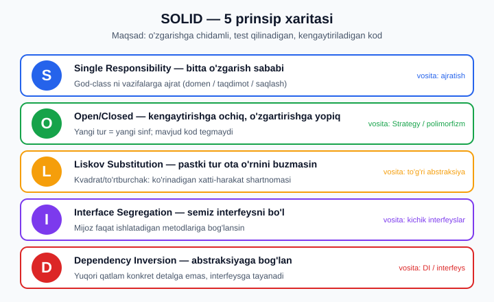
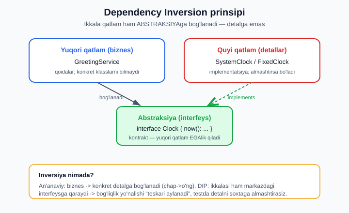

# 19 — SOLID prinsiplari (refactoring katalar)

[⬅️ Oldingi: 18 — Fayl formatlari, rasm va bulutli saqlash](./18-fayl-formatlari.md) · [🏠 README](./README.md) · [Keyingi: 20 — Design patterns (GoF) ➡️](./20-design-patterns.md)

> **Bu bobda:** Bu — sifat va testlash to'plamining (Wave 4) ochilishi. Boshlovchi kitobdagi [toza kod prinsiplari](../php/36-toza-kod-prinsiplari.md) ni **ekspert darajaga** ko'taramiz. Avval **nega** umuman prinsiplar kerak — kod nima uchun "chiriydi" va qaysi uch xususiyat (o'zgarishga chidamlilik, test qilinadiganlik, kengaytiriladiganlik) bizni qutqaradi. So'ng **SOLID** ning beshala harfini — **S**RP, **O**CP, **L**SP, **I**SP, **D**IP — birma-bir, har biri uchun bir xil sxema bilan ochamiz: aniq ta'rif → **yomon kod** (prinsip buzilgan) → **nega yomon** → **refactoring kata** (qadam-baqadam yaxshi kodga). Klassik misollar: SRP'da god-class ni ajratish, OCP'da Strategy bilan `if/switch` zanjirini yo'q qilish, LSP'da mashhur kvadrat/to'rtburchak tuzog'i, ISP'da semiz `Worker` interfeysini bo'lish, DIP'da `Clock`/`Logger` ni interfeys orqali ulash (bu [13-bob DI konteyner](./13-di-konteyner.md) ga ko'prik). Keyin **kod hidlari** (code smells) katalogi: long method, god class, feature envy, shotgun surgery, primitive obsession (→ [06-bob Value Object](./06-value-object.md)), data clumps — har biri uchun aniqlash belgisi va davo. **Anemic vs Rich** domen modelini taqqoslaymiz. Eng muhimi — prinsiplarni **aql bilan** qo'llashni o'rganamiz: SOLID dogma emas, va **over-engineering** (har joyga interfeys, har narsaga abstraksiya) ham xuddi spaghetti kabi zararli. Hamma refactoring kodi **haqiqiy** `php` 8.4.0 da ishga tushirildi; testga oid bo'limlar esa **chinakam** PHPUnit 11 va PHPStan (level 9) bilan run qilindi.

---

## Nega prinsiplar? Kod nima uchun chiriydi

Birinchi versiyada hamma kod chiroyli. Muammo **ikkinchi**, **uchinchi**, **o'ninchi** o'zgarishda boshlanadi. Yangi talab keladi — siz fayl ochasiz, lekin qaerga tegishni bilmaysiz; bitta joyni o'zgartirasiz — boshqa uchta joy buziladi; testdan o'tkazmoqchisiz — lekin sinf bazaga, vaqtga, tashqi API'ga shu qadar yopishganki, uni "yakka" sinab bo'lmaydi.

SOLID — Robert Martin (Uncle Bob) ommalashtirgan **beshta prinsip** to'plami. Ularning umumiy maqsadi bitta: kodni shunday tuzish kerakki, u uch xususiyatga ega bo'lsin.

1. **O'zgarishga chidamli (maintainable).** Bitta talab o'zgarsa, faqat **bitta** joyni o'zgartirish kerak — qolgan kod tegmaydi.
2. **Test qilinadigan (testable).** Sinfni atrof-muhitidan (baza, vaqt, tarmoq) **ajratib**, yakka sinab bo'ladi.
3. **Kengaytiriladigan (extensible).** Yangi xulq-atvor qo'shganda eski, ishlab turgan kodga **tegmaysiz** — faqat yangi kod yozasiz.

Bu uch xususiyat bir-biri bilan bog'liq: ko'pincha bir prinsip ikkitasini bir vaqtda yaxshilaydi. Quyidagi xarita beshala prinsipni bir qarashda ko'rsatadi — keyin har birini alohida ochamiz.



> **Boshlovchi ko'prigi.** Bu bob [toza kod prinsiplari](../php/36-toza-kod-prinsiplari.md) (nomlash, kichik funksiya, DRY) ni **chuqurlashtiradi**. U yerda "yaxshi kod nimaga o'xshaydi" degan intuitsiyani oldingiz; bu yerda esa shu intuitsiyani **nomlangan prinsiplar** va **mexanik refactoring qadamlari** ga aylantiramiz.

---

## S — Single Responsibility Principle (yagona javobgarlik)

**Ta'rif (aniq).** Sinfning **o'zgarishi uchun faqat bitta sabab** bo'lishi kerak. "Sabab" — bu kod o'zgarishini talab qiladigan **aktor** yoki **bo'lim**: domen qoidasi, ma'lumotni saqlash usuli, taqdimot formati — bular alohida sabablar.

E'tibor bering: SRP "sinf bitta ish qilsin" degani **emas** (juda noaniq bo'lardi). U "sinf bitta o'zgarish o'qiga ega bo'lsin" deydi.

### Yomon kod: god-class

```php
<?php
declare(strict_types=1);

// ❌ Bu sinf HAMMA NARSANI qiladi: hisoblash + formatlash + saqlash
final class Order
{
    /** @param list<array{narx:int, soni:int}> $items */
    public function __construct(public array $items) {}

    public function total(): int
    {
        $sum = 0;
        foreach ($this->items as $i) { $sum += $i['narx'] * $i['soni']; }
        return $sum;
    }

    // Sabab 1: taqdimot o'zgarsa (masalan, valyuta formati)
    public function toReceiptText(): string
    {
        return "Jami: " . $this->total() . " so'm";
    }

    // Sabab 2: saqlash usuli o'zgarsa (PDO -> boshqa baza)
    public function saveToDatabase(\PDO $pdo): void
    {
        $stmt = $pdo->prepare('INSERT INTO orders(total) VALUES(?)');
        $stmt->execute([$this->total()]);
    }

    // Sabab 3: chegirma qoidasi o'zgarsa (biznes mantiq)
    public function applyDiscount(): int
    {
        return $this->total() > 1_000_000 ? (int) round($this->total() * 0.10) : 0;
    }
}
```

### Nega yomon

Bu `Order` sinfining **uchta** o'zgarish sababi bor: marketing chegirma qoidasini o'zgartiradi, dizayner chekni boshqacha ko'rsatishni so'raydi, DBA bazani migratsiya qiladi. Uchta turli **aktor** bitta faylga tegadi — bu **to'qnashuv** (merge konflikt), test qilishning qiyinligi (chekni sinash uchun ham `PDO` kerak bo'ladi) va xatoning bir bo'limidan ikkinchisiga **sızib o'tishi** demakdir.

### Refactoring kata: vazifalarni ajratish

Har bir "sabab" uchun alohida sinf ajratamiz. `Order` faqat **ma'lumot va domen hisob-kitobi** bilan qoladi; formatlash, saqlash, chegirma — alohida.

```php
<?php
declare(strict_types=1);

final class Order
{
    /** @param list<array{narx:int, soni:int}> $items */
    public function __construct(public readonly array $items) {}

    public function total(): int
    {
        return array_sum(array_map(
            static fn(array $i): int => $i['narx'] * $i['soni'],
            $this->items
        ));
    }
}

// 1) Faqat hisob-kitob (domen mantiq)
final class DiscountCalculator
{
    public function discount(Order $order): int
    {
        $total = $order->total();
        return $total > 1_000_000 ? (int) round($total * 0.10) : 0;
    }
}

// 2) Faqat formatlash (taqdimot)
final class OrderFormatter
{
    public function toText(Order $order, int $discount): string
    {
        $total = $order->total();
        return sprintf(
            "Jami: %d so'm | Chegirma: %d so'm | To'lov: %d so'm",
            $total, $discount, $total - $discount
        );
    }
}

// 3) Faqat saqlash (infratuzilma) — interfeys orqali (DIP'ga ham mos)
interface OrderRepository
{
    public function save(Order $order): int;
}

final class InMemoryOrderRepository implements OrderRepository
{
    /** @var list<Order> */
    private array $store = [];

    public function save(Order $order): int
    {
        $this->store[] = $order;
        return count($this->store); // soxta ID
    }
}

// Yig'amiz va sinaymiz
$order = new Order([
    ['narx' => 700_000, 'soni' => 1],
    ['narx' => 400_000, 'soni' => 1],
]);

$calc = new DiscountCalculator();
$fmt  = new OrderFormatter();
$repo = new InMemoryOrderRepository();

$discount = $calc->discount($order);
$id = $repo->save($order);

echo $fmt->toText($order, $discount) . "\n";
echo "Saqlandi, ID=$id\n";
```

Ishga tushiramiz:

```text
Jami: 1100000 so'm | Chegirma: 110000 so'm | To'lov: 990000 so'm
Saqlandi, ID=1
```

Endi marketing `DiscountCalculator` ga, dizayner `OrderFormatter` ga, DBA `OrderRepository` implementatsiyasiga tegadi — uch aktor, uch fayl, hech qanday to'qnashuv. Bonus: `DiscountCalculator` ni `PDO`siz sinab bo'ladi.

> **Aql bilan.** SRP ni "har metodga alohida sinf" deb tushunmang. `Order::total()` ham domen hisob-kitobi — uni ajratish ortiqcha bo'lardi, chunki u `Order` ma'lumoti bilan **bir xil o'zgarish o'qida**. Sabab — aktor, satr soni emas.

---

## O — Open/Closed Principle (ochiq/yopiq)

**Ta'rif (aniq).** Modul **kengaytirishga ochiq, o'zgartirishga yopiq** bo'lishi kerak: yangi xulq-atvor qo'shganda **mavjud, ishlab turgan kodni o'zgartirmasdan** qo'shish mumkin bo'lsin.

Amaliyotda buzilishning belgisi — har yangi tur qo'shilganda kengayadigan **`switch`/`if-elseif` zanjiri**.

### Yomon kod: o'sib boruvchi switch

```php
<?php
declare(strict_types=1);

// ❌ Yangi yetkazib berish turi qo'shilsa — BU metodni har safar tahrirlash kerak
final class ShippingService
{
    public function cost(string $type, int $weightGr): int
    {
        if ($type === 'standard') {
            return 25_000 + (int) ceil($weightGr / 1000) * 5_000;
        } elseif ($type === 'express') {
            return 60_000 + (int) ceil($weightGr / 1000) * 9_000;
        } elseif ($type === 'pickup') {
            return 0;
        }
        throw new \InvalidArgumentException("Noma'lum tur: $type");
    }
}
```

### Nega yomon

"Drone bilan yetkazish" turi qo'shilsa, siz **sinab bo'lingan, ishlab turgan** `cost()` metodini ochib, ichiga yana bitta `elseif` qo'shasiz — ya'ni ishlayotgan kodga regressiya xavfini olib kirasiz. Zanjir o'nta turda o'qib bo'lmas holga keladi; har turning o'z testi yo'q, faqat bitta ulkan metod testi bor.

### Refactoring kata: Strategy + polimorfizm

Har turni **alohida sinf** qilamiz, umumiy **interfeys** ostida. `ShippingService` endi interfeysga bog'lanadi — yangi tur faqat yangi sinf.

```php
<?php
declare(strict_types=1);

interface ShippingStrategy
{
    public function cost(int $weightGr): int; // tiyinda
}

final class StandardShipping implements ShippingStrategy
{
    public function cost(int $weightGr): int { return 25_000 + (int) ceil($weightGr / 1000) * 5_000; }
}

final class ExpressShipping implements ShippingStrategy
{
    public function cost(int $weightGr): int { return 60_000 + (int) ceil($weightGr / 1000) * 9_000; }
}

final class PickupShipping implements ShippingStrategy
{
    public function cost(int $weightGr): int { return 0; }
}

// Bu sinf YOPIQ: yangi tur qo'shilsa, BU FAYL O'ZGARMAYDI
final class ShippingService
{
    public function __construct(private ShippingStrategy $strategy) {}

    public function quote(int $weightGr): string
    {
        return number_format($this->strategy->cost($weightGr), 0, '.', ' ') . " so'm";
    }
}

foreach ([
    'Standart' => new StandardShipping(),
    'Tezkor'   => new ExpressShipping(),
    'Olib ket' => new PickupShipping(),
] as $nom => $strategy) {
    $svc = new ShippingService($strategy);
    echo "$nom: " . $svc->quote(2500) . "\n";
}
```

Natija:

```text
Standart: 40 000 so'm
Tezkor: 87 000 so'm
Olib ket: 0 so'm
```

Endi `DroneShipping implements ShippingStrategy` qo'shasiz — `ShippingService` ham, qolgan strategiyalar ham **umuman o'zgarmaydi**. Har strategiya o'z testiga ega.

> **Aql bilan.** OCP "har `if` ni polimorfizmga aylantir" degani emas. Agar variantlar **ikkita** va kelajakda ko'paymasligi aniq bo'lsa, oddiy `if` toza va o'qilishi oson. Abstraksiyani **o'zgarish nuqtasi haqiqatan ko'paymoqda** ekanini ko'rganingizda kiriting — "Rule of Three" (uchinchi marta takrorlanganda umumlashtir). Bu — bo'limning oxiridagi over-engineering tanqidiga to'g'ridan-to'g'ri bog'liq.

---

## L — Liskov Substitution Principle (o'rnini bosish)

**Ta'rif (aniq).** Agar `S` — `T` ning pastki turi bo'lsa, dasturdagi `T` obyektlarini `S` obyektlari bilan **almashtirganda dastur to'g'riligi buzilmasligi** kerak. Bu nafaqat tip imzosi (signature) haqida — bu **ko'rinadigan xatti-harakat** (shartnoma) haqida: pastki tur ota sinfning va'dasini bajarishi shart.

LSP buzilishining klassik misoli — kvadrat/to'rtburchak.

### Yomon kod: Square extends Rectangle

```php
<?php
declare(strict_types=1);

// ❌ Matematik "kvadrat — to'rtburchakning turi" mantig'i kodga ko'chirildi
class Rectangle
{
    public function __construct(protected int $w, protected int $h) {}
    public function setWidth(int $w): void { $this->w = $w; }
    public function setHeight(int $h): void { $this->h = $h; }
    public function area(): int { return $this->w * $this->h; }
}

class Square extends Rectangle
{
    // Kvadrat: eni o'zgarsa, bo'yi ham o'zgarishi SHART
    public function setWidth(int $w): void { $this->w = $w; $this->h = $w; }
    public function setHeight(int $h): void { $this->w = $h; $this->h = $h; }
}

// Mijoz kodi Rectangle bilan ishlashga mo'ljallangan:
function stretchAndCheck(Rectangle $r): void
{
    $r->setWidth(5);
    $r->setHeight(4);
    // Mijozning kutilgani: eni 5, bo'yi 4 -> yuza 20
    echo "Yuza = " . $r->area() . " (kutilgan 20)\n";
}

stretchAndCheck(new Rectangle(1, 1)); // 20 — to'g'ri
stretchAndCheck(new Square(1, 1));    // 16 — ❌ shartnoma buzildi!
```

Ishga tushiramiz — `Square` mijozning kutganini buzadi:

```text
Yuza = 20 (kutilgan 20)
Yuza = 16 (kutilgan 20)
```

### Nega yomon

`Rectangle` ning **ko'rinadigan shartnomasi**: "enini o'zgartirsam, bo'yi tegmaydi". `Square` bu va'dani buzadi — `setHeight(4)` enini ham 4 ga tushiradi. Tip imzosi to'g'ri (kompilyatsiya o'tadi), lekin **xatti-harakat** mos emas. Demak `Square` ni `Rectangle` o'rnida ishlatib bo'lmaydi → LSP buzildi. Diqqat: muammo "kvadrat" yoki "to'rtburchak" da emas, balki **o'zgaruvchan (mutable) setter'lar** orqali meros qilishda.

### Refactoring kata: meros o'rniga umumiy abstraksiya + immutability

Ikkalasini ham `Shape` interfeysi ostiga olamiz (ulardan biri ikkinchisining **turi emas**), va o'zgartirishni **yangi obyekt qaytarish** (immutability) bilan almashtiramiz — shunda shartnomani buzib bo'lmaydi.

```php
<?php
declare(strict_types=1);

interface Shape
{
    public function area(): int;
}

final class Rectangle implements Shape
{
    public function __construct(
        public readonly int $width,
        public readonly int $height,
    ) {}

    public function area(): int { return $this->width * $this->height; }

    // "O'zgartirish" yangi obyekt qaytaradi — hech kim shartnomani buzolmaydi
    public function withWidth(int $w): self { return new self($w, $this->height); }
    public function withHeight(int $h): self { return new self($this->width, $h); }
}

final class Square implements Shape
{
    public function __construct(public readonly int $side) {}
    public function area(): int { return $this->side * $this->side; }
    public function withSide(int $s): self { return new self($s); }
}

// Mijoz kodi Shape abstraksiyasi bilan ishlaydi — area() shartnomasi har doim haqiqiy
function printArea(Shape $s): void
{
    echo $s::class . " yuza = " . $s->area() . "\n";
}

$r = (new Rectangle(1, 1))->withWidth(5)->withHeight(4);
printArea($r);                 // 20 — to'g'ri
printArea(new Square(4));      // 16 — to'g'ri, hech qanday "kutilmagan" yo'q
```

```text
Rectangle yuza = 20
Square yuza = 16
```

Endi `Square` `Rectangle` ning **o'rnini bosmaydi** — ikkalasi ham mustaqil `Shape`. `area()` shartnomasi har doim bajariladi. Immutability esa "enini o'zgartirsam bo'yi buziladi" muammosini ildizidan yo'q qiladi: `withWidth()` mavjud obyektni o'zgartirmaydi, yangisini yaratadi.

> **LSP qoidalari (xulq shartnomasi).** Pastki tur: (1) ota qabul qiladigan argumentlardan **ko'proq** ni qabul qilishi mumkin, lekin **kamroq** emas (kontravariant input); (2) ota qaytaradigan tipning **turini** qaytarishi mumkin (kovariant output); (3) ota tashlamaydigan **yangi tekshirilgan istisno** tashlamasligi; (4) ota o'rnatadigan invariantni **buzmasligi** kerak. PHP'ning tip tizimi (1) va (2) ni qisman tekshiradi (qarang: [05-bob tip tizimi](./05-tip-tizimi.md)), lekin (3) va (4) — sizning mas'uliyatingizda.

---

## I — Interface Segregation Principle (interfeys ajratish)

**Ta'rif (aniq).** Mijoz **o'zi ishlatmaydigan** metodlarga bog'liq bo'lishga majbur etilmasligi kerak. "Semiz" (fat) interfeysni — ko'p, har xil metodli — mijoz-aniq **kichik** interfeyslarga bo'lish kerak.

### Yomon kod: semiz Worker interfeysi

```php
<?php
declare(strict_types=1);

// ❌ Bitta "semiz" interfeys
interface Worker
{
    public function work(): string;
    public function eat(): string;
    public function sleep(): string;
}

final class HumanWorker implements Worker
{
    public function work(): string  { return 'ishlayapti'; }
    public function eat(): string   { return 'tushlik qilyapti'; }
    public function sleep(): string { return 'dam olyapti'; }
}

final class RobotWorker implements Worker
{
    public function work(): string  { return 'ishlayapti (24/7)'; }
    // Robot ovqat yemaydi, uxlamaydi — lekin interfeys MAJBURLAYDI
    public function eat(): string   { throw new \LogicException('Robot ovqat yemaydi'); }
    public function sleep(): string { throw new \LogicException('Robot uxlamaydi'); }
}
```

### Nega yomon

`RobotWorker` `eat()` va `sleep()` ni **majburan** implement qiladi — lekin ular uchun ma'noli xulq yo'q, shuning uchun istisno tashlaydi. Bu LSP'ni ham buzadi (`Worker` o'rnida `RobotWorker` ni ishlatgan mijoz `eat()` chaqirsa — kutilmagan istisno). Mijoz `runShift()` faqat `work()` ga muhtoj, lekin u butun semiz interfeysga bog'langan.

### Refactoring kata: kichik, mijoz-aniq interfeyslar

```php
<?php
declare(strict_types=1);

interface Workable { public function work(): string; }
interface Eatable   { public function eat(): string; }
interface Sleepable { public function sleep(): string; }

final class HumanWorker implements Workable, Eatable, Sleepable
{
    public function work(): string  { return 'ishlayapti'; }
    public function eat(): string   { return 'tushlik qilyapti'; }
    public function sleep(): string { return 'dam olyapti'; }
}

final class RobotWorker implements Workable
{
    public function work(): string  { return 'ishlayapti (24/7)'; }
    // eat()/sleep() YO'Q — robotga kerak emas, majburlanmaydi
}

// Mijoz faqat o'ziga kerakli kontraktga bog'lanadi
function runShift(Workable $w): void
{
    echo $w::class . ': ' . $w->work() . "\n";
}

function lunchBreak(Eatable $e): void
{
    echo $e::class . ': ' . $e->eat() . "\n";
}

runShift(new HumanWorker());
runShift(new RobotWorker());
lunchBreak(new HumanWorker());
// lunchBreak(new RobotWorker()); // ❌ tip xatosi — kompilyatsiya bosqichida tutiladi
```

```text
HumanWorker: ishlayapti
RobotWorker: ishlayapti (24/7)
HumanWorker: tushlik qilyapti
```

Endi `RobotWorker` faqat `Workable` ni implement qiladi. `lunchBreak()` ga robotni uzatib bo'lmaydi — bu xato **kompilyatsiya bosqichida** (PHP tip tekshiruvida), runtime'da emas, tutiladi. Har mijoz faqat o'ziga kerakli kichik kontraktga bog'lanadi.

> **PSR aloqasi.** ISP — [PSR standartlari](./10-psr-standartlar.md) ning dizayn falsafasi: shuning uchun PSR-7 da `RequestInterface` va `ResponseInterface` alohida, PSR-3 `LoggerInterface` faqat log metodlari bilan cheklangan. Kichik, fokusli interfeyslar — interoperabellikning asosi.

---

## D — Dependency Inversion Principle (bog'liqlik inversiyasi)

**Ta'rif (aniq).** (1) Yuqori darajadagi modullar quyi darajadagi modullarga **bog'liq bo'lmasligi** kerak — ikkalasi ham **abstraksiyaga** bog'lanishi kerak. (2) Abstraksiyalar detallarga bog'liq bo'lmasligi kerak — **detallar abstraksiyaga** bog'liq bo'lishi kerak.

Sodda qilib: biznes mantiq (yuqori qatlam) konkret `MysqlClock` yoki `FileLogger` (quyi qatlam, detallar) ni **bilmasligi** kerak — u faqat `Clock`, `Logger` **interfeyslari** bilan ishlasin.



### Yomon kod: konkretga bog'lanish

```php
<?php
declare(strict_types=1);

// ❌ Yuqori qatlam (biznes) konkret detalni o'zi YARATADI va unga BOG'LANADI
final class GreetingService
{
    public function greet(string $name): string
    {
        $hour = (int) (new \DateTimeImmutable('now'))->format('G'); // real soatga yopishgan
        echo '[LOG] Salomlashildi: ' . $name . "\n";                // echo'ga yopishgan
        $salom = $hour < 12 ? 'Xayrli tong' : ($hour < 18 ? 'Xayrli kun' : 'Xayrli kech');
        return "$salom, $name!";
    }
}
```

### Nega yomon

`greet()` ni **sinab bo'lmaydi**: natija real soatga bog'liq, shuning uchun "ertalab"ni tekshirish uchun kompyuter soatini o'zgartirishingiz kerak. `echo` log esa testni "ifloslantiradi". Yuqori qatlam (salomlashish qoidasi) quyi detallarga (`DateTimeImmutable::now`, `echo`) qotib qolgan.

### Refactoring kata: abstraksiyaga bog'lanish (DI)

Detallarni **interfeys** orqasiga yashiramiz va konstruktor orqali **tashqaridan** beramiz (bu — [13-bob DI konteyner](./13-di-konteyner.md) avtomatlashtiradigan jarayonning qo'lda varianti).

```php
<?php
declare(strict_types=1);

// Abstraksiya (yuqori qatlam EGAlik qiladi)
interface Clock
{
    public function now(): DateTimeImmutable;
}

interface Logger
{
    public function log(string $msg): void;
}

// Yuqori qatlam — faqat abstraksiyaga bog'liq, konkret klasslarni BILMAYDI
final class GreetingService
{
    public function __construct(
        private Clock $clock,
        private Logger $logger,
    ) {}

    public function greet(string $name): string
    {
        $hour = (int) $this->clock->now()->format('G');
        $salom = $hour < 12 ? 'Xayrli tong' : ($hour < 18 ? 'Xayrli kun' : 'Xayrli kech');
        $this->logger->log("Salomlashildi: $name");
        return "$salom, $name!";
    }
}

// Quyi qatlam (detallar) — abstraksiyani IMPLEMENT qiladi
final class SystemClock implements Clock
{
    public function now(): DateTimeImmutable { return new DateTimeImmutable('now'); }
}

final class EchoLogger implements Logger
{
    public function log(string $msg): void { echo "[LOG] $msg\n"; }
}

// Testda — soxta (fake) qatlamlar, hech qanday mock-kutubxonasiz
final class FixedClock implements Clock
{
    public function __construct(private string $iso) {}
    public function now(): DateTimeImmutable { return new DateTimeImmutable($this->iso); }
}

final class NullLogger implements Logger
{
    public function log(string $msg): void {}
}

// Production yig'ilishi
$svc = new GreetingService(new SystemClock(), new EchoLogger());
echo $svc->greet('Oqil') . "\n";

// Test yig'ilishi: vaqt qotirilgan -> determinli
$test = new GreetingService(new FixedClock('2026-06-12 08:00:00'), new NullLogger());
$out = $test->greet('Aziza');
echo $out . "\n";
assert($out === 'Xayrli tong, Aziza!');
echo "assert OK\n";
```

```text
[LOG] Salomlashildi: Oqil
Xayrli tong, Oqil!
Xayrli tong, Aziza!
assert OK
```

`GreetingService` endi `SystemClock` yoki `FixedClock` ekanini **bilmaydi** — u faqat `Clock` interfeysiga qaraydi. Bu **inversiya**: an'anaviy oqimda biznes mantiq konkret kutubxonaga bog'lanardi; DIP'da bog'liqlik yo'nalishi teskari aylanadi — detallar abstraksiyaga moslashadi. Va eng muhimi: test endi **determinli**, real soatga ham, terminalga ham bog'liq emas.

> **Interfeysga dasturlash.** DIP — "interfeysga dasturlash, implementatsiyaga emas" qoidasining nazariy asosi. [13-bob DI konteyner](./13-di-konteyner.md) da bu ko'rsatma `binding` (`bind(Clock::class, SystemClock::class)`) orqali avtomatlashtiriladi: konteyner konstruktordagi `Clock` tipini ko'rib, bog'langan konkret klassni o'zi qo'yadi.

---

## DIP'ni haqiqiy test bilan isbotlash (PHPUnit 11)

Bu — Wave 4 bobi, shuning uchun "test qilinadigan" da'voni **quruq gap** qilib qoldirmaymiz. DIP tufayli `GreetingService` ni `Clock` ni soxtalashtirib, **uch xil vaqtni** bitta data-provider bilan determinli sinaymiz. Quyidagi loyiha shu mashinada `composer require phpunit/phpunit` bilan o'rnatilib, **chinakam** ishga tushirildi.

`src/Clock.php` va `src/GreetingService.php` (namespace bilan):

```php
<?php
declare(strict_types=1);

namespace App;

interface Clock
{
    public function now(): \DateTimeImmutable;
}

final class GreetingService
{
    public function __construct(private Clock $clock) {}

    public function greet(string $name): string
    {
        $hour = (int) $this->clock->now()->format('G');
        $salom = $hour < 12 ? 'Xayrli tong' : ($hour < 18 ? 'Xayrli kun' : 'Xayrli kech');
        return "$salom, $name!";
    }
}
```

`tests/GreetingServiceTest.php` — `Clock` ni anonim sinf bilan soxtalashtiramiz (mock-kutubxonasiz):

```php
<?php
declare(strict_types=1);

namespace App\Tests;

use App\Clock;
use App\GreetingService;
use PHPUnit\Framework\Attributes\DataProvider;
use PHPUnit\Framework\TestCase;

final class GreetingServiceTest extends TestCase
{
    /** @return iterable<string, array{string, string}> */
    public static function vaqtlar(): iterable
    {
        yield 'ertalab'   => ['2026-06-12 08:00:00', 'Xayrli tong, Oqil!'];
        yield 'kunduzi'   => ['2026-06-12 14:00:00', 'Xayrli kun, Oqil!'];
        yield 'kechqurun' => ['2026-06-12 20:00:00', 'Xayrli kech, Oqil!'];
    }

    #[DataProvider('vaqtlar')]
    public function testGreetingDependsOnInjectedClock(string $iso, string $kutilgan): void
    {
        // DIP tufayli: vaqtni qotiramiz -> test determinli (real soatga bog'liq emas)
        $clock = new class($iso) implements Clock {
            public function __construct(private string $iso) {}
            public function now(): \DateTimeImmutable { return new \DateTimeImmutable($this->iso); }
        };

        $svc = new GreetingService($clock);
        self::assertSame($kutilgan, $svc->greet('Oqil'));
    }
}
```

`vendor/bin/phpunit --testdox` ning **haqiqiy** chiqishi:

```text
PHPUnit 11.5.55 by Sebastian Bergmann and contributors.

Runtime:       PHP 8.4.0

...                                                                 3 / 3 (100%)

Greeting Service (App\Tests\GreetingService)
 ✔ Greeting depends on injected clock with data set "ertalab"
 ✔ Greeting depends on injected clock with data set "kunduzi"
 ✔ Greeting depends on injected clock with data set "kechqurun"

OK (3 tests, 3 assertions)
```

Agar `GreetingService` eski versiyada qolib, `new DateTimeImmutable('now')` ni ichida yaratganida, bu uch testning **birortasini ham** ishonchli yozib bo'lmasdi. DIP — testlashning poydevori.

> **Coverage haqida (halol eslatma).** `vendor/bin/phpunit --coverage-text` qoplama foizini ko'rsatadi, lekin **bu muhitda ishlamaydi** — coverage uchun **Xdebug yoki pcov** kerak, ular bu mashinada o'rnatilmagan. Ko'rsatuv uchun, qoplama yoqilganda chiqish shunday bo'lardi:
>
> ```text
> Code Coverage Report:
>   Classes: 100.00% (1/1)
>   Methods: 100.00% (1/1)
>   Lines:   100.00% (4/4)
> ```
>
> Buni o'z muhitingizda olish uchun `pecl install pcov` (yoki Xdebug) o'rnatib, `phpunit.xml` ga `<coverage>` bloki qo'shing. Eslatma: yuqori **qoplama foizi** sifatni kafolatlamaydi — u faqat "kod ishga tushdi"ni bildiradi, "to'g'ri natija tekshirildi"ni emas. Aynan shuning uchun keyingi boblarda **mutation testing** (Infection) ni ko'ramiz — u testlaringiz haqiqatan xatoni ushlay oladimi yoki yo'qligini tekshiradi.

---

## Statik tahlil prinsiplarni qo'riqlaydi (PHPStan level 9)

SOLID — qo'lda kuzatiladigan dizayn intizomi, lekin **statik tahlilchi** uni mexanik tarzda qo'llab-quvvatlaydi. Yuqoridagi loyihada PHPStan'ni **level 9** (eng qattiq) da run qildik:

```neon
# phpstan.neon
parameters:
    level: 9
    paths:
        - src
        - tests
```

`vendor/bin/phpstan analyse --no-progress` ning haqiqiy natijasi:

```text
 [OK] No errors
```

PHPStan'ning generiklarni (`@template`) tushunishi LSP/tip-xavfsizligini kuchaytiradi. Quyidagi tipga xavfsiz to'plamda **ataylab xato** kiritamiz:

```php
<?php
declare(strict_types=1);

namespace App;

/**
 * @template T
 */
final class TypedCollection
{
    /** @var list<T> */
    private array $items = [];

    /** @param T $item */
    public function add(mixed $item): void { $this->items[] = $item; }

    /** @return list<T> */
    public function all(): array { return $this->items; }
}

/** @var TypedCollection<int> $nums */
$nums = new TypedCollection();
$nums->add(1);
$nums->add('salom'); // ❌ PHPStan tip xatosi
```

PHPStan'ning **haqiqiy** chiqishi:

```text
 ------ ------------------------------------------------------------------------------------------
  Line   ...
 ------ ------------------------------------------------------------------------------------------
  ...    Parameter #1 $item of method App\TypedCollection<int>::add() expects int, string given.
         🪪  argument.type
 ------ ------------------------------------------------------------------------------------------

 [ERROR] Found 1 error
```

> **Cross-link.** PHP'da generiklar — bu **PHPStan/Psalm darajasidagi** PHPDoc mexanizmi (`@template`, `@param T`, `@return list<T>`), runtime tip emas. **Generiklar tushunchasi, variance va kovariantlik** TypeScript kitobida chuqurroq ([typescript/README.md](../typescript/README.md)); bu yerda biz faqat PHP'dagi `@template` **mexanikasi** va u SOLID (ayniqsa LSP va DIP) ni qanday qo'riqlashini ko'rsatamiz.

> **CI darvozasi.** Bu ikki vosita (PHPStan → PHPUnit) odatda CI'da **sifat darvozasi** sifatida ketma-ket ishlaydi: `lint → phpstan → test`. **GitHub Actions mexanikasi** (workflow YAML, matritsa, kesh) foydalanuvchining Git kitobida batafsil ([git-github/README.md](../git-github/README.md)); bu yerda faqat **PHP sifat-darvozasi mazmuni** muhim: statik tahlil bug'ni runtime'gacha, test esa regressiyani merge'gacha tutadi.

---

## Code smells: hidlarni tanish va davolash

"Code smell" (kod hidi) — bu xato emas, balki **chuqurroq muammoning belgisi**: kod ishlaydi, lekin dizaynda nimadir noto'g'ri. Mana eng keng tarqalgan oltitasi, har biri uchun **belgisi** va **davosi**.

### 1. Long method (uzun metod)

**Belgi:** metod ekranga sig'maydi, ichida bir nechta mantiqiy "bo'lim" bor (ko'pincha bo'sh qator yoki izoh bilan ajratilgan).
**Davo:** **Extract Method** — har bo'limni ma'noli nomli alohida metodga ajrat. Agar metod 10-15 qatordan oshsa — shubhalaning.

### 2. God class (xudo-sinf)

**Belgi:** sinfda o'nlab metod, yuzlab qator; nomi `Manager`, `Processor`, `Helper`, `Util` kabi noaniq.
**Davo:** SRP — o'zgarish sabablari bo'yicha ajrat (yuqoridagi `Order` misoli).

### 3. Feature envy (xususiyatga hasad)

**Belgi:** metod o'z sinfining maydonlaridan ko'ra **boshqa obyektning** maydonlari/metodlariga ko'proq murojaat qiladi — ya'ni "u yerda bo'lishni xohlaydi".

**Davo:** mantiqni **ma'lumot egasiga** ko'chir (Move Method). Quyida `InvoiceLine` narx hisobini titkilash o'rniga `Money` o'zi hisoblaydi:

```php
<?php
declare(strict_types=1);

final class Money
{
    public function __construct(
        public readonly int $amount,   // tiyinda
        public readonly string $currency = 'UZS',
    ) {}

    // Mantiq EGAsida: Money o'zini qo'shadi/ko'paytiradi
    public function add(Money $other): self
    {
        if ($this->currency !== $other->currency) {
            throw new \InvalidArgumentException('Valyutalar mos emas');
        }
        return new self($this->amount + $other->amount, $this->currency);
    }

    public function multiply(int $factor): self
    {
        return new self($this->amount * $factor, $this->currency);
    }

    public function format(): string
    {
        return number_format($this->amount / 100, 2, '.', ' ') . ' ' . $this->currency;
    }
}

final class InvoiceLine
{
    public function __construct(
        public readonly Money $price,
        public readonly int $qty,
    ) {}

    // Endi InvoiceLine boshqa obyekt maydonlarini titkilamaydi
    public function subtotal(): Money { return $this->price->multiply($this->qty); }
}

final class Invoice
{
    /** @param list<InvoiceLine> $lines */
    public function __construct(private array $lines) {}

    public function total(): Money
    {
        $sum = new Money(0);
        foreach ($this->lines as $line) {
            $sum = $sum->add($line->subtotal());
        }
        return $sum;
    }
}

$inv = new Invoice([
    new InvoiceLine(new Money(150_00), 3),
    new InvoiceLine(new Money(99_00), 2),
]);

echo 'Jami: ' . $inv->total()->format() . "\n"; // Jami: 648.00 UZS
```

### 4. Shotgun surgery (miltiq jarrohligi)

**Belgi:** bitta o'zgarish (masalan, "valyuta formatini o'zgartirish") sizni **ko'p faylga** birato'la teginishga majbur qiladi — mantiq tarqab ketgan.
**Davo:** tarqalgan mantiqni **bitta joyga** to'pla (yuqoridagi `Money::format()` — formatlash endi bitta joyda, hamma uni chaqiradi). Bu SRP/DRY ning ikki tomoni: SRP — "bitta sinf bir sababdan o'zgaradi"; shotgun surgery — uning teskarisi: "bitta sabab ko'p sinfni o'zgartiradi".

### 5. Primitive obsession (primitivlarga ruju)

**Belgi:** domen tushunchasi (email, pul, indeks) **xom `string`/`int`** bilan ifodalanadi; validatsiya har joyda takrorlanadi.

**Davo:** **Value Object** — qarang: [06-bob](./06-value-object.md). Quyida `Email` xom satr o'rnida:

```php
<?php
declare(strict_types=1);

final class Email
{
    public function __construct(public readonly string $value)
    {
        if (!filter_var($value, FILTER_VALIDATE_EMAIL)) {
            throw new \InvalidArgumentException("Yaroqsiz email: $value");
        }
    }

    public function domain(): string { return substr(strrchr($this->value, '@') ?: '@', 1); }
}

echo (new Email('oqil@ioqil.uz'))->domain() . "\n"; // ioqil.uz

// Yaroqsiz ma'lumot OBYEKT YARATISHDA tutiladi, biznes mantiqqa yetib bormaydi
try {
    new Email('notmail');
} catch (\InvalidArgumentException $e) {
    echo 'Tutildi: ' . $e->getMessage() . "\n"; // Tutildi: Yaroqsiz email: notmail
}
```

### 6. Data clumps (ma'lumot to'dasi)

**Belgi:** bir necha o'zgaruvchi (`$street, $city, $zip`) **har joyda birga** sayohat qiladi — parametr ro'yxatida, maydon to'plamida.

**Davo:** ularni **bitta obyektga** birlashtir (bu ham Value Object):

```php
<?php
declare(strict_types=1);

final class Address
{
    public function __construct(
        public readonly string $street,
        public readonly string $city,
        public readonly string $zip,
    ) {
        if (!preg_match('/^\d{6}$/', $zip)) {
            throw new \InvalidArgumentException("Noto'g'ri pochta indeksi: $zip");
        }
    }

    public function oneLine(): string { return "{$this->street}, {$this->city} {$this->zip}"; }
}

echo (new Address('Amir Temur 1', 'Toshkent', '100000'))->oneLine() . "\n";
// Amir Temur 1, Toshkent 100000
```

Endi `$street, $city, $zip` o'rniga hamma joyda bitta `Address` yuradi — parametr ro'yxati qisqaradi, validatsiya bir joyda, va indeks formati invariant sifatida himoyalangan.

---

## Anemic vs Rich domen modeli

**Anemic** (qonsiz) model — sinf faqat ma'lumotni saqlaydi (getter/setter), biznes qoidalari esa tashqarida, alohida "Service" sinflarida tarqalgan. Bu obyektga yo'naltirilgan ko'rinadi, lekin aslida **protsedura dasturlash**: ma'lumot va u ustidagi amallar **ajralgan**.

**Rich** (boy) model — biznes qoidalari va invariantlar **obyekt ichida** himoyalangan; obyektni hech qachon **noto'g'ri holatga** o'tkazib bo'lmaydi.

Quyida bank hisobi — rich variant. Diqqat: `$balance` private, va uni faqat `deposit`/`withdraw` orqali, **qoidalar tekshirgandan keyin** o'zgartirish mumkin:

```php
<?php
declare(strict_types=1);

final class BankAccount
{
    private int $balance; // tiyinda

    public function __construct(int $opening = 0)
    {
        if ($opening < 0) {
            throw new \InvalidArgumentException("Boshlang'ich balans manfiy bo'lolmaydi");
        }
        $this->balance = $opening;
    }

    public function balance(): int { return $this->balance; }

    public function deposit(int $amount): void
    {
        $this->guardPositive($amount);
        $this->balance += $amount;
    }

    public function withdraw(int $amount): void
    {
        $this->guardPositive($amount);
        if ($amount > $this->balance) {
            throw new \DomainException('Mablag\' yetarli emas');
        }
        $this->balance -= $amount;
    }

    private function guardPositive(int $amount): void
    {
        if ($amount <= 0) {
            throw new \InvalidArgumentException('Summa musbat bo\'lishi kerak');
        }
    }
}

$acc = new BankAccount(100_00);
$acc->deposit(50_00);
$acc->withdraw(30_00);
echo 'Balans: ' . number_format($acc->balance() / 100, 2) . " so'm\n"; // 120.00

// Invariant himoyalangan: balansni manfiyga tushirib bo'lmaydi
try {
    $acc->withdraw(10_000_00);
} catch (\DomainException $e) {
    echo 'Tutildi: ' . $e->getMessage() . "\n"; // Mablag' yetarli emas
}
echo 'Yakuniy balans: ' . number_format($acc->balance() / 100, 2) . " so'm\n"; // hali 120.00
```

```text
Balans: 120.00 so'm
Tutildi: Mablag' yetarli emas
Yakuniy balans: 120.00 so'm
```

Anemic variantda `BankAccount` faqat `getBalance()/setBalance()` bo'lardi, "mablag' yetarlimi" tekshiruvi esa `TransferService` ichida — va kimdir uni chaqirishni unutsa, balans manfiyga tushardi. Rich modelda buni **qilib bo'lmaydi**: obyekt o'z invariantini o'zi qo'riqlaydi.

> **Aql bilan.** Hamma narsa rich bo'lishi shart emas. **CRUD** ekranlar (oddiy ma'lumot kiritish/ko'rish) uchun anemic DTO mutlaqo to'g'ri — u yerda biznes qoidasi deyarli yo'q. Rich model **murakkab domen qoidalari** bo'lgan joyda (pul, buyurtma holati, ruxsatlar) o'zini oqlaydi. Domen murakkabligiga qarab tanlang.

---

## SOLID'ni aql bilan: dogma emas

Eng muhim bo'lim. SOLID — **fikrlash vositasi**, qonun emas. Uni ko'r-ko'rona qo'llash **over-engineering** ga olib keladi, va u spaghetti kod kabi zararli — ba'zan undan ham battar, chunki "toza" niqobi ostida yashiringan.

**Over-engineering belgilari:**

- **Har sinfga interfeys.** `UserService` ning yagona implementatsiyasi bor, lekin "balki kelajakda kerak bo'lar" deb `UserServiceInterface` yaratilgan. Bu — **YAGNI** (You Aren't Gonna Need It) buzilishi. Ikkinchi implementatsiya **paydo bo'lganda** interfeys ajrating — bu IDE bilan 5 soniyalik ish.
- **Bir martalik abstraksiya.** Faqat bir joyda ishlatiladigan Strategy/Factory — qatlam qo'shadi, lekin moslashuvchanlik bermaydi.
- **Anemic + ko'p qatlam.** Oddiy CRUD uchun Entity → DTO → Mapper → Repository → Service → Controller besh qatlam — kod miqdori 5 barobar, qiymat nol.

**Muvozanat qoidalari:**

1. **Rule of Three.** Birinchi marta — yoz. Ikkinchi marta takrorlansa — chida. **Uchinchi** marta — umumlashtir. Erta abstraksiya ko'pincha **noto'g'ri** abstraksiya bo'ladi.
2. **YAGNI > har ehtimolga.** Kelajakdagi taxminiy talab uchun bugun murakkablik qo'shmang. O'zgarish kelganda refactoring qiling — toza kod buni arzon qiladi.
3. **Refactoring — uzluksiz.** SOLID'ni oldindan "to'g'ri" qilishga urinmang. Avval ishlaydigan oddiy kod yozing, smell paydo bo'lganda mos prinsip bilan tozalang. Test (yuqorida ko'rdik) — bu refactoringni **xavfsiz** qiladigan to'r.

> **Xulosa.** SOLID — "qachon va qanday qilib murakkablik qo'shish kerak"ning javobi. Murakkablikni **ehtiyojga qarab** qo'shing, ehtimolga qarab emas. Eng yaxshi kod — masalani yechadigan **eng sodda** kod; SOLID esa u o'sganda **toza o'sishi** uchun yo'l xaritasi.

---

## Mashqlar

### Oson

1. **SRP buzilishini toping.** Sizga `class Report { fetch(); render(); email(); }` berildi. Uning nechta o'zgarish sababi bor? Har birini nomlang va sinflarga qanday ajratardingiz?
2. **OCP smell.** Quyidagi metodning OCP'ni buzayotgan qismini ko'rsating: `function area(string $shape, float $a, float $b) { if ($shape==='rect') return $a*$b; if ($shape==='tri') return $a*$b/2; }`. Refactoring g'oyasini bir gapda ayting.

### O'rta

3. **DIP refactoring.** Quyidagi sinf `file_get_contents` ga to'g'ridan-to'g'ri bog'langan: `class Config { function load() { return json_decode(file_get_contents('config.json'), true); } }`. Uni `ConfigSource` interfeysi orqali test qilinadigan qilib qayta yozing va `ArrayConfigSource` bilan sinab ko'ring.
4. **ISP.** `interface Printer { print(); scan(); fax(); }` berilgan. Oddiy printer faqat `print()` qila oladi. Interfeysni ISP bo'yicha bo'ling va `SimplePrinter` hamda `AllInOne` sinflarini yozing.

### Qiyin

5. **LSP tuzog'i.** `class Bird { fly(); }` dan `Penguin extends Bird` qilingan, lekin pingvin ucholmaydi (`fly()` istisno tashlaydi). Bu nega LSP'ni buzadi? Iyerarxiyani qanday qayta loyihalashtirardingiz? Ishlaydigan refactoring kod yozing.
6. **Code smell katalogi.** Quyidagi parametr ro'yxatida qaysi smell bor va uni qanday davolaysiz: `function createUser(string $fname, string $lname, string $street, string $city, string $zip, string $country)`? Refactoring kodini yozing va `php` da ishga tushiring.

---

<details markdown="1"><summary>Yechim — 1</summary>

`Report` ning **uch** o'zgarish sababi bor: (a) **ma'lumot olish** mantig'i o'zgarsa (`fetch` — baza/API), (b) **taqdimot** o'zgarsa (`render` — HTML/PDF format), (c) **yetkazish** o'zgarsa (`email` — SMTP/xabar kanali). Ajratish: `ReportDataProvider` (fetch), `ReportRenderer` (render), `ReportMailer` (email). `Report` o'zi faqat ma'lumot konteyneri bo'lib qoladi. Har aktor (DBA, dizayner, devops) o'z sinfiga tegadi.

</details>

<details markdown="1"><summary>Yechim — 2</summary>

OCP'ni buzayotgani — har yangi shakl qo'shilganda kengayadigan `if ($shape===...)` zanjiri: yangi shakl = mavjud `area()` ni tahrirlash. Refactoring g'oyasi: `interface Shape { area(): float; }` yaratib, har shaklni alohida sinf qil (`Rectangle`, `Triangle implements Shape`) — yangi shakl endi faqat yangi sinf, `area()` chaqiruvchi kod tegmaydi (xuddi bobdagi `ShippingStrategy` kabi).

</details>

<details markdown="1"><summary>Yechim — 3</summary>

```php
<?php
declare(strict_types=1);

interface ConfigSource
{
    public function read(): string;
}

final class FileConfigSource implements ConfigSource
{
    public function __construct(private string $path) {}
    public function read(): string { return file_get_contents($this->path) ?: '{}'; }
}

final class ArrayConfigSource implements ConfigSource
{
    public function __construct(private array $data) {}
    public function read(): string { return json_encode($this->data, JSON_THROW_ON_ERROR); }
}

final class Config
{
    public function __construct(private ConfigSource $source) {}

    /** @return array<string, mixed> */
    public function load(): array
    {
        return json_decode($this->source->read(), true, flags: JSON_THROW_ON_ERROR);
    }
}

// Test — fayl YO'Q, determinli
$cfg = new Config(new ArrayConfigSource(['db' => 'sqlite', 'debug' => true]));
$loaded = $cfg->load();
assert($loaded['db'] === 'sqlite' && $loaded['debug'] === true);
echo "OK: " . $loaded['db'] . "\n"; // OK: sqlite
```

`Config` endi `file_get_contents` ni bilmaydi — u faqat `ConfigSource` ga bog'liq. Testda `ArrayConfigSource` beramiz, hech qanday fayl tizimi kerak emas.

</details>

<details markdown="1"><summary>Yechim — 4</summary>

```php
<?php
declare(strict_types=1);

interface Printable { public function print(string $doc): string; }
interface Scannable  { public function scan(): string; }
interface Faxable    { public function fax(string $doc): string; }

final class SimplePrinter implements Printable
{
    public function print(string $doc): string { return "Bosildi: $doc"; }
    // scan()/fax() YO'Q — majburlanmaydi
}

final class AllInOne implements Printable, Scannable, Faxable
{
    public function print(string $doc): string { return "Bosildi: $doc"; }
    public function scan(): string { return "Skanerlandi"; }
    public function fax(string $doc): string { return "Faks yuborildi: $doc"; }
}

echo (new SimplePrinter())->print('hisobot.pdf') . "\n"; // Bosildi: hisobot.pdf
$mfu = new AllInOne();
echo $mfu->print('a.pdf') . " | " . $mfu->scan() . " | " . $mfu->fax('b.pdf') . "\n";
```

`SimplePrinter` endi `scan()`/`fax()` ni "qila olmayman" istisnosi bilan implement qilishga **majbur emas** — u faqat `Printable` ni implement qiladi.

</details>

<details markdown="1"><summary>Yechim — 5</summary>

`Penguin extends Bird` LSP'ni buzadi: `Bird` ning shartnomasi "`fly()` chaqirilsa, qush uchadi" deydi. `Penguin::fly()` istisno tashlaydi — demak `Bird` kutadigan har qanday mijoz kodida pingvin **kutilmagan halokatga** olib keladi. Muammo iyerarxiyada: "ucha olish" hamma qushga xos emas. Yechim — qobiliyatni meros emas, alohida interfeys qil:

```php
<?php
declare(strict_types=1);

abstract class Bird
{
    public function __construct(public readonly string $name) {}
    abstract public function move(): string;
}

interface Flyable { public function fly(): string; }

final class Sparrow extends Bird implements Flyable
{
    public function move(): string { return "{$this->name} yuradi/uchadi"; }
    public function fly(): string { return "{$this->name} uchyapti"; }
}

final class Penguin extends Bird
{
    public function move(): string { return "{$this->name} suzadi"; }
    // fly() YO'Q — pingvin Flyable emas, hech kim undan uchishni kutmaydi
}

function letItFly(Flyable $f): void { echo $f->fly() . "\n"; }

letItFly(new Sparrow('Chumchuq')); // Chumchuq uchyapti
// letItFly(new Penguin('Pingvin')); // ❌ tip xatosi — kompilyatsiyada tutiladi, runtime'da emas

foreach ([new Sparrow('Chumchuq'), new Penguin('Pingvin')] as $b) {
    echo $b->move() . "\n";
}
```

Endi "ucha olish" `Flyable` interfeysi bilan ifodalangan; pingvinni `letItFly()` ga uzatib bo'lmaydi — xato **tip darajasida** tutiladi, istisno tashlash o'rniga.

</details>

<details markdown="1"><summary>Yechim — 6</summary>

Bu yerda ikki smell bor: **data clumps** (`$street, $city, $zip, $country` birga sayohat qiladi) va **uzun parametr ro'yxati**. Davo — `Address` Value Object ga birlashtirish:

```php
<?php
declare(strict_types=1);

final class FullName
{
    public function __construct(
        public readonly string $first,
        public readonly string $last,
    ) {}
    public function display(): string { return "{$this->first} {$this->last}"; }
}

final class Address
{
    public function __construct(
        public readonly string $street,
        public readonly string $city,
        public readonly string $zip,
        public readonly string $country,
    ) {}
    public function oneLine(): string { return "{$this->street}, {$this->city} {$this->zip}, {$this->country}"; }
}

final class User
{
    public function __construct(
        public readonly FullName $name,
        public readonly Address $address,
    ) {}
}

// Endi createUser olti emas, ikki ma'noli parametr oladi
function createUser(FullName $name, Address $address): User
{
    return new User($name, $address);
}

$u = createUser(
    new FullName('Oqil', 'Imomnazarov'),
    new Address('Amir Temur 1', 'Toshkent', '100000', "O'zbekiston"),
);

echo $u->name->display() . " — " . $u->address->oneLine() . "\n";
// Oqil Imomnazarov — Amir Temur 1, Toshkent 100000, O'zbekiston
```

Parametr ro'yxati oltidan ikkiga qisqardi, bog'liq maydonlar bitta obyektga to'plandi, va `Address`/`FullName` ni boshqa joylarda qayta ishlatish mumkin.

</details>

---

[⬅️ Oldingi: 18 — Fayl formatlari, rasm va bulutli saqlash](./18-fayl-formatlari.md) · [🏠 README](./README.md) · [Keyingi: 20 — Design patterns (GoF) ➡️](./20-design-patterns.md)
