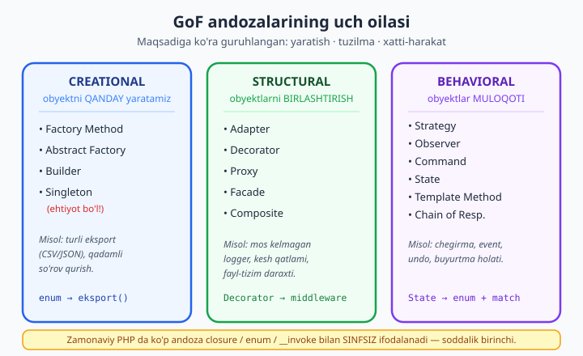
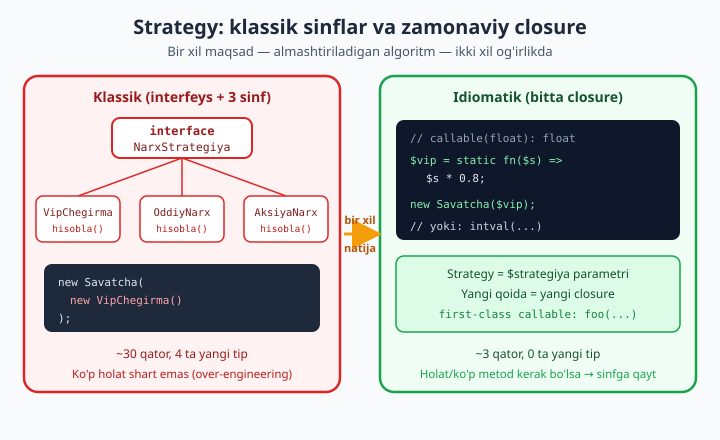

# 20 — Design patterns (GoF) idiomatik PHP 8.4

[⬅️ Oldingi: 19 — SOLID prinsiplari](./19-solid.md) · [🏠 README](./README.md) · [Keyingi: 21 — Taktik dizayn: Repository, Service, DTO ➡️](./21-taktik-dizayn.md)

> **Bu bobda:** dizayn andozasi (design pattern) nima ekanini aniqlaymiz — bu kod emas, balki **takrorlanadigan muammoga sinalgan yondashuv** va jamoa uchun **umumiy lug'at** ("bu yerda Decorator ishlatdim" deganda hamma tushunadi). Boshlovchi kitob ([5.3 Foydali dizayn andozalari](../php/38-foydali-dizayn-andozalari.md)) faqat uchta andozani tanishtirgan edi; bu yerda GoF ("Gang of Four") katalogini **idiomatik PHP 8.4** da chuqur ochamiz. Uch oila bo'yicha boramiz: **Creational** (Factory Method, Abstract Factory, Builder, Singleton va uning **tuzoqlari**), **Structural** (Adapter, Decorator, Proxy, Facade, Composite), **Behavioral** (Strategy, Observer, Command, State, Template Method, Chain of Responsibility). Eng muhimi — zamonaviy PHP da ko'p andoza **sinf ierarxiyasisiz** ifodalanadi: closure-as-Strategy, `__invoke` handler, enum-as-State (`./05`/`./06`), first-class callable `foo(...)`. Oxirida **pattern abuse** tanqidi: har joyga andoza tiqish — anti-pattern; soddalik birinchi. Har bir andoza haqiqiy `php` 8.4 bilan ishga tushirib tasdiqlandi, generic factory esa PHPStan max daraja bilan tekshirildi.

---

## Andoza nima — va nima EMAS

Avval ikkita keng tarqalgan tushunmovchilikni yo'qotaylik.

**Andoza — bu hozir copy-paste qiladigan kod EMAS.** Bu — muayyan toifadagi muammoga yondashuvning **nomi va shakli**. Masalan "Strategy" deganda biz konkret sinflarni emas, "almashtiriladigan algoritmni interfeys ortiga yashir" g'oyasini nazarda tutamiz. PHP da uni interfeys bilan ham, oddiy closure bilan ham amalga oshirish mumkin — ikkalasi ham Strategy.

**Andoza — bu kutubxona yoki framework EMAS.** Guzzle yoki Symfony — bu tayyor kod. Andoza esa — siz o'z kodingizni qanday **tuzishingiz** haqidagi qaror. Andoza Composer'dan o'rnatilmaydi.

Unday bo'lsa nega kerak? Ikki sabab:

1. **Umumiy lug'at.** Code review'da "bu yerda Adapter qo'shdim, tashqi SDK interfeysini biznikiga moslash uchun" deyish — bir abzas tushuntirishdan tezroq. Andoza nomi — jamoaning siqilgan tili.
2. **Sinalgan yechim.** GoF kitobidagi 23 andoza o'nlab yillik tajribani umumlashtiradi. Yangi muammoga duch kelganda "buni qaysidir andoza hal qilganmi?" deb so'rash — g'ildirakni qaytadan kashf qilmaslikning yo'li.

> **Tarix.** "GoF" — *Design Patterns: Elements of Reusable Object-Oriented Software* (1994) kitobining to'rt muallifiga ("Gang of Four") ishora. Misollar C++/Smalltalk'da edi; biz ularni PHP 8.4 ning enum, closure, first-class callable kabi imkoniyatlari bilan **qayta o'qiymiz** — ko'pi ancha qisqa chiqadi.

Andozalar maqsadiga ko'ra uch oilaga bo'linadi. Bu bobning xaritasi:



> **Boshlovchi bilan ko'prik.** Agar `interface`, `abstract class`, `enum` yoki closure (`fn`) sizga notanish bo'lsa, avval boshlovchi kitobning OOP boblariga va [5.3 dizayn andozalari](../php/38-foydali-dizayn-andozalari.md) ga qayting. Bu yerda biz ularni allaqachon bilasiz deb hisoblaymiz va **idiomatik chuqurlikka** boramiz.

---

## CREATIONAL: obyektni qanday yaratamiz

Creational andozalar `new` ni bevosita chaqirishni — qachon obyekt turi o'zgaruvchan yoki qurish murakkab bo'lsa — **abstraksiya ortiga** olib chiqadi.

### Factory Method — yaratishni sinfdan tashqariga

Muammo: chaqiruvchi kod qaysi konkret sinfni yaratishni **bilmasligi** kerak; faqat interfeys bilan ishlasin. Factory Method yaratish mantig'ini bitta joyga yig'adi.

Idiomatik PHP 8.4 da fabrikaning eng toza shakli — **enum metodi**. Eksport formati enum, va enum o'zi tegishli implementatsiyani qaytaradi:

```php
<?php
declare(strict_types=1);

interface Eksport
{
    public function chiqar(array $satrlar): string;
}

final class CsvEksport implements Eksport
{
    public function chiqar(array $satrlar): string
    {
        return implode("\n", array_map(
            static fn(array $r): string => implode(',', $r),
            $satrlar,
        ));
    }
}

final class JsonEksport implements Eksport
{
    public function chiqar(array $satrlar): string
    {
        return json_encode($satrlar, JSON_THROW_ON_ERROR);
    }
}

enum Format: string
{
    case Csv = 'csv';
    case Json = 'json';

    // Factory Method: enum'ning o'zi fabrika
    public function eksport(): Eksport
    {
        return match ($this) {
            self::Csv => new CsvEksport(),
            self::Json => new JsonEksport(),
        };
    }
}

$data = [['Oqil', 'Toshkent'], ['Aziza', 'Samarqand']];
echo Format::Csv->eksport()->chiqar($data), "\n";
echo Format::Json->eksport()->chiqar($data), "\n";
```

Chiqish:

```
Oqil,Toshkent
Aziza,Samarqand
[["Oqil","Toshkent"],["Aziza","Samarqand"]]
```

Nega bu kuchli: chaqiruvchi `Format::from($_GET['format'])->eksport()` deydi — qaysi sinf yaratilishini bilmaydi. `match` ning **tugallik** (exhaustiveness) tekshiruvi sizni qutqaradi: yangi `case` qo'shsangiz-u `match` ga arm qo'shmasangiz, PHP `UnhandledMatchError` beradi. Bu — enum-asosli fabrikaning klassik `switch` ustidan ustunligi.

### Abstract Factory — bog'liq obyektlar oilasi

Factory Method bitta obyekt yaratadi. **Abstract Factory** — bir-biriga mos keluvchi obyektlar **oilasini** yaratadi. Klassik misol: UI to'plami (tugma, maydon) — hammasi bir uslubda bo'lishi kerak (Bootstrap yoki Material, lekin aralashmasin).

```php
<?php
declare(strict_types=1);

interface Tugma { public function render(): string; }
interface Maydon { public function render(): string; }

interface UiFabrika
{
    public function tugma(string $matn): Tugma;
    public function maydon(string $nom): Maydon;
}

final class BootstrapTugma implements Tugma
{
    public function __construct(private string $matn) {}
    public function render(): string
    {
        return "<button class=\"btn\">{$this->matn}</button>";
    }
}

final class BootstrapMaydon implements Maydon
{
    public function __construct(private string $nom) {}
    public function render(): string
    {
        return "<input class=\"form-control\" name=\"{$this->nom}\">";
    }
}

final class BootstrapFabrika implements UiFabrika
{
    public function tugma(string $matn): Tugma { return new BootstrapTugma($matn); }
    public function maydon(string $nom): Maydon { return new BootstrapMaydon($nom); }
}

function formaChiz(UiFabrika $ui): string
{
    return $ui->maydon('email')->render() . "\n" . $ui->tugma('Yuborish')->render();
}

echo formaChiz(new BootstrapFabrika()), "\n";
```

`formaChiz` faqat `UiFabrika` ni biladi — Bootstrap'ni Material'ga almashtirsangiz, bitta `new MaterialFabrika()` yetadi, qolgan kod o'zgarmaydi. Bu — **bir butun oilani** birvarakayiga almashtirish kuchidir.

> **Haddan oshmang.** Abstract Factory — eng "og'ir" creational andoza. Agar sizda faqat bitta oila bo'lsa (faqat Bootstrap), bu — ortiqcha. Uni real ehtiyoj (ikkinchi tema, ikkinchi DB drayveri) paydo bo'lganda qo'shing.

### Builder — murakkab obyektni qadam-baqadam qurish

Konstruktorda 8 ta parametr bo'lsa va yarmi ixtiyoriy bo'lsa — chaqiruv o'qib bo'lmaydi (`new X(null, null, true, null, 'POST', ...)`). Builder qurishni **o'qiladigan qadamlarga** ajratadi. PHP da fluent (zanjir) interfeys bilan eng tabiiy chiqadi:

```php
<?php
declare(strict_types=1);

final class SorovBuilder
{
    private string $metod = 'GET';
    private array $sarlavhalar = [];
    private ?string $tana = null;

    public function metod(string $m): static { $this->metod = $m; return $this; }

    public function sarlavha(string $nom, string $qiymat): static
    {
        $this->sarlavhalar[$nom] = $qiymat;
        return $this;
    }

    public function tana(string $t): static { $this->tana = $t; return $this; }

    public function qur(string $url): string
    {
        $h = '';
        foreach ($this->sarlavhalar as $n => $v) {
            $h .= "{$n}: {$v}\n";
        }
        return "{$this->metod} {$url}\n{$h}\n" . ($this->tana ?? '');
    }
}

$sorov = (new SorovBuilder())
    ->metod('POST')
    ->sarlavha('Content-Type', 'application/json')
    ->sarlavha('Accept', 'application/json')
    ->tana('{"ism":"Oqil"}')
    ->qur('https://api.test/users');

echo $sorov, "\n";
```

Diqqat: har bir setter `static` qaytaradi (`return $this`) — shu sabab zanjir uziladi. Qaytish turi `static` (`self` emas) — bu meros bo'lganda subklass tipini saqlaydi (kovariantlik, `./06` ga qarang).

> **PHP idiomi: nomlangan argumentlar Builder o'rnini bosishi mumkin.** PHP 8.0+ da `new Sorov(metod: 'POST', tana: '...')` ko'pincha Builder ehtiyojini yo'qotadi — agar obyekt **immutable** va parametrlar oddiy bo'lsa. Builder'ni faqat qurish jarayonida **mantiq** bo'lganda (validatsiya, hisoblash, shartli qadamlar) saqlang.

### Singleton — va uning TUZOQLARI

Singleton "butun ilovada faqat bitta nusxa bo'lsin" deydi. Klassik shakli:

```php
<?php
declare(strict_types=1);

final class Konfig
{
    private static ?self $instance = null;
    private array $qiymatlar;

    private function __construct() { $this->qiymatlar = ['debug' => true]; }
    private function __clone() {}                 // klonlashni bloklaymiz

    public static function instance(): self
    {
        return self::$instance ??= new self();   // birinchi chaqiruvda yaratiladi
    }

    public function get(string $kalit): mixed
    {
        return $this->qiymatlar[$kalit] ?? null;
    }
}

var_dump(Konfig::instance() === Konfig::instance()); // bool(true) — bitta nusxa
var_dump(Konfig::instance()->get('debug'));          // bool(true)
```

Texnik jihatdan ishlaydi. Lekin Singleton — **GoF katalogidagi eng tanqid qilingan andoza**, va sabablarini bilishingiz shart:

- **Yashirin global holat.** `Konfig::instance()` ni istalgan joyda chaqirsa bo'ladi — bog'liqlik kod imzosida ko'rinmaydi. `function foo()` ga qarab uning Konfig'ga tayanishini bilolmaysiz. Bu — DI ning aksi.
- **Test qiyinligi.** Testda soxta (mock) Konfig bera olmaysiz — `instance()` qattiq yopishgan. Statik `$instance` testlar orasida **saqlanib qoladi**, bir test ikkinchisiga "oqib" o'tadi (flaky testlar).
- **Yashirin bog'liqliklar.** Singleton ishlatuvchi sinf "halol" emas: konstruktorida hech narsa so'ramaydi, lekin aslida Konfig'ga muhtoj.

**Idiomatik almashtiruv — DI konteyner bilan "bitta nusxa" (singleton lifetime).** Bitta nusxa kerakligi to'g'ri bo'lishi mumkin, lekin uni **konteyner boshqarsin**, sinfning o'zi emas. `./13` da ko'rgan konteyner aynan shuni beradi: `$container->singleton(Konfig::class)`. Sinf esa oddiy, test qilinadigan bo'lib qoladi:

```php
<?php
declare(strict_types=1);

// ❌ Singleton: global, test qilib bo'lmaydigan vaqt
// Soat::instance()->hozir() — testda soxta vaqt berolmaysiz

// ✅ Oddiy obyekt: vaqtni TASHQARIDAN olamiz (DI)
final class Soat
{
    public function __construct(private \DateTimeImmutable $hozir) {}
    public function hozir(): string { return $this->hozir->format('Y-m-d'); }
}

// Testda soxta vaqt berish OSON:
$soat = new Soat(new \DateTimeImmutable('2026-06-12'));
echo $soat->hozir(), "\n"; // 2026-06-12
```

> **Qoida:** "faqat bitta nusxa kerak" — bu **konfiguratsiya** masalasi (konteyner hal qiladi), **sinf dizayni** masalasi emas. Singleton andozasini yangi kodda deyarli hech qachon qo'lda yozmang. Eski kodda (legacy) uchratsangiz — uni DI ga ko'chirishni rejalashtiring.

---

## STRUCTURAL: obyektlarni birlashtirish

Structural andozalar obyektlarni **moslash, o'rash yoki guruhlash** orqali yangi imkoniyat beradi — ko'pincha asl sinflarga tegmasdan.

### Adapter — mos kelmaydigan interfeysni moslash

Tashqi kutubxona sizning kodingiz kutgan interfeysga **mos kelmaydi**. Adapter — ikki interfeys orasidagi "tarjimon". Ilovangiz `Logger` ni kutadi, tashqi SDK esa boshqacha imzoga ega:

```php
<?php
declare(strict_types=1);

// Bizning ilova shu interfeysni kutadi:
interface Logger
{
    public function log(string $daraja, string $xabar): void;
}

// Tashqi kutubxona BOSHQA interfeysga ega (mos emas):
final class TashqiMonolog
{
    public array $yozuvlar = [];
    public function write(int $level, string $message): void
    {
        $this->yozuvlar[] = "[{$level}] {$message}";
    }
}

// Adapter: tashqi interfeysni bizning interfeysga "tarjima" qiladi
final class MonologAdapter implements Logger
{
    private const XARITA = ['info' => 1, 'warning' => 2, 'error' => 3];

    public function __construct(private TashqiMonolog $tashqi) {}

    public function log(string $daraja, string $xabar): void
    {
        $this->tashqi->write(self::XARITA[$daraja] ?? 0, $xabar);
    }
}

$tashqi = new TashqiMonolog();
$logger = new MonologAdapter($tashqi);
$logger->log('error', 'Disk to\'ldi');
print_r($tashqi->yozuvlar);
// Array ( [0] => [3] Disk to'ldi )
```

Endi ilovangiz `Logger` bilan ishlaydi, tashqi kutubxona almashsa — yangi adapter yozasiz, ilova kodi o'zgarmaydi. Bu — PSR-3 (`./10`) kabi standart interfeyslar nega muhimligining sababi: ular tashqi paketlarni adapter ortiga olishni osonlashtiradi.

### Decorator — xatti-harakat qo'shish (o'rash)

Decorator obyektni **bir xil interfeysli** o'ramga joylab, atrofiga yangi xatti-harakat qo'shadi. Meros (inheritance) dan farqi: decorator'larni **dinamik** va **bir nechtasini** ustma-ust qo'yish mumkin. Bu — bevosita middleware (`./12`) g'oyasi.

```php
<?php
declare(strict_types=1);

interface Hisobot
{
    public function chiqar(): string;
}

final class OddiyHisobot implements Hisobot
{
    public function chiqar(): string { return 'sotuv=1000'; }
}

// Decorator: bir xil interfeysni saqlaydi, atrofiga keshni qo'shadi
final class KeshDecorator implements Hisobot
{
    private ?string $kesh = null;
    public function __construct(private Hisobot $ichki) {}

    public function chiqar(): string
    {
        return $this->kesh ??= '[kesh] ' . $this->ichki->chiqar();
    }
}

// Yana bir qatlam: vaqt belgisini qo'shadi
final class VaqtDecorator implements Hisobot
{
    public function __construct(private Hisobot $ichki) {}
    public function chiqar(): string
    {
        return $this->ichki->chiqar() . ' @12:00';
    }
}

$h = new VaqtDecorator(new KeshDecorator(new OddiyHisobot()));
echo $h->chiqar(), "\n";
// [kesh] sotuv=1000 @12:00
```

Har qatlam o'zining ish-ini bajaradi va `ichki` ga uzatadi — xuddi piyoz qatlamlari (`./12` dagi "onion" model). PSR-15 middleware — Decorator'ning HTTP so'rov/javobga moslangan ko'rinishi: har middleware so'rovni o'raydi, keyingisiga uzatadi, javobni qaytishda yana o'raydi.

> **Decorator vs meros.** Agar `KeshliVaqtliHisobot extends OddiyHisobot` deb meros qilsangiz, kombinatsiyalar portlaydi: kesh+vaqt, faqat kesh, faqat vaqt — har biriga alohida sinf. Decorator bilan ularni **ishlash vaqtida** kerakligicha terib chiqasiz.

### Proxy — joynishin: lazy, cache, himoya

Proxy ham obyektni bir xil interfeys ortida o'raydi, lekin maqsadi boshqa: **kirishni boshqarish**. Uch keng tarqalgan tur — lazy (kechiktirilgan yaratish), cache (natijani saqlash), protection (huquq tekshirish). Mana lazy Proxy: qimmat obyekt **faqat kerak bo'lganda** yaratiladi:

```php
<?php
declare(strict_types=1);

interface OgirServis
{
    public function ishla(): string;
}

final class HaqiqiyServis implements OgirServis
{
    public function __construct() { echo "(qimmat ulanish yaratildi)\n"; }
    public function ishla(): string { return 'natija'; }
}

final class LazyProxy implements OgirServis
{
    private ?OgirServis $haqiqiy = null;

    public function __construct(private \Closure $yaratuvchi) {}

    public function ishla(): string
    {
        $this->haqiqiy ??= ($this->yaratuvchi)();   // birinchi chaqiruvda yaratiladi
        return $this->haqiqiy->ishla();
    }
}

$proxy = new LazyProxy(fn() => new HaqiqiyServis());
echo "proxy yasaldi, hali ulanmadi\n";
echo $proxy->ishla(), "\n";   // ENDI yaratiladi
```

Chiqish:

```
proxy yasaldi, hali ulanmadi
(qimmat ulanish yaratildi)
natija
```

`HaqiqiyServis` konstruktori `ishla()` chaqirilguncha ishlamadi — bu lazy loading. Cache proxy esa `ishla()` natijasini eslab qoladi; protection proxy esa `ishla()` oldidan huquqni tekshiradi. Decorator "yangi xulq qo'shadi", Proxy esa "kirishni boshqaradi" — interfeys bir xil, **niyat** boshqacha.

### Facade — murakkablikni soddalashtirish

Facade ko'p qism-tizimni **bitta sodda interfeys** ortiga yashiradi. Chaqiruvchi murakkab ichki ketma-ketlikni bilmasin:

```php
<?php
declare(strict_types=1);

final class Disk { public function saqla(string $f, string $d): void { /* ... */ } }
final class Rasm { public function thumbnail(string $f): string { return "thumb_{$f}"; } }
final class Db { public function yoz(string $jadval, array $q): int { return 42; } }

final class YuklashFacade
{
    public function __construct(
        private Disk $disk,
        private Rasm $rasm,
        private Db $db,
    ) {}

    public function yukla(string $fayl, string $tana): int
    {
        $this->disk->saqla($fayl, $tana);
        $thumb = $this->rasm->thumbnail($fayl);
        $this->disk->saqla($thumb, 'thumb-data');
        return $this->db->yoz('rasmlar', ['fayl' => $fayl, 'thumb' => $thumb]);
    }
}

$facade = new YuklashFacade(new Disk(), new Rasm(), new Db());
echo 'yuklandi, id=', $facade->yukla('rasm.jpg', 'baytlar'), "\n";
// yuklandi, id=42
```

Chaqiruvchi `yukla()` deydi — diskka saqlash, thumbnail yasash, DB ga yozishning uchta qadami yashiringan. Facade **ichki murakkablikni** kamaytiradi, ammo Adapter'dan farqi: Adapter bitta mos kelmagan interfeysni tarjima qiladi, Facade esa **ko'p** qismni soddalashtiradi.

> **Facade vs God-object.** Facade ko'p ish qilsa, u "hammasini biluvchi" obyektga aylanib qolishi mumkin. Uni **yupqa** tuting: faqat qadamlarni muvofiqlashtirsin, biznes mantiq qism-tizimlarda qolsin. Laravel'dagi `Cache::`, `Storage::` — bular ham Facade (lekin ular global statik proxy, biroz boshqacha).

### Composite — daraxt tuzilmasi

Composite bitta obyekt va obyektlar **guruhini bir xil** ishlatishga imkon beradi — daraxt strukturasi uchun. Klassik misol: fayl tizimi (fayl va papka, papka ichida yana papka):

```php
<?php
declare(strict_types=1);

interface FsTugun
{
    public function olcham(): int;
    public function chiz(int $chuqurlik = 0): string;
}

final class Fayl implements FsTugun
{
    public function __construct(private string $nom, private int $bayt) {}
    public function olcham(): int { return $this->bayt; }
    public function chiz(int $chuqurlik = 0): string
    {
        return str_repeat('  ', $chuqurlik) . "{$this->nom} ({$this->bayt}b)\n";
    }
}

final class Papka implements FsTugun
{
    /** @var FsTugun[] */
    private array $bolalar = [];
    public function __construct(private string $nom) {}

    public function qosh(FsTugun $t): static { $this->bolalar[] = $t; return $this; }

    public function olcham(): int
    {
        // butun shoxning yig'indisi — rekursiv
        return array_sum(array_map(
            static fn(FsTugun $t): int => $t->olcham(),
            $this->bolalar,
        ));
    }

    public function chiz(int $chuqurlik = 0): string
    {
        $s = str_repeat('  ', $chuqurlik) . "{$this->nom}/\n";
        foreach ($this->bolalar as $b) {
            $s .= $b->chiz($chuqurlik + 1);
        }
        return $s;
    }
}

$root = (new Papka('app'))
    ->qosh((new Papka('src'))
        ->qosh(new Fayl('Kernel.php', 1200))
        ->qosh(new Fayl('Router.php', 800)))
    ->qosh(new Fayl('composer.json', 300));

echo $root->chiz();
echo 'Jami: ', $root->olcham(), " bayt\n";
```

Chiqish:

```
app/
  src/
    Kernel.php (1200b)
    Router.php (800b)
  composer.json (300b)
Jami: 2300 bayt
```

Sehr shundaki: `olcham()` ni `Fayl` ham, `Papka` ham bir xil chaqiradi. Papka esa o'z bolalariga rekursiv yuradi. Chaqiruvchi "bu yaproqmi yoki shoxmi?" deb so'ramaydi — interfeys bir xil. Bu — menyu (submenular), tashkilot tuzilmasi, HTML DOM kabi har qanday daraxtga to'g'ri keladi.

---

## BEHAVIORAL: obyektlar muloqoti

Behavioral andozalar obyektlar **o'rtasidagi mas'uliyat va aloqani** tartibga soladi. Bu oilada zamonaviy PHP eng ko'p ulush qo'shadi — closure, enum va first-class callable ko'p sinfni almashtiradi.

### Strategy — almashtiriladigan algoritm

Strategy bir vazifaning **bir nechta usulini** interfeys ortiga olib, ularni almashtiriladigan qiladi. Klassik shakl — interfeys + implementatsiyalar:

```php
<?php
declare(strict_types=1);

interface NarxStrategiya
{
    public function hisobla(float $summa): float;
}

final class VipChegirma implements NarxStrategiya
{
    public function hisobla(float $summa): float { return $summa * 0.8; }
}

final class OddiyNarx implements NarxStrategiya
{
    public function hisobla(float $summa): float { return $summa; }
}

final class Savatcha
{
    public function __construct(private NarxStrategiya $strategiya) {}
    public function jami(float $summa): float
    {
        return $this->strategiya->hisobla($summa);
    }
}

echo (new Savatcha(new VipChegirma()))->jami(1000), "\n"; // 800
```

To'g'ri ishlaydi. Ammo PHP da bitta metodli interfeys uchun **uchta sinf** — ko'pincha ortiqcha. Idiomatik shakl — **closure-as-Strategy**:

```php
<?php
declare(strict_types=1);

final class Savatcha
{
    /** @param callable(float): float $strategiya */
    public function __construct(private $strategiya) {}

    public function jami(float $summa): float
    {
        return ($this->strategiya)($summa);
    }
}

// Har bir "strategiya" — bitta closure:
$vip = static fn(float $s): float => $s * 0.8;
echo (new Savatcha($vip))->jami(1000), "\n";       // 800

// first-class callable bilan tayyor funksiyani strategiya qilish:
$yaxlit = new Savatcha(intval(...));
echo $yaxlit->jami(999.7), "\n";                   // 999
```

`callable(float): float` — strategiyaning butun "shartnomasi". `intval(...)` — PHP 8.1 ning **first-class callable** sintaksisi: mavjud funksiyani Closure'ga aylantiradi, qo'lda o'rovchi sinf yozmaysiz. Ikki yondashuvni solishtiring:



**Qachon sinf, qachon closure?** Strategiyaning o'z **holati** (state), bir nechta **metodi** yoki murakkab konstruktori bo'lsa — interfeys+sinf. Agar u shunchaki "kirish-chiqish" hisoblovchi bo'lsa — closure. Birini boshqasiga osongina ko'chirasiz, chunki `callable` interfeys ham qabul qiladi (har bir sinf `__invoke` bilan callable bo'la oladi).

### Observer — event/listener

Observer "bir narsa sodir bo'lganda, qiziquvchilarning hammasiga xabar ber" deydi. Bu — event-listener tizimining poydevori (Symfony EventDispatcher, Laravel events). Idiomatik PHP da listener'lar closure yoki first-class callable bo'ladi:

```php
<?php
declare(strict_types=1);

final class EventDispatcher
{
    /** @var array<string, list<callable>> */
    private array $tinglovchilar = [];

    public function tingla(string $hodisa, callable $cb): void
    {
        $this->tinglovchilar[$hodisa][] = $cb;
    }

    public function yubor(string $hodisa, array $payload): void
    {
        foreach ($this->tinglovchilar[$hodisa] ?? [] as $cb) {
            $cb($hodisa, $payload);
        }
    }
}

final class EmailListener
{
    public array $yuborildi = [];
    public function bajar(string $hodisa, array $payload): void
    {
        $this->yuborildi[] = "email:{$hodisa}:{$payload['user']}";
    }
}

$d = new EventDispatcher();
$email = new EmailListener();

$d->tingla('user.registered', $email->bajar(...));   // first-class callable
$d->tingla('user.registered', fn($h, $p) => print("log:{$p['user']}\n"));

$d->yubor('user.registered', ['user' => 'oqil']);
print_r($email->yuborildi);
```

Chiqish:

```
log:oqil
Array
(
    [0] => email:user.registered:oqil
)
```

Dispatcher kim tinglayotganini bilmaydi — yangi listener qo'shish dispatcher kodiga tegmaydi. `$email->bajar(...)` — obyekt metodini Closure sifatida uzatishning idiomatik yo'li (eski `[$email, 'bajar']` massiv-callable o'rniga). Standart interfeys — PSR-14 (Event Dispatcher), uni `./10` da ko'rgansiz.

### Command — amalni obyektga aylantirish

Command bir **amalni** (va uning ma'lumotini) obyektga o'raydi. Shu sabab amalni saqlash, navbatga qo'yish, **bekor qilish** (undo) yoki qayta bajarish mumkin bo'ladi:

```php
<?php
declare(strict_types=1);

interface Buyruq
{
    public function bajar(): string;
    public function bekor(): string;
}

final class MatnQosh implements Buyruq
{
    public function __construct(private string $matn) {}
    public function bajar(): string { return "qo'shildi: {$this->matn}"; }
    public function bekor(): string { return "o'chirildi: {$this->matn}"; }
}

final class Tarix
{
    /** @var Buyruq[] */
    private array $stek = [];

    public function ishlat(Buyruq $b): string
    {
        $this->stek[] = $b;
        return $b->bajar();
    }

    public function orqaga(): string
    {
        return (array_pop($this->stek))?->bekor() ?? 'bo\'sh';
    }
}

$t = new Tarix();
echo $t->ishlat(new MatnQosh('salom')), "\n";  // qo'shildi: salom
echo $t->orqaga(), "\n";                        // o'chirildi: salom
```

Stekka buyruqlarni yig'ib, `orqaga()` da oxirgisini chiqarib `bekor()` qilamiz — bu undo/redo ning poydevori. Web ilovalarda Command ko'pincha "queue job" ko'rinishida uchraydi: amal obyekt sifatida navbatga qo'yiladi, keyin worker uni `bajar()` qiladi. `?->` (nullsafe) `array_pop` bo'sh massivda `null` qaytarganini xavfsiz hal qiladi.

### State — holat mashinasi (enum bilan)

State obyekt xulqi uning **holatiga** qarab o'zgarishini boshqaradi — va noto'g'ri o'tishlarni (transition) bloklaydi. Eski darsliklar har holatga alohida sinf yozadi. Idiomatik PHP 8.4 da **enum + `match`** ancha tiniq:

```php
<?php
declare(strict_types=1);

enum Buyurtma: string
{
    case Yangi = 'yangi';
    case Tolangan = 'tolangan';
    case Yuborilgan = 'yuborilgan';
    case Yetkazilgan = 'yetkazilgan';

    // ruxsat etilgan o'tish — holat mashinasi enum ichida
    public function keyingi(): self
    {
        return match ($this) {
            self::Yangi => self::Tolangan,
            self::Tolangan => self::Yuborilgan,
            self::Yuborilgan => self::Yetkazilgan,
            self::Yetkazilgan => throw new \LogicException('Yakuniy holat'),
        };
    }

    public function bekorQilSaBoladi(): bool
    {
        return $this === self::Yangi || $this === self::Tolangan;
    }
}

$b = Buyurtma::Yangi;
$b = $b->keyingi();   // Tolangan
$b = $b->keyingi();   // Yuborilgan
echo $b->value, ' bekor? ', $b->bekorQilSaBoladi() ? 'ha' : 'yoq', "\n";
// yuborilgan bekor? yoq
```

Holatlar — enum case'lari; o'tish qoidalari va har holatdagi xulq — enum metodlari. `Yetkazilgan` dan oldinga yurish — `LogicException`. Enum'ning **yopiq to'plam** bo'lishi sizni qutqaradi: holat faqat to'rt qiymatdan biri bo'la oladi, "noma'lum holat" mantiqan imkonsiz. Enum asoslari `./05` va Value Object bilan bog'liqligi `./06` da ochilgan.

### Template Method — skelet algoritm

Template Method algoritmning **umumiy skeletini** abstrakt sinfda belgilaydi, ayrim qadamlarni subklassga qoldiradi. Tartib o'zgarmas, faqat "to'ldiriladigan joylar" har xil:

```php
<?php
declare(strict_types=1);

abstract class HisobotShablon
{
    // skelet algoritm — tartib o'zgarmas (shuning uchun final)
    final public function yarat(): string
    {
        return $this->sarlavha() . "\n" . $this->tana() . "\n" . $this->footer();
    }

    abstract protected function tana(): string;     // subklass MAJBUR to'ldirsin

    // ixtiyoriy "hook" lar — subklass xohlasa qayta yozadi
    protected function sarlavha(): string { return '=== HISOBOT ==='; }
    protected function footer(): string { return '--- yakun ---'; }
}

final class SotuvHisobot extends HisobotShablon
{
    protected function tana(): string { return 'Jami sotuv: 5000'; }
}

echo (new SotuvHisobot())->yarat(), "\n";
```

Chiqish:

```
=== HISOBOT ===
Jami sotuv: 5000
--- yakun ---
```

`yarat()` — `final`, demak hech kim umumiy tartibni buzolmaydi (sarlavha-tana-footer doim shu ketma-ketlikda). Subklass faqat `tana()` ni to'ldiradi. Bu — meros asosidagi andoza; **uning closure-asoslangan muqobili — Strategy.** Agar faqat bitta qadam o'zgaruvchan bo'lsa, ko'pincha Template Method o'rniga "o'zgaruvchan qismni closure qilib uzating" sodda chiqadi.

### Chain of Responsibility — so'rovni zanjir bo'ylab uzatish

Chain of Responsibility so'rovni bir nechta ishlovchidan **ketma-ket** o'tkazadi: har biri yo hal qiladi, yo keyingisiga uzatadi. Bu — to'g'ridan-to'g'ri middleware pipeline (`./12`) g'oyasi. Klassik (sinf) shakl:

```php
<?php
declare(strict_types=1);

abstract class Tekshiruvchi
{
    private ?Tekshiruvchi $keyingi = null;

    public function keyin(Tekshiruvchi $t): Tekshiruvchi
    {
        $this->keyingi = $t;
        return $t;
    }

    public function tekshir(array $sorov): ?string
    {
        $xato = $this->ozQoidam($sorov);
        if ($xato !== null) {
            return $xato;                       // shu yerda to'xtaymiz
        }
        return $this->keyingi?->tekshir($sorov); // yoki keyingisiga uzatamiz
    }

    abstract protected function ozQoidam(array $sorov): ?string;
}

final class AuthTekshir extends Tekshiruvchi
{
    protected function ozQoidam(array $s): ?string
    {
        return isset($s['token']) ? null : '401: token yo\'q';
    }
}

final class RoleTekshir extends Tekshiruvchi
{
    protected function ozQoidam(array $s): ?string
    {
        return ($s['role'] ?? '') === 'admin' ? null : '403: ruxsat yo\'q';
    }
}

$zanjir = new AuthTekshir();
$zanjir->keyin(new RoleTekshir());

var_dump($zanjir->tekshir(['token' => 'x', 'role' => 'admin'])); // NULL — o'tdi
var_dump($zanjir->tekshir(['token' => 'x', 'role' => 'user']));  // 403
```

Har tekshiruvchi o'z qoidasini ko'radi; muvaffaqiyatda `?->` orqali keyingisiga uzatadi, xatoda zanjirni uzadi. PSR-15 middleware — bu andozaning HTTP versiyasi: har middleware `$handler->handle($request)` deb keyingisiga uzatadi yoki erta javob qaytaradi (short-circuit, `./12`). Mashqlar bo'limida buni **closure pipeline** bilan sinfsiz qayta yozamiz.

---

## PHP idiomlari: sinfsiz andozalar

Bir nechta idiomni yuqorida ko'rdik; bu yerda ularni yig'ib, asosiy fikrni mustahkamlaymiz: **zamonaviy PHP ko'p andozani sinf ierarxiyasisiz ifodalaydi.**

- **closure-as-Strategy** — bitta metodli strategiya interfeysi o'rniga `callable`.
- **`__invoke` handler** — sinfni "chaqiriladigan" qiladi, ham obyekt, ham funksiya bo'ladi.
- **enum-as-State** — holat mashinasi enum + `match` ichida.
- **first-class callable** `foo(...)`, `$obj->m(...)` — mavjud funksiya/metodni Closure'ga aylantiradi.

`__invoke` handler — single-action controller va Command uchun ayniqsa idiomatik:

```php
<?php
declare(strict_types=1);

final class SalomHandler
{
    public function __invoke(string $ism): string
    {
        return "Salom, {$ism}!";
    }
}

$handler = new SalomHandler();
echo $handler('Oqil'), "\n";              // obyektni funksiya kabi chaqiramiz
$cb = $handler(...);                       // first-class callable
echo array_map($cb, ['A', 'B'])[1], "\n"; // Salom, B!
```

`enum-as-State` ni `tryFrom` bilan birga ishlatsangiz, xom satrdan **xavfsiz** holat quriladi:

```php
<?php
declare(strict_types=1);

enum Holat: string
{
    case Faol = 'active';
    case Bloklangan = 'blocked';
}

$h = Holat::from('active');
echo $h->name, "\n";                        // Faol
var_dump(Holat::tryFrom('yoq') === null);   // bool(true) — noma'lum qiymat null
```

### `@template` — PHP generics MEXANIKASI (factory uchun)

Generic factory — bir tipni qabul qilib, **aynan o'sha tipni** qaytaruvchi fabrika. PHP da bu sintaksis emas, balki PHPDoc **annotatsiyasi**: statik tahlilchi (PHPStan/Psalm) `@template` ni o'qiydi va tipni kuzatadi. Generikalarning **tushuncha** tomoni (variance, bound) TypeScript kitobida chuqur ([../typescript/README.md](../typescript/README.md)); bu yerda faqat PHP `@template` **mexanikasi**:

```php
<?php
declare(strict_types=1);

/**
 * @template T of object
 * @param class-string<T> $sinf
 * @return T
 */
function yarat(string $sinf): object
{
    return new $sinf();
}

final class Servis { public string $nom = 'servis'; }

$s = yarat(Servis::class);   // PHPStan: $s tipi aniq Servis (mixed/object EMAS)
echo $s->nom, "\n";          // servis
```

Ish vaqtida `yarat()` oddiy `new $sinf()`. Lekin PHPStan uchun `@template T` "kirgan tip = chiqgan tip" deydi — shuning uchun `$s->nom` ga kirish xavfsiz, `$s` `object` emas, `Servis` deb biladi. Buni PHPStan'ning eng qattiq darajasi (`level max`) bilan tasdiqladim:

```
$ vendor/bin/phpstan analyse --level=max yarat.php
 [OK] No errors
```

> **Diqqat — generic'ni qayerda ishlatish mumkin.** Yuqoridagi **funksiya** factory'da `@template` to'liq ishlaydi. Lekin agar obyektni `array<class-string, object>` xususiyatga **saqlab**, keyin o'qib qaytarsangiz (registry/pool), PHPStan ko'pincha `T` bog'lanishini yo'qotadi — chunki massivdan o'qilgan qiymat tipi `object` bo'lib qoladi. Bu — PHP statik tahlilining hozirgi cheklovi, sizning xatoyingiz emas. Bunday hollarda eng ishonchli yo'l — generic'ni **yaratuvchi funksiya/metodga** qoldirish, saqlash qatlamida emas.

---

## Pattern abuse: andoza ham ortiqcha bo'ladi

Andozalarni o'rganganlar tez-tez bitta tuzoqqa tushadi: **har joyga andoza tiqish.** Bu — alohida anti-pattern. Ikki misol:

**1) Bitta operatsiya uchun butun Strategy ierarxiyasi — ortiqcha.**

```php
<?php
declare(strict_types=1);

// ❌ KERAKSIZ: oddiy hisob uchun interfeys + sinflar
interface Operatsiya { public function bajar(int $a, int $b): int; }
final class Qoshish implements Operatsiya
{
    public function bajar(int $a, int $b): int { return $a + $b; }
}
// ... yana 5 ta shunday sinf ...
$natija1 = (new Qoshish())->bajar(2, 3);

// ✅ IDIOMATIK: closure massivi yetadi
$amallar = [
    '+' => static fn(int $a, int $b): int => $a + $b,
    '-' => static fn(int $a, int $b): int => $a - $b,
];
$natija2 = $amallar['+'](2, 3);

var_dump($natija1 === $natija2); // bool(true) — bir xil natija, ~80% kam kod
```

**Qoida: soddalik birinchi.** Andoza — muammoga **javob**, kun boshidan rejalashtiriladigan maqsad emas. "YAGNI" (You Aren't Gonna Need It): andozani aniq ehtiyoj paydo bo'lganda kiriting. Kodni avval to'g'ridan-to'g'ri yozing; takrorlanish yoki o'zgaruvchanlik **ko'rinib qolganda** mos andozaga refaktoring qiling.

Pattern abuse belgilari:
- Bitta implementatsiyasi bo'lgan interfeys/abstract (kelajak "ehtimol uchun") — hozir kerak emas.
- `AbstractSingletonFactoryProxyManager` kabi nomlar — andoza nomlari biriksa, dizayn buzilgan.
- "Kuchli" andoza (Abstract Factory, Visitor) ikki qatorlik muammoga — bolg'a bilan yong'oq chaqish.

Andozalarni **tanish** uchun o'rganing (kodni o'qiganda "bu Decorator ekan" deb tushunish), **majburlash** uchun emas. Eng yaxshi kod — kerakli joyda kerakli andoza, qolgan joyda esa oddiy, to'g'ridan-to'g'ri kod.

---

## Mashqlar

### Oson

1. **Closure registry Strategy.** `ChegirmaXizmat` sinfini yozing: `qoidaQosh(string $nom, callable $cb)` bilan nomli chegirma qoidalarini ro'yxatga oladi, `hisobla(string $nom, float $summa): float` esa shu qoidani qo'llaydi. Noma'lum nom uchun `InvalidArgumentException` tashlasin. Sinab ko'ring: `vip` (20% chegirma) va `yangi_yil` (50 so'm chegirma).
2. **Singletonni DI ga aylantiring.** `Soat::instance()->hozir()` ko'rinishidagi Singletonni oddiy, vaqtni **konstruktor orqali** oluvchi `Soat` sinfiga aylantiring. Nega bu test uchun yaxshiroq — bir jumlada izohlang.

### O'rta

3. **Decorator zanjiri.** `Servis` interfeysi (`ishla(string): string`) va `AsosiyServis` (matnni katta harfga aylantiradi) bering. `LogDecorator` yozing: u kirish va chiqishni `log` massiviga yozsin, lekin asl natijani o'zgartirmasin. Decorator'ni asl servisga o'rab, ishlatib, log'ni ko'rsating.
4. **State enum guard.** `Eshik` enum (`Ochiq`, `Yopiq`, `Qulflangan`) yozing. `harakat(string $amal): self` metodi faqat **ruxsat etilgan** o'tishlarni bajarsin (`och`: Yopiq→Ochiq, `yop`: Ochiq→Yopiq, `qulfla`: Yopiq→Qulflangan), boshqasiga `LogicException` tashlasin. Ochiq eshikni qulflashga urinib, bloklanishini ko'rsating.

### Qiyin

5. **Chain of Responsibility → closure middleware pipeline.** Sinflarsiz, faqat closure'lar bilan middleware pipeline yozing: `pipeline(array $bosqichlar, callable $yadro): callable`. Har bosqich `(array $sorov, callable $next): array` imzosiga ega bo'lsin. Auth middleware (token yo'q bo'lsa `['status' => 401]` qaytarib zanjirni uzsin) va logging middleware (javobga `logged => true` qo'shsin) bilan sinang. (Maslahat: `array_reduce` + `array_reverse`.)

<details markdown="1"><summary>Yechim — 1</summary>

```php
<?php
declare(strict_types=1);

final class ChegirmaXizmat
{
    /** @var array<string, callable(float): float> */
    private array $qoidalar = [];

    public function qoidaQosh(string $nom, callable $cb): void
    {
        $this->qoidalar[$nom] = $cb;
    }

    public function hisobla(string $nom, float $summa): float
    {
        $cb = $this->qoidalar[$nom]
            ?? throw new \InvalidArgumentException("Noma'lum qoida: {$nom}");
        return $cb($summa);
    }
}

$x = new ChegirmaXizmat();
$x->qoidaQosh('vip', static fn(float $s): float => $s * 0.8);
$x->qoidaQosh('yangi_yil', static fn(float $s): float => $s - 50);

echo $x->hisobla('vip', 1000), "\n";       // 800
echo $x->hisobla('yangi_yil', 1000), "\n"; // 950
```

Har bir chegirma — bitta closure, alohida sinf shart emas. `?? throw` — PHP 8.0 ning throw-expression idiomi: yo'q kalit uchun darhol istisno.

</details>

<details markdown="1"><summary>Yechim — 2</summary>

```php
<?php
declare(strict_types=1);

final class Soat
{
    public function __construct(private \DateTimeImmutable $hozir) {}
    public function hozir(): string { return $this->hozir->format('Y-m-d'); }
}

// Ishlatish (production):
$soat = new Soat(new \DateTimeImmutable('now'));

// Test (soxta vaqt):
$test = new Soat(new \DateTimeImmutable('2026-06-12'));
echo $test->hozir(), "\n"; // 2026-06-12
```

Nega yaxshiroq: vaqt **tashqaridan** beriladi, shuning uchun testda istalgan sanani qo'yib, natijani aniq tekshira olasiz. Singleton'da `instance()` qattiq yopishgan bo'lib, soxta vaqt berib bo'lmaydi va statik holat testlar orasida saqlanib qoladi (flaky test).

</details>

<details markdown="1"><summary>Yechim — 3</summary>

```php
<?php
declare(strict_types=1);

interface Servis
{
    public function ishla(string $kirish): string;
}

final class AsosiyServis implements Servis
{
    public function ishla(string $kirish): string { return strtoupper($kirish); }
}

final class LogDecorator implements Servis
{
    public array $log = [];
    public function __construct(private Servis $ichki) {}

    public function ishla(string $kirish): string
    {
        $this->log[] = "kirish={$kirish}";
        $natija = $this->ichki->ishla($kirish);
        $this->log[] = "chiqish={$natija}";
        return $natija;
    }
}

$dek = new LogDecorator(new AsosiyServis());
echo $dek->ishla('salom'), "\n"; // SALOM
print_r($dek->log);
// Array ( [0] => kirish=salom [1] => chiqish=SALOM )
```

`LogDecorator` bir xil `Servis` interfeysni saqlaydi — chaqiruvchi o'ralganini sezmaydi. Asl natija o'zgarmaydi, faqat yon-ta'sir (log) qo'shiladi.

</details>

<details markdown="1"><summary>Yechim — 4</summary>

```php
<?php
declare(strict_types=1);

enum Eshik
{
    case Ochiq;
    case Yopiq;
    case Qulflangan;

    public function harakat(string $amal): self
    {
        return match (true) {
            $amal === 'och'    && $this === self::Yopiq => self::Ochiq,
            $amal === 'yop'    && $this === self::Ochiq => self::Yopiq,
            $amal === 'qulfla' && $this === self::Yopiq => self::Qulflangan,
            default => throw new \LogicException(
                "'{$amal}' mumkin emas holatda: " . $this->name,
            ),
        };
    }
}

$e = Eshik::Yopiq;
$e = $e->harakat('och');
echo $e->name, "\n"; // Ochiq

try {
    $e->harakat('qulfla'); // ochiq eshikni qulflab bo'lmaydi
} catch (\LogicException $ex) {
    echo 'Bloklandi: ', $ex->getMessage(), "\n";
    // Bloklandi: 'qulfla' mumkin emas holatda: Ochiq
}
```

`match (true)` — bir nechta shartni tekshirishning idiomatik yo'li (`./05` da type narrowing'da ham ishlatgan edik). Faqat ruxsat etilgan uchta o'tish — qolgan hamma narsa `default` orqali istisno. Enum yopiq to'plam bo'lgani uchun "noma'lum holat" mantiqan imkonsiz.

</details>

<details markdown="1"><summary>Yechim — 5</summary>

```php
<?php
declare(strict_types=1);

/**
 * Closure asosli middleware pipeline (PSR-15 g'oyasi, sinfsiz).
 *
 * @param list<callable(array, callable): array> $bosqichlar
 * @param callable(array): array $yadro
 * @return callable(array): array
 */
function pipeline(array $bosqichlar, callable $yadro): callable
{
    return array_reduce(
        array_reverse($bosqichlar),
        static fn(callable $keyingi, callable $bosqich): callable
            => static fn(array $sorov): array => $bosqich($sorov, $keyingi),
        $yadro,
    );
}

$app = pipeline(
    [
        // auth middleware — token yo'q bo'lsa zanjirni uzadi
        static function (array $s, callable $next): array {
            if (!isset($s['token'])) {
                return ['status' => 401];
            }
            return $next($s);
        },
        // logging middleware — javobni o'rab, belgi qo'shadi
        static function (array $s, callable $next): array {
            $javob = $next($s);
            $javob['logged'] = true;
            return $javob;
        },
    ],
    static fn(array $s): array => ['status' => 200, 'user' => $s['token']],
);

print_r($app(['token' => 'oqil'])); // status=200, user=oqil, logged=1
print_r($app([]));                  // status=401 (logging'ga yetib bormaydi)
```

`array_reduce` + `array_reverse` middleware'larni teskari yig'ib, "piyoz" tuzadi: tashqi bosqich avval ishlaydi. Auth token bermasa `401` qaytarib `$next` ni chaqirmaydi — short-circuit (`./12`). Diqqat: ikkinchi chaqiruvda `logged` yo'q, chunki auth zanjirni logging'gacha uzdi. Bu — Chain of Responsibility ning sinfsiz, idiomatik PHP ko'rinishi.

</details>

---

> **Xulosa.** Andozalar — kod emas, **umumiy lug'at va sinalgan yondashuv**. Creational (Factory, Builder, va ehtiyotkor Singleton) obyekt yaratishni, Structural (Adapter, Decorator, Proxy, Facade, Composite) obyektlarni birlashtirishni, Behavioral (Strategy, Observer, Command, State, Template Method, Chain of Responsibility) ularning muloqotini boshqaradi. Zamonaviy PHP 8.4 da ko'pi **sinfsiz** ifodalanadi: closure, enum, `__invoke`, first-class callable. Eng muhim qoida — **soddalik birinchi**: andoza muammoga javob, maqsad emas. Keyingi bobda taktik dizaynga — Repository, Service, DTO qatlamlariga o'tamiz.

[⬅️ Oldingi: 19 — SOLID prinsiplari](./19-solid.md) · [🏠 README](./README.md) · [Keyingi: 21 — Taktik dizayn: Repository, Service, DTO ➡️](./21-taktik-dizayn.md)
