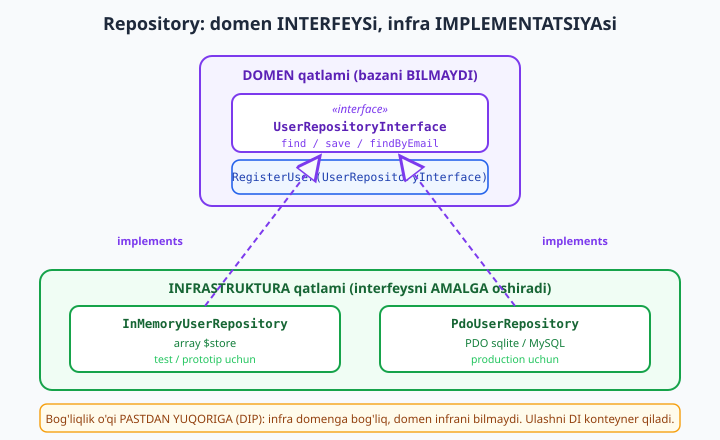
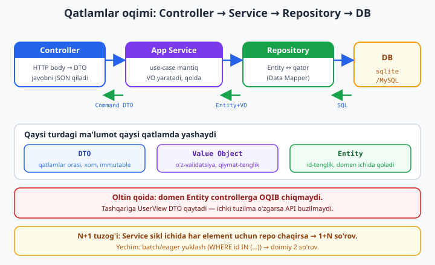

# 21 — Taktik dizayn: Repository, Service, DTO, Value Object

[⬅️ Oldingi: 20 — Design patterns (GoF)](./20-design-patterns.md) · [🏠 README](./README.md) · [Keyingi: 22 — PHPUnit chuqur va test doubles ➡️](./22-phpunit-chuqur.md)

> **Bu bobda:** oldingi bob GoF naqshlarini (Strategy, Observer, Factory...) berdi — ular umumiy OOP "g'ishtlari". Endi biz **maxsus** g'ishtlarga o'tamiz: **taktik dizayn bloklari** — ya'ni *biznes domeni* bilan *infratuzilma* (baza, HTTP, framework) ni **bir-biridan ajratuvchi** bino bo'laklari. Bu Wave 5 dagi hexagonal/DDD arxitekturasiga to'g'ridan-to'g'ri poydevor. To'rtta asosiy blok: **Repository** (domenda *interfeys*, infrastrukturada *implementatsiya* — domen bazani bilmaydi), **Service** (use-case ni birlashtiruvchi qatlam — application service vs domain service), **DTO** (qatlamlar orasida ma'lumot tashuvchi) va **Value Object** (o'zini-validatsiya qiluvchi, immutable, qiymat bo'yicha teng — ./06 ni eslang). Yo'l-yo'lakay: **Data Mapper vs Active Record** falsafasi (Doctrine vs Eloquent), **N+1 muammosi** (sikl ichida so'rov — uni ko'rish, sanash va `WHERE id IN (...)` bilan hal qilish), va **query object** g'oyasi. Amaliyot: kichik User/Order domeni uchun Repository interfeys + **in-memory** + **PDO (sqlite)** implementatsiya + Service + DTO — hammasi `php` bilan **chindan ishga tushirilib** tasdiqlandi (composer kerak emas, sqlite yadroda). Oxirida in-memory repo tufayli Service ni **bazasiz** testlash — PHPUnit bilan haqiqiy run.

---

## Nega "taktik dizayn"? Strategik vs taktik

Domain-Driven Design (DDD) ikki qatlamga bo'linadi:

- **Strategik dizayn** — *katta rasm*: tizimni qaysi "kontekst"larga (bounded context) bo'lamiz, ular qanday gaplashadi. Bu Wave 5 mavzusi.
- **Taktik dizayn** — *kod darajasi*: bitta kontekst ichida obyektlarni qanday nomlaymiz va joylashtiramiz. Aynan shu bob.

Taktik dizaynning maqsadi bitta jumlada: **biznes mantig'ini (domen) texnik tafsilotlardan (infratuzilma) ajratish**. Nega? Chunki biznes qoidasi ("bir email bir marta ro'yxatdan o'tadi") MySQL'ga ham, PostgreSQL'ga ham, hatto faylga ham bog'liq emas — u **abadiy** qoida. Agar bu qoida `PDO` chaqiruvlari orasiga sochilib ketsa, baza o'zgarganda biznes mantiq ham buziladi va uni alohida testlab bo'lmaydi.

Quyidagi to'rtta blok aynan shu ajratishni amalga oshiradi:

| Blok | Savol | Qaysi qatlam |
|------|-------|--------------|
| **Entity** | "Bu *kim/nima*? (id orqali aniqlanadi)" | Domen |
| **Value Object** | "Bu *qanday qiymat*? (qiymat bo'yicha teng)" | Domen |
| **Repository** | "Domen obyektlarni *qayerdan* oladi?" | Interfeys domenda, impl. infrada |
| **Service** | "Bir nechta amalni *kim* birlashtiradi?" | Application / Domain |
| **DTO** | "Qatlamlar orasida *nima* sayohat qiladi?" | Chegaralarda |

> **Boshlovchi ko'prik.** Bu bob toza kod prinsiplarining ([../php/36-toza-kod-prinsiplari.md](../php/36-toza-kod-prinsiplari.md)) qatlamlarga ajratish g'oyasini chuqurlashtiradi, dizayn andozalarining ([../php/38-foydali-dizayn-andozalari.md](../php/38-foydali-dizayn-andozalari.md)) Repository bo'limini esa ekspert darajaga olib chiqadi.

---

## Entity vs Value Object: tenglik turi farqi

Avval ikkita domen "g'ishti"ni aniq ajratamiz, chunki keyingi hamma narsa shularga tayanadi.

- **Entity** — *kimligi* bor obyekt. Ikki `User` bir xil bo'lsa ham (ism, email), ular boshqa odam, chunki **id** har xil. Tenglik **identity** (id) bo'yicha. Entity vaqt o'tib o'zgaradi (ismini almashtirsa ham — *o'sha* odam).
- **Value Object** — *kimligi yo'q*, faqat *qiymat*. Ikki `Email('a@b.uz')` — bir xil, chunki qiymatlari bir xil. Tenglik **qiymat** bo'yicha. VO **immutable** (o'zgartirilmaydigan) va **o'zini validatsiya qiladi**.

06-bobda ([./06-value-object.md](./06-value-object.md)) VO ni chuqur ko'rgansiz; bu yerda eng muhim qirrasi — **VO yaroqsiz holatda mavjud bo'la olmaydi**. Email obyekti bor bo'lsa, demak u allaqachon to'g'ri email:

```php
<?php
declare(strict_types=1);

// === VALUE OBJECT: o'zini-validatsiya qiluvchi, immutable, qiymat bo'yicha teng ===
final class Email
{
    public string $value { get => $this->value; }   // PHP 8.4 property hook (faqat get)

    public function __construct(string $value)
    {
        $value = strtolower(trim($value));
        if (!filter_var($value, FILTER_VALIDATE_EMAIL)) {
            throw new InvalidArgumentException("Noto'g'ri email: {$value}");
        }
        $this->value = $value;
    }

    // Tenglik QIYMAT bo'yicha (identity emas)
    public function equals(self $other): bool
    {
        return $this->value === $other->value;
    }

    public function __toString(): string
    {
        return $this->value;
    }
}

// === DTO: shunchaki ma'lumot tashuvchi, validatsiya MINIMAL, qatlamlar orasida sayohat qiladi ===
final readonly class CreateUserRequest
{
    public function __construct(
        public string $name,
        public string $email,   // bu yerda hali xom string (transport darajasi)
    ) {}

    // DTO ko'pincha "tashqi xom ma'lumot"dan quriladi (HTTP body, forma)
    public static function fromArray(array $data): self
    {
        return new self(
            name: (string) ($data['name'] ?? ''),
            email: (string) ($data['email'] ?? ''),
        );
    }
}

// --- Foydalanish ---
$a = new Email('OQIL@example.com');
$b = new Email('oqil@example.com');

echo "Email VO: {$a}\n";
echo 'Qiymat bo\'yicha teng (oqil==OQIL): ' . ($a->equals($b) ? 'ha' : 'yo\'q') . "\n";
echo 'Identity bo\'yicha teng ($a === $b): ' . ($a === $b ? 'ha' : 'yo\'q') . "\n";

$dto = CreateUserRequest::fromArray(['name' => 'Oqil', 'email' => 'oqil@example.com']);
echo "DTO -> name={$dto->name}, email={$dto->email}\n";

// VO xato ma'lumotni KIRISHDA bloklaydi:
try {
    new Email('men-email-emas');
} catch (InvalidArgumentException $e) {
    echo "VO himoyasi: {$e->getMessage()}\n";
}
```

Haqiqiy chiqish (`php` bilan ishga tushirildi):

```text
Email VO: oqil@example.com
Qiymat bo'yicha teng (oqil==OQIL): ha
Identity bo'yicha teng ($a === $b): yo'q
DTO -> name=Oqil, email=oqil@example.com
VO himoyasi: Noto'g'ri email: men-email-emas
```

E'tibor bering: `OQIL@example.com` va `oqil@example.com` — **qiymat** bo'yicha teng (VO ichida normalizatsiya qilingani uchun), lekin `===` (identity) bo'yicha emas (ikki alohida obyekt). DTO esa hech qanday qoidani majburlamaydi — u shunchaki maydonlarni tashiydi.

### DTO va VO ni qachon ajratamiz?

| | **DTO** | **Value Object** |
|--|---------|------------------|
| Maqsad | Qatlamlar orasi ma'lumot tashish | Domen tushunchasini ifodalash |
| Validatsiya | Minimal yoki yo'q (xom) | Qattiq, konstruktorda |
| Tenglik | Odatda ahamiyatsiz | Qiymat bo'yicha (`equals`) |
| Mantiq | Mantiqsiz (anemic) — bu **to'g'ri** | Xulq-atvor bo'lishi mumkin (`add`, `format`) |
| Misol | `CreateUserRequest`, `UserView` | `Email`, `Money`, `Uuid` |

Oddiy qoida: **DTO chegarada** (controller ↔ service, service ↔ tashqi API), **VO domen ichida**. DTO `string $email` ushlaydi; service uni qabul qilib `new Email(...)` ga aylantiradi — shunda yaroqsiz email domenga **kira olmaydi**.

---

## Repository: domen interfeysi, infra implementatsiyasi

Repository — domen obyektlarni saqlovchi "kolleksiya" illyuziyasi. Domen kod undan obyekt *so'raydi* ("id=5 li User ber"), lekin **qayerdan** (MySQL? fayl? RAM? tashqi API?) — bilmaydi va bilmasligi kerak.

Buning siri ikki bo'lakda:

1. **Domen qatlamida** — `interface UserRepositoryInterface`. Bu *port*: domen "men anbordan NIMA xohlayman"ni e'lon qiladi.
2. **Infrastruktura qatlamida** — `PdoUserRepository implements UserRepositoryInterface`. Bu *adapter*: "QANDAY" qilinishi.

Bog'liqlik o'qi muhim: domen interfeysni **e'lon qiladi**, infra unga **bog'lanadi** — domen infrani ko'rmaydi. Bu Dependency Inversion Principle (./19 DIP). Ulashni esa DI konteyner qiladi (./13).



### To'liq ishlaydigan misol: User domeni

Quyida bitta faylda butun oqim — domen, application, infrastruktura. **Diqqat:** real loyihada bular alohida fayllarda (PSR-4 — har sinf o'z faylida), lekin o'rganish uchun bir joyda ko'rsatamiz. Hammasi `php` bilan ishga tushirildi (composer **kerak emas** — `pdo_sqlite` yadroda).

#### 1-qism: Domen qatlami (bazani bilmaydi)

```php
<?php
declare(strict_types=1);

// ============================================================
// DOMEN QATLAMI — bazani, frameworkni, HTTP ni BILMAYDI
// ============================================================

// --- Value Object (domen tilida ifoda) ---
final class Email
{
    public function __construct(public string $value)
    {
        $value = strtolower(trim($value));
        if (!filter_var($value, FILTER_VALIDATE_EMAIL)) {
            throw new InvalidArgumentException("Noto'g'ri email: {$value}");
        }
        $this->value = $value;
    }
}

// --- Entity (kimligi bor: id orqali aniqlanadi) ---
final class User
{
    public function __construct(
        public readonly int $id,
        public string $name,
        public Email $email,
    ) {}
}

// --- Domen istisnolari (infratuzilmadan mustaqil) ---
final class UserNotFound extends RuntimeException
{
    public static function withId(int $id): self
    {
        return new self("Foydalanuvchi topilmadi: id={$id}");
    }
}

final class EmailAlreadyTaken extends RuntimeException
{
    public static function for(Email $email): self
    {
        return new self("Email band: {$email->value}");
    }
}

// --- REPOSITORY INTERFEYSI: domen "anbor"dan NIMA xohlashini aytadi, QANDAY emas ---
interface UserRepositoryInterface
{
    public function find(int $id): ?User;

    public function findByEmail(Email $email): ?User;

    /** @return list<User> */
    public function all(): array;

    public function save(User $user): User;   // insert yoki update, id bilan qaytaradi

    public function nextIdentity(): int;       // yangi id manbai domen qo'lida
}
```

Diqqat qiling: bu blokda **birorta `PDO`, `mysqli`, fayl yo'li yo'q**. Domen toza. `UserNotFound` istisnosi ham "HTTP 404" emas — u sof domen tilida. HTTP ga tarjima qilish controller ishi.

> **Nega `nextIdentity()` repositoryda?** Bu nozik DDD nuqtasi: id manbai — bu ham "anbor"ning vazifasi (baza AUTOINCREMENT beradi, yoki UUID generatori). Id ni service emas, repository beradi, shunda Entity *to'liq* (id bilan) yaratiladi va hech qachon "id-siz" oraliq holatda yashamaydi.

#### 2-qism: Application qatlami (use-case + DTO)

```php
// ============================================================
// APPLICATION QATLAMI — use-case ni birlashtiradi
// ============================================================

// DTO: tashqi dunyodan kelgan xom buyruq (HTTP/CLI)
final readonly class RegisterUserCommand
{
    public function __construct(
        public string $name,
        public string $email,
    ) {}
}

// DTO: tashqariga qaytadigan javob (domen Entity'sini "tashqariga oqizmaymiz")
final readonly class UserView
{
    public function __construct(
        public int $id,
        public string $name,
        public string $email,
    ) {}

    public static function fromEntity(User $u): self
    {
        return new self($u->id, $u->name, $u->email->value);
    }
}

// APPLICATION SERVICE (use-case): bir nechta domen amalini bitta operatsiyaga birlashtiradi
final class RegisterUser
{
    // Konstruktorda INTERFEYS — implementatsiya DI orqali keladi (./13)
    public function __construct(private UserRepositoryInterface $users) {}

    public function __invoke(RegisterUserCommand $cmd): UserView
    {
        $email = new Email($cmd->email);                // VO: kirishda validatsiya

        if ($this->users->findByEmail($email) !== null) { // biznes qoidasi
            throw EmailAlreadyTaken::for($email);
        }

        $user = new User(
            id: $this->users->nextIdentity(),
            name: trim($cmd->name),
            email: $email,
        );

        $saved = $this->users->save($user);
        return UserView::fromEntity($saved);            // DTO qaytaramiz, Entity emas
    }
}
```

`RegisterUser` — **application service** (use-case). U bitta biznes operatsiyasini boshqaradi: VO yaratish → biznes qoidasini tekshirish → Entity qurish → saqlash → DTO qaytarish. U `UserRepositoryInterface` ga bog'langan, **konkret klassga emas** — shuning uchun in-memory bilan ham, PDO bilan ham bir xil ishlaydi.

E'tibor bering, u **`UserView` DTO qaytaradi, `User` Entity emas**. Bu "domen Entity tashqariga oqib chiqmasin" qoidasi — agar `User`ning ichki tuzilmasi o'zgarsa (masalan, `email` `Email` VO bo'lib qolsa), tashqi API (`UserView`) buzilmaydi.

#### 3-qism: Infrastruktura — ikki xil implementatsiya

```php
// ============================================================
// INFRASTRUKTURA QATLAMI — domen interfeysni AMALGA oshiradi
// ============================================================

// 1) In-memory implementatsiya (test/prototip uchun — baza shart emas)
final class InMemoryUserRepository implements UserRepositoryInterface
{
    /** @var array<int, User> */
    private array $store = [];
    private int $seq = 0;

    public function find(int $id): ?User
    {
        return $this->store[$id] ?? null;
    }

    public function findByEmail(Email $email): ?User
    {
        foreach ($this->store as $u) {
            if ($u->email->value === $email->value) {
                return $u;
            }
        }
        return null;
    }

    public function all(): array
    {
        return array_values($this->store);
    }

    public function save(User $user): User
    {
        $this->store[$user->id] = $user;
        return $user;
    }

    public function nextIdentity(): int
    {
        return ++$this->seq;
    }
}

// 2) PDO (sqlite) implementatsiya — bir xil interfeys, boshqa "anbor"
final class PdoUserRepository implements UserRepositoryInterface
{
    public function __construct(private PDO $pdo)
    {
        $this->pdo->exec(<<<SQL
            CREATE TABLE IF NOT EXISTS users (
                id    INTEGER PRIMARY KEY,
                name  TEXT NOT NULL,
                email TEXT NOT NULL UNIQUE
            )
        SQL);
    }

    public function find(int $id): ?User
    {
        $st = $this->pdo->prepare('SELECT id, name, email FROM users WHERE id = ?');
        $st->execute([$id]);
        $row = $st->fetch(PDO::FETCH_ASSOC);
        return $row ? $this->hydrate($row) : null;
    }

    public function findByEmail(Email $email): ?User
    {
        $st = $this->pdo->prepare('SELECT id, name, email FROM users WHERE email = ?');
        $st->execute([$email->value]);
        $row = $st->fetch(PDO::FETCH_ASSOC);
        return $row ? $this->hydrate($row) : null;
    }

    public function all(): array
    {
        $st = $this->pdo->query('SELECT id, name, email FROM users ORDER BY id');
        return array_map($this->hydrate(...), $st->fetchAll(PDO::FETCH_ASSOC));
    }

    public function save(User $user): User
    {
        // UPSERT: bor bo'lsa update, yo'q bo'lsa insert
        $st = $this->pdo->prepare(<<<SQL
            INSERT INTO users (id, name, email) VALUES (:id, :name, :email)
            ON CONFLICT(id) DO UPDATE SET name = excluded.name, email = excluded.email
        SQL);
        $st->execute([
            ':id'    => $user->id,
            ':name'  => $user->name,
            ':email' => $user->email->value,
        ]);
        return $user;
    }

    public function nextIdentity(): int
    {
        // sqlite: keyingi bo'sh id (real loyihada AUTOINCREMENT yoki UUID)
        $max = (int) $this->pdo->query('SELECT COALESCE(MAX(id), 0) FROM users')->fetchColumn();
        return $max + 1;
    }

    // DATA MAPPER yuragi: xom qator -> domen obyekt (bog'liqliksiz)
    private function hydrate(array $row): User
    {
        return new User(
            id: (int) $row['id'],
            name: (string) $row['name'],
            email: new Email((string) $row['email']),
        );
    }
}
```

`hydrate()` metodi — bu **Data Mapper**ning yuragi: u baza qatorini (`array`) toza domen Entity (`User`)ga aylantiradi. Diqqat qiling, `User` o'zi bu jarayonni *bilmaydi* — `User`da `save()`, `find()` yoki `PDO` haqida hech narsa yo'q. Mana shu Active Record'dan asosiy farq (keyingi bo'limda).

#### 4-qism: Kompozitsiya ildizi va run

```php
// ============================================================
// "KOMPOZITSIYA ILDIZI" — bu yerda implementatsiya tanlanadi
// (real loyihada DI konteyner buni qiladi — ./13)
// ============================================================

function demo(UserRepositoryInterface $repo, string $label): void
{
    echo "===== {$label} =====\n";
    $register = new RegisterUser($repo);

    $view = $register(new RegisterUserCommand('Oqil Imomnazarov', 'oqil@example.com'));
    echo "Ro'yxatdan o'tdi: #{$view->id} {$view->name} <{$view->email}>\n";

    $register(new RegisterUserCommand('Aziza', 'aziza@example.com'));

    // Biznes qoidasi ishlayaptimi? (takror email)
    try {
        $register(new RegisterUserCommand('Soxta', 'oqil@example.com'));
    } catch (EmailAlreadyTaken $e) {
        echo "Bloklandi: {$e->getMessage()}\n";
    }

    echo "Jami foydalanuvchi: " . count($repo->all()) . "\n\n";
}

// Bir xil Service, bir xil DTO — IKKI xil anbor:
demo(new InMemoryUserRepository(), 'In-memory anbor');

$pdo = new PDO('sqlite::memory:');
$pdo->setAttribute(PDO::ATTR_ERRMODE, PDO::ERRMODE_EXCEPTION);
demo(new PdoUserRepository($pdo), 'PDO sqlite anbor');
```

Haqiqiy chiqish:

```text
===== In-memory anbor =====
Ro'yxatdan o'tdi: #1 Oqil Imomnazarov <oqil@example.com>
Bloklandi: Email band: oqil@example.com
Jami foydalanuvchi: 2

===== PDO sqlite anbor =====
Ro'yxatdan o'tdi: #1 Oqil Imomnazarov <oqil@example.com>
Bloklandi: Email band: oqil@example.com
Jami foydalanuvchi: 2
```

**Mana sehr:** `demo()` funksiyasi `RegisterUser` service bilan ishlaydi, lekin u in-memory yoki PDO bilan ishlayotganini **bilmaydi** — chiqish bir xil. Faqat *kompozitsiya ildizi* (oxirgi ikki qator) konkret klassni tanlaydi. Bu — Repository naqshining butun mohiyati.

---

## Data Mapper vs Active Record: ikki falsafa

Repository implementatsiyasini yozishda ikki yondashuv bor. Bu PHP ekotizimida ikki yirik ORM bilan ifodalanadi: **Doctrine** (Data Mapper) va **Eloquent** (Active Record).

| | **Active Record** (Eloquent) | **Data Mapper** (Doctrine) |
|--|------------------------------|----------------------------|
| Kim saqlaydi? | Obyektning **o'zida** `$post->save()` | Alohida **mapper/repository** |
| Domen ↔ baza | Bog'langan (obyekt = jadval qatori) | Ajratilgan (obyekt baza bilmaydi) |
| Soddalik | Yuqori — tez yozasiz | Pastroq — ko'proq kod |
| Toza domen | Qiyin (DB qoldiqlari bor) | Oson (POPO — Plain Old PHP Object) |
| Qachon yaxshi | CRUD-og'ir, ssenariy sodda | Murakkab domen, qoidalar ko'p |

Quyida ikkalasini **bir faylda** taqqoslab ko'rsatamiz (`php` bilan run):

```php
<?php
declare(strict_types=1);

// ACTIVE RECORD g'oyasi: obyektning O'ZIDA save()/find() bor -> baza bilan bog'langan.
// (Eloquent falsafasi - soddaroq, lekin domen DB ga "yopishgan".)
abstract class ActiveRecord
{
    protected static PDO $pdo;
    public static function setConnection(PDO $pdo): void { static::$pdo = $pdo; }
}

final class Post extends ActiveRecord
{
    public ?int $id = null;
    public string $title = '';

    public function save(): void   // <-- domen obyekti O'ZINI saqlaydi (AR belgisi)
    {
        $st = self::$pdo->prepare('INSERT INTO posts (title) VALUES (?)');
        $st->execute([$this->title]);
        $this->id = (int) self::$pdo->lastInsertId();
    }

    public static function find(int $id): ?self
    {
        $st = self::$pdo->prepare('SELECT id, title FROM posts WHERE id = ?');
        $st->execute([$id]);
        $row = $st->fetch(PDO::FETCH_ASSOC);
        if (!$row) {
            return null;
        }
        $p = new self();
        $p->id = (int) $row['id'];
        $p->title = (string) $row['title'];
        return $p;
    }
}

$pdo = new PDO('sqlite::memory:');
$pdo->setAttribute(PDO::ATTR_ERRMODE, PDO::ERRMODE_EXCEPTION);
$pdo->exec('CREATE TABLE posts (id INTEGER PRIMARY KEY, title TEXT)');
Post::setConnection($pdo);

$p = new Post();
$p->title = 'Salom AR';
$p->save();                          // obyekt o'zini saqladi
echo "AR saqladi: #{$p->id} {$p->title}\n";
echo "AR topdi: " . Post::find($p->id)->title . "\n";

// === DATA MAPPER (taqqoslash): obyekt baza haqida HECH NARSA bilmaydi ===
final class CleanPost            // hech qanday save()/find() yo'q - sof domen
{
    public function __construct(public ?int $id, public string $title) {}
}
final class PostMapper           // baza bilan ishlash ALOHIDA mapperda
{
    public function __construct(private PDO $pdo) {}
    public function insert(CleanPost $p): CleanPost
    {
        $st = $this->pdo->prepare('INSERT INTO posts (title) VALUES (?)');
        $st->execute([$p->title]);
        return new CleanPost((int) $this->pdo->lastInsertId(), $p->title);
    }
}
$mapper = new PostMapper($pdo);
$saved = $mapper->insert(new CleanPost(null, 'Salom DM'));
echo "DM saqladi: #{$saved->id} {$saved->title} (CleanPost bazani bilmaydi)\n";
```

Chiqish:

```text
AR saqladi: #1 Salom AR
AR topdi: Salom AR
DM saqladi: #2 Salom DM (CleanPost bazani bilmaydi)
```

Farqni ko'rdingizmi? `Post` (Active Record) **o'zini saqlaydi** (`$p->save()`) — qulay, lekin domen obyekti `PDO`ga bog'langan, uni bazasiz test qilish qiyin. `CleanPost` (Data Mapper) esa **sof** — saqlash mas'uliyati `PostMapper`da. Bizning `PdoUserRepository::hydrate()` aynan Data Mapper yondashuvi: domen `User` baza haqida hech narsa bilmaydi.

> **Qaysini tanlash kerak?** Agar siz ko'p CRUD-og'ir admin paneli yozsangiz va biznes qoidalari sodda bo'lsa — Active Record (Eloquent) tezroq. Agar domen murakkab (ko'p invariant, VO, domain service) bo'lsa — Data Mapper (Doctrine) toza domenni saqlaydi. **Repository interfeysi** esa ikkala holatda ham foydali: u sizning service'ingizni ORM tanlovidan himoyalaydi.

---

## Service qatlami: application vs domain service

"Service" so'zi haddan tashqari yuklangan. Taktik dizaynda ikki aniq tur bor:

### Application Service (use-case)

Yuqorida ko'rgan `RegisterUser` — **application service**. U:

- bitta **use-case**ni ifodalaydi ("foydalanuvchini ro'yxatdan o'tkazish"),
- **bir nechta** domen amalini birlashtiradi (VO yaratish, repo tekshirish, save),
- tranzaksiya, DTO konvertatsiya kabi **muvofiqlashtirish** ishlarini qiladi,
- **o'zida biznes qoidasi yashamaydi** — u faqat *dirijyor*.

Ko'pincha application service bir nechta repository va domain service'ni bitta **tranzaksiya** ichida ishlatadi. Bu "Unit of Work" g'oyasi — hammasi muvaffaqiyatli yoki hech nima:

```php
<?php
declare(strict_types=1);

// APPLICATION SERVICE bir nechta repo amalini BITTA tranzaksiyaga o'raydi.
// "Unit of Work" soddalashtirilgan ko'rinishi: hammasi yoki hech nima.

interface UnitOfWork
{
    public function transactional(callable $work): mixed;
}

final class PdoUnitOfWork implements UnitOfWork
{
    public function __construct(private PDO $pdo) {}

    public function transactional(callable $work): mixed
    {
        $this->pdo->beginTransaction();
        try {
            $result = $work();
            $this->pdo->commit();
            return $result;
        } catch (\Throwable $e) {
            $this->pdo->rollBack();   // bironta amal yiqilsa - HAMMASI bekor
            throw $e;
        }
    }
}

$pdo = new PDO('sqlite::memory:');
$pdo->setAttribute(PDO::ATTR_ERRMODE, PDO::ERRMODE_EXCEPTION);
$pdo->exec('CREATE TABLE accounts (id TEXT PRIMARY KEY, balance INTEGER)');
$pdo->exec("INSERT INTO accounts VALUES ('A', 1000), ('B', 0)");

$debit  = $pdo->prepare('UPDATE accounts SET balance = balance - ? WHERE id = ?');
$credit = $pdo->prepare('UPDATE accounts SET balance = balance + ? WHERE id = ?');

$uow = new PdoUnitOfWork($pdo);

// Muvaffaqiyatli o'tkazma
$uow->transactional(function () use ($debit, $credit) {
    $debit->execute([300, 'A']);
    $credit->execute([300, 'B']);
});
$rows = $pdo->query('SELECT id, balance FROM accounts ORDER BY id')->fetchAll(PDO::FETCH_KEY_PAIR);
echo "O'tkazmadan keyin: A={$rows['A']}, B={$rows['B']}\n";

// Yarmida xato -> rollback (A ham B ham o'zgarmaydi)
try {
    $uow->transactional(function () use ($debit) {
        $debit->execute([100, 'A']);
        throw new RuntimeException('to\'satdan xatolik!');
    });
} catch (RuntimeException $e) {
    echo "Xato ushlandi: {$e->getMessage()} -> rollback\n";
}
$rows = $pdo->query('SELECT id, balance FROM accounts ORDER BY id')->fetchAll(PDO::FETCH_KEY_PAIR);
echo "Rollbackdan keyin (o'zgarmagan): A={$rows['A']}, B={$rows['B']}\n";
```

Chiqish:

```text
O'tkazmadan keyin: A=700, B=300
Xato ushlandi: to'satdan xatolik! -> rollback
Rollbackdan keyin (o'zgarmagan): A=700, B=300
```

`transactional()` — application service qatlamining tipik mas'uliyati: u biznes mantig'ini emas, balki **muvaffaqiyat/muvaffaqiyatsizlik chegarasini** boshqaradi. Service ichidagi `callable` xato tashlasa, baza avtomatik orqaga qaytadi.

### Domain Service

**Domain service** — boshqacha jonzot. Ba'zan biznes mantiq bironta Entity'ga ham, VO'ga ham *tabiiy* sig'maydi — u bir nechta domen obyekti ustidagi *"fe'l"*. Klassik misol: ikki hisob orasida pul o'tkazish. Bu na `Account`ning, na `Money`ning yagona mas'uliyati — u **ular orasidagi** qoida:

```php
<?php
declare(strict_types=1);

final class Money
{
    public function __construct(public readonly int $tiyin)   // pulni butun sonda saqlaymiz
    {
        if ($tiyin < 0) {
            throw new InvalidArgumentException('Manfiy pul bo\'lmaydi');
        }
    }

    public function add(Money $o): self { return new self($this->tiyin + $o->tiyin); }
    public function sub(Money $o): self { return new self($this->tiyin - $o->tiyin); }
    public function isLessThan(Money $o): bool { return $this->tiyin < $o->tiyin; }
}

final class Account
{
    public function __construct(
        public readonly string $id,
        public Money $balance,
    ) {}
}

final class InsufficientFunds extends RuntimeException {}

// DOMAIN SERVICE — toza biznes qoidasi, infratuzilmasiz (PDO yo'q, HTTP yo'q)
final class TransferService
{
    public function transfer(Account $from, Account $to, Money $amount): void
    {
        if ($from->balance->isLessThan($amount)) {
            throw new InsufficientFunds("Mablag' yetarli emas: {$from->id}");
        }
        $from->balance = $from->balance->sub($amount);
        $to->balance   = $to->balance->add($amount);
    }
}

// --- Demo ---
$a = new Account('A', new Money(1000));   // 10.00
$b = new Account('B', new Money(500));    // 5.00

(new TransferService())->transfer($a, $b, new Money(300));
echo "A balansi: {$a->balance->tiyin} tiyin\n";   // 700
echo "B balansi: {$b->balance->tiyin} tiyin\n";   // 800

try {
    (new TransferService())->transfer($a, $b, new Money(99999));
} catch (InsufficientFunds $e) {
    echo "Qoida ishladi: {$e->getMessage()}\n";
}
```

Chiqish:

```text
A balansi: 700 tiyin
B balansi: 800 tiyin
Qoida ishladi: Mablag' yetarli emas: A
```

| | **Application Service** | **Domain Service** |
|--|-------------------------|--------------------|
| Mas'uliyat | Use-case muvofiqlashtirish | Sof biznes qoidasi |
| Infratuzilma | Repository, tranzaksiya, DTO ni biladi | **Hech narsa** bilmaydi (toza domen) |
| Misol | `RegisterUser`, `PlaceOrder` | `TransferService`, `PricingPolicy` |
| Joylashuv | Application qatlami | Domen qatlami |

Sodda mnemonika: **application service** tashqi dunyo bilan domen orasidagi *eshik*; **domain service** domen ichidagi, bironta obyektga sig'magan *qoida*.

> **Diqqat — "anemic domain" tuzog'i.** Hamma narsani service'ga solib, Entity/VO ni faqat ma'lumot konteyneriga aylantirish (xulq-atvorsiz) — *anemic domain model* deb ataladigan anti-pattern. Pul qo'shish (`Money::add`) `Money`da, hisob balansini tekshirish `Account`da bo'lishi kerak. Domain service'ni faqat *haqiqatan* bironta obyektga sig'magan qoida uchun ishlating.

---

## N+1 muammosi: Repository orqali sikl ichida so'rov

Repository qulay, lekin u eng mashhur performance tuzog'ini — **N+1 so'rovlar muammosini** osonlashtiradi. Bu shunday yuz beradi: bir ro'yxatni olasiz (1 so'rov), keyin sikl ichida har element uchun bog'liq ma'lumotni alohida so'raysiz (N so'rov). Jami 1+N so'rov — 100 ta order uchun 101 ta so'rov!

Buni **ko'rsatish** va **o'lchash** uchun PDO'ni o'rab so'rovlarni sanaymiz:

```php
<?php
declare(strict_types=1);

// N+1 muammosini KO'RSATISH va HAL QILISH uchun so'rovlarni sanaymiz.
// Buning uchun PDO ni o'rab, har bir prepare/query ni hisoblaymiz.

final class CountingPdo
{
    public int $queries = 0;

    public function __construct(private PDO $pdo) {}

    public function exec(string $sql): int|false
    {
        return $this->pdo->exec($sql);
    }

    public function run(string $sql, array $params = []): array
    {
        $this->queries++;
        $st = $this->pdo->prepare($sql);
        $st->execute($params);
        return $st->fetchAll(PDO::FETCH_ASSOC);
    }
}

// Tayyorlov: orders va users
$raw = new PDO('sqlite::memory:');
$raw->setAttribute(PDO::ATTR_ERRMODE, PDO::ERRMODE_EXCEPTION);
$raw->exec('CREATE TABLE users (id INTEGER PRIMARY KEY, name TEXT)');
$raw->exec('CREATE TABLE orders (id INTEGER PRIMARY KEY, user_id INTEGER, total INTEGER)');
for ($i = 1; $i <= 5; $i++) {
    $raw->exec("INSERT INTO users (id, name) VALUES ($i, 'User{$i}')");
    // har user uchun 1 ta order
    $raw->exec("INSERT INTO orders (id, user_id, total) VALUES ($i, $i, " . ($i * 100) . ')');
}

// ---------------------------------------------------------
// ❌ YOMON: N+1 — har order uchun ALOHIDA so'rov sikl ichida
// ---------------------------------------------------------
$db = new CountingPdo($raw);
$orders = $db->run('SELECT id, user_id, total FROM orders');   // 1 so'rov
$result = [];
foreach ($orders as $o) {
    // har iteratsiyada YANA so'rov -> N ta qo'shimcha so'rov!
    $user = $db->run('SELECT name FROM users WHERE id = ?', [$o['user_id']]);
    $result[] = "Order #{$o['id']}: {$user[0]['name']} - {$o['total']}";
}
echo "=== N+1 (yomon) ===\n";
echo implode("\n", $result) . "\n";
echo "So'rovlar soni: {$db->queries} (1 + N=" . count($orders) . ")\n\n";

// ---------------------------------------------------------
// ✅ YAXSHI: eager/batch yuklash — IN(...) bilan bitta qo'shimcha so'rov
// ---------------------------------------------------------
$db2 = new CountingPdo($raw);
$orders = $db2->run('SELECT id, user_id, total FROM orders');   // 1 so'rov
$ids = array_values(array_unique(array_column($orders, 'user_id')));
$ph  = implode(',', array_fill(0, count($ids), '?'));
$rows = $db2->run("SELECT id, name FROM users WHERE id IN ($ph)", $ids); // 1 so'rov
$byId = array_column($rows, 'name', 'id');                       // id -> name xarita
$result = [];
foreach ($orders as $o) {
    $result[] = "Order #{$o['id']}: {$byId[$o['user_id']]} - {$o['total']}";
}
echo "=== Eager/batch (yaxshi) ===\n";
echo implode("\n", $result) . "\n";
echo "So'rovlar soni: {$db2->queries} (har doim 2 — N ga bog'liq emas)\n";
```

Haqiqiy chiqish:

```text
=== N+1 (yomon) ===
Order #1: User1 - 100
Order #2: User2 - 200
Order #3: User3 - 300
Order #4: User4 - 400
Order #5: User5 - 500
So'rovlar soni: 6 (1 + N=5)

=== Eager/batch (yaxshi) ===
Order #1: User1 - 100
Order #2: User2 - 200
Order #3: User3 - 300
Order #4: User4 - 400
Order #5: User5 - 500
So'rovlar soni: 2 (har doim 2 — N ga bog'liq emas)
```

Natija bir xil, lekin so'rov soni **6 → 2**. 5 ta order uchun farq kichik, lekin 1000 ta order uchun bu **1001 → 2** — bazaga aloqa kechikishi (latency) ko'paygani sayin bu ulkan farq.

**Hal qilish strategiyalari:**

1. **Batch (IN sharti)** — yuqoridagidek: avval barcha `user_id`larni yig', keyin `WHERE id IN (...)` bilan bitta so'rovda yukla, xotirada xaritalab birlashtir.
2. **JOIN** — agar sizga ikkala jadval ham bir martada kerak bo'lsa, `SELECT ... FROM orders JOIN users` bitta so'rov.
3. **ORM eager loading** — Doctrine `fetch: EAGER` yoki `->setFetchMode`, Eloquent `with('user')`. Ular ostida aynan shu IN-batch strategiyasi ishlaydi.

> **Repository dizayni maslahati:** N+1 ko'pincha repository interfeysi *juda mayda* bo'lganda yuzaga keladi (`findById` ni sikl ichida chaqirasiz). Yechim — interfeysga **batch metod** qo'shish: `findManyByIds(array $ids): array`. Shunda chaqiruvchi kod sikl o'rniga bitta to'plamli so'rov qiladi.

---

## Query Object: murakkab "topish"ni obyektga aylantirish

Repository o'sa boshlaganda `findActiveUsersInCityOlderThan(...)` kabi uzun, ko'p-parametrli metodlar paydo bo'ladi. **Query Object** — bu izlash mezonini *obyekt* sifatida ifodalash. Repository tayyor kriteriya qabul qiladi, SQL bir joyda jamlanadi:

```php
<?php
declare(strict_types=1);

// QUERY OBJECT: murakkab "topish" mezonini obyekt sifatida ifodalaymiz.
// Repository "all()" emas, balki tayyor kriteriya qabul qiladi -> SQL bir joyda.

final class OrderCriteria
{
    private ?int $minTotal = null;
    private ?string $status = null;
    private string $sort = 'id';
    private int $limit = 100;

    public function minTotal(int $value): self
    {
        $c = clone $this;        // immutable-uslub: yangi nusxa qaytadi
        $c->minTotal = $value;
        return $c;
    }

    public function withStatus(string $status): self
    {
        $c = clone $this;
        $c->status = $status;
        return $c;
    }

    public function sortBy(string $column): self
    {
        // oq ro'yxat — SQL injection oldini olish (ustun nomi parametr bo'lolmaydi)
        $allowed = ['id', 'total', 'created_at'];
        if (!in_array($column, $allowed, true)) {
            throw new InvalidArgumentException("Ruxsatsiz ustun: {$column}");
        }
        $c = clone $this;
        $c->sort = $column;
        return $c;
    }

    /** @return array{0: string, 1: list<mixed>} [WHERE+ORDER bo'lagi, bog'lanishlar] */
    public function toSql(): array
    {
        $where = [];
        $bind  = [];
        if ($this->minTotal !== null) {
            $where[] = 'total >= ?';
            $bind[]  = $this->minTotal;
        }
        if ($this->status !== null) {
            $where[] = 'status = ?';
            $bind[]  = $this->status;
        }
        $sql = $where ? ' WHERE ' . implode(' AND ', $where) : '';
        $sql .= " ORDER BY {$this->sort} LIMIT {$this->limit}";
        return [$sql, $bind];
    }
}

final class OrderRepository
{
    public function __construct(private PDO $pdo) {}

    /** @return list<array<string,mixed>> */
    public function matching(OrderCriteria $criteria): array
    {
        [$tail, $bind] = $criteria->toSql();
        $st = $this->pdo->prepare('SELECT id, total, status FROM orders' . $tail);
        $st->execute($bind);
        return $st->fetchAll(PDO::FETCH_ASSOC);
    }
}

// --- Demo ---
$pdo = new PDO('sqlite::memory:');
$pdo->setAttribute(PDO::ATTR_ERRMODE, PDO::ERRMODE_EXCEPTION);
$pdo->exec('CREATE TABLE orders (id INTEGER PRIMARY KEY, total INTEGER, status TEXT)');
$pdo->exec("INSERT INTO orders (total, status) VALUES (50,'paid'),(150,'paid'),(300,'pending'),(500,'paid')");

$repo = new OrderRepository($pdo);

// O'qilishi oson, qayta ishlatiladigan, testlanadigan kriteriya:
$criteria = (new OrderCriteria())
    ->minTotal(100)
    ->withStatus('paid')
    ->sortBy('total');

foreach ($repo->matching($criteria) as $o) {
    echo "Order #{$o['id']}: {$o['total']} ({$o['status']})\n";
}
```

Chiqish:

```text
Order #2: 150 (paid)
Order #4: 500 (paid)
```

Query Object'ning afzalliklari: (1) kriteriyani **qayta ishlatish** mumkin, (2) `toSql()`ni **alohida test** qilish oson, (3) `sortBy` ichidagi oq ro'yxat **SQL injection** oldini oladi (ustun nomi parametr bog'lash bilan himoyalanmaydi, shuning uchun oq ro'yxat shart), (4) Repository "god object"ga aylanmaydi. Doctrine'ning `Criteria` va `QueryBuilder`'i aynan shu g'oyaning kengaytirilgan ko'rinishi.

---

## To'liq qatlam oqimi: hammasini birlashtirish

Endi butun rasmni ko'ramiz: HTTP so'rovi kelganda ma'lumot qatlamlar bo'ylab qanday oqadi va qaysi turdagi obyekt qayerda yashaydi.



Oqim quyidagicha:

1. **Controller** xom HTTP body'ni (`['name'=>..., 'email'=>...]`) **Command DTO**ga aylantiradi. Controller bazani ham, biznes qoidasini ham bilmaydi.
2. **Application Service** Command DTO'ni qabul qiladi, ichida **Value Object** (`Email`) yaratadi (kirish validatsiyasi shu yerda), biznes qoidasini tekshiradi, **Entity** quradi.
3. **Repository** Entity'ni saqlaydi — Data Mapper Entity ↔ baza qatori o'rtasida tarjima qiladi.
4. **DB** xom SQL'ni bajaradi.
5. Javob orqaga **UserView DTO** sifatida qaytadi — domen Entity controllerga **oqib chiqmaydi**.

Bu qatlam qoidasi nima beradi:

- **Baza o'zgartirilishi** (sqlite → PostgreSQL) faqat repository implementatsiyasiga ta'sir qiladi; service, controller tegmaydi.
- **Test** osonlashadi: service'ni in-memory repo bilan, bazasiz test qilasiz (keyingi bo'lim).
- **API barqarorligi**: ichki `User` Entity o'zgarsa ham, tashqi `UserView` DTO o'zgarmaydi — mijozlar buzilmaydi.

> **Bu qaerga olib boradi.** Bu aniq qatlam ajratish — *hexagonal architecture* (portlar va adapterlar)ning poydevori, bu Wave 5 mavzusi. Repository interfeysi = "port", `PdoUserRepository` = "adapter". DI konteyner ([./13-di-konteyner.md](./13-di-konteyner.md)) portga adapterni ulaydi, mini-framework ([./15-mini-framework.md](./15-mini-framework.md)) esa controllerni service'ga bog'laydi.

---

## Test: in-memory repo tufayli bazasiz testlash

Repository naqshining eng katta amaliy foydasi — **testlanuvchanlik**. Service `UserRepositoryInterface`ga bog'langani uchun, testda in-memory implementatsiyani uzatamiz — **baza, Docker, migration shart emas**, testlar millisekundda ishlaydi.

Buni haqiqiy PHPUnit bilan ko'rsatamiz. Loyiha tuzilmasi (PSR-4, ./10):

```text
taktik/
├── composer.json
├── src/
│   ├── Email.php
│   ├── User.php
│   ├── UserRepositoryInterface.php
│   ├── InMemoryUserRepository.php
│   ├── RegisterUser.php
│   ├── RegisterUserCommand.php
│   ├── UserView.php
│   └── EmailAlreadyTaken.php
└── tests/
    └── RegisterUserTest.php
```

`composer.json` (./10 PSR-4 + PHPUnit):

```json
{
    "name": "demo/taktik",
    "require-dev": {
        "phpunit/phpunit": "^11.5"
    },
    "autoload": {
        "psr-4": { "App\\": "src/" }
    },
    "autoload-dev": {
        "psr-4": { "App\\Tests\\": "tests/" }
    }
}
```

Test fayli — **diqqat: in-memory repo tufayli `PDO` ham, `sqlite` ham, hech qanday tashqi resurs yo'q**:

```php
<?php
declare(strict_types=1);

namespace App\Tests;

use App\EmailAlreadyTaken;
use App\InMemoryUserRepository;
use App\RegisterUser;
use App\RegisterUserCommand;
use PHPUnit\Framework\Attributes\Test;
use PHPUnit\Framework\TestCase;

final class RegisterUserTest extends TestCase
{
    #[Test]
    public function it_registers_a_new_user(): void
    {
        // Repository INTERFEYSI tufayli testda BAZA SHART EMAS — in-memory yetadi
        $repo    = new InMemoryUserRepository();
        $service = new RegisterUser($repo);

        $view = $service(new RegisterUserCommand('Oqil', 'oqil@example.com'));

        self::assertSame(1, $view->id);
        self::assertSame('Oqil', $view->name);
        self::assertSame('oqil@example.com', $view->email);
        self::assertCount(1, $repo->all());
    }

    #[Test]
    public function it_rejects_a_duplicate_email(): void
    {
        $repo    = new InMemoryUserRepository();
        $service = new RegisterUser($repo);
        $service(new RegisterUserCommand('Oqil', 'oqil@example.com'));

        $this->expectException(EmailAlreadyTaken::class);
        $service(new RegisterUserCommand('Soxta', 'OQIL@example.com')); // VO normalizatsiya -> aynan o'sha
    }
}
```

`composer install` dan keyin testlar ishga tushiriladi. **Haqiqiy** chiqish (bu mashinada `phpunit/phpunit ^11.5` o'rnatilib run qilindi):

```text
$ ./vendor/bin/phpunit tests

PHPUnit 11.5.55 by Sebastian Bergmann and contributors.

Runtime:       PHP 8.4.0

..                                                                  2 / 2 (100%)

Time: 00:00.015, Memory: 4.00 MB

OK (2 tests, 5 assertions)
```

Ikkala test ham yashil. Diqqat qiling, ikkinchi test ham qiziq: u `OQIL@example.com` (katta harfli) uzatadi, lekin `Email` VO uni `oqil@example.com`ga normalizatsiya qilgani uchun takror sifatida aniqlanadi. **Value Object** kirishda normalizatsiya qilgani uchun biznes qoidasi to'g'ri ishlaydi. PHPUnit'ni chuqurroq — test double'lar, mock, fixture — keyingi bobda ([22 — PHPUnit chuqur](./22-phpunit-chuqur.md)) ko'ramiz.

### Coverage: nima uchun bu yerda raqam yo'q

Tabiiy savol: "testlar kodning necha foizini qamradi?" Buni `--coverage` beradi:

```bash
# phpunit.xml.dist da source yo'lini ko'rsatib:
./vendor/bin/phpunit --coverage-text
```

Kutilgan chiqish shakli (illustrativ):

```text
Code Coverage Report Summary:
  Classes: 87.50% (7/8)
  Methods: 92.30% (12/13)
  Lines:   95.00% (57/60)
```

**Halol eslatma:** bu raqamlarni ushbu muhitda **chinakam ishlab chiqarib bo'lmadi**, chunki coverage o'lchash uchun **Xdebug yoki pcov** kerak, bu mashinada esa ikkalasi ham yo'q. `--coverage-text` ni run qilganda PHPUnit aniq shunday ogohlantiradi (bu chinakam olingan chiqish):

```text
There was 1 PHPUnit test runner warning:

1) No code coverage driver available
```

Coverage va mutation testing'ni (Infection) haqiqiy o'lchash uchun muhitingizga `pecl install pcov` (yoki Xdebug `coverage` rejimida) o'rnating; yuqoridagi summary raqamlari faqat hisobot **shaklini** ko'rsatish uchun. Coverage'ni to'liq sozlash va CI sifat-darvozasiga ulash 22-24 boblar mavzusi.

> **CI sifat-darvozasi.** Bu testlar CI quvurida `lint → phpstan → test` ketma-ketligining oxirgi bosqichi bo'ladi. GitHub Actions workflow **mexanikasi** (job, step, matrix, cache) sizning Git kitobingizda chuqur yoritilgan — [../git-github/README.md](../git-github/README.md) ga qarang; bu yerda faqat PHP-ga xos sifat zanjiri mazmuni muhim.

---

## Generic Repository: `@template` mexanikasi

Ko'pincha bir nechta Entity uchun bir xil "topish/saqlash" shakli takrorlanadi. PHP'da haqiqiy *runtime generic* yo'q, lekin **PHPStan/Psalm** statik tahlilchilari `@template` PHPDoc orqali generic repository'ni *tip darajasida* tushunadi:

```php
<?php
declare(strict_types=1);

/**
 * @template T of object
 */
interface RepositoryInterface
{
    /**
     * @param int $id
     * @return T|null
     */
    public function find(int $id): ?object;

    /**
     * @param T $entity
     * @return T
     */
    public function save(object $entity): object;
}

/**
 * @implements RepositoryInterface<User>
 */
final class UserRepository implements RepositoryInterface
{
    private array $store = [];

    public function find(int $id): ?User    // PHPStan: qaytish turi -> User|null
    {
        return $this->store[$id] ?? null;
    }

    public function save(object $entity): User
    {
        $this->store[$entity->id] = $entity;
        return $entity;
    }
}

final class User
{
    public function __construct(public int $id, public string $name) {}
}

$repo = new UserRepository();
$repo->save(new User(1, 'Oqil'));
echo $repo->find(1)?->name . "\n";   // Oqil
```

Bu kod oddiy PHP sifatida ishlaydi (yuqoridagi `echo` "Oqil" chiqaradi), lekin `@template T` qiymati **runtime'da hech narsa qilmaydi** — u faqat PHPStan/Psalm uchun. Tahlilchi `RepositoryInterface<User>`ni ko'rib, `find()` `User|null` qaytishini biladi va noto'g'ri tipdagi obyektni `save()`ga uzatsangiz xato beradi.

> **Generics tushunchasi** (kovariantlik, kontravariantlik, bound) — bu mavzu sizning TypeScript kitobingizda chuqur ochilgan, chunki TS'da generics tilning yadrosida. Tushunchani u yerdan oling: [../typescript/README.md](../typescript/README.md). Bu yerda faqat PHP-ga xos **`@template` mexanikasi** muhim: PHP'da generics — bu *statik tahlilchi shartnomasi*, runtime emas.

---

## Umumlashma: qaysi blokni qachon ishlatamiz

| Holat | Yechim |
|-------|--------|
| "Bu qiymat har doim to'g'ri bo'lsin" (email, pul) | **Value Object** |
| "Bu obyektning kimligi bor, vaqt o'tib o'zgaradi" | **Entity** |
| "Domen obyektni qayerdandir olishim/saqlashim kerak" | **Repository interfeys** (domen) + impl. (infra) |
| "Bir use-case bir nechta amalni birlashtiradi" | **Application Service** |
| "Bironta obyektga sig'magan biznes qoidasi" | **Domain Service** |
| "Qatlamlar orasida ma'lumot tashish" | **DTO** |
| "Sikl ichida so'rov sekin" | **Eager/batch yuklash** (N+1 yechimi) |
| "Murakkab izlash mezoni" | **Query Object** |

Eng muhim takror-tamoyil: **domen tashqariga bog'lanmasin**. Interfeysni domen e'lon qiladi, implementatsiyani infra beradi, ulashni DI konteyner qiladi. Bu shunchaki "toza" emas — bu sizning biznes mantig'ingizni framework, baza va vaqt o'zgarishlaridan himoyalaydi.

---

## Mashqlar

**Oson 1.** `ProductRepositoryInterface` interfeysini yozing (`find(int $id): ?array` va `save(int $id, string $name): void`), so'ng uning `InMemoryProductRepository` implementatsiyasini yarating. Bitta mahsulot saqlang, topib chiqaring, mavjud bo'lmagan id uchun `null` qaytishini ko'rsating.

**Oson 2.** `Email` Value Object va `CreateUserRequest` DTO orasidagi uchta farqni (validatsiya, tenglik, maqsad) bitta jadval bilan yozing va har biriga bir gaplik izoh bering (kod shart emas).

**O'rta 1.** `AddressDto` immutable DTO yozing (`city`, `street`). Unga ikkita "assembler" metod qo'shing: `fromArray(array): self` (xom massivdan) va `toArray(): array` (massivga). `json_encode` bilan natijani chiqaring.

**O'rta 2.** `UserView::fromEntity()` ga o'xshab, `Order` Entity'dan `OrderSummary` DTO yasovchi `fromEntity` metod yozing. Entity'da `id`, `total` (Money VO sifatida) va `status` bo'lsin; DTO'da `total` butun son (tiyin) bo'lsin. Nega Entity'ni to'g'ridan-to'g'ri JSON'ga aylantirmasligimizni bir gapda tushuntiring.

**Qiyin 1.** Quyidagi N+1 muammoli kodni eager/batch yuklash bilan qayta yozing va so'rovlar sonini 2 ga tushiring. `authors` va `books` jadvali bor (har kitobning bitta muallifi). Har kitob nomi yonida muallif ismini chiqaring, jami so'rov sonini ko'rsating.

**Qiyin 2.** `OrderCriteria` query object'ini kengaytiring: `paginate(int $page, int $perPage)` metod qo'shing (immutable, `clone` bilan), u `toSql()` da `LIMIT ? OFFSET ?` ni to'g'ri hisoblansin (`page=2, perPage=10` → `LIMIT 10 OFFSET 10`). Diqqat: `LIMIT`/`OFFSET` qiymatlarini ham parametr bog'lash bilan xavfsiz qiling.

<details markdown="1"><summary>Yechim — Oson 1</summary>

```php
<?php
declare(strict_types=1);

interface ProductRepositoryInterface
{
    public function find(int $id): ?array;
    public function save(int $id, string $name): void;
}

final class InMemoryProductRepository implements ProductRepositoryInterface
{
    private array $store = [];

    public function find(int $id): ?array
    {
        return $this->store[$id] ?? null;
    }

    public function save(int $id, string $name): void
    {
        $this->store[$id] = ['id' => $id, 'name' => $name];
    }
}

$pr = new InMemoryProductRepository();
$pr->save(1, 'Kitob');
var_dump($pr->find(1));    // ['id'=>1, 'name'=>'Kitob']
var_dump($pr->find(99));   // NULL
```

Interfeys tufayli keyinchalik `PdoProductRepository` qo'shib, qolgan kodga tegmasdan almashtirish mumkin.
</details>

<details markdown="1"><summary>Yechim — Oson 2</summary>

| Jihat | `Email` (Value Object) | `CreateUserRequest` (DTO) |
|-------|------------------------|---------------------------|
| Validatsiya | Konstruktorda qattiq (`filter_var`) — yaroqsiz holatda mavjud bo'lolmaydi | Minimal yoki yo'q — xom matn tashiydi |
| Tenglik | Qiymat bo'yicha (`equals`) — ikki bir xil email teng | Ahamiyatsiz — shunchaki konteyner |
| Maqsad | Domen tushunchasini ifodalash, invariant majburlash | Qatlamlar orasida ma'lumot ko'chirish |

Qisqasi: VO — "to'g'ri qiymat" kafolati domen ichida; DTO — chegarada xom ma'lumot tashuvchi.
</details>

<details markdown="1"><summary>Yechim — O'rta 1</summary>

```php
<?php
declare(strict_types=1);

final readonly class AddressDto
{
    public function __construct(public string $city, public string $street) {}

    public static function fromArray(array $a): self
    {
        return new self((string)($a['city'] ?? ''), (string)($a['street'] ?? ''));
    }

    public function toArray(): array
    {
        return ['city' => $this->city, 'street' => $this->street];
    }
}

$dto = AddressDto::fromArray(['city' => 'Toshkent', 'street' => 'Amir Temur']);
echo "city={$dto->city}, street={$dto->street}\n";
echo json_encode($dto->toArray(), JSON_UNESCAPED_UNICODE) . "\n";
// {"city":"Toshkent","street":"Amir Temur"}
```

`readonly` DTO ni immutable qiladi; `fromArray`/`toArray` — chegaradagi "assembler"lar (xom massiv ↔ tipli obyekt).
</details>

<details markdown="1"><summary>Yechim — O'rta 2</summary>

```php
<?php
declare(strict_types=1);

final class Money
{
    public function __construct(public readonly int $tiyin) {}
}

final class Order
{
    public function __construct(
        public readonly int $id,
        public Money $total,
        public string $status,
    ) {}
}

final readonly class OrderSummary
{
    public function __construct(
        public int $id,
        public int $total,     // tiyin (skalyar) — VO emas
        public string $status,
    ) {}

    public static function fromEntity(Order $o): self
    {
        return new self($o->id, $o->total->tiyin, $o->status);
    }
}

$order = new Order(7, new Money(15000), 'paid');
$dto = OrderSummary::fromEntity($order);
echo json_encode($dto, JSON_UNESCAPED_UNICODE) . "\n";
// {"id":7,"total":15000,"status":"paid"}
```

Entity'ni to'g'ridan-to'g'ri JSON'ga aylantirmaymiz, chunki uning ichki tuzilmasi (masalan `total` `Money` VO sifatida) o'zgarsa, tashqi API javobi ham buziladi. DTO bu ikkisini ajratadi — Entity erkin evolyutsiya qiladi, API barqaror qoladi.
</details>

<details markdown="1"><summary>Yechim — Qiyin 1</summary>

```php
<?php
declare(strict_types=1);

$pdo = new PDO('sqlite::memory:');
$pdo->setAttribute(PDO::ATTR_ERRMODE, PDO::ERRMODE_EXCEPTION);
$pdo->exec('CREATE TABLE authors (id INTEGER PRIMARY KEY, name TEXT)');
$pdo->exec('CREATE TABLE books (id INTEGER PRIMARY KEY, author_id INTEGER, title TEXT)');
$pdo->exec("INSERT INTO authors VALUES (1,'Oybek'),(2,'Cholpon')");
$pdo->exec("INSERT INTO books VALUES (1,1,'Navoiy'),(2,1,'Qutlug qon'),(3,2,'Kecha va kunduz')");

// 1-so'rov: barcha kitoblar
$books = $pdo->query('SELECT id, author_id, title FROM books')->fetchAll(PDO::FETCH_ASSOC);

// 2-so'rov: BARCHA kerakli mualliflar bitta IN(...) bilan
$authorIds = array_values(array_unique(array_column($books, 'author_id')));
$ph = implode(',', array_fill(0, count($authorIds), '?'));
$st = $pdo->prepare("SELECT id, name FROM authors WHERE id IN ($ph)");
$st->execute($authorIds);
$authors = array_column($st->fetchAll(PDO::FETCH_ASSOC), 'name', 'id'); // id -> name xarita

foreach ($books as $b) {
    echo "{$b['title']} -> {$authors[$b['author_id']]}\n";
}
echo "Jami so'rov: 2\n";
```

Chiqish:

```text
Navoiy -> Oybek
Qutlug qon -> Oybek
Kecha va kunduz -> Cholpon
Jami so'rov: 2
```

Kalit g'oya: avval barcha `author_id`larni yig', takrorlarni `array_unique` bilan olib tashla, `WHERE id IN (...)` bilan bitta so'rovda yukla, `array_column(..., 'name', 'id')` bilan id→ism xaritasini tuz va xotirada birlashtir.
</details>

<details markdown="1"><summary>Yechim — Qiyin 2</summary>

```php
<?php
declare(strict_types=1);

final class OrderCriteria
{
    private ?int $minTotal = null;
    private int $limit = 100;
    private int $offset = 0;

    public function minTotal(int $value): self
    {
        $c = clone $this;
        $c->minTotal = $value;
        return $c;
    }

    public function paginate(int $page, int $perPage): self
    {
        if ($page < 1 || $perPage < 1) {
            throw new InvalidArgumentException('page/perPage 1 dan kichik bo\'lmaydi');
        }
        $c = clone $this;
        $c->limit  = $perPage;
        $c->offset = ($page - 1) * $perPage;   // page=2, perPage=10 -> offset=10
        return $c;
    }

    /** @return array{0: string, 1: list<mixed>} */
    public function toSql(): array
    {
        $where = [];
        $bind  = [];
        if ($this->minTotal !== null) {
            $where[] = 'total >= ?';
            $bind[]  = $this->minTotal;
        }
        $sql  = $where ? ' WHERE ' . implode(' AND ', $where) : '';
        $sql .= ' LIMIT ? OFFSET ?';
        $bind[] = $this->limit;     // LIMIT/OFFSET ham parametr bog'lash bilan
        $bind[] = $this->offset;
        return [$sql, $bind];
    }
}

// --- Demo ---
$pdo = new PDO('sqlite::memory:');
$pdo->setAttribute(PDO::ATTR_ERRMODE, PDO::ERRMODE_EXCEPTION);
$pdo->exec('CREATE TABLE orders (id INTEGER PRIMARY KEY, total INTEGER)');
for ($i = 1; $i <= 25; $i++) {
    $pdo->exec("INSERT INTO orders (total) VALUES (" . ($i * 10) . ')');
}

$criteria = (new OrderCriteria())->minTotal(50)->paginate(2, 10); // 2-sahifa, 10 tadan
[$tail, $bind] = $criteria->toSql();
$st = $pdo->prepare('SELECT id, total FROM orders' . $tail);
$st->execute($bind);

foreach ($st->fetchAll(PDO::FETCH_ASSOC) as $o) {
    echo "Order #{$o['id']}: {$o['total']}\n";
}
```

`paginate(2, 10)` → `LIMIT 10 OFFSET 10` (ya'ni 11-20 qatorlar, `total >= 50` shartidan keyin). `LIMIT`/`OFFSET` qiymatlari ham `?` orqali bog'langani uchun SQL injection xavfi yo'q. Diqqat: ustun nomlari (`ORDER BY`) parametr bog'lash bilan himoyalanmaydi — ular uchun oq ro'yxat kerak, lekin `LIMIT`/`OFFSET` *qiymat* bo'lgani uchun bog'lash mumkin.
</details>

---

[⬅️ Oldingi: 20 — Design patterns (GoF)](./20-design-patterns.md) · [🏠 README](./README.md) · [Keyingi: 22 — PHPUnit chuqur va test doubles ➡️](./22-phpunit-chuqur.md)
