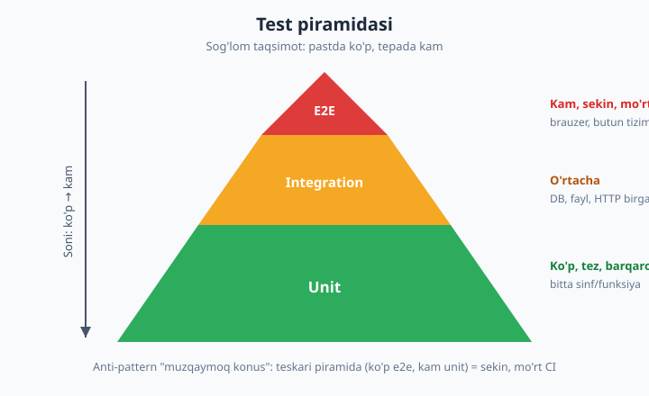
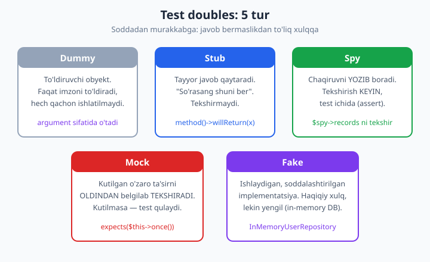

# 22 — PHPUnit chuqur va test doubles

[⬅️ Oldingi: 21 — Taktik dizayn: Repository, Service, DTO](./21-taktik-dizayn.md) · [🏠 README](./README.md) · [Keyingi: 23 — Pest, integratsiya, coverage va mutation ➡️](./23-pest-mutation.md)

> **Bu bobda:** boshlovchi kitobdagi [testing](../php/testing.md) bobi sizga PHPUnit'ning birinchi qadamini — bitta funksiya, bitta `assertSame` — ko'rsatdi. Bu bob shu poydevorni **ekspert darajaga** ko'taradi. Avval **nega** test yozamiz degan savolga jiddiy javob beramiz: regressiya himoyasi, refactoring ishonchi va eng nozigi — **dizaynga bosim** (test yozish qiyin bo'lsa, demak dizayn yomon). So'ng test yozishning universal grammatikasi — **AAA** (Arrange-Act-Assert) va **test piramidasi** (ko'p unit < integration < kam e2e) hamda uning teskarisi bo'lgan "muzqaymoq konus" anti-patterni. PHPUnit mexanikasini chuqur ochamiz: `TestCase`, assertion'lar va eng ko'p xato keltiradigan **`assertSame` vs `assertEquals` farqi**, zamonaviy PHP 8 **atributlari** (`#[Test]`, `#[DataProvider]`, `#[Depends]`, `#[Group]`), `setUp`/`tearDown` hayot tsikli. Bobning yuragi — **test doubles taksonomiyasi**: dummy, stub, spy, mock, fake — har biriga aniq ta'rif, qachon ishlatishni va PHPUnit'da qanday yasashni (`createStub`/`createMock`, `expects()->method()->with()->willReturn()`) ko'rsatamiz. Keyin falsafiy savol: **qachon mock qilmaslik kerak** — London (mockist) va Chicago (classicist) maktablari. Oxirida **test smells** (mo'rt, sekin, mystery guest, bog'liq testlar). Hamma test sinflari haqiqiy `php 8.4` + `phpunit/phpunit` 12.5 bilan ishga tushirilib **yashil natija** olindi (15 test, 30 assertion). Coverage qismi xdebug/pcov yo'qligi sabab illustrativ — buni halol belgilaymiz.

---

## Nega test yozamiz? (jiddiy javob)

Boshlovchi kitobda ([testing](../php/testing.md)) test yozishning to'rt sababini sanagandik: refactoring xavfsizligi, tirik hujjat, ishonch, xatoni erta topish. Bular to'g'ri, lekin ekspert sifatida uchta sababni **chuqurroq** tushunish kerak — chunki ular sizning **dizayningizga** ta'sir qiladi.

### 1. Regressiya himoyasi — vaqt mashinasidagi qulf

"Regressiya" — ilgari ishlagan narsa yangi o'zgarishdan keyin buzilishi. Katta tizimda har bir o'zgarish potensial regressiya. Test to'plami — bu **o'tmishdagi to'g'ri xulqning qulfi**: bugun yozgan testingiz olti oydan keyin, mutlaqo boshqa odam tomonidan kiritilgan o'zgarish sizning kodingizni buzganini bir soniyada aytib beradi. Testsiz tizimda bu xatoni **foydalanuvchi** topadi — productionda, eng yomon paytda.

### 2. Refactoring ishonchi — yashil ekran ostida tozalash

Refactoring — xulqni o'zgartirmasdan ichki tuzilishni yaxshilash. Lekin "xulqni o'zgartirmadim" degan da'voni qanday isbotlaysiz? **Testlar bilan.** Yashil test to'plami ostida siz sinf ichini ag'dar-to'ntar qilishingiz mumkin — agar testlar yashil qolsa, tashqi xulq saqlangan. Testsiz refactoring — bu ko'r-ko'rona jarrohlik.

### 3. Dizaynga bosim — eng kam tushuniladigan, eng qimmatli foyda

Bu eng muhim va eng kam gapiriladigan nuqta:

> **Agar sinfni test qilish qiyin bo'lsa — bu testning emas, dizaynning muammosi.**

Testni yozolmayotgan bo'lsangiz, odatda sabab quyidagilardan biri:

- Sinf o'z bog'liqliklarini **o'zi yaratadi** (`new PdoConnection(...)` konstruktor ichida) — uni almashtira olmaysiz. Yechim: **Dependency Injection** ([13-bob](./13-di-konteyner.md)).
- Sinf **juda ko'p ish qiladi** (God object) — bitta testda o'nta narsani sozlash kerak. Yechim: mas'uliyatni bo'lish (SRP, [toza kod](../php/36-toza-kod-prinsiplari.md)).
- Mantiq **global holatga** (`static`, `$_SESSION`, `date()`) bog'langan — izolyatsiya qila olmaysiz. Yechim: holatni argument yoki interfeys orqali in'ektsiya qilish.

Shuning uchun tajribali muhandislar aytadi: **test — dizayn vositasi, faqat tekshiruv emas.** Test yozish qiyinligini "dizayn yomon" signali sifatida o'qing. Aynan shu sabab TDD (Test-Driven Development) — avval test yozib, keyin kod — dizaynni yaxshilaydi: testlanmaydigan kod yozolmaysiz, chunki test allaqachon bor.

---

## AAA: har bir testning skeletini

Yaxshi test bir g'oyaviy tuzilishga ega — **Arrange-Act-Assert** (Tayyorla-Bajar-Tasdiqla). Bu uchlik testni o'qiladigan va niyatli qiladi:

```php
<?php
declare(strict_types=1);

namespace Tests;

use App\Money;
use PHPUnit\Framework\Attributes\Test;
use PHPUnit\Framework\TestCase;

final class MoneyAaaTest extends TestCase
{
    #[Test]
    public function ikki_summa_qoshiladi(): void
    {
        // Arrange — sahnani tayyorla (kirish ma'lumoti, obyektlar)
        $a = new Money(500, 'USD');
        $b = new Money(250, 'USD');

        // Act — tekshirilayotgan AMALNI bajar (bitta chaqiruv)
        $sum = $a->add($b);

        // Assert — natijani kutilgan bilan solishtir
        $this->assertSame(750, $sum->amount);
        $this->assertSame('USD', $sum->currency);
    }
}
```

Qoidalar:

- **Bitta Act.** Bir testda bitta amalni tekshiring. Ikkita `add()` chaqirsangiz — qaysi biri buzilganini test aytmaydi.
- **Aniq chegaralar.** Bo'sh qator yoki izoh bilan uch bosqichni ajrating — o'qiyotgan odam "qayerda tayyorlash tugab, tekshirish boshlandi" deb chalkashmaydi.
- **Niyatli nom.** Test nomi *xulqni* tasvirlasin: `ikki_summa_qoshiladi`, `manfiy_summa_xato_tashlaydi` — `testMoney1` emas.

Bu bobda ishlatadigan SUT ("System Under Test" — tekshirilayotgan sinf) — soddalashtirilgan e-commerce domeni: `Money` value object ([06-bob](./06-value-object.md) bilan bog'liq), `Order`, va to'lov qatlami.

```php
<?php
declare(strict_types=1);

namespace App;

final readonly class Money
{
    public function __construct(
        public int $amount,        // tiyin (eng kichik birlik) — float EMAS!
        public string $currency,
    ) {
        if ($amount < 0) {
            throw new \InvalidArgumentException('Manfiy summa mumkin emas');
        }
        if (strlen($currency) !== 3) {
            throw new \InvalidArgumentException('Valyuta kodi 3 harf bo`lishi kerak');
        }
    }

    public function add(Money $other): self
    {
        if ($this->currency !== $other->currency) {
            throw new \InvalidArgumentException('Valyutalar mos emas');
        }
        return new self($this->amount + $other->amount, $this->currency);
    }

    public function equals(Money $other): bool
    {
        return $this->amount === $other->amount
            && $this->currency === $other->currency;
    }
}
```

---

## Test piramidasi va "muzqaymoq konus"

Testlar bir xil emas. Ular **doirasi** (scope) va **narxi** bo'yicha qatlamlarga bo'linadi. Sog'lom taqsimotni **test piramidasi** ko'rsatadi.



- **Unit testlar (asos, ko'p).** Bitta sinf yoki funksiyani **izolyatsiyada** tekshiradi — barcha tashqi bog'liqliklar test double bilan almashtiriladi. Millisekundlarda ishlaydi, barqaror (flaky emas), aniq aybdorni ko'rsatadi. Test to'plamingizning **80%** shu yerda bo'lishi kerak.
- **Integration testlar (o'rta).** Bir nechta komponent **birga** ishlashini tekshiradi — masalan, repository haqiqiy SQLite bazasi bilan, yoki middleware pipeline butun PSR-7 so'rovi bilan. Sekinroq (DB/fayl I/O), lekin "qismlarni ulaganda buzilarmikan" savoliga javob beradi. Buni [23-bobda](./23-pest-mutation.md) `:memory:` SQLite bilan chuqur ko'ramiz.
- **E2E testlar (uch, kam).** Butun tizimni foydalanuvchi ko'zi bilan — brauzer orqali, real HTTP. Eng qimmat: sekin, mo'rt (tarmoq, UI o'zgarishi), nosozlik sababini topish qiyin. Faqat eng muhim "happy path"larni qoplaydi.

### Anti-pattern: "muzqaymoq konus" (ice cream cone)

Piramidani **ag'darib** qo'ysangiz — tepada ko'p e2e, pastda kam unit — bu "muzqaymoq konus" anti-patterni. Oqibatlari:

- **Sekin CI.** E2E sekin; minglab e2e bilan test to'plami 40 daqiqa ishlaydi — dasturchilar uni o'tkazib yuboradi.
- **Mo'rtlik (flakiness).** E2E tarmoq/timing'ga bog'liq — goh yashil, goh qizil. Ishonchni yo'qotadi: "yana o'sha test yiqildi, ahamiyat berma" — bu o'lim.
- **Yomon diagnostika.** E2E "checkout ishlamadi" deydi, lekin **qayerda** buzildi — to'lov, savatcha, baza? — aytmaydi. Unit test esa to'g'ri sinfni ko'rsatadi.

Qoida: **mantiqni unit darajada test qiling, ulanishni integration darajada, faqat kritik oqimni e2e darajada.**

> **Ko'prik.** Bu bobning hamma misollari **unit** qatlamda. Integration (real SQLite repository, HTTP) va coverage/mutation [23-bobda](./23-pest-mutation.md). E2E (brauzer) bu PHP trakidan tashqarida — uni alohida vositalar (Panther, Cypress) qoplaydi.

---

## PHPUnit mexanikasi: TestCase va atributlar

Avval o'rnatamiz (faqat `--dev`, productionga ketmaydi):

```bash
composer require --dev phpunit/phpunit
```

Bu PHPUnit 12.x ni `vendor/` ga yuklaydi. `composer.json`:

```json
{
    "require-dev": {
        "phpunit/phpunit": "^12.5"
    }
}
```

### Konfiguratsiya: `phpunit.xml`

Loyiha ildizida `phpunit.xml` — qaysi papkada testlar, qanday qoidalar:

```xml
<?xml version="1.0" encoding="UTF-8"?>
<phpunit xmlns:xsi="http://www.w3.org/2001/XMLSchema-instance"
         xsi:noNamespaceSchemaLocation="vendor/phpunit/phpunit/phpunit.xsd"
         bootstrap="vendor/autoload.php"
         colors="true"
         failOnRisky="true"
         failOnWarning="true"
         cacheDirectory=".phpunit.cache">
    <testsuites>
        <testsuite name="default">
            <directory>tests</directory>
        </testsuite>
    </testsuites>
    <source>
        <include>
            <directory>src</directory>
        </include>
    </source>
</phpunit>
```

`failOnRisky` va `failOnWarning` — ekspert sozlamasi: "risky" test (masalan hech narsa assert qilmaydigan test) yoki ogohlantirish ham CI'ni **qizil** qilsin. Bu sekin-asta yomonlashishni oldini oladi.

### Zamonaviy atributlar (PHP 8) — annotatsiyalar o'rnida

Eski PHPUnit `@test`, `@dataProvider` kabi **doc-comment annotatsiyalarini** ishlatardi. PHP 8 dan boshlab ular **atributlar** bilan almashtirildi — bu IDE tomonidan tekshiriladi, xato terilsa darrov ko'rinadi:

| Atribut | Vazifasi |
|---|---|
| `#[Test]` | Metod test ekanini bildiradi (`test` prefiksisiz nom mumkin) |
| `#[DataProvider('metod')]` | Bitta testni turli ma'lumotlar bilan qayta ishga tushiradi |
| `#[Depends('boshqaTest')]` | Test boshqa testdan keyin va uning natijasiga ega bo'lib ishlaydi |
| `#[Group('nom')]` | Testni guruhga belgilaydi (`--group nom` bilan tanlab ishga tushirish) |

```php
<?php
declare(strict_types=1);

namespace Tests;

use App\Money;
use PHPUnit\Framework\Attributes\DataProvider;
use PHPUnit\Framework\Attributes\Group;
use PHPUnit\Framework\Attributes\Test;
use PHPUnit\Framework\TestCase;

final class MoneyTest extends TestCase
{
    #[Test]
    public function ikki_summa_qoshiladi(): void
    {
        $a = new Money(500, 'USD');
        $b = new Money(250, 'USD');
        $sum = $a->add($b);
        $this->assertSame(750, $sum->amount);
        $this->assertSame('USD', $sum->currency);
    }

    // Data provider — STATIC metod, iterable qaytaradi.
    // Kalit ('nol + nol') test nomida ko'rinadi -> diagnostika oson.
    /** @return iterable<string, array{int, int, int}> */
    public static function summaProvider(): iterable
    {
        yield 'nol + nol'   => [0, 0, 0];
        yield 'oddiy'       => [100, 200, 300];
        yield 'katta'       => [999_999, 1, 1_000_000];
    }

    #[Test]
    #[DataProvider('summaProvider')]
    #[Group('arifmetika')]
    public function turli_summalar_qoshiladi(int $x, int $y, int $expected): void
    {
        $sum = (new Money($x, 'USD'))->add(new Money($y, 'USD'));
        $this->assertSame($expected, $sum->amount);
    }
}
```

Data provider — **takror kodni o'ldiradi**. Uchta o'xshash test o'rniga bitta test + uchta ma'lumot to'plami. Har bir to'plam alohida test sifatida hisoblanadi: biri yiqilsa, qaysi ma'lumot ayblini test nomi (`with "katta"`) aytadi.

> **Diqqat:** data provider metodi **`public static`** bo'lishi shart (PHPUnit 10+). Aks holda "deprecation" ogohlantirishi, va `failOnWarning` bilan test qulaydi.

---

## `assertSame` vs `assertEquals` — eng ko'p xato keltiradigan farq

Bu ikkala assertion'ning farqini tushunmaslik — yangi (va hatto tajribali) dasturchilarning eng keng tarqalgan tuzog'i. Qisqacha:

- `assertEquals($a, $b)` — **`==`** semantikasi (qiymat teng, tip moslashtiriladi).
- `assertSame($a, $b)` — **`===`** semantikasi (qiymat **va** tip aynan teng; obyektlar uchun — **ayni bitta** instance).

Bu farqning oqibati `==` vs `===` tuzog'i bilan bir xil ([05-bobda](./05-tip-tizimi.md) chuqur ko'rilgan):

```php
<?php
declare(strict_types=1);

namespace Tests;

use App\Money;
use PHPUnit\Framework\Attributes\Test;
use PHPUnit\Framework\TestCase;

final class AssertSameVsEqualsTest extends TestCase
{
    #[Test]
    public function assertSame_va_assertEquals_farqi(): void
    {
        $a = new Money(500, 'USD');
        $b = new Money(500, 'USD');

        // assertEquals: == bilan -> ikki ALOHIDA obyekt, lekin holati teng -> OK
        $this->assertEquals($a, $b);

        // assertSame: === bilan -> ular ayni bitta instance EMAS -> NotSame
        $this->assertNotSame($a, $b);

        // Skalyar uchun assertSame tip + qiymatni tekshiradi
        $this->assertSame(500, $a->amount);   // int 500 === int 500
    }
}
```

Nega bu muhim? Skalyar qiymatlarda `assertEquals` **xavfli**:

```php
// ❌ Bu yashil bo'ladi, lekin BUG yashiradi:
$this->assertEquals('0', 0);      // '0' == 0 -> true (tip coercion)
$this->assertEquals('', null);    // '' == null -> true (eski PHP'da)

// ✅ assertSame buni ushlaydi:
// $this->assertSame('0', 0);     // FAIL: string('0') !== int(0)
```

> **Ekspert qoidasi:** **standart holatda `assertSame` ishlating.** U tip xatolarini ushlaydi (funksiya `'0'` o'rniga `0` qaytarib qo'yganini ko'rsatadi). `assertEquals` ni faqat ataylab — masalan ikki alohida value object holatini solishtirganda — ishlating. Float'lar uchun esa `assertEqualsWithDelta($expected, $actual, 0.0001)` (suzuvchi nuqta aniqligi sabab `===` ishlamaydi).

### Boshqa muhim assertion'lar

```php
$this->assertTrue($x);                 $this->assertFalse($x);
$this->assertNull($x);                 $this->assertNotNull($x);
$this->assertCount(3, $array);         // sanog'i aynan 3
$this->assertContains('a', $array);    // element bor
$this->assertInstanceOf(Money::class, $obj);
$this->assertStringContainsString('xato', $msg);
$this->assertGreaterThan(0, $n);       $this->assertLessThanOrEqual(10, $n);
```

### Istisnoni (exception) tekshirish

Xato tashlashini test qilish — `expectException` **Act'dan oldin** chaqiriladi:

```php
<?php
declare(strict_types=1);

namespace Tests;

use App\Money;
use PHPUnit\Framework\Attributes\Test;
use PHPUnit\Framework\TestCase;

final class MoneyExceptionTest extends TestCase
{
    #[Test]
    public function manfiy_summa_xato_tashlaydi(): void
    {
        // Bu MIQDORLAR Act'dan oldin e'lon qilinadi
        $this->expectException(\InvalidArgumentException::class);
        $this->expectExceptionMessage('Manfiy summa');   // xabar shu matnni o'z ichiga olsin

        new Money(-1, 'USD');   // Act: xato tashlasa -> test yashil
    }
}
```

Agar `new Money(-1, ...)` xato **tashlamasa**, test yiqiladi ("kutilgan istisno tashlanmadi"). Bu "negativ test" — noto'g'ri kirishda kod **to'g'ri yiqilishini** kafolatlaydi.

---

## Hayot tsikli: `setUp`, `tearDown`, `#[Depends]`

Ko'p testda bir xil tayyorgarlik takrorlanadi (Arrange qismi). `setUp()` — **har bir test metodidan oldin** ishlaydigan ilmoq, `tearDown()` — har biridan keyin (tozalash uchun):

```php
<?php
declare(strict_types=1);

namespace Tests;

use App\Order;
use App\Money;
use PHPUnit\Framework\Attributes\Depends;
use PHPUnit\Framework\Attributes\Test;
use PHPUnit\Framework\TestCase;

final class DependsLifecycleTest extends TestCase
{
    private Order $order;

    protected function setUp(): void
    {
        // Har testdan OLDIN yangi, TOZA buyurtma -> testlar bir-biridan mustaqil
        $this->order = new Order('ord-fixture', 'USD');
    }

    protected function tearDown(): void
    {
        // Har testdan KEYIN tozalash (fayl o'chirish, ulanish yopish va h.k.)
        unset($this->order);
    }

    #[Test]
    public function bosh_buyurtma_yaratiladi(): Order
    {
        $this->assertSame(0, $this->order->lineCount());
        $this->order->addLine('Kitob', new Money(2000, 'USD'));
        return $this->order;            // keyingi testga uzatish uchun qaytaramiz
    }

    #[Test]
    #[Depends('bosh_buyurtma_yaratiladi')]
    public function oldingi_testdan_kelgan_buyurtma_ishlatiladi(Order $order): void
    {
        // Depends qaytargan qiymat argument sifatida keladi
        $this->assertSame(1, $order->lineCount());
        $this->assertSame(2000, $order->total()->amount);
    }
}
```

**Muhim nuance:** `setUp()` **har** test uchun yangi `$this->order` yaratadi — bu **izolyatsiyani** kafolatlaydi (bir testning o'zgarishi boshqasiga oqib o'tmaydi). `#[Depends]` esa boshqa narsa: u testlararo qiymat uzatadi.

> **Ogohlantirish — `#[Depends]` ni ehtiyot ishlating.** U **testlarni bir-biriga bog'laydi** — bu test smell (quyida ko'ramiz). `bosh_buyurtma_yaratiladi` yiqilsa, unga bog'liq test **o'tkazib yuboriladi** (skipped), va xatolar kaskadi yuzaga keladi. Ko'p hollarda yaxshiroq yechim — har testda kerakli holatni `setUp` yoki yordamchi metod bilan **mustaqil** qurish. `#[Depends]` faqat qimmat tayyorgarlik (masalan sekin tashqi ulanish) takrorlanmasligi kerak bo'lganda oqlanadi.

### Statik ilmoqlar

`setUpBeforeClass()` / `tearDownAfterClass()` — butun sinf uchun **bir marta** (har test uchun emas). Qimmat, lekin o'zgarmas resurs (masalan sxema yaratilgan test bazasi) uchun.

---

## Test doubles taksonomiyasi

"Test double" — kino dublyori kabi: haqiqiy bog'liqlik o'rnida turuvchi soxta obyekt. Maqsad — SUT ni **izolyatsiya** qilish: testda haqiqiy to'lov shlyuzini chaqirib bo'lmaydi (pul ketadi!), haqiqiy bazaga ulanmaymiz (sekin, holat oqadi). Gerard Meszaros bularni besh turga ajratgan, va bu farqlarni **aniq** bilish ekspertni boshlovchidan ajratadi.



| Tur | Ta'rif | Qachon |
|---|---|---|
| **Dummy** | To'ldiruvchi — imzoni to'ldirish uchun beriladi, lekin **ishlatilmaydi** | Konstruktor argumentini qondirish |
| **Stub** | **Tayyor javob** qaytaradi, o'zaro ta'sirni tekshirmaydi | SUT ga kerakli kirish ma'lumotini berish |
| **Spy** | Chaqiruvni **yozib boradi**, tekshirish KEYIN | "Chaqirildimi?" ni test ichida tekshirish |
| **Mock** | **Kutilgan o'zaro ta'sirni** oldindan belgilab **tekshiradi** | O'zaro ta'sir (side-effect) muhim bo'lganda |
| **Fake** | **Ishlaydigan** soddalashtirilgan implementatsiya | Haqiqiy xulq kerak, lekin yengil (in-memory) |

Bu farqlarni amalda ko'ramiz. SUT — `CheckoutService`: u to'lov shlyuzini chaqiradi va loglaydi.

```php
<?php
declare(strict_types=1);

namespace App;

final class CheckoutService
{
    public function __construct(
        private readonly PaymentGateway $gateway,   // interfeys -> double bilan almashtiriladi
        private readonly Logger $logger,
    ) {}

    public function checkout(Order $order, string $cardToken): Receipt
    {
        if ($order->lineCount() === 0) {
            throw new \DomainException('Bo`sh buyurtmani to`lab bo`lmaydi');
        }

        $total = $order->total();
        $this->logger->info("Checkout boshlandi: {$order->id}");

        try {
            $txId = $this->gateway->charge($total, $cardToken);
        } catch (PaymentFailedException $e) {
            $this->logger->error("To`lov muvaffaqiyatsiz: {$order->id}");
            throw $e;
        }

        $this->logger->info("To`lov muvaffaqiyatli: {$txId}");
        return new Receipt($order->id, $txId, $total);
    }
}
```

Diqqat: `CheckoutService` o'z bog'liqliklarini **interfeys** orqali, konstruktorda oladi (`PaymentGateway`, `Logger`). Aynan shu **DI** ([13-bob](./13-di-konteyner.md)) ularni testda double bilan almashtirishga imkon beradi. Agar u `new StripeGateway()` ni ichida yaratsa edi — testlay olmasdik. (Mana yana "dizaynga bosim" — testlanuvchanlik yaxshi dizaynni majbur qiladi.)

### Stub va dummy

```php
<?php
declare(strict_types=1);

namespace Tests;

use App\CheckoutService;
use App\Logger;
use App\Money;
use App\Order;
use App\PaymentGateway;
use PHPUnit\Framework\Attributes\Test;
use PHPUnit\Framework\TestCase;

final class CheckoutStubTest extends TestCase
{
    // Yordamchi: 2500 USD'lik bitta qatorli buyurtma quradi
    private function buyurtma(): Order
    {
        $order = new Order('ord-1', 'USD');
        $order->addLine('Kitob', new Money(2500, 'USD'));
        return $order;
    }

    #[Test]
    public function stub_tayyor_javob_qaytaradi(): void
    {
        // STUB: gateway har doim 'tx-42' qaytaradi (o'zaro ta'sirni TEKSHIRMAYMIZ)
        $gateway = $this->createStub(PaymentGateway::class);
        $gateway->method('charge')->willReturn('tx-42');

        // DUMMY: logger kerak (konstruktor talab qiladi), lekin bu testda ahamiyatsiz
        $logger = $this->createStub(Logger::class);

        $service = new CheckoutService($gateway, $logger);
        $receipt = $service->checkout($this->buyurtma(), 'card_tok');

        // Faqat NATIJANI tekshiramiz (holat-asosli tekshiruv)
        $this->assertSame('tx-42', $receipt->transactionId);
        $this->assertSame(2500, $receipt->paid->amount);
    }
}
```

`createStub()` — interfeysdan soxta obyekt yasaydi, hamma metodlari "null/bo'sh" qaytaradi. `method('charge')->willReturn('tx-42')` bilan biz unga **tayyor javob** beramiz. Bu yerda **stub** (charge javobini berib turadi) va **dummy** (logger — kerak, lekin natijaga ta'sir qilmaydi) bir testda. Farq **niyatda**: stub'dan javob olamiz, dummy esa shunchaki o'rinni to'ldiradi.

### Mock — o'zaro ta'sirni tekshirish

Ba'zan **natija** emas, **o'zaro ta'sir** muhim: "to'lov shlyuzi aynan 2500 USD bilan, aynan bir marta chaqirildimi?" Bu — **mock**:

```php
<?php
declare(strict_types=1);

namespace Tests;

use App\CheckoutService;
use App\Logger;
use App\Money;
use App\Order;
use App\PaymentGateway;
use PHPUnit\Framework\Attributes\Test;
use PHPUnit\Framework\TestCase;

final class CheckoutMockTest extends TestCase
{
    // Yordamchi: 2500 USD'lik bitta qatorli buyurtma quradi
    private function buyurtma(): Order
    {
        $order = new Order('ord-1', 'USD');
        $order->addLine('Kitob', new Money(2500, 'USD'));
        return $order;
    }

    #[Test]
    public function mock_kutilgan_ozaro_tasirni_tekshiradi(): void
    {
        // MOCK: charge() AYNAN 2500 USD bilan, AYNAN bir marta chaqirilishini KUTAMIZ
        $gateway = $this->createMock(PaymentGateway::class);
        $gateway->expects($this->once())               // aynan 1 marta
            ->method('charge')
            ->with(                                     // aynan shu argumentlar bilan
                $this->callback(fn (Money $m): bool => $m->amount === 2500 && $m->currency === 'USD'),
                'card_tok',
            )
            ->willReturn('tx-99');

        $logger = $this->createStub(Logger::class);

        $service = new CheckoutService($gateway, $logger);
        $receipt = $service->checkout($this->buyurtma(), 'card_tok');

        // Verifikatsiya AVTOMATIK: agar charge() chaqirilmasa yoki noto'g'ri arg bilan
        // chaqirilsa, PHPUnit test oxirida testni QULATADI
        $this->assertSame('tx-99', $receipt->transactionId);
    }
}
```

`createStub` va `createMock` farqi **tekshirishda**: `createMock` `expects()` bilan **kutilgan chaqiruvlarni** belgilaydi va test oxirida ularni avtomatik tasdiqlaydi. `expects($this->once())` — "aynan bir marta", boshqalar: `$this->never()`, `$this->exactly(3)`, `$this->atLeastOnce()`. `with(...)` — argumentlar, `callback` esa murakkab argument (Money obyekti) ichini tekshirish uchun.

Mock'ning kuchi — **side-effect**ni tekshirish, masalan log yozildimi:

```php
<?php
declare(strict_types=1);

namespace Tests;

use App\CheckoutService;
use App\Logger;
use App\Money;
use App\Order;
use App\PaymentFailedException;
use App\PaymentGateway;
use PHPUnit\Framework\Attributes\Test;
use PHPUnit\Framework\TestCase;

final class CheckoutErrorLogTest extends TestCase
{
    // Yordamchi: 2500 USD'lik bitta qatorli buyurtma quradi
    private function buyurtma(): Order
    {
        $order = new Order('ord-1', 'USD');
        $order->addLine('Kitob', new Money(2500, 'USD'));
        return $order;
    }

    #[Test]
    public function tolov_muvaffaqiyatsiz_bolsa_xato_loglanadi(): void
    {
        // Stub: charge() istisno tashlaydi
        $gateway = $this->createStub(PaymentGateway::class);
        $gateway->method('charge')
            ->willThrowException(new PaymentFailedException('kartada mablag` yetarli emas'));

        // MOCK logger: error() AYNAN bir marta, 'muvaffaqiyatsiz' so'zi bilan chaqirilsin
        $logger = $this->createMock(Logger::class);
        $logger->expects($this->once())
            ->method('error')
            ->with($this->stringContains('muvaffaqiyatsiz'));

        $service = new CheckoutService($gateway, $logger);

        $this->expectException(PaymentFailedException::class);
        $service->checkout($this->buyurtma(), 'card_tok');
    }
}
```

### Spy — qo'lda yozilgan, keyin tekshiriladigan

PHPUnit mock'lari kuchli, lekin ba'zan oddiy **spy** — chaqiruvni yozib boruvchi qo'lda yozilgan sinf — o'qiladigan bo'ladi. Mock'dan farqi: spy kutilganni **oldindan** belgilamaydi, balki chaqiruvlarni **yozadi** va siz **keyin** (Assert qismida) tekshirasiz:

```php
<?php
declare(strict_types=1);

namespace Tests;

use App\Logger;
use PHPUnit\Framework\Attributes\Test;
use PHPUnit\Framework\TestCase;

/** Qo'lda yozilgan SPY: chaqiruvlarni YOZIB boradi, lekin o'zi tekshirmaydi. */
final class SpyLogger implements Logger
{
    /** @var list<array{level: string, message: string}> */
    public array $records = [];

    public function info(string $message): void
    {
        $this->records[] = ['level' => 'info', 'message' => $message];
    }

    public function error(string $message): void
    {
        $this->records[] = ['level' => 'error', 'message' => $message];
    }
}

final class SpyLoggerTest extends TestCase
{
    #[Test]
    public function spy_chaqiruvlarni_yozib_boradi(): void
    {
        // Arrange
        $spy = new SpyLogger();

        // Act
        $spy->info('birinchi');
        $spy->error('ikkinchi');

        // Assert: yozilgan ma'lumotni KEYIN tekshiramiz (mock'da OLDIN belgilanardi)
        $this->assertCount(2, $spy->records);
        $this->assertSame('info', $spy->records[0]['level']);
        $this->assertSame('ikkinchi', $spy->records[1]['message']);
    }
}
```

**Mock vs spy farqi falsafiy:** mock — "kelajakka qaragan" (expects oldindan), spy — "o'tmishga qaragan" (records keyin). Spy testning Assert qismini ko'rinarli qiladi (AAA buzilmaydi), mock esa Arrange qismida tekshiruvni yashiradi. Ko'p jamoa shu sabab spy'ni afzal ko'radi.

### Fake — ishlaydigan soddalashtirilgan implementatsiya

Eng "kuchli" double — **fake**: u haqiqiy mantiqqa ega, lekin yengillashtirilgan. Klassik misol — **in-memory repository** ([21-bob](./21-taktik-dizayn.md) repository naqshining test versiyasi):

```php
<?php
declare(strict_types=1);

namespace App;

interface UserRepository
{
    public function save(User $user): void;
    public function findById(int $id): ?User;
    public function findByEmail(string $email): ?User;
}

/** Ishlaydigan, soddalashtirilgan repository — bu FAKE (DB o'rniga massiv). */
final class InMemoryUserRepository implements UserRepository
{
    /** @var array<int, User> */
    private array $byId = [];

    public function save(User $user): void
    {
        $this->byId[$user->id] = $user;
    }

    public function findById(int $id): ?User
    {
        return $this->byId[$id] ?? null;
    }

    public function findByEmail(string $email): ?User
    {
        foreach ($this->byId as $user) {
            if ($user->email === $email) {
                return $user;
            }
        }
        return null;
    }
}
```

```php
<?php
declare(strict_types=1);

namespace Tests;

use App\InMemoryUserRepository;
use App\User;
use PHPUnit\Framework\Attributes\Test;
use PHPUnit\Framework\TestCase;

final class FakeRepositoryTest extends TestCase
{
    #[Test]
    public function fake_repository_haqiqiy_xulqqa_ega(): void
    {
        // FAKE: ishlaydigan in-memory implementatsiya
        $repo = new InMemoryUserRepository();

        $repo->save(new User(1, 'oqil@example.com'));
        $repo->save(new User(2, 'aziza@example.com'));

        // Fake HAQIQIY mantiqqa ega -> chindan topadi/topmaydi
        $this->assertSame('oqil@example.com', $repo->findById(1)?->email);
        $this->assertSame(2, $repo->findByEmail('aziza@example.com')?->id);
        $this->assertNull($repo->findById(999));
    }
}
```

Fake'ning afzalligi: u **stub minglab `willReturn`** yozishdan qutqaradi. `save` keyin `findById` haqiqatan ishlaydi — chunki fake'da real mantiq bor. Murakkab ssenariylar (ko'p save/find/delete ketma-ketligi)da fake stub'dan ancha o'qiladigan. Kamchiligi — fakeni **o'zingiz yozasiz va saqlaysiz**, demak unga ham ishonch kerak (ba'zida fake'ning o'ziga test yoziladi: "fake haqiqiy repository bilan bir xil shartnomaga bo'ysunadimi" — contract test).

> **Ko'prik — [21-bob](./21-taktik-dizayn.md).** O'sha bobda Repository interfeysini va uning DB implementatsiyasini qurgansiz. `InMemoryUserRepository` — aynan o'sha interfeysning **test uchun** versiyasi. Service'ni testlashda haqiqiy DB o'rniga shu fake'ni in'ektsiya qilasiz — test millisekundlarda ishlaydi va izolyatsiyalangan bo'ladi.

---

## Qachon MOCK QILMASLIK kerak: London vs Chicago

Yangi boshlovchilar ko'pincha **hamma narsani** mock qiladi. Bu xato. Test double — vosita, har joyga emas. Bu mavzu testlash falsafasidagi ikki maktab bilan bog'liq:

### Chicago maktabi (classicist, "Detroit")

- **Haqiqiy obyektlarni afzal** ko'radi; double'ni faqat "noqulay" bog'liqlik (DB, tarmoq, vaqt, tasodif) uchun ishlatadi.
- Tekshiruv **holat-asosli** (state-based): "amaldan keyin natija to'g'rimi?"
- Misol: `Money::add()` ni test qilganda hech narsa mock qilmaymiz — `Money` toza, bog'liqliksiz. `CheckoutService` ni test qilganda faqat `PaymentGateway` (tarmoq) va `Logger` (I/O) double bo'ladi.

### London maktabi (mockist, "outside-in")

- Sinfning **hamma** bog'liqligini mock qiladi; sinfni "puxta izolyatsiyada" sinaydi.
- Tekshiruv **xulq-asosli** (interaction-based): "to'g'ri hamkorlar to'g'ri tartibda chaqirildimi?"
- Dizaynni "tashqaridan ichkariga" haydaydi: avval yuqori sinf, uning hamkorlarini mock bilan kashf etib, keyin ularni implementatsiya qiladi.

### Qachon qaysi? Amaliy qoidalar

**Mock QILMANG:**

- **Value object va toza mantiqni** (`Money`, `Email`, sof funksiya) — ular tez, deterministik, bog'liqliksiz. Haqiqiysini ishlating.
- **O'zingiz egasi bo'lmagan tipni** ("Don't mock what you don't own") — masalan Guzzle yoki PDO ni to'g'ridan-to'g'ri mock qilish mo'rt: ularning ichki API'si o'zgarsa, mock'ingiz yolg'on yashil bo'ladi. O'rniga **o'z interfeysingizga** (`PaymentGateway`) o'rab, shuni mock qiling.
- **Data structure / DTO** ([21-bob](./21-taktik-dizayn.md)) — ular shunchaki ma'lumot, mock'lash ma'nosiz.

**Mock QILING:**

- **Yon ta'sirli I/O**: to'lov shlyuzi, email yuborish, tashqi HTTP, fayl tizimi — testda ularni haqiqatan bajarib bo'lmaydi.
- **Side-effect muhim bo'lganda**: "to'lovsiz email yuborilmasligi kerak" — bu o'zaro ta'sir, holat emas, mock kerak.

> **Ekspert nuqtai nazari:** ko'pchilik tajribali muhandis **classicist'ga yaqin** turadi — kamroq mock, ko'proq haqiqiy obyekt va fake. Sabab: **over-mocking** testni kodning **ichki tuzilishiga** bog'lab qo'yadi. Agar testingiz "`a()` keyin `b()` keyin `c()` chaqirildi" deb tekshirsa, siz **implementatsiyani** test qilyapsiz, **xulqni** emas — refactoring (b va c ni birlashtirish) testni buzadi, garchi xulq o'zgarmasa ham. Bu eng yomon test smell: **mo'rt test** (quyida).

---

## Test smells: yomon testni qanday taniydigan

Yomon test — yo'qligidan ham battar: u noto'g'ri ishonch beradi yoki rivojlanishni sekinlashtiradi. Asosiy "hidlar":

### 1. Mo'rt (fragile) test

Implementatsiya o'zgarganda — xulq o'zgarmasa ham — yiqiladigan test. Sababi odatda **over-mocking** (ichki chaqiruvlarni tekshirish) yoki tashqi tafsilotga bog'lanish.

```php
// ❌ MO'RT: ichki metod chaqiruvlar tartibini tekshiradi
$mock->expects($this->once())->method('validateStep1');
$mock->expects($this->once())->method('validateStep2');
// validateStep1+2 ni bitta validate() ga birlashtirsangiz -> test yiqiladi
// (garchi tashqi xulq o'zgarmasa ham)

// ✅ MUSTAHKAM: faqat natijani tekshir
$this->assertTrue($validator->isValid($input));
```

### 2. Sekin (slow) test

Har bir test sekundlarda ishlasa — to'plam daqiqalarga cho'ziladi, dasturchi uni o'tkazib yuboradi. Sabab: haqiqiy DB/tarmoq/`sleep()`. Yechim: I/O ni fake/stub bilan almashtir, sekin testlarni `#[Group('slow')]` ga ajrat va ularni faqat CI'da ishga tushir.

### 3. Mystery guest (sirli mehmon)

Test o'zidan tashqaridagi yashirin holatga bog'liq — tashqi fayl, umumiy DB yozuvi, oldingi test qoldirgan holat. Testni o'qib, **nima sodir bo'layotganini tushunib bo'lmaydi**, chunki "mehmon" ko'rinmaydi.

```php
// ❌ MYSTERY GUEST: bu fayl qayerdan keldi? ichida nima bor?
$data = json_decode(file_get_contents(__DIR__ . '/fixtures/users.json'), true);

// ✅ Kerakli ma'lumotni test ICHIDA, ko'rinadigan qilib qur (Arrange)
$user = new User(1, 'oqil@example.com');
```

### 4. Bog'liq testlar (interdependent tests)

Testlar ma'lum **tartibda** ishlashga tayanadi: biri global holat qoldiradi, ikkinchisi unga muhtoj. Bittasini alohida ishga tushirsangiz — yiqiladi. Bu izolyatsiya buzilishi: har test **mustaqil** va **istalgan tartibda** ishlashi shart.

```php
// ❌ Bog'liq: $this->order static yoki test orasida saqlanadi
// Test A buyurtma yaratadi, Test B unga ishonadi -> alohida ishlasa yiqiladi

// ✅ setUp() har testdan oldin TOZA holat beradi -> mustaqillik
protected function setUp(): void { $this->order = new Order('id', 'USD'); }
```

Boshqa hidlar: **assertion roulette** (bir testda o'nlab xabardsiz assert — qaysi biri yiqildi noma'lum), **mantiq testda** (`if`/`foreach` test ichida — testning o'zi buggy bo'lishi mumkin), **eager test** (bir testda butun sinfni sinash).

> **Oltin qoida:** test **F.I.R.S.T.** bo'lsin — **F**ast (tez), **I**solated (izolyatsiyalangan), **R**epeatable (takrorlanuvchi, deterministik), **S**elf-validating (o'zi yashil/qizil deydi, qo'lda tekshirish kerak emas), **T**imely (kod bilan birga, kech emas).

---

## Hammasini ishga tushirish (yashil natija)

Yuqoridagi barcha sinflarni `tests/` ga joylab, ishga tushiramiz:

```bash
php vendor/bin/phpunit --testdox
```

`--testdox` — testlarni inson o'qiydigan jumlalar sifatida ko'rsatadi. Bu mashinada (PHP 8.4.0 + PHPUnit 12.5.29) haqiqiy chiqish:

```text
PHPUnit 12.5.29 by Sebastian Bergmann and contributors.

Runtime:       PHP 8.4.0
Configuration: phpunit.xml

...............                                                   15 / 15 (100%)

Time: 00:00.024, Memory: 8.00 MB

Checkout Service (Tests\CheckoutService)
 ✔ Stub tayyor javob qaytaradi
 ✔ Mock kutilgan ozaro tasirni tekshiradi
 ✔ Tolov muvaffaqiyatsiz bolsa xato loglanadi
 ✔ Bosh buyurtma rad etiladi

Money (Tests\Money)
 ✔ Ikki summa qoshiladi
 ✔ AssertSame va assertEquals farqi
 ✔ Manfiy summa xato tashlaydi
 ✔ Mos kelmagan valyuta xato
 ✔ Turli summalar qoshiladi with nol + nol
 ✔ Turli summalar qoshiladi with oddiy
 ✔ Turli summalar qoshiladi with katta
 ...

OK (15 tests, 30 assertions)
```

**OK (15 tests, 30 assertions)** — hammasi yashil. Foydali bayroqlar:

```bash
php vendor/bin/phpunit --filter DependsLifecycle   # nom bo'yicha tanlash
php vendor/bin/phpunit --group arifmetika          # #[Group] bo'yicha
php vendor/bin/phpunit --stop-on-failure           # birinchi yiqilishda to'xta
php vendor/bin/phpunit --testdox                    # o'qiladigan jumlalar
```

### Coverage (qamrov) — illustrativ

Test **qamrovi** (code coverage) — testlar kodning necha foizini ishga tushirganini o'lchaydi. Bu metrikani olish uchun PHP'ga **coverage drayveri** kerak: **Xdebug** yoki **PCOV**.

> **Halol eslatma:** bu mashinada Xdebug ham, PCOV ham o'rnatilmagan, shuning uchun coverage'ni **haqiqatan ishga tushirib bo'lmaydi**. `--coverage-text` chaqirsak, PHPUnit aniq shunday deydi:
>
> ```text
> 1) PHPUnit test runner warning:
>    No code coverage driver available
>
> No tests executed!
> ```
>
> Quyidagi `phpunit.xml` sozlamasi va kutilgan chiqish — **ko'rsatuv uchun** (sizning muhitingizda Xdebug/PCOV o'rnatilgan bo'lsa ishlaydi):

```xml
<!-- phpunit.xml ichida coverage hisobotini yoqish -->
<coverage>
    <report>
        <text outputFile="php://stdout" showOnlySummary="true"/>
        <html outputDirectory="coverage-html"/>
    </report>
</coverage>
```

```bash
# Xdebug bilan (XDEBUG_MODE majburiy):
XDEBUG_MODE=coverage php vendor/bin/phpunit --coverage-text
```

Kutilgan chiqish (illustrativ):

```text
Code Coverage Report Summary:
  Classes: 100.00% (5/5)
  Methods:  92.31% (12/13)
  Lines:    95.40% (83/87)
```

> **Diqqat — coverage tuzog'i.** 100% qamrov **bug yo'qligini** anglatmaydi. Qamrov faqat qator **ishga tushganini** o'lchaydi, **to'g'ri tekshirilganini** emas. `assert` yozmasdan ham qatorni "qoplash" mumkin. Qamrovning sifatini o'lchaydigan haqiqiy metrika — **mutation testing** (Infection), uni [23-bobda](./23-pest-mutation.md) ko'ramiz (u ham xdebug/pcov talab qiladi, shuning uchun illustrativ bo'ladi).

---

## Sifat darvozasi: testning CI'dagi o'rni

Testlar — sifat **darvozasi**ning bir bo'lagi. To'liq darvoza odatda ketma-ket: **lint → static analysis → test**:

```bash
php vendor/bin/php-cs-fixer fix --dry-run   # 1. uslub (PSR-12) -> 10-bob
php vendor/bin/phpstan analyse src tests     # 2. statik tahlil -> keyingi boblar
php vendor/bin/phpunit                        # 3. testlar -> shu bob
```

Birinchi qadam yiqilsa, keyingisi ishlamaydi — "fail fast". Bu darvoza har **pull request**da avtomatik ishlashi kerak.

> **Ko'prik — CI mexanikasi.** GitHub Actions workflow yozish, matritsa (bir nechta PHP versiyasi), kesh va artefaktlar — bularning **mexanikasi** sizning [Git va GitHub kitobingizda](../git-github/README.md) chuqur yoritilgan. Bu yerda biz faqat **PHP sifat-darvozasining mazmunini** (qaysi vositalar, qaysi tartibda) ko'rsatdik — uni o'sha workflow ichidagi qadamlarga joylashtirasiz. Ekspert qoidasi: lokal `composer test` skripti va CI bir xil buyruqlarni ishlatsin, "menda ishlaydi-ku" muammosini yo'qotish uchun.

`composer.json` ga qulay skript qo'shing:

```json
{
    "scripts": {
        "test": "phpunit",
        "test:cov": "XDEBUG_MODE=coverage phpunit --coverage-text",
        "check": [
            "@php vendor/bin/php-cs-fixer fix --dry-run",
            "@php vendor/bin/phpstan analyse",
            "@php vendor/bin/phpunit"
        ]
    }
}
```

Endi `composer check` — butun sifat darvozasini bir buyruqda ishga tushiradi.

---

## Xulosa

Bu bobda test yozishni mexanikadan **muhandislik faniga** ko'tardik:

- **Nega test** — uchta ekspert sabab: regressiya himoyasi, refactoring ishonchi va eng nozigi — **dizaynga bosim** (testlanmaslik = yomon dizayn signali).
- **AAA** har testning grammatikasi; **test piramidasi** sog'lom taqsimot (ko'p unit), "muzqaymoq konus" esa anti-pattern.
- **PHPUnit**: zamonaviy atributlar (`#[Test]`/`#[DataProvider]`/`#[Depends]`/`#[Group]`), `setUp`/`tearDown` hayot tsikli, va eng muhim — **`assertSame` (standart, tip-aniq) vs `assertEquals` (==, ehtiyot)**.
- **Test doubles 5 turi** — dummy (to'ldiruvchi), stub (tayyor javob), spy (yozib boradi), mock (o'zaro ta'sirni tekshiradi), fake (ishlaydigan soddalashtirilgan). `createStub`/`createMock` va `expects()->method()->with()->willReturn()`.
- **Qachon mock qilmaslik** — classicist (haqiqiy obyekt afzal) vs mockist; value object/toza mantiqni mock qilmang, faqat I/O va muhim side-effectni.
- **Test smells** — mo'rt, sekin, mystery guest, bog'liq testlar; **F.I.R.S.T.** prinsipi.

Hamma test sinflari haqiqiy PHP 8.4 + PHPUnit 12.5 bilan ishlatildi: **15 test, 30 assertion, yashil**. Coverage va mutation testing xdebug/pcov talab qiladi — keyingi bobda ularni Pest va integration testlar bilan birga chuqur ko'ramiz.

> **Keyingi qadam — [23-bob](./23-pest-mutation.md):** Pest (yangi, ifodali sintaksis), real `:memory:` SQLite bilan **integration** testlar (repository darajasida), va sifatni o'lchaydigan ikki vosita — **coverage** va **mutation testing** (Infection) — illustrativ konfiguratsiya bilan.

---

## Mashqlar

### Oson

1. `Money` sinfiga `subtract(Money $other): self` metodi qo'shing (natija manfiy bo'lsa istisno tashlasin). Unga `assertSame` bilan ikkita test yozing: oddiy ayirish va manfiy natija (`expectException`).
2. `assertSame` va `assertEquals` farqini ko'rsatadigan test yozing: `assertEquals('5', 5)` yashil, lekin `assertSame('5', 5)` qizil ekanini izohli kommentlar bilan tushuntiring.
3. `MoneyTest::summaProvider` ga yana ikkita holat (`yield`) qo'shing va data provider bilan ishlatilganini `--testdox` chiqishida tasdiqlang.

### O'rta

4. `Logger` uchun `SpyLogger` o'rniga **mock** yozib, `CheckoutService` muvaffaqiyatli to'lovda `info()` ni **aynan ikki marta** chaqirishini tasdiqlang (`expects($this->exactly(2))`).
5. Yangi `NotificationService` sinfi yarating: u `Mailer` interfeysiga bog'liq va `notify(User $u)` chaqirilganda `Mailer::send()` ni chaqiradi. Avval **stub** bilan (natija), keyin **mock** bilan (send aynan bir marta, to'g'ri email bilan chaqirilganini) test yozing. Ikki yondashuvni izohda solishtiring.
6. `InMemoryUserRepository` ga `delete(int $id): void` qo'shing va fake bilan to'liq ssenariy testlang: save → find (topiladi) → delete → find (null). Nega bu yerda fake stub'dan o'qiladigan ekanini bir jumlada yozing.

### Qiyin

7. `setUp()` da har testdan oldin uchta foydalanuvchili `InMemoryUserRepository` quring. So'ng "bog'liq testlar" anti-patternini **ataylab** yarating (bir test foydalanuvchi qo'shadi, ikkinchisi unga ishonadi), uni ishga tushirib ko'ring, keyin `setUp` izolyatsiyasi bilan **tuzating**. Farqni izohlang.
8. `CheckoutService` ni "London uslubida" (hamma bog'liqlik mock) va "Chicago uslubida" (faqat I/O mock, `Order`/`Money` haqiqiy) test qiling. Qaysi biri refactoring (masalan `total()` ichini o'zgartirish)da mo'rtroq — sinab ko'ring va xulosa yozing.
9. `phpunit.xml` ga coverage konfiguratsiyasini qo'shing va `XDEBUG_MODE=coverage` bilan ishga tushiring. Agar muhitingizda Xdebug bo'lmasa, "No code coverage driver available" xabarini ko'rsating va Xdebug'ni o'rnatish qadamlarini hujjatlang. Coverage 100% bo'lsa ham bug qolishi mumkinligini ko'rsatadigan bitta misol o'ylab toping.

---

<details markdown="1"><summary>Yechim — 1</summary>

```php
// Money sinfi ichidagi yangi metod:
public function subtract(Money $other): self
{
    if ($this->currency !== $other->currency) {
        throw new \InvalidArgumentException('Valyutalar mos emas');
    }
    // natija manfiy bo'lsa, konstruktor o'zi istisno tashlaydi -> yangi tekshiruv shart emas
    return new self($this->amount - $other->amount, $this->currency);
}

// MoneySubtractTest sinfi ichidagi metodlar:
#[Test]
public function ayirish_ishlaydi(): void
{
    $r = (new Money(1000, 'USD'))->subtract(new Money(300, 'USD'));
    $this->assertSame(700, $r->amount);
}

#[Test]
public function manfiy_natija_xato(): void
{
    $this->expectException(\InvalidArgumentException::class);
    (new Money(100, 'USD'))->subtract(new Money(500, 'USD'));   // 100-500 < 0
}
```

Diqqat: manfiy natija tekshiruvini `Money` **konstruktoriga** topshirdik — DRY: validatsiya bir joyda.

</details>

<details markdown="1"><summary>Yechim — 2</summary>

```php
<?php
declare(strict_types=1);

namespace Tests;

use PHPUnit\Framework\Attributes\Test;
use PHPUnit\Framework\TestCase;

final class SameVsEqualsTest extends TestCase
{
    #[Test]
    public function same_va_equals_farqi(): void
    {
        // assertEquals -> == semantikasi -> tip moslashtiriladi -> '5' == 5 -> YASHIL
        $this->assertEquals('5', 5);

        // assertSame -> === semantikasi -> tip ham teng bo'lsin -> string('5') !== int(5)
        // Quyidagi qator QIZIL bo'lardi (ataylab izohga olindi):
        // $this->assertSame('5', 5);   // ❌ FAIL: Failed asserting that 5 is identical to '5'

        // To'g'ri ishlatish: assertSame ayni tip bilan
        $this->assertSame(5, 2 + 3);    // int 5 === int 5 -> YASHIL
    }
}
```

Xulosa: `assertEquals` tip xatosini yashiradi (`'5'` o'rniga `5` qaytsa ham yashil), `assertSame` esa uni ushlaydi. Standart holatda `assertSame` ishlating.

</details>

<details markdown="1"><summary>Yechim — 3</summary>

```php
// MoneyTest sinfi ichidagi data provider metodi:
/** @return iterable<string, array{int, int, int}> */
public static function summaProvider(): iterable
{
    yield 'nol + nol'      => [0, 0, 0];
    yield 'oddiy'          => [100, 200, 300];
    yield 'katta'          => [999_999, 1, 1_000_000];
    yield 'bir tomon nol'  => [0, 777, 777];        // yangi
    yield 'teng summalar'  => [250, 250, 500];      // yangi
}
```

`--testdox` chiqishida har bir `yield` alohida qator bo'ladi:

```text
 ✔ Turli summalar qoshiladi with bir tomon nol
 ✔ Turli summalar qoshiladi with teng summalar
```

Kalitlar (`'bir tomon nol'`) test nomida ko'rinadi — biri yiqilsa, qaysi ma'lumot ayblini darrov bilamiz.

</details>

<details markdown="1"><summary>Yechim — 4</summary>

```php
<?php
declare(strict_types=1);

namespace Tests;

use App\CheckoutService;
use App\Logger;
use App\Money;
use App\Order;
use App\PaymentGateway;
use PHPUnit\Framework\Attributes\Test;
use PHPUnit\Framework\TestCase;

final class CheckoutInfoCountTest extends TestCase
{
    #[Test]
    public function muvaffaqiyatli_tolovda_info_ikki_marta(): void
    {
        $gateway = $this->createStub(PaymentGateway::class);
        $gateway->method('charge')->willReturn('tx-1');

        // CheckoutService muvaffaqiyatli oqimda info() ni 2 marta chaqiradi:
        // "Checkout boshlandi" + "To'lov muvaffaqiyatli"
        $logger = $this->createMock(Logger::class);
        $logger->expects($this->exactly(2))->method('info');
        $logger->expects($this->never())->method('error');   // xato yo'q -> error chaqirilmaydi

        $order = new Order('o-1', 'USD');
        $order->addLine('Kitob', new Money(2000, 'USD'));

        (new CheckoutService($gateway, $logger))->checkout($order, 'tok');
    }
}
```

`$this->never()` — kuchli tekshiruv: "muvaffaqiyatli oqimda `error` umuman chaqirilmasligi kerak". Bu side-effect testi — mock'ning klassik o'rni.

</details>

<details markdown="1"><summary>Yechim — 5</summary>

```php
<?php
declare(strict_types=1);

namespace App {
    interface Mailer
    {
        public function send(string $to, string $subject, string $body): void;
    }

    final class NotificationService
    {
        public function __construct(private readonly Mailer $mailer) {}

        public function notify(User $user): void
        {
            $this->mailer->send($user->email, 'Salom', 'Xush kelibsiz!');
        }
    }
}

namespace Tests {
    use App\Mailer;
    use App\NotificationService;
    use App\User;
    use PHPUnit\Framework\Attributes\Test;
    use PHPUnit\Framework\TestCase;

    final class NotificationServiceTest extends TestCase
    {
        // STUB yondashuvi (natija) — send() void qaytaradi, tekshiradigan natija yo'q,
        // shuning uchun stub bu yerda kam ma'noli. Faqat "yiqilmadi"ni ko'rsatadi:
        #[Test]
        public function stub_bilan(): void
        {
            $mailer = $this->createStub(Mailer::class);   // send() hech narsa qilmaydi
            (new NotificationService($mailer))->notify(new User(1, 'a@b.com'));
            $this->expectNotToPerformAssertions();        // void -> tekshiriladigan natija yo'q
        }

        // MOCK yondashuvi (o'zaro ta'sir) — bu yerda TO'G'RI tanlov:
        #[Test]
        public function mock_bilan(): void
        {
            $mailer = $this->createMock(Mailer::class);
            $mailer->expects($this->once())
                ->method('send')
                ->with('a@b.com', 'Salom', 'Xush kelibsiz!');   // aynan shu argumentlar

            (new NotificationService($mailer))->notify(new User(1, 'a@b.com'));
        }
    }
}
```

Solishtirish: `send()` **void** — uning butun maqsadi side-effect (email yuborish). Bunday holatda **mock** to'g'ri (o'zaro ta'sirni tekshiradi); stub esa deyarli foydasiz, chunki tekshiradigan qaytma qiymat yo'q.

</details>

<details markdown="1"><summary>Yechim — 6</summary>

```php
// InMemoryUserRepository sinfi ichidagi yangi metod:
public function delete(int $id): void
{
    unset($this->byId[$id]);
}

// FakeLifecycleTest sinfi ichidagi metod:
#[Test]
public function toliq_hayot_tsikli(): void
{
    $repo = new InMemoryUserRepository();

    $repo->save(new User(1, 'oqil@example.com'));
    $this->assertNotNull($repo->findById(1));      // topiladi

    $repo->delete(1);
    $this->assertNull($repo->findById(1));         // o'chgandan keyin topilmaydi
}
```

Nega fake yaxshiroq: bu ssenariyda save→find→delete→find **ketma-ketligi** holat o'zgarishiga bog'liq. Stub bilan har `findById` chaqiruvi uchun alohida `willReturn`/`willReturnOnConsecutiveCalls` yozish kerak bo'lardi — mo'rt va o'qib bo'lmas. Fake real mantiqqa ega, shuning uchun ketma-ketlik **tabiiy** ishlaydi.

</details>

<details markdown="1"><summary>Yechim — 7</summary>

```php
<?php
declare(strict_types=1);

namespace Tests;

use App\InMemoryUserRepository;
use App\User;
use PHPUnit\Framework\Attributes\Test;
use PHPUnit\Framework\TestCase;

final class IzolyatsiyaTest extends TestCase
{
    // ❌ BOG'LIQ testlar (anti-pattern) — sinf darajasidagi xususiyatga tayanadi:
    private InMemoryUserRepository $repo;

    protected function setUp(): void
    {
        $this->repo = new InMemoryUserRepository();
        $this->repo->save(new User(1, 'a@b.com'));
        $this->repo->save(new User(2, 'c@d.com'));
        $this->repo->save(new User(3, 'e@f.com'));
    }

    // PROBLEMA: agar quyidagi test save qilsa va keyingi test unga ishonsa,
    // alohida ishga tushirilganda yiqiladi. Lekin setUp() HAR testdan oldin
    // ishlagani uchun TOZA holat beradi -> aslida izolyatsiya saqlanadi.

    // ✅ TUZATILGAN — har test mustaqil, setUp izolyatsiyani kafolatlaydi:
    #[Test]
    public function uchta_foydalanuvchi_bor(): void
    {
        $this->assertNotNull($this->repo->findById(2));
    }

    #[Test]
    public function tortinchi_qoshilsa_oldingi_testga_tasir_qilmaydi(): void
    {
        $this->repo->save(new User(4, 'g@h.com'));
        $this->assertNotNull($this->repo->findById(4));
        // Bu o'zgarish KEYINGI testga oqib o'tmaydi, chunki setUp() yangi repo yaratadi
    }
}
```

Kalit dars: `setUp()` har test uchun **yangi** `$this->repo` yaratadi (sinf maydoni qayta tayinlanadi), shuning uchun bir testning `save`'i boshqasiga ko'rinmaydi. Agar `static` maydon yoki `setUpBeforeClass` ishlatsangiz — izolyatsiya buziladi va testlar tartibga bog'liq bo'lib qoladi.

</details>

<details markdown="1"><summary>Yechim — 8</summary>

London uslubi (hamma narsa double — `Order` ham double):

> **Diqqat — `final` klassni dublyor qilib bo'lmaydi.** Bizning `Order` (va `Money`) **`final`** (kitob konvensiyasi). PHPUnit dublyorni klassdan **meros olib** yasaydi, `final` esa merosni taqiqlaydi — shuning uchun `$this->createMock(Order::class)` aniq `ClassIsFinalException: Class "App\Order" is declared "final" and cannot be doubled` xatosini tashlaydi va test **ishlamaydi**. London uslubi ayni shu sabab sizni **interfeysga** ("port") suyanishga undaydi: kollaboratorning `OrderInterface` qobig'ini mock qiling, konkret `final` entityni emas. Bu — "outside-in dizaynni haydaydi" tamoyilining amaliy ko'rinishi.

```php
<?php
declare(strict_types=1);

namespace App {
    // London uslubi konkret `final` Order o'rniga uning interfeysiga suyanadi.
    // (`final` klassni createMock/createStub dublyor qila olmaydi.)
    interface OrderInterface
    {
        public function id(): string;
        public function lineCount(): int;
        public function total(): Money;
    }
}

namespace Tests {
    use App\CheckoutService;
    use App\Logger;
    use App\Money;
    use App\OrderInterface;
    use App\PaymentGateway;
    use PHPUnit\Framework\Attributes\Test;
    use PHPUnit\Framework\TestCase;

    final class LondonUslubiTest extends TestCase
    {
        #[Test]
        public function london_uslubi(): void
        {
            // $order'da expects() yo'q — faqat tayyor javob -> STUB (mock emas).
            // PHPUnit 12.5 ham expects()siz mock uchun "stub ishlating" ogohlantiradi.
            $order = $this->createStub(OrderInterface::class);
            $order->method('lineCount')->willReturn(1);
            $order->method('total')->willReturn(new Money(2500, 'USD'));
            $order->method('id')->willReturn('o-1');        // haqiqiy getter, `__get` emas

            $gateway = $this->createMock(PaymentGateway::class);
            $gateway->expects($this->once())->method('charge')->willReturn('tx');
            $logger = $this->createStub(Logger::class);

            // CheckoutService endi OrderInterface'ga bog'liq (Order o'rniga) —
            // aynan shu "interfeysga dasturlash" London uslubining tabiiy mevasi.
            (new CheckoutService($gateway, $logger))->checkout($order, 'tok');
        }
    }
}
```

Chicago uslubi (faqat I/O mock, `Order`/`Money` haqiqiy):

```php
<?php
declare(strict_types=1);

namespace Tests;

use App\CheckoutService;
use App\Logger;
use App\Money;
use App\Order;
use App\PaymentGateway;
use PHPUnit\Framework\Attributes\Test;
use PHPUnit\Framework\TestCase;

final class ChicagoUslubiTest extends TestCase
{
    #[Test]
    public function chicago_uslubi(): void
    {
        $order = new Order('o-1', 'USD');               // HAQIQIY
        $order->addLine('Kitob', new Money(2500, 'USD'));  // HAQIQIY Money

        $gateway = $this->createMock(PaymentGateway::class);   // faqat I/O mock
        $gateway->expects($this->once())
            ->method('charge')
            ->with($this->callback(fn (Money $m) => $m->amount === 2500))
            ->willReturn('tx');
        $logger = $this->createStub(Logger::class);

        (new CheckoutService($gateway, $logger))->checkout($order, 'tok');
    }
}
```

Xulosa: **London uslubi mo'rtroq**. `Order::total()` ichini o'zgartirsangiz (masalan chegirma qo'shsangiz), London testidagi `willReturn(new Money(2500,...))` eskirib qoladi — test yashil bo'ladi-yu, lekin haqiqiy `total()` boshqacha hisoblashi mumkin (yolg'on yashil). Chicago testi esa haqiqiy `Order::total()` ni ishlatadi, shuning uchun hisoblash mantig'idagi xatoni **ushlaydi**. Shu sabab toza mantiq (`Order`, `Money`) ni mock qilmaslik kerak.

E'tibor bering: London uslubi `Order`ni dublyor qilish uchun bizni qo'shimcha `OrderInterface` va `id()` getter qo'shishga majbur qildi (chunki konkret `final Order`ni dublyor qilib bo'lmaydi) — ya'ni test ehtiyoji domen dizayniga **bosim** o'tkazdi. Chicago esa hech qanday qo'shimcha qatlamsiz, haqiqiy `Order` bilan ishlayverdi. Domen entity'lari (value object, agregat) toza mantiq bo'lsa — ularni Chicago uslubida haqiqiy ishlatish ham soddaroq, ham xatoga sezgirroq.

</details>

<details markdown="1"><summary>Yechim — 9</summary>

`phpunit.xml` ga coverage bloki:

```xml
<coverage>
    <report>
        <text outputFile="php://stdout" showOnlySummary="true"/>
        <html outputDirectory="coverage-html"/>
    </report>
</coverage>
```

Ishga tushirish:

```bash
XDEBUG_MODE=coverage php vendor/bin/phpunit --coverage-text
```

Xdebug **yo'q** muhitda (shu mashina kabi) chiqish:

```text
1) PHPUnit test runner warning:
   No code coverage driver available

No tests executed!
```

Xdebug o'rnatish (Windows, Herd/standalone PHP uchun):

1. https://xdebug.org/wizard ga `php -i` chiqishini joylab, mos `.dll` ni yuklab oling.
2. `php.ini` ga: `zend_extension=xdebug` va `xdebug.mode=coverage` (yoki `XDEBUG_MODE` env).
3. `php -m` da `xdebug` ko'rinishini tasdiqlang.

Yengilroq alternativa — **PCOV** (faqat coverage uchun, Xdebug'dan tez):

```bash
pecl install pcov
# php.ini: extension=pcov  va  pcov.enabled=1
```

100% qamrov bug yashiradigan misol:

```php
// Tekshirilayotgan sinf ichidagi metod (ataylab buggy):
public function bol(int $a, int $b): int
{
    return $a + $b;   // ❌ aslida ayirish bo'lishi kerak edi
}

// Test sinfi ichidagi metod — 100% qator qamrovi beradi, lekin BUGNI ko'rmaydi:
#[Test]
public function test_bol(): void
{
    $this->bol(2, 2);                    // qator ishga tushdi -> qamrov 100%
    // ... lekin natijani ASSERT QILMADIK -> 2+2 ham, 2-2 ham "qoplangan"
}
```

Bu qator qamrovning chegarasini ko'rsatadi: u faqat "ishga tushdimi" deydi, "to'g'rimi" demaydi. Buni **mutation testing** (Infection) o'lchaydi — u kodga ataylab "mutatsiya" (`+` ni `-` ga) kiritib, testlar buni **ushlaydimi** deb sinaydi. [23-bobda](./23-pest-mutation.md) ko'ramiz.

</details>

---

[⬅️ Oldingi: 21 — Taktik dizayn: Repository, Service, DTO](./21-taktik-dizayn.md) · [🏠 README](./README.md) · [Keyingi: 23 — Pest, integratsiya, coverage va mutation ➡️](./23-pest-mutation.md)
