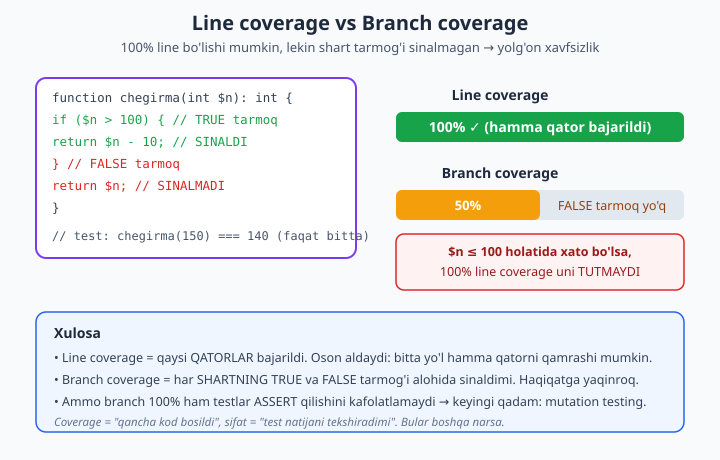
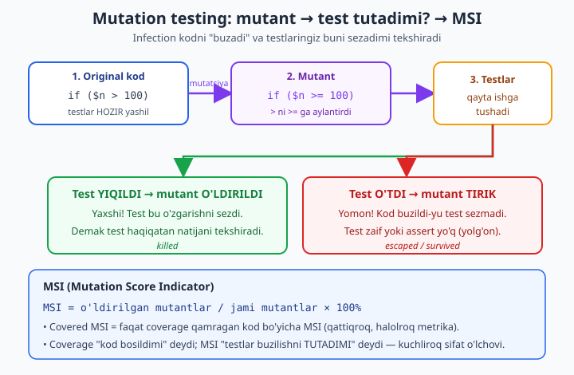

# 23 — Pest, integratsiya, coverage va mutation testing

[⬅️ Oldingi: 22 — PHPUnit chuqur va test doubles](./22-phpunit-chuqur.md) · [🏠 README](./README.md) · [Keyingi: 24 — Static analysis va avtomatik sifat ➡️](./24-static-analysis.md)

> **Bu bobda:** 22-bobda PHPUnit bilan **unit test** yozdik — bitta klassni izolyatsiyada, mock va stub bilan sinadik. Endi bir pog'ona ko'tarilamiz. Avval **Pest** ni ko'ramiz: bu PHPUnit **ustiga** qurilgan ifodali sintaksis (`it('...')` / `expect()->toBe()`), eski PHPUnit testlaringizga **mos keladi**, va `dataset` bilan bir testni ko'p kirish ustida yuritadi. So'ng **integratsiya testlari** — unit'dan farqi shu: real bog'liqliklar bilan ishlaydi. **SQLite `:memory:`** da haqiqiy baza testi yozamiz, har testdan keyin **rollback** qilib **izolyatsiya** ta'minlaymiz (transactional fixtures), **factory / Object Mother** bilan test ma'lumotini tug'amiz, va [./15 mini-framework](./15-mini-framework.md) uslubidagi HTTP handler'ni `ServerRequest` bilan sinaymiz. Keyin **coverage** — `line` vs `branch` coverage, va **nega 100% line coverage YOLG'ON xavfsizlik**. DIQQAT: bu mashinada Xdebug/pcov **yo'q**, shu sabab coverage'ni **run qilib bo'lmaydi** — konfig va **kutilgan chiqishni** ko'rsataman va halol belgilayman. Nihoyat **mutation testing (Infection)** — nega coverage **yetarli emas** (test bor-u, hech narsa tekshirmasligi mumkin), MSI / covered-MSI metrikasi va `infection.json5` konfig (bu ham coverage driver talab qiladi — **illustrativ**). Yakunda **TDD red-green-refactor** kata. Pest/PHPUnit testlar va sqlite baza testlari **chindan** ishga tushirildi; coverage va Infection — illustrativ va halol belgilangan.

---

## Nega bu bob? 22-bobdan keyingi qadam

22-bobda biz **bitta klassni** mock/stub bilan izolyatsiyada sinadik. Bu kuchli, lekin kamchiligi bor: agar PDO ni mock qilsangiz, **haqiqiy SQL** hech qachon ishlamaydi — siz faqat "men kutgan metod chaqirildimi" ni tekshirasiz, "SQL aslida to'g'rimi" ni emas. Real loyihada ikkala xil test ham kerak:

| Test turi | Nimani sinadi | Tezlik | Bog'liqliklar |
|---|---|---|---|
| **Unit** | bitta klass mantiqi (izolyatsiya) | juda tez | mock/stub bilan o'rnini bosadi |
| **Integratsiya** | bir nechta qatlam **birga** (real baza, real handler) | sekinroq | haqiqiy (sqlite, fayl tizimi) |

Bu bobda uchta yangi qatlamni qo'shamiz:

1. **Pest** — testni o'qishli va ifodali yozish (PHPUnit ustida, mos).
2. **Integratsiya** — real sqlite baza va real HTTP handler bilan.
3. **Sifat o'lchovi** — coverage (qancha kod sinaldi) va mutation (test haqiqatan tekshiradimi).

> **Ko'prik.** Test doubles, `assert*` va `@dataProvider` mexanikasi [./22 PHPUnit chuqur](./22-phpunit-chuqur.md) da; sinaladigan HTTP handler arxitekturasi [./15 mini-framework](./15-mini-framework.md) da; CI da bu testlarni avtomatik yuritish (lint → phpstan → test sifat-darvozasi) keyingi [./24 static analysis](./24-static-analysis.md) bobida va GitHub Actions **mexanikasi** foydalanuvchining Git kitobida — [../git-github/README.md](../git-github/README.md).

---

## Pest: PHPUnit ustidagi ifodali til

Pest — alohida "raqib" framework emas. U **PHPUnit ustiga** qurilgan yupqa qatlam: ostida o'sha PHPUnit ishlaydi, lekin sintaksis closure-asosli va o'qishli. Bu muhim, chunki:

- Eski PHPUnit `TestCase` klasslaringiz **o'zgarmasdan** ishlayveradi (Pest ularni tan oladi).
- PHPUnit ekotizimidagi hamma narsa (filter, testsuite, hatto coverage konfiguratsiyasi) ishlaydi.
- Yangi kodni Pest sintaksisida, eskini PHPUnit'da — **aralash** yozsangiz ham bo'ladi.

O'rnatish va loyiha skeleti:

```bash
composer require pestphp/pest --dev --with-all-dependencies
./vendor/bin/pest --init
```

`composer.json` da Pest plagini uchun ruxsat kerak (aks holda o'rnatishda to'xtaydi):

```json
{
    "config": {
        "allow-plugins": {
            "pestphp/pest-plugin": true
        }
    }
}
```

### Birinchi test: `it()` va `expect()`

PHPUnit'da test bir metod (`public function testApplyDiscount()`). Pest'da test bir **closure**:

```php
<?php
declare(strict_types=1);

use App\Discount;

it('100 tiyinga 10% chegirma 90 qaytaradi', function () {
    expect(Discount::apply(100, 10))->toBe(90);
});

it('0% chegirmada narx ozgarmaydi', function () {
    expect(Discount::apply(250, 0))->toBe(250);
});

it('notogri foizda istisno otadi', function () {
    expect(fn () => Discount::apply(100, 150))
        ->toThrow(InvalidArgumentException::class);
});
```

Sinaladigan klass — oddiy, lekin ikkita shart-tarmoqli (keyin coverage'da muhim bo'ladi):

```php
<?php
declare(strict_types=1);

namespace App;

final class Discount
{
    // narx (tiyin), foiz (0..100) -> chegirilgan narx (tiyin)
    public static function apply(int $price, int $percent): int
    {
        if ($percent < 0 || $percent > 100) {
            throw new \InvalidArgumentException('percent 0..100 oraligida bolishi kerak');
        }
        return (int) round($price - ($price * $percent / 100));
    }
}
```

Diqqat qiling:

- `it('...')` — test nomi inson tili (o'qiganda jumla bo'ladi: "it 100 tiyinga 10% chegirma 90 qaytaradi"). `test('...')` ham bor — sinonim.
- `expect($actual)->toBe($expected)` — **strict** (`===`) tenglik. PHPUnit'dagi `assertSame` ga teng. `toEqual` esa `==` (loose) — pul/ID bilan ishlaganda deyarli doim `toBe` kerak.
- `toThrow(...)` — closure ichidagi kod istisno otishini kutadi (PHPUnit'dagi `expectException`).

### `expect()` zanjiri va `and`

`expect()` API'sining kuchi — **fluent zanjir**. Bir obyektni bir necha tomonidan tekshirish:

```php
<?php
declare(strict_types=1);

it('foydalanuvchini yaratib email boyicha topadi', function () {
    $repo = new App\UserRepository(makePdo());

    $id = $repo->create('oqil@example.com', 'Oqil');

    expect($id)->toBeGreaterThan(0);
    $found = $repo->findByEmail('oqil@example.com');
    expect($found)->not->toBeNull()
        ->and($found['name'])->toBe('Oqil');   // and -> yangi qiymatga o'tadi
});
```

`->not->` — keyingi matcher'ni inkor qiladi (`not->toBeNull()` = "null bo'lmasin"). `->and(...)` — zanjirni yangi qiymatga ulaydi, shunda bir testda ko'p tasdiq qilish o'qishli bo'ladi.

Tez-tez ishlatiladigan matcherlar:

| Matcher | Ma'nosi | PHPUnit ekvivalenti |
|---|---|---|
| `toBe($v)` | `===` | `assertSame` |
| `toEqual($v)` | `==` | `assertEquals` |
| `toBeTrue()` / `toBeFalse()` | aniq `true`/`false` | `assertTrue` |
| `toBeNull()` | `=== null` | `assertNull` |
| `toBeGreaterThan($v)` | `>` | `assertGreaterThan` |
| `toContain($v)` | massiv/string ichida bor | `assertContains` |
| `toHaveCount($n)` | element soni | `assertCount` |
| `toThrow(Cls::class)` | istisno otadi | `expectException` |

### Datasets: bir test, ko'p kirish

22-bobdagi `@dataProvider` ning Pest ekvivalenti — `->with(...)`. Bir mantiqni o'nlab kirish/chiqish juftligida sinaydi, **kodni takrorlamasdan**:

```php
<?php
declare(strict_types=1);

use App\Discount;

it('turli chegirmalarni togri hisoblaydi', function (int $price, int $pct, int $expected) {
    expect(Discount::apply($price, $pct))->toBe($expected);
})->with([
    'chorak'  => [200, 25, 150],
    'yarim'   => [200, 50, 100],
    'uchdan'  => [300, 33, 201],
    'toliq'   => [200, 100, 0],
]);
```

Har juft **alohida test** sifatida hisoblanadi — biri yiqilsa, qaysi datasetda yiqilgani aniq ko'rinadi (`with dataset "uchdan"`). Kalitlar (`'chorak'`, `'yarim'`) chiqishda o'qishni osonlashtiradi. Bu — yagona mantiqni ko'p chegaraviy holatda sinashning eng zich usuli.

### Qachon Pest, qachon PHPUnit?

| Vaziyat | Tanlov | Sabab |
|---|---|---|
| Yangi loyiha, jamoa Pest'ni biladi | **Pest** | o'qishli, kam boilerplate |
| Katta eski PHPUnit kod bazasi | **PHPUnit** (yoki aralash) | migratsiya shart emas — Pest ham ko'taradi |
| Murakkab `setUp`/meros ierarxiyasi | **PHPUnit** klasslar | OOP test bazasi tabiiyroq |
| Tez prototip, ko'p kichik test | **Pest** | closure'lar yengil |
| Kutubxona yozyapsiz (foydalanuvchi PHPUnit kutadi) | **PHPUnit** | ekotizim kutilmasi |

Eng muhim xulosa: bu **"yo u, yo bu"** emas. Pest ostida PHPUnit ishlaganligi sabab, tanlov sintaksis ta'mi haqida — sifat printsiplari (izolyatsiya, bitta sabab, ma'noli assert) ikkalasida bir xil.

---

## Integratsiya testlari: real bog'liqlik bilan

Unit testda biz PDO ni mock qilamiz. Lekin shunda **SQL hech qachon ishlamaydi** — `SELECT * FROM uzers` (xato jadval nomi) ham mock'da "o'tib ketadi", chunki mock haqiqiy bazaga bormaydi. Integratsiya testi aynan shu bo'shliqni yopadi: u **haqiqiy** baza bilan ishlaydi.

Savol: qaysi baza? Production MySQL? Yo'q — sekin, tashqi, "iflos" (boshqa testlardan qolgan ma'lumot). Yechim — **SQLite `:memory:`**: RAM ichida, har test boshida toza, disk yozmaydi, juda tez. PHP da bu `pdo_sqlite` kengaytmasi bilan keladi (bizning mashinada bor).

### Transactional fixtures: izolyatsiya kaliti

Eng nozik muammo — **izolyatsiya**. Agar A testi `users` ga qator qo'shsa, B testi shu qatorni "ko'rishi" mumkin va natija beqaror bo'ladi (testlar tartibiga bog'lanib qoladi — bu sinov dahshatlari). Yechim klassikasi: **har testdan oldin tranzaksiya och, testdan keyin rollback qil**. Rollback testda yozilgan hamma narsani bekor qiladi — baza yana toza.

`tests/Pest.php` (Pest avtomatik yuklaydigan global konfig) da buni bir joyda o'rnatamiz:

```php
<?php
declare(strict_types=1);

// Sxemani bir marta yaratib, har testdan oldin TRANZAKSIYA ochamiz,
// testdan keyin rollback -> har test toza bazada ishlaydi (izolyatsiya).
function makePdo(): \PDO
{
    static $pdo = null;
    if ($pdo === null) {
        $pdo = new \PDO('sqlite::memory:');
        $pdo->setAttribute(\PDO::ATTR_ERRMODE, \PDO::ERRMODE_EXCEPTION);
        $pdo->exec('CREATE TABLE users (
            id INTEGER PRIMARY KEY AUTOINCREMENT,
            email TEXT UNIQUE NOT NULL,
            name TEXT NOT NULL
        )');
    }
    return $pdo;
}

pest()->beforeEach(fn () => makePdo()->beginTransaction());
pest()->afterEach(fn () => makePdo()->rollBack());
```

Bu yerda nozik nuqtalar:

- `static $pdo` — **bitta** ulanish butun sinov yugurishi davomida. Bu `:memory:` uchun shart: har `new PDO('sqlite::memory:')` **yangi bo'sh** baza yaratadi, shu sabab sxemani bir marta yaratib, o'sha ulanishni qayta ishlatamiz.
- `beforeEach` → `beginTransaction`, `afterEach` → `rollBack` — har test "qavs ichida" ishlaydi va chiqishda izi qolmaydi.
- `ERRMODE_EXCEPTION` — SQL xatosi jim qolmasin, istisno otsin (22-bob va boshlovchi kitobdagi PDO qoidasi).

### Sinaladigan repository

```php
<?php
declare(strict_types=1);

namespace App;

final class UserRepository
{
    public function __construct(private \PDO $pdo) {}

    public function create(string $email, string $name): int
    {
        $st = $this->pdo->prepare(
            'INSERT INTO users (email, name) VALUES (:email, :name)'
        );
        $st->execute(['email' => $email, 'name' => $name]);
        return (int) $this->pdo->lastInsertId();
    }

    public function findByEmail(string $email): ?array
    {
        $st = $this->pdo->prepare('SELECT * FROM users WHERE email = :email');
        $st->execute(['email' => $email]);
        $row = $st->fetch(\PDO::FETCH_ASSOC);
        return $row === false ? null : $row;
    }

    public function count(): int
    {
        return (int) $this->pdo->query('SELECT COUNT(*) FROM users')->fetchColumn();
    }
}
```

### Izolyatsiyani isbotlovchi test

```php
<?php
declare(strict_types=1);

use App\UserRepository;

it('foydalanuvchini yaratib email boyicha topadi', function () {
    $repo = new UserRepository(makePdo());

    $id = $repo->create('oqil@example.com', 'Oqil');

    expect($id)->toBeGreaterThan(0);
    $found = $repo->findByEmail('oqil@example.com');
    expect($found)->not->toBeNull()
        ->and($found['name'])->toBe('Oqil');
});

it('topilmagan emailga null qaytaradi', function () {
    $repo = new UserRepository(makePdo());
    expect($repo->findByEmail('yoq@example.com'))->toBeNull();
});

// IZOLYATSIYA isboti: oldingi testdagi yozuv bu testga oqib otmaydi
// (afterEach rollback qildi) -> baza yana bo'sh.
it('har test toza bazada boshlanadi (izolyatsiya)', function () {
    $repo = new UserRepository(makePdo());
    expect($repo->count())->toBe(0);

    $repo->create('a@b.c', 'A');
    expect($repo->count())->toBe(1);
});
```

Uchinchi test eng o'rgatuvchi: u `count()` **0** kutadi. Birinchi test bir foydalanuvchi qo'shgan edi — agar izolyatsiya bo'lmaganida `count()` 1 bo'lar edi va test yiqilardi. Rollback tufayli har test **toza varaqdan** boshlanadi.

### Factory / Object Mother: test ma'lumotini tug'ish

Yuqorida har testda `create('oqil@example.com', 'Oqil')` deb qo'lda yozdik. 50 ta testda bu zerikarli va mo'rt bo'ladi — agar `users` ga yangi **majburiy** ustun qo'shilsa, 50 joyni tuzatasiz. Yechim — **factory** (yoki nomi: **Object Mother**): test ma'lumotini bir joyda, ma'noli nomlangan funksiyada tug'ish.

```php
<?php
declare(strict_types=1);

// Object Mother: "tipik" foydalanuvchi yaratadi; faqat farq qiladigan
// maydonni override qilasiz. Test "shovqin"siz, mohiyatga e'tibor.
function makeUser(UserRepository $repo, array $overrides = []): int
{
    $data = array_merge([
        'email' => 'user' . bin2hex(random_bytes(3)) . '@example.com',
        'name'  => 'Test User',
    ], $overrides);

    return $repo->create($data['email'], $data['name']);
}

it('factory bilan toza test', function () {
    $repo = new UserRepository(makePdo());

    // Faqat AHAMIYATLI maydonni ko'rsatamiz; qolganini factory to'ldiradi.
    makeUser($repo, ['name' => 'Aziza']);

    expect($repo->count())->toBe(1);
});
```

Foydasi: test faqat **o'ziga muhim** maydonni ko'rsatadi (`name => 'Aziza'`), qolganini factory aqlli sukut bilan to'ldiradi. `bin2hex(random_bytes(3))` — unikal email (UNIQUE cheklov buzilmasin). Laravel ishlatganlar buni "model factory", Symfony'da "Foundry" deb tanishadi — g'oya bir xil.

### HTTP handler integratsiya testi (./15 ko'prik)

Endi eng qiziq qism — [./15 mini-framework](./15-mini-framework.md) uslubidagi **HTTP handler**ni sinaymiz. U `ServerRequest` qabul qilib `Response` qaytaradi. Integratsiya testi handler'ni **real repository va real sqlite baza** bilan birga sinaydi — ya'ni "so'rov kirsa, baza so'raladi, to'g'ri status qaytadimi".

Soddalashtirilgan PSR-7-simon obyektlar (./15 da to'liq versiyasi bor):

```php
<?php
declare(strict_types=1);

namespace App;

final class ServerRequest
{
    public function __construct(
        public readonly string $method,
        public readonly string $path,
        public readonly array $query = [],
        public readonly string $body = '',
    ) {}
}
```

```php
<?php
declare(strict_types=1);

namespace App;

final class Response
{
    public function __construct(
        public readonly int $status,
        public readonly string $body,
        public readonly array $headers = ['Content-Type' => 'application/json'],
    ) {}
}
```

Handler — emailga ko'ra foydalanuvchini topadi va status semantikasini hurmat qiladi (400/404/200):

```php
<?php
declare(strict_types=1);

namespace App;

final class ShowUserHandler implements RequestHandlerInterface
{
    public function __construct(private UserRepository $users) {}

    public function handle(ServerRequest $request): Response
    {
        $email = $request->query['email'] ?? '';
        if ($email === '') {
            return new Response(400, json_encode(['error' => 'email talab qilinadi']));
        }
        $user = $this->users->findByEmail($email);
        if ($user === null) {
            return new Response(404, json_encode(['error' => 'topilmadi']));
        }
        return new Response(200, json_encode(['id' => (int) $user['id'], 'name' => $user['name']]));
    }
}
```

Test — `ServerRequest` yasab handler'ga beradi, `Response` ni tekshiradi:

```php
<?php
declare(strict_types=1);

use App\ServerRequest;
use App\ShowUserHandler;
use App\UserRepository;

function makeHandler(): ShowUserHandler
{
    return new ShowUserHandler(new UserRepository(makePdo()));
}

it('mavjud foydalanuvchiga 200 va JSON qaytaradi', function () {
    (new UserRepository(makePdo()))->create('lola@example.com', 'Lola');

    $req = new ServerRequest('GET', '/users', query: ['email' => 'lola@example.com']);
    $res = makeHandler()->handle($req);

    expect($res->status)->toBe(200);
    expect(json_decode($res->body, true)['name'])->toBe('Lola');
});

it('email berilmasa 400 qaytaradi', function () {
    $req = new ServerRequest('GET', '/users', query: []);
    expect(makeHandler()->handle($req)->status)->toBe(400);
});

it('mavjud bolmagan foydalanuvchiga 404 qaytaradi', function () {
    $req = new ServerRequest('GET', '/users', query: ['email' => 'yoq@example.com']);
    expect(makeHandler()->handle($req)->status)->toBe(404);
});
```

Bu **mock'siz** ishlaydi — haqiqiy handler, haqiqiy repository, haqiqiy SQL. Agar `findByEmail` dagi SQL noto'g'ri yozilsa, bu test (mock'li unit testdan farqli) **tutadi**. Mana butun to'plamning haqiqiy chiqishi (`./vendor/bin/pest`):

```
   PASS  Tests\Unit\DiscountTest
  ✓ it 100 tiyinga 10% chegirma 90 qaytaradi
  ✓ it 0% chegirmada narx ozgarmaydi
  ✓ it 100% chegirmada narx 0 boladi
  ✓ it notogri foizda istisno otadi
  ✓ it turli chegirmalarni togri hisoblaydi with dataset "chorak"
  ✓ it turli chegirmalarni togri hisoblaydi with dataset "yarim"
  ✓ it turli chegirmalarni togri hisoblaydi with dataset "uchdan"
  ✓ it turli chegirmalarni togri hisoblaydi with dataset "toliq"

   PASS  Tests\Unit\SlugTest
  ✓ it oddiy sarlavhani slugga aylantiradi
  ✓ it chetdagi va takror chiziqchalarni tozalaydi

   PASS  Tests\Feature\ShowUserHandlerTest
  ✓ it mavjud foydalanuvchiga 200 va JSON qaytaradi
  ✓ it email berilmasa 400 qaytaradi
  ✓ it mavjud bolmagan foydalanuvchiga 404 qaytaradi

   PASS  Tests\Feature\UserRepositoryTest
  ✓ it foydalanuvchini yaratib email boyicha topadi
  ✓ it topilmagan emailga null qaytaradi
  ✓ it har test toza bazada boshlanadi (izolyatsiya)

  Tests:    16 passed (20 assertions)
  Duration: 0.32s
```

> Bu chiqish bu mashinada **chindan** olindi — sqlite `:memory:` baza, transactional rollback va handler testi haqiqatan ishlaydi. Coverage va Infection bo'limlari esa quyida boshqacha — ularni halol belgilab o'taman.

---

## Coverage: qancha kod sinaldi?

Test yozdingiz. Lekin **kodingizning qancha qismi** umuman bir marta ham bajarildi? Buni "code coverage" o'lchaydi. PHP da uni `php-code-coverage` kutubxonasi hisoblaydi, lekin u ishlash uchun **driver** kerak: **Xdebug** yoki **pcov**. Bu kengaytmalar bajarilgan har bir qatorni "nishonlaydi".

> **HALOL OGOHLANTIRISH.** Bu kitob yozilgan mashinada **Xdebug ham, pcov ham o'rnatilmagan**. Shu sabab quyidagi coverage chiqishlarini bu yerda **chindan run qilib bo'lmadi** — ular **ko'rsatuv uchun** (real loyihada xuddi shunday ko'rinadi). O'z muhitingizda coverage olish uchun **Xdebug yoki pcov o'rnatilgan bo'lishi kerak**. Driver yo'qligida Pest aniq shu xabarni beradi (bu **chindan** olingan chiqish):
>
> ```
>  ERROR  No code coverage driver is available.
> ```

### Line coverage vs branch coverage

Ikki xil coverage bor va farqi hayotiy muhim:

- **Line coverage** — qaysi **qatorlar** bajarildi. Eng keng tarqalgan, lekin eng aldamchi.
- **Branch coverage** — har **shartning** (`if`, `match`, `&&`, `?:`) ham TRUE, ham FALSE tarmog'i alohida bajarildimi.

Mana nega bu farq YOLG'ON xavfsizlik tug'diradi:



Tasavvur qiling, shu funksiya bor:

```php
<?php
declare(strict_types=1);

function chegirma(int $n): int
{
    // Bitta qator: TRUE tarmoq ($n - 10) ham, FALSE tarmoq ($n) ham AYNAN shu qatorda
    return $n > 100 ? $n - 10 : $n;
}
```

Va sizda **bitta** test bor: `expect(chegirma(150))->toBe(140)`.

- **Line coverage = 100%** — `return $n > 100 ? $n - 10 : $n;` **bitta qator**. `chegirma(150)` shu qatorni bajaradi, demak "qator bosildi" — line coverage halol 100%. Ko'pchilik funksiyani bir marta chaqirsa, line foizi tez to'liq bo'ladi.
- **Branch coverage ≈ 50%** — bitta qator bo'lsa-da, ternary ichida **ikki tarmoq** bor: `$n > 100` ning **FALSE** tarmog'i (`$n <= 100`, ya'ni `: $n` qismi) **hech qachon sinalmagan**. Branch coverage aynan shu yashirin tarmoqni ko'radi, line coverage esa ko'rmaydi.

Demak agar `$n <= 100` holatida xato bo'lsa (masalan, manfiy qiymatni noto'g'ri qaytarsa), **100% line coverage uni tutmaydi**. Mana shu — "100% coverage = bexato kod" degan xayolning ildizi. Coverage faqat "kod **bosildimi**" deydi, "kod **to'g'rimi**" demaydi.

### Konfig: coverage'ni yoqish (`phpunit.xml`)

Coverage qaysi fayllarni o'lchashini `<source>` blokida ko'rsatasiz:

```xml
<?xml version="1.0" encoding="UTF-8"?>
<phpunit xmlns:xsi="http://www.w3.org/2001/XMLSchema-instance"
         xsi:noNamespaceSchemaLocation="vendor/phpunit/phpunit/phpunit.xsd"
         bootstrap="vendor/autoload.php"
         colors="true">
    <testsuites>
        <testsuite name="Unit">
            <directory>tests/Unit</directory>
        </testsuite>
        <testsuite name="Feature">
            <directory>tests/Feature</directory>
        </testsuite>
    </testsuites>

    <!-- Coverage faqat shu papkalarni o'lchaydi (test fayllarini emas) -->
    <source>
        <include>
            <directory>src</directory>
        </include>
    </source>
</phpunit>
```

Ishga tushirish (Xdebug yoki pcov **bor** muhitda):

```bash
# Matnli hisobot terminalga
XDEBUG_MODE=coverage ./vendor/bin/pest --coverage

# Minimal chegara: 80% dan past bo'lsa CI yiqilsin
XDEBUG_MODE=coverage ./vendor/bin/pest --coverage --min=80

# HTML hisobot (brauzerda ochiladigan, qator-qator bo'yalgan)
XDEBUG_MODE=coverage ./vendor/bin/pest --coverage-html=coverage/
```

### Kutilgan chiqish (illustrativ)

Driver bor muhitda `--coverage` taxminan shunday ko'rinadi (bu **ko'rsatuv uchun** — bizning mashinada driver yo'q):

```
  Tests:    16 passed (20 assertions)
  Duration: 0.34s

  ......................................................... 100%

  Cov:
  ............................................................

  App/Discount ............................................ 100.0%
  App/Slug ................................................ 100.0%
  App/UserRepository ...................................... 100.0%
  App/ShowUserHandler ..................................... 100.0%
  ────────────────────────────────────────────────────────────
  Total: 100.0%
```

`--min=80` bilan, agar umumiy coverage 80% dan past bo'lsa, jarayon **nol bo'lmagan kod** bilan tugaydi — CI uni "fail" deb belgilaydi. Shu tariqa coverage **sifat-darvozasi** bo'ladi. Lekin yodda tuting: **100% line** ham sizni FALSE tarmoqlardan himoya qilmaydi. Aynan shu yerda mutation testing kerak bo'ladi.

---

## Mutation testing: test haqiqatan tekshiradimi?

Coverage'ning eng katta yolg'oni shu: u testlaringiz **assert qilishini** umuman tekshirmaydi. Mana isboti — bu "test" coverage'ni oshiradi, lekin **hech narsani kafolatlamaydi**:

```php
<?php
declare(strict_types=1);

function isEven(int $n): bool { return $n % 2 === 0; }

// ❌ ZAIF "test": isEven(4) ni chaqiradi (coverage +1), lekin NATIJANI tekshirmaydi.
it('isEven ishlaydi', function () {
    isEven(4);     // ❌ assertion yo'q -> hech narsa kafolatlanmaydi
    expect(true)->toBeTrue();   // ❌ doim o'tadi, mantiqqa aloqasi yo'q
});
```

Bu test **100% coverage** beradi `isEven` uchun va **doim yashil**. Lekin agar kimdir `isEven` ni `return $n % 2 === 1;` ga buzsa ham, bu test **sezmaydi**. Coverage 100%, ishonch — nol.

**Mutation testing** aynan shu bo'shliqni o'lchaydi. G'oya ajoyib darajada sodda: vosita (**Infection**) kodingizga kichik o'zgartirish — **mutant** — kiritadi (`>` ni `>=` ga, `+` ni `-` ga, `return true` ni `return false` ga...), so'ng testlaringizni qayta yuritadi:

- Agar biror test **yiqilsa** → mutant **o'ldirildi** (killed). Yaxshi: testlaringiz bu o'zgarishni sezdi.
- Agar hamma test **o'taversa** → mutant **tirik qoldi** (survived/escaped). Yomon: kod buzildi-yu testlar sezmadi — demak test zaif yoki assert yetishmaydi.



### MSI va covered-MSI metrikasi

Infection ikkita asosiy son beradi:

- **MSI (Mutation Score Indicator)** = o'ldirilgan mutantlar / **jami** mutantlar × 100%. Umumiy "test sifati" bahosi.
- **Covered MSI** = o'ldirilgan mutantlar / **coverage qamragan** kod ustidagi mutantlar × 100%. Bu qattiqroq va halolroq: u "men sinagan kod qanchalik yaxshi sinalgan" ni o'lchaydi (umuman sinalmagan kodni jazo sifatida qo'shmaydi, balki sinalganini chuqur baholaydi).

90% MSI degani — mutantlarning 90% i o'ldirildi, ya'ni testlar kod o'zgarishlarining 90% ini sezadi. Bu coverage foizidan **ancha kuchli** ishonch o'lchovi.

### Infection konfig (`infection.json5`)

```json5
{
    "$schema": "vendor/infection/infection/resources/schema.json",
    "source": {
        "directories": ["src"]
    },
    "mutators": {
        "@default": true
    },
    "logs": {
        "text": "infection.log"
    },
    "minMsi": 80,
    "minCoveredMsi": 90
}
```

- `source.directories` — qaysi kodga mutant kiritiladi.
- `mutators: { "@default": true }` — Infection'ning standart mutator to'plami (arifmetik, taqqoslash, boolean, qaytarish qiymati...).
- `minMsi` / `minCoveredMsi` — bu chegaradan past bo'lsa Infection **fail** qaytaradi (CI darvozasi).

Ishga tushirish:

```bash
./vendor/bin/infection --threads=4 --min-msi=80 --min-covered-msi=90
```

> **HALOL OGOHLANTIRISH.** Infection **ham** coverage driver (Xdebug yoki pcov) talab qiladi — chunki u avval coverage hisoblab, qaysi mutantni qaysi test qamraganini biladi. Bu mashinada driver yo'qligi sabab Infection'ni **chindan yurita olmadim**. Quyidagi konfig va chiqish — **illustrativ** (real loyihada xuddi shunday). Driver yo'qligida Infection aynan shu xabarni beradi (bu xabar bu mashinada **chindan** olingan):
>
> ```
> Coverage needs to be generated but no code coverage generator
> (pcov, phpdbg or xdebug) has been detected. Please either:
>  - Enable pcov and run Infection again
>  - Use phpdbg, e.g. `phpdbg -qrr infection`
>  - Enable Xdebug ... and run Infection again
> ```

### Kutilgan chiqish (illustrativ)

Driver bor muhitda Infection taxminan shunday yakun beradi:

```
12 mutations were generated:
      11 mutants were killed
       0 mutants were configured to be ignored
       1 mutants were not covered by tests
       0 covered mutants were not detected
       0 errors were encountered
       0 syntax errors were encountered
       0 time outs were encountered

Metrics:
         Mutation Score Indicator (MSI): 91%
         Mutation Code Coverage: 92%
         Covered Code MSI: 100%
```

Bu o'qishni shunday talqin qiling: 12 mutantdan 11 tasi o'ldirildi (testlar tutdi), 1 tasi umuman coverage'da emas (sinalmagan kod). **Covered Code MSI 100%** — ya'ni *sinalgan* kodning testlari mukammal (har bir buzilishni tutadi); umumiy MSI 91% chunki bitta sinalmagan kod bor. Birinchi vazifa — o'sha "not covered" kodga test yozish; ikkinchisi — agar mutant tirik qolsa, uni o'ldiradigan assert qo'shish.

> **Eslatma — CI da coverage/mutation.** GitHub Actions runner'larida pcov yoki Xdebug bor (yoki bir qatorda yoqiladi), shu sabab CI da coverage va Infection **chindan ishlaydi** — faqat bu lokal mashinada driver yo'q. CI **mexanikasi** (workflow YAML, job, matritsa) foydalanuvchining Git kitobida chuqur yoritilgan: [../git-github/README.md](../git-github/README.md). Bu yerda esa faqat **PHP sifat-darvozasi mazmuni** muhim: `lint → phpstan → test (+ coverage --min) → infection (--min-msi)` ketma-ketligi. Static analysis qadami keyingi [./24](./24-static-analysis.md) bobida.

---

## TDD kata: red → green → refactor

Testni kod yozilgandan **keyin** yozish odatiy. Lekin TDD (Test-Driven Development) buni teskari qiladi: **avval test, keyin kod**. Tsikl uch qadamli:

1. **Red** — yiqiladigan test yoz (hali kod yo'q yoki yetarli emas).
2. **Green** — testni o'tkazadigan **eng oddiy** kodni yoz (chiroyli bo'lishi shart emas).
3. **Refactor** — testlar yashil turganida kodni tozala (xulq o'zgarmaydi).

Mana to'liq qisqa tsikl — FizzBuzz kata. Har bosqichni alohida ko'rsatamiz.

### 1-qadam: RED — birinchi yiqiladigan test

```php
<?php
declare(strict_types=1);

it('1 uchun "1" qaytaradi', function () {
    expect(fizzbuzz(1))->toBe('1');   // ❌ fizzbuzz() hali yo'q -> Error (red)
});
```

Bu **qasddan** yiqiladi — `fizzbuzz` funksiyasi mavjud emas. Red bosqichi shuni isbotlaydi: test haqiqatan biror narsani tekshiradi (yo'q narsada yiqiladi).

### 2-qadam: GREEN — eng oddiy kod

```php
<?php
declare(strict_types=1);

function fizzbuzz(int $n): string
{
    return (string) $n;   // eng oddiy: hozircha faqat sonni qaytaradi
}
```

Test endi yashil. Bu kod "to'liq" emas, lekin **ayni shu test** uchun yetarli. TDD da siz testdan oldinga ketmaysiz.

### 3-qadam: yangi RED → GREEN → ... va REFACTOR

Yangi test qo'shamiz (3 → "Fizz"), u yiqiladi (red), kodni kengaytiramiz (green), takrorlaymiz. Bir necha tsikldan keyin kod va testlar to'liq bo'ladi. Yakuniy, **refactor qilingan** ko'rinish — `match (true)` bilan toza:

```php
<?php
declare(strict_types=1);

function fizzbuzz(int $n): string
{
    return match (true) {
        $n % 15 === 0 => 'FizzBuzz',   // 15 ni BIRINCHI tekshirish kerak!
        $n % 3 === 0  => 'Fizz',
        $n % 5 === 0  => 'Buzz',
        default       => (string) $n,
    };
}
```

To'liq test to'plami (har qadamda qo'shilgan):

```php
<?php
declare(strict_types=1);

it('togri fizzbuzz qaytaradi', function (int $n, string $expected) {
    expect(fizzbuzz($n))->toBe($expected);
})->with([
    [1,  '1'],
    [3,  'Fizz'],
    [5,  'Buzz'],
    [15, 'FizzBuzz'],
    [30, 'FizzBuzz'],
]);
```

`15` ni birinchi tekshirish — TDD ning sovg'asi: agar `% 3` ni avval qo'ysangiz, 15 uchun "Fizz" qaytaradi va test **darrov yiqiladi** (red), shu zahoti xatoni topasiz. Test-avval yondashuv mana shunday tez fikr-aloqa (feedback) beradi.

`assert()` bilan mini-tekshiruv (bu mashinada **chindan** ishlaydi, `php -d zend.assertions=1`):

```php
<?php
declare(strict_types=1);

assert(fizzbuzz(1) === '1');
assert(fizzbuzz(3) === 'Fizz');
assert(fizzbuzz(5) === 'Buzz');
assert(fizzbuzz(15) === 'FizzBuzz');
assert(fizzbuzz(30) === 'FizzBuzz');
echo "Kata OK\n";
```

Chiqish:

```
Kata OK
```

TDD ning eng katta foydasi — **mutation-chidamli** testlar tabiiy paydo bo'ladi: siz har testni "kod hali yo'q" holatida yiqilishini ko'rasiz, shu sabab har test haqiqatan biror narsani **assert qiladi** (bo'sh test yozib bo'lmaydi — u green bosqichida ortiqcha bo'lib chiqadi).

---

## Yaxlitlash: sifat piramidasini qanday o'qish kerak

Bu bobning to'rt qatlami birga **sifat darajasini** tashkil qiladi — pastdan yuqoriga ishonch ortadi:

1. **Test bor** (Pest/PHPUnit) — eng asosiy. Yo'q bo'lsa, hech narsa kafolatlanmaydi.
2. **Test ko'p kodni qamragan** (coverage) — "qancha kod bosildi". Foydali, lekin aldamchi (line vs branch).
3. **Test haqiqatan tekshiradi** (mutation/MSI) — "test buzilishni tutadimi". Kuchli, lekin sekin va driver kerak.
4. **Test avval yozilgan** (TDD) — sifat dizaynga kiritilgan, keyin yamoq emas.

Amaliy maslahat: har kuni **1 va 2** ni CI da yuriting (tez); **3** ni (Infection) haftada bir yoki release oldidan, og'irligi sabab. Va eng muhimi — **coverage foizini maqsad qilmang**. 100% coverage'ga intilib bo'sh test yozish — eng yomon natija. Maqsad: kod o'zgarsa **sezadigan** testlar. Buni faqat mutation testing yoki diqqatli TDD beradi.

Keyingi [./24 — Static analysis va avtomatik sifat](./24-static-analysis.md) bobida sifat darvozasini yana mustahkamlaymiz: PHPStan/Psalm kodni **ishga tushirmasdan** tahlil qiladi (tip xatolari, o'lik kod, mumkin bo'lmagan shartlar), Rector avtomatik yangilaydi, PHP-CS-Fixer stilni bir xil qiladi — va bularning hammasi `lint → phpstan → test` darvozasiga ulanadi.

---

## Mashqlar

### Oson

1. **`expect` zanjiri.** `['ism' => 'Oqil', 'yosh' => 30]` massivi uchun bitta Pest testida shularni tekshiring: massiv `null` emas, `ism` kaliti `'Oqil'` ga teng, va `yosh` 18 dan katta. `->and(...)` zanjiridan foydalaning.
2. **Dataset.** `abs()` ga o'xshash `mutlaq(int $n): int` funksiya yozing va uni `->with([...])` dataset bilan kamida 4 holatda (manfiy, musbat, nol, katta manfiy) sinang.
3. **Coverage farqi.** Quyidagi funksiya uchun **bitta** test yozsangiz, line coverage 100% bo'ladimi, branch coverage-chi? Tushuntiring: `function belgi(int $n): string { return $n >= 0 ? 'musbat' : 'manfiy'; }` va test `belgi(5) === 'musbat'`.

### O'rta

4. **Transactional izolyatsiya.** SQLite `:memory:` da `products(id, title)` jadval yarating. `beforeEach`/`afterEach` bilan tranzaksiya och/rollback qiling. Ikki test yozing: birinchisi 2 mahsulot qo'shadi, ikkinchisi `count() === 0` ekanini tekshiradi (izolyatsiya isboti).
5. **Object Mother.** 4-mashq uchun `makeProduct(PDO $pdo, array $overrides = []): int` factory yozing: standart `title` bilan, lekin `$overrides['title']` berilsa uni ishlatsin. Test'da faqat `title` ni override qiling.
6. **Tirik mutant tutish.** `function isPositive(int $n): bool { return $n > 0; }` uchun **zaif** test yozing (faqat `isPositive(5)` ni tekshiradigan), so'ng tushuntiring: Infection `>` ni `>=` ga aylantirsa, bu test mutantni tutadimi? Tutmasa, qaysi qo'shimcha assert mutantni o'ldiradi?

### Qiyin

7. **HTTP handler 422 holati.** `ShowUserHandler` ga o'xshash `CreateUserHandler` yozing: `ServerRequest` body'da JSON (`{"email":"...","name":"..."}`) keladi. Agar email bo'sh yoki `@` yo'q bo'lsa **422** (validatsiya xatosi), aks holda foydalanuvchini yaratib **201** qaytarsin. Real sqlite bilan integratsiya testi yozing (201, 422 holatlari).
8. **TDD kata: rim raqami.** TDD bilan `rim(int $n): string` funksiyasini yozing (1→"I", 4→"IV", 9→"IX", 58→"LVIII"). Har bosqichni red→green tartibida tasvirlang: avval `rim(1)` testi, keyin `rim(4)`, va hokazo. Dataset bilan yakuniy test bering.
9. **MSI tahlili.** Quyidagi funksiya va uning yagona testi berilgan. Infection 4 ta mutant kiritadi (deylik: `>=`→`>`, `>=`→`<`, `true`→`false`, `+`→`-`). Har biri uchun: bu mutant tirik qoladimi yoki o'ladimi? `function balogat(int $yosh): bool { return $yosh >= 18; }`, test: `expect(balogat(20))->toBeTrue()`.

---

<details markdown="1"><summary>Yechim — Oson 1</summary>

```php
<?php
declare(strict_types=1);

it('odam massivini tekshiradi', function () {
    $odam = ['ism' => 'Oqil', 'yosh' => 30];

    expect($odam)->not->toBeNull()
        ->and($odam['ism'])->toBe('Oqil')
        ->and($odam['yosh'])->toBeGreaterThan(18);
});
```

`->and(...)` har safar zanjirni yangi qiymatga ulaydi — bitta testda uch xil tasdiq o'qishli ketadi. `not->toBeNull()` — inkor matcher.

</details>

<details markdown="1"><summary>Yechim — Oson 2</summary>

```php
<?php
declare(strict_types=1);

function mutlaq(int $n): int
{
    return $n < 0 ? -$n : $n;
}

it('mutlaq qiymatni togri qaytaradi', function (int $n, int $expected) {
    expect(mutlaq($n))->toBe($expected);
})->with([
    'musbat'       => [5, 5],
    'manfiy'       => [-7, 7],
    'nol'          => [0, 0],
    'katta manfiy' => [-1000, 1000],
]);
```

Dataset `< 0` shartining ikkala tarmog'ini ham (`-7`, `-1000` → TRUE; `5`, `0` → FALSE) qamraydi — shu sabab branch coverage ham to'liq bo'ladi.

</details>

<details markdown="1"><summary>Yechim — O'rta 1 (3-mashq tushuntirishi)</summary>

`belgi(5)` faqat `$n >= 0` shartining **TRUE** tarmog'ini bajaradi:

- **Line coverage = 100%** — `return ... ? ... : ...` bitta qator, u bajariladi, demak "qator bosildi".
- **Branch coverage = 50%** — ternary'ning **FALSE** tarmog'i (`'manfiy'`) hech qachon hisoblanmadi. `belgi(-1)` ni qo'shsangizgina branch 100% bo'ladi.

Bu aynan "100% line — yolg'on xavfsizlik" misoli: agar manfiy holatda xato bo'lsa, bu test uni tutmaydi. Yechim — ikkinchi test yoki dataset bilan `belgi(-3) === 'manfiy'` qo'shish.

</details>

<details markdown="1"><summary>Yechim — O'rta 2 (transactional izolyatsiya)</summary>

`tests/Pest.php`:

```php
<?php
declare(strict_types=1);

function productsPdo(): \PDO
{
    static $pdo = null;
    if ($pdo === null) {
        $pdo = new \PDO('sqlite::memory:');
        $pdo->setAttribute(\PDO::ATTR_ERRMODE, \PDO::ERRMODE_EXCEPTION);
        $pdo->exec('CREATE TABLE products (
            id INTEGER PRIMARY KEY AUTOINCREMENT,
            title TEXT NOT NULL
        )');
    }
    return $pdo;
}

pest()->beforeEach(fn () => productsPdo()->beginTransaction());
pest()->afterEach(fn () => productsPdo()->rollBack());
```

Test:

```php
<?php
declare(strict_types=1);

it('ikki mahsulot qoshadi', function () {
    $pdo = productsPdo();
    $pdo->exec("INSERT INTO products (title) VALUES ('A'), ('B')");
    expect((int) $pdo->query('SELECT COUNT(*) FROM products')->fetchColumn())->toBe(2);
});

it('keyingi test toza bazada boshlanadi', function () {
    $pdo = productsPdo();
    // oldingi testdagi 2 yozuv rollback qilindi -> baza bo'sh
    expect((int) $pdo->query('SELECT COUNT(*) FROM products')->fetchColumn())->toBe(0);
});
```

Ikkinchi test `0` kutadi — bu rollback ishlayotganining isboti. `static $pdo` bir ulanishni saqlaydi, chunki har `new PDO('sqlite::memory:')` yangi bo'sh baza ochar edi.

</details>

<details markdown="1"><summary>Yechim — O'rta 3 (zaif test va tirik mutant)</summary>

Zaif test:

```php
<?php
declare(strict_types=1);

function isPositive(int $n): bool { return $n > 0; }

it('zaif test', function () {
    expect(isPositive(5))->toBeTrue();   // faqat TRUE tarmoq, faqat n=5
});
```

Infection `>` ni `>=` ga aylantiradi: `return $n >= 0;`. `isPositive(5)` baribir `true` qaytaradi — test **o'tadi** → mutant **tirik qoladi**. Test farqni sezmaydi, chunki u `0` chegarasini hech qachon sinamaydi.

Mutantni o'ldiradigan qo'shimcha assert — aynan **chegara** holati:

```php
it('kuchli test: chegarani sinaydi', function () {
    expect(isPositive(5))->toBeTrue()
        ->and(isPositive(0))->toBeFalse()   // <-- 0 da farq ochiladi
        ->and(isPositive(-3))->toBeFalse();
});
```

Endi `>=` mutanti `isPositive(0)` ni `true` qiladi, lekin test `false` kutadi → test **yiqiladi** → mutant **o'ldiriladi**. Chegara qiymatlarini sinash — mutation-chidamli testning kaliti.

</details>

<details markdown="1"><summary>Yechim — Qiyin 7 (CreateUserHandler 201/422)</summary>

Handler:

```php
<?php
declare(strict_types=1);

namespace App;

final class CreateUserHandler implements RequestHandlerInterface
{
    public function __construct(private UserRepository $users) {}

    public function handle(ServerRequest $request): Response
    {
        $data = json_decode($request->body, true) ?? [];
        $email = (string) ($data['email'] ?? '');
        $name  = (string) ($data['name'] ?? '');

        if ($email === '' || !str_contains($email, '@')) {
            return new Response(422, json_encode(['error' => 'email notogri']));
        }
        $id = $this->users->create($email, $name);
        return new Response(201, json_encode(['id' => $id]));
    }
}
```

Test:

```php
<?php
declare(strict_types=1);

use App\CreateUserHandler;
use App\ServerRequest;
use App\UserRepository;

function makeCreateHandler(): CreateUserHandler
{
    return new CreateUserHandler(new UserRepository(makePdo()));
}

it('togri malumotda 201 qaytaradi', function () {
    $req = new ServerRequest('POST', '/users',
        body: json_encode(['email' => 'yangi@example.com', 'name' => 'Yangi']));
    $res = makeCreateHandler()->handle($req);

    expect($res->status)->toBe(201);
    expect(json_decode($res->body, true)['id'])->toBeGreaterThan(0);
});

it('notogri emailda 422 qaytaradi', function () {
    $req = new ServerRequest('POST', '/users',
        body: json_encode(['email' => 'yomon', 'name' => 'X']));
    expect(makeCreateHandler()->handle($req)->status)->toBe(422);
});

it('bosh emailda 422 qaytaradi', function () {
    $req = new ServerRequest('POST', '/users',
        body: json_encode(['name' => 'X']));
    expect(makeCreateHandler()->handle($req)->status)->toBe(422);
});
```

Bu real sqlite bilan ishlaydi: 201 holatda haqiqatan qator yoziladi (rollback uni tozalaydi), 422 holatda esa baza umuman tegilmaydi.

</details>

<details markdown="1"><summary>Yechim — Qiyin 8 (TDD rim raqami)</summary>

**RED 1** — `rim(1)` testi (funksiya yo'q → Error). **GREEN 1** — `function rim(int $n): string { return 'I'; }`. **RED 2** — `rim(4) === 'IV'` qo'shamiz, yiqiladi. **GREEN 2** va keyin **refactor** — kamaytiruvchi (subtractive) algoritm:

```php
<?php
declare(strict_types=1);

function rim(int $n): string
{
    $jadval = [
        1000 => 'M', 900 => 'CM', 500 => 'D', 400 => 'CD',
        100  => 'C', 90  => 'XC', 50  => 'L',  40  => 'XL',
        10   => 'X', 9   => 'IX', 5   => 'V',  4   => 'IV', 1 => 'I',
    ];
    $natija = '';
    foreach ($jadval as $qiymat => $belgi) {
        while ($n >= $qiymat) {
            $natija .= $belgi;
            $n -= $qiymat;
        }
    }
    return $natija;
}
```

Yakuniy test:

```php
<?php
declare(strict_types=1);

it('rim raqamini togri qaytaradi', function (int $n, string $expected) {
    expect(rim($n))->toBe($expected);
})->with([
    [1, 'I'], [4, 'IV'], [9, 'IX'], [40, 'XL'],
    [58, 'LVIII'], [1994, 'MCMXCIV'],
]);
```

TDD bu yerda yordam berdi: har yangi test (4 → IV, 9 → IX) avval yiqilib, algoritmni qadam-baqadam to'g'ri yo'naltirdi. `MCMXCIV` (1994) — eng murakkab holat, oxirgi qadam sifatida qo'shiladi.

</details>

<details markdown="1"><summary>Yechim — Qiyin 9 (MSI tahlili)</summary>

`function balogat(int $yosh): bool { return $yosh >= 18; }`, yagona test: `expect(balogat(20))->toBeTrue()`.

| Mutant | Buzilgan kod | `balogat(20)` natijasi | Test (true kutadi) | Holat |
|---|---|---|---|---|
| `>=` → `>` | `$yosh > 18` | `20 > 18` = `true` | o'tadi | **TIRIK** (sezilmadi) |
| `>=` → `<` | `$yosh < 18` | `20 < 18` = `false` | yiqiladi | **O'LDIRILDI** |
| `true` → `false` | (return qiymati) | `false` | yiqiladi | **O'LDIRILDI** |
| `+`/`-` | bu kodda yo'q | — | — | qo'llanmaydi |

Demak 3 ta amal qiluvchi mutantdan 1 tasi tirik qoladi → **MSI ≈ 67%**. Tirik mutant (`>=` → `>`) chegarani sinamaganligimizdan: `balogat(18)` ni hech tekshirmadik. Uni o'ldirish uchun:

```php
it('chegarani sinaydi', function () {
    expect(balogat(20))->toBeTrue()
        ->and(balogat(18))->toBeTrue()    // <-- aynan 18 chegarasi
        ->and(balogat(17))->toBeFalse();
});
```

Endi `>=` → `>` mutanti `balogat(18)` ni `false` qiladi (`18 > 18` = false), lekin test `true` kutadi → mutant **o'ladi**. MSI 100% ga ko'tariladi. Saboq: **chegara qiymatlari** (`18`, `17`) mutation-chidamlilikning kalitidir — coverage buni talab qilmaydi, mutation testing esa darrov ochib beradi.

</details>

---

[⬅️ Oldingi: 22 — PHPUnit chuqur va test doubles](./22-phpunit-chuqur.md) · [🏠 README](./README.md) · [Keyingi: 24 — Static analysis va avtomatik sifat ➡️](./24-static-analysis.md)
