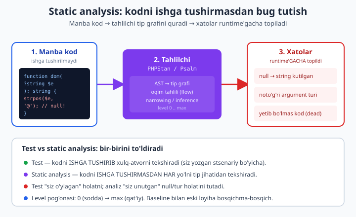
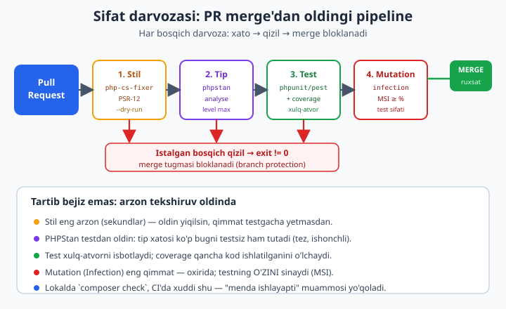

# 24 — Static analysis va avtomatik sifat

[⬅️ Oldingi: 23 — Pest, integratsiya, coverage va mutation](./23-pest-mutation.md) · [🏠 README](./README.md) · [Keyingi: README ➡️](./README.md)

> **Bu bobda:** test "kod ishlaydimi?" degan savolga javob beradi — lekin u faqat **siz yozgan stsenariy** bo'yicha kodni ishga tushiradi. Siz unutgan yo'l, `null` kelib qoladigan tarmoq, noto'g'ri tur uzatilgan chaqiriq — bularning hech biri test yozmasangiz tutilmaydi. **Static analysis** boshqacha ishlaydi: u kodni **umuman ishga tushirmasdan**, har bir o'zgaruvchining turini va har bir yo'lni tahlil qilib, runtime'gacha bug topadi. Bu bobda **PHPStan** ni 0..max darajalar bo'yicha o'rganamiz, **baseline** bilan eski loyihaga bosqichma-bosqich kiritamiz, `neon` config'ni tushunamiz; **Psalm** ni qisqa solishtiramiz; **generics** ni `@template`/`@param T`/`@return T` PHPDoc orqali yozib, PHPStan buni qanday tekshirishini **real run bilan** ko'rsatamiz (tip-xavfsiz `Collection`). So'ng **Rector** bilan avtomatik refaktoring va PHP versiya migratsiyasi (eski `private $x` + qo'l bilan tayinlash &#8594; constructor promotion), **PHP-CS-Fixer** bilan PSR-12 stilini avtomatik tuzatish, **Composer scripts** bilan lint+stan+test+cs-fix ni bitta `composer check` ga ulash va nihoyat **CI darvozasi** — bu vositalarni pull-request darvozasiga ulab, xato bo'lsa merge'ni bloklash. Hamma vosita bu mashinada `composer` bilan o'rnatilib **haqiqatan ishga tushirildi** — chiqishlar ko'chirib qo'yilgan, jumladan **ataylab kiritilgan xatolar** ham.

---

## Nega static analysis? Test yetarli emasligi

23-bobgacha biz testga ko'p kuch sarfladik: PHPUnit, Pest, integratsiya, coverage va mutation. Test kuchli — lekin uning bitta tug'ma cheklovi bor: **test kodni faqat siz ataylab chaqirgan holatda ishga tushiradi.** Agar siz `null` keladigan holatga test yozmagan bo'lsangiz, o'sha yo'ldagi bug abadiy yashirin qoladi.

Mana klassik misol. `?string` (ya'ni "string yoki null") qabul qiladigan metod, lekin ichida `null` ni hisobga olmaslik:

```php
<?php
declare(strict_types=1);

function domain(?string $email): string
{
    // ❌ $email null bo'lishi mumkin - strpos(null, ...) PHP 8.4 da TypeError
    $pos = strpos($email, '@');
    return substr($email, $pos + 1);
}

echo domain('oqil@example.com'), "\n"; // ishlaydi: example.com
echo domain(null), "\n";               // PORTLAYDI: TypeError
```

Bu kod `domain('oqil@example.com')` bilan **bemalol ishlaydi** — agar siz testda faqat shu holatni yozsangiz, yashil ko'rasiz. Lekin `domain(null)` chaqirilgan zahoti PHP 8.4 `strpos(): Argument #1 ($haystack) must be of type string, null given` deb portlaydi. Test buni faqat **siz `null` holatiga test yozsangiz** tutadi. Static analysis esa kodga qarab'oq, har bir tarmoqni tip jihatidan tekshirib, **hech qanday test yozmasdan** aytadi: "bu yerga `null` kelishi mumkin, lekin `strpos` `string` kutadi".

Farqni shunday tushuning:

- **Test** — kodni **ishga tushiradi** va natijani solishtiradi. "Bu kirish &#8594; bu chiqish" degan **misol**larni tekshiradi. Yo'q test = yo'q kafolat.
- **Static analysis** — kodni **ishga tushirmaydi**. Manba matnini o'qib, har bir o'zgaruvchining mumkin bo'lgan **turlar to'plami**ni hisoblaydi (type inference), har bir yo'lni (`if`/`else`/`match`) kuzatadi (flow analysis) va tip qoidasi buzilgan joyni belgilaydi.

Ular **raqobatchi emas, sherik**: test "men o'ylagan holat to'g'ri ishlaydimi?" ni, static analysis "men **unutgan** holatda tip buzilmaydimi?" ni tekshiradi. Professional loyihada ikkalasi ham CI darvozasida turadi.



Static analysis ishga tushirmasdan ushlaydigan tipik xatolar:

- **Null xavfsizligi** — `?T` turdagi qiymatni `null`-ni kutmaydigan funksiyaga uzatish (yuqoridagi misol).
- **Noto'g'ri argument turi** — `int` kutilgan joyga `string` uzatish (`declare(strict_types=1)` runtime'da tutadi, lekin static analysis **kodni ishga tushirmasdan, har bir chaqiriqni** tekshiradi).
- **Mavjud bo'lmagan metod/xususiyat** — `$user->emial` (typo) yoki olib tashlangan metodni chaqirish.
- **Yetib bo'lmaydigan (dead) kod** — `return` dan keyingi qator, hech qachon `true` bo'lmaydigan `if`.
- **Noto'g'ri qaytuvchi tur** — `string` qaytarishi e'lon qilingan, lekin ba'zi yo'lda hech narsa qaytarmaydigan funksiya.

> **Boshlovchidan ko'prik.** Bu bob [toza kod prinsiplari](../php/36-toza-kod-prinsiplari.md) va [testing](../php/testing.md) ning tabiiy davomi. U yerda "kodni qatlamga ajrat, mas'uliyatni bo'l" deyildi; bu yerda shu intizomni **mashina majburlaydi**.

---

## PHPStan: o'rnatish va birinchi ishga tushirish

PHPStan — PHP uchun eng keng tarqalgan static analyzer. Composer bilan dev-bog'liqlik sifatida o'rnatiladi (real loyihaga tegmaydi, faqat ishlab chiqishda kerak):

```bash
composer require --dev phpstan/phpstan
```

Bu mashinada o'rnatildi — versiya:

```
phpstan/phpstan (2.2.2)
```

Endi tahlil qiladigan kod kerak. `src/User.php` ni yarataylik — boshida toza ko'rinadi, lekin ichida **null xatosi** bor:

```php
<?php
declare(strict_types=1);

namespace App;

final class User
{
    public function __construct(
        public readonly string $name,
        public readonly ?string $email = null,
    ) {}

    public function emailDomain(): string
    {
        // ❌ $this->email ?string - null bo'lsa strpos va substr xato beradi
        $pos = strpos($this->email, '@');

        return substr($this->email, $pos + 1);
    }
}
```

Tahlilni ishga tushirish — `analyse` (yoki qisqa `analyze`) buyrug'i. `--level` (yoki `-l`) qat'iylik darajasini beradi:

```bash
vendor/bin/phpstan analyse src --level=0
```

**Haqiqiy chiqish (level 0):**

```
 [OK] No errors
```

Diqqat: level 0 da **xato topilmadi** — null muammosi o'tib ketdi. Endi darajani 8 ga ko'taramiz:

```bash
vendor/bin/phpstan analyse src --level=8
```

**Haqiqiy chiqish (level 8):**

```
 ------ ------------------------------------------------------------------------------
  Line   User.php
 ------ ------------------------------------------------------------------------------
  17     Parameter #1 $haystack of function strpos expects string, string|null given.
         🪪  argument.type
  19     Parameter #1 $string of function substr expects string, string|null given.
 ------ ------------------------------------------------------------------------------

 [ERROR] Found 2 errors
```

Mana — **kod umuman ishga tushirilmadi**, lekin PHPStan ikkita aniq xatoni ko'rsatdi: `strpos` va `substr` ga `string|null` uzatilmoqda, ular esa `string` kutadi. Bu aynan biz boshda ko'rgan `null` portlashining ildizi. Buyruq `exit code != 0` qaytaradi — CI uni "muvaffaqiyatsiz" deb tushunadi (buni quyida CI darvozasida ishlatamiz).

Xatoni tuzatish — `null` tekshiruvini qo'shish, shunda PHPStan `null` yo'qolganini **type narrowing** orqali ko'radi:

```php
public function emailDomain(): string
{
    if ($this->email === null) {
        throw new \LogicException('email yoq');
    }
    // bu yerdan keyin PHPStan $this->email ni string deb biladi (null narrow qilindi)
    $pos = strpos($this->email, '@');
    return $pos === false ? '' : substr($this->email, $pos + 1);
}
```

`$this->email === null` shartidan **keyin** PHPStan `$this->email` endi sof `string` ekanini biladi — bu **flow-sensitive** tahlil. Endi level 8 da ham `[OK] No errors`.

---

## Levellar: 0 dan max gacha pog'ona

PHPStan ataylab **bosqichli**: 0 dan 9 (va `max` — eng yuqori barqaror darajaga taxallus) gacha. Har daraja oldingisining ustiga yangi tekshiruv qo'shadi. G'oya — eski loyiha ham 0 dan boshlab asta-sekin ko'tariladi, hammasini bir kunda emas.

| Level | Nimani qo'shadi (taxminan) |
|-------|----------------------------|
| 0 | Asosiy: mavjud bo'lmagan class/metod/funksiya, noto'g'ri argument soni |
| 1 | Aniqlanmagan o'zgaruvchilar, `$this` mavjud bo'lmagan kontekst |
| 2 | Noma'lum metodlar (har joyda, nafaqat aniq turlarda) |
| 3 | Qaytuvchi turlar, xususiyat (property) tayinlashlari |
| 4 | Yetib bo'lmaydigan kod (dead code), o'lik `if` shoxlari |
| 5 | Argument turlari (uzatilgan tur e'lon bilan mosligini tekshiradi) |
| 6 | **Yetishmayotgan tiplar** — har bir `array`/parametr tipga ega bo'lsin (PHPDoc talab) |
| 7 | Union turlarning qisman noto'g'ri ishlatilishi |
| 8 | **Nullable** — `null` bo'lishi mumkin qiymatni `null`-siz ishlatish (bizning misol) |
| 9 | `mixed` ni qat'iy: `mixed` ustida hech qanday amal bemalol o'tmaydi |

> **Amaliy maslahat.** Yangi loyihada **darrov `max`** (yoki `level: 9`) dan boshlang — kod kam, tuzatish arzon. Eski (legacy) loyihada esa o'rnatilgan darajadan (masalan 5) boshlang, **baseline** oling (quyida) va vaqt o'tib darajani bittadan ko'taring. Levelni `--level=8` flagi yoki config faylda belgilash mumkin — config afzal, chunki butun jamoa va CI bir xil darajani ishlatadi.

---

## neon config fayli

Har safar `--level=8 --paths=src ...` yozish charchatadi va jamoada xilma-xil bo'ladi. PHPStan sozlamalarni `phpstan.neon` (yoki `phpstan.neon.dist`) faylidan oladi. NEON — YAML'ga juda o'xshash, lekin PHP ekotizimida (Nette) ishlatiladigan format; tab yoki probel bilan otstup (chekinish) qabul qiladi:

```neon
parameters:
    level: 8
    paths:
        - src
    excludePaths:
        - src/Generated
    ignoreErrors:
        - '#Access to an undefined property App\\Legacy#'
```

- `level` — daraja (flag o'rnini bosadi).
- `paths` — qaysi kataloglarni tahlil qilish.
- `excludePaths` — generatsiya qilingan/uchinchi-tomon kodni chetlab o'tish.
- `ignoreErrors` — aniq xato xabarlarini (regex bilan) jim qildirish. Lekin buni **qo'l bilan** emas, ko'pincha **baseline** orqali boshqarish afzal (quyida).

`.dist` qo'shimchasi konvensiya: `phpstan.neon.dist` git'ga kiradi (jamoa standarti), `phpstan.neon` esa lokal override sifatida (git'da e'tiborsiz). Config bo'lsa, buyruq oddiy bo'ladi:

```bash
vendor/bin/phpstan analyse
```

PHPStan avtomatik `phpstan.neon` ni topadi va undagi `level`/`paths` ni ishlatadi.

---

## Baseline: eski loyihani bosqichma-bosqich qutqarish

Eng katta amaliy muammo: siz 200 000 qatorli **eski** loyihada `level: 8` ni yoqasiz va PHPStan **4000 ta xato** chiqaradi. Hammasini bugun tuzatib bo'lmaydi — lekin yangi kod toza bo'lishini xohlaysiz. Yechim — **baseline**: mavjud xatolarni "ma'lum qarz" sifatida muzlatib qo'yish, shunda PHPStan ularni jim o'tadi, lekin **yangi** xato paydo bo'lsa darvoza qizaradi.

Baseline ni generatsiya qilish:

```bash
vendor/bin/phpstan analyse --level=8 --generate-baseline
```

Bu mashinada `src/User.php` (ikki xatoli) uchun ishga tushirdik. **Haqiqiy chiqish:**

```
 [OK] Baseline generated with 2 errors.
```

Hosil bo'lgan `phpstan-baseline.neon` (real chiqish):

```neon
parameters:
	ignoreErrors:
		-
			message: '#^Parameter \#1 \$haystack of function strpos expects string, string\|null given\.$#'
			identifier: argument.type
			count: 1
			path: src/User.php

		-
			message: '#^Parameter \#1 \$string of function substr expects string, string\|null given\.$#'
			identifier: argument.type
			count: 1
			path: src/User.php
```

Endi config'ga baseline'ni `includes` orqali ulaymiz:

```neon
includes:
    - phpstan-baseline.neon

parameters:
    level: 8
    paths:
        - src
```

Va qayta ishga tushiramiz. **Haqiqiy chiqish:**

```
 [OK] No errors
```

Eski ikki xato endi "ma'lum qarz" sifatida muzlatildi. Lekin **muhimi**: agar siz **yangi** kodda `null` xatosi qilsangiz, u baseline'da yo'q — PHPStan uni darrov qizil qiladi. Shunday qilib loyiha **regresssiyaga qarshi himoyalanadi**, eski qarzni esa "boy-scout rule" bilan asta-sekin (har tekkan faylda) kamaytirasiz va vaqti-vaqti bilan baseline'ni qayta generatsiya qilib siqasiz.

> **Muhim qoida.** Baseline — **vaqtinchalik** vosita, abadiy yashash joyi emas. Uni faqat eski qarz uchun ishlating; yangi xatoni baseline'ga qo'shib "yashirish" — o'zingizni aldash. Baseline hajmi **faqat kamayishi** kerak.

---

## Psalm: qisqacha solishtirish

**Psalm** (Vimeo'dan) — PHPStan'ga o'xshash, lekin tarixan biroz boshqacha urg'ulangan static analyzer. O'rnatish va ishga tushirish konseptual jihatdan bir xil:

```bash
composer require --dev vimeo/psalm
vendor/bin/psalm --init   # psalm.xml yaratadi va boshlang'ich darajani topadi
vendor/bin/psalm
```

PHPStan `level` (0..max) ishlatsa, Psalm `errorLevel` (8..1, **teskari** — 1 eng qat'iy) ishlatadi. Psalm tarixan ikki narsa bilan ajralib turardi: kuchli `@psalm-*` annotatsiyalari (masalan `@psalm-immutable`, `@psalm-pure`, taint analysis — foydalanuvchi kiritmasi qayerga oqayotganini kuzatish, xavfsizlik uchun) va `--alter` bilan ba'zi avtomatik tuzatish. Bugun ikkala vosita ham ko'p jihatdan bir-biriga yetib oldi; tanlov ko'pincha jamoa odati va ekotizim (masalan ishlatayotgan framework qaysi biriga ko'proq qoida beradi) bilan belgilanadi.

> **Amaliy tavsiya.** Bitta loyihada **bittasini** tanlang (ikkalasini birga yuritish ovora). Yangi PHP loyihasida PHPStan ko'pincha standart tanlovdir — kengroq plagin ekotizimi (`phpstan/phpstan-strict-rules`, framework-maxsus plaginlar) tufayli. Bu bobning qolgan misollari PHPStan'da, lekin g'oyalar Psalm'ga ham bevosita o'tadi.

---

## Generics PHPDoc orqali: @template, @param T, @return T

PHP sintaksisida hali "haqiqiy" generics yo'q — `Collection<User>` deb **kodda** yozolmaysiz. Lekin **static analyzer** generics'ni **PHPDoc annotatsiyalari** orqali tushunadi. Ya'ni PHP runtime'i `@template` ni e'tiborsiz qoldiradi (oddiy izoh), lekin PHPStan/Psalm uni o'qib, tip-xavfsizlikni majburlaydi. Bu — "tip-xavfsiz konteyner" muammosini sintaksisni o'zgartirmasdan hal qiladi.

> **Tushuncha vs mexanika.** Generics **nima**, kovariantlik/kontravariantlik (variance) **nega** kerakligi — bularning chuqur nazariyasi foydalanuvchining [TypeScript kitobi](../typescript/README.md) da (generics va variance) batafsil yoritilgan; PHP'da `readonly`/Value Object kontekstida variance [06-bobda](./06-value-object.md) ko'rilgan. Bu yerda biz faqat **PHP `@template` MEXANIKASI** va **PHPStan buni qanday tekshirishi** ga e'tibor beramiz — nazariyani takrorlamaymiz.

Asosiy uchta annotatsiya:

- `@template T` — class (yoki funksiya) "tip-parametr" `T` qabul qilishini e'lon qiladi. `T` — joy egasi (placeholder), aniq tur emas.
- `@param T $x` — bu metod argumenti `T` turida bo'lishi kerak.
- `@return T` — bu metod `T` turini qaytaradi.

Tip-xavfsiz `Collection` ni quramiz. Kod **PHP uchun** oddiy — runtime hech narsa majburlamaydi; **PHPStan uchun** esa har bir `add`/`first` tip jihatidan bog'langan:

```php
<?php
declare(strict_types=1);

namespace App;

/**
 * @template T
 */
final class TypedCollection
{
    /** @var list<T> */
    private array $items = [];

    /** @param T $item */
    public function add(mixed $item): void
    {
        $this->items[] = $item;
    }

    /** @return T */
    public function first(): mixed
    {
        return $this->items[0];
    }
}
```

Endi uni `User` bilan parametrlaymiz. `@var TypedCollection<User>` PHPStan'ga "bu yerda `T = User`" deydi:

```php
final class GenericsDemo
{
    public function run(): void
    {
        /** @var TypedCollection<User> $users */
        $users = new TypedCollection();
        $users->add(new User('Oqil', 'oqil@example.com'));

        // ❌ User kutilgan joyga string berildi
        $users->add('men string man');

        $u = $users->first();
        echo $u->name; // PHPStan: $u -> User deb biladi (T = User), shuning uchun ->name to'g'ri
    }
}
```

`vendor/bin/phpstan analyse src --level=8`. **Haqiqiy chiqish:**

> **Nega butun `src` ni tahlil qilamiz, bitta faylni emas?** Agar faqat `phpstan analyse src/TypedCollection.php` desangiz, PHPStan faylni alohida (izolyatsiyada) tekshiradi va `App\User` klassini topolmaydi — natijada `class.notFound` shovqini chiqib, `$u->name` ga ham noto'g'ri shikoyat bo'ladi. `src` ni butunligicha berib, PHPStan'ga `User` ni ko'rsatamiz; shunda u faqat haqiqiy tip-xatoni — `add('men string man')` ni — ushlaydi.

```
 ------ ---------------------------------------------------------------------------------------------------
  Line   TypedCollection.php
 ------ ---------------------------------------------------------------------------------------------------
  37     Parameter #1 $item of method App\TypedCollection<App\User>::add() expects App\User, string given.
         🪪  argument.type
 ------ ---------------------------------------------------------------------------------------------------

 [ERROR] Found 1 error
```

Mana eng muhim natija: PHPStan `add()` ning xato xabarida **`App\TypedCollection<App\User>::add()`** deb yozdi va "expects `App\User`, `string` given" dedi. Ya'ni u `T` ni `User` ga **bog'lab**, `add('men string man')` ni xato deb tutdi — runtime esa bu kodni bemalol ishga tushirardi (`string` ham massivga qo'shilaverardi). Bu **aynan generics'ning qiymati**: kompilyatsiya (tahlil) vaqtida konteyner ichidagi tur buzilishini ushlash.

Va e'tibor bering: `$u = $users->first()` dan keyin `$u->name` ga **shikoyat yo'q** — chunki PHPStan `first()` ning `@return T` annotatsiyasini `T = User` bilan yechib, `$u` ni `User` deb biladi, `User`'da esa `name` mavjud. Generics'siz `first()` `mixed` qaytarardi va `->name` ga level 9'da shikoyat bo'lardi. Demak `@template` mexanikasi ikki tomonga ishlaydi: **kirishda** noto'g'ri turni rad etadi, **chiqishda** to'g'ri turni qaytaradi.

> **`array` ham generic.** `list<T>`, `array<int, User>`, `array<string, Money>` — bular ham PHPStan generics annotatsiyalari. Level 6 dan boshlab PHPStan "yalang'och" `array` (tipsiz) uchun shikoyat qiladi va sizdan `array<...>` shaklini talab qiladi — bu kollektsiyalar ustida xatolarni ancha kamaytiradi.

---

## Rector: avtomatik refaktoring va versiya migratsiyasi

PHPStan **muammoni ko'rsatadi**, lekin tuzatishni sizga qoldiradi. **Rector** esa **avtomatik tuzatadi** — u kodni AST (abstrakt sintaksis daraxti) darajasida o'zgartirib, butun loyihadagi yuzlab faylni bir buyruq bilan refaktoring qiladi. Ikki asosiy ishlatilishi bor:

1. **PHP versiya migratsiyasi** — eski sintaksisni yangiga ko'chirish (7.x &#8594; 8.x): `array()` &#8594; `[]`, switch &#8594; `match`, qo'l bilan property tayinlash &#8594; constructor promotion, va h.k.
2. **Code quality refaktoring** — dead code olib tashlash, soddalashtirish, zamonaviy iboralar.

O'rnatish:

```bash
composer require --dev rector/rector
```

Bu mashinada o'rnatildi: `rector/rector (2.4.5)`. Eski uslubdagi `legacy/Order.php` ni olaylik — `private $x` e'loni + konstruktorda qo'l bilan tayinlash, `declare(strict_types)` yo'q:

```php
<?php

namespace Legacy;

class Order
{
    private $status;
    private $total;

    public function __construct($status, $total)
    {
        $this->status = $status;
        $this->total = $total;
    }

    public function describe()
    {
        if ($this->status == 'new') {
            $label = 'Yangi';
        } elseif ($this->status == 'paid') {
            $label = 'Tolangan';
        } else {
            $label = 'Nomalum';
        }
        return $label . ': ' . $this->total;
    }
}
```

Konfiguratsiya — `rector.php` (PHP fayl, neon emas). `withSets` bilan **rule-set** (qoidalar to'plami) tanlanadi:

```php
<?php
declare(strict_types=1);

use Rector\Config\RectorConfig;
use Rector\Set\ValueObject\LevelSetList;

return RectorConfig::configure()
    ->withPaths([__DIR__ . '/legacy'])
    ->withSets([
        LevelSetList::UP_TO_PHP_84,   // 8.4 gacha barcha migratsiya qoidalari
    ])
    ->withPreparedSets(
        deadCode: true,     // o'lik kod
        codeQuality: true,  // soddalashtirishlar
    );
```

`UP_TO_PHP_84` — "PHP 8.4 gacha barcha versiya yangilanishlari" rule-set. Avval **`--dry-run`** bilan ishga tushiramiz — bu hech narsani **o'zgartirmaydi**, faqat nima o'zgarishini diff sifatida ko'rsatadi (CI'da xuddi shu rejim ishlatiladi):

```bash
vendor/bin/rector process --dry-run
```

**Haqiqiy chiqish:**

```diff
1) legacy/Order.php:1

    ---------- begin diff ----------
@@ Line 1 @@
 <?php

+declare(strict_types=1);
+
 namespace Legacy;

 class Order
 {
-    private $status;
-    private $total;
-
-    public function __construct($status, $total)
+    public function __construct(private $status, private $total)
     {
-        $this->status = $status;
-        $this->total = $total;
     }

     public function describe()
    ----------- end diff -----------

Applied rules:
 * ClassPropertyAssignToConstructorPromotionRector
 * SafeDeclareStrictTypesRector

 [OK] 1 file would have been changed (dry-run) by Rector
```

Rector ikki qoidani qo'lladi: **`SafeDeclareStrictTypesRector`** (`declare(strict_types=1)` qo'shdi) va **`ClassPropertyAssignToConstructorPromotionRector`** (alohida property e'lonlari + qo'l bilan tayinlashni **constructor promotion** ga aylantirdi). Tasavvur qiling — 500 ta klass bor loyihada bu o'zgarishni qo'lda qilish kunlar oladi; Rector buni soniyalarda, **xatosiz** qiladi.

Diff ma'qul bo'lsa, `--dry-run` ni olib tashlab haqiqatan qo'llaysiz:

```bash
vendor/bin/rector process
```

> **Rector ish jarayoni.** Doim avval `--dry-run` da ko'ring, keyin git'da toza holatda (commit'siz o'zgarish yo'q) qo'llang va **darrov testlarni** ishga tushiring. Rector ishonchli, lekin u sizning kodingizni o'zgartiryapti — `git diff` ni ko'zdan kechiring. Katta migratsiyani **bir set bo'yicha** (masalan avval `UP_TO_PHP_81`, keyin `82`...) bosqichma-bosqich qiling, har bosqichdan keyin test.

---

## PHP-CS-Fixer: PSR-12 kod stilini avtomatlashtirish

PHPStan **mantiqiy** xatoni, Rector **sintaktik modernizatsiya**ni qiladi. **Kod stili** (probel, qavs joyi, chekinish) esa uchinchi muammo — u xatolik emas, lekin jamoada bir xil bo'lishi kerak. Buni qo'lda baholash ("sen yangi qatorga qavs qo'ymapsan") — vaqt isrofi va janjal manbai. **PHP-CS-Fixer** PSR-12 (va boshqa) standartni **avtomatik** majburlaydi.

> **PSR ko'prigi.** PSR-1/PSR-12 kod stili standartlari [10-bobda](./10-psr-standartlar.md) yoritilgan — PHP-FIG ning "umumiy tili". Bu yerda biz shu standartni **avtomatik tuzatadigan vosita**ni ko'ramiz, standartni qayta o'rgatmaymiz. `phpcs`/`phpcbf` (PHP_CodeSniffer) ham xuddi shu vazifani bajaradi — `phpcs` tekshiradi, `phpcbf` tuzatadi; tanlov odat masalasi.

O'rnatish:

```bash
composer require --dev friendsofphp/php-cs-fixer
```

O'rnatilgan versiya: `friendsofphp/php-cs-fixer (v3.95.5)`. Konfiguratsiya — `.php-cs-fixer.dist.php`:

```php
<?php
declare(strict_types=1);

$finder = PhpCsFixer\Finder::create()
    ->in(__DIR__ . '/src');

return (new PhpCsFixer\Config())
    ->setRiskyAllowed(true)
    ->setRules([
        '@PSR12' => true,                            // PSR-12 to'plami
        'array_syntax' => ['syntax' => 'short'],     // array() -> []
        'no_unused_imports' => true,                 // ishlatilmagan use o'chsin
        'ordered_imports' => true,                   // use'lar alifbo tartibida
    ])
    ->setFinder($finder);
```

Stili buzilgan `style/messy.php` (ortiqcha probel, noto'g'ri qavs joyi, yopishgan operatorlar):

```php
<?php
namespace Style;
class   Calculator {
    public function add($a,$b){
        return $a+$b ;
    }
   public function sub( $a, $b )
   {
        return $a - $b;
   }
}
```

CI'da har doim **`--dry-run --diff`** ishlatiladi — fayllarni **o'zgartirmaydi**, faqat nima tuzatilishini ko'rsatadi va stil noto'g'ri bo'lsa `exit code != 0` qaytaradi:

```bash
vendor/bin/php-cs-fixer fix --dry-run --diff
```

**Haqiqiy chiqish (diff):**

```diff
   1) style\messy.php
--- style/messy.php
+++ style/messy.php
@@ -1,11 +1,15 @@
 <?php
+
 namespace Style;
-class   Calculator {
-    public function add($a,$b){
-        return $a+$b ;
+
+class Calculator
+{
+    public function add($a, $b)
+    {
+        return $a + $b ;
     }
-   public function sub( $a, $b )
-   {
+    public function sub($a, $b)
+    {
         return $a - $b;
-   }
+    }
 }

Found 1 of 1 files that can be fixed
```

PHP-CS-Fixer PSR-12 bo'yicha tuzatishlarni topdi: `<?php` dan keyin bo'sh qator, `class` nomidan ortiqcha probelni olib tashlash, ochuvchi qavsni **yangi qatorga** (metod uchun), argumentlar orasiga probel, chekinishni 4 probelga keltirish. `--dry-run` ni olib tashlasangiz — bularni **haqiqatan tuzatadi**:

```bash
vendor/bin/php-cs-fixer fix
```

> **Muhit o'zgaruvchisi.** PHP-CS-Fixer ba'zan o'rnatilgan PHP versiyasidan shikoyat qilishi mumkin (`PHP needs to be a minimum...` yoki tajriba ogohlantirishi). Buni `PHP_CS_FIXER_IGNORE_ENV=1` muhit o'zgaruvchisi bilan o'tkazib yuborish mumkin — biz bu bobdagi runlarda aynan shuni qo'lladik.

---

## Composer scripts: hammasini bitta buyruqqa ulash

Bizda endi to'rtta vosita bor, har biri o'z buyrug'i bilan. Dasturchi har commit'dan oldin to'rttasini eslab, qo'lda yozishi kerakmi? Yo'q — **Composer scripts** ularni nomli buyruqlarga ulaydi. `composer.json` ga `scripts` bo'limini qo'shamiz:

```json
{
    "name": "demo/ch24",
    "require-dev": {
        "phpstan/phpstan": "^2.2",
        "rector/rector": "^2.4",
        "friendsofphp/php-cs-fixer": "^3.95"
    },
    "scripts": {
        "stan": "phpstan analyse",
        "cs": "php-cs-fixer fix --dry-run --diff",
        "cs-fix": "php-cs-fixer fix",
        "rector": "rector process --dry-run",
        "check": [
            "@cs",
            "@stan"
        ]
    }
}
```

Diqqat qiling: `check` — **massiv**, va ichidagi `@cs`/`@stan` boshqa scriptlarga **havola** (`@` prefiksi). Composer ularni **ketma-ket** bajaradi va **birortasi yiqilsa to'xtaydi** (fail-fast). Real loyihada `check` ichiga `@stan`, test (`phpunit`), va xohlasangiz `rector --dry-run` ham qo'shiladi. Endi dasturchi faqat bitta narsani biladi:

```bash
composer check
```

Buni bu mashinada ishga tushirdik (`style/messy.php` stili buzuq edi). **Haqiqiy chiqish:**

```diff
   1) style\messy.php
--- style/messy.php
+++ style/messy.php
@@ -1,11 +1,15 @@
 <?php
+
 namespace Style;
-class   Calculator {
...
Found 1 of 1 files that can be fixed
```

Va eng muhimi — **exit kod**: `composer check` natijada `exit code = 8` (noldan farqli) qaytardi, chunki birinchi qadam (`@cs`) stil buzilganini topdi va to'xtadi. **`@stan` umuman ishga tushmadi** — fail-fast: arzon tekshiruv (stil) yiqilgach, qimmatroq tahlilgacha bormaydi. Mana shu noldan-farqli exit kod CI darvozasining "qizil" signaliga aylanadi.

> **Lokalda bir xil, CI'da bir xil.** `composer check` ning butun qiymati — **dasturchi lokalda ham, CI ham AYNAN shu buyruqni** ishlatadi. Shuning uchun "menda ishlayapti, lekin CI yiqildi" muammosi yo'qoladi: ikkalasi bir xil vositani, bir xil config bilan chaqiradi. Pre-commit hook (masalan `husky` yoki `captainhook`) bilan `composer check` ni har commit'dan oldin avtomatik chaqirib qo'yish mumkin.

---

## CI darvozasi: PHP sifat-pipeline mazmuni

Oxirgi bo'g'in — bu vositalarni **pull-request darvozasiga** ulash. G'oya oddiy: har PR uchun CI bu vositalarni ishga tushiradi; birortasi yiqilsa (exit != 0), **merge tugmasi bloklanadi** (GitHub'da "branch protection" + "required status checks"). Shunday qilib sifat past kod `main`ga **umuman tusha olmaydi**.



> **Mexanika vs mazmun.** GitHub Actions ning **MEXANIKASI** — `on`/`jobs`/`steps`/`matrix` sintaksisi, runner'lar, secret'lar, artifact'lar — bularning hammasi foydalanuvchining [Git va GitHub kitobi](../git-github/README.md) (CI/CD bo'limi) da chuqur yoritilgan. Bu yerda biz YAML mexanikasini takrorlamaymiz; faqat **PHP-ga xos pipeline MAZMUNI**ga — qaysi qadamlar, qaysi tartibda — e'tibor beramiz.

PHP sifat-pipeline'ining **mazmuni** (qadamlar tartibi):

1. **`composer install`** — bog'liqliklarni o'rnatish (`--prefer-dist --no-progress`, CI'da odatda `--no-dev` EMAS, chunki dev-vositalar kerak).
2. **`php-cs-fixer fix --dry-run`** — stil (eng arzon, oldinda yiqilsin).
3. **`phpstan analyse`** — static analysis (testdan oldin: tip xatosi ko'p bugni testsiz ham tutadi).
4. **`phpunit`** / **`pest`** — testlar (xulq-atvor isboti, ko'pincha `--coverage` bilan).
5. **`infection`** — mutation testing (eng qimmat, oxirida; testlarning sifatini o'lchaydi).

Quyida PHP-ga xos `jobs.steps` **mazmuni** (YAML mexanikasi Git kitobida — bu yerda faqat PHP qadamlari ko'rinishi uchun):

```yaml
# .github/workflows/ci.yml dan PHP-ga xos QADAMLAR (mexanika -> Git kitobi)
jobs:
  quality:
    strategy:
      matrix:
        php: ['8.3', '8.4']   # bir necha PHP versiyasida sinash
    steps:
      - uses: actions/checkout@v4
      - uses: shivammathur/setup-php@v2
        with:
          php-version: ${{ matrix.php }}
          coverage: pcov          # coverage uchun pcov/xdebug
      - run: composer install --prefer-dist --no-progress
      - run: vendor/bin/php-cs-fixer fix --dry-run --diff   # 1. stil
      - run: vendor/bin/phpstan analyse                     # 2. tip
      - run: vendor/bin/phpunit --coverage-text             # 3. test + coverage
      - run: vendor/bin/infection --min-msi=80              # 4. mutation
```

**Matritsa (matrix)** — PHP'ga xos muhim nuqta: kutubxona yoki ilova **bir necha PHP versiyasida** (masalan 8.3 va 8.4) ishlashi kerak. `matrix.php` har versiya uchun **alohida** pipeline ishga tushiradi — shunda "8.4'da ishlaydi, 8.3'da sinmaydi" degan kafolat olasiz. Bu ayniqsa **kutubxona** mualliflari uchun zarur: foydalanuvchilar turli PHP versiyalarida.

> **Coverage/mutation va muhit.** `phpunit --coverage` va `infection` **Xdebug yoki pcov** kerak qiladi (kodni qatorma-qator kuzatish uchun). Ushbu yozuv tayyorlangan mashinada **bu kengaytmalar yo'q** — shuning uchun yuqoridagi `--coverage` va `infection` qadamlari **ko'rsatuv uchun** (config + kutilgan CI chiqishi). Lekin **`php-cs-fixer`, `phpstan` va oddiy `phpunit`/`pest` testlari Xdebug'siz to'liq ishlaydi** — bu bobdagi barcha PHPStan/Rector/PHP-CS-Fixer chiqishlari **haqiqiy run**. Coverage/mutation pipeline'ini lokal Xdebug bilan yoki CI'da ishlatasiz (CI'da `coverage: pcov` ni `setup-php` o'rnatadi). Mutation va coverage tafsilotlari [23-bobda](./23-pest-mutation.md).

Darvoza qanday "bloklaydi"? Har `run:` qadam yiqilsa (exit != 0), Actions o'sha **job**ni "failed" deb belgilaydi. GitHub repo sozlamasida `quality` job'ni **required status check** qilib qo'ysangiz, **merge tugmasi** o'chadi — kod tuzatilmaguncha `main`ga tusha olmaydi. Bu — "sifat darvozasi" ning aniq ma'nosi.

---

## Hammasini birga: minimal sifat to'plami

Yangi PHP loyihasi uchun amaliy boshlang'ich to'plam, hammasi shu bobda ko'rilgan:

```json
{
    "require-dev": {
        "phpstan/phpstan": "^2.2",
        "rector/rector": "^2.4",
        "friendsofphp/php-cs-fixer": "^3.95",
        "phpunit/phpunit": "^11.0"
    },
    "scripts": {
        "cs": "php-cs-fixer fix --dry-run --diff",
        "cs-fix": "php-cs-fixer fix",
        "stan": "phpstan analyse",
        "rector": "rector process --dry-run",
        "test": "phpunit",
        "check": ["@cs", "@stan", "@test"]
    }
}
```

Dasturchi ish jarayoni:

1. Kod yozadi.
2. `composer cs-fix` — stilni avtomatik tuzatadi (qo'l aralashmaydi).
3. `composer check` — stil + tip + test, lokalda. Yashilmi — push.
4. CI xuddi shu `composer check` ni (plus coverage/mutation) bir necha PHP versiyasida ishga tushiradi.
5. Hammasi yashil &#8594; merge ruxsat; biror qizil &#8594; merge bloklangan.

Bu — **junior va senior chizig'i**: junior "kod ishladi, push qildim" deydi; senior **kod ishlashidan oldin** mashina uni tekshirishini, va o'sha tekshiruv **darvoza** ekanini ta'minlaydi. Sifat — odamning intizomiga emas, **avtomatlashtirishga** tayanadi.

---

## Mashqlar

### Oson

1. **Level pog'onasi.** Quyidagi funksiyani faylga saqlang va `phpstan analyse --level=0`, keyin `--level=8` bilan ishga tushiring. Qaysi darajada xato chiqadi va nega?

```php
<?php
declare(strict_types=1);

function uzunlik(?string $s): int
{
    return strlen($s); // $s null bo'lsa-chi?
}
```

2. **Composer script.** `composer.json` ga `lint` nomli script qo'shing, u `php-cs-fixer fix --dry-run` ni chaqirsin. Keyin `stan` ham qo'shing va ikkalasini `verify` nomli script massivida (`["@lint", "@stan"]`) ulang.

3. **neon config.** `phpstan.neon` faylini yozing: `level: 6`, faqat `app/` va `lib/` kataloglarini tahlil qilsin, `app/Generated` ni chetlab o'tsin.

### O'rta

4. **Generics tuzatish.** Yuqoridagi `TypedCollection` ga `map` metodi qo'shing: `@template U`, kirish `callable(T): U`, qaytish `TypedCollection<U>`. PHPStan'da xatosiz bo'lsin. (Maslahat: yangi kollektsiya yaratib, har elementni o'tkazib qo'shing.)

5. **Baseline.** Ikkita tip xatosi bor faylni yozing (masalan ikkita joyda `?int` ni `int` kutilgan funksiyaga uzating). `--generate-baseline` bilan baseline yarating, config'ga ulang, qayta run qiling — `No errors` bo'lishini ko'ring. Endi **uchinchi** xato qo'shing va PHPStan faqat yangisini ko'rsatishini tasdiqlang.

6. **Rector dry-run.** Eski sintaksisli fayl yozing: `array('a' => 1)`, `if/elseif` zanjiri va tipsiz konstruktor. `rector.php` da `UP_TO_PHP_84` set bilan `--dry-run` ishga tushiring va diff'da qaysi qoidalar qo'llanishini sanang.

### Qiyin

7. **To'liq darvoza.** Kichik loyiha qiling (`src/` ichida 2-3 klass), `composer check` script'ini `["@cs", "@stan", "@test"]` qilib sozlang. Ataylab bitta klassda PHPStan xatosi qoldiring va `composer check` ning `exit code != 0` qaytarishini, hamda `@stan` yiqilgach `@test` ishga **tushmasligini** tasdiqlang. Keyin tuzatib, yashil bo'lishini ko'ring.

8. **CI mazmuni.** PHP kutubxona uchun (`8.3` va `8.4` matritsasi) sifat-pipeline **qadamlar tartibini** yozing va har qadam **nega aynan shu o'rinda** turishini bir jumla bilan asoslang. (Mexanika emas — mazmun: nega cs oldinda, nega infection oxirida.)

<details markdown="1"><summary>Yechim — 1</summary>

Level 0 da `[OK] No errors` chiqadi — level 0 null-xavfsizlikni tekshirmaydi. Level 8 da xato chiqadi:

```
Parameter #1 $string of function strlen expects string, string|null given.
```

Chunki `?string` `null` bo'lishi mumkin, `strlen` esa `string` kutadi. Tuzatish: `if ($s === null) return 0;` qo'shing, shunda level 8 ham toza bo'ladi.
</details>

<details markdown="1"><summary>Yechim — 2</summary>

```json
{
    "scripts": {
        "lint": "php-cs-fixer fix --dry-run",
        "stan": "phpstan analyse",
        "verify": ["@lint", "@stan"]
    }
}
```

`composer verify` ketma-ket `lint` keyin `stan` ni ishga tushiradi; `lint` yiqilsa `stan` ga bormaydi (fail-fast).
</details>

<details markdown="1"><summary>Yechim — 3</summary>

```neon
parameters:
    level: 6
    paths:
        - app
        - lib
    excludePaths:
        - app/Generated
```

`excludePaths` ostidagi yo'l `paths` ichida bo'lsa ham tahlildan chiqariladi — generatsiya qilingan kod uchun zarur.
</details>

<details markdown="1"><summary>Yechim — 4</summary>

```php
/**
 * @template U
 * @param callable(T): U $fn
 * @return TypedCollection<U>
 */
public function map(callable $fn): self
{
    $natija = new self(); // @var TypedCollection<U>
    foreach ($this->items as $item) {
        $natija->add($fn($item));
    }
    return $natija;
}
```

PHPStan `$fn($item)` chaqiruvida `$item` ni `T`, natijani `U` deb biladi; `add($fn($item))` `U` ni yangi `TypedCollection<U>` ga qo'shadi. Foydalanishda: `$nomlar = $users->map(fn(User $u): string => $u->name);` &#8594; PHPStan `$nomlar` ni `TypedCollection<string>` deb biladi. `self` qaytarish tipini PHPStan `@return TypedCollection<U>` annotatsiyasi bilan aniqlashtiradi.
</details>

<details markdown="1"><summary>Yechim — 5</summary>

```php
<?php
declare(strict_types=1);

function ikki(?int $a): int { return $a + 1; }  // ❌ 1
function uch(?int $b): int { return $b * 2; }   // ❌ 2
```

`vendor/bin/phpstan analyse --level=8 --generate-baseline` &#8594; "Baseline generated with 2 errors". Config'ga `includes: [phpstan-baseline.neon]` qo'shilsa, run `No errors` beradi. Endi uchinchi xatoni qo'shsangiz:

```php
function tort(?int $c): int { return $c - 5; } // ❌ 3 - baseline'da YO'Q
```

PHPStan **faqat** uchinchi xatoni ko'rsatadi (birinchi ikkitasi baseline'da muzlatilgan) — bu aynan regressiyaga qarshi himoya: eski qarz jim, yangi xato darrov ushlanadi.
</details>

<details markdown="1"><summary>Yechim — 6</summary>

`rector.php`:

```php
<?php
declare(strict_types=1);

use Rector\Config\RectorConfig;
use Rector\Set\ValueObject\LevelSetList;

return RectorConfig::configure()
    ->withPaths([__DIR__ . '/legacy'])
    ->withSets([LevelSetList::UP_TO_PHP_84])
    ->withPreparedSets(codeQuality: true);
```

`vendor/bin/rector process --dry-run` qo'llaydigan qoidalar (taxminan): `LongArrayToShortArrayRector` (`array()` &#8594; `[]`), `ClassPropertyAssignToConstructorPromotionRector` (tipsiz konstruktor &#8594; promotion), va `if/elseif` ni `match`/early return ga aylantiradigan code-quality qoidalari. Diff'da "Applied rules:" ro'yxati aniq qoidalarni sanaydi. Doim `--dry-run` da ko'rib, keyin haqiqatan qo'llang va test qiling.
</details>

<details markdown="1"><summary>Yechim — 7</summary>

```json
{
    "scripts": {
        "cs": "php-cs-fixer fix --dry-run --diff",
        "stan": "phpstan analyse",
        "test": "phpunit",
        "check": ["@cs", "@stan", "@test"]
    }
}
```

Bitta klassda ataylab PHPStan xatosi (`?string` ni `null`-siz ishlatish) qoldiring. `composer check`:
- `@cs` o'tadi (stil toza),
- `@stan` **yiqiladi** (`exit != 0`) &#8594; Composer to'xtaydi,
- `@test` **umuman ishga tushmaydi** (chiqishda PHPUnit chiqishi yo'qligidan bilinadi).

`composer check` ning umumiy exit kodi noldan farqli &#8594; CI darvozasi qizil. Xatoni tuzatgach (`null` tekshiruvi), uch qadam ham yashil &#8594; exit 0 &#8594; merge ruxsat. Bu fail-fast tartibni isbotlaydi: arzon tekshiruv (cs) oldinda, qimmat (test) keyinda, biror qadam yiqilsa keyingilari behuda ishlamaydi.
</details>

<details markdown="1"><summary>Yechim — 8</summary>

Qadamlar tartibi va asoslari:

1. `composer install` — boshqa hamma qadam bog'liqliklarsiz ishlamaydi.
2. **`php-cs-fixer --dry-run`** — eng arzon (soniyalar), shuning uchun oldinda: stil buzuq bo'lsa, qimmat qadamlargacha yetmasdan tez yiqilsin.
3. **`phpstan analyse`** — testdan **oldin**, chunki tip xatosi (null, noto'g'ri tur) ko'p bugni **test yozmasdan** tutadi va tez ishlaydi; testdan oldin yiqitsa, test resursini tejaydi.
4. **`phpunit/pest`** — xulq-atvorni isbotlaydi; static analiz tutolmaydigan mantiqiy xatolarni (noto'g'ri hisob-kitob) bu tutadi.
5. **`infection`** — eng qimmat (har mutatsiya uchun test to'plamini qayta ishga tushiradi), shuning uchun oxirida; u testlarning **o'zini** sinaydi (MSI), ya'ni faqat testlar yashil bo'lgachgina ma'noli.

Matritsa (`8.3`, `8.4`) — kutubxona ikkala versiyada ham sinishi shart; har versiya alohida pipeline. Umumiy tamoyil: **arzon va keng tekshiruv oldinda, qimmat va chuqur tekshiruv keyinda** — fail-fast bilan resurs va vaqt tejaladi.
</details>

---

## Xulosa va keyingisi

Bu bobda kodni **ishga tushirmasdan** sifatini ta'minlaydigan to'plamni qurib chiqdik:

- **Static analysis** test bilan raqobat emas, sherik: test "men o'ylagan holat to'g'rimi?", analiz "men unutgan null/tur holatida sinmaydimi?".
- **PHPStan** — level 0..max pog'onasi, `neon` config, va **baseline** bilan eski loyihani regressiyadan himoyalab, qarzni asta-sekin kamaytirish. **Psalm** — o'xshash muqobil.
- **Generics** `@template`/`@param T`/`@return T` PHPDoc orqali: PHP runtime e'tiborsiz qoldiradi, lekin PHPStan tip-xavfsiz `Collection` ni majburlaydi (real run: `add('string')` &#8594; xato).
- **Rector** — avtomatik refaktoring va PHP versiya migratsiyasi (promotion, `strict_types`, eski sintaksis); doim `--dry-run` &#8594; test.
- **PHP-CS-Fixer** — PSR-12 stilini avtomatik; `--dry-run --diff` CI'da, `fix` lokalda.
- **Composer scripts** `composer check` ga ulab, lokal va CI bitta buyruqni ishlatadi.
- **CI darvozasi** — bu vositalarni PR'ga ulab, qizil bo'lsa merge bloklanadi; matritsa bilan bir necha PHP versiyasida sinash.

**Sifat to'plami (Wave 4) tugadi** — testdan static analysis va avtomatik darvozagacha. Keyingisi: **arxitektura, performance va async (Wave 5)** — OPcache/JIT, Redis bilan keshlash, va asinxron PHP. Sifat darvozasi sizni "tez yozish" emas, **xotirjam yozish** ga olib chiqadi: mashina sizdan oldin tekshiradi, siz mantiqqa e'tibor berasiz.

---

[⬅️ Oldingi: 23 — Pest, integratsiya, coverage va mutation](./23-pest-mutation.md) · [🏠 README](./README.md) · [Keyingi: README ➡️](./README.md)
