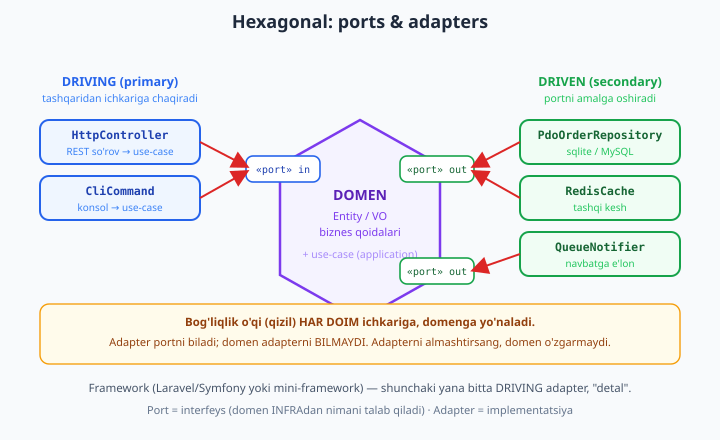
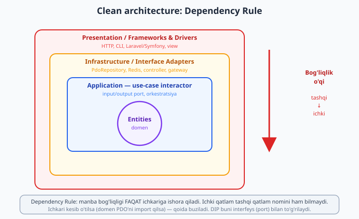

# 25 — Hexagonal va Clean arxitektura (ports & adapters)

[⬅️ Oldingi: 24 — Static analysis va avtomatik sifat](./24-static-analysis.md) · [🏠 README](./README.md) · [Keyingi: 26 — DDD va CQRS ➡️](./26-ddd-cqrs.md)

> **Bu bobda:** oldingi boblar bizga g'ishtlarni berdi — Repository va Service ([./21-taktik-dizayn.md](./21-taktik-dizayn.md)), test va static analysis ([./22-phpunit-chuqur.md](./22-phpunit-chuqur.md), [./24-static-analysis.md](./24-static-analysis.md)), DI konteyner ([./13-di-konteyner.md](./13-di-konteyner.md)), o'z mini-frameworkimiz ([./15-mini-framework.md](./15-mini-framework.md)). Endi biz **butun binoning shaklini** belgilaymiz. Savol oddiy: kodimiz markazida **nima** turishi kerak — Laravel? MySQL? HTTP? Yo'q. Markazda **biznes domeni** turishi kerak, qolgan hammasi esa **detal** — almashtirilishi mumkin bo'lgan tashqi qism. Bu bobda **Hexagonal arxitektura** (ports & adapters): domen markazda, **port** = interfeys (domen infratuzilmadan *nimani* talab qiladi), **adapter** = implementatsiya (`PdoOrderRepository`, `RedisCache`, `HttpController`). Eng muhim qoida — **bog'liqlik o'qi ichkariga yo'naladi**: infra domenga bog'liq, domen infraga **emas**. So'ng **qatlamlar** (domain / application / infrastructure / presentation), **Clean architecture** (Uncle Bob) — use-case **interactor**, input/output port, **Dependency Rule**. Framework "detal" ekanini ko'rsatamiz: Wave 3 mini-frameworkimiz yoki Laravel — shunchaki bitta adapter. **Driving (primary)** vs **driven (secondary)** port/adapter farqi. Va eng amaliy isbot: kichik **Buyurtma (Order)** domeni — port (interfeys) + ikki adapter (in-memory + PDO sqlite) + use-case — **chindan ishga tushirib** ko'rsatamiz: adapter almashsa, domen bir harf ham o'zgarmaydi. Domenni **0 ta infratuzilma** bilan test qilamiz. Hamma kod bu mashinada `php` bilan **haqiqatan ishga tushirildi** — chiqishlar ko'chirma.

---

## Nega arxitektura kerak? Markazda nima turadi

Yangi loyiha ochasiz. Birinchi nima qilasiz? Ko'pchilik `composer create-project laravel/laravel` deb yozadi, so'ng `php artisan make:model`, so'ng kontrollerda Eloquent bilan biznes mantiqni yozishni boshlaydi. Ikki yildan keyin nima bo'ladi? Biznes qoidasi — "VIP mijozga 15% chegirma, lekin buyurtma 100$ dan oshsa" — `OrderController` ichida, `Order` Eloquent modelida, `OrderObserver` da va uchta Blade shablonda **sochilib** yotadi. Laravel'dan boshqa narsaga ko'chmoqchi bo'lsangiz — imkonsiz. Biznes qoidasini alohida test qilmoqchi bo'lsangiz — butun frameworkni ko'tarish kerak. MySQL'dan PostgreSQL'ga o'tish — har joyda raw SQL.

Muammoning ildizi bitta: **eng beqaror narsa (framework, baza, HTTP) markazga qo'yilgan, eng barqaror narsa (biznes qoidasi) chetga sochilgan.** Holbuki kerakli — teskari.

O'ylab ko'ring, qaysi biri tez-tez o'zgaradi:

| Komponent | Qancha tez o'zgaradi | Misol |
|-----------|----------------------|-------|
| **Biznes qoidasi** | Yillab barqaror | "bo'sh buyurtmani joylab bo'lmaydi" |
| **Baza** | Loyiha umrida 0-1 marta | MySQL &#8594; PostgreSQL, sqlite test'da |
| **Framework** | Yillarda bir marta | Laravel &#8594; Symfony, yoki versiya yangilanishi |
| **HTTP / yetkazib berish** | Tez-tez | REST &#8594; GraphQL, web &#8594; CLI &#8594; queue worker |
| **Tashqi xizmat** | Tez-tez | SendGrid &#8594; Mailgun, Stripe &#8594; Paddle |

Xulosa shafqatsiz: **framework, baza va HTTP — bular "detal".** Ular o'zgaradi. Biznes domeni esa — loyihangizning *sababi* — barqaror. Demak domen markazda, mustaqil, o'zini test qila oladigan bo'lishi kerak; qolgan hammasi atrofga, almashtirilishi mumkin bo'lgan **adapter** sifatida ulanishi kerak.

Arxitektura aynan shu joylashtirish haqida. U sizga ikkita narsa beradi:

- **O'zgarishga chidamlilik.** Bazani, frameworkni yoki tashqi xizmatni almashtirsangiz — domen tegilmaydi. Faqat bitta adapterni qayta yozasiz.
- **Testlanuvchanlik.** Domenni hech qanday baza, HTTP yoki framework ko'tarmasdan, millisekundlarda test qilasiz ([./22-phpunit-chuqur.md](./22-phpunit-chuqur.md) dagi tez "unit" testlar).

> **Boshlovchidan ko'prik.** Bu bob [toza kod prinsiplari](../php/36-toza-kod-prinsiplari.md) dagi "qatlamlarga ajrat, mas'uliyatni bo'l" g'oyasining cho'qqisi. U yerda *nega* ajratish kerakligi aytildi; bu yerda *qanday shakl*da ajratish kerakligini ko'ramiz. 21-bob ([./21-taktik-dizayn.md](./21-taktik-dizayn.md)) Repository'ni "domen interfeysi / infra implementatsiyasi" deb berdi — endi shu g'oyani **butun tizimga** kengaytiramiz.

---

## Hexagonal: domen markazda, portlar atrofida, adapterlar tashqarida

**Hexagonal arxitektura** (ya'ni "ports & adapters", muallifi Alistair Cockburn, 2005) — eng sodda va eng kuchli arxitektura modeli. Uning shakli quyidagicha:



Modelni uch tushuncha bilan tushunish kifoya:

1. **Domen (markaz).** Biznes obyektlari (Entity, Value Object) va qoidalari. U **framework, baza, HTTP haqida hech narsa bilmaydi**. `use Illuminate\...` yoki `new PDO(...)` bu yerda **hech qachon** uchramaydi.

2. **Port (qirra).** Bu **interfeys** — domenning tashqi dunyo bilan "kelishuvi". Port ikki savolga javob beradi: domen tashqaridan **nimani talab qiladi** (masalan, "menga buyurtmalarni saqlaydigan biror narsa kerak" &#8594; `OrderRepository`), yoki tashqi dunyo domenni **qanday chaqiradi** (`PlaceOrderUseCase`). Port — bu *kontrakt*, implementatsiya emas.

3. **Adapter (tashqarida).** Port interfeysining **konkret implementatsiyasi**. `PdoOrderRepository` — `OrderRepository` portining PDO orqali bajarilishi. `RedisCache` — kesh portining Redis orqali. `HttpController` — `PlaceOrderUseCase` portini HTTP so'rovga ulovchi adapter.

Eng muhim qoida — **bog'liqlik o'qi ichkariga yo'naladi**:

> Adapter portni biladi (`implements OrderRepository`). Port domenda yashaydi. Demak adapter domenga bog'liq. **Domen esa adapterni bilmaydi** — uning kodida `PdoOrderRepository` so'zi umuman uchramaydi. Bu [Dependency Inversion Principle](./19-solid.md) ning to'g'ridan-to'g'ri qo'llanishi.

Buning amaliy natijasi sehrli: **adapterni almashtirsang, domen va use-case bir harf ham o'zgarmaydi.** Test'da `InMemoryOrderRepository`, production'da `PdoOrderRepository` — ikkalasi ham bir xil portni amalga oshiradi, shuning uchun use-case ularning farqini sezmaydi.

### Driving (primary) vs driven (secondary)

Portlar va adapterlar ikki turga bo'linadi — bu farq juda muhim, lekin ko'pincha chalkashtiriladi:

- **Driving (primary) — "haydovchi".** Tashqaridan ichkariga *chaqiradigan* tomon. Foydalanuvchi, HTTP so'rovi, CLI buyrug'i, cron — ular use-case'ni **ishga tushiradi**. Driving port = use-case interfeysi (`PlaceOrderUseCase`). Driving adapter = `HttpController`, `CliCommand`. Diagrammada **chap** tomonda.

- **Driven (secondary) — "haydaladigan".** Domen *o'zi chaqiradigan* tomon. Domen "menga buyurtmani saqla", "xabar yubor" deydi. Driven port = `OrderRepository`, `Notifier`. Driven adapter = `PdoOrderRepository`, `RedisCache`, `QueueNotifier`. Diagrammada **o'ng** tomonda.

Farqni eslab qolish uchun: *kim kimni chaqiradi?* Driving adapter **domenni chaqiradi** (so'rov keladi). Domen **driven adapterni chaqiradi** (saqlash, yuborish kerak bo'lganda). Ikkala holatda ham bog'liqlik o'qi **ichkariga** — chunki ikkala port ham domen/application qatlamida e'lon qilingan.

| | Driving (primary) | Driven (secondary) |
|---|---|---|
| **Yo'nalish** | tashqaridan domenni chaqiradi | domen tashqarini chaqiradi |
| **Port misoli** | `PlaceOrderUseCase` | `OrderRepository`, `Notifier` |
| **Adapter misoli** | `HttpController`, `CliCommand` | `PdoOrderRepository`, `RedisCache` |
| **Diagrammada** | chap | o'ng |

---

## Qatlamlar: domain / application / infrastructure / presentation

Hexagon "markaz va atrof" g'oyasini beradi; amalda kodni **to'rt qatlam**ga (papka/namespace) ajratamiz. Bu Clean architecture'ning konsentrik halqalariga to'g'ri keladi:

```
src/
├── Domain/           # ENG ICHKI - biznes yuragi
│   ├── Order.php             (Entity - biznes qoidalari ichida)
│   ├── Money.php             (Value Object)
│   ├── OrderRepository.php   (PORT - interfeys)
│   └── Notifier.php          (PORT - interfeys)
├── Application/      # use-case orkestratsiyasi
│   ├── PlaceOrderUseCase.php (driving PORT - interfeys)
│   └── PlaceOrder.php        (interactor - portlardan foydalanadi)
├── Infrastructure/   # ADAPTERlar - portlarni amalga oshiradi
│   ├── PdoOrderRepository.php
│   ├── InMemoryOrderRepository.php
│   └── ConsoleNotifier.php
└── Presentation/     # yetkazib berish - HTTP/CLI
    └── PlaceOrderController.php  (driving adapter)
```

Har bir qatlamning mas'uliyati va **nimaga bog'lanishi mumkinligi**:

| Qatlam | Mas'uliyat | Nimaga bog'lanishi MUMKIN | Misol |
|--------|-----------|---------------------------|-------|
| **Domain** | Entity, VO, biznes qoidalari, portlar (interfeys) | faqat o'ziga (PHP standart kutubxonasi) | `Order`, `Money`, `OrderRepository` |
| **Application** | use-case (interactor), orkestratsiya | Domain | `PlaceOrder` |
| **Infrastructure** | adapterlar: DB, HTTP-client, queue, cache | Domain, Application | `PdoOrderRepository`, `RedisCache` |
| **Presentation** | yetkazib berish: HTTP controller, CLI, view | Application, Infrastructure | `PlaceOrderController` |

Oltin qoida: **strelka faqat pastga (ichkariga) ishora qiladi.** `Domain` hech kimga bog'lanmaydi. `Infrastructure` `Domain`'ga bog'lanadi (portni amalga oshiradi), lekin `Domain` `Infrastructure`'ga **hech qachon** bog'lanmaydi. Agar `Domain/Order.php` ichida `use App\Infrastructure\PdoOrderRepository;` ko'rsangiz — arxitektura buzilgan.

Bu qoidani static analysis bilan **mashina majburlashi** mumkin — masalan `deptrac` yoki PHPStan qoidalari ([./24-static-analysis.md](./24-static-analysis.md)) "Domain namespace'i Infrastructure'ni import qilsa, build fail" deb tekshiradi. Inson e'tiborsizligiga ishonib qolmaysiz.

---

## Amaliy isbot: Buyurtma domeni (port + ikki adapter + use-case)

Endi nazariyani kodga aylantiramiz. Kichik **Buyurtma (Order)** domeni quramiz va **ikki xil adapter** bilan **bir xil** use-case'ni ishga tushiramiz. Bu butun bobning yuragi: ko'ramizki, adapter almashganda domen *o'zgarmaydi*.

### 1-qadam: Domain — Entity, Value Object va portlar

Avval **eng ichki** halqa. Bu fayllarda `PDO`, `Illuminate`, HTTP — **yo'q**. Faqat sof PHP va biznes qoidalari.

```php
<?php
declare(strict_types=1);

namespace App\Domain;

use InvalidArgumentException;

// VALUE OBJECT: pul cent'da (butun son - float aniqligi yo'qolmaydi, ./06 ni eslang)
final class Money
{
    public function __construct(public readonly int $cents)
    {
        if ($cents < 0) {
            throw new InvalidArgumentException('Pul manfiy bo\'lolmaydi');
        }
    }

    public function add(Money $other): self
    {
        return new self($this->cents + $other->cents);
    }

    public function format(): string
    {
        return number_format($this->cents / 100, 2) . ' USD';
    }
}
```

`Money` — o'zini validatsiya qiluvchi, immutable Value Object ([./06-value-object.md](./06-value-object.md)). Manfiy pul *mavjud bo'la olmaydi*.

Endi **Entity** — biznes qoidalari aynan shu yerda yashaydi (anemic emas, *rich* domen model):

```php
<?php
declare(strict_types=1);

namespace App\Domain;

use DomainException;
use InvalidArgumentException;

// ENTITY: id orqali aniqlanadi, biznes qoidalari ICHIDA majburlanadi
final class Order
{
    /** @var array<int, array{nom: string, narx: Money, soni: int}> */
    private array $items = [];
    private string $status = 'draft';

    public function __construct(
        public readonly string $id,
        public readonly string $customerId,
    ) {}

    public function addItem(string $nom, Money $narx, int $soni): void
    {
        if ($this->status !== 'draft') {
            // BIZNES QOIDASI: tasdiqlangan buyurtmaga qator qo'shib bo'lmaydi
            throw new DomainException('Faqat draft holatdagi buyurtmaga qator qo\'shiladi');
        }
        if ($soni < 1) {
            throw new InvalidArgumentException('Soni kamida 1 bo\'lishi kerak');
        }
        $this->items[] = ['nom' => $nom, 'narx' => $narx, 'soni' => $soni];
    }

    public function total(): Money
    {
        $sum = new Money(0);
        foreach ($this->items as $item) {
            $sum = $sum->add(new Money($item['narx']->cents * $item['soni']));
        }
        return $sum;
    }

    public function place(): void
    {
        // BIZNES QOIDASI: bo'sh buyurtmani joylab bo'lmaydi
        if ($this->items === []) {
            throw new DomainException('Bo\'sh buyurtmani joylab bo\'lmaydi');
        }
        $this->status = 'placed';
    }

    public function status(): string
    {
        return $this->status;
    }

    /** @return array<int, array{nom: string, narx: Money, soni: int}> */
    public function items(): array
    {
        return $this->items;
    }
}
```

E'tibor bering: `place()` va `addItem()` qoidalarni **majburlaydi**. Buyurtmani noto'g'ri holatga keltirib bo'lmaydi — Entity o'zini himoya qiladi. Bu *rich* domen modeli (anemic modelda esa qoidalar Service'ga sizib chiqadi — ./19 dagi tanqidni eslang).

Endi **portlar** — interfeyslar. Bular ham Domain qatlamida, chunki *domen* nimani talab qilishini *domen* belgilaydi:

```php
<?php
declare(strict_types=1);

namespace App\Domain;

// DRIVEN (secondary) PORT: domen INFRAdan nimani TALAB qiladi.
// Bu interfeys DOMENda yashaydi - implementatsiya emas, KONTRAKT.
interface OrderRepository
{
    public function save(Order $order): void;
    public function ofId(string $id): ?Order;
    /** @return list<Order> */
    public function all(): array;
}
```

```php
<?php
declare(strict_types=1);

namespace App\Domain;

// DRIVEN (secondary) PORT: domen tashqi xabardorlikni TALAB qiladi
interface Notifier
{
    public function orderPlaced(Order $order): void;
}
```

Bu `OrderRepository` — aynan 21-bobdagi Repository ([./21-taktik-dizayn.md](./21-taktik-dizayn.md)). Hexagonal tilida u **driven port**. Hech qanday yangi g'oya emas — eski tushunchaning butun arxitektura ichidagi o'rni.

### 2-qadam: Application — use-case interactor

Use-case **faqat portlarga** (interfeyslarga) bog'lanadi. `PdoOrderRepository` so'zini bu yerda ko'rmaysiz — bu use-case'ning sof, infratuzilmadan xabarsiz bo'lishini ta'minlaydi.

```php
<?php
declare(strict_types=1);

namespace App\Application;

// DRIVING (primary) PORT: tashqi dunyo use-case'ni shu interfeys orqali chaqiradi
interface PlaceOrderUseCase
{
    /** @param list<array{nom:string, narx:int, soni:int}> $lines */
    public function handle(string $customerId, array $lines): string;
}
```

```php
<?php
declare(strict_types=1);

namespace App\Application;

use App\Domain\Money;
use App\Domain\Notifier;
use App\Domain\Order;
use App\Domain\OrderRepository;

// USE-CASE INTERACTOR (Clean architecture atamasi).
// FAQAT portlarga bog'liq - konkret adapterga EMAS.
final class PlaceOrder implements PlaceOrderUseCase
{
    public function __construct(
        private readonly OrderRepository $orders, // PORT, konkret emas
        private readonly Notifier $notifier,      // PORT, konkret emas
    ) {}

    public function handle(string $customerId, array $lines): string
    {
        $order = new Order(bin2hex(random_bytes(4)), $customerId);
        foreach ($lines as $line) {
            $order->addItem($line['nom'], new Money($line['narx']), $line['soni']);
        }
        $order->place();              // domen qoidalari shu yerda majburlanadi
        $this->orders->save($order);  // PORT orqali saqlash
        $this->notifier->orderPlaced($order);
        return $order->id;
    }
}
```

Bu `PlaceOrder` — Clean architecture'dagi **interactor**. U use-case'ni *orkestratsiya* qiladi: Entity yaratadi, qoidalarni ishga tushiradi, port orqali saqlaydi va xabar yuboradi. U **qanday** saqlanishini (PDO? Redis? fayl?) bilmaydi — bu adapterning ishi.

### 3-qadam: Infrastructure — ikki adapter

Mana endi **adapterlar** — portlarning konkret implementatsiyalari. Bog'liqlik o'qi *ichkariga*: bu fayllar `use App\Domain\...` qiladi, lekin Domain ularni bilmaydi.

Birinchi adapter — **in-memory** (test va prototip uchun, hech qanday infratuzilma yo'q):

```php
<?php
declare(strict_types=1);

namespace App\Infrastructure;

use App\Domain\Order;
use App\Domain\OrderRepository;

// ADAPTER 1: in-memory (test/prototip uchun - infratuzilmasiz)
final class InMemoryOrderRepository implements OrderRepository
{
    /** @var array<string, Order> */
    private array $store = [];

    public function save(Order $order): void
    {
        $this->store[$order->id] = $order;
    }

    public function ofId(string $id): ?Order
    {
        return $this->store[$id] ?? null;
    }

    public function all(): array
    {
        return array_values($this->store);
    }
}
```

Ikkinchi adapter — **PDO sqlite** (production'ga yaqin, haqiqiy baza). Bu yerda butun "infra iflosligi" — SQL, JSON serializatsiya, hydration — joylashgan; domen toza qoladi:

```php
<?php
declare(strict_types=1);

namespace App\Infrastructure;

use App\Domain\Money;
use App\Domain\Order;
use App\Domain\OrderRepository;
use PDO;

// ADAPTER 2: PDO sqlite (production-ga yaqin - haqiqiy baza)
final class PdoOrderRepository implements OrderRepository
{
    public function __construct(private readonly PDO $pdo)
    {
        $this->pdo->setAttribute(PDO::ATTR_ERRMODE, PDO::ERRMODE_EXCEPTION);
        $this->pdo->exec(
            'CREATE TABLE IF NOT EXISTS orders (
                id TEXT PRIMARY KEY,
                customer_id TEXT NOT NULL,
                status TEXT NOT NULL,
                items_json TEXT NOT NULL
            )'
        );
    }

    public function save(Order $order): void
    {
        $items = array_map(
            static fn(array $i): array => [
                'nom' => $i['nom'],
                'narx' => $i['narx']->cents,
                'soni' => $i['soni'],
            ],
            $order->items()
        );
        $stmt = $this->pdo->prepare(
            'INSERT OR REPLACE INTO orders (id, customer_id, status, items_json)
             VALUES (:id, :cid, :st, :items)'
        );
        $stmt->execute([
            ':id' => $order->id,
            ':cid' => $order->customerId,
            ':st' => $order->status(),
            ':items' => json_encode($items, JSON_THROW_ON_ERROR),
        ]);
    }

    public function ofId(string $id): ?Order
    {
        $stmt = $this->pdo->prepare('SELECT * FROM orders WHERE id = :id');
        $stmt->execute([':id' => $id]);
        $row = $stmt->fetch(PDO::FETCH_ASSOC);
        return $row === false ? null : $this->hydrate($row);
    }

    public function all(): array
    {
        $rows = $this->pdo->query('SELECT * FROM orders')->fetchAll(PDO::FETCH_ASSOC);
        return array_map($this->hydrate(...), $rows);
    }

    /** @param array<string, mixed> $row */
    private function hydrate(array $row): Order
    {
        $order = new Order((string) $row['id'], (string) $row['customer_id']);
        /** @var list<array{nom:string, narx:int, soni:int}> $items */
        $items = json_decode((string) $row['items_json'], true, 512, JSON_THROW_ON_ERROR);
        foreach ($items as $i) {
            $order->addItem($i['nom'], new Money($i['narx']), $i['soni']);
        }
        if ($row['status'] === 'placed') {
            $order->place();
        }
        return $order;
    }
}
```

Va xabar yuborish adapteri (haqiqiy loyihada email/SMS/queue bo'lardi):

```php
<?php
declare(strict_types=1);

namespace App\Infrastructure;

use App\Domain\Notifier;
use App\Domain\Order;

// ADAPTER: bildirishnoma - konsolga yozadi (real loyihada email/SMS/queue)
final class ConsoleNotifier implements Notifier
{
    public function orderPlaced(Order $order): void
    {
        echo "  [notify] Buyurtma {$order->id} joylandi, summa: {$order->total()->format()}\n";
    }
}
```

### 4-qadam: Composition Root — adapterni ulash

Mana hamma narsa bir-biriga ulanadigan **yagona** joy — **composition root**. Bu odatda `public/index.php` yoki DI konteyner konfiguratsiyasi ([./13-di-konteyner.md](./13-di-konteyner.md)). Faqat **shu yerda** konkret adapter nomi uchraydi:

```php
<?php
declare(strict_types=1);

// COMPOSITION ROOT - bu YAGONA joyda konkret adapter portga ulanadi.
// Adapterni almashtirsak, DOMEN va USE-CASE bir harf ham o'zgarmaydi.

function run(OrderRepository $repo, Notifier $notifier, string $label): void
{
    echo "=== {$label} ===\n";
    $useCase = new PlaceOrder($repo, $notifier); // bir xil use-case, har xil adapter

    $id = $useCase->handle('mijoz-1', [
        ['nom' => 'Klaviatura', 'narx' => 4500, 'soni' => 2], // 45.00 x 2
        ['nom' => 'Sichqoncha', 'narx' => 2500, 'soni' => 1], // 25.00 x 1
    ]);

    $saqlangan = $repo->ofId($id);
    echo "  Saqlangan buyurtma: {$saqlangan->id}, holat: {$saqlangan->status()}\n";
    echo "  Jami: {$saqlangan->total()->format()}\n";
    echo "  Repodagi buyurtmalar soni: " . count($repo->all()) . "\n\n";
}

// Sahna 1: in-memory adapter (hech qanday baza yo'q)
run(new InMemoryOrderRepository(), new ConsoleNotifier(), 'IN-MEMORY adapter');

// Sahna 2: PDO sqlite adapter (haqiqiy baza, xotirada)
run(new PdoOrderRepository(new PDO('sqlite::memory:')), new ConsoleNotifier(), 'PDO SQLITE adapter');

echo "Xulosa: ikkala holatda ham use-case va domen kodi BIR XIL ishladi.\n";
```

`run()` funksiyasi — bu bizning testimiz. U **bir xil** `PlaceOrder` use-case'ni ikki marta chaqiradi, faqat repository adapterini almashtiradi. Mana haqiqiy chiqish (bu mashinada `php` bilan ishga tushirildi, `id` `random_bytes` tufayli har safar boshqacha):

```text
=== IN-MEMORY adapter ===
  [notify] Buyurtma 47a208a2 joylandi, summa: 115.00 USD
  Saqlangan buyurtma: 47a208a2, holat: placed
  Jami: 115.00 USD
  Repodagi buyurtmalar soni: 1

=== PDO SQLITE adapter ===
  [notify] Buyurtma 51a7a691 joylandi, summa: 115.00 USD
  Saqlangan buyurtma: 51a7a691, holat: placed
  Jami: 115.00 USD
  Repodagi buyurtmalar soni: 1

Xulosa: ikkala holatda ham use-case va domen kodi BIR XIL ishladi.
```

**Mana isbot.** In-memory'dan PDO sqlite'ga o'tishda `Order`, `Money`, `PlaceOrder` fayllaridan **bironta ham harf o'zgarmadi**. Faqat composition root'da `new InMemoryOrderRepository()` o'rniga `new PdoOrderRepository(new PDO(...))` yozildi. Aynan shu — hexagonal arxitekturaning va'dasi. Ertaga MySQL'ga o'tsangiz — yana faqat composition root va yangi adapter; domen tegilmaydi.

---

## Framework — bu "detal": HTTP shunchaki yana bitta adapter

Uncle Bob (Robert C. Martin) ning mashhur shiori: **"The web is a detail. The database is a detail. The framework is a detail."** Hexagonal modelda bu shior aniq ma'no oladi: HTTP so'rovni qabul qilib, use-case'ni chaqiruvchi kontroler — bu shunchaki yana bitta **driving adapter**.

Bizning Wave 3 mini-frameworkimiz ([./15-mini-framework.md](./15-mini-framework.md)) yoki Laravel/Symfony — ularning vazifasi bitta: tashqi HTTP so'rovini use-case chaqiruviga **aylantirish**. Frameworkni almashtirsangiz — bu adapter o'zgaradi, lekin use-case va domen tegilmaydi.

Quyida "framework"siz, lekin aynan framework kontroleri qiladigan ishni bajaruvchi driving adapter:

```php
<?php
declare(strict_types=1);

namespace App\Presentation;

use App\Application\PlaceOrderUseCase;
use DomainException;
use InvalidArgumentException;

// DRIVING (primary) ADAPTER: HTTP so'rovni use-case chaqiruviga aylantiradi.
final class PlaceOrderController
{
    public function __construct(private readonly PlaceOrderUseCase $useCase) {}

    /**
     * @param array{customerId?: string, lines?: array} $body  HTTP body (JSON dekod)
     * @return array{status: int, body: array}
     */
    public function __invoke(array $body): array
    {
        // 1. Tashqi formatni ICHKI formatga aylantirish (adapter mas'uliyati)
        $customerId = (string) ($body['customerId'] ?? '');
        $lines = $body['lines'] ?? [];

        if ($customerId === '' || $lines === []) {
            return ['status' => 422, 'body' => ['error' => 'customerId va lines majburiy']];
        }

        // 2. Use-case'ni chaqirish - domen tilida
        try {
            $id = $this->useCase->handle($customerId, $lines);
            return ['status' => 201, 'body' => ['orderId' => $id]];
        } catch (DomainException | InvalidArgumentException $e) {
            // 3. Domen xatosini HTTP tiliga aylantirish (adapter mas'uliyati)
            return ['status' => 422, 'body' => ['error' => $e->getMessage()]];
        }
    }
}
```

Kontrolerning mas'uliyati aniq uch qism: (1) tashqi format (HTTP/JSON) &#8594; ichki format, (2) use-case chaqirish, (3) domen natijasi/xatosi &#8594; tashqi format (HTTP status). Hech qanday biznes mantiq bu yerda yo'q — u domende. Bu kontrolerni `PlaceOrder` use-case bilan ulab ishga tushiramiz (production'da `InMemoryOrderRepository` o'rniga `PdoOrderRepository` — kontroler buni sezmaydi):

```php
$controller = new PlaceOrderController(
    new PlaceOrder(new InMemoryOrderRepository(), new ConsoleNotifier())
);

// To'g'ri so'rov
$r1 = $controller(['customerId' => 'mijoz-7', 'lines' => [['nom' => 'Monitor', 'narx' => 19900, 'soni' => 1]]]);
// Yaroqsiz so'rov
$r2 = $controller(['customerId' => 'mijoz-7', 'lines' => []]);
```

Haqiqiy chiqish (`php` bilan ishga tushirildi):

```text
POST /orders (to'g'ri):
  [notify] Buyurtma a7d3cfd0 joylandi, summa: 199.00 USD
  HTTP 201: {"orderId":"a7d3cfd0"}

POST /orders (bo'sh lines -> 422):
  HTTP 422: {"error":"customerId va lines majburiy"}
```

Real loyihada bu `__invoke` ni mini-frameworkimizning router'i ([./14-routing.md](./14-routing.md)) yoki Laravel route'i chaqiradi; `$body` esa PSR-7 `ServerRequest` ([./11-psr7-http.md](./11-psr7-http.md)) dan keladi. Lekin domen nuqtai nazaridan — bu shunchaki bitta driving adapter, "detal". REST'dan GraphQL'ga, web'dan CLI'ga yoki queue worker'ga o'tsangiz — yangi driving adapter yozasiz, domen tegilmaydi.

---

## Clean architecture va Dependency Rule

Hexagonal — "markaz/atrof". **Clean architecture** (Uncle Bob, 2012) — xuddi shu g'oyaning konsentrik halqalar shaklidagi ko'rinishi. Ikkalasi *bir xil* prinsipni boshqa rasm bilan beradi.



To'rt halqa, tashqaridan ichkariga:

1. **Frameworks & Drivers** (presentation) — HTTP, CLI, framework, view. Eng beqaror, eng tashqi.
2. **Interface Adapters** (infrastructure) — controller, `PdoRepository`, gateway. Format aylantirish.
3. **Application** (use-case) — interactor, **input/output port**. Orkestratsiya.
4. **Entities** (domain) — biznes obyektlari va qoidalari. Eng barqaror, eng ichki.

Butun model bitta qoidaga bo'ysunadi — **Dependency Rule**:

> **Manba kodi bog'liqligi FAQAT ichkariga ishora qilishi mumkin.** Ichki halqa tashqi halqa haqida hech narsa bilmasligi kerak — uning **nomini** ham bilmaydi. `Order` (entity) `PlaceOrder` (use-case) ni bilmaydi; `PlaceOrder` `PlaceOrderController` ni bilmaydi; va hech biri Laravel'ni bilmaydi.

Bizning kodimiz buni qanday bajardi? `App\Domain` namespace'i `App\Application`, `App\Infrastructure`, `App\Presentation` ni **import qilmaydi** — tekshirib ko'ring, `Order.php` da faqat `App\Domain` ichidagi narsalar bor. `App\Application` faqat `App\Domain` ni import qiladi. Strelka doim ichkariga.

### Input/output port: control oqimi vs bog'liqlik oqimi

Bir nozik joy bor. Use-case ba'zan tashqariga "xabar" qaytarishi kerak (masalan, natijani prezentyorga uzatish). Lekin Dependency Rule aytadi: use-case tashqi qatlamga bog'lanolmaydi. Qanday qilamiz? **Output port** orqali — use-case *interfeys* (output port) e'lon qiladi, presentation qatlam uni *amalga oshiradi*:

```php
<?php
declare(strict_types=1);

namespace App\Application;

// OUTPUT PORT: use-case natijani shu interfeys orqali "uzatadi".
// Interfeys APPLICATION'da; uni amalga oshiruvchi PRESENTATION'da.
interface PlaceOrderOutputPort
{
    public function presentSuccess(string $orderId): void;
    public function presentFailure(string $message): void;
}
```

Bu yerda **control oqimi** tashqariga (use-case prezentyorni chaqiradi), lekin **bog'liqlik oqimi** ichkariga (prezentyor `PlaceOrderOutputPort` ni amalga oshiradi, ya'ni Application'ga bog'lanadi) yo'naladi. Ana shu — Dependency Inversion ([./19-solid.md](./19-solid.md)) ning eng nozik qo'llanishi: bog'liqlik o'qini **interfeys bilan teskari aylantirish**. Amaliyotda ko'pchilik PHP loyihalari oddiyroq yo'l tutadi — use-case `array` yoki DTO qaytaradi, kontroler uni HTTP'ga aylantiradi (biz yuqorida shunday qildik). Lekin "qattiq" Clean architectura'da output port qo'llaniladi.

> **Qaysi birini tanlash?** PHP web-loyihasida sodda yondashuv (use-case qiymat qaytaradi, kontroler formatlaydi) ko'pincha yetarli va o'qilishi oson. Output port — murakkab, ko'p taqdimot kanali bo'lgan tizimlarda (bir use-case'dan HTTP, WebSocket va PDF chiqishi) o'zini oqlaydi. Arxitekturani **muammoga moslang**, dogma uchun emas.

---

## Domenni 0 ta infratuzilma bilan test qilish

Bu butun arxitekturaning eng amaliy mevasi. Domen va use-case faqat **portlarga** bog'liq bo'lgani uchun, ularni test qilishda haqiqiy baza, HTTP yoki framework **kerak emas** — port o'rniga **in-memory adapter** (yoki fake/spy, ./22 ni eslang) qo'yamiz. Natija: testlar millisekundlarda ishlaydi, disk va tarmoqqa tegmaydi.

Quyida use-case'ni **0 ta infratuzilma** bilan test qilamiz. `Notifier` portining o'rniga chaqiruvni eslab qoluvchi **spy** ([./22-phpunit-chuqur.md](./22-phpunit-chuqur.md)), repository o'rniga **in-memory** adapter qo'yamiz:

```php
<?php
declare(strict_types=1);

use App\Application\PlaceOrder;
use App\Domain\Notifier;
use App\Domain\Order;
use App\Infrastructure\InMemoryOrderRepository;
use PHPUnit\Framework\TestCase;

// SPY: Notifier portining test-implementatsiyasi (baza emas - oddiy array)
final class SpyNotifier implements Notifier
{
    /** @var list<string> */
    public array $placedIds = [];

    public function orderPlaced(Order $order): void
    {
        $this->placedIds[] = $order->id;
    }
}

final class PlaceOrderTest extends TestCase
{
    public function test_joylangan_buyurtma_repoda_saqlanadi(): void
    {
        $repo = new InMemoryOrderRepository();   // baza YO'Q
        $spy = new SpyNotifier();                // SMTP/queue YO'Q
        $useCase = new PlaceOrder($repo, $spy);

        $id = $useCase->handle('m1', [['nom' => 'Kitob', 'narx' => 1999, 'soni' => 3]]);

        self::assertNotNull($repo->ofId($id));
        self::assertSame(5997, $repo->ofId($id)->total()->cents); // 19.99 x 3
        self::assertSame([$id], $spy->placedIds);                 // xabar yuborildi
    }

    public function test_bosh_buyurtma_domen_xatosi_kotaradi(): void
    {
        $repo = new InMemoryOrderRepository();
        $useCase = new PlaceOrder($repo, new SpyNotifier());

        $this->expectException(\DomainException::class);
        try {
            $useCase->handle('m1', []); // bo'sh -> place() ichida DomainException
        } finally {
            self::assertSame([], $repo->all()); // xatoda baza o'zgarmasligi kerak
        }
    }
}
```

Bu testlar **PHPUnit kerak qilmasdan** ham, oddiy assert yordamchi bilan bu mashinada ishga tushirildi (mantiq bir xil) va o'tdi:

```text
=== Use-case'ni 0 ta infratuzilma bilan test qilish ===
  PASS  joylangan buyurtma in-memory repoda saqlanadi
  PASS  bo'sh qatorlar bilan use-case domen xatosini ko'taradi

Natija: 2 pass, 0 fail
```

E'tibor bering — bu **`InMemoryOrderRepository`** test uchun "soxta" emas, balki **to'liq yaroqli** adapter: u `OrderRepository` portini *butunlay* amalga oshiradi. Shu sabab prototip bosqichida ham, test'da ham bemalol ishlatasiz; production'da esa `PdoOrderRepository`'ga almashtirasiz. Bu — 21-bobdagi "in-memory repo bilan bazasiz test" g'oyasining ([./21-taktik-dizayn.md](./21-taktik-dizayn.md)) butun arxitektura miqyosidagi natijasi.

---

## Qachon kerak, qachon ortiqcha (tanqidiy nigoh)

Hexagonal/Clean — kuchli, lekin **bepul emas**. U qatlamlar, interfeyslar va mapping (Entity &#8596; baza qatori) qo'shadi. Buni har joyda qo'llash — over-engineering ([./19-solid.md](./19-solid.md) dagi tanqid).

**Qachon arziydi:**

- Biznes mantig'i murakkab va uzoq yashaydi (domain qoidalari ko'p, ular asosiy qiymat).
- Bir nechta yetkazib berish kanali bor (HTTP API + CLI + queue worker bir domenni ulashadi).
- Infratuzilma almashishi ehtimoli yuqori (baza, tashqi xizmat).
- Tez, ishonchli unit testlar kritik.

**Qachon ortiqcha:**

- Oddiy CRUD admin-panel, biznes qoidasi deyarli yo'q — Eloquent/Active Record yetarli ([./21-taktik-dizayn.md](./21-taktik-dizayn.md)).
- Prototip, MVP, bir martalik skript.
- Jamoa kichik va domen mayda — qatlamlar foyda emas, faqat ortiqcha fayl beradi.

Pragmatik yo'l: **domenni alohida ajratishni hammada qila olmaysiz, lekin eng muhim, eng murakkab kontekst (core domain) uchun albatta qiling.** Qolgan, ahamiyatsiz qismlarda framework'ning tez yo'lidan foydalaning. Bu — keyingi bobning ([./26-ddd-cqrs.md](./26-ddd-cqrs.md)) "core vs supporting subdomain" mavzusiga bog'lanadi.

> **Deploy va CI ko'prigi.** Bu arxitektura kodingizni testlanuvchan qiladi; o'sha testlarni pull-request darvozasiga ulash va production'ga chiqarish **mexanikasi** — Git/CI mavzusi. Buni foydalanuvchining Git kitobida ([../git-github/README.md](../git-github/README.md)) ko'ring: branch strategiyasi, CI pipeline, deploy bosqichlari.

---

## Xulosa

- **Framework, baza, HTTP — "detal".** Markazda biznes **domeni** turishi kerak; qolgan hammasi almashtirilishi mumkin bo'lgan **adapter**.
- **Hexagonal**: domen markazda, **port** = interfeys (domen infradan *nimani* talab qiladi), **adapter** = implementatsiya. **Bog'liqlik o'qi ichkariga** — infra domenga bog'liq, domen infraga *emas* (DIP).
- **Driving (primary)** port/adapter tashqaridan domenni chaqiradi (`HttpController`); **driven (secondary)** ni domen chaqiradi (`PdoOrderRepository`).
- **Qatlamlar**: domain (entity/VO/port) / application (use-case interactor) / infrastructure (adapter) / presentation (yetkazib berish). Strelka faqat ichkariga.
- **Clean architecture** = xuddi shu g'oya, konsentrik halqalar + **Dependency Rule** (manba bog'liqligi faqat ichkariga). Input/output port bilan control oqimini bog'liqlik oqimidan ajratasiz.
- **Amaliy isbot**: bir use-case'ni in-memory va PDO sqlite adapterlar bilan ishlatdik — domen **bir harf ham o'zgarmadi**. Bu — arxitekturaning butun va'dasi.
- Domenni **0 ta infratuzilma** bilan test qildik (in-memory adapter + spy) — tez, ishonchli, frameworksiz.
- Arxitekturani **muammoga moslang**: murakkab core domen uchun arziydi, oddiy CRUD uchun over-engineering.

Keyingi bobda ([./26-ddd-cqrs.md](./26-ddd-cqrs.md)) shu poydevor ustiga **DDD strategik dizayn** (bounded context, aggregate, domain event) va **CQRS** (buyruq/so'rov ajratish) ni quramiz.

---

## Mashqlar

### Oson

1. **Port vs adapter.** Quyidagilarni "port" yoki "adapter" deb belgilang va sababini ayting: `OrderRepository`, `PdoOrderRepository`, `Notifier`, `RedisCache`, `PlaceOrderUseCase`, `HttpController`.
2. **Driving vs driven.** Yuqoridagi ro'yxatdan qaysilari *driving* (primary), qaysilari *driven* (secondary)? Har birini tushuntiring.
3. **Bog'liqlik buzilishini topish.** `Domain/Order.php` ichida `use App\Infrastructure\PdoOrderRepository;` qatori bor. Bu nima uchun Dependency Rule'ni buzadi va qanday tuzatiladi?

### O'rta

4. **Yangi driven adapter.** `OrderRepository` portining yangi implementatsiyasini yozing: `FileOrderRepository` — buyurtmalarni CSV faylga yozadi. Domen va use-case'ga **tegmasdan** uni composition root'da in-memory o'rniga ulang va ishga tushiring.
5. **CLI driving adapter.** `PlaceOrderUseCase` ni HTTP emas, **CLI** orqali chaqiruvchi `PlaceOrderCommand` yozing: `argv` dan `customerId` va qatorlarni oladi, use-case'ni chaqiradi, natijani konsolga chiqaradi. Domen o'zgarmasligi kerak.

### Qiyin

6. **Decorator adapter.** `OrderRepository` portini o'rab, har `save`/`ofId` chaqiruvini log qiluvchi `LoggingOrderRepository` yozing (Decorator naqshi, ./20). Use-case uni in-memory yoki PDO bilan farqsiz ishlatishi kerak.
7. **Output port.** `PlaceOrder` use-case'ni `array` qaytarish o'rniga **output port** (`PlaceOrderOutputPort`) ishlatadigan qilib qayta yozing. `JsonPresenter` (HTTP uchun) va `ConsolePresenter` (CLI uchun) implementatsiyalarini yozing va ikkalasi bilan bir use-case'ni ishga tushiring.

---

<details markdown="1"><summary>Yechim — 1</summary>

- **Port (interfeys)**: `OrderRepository`, `Notifier`, `PlaceOrderUseCase`. Bular *kontrakt* — domen/application qatlamida e'lon qilinadi, implementatsiya yo'q.
- **Adapter (implementatsiya)**: `PdoOrderRepository` (`OrderRepository`'ni amalga oshiradi), `RedisCache` (kesh portini), `HttpController` (`PlaceOrderUseCase`'ni HTTP'ga ulaydi).

Qoida: agar bu *interfeys* va biror narsani "talab qilsa" — port; agar *konkret klass* va biror texnologiyani (PDO, Redis, HTTP) "amalga oshirsa" — adapter.
</details>

<details markdown="1"><summary>Yechim — 2</summary>

- **Driving (primary)** — tashqaridan domenni chaqiradi: `PlaceOrderUseCase` (port), `HttpController` (adapter). So'rov *tashqaridan* keladi.
- **Driven (secondary)** — domen chaqiradi: `OrderRepository`, `Notifier` (portlar), `PdoOrderRepository`, `RedisCache` (adapterlar). Domen *o'zi* "saqla", "xabar yubor", "keshla" deydi.

Eslab qolish kaliti: *kim kimni chaqiradi?* Driving domenni chaqiradi; domen driven'ni chaqiradi. Lekin **ikkalasida ham** bog'liqlik o'qi ichkariga — chunki ikkala port ham domen/application qatlamida.
</details>

<details markdown="1"><summary>Yechim — 3</summary>

Bu **Dependency Rule**'ni buzadi, chunki **ichki halqa (Domain) tashqi halqaga (Infrastructure) bog'lanyapti** — strelka noto'g'ri, tashqariga yo'naldi. Natijada: domenni test qilish uchun endi PDO/baza kerak bo'ladi, infratuzilmani almashtirsangiz domen ham buziladi, va `Domain` mustaqilligini yo'qotadi.

**Tuzatish:** domen faqat `OrderRepository` **interfeys**iga (port) bog'lansin. `PdoOrderRepository` esa Infrastructure'da qolib, shu portni `implements` qilsin. Konkret implementatsiyani **composition root** (yoki DI konteyner) ulaydi. Shunda strelka teskari aylanadi: Infrastructure &#8594; Domain. Buni `deptrac` yoki PHPStan qoidasi bilan avtomatik tekshirib ([./24-static-analysis.md](./24-static-analysis.md)) build'da bloklash mumkin.
</details>

<details markdown="1"><summary>Yechim — 4</summary>

`OrderRepository` portini fayl bilan amalga oshiramiz. Domen va use-case **tegilmaydi**:

```php
<?php
declare(strict_types=1);

namespace App\Infrastructure;

use App\Domain\Order;
use App\Domain\OrderRepository;

final class FileOrderRepository implements OrderRepository
{
    /** @var array<string, Order> $cache xotira keshi (oddiylik uchun) */
    private array $cache = [];

    public function __construct(private readonly string $path)
    {
        if (!is_file($this->path)) {
            file_put_contents($this->path, '');
        }
    }

    public function save(Order $order): void
    {
        $this->cache[$order->id] = $order;
        $line = sprintf("%s,%s,%s,%d\n", $order->id, $order->customerId, $order->status(), $order->total()->cents);
        file_put_contents($this->path, $line, FILE_APPEND);
    }

    public function ofId(string $id): ?Order
    {
        return $this->cache[$id] ?? null;
    }

    public function all(): array
    {
        return array_values($this->cache);
    }
}
```

Composition root'da in-memory o'rniga ulaymiz — use-case shu yangi adapterni farqsiz qabul qiladi:

```php
$repo = new FileOrderRepository(sys_get_temp_dir() . '/orders.csv');
$useCase = new PlaceOrder($repo, new ConsoleNotifier());
$useCase->handle('mijoz-9', [['nom' => 'Quloqchin', 'narx' => 7500, 'soni' => 1]]);
```

Bu mashinada ishga tushirildi — faylga `<id>,mijoz-9,placed,7500` yozildi, domen kodi o'zgarmadi. (To'liq yaroqli adapter sifatida buni real I/O ([./17-fayllar-oqimlar.md](./17-fayllar-oqimlar.md)) bilan kengaytirish mumkin: `flock`, atomik yozish.)
</details>

<details markdown="1"><summary>Yechim — 5</summary>

CLI — yana bitta **driving adapter**. HTTP kontroleri kabi, faqat kirish `argv` dan keladi:

```php
<?php
declare(strict_types=1);

namespace App\Presentation;

use App\Application\PlaceOrderUseCase;
use DomainException;
use InvalidArgumentException;

final class PlaceOrderCommand
{
    public function __construct(private readonly PlaceOrderUseCase $useCase) {}

    /** @param list<string> $argv  [skript, customerId, "nom:narx:soni", ...] */
    public function run(array $argv): int
    {
        $customerId = $argv[1] ?? '';
        if ($customerId === '' || count($argv) < 3) {
            fwrite(STDERR, "Foydalanish: place <customerId> <nom:narx:soni> ...\n");
            return 1;
        }
        $lines = [];
        foreach (array_slice($argv, 2) as $arg) {
            [$nom, $narx, $soni] = explode(':', $arg);
            $lines[] = ['nom' => $nom, 'narx' => (int) $narx, 'soni' => (int) $soni];
        }
        try {
            $id = $this->useCase->handle($customerId, $lines);
            echo "OK: buyurtma {$id} joylandi\n";
            return 0;
        } catch (DomainException | InvalidArgumentException $e) {
            fwrite(STDERR, "Xato: {$e->getMessage()}\n");
            return 1;
        }
    }
}

// Ishlatish: php place.php mijoz-7 Monitor:19900:1
// exit($command->run($argv));
```

Diqqat: use-case (`PlaceOrder`) va domen (`Order`, `Money`) **mutlaqo o'zgarmadi**. HTTP'da `array` body, CLI'da `argv` — ikkala adapter ham ularni use-case tilidagi `$lines` ga aylantiradi. Bu — bir domen, ko'p driving adapter.
</details>

<details markdown="1"><summary>Yechim — 6</summary>

`LoggingOrderRepository` — `OrderRepository` portini **o'raydigan** Decorator ([./20-design-patterns.md](./20-design-patterns.md)). U ham shu portni amalga oshiradi, shuning uchun use-case farqni sezmaydi:

```php
<?php
declare(strict_types=1);

namespace App\Infrastructure;

use App\Domain\Order;
use App\Domain\OrderRepository;

final class LoggingOrderRepository implements OrderRepository
{
    public function __construct(private readonly OrderRepository $inner) {}

    public function save(Order $order): void
    {
        echo "  [log] save({$order->id})\n";
        $this->inner->save($order);
    }

    public function ofId(string $id): ?Order
    {
        return $this->inner->ofId($id);
    }

    public function all(): array
    {
        return $this->inner->all();
    }
}
```

Composition root'da istalgan haqiqiy repo'ni o'raymiz — use-case dekorator borligini ham bilmaydi:

```php
$repo = new LoggingOrderRepository(new FileOrderRepository($tmp)); // yoki PdoOrderRepository
$useCase = new PlaceOrder($repo, new ConsoleNotifier());
$useCase->handle('mijoz-9', [['nom' => 'Quloqchin', 'narx' => 7500, 'soni' => 1]]);
```

Bu mashinada ishga tushirildi, chiqish:

```text
  [log] save(3ba0e8a3)
  [notify] Buyurtma 3ba0e8a3 joylandi, summa: 75.00 USD
```

Mana port abstraksiyasining kuchi: cross-cutting concern (logging) ni domenga tegmasdan, shaffof qatlam sifatida qo'shdik. Real loyihada `echo` o'rniga PSR-3 Logger ([./10-psr-standartlar.md](./10-psr-standartlar.md)) ishlatasiz.
</details>

<details markdown="1"><summary>Yechim — 7</summary>

Output port bilan use-case natijani *qaytarmaydi*, balki port orqali *uzatadi*. Bu control oqimini tashqariga, lekin bog'liqlik oqimini ichkariga yo'naltiradi (DIP):

```php
<?php
declare(strict_types=1);

namespace App\Application;

interface PlaceOrderOutputPort
{
    public function presentSuccess(string $orderId): void;
    public function presentFailure(string $message): void;
}
```

Use-case endi output portga "uzatadi":

```php
final class PlaceOrder implements PlaceOrderUseCase
{
    public function __construct(
        private readonly OrderRepository $orders,
        private readonly Notifier $notifier,
        private readonly PlaceOrderOutputPort $output, // OUTPUT PORT
    ) {}

    public function handle(string $customerId, array $lines): string
    {
        try {
            $order = new Order(bin2hex(random_bytes(4)), $customerId);
            foreach ($lines as $line) {
                $order->addItem($line['nom'], new Money($line['narx']), $line['soni']);
            }
            $order->place();
            $this->orders->save($order);
            $this->notifier->orderPlaced($order);
            $this->output->presentSuccess($order->id);
            return $order->id;
        } catch (\DomainException | \InvalidArgumentException $e) {
            $this->output->presentFailure($e->getMessage());
            return '';
        }
    }
}
```

Presentation qatlamida ikki implementatsiya — bir use-case, har xil chiqish:

```php
final class JsonPresenter implements PlaceOrderOutputPort
{
    public array $response = [];
    public function presentSuccess(string $orderId): void
    { $this->response = ['status' => 201, 'body' => ['orderId' => $orderId]]; }
    public function presentFailure(string $message): void
    { $this->response = ['status' => 422, 'body' => ['error' => $message]]; }
}

final class ConsolePresenter implements PlaceOrderOutputPort
{
    public function presentSuccess(string $orderId): void { echo "OK: {$orderId}\n"; }
    public function presentFailure(string $message): void { fwrite(STDERR, "Xato: {$message}\n"); }
}
```

Endi bir `PlaceOrder` use-case'ni `JsonPresenter` (web) yoki `ConsolePresenter` (CLI) bilan ishlatasiz — domen va use-case mantig'i bir xil. Diqqat: `PlaceOrderOutputPort` interfeysi **Application**'da, uni amalga oshiruvchi prezentyorlar **Presentation**'da — bog'liqlik strelkasi ichkariga (Presentation &#8594; Application). Bu "qattiq" Clean architectura uslubi; PHP web'da ko'pincha sodda "qiymat qaytarish" yetarli, lekin ko'p chiqish kanali bo'lsa output port o'zini oqlaydi.
</details>

---

[⬅️ Oldingi: 24 — Static analysis va avtomatik sifat](./24-static-analysis.md) · [🏠 README](./README.md) · [Keyingi: 26 — DDD va CQRS ➡️](./26-ddd-cqrs.md)
