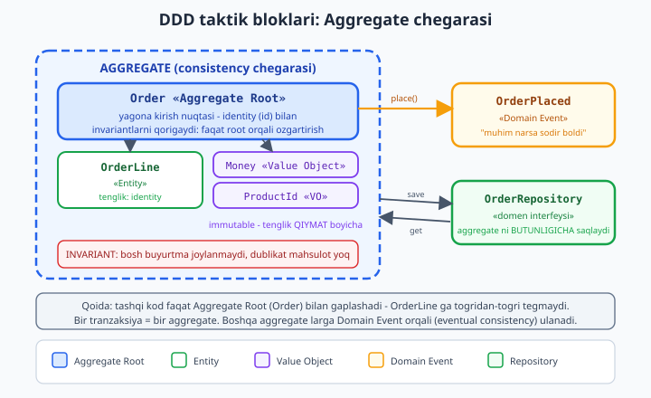
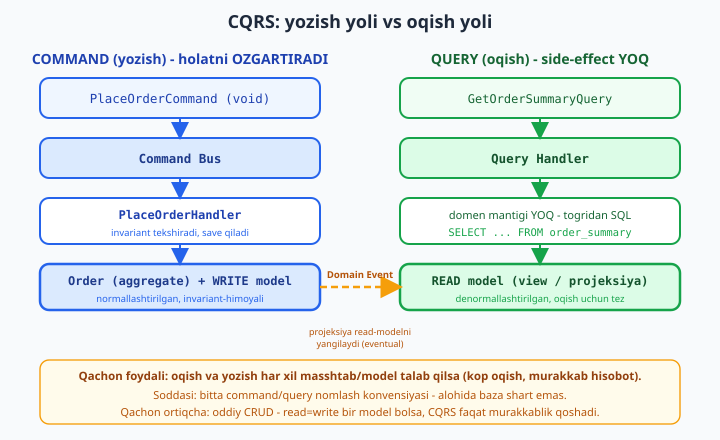

# 26 — Domain-Driven Design va CQRS

[⬅️ Oldingi: 25 — Hexagonal va Clean arxitektura](./25-hexagonal.md) · [🏠 README](./README.md) · [Keyingi: 27 — Performance va keshlash ➡️](./27-performance-keshlash.md)

> **Bu bobda:** oldingi bob (hexagonal/clean) *qatlamlarni* va *bog'liqlik yo'nalishini* ko'rsatdi — domen markazda, infratuzilma chetda. Lekin "domen markazda" degani *ichida nima bor*? Aynan shu bob domenni **modellashtirish** san'atini ochadi: **Domain-Driven Design (DDD)**. Avval eng muhim savol — DDD **qachon** kerak (murakkab biznes domeni) va **qachon ortiqcha** (oddiy CRUD). So'ng **taktik naqshlar**: **Entity** (identity bo'yicha tenglik) vs **Value Object** ([./06](./06-value-object.md) — qiymat bo'yicha tenglik, immutable), **Aggregate** va **Aggregate Root** (tranzaksiya/consistency chegarasi — invariantlar faqat root orqali himoyalanadi), **Domain Event** (`OrderPlaced` — domende muhim narsa sodir bo'ldi), **Domain Service**, **Factory**, **Repository** ([./21](./21-taktik-dizayn.md)). Keyin **strategik dizayn**: **Bounded Context**, **Ubiquitous Language** (kod = biznes atamasi), **Context Map**. Ikkinchi yarmi **CQRS**: **Command** (holatni o'zgartiradi, `void`) va **Query** (o'qiydi, side-effect yo'q) ni **ajratish** — qachon foydali, qachon ortiqcha; **Command/Message Bus** (Symfony Messenger — Composer bilan o'rnatilib, **in-memory transport** haqiqatan ishga tushirildi): command -> handler, domain event dispatch -> bir nechta handler; va **event sourcing** ga juda qisqa kirish. Amaliyot: kichik `Order + OrderLine` aggregate (4 ta invariant) + `OrderPlaced` domain event + command handler (in-memory bus) — **chindan `php` bilan ishga tushirilib** tasdiqlandi.

---

## DDD nima va qachon kerak

**Domain-Driven Design** — bu framework yoki kutubxona emas, balki **yondashuv**: murakkab biznes mantig'ini kodga shunday joylashtirish-ki, **kod biznes tilida gaplashsin**. Asoschisi Eric Evans (2003) ikki darajaga ajratdi:

- **Strategik dizayn** — *katta rasm*: tizimni qaysi mustaqil "kontekst"larga (bounded context) bo'lamiz, ular qanday muloqot qiladi.
- **Taktik dizayn** — *kod darajasi*: bitta kontekst ichida obyektlarni qanday nomlaymiz va joylashtiramiz (Entity, VO, Aggregate, Event...). 21-bob ([./21-taktik-dizayn.md](./21-taktik-dizayn.md)) bu blokning Repository/Service qismini berdi; bu bob qolganini yakunlaydi va strategik darajani qo'shadi.

DDD ning markaziy g'oyasi oddiy lekin kuchli: **biznes murakkabligi texnik murakkablikdan ko'ra qimmatroq**. Bank to'lov tizimida eng qiyin narsa MySQL emas — "qaysi sharoitda o'tkazma rad etiladi", "komissiya qanday hisoblanadi", "qaysi valyutalar konvertatsiya qilinadi" kabi **biznes qoidalari**. DDD shu qoidalarni kodning markaziga qo'yadi.

### Qachon DDD KERAK

DDD investitsiya — u boshlanish'ida sekinlashtiradi. Quyidagi belgilar bo'lsa, bu investitsiya o'zini oqlaydi:

| Belgi | Misol |
|-------|-------|
| **Murakkab biznes qoidalari** | sug'urta narxlash, kredit skoring, logistika marshrutlash |
| **Qoidalar tez-tez o'zgaradi** | har cho'akda yangi tarif, yangi chegirma siyosati |
| **Domen ekspertlari mavjud** | siz bilan birga ishlaydigan biznes-analitik / mutaxassis |
| **Uzoq umrli loyiha** | yillar davom etadigan, ko'p jamoa qo'shiladigan tizim |
| **"Universal til" muammosi** | dasturchi "user" deydi, biznes "mijoz", "abonent", "klient" deydi — chalkashlik |

### Qachon DDD ORTIQCHA

DDD **har joyda** ishlatilmaydi. Quyidagi hollarda u faqat ortiqcha murakkablik (over-engineering — buni 19-bobda tanqid qildik):

- **Oddiy CRUD** — admin paneli, kontent boshqaruvi. "Yaratish/o'qish/yangilash/o'chirish"dan boshqa qoidasi yo'q bo'lsa, Aggregate va Domain Event quruq seremoniya. Eloquent + kontroller yetarli.
- **Hisobot/analitika tizimi** — bu yerda asosiy ish *o'qish va agregatsiya*, biznes invariantlari emas. SQL va view'lar kifoya.
- **Prototip / MVP** — domen hali tushunilmagan, har kun o'zgaradi. DDD ni keyinroq, domen barqarorlashganda kiritasiz.
- **Kichik jamoa, qisqa muddat** — DDD ning umumiy tili va bloklari o'rganishni talab qiladi.

> **Ekspert qoidasi.** DDD ni **butun tizimga** emas, balki **murakkablik to'plangan yadro (core domain)ga** qo'llang. Bitta loyihada "to'lov" konteksti to'liq DDD bo'lishi, "bildirishnoma" konteksti esa oddiy CRUD bo'lishi mutlaqo normal. Buni strategik dizayn (bounded context) hal qiladi.

---

## Taktik naqsh 1: Entity vs Value Object

Bu farq DDD ning poydevori, shu sabab 21-bobdan qisqa takrorlaymiz va chuqurlashtiramiz.

- **Entity** — *kimligi (identity)* bor obyekt. Tenglik **id** bo'yicha: ikki `User` bir xil ism-emailga ega bo'lsa ham, id'lari har xil bo'lsa — bular ikki *boshqa* odam. Entity **hayot tsikli**ga ega: u yaratiladi, vaqt o'tib o'zgaradi (ismini almashtirsa ham *o'sha* odam), o'chiriladi.
- **Value Object (VO)** — *kimligi yo'q*, faqat *qiymat*. Tenglik **qiymat** bo'yicha: ikki `Money(100, 'UZS')` — bir xil. VO **immutable** (o'zgartirilmaydi) va **o'zini validatsiya qiladi** — yaroqsiz holatda umuman mavjud bo'la olmaydi.

```php
<?php
declare(strict_types=1);

// ENTITY: tenglik IDENTITY (id) boyicha. Holat ozgarishi mumkin.
final class Customer
{
    private string $name;

    public function __construct(
        public readonly string $id,   // identity - hech qachon ozgarmaydi
        string $name,
    ) {
        $this->name = $name;
    }

    public function rename(string $newName): void
    {
        $this->name = $newName;   // ozgardi, lekin BU O'SHA mijoz (id o'zgarmadi)
    }

    public function equals(self $other): bool
    {
        return $this->id === $other->id;   // FAQAT id muhim, ism emas
    }
}
```

```php
<?php
declare(strict_types=1);

// VALUE OBJECT: tenglik QIYMAT boyicha. Immutable, ozini validatsiya qiladi.
final class Money
{
    public function __construct(public readonly int $tiyin)
    {
        if ($tiyin < 0) {
            throw new InvalidArgumentException('Manfiy pul bolmaydi');
        }
    }

    // "ozgartirish" YANGI nusxa qaytaradi (with-style), eskisini buzmaydi
    public function add(Money $o): self { return new self($this->tiyin + $o->tiyin); }

    public function equals(self $o): bool { return $this->tiyin === $o->tiyin; }
}
```

Amaliy farq: VO ni baza qatoriga aylantirib qutqarish shart emas — u Entity'ning **bo'lagi** sifatida saqlanadi. Entity esa **identity** bilan qutqariladi va Repository orqali topiladi. 06-bob ([./06-value-object.md](./06-value-object.md)) VO ni to'liq, `bcmath` aniqligi bilan ochadi.

---

## Taktik naqsh 2: Aggregate va Aggregate Root

Bu DDD ning eng kuchli — va eng ko'p noto'g'ri tushuniladigan — bloki.

**Aggregate** — bir-biriga mahkam bog'liq obyektlar **klasteri**, ular **bitta birlik** sifatida o'zgaradi va saqlanadi. **Aggregate Root** — bu klasterning **yagona kirish nuqtasi**: tashqi kod faqat root bilan gaplashadi, ichki obyektlarga to'g'ridan-to'g'ri tegmaydi.

Nega bu kerak? **Invariantlar** (har doim to'g'ri bo'lishi shart bo'lgan qoidalar) uchun. Misol: "buyurtmaning umumiy summasi qatorlar summasiga teng bo'lishi kerak". Agar har kim `OrderLine`ni alohida o'zgartirsa, bu qoida buziladi. Aggregate Root esa **yagona darvoza** — barcha o'zgarish u orqali o'tadi, demak u qoidani himoya qila oladi.



### Ikki oltin qoida

1. **Faqat root orqali o'zgartirish.** `OrderLine`ga tashqaridan to'g'ridan-to'g'ri tegilmaydi — faqat `$order->addLine(...)` orqali. Root invariantni har o'zgarishda tekshiradi.
2. **Bir tranzaksiya = bir aggregate.** Aggregate — *consistency chegarasi*. Bitta tranzaksiyada faqat bitta aggregate to'liq o'zgaradi. Boshqa aggregate'larga ta'sir **Domain Event** orqali, *eventual consistency* bilan boradi (darhol emas, biroz keyin). Bu masshtablash va transaksiya hajmini kichik saqlash uchun.

> **Aggregate ni KICHIK saqlang.** Yangi DDD'chilarning eng katta xatosi — ulkan aggregate (masalan, `Customer` ichida barcha `Order`lar, ularning barcha `OrderLine`lari...). Bu butun obyekt grafini bitta tranzaksiyaga yuklaydi va konkurensiyani o'ldiradi. Qoida: aggregate ichiga faqat **birga o'zgarishi shart bo'lgan** narsalarni qo'ying. `Order` va uning `OrderLine`lari — ha; `Order` va `Customer` — yo'q, ular alohida aggregate (root'lar bir-biriga **id orqali** murojaat qiladi, obyekt-havola orqali emas).

Endi to'liq, ishlaydigan aggregate yozamiz.

---

## Amaliyot: `Order` aggregate + invariantlar

`Order` — aggregate root. Ichida `OrderLine` (entity-tabiatli element), VO sifatida `Money` va `ProductId`. To'rtta invariant himoyalanadi. Avval VO va Entity bloklari:

```php
<?php
declare(strict_types=1);

// ===== VALUE OBJECTS =====
final class Money
{
    public function __construct(public readonly int $tiyin)
    {
        if ($tiyin < 0) {
            throw new InvalidArgumentException('Manfiy pul bolmaydi');
        }
    }
    public function add(Money $o): self { return new self($this->tiyin + $o->tiyin); }
    public function format(): string { return number_format($this->tiyin / 100, 2) . ' som'; }
}

final class ProductId
{
    public function __construct(public readonly string $value)
    {
        if ($value === '') { throw new InvalidArgumentException('ProductId bosh bolmaydi'); }
    }
    public function equals(self $o): bool { return $this->value === $o->value; }
}

// ===== ENTITY (aggregate ichidagi element) =====
final class OrderLine
{
    public function __construct(
        public readonly ProductId $productId,
        public readonly int $quantity,
        public readonly Money $unitPrice,
    ) {
        if ($quantity < 1) { throw new InvalidArgumentException('Miqdor kamida 1 bolishi kerak'); }
    }
    public function subtotal(): Money { return new Money($this->unitPrice->tiyin * $this->quantity); }
}
```

Endi **Domain Event** — keyingi bo'limda batafsil, lekin aggregate uni chiqargani uchun shu yerda e'lon qilamiz:

```php
<?php
declare(strict_types=1);

interface DomainEvent { public function occurredOn(): DateTimeImmutable; }

// "Domende muhim narsa SODIR BOLDI" - otgan zamonda nomlanadi
final class OrderPlaced implements DomainEvent
{
    public function __construct(
        public readonly string $orderId,
        public readonly int $totalTiyin,
        public readonly int $lineCount,
        private DateTimeImmutable $at = new DateTimeImmutable(),
    ) {}
    public function occurredOn(): DateTimeImmutable { return $this->at; }
}
```

Va aggregate root'ning o'zi — diqqat invariantlarga:

```php
<?php
declare(strict_types=1);

final class Order
{
    private const int MAX_LINES = 20;

    /** @var OrderLine[] */
    private array $lines = [];
    private bool $placed = false;
    /** @var DomainEvent[] */
    private array $events = [];

    public function __construct(public readonly string $id) {}

    public function addLine(ProductId $productId, int $qty, Money $price): void
    {
        // INVARIANT 1: joylashtirilgan buyurtmani ozgartirib bolmaydi
        if ($this->placed) {
            throw new DomainException('Joylashtirilgan buyurtma ozgartirilmaydi');
        }
        // INVARIANT 2: bir mahsulot ikki marta qoshilmaydi
        foreach ($this->lines as $line) {
            if ($line->productId->equals($productId)) {
                throw new DomainException("Mahsulot allaqachon qoshilgan: {$productId->value}");
            }
        }
        // INVARIANT 3: qatorlar soni cheklangan
        if (count($this->lines) >= self::MAX_LINES) {
            throw new DomainException('Buyurtmada qatorlar juda kop');
        }
        $this->lines[] = new OrderLine($productId, $qty, $price);
    }

    public function total(): Money
    {
        return array_reduce(
            $this->lines,
            fn (Money $acc, OrderLine $l) => $acc->add($l->subtotal()),
            new Money(0),
        );
    }

    public function place(): void
    {
        // INVARIANT 4: bosh buyurtmani joylashtirib bolmaydi
        if ($this->lines === []) {
            throw new DomainException('Bosh buyurtmani joylashtirib bolmaydi');
        }
        if ($this->placed) {
            throw new DomainException('Buyurtma allaqachon joylashtirilgan');
        }
        $this->placed = true;
        // Domen hodisasini YOZIB QOYAMIZ (hali dispatch qilmaymiz - bu muhim!)
        $this->events[] = new OrderPlaced($this->id, $this->total()->tiyin, count($this->lines));
    }

    /** @return DomainEvent[] Hodisalarni "chiqarib olib" royxatni tozalaydi */
    public function releaseEvents(): array
    {
        $events = $this->events;
        $this->events = [];
        return $events;
    }

    public function lineCount(): int { return count($this->lines); }
}
```

Diqqat qiling: `place()` hodisani **darhol dispatch qilmaydi** — uni ichki `$events` ro'yxatiga **yozib qo'yadi**. Nega? Chunki aggregate hali *saqlanmagan*. Agar baza yozishda yiqilsa, lekin email allaqachon yuborilgan bo'lsa — falokat. To'g'ri tartib: **saqla, keyin dispatch qil** (buni handler hal qiladi).

---

## Taktik naqsh 3: Domain Event

**Domain Event** — domende *biznes uchun muhim* narsa sodir bo'lganini bildiradi: `OrderPlaced`, `PaymentReceived`, `UserRegistered`. Qoidalar:

- **O'tgan zamonda** nomlanadi (`...Placed`, `...Received`) — bu *fakt*, allaqachon sodir bo'lgan.
- **Immutable** — o'tmishni o'zgartirib bo'lmaydi.
- Faqat **kerakli ma'lumotni** olib yuradi (butun aggregate emas, balki id va asosiy qiymatlar).

Domain Event aggregate'larni **bo'shashtirib bog'laydi** (decoupling): `Order` aggregate'i "email yuborilsin"ni *bilmaydi* — u faqat `OrderPlaced` faktini e'lon qiladi. Kim eshitishini va nima qilishini **listener**lar hal qiladi. Bu ochiq/yopiq prinsipi (OCP): yangi reaksiya qo'shish uchun aggregate'ni o'zgartirmaysiz.

```php
<?php
declare(strict_types=1);

// Oddiy in-memory event bus: hodisa turiga listenerlar obuna boladi
final class EventBus
{
    /** @var array<class-string, callable[]> */
    private array $listeners = [];

    public function subscribe(string $eventClass, callable $listener): void
    {
        $this->listeners[$eventClass][] = $listener;
    }

    public function publish(DomainEvent $event): void
    {
        foreach ($this->listeners[$event::class] ?? [] as $listener) {
            $listener($event);   // har bir obunachi mustaqil ishlaydi
        }
    }
}
```

---

## CQRS: Command va Query ni ajratish

**CQRS** = **C**ommand **Q**uery **R**esponsibility **S**egregation. Bertrand Meyerning eski "Command-Query Separation" prinsipidan o'sgan:

- **Command** — holatni **o'zgartiradi**, hech narsa **qaytarmaydi** (`void`). Misol: `PlaceOrderCommand`, `CancelOrderCommand`. "Imperativ" — *biror narsa qil*.
- **Query** — holatni **o'qiydi**, hech narsani **o'zgartirmaydi** (side-effect yo'q). Misol: `GetOrderSummaryQuery`. *Biror narsa so'ra*.

Bitta metod ikkalasini qilmasin — bu prinsip. CQRS esa buni **arxitektura darajasiga** ko'taradi: yozish yo'li va o'qish yo'li **alohida model**, ba'zan hatto **alohida baza**.



### Nega ajratish foydali

Yozish modeli (write-model) va o'qish modeli (read-model) ehtiyojlari **bir-biriga zid**:

| | Write (Command) | Read (Query) |
|--|-----------------|--------------|
| Maqsad | invariant himoyasi, to'g'rilik | tezlik, qulay format |
| Shakl | normallashtirilgan, aggregate | denormallashtirilgan, view |
| Optimallashtirish | tranzaksiya, qulflar | indeks, kesh, replikatsiya |
| Misol | `Order` aggregate + OrderLine | bitta `order_summary` qatori |

Aggregate o'qish uchun noqulay: bitta sahifa uchun 5 ta aggregate'ni yuklash, JOIN qilish kerak. Read-model esa shu sahifa uchun **oldindan tayyorlangan** bitta qatordan o'qiydi — tez. Write-modeldan read-modelga ma'lumot **Domain Event** orqali oqadi (projeksiya — yozishdan keyin read jadvalni yangilaydi).

### Qachon foydali / qachon ortiqcha

- **Foydali**: o'qish va yozish **har xil masshtab** talab qilganda (juda ko'p o'qish, kam yozish — ijtimoiy tarmoq lentasi); murakkab hisobotlar; o'qish modeli yozish modelidan **tubdan farq** qilganda.
- **Ortiqcha**: oddiy CRUD — o'qish=yozish bir model bo'lsa, CQRS faqat ikki barobar kod va sinxronizatsiya muammosini qo'shadi.

> **Yengil CQRS.** Alohida baza shart emas! Eng arzon foydali shakli — shunchaki **nomlash konvensiyasi**: command'lar `PlaceOrder`, query'lar `GetOrderSummary` deb alohida sinflar bo'lib, bitta bus orqali o'tadi. Bu "yengil CQRS" — ko'p loyiha uchun yetarli. Alohida read-baza faqat haqiqiy masshtab muammosida.

Quyida query yo'li to'liq ishlaydigan kod (read-model — sqlite'da `order_summary` jadvali, domen mantig'isiz, to'g'ridan-to'g'ri SQL):

```php
<?php
declare(strict_types=1);

final readonly class GetOrderSummary
{
    public function __construct(public string $orderId) {}
}

// Query natijasi - oddiy oqish DTO si (aggregate EMAS)
final readonly class OrderSummaryView
{
    public function __construct(
        public string $orderId,
        public string $status,
        public int $totalTiyin,
        public int $lineCount,
    ) {}
}

final class GetOrderSummaryHandler
{
    public function __construct(private PDO $pdo) {}

    public function __invoke(GetOrderSummary $q): ?OrderSummaryView
    {
        // DOMEN MANTIGI YOQ - togridan read-modeldan oqiydi
        $stmt = $this->pdo->prepare(
            'SELECT order_id, status, total_tiyin, line_count
             FROM order_summary WHERE order_id = ?'
        );
        $stmt->execute([$q->orderId]);
        $row = $stmt->fetch(PDO::FETCH_ASSOC);
        return $row === false ? null : new OrderSummaryView(
            $row['order_id'], $row['status'], (int) $row['total_tiyin'], (int) $row['line_count'],
        );
    }
}
```

Sqlite yadroda mavjud (Composer kerak emas), shu sabab buni `php` bilan ishga tushirdik. Chiqish:

```text
Order: ORD-1001
Holat: placed
Jami: 335,000.00 som
Qatorlar: 2
Topilmagan query natijasi: null
```

---

## Command Bus: command -> handler (in-memory)

**Command Bus** — command'ni mos **handler**ga yetkazadigan vositachi. Nega oddiy `new Handler()->handle()` o'rniga bus? Chunki bus **markazlashgan nuqta** beradi: u yerda **middleware** (tranzaksiya, logging, validatsiya) qo'shasiz, command -> handler bog'lanishini bir joyda boshqarasiz. Har bir command'ning **aniq bitta** handler'i bor (query'da ham shunday); event'da esa **ko'p** listener bo'lishi mumkin — bu asosiy farq.

Avval minimal o'z busimiz (g'oyani ko'rsatish uchun, ~15 qator):

```php
<?php
declare(strict_types=1);

final class CommandBus
{
    /** @var array<class-string, callable> */
    private array $handlers = [];

    public function register(string $commandClass, callable $handler): void
    {
        $this->handlers[$commandClass] = $handler;
    }

    public function dispatch(object $command): void
    {
        $handler = $this->handlers[$command::class]
            ?? throw new RuntimeException('Handler topilmadi: ' . $command::class);
        $handler($command);
    }
}
```

Handler aggregate'ni yaratadi, invariantlarni *aggregate o'zi* tekshiradi, saqlaydi va **faqat saqlangach** hodisalarni dispatch qiladi:

```php
<?php
declare(strict_types=1);

final readonly class PlaceOrderCommand
{
    /** @param array<array{product:string, qty:int, price:int}> $items */
    public function __construct(public string $orderId, public array $items) {}
}

final class PlaceOrderHandler
{
    public function __construct(
        private OrderRepository $orders,
        private EventBus $events,
    ) {}

    public function __invoke(PlaceOrderCommand $cmd): void
    {
        $order = new Order($cmd->orderId);
        foreach ($cmd->items as $item) {
            $order->addLine(new ProductId($item['product']), $item['qty'], new Money($item['price']));
        }
        $order->place();                 // invariantlar shu yerda himoyalanadi
        $this->orders->save($order);     // aggregate butunligicha saqlanadi

        // TARTIB MUHIM: hodisalar faqat MUVAFFAQIYATLI saqlangach dispatch qilinadi
        foreach ($order->releaseEvents() as $event) {
            $this->events->publish($event);
        }
    }
}
```

`OrderRepository` — domen interfeysi (21-bobdagidek); bu yerda in-memory implementatsiya. To'liq dastur (wiring + ishlatish) `order_demo.php` da **ishga tushirildi**. Natija:

```text
1) Togri buyurtma joylash:
  [EVENT] OrderPlaced: #ORD-1001, 2 qator, jami 335,000.00 som
  [EVENT] -> mijozga tasdiq emaili yuborildi
  Saqlandi: ORD-1001, jami 335,000.00 som, qatorlar: 2

2) Invariant buzilishi (bosh buyurtma):
  Rad etildi: Bosh buyurtmani joylashtirib bolmaydi

3) Invariant buzilishi (dublikat mahsulot):
  Rad etildi: Mahsulot allaqachon qoshilgan: KITOB-PHP
```

E'tibor bering: invariant buzilganda command **rad etiladi** va `save` ham, event ham bo'lmaydi — aggregate hech qachon yaroqsiz holatda saqlanmaydi.

---

## Symfony Messenger: production message bus

O'z busimiz g'oyani ko'rsatdi, lekin production'da **tekshirilgan, middleware'li** bus kerak. PHP'da standart — **Symfony Messenger**. U command bus, query bus va event bus uchun bir xil mexanizm beradi, **in-memory** (sinxron) va **async transport** (queue) ni qo'llab-quvvatlaydi.

O'rnatamiz (bu bobni yozishda haqiqatan o'rnatildi):

```bash
composer require symfony/messenger
```

Quyidagi misolda command bus (handler bittadan) va event bus (handler ko'pdan) qurildi va **ishga tushirildi**:

```php
<?php
declare(strict_types=1);

require __DIR__ . '/vendor/autoload.php';

use Symfony\Component\Messenger\MessageBus;
use Symfony\Component\Messenger\Handler\HandlersLocator;
use Symfony\Component\Messenger\Middleware\HandleMessageMiddleware;

final readonly class RegisterUser { public function __construct(public string $email) {} }
final readonly class UserRegistered { public function __construct(public string $email) {} }

final class RegisterUserHandler
{
    public function __construct(private MessageBus $eventBus) {}

    public function __invoke(RegisterUser $cmd): void
    {
        echo "  [HANDLER] Foydalanuvchi royxatdan otkazildi: {$cmd->email}\n";
        // Handler ichida domen hodisasini event bus orqali e'lon qilamiz
        $this->eventBus->dispatch(new UserRegistered($cmd->email));
    }
}

// EVENT bir nechta handlerga boradi (command esa - bittaga)
final class SendWelcomeEmail
{
    public function __invoke(UserRegistered $e): void { echo "  [EVENT] Xush kelibsiz emaili -> {$e->email}\n"; }
}
final class GrantWelcomeBonus
{
    public function __invoke(UserRegistered $e): void { echo "  [EVENT] 10000 som bonus berildi -> {$e->email}\n"; }
}

// EVENT BUS: bitta xabar turi -> KO'P handler
$eventBus = new MessageBus([
    new HandleMessageMiddleware(new HandlersLocator([
        UserRegistered::class => [new SendWelcomeEmail(), new GrantWelcomeBonus()],
    ])),
]);

// COMMAND BUS: bitta xabar turi -> BITTA handler
$commandBus = new MessageBus([
    new HandleMessageMiddleware(new HandlersLocator([
        RegisterUser::class => [new RegisterUserHandler($eventBus)],
    ])),
]);

$commandBus->dispatch(new RegisterUser('ali@example.uz'));
```

Sinxron qism chiqishi (haqiqiy run):

```text
1) Sinxron command -> handler -> event -> 2 ta event handler:
  [HANDLER] Foydalanuvchi royxatdan otkazildi: ali@example.uz
  [EVENT] Xush kelibsiz emaili -> ali@example.uz
  [EVENT] 10000 som bonus berildi -> ali@example.uz
```

### Async: in-memory transport (queue simulyatsiyasi)

Ba'zi vazifalar (email, hisobot generatsiyasi) sekin — ularni **navbatga** (queue) tashlab, javobni tez qaytarish kerak. Messenger buni **transport** orqali qiladi: command bazaga/Redis'ga/RabbitMQ'ga yoziladi, **worker** uni keyin qayta ishlaydi. Testlash uchun **`InMemoryTransport`** bor — u xabarni xotirada saqlaydi (haqiqiy server kerak emas, biz buni **ishga tushirdik**):

```php
<?php
declare(strict_types=1);

use Symfony\Component\Messenger\Transport\InMemory\InMemoryTransport;

$transport = new InMemoryTransport();
// SendMessageMiddleware xabarni transportga yozadi va to'xtaydi (handler darhol ishlamaydi)
// ... (to'liq wiring messenger_demo.php da)

$asyncBus->dispatch(new RegisterUser('vali@example.uz'));
echo "Navbatdagi xabarlar: " . count($transport->getSent()) . "\n";   // 1 - handler hali ishlamadi

// WORKER navbatni qayta ishlaydi (production'da `messenger:consume` buyrug'i):
foreach ($transport->get() as $envelope) {
    (new RegisterUserHandler($eventBus))($envelope->getMessage());
    $transport->ack($envelope);
}
```

Async qism chiqishi (haqiqiy run):

```text
2) Asinxron: command transportga yuboriladi (hali ishlatilmaydi):
  Navbatdagi xabarlar soni: 1 (handler hali ishlamadi)

3) Worker navbatni qayta ishlaydi (consume):
  [HANDLER] Foydalanuvchi royxatdan otkazildi: vali@example.uz
  [EVENT] Xush kelibsiz emaili -> vali@example.uz
  [EVENT] 10000 som bonus berildi -> vali@example.uz
  Navbat tozalandi.
```

Production'da worker `php bin/console messenger:consume async` bilan doimiy ishlaydi. Real broker (RabbitMQ/Redis/Doctrine) sozlamasi konfiguratsiya masalasi — **muhitingizda alohida transport DSN (`MESSENGER_TRANSPORT_DSN`) va broker server kerak**; bu yerda `InMemoryTransport` bilan mexanizmni haqiqatan tasdiqladik.

---

## Taktik naqsh 4: Domain Service va Factory

**Domain Service** — biznes mantig'i bironta Entity'ga ham, VO'ga ham *tabiiy* sig'maganda. Bu bir nechta domen obyekti **ustidagi** "fe'l". Klassik misol: ikki hisob orasida pul o'tkazish — bu na `Account`ning, na `Money`ning yagona ishi (21-bobda `TransferService` ko'rsatildi). Qoida: domain service **stateless** bo'ladi va faqat domen obyektlari bilan ishlaydi (infratuzilmasiz — PDO yo'q, HTTP yo'q). Application service'dan farqi: application service *use-case'ni dirijyorlik qiladi* (repo'dan oladi, tranzaksiya ochadi), domain service esa *toza biznes qoidasi*.

**Factory** — murakkab aggregate yaratish mantig'i konstruktordan kattalashganda. Agar aggregate to'g'ri yaratilishi uchun bir nechta qadam yoki tashqi qiymat (masalan, ketma-ketlik raqami) kerak bo'lsa, buni alohida factory'ga chiqaramiz:

```php
<?php
declare(strict_types=1);

// FACTORY: murakkab yaratish mantigini bir joyga jamlaydi.
// Aggregate konstruktorini "toza" saqlaydi, validatsiyani markazlashtiradi.
final class OrderFactory
{
    public function __construct(private OrderNumberGenerator $numbers) {}

    /** @param array<array{product:string, qty:int, price:int}> $items */
    public function createFrom(array $items): Order
    {
        $order = new Order($this->numbers->next());   // tashqi qiymat (ketma-ketlik)
        foreach ($items as $i) {
            $order->addLine(new ProductId($i['product']), $i['qty'], new Money($i['price']));
        }
        return $order;
    }
}

interface OrderNumberGenerator { public function next(): string; }
```

Factory aggregate'ning **invariantlarini buzmaydi** — u faqat to'g'ri yo'l bilan yaratishni osonlashtiradi. `OrderFactory` baribir `addLine`/`place` orqali ishlaydi.

---

## Strategik dizayn: Bounded Context va Ubiquitous Language

Taktik bloklar bitta model *ichida* ishlaydi. Lekin katta tizimda **bitta** model bo'lmaydi — bo'lishi ham kerak emas.

**Ubiquitous Language (umumiy til)** — jamoa (dasturchilar + biznes ekspertlari) ishlatadigan **yagona, aniq** atamalar to'plami. Asosiy g'oya: **kod biznes tilida gaplashsin**. Agar biznes "Buyurtma joylashtirildi" desa, kodda `$order->place()` va `OrderPlaced` bo'lsin — `$order->setStatus(2)` emas. Til kod va suhbatda **bir xil**.

**Bounded Context (chegaralangan kontekst)** — bu tilning **chegarasi**. Muhim haqiqat: bitta so'z turli kontekstda **turli narsani** anglatadi:

| So'z | "Sotuvlar" kontekstida | "Yetkazib berish" kontekstida |
|------|------------------------|-------------------------------|
| **Mijoz** | chegirma, sodiqlik balli, tarix | manzil, telefon, qabul vaqti |
| **Mahsulot** | narx, kategoriya, reyting | og'irlik, o'lcham, mo'rtlik |

Bitta ulkan "Mijoz" sinfini *barcha* kontekst uchun qurish — falokat (god object). DDD aytadi: **har kontekstning o'z modeli bo'lsin**. "Sotuvlar"dagi `Customer` va "Yetkazish"dagi `Customer` — **alohida** sinflar, faqat `customerId` orqali bog'langan.

**Context Map** — kontekstlar **bir-biriga qanday ulanishini** ko'rsatadigan xarita. Asosiy munosabatlar:

- **Shared Kernel** — ikki kontekst kichik umumiy modelni baham ko'radi (ehtiyotkorlik bilan).
- **Customer/Supplier** — biri (upstream) ikkinchisiga (downstream) ma'lumot beradi; downstream upstream'ga bog'liq.
- **Anti-Corruption Layer (ACL)** — sizning toza modelingizni tashqi/eski tizimning chalkash modelidan **himoya qiluvchi tarjima qatlami**. Tashqi API'ning g'alati formatini o'z domen tiliga shu yerda o'giramiz (bu hexagonal'dagi adapter g'oyasiga yaqin — [./25-hexagonal.md](./25-hexagonal.md)).

Texnik jihatdan har bounded context — ko'pincha alohida modul, paket yoki hatto mikroservis. Kontekstlar bir-biri bilan **Domain Event** (yoki API) orqali gaplashadi, bir-birining ichki modeliga tegmaydi. Aynan shu CQRS va event-driven arxitekturani strategik darajada bog'laydi.

---

## Event Sourcing: juda qisqa kirish

Odatdagi yondashuvda biz **joriy holatni** saqlaymiz: `accounts` jadvalida `balance = 750`. **Event Sourcing** esa boshqacha falsafa: **holatni emas, balki uni keltirib chiqargan hodisalar ketma-ketligini saqlaymiz**. Balans `750` emas, balki `Deposited(1000)`, `Withdrawn(300)`, `Deposited(50)` — joriy holat shu hodisalar yig'indisidan **qayta tiklanadi**.

```php
<?php
declare(strict_types=1);

interface Event {}
final readonly class Deposited implements Event { public function __construct(public int $amount) {} }
final readonly class Withdrawn implements Event { public function __construct(public int $amount) {} }

final class BankAccount
{
    private int $balance = 0;

    /** @param Event[] $history Holat FAQAT hodisalardan qayta tiklanadi */
    public static function fromHistory(array $history): self
    {
        $self = new self();
        foreach ($history as $event) {
            $self->apply($event);   // hodisalarni qaytadan "ijro" qilamiz
        }
        return $self;
    }

    private function apply(Event $event): void
    {
        match (true) {
            $event instanceof Deposited => $this->balance += $event->amount,
            $event instanceof Withdrawn => $this->balance -= $event->amount,
        };
    }

    public function balance(): int { return $this->balance; }
}
```

`eventsourcing_demo.php` ishga tushirildi — uchta hodisadan balans `750` qayta tiklandi va joriy holat bilan **mos keldi**.

### Qachon kerak / qachon kerakmas

- **Kerak**: to'liq **audit izi** majburiy bo'lsa (moliya, sog'liq); "vaqtda orqaga qaytish" (har lahzadagi holatni bilish) kerak bo'lsa; biznes hodisalarning o'zi qimmatli bo'lsa.
- **Kerakmas**: oddiy domenlarning aksariyatida. Event sourcing katta murakkablik qo'shadi — versiyalash, snapshot, projeksiya, "eski hodisa formatini" qo'llab-quvvatlash. **Domain Event'ni ishlatish event sourcing'ni TALAB QILMAYDI** — bu eng ko'p chalkashlik. Domain Event'ni odatdagi (holat saqlaydigan) tizimda ham bemalol ishlatasiz; event sourcing — alohida, kattaroq qadam.

> **Ekspert maslahati.** Event sourcing'ni "zo'r texnologiya" deb emas, balki *domen talab qilganda* tanlang. Audit va vaqt-sayohati real ehtiyoj bo'lmasa, oddiy holat-saqlash + Domain Event sizga DDD ning 90% foydasini murakkablikning 20% bilan beradi.

---

## Hammasini bir joyga: oqim

To'liq command yo'lining bosqichlari:

1. Kontroller HTTP so'rovdan `PlaceOrderCommand` yasaydi (REST — [./01-rest-api.md](./01-rest-api.md); avtorizatsiya — [./03-authorization-rbac.md](./03-authorization-rbac.md), [./04-jwt-auth.md](./04-jwt-auth.md)).
2. Command bus'ga `dispatch` qilinadi; middleware (tranzaksiya, log) o'tadi.
3. `PlaceOrderHandler` aggregate'ni quradi/o'zgartiradi — **invariantlar himoyalanadi**.
4. Repository ([./21-taktik-dizayn.md](./21-taktik-dizayn.md)) aggregate'ni **butunligicha** saqlaydi.
5. Saqlangach, `OrderPlaced` event dispatch qilinadi; listener'lar reaksiya beradi (email, read-model projeksiyasi).
6. Query yo'li alohida: `GetOrderSummaryHandler` read-modeldan to'g'ridan-to'g'ri o'qiydi.

Bu Wave 5 bloklari bir-biriga tayanadi: DI konteyner ([./13-di-konteyner.md](./13-di-konteyner.md)) bus va handler'larni ulaydi; mini-framework ([./15-mini-framework.md](./15-mini-framework.md)) HTTP qatlamni beradi; testlash ([./22-phpunit-chuqur.md](./22-phpunit-chuqur.md)) — in-memory repo va bus tufayli aggregate'lar va handler'lar **bazasiz** test qilinadi; static analysis ([./24-static-analysis.md](./24-static-analysis.md)) — `@template`/generics bilan bus tip-xavfsizligini oshiradi. CI/CD va deploy mexanikasi uchun Git kitobiga qarang ([../git-github/README.md](../git-github/README.md)).

---

## Xulosa

- **DDD** — murakkab **biznes** domeni uchun; oddiy CRUD'da ortiqcha. Uni butun tizimga emas, **core domain'ga** qo'llang.
- **Entity** identity bo'yicha teng (hayot tsikli bor); **Value Object** qiymat bo'yicha teng (immutable, o'zini validatsiya qiladi).
- **Aggregate Root** — consistency chegarasi va yagona darvoza: faqat root orqali o'zgartirish, invariantlar root'da. Aggregate'ni **kichik** saqlang; bir tranzaksiya = bir aggregate.
- **Domain Event** — o'tgan zamonda nomlangan biznes fakti; aggregate'larni bo'shashtirib bog'laydi. **Saqla, keyin dispatch qil**.
- **CQRS** — Command (o'zgartiradi, `void`) va Query (o'qiydi, side-effect yo'q) ni ajratish. Foydali — har xil o'qish/yozish masshtabida; ortiqcha — oddiy CRUD'da. Yengil shakli = nomlash konvensiyasi.
- **Command bus** (Symfony Messenger): command -> aniq bitta handler; event -> ko'p listener. In-memory transport bilan async navbat — haqiqatan ishlaydi.
- **Strategik dizayn**: Ubiquitous Language (kod=biznes tili), Bounded Context (model chegarasi), Context Map (ulanishlar, ACL).
- **Event Sourcing** — holat o'rniga hodisalar oqimini saqlash; audit/vaqt-sayohati kerak bo'lganda. Domain Event'ni ishlatish event sourcing'ni *talab qilmaydi*.

---

## Mashqlar

### Oson

1. **CQS sinovi.** Quyidagi metodlardan qaysilari Command-Query Separation prinsipini buzadi (ya'ni ham o'zgartiradi, ham qaytaradi)? `array_pop($a)`, `count($a)`, `$stack->push($x)` (yangi hajmni qaytaradi), `$user->getName()`.

2. **Entity yoki VO?** Quyidagilarni Entity yoki Value Object deb tasniflang va sababini ayting: `BankAccount`, `IpAddress`, `Invoice`, `DateRange`, `Employee`, `PhoneNumber`.

3. **Event nomi.** Quyidagi command'larga mos Domain Event nomini (o'tgan zamonda) bering: `CancelOrder`, `ChangeEmail`, `ShipParcel`.

### O'rta

4. **Yangi invariant.** `Order` aggregate'iga beshinchi invariant qo'shing: buyurtmaning umumiy summasi **1 000 000 tiyin (10 000 so'm)dan kam** bo'lsa, `place()` rad etilsin (minimal buyurtma summasi). `php` bilan tekshiring.

5. **Ikkinchi listener.** Mavjud `EventBus`ga `OrderPlaced` uchun **ikkinchi** listener qo'shing: u omborxona (inventar)dan mahsulotni "rezerv qildi" deb chop etsin. Bitta hodisaga ikki listener mustaqil ishlashini ko'rsating.

6. **Query qo'shish.** `GetOrderSummary` yoniga `ListPlacedOrders` query'ini yozing — `order_summary` jadvalidan `status = 'placed'` bo'lganlarni qaytarsin. Domen mantig'isiz, to'g'ridan-to'g'ri SQL.

### Qiyin

7. **CancelOrder command.** To'liq command yo'lini qo'shing: `CancelOrderCommand` -> `CancelOrderHandler` -> aggregate'da `cancel()` metodi (invariant: faqat joylashtirilgan, hali bekor qilinmagan buyurtma bekor qilinadi) -> `OrderCancelled` event. Repository'dan aggregate'ni `get()` bilan oling, o'zgartiring, qayta `save` qiling. `php` bilan ishga tushiring.

8. **Anti-Corruption Layer.** Tashqi to'lov-shlyuz API quyidagi chalkash JSON qaytaradi: `{"txn_st": "OK", "amt_cents": 50000, "ccy": "UZS"}`. ACL adapter yozing: bu formatni sizning toza domen `PaymentResult` VO'ngizga (`bool $successful`, `Money $amount`) tarjima qilsin. Domeningiz tashqi format'ni **bilmasin**.

---

<details markdown="1"><summary>Yechim — 1</summary>

CQS ni **buzadiganlar** — ham o'zgartiradi, ham qaytaradi:

- `array_pop($a)` — **buzadi**: massivni o'zgartiradi *va* o'chirilgan elementni qaytaradi. (PHP'ning ko'p o'rnatilgan funksiyasi CQS'ga amal qilmaydi — bu tarixiy.)
- `$stack->push($x)` (yangi hajmni qaytaradi) — **buzadi**: holatni o'zgartiradi *va* qiymat qaytaradi. Toza CQS'da `push` `void` bo'lishi kerak.

**Buzmaydiganlar**:

- `count($a)` — toza **query**: faqat o'qiydi, qaytaradi.
- `$user->getName()` — toza **query**: o'zgartirmaydi.

Tamoyil: command `void`, query side-effect'siz. Bu CQRS'ning asosidir.

</details>

<details markdown="1"><summary>Yechim — 2</summary>

- **`BankAccount`** — **Entity**. Ikki hisob bir xil balansga ega bo'lsa ham, ular boshqa hisob (raqami har xil). Identity (hisob raqami) muhim, holat (balans) o'zgaradi.
- **`IpAddress`** — **Value Object**. `192.168.0.1` — bu *qiymat*; ikki bir xil IP teng. Immutable.
- **`Invoice`** — **Entity**. Hisob-faktura raqami bilan aniqlanadi, holati o'zgaradi (to'landi/to'lanmadi).
- **`DateRange`** — **Value Object**. Boshlanish+tugash sanasi — qiymat; ikki bir xil oraliq teng.
- **`Employee`** — **Entity**. Xodim identity (id/tabel raqami) bilan; ismi o'zgarsa ham o'sha xodim.
- **`PhoneNumber`** — **Value Object**. Raqam — qiymat; o'zini validatsiya qiladi (format), immutable.

Qoidaga e'tibor: agar "ikkita bir xil qiymatli narsa **boshqa** narsami?" degan savolga "ha" desangiz — Entity; "yo'q, ular bir xil" desangiz — Value Object.

</details>

<details markdown="1"><summary>Yechim — 3</summary>

Domain Event nomi — **o'tgan zamonda**, *fakt* sifatida:

- `CancelOrder` -> **`OrderCancelled`**
- `ChangeEmail` -> **`EmailChanged`** (yoki aniqroq: `CustomerEmailChanged`)
- `ShipParcel` -> **`ParcelShipped`**

Diqqat: command — *buyruq* (hozirgi/buyruq zamoni, bo'lishi mumkin yoki rad etiladi), event — *sodir bo'lgan fakt* (o'tgan zamon, o'zgartirib bo'lmaydi).

</details>

<details markdown="1"><summary>Yechim — 4</summary>

`place()` metodiga yangi tekshiruv qo'shamiz:

```php
// Order aggregate sinfi ichidagi metod:
public function place(): void
{
    if ($this->lines === []) {
        throw new DomainException('Bosh buyurtmani joylashtirib bolmaydi');
    }
    // INVARIANT 5: minimal buyurtma summasi
    if ($this->total()->tiyin < 1_000_000) {
        throw new DomainException('Minimal buyurtma summasi 10 000 som');
    }
    if ($this->placed) {
        throw new DomainException('Buyurtma allaqachon joylashtirilgan');
    }
    $this->placed = true;
    $this->events[] = new OrderPlaced($this->id, $this->total()->tiyin, count($this->lines));
}
```

Sinov:

```php
$order = new Order('ORD-X');
$order->addLine(new ProductId('ARZON'), 1, new Money(500_000));   // 5000 som - kam
try {
    $order->place();
} catch (DomainException $e) {
    echo $e->getMessage() . "\n";   // "Minimal buyurtma summasi 10 000 som"
}
```

Diqqat: invariant **aggregate ichida** — handler yoki kontrollerda emas. Shu sabab qaysi yo'l bilan kelmasin, qoida buzilmaydi.

</details>

<details markdown="1"><summary>Yechim — 5</summary>

```php
<?php
declare(strict_types=1);

// Birinchi listener (mavjud): email
$eventBus->subscribe(OrderPlaced::class, function (OrderPlaced $e): void {
    echo "  [EVENT-1] Tasdiq emaili -> #{$e->orderId}\n";
});

// IKKINCHI listener: inventar rezervi (mustaqil ishlaydi)
$eventBus->subscribe(OrderPlaced::class, function (OrderPlaced $e): void {
    echo "  [EVENT-2] Omborda {$e->lineCount} mahsulot rezerv qilindi -> #{$e->orderId}\n";
});

// Bitta hodisa publish qilinsa, IKKALA listener ham chaqiriladi:
$eventBus->publish(new OrderPlaced('ORD-1001', 33500000, 2));
```

Chiqish:

```text
  [EVENT-1] Tasdiq emaili -> #ORD-1001
  [EVENT-2] Omborda 2 mahsulot rezerv qilindi -> #ORD-1001
```

Bu Domain Event'ning kuchi: `Order` aggregate'i bu ikki reaksiyani **bilmaydi**. Yangi reaksiya qo'shish uchun aggregate'ga tegmaysiz — faqat yangi listener obuna qilasiz (OCP).

</details>

<details markdown="1"><summary>Yechim — 6</summary>

```php
<?php
declare(strict_types=1);

final readonly class ListPlacedOrders {}   // parametrsiz query

final class ListPlacedOrdersHandler
{
    public function __construct(private PDO $pdo) {}

    /** @return OrderSummaryView[] */
    public function __invoke(ListPlacedOrders $q): array
    {
        $rows = $this->pdo
            ->query("SELECT order_id, status, total_tiyin, line_count
                     FROM order_summary WHERE status = 'placed'
                     ORDER BY order_id")
            ->fetchAll(PDO::FETCH_ASSOC);

        return array_map(
            fn (array $r) => new OrderSummaryView(
                $r['order_id'], $r['status'], (int) $r['total_tiyin'], (int) $r['line_count'],
            ),
            $rows,
        );
    }
}
```

Query handler'da **biznes mantig'i yo'q** — faqat o'qish va DTO'ga aylantirish. Bu CQRS query yo'lining mohiyati: tez, oddiy, domen qoidalaridan xoli.

</details>

<details markdown="1"><summary>Yechim — 7</summary>

Avval aggregate'ga `cancel()` qo'shamiz (yangi holat va invariant):

```php
// Order ichiga:
private bool $cancelled = false;

public function cancel(): void
{
    // INVARIANT: faqat joylashtirilgan, hali bekor qilinmagan buyurtma bekor qilinadi
    if (!$this->placed) {
        throw new DomainException('Joylashtirilmagan buyurtmani bekor qilib bolmaydi');
    }
    if ($this->cancelled) {
        throw new DomainException('Buyurtma allaqachon bekor qilingan');
    }
    $this->cancelled = true;
    $this->events[] = new OrderCancelled($this->id);
}
```

Event va handler:

```php
<?php
declare(strict_types=1);

final class OrderCancelled implements DomainEvent
{
    public function __construct(
        public readonly string $orderId,
        private DateTimeImmutable $at = new DateTimeImmutable(),
    ) {}
    public function occurredOn(): DateTimeImmutable { return $this->at; }
}

final readonly class CancelOrderCommand
{
    public function __construct(public string $orderId) {}
}

final class CancelOrderHandler
{
    public function __construct(
        private OrderRepository $orders,
        private EventBus $events,
    ) {}

    public function __invoke(CancelOrderCommand $cmd): void
    {
        // Mavjud aggregate'ni TOPAMIZ (yangi yaratmaymiz)
        $order = $this->orders->get($cmd->orderId)
            ?? throw new RuntimeException("Buyurtma topilmadi: {$cmd->orderId}");
        $order->cancel();               // invariant aggregate'da
        $this->orders->save($order);    // o'zgargan holatni qayta saqlash
        foreach ($order->releaseEvents() as $event) {
            $this->events->publish($event);
        }
    }
}
```

Bu yerda kalit farq (4-mashqdan): handler aggregate'ni **yaratmaydi**, balki repository'dan `get()` bilan **oladi**, o'zgartiradi va qayta saqlaydi. Bu "topib-o'zgartirish" tipik command oqimi. Invariant baribir aggregate ichida — handler faqat dirijyor.

</details>

<details markdown="1"><summary>Yechim — 8</summary>

```php
<?php
declare(strict_types=1);

// Toza domen VO (tashqi formatni BILMAYDI)
final readonly class PaymentResult
{
    public function __construct(
        public bool $successful,
        public Money $amount,
    ) {}
}

// ANTI-CORRUPTION LAYER: tashqi chalkash formatni domen tiliga tarjima qiladi
final class PaymentGatewayAcl
{
    /** @param array{txn_st:string, amt_cents:int, ccy:string} $raw */
    public function toDomain(array $raw): PaymentResult
    {
        // Tashqi tizimning g'alati atamalari SHU YERDA tugaydi
        $successful = $raw['txn_st'] === 'OK';
        $amount = new Money($raw['amt_cents'] * 10);   // sent -> tiyin (faraziy konvertatsiya)

        return new PaymentResult($successful, $amount);
    }
}

// Ishlatish:
$raw = ['txn_st' => 'OK', 'amt_cents' => 50000, 'ccy' => 'UZS'];
$result = (new PaymentGatewayAcl())->toDomain($raw);

echo $result->successful ? "Tolov muvaffaqiyatli\n" : "Tolov rad etildi\n";
echo "Summa: {$result->amount->format()}\n";
```

Diqqat: `txn_st`, `amt_cents`, `ccy` kabi tashqi atamalar **faqat ACL ichida** yashaydi. Domeningiz toza `PaymentResult` (`successful`, `amount`) bilan ishlaydi va tashqi shlyuz formati o'zgarsa — faqat ACL o'zgaradi, domen tegilmaydi. Bu hexagonal adapter ([./25-hexagonal.md](./25-hexagonal.md)) g'oyasining strategik darajadagi qardoshi: bir bounded context boshqasining (yoki tashqi tizimning) chalkash modelidan himoyalanadi.

</details>

---

[⬅️ Oldingi: 25 — Hexagonal va Clean arxitektura](./25-hexagonal.md) · [🏠 README](./README.md) · [Keyingi: 27 — Performance va keshlash ➡️](./27-performance-keshlash.md)
