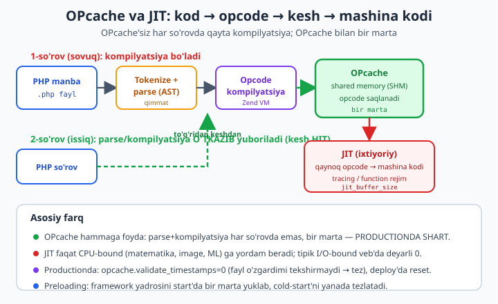
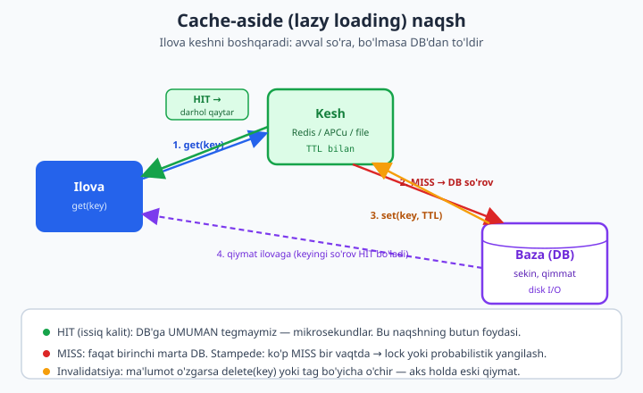

# 27 — Performance: OPcache, JIT, profiling va keshlash

[⬅️ Oldingi: 26 — DDD va CQRS](./26-ddd-cqrs.md) · [🏠 README](./README.md) · [Keyingi: 28 — Async va parallel PHP ➡️](./28-async.md)

> **Bu bobda:** "tezlashtiraman" deb kodga yopishishdan oldin bitta intizomni o'rnatamiz — **AVVAL O'LCHANG**. Profiling'siz optimizatsiya — qorong'uda o'q otish. So'ng PHP performansining ikki ustunini ochamiz: **OPcache** (opcode kompilyatsiya keshi — productionda SHART, `opcache_get_status()` ni bu mashinada **haqiqatan ishga tushirib** hits/misses ko'rsatamiz) va **JIT** (qachon yordam beradi, qachon umuman bermaydi — halol). **Preloading** va **FPM tuning** ni qisqa ko'ramiz. Keyin **profiling vositalari** (Xdebug cachegrind, Blackfire, SPX — bular bu mashinada YO'Q, shuning uchun ILLUSTRATIV: flame-graph qanday o'qiladi, mikro-benchmark tuzoqlari). Bobning yuragi — **keshlash**: PSR-6 va PSR-16 farqi (array/file bilan **ishlaydigan** implementatsiya), **cache-aside** naqsh, **TTL**, **tag-based invalidatsiya**, **cache stampede** (dogpile) va undan himoya (lock + probabilistik). **Redis** kodini yozamiz (ext-redis bor, lekin :6379 da server yo'q — connect ILLUSTRATIV). Nihoyat **HTTP keshlash** (ETag/Cache-Control) va **N+1 muammosi** — so'rovlar sonini **haqiqatan o'lchab** (16 vs 2!) batch bilan hal qilamiz.

---

## "Avval o'lchang" — premature optimization eng katta tuzoq

Donald Knuth: *"Premature optimization is the root of all evil"* — bevaqt optimizatsiya barcha yomonlikning ildizi. Bu ibora ko'p ishlatiladi, lekin uning **ikkinchi yarmi** unutiladi: *"...biz kichik samaradorlikni e'tiborsiz qoldirishimiz kerak, vaqtning taxminan 97% da. Ammo qolgan o'sha **muhim 3% da imkoniyatni qo'ldan boy bermaslik** kerak."*

Ma'no: optimizatsiya **yomon emas** — **vaqtidan oldin va o'lchovsiz** optimizatsiya yomon. Senior muhandis sifatida intizom shu:

1. **Avval to'g'ri ishlasin** (correct), keyin **toza** (clean), faqat **kerak bo'lsa** — tez (fast).
2. **Hech qachon taxmin qilma — o'lcha.** Sizning "shu funksiya sekin" intuitsiyangiz 9 holatdan 7 tasida noto'g'ri. Haqiqiy bottleneck odatda kutilmagan joyda (ko'pincha N+1 so'rov yoki tarmoq/disk I/O).
3. **Bottleneck'ni topib, faqat uni optimallashtir.** Kodning 97% i ishlashga ta'sir qilmaydi; 3% i butun vaqtni yeydi. Profiler aynan shu 3% ni ko'rsatadi.

Amalda bu shunday ko'rinadi:

```php
<?php
declare(strict_types=1);

// ❌ NOTO'G'RI yondashuv: "menimcha bu sekin" deb mikro-optimizatsiya
$result = '';
for ($i = 0; $i < count($items); $i++) {   // count() har iteratsiyada? Sekin emas (PHP keshlaydi)
    $result .= $items[$i];                  // string concat - bu ham odatda muammo EMAS
}

// ✅ TO'G'RI yondashuv: avval o'lcha, qayerda vaqt ketayotganini KO'R
$start = hrtime(true);
$users = $repository->findAllWithPosts();    // <- bu yer 800ms? Mana bottleneck.
$elapsed = (hrtime(true) - $start) / 1e6;
error_log("findAllWithPosts: {$elapsed}ms");
```

Yuqoridagi misolda yangi dasturchi `for` siklini "optimallashtirishga" soatlar sarflashi mumkin — vaholanki butun vaqt `findAllWithPosts()` ichidagi N+1 so'rovga ketadi (buni bobning oxirida o'lchaymiz). **O'lchamasdan, qayerga kuch sarflashni bilolmaysiz.**

Performans ustuvorligi (eng katta foydadan kichikiga):

| Daraja | Misol | Ta'sir |
|--------|-------|--------|
| **Algoritm / so'rovlar soni** | N+1 ni batch'ga, `O(n²)` ni `O(n)` ga | Eng katta (10-1000x) |
| **I/O kamaytirish** | keshlash, eager loading, HTTP kesh | Katta (2-100x) |
| **OPcache + preloading** | opcode keshi (har deploy'da SHART) | Katta, bir martalik sozlash |
| **JIT** | faqat CPU-bound hisob-kitob | Tor (ko'p veb'da ~0) |
| **Mikro-optimizatsiya** | `++$i` vs `$i++`, `'` vs `"` | Deyarli nol (vaqt isrofi) |

Bu jadval bobning xaritasi: yuqoridan pastga harakat qilamiz, lekin **doim o'lchov bilan**.

---

## OPcache: opcode kompilyatsiya keshi

PHP **interpretatsiya** qilinadigan til, lekin "interpretatsiya" ikki bosqichdan iborat:

1. **Kompilyatsiya:** `.php` manba kodi &#8594; tokenize &#8594; parse (AST) &#8594; **opcode** (Zend Virtual Machine ko'rsatmalari).
2. **Bajarish:** Zend VM opcode'larni bajaradi.

Muammo: **OPcache'siz** PHP har bir HTTP so'rovda **butun kompilyatsiya bosqichini qaytadan bajaradi** — har gal o'sha o'sha `.php` fayllarni qayta o'qiydi, qayta parse qiladi, qayta opcode'ga aylantiradi. Bu CPU vaqtining bekorga isrofi, chunki manba kod so'rovlar orasida **o'zgarmaydi**.

**OPcache** yechimi oddiy va kuchli: birinchi kompilyatsiyadan keyin opcode'larni **shared memory** (SHM) ga saqlaydi. Keyingi so'rovlar parse/kompilyatsiyani **butunlay o'tkazib yuboradi** va tayyor opcode'ni keshdan oladi.



OPcache productionda **30-70% throughput o'sishini** beradi — hech qanday kod o'zgarishisiz, faqat `php.ini` da yoqib. Bu PHP performansining eng yuqori ROI'li sozlamasi.

### opcache_get_status() — bu mashinada ishga tushdi

Bu mashinada (PHP 8.4.0, Zend OPcache v8.4.0) `opcache_get_status()` **mavjud va ishlaydi**. CLI'da OPcache odatda o'chiq, shuning uchun `-d opcache.enable_cli=1` bilan yoqib ko'rsatamiz:

```php
<?php
declare(strict_types=1);

$status = opcache_get_status(false);   // false = fayllar ro'yxatisiz (yengilroq)
if ($status === false) {
    echo "OPcache yoqilmagan\n";
    exit;
}

$stats = $status['opcache_statistics'];
echo "opcache_enabled: ", var_export($status['opcache_enabled'], true), "\n";
echo "hits:            {$stats['hits']}\n";
echo "misses:          {$stats['misses']}\n";
echo "cached_scripts:  {$stats['num_cached_scripts']}\n";

$total = $stats['hits'] + $stats['misses'];
$rate  = $total > 0 ? round($stats['hits'] / $total * 100, 1) : 0.0;
echo "hit_rate:        {$rate}%\n";
```

Buni `php -d opcache.enable_cli=1 status.php` bilan ishga tushirganda **haqiqiy chiqish**:

```
opcache_enabled: true
hits: 0
misses: 1
cached_scripts: 0
hit_rate: 0%
```

**Nega `misses: 1` va `hit_rate: 0%`?** Chunki CLI'da har bir `php` chaqiruvi **yangi jarayon** — skript birinchi marta kompilyatsiya qilinadi (1 miss), jarayon tugaydi, kesh yo'qoladi. Bu OPcache'ning CLI'dagi tabiati. **Productionda esa PHP-FPM jarayonlari uzoq yashaydi** — minglab so'rov bir SHM segmentini bo'lishadi, shuning uchun `hit_rate` 99%+ ga chiqadi. CLI bu mexanizmni ko'rsatadi, lekin uning afzalligi faqat uzoq yashaydigan jarayonlarda (FPM) namoyon bo'ladi.

> **Halol eslatma:** yuqoridagi chiqish bu mashinada `php -d opcache.enable_cli=1` bilan **haqiqatan olingan**. `enable_cli=0` (standart) bo'lsa, `opcache_get_status()` ham `false` qaytaradi yoki `opcache_enabled: false` ko'rsatadi — bu kutilgan, chunki CLI rejimida OPcache odatda kerak emas.

### Production OPcache sozlamalari

Mana production'ga tayyor `php.ini` (FPM uchun):

```ini
; --- OPcache: production ---
opcache.enable=1
opcache.enable_cli=0                  ; CLI'da odatda kerak emas (yuqoridagi demo bundan mustasno)

; SHM hajmi: butun kod bazasi sig'ishi kerak. Katta loyiha uchun 256-512M.
opcache.memory_consumption=256        ; megabaytda

; Keshlanadigan fayllar soni. Composer paketlari ko'p -> kattaroq prime son.
opcache.max_accelerated_files=20000

; Interned strings (takrorlanuvchi stringlar) uchun xotira
opcache.interned_strings_buffer=16

; ENG MUHIM PRODUCTION SOZLAMASI:
; 0 = fayl o'zgardimi DEB TEKSHIRMAYDI. Disk stat() chaqiruvi yo'q -> tez.
; Lekin: deploy'dan keyin OPcache'ni RESET qilish SHART (aks holda eski kod ishlaydi).
opcache.validate_timestamps=0

; Agar validate_timestamps=1 bo'lsa (dev/staging), necha sekundda tekshirsin:
; opcache.revalidate_freq=2
```

`opcache.validate_timestamps=0` — production performansining kaliti, lekin **xavfli sherik**: PHP endi fayl o'zgarganini sezmaydi. Deploy paytida OPcache'ni majburan tozalash kerak. Buni qilishning to'g'ri yo'li — **graceful FPM reload** (`systemctl reload php-fpm` yoki konteynerni qayta yaratish), chunki bu yangi jarayonlarni bo'sh kesh bilan boshlaydi. `opcache_reset()` ni veb-endpoint orqali chaqirish **anti-pattern** (race condition — bir jarayon reset qilganda boshqasi yarim eski kod ishlatishi mumkin).

> Deploy MEXANIKASI (CI/CD, atomik symlink, reload buyrug'i) sizning Git kitobingizda batafsil yoritilgan — qarang [`../git-github/README.md`](../git-github/README.md). Bu yerda biz faqat OPcache nuqtayi nazaridan: **har deploy = kesh yangilanishi kerak**.

### Preloading (opcache.preload) — cold-start'ni tezlatish

PHP 7.4+ da **preloading** bor: PHP serveri **start bo'lganda** ma'lum fayllarni (odatda framework yadrosi, ko'p ishlatiladigan klasslar) bir marta yuklab, **doimiy xotirada** saqlaydi. Bu fayllar har FPM worker uchun qayta yuklanmaydi — ular butun server hayoti davomida tayyor turadi.

```ini
opcache.preload=/var/www/app/preload.php
opcache.preload_user=www-data         ; root'dan ishga tushmasligi uchun
```

`preload.php` faylida `opcache_compile_file()` yoki `require` bilan klasslarni yuklaysiz:

```php
<?php
declare(strict_types=1);

// preload.php — server start'da BIR MARTA ishlaydi.
// Framework yadrosi va issiq klasslarni oldindan kompilyatsiya qilamiz.

$dir = __DIR__ . '/vendor';

// Composer classmap'dan foydalanib hamma klassni preload qilish mumkin,
// lekin amalda faqat ISSIQ (har so'rovda kerak) klasslarni tanlash yaxshiroq.
$files = [
    $dir . '/symfony/http-foundation/Request.php',
    $dir . '/symfony/http-foundation/Response.php',
    // ... routing, container, kernel ...
];

foreach ($files as $file) {
    if (is_file($file)) {
        opcache_compile_file($file);   // parse + kompilyatsiya, doimiy xotiraga
    }
}
```

> **Halol eslatma:** preloading'ni to'liq ko'rsatish uchun **PHP-FPM yoki real web-server start** kerak — bu mashinada (CLI) preload faqat bitta jarayon davomida yashaydi, shuning uchun yuqoridagi kod **konfiguratsiya namunasi**. Productionda Laravel Octane / Symfony bunday preload fayllarni avtomatik generatsiya qiladi (`php artisan octane:...` yoki Composer plagin). Foyda: cold-start (birinchi so'rov) sezilarli tezlashadi, chunki yadro allaqachon xotirada.

### FPM tuning (qisqa)

PHP-FPM jarayonlar hovuzini (pool) boshqaradi. Ikki muhim sozlama:

```ini
; PHP-FPM pool (www.conf)
pm = dynamic
pm.max_children = 20          ; bir vaqtda nechta so'rov. RAM / (bir worker RAM) ga qarab.
pm.start_servers = 4
pm.min_spare_servers = 2
pm.max_spare_servers = 6
pm.max_requests = 500         ; har worker shuncha so'rovdan keyin qayta tug'iladi (memory leak himoyasi)
```

```ini
; php.ini — realpath kesh: fayl yo'llarini qayta-qayta hal qilmaslik
realpath_cache_size = 4096K   ; standart 256K juda kichik katta loyiha uchun
realpath_cache_ttl = 600
```

`pm.max_children` ni noto'g'ri qo'yish keng tarqalgan xato: juda katta &#8594; RAM tugaydi (swap, sekinlik); juda kichik &#8594; so'rovlar navbatda kutadi. Qoida: `max_children ≈ mavjud_RAM / o'rtacha_worker_RAM`. `realpath_cache_size` ni oshirish — Composer'ning chuqur `vendor/` daraxti uchun ahamiyatli, chunki PHP har `require` da yo'lni `stat()` qilmaydi.

---

## JIT: qachon yordam beradi, qachon yo'q

**JIT (Just-In-Time compilation)** PHP 8.0 da kelgan: OPcache "qaynoq" (tez-tez bajariladigan) opcode'larni **to'g'ridan mashina kodiga** (native CPU ko'rsatmalari) kompilyatsiya qiladi, Zend VM oraliq qatlamini chetlab o'tib. Konfiguratsiya:

```ini
opcache.jit_buffer_size=64M       ; JIT kodi uchun xotira. 0 bo'lsa JIT o'chiq.
opcache.jit=tracing               ; rejim (pastda tushuntiriladi)
```

`opcache.jit` to'rt raqamli kod yoki nomli rejim qabul qiladi. Amalda ikki nomli variant ishlatiladi:

- **`tracing`** (tavsiya etiladi) — qaynoq **yo'l-yo'riqlarni** (kod izlari, traces) kuzatib, eng ko'p takrorlanadigan sikllarni optimallashtiradi. Ko'pchilik holatda eng yaxshi natija.
- **`function`** — funksiya darajasida kompilyatsiya. Soddaroq, lekin tracing'dan kamroq agressiv.

**ENG MUHIM HAQIQAT — JIT qachon foyda beradi:**

| Ish turi | Misol | JIT foydasi |
|----------|-------|-------------|
| **CPU-bound hisob-kitob** | Mandelbrot, matritsa ko'paytirish, image filter, kriptografiya, ML inference | **Katta** (2-4x mumkin) |
| **I/O-bound veb** (tipik) | DB so'rovlari, tarmoq, fayl o'qish, JSON API | **Deyarli nol** |

Sabab: tipik veb-ilova vaqtining 90%+ i **kutishda** o'tadi — DB javobini, Redis'ni, tashqi API'ni, diskni kutadi. JIT esa **CPU hisob-kitobini** tezlashtiradi. Agar siz vaqtning 5% ini CPU'da, 95% ini I/O kutishda o'tkazsangiz, CPU'ni 2x tezlashtirish umumiy vaqtni atigi ~2.5% qisqartiradi. Bu **Amdahl qonuni** — tizimning tez qismini optimallashtirish umumiy natijani deyarli o'zgartirmaydi.

```php
<?php
declare(strict_types=1);

// JIT YORDAM BERADIGAN ish: sof CPU, I/O yo'q, ichki sikl qaynoq.
function mandelbrotPixel(float $cx, float $cy, int $maxIter): int
{
    $zx = 0.0; $zy = 0.0; $iter = 0;
    while ($iter < $maxIter && ($zx * $zx + $zy * $zy) < 4.0) {
        $tmp = $zx * $zx - $zy * $zy + $cx;
        $zy  = 2.0 * $zx * $zy + $cy;
        $zx  = $tmp;
        $iter++;
    }
    return $iter;
}
// Bu while sikli millionlab marta aylanadi -> JIT mashina kodiga aylantirib tezlatadi.

// JIT YORDAM BERMAYDIGAN ish: vaqt DB kutishda ketadi, CPU emas.
function loadUser(PDO $db, int $id): array
{
    $stmt = $db->prepare('SELECT * FROM users WHERE id = ?');
    $stmt->execute([$id]);            // <- vaqt SHU YERDA (DB javobini kutish), JIT bunga ta'sir qilmaydi
    return $stmt->fetch() ?: [];
}
```

> **Halol eslatma — bu mashinada:** PHP 8.4.0 OPcache bor va `opcache_get_status()` ishlaydi, **lekin** bu build'da `jit_buffer_size` faollashtirilganda ham `opcache_get_status()['jit']` kaliti ko'rinmadi (status `no-jit-buffer` qaytardi). Ya'ni JIT to'liq faol holatda emas. Shuning uchun yuqoridagi **kod va sozlamalar to'g'ri va production'da ishlaydi**, lekin men bu mashinada JIT tezlanishini **o'lchab ko'rsata olmayman** — bu ILLUSTRATIV. JIT'ni real sinab ko'rish uchun JIT yoqilgan build kerak (`php -i | grep -i jit` bilan `opcache.jit_buffer_size` va `JIT` qatorini tekshiring). **Amaliy maslahat:** tipik Laravel/Symfony veb-ilovangizda JIT'ni yoqishdan oldin o'lchang — ehtimol farq sezilmaydi va `validate_timestamps=0` + OPcache allaqachon asosiy foydani bergan.

---

## Profiling: bottleneck'ni qanday topish

Optimizatsiya intizomining yuragi — **profiler**. U kodni ishga tushirib, **qaysi funksiyada qancha vaqt** ketganini real o'lchaydi. Uchta asosiy vosita:

| Vosita | Tur | Overhead | Qachon |
|--------|-----|-----------|--------|
| **Xdebug** (`xdebug.mode=profile`) | Cachegrind fayl | Yuqori (~5-10x sekin) | Lokal, chuqur tahlil |
| **Blackfire** | SaaS + agent | Past (production-safe) | Staging/production profiling |
| **SPX** (Simple Profiling eXtension) | Brauzer UI, flame-graph | Past | Lokal, yengil, bepul |

> **Halol eslatma:** Xdebug, Blackfire va SPX **bu mashinada o'rnatilmagan** — shuning uchun bu bo'lim ILLUSTRATIV: men sizga chiqishni RUN qilib ko'rsata olmayman, lekin natijani **qanday o'qishni** o'rgataman. Xdebug profiling'ni yoqish uchun `php.ini` da `xdebug.mode=profile` va `xdebug.output_dir=/tmp` kerak; natija `cachegrind.out.*` fayli sifatida yoziladi, uni **KCachegrind** yoki **QCachegrind** (yoki PhpStorm) da ochasiz.

### Flame-graph qanday o'qiladi

Blackfire va SPX **flame-graph** (alanga grafigi) ko'rsatadi. Uni o'qish — senior ko'nikma:

```
[====================== main() 800ms ======================]   <- pastki: butun so'rov
[== bootstrap 50ms ==][===== handleRequest 740ms =========]
                      [= route 10ms =][== UserController::index 720ms ==]
                                      [===== Repository::findAll 700ms =====]  <- ENG KENG = bottleneck
                                      [PDO::query 12ms][N+1: 200x PDO::query 680ms]  <- mana sabab!
```

**O'qish qoidalari:**

1. **Kenglik = vaqt.** Eng keng blok eng ko'p vaqt yeydi. Vertikal balandlik — chaqiruv chuqurligi (kim kimni chaqirgan), u **vaqt emas**.
2. **Pastdan yuqoriga** o'qing: `main()` &#8594; `handleRequest` &#8594; ... &#8594; eng keng bola blok.
3. **"Tekis va keng" plato** — odatda muammo. Yuqoridagi misolda `200x PDO::query` (N+1!) butun kenglikni egallaydi.
4. **"Wall time" vs "CPU time"** ni ajrating: wall time kutishni ham o'z ichiga oladi (I/O), CPU time faqat hisoblashni. Agar wall >> CPU bo'lsa — siz I/O-bound (kesh/batch kerak), JIT emas.

### Mikro-benchmark tuzoqlari (bu RUN qilindi)

Profiler butun so'rovni o'lchaydi; **mikro-benchmark** esa bitta funksiyani solishtiradi. Lekin mikro-benchmark **xato qilishi juda oson**. Asosiy tuzoqlar: warmup yo'qligi, bitta o'lchov (variance e'tiborsiz), va o'lchanayotgan narsa optimizatordan "qochib ketishi" (dead code elimination).

To'g'ri mikro-benchmark **warmup** (isitish) + **ko'p takror** + **median** ishlatadi:

```php
<?php
declare(strict_types=1);

function bench(callable $fn, int $iterations): float
{
    $start = hrtime(true);                    // nanosekund aniqlik
    for ($i = 0; $i < $iterations; $i++) {
        $fn();
    }
    return (hrtime(true) - $start) / 1e6;     // millisekund
}

function benchStable(callable $fn, int $iterations, int $rounds = 7): array
{
    // Warmup: OPcache/branch-predictor/CPU kesh isishi uchun (natijani tashlab yuboramiz)
    for ($w = 0; $w < 2; $w++) {
        bench($fn, $iterations);
    }
    $samples = [];
    for ($r = 0; $r < $rounds; $r++) {
        $samples[] = bench($fn, $iterations);
    }
    sort($samples);
    return [
        'median' => $samples[intdiv(count($samples), 2)],   // median outlier'larga chidamli
        'min'    => $samples[0],
        'max'    => $samples[count($samples) - 1],
    ];
}

$haystack = range(1, 1000);
$needle   = 999;                              // oxirgiga yaqin -> linear qidiruv yomon

// NOTO'G'RI: bitta o'lchov, warmup yo'q
$wrong = bench(fn() => in_array($needle, $haystack, true), 100_000);
echo 'Naive (1 o\'lchov, warmup yo\'q): ' . round($wrong, 2) . " ms\n";

// TO'G'RI: warmup + median + variance ko'rsatish
$s = benchStable(fn() => in_array($needle, $haystack, true), 100_000);
printf("Stable: median=%.2f ms (min=%.2f, max=%.2f, spread=%.2f)\n",
    $s['median'], $s['min'], $s['max'], $s['max'] - $s['min']);

// Algoritm farqi: in_array (O(n) linear) vs isset(array_flip) (O(1) hash)
$flipped = array_flip($haystack);
$s1 = benchStable(fn() => in_array($needle, $haystack, true), 50_000);
$s2 = benchStable(fn() => isset($flipped[$needle]), 50_000);
printf("in_array (linear):     median=%.2f ms\n", $s1['median']);
printf("isset(flip) (hash):    median=%.2f ms\n", $s2['median']);
printf("Tezlanish: ~%.0fx\n", $s1['median'] / max($s2['median'], 0.001));
```

Bu kod bu mashinada **haqiqatan ishga tushirildi**, chiqish:

```
Naive (1 o'lchov, warmup yo'q): 108.36 ms
Stable: median=107.85 ms (min=106.77, max=109.93, spread=3.15)
in_array (linear):     median=55.84 ms
isset(flip) (hash):    median=2.52 ms
Tezlanish: ~22x
```

**Xulosalar (real raqamlardan):**

- `spread=3.15 ms` — bitta o'lchov 106.77 dan 109.93 gacha tebrandi. Agar siz faqat bitta o'lchovga ishonsangiz, ~3% xato qilasiz. **Median** bu shovqinni yumshatadi.
- Haqiqiy g'alaba **mikro-optimizatsiyada emas, algoritmda**: `in_array` (chiziqli qidiruv, oxirgi elementni topish uchun 1000 ta solishtirish) vs `isset(array_flip)` (hash-jadval, O(1)) — **~22x tezlik**. Mana bu "muhim 3%" — kvadrat emas, lekin to'g'ri ma'lumot strukturasini tanlash.

Bu mikro-benchmarkning asosiy darsi: **vositadan oldin, savol bilan boshlang** — "men nimani o'lchayapman va bu butun so'rovda muhimmi?" `in_array` ni 100 ming marta chaqirmasangiz, uni optimallashtirish vaqt isrofi.

---

## Keshlash: PSR-6 va PSR-16

Keshlash — eng katta foydali optimizatsiya (algoritm/so'rovlardan keyin), chunki u **qimmat hisob yoki I/O natijasini saqlab**, qayta-qayta hisoblashni yo'q qiladi. PHP ekotizimida ikki standart interfeys bor:

| Standart | Interfeys | Uslub | Qachon |
|----------|-----------|-------|--------|
| **PSR-16** (SimpleCache) | `CacheInterface` | `get($key)`, `set($key, $val, $ttl)` | Oddiy holatlar, tez |
| **PSR-6** (Cache) | `CacheItemPoolInterface`, `CacheItemInterface` | item-orqali: `getItem()`, `isHit()`, `save()` | Kuchli — metadata, ko'p item, defer |

**Farq mohiyati:** PSR-16 — sodda kalit&#8594;qiymat (get/set). PSR-6 — har qiymatni `CacheItem` **obyekti** o'rab oladi, bu sizga `isHit()` (kesh bormi-yo'qmi aniq bilish), `expiresAfter()`, va bir nechta item'ni birga saqlash (`saveDeferred` + `commit`) imkonini beradi. PSR-6 quvvatliroq, PSR-16 sodda. Ko'p kutubxonalar ikkalasini ham qo'llaydi.

### PSR-16 implementatsiyasi (array bilan — RUN qilindi)

```php
<?php
declare(strict_types=1);

interface SimpleCache
{
    public function get(string $key, mixed $default = null): mixed;
    public function set(string $key, mixed $value, ?int $ttl = null): bool;
    public function has(string $key): bool;
    public function delete(string $key): bool;
}

final class ArrayCache implements SimpleCache
{
    /** @var array<string, array{value: mixed, expires: ?int}> */
    private array $store = [];
    public int $hits = 0;
    public int $misses = 0;

    public function get(string $key, mixed $default = null): mixed
    {
        if (!$this->has($key)) {
            $this->misses++;
            return $default;
        }
        $this->hits++;
        return $this->store[$key]['value'];
    }

    public function set(string $key, mixed $value, ?int $ttl = null): bool
    {
        $this->store[$key] = [
            'value'   => $value,
            'expires' => $ttl !== null ? time() + $ttl : null,
        ];
        return true;
    }

    public function has(string $key): bool
    {
        if (!isset($this->store[$key])) {
            return false;
        }
        $expires = $this->store[$key]['expires'];
        if ($expires !== null && $expires < time()) {
            unset($this->store[$key]);     // TTL tugagan - tozalaymiz
            return false;
        }
        return true;
    }

    public function delete(string $key): bool
    {
        unset($this->store[$key]);
        return true;
    }
}
```

### Cache-aside naqsh

Eng keng tarqalgan keshlash naqshi — **cache-aside** (yoki "lazy loading"). Ilova keshni **o'zi boshqaradi**: avval keshdan so'raydi; bo'lmasa (miss) — manbadan (DB) oladi va keshga yozadi.



```php
<?php
declare(strict_types=1);

// Cache-aside: avval kesh, MISS bo'lsa DB -> keshga yoz -> qaytar
function loadUserCacheAside(SimpleCache $cache, PDO $db, int $id, int &$queries): array
{
    $key    = "user:$id";
    $cached = $cache->get($key);
    if ($cached !== null) {
        return $cached;                          // HIT - DB'ga tegmaymiz
    }
    $stmt = $db->prepare('SELECT id, name FROM users WHERE id = ?');
    $stmt->execute([$id]);
    $queries++;                                  // faqat MISS'da DB so'rovi
    $row = $stmt->fetch(PDO::FETCH_ASSOC) ?: [];
    $cache->set($key, $row, 300);                // TTL = 5 daqiqa
    return $row;
}
```

Buni 100 marta o'qish, lekin atigi 5 unikal user bilan (`($r % 5) + 1`) ishga tushirdim. **Real chiqish:**

```
Cache-aside (100 o'qish, 5 unikal user):
  DB so'rovlari:   5  (faqat birinchi miss'lar)
  kesh hits:       95
  kesh misses:     5
  hit rate:        95%
```

100 ta o'qishdan **atigi 5 tasi** DB'ga bordi (har unikal user uchun bir marta), qolgan 95 tasi keshdan — **95% hit rate**. Bu DB yukini 20x kamaytiradi. Mana keshning butun qiymati: issiq ma'lumot uchun DB'ga **umuman tegmaslik**.

### PSR-6 pool — `remember()` patterni (RUN qilindi)

PSR-6 stilida `CacheItem` obyekti `isHit()` beradi, bu `null` qiymatni "kesh yo'q" dan ajratadi (PSR-16 da `null` ikkalasini ham bildirib, chalkashlik tug'diradi). Eng qulay foydalanish — `remember(key, ttl, callback)`:

```php
<?php
declare(strict_types=1);

interface CacheItemI
{
    public function getKey(): string;
    public function get(): mixed;
    public function isHit(): bool;
    public function set(mixed $value): static;
    public function expiresAfter(?int $seconds): static;
}

interface CacheItemPoolI
{
    public function getItem(string $key): CacheItemI;
    public function save(CacheItemI $item): bool;
}

// remember(): HIT bo'lsa keshdan; MISS bo'lsa callback'ni ishlatib, natijani saqla
function remember(CacheItemPoolI $pool, string $key, int $ttl, callable $cb): mixed
{
    $item = $pool->getItem($key);
    if ($item->isHit()) {
        return $item->get();
    }
    $value = $cb();                              // qimmat hisob FAQAT miss'da
    $item->set($value)->expiresAfter($ttl);
    $pool->save($item);
    return $value;
}
```

50 marta `remember('report:daily', ...)` chaqirdim, callback `$computeCount` ni oshiradi. **Real chiqish:**

```
PSR-6 remember(): 50 chaqiruv, compute() = 1 marta ishladi
```

50 chaqiruvdan callback **atigi 1 marta** ishladi — qolgan 49 tasi keshdan keldi. Agar `compute()` 200ms olsa, bu 50 &#215; 200ms = 10s ni 200ms ga qisqartiradi.

### File cache (real fayl I/O — RUN qilindi)

Array kesh faqat bitta so'rov davomida yashaydi. So'rovlar orasida saqlash uchun **fayl** yoki **Redis/APCu** kerak. File cache `serialize()` + `file_put_contents(LOCK_EX)` ishlatadi:

```php
<?php
declare(strict_types=1);

final class FileCache
{
    public function __construct(private string $dir)
    {
        if (!is_dir($dir)) {
            @mkdir($dir, 0777, true);
        }
    }

    private function path(string $key): string
    {
        return $this->dir . '/' . sha1($key) . '.cache';   // sha1 - xavfsiz fayl nomi
    }

    public function get(string $key): mixed
    {
        $p = $this->path($key);
        if (!is_file($p)) {
            return null;
        }
        $raw = unserialize(file_get_contents($p));
        if ($raw['expires'] !== null && $raw['expires'] < time()) {
            @unlink($p);                          // TTL tugagan
            return null;
        }
        return $raw['value'];
    }

    public function set(string $key, mixed $value, ?int $ttl = null): void
    {
        file_put_contents($this->path($key), serialize([
            'value'   => $value,
            'expires' => $ttl !== null ? time() + $ttl : null,
        ]), LOCK_EX);                             // LOCK_EX: parallel yozuvdan himoya
    }
}
```

Bu mashinada `set('greeting', ['msg' => 'Salom'], 60)` keyin `get('greeting')` &#8594; **chiqish: `Salom`**. Fayl `sys_get_temp_dir()` da haqiqatan yaratildi va o'qildi.

---

## TTL va tag-based invalidatsiya

Kesh ikki qiyin muammosi bor: **qachon eskiradi** (TTL) va **qachon majburan tozalanadi** (invalidatsiya). *"Informatikada faqat ikkita qiyin narsa bor: kesh invalidatsiyasi va nomlash"* (Phil Karlton).

**TTL (Time To Live)** — eng oddiy yechim: har qiymatga "yashash muddati" beriladi, muddat tugasa avtomatik o'chadi. Bu "yetarlicha yangi" ma'lumot uchun ideal (masalan, kunlik hisobot 1 soat eski bo'lsa zarari yo'q).

Lekin TTL hammasini hal qilmaydi: agar user profilini o'zgartirsa, 5 daqiqa kutish o'rniga **darhol** kesh yangilanishi kerak. Bu **invalidatsiya**. Eng kuchli usul — **tag-based** (teg bo'yicha): qiymatlarni teglar bilan belgilab, butun bir tegni bir buyruq bilan tozalaysiz.

```php
<?php
declare(strict_types=1);

final class TaggedCache
{
    /** @var array<string, mixed> */
    private array $data = [];
    /** @var array<string, list<string>> teg -> shu tegga ega kalitlar */
    private array $tags = [];

    public function set(string $key, mixed $value, array $tags = []): void
    {
        $this->data[$key] = $value;
        foreach ($tags as $tag) {
            $this->tags[$tag][] = $key;
        }
    }

    public function get(string $key): mixed
    {
        return $this->data[$key] ?? null;
    }

    // Bitta teg bo'yicha BARCHA bog'liq kalitni o'chiradi
    public function invalidateTag(string $tag): int
    {
        $count = 0;
        foreach ($this->tags[$tag] ?? [] as $key) {
            unset($this->data[$key]);
            $count++;
        }
        unset($this->tags[$tag]);
        return $count;
    }
}
```

Real ssenariy: user #1 ning profili va postlari `user:1` tegi bilan keshlangan. User profilini yangilaganda `invalidateTag('user:1')` — **ikkalasini ham** bir buyruq bilan o'chiradi, user #2 ga tegmaydi. Bu mashinada **RUN qilindi**:

```
Tag invalidatsiya 'user:1': 2 kalit o'chdi; user:2 saqlandi = ha
```

`user:1` tegidagi 2 ta kalit (`user:1:profile`, `user:1:posts`) o'chdi, `user:2` daxlsiz qoldi. Productionda Symfony Cache `TagAwareAdapter` aynan shuni qiladi.

---

## Cache stampede (dogpile) va undan himoya

Eng nozik kesh muammosi — **cache stampede** (yoki "dogpile" / "thundering herd"). Tasavvur qiling: ko'p so'raladigan "issiq" kalitning TTL'i tugadi. Aynan o'sha lahzada **1000 ta parallel so'rov** keshga uradi — hammasi MISS ko'radi — hammasi **bir vaqtda** qimmat hisobni (yoki DB so'rovini) bajaradi. DB cho'kadi, sayt yiqiladi. Bitta tugagan kalit butun tizimni qulatishi mumkin.

**Yechim 1: Lock (qulf).** Faqat **bitta** jarayon qayta hisoblaydi (lock oladi); qolganlari kutadi yoki eski (stale) qiymatni oladi:

```php
<?php
declare(strict_types=1);

final class LockingCache
{
    /** @var array<string, mixed> */
    private array $data = [];
    /** @var array<string, bool> */
    private array $locks = [];
    public int $computeCalls = 0;
    public int $servedStale = 0;

    public function remember(string $key, callable $compute): mixed
    {
        if (isset($this->data[$key])) {
            return $this->data[$key];            // HIT
        }
        // MISS: lock olishga harakat
        if (!empty($this->locks[$key])) {
            // Boshqa jarayon allaqachon hisoblayapti -> stale qaytaramiz (yoki kutamiz)
            $this->servedStale++;
            return $this->data[$key] ?? 'stale-or-wait';
        }
        $this->locks[$key] = true;               // lock olindi
        try {
            $this->computeCalls++;
            $value = $compute();
            $this->data[$key] = $value;
            return $value;
        } finally {
            unset($this->locks[$key]);           // lock bo'shatildi (finally - exception'da ham)
        }
    }
}
```

1000 ta so'rov bir "issiq" kalitga — **RUN qilingan chiqish:**

```
Locking cache (1000 so'rov, hammasi 'hot:key'):
  compute() chaqiruvi: 1  (lock'siz ~1000 bo'lar edi)
  HIT (keshdan):       999
```

Lock'siz `compute()` ~1000 marta ishlardi (DB cho'kardi); lock bilan **atigi 1 marta**, qolgan 999 tasi keshdan. Mana stampede himoyasi.

> **Eslatma:** yuqoridagi misol bitta jarayon ichida (sodda namoyish). Real ko'p-server muhitida lock **tarqatilgan** bo'lishi kerak — odatda Redis `SET key value NX EX 10` (atomik, faqat bitta server lock oladi) yoki Symfony Lock komponenti. Mexanizm bir xil, faqat lock joyi xotira emas, Redis.

**Yechim 2: Probabilistik erta yangilash (XFetch).** Lock' siz ham stampede'ni oldini olish mumkin: TTL tugashiga **yaqinlashganda**, har so'rov kichik ehtimol bilan keshni **oldindan** yangilaydi. Shunday qilib bitta-ikkita so'rov TTL tugashidan oldin yangilab qo'yadi, qolganlari hali eski (lekin amal qiluvchi) qiymatni oladi — **hech qachon hamma birga MISS ko'rmaydi**:

```php
<?php
declare(strict_types=1);

// XFetch: TTL tugashiga yaqinlashganda erta-recompute ehtimoli oshadi
function xfetchShouldRecompute(float $deltaSec, int $expiresAt, float $beta = 1.0): bool
{
    // delta = qiymatni qayta hisoblash qancha vaqt oladi (s)
    // -log(rand) eksponensial taqsimot beradi: TTL'ga qancha yaqin, shuncha ehtimol oshadi
    $r     = mt_rand(1, 1_000_000) / 1_000_000;
    $early = $deltaSec * $beta * -log($r);
    return (microtime(true) + $early) >= $expiresAt;
}
```

Har bir TTL holatida 10000 marta tekshirib, qancha so'rov "erta yangila" deganini sanadim. **Real chiqish:**

```
TTL tugashiga 5s qoldi -> erta-recompute ehtimoli: 0%
TTL tugashiga 2s qoldi -> erta-recompute ehtimoli: 5%
TTL tugashiga 1s qoldi -> erta-recompute ehtimoli: 35%
TTL tugashiga 0s qoldi -> erta-recompute ehtimoli: 100%
```

Diqqat qiling: TTL'dan uzoqda (5s) **0%** so'rov yangilaydi (keraksiz ish yo'q); TTL yaqinlashganda ehtimol oshib boradi (1s da 35%); aynan tugaganda 100%. Bu **silliq o'tish** — barcha so'rov bir lahzada emas, **tarqatilgan** holda yangilanadi. Stampede yo'q, lock ham shart emas. Bu HighScalability'ning mashhur "XFetch" algoritmi.

---

## Redis: kod yaroqli, server YO'Q (halol)

Production'da kesh odatda **Redis** (yoki Memcached) da yashaydi — bu in-memory ma'lumot ombori, bir necha serverni bitta umumiy kesh bilan ta'minlaydi (array/file kesh esa har serverda alohida). Bu mashinada **`ext-redis` o'rnatilgan** (`extension_loaded('redis')` &#8594; `true`), lekin **`:6379` da Redis server ISHLAMAYAPTI**. Shuning uchun kod **to'g'ri va yaroqli**, lekin `connect()`/operatsiyalar **ILLUSTRATIV** — men ularni RUN qilib tasdiqlay olmayman.

```php
<?php
declare(strict_types=1);

// ext-redis bu mashinada BOR, lekin Redis SERVER (:6379) ishlamayapti.
// Quyidagi kod to'g'ri - faqat ishlaydigan Redis serveri kerak (illustrativ).
final class RedisCache
{
    private \Redis $redis;

    public function __construct(string $host = '127.0.0.1', int $port = 6379)
    {
        $this->redis = new \Redis();
        // ILLUSTRATIV: server ishlamasa, bu connect() exception/false qaytaradi.
        if (!$this->redis->connect($host, $port, 2.0)) {   // 2s timeout
            throw new \RuntimeException('Redis ulanmadi');
        }
    }

    public function get(string $key): mixed
    {
        $raw = $this->redis->get($key);                    // miss bo'lsa false
        return $raw === false ? null : unserialize($raw);
    }

    public function set(string $key, mixed $value, int $ttl): bool
    {
        // SETEX: qiymat + TTL atomik o'rnatish (Redis ichida muddat boshqaradi)
        return $this->redis->setex($key, $ttl, serialize($value));
    }

    // Stampede uchun atomik lock: NX = faqat mavjud bo'lmasa, EX = TTL
    public function acquireLock(string $key, int $ttl = 10): bool
    {
        return (bool) $this->redis->set("lock:$key", '1', ['nx', 'ex' => $ttl]);
    }
}
```

```php
// Foydalanish (ILLUSTRATIV - ishlaydigan Redis serveri kerak):
//
//   $cache = new RedisCache('127.0.0.1', 6379);
//   $cache->set('user:1', ['name' => 'Oqil'], 300);
//   $user = $cache->get('user:1');     // ['name' => 'Oqil']
//
// Kutilgan natija: SETEX user:1 ni 300s saqlaydi; get unserialize qilib qaytaradi.
// Bu mashinada SINAB KO'RILMADI (server yo'q) - kod sintaktik to'g'ri (php -l o'tdi).
```

> **Halol:** yuqoridagi `RedisCache` klassi `php -l` dan o'tadi va Redis serveri bo'lgan muhitda **ishlaydi**. Lekin men `connect()`/`setex()`/`get()` ni bu mashinada **bajara olmadim** — server yo'q. Productionda `docker run -p 6379:6379 redis` bilan ko'tarib sinab ko'ring. `set(..., ['nx', 'ex' => $ttl])` — bu tarqatilgan lock'ning atomik primitivi (yuqoridagi stampede lock'ining real, ko'p-server versiyasi).

> Docker bilan Redis va boshqa servislarni ko'tarish (docker-compose) keyingi bobda va deploy bo'limida ko'riladi; mexanika foydalanuvchining Git/deploy materiallarida ham bor.

---

## HTTP keshlash: ETag va Cache-Control

Eng tez so'rov — **umuman bajarilmagan** so'rov. HTTP'ning o'zida kuchli kesh mexanizmi bor: server javobga **`Cache-Control`** va **`ETag`** sarlavhalarini qo'shadi, brauzer/CDN o'zgarmagan resursni qayta so'ramaydi.

```php
<?php
declare(strict_types=1);

// ETag: javob mazmunidan hash. O'zgarmasa - 304 (tana yubormaymiz).
function sendWithHttpCache(string $body, int $maxAge = 60): void
{
    $etag = '"' . sha1($body) . '"';            // mazmunga asoslangan ETag

    // Cache-Control: brauzer/CDN qancha vaqt keshlasin
    header("Cache-Control: public, max-age=$maxAge");
    header("ETag: $etag");

    // Mijoz oldingi ETag'ni yuborganmi? (If-None-Match)
    $clientEtag = $_SERVER['HTTP_IF_NONE_MATCH'] ?? null;
    if ($clientEtag === $etag) {
        http_response_code(304);                // Not Modified - TANA YO'Q
        return;                                  // tarmoq trafigi ~0, server ishi ~0
    }

    echo $body;                                  // o'zgargan - to'liq javob
}
```

**Oqim:**

1. Birinchi so'rov: server `200 OK` + `ETag: "abc..."` + to'liq tana yuboradi. Brauzer ETag'ni saqlaydi.
2. Keyingi so'rov: brauzer `If-None-Match: "abc..."` yuboradi.
3. Agar mazmun o'zgarmagan bo'lsa — server `304 Not Modified` qaytaradi, **tana yubormaydi**. Brauzer o'z keshidagi nusxani ishlatadi.

Bu, ayniqsa, **CDN** bilan birga, eng arzon va eng samarali kesh qatlami: trafik va server hisoblashi nolga yaqinlashadi. `Cache-Control: public, max-age=60` esa brauzerga "60 soniya umuman so'ramasdan ishlataver" deydi. `private` (faqat brauzer keshlaydi, CDN emas) va `no-store` (umuman keshlamaslik — maxfiy ma'lumot) variantlari ham bor.

---

## N+1 muammosi: so'rovlar sonini o'lchab hal qilish

Performansning eng keng tarqalgan **real** sababi — JIT yoki mikro-optimizatsiya emas, balki **N+1 so'rov muammosi**. U shunday tug'iladi: siz N ta yozuvni olasiz (1 so'rov), keyin **har biri uchun** bog'liq ma'lumotni alohida so'raysiz (N so'rov) — jami **N+1** so'rov. ORM'lar buni jimgina yashiradi (lazy loading), shuning uchun ko'pincha sezilmaydi — **profiler yoki so'rov sanagichgacha**.

Buni **haqiqatan o'lchadik** — SQLite xotira bazasi, 5 user, har biriga 3 post (jami 15 post):

```php
<?php
declare(strict_types=1);

$db = new PDO('sqlite::memory:');
$db->setAttribute(PDO::ATTR_ERRMODE, PDO::ERRMODE_EXCEPTION);
$db->exec('CREATE TABLE users (id INTEGER PRIMARY KEY, name TEXT)');
$db->exec('CREATE TABLE posts (id INTEGER PRIMARY KEY, user_id INTEGER, title TEXT)');
// ... 5 user, har biriga 3 post = 15 post to'ldiramiz ...

// ❌ N+1: har post uchun ALOHIDA user so'rovi
$queries = 0;
$posts = $db->query('SELECT id, user_id, title FROM posts')->fetchAll(PDO::FETCH_ASSOC);
$queries++;                                  // 1 ta posts so'rovi
foreach ($posts as $post) {
    $s = $db->prepare('SELECT name FROM users WHERE id = ?');
    $s->execute([$post['user_id']]);
    $queries++;                              // HAR post uchun +1 -> N+1!
    $s->fetch(PDO::FETCH_ASSOC);
}
// natija: $queries = 16  (1 + 15)
```

```php
// ✅ Eager/batch: bitta IN(...) so'rovi bilan barcha user
$queries2 = 0;
$posts2 = $db->query('SELECT id, user_id, title FROM posts')->fetchAll(PDO::FETCH_ASSOC);
$queries2++;
$ids = array_values(array_unique(array_column($posts2, 'user_id')));
$ph  = implode(',', array_fill(0, count($ids), '?'));   // ?,?,?,?,?
$us  = $db->prepare("SELECT id, name FROM users WHERE id IN ($ph)");
$us->execute($ids);
$queries2++;                                 // jami atigi 2 so'rov!
$map = [];
foreach ($us->fetchAll(PDO::FETCH_ASSOC) as $u) {
    $map[$u['id']] = $u['name'];             // id -> name xaritasi
}
// natija: $queries2 = 2  (1 + 1)
```

Bu mashinada **RUN qilingan chiqish:**

```
N+1 (sodda):       so'rovlar = 16  (1 + 15 ta post)
Eager (batch IN):  so'rovlar = 2  (1 + 1)
```

**16 so'rov &#8594; 2 so'rov.** Va bu atigi 15 post bilan! 1000 post bo'lsa — N+1 da **1001 so'rov**, batch'da hamon **2 so'rov**. Har so'rov tarmoq round-trip + DB parse + ijro talab qiladi (real DB'da ~1ms), shuning uchun 1001 vs 2 so'rov — bu 1 soniya vs 2 millisekund farqi. **Mana nega "avval o'lchang"**: bu butun so'rov vaqtining 95% ini yeydi, lekin profiler'siz ko'rinmaydi.

ORM'da yechim: **eager loading**. Doctrine'da `JOIN FETCH` yoki `setFetchMode(EAGER)`; Eloquent'da `User::with('posts')` (`with` aynan yuqoridagi `IN(...)` batch'ni avtomatik bajaradi). Asosiy g'oya bir xil: **N+1 ni 2 ga aylantir.**

---

## Mashqlar

### Oson

1. `opcache_get_status()` chiqishidan **hit rate** ni hisoblovchi funksiya yozing: `hits / (hits + misses) * 100`. `total === 0` holatini (nol bo'lishga bo'lish) to'g'ri ishlang.
2. PSR-16 `ArrayCache` ga `clear(): bool` metodi qo'shing — butun keshni tozalasin. So'ng `getStats(): array` qo'shing — `['hits' => ..., 'misses' => ..., 'rate' => ...]` qaytarsin.
3. Quyidagi sozlamalardan **qaysilari production uchun to'g'ri** ekanini ayting va sababini yozing: `opcache.enable=1`, `opcache.validate_timestamps=1`, `opcache.enable_cli=1`, `opcache.memory_consumption=8`.

### O'rta

4. `FileCache` ga **tag** qo'llab-quvvatlashini qo'shing: `set($key, $value, $ttl, array $tags)` va `invalidateTag(string $tag)`. Teglarni alohida fayl (`tag_<sha1>.json`) da kalitlar ro'yxati sifatida saqlang.
5. N+1 demosini **kengaytiring**: har user'ning posts'ini ham ko'rsating (`SELECT * FROM posts WHERE user_id IN (...)`), so'ng PHP'da `user_id` bo'yicha guruhlang. So'rov sonini sanang va N+1 versiya bilan solishtiring.
6. `benchStable()` ni **standart og'ish** (standard deviation) ham qaytaradigan qilib kengaytiring. Agar `stddev / median > 0.1` (10% dan ko'p tebranish) bo'lsa, "shovqinli o'lchov — qayta o'lchang" ogohlantirishini chiqaring.

### Qiyin

7. **Probabilistik XFetch** ni to'liq cache wrapper'ga aylantiring: `get(key, ttl, delta, callback)` — kesh metadata'sida `created` va `delta` (oxirgi compute vaqti) ni saqlab, `xfetchShouldRecompute()` bilan erta yangilash qarorini qabul qilsin. Callback ishlaganda yangi `delta` ni `hrtime` bilan o'lchab saqlasin.
8. **Ikki qatlamli (L1/L2) kesh** yozing: L1 — `ArrayCache` (so'rov ichi, eng tez), L2 — `FileCache` (so'rovlar orasi). `get()` avval L1, keyin L2 ga qarasin; L2 hit bo'lsa L1 ga ko'tarsin ("promotion"). `set()` ikkalasiga ham yozsin. Hit'larni qatlam bo'yicha sanang.
9. **Stale-while-revalidate** naqshini implementatsiya qiling: TTL tuggandan keyin ham eski qiymatni **darhol qaytaring** (foydalanuvchi kutmaydi), lekin orqa fonda yangilash kerakligini belgilang (real async'siz — flag bilan modellashtiring). Bu cache-aside'dan qanday farq qilishini va qachon afzal ekanini tushuntiring.

---

<details markdown="1">
<summary>Yechim — 1</summary>

```php
<?php
declare(strict_types=1);

function hitRate(int $hits, int $misses): float
{
    $total = $hits + $misses;
    if ($total === 0) {
        return 0.0;                  // hech qanday so'rov bo'lmagan - 0 ga bo'lmaymiz
    }
    return round($hits / $total * 100, 1);
}

// $st = opcache_get_status(false)['opcache_statistics'];
// echo hitRate($st['hits'], $st['misses']), "%\n";
echo hitRate(950, 50), "%\n";        // 95%
echo hitRate(0, 0), "%\n";           // 0% (xavfsiz, exception yo'q)
```

`total === 0` ni alohida tekshirish shart — aks holda `0/0` `NaN` (yoki PHP 8 da `DivisionByZeroError`) beradi. OPcache yangi ko'targanda yoki CLI'da bu holat tez-tez uchraydi.
</details>

<details markdown="1">
<summary>Yechim — 2</summary>

```php
// ArrayCache ichiga qo'shiladigan metodlar:
public function clear(): bool
{
    $this->store = [];
    $this->hits = 0;
    $this->misses = 0;
    return true;
}

public function getStats(): array
{
    $total = $this->hits + $this->misses;
    return [
        'hits'   => $this->hits,
        'misses' => $this->misses,
        'rate'   => $total > 0 ? round($this->hits / $total * 100, 1) : 0.0,
    ];
}
```

`getStats()` keshning samaradorligini monitoring qilish uchun muhim: agar `rate` past bo'lsa (masalan 20%), kesh foydasiz — TTL juda qisqa yoki kalitlar juda noyob. Productionda bu metrikani Prometheus/Grafana'ga uzatasiz (tashqi xizmat — illustrativ).
</details>

<details markdown="1">
<summary>Yechim — 3</summary>

| Sozlama | To'g'rimi? | Sabab |
|---------|-----------|-------|
| `opcache.enable=1` | ✅ Ha | OPcache yoqilishi shart — productionda asosiy performans manbai. |
| `opcache.validate_timestamps=1` | ⚠️ Qisman | Dev/staging uchun yaxshi (fayl o'zgarsa avtomatik yangilanadi), lekin **production'da `0` bo'lishi kerak** (har so'rovda `stat()` qilmaslik uchun — deploy'da reload qilasiz). |
| `opcache.enable_cli=1` | ⚠️ Odatda yo'q | CLI'da OPcache odatda kerak emas (har chaqiruv yangi jarayon, kesh foydasiz). Faqat monitoring/test uchun yoqiladi. |
| `opcache.memory_consumption=8` | ❌ Yo'q | 8 MB **juda kichik** — real loyiha opcode'lari sig'maydi, kesh to'lib-toshib ("OOM restart") doimo qayta kompilyatsiya qiladi. Kamida 128-256 MB. |

Asosiy dars: `validate_timestamps` dev'da `1`, prod'da `0`; `memory_consumption` butun kod bazasini sig'diradigan darajada katta bo'lishi kerak (`opcache_get_status()` da `cache_full` va `oom_restarts` ni kuzating).
</details>

<details markdown="1">
<summary>Yechim — 4</summary>

```php
<?php
declare(strict_types=1);

final class TaggedFileCache
{
    public function __construct(private string $dir)
    {
        if (!is_dir($dir)) {
            @mkdir($dir, 0777, true);
        }
    }

    private function path(string $key): string
    {
        return $this->dir . '/' . sha1($key) . '.cache';
    }

    private function tagPath(string $tag): string
    {
        return $this->dir . '/tag_' . sha1($tag) . '.json';
    }

    public function set(string $key, mixed $value, ?int $ttl = null, array $tags = []): void
    {
        file_put_contents($this->path($key), serialize([
            'value'   => $value,
            'expires' => $ttl !== null ? time() + $ttl : null,
        ]), LOCK_EX);

        // Har teg fayliga shu kalitni qo'shamiz
        foreach ($tags as $tag) {
            $tp   = $this->tagPath($tag);
            $keys = is_file($tp) ? json_decode(file_get_contents($tp), true) : [];
            if (!in_array($key, $keys, true)) {
                $keys[] = $key;
                file_put_contents($tp, json_encode($keys), LOCK_EX);
            }
        }
    }

    public function get(string $key): mixed
    {
        $p = $this->path($key);
        if (!is_file($p)) {
            return null;
        }
        $raw = unserialize(file_get_contents($p));
        if ($raw['expires'] !== null && $raw['expires'] < time()) {
            @unlink($p);
            return null;
        }
        return $raw['value'];
    }

    public function invalidateTag(string $tag): int
    {
        $tp = $this->tagPath($tag);
        if (!is_file($tp)) {
            return 0;
        }
        $keys  = json_decode(file_get_contents($tp), true) ?: [];
        $count = 0;
        foreach ($keys as $key) {
            $kp = $this->path($key);
            if (is_file($kp)) {
                @unlink($kp);
                $count++;
            }
        }
        @unlink($tp);                    // teg faylini ham o'chiramiz
        return $count;
    }
}
```

Eslatma: real production'da teg fayllariga parallel yozuv race condition tug'dirishi mumkin — shuning uchun `LOCK_EX` ishlatdik, lekin Symfony Cache yanada mustahkam (teg versiyalash) yondashuvni qo'llaydi. Bu yerda asosiy g'oya: **teg = kalitlar ro'yxati**, invalidatsiya = ro'yxatdagi hamma faylni o'chirish.
</details>

<details markdown="1">
<summary>Yechim — 5</summary>

```php
<?php
declare(strict_types=1);

// posts'ni HAM batch bilan: 2 so'rovda hammasi
$queries = 0;
$users = $db->query('SELECT id, name FROM users')->fetchAll(PDO::FETCH_ASSOC);
$queries++;                                              // 1: barcha user

$userIds = array_column($users, 'id');
$ph = implode(',', array_fill(0, count($userIds), '?'));
$ps = $db->prepare("SELECT id, user_id, title FROM posts WHERE user_id IN ($ph)");
$ps->execute($userIds);
$queries++;                                              // 2: barcha post

// PHP'da user_id bo'yicha guruhlash (DB emas, xotirada - tez)
$postsByUser = [];
foreach ($ps->fetchAll(PDO::FETCH_ASSOC) as $post) {
    $postsByUser[$post['user_id']][] = $post;
}
foreach ($users as $user) {
    $user['posts'] = $postsByUser[$user['id']] ?? [];
    // ... ishlatish ...
}

echo "Batch (user + posts): so'rovlar = $queries\n";     // 2
// N+1 versiyada: 1 (users) + 5 (har user'ning postlari) = 6 so'rov
```

Asosiy texnika: ikki batch so'rov (users + posts), so'ng **xotirada guruhlash** (`$postsByUser[$user_id][]`). DB'ga 5 user uchun 6 emas, **2** so'rov boradi. Bu Eloquent'ning `with('posts')` va Doctrine'ning `WHERE IN` eager loading'ining aynan ichki mexanizmi.
</details>

<details markdown="1">
<summary>Yechim — 6</summary>

```php
<?php
declare(strict_types=1);

function benchStable(callable $fn, int $iterations, int $rounds = 7): array
{
    for ($w = 0; $w < 2; $w++) {
        bench($fn, $iterations);                  // warmup
    }
    $samples = [];
    for ($r = 0; $r < $rounds; $r++) {
        $samples[] = bench($fn, $iterations);
    }
    sort($samples);

    $n      = count($samples);
    $median = $samples[intdiv($n, 2)];
    $mean   = array_sum($samples) / $n;

    // Standart og'ish: sqrt(mean((x - mean)^2))
    $variance = array_sum(array_map(fn($x) => ($x - $mean) ** 2, $samples)) / $n;
    $stddev   = sqrt($variance);
    $cv       = $median > 0 ? $stddev / $median : 0.0;   // coefficient of variation

    $result = [
        'median' => $median,
        'mean'   => $mean,
        'stddev' => $stddev,
        'cv'     => round($cv * 100, 1),
    ];
    if ($cv > 0.1) {
        $result['warning'] = 'Shovqinli o\'lchov (CV > 10%) - qayta o\'lchang yoki tizim yukini kamaytiring';
    }
    return $result;
}
```

`cv` (variatsiya koeffitsienti) = `stddev / median` — bu o'lchov "barqarorligi"ning birliksiz o'lchovi. `cv > 0.1` bo'lsa, natijaga ishonmaslik kerak: boshqa jarayon CPU'ni egallagan, thermal throttling, yoki GC kirib qolgan bo'lishi mumkin. Senior benchmark **doim variance'ni ko'rsatadi** — bitta raqam (median) yolg'on tinchlik beradi.
</details>

<details markdown="1">
<summary>Yechim — 7</summary>

```php
<?php
declare(strict_types=1);

final class XFetchCache
{
    /** @var array<string, array{value: mixed, expires: int, delta: float}> */
    private array $store = [];
    public int $computeCalls = 0;

    public function get(string $key, int $ttl, callable $cb): mixed
    {
        $now = microtime(true);
        $entry = $this->store[$key] ?? null;

        if ($entry !== null) {
            // XFetch qarori: erta yangilash kerakmi?
            $r     = mt_rand(1, 1_000_000) / 1_000_000;
            $early = $entry['delta'] * -log($r);
            $shouldRecompute = ($now + $early) >= $entry['expires'];

            if (!$shouldRecompute && $entry['expires'] > $now) {
                return $entry['value'];           // hali yangi, recompute shart emas
            }
        }

        // Recompute: delta'ni o'lchab saqlaymiz
        $start = hrtime(true);
        $value = $cb();
        $this->computeCalls++;
        $delta = (hrtime(true) - $start) / 1e9;   // sekundda

        $this->store[$key] = [
            'value'   => $value,
            'expires' => (int) ($now + $ttl),
            'delta'   => $delta,
        ];
        return $value;
    }
}
```

Kalit g'oya: `delta` (callback qancha vaqt olishi) keshda saqlanadi va keyingi XFetch qarorida ishlatiladi. Qimmat callback (`delta` katta) **ertaroq** yangilanadi — chunki uni TTL tugagandan keyin hisoblash uzoq kutish demak. Bu adaptiv: arzon qiymatlar TTL'gacha yashaydi, qimmatlari oldindan yangilanadi.
</details>

<details markdown="1">
<summary>Yechim — 8</summary>

```php
<?php
declare(strict_types=1);

final class TwoLayerCache
{
    public int $l1Hits = 0;
    public int $l2Hits = 0;
    public int $misses = 0;

    public function __construct(
        private SimpleCache $l1,      // ArrayCache - so'rov ichi, eng tez
        private FileCache $l2,        // FileCache - so'rovlar orasi
    ) {}

    public function get(string $key): mixed
    {
        $v = $this->l1->get($key);
        if ($v !== null) {
            $this->l1Hits++;
            return $v;                 // L1 HIT - eng tez yo'l
        }
        $v = $this->l2->get($key);
        if ($v !== null) {
            $this->l2Hits++;
            $this->l1->set($key, $v, 60);   // PROMOTION: L2 -> L1 ga ko'taramiz
            return $v;
        }
        $this->misses++;
        return null;
    }

    public function set(string $key, mixed $value, int $ttl): void
    {
        $this->l1->set($key, $value, $ttl);   // ikkala qatlamga ham
        $this->l2->set($key, $value, $ttl);
    }
}
```

L1/L2 (yoki "near/far") kesh real arxitektura: L1 odatda APCu yoki array (jarayon ichi, ns tezlik), L2 — Redis (tarmoq, ms tezlik, lekin serverlar orasida bo'lishilgan). **Promotion** — L2'dan kelgan qiymatni L1'ga ko'tarish — keyingi so'rovni yanada tezlashtiradi. `misses` yuqori bo'lsa L2 TTL juda qisqa; `l2Hits >> l1Hits` bo'lsa L1 hajmi kichik.
</details>

<details markdown="1">
<summary>Yechim — 9</summary>

```php
<?php
declare(strict_types=1);

final class StaleWhileRevalidateCache
{
    /** @var array<string, array{value: mixed, freshUntil: int, staleUntil: int}> */
    private array $store = [];
    public int $computeCalls = 0;
    public int $servedStale = 0;

    public function get(string $key, int $ttl, int $staleTtl, callable $cb): mixed
    {
        $now   = time();
        $entry = $this->store[$key] ?? null;

        // 1) Yangi (fresh): darhol qaytaramiz
        if ($entry !== null && $entry['freshUntil'] >= $now) {
            return $entry['value'];
        }

        // 2) Eskirgan lekin hali stale-oynada: ESKI qiymatni DARHOL qaytaramiz,
        //    lekin orqa fonda yangilash kerakligini belgilaymiz (real async'siz - flag)
        if ($entry !== null && $entry['staleUntil'] >= $now) {
            $this->servedStale++;
            // Real tizimda: bu yerda async job/queue'ga "revalidate" topshirig'i yuboriladi.
            // Foydalanuvchi KUTMAYDI - eski qiymatni oladi.
            return $entry['value'];
        }

        // 3) Stale-oyna ham tugadi: sinxron qayta hisoblaymiz (foydalanuvchi kutadi)
        $value = $cb();
        $this->computeCalls++;
        $this->store[$key] = [
            'value'      => $value,
            'freshUntil' => $now + $ttl,
            'staleUntil' => $now + $ttl + $staleTtl,
        ];
        return $value;
    }
}
```

**Cache-aside'dan farqi:** cache-aside'da TTL tugasa, **keyingi so'rov KUTADI** (sinxron recompute — foydalanuvchi sekinlikni sezadi, va stampede xavfi bor). Stale-while-revalidate'da esa TTL tugagach ham **eski qiymat darhol qaytadi** (foydalanuvchi kutmaydi), yangilanish orqa fonda bo'ladi. **Qachon afzal:** ma'lumot biroz eski bo'lishi mumkin bo'lgan, lekin **latency muhim** holatlarda (bosh sahifa, mahsulot ro'yxati, dashboard). HTTP'da bu `Cache-Control: stale-while-revalidate=30` direktivasi sifatida standartlashtirilgan — CDN'lar buni qo'llaydi.
</details>

---

[⬅️ Oldingi: 26 — DDD va CQRS](./26-ddd-cqrs.md) · [🏠 README](./README.md) · [Keyingi: 28 — Async va parallel PHP ➡️](./28-async.md)
