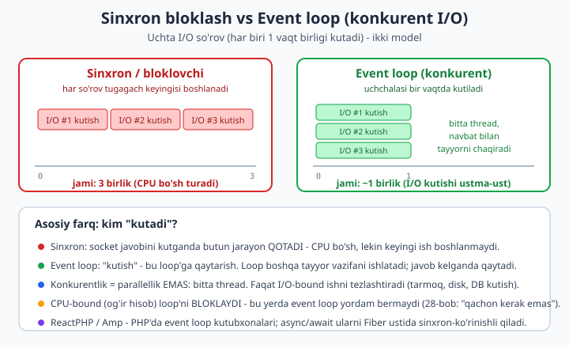
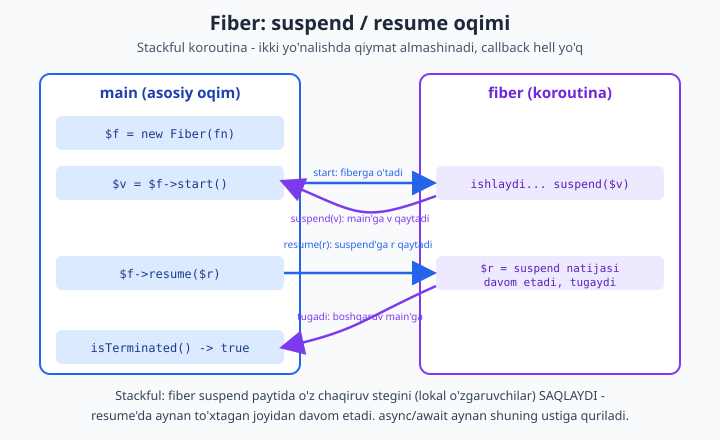

# 28 — Async va parallel PHP (Fibers, ReactPHP)

[⬅️ Oldingi: 27 — Performance va keshlash](./27-performance-keshlash.md) · [🏠 README](./README.md) · [Keyingi: 29 — Navbatlar, observability va deploy ➡️](./29-production.md)

> **Bu bobda:** PHP ning tug'ma modeli — **one-request-one-death**: har so'rov toza boshlanadi, ishlaydi, o'ladi. Bu model **sinxron va bloklovchi**: kod tashqi xizmatdan (DB, HTTP API, fayl) javob kutganda, butun jarayon **qotadi** — CPU bo'sh tursa-da, keyingi ish boshlanmaydi. Ko'p I/O kutadigan vazifalarda (o'nta API ni parallel chaqirish, minglab socketni boshqarish) bu **isrof**. Bu bobda biz one-request-one-death'dan chiqishning bosqichli yo'lini o'rganamiz: avval **generator** ni koroutina sifatida ishlatib (`yield` to'xtaydi, `send()` qiymat kiritadi) **qo'lda kooperativ scheduler** yozamiz; so'ng **Fibers** (PHP 8.1, bu mashinada bor) — `Fiber::start/suspend/resume/throw` bilan **stackful koroutina**, ya'ni sinxron-ko'rinishli async kodning poydevori (callback hell'siz); keyin **ReactPHP** (event loop) bilan haqiqiy **konkurent I/O** — uchta HTTP so'rovni parallel kutib **1.2s o'rniga 0.4s**, timer, async/await, backpressure; **Swoole/OpenSwoole/RoadRunner/Octane/FrankenPHP** — long-running worker va **shared-nothing buzilishi** (bu mashinada yo'q -> illustrativ/config); va nihoyat **qachon async kerak emas** — CPU-bound ishda event loop yordam bermaydi. Generator/Fiber/ReactPHP **haqiqatan ishga tushirildi** — chiqishlar ko'chirib qo'yilgan; Swoole/RoadRunner halol **illustrativ** belgilangan.

---

## One-request-one-death: PHP ning tug'ma modeli

PHP veb-ilovasini ishga tushirganingizda (Apache + mod_php yoki nginx + PHP-FPM), har bir HTTP so'rov uchun mana shu sodir bo'ladi:

1. So'rov keladi -> PHP **noldan** boshlanadi (avtoyuklash, konfiguratsiya, ulanishlar).
2. Kod ishlaydi, javob hosil qiladi.
3. So'rov tugaydi -> PHP jarayon **o'ladi** (xotira tozalanadi, ulanishlar yopiladi).

Bu **shared-nothing** arxitekturasi: so'rovlar bir-biri bilan hech narsa ulashmaydi. Afzalligi — **soddalik va xavfsizlik**: bitta so'rovdagi xato (xotira oqishi, global o'zgaruvchining iflos qolishi) keyingi so'rovga o'tmaydi, chunki hammasi o'ladi va qaytadan tug'iladi. PHP ning butun ekotizimi (superglobal'lar, `register_shutdown_function`, ko'p kutubxonalar) shu modelga asoslangan. Bu PHP ning **kuchli tomoni**, kamchiligi emas.

Lekin shu model ichida bitta jiddiy cheklov bor: **kod sinxron va bloklovchi.** Mana oddiy misol — uchta tashqi API dan ma'lumot olish:

```php
<?php
declare(strict_types=1);

// Har bir so'rov 1 soniya "kutadi" (tarmoq kechikishi).
$a = file_get_contents('https://api.example.com/users');    // 1s kutamiz, jarayon QOTADI
$b = file_get_contents('https://api.example.com/orders');   // yana 1s
$c = file_get_contents('https://api.example.com/products'); // yana 1s
// Jami: ~3 soniya. Holbuki uchchalasi mustaqil - parallel kutilsa ~1s bo'lardi.
```

`file_get_contents` socketdan javob kutganda, butun PHP jarayoni **bloklanadi** — CPU bo'sh turadi, lekin `$b` ni boshlash uchun `$a` tugashi kutiladi. Uchchala so'rov bir-biriga bog'liq emas-ku — ularni **bir vaqtda** kutsak, 3 soniya o'rniga ~1 soniya yetardi. Aynan shu yerda async/konkurent model kerak bo'ladi.



Diqqat: bu yerda **I/O-bound** ish haqida gap ketyapti — vaqt **kutishga** sarflanadi (tarmoq, disk, DB). Agar vaqt **hisobga** sarflansa (CPU-bound — rasm qayta ishlash, katta sonni faktorlash), async hech narsani tezlashtirmaydi — bu haqda bob oxirida.

> **Ko'prik.** Bu bob 27-bobdagi [performance va keshlash](./27-performance-keshlash.md) ning davomi: u yerda "tez javob ber"; bu yerda "kutishni isrof qilma". Kelgusi 29-bobda [navbatlar va deploy](./29-production.md) — og'ir ishni so'rov tashqarisiga (worker'ga) ko'chirish.

---

## I/O-bound vs CPU-bound: tasnif

Async'ga kirishishdan oldin vazifangizni **to'g'ri tasniflang** — bu butun bobning kaliti:

| Mezon | I/O-bound | CPU-bound |
|---|---|---|
| Vaqt qayerga ketadi | **Kutishga** (tarmoq, disk, DB javobi) | **Hisobga** (CPU band) |
| Misol | API chaqirish, fayl o'qish, SQL query | rasm filtri, parol hash, JSON katta parsing tsikli |
| Async yordam beradimi | **HA** — kutish ustma-ust bo'ladi | **YO'Q** — bitta thread baribir band |
| To'g'ri yechim | Event loop / Fibers / konkurent I/O | Ko'p **jarayon** (process), navbat (queue), C-kengaytma |

Async (event loop, Fibers) — bu **kutishni** boshqarish vositasi, hisobni tezlashtiruvchi emas. Buni esda tuting: noto'g'ri tasnif eng keng tarqalgan xato.

---

## Generator koroutina sifatida: qo'lda scheduler

Async'ni tushunishning eng yaxshi yo'li — uni o'zingiz **noldan** qurish. PHP da buning eng sodda quroli — **generator**. Generator — bu `yield` so'zini ishlatadigan funksiya: u **to'xtab, keyin davom eta oladigan** funksiya. Aynan shu "to'xta-davom et" xususiyati koroutinaning yuragi.

`yield` ikki tomonlama ishlaydi:
- `yield $x` — **tashqariga** `$x` qiymatini beradi va **to'xtaydi**.
- `$gen->send($y)` — to'xtagan generatorni **davom ettiradi**, va `yield` ifodasi `$y` ga **teng bo'ladi** (ichkariga qiymat kiritadi).

Avval `send()` ning ikki tomonlamaligini ko'raylik — bu "vazifa natijani kutadi, tashqaridan javob oladi" modelining poydevori:

```php
<?php
declare(strict_types=1);

function hisoblovchi(): Generator
{
    $jami = 0;
    while (true) {
        $qiymat = yield $jami;   // yield $jami: tashqariga joriy yig'indini beradi;
                                 // send($x): $qiymat = $x bo'lib davom etadi
        if ($qiymat === null) {
            break;
        }
        $jami += $qiymat;
    }
    return $jami;
}

$g = hisoblovchi();
$g->current();              // generatorni birinchi yield'gacha "isitamiz" (jami=0)
echo "boshlang'ich: " . $g->current() . "\n";   // 0

echo "send(5)  -> " . $g->send(5) . "\n";        // 5
echo "send(3)  -> " . $g->send(3) . "\n";        // 8
echo "send(10) -> " . $g->send(10) . "\n";       // 18

$g->send(null);            // tsiklni tugatamiz
echo "yakuniy (getReturn): " . $g->getReturn() . "\n";  // 18
```

Haqiqiy chiqish (ishga tushirildi):

```text
boshlang'ich: 0
send(5)  -> 5
send(3)  -> 8
send(10) -> 18
yakuniy (getReturn): 18
```

Endi eng muhim qadam — **bir nechta generatorni navbat bilan** ishlatadigan **kooperativ scheduler** yozamiz. "Kooperativ" degani: hech kim hech kimni majburan to'xtatmaydi; har bir vazifa `yield` qilib boshqaruvni **ixtiyoriy** qaytaradi. Scheduler shunchaki navbatdan birini olib, bir qadam yurguzadi, tugamagan bo'lsa navbat oxiriga qaytaradi:

```php
<?php
declare(strict_types=1);

final class Scheduler
{
    /** @var array<int, Generator> */
    private array $tasks = [];

    public function add(Generator $task): void
    {
        $this->tasks[] = $task;
    }

    public function run(): void
    {
        while ($this->tasks !== []) {
            $task = array_shift($this->tasks);
            $task->next();          // bir qadam: keyingi yield'gacha ishlaydi
            if ($task->valid()) {   // hali tugamagan bo'lsa, navbat oxiriga qaytar
                $this->tasks[] = $task;
            }
        }
    }
}

function ishchi(string $nom, int $qadamlar): Generator
{
    for ($i = 1; $i <= $qadamlar; $i++) {
        echo "[$nom] qadam $i\n";
        yield;  // boshqaruvni scheduler'ga qaytar (kooperativ to'xtash)
    }
    echo "[$nom] tugadi\n";
}

$s = new Scheduler();
$s->add(ishchi('A', 3));
$s->add(ishchi('B', 2));
$s->run();
```

Haqiqiy chiqish (ishga tushirildi):

```text
[A] qadam 1
[A] qadam 2
[B] qadam 1
[B] qadam 2
[A] qadam 3
[B] tugadi
[A] tugadi
```

E'tibor bering: A va B **almashib** ishlayapti, garchi bitta thread bo'lsa-da. `yield` har gal boshqaruvni scheduler'ga qaytaradi, scheduler navbatdagi vazifaga o'tadi. Bu — **konkurentlik** (vazifalar bir-biri bilan o'ralashib bajariladi), lekin **parallellik emas** (bir vaqtda faqat bittasi ishlaydi). Aynan shu — event loop'ning soddalashtirilgan ko'rinishi. Real event loop'da `yield` o'rniga "I/O kutyapman" signali bo'ladi: vazifa I/O kutganda boshqaruvni qaytaradi, scheduler boshqa tayyor vazifani ishlatadi.

Generator-koroutinaning **kamchiligi**: u **stackless**. Ya'ni `yield` faqat generator funksiyasining **o'zida** ishlaydi — agar generator boshqa funksiyani chaqirsa, o'sha ichki funksiyadan `yield` qila olmaysiz. Bu cheklov uchun bizga **stackful** koroutina kerak — Fibers.

---

## Fibers: stackful koroutina (PHP 8.1+)

**Fiber** (PHP 8.1 da yadroda kelgan, bu mashinada PHP 8.4 da bor) — bu **stackful** koroutina. Generatordan farqi: fiber **o'zining to'liq chaqiruv stegini** (lokal o'zgaruvchilar, ichki funksiya chaqiruvlari) saqlaydi va `Fiber::suspend()` ni **istalgan chuqurlikdagi** funksiyadan chaqira oladi. Bu — sinxron-ko'rinishli async kodning poydevori: siz oddiy, tekis kod yozasiz, lekin u to'xtab-davom eta oladi.

Asosiy API:
- `new Fiber(callable)` — fiber yaratadi (hali ishlamaydi).
- `$fiber->start(...$args)` — birinchi `suspend()` gacha ishlatadi, `suspend` bergan qiymatni qaytaradi.
- `Fiber::suspend($v)` — fiber **ichidan** chaqiriladi: boshqaruvni va `$v` ni **tashqariga** qaytaradi.
- `$fiber->resume($r)` — fiberni davom ettiradi; `suspend()` ifodasi `$r` ga teng bo'ladi.
- `Fiber::getCurrent()` — joriy fiber (yoki `null`, agar main thread'da bo'lsak).
- `$fiber->isStarted() / isSuspended() / isTerminated()` — holatni tekshirish.

Ikki yo'nalishli qiymat almashinuvini ko'raylik:

```php
<?php
declare(strict_types=1);

$fiber = new Fiber(function (): void {
    echo "fiber: boshlandi\n";
    $javob = Fiber::suspend('birinchi to\'xtash');  // tashqariga qiymat beradi, qaytishini kutadi
    echo "fiber: resume qiymati = $javob\n";
    Fiber::suspend('ikkinchi to\'xtash');
    echo "fiber: yakunlandi\n";
});

$qiymat = $fiber->start();                 // birinchi suspend'gacha ishlaydi
echo "main: suspend berdi -> $qiymat\n";

$qiymat = $fiber->resume('salom');         // suspend()'ga 'salom' qaytaradi
echo "main: suspend berdi -> $qiymat\n";

$fiber->resume();                          // oxirigacha
echo "main: fiber tugadimi? " . ($fiber->isTerminated() ? 'ha' : 'yoq') . "\n";
```

Haqiqiy chiqish (ishga tushirildi):

```text
fiber: boshlandi
main: suspend berdi -> birinchi to'xtash
fiber: resume qiymati = salom
main: suspend berdi -> ikkinchi to'xtash
fiber: yakunlandi
main: fiber tugadimi? ha
```



Endi Fibers bilan **scheduler** yozamiz — generator misolining aynan ekvivalenti, lekin stackful:

```php
<?php
declare(strict_types=1);

final class FiberScheduler
{
    /** @var array<int, Fiber> */
    private array $fibers = [];

    public function add(callable $vazifa): void
    {
        $this->fibers[] = new Fiber($vazifa);
    }

    public function run(): void
    {
        while ($this->fibers !== []) {
            $fiber = array_shift($this->fibers);
            if (!$fiber->isStarted()) {
                $fiber->start();
            } else {
                $fiber->resume();
            }
            if (!$fiber->isTerminated()) {
                $this->fibers[] = $fiber;  // tugamagan -> navbatga qaytar
            }
        }
    }
}

function vazifa(string $nom, int $n): callable
{
    return function () use ($nom, $n): void {
        for ($i = 1; $i <= $n; $i++) {
            echo "[$nom] ish $i\n";
            Fiber::suspend();  // boshqaruvni qaytar
        }
        echo "[$nom] tamom\n";
    };
}

$sch = new FiberScheduler();
$sch->add(vazifa('X', 3));
$sch->add(vazifa('Y', 2));
$sch->run();
```

Haqiqiy chiqish (ishga tushirildi):

```text
[X] ish 1
[Y] ish 1
[X] ish 2
[Y] ish 2
[X] ish 3
[Y] tamom
[X] tamom
```

### Cancellation: fiberga istisno kiritish

Fibers'da `$fiber->throw($exception)` ham bor — u to'xtagan fiberga **tashqaridan istisno tashlaydi**. Bu **cancellation/timeout** ning poydevori: agar vazifa juda uzoq kutsa, uni `throw` bilan bekor qilamiz va fiber ichidagi `try/catch/finally` tozalashni bajaradi:

```php
<?php
declare(strict_types=1);

$fiber = new Fiber(function (): void {
    try {
        echo "fiber: ishlayapman, javob kutyapman...\n";
        $natija = Fiber::suspend();        // tashqaridan resume yoki throw kutadi
        echo "fiber: natija = $natija\n";  // throw bo'lsa bu yerga yetib kelmaydi
    } catch (RuntimeException $e) {
        echo "fiber: bekor qilindi -> {$e->getMessage()}\n";
    } finally {
        echo "fiber: tozalash (finally) ishladi\n";
    }
});

$fiber->start();
echo "main: fiber to'xtadi, endi uni BEKOR qilamiz (throw)\n";
$fiber->throw(new RuntimeException('timeout: 1s o\'tdi'));
echo "main: fiber tugadimi? " . ($fiber->isTerminated() ? 'ha' : 'yoq') . "\n";
```

Haqiqiy chiqish (ishga tushirildi):

```text
fiber: ishlayapman, javob kutyapman...
main: fiber to'xtadi, endi uni BEKOR qilamiz (throw)
fiber: bekor qilindi -> timeout: 1s o'tdi
fiber: tozalash (finally) ishladi
main: fiber tugadimi? ha
```

> **Amaliy eslatma.** Siz odatda Fibers'ni **qo'lda** yozmaysiz — ReactPHP/Amp kabi kutubxonalar buni **siz uchun** qiladi. Fiber — bu **infratuzilma primitivi**; siz `await()` deb yozasiz, kutubxona ichida `Fiber::suspend()` chaqiriladi. Lekin nima sodir bo'layotganini bilish — debug va arxitektura uchun zarur.

---

## ReactPHP: event loop va konkurent I/O

**ReactPHP** — PHP uchun yetuk va keng tarqalgan **event loop** kutubxonasi (Amp v3 — uning zamonaviy raqibi, async/await uslubiga ko'proq moyil). Bu mashinada `composer` bilan o'rnatildi (`ext-sockets` bor):

```bash
composer require react/event-loop react/http react/socket react/promise react/async
```

**Event loop** — bu cheksiz tsikl: "navbatda tayyor ish bormi? bor bo'lsa ishlat; I/O tayyormi? callback'ni chaqir; timer vaqti keldimi? bajar." Bitta thread, lekin **ko'p ishni navbat bilan** boshqaradi. Bu — biz qo'lda yozgan scheduler'ning sanoatlashgan, I/O bilan ishlaydigan ko'rinishi.

### Timerlar: parallel kutish

Bir nechta timer "parallel" kutishini ko'raylik — hech qaysi boshqasini bloklamaydi:

```php
<?php
declare(strict_types=1);

require __DIR__ . '/vendor/autoload.php';

use React\EventLoop\Loop;

$boshlandi = microtime(true);

// Har 0.3s da uradi, 3 marta (0.3, 0.6, 0.9)
$sanoq = 0;
Loop::addPeriodicTimer(0.3, function ($timer) use (&$sanoq, $boshlandi): void {
    $sanoq++;
    printf("[A] urush #%d  (+%.2fs)\n", $sanoq, microtime(true) - $boshlandi);
    if ($sanoq >= 3) {
        Loop::cancelTimer($timer);   // periodik timerni o'zini to'xtatadi
    }
});

// Bir martalik 0.5s kechikish
Loop::addTimer(0.5, function () use ($boshlandi): void {
    printf("[B] bir martalik (+%.2fs)\n", microtime(true) - $boshlandi);
});

// 0.7s da yana bitta
Loop::addTimer(0.7, function () use ($boshlandi): void {
    printf("[C] kechroq (+%.2fs)\n", microtime(true) - $boshlandi);
});

// 1.0s da - barcha ish tugagach
Loop::addTimer(1.0, function () use ($boshlandi): void {
    printf("Hammasi tugadi (+%.2fs)\n", microtime(true) - $boshlandi);
});

Loop::run();  // loop bo'sh qolguncha ishlaydi
```

Haqiqiy chiqish (ishga tushirildi):

```text
[A] urush #1  (+0.31s)
[B] bir martalik (+0.52s)
[A] urush #2  (+0.62s)
[C] kechroq (+0.70s)
[A] urush #3  (+0.94s)
Hammasi tugadi (+1.01s)
```

E'tibor bering: A, B, C timerlari **vaqt bo'yicha o'ralashgan** — A 0.3/0.6/0.9 da, B 0.5 da, C 0.7 da urdi, hech biri boshqasini kutmadi. `Loop::run()` navbatda hech narsa qolmaguncha ishlaydi.

### Konkurent HTTP: 3 so'rov, 1.2s o'rniga 0.4s

Endi bobning **asosiy va'dasi** — bir nechta HTTP so'rovni **parallel** kutish. Tashqi tarmoqqa bog'liq bo'lmaslik uchun **in-process** HTTP server ko'taramiz (har bir endpoint javobni 0.4s kechiktiradi — "tashqi xizmat" simulyatsiyasi), so'ng uchta so'rovni `all()` bilan parallel yuboramiz:

```php
<?php
declare(strict_types=1);

require __DIR__ . '/vendor/autoload.php';

use Psr\Http\Message\ServerRequestInterface;
use React\EventLoop\Loop;
use React\Http\Browser;
use React\Http\HttpServer;
use React\Http\Message\Response;
use React\Promise\PromiseInterface;
use React\Socket\SocketServer;
use function React\Promise\all;

// 1) In-process HTTP server: har bir endpoint javobni sun'iy KECHIKTIRADI (I/O simulyatsiyasi).
$socket = new SocketServer('127.0.0.1:8718');
$server = new HttpServer(function (ServerRequestInterface $request): PromiseInterface {
    $yul = $request->getUri()->getPath();          // masalan /a
    $kechikish = 0.4;                                // har biri 0.4s "tashqi xizmat"
    return new React\Promise\Promise(function ($resolve) use ($yul, $kechikish) {
        Loop::addTimer($kechikish, function () use ($resolve, $yul) {
            $resolve(Response::plaintext("javob{$yul}\n"));
        });
    });
});
$server->listen($socket);

$browser = new Browser();
$baza = 'http://127.0.0.1:8718';
$boshlandi = microtime(true);

// 2) Uchta so'rovni PARALLEL yuboramiz. Har biri 0.4s - ketma-ket bo'lsa 1.2s.
//    Event loop ularni bir vaqtda kutadi -> ~0.4s.
$qabariq = all([
    $browser->get("$baza/a"),
    $browser->get("$baza/b"),
    $browser->get("$baza/c"),
]);

$qabariq->then(function (array $javoblar) use ($boshlandi, $socket) {
    foreach ($javoblar as $i => $r) {
        echo "so'rov #$i -> " . trim((string) $r->getBody()) . "\n";
    }
    printf("3 ta so'rov PARALLEL: %.2fs (ketma-ket ~1.2s bo'lardi)\n", microtime(true) - $boshlandi);
    $socket->close();   // serverni yopamiz -> loop bo'shaydi -> dastur tugaydi
});

Loop::run();
```

Haqiqiy chiqish (ishga tushirildi):

```text
so'rov #0 -> javob/a
so'rov #1 -> javob/b
so'rov #2 -> javob/c
3 ta so'rov PARALLEL: 0.43s (ketma-ket ~1.2s bo'lardi)
```

Mana isbot: har biri 0.4s bo'lgan **uchta** so'rov **0.43s** da tugadi — ketma-ket bo'lsa 1.2s bo'lardi. Bitta thread, lekin uchchala "kutish" **ustma-ust** ketdi. Bu — event loop'ning butun mohiyati.

> **Halol eslatma (Windows muhiti).** Bu mashinada (Windows) ReactPHP ning DNS qatlami konfiguratsiyani o'qiyotganda `wmic ... is not recognized` ogohlantirishi va kutubxona ichidagi `Deprecated: preg_match_all()` xabari chiqdi. Bular **bizning kodimizdagi xato emas** — ular kutubxona ichidagi platformaga bog'liq shovqin; natija va vaqtlar to'g'ri. Productionda ReactPHP odatda Linux'da ishlaydi va bu shovqin bo'lmaydi.

### Promise / async-await: callback hell'siz

Yuqorida `->then(...)` callback ishlatdik. Ko'p ketma-ket async qadamda bu **callback hell** (ichma-ich uyalgan `then`'lar) ga olib keladi. `react/async` ning `async()` / `await()` funksiyalari — Fibers ustiga qurilgan — buni **tekis, sinxron-ko'rinishli** kodga aylantiradi:

```php
<?php
declare(strict_types=1);

require __DIR__ . '/vendor/autoload.php';

use Psr\Http\Message\ServerRequestInterface;
use React\EventLoop\Loop;
use React\Http\Browser;
use React\Http\HttpServer;
use React\Http\Message\Response;
use React\Promise\PromiseInterface;
use React\Socket\SocketServer;
use function React\Async\async;
use function React\Async\await;

$socket = new SocketServer('127.0.0.1:8719');
$server = new HttpServer(function (ServerRequestInterface $r): PromiseInterface {
    return new React\Promise\Promise(function ($resolve) use ($r) {
        Loop::addTimer(0.3, fn () => $resolve(Response::plaintext('OK ' . $r->getUri()->getPath())));
    });
});
$server->listen($socket);

$browser = new Browser();

// await() faqat async() ichida ishlaydi - u Fiber'ni suspend qiladi, javob kelgach resume.
$asosiy = async(function () use ($browser, $socket): void {
    echo "1) birinchi so'rov...\n";
    $r1 = await($browser->get('http://127.0.0.1:8719/birinchi'));
    echo "   keldi: " . trim((string) $r1->getBody()) . "\n";

    echo "2) ikkinchi so'rov (birinchi tugagach)...\n";
    $r2 = await($browser->get('http://127.0.0.1:8719/ikkinchi'));
    echo "   keldi: " . trim((string) $r2->getBody()) . "\n";

    echo "callback hell yo'q - tekis, ketma-ket o'qiladigan kod\n";
    $socket->close();
});

$asosiy();
Loop::run();
```

Haqiqiy chiqish (ishga tushirildi — kutubxonaning Windows `Deprecated` shovqini olib tashlangan):

```text
1) birinchi so'rov...
   keldi: OK /birinchi
2) ikkinchi so'rov (birinchi tugagach)...
   keldi: OK /ikkinchi
callback hell yo'q - tekis, ketma-ket o'qiladigan kod
```

E'tibor bering: kod **sinxronday o'qiladi** (`$r1 = await(...)`, keyin `$r2 = await(...)`), lekin `await` ichida `Fiber::suspend()` chaqiriladi — javob kutilayotganda event loop **boshqa ishni** bajaradi. Aynan shu — Fibers nima uchun PHP ga qo'shilganining sababi: **async kodni callback'larsiz yozish**. (Parallel kerak bo'lsa `await` o'rniga `all([...])` ishlating — yuqoridagidek.)

### Backpressure: producer'ni jilovlash

**Backpressure** — bu konkurent tizimdagi muhim tushuncha: agar **ishlab chiqaruvchi** (producer) **iste'molchidan** (consumer) tezroq bo'lsa, ortiqcha ish to'planib, **xotira to'lib ketadi**. Yechim — producer'ni iste'molchi tayyor bo'lguncha **to'xtatib turish** (`pause`/`resume`). ReactPHP oqimlarida bu o'rnatilgan; mantiqni qo'lda ham ko'rsatamiz:

```php
<?php
declare(strict_types=1);

require __DIR__ . '/vendor/autoload.php';

use React\EventLoop\Loop;

final class SekinIstemolchi
{
    private bool $band = false;

    public function __construct(private readonly float $boshlandi) {}

    /** @return bool false = "to'xta, men bandman" (producer pause qilishi kerak) */
    public function yoz(string $bolak): bool
    {
        if ($this->band) {
            return false;
        }
        $this->band = true;
        printf("[consumer] '%s' qayta ishlanyapti (0.2s)...\n", $bolak);
        Loop::addTimer(0.2, function () use ($bolak): void {
            $this->band = false;
            printf("[consumer] '%s' tayyor (+%.2fs)\n", $bolak, microtime(true) - $this->boshlandi);
        });
        return true;   // qabul qildim, lekin band bo'ldim
    }

    public function bandmi(): bool
    {
        return $this->band;
    }
}

$boshlandi = microtime(true);
$consumer = new SekinIstemolchi($boshlandi);
$navbat = ['A', 'B', 'C'];

// Producer har 0.05s da bo'lak ishlab chiqaradi (consumer'dan 4x tez).
Loop::addPeriodicTimer(0.05, function ($timer) use (&$navbat, $consumer): void {
    if ($navbat === []) {
        Loop::cancelTimer($timer);
        return;
    }
    if ($consumer->bandmi()) {
        echo "[producer] consumer band -> KUTAMAN (backpressure)\n";  // pause effekti
        return;
    }
    $bolak = array_shift($navbat);
    $consumer->yoz($bolak);
});

Loop::addTimer(1.0, fn () => print("Hammasi qayta ishlandi\n"));

Loop::run();
```

Haqiqiy chiqish (ishga tushirildi):

```text
[consumer] 'A' qayta ishlanyapti (0.2s)...
[producer] consumer band -> KUTAMAN (backpressure)
[producer] consumer band -> KUTAMAN (backpressure)
[producer] consumer band -> KUTAMAN (backpressure)
[consumer] 'A' tayyor (+0.26s)
[consumer] 'B' qayta ishlanyapti (0.2s)...
[producer] consumer band -> KUTAMAN (backpressure)
[producer] consumer band -> KUTAMAN (backpressure)
[producer] consumer band -> KUTAMAN (backpressure)
[consumer] 'B' tayyor (+0.53s)
[consumer] 'C' qayta ishlanyapti (0.2s)...
[consumer] 'C' tayyor (+0.77s)
Hammasi qayta ishlandi
```

Producer iste'molchi band bo'lganda "KUTAMAN" deb to'xtab turdi — bu backpressure: navbat nazoratsiz o'smaydi, xotira xavfsiz qoladi.

---

## Long-running worker: Swoole / RoadRunner / Octane / FrankenPHP

> **DIQQAT — illustrativ bo'lim.** Quyidagi runtime'lar **bu mashinada o'rnatilmagan** (Swoole/OpenSwoole kengaytmasi yo'q; RoadRunner/FrankenPHP — alohida ikkilik fayl/runtime). Shuning uchun kod va config **haqiqiy va to'g'ri**, lekin chiqish **kutilgan** sifatida ko'rsatilgan — bu mashinada ishga tushirilmadi. Productionda **o'rnatish kerak** deb halol belgilayman.

ReactPHP/Amp — kutubxona; ular PHP-FPM ichida ham, mustaqil ham ishlaydi. **Swoole, OpenSwoole, RoadRunner, Laravel Octane, FrankenPHP** esa **boshqa narsa**: ular PHP **ish vaqti modelini** o'zgartiradi. Asosiy g'oya — **long-running worker**:

- An'anaviy PHP-FPM: har so'rovda PHP **noldan yuklanadi** (framework bootstrap, container, route'lar) -> o'ladi.
- Long-running worker: PHP **bir marta yuklanadi**, so'ng **ming-minglab so'rovni** o'sha xotiradagi holatda ishlaydi. Bootstrap bir marta -> har so'rov **tezroq**.

Tezlik foydasi katta (ko'pincha 2-5x), lekin bitta jiddiy **xavf** bilan keladi: **shared-nothing buziladi.**

### Shared-nothing buzilishi: state leak

PHP-FPM da har so'rov toza boshlangani uchun, global/static holatni tozalash haqida o'ylamaysiz — jarayon o'ladi, hammasi ketadi. Long-running worker'da esa jarayon **yashaydi**, demak global/static holat **so'rovlar orasida qoladi**. Bu — **memory leak** va **ma'lumot oqishi** (bir foydalanuvchining ma'lumoti boshqasiga ko'rinishi!) manbai. Buni real run bilan ko'rsatamiz (bu **oddiy PHP** — ishga tushirildi; "so'rov"lar tsikl bilan simulyatsiya qilingan):

```php
<?php
declare(strict_types=1);

final class Hisoblagich
{
    // static xususiyat - worker yashash davomida YASHAYDI
    private static int $jami = 0;

    public static function qayd(int $n): int
    {
        self::$jami += $n;   // har so'rovda oshib boraveradi -> oqish (leak)
        return self::$jami;
    }

    public static function tozala(): void
    {
        self::$jami = 0;     // har so'rov oxirida ATAYLAB tozalash kerak
    }
}

echo "=== Worker bitta marta yuklangan, 3 'so'rov'ni ishlaydi ===\n\n";

echo "Tozalashsiz (xato):\n";
foreach ([1, 2, 3] as $sorov) {
    echo "  so'rov $sorov -> jami=" . Hisoblagich::qayd(10) . " (har safar +10 yopishib qoladi)\n";
}

Hisoblagich::tozala();   // demo uchun toza boshlaymiz

echo "\nHar so'rov oxirida tozalansa (to'g'ri):\n";
foreach ([1, 2, 3] as $sorov) {
    $natija = Hisoblagich::qayd(10);
    echo "  so'rov $sorov -> jami=$natija\n";
    Hisoblagich::tozala();   // shared-nothing'ni QO'LDA tiklaymiz
}
```

Haqiqiy chiqish (ishga tushirildi):

```text
=== Worker bitta marta yuklangan, 3 'so'rov'ni ishlaydi ===

Tozalashsiz (xato):
  so'rov 1 -> jami=10 (har safar +10 yopishib qoladi)
  so'rov 2 -> jami=20 (har safar +10 yopishib qoladi)
  so'rov 3 -> jami=30 (har safar +10 yopishib qoladi)

Har so'rov oxirida tozalansa (to'g'ri):
  so'rov 1 -> jami=10
  so'rov 2 -> jami=10
  so'rov 3 -> jami=10
```

Mana xavf: tozalashsiz `jami` 10 -> 20 -> 30 deb **oshib boryapti** — bu real ilovada `static` cache, ochiq DB ulanishi yoki container'da yopishib qolgan request obyekti bo'lishi mumkin. Long-running worker'da siz **har so'rov oxirida holatni tozalash** intizomiga majbursiz.

Amaliy qoidalar (shared-nothing'ni saqlash):
- **Static/global o'zgaruvchini holat saqlash uchun ishlatmang** — yoki har so'rov oxirida tozalang.
- **Container'dan request-scoped obyektni** keyingi so'rovga olib o'tmang (Octane bu uchun maxsus "reset" qiladi).
- **Resurslarni** (DB ulanishi) **uzunumrli** qilib, lekin holatini tozalab saqlang (connection pooling).
- **Xotirani kuzating**: agar har so'rovdan keyin xotira o'saversa — leak bor; worker'ni **N so'rovdan keyin restart** qiling (`max_requests`).

### Misol konfiguratsiyalar (illustrativ — runtime kerak)

**RoadRunner** (`.rr.yaml`) — Go bilan yozilgan server, PHP worker'larni boshqaradi:

```yaml
# .rr.yaml — bu mashinada RoadRunner ikkilik fayli (rr) kerak: https://roadrunner.dev
version: "3"

server:
  command: "php worker.php"   # long-running PHP worker

http:
  address: "0.0.0.0:8080"
  pool:
    num_workers: 4            # 4 ta worker jarayon (CPU yadrolaringizga qarab)
    max_jobs: 256             # har worker 256 so'rovdan keyin RESTART (leak himoyasi)
    supervisor:
      max_worker_memory: 128  # MB; oshib ketsa worker restart
```

**Laravel Octane** (`config/octane.php` ning kaliti) — Swoole/RoadRunner/FrankenPHP ustida Laravel:

```php
<?php
// config/octane.php (qisqartirilgan) — `php artisan octane:start` kerak
return [
    'server' => env('OCTANE_SERVER', 'frankenphp'),  // yoki 'swoole', 'roadrunner'
    'max_execution_time' => 30,
    // Har so'rovdan keyin TOZALANADIGAN holatlar (state leak himoyasi):
    'warm' => [/* har so'rovda qayta yaratiladigan binding'lar */],
    'flush' => [/* har so'rovdan keyin container'dan o'chiriladiganlar */],
];
```

**FrankenPHP** (Caddy ichiga o'rnatilgan PHP runtime) — `Dockerfile`:

```dockerfile
# Dockerfile — FrankenPHP rasmi (bu mashinada Docker run yo'q -> illustrativ)
FROM dunglas/frankenphp:latest

COPY . /app
WORKDIR /app

# worker mode: PHP bir marta yuklanadi, ko'p so'rovni ishlaydi
ENV FRANKENPHP_CONFIG="worker ./public/index.php"
```

**Swoole** worker'ning soddalashtirilgan ko'rinishi (kod **to'g'ri**, lekin `ext-swoole` kerak):

```php
<?php
declare(strict_types=1);

// MUHIT: bu kod uchun `pecl install swoole` (Linux) kerak - bu mashinada YO'Q.
$server = new Swoole\Http\Server('127.0.0.1', 9501);

// onWorkerStart: PHP bir marta yuklanadi (bootstrap shu yerda).
$server->on('start', fn () => print("Swoole server: http://127.0.0.1:9501\n"));

// onRequest: har so'rov - lekin PHP qayta yuklanmaydi (worker yashaydi).
$server->on('request', function ($request, $response) {
    // DIQQAT: bu yerda global/static holatga tegmang - so'rovlar orasida qoladi!
    $response->header('Content-Type', 'text/plain');
    $response->end("Salom, worker PID: " . getmypid() . "\n");
});

$server->start();
```

Kutilgan chiqish (Swoole o'rnatilgan Linux muhitida):

```text
Swoole server: http://127.0.0.1:9501
# har so'rovda bir xil PID (worker yashayapti), masalan: Salom, worker PID: 41233
```

### pcntl fork (Unix — bu mashinada yo'q)

Unix'da haqiqiy **parallel jarayon** uchun `pcntl_fork()` ishlatiladi (jarayonni nusxalaydi). Bu **Windows'da yo'q** (`pcntl` kengaytmasi bu mashinada yo'q), shuning uchun **illustrativ**:

```php
<?php
declare(strict_types=1);

// MUHIT: pcntl FAQAT Unix'da (Linux/macOS). Windows'da bu kod ishlamaydi.
$pid = pcntl_fork();   // jarayonni IKKIGA bo'ladi

if ($pid === -1) {
    exit("fork muvaffaqiyatsiz\n");
} elseif ($pid === 0) {
    echo "BOLA jarayon (PID " . getmypid() . ")\n";   // bola: pcntl_fork() 0 qaytaradi
} else {
    echo "OTA jarayon, bola PID = $pid\n";             // ota: bolaning PID'ini oladi
    pcntl_wait($status);                                // bolani kutadi
}
```

Bu — **haqiqiy parallellik** (ikki alohida jarayon, alohida xotira), event loop'ning konkurentligidan farqli. CPU-bound ishni **bir nechta yadroga** taqsimlash uchun aynan shu (yoki kutubxona: `spatie/fork`, `amphp/parallel`) kerak.

---

## Qachon async KERAK EMAS

Bu eng muhim, lekin tez-tez unutiladigan qism. Async (event loop, Fibers) — **sehrli tezlatuvchi emas**. U faqat **I/O kutishni** ustma-ust qo'yadi. **CPU-bound** ishda — bitta thread baribir band bo'lgani uchun — u **hech narsa bermaydi**, hatto zarar qiladi (loop bloklanib, boshqa hamma narsa kechikadi). Buni real run bilan isbotlaylik:

```php
<?php
declare(strict_types=1);

require __DIR__ . '/vendor/autoload.php';

use React\EventLoop\Loop;

function ogirHisob(int $n): int
{
    $s = 0;
    for ($i = 0; $i < $n; $i++) {
        $s += (int) sqrt($i);   // sof CPU ishi, I/O kutish yo'q
    }
    return $s;
}

$boshlandi = microtime(true);

// Timer 0.1s ga rejalashtirilgan - lekin pastdagi bloklovchi hisob uni ushlab turadi.
Loop::addTimer(0.1, function () use ($boshlandi): void {
    printf("[timer] men 0.1s da chiqishim kerak edi, lekin (+%.2fs) da chiqdim\n",
        microtime(true) - $boshlandi);
});

// Bu funksiya event loop'ni bloklab qo'yadi: u tugamaguncha hech narsa ishlamaydi.
Loop::futureTick(function () use ($boshlandi): void {
    $natija = ogirHisob(20_000_000);
    printf("[cpu] hisob tugadi: %d (+%.2fs) - loop shu vaqt davomida QOTGAN edi\n",
        $natija, microtime(true) - $boshlandi);
});

Loop::run();
```

Haqiqiy chiqish (ishga tushirildi):

```text
[cpu] hisob tugadi: 59618479180 (+0.73s) - loop shu vaqt davomida QOTGAN edi
[timer] men 0.1s da chiqishim kerak edi, lekin (+0.73s) da chiqdim
```

Mana isbot: 0.1s ga rejalashtirilgan timer **0.73s** da chiqdi — chunki CPU-bound hisob event loop'ni **bloklab** qo'ydi. Async bu yerda hech narsa berolmaydi, aksincha — boshqa hamma vazifani **kechiktiradi**. CPU-bound ish uchun to'g'ri yechim: **ko'p jarayon** (`pcntl_fork`, `amphp/parallel`), **navbat** (29-bob — og'ir ishni worker'ga ko'chirish) yoki **C-kengaytma**.

**Async KERAK EMAS bo'lgan holatlar:**
- **CPU-bound** ish (hisob, rasm/video qayta ishlash, kriptografiya) — yuqorida ko'rsatildi.
- **Oddiy CRUD** ilova kam trafik bilan — PHP-FPM yetarli, async murakkablik qo'shadi.
- **Bitta tezkor DB query** — async qo'shimcha overhead, foyda yo'q.
- Jamoangiz async modelni bilmasa — debug va xatolar qiyinlashadi (productionda ehtiyot bo'ling).

**Async FOYDALI bo'lgan holatlar:**
- **Ko'p tashqi API** ni parallel chaqirish (gateway, aggregator).
- **Real-time** (WebSocket, SSE) — minglab ochiq ulanish.
- **Yuqori konkurentlikdagi** I/O xizmati (proxy, chat server).
- **Long-running worker** bilan bootstrap overhead'ini yo'qotish.

---

## Yakuniy taqqoslash jadvali

| Vosita | Tur | Stackful? | Bu mashinada | Eng mos joy |
|---|---|---|---|---|
| Generator (`yield`) | Koroutina | Yo'q | RUN qilindi | O'rganish, lazy iterator, oqim |
| Fibers (8.1+) | Koroutina | Ha | RUN qilindi | async kutubxonalar poydevori |
| ReactPHP / Amp | Event loop | Ha (Amp/async) | RUN qilindi | konkurent I/O, real-time |
| Swoole / OpenSwoole | Runtime (coroutine) | Ha | yo'q (kengaytma) | yuqori yuk, long-running |
| RoadRunner / Octane / FrankenPHP | App server | — | yo'q (runtime) | tezkor worker, framework |
| pcntl_fork | Process | — | yo'q (Unix) | CPU-bound parallel |

> **Ko'prik.** Async kodni ham testlash kerak — [PHPUnit chuqur](./22-phpunit-chuqur.md) va [static analysis](./24-static-analysis.md) bu yerda ham amal qiladi (Promise/await turlarini PHPStan tekshiradi). Og'ir ishni so'rov tashqarisiga ko'chirishning **production** yo'li — keyingi [29-bob: navbatlar, observability, deploy](./29-production.md). DI va Repository bilan integratsiya — [13-bob](./13-di-konteyner.md) va [21-bob](./21-taktik-dizayn.md).

---

## Mashqlar

### Oson

1. **Generator scheduler kengaytirish.** Yuqoridagi `Scheduler` ga `ishchi('C', 4)` qo'shing va chiqishni bashorat qiling, so'ng ishga tushirib tekshiring. A/B/C qanday almashadi?
2. **Fiber holatini kuzatish.** Bitta fiber yarating, `start()` dan keyin va `resume()` dan keyin `isStarted()`, `isSuspended()`, `isTerminated()` ni chop eting. Har bosqichda qaysi `true`?
3. **ReactPHP timer.** `Loop::addTimer` bilan 1s, 2s, 0.5s da uchta xabar chop etadigan skript yozing. Ular qaysi tartibda chiqadi va nega?

### O'rta

4. **Parallel vs ketma-ket o'lchov.** ReactPHP `Browser` bilan beshta in-process so'rovni (a) `all()` bilan parallel, (b) `await()` bilan ketma-ket yuboring. Har biri 0.2s kechiksin. Ikki holatning umumiy vaqtini o'lchang va solishtiring.
5. **Fiber bilan timeout.** Fiber'ni `suspend()` qiling, so'ng `$fiber->throw(new RuntimeException('timeout'))` bilan bekor qiling. Fiber ichida `try/finally` bilan tozalash bajarilganini tasdiqlang.
6. **State leak tuzatish.** `09-state-leak.php` ga o'xshash `static` cache'li klass yozing. Avval leak'ni ko'rsating (so'rovlar orasida o'sadi), so'ng `tozala()` metodini qo'shib, har "so'rov" dan keyin chaqirib tuzating.

### Qiyin

7. **Mini event-loop generator bilan.** `yield` qiymat sifatida "kechikish" (masalan `yield 0.3`) qaytaradigan generatorlar uchun scheduler yozing: scheduler eng kichik kechikishni kutib (sodda `usleep` bilan), navbatni vaqt bo'yicha boshqarsin. Uchta turli kechikishli vazifani ishlating.
8. **Backpressure'li navbat.** ReactPHP bilan producer (har 0.05s da element) va consumer (har element 0.2s) yozing. Navbat uzunligini har tickda chop eting va u **5 dan oshmasligini** ta'minlovchi backpressure mantiqini (producer'ni pause qilish) qo'shing.
9. **CPU-bound'ni o'lchab isbotlash.** Event loop ichida og'ir CPU funksiyasi ishlating va parallel timer qo'ying. Timer rejalashtirilgan vaqtdan necha soniya kech chiqqanini o'lchab, "async CPU'ga yordam bermaydi" da'vosini raqam bilan tasdiqlang.

---

<details markdown="1"><summary>Yechim — 1</summary>

`$s->add(ishchi('C', 4))` qo'shilsa, scheduler navbatni round-robin bo'yicha aylantiradi — lekin diqqat: generator **ishga tushirilmagan** (unprimed) holatda qo'shiladi. `run()` ichidagi birinchi `$task->next()` chaqirig'i to'xtatilmagan generatorni avtomatik **start** qiladi va uni **ikkinchi** `yield` gacha yurguzadi — natijada birinchi navbatdayoq vazifa **ikki** qadam chop etadi. Bu — asosiy matndagi (yuqorida ko'rsatilgan A/B misoli: `[A] qadam 1`, `[A] qadam 2`, `[B] qadam 1`...) bilan aynan bir xil xatti-harakat. Shu sabab "toza" A1, B1, C1 round-robin **chiqmaydi**.

Haqiqiy chiqish (ishga tushirildi, A=3, B=2, C=4 qadam):

```text
[A] qadam 1
[A] qadam 2
[B] qadam 1
[B] qadam 2
[C] qadam 1
[C] qadam 2
[A] qadam 3
[B] tugadi
[C] qadam 3
[A] tugadi
[C] qadam 4
[C] tugadi
```

Tushuntirish: birinchi aylanishda A, B, C navbat bilan **ikki**-ikkitadan qadam chop etadi (unprimed `next()` ikki yield'gacha yuradi), shundan keyin har bir vazifa **bir** qadamdan davom etadi. Tugash tartibi qadamlar soniga bog'liq: B birinchi bo'lib tugaydi (2 qadam), keyin A (3), oxirida C (4) — chunki har bir generator `valid()` bo'lguncha navbat oxiriga qaytib turadi. (Agar "toza" A1, B1, C1 round-robin kerak bo'lsa, generatorlarni qo'shishdan oldin `next()` bilan **prime** qilish — ya'ni har birini birinchi `yield` gacha oldindan yurguzish — kerak bo'ladi.)
</details>

<details markdown="1"><summary>Yechim — 2</summary>

```php
<?php
declare(strict_types=1);

$f = new Fiber(function (): void {
    Fiber::suspend();
});

echo "yaratildi:  started=" . var_export($f->isStarted(), true) . "\n"; // false

$f->start();
echo "start so'ng: started=" . var_export($f->isStarted(), true)
   . " suspended=" . var_export($f->isSuspended(), true)
   . " terminated=" . var_export($f->isTerminated(), true) . "\n"; // true, true, false

$f->resume();
echo "resume so'ng: terminated=" . var_export($f->isTerminated(), true) . "\n"; // true
```

`start()` dan keyin fiber `suspend()` da to'xtaydi -> `isStarted()=true`, `isSuspended()=true`. `resume()` fiberni oxirigacha olib boradi -> `isTerminated()=true`, `isSuspended()=false`.
</details>

<details markdown="1"><summary>Yechim — 3</summary>

```php
<?php
declare(strict_types=1);

require __DIR__ . '/vendor/autoload.php';

use React\EventLoop\Loop;

Loop::addTimer(1.0, fn () => print("1s timer\n"));
Loop::addTimer(2.0, fn () => print("2s timer\n"));
Loop::addTimer(0.5, fn () => print("0.5s timer\n"));

Loop::run();
```

Chiqish tartibi **rejalashtirilgan vaqt** bo'yicha, kod tartibi bo'yicha emas:

```text
0.5s timer
1s timer
2s timer
```

Event loop timerlarni **deadline** bo'yicha saralaydi — qaysi birinchi yetilsa, o'sha birinchi chiqadi.
</details>

<details markdown="1"><summary>Yechim — 4</summary>

```php
<?php
declare(strict_types=1);

require __DIR__ . '/vendor/autoload.php';

use Psr\Http\Message\ServerRequestInterface;
use React\EventLoop\Loop;
use React\Http\Browser;
use React\Http\HttpServer;
use React\Http\Message\Response;
use React\Promise\PromiseInterface;
use React\Socket\SocketServer;
use function React\Async\async;
use function React\Async\await;
use function React\Promise\all;

$socket = new SocketServer('127.0.0.1:8730');
$server = new HttpServer(fn (ServerRequestInterface $r): PromiseInterface =>
    new React\Promise\Promise(fn ($res) =>
        Loop::addTimer(0.2, fn () => $res(Response::plaintext('ok')))));
$server->listen($socket);

$b = new Browser();
$baza = 'http://127.0.0.1:8730/';

async(function () use ($b, $baza, $socket): void {
    // (a) parallel
    $t = microtime(true);
    await(all([$b->get($baza), $b->get($baza), $b->get($baza), $b->get($baza), $b->get($baza)]));
    printf("parallel (5x0.2s): %.2fs\n", microtime(true) - $t);   // ~0.2s

    // (b) ketma-ket
    $t = microtime(true);
    for ($i = 0; $i < 5; $i++) {
        await($b->get($baza));
    }
    printf("ketma-ket (5x0.2s): %.2fs\n", microtime(true) - $t);  // ~1.0s

    $socket->close();
})();

Loop::run();
```

Kutilgan: parallel ~0.2s (hammasi ustma-ust), ketma-ket ~1.0s (5 x 0.2s). I/O-bound ishda parallel 5x tez.
</details>

<details markdown="1"><summary>Yechim — 5</summary>

```php
<?php
declare(strict_types=1);

$resurs = 'ochiq-ulanish';

$f = new Fiber(function () use (&$resurs): void {
    try {
        Fiber::suspend();   // javob kutamiz
    } catch (RuntimeException $e) {
        echo "bekor: {$e->getMessage()}\n";
    } finally {
        $resurs = 'yopildi';   // tozalash HAR DOIM bajariladi
        echo "finally: resurs $resurs\n";
    }
});

$f->start();
$f->throw(new RuntimeException('timeout'));
echo "tashqarida: resurs = $resurs\n";  // yopildi
```

Kutilgan chiqish:

```text
bekor: timeout
finally: resurs yopildi
tashqarida: resurs = yopildi
```

`throw()` fiberga istisno kiritadi, `catch` uni ushlaydi, `finally` resursni tozalaydi — cancellation'da resurs oqishi oldi olinadi.
</details>

<details markdown="1"><summary>Yechim — 6</summary>

```php
<?php
declare(strict_types=1);

final class Cache
{
    /** @var array<string, string> */
    private static array $store = [];

    public static function put(string $k, string $v): void
    {
        self::$store[$k] = $v;
    }

    public static function size(): int
    {
        return count(self::$store);
    }

    public static function flush(): void
    {
        self::$store = [];   // shared-nothing tiklash
    }
}

echo "Tozalashsiz (leak):\n";
foreach (['a', 'b', 'c'] as $sorov) {
    Cache::put($sorov, 'data');
    echo "  so'rov '$sorov' -> cache hajmi = " . Cache::size() . "\n";  // 1,2,3 - o'sadi!
}

Cache::flush();
echo "\nHar so'rovdan keyin flush (to'g'ri):\n";
foreach (['a', 'b', 'c'] as $sorov) {
    Cache::put($sorov, 'data');
    echo "  so'rov '$sorov' -> cache hajmi = " . Cache::size() . "\n";  // har safar 1
    Cache::flush();
}
```

Kutilgan: tozalashsiz hajm 1->2->3 (leak); `flush()` bilan har safar 1. Long-running worker'da `static` holat so'rovlar orasida yashaydi — uni boshqarish shart.
</details>

<details markdown="1"><summary>Yechim — 7</summary>

```php
<?php
declare(strict_types=1);

final class VaqtScheduler
{
    /** @var array<int, array{gen: Generator, vaqt: float}> */
    private array $tasks = [];

    public function add(Generator $gen): void
    {
        $this->tasks[] = ['gen' => $gen, 'vaqt' => microtime(true)];
    }

    public function run(): void
    {
        $boshlandi = microtime(true);
        while ($this->tasks !== []) {
            // Eng erta tayyor bo'ladigan vazifani tanlaymiz
            usort($this->tasks, fn ($a, $b) => $a['vaqt'] <=> $b['vaqt']);
            $task = array_shift($this->tasks);

            $kutish = $task['vaqt'] - microtime(true);
            if ($kutish > 0) {
                usleep((int) ($kutish * 1_000_000));   // sodda: navbatdagini kutamiz
            }

            $gen = $task['gen'];
            if (!$gen->valid()) {
                continue;
            }
            $kechikish = $gen->current();   // yield qaytargan kechikish (soniya)
            $gen->next();
            if ($gen->valid()) {
                $task['vaqt'] = microtime(true) + (float) $kechikish;
                $this->tasks[] = $task;
            }
        }
        printf("Hammasi tugadi (+%.2fs)\n", microtime(true) - $boshlandi);
    }
}

function vazifa(string $nom, float $kechikish, int $n): Generator
{
    for ($i = 1; $i <= $n; $i++) {
        printf("[%s] ish %d\n", $nom, $i);
        yield $kechikish;   // shu muddat kutib, keyin davom et
    }
}

$s = new VaqtScheduler();
$s->add(vazifa('TEZ', 0.1, 3));
$s->add(vazifa('SEKIN', 0.3, 2));
$s->run();
```

Bu — generator'larda **vaqt-asosli** scheduler: `yield $kechikish` orqali vazifa "meni shu muddatdan keyin davom ettir" deydi. TEZ vazifa SEKIN'dan ko'proq marta ishlaydi. (Bu `usleep` bilan bloklovchi — real event loop o'rniga faqat tushuntirish uchun; haqiqatda ReactPHP `Loop::addTimer` ishlatiladi.)
</details>

<details markdown="1"><summary>Yechim — 8</summary>

```php
<?php
declare(strict_types=1);

require __DIR__ . '/vendor/autoload.php';

use React\EventLoop\Loop;

$navbat = [];           // bajarilishi kutilayotgan elementlar
$ishlabChiqarildi = 0;
$consumerBand = false;

// Consumer: har 0.2s da bitta elementni "qayta ishlaydi"
function consumerIshla(array &$navbat, bool &$band, float $boshlandi): void
{
    if ($band || $navbat === []) {
        return;
    }
    $band = true;
    $el = array_shift($navbat);
    Loop::addTimer(0.2, function () use (&$band, $el, $boshlandi, &$navbat): void {
        printf("[consumer] '%s' tayyor, navbatda %d (+%.2fs)\n",
            $el, count($navbat), microtime(true) - $boshlandi);
        $band = false;
    });
}

$boshlandi = microtime(true);

// Producer: har 0.05s da element qo'shadi, lekin navbat 5 ga yetsa PAUSE
Loop::addPeriodicTimer(0.05, function ($timer) use (&$navbat, &$ishlabChiqarildi, &$consumerBand, $boshlandi): void {
    if ($ishlabChiqarildi >= 12) {
        Loop::cancelTimer($timer);
        return;
    }
    if (count($navbat) >= 5) {
        echo "[producer] navbat to'la (5) -> PAUSE (backpressure)\n";
    } else {
        $navbat[] = 'E' . (++$ishlabChiqarildi);
    }
    consumerIshla($navbat, $consumerBand, $boshlandi);
});

// Consumer'ni muntazam tekshiruvchi tick
Loop::addPeriodicTimer(0.02, function () use (&$navbat, &$consumerBand, $boshlandi): void {
    consumerIshla($navbat, $consumerBand, $boshlandi);
});

Loop::addTimer(4.0, fn () => Loop::stop());

Loop::run();
```

Mantiq: producer navbat 5 ga yetganda "PAUSE (backpressure)" deydi va yangi element qo'shmaydi — shu bilan navbat 5 dan oshmaydi, xotira nazoratda. Consumer bo'shatgach producer davom etadi. (Vaqt va elementlar soni muhitga qarab biroz farq qiladi.)
</details>

<details markdown="1"><summary>Yechim — 9</summary>

```php
<?php
declare(strict_types=1);

require __DIR__ . '/vendor/autoload.php';

use React\EventLoop\Loop;

$boshlandi = microtime(true);
$rejalashtirilgan = 0.05;   // timer shu vaqtga rejalashtiriladi

Loop::addTimer($rejalashtirilgan, function () use ($boshlandi, $rejalashtirilgan): void {
    $haqiqiy = microtime(true) - $boshlandi;
    $kechikish = $haqiqiy - $rejalashtirilgan;
    printf("Timer: rejalashtirilgan %.2fs, haqiqiy %.2fs -> %.2fs KECH\n",
        $rejalashtirilgan, $haqiqiy, $kechikish);
    printf("Xulosa: async CPU-bound ishni tezlashtirmaydi - loop %.2fs bloklandi\n", $kechikish);
});

Loop::futureTick(function (): void {
    $s = 0;
    for ($i = 0; $i < 50_000_000; $i++) {   // og'ir CPU tsikli
        $s += $i % 7;
    }
    // natija ishlatiladi, optimizator olib tashlamasin uchun
    if ($s < 0) {
        echo $s;
    }
});

Loop::run();
```

Kutilgan: timer 0.05s ga rejalashtirilgan, lekin CPU tsikli (~0.5-1s) loop'ni bloklab, timer ancha kech chiqadi. Kechikish soni — "async CPU'ga yordam bermaydi" da'vosining raqamli isboti. Yechim: og'ir hisobni `pcntl_fork`/`amphp/parallel` bilan boshqa jarayonga, yoki navbat (29-bob) orqali worker'ga ko'chirish.
</details>

---

[⬅️ Oldingi: 27 — Performance va keshlash](./27-performance-keshlash.md) · [🏠 README](./README.md) · [Keyingi: 29 — Navbatlar, observability va deploy ➡️](./29-production.md)
