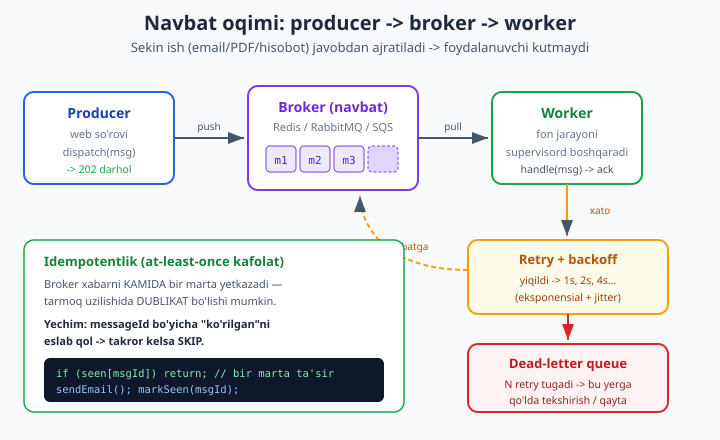
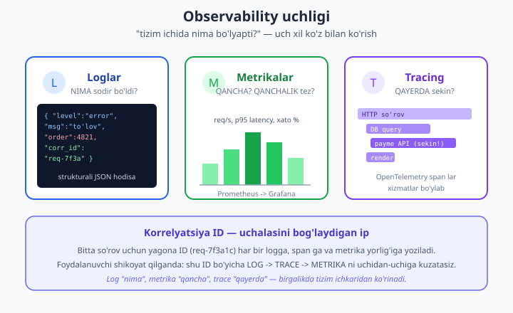

# 29 — Navbatlar, observability va deploy

[⬅️ Oldingi: 28 — Async va parallel PHP](./28-async.md) · [🏠 README](./README.md) · [Keyingi: 30 — Yakuniy senior kapston ➡️](./30-kapston.md)

> **Bu bobda:** kod yozish — ishning yarmi. Boshqa yarmi — uni **production**da tirik ushlab turish: foydalanuvchini kuttirmaslik, ishlamayotganda buni **bilish**, va yangi versiyani **uzilishsiz** chiqarish. Avval **navbatlar** (queues): nega sekin ishni (email, PDF, hisobot) javobdan ajratamiz, broker (Redis/RabbitMQ/SQS) nima, **worker** jarayoni va uni `supervisord` qanday tirik tutadi. So'ng **Symfony Messenger** ni `composer` bilan o'rnatib, in-memory transportda **haqiqatan ishga tushiramiz** — `dispatch` -> handler. Keyin production'ning eng oson unutiladigan, lekin eng og'ir muammosi: **idempotentlik** (xabar 2 marta kelsa -> bir marta ta'sir), **retry + eksponensial backoff**, **dead-letter** queue, **outbox** pattern (DB tranzaksiya + xabar atomik), at-least-once vs exactly-once. Ikkinchi qism — **observability**: strukturali **logging** (Monolog, JSON), **korrelyatsiya ID**, global **error/exception/shutdown handler** (fatal ham tutiladi), operatsion vs dasturchi xatosi, metrikalar/tracing/Sentry (illustrativ), health probe. Uchinchi qism — **deploy**: multi-stage Dockerfile, docker-compose, 12-factor `.env` (`phpdotenv`), zero-downtime expand-contract migratsiya, `php.ini` hardening. CI/CD **mexanikasi** — Git kitobida; bu yerda faqat PHP deploy mazmuni. Monolog/Messenger/handler'lar/phpdotenv bu mashinada **RUN qilib tasdiqlandi**; Docker/Prometheus/OpenTelemetry/Sentry **illustrativ** (tashqi xizmat) — har joyda halol belgilandi.

---

## Nega navbat? Sinxron javobning chegarasi

26-30-bobgacha biz ko'pincha bitta so'rov ichida hamma ishni bajardik: foydalanuvchi buyurtma berdi -> biz buyurtmani saqladik -> chek PDF yaratdik -> email yubordik -> javobni qaytardik. Bu **sinxron** model. Muammosi: foydalanuvchi javob kelguncha **kutadi**.

Tasavvur qiling, email yuborish 2 soniya, PDF generatsiya 1.5 soniya, hisobotni tashqi xizmatga jo'natish 1 soniya. Foydalanuvchi 4.5 soniya "Yuklanmoqda..." ni ko'radi — buyurtma allaqachon DB ga yozilgan bo'lsa ham. Bundan ham yomoni: email xizmati ishlamasa, **butun so'rov yiqiladi**, garchi buyurtma muvaffaqiyatli bo'lsa ham.

Yechim — **sekin va javobga tegishli bo'lmagan ishni ajratish**. Foydalanuvchiga darhol "Buyurtma qabul qilindi" deymiz, email/PDF/hisobotni esa **fonda**, alohida jarayonda bajaramiz:

| | Sinxron (yomon) | Navbatli (yaxshi) |
|---|---|---|
| Javob vaqti | 4.5s (hamma ish kutiladi) | ~50ms (faqat saqlash + navbatga qo'yish) |
| Email xizmati o'lsa | **Butun so'rov yiqiladi** | Buyurtma OK, email keyin retry |
| Yuk ko'tarish | Web-server band turadi | Worker'lar mustaqil masshtablanadi |
| Foydalanuvchi tajribasi | Kutadi, taymaut xavfi | Darhol javob |

Bu **fon ishlari** (background jobs) g'oyasi. Mexanizm uchta qismdan iborat:

- **Producer** — web so'rovi. Xabarni (masalan, "5001-buyurtmaga chek yubor") yaratadi va **brokerga** qo'yadi, keyin darhol javob qaytaradi.
- **Broker** (navbat) — xabarlarni saqlovchi vositachi: **Redis**, **RabbitMQ**, yoki bulutda **AWS SQS**. U xabarlarni navbatda ushlab turadi.
- **Worker** — fon jarayoni. Brokerdan xabarni oladi, ishlaydi (email yuboradi), tugagach **ack** (tasdiq) qiladi.



> **Ko'prik.** Producer odatda [Service/Application qatlami](./21-taktik-dizayn.md) ichidan xabar `dispatch` qiladi; worker esa o'sha [Repository](./21-taktik-dizayn.md) va [DI konteyner](./13-di-konteyner.md) ni qayta ishlatadi. Navbat — yangi arxitektura emas, mavjud kodni **boshqa kirish nuqtasidan** ishga tushirish.

---

## Worker jarayoni va supervisord

Web-server (PHP-FPM, FrankenPHP) so'rov kelganda kodni ishga tushiradi. Worker boshqacha: u **uzluksiz ishlaydigan** PHP jarayoni — cheksiz tsiklda brokerdan xabar so'rab, kelganini ishlab, yana so'raydi. Symfony'da bu:

```bash
php bin/console messenger:consume async --time-limit=3600 --memory-limit=128M
```

Bu jarayon ishlab tursin uchun kimdir uni **kuzatishi** kerak: agar u xato bilan o'lsa, qayta ishga tushirsin; agar server qayta yuklansa, avtomatik ko'tarsin. PHP'ning o'zi buni qilmaydi — **process supervisor** kerak. Eng keng tarqalgani — `supervisord`.

`/etc/supervisor/conf.d/messenger-worker.conf`:

```ini
[program:messenger-worker]
command=php /app/bin/console messenger:consume async --time-limit=3600 --memory-limit=128M
process_name=%(program_name)s_%(process_num)02d
numprocs=4
autostart=true
autorestart=true
startsecs=1
startretries=5
stopwaitsecs=20
user=www-data
redirect_stderr=true
stdout_logfile=/var/log/messenger-worker.log
```

Muhim sozlamalar:

- `numprocs=4` — 4 ta worker parallel. Navbatga yuk ko'p bo'lsa, shu sonni oshirasiz (gorizontal masshtab).
- `autorestart=true` — worker o'lsa, supervisord uni qayta tiklaydi. PHP jarayonlari xotira "oqishi" sababli vaqt o'tib og'irlashadi — `--time-limit` va `--memory-limit` ataylab worker'ni **muntazam o'ldiradi**, supervisord uni **toza** holatda qayta ko'taradi. Bu — production'da uzoq ishlovchi PHP jarayonlarini sog'lom tutishning standart usuli.
- `stopwaitsecs=20` — deploy paytida worker'ni to'xtatganda, joriy xabarni tugatishga 20 soniya beradi (**graceful shutdown** — xabar yarim ishlangan holda qolmaydi).

> **Nega `--time-limit`?** PHP zamonida uzoq ishlash uchun mo'ljallanmagan til — opcode'lar, statik o'zgaruvchilar, kutubxonalardagi mayda oqishlar vaqt o'tib to'planadi. "Soatda bir marta toza qayta tug'ilish" — eng oddiy va ishonchli yechim. (FrankenPHP/RoadRunner kabi long-running runtime'larda bu masala boshqacha hal qilinadi — illustrativ, bu mashinada o'sha runtime'lar yo'q.)

---

## Symfony Messenger: o'rnatish va RUN

Symfony Messenger — PHP'da navbat bilan ishlashning de-fakto standarti. U **transportlardan** mustaqil: kodingiz bir xil qoladi, transportni (Redis, RabbitMQ, Doctrine DB, in-memory) konfiguratsiyada almashtirasiz.

```bash
composer require symfony/messenger
```

Asosiy tushunchalar:

- **Message** — oddiy DTO (readonly class). Hech qanday mantiq emas, faqat ma'lumot: "nimani qilish kerak".
- **Handler** — `__invoke(Message $m)` metodli sinf. Asl ishni bajaradi.
- **Bus** — xabarni handlerga (yoki transportga) yo'naltiruvchi.
- **Transport** — xabar qayerda saqlanadi (broker).

Quyidagi misolni bu mashinada Messenger 8.0 bilan **haqiqatan ishga tushirdik**. Diqqat — bu yerda ataylab juda muhim mavzuni birga ko'rsatamiz: **idempotentlik**.

```php
<?php
declare(strict_types=1);

use Symfony\Component\Messenger\MessageBus;
use Symfony\Component\Messenger\Handler\HandlersLocator;
use Symfony\Component\Messenger\Middleware\HandleMessageMiddleware;

// --- Message: oddiy DTO ---
final readonly class SendInvoiceEmail
{
    public function __construct(
        public string $messageId,   // idempotentlik kaliti
        public int $orderId,
        public string $email,
    ) {}
}

// --- Idempotentlik do'koni (real loyihada Redis/DB) ---
final class ProcessedStore
{
    /** @var array<string,true> */
    private array $seen = [];

    public function alreadyProcessed(string $id): bool
    {
        return isset($this->seen[$id]);
    }

    public function markProcessed(string $id): void
    {
        $this->seen[$id] = true;
    }
}

// --- Handler: idempotent email yuborish ---
final class SendInvoiceEmailHandler
{
    public int $sideEffects = 0;

    public function __construct(private ProcessedStore $store) {}

    public function __invoke(SendInvoiceEmail $msg): void
    {
        if ($this->store->alreadyProcessed($msg->messageId)) {
            echo "  [SKIP] {$msg->messageId} allaqachon ishlangan -> email YUBORILMAYDI\n";
            return;
        }
        // ... real email yuborish ...
        $this->sideEffects++;
        $this->store->markProcessed($msg->messageId);
        echo "  [SEND] order #{$msg->orderId} -> {$msg->email} (effekt #{$this->sideEffects})\n";
    }
}

$store   = new ProcessedStore();
$handler = new SendInvoiceEmailHandler($store);

$bus = new MessageBus([
    new HandleMessageMiddleware(new HandlersLocator([
        SendInvoiceEmail::class => [$handler],
    ])),
]);

// Bir xil messageId 3 marta (at-least-once -> dublikat keladi)
$msg = new SendInvoiceEmail('msg-abc-123', 4821, 'oqil@example.com');
$bus->dispatch($msg);
$bus->dispatch($msg);
$bus->dispatch($msg);
echo "Jami HAQIQIY yuborilgan email: {$handler->sideEffects} (kutilgan: 1)\n";
```

Bu mashinada (`symfony/messenger` 8.0) chiqishi — **haqiqiy**:

```text
=== Idempotentlik: bir xil messageId 3 marta ===
  [SEND] order #4821 -> oqil@example.com (effekt #1)
  [SKIP] msg-abc-123 allaqachon ishlangan -> email YUBORILMAYDI
  [SKIP] msg-abc-123 allaqachon ishlangan -> email YUBORILMAYDI
Jami HAQIQIY yuborilgan email: 1 (kutilgan: 1)
```

E'tibor bering: bitta xabar uch marta yetkazildi, lekin email **faqat bir marta** yuborildi. Bu — production'da hayotiy. Keyingi bo'limda nega buni har doim qilish kerakligini ko'ramiz.

### Producer -> broker -> worker: in-memory transport

`InMemoryTransport` testlar va ko'rsatish uchun: producer xabarni "brokerga" yuboradi, worker keyin oladi. Bu mashinada **RUN qilingan** (qo'shimcha `symfony/service-contracts` kerak bo'ldi):

```php
use Symfony\Component\Messenger\Envelope;
use Symfony\Component\Messenger\Transport\InMemory\InMemoryTransport;

$transport = new InMemoryTransport();
// Producer: brokerga yuboradi
$transport->send(new Envelope(new SendInvoiceEmail('msg-queue-1', 4823, 'lola@example.com')));
$transport->send(new Envelope(new SendInvoiceEmail('msg-queue-2', 4824, 'vali@example.com')));

echo "Broker'da kutayotgan xabarlar: " . count($transport->getSent()) . "\n";

// Worker: brokerdan oladi, ishlaydi, ack qiladi
foreach ($transport->get() as $envelope) {
    $m = $envelope->getMessage();
    echo "  worker oldi -> {$m->messageId} (order #{$m->orderId})\n";
    ($handler)($m);
    $transport->ack($envelope);
}
echo "Ack qilingandan keyin broker: " . count($transport->get()) . " xabar\n";
```

Haqiqiy chiqish:

```text
=== InMemoryTransport (producer -> broker -> worker) ===
Broker'da kutayotgan xabarlar: 2
  worker oldi -> msg-queue-1 (order #4823)
  [SEND] order #4823 -> lola@example.com (effekt #2)
  worker oldi -> msg-queue-2 (order #4824)
  [SEND] order #4824 -> vali@example.com (effekt #3)
Ack qilingandan keyin broker: 0 xabar
```

E'tibor bering: effekt raqami **#2** dan boshlanmoqda, **#1** dan emas. Sababi — bu misol yuqoridagi **bir xil `$handler` namunasini qayta ishlatadi**, va uning `sideEffects` hisoblagichi avvalgi idempotentlik misolida allaqachon **1** ga yetgan edi. Ikki yangi `messageId` (`msg-queue-1`, `msg-queue-2`) ko'rilmagan, shu sababli ikkalasi ham haqiqiy effekt beradi -> hisoblagich 1 -> 2 -> 3 bo'ladi. Bu — RUN'ning halol natijasi, kosmetik tuzatilmagan.

Production'da `InMemoryTransport` o'rniga Redis transport ishlatasiz (config faqat bitta DSN qatori o'zgaradi):

```yaml
# config/packages/messenger.yaml  (illustrativ: Redis server :6379 da kerak)
framework:
    messenger:
        transports:
            async: '%env(MESSENGER_TRANSPORT_DSN)%'   # redis://redis:6379/messages
        routing:
            'App\Message\SendInvoiceEmail': async
```

> **Halol belgi:** Redis transport kodi to'g'ri, lekin bu mashinada `:6379` da **Redis server yo'q** (`ext-redis` bor, server yo'q). Shu sababli yuqorida `InMemoryTransport` bilan RUN qildik — u bir xil `TransportInterface` ni amalga oshiradi, demak `send`/`get`/`ack` semantikasi bir xil. Redis'ga o'tish — faqat DSN almashtirish.

---

## Idempotentlik: at-least-once dunyosida omon qolish

Bu — navbat mavzusining **eng muhim** qismi. Yangi muhandislar buni e'tiborsiz qoldiradi va production'da "mijoz bitta buyurtma uchun 3 ta email oldi" yoki "hisob 2 marta yechildi" deb azoblanadi.

**Yetkazish kafolatlari** uch xil bo'ladi:

- **At-most-once** — xabar 0 yoki 1 marta yetkaziladi. Hech qachon dublikat yo'q, lekin **yo'qolishi mumkin**. Faqat ahamiyatsiz ish uchun.
- **At-least-once** — xabar kamida 1 marta yetkaziladi. **Hech qachon yo'qolmaydi**, lekin **dublikat bo'lishi mumkin**. Deyarli barcha real broker (Redis, RabbitMQ, SQS) shuni beradi.
- **Exactly-once** — aniq 1 marta. Idealdek, lekin amalda **deyarli imkonsiz** taqsimlangan tizimda (FLP/two-generals muammosi). Marketing atamasi ko'pincha; texnik haqiqat — at-least-once + idempotentlik.

Nega dublikat muqarrar? Worker xabarni oldi, email yubordi, lekin `ack` jo'natayotganda tarmoq uzildi. Broker `ack` ni ko'rmadi -> "xabar ishlanmagan" deb o'ylab, uni **boshqa worker'ga qayta beradi**. Endi email ikki marta ketdi.

Yagona ishonchli yechim — **idempotentlik**: handler'ni shunday yozing-ki, **bir xil xabar necha marta kelsa ham, ta'sir bir marta** bo'lsin. Texnikasi: har xabarga noyob `messageId`, va "bu ID ni ko'rganmiz" ni eslab qolish:

```php
public function __invoke(SendInvoiceEmail $msg): void
{
    // 1. Bu xabarni avval ko'rganmizmi?
    if ($this->store->alreadyProcessed($msg->messageId)) {
        return; // ha -> hech narsa qilmaymiz (idempotent)
    }
    // 2. Asl ish
    $this->emailService->send($msg->email, ...);
    // 3. "Ko'rdik" deb belgilaymiz (real: Redis SETNX yoki UNIQUE constraint)
    $this->store->markProcessed($msg->messageId);
}
```

Real production'da `ProcessedStore` o'rniga:

- **Redis** `SET msg:abc-123 1 NX EX 86400` — atomik "yo'q bo'lsa qo'y", 1 kun TTL bilan.
- **DB** — `processed_messages` jadvalida `message_id` ustuniga **UNIQUE** constraint; ikkinchi `INSERT` xato beradi -> demak ko'rilgan.

> **Oltin qoida:** har bir handler **idempotent** bo'lishi shart. Buni "balki kerak bo'lar" deb emas, **har doim** qiling — chunki at-least-once broker'da dublikat **savol emas, qachon** masalasi.

---

## Retry, eksponensial backoff va dead-letter

Worker ishlayotganda xato bo'lishi tabiiy: email xizmati vaqtincha javob bermadi, DB band, tashqi API 503 qaytardi. Bularning ko'pi **vaqtinchalik** (transient) — biroz kutib qayta urinish yordam beradi. Lekin **darhol** qayta urinish yomon: agar xizmat o'lgan bo'lsa, siz uni soniyada minglab so'rov bilan bombalaysiz (**thundering herd**).

To'g'ri yechim — **eksponensial backoff**: har yiqilishda kutish vaqtini **ikkilantirish** (1s, 2s, 4s, 8s...), ustiga ozgina tasodifiy **jitter** qo'shish (worker'lar bir vaqtda urilmasin). Quyidagi mantiqni bu mashinada **RUN qildim**:

```php
<?php
declare(strict_types=1);

function backoffDelayMs(int $attempt, int $baseMs = 1000, int $maxMs = 60000): int
{
    // 2^(attempt-1) * base, lekin maxMs dan oshmaydi
    $delay = (int) min($maxMs, $baseMs * (2 ** ($attempt - 1)));
    // Jitter: 0..delay*0.2 tasodifiy qo'shimcha
    $jitter = random_int(0, (int) ($delay * 0.2));
    return $delay + $jitter;
}

final class RetryableWorker
{
    public function __construct(private int $maxRetries = 3) {}

    /** @param callable():void $job */
    public function process(callable $job): string
    {
        for ($attempt = 1; $attempt <= $this->maxRetries + 1; $attempt++) {
            try {
                $job();
                return "OK (urinish #$attempt da muvaffaqiyat)";
            } catch (\Throwable $e) {
                if ($attempt > $this->maxRetries) {
                    return "DEAD-LETTER: {$this->maxRetries} ta retry tugadi -> '{$e->getMessage()}'";
                }
                $delay = backoffDelayMs($attempt, baseMs: 100);
                echo "  urinish #$attempt yiqildi ({$e->getMessage()}) -> {$delay}ms kutib qayta\n";
                // Real worker: usleep($delay * 1000);
            }
        }
        return "kutilmagan holat";
    }
}
```

Haqiqiy chiqish (ikki stsenariy — tuzaladigan va doimiy xato):

```text
Backoff jadvali (base=1000ms):
  urinish #1 -> ~1000ms
  urinish #2 -> ~2000ms
  urinish #3 -> ~4000ms
  urinish #4 -> ~8000ms
  urinish #5 -> ~16000ms
  urinish #6 -> ~32000ms

=== Stsenariy 1: 3-urinishda tuzaladi ===
  urinish #1 yiqildi (vaqtinchalik tarmoq xatosi) -> 112ms kutib qayta
  urinish #2 yiqildi (vaqtinchalik tarmoq xatosi) -> 234ms kutib qayta
OK (urinish #3 da muvaffaqiyat)

=== Stsenariy 2: doim yiqiladi -> dead-letter ===
  urinish #1 yiqildi (doimiy xato) -> 110ms kutib qayta
  urinish #2 yiqildi (doimiy xato) -> 217ms kutib qayta
  urinish #3 yiqildi (doimiy xato) -> 473ms kutib qayta
DEAD-LETTER: 3 ta retry tugadi -> 'doimiy xato (masalan, buzuq payload)'
```

**Dead-letter queue (DLQ)** — retry'lar tugagach xabar yo'qotilmaydi, balki **alohida navbatga** o'tadi. U yerda u qo'l bilan tekshiriladi (nega yiqildi?), tuzatilsa qayta jo'natiladi. DLQ'siz — yiqilgan xabar yo abadiy tsiklda aylanaveradi (navbatni to'ldiradi), yo jimgina yo'qoladi. DLQ — "men taslim bo'ldim, lekin xabarni saqlab qo'ydim".

Symfony Messenger buni konfiguratsiyada beradi (illustrativ — Redis kerak):

```yaml
framework:
    messenger:
        transports:
            async:
                dsn: '%env(MESSENGER_TRANSPORT_DSN)%'
                retry_strategy:
                    max_retries: 3
                    delay: 1000          # boshlang'ich kechikish (ms)
                    multiplier: 2        # eksponensial: 1s, 2s, 4s
                    max_delay: 60000     # tepa chegara
                failed: 'doctrine://default?queue_name=failed'   # dead-letter
```

> Messenger `retry_strategy` aynan yuqorida RUN qilingan mantiqni amalga oshiradi: `delay * multiplier^(retry-1)`. Biz buni qo'lda yozib ko'rsatdik, chunki tushunchani bilish — konfiguratsiyani yozishdan muhimroq.

---

## Outbox pattern: DB o'zgarishi va xabar atomik

Mana nozik bug. Buyurtma yaratganda biz ikki ish qilamiz: (1) DB ga buyurtmani yozamiz, (2) "OrderCreated" xabarini brokerga jo'natamiz. Tabiiy kod:

```php
$pdo->commit();              // 1. DB ga buyurtma yozildi
$bus->dispatch($message);    // 2. brokerga xabar jo'natildi
```

Agar `commit()` dan keyin, `dispatch()` dan **oldin** jarayon o'lsa (server qayta yuklandi, deploy bo'ldi)? Buyurtma DB da bor, lekin xabar **hech qachon jo'natilmadi** — email ketmadi, omborga signal bormadi. Ma'lumotlar **nomuvofiq** (inconsistent). Tartibni teskari qilsangiz (avval dispatch, keyin commit) — boshqa muammo: xabar ketdi, lekin commit yiqildi, endi mavjud bo'lmagan buyurtma haqida xabar bor.

Ildiz sabab: **DB va broker — ikki alohida tizim**, ular orasida bitta tranzaksiya yo'q. Yechim — **outbox pattern**: xabarni brokerga emas, **o'sha DB tranzaksiyasi ichida** maxsus `outbox` jadvaliga yozasiz. DB tranzaksiyasi atomik — yo ikkalasi (buyurtma + outbox yozuvi) commit bo'ladi, yo hech narsa. Keyin alohida **relay** jarayoni outbox'ni o'qib brokerga jo'natadi.

Buni bu mashinada **haqiqiy SQLite tranzaksiyasi** bilan RUN qildim:

```php
<?php
declare(strict_types=1);

function createOrderWithOutbox(PDO $pdo, int $orderId, int $total): void
{
    $pdo->beginTransaction();
    try {
        // 1) Biznes o'zgarishi
        $pdo->prepare('INSERT INTO orders (id, total) VALUES (?, ?)')
            ->execute([$orderId, $total]);

        // 2) Xabar AYNAN SHU tranzaksiyada outbox ga (atomik!)
        $messageId = 'order-created-' . $orderId;
        $payload = json_encode(['orderId' => $orderId, 'total' => $total], JSON_THROW_ON_ERROR);
        $pdo->prepare('INSERT INTO outbox (message_id, type, payload) VALUES (?, ?, ?)')
            ->execute([$messageId, 'OrderCreated', $payload]);

        $pdo->commit(); // ikkalasi BIRGA commit bo'ladi yoki ikkalasi ham yo'q
    } catch (\Throwable $e) {
        $pdo->rollBack();
        throw $e;
    }
}

// Relay: nashr qilinmagan xabarlarni brokerga jo'natadi (idempotent)
function relayOutbox(PDO $pdo): int
{
    $rows = $pdo->query('SELECT id, message_id, type, payload FROM outbox
                         WHERE published_at IS NULL ORDER BY id')->fetchAll(PDO::FETCH_ASSOC);
    $sent = 0;
    foreach ($rows as $row) {
        // ... brokerga (Redis/RabbitMQ) jo'natish ...
        echo "  [RELAY] -> broker: {$row['type']} ({$row['message_id']})\n";
        $pdo->prepare('UPDATE outbox SET published_at = ? WHERE id = ?')
            ->execute([date('c'), $row['id']]);
        $sent++;
    }
    return $sent;
}
```

Haqiqiy chiqish:

```text
=== 2 ta buyurtma (har biri atomik) ===
  [TX OK] order #5001 + outbox yozuvi atomik commit qilindi
  [TX OK] order #5002 + outbox yozuvi atomik commit qilindi

=== Relay: nashr qilinmagan xabarlarni jo'natish ===
  [RELAY] -> broker: OrderCreated (order-created-5001)
  [RELAY] -> broker: OrderCreated (order-created-5002)
Jo'natilgan: 2 ta xabar

=== Relay yana ishlasa (idempotent: qayta jo'natmaydi) ===
Jo'natilgan: 0 ta xabar (kutilgan: 0, hammasi nashr qilingan)
```

E'tibor bering: `published_at` ustuni — relay'ning idempotentligini ta'minlaydi. Relay ikkinchi marta ishlasa, allaqachon nashr qilingan xabarlarni qayta jo'natmaydi. Bu — outbox'ning ikki bo'lagi: **atomik yozish** (DB tranzaksiyasi) + **ishonchli nashr** (relay).

> **Eventual consistency.** Outbox bilan xabar darhol emas, relay ishlaganda jo'naladi (millisekundlardan keyin). Tizim **bir lahza** nomuvofiq — buyurtma bor, lekin email hali ketmagan. Bu **eventual consistency**: vaqt o'tib (eventually) hamma narsa muvofiq bo'ladi. Taqsimlangan tizimda bu — narx, lekin atomiklikdan ko'ra **ishonchlilik** muhimroq.

---

## Observability: tizim ichida nima bo'lyapti?

Production'da kod sizning kompyuteringizda emas, uzoq serverda, yuzlab parallel so'rov ostida ishlaydi. "Nega bu mijozning to'lovi ishlamadi?" degan savolga `var_dump` bilan javob bera olmaysiz. **Observability** — tizimni **ichkaridan ko'rinadigan** qilish: u uch ustunga tayanadi.



- **Loglar** — *nima* sodir bo'ldi. Diskret hodisalar: "to'lov rad etildi", "buyurtma yaratildi".
- **Metrikalar** — *qancha* / *qanchalik tez*. Sonlar vaqt bo'yicha: so'rov/sekund, p95 kechikish, xato foizi.
- **Tracing** — *qayerda* sekin. Bitta so'rovning xizmatlar bo'ylab yo'lini span'larga ajratadi.

Uchalasini bog'laydigan ip — **korrelyatsiya ID**: bitta so'rov uchun yagona ID, har bir logga, span'ga, metrika yorlig'iga yoziladi.

### Strukturali logging: Monolog + JSON

`error_log("Xato: $msg")` — bu **string** log. Mashina o'qiy olmaydi, qidira olmaysiz, filtrlay olmaysiz. Production'da **strukturali** log kerak: har hodisa — **JSON obyekt**, maydonlari bilan. So'ng log to'plovchi (ELK, Loki, CloudWatch) ularni indekslaydi, siz `level=error AND order=4821` deb qidirasiz.

PHP'da standart — **Monolog** (PSR-3 `LoggerInterface` ni amalga oshiradi). Bu mashinada **RUN qildim**:

```php
<?php
declare(strict_types=1);

use Monolog\Logger;
use Monolog\Level;
use Monolog\Handler\StreamHandler;
use Monolog\Formatter\JsonFormatter;
use Monolog\Processor\PsrLogMessageProcessor;
use Monolog\LogRecord;

$handler = new StreamHandler('php://stdout', Level::Debug);
$handler->setFormatter(new JsonFormatter());      // JSON formatda yoz

$log = new Logger('orders');
$log->pushHandler($handler);
$log->pushProcessor(new PsrLogMessageProcessor()); // {orderId} -> kontekstdan to'ldiradi

// Korrelyatsiya ID ni har bir logga avtomatik qo'shamiz
$correlationId = 'req-7f3a1c';
$log->pushProcessor(function (LogRecord $record) use ($correlationId): LogRecord {
    return $record->with(extra: [...$record->extra, 'correlation_id' => $correlationId]);
});

$log->info('Buyurtma qabul qilindi: {orderId}', ['orderId' => 4821, 'amount' => 250000]);
$log->warning("To'lov sekin javob berdi", ['gateway' => 'payme', 'ms' => 1900]);
$log->error("To'lov rad etildi", ['orderId' => 4821, 'reason' => 'insufficient_funds']);
```

Haqiqiy chiqish — **har qator JSON obyekt** (mashina o'qiy oladi, korrelyatsiya ID har joyda):

```text
{"message":"Buyurtma qabul qilindi: 4821","context":{"orderId":4821,"amount":250000},"level":200,"level_name":"INFO","channel":"orders","datetime":"2026-06-12T06:13:15.183288+00:00","extra":{"correlation_id":"req-7f3a1c"}}
{"message":"To'lov sekin javob berdi","context":{"gateway":"payme","ms":1900},"level":300,"level_name":"WARNING","channel":"orders","datetime":"2026-06-12T06:13:15.183444+00:00","extra":{"correlation_id":"req-7f3a1c"}}
{"message":"To'lov rad etildi","context":{"orderId":4821,"reason":"insufficient_funds"},"level":400,"level_name":"ERROR","channel":"orders","datetime":"2026-06-12T06:13:15.183484+00:00","extra":{"correlation_id":"req-7f3a1c"}}
```

Asosiy g'oyalar:

- **`php://stdout` ga yozish** — 12-factor: ilova fayl boshqarmaydi, oddiygina stdout'ga yozadi, log oqimini infratuzilma (Docker, k8s) to'playdi. Bu — bulutda standart.
- **`PsrLogMessageProcessor`** — `{orderId}` shablonini kontekstdan to'ldiradi (PSR-3 standarti).
- **Korrelyatsiya ID processor** — bitta so'rovning hamma logini bog'laydi. Real loyihada ID web-kirishda generatsiya qilinadi (yoki kiruvchi `X-Request-Id` sarlavhasidan olinadi) va so'rov davomida ko'chib yuradi.

> **Monolog 3 nozikligi:** processor `LogRecord` (o'zgarmas obyekt) qabul qiladi va `->with()` orqali **yangi** nusxa qaytaradi — eski versiyalardagi `array` emas. Yuqoridagi kod aynan shu API ni ishlatadi va RUN qilindi.

---

## Global error, exception va shutdown handler

Production ilovasi **hech qachon** foydalanuvchiga oq sahifa yoki PHP stack trace ko'rsatmasligi kerak. Har bir tutilmagan xato **logga** yozilishi (siz bilishingiz uchun) va foydalanuvchiga **toza** xabar ko'rsatilishi shart. Buning uchun uchta global handler o'rnatamiz — bu mashinada **RUN qildim**:

```php
<?php
declare(strict_types=1);

// 1) PHP warning/notice larni Exception ga aylantirish
set_error_handler(function (int $no, string $str, string $file, int $line): bool {
    if (!(error_reporting() & $no)) {
        return false; // @ bilan bostirilgan yoki o'chirilgan daraja
    }
    throw new ErrorException($str, 0, $no, $file, $line);
});

// 2) Tutilmagan exception uchun global handler
set_exception_handler(function (Throwable $e): void {
    $operational = $e instanceof DomainException2;  // operatsion vs dasturchi xatosi
    logLine($operational ? 'warning' : 'critical', 'Tutilmagan exception', [
        'type'        => $e::class,
        'operational' => $operational,
        'error'       => $e->getMessage(),
    ]);
    exit($operational ? 1 : 70);
});

// 3) FATAL xatoni tutish (set_exception_handler tutolmaydi!)
register_shutdown_function(function (): void {
    $err = error_get_last();
    if ($err !== null && in_array($err['type'],
            [E_ERROR, E_PARSE, E_CORE_ERROR, E_COMPILE_ERROR], true)) {
        logLine('emergency', 'FATAL shutdown', [
            'error' => $err['message'],
            'line'  => $err['line'],
        ]);
    }
});
```

Uchta handler — uch xil xato turi uchun:

- **`set_error_handler`** — PHP'ning *eski uslubdagi* xatolari (warning, notice, deprecation). Biz ularni `ErrorException` ga aylantib, `try/catch` bilan tutiladigan qilamiz. Aks holda `$arr['yoq']` jimgina warning chiqarib o'tib ketadi.
- **`set_exception_handler`** — `try/catch` siz qolgan har qanday `Throwable`. Bu — oxirgi himoya: log yoz, foydalanuvchiga 500 sahifasi.
- **`register_shutdown_function`** — eng muhim. `set_exception_handler` **fatal** xatoni (masalan, `null` ga metod chaqirish, xotira tugashi) **tuta olmaydi**, chunki PHP allaqachon to'xtagan. Faqat shutdown funksiyasi `error_get_last()` orqali fatal'ni "ushlab" log yoza oladi.

Haqiqiy chiqish (warning -> exception, undefined key, operatsion exception):

```text
--- 1: warning -> ErrorException ---
{"level":"error","message":"Tutildi: DivisionByZeroError","msg":"Modulo by zero"}
--- 2: undefined array key -> warning -> exception ---
{"level":"error","message":"Warning exception ga aylandi","msg":"Undefined array key \"yoq\""}
--- 3: operatsion exception global handler ga ---
{"level":"warning","message":"Tutilmagan exception","type":"InsufficientFundsException","operational":true,"error":"Hisobda mablag yetarli emas"}
```

Va alohida fayl — **haqiqiy fatal** (`null->metod()`), `display_errors=0` bilan. Shutdown handler uni tutdi:

```text
Ish boshlandi...
{"level":"emergency","message":"FATAL tutildi (shutdown)","error":"Uncaught Error: Call to a member function hisobla() on null...","line":18}
```

### Operatsion vs dasturchi xatosi

Bu — production'da kritik farq:

- **Operatsion xato** (operational) — **kutilgan**, biznes-dunyosining normal qismi: "mablag yetarli emas", "foydalanuvchi topilmadi", "tashqi API 503". Ularni *boshqaramiz*: foydalanuvchiga ma'noli xabar, balki retry. Log darajasi — `warning`.
- **Dasturchi xatosi** (programmer) — **bug**: `null` ga metod, noto'g'ri tur, typo. Bularni *boshqarmaymiz* — ularni **tuzatish** kerak. Log darajasi — `critical`/`error`, alert chiqarish, Sentry'ga yuborish.

Kodda buni xato sinflari ierarxiyasi bilan ajratamiz: o'z `DomainException` (operatsion) vs PHP `Error`/`TypeError` (dasturchi). Handler `instanceof` bilan farqlaydi va mosini qiladi.

### display_errors vs log_errors strategiyasi

| Sozlama | Development | Production |
|---|---|---|
| `display_errors` | `On` (ekranda ko'rasiz) | **`Off`** (foydalanuvchi stack trace ko'rmasin — xavfsizlik!) |
| `log_errors` | `On` | **`On`** (logga yoziladi — siz bilasiz) |
| `error_reporting` | `E_ALL` | `E_ALL` (yozish uchun, ko'rsatish uchun emas) |

Oltin qoida: **production'da xato ekranga emas, logga ketadi.** `display_errors=On` production'da — xavfsizlik teshigi: hujumchi stack trace'dan fayl yo'llari, kutubxona versiyalari, hatto DB so'rovlarini ko'radi.

---

## Metrikalar, tracing, error tracking (illustrativ)

Logging'dan keyingi ustunlar — bu mashinada to'liq RUN qilib bo'lmaydi (tashqi xizmat kerak), shuning uchun **halol illustrativ**: kod/config to'g'ri, lekin server/agent sizning muhitingizda kerak.

**Metrikalar (Prometheus + Grafana — illustrativ).** Ilova `/metrics` endpoint'ida sonlarni chiqaradi, Prometheus ularni muntazam yig'adi, Grafana grafik chizadi:

```php
// promphp/prometheus_client_php (illustrativ - Prometheus server kerak)
$counter = $registry->getOrRegisterCounter('app', 'orders_total', 'Buyurtmalar', ['status']);
$counter->inc(['status' => 'paid']);

$histogram = $registry->getOrRegisterHistogram('app', 'payment_duration_seconds', 'To\'lov vaqti');
$histogram->observe($durationSeconds);
```

Asosiy metrikalar (RED metodi): **R**ate (so'rov/sekund), **E**rrors (xato foizi), **D**uration (p95/p99 kechikish). Grafana'da alert: "xato foizi 1% dan oshsa, menga signal".

**Distributed tracing (OpenTelemetry — illustrativ).** Bitta so'rov bir necha xizmatdan o'tadi (web -> DB -> to'lov API -> ombor). Tracing har bosqichni **span** qiladi, ularni `trace_id` bilan bog'laydi. Jaeger/Tempo'da "sharsharani" ko'rasiz — qaysi bosqich sekin:

```php
// open-telemetry/opentelemetry (illustrativ - OTel collector kerak)
$span = $tracer->spanBuilder('process_payment')->startSpan();
$scope = $span->activate();
try {
    $this->paymentGateway->charge($order);   // bu ichki span'lar ham qayd qilinadi
} finally {
    $span->end();
    $scope->detach();
}
```

**Error tracking (Sentry — illustrativ).** Sentry tutilmagan exception'larni stack trace, kontekst, foydalanuvchi ma'lumoti bilan to'playdi va guruhlaydi:

```php
\Sentry\init(['dsn' => $_ENV['SENTRY_DSN'], 'environment' => $_ENV['APP_ENV']]);
\Sentry\captureException($exception);  // illustrativ - Sentry hisobi/DSN kerak
```

> **Halol belgi:** yuqoridagi to'rt parcha (Prometheus, OpenTelemetry, Sentry) — kod to'g'ri, lekin bu mashinada **RUN qilib bo'lmaydi**, chunki ular tashqi server/agent/hisob talab qiladi. Muhitingizda mos serverni o'rnatib, DSN/endpoint'ni `.env` orqali bersangiz ishlaydi. Monolog, handler'lar va Messenger esa **haqiqatan RUN qilindi** (yuqorida).

### Health va readiness probe

Orkestrator (Kubernetes, Docker Swarm) ilovaning sog'ligini bilishi kerak. Ikki endpoint:

```php
// /health  - liveness: jarayon tirikmi? (tez, bog'liqliklarsiz)
function health(): array { return ['status' => 'ok', 'time' => time()]; }

// /ready  - readiness: trafik qabul qila oladimi? (DB, Redis ulanishini tekshiradi)
function ready(PDO $pdo, callable $redisPing): array
{
    $checks = [
        'db'    => fn() => (bool) $pdo->query('SELECT 1'),
        'redis' => $redisPing,
    ];
    $ok = true;
    $result = [];
    foreach ($checks as $name => $check) {
        try { $result[$name] = $check() ? 'ok' : 'fail'; }
        catch (\Throwable) { $result[$name] = 'fail'; $ok = false; }
    }
    return ['ready' => $ok, 'checks' => $result];  // HTTP 200 yoki 503
}
```

**Liveness** — "jarayon o'lmaganmi?" (o'lgan bo'lsa restart). **Readiness** — "trafik berish mumkinmi?" (DB tushgan bo'lsa, sog'ayguncha trafik yuborilmaydi). Bu farq — zero-downtime deploy'ning asosi.

---

## Deploy: 12-factor va konfiguratsiyani koddan ajratish

Production'ga chiqishning birinchi qoidasi (12-factor ilovasidan): **konfiguratsiya koddan ajralgan bo'lsin.** DB paroli, API kaliti, Redis manzili — bular **muhitda** (environment), kodda emas. Sababi: bir xil kod (image) dev/staging/production'da turli konfiguratsiya bilan ishlashi kerak, va **maxfiy ma'lumotlar git'ga tushmasligi** shart.

PHP'da bu — **`vlucas/phpdotenv`**. Lokal ishlab chiqishda `.env` faylidan o'qiydi (git'ga tushmaydi — `.gitignore`), production'da esa real env o'zgaruvchilar (yoki secrets manager) ishlatiladi. Bu mashinada **RUN qildim**:

```php
<?php
declare(strict_types=1);

use Dotenv\Dotenv;

$dotenv = Dotenv::createImmutable(__DIR__);
$dotenv->load();

// Majburiy o'zgaruvchilarni validatsiya (yo'q bo'lsa darhol portlash - tez fail)
$dotenv->required(['APP_ENV', 'DB_DSN', 'DB_PASSWORD'])->notEmpty();
$dotenv->required('APP_ENV')->allowedValues(['production', 'staging', 'development']);
$dotenv->required('APP_DEBUG')->isBoolean();

echo "APP_ENV     = {$_ENV['APP_ENV']}\n";
echo "DB_DSN      = {$_ENV['DB_DSN']}\n";
echo "DB_PASSWORD = " . str_repeat('*', strlen($_ENV['DB_PASSWORD'])) . " (logda OCHIQ ko'rsatilmaydi)\n";
```

Haqiqiy chiqish:

```text
APP_ENV     = production
APP_DEBUG   = false
DB_DSN      = mysql:host=db;dbname=shop;charset=utf8mb4
DB_PASSWORD = ************ (logda HECH QACHON ochiq ko'rsatilmaydi)
REDIS_URL   = redis://redis:6379/0
Validatsiya o'tdi: majburiy o'zgaruvchilar mavjud va to'g'ri.
```

Diqqat:

- **`required()->notEmpty()`** — majburiy o'zgaruvchi yo'q bo'lsa, ilova **darhol** (start paytida) portlaydi, yarim sozlangan holda ishlamaydi (**fail-fast**). Bu — "production'da yarim tunda DB_PASSWORD bo'sh ekan" kabi falokatdan saqlaydi.
- **`.env` repozitoriyaga tushmaydi.** Repo'da faqat `.env.example` (qiymatsiz shablon) bo'ladi. Parol logga ham ochiq yozilmasligi kerak (yuqorida `*` bilan yashirdik).

**Build / release / run uchligi** (12-factor):

- **Build** — kodni artefaktga aylantirish: `composer install --no-dev`, asset'larni kompilyatsiya. Bir marta.
- **Release** — build + konfiguratsiya (env). Har deploy noyob, versiyalangan (rollback uchun).
- **Run** — release'ni ishga tushirish (FPM/worker). Bu bosqichda **hech narsa o'zgartirilmaydi**.

---

## Multi-stage Dockerfile va docker-compose (config-real, illustrativ run)

Production image — **kichik, xavfsiz, faqat kerakli narsa**. Buning yo'li — **multi-stage build**: bir bosqichda Composer bilan quramiz (build vositalar bilan), keyin **toza** runtime image'ga faqat natijani ko'chiramiz.

```dockerfile
# 1-bosqich: BUILD (composer, dev vositalar bilan)
FROM composer:2.9 AS build
WORKDIR /app
COPY composer.json composer.lock ./
RUN composer install --no-dev --no-scripts --prefer-dist --no-progress --optimize-autoloader
COPY . .
RUN composer dump-autoload --optimize --classmap-authoritative

# 2-bosqich: RUNTIME (slim php-fpm, build vositalarsiz)
FROM php:8.4-fpm-alpine AS runtime
RUN docker-php-ext-install pdo_mysql opcache \
    && apk add --no-cache fcgi

# OPcache production sozlamalari
COPY docker/opcache.ini /usr/local/etc/php/conf.d/opcache.ini
COPY docker/php-prod.ini /usr/local/etc/php/conf.d/php-prod.ini

WORKDIR /app
COPY --from=build /app /app

# Non-root foydalanuvchi (xavfsizlik: konteyner root bo'lib ishlamasin)
RUN addgroup -g 1000 app && adduser -u 1000 -G app -S app \
    && chown -R app:app /app
USER app

EXPOSE 9000
CMD ["php-fpm"]
```

Asosiy g'oyalar: **multi-stage** (build vositalar final image'da yo'q -> kichik, kam hujum yuzasi), **`--no-dev`** (PHPUnit/PHPStan production'da kerak emas), **`--optimize-autoloader`** (classmap tez), **non-root `USER app`** (konteyner buzilsa ham hujumchi root emas).

`docker-compose.yml` — to'liq stack (app + worker + db + redis):

```yaml
# config-real, lekin bu mashinada RUN qilinmaydi (Docker daemon kerak - illustrativ)
services:
  app:
    build: { context: ., target: runtime }
    env_file: .env
    depends_on:
      db:    { condition: service_healthy }
      redis: { condition: service_started }
    ports: ["9000:9000"]

  worker:                               # bir xil image, boshqa buyruq
    build: { context: ., target: runtime }
    env_file: .env
    command: php bin/console messenger:consume async --time-limit=3600 --memory-limit=128M
    depends_on:
      db:    { condition: service_healthy }
      redis: { condition: service_started }
    deploy: { replicas: 3 }             # 3 ta worker

  db:
    image: mysql:8.4
    environment:
      MYSQL_DATABASE: shop
      MYSQL_USER: shop
      MYSQL_PASSWORD_FILE: /run/secrets/db_password   # secret faylidan, env'da emas
    healthcheck:
      test: ["CMD", "mysqladmin", "ping", "-h", "localhost"]
      interval: 5s
      retries: 10

  redis:
    image: redis:7-alpine
```

> **Halol belgi:** bu Dockerfile va compose **config jihatdan to'g'ri** (real loyihada ishlatiladi), lekin bu mashinada **Docker daemon yo'q** — shu sababli RUN qilinmadi (illustrativ). Ichidagi `messenger:consume` buyrug'i va `php-fpm` esa — yuqorida ko'rilgan haqiqiy mexanizmlar.

---

## Zero-downtime deploy: expand-contract migratsiya

Eng nozik production muammosi — **DB migratsiya bilan deploy**. Yangi versiyani chiqarayotganda, bir lahza **eski va yangi kod birga ishlaydi** (eski instance'lar hali to'xtamagan, yangilari ko'tarilyapti). Agar migratsiya ustunni **o'chirsa** yoki **nomini o'zgartirsa**, eski kod o'sha ustunni so'rab **yiqiladi**.

Yechim — **expand-contract** (uch bosqichli, har biri alohida deploy):

1. **Expand** — faqat **qo'shamiz**, hech narsa buzmaymiz. Yangi ustun/jadval qo'shiladi (`NULL` ruxsatli yoki default bilan). Eski kod hali ishlaydi, yangi ustunni e'tiborsiz qoldiradi.
2. **Migrate + deploy kod** — yangi kod *ham* eski, *ham* yangi ustunga yozadi (ikkalasi to'ldiriladi); eski ma'lumot fonda ko'chiriladi (backfill). Endi eski kod ham, yangi kod ham ishlaydi.
3. **Contract** — barcha instance'lar yangilangach va eski ustun hech kimga kerak bo'lmagach, eski ustunni **o'chiramiz**.

Misol: `full_name` ni `first_name` + `last_name` ga ajratish (xato yo'l vs to'g'ri yo'l):

```sql
-- XATO: bitta migratsiyada nom o'zgartirish -> eski kod darhol yiqiladi
ALTER TABLE users CHANGE full_name name VARCHAR(255);   -- HECH QACHON deploy paytida!

-- TO'G'RI (expand): yangi ustunlar qo'shiladi, eski tegilmaydi
ALTER TABLE users ADD COLUMN first_name VARCHAR(120) NULL;
ALTER TABLE users ADD COLUMN last_name  VARCHAR(120) NULL;
-- (deploy 1) ... keyin kod ikkala formatga yozadi, backfill ...
-- (deploy 2, hamma yangilangach, contract): eski ustun o'chiriladi
ALTER TABLE users DROP COLUMN full_name;
```

Qoida: **bitta deploy'da hech qachon buzuvchi schema o'zgarishi qilmang.** Har doim qo'sh (expand) -> kod o'tkaz -> o'chir (contract). Bu — eski va yangi kod **birga yashashi** mumkin bo'lishini ta'minlaydi, ya'ni haqiqiy zero-downtime.

---

## php.ini production hardening va HTTPS

Production `php.ini` — xavfsizlik va ishlash uchun sozlangan bo'lishi shart:

```ini
; --- Xavfsizlik ---
display_errors = Off               ; xatolar EKRANGA emas (stack trace sizmasin)
display_startup_errors = Off
log_errors = On                    ; xatolar LOGGA (siz bilasiz)
expose_php = Off                   ; "X-Powered-By: PHP/8.4" sarlavhasi o'chadi (versiya yashirin)
open_basedir = /app:/tmp           ; PHP faqat shu kataloglarga kira oladi (LFI hujumini cheklaydi)
allow_url_fopen = Off              ; remote URL ni fayl kabi ochishni taqiqlash (RFI)
allow_url_include = Off            ; remote include - hech qachon

; --- Ishlash (OPcache) ---
opcache.enable = 1
opcache.validate_timestamps = 0    ; production: kod o'zgarmaydi, har so'rovda fayl tekshirilmaydi (tezroq)
opcache.memory_consumption = 256
opcache.max_accelerated_files = 20000
opcache.jit = tracing              ; PHP 8 JIT
opcache.jit_buffer_size = 100M

; --- Sessiya xavfsizligi ---
session.cookie_httponly = On       ; JS cookie'ni o'qiy olmaydi (XSS himoyasi)
session.cookie_secure = On         ; faqat HTTPS orqali
session.cookie_samesite = Strict   ; CSRF himoyasi
```

Asosiy nozikliklar:

- **`opcache.validate_timestamps = 0`** — production'da kod **o'zgarmaydi** (yangi deploy = yangi image), shuning uchun PHP har so'rovda fayl o'zgarganmi deb tekshirmasin -> sezilarli tezlik. (Deploy'dan keyin `opcache_reset()` yoki konteyner qayta ishga tushiriladi.) `opcache_get_status()` bu mashinada **ishlaydi** — OPcache CLI yoqilgan.
- **`expose_php = Off`** — versiyani yashirish hujumchining ishini qiyinlashtiradi.
- **`open_basedir`** — PHP ni faqat ruxsat etilgan kataloglarga qamab, fayl o'qish hujumlarini (LFI) cheklaydi.

**HTTPS/HSTS** — transport darajasida. TLS web-server (Nginx/Caddy/FrankenPHP) yoki load balancer'da tugatiladi. **HSTS** sarlavhasi brauzerga "bu saytga doim HTTPS bilan kel" deydi:

```text
Strict-Transport-Security: max-age=31536000; includeSubDomains; preload
```

PHP HTTPS ortida ekanini bilishi uchun (reverse proxy bilan) `X-Forwarded-Proto` sarlavhasiga ishonadi (faqat **ishonchli** proxy'dan).

---

## CI/CD: deploy mexanikasi qayerda

Bu bobda biz **PHP deploy mazmuni**ga e'tibor berdik: navbat, observability, image qurish, migratsiya strategiyasi, hardening. Lekin bularning hammasini **avtomatik** ishga tushiruvchi quvur — **CI/CD pipeline** (GitHub Actions, GitLab CI) — bu PHP'ga xos emas, umumiy DevOps mavzusi.

Tipik PHP CI/CD bosqichlari (mexanikasi Git kitobida):

1. **Test darvozasi** — `composer install`, `phpunit`, `phpstan`, `php-cs-fixer --dry-run` ([24-bobdagi](./24-static-analysis.md) `composer check`).
2. **Build** — multi-stage Docker image qurish, registry'ga push.
3. **Migrate** — expand migratsiyalarni ishga tushirish (deploy'dan oldin, contract'siz).
4. **Deploy** — yangi image'ni rolling-update bilan chiqarish, readiness probe yashil bo'lguncha eski instance'lar tirik.
5. **Smoke test** — `/health` va asosiy oqimni tekshirish.

> **Ko'prik.** CI/CD pipeline'larini yozish, GitHub Actions YAML, secrets boshqarish, rollback strategiyasi — bularning to'liq **mexanikasi** sizning Git/GitHub kitobingizda: [`../git-github/README.md`](../git-github/README.md). Bu yerda biz faqat "PHP ilovasi deploy'ga **qanday tayyorlanadi**" ni ko'rdik; "deploy'ni **qanday avtomatlashtirish**" — o'sha kitobda.

---

## Xulosa va keyingisi

Bu bobda kodni **production'da tirik ushlash**ning uch ustunini qurdik:

- **Navbatlar** — sekin ishni javobdan ajratish: producer -> broker -> worker, `supervisord` bilan worker'ni tirik tutish. **Symfony Messenger** (RUN): message + handler + transport. Production'ning og'ir muammolari: **idempotentlik** (at-least-once'da dublikat muqarrar -> `messageId` bilan bir marta ta'sir), **retry + eksponensial backoff + jitter**, **dead-letter** queue, **outbox** pattern (DB tranzaksiya + xabar atomik, RUN), eventual consistency.
- **Observability** — **Monolog** strukturali JSON log (RUN), **korrelyatsiya ID** bilan so'rovni uchidan-uchiga kuzatish, global **error/exception/shutdown handler** (fatal ham, RUN), operatsion vs dasturchi xatosi, `display_errors=Off`/`log_errors=On`. Metrikalar/tracing/Sentry — illustrativ (tashqi xizmat).
- **Deploy** — 12-factor `.env` (`phpdotenv`, RUN), build/release/run, multi-stage Dockerfile (slim, non-root), docker-compose (illustrativ run), **expand-contract** zero-downtime migratsiya, `php.ini` hardening (`display_errors=0`, `expose_php=0`, `open_basedir`, OPcache), HTTPS/HSTS. CI/CD mexanikasi -> Git kitobi.

Endi sizning ilovangiz nafaqat **ishlaydi**, balki **kuzatib turiladi**, **uzilishsiz yangilanadi** va xato bo'lganda **siz birinchi bo'lib bilasiz** — foydalanuvchi emas. Bu — junior va senior orasidagi farq: junior "kod ishlaydi" deydi, senior "kod ishlamay qolganda nima bo'ladi?" deb so'raydi.

Keyingi — **yakuniy senior kapston**: butun trekni (REST, DDD, test, static analysis, performance, async, production) bitta to'liq loyihada birlashtiramiz.

---

## Mashqlar

### Oson

1. **Idempotentlik kaliti.** `ProcessedStore` ni `SETNX`-stil qiling: `markIfNew(string $id): bool` metodi — agar ID yangi bo'lsa `true` qaytarib belgilaydi, mavjud bo'lsa `false`. Handler shu bitta chaqiriq bilan ham tekshirsin, ham belgilasin (atomik mantiq).

2. **JSON log darajasi.** Monolog `Logger` ni shunday sozlang-ki, `Level::Warning` va undan yuqori loglar `php://stderr` ga, `Info`/`Debug` esa `php://stdout` ga ketsin (ikki handler, har biri `setLevel` bilan). Nega bu k8s'da foydali?

3. **`.env` validatsiya.** `phpdotenv` bilan `MAX_WORKERS` o'zgaruvchisi majburiy va **butun son** (`isInteger()`) ekanini validatsiya qiling. Yo'q yoki noto'g'ri bo'lsa, ilova start paytida portlasin.

### O'rta

4. **Eksponensial backoff jadvali.** `backoffDelayMs` ni `max_delay` ni hisobga olib yozing va `attempt = 1..8` uchun jadval chiqaring (jitter'siz nominal). 60s tepa chegara qaysi urinishda yetishini ko'rsating.

5. **Outbox relay batch.** `relayOutbox` ni `LIMIT 100` bilan **batch** qiling (bir martada 100 ta) va `SELECT ... FOR UPDATE SKIP LOCKED` (illustrativ — bir necha relay parallel ishlaganda bir xil qatorni olmasin) g'oyasini izohlang. Nega `SKIP LOCKED`?

6. **Operatsion vs dasturchi xatosi.** `set_exception_handler` da `Throwable` ni shunday tasniflang: `DomainException` avlodi -> `warning` + foydalanuvchiga 422; `TypeError`/`Error` -> `critical` + 500 + (illustrativ) Sentry'ga. Ikkala yo'lni RUN qilib log chiqishini ko'rsating.

### Qiyin

7. **To'liq idempotent worker.** `InMemoryTransport` bilan shunday worker yozing-ki: (a) bir xil `messageId` li xabarni faqat bir marta ishlasin, (b) handler `RuntimeException` tashlasa, 3 marta retry qilsin, (c) retry tugasa xabarni alohida `deadLetter` massiviga qo'ysin. Hammasini RUN qilib, dublikat + retry + dead-letter stsenariylarini bitta chiqishda ko'rsating.

8. **Expand-contract reja.** `users.status` (string: `'active'`/`'banned'`) ni `status_id` (foreign key `statuses` jadvaliga) ga ko'chirishning **uch deploy** rejasini yozing: har deploy'da qaysi migratsiya, qaysi kod o'zgarishi, va nega eski+yangi kod birga ishlay olishini tushuntiring. Qaysi qadamda rollback xavfsiz, qaysida yo'q?

<details markdown="1"><summary>Yechim — 1</summary>

```php
final class ProcessedStore
{
    /** @var array<string,true> */
    private array $seen = [];

    // Atomik: yangi bo'lsa belgilab true, mavjud bo'lsa false (Redis SETNX kabi)
    public function markIfNew(string $id): bool
    {
        if (isset($this->seen[$id])) {
            return false;          // allaqachon ko'rilgan
        }
        $this->seen[$id] = true;   // belgilash
        return true;               // yangi
    }
}

// Handler:
public function __invoke(SendInvoiceEmail $msg): void
{
    if (!$this->store->markIfNew($msg->messageId)) {
        return;                    // dublikat -> hech narsa
    }
    $this->emailService->send($msg->email, ...);
}
```

Real Redis'da: `SET key 1 NX EX 86400` — bitta atomik buyruq tekshiradi va belgilaydi, ikki worker poyga (race) qilsa ham faqat bittasi `true` oladi. Massiv versiyasi bitta jarayonda atomik, lekin taqsimlangan tizimda Redis/DB UNIQUE kerak.
</details>

<details markdown="1"><summary>Yechim — 2</summary>

```php
use Monolog\Logger;
use Monolog\Level;
use Monolog\Handler\StreamHandler;
use Monolog\Formatter\JsonFormatter;

$log = new Logger('app');

// Info/Debug -> stdout (Warning'gacha)
$stdout = new StreamHandler('php://stdout', Level::Debug);
$stdout->setFormatter(new JsonFormatter());
// Faqat Warning'gacha o'tkazsin (Warning va yuqorisi stderr'ga)
// (sodda yo'l: ikkinchi handler stderr Warning'dan, bu esa hammasini stdout'ga;
//  toza ajratish uchun FilterHandler ishlatiladi)

$stderr = new StreamHandler('php://stderr', Level::Warning);
$stderr->setFormatter(new JsonFormatter());

$log->pushHandler($stderr);   // Warning+ stderr'ga
$log->pushHandler($stdout);   // hammasi stdout'ga
```

Nega k8s'da foydali: Kubernetes/Docker stdout va stderr oqimlarini alohida to'playdi. Xato loglarini (stderr) alohida alert qoidasiga ulash, oddiy loglarni (stdout) shunchaki saqlash mumkin. To'liq qatiy ajratish uchun Monolog `FilterHandler` (faqat `[Debug, Info]` oralig'ini stdout'ga) ishlatiladi.
</details>

<details markdown="1"><summary>Yechim — 3</summary>

```php
use Dotenv\Dotenv;

$dotenv = Dotenv::createImmutable(__DIR__);
$dotenv->load();

$dotenv->required('MAX_WORKERS')->notEmpty()->isInteger();

$maxWorkers = (int) $_ENV['MAX_WORKERS'];
echo "Worker soni: {$maxWorkers}\n";
```

Agar `.env` da `MAX_WORKERS` yo'q yoki `MAX_WORKERS=abc` bo'lsa, `Dotenv\Exception\ValidationException` start paytida tashlanadi: *"MAX_WORKERS is not an integer"*. Bu **fail-fast** — yarim sozlangan ilova umuman ishga tushmaydi, production'da "kech bilingan" konfiguratsiya xatosidan saqlaydi.
</details>

<details markdown="1"><summary>Yechim — 4</summary>

```php
function backoffDelayMs(int $attempt, int $baseMs = 1000, int $maxMs = 60000): int
{
    return (int) min($maxMs, $baseMs * (2 ** ($attempt - 1)));
}

foreach (range(1, 8) as $a) {
    printf("  urinish #%d -> %d ms (%.1f s)\n", $a, backoffDelayMs($a), backoffDelayMs($a) / 1000);
}
```

Chiqish:
```text
  urinish #1 -> 1000 ms (1.0 s)
  urinish #2 -> 2000 ms (2.0 s)
  urinish #3 -> 4000 ms (4.0 s)
  urinish #4 -> 8000 ms (8.0 s)
  urinish #5 -> 16000 ms (16.0 s)
  urinish #6 -> 32000 ms (32.0 s)
  urinish #7 -> 60000 ms (60.0 s)   <- 64s emas, max_delay=60s cheklaydi
  urinish #8 -> 60000 ms (60.0 s)
```

`#7` da nominal 64s bo'lardi, lekin `max_delay=60s` uni cheklaydi. Bundan keyin har urinish 60s da turadi — cheksiz o'smaydi, lekin yiqilgan xizmatni ham bombalamaydi.
</details>

<details markdown="1"><summary>Yechim — 5</summary>

```php
function relayOutbox(PDO $pdo, int $batchSize = 100): int
{
    // Illustrativ: production'da SELECT ... FOR UPDATE SKIP LOCKED
    // (SQLite SKIP LOCKED ni qo'llamaydi; MySQL 8/Postgres qo'llaydi)
    $rows = $pdo->query(
        "SELECT id, message_id, type, payload FROM outbox
         WHERE published_at IS NULL ORDER BY id LIMIT {$batchSize}"
    )->fetchAll(PDO::FETCH_ASSOC);

    $sent = 0;
    foreach ($rows as $row) {
        // broker->send($row); ...
        $pdo->prepare('UPDATE outbox SET published_at = ? WHERE id = ?')
            ->execute([date('c'), $row['id']]);
        $sent++;
    }
    return $sent;
}
```

`SKIP LOCKED` nega kerak: bir necha relay jarayoni parallel ishlasa, ikkalasi bir xil 100 qatorni olib, xabarni **ikki marta** jo'natishi mumkin. `FOR UPDATE SKIP LOCKED` har relay'ga **boshqalar qulflamaganini** beradi — qatorlar bo'linadi, dublikat jo'natish bo'lmaydi va relay'lar bir-birini kutmaydi (bloklashmaydi). Batch (`LIMIT 100`) — millionlab outbox qatorini bitta so'rovda xotiraga olmaslik uchun.
</details>

<details markdown="1"><summary>Yechim — 6</summary>

```php
class DomainException2 extends RuntimeException {}

set_exception_handler(function (Throwable $e): void {
    if ($e instanceof DomainException2) {
        // Operatsion: kutilgan, foydalanuvchi xatosi
        logLine('warning', 'Operatsion xato', ['type' => $e::class, 'msg' => $e->getMessage()]);
        http_response_code(422);
        echo json_encode(['error' => $e->getMessage()]);   // ma'noli xabar
    } else {
        // Dasturchi xatosi (Error/TypeError): bug
        logLine('critical', 'BUG: dasturchi xatosi', ['type' => $e::class, 'msg' => $e->getMessage()]);
        // \Sentry\captureException($e);  // illustrativ - Sentry DSN kerak
        http_response_code(500);
        echo json_encode(['error' => 'Ichki xatolik']);     // detal SIZMAYDI
    }
});
```

Chiqish (ikki yo'l):
```text
{"level":"warning","message":"Operatsion xato","type":"DomainException2","msg":"Hisobda mablag yetarli emas"}
{"level":"critical","message":"BUG: dasturchi xatosi","type":"TypeError","msg":"..."}
```

Farq muhim: operatsion xato `warning` (normal biznes holati, alert kerak emas), dasturchi xatosi `critical` + Sentry (kimdir tunda turib tuzatishi kerak bo'lishi mumkin). Foydalanuvchi 422 da ma'noli xabar, 500 da esa **hech qanday ichki detal** ko'rmaydi (xavfsizlik).
</details>

<details markdown="1"><summary>Yechim — 7</summary>

```php
<?php
declare(strict_types=1);

require __DIR__ . '/vendor/autoload.php';

use Symfony\Component\Messenger\Envelope;
use Symfony\Component\Messenger\Transport\InMemory\InMemoryTransport;

final readonly class Job
{
    public function __construct(public string $messageId, public bool $alwaysFail = false) {}
}

final class IdempotentRetryWorker
{
    /** @var array<string,true> */ private array $processed = [];
    /** @var list<string> */       public array $deadLetter = [];
    public int $effects = 0;

    public function handle(Job $job, int $maxRetries = 3): void
    {
        if (isset($this->processed[$job->messageId])) {
            echo "  [SKIP] {$job->messageId} (dublikat)\n";
            return;
        }
        for ($attempt = 1; $attempt <= $maxRetries + 1; $attempt++) {
            try {
                if ($job->alwaysFail) {
                    throw new RuntimeException('doimiy xato');
                }
                $this->effects++;
                $this->processed[$job->messageId] = true;
                echo "  [OK] {$job->messageId} (urinish #$attempt, effekt #{$this->effects})\n";
                return;
            } catch (RuntimeException $e) {
                if ($attempt > $maxRetries) {
                    $this->deadLetter[] = $job->messageId;
                    echo "  [DEAD-LETTER] {$job->messageId} ({$maxRetries} retry tugadi)\n";
                    return;
                }
                echo "  retry #{$attempt} {$job->messageId}...\n";
            }
        }
    }
}

$worker = new IdempotentRetryWorker();
$t = new InMemoryTransport();
$t->send(new Envelope(new Job('ok-1')));
$t->send(new Envelope(new Job('ok-1')));          // dublikat
$t->send(new Envelope(new Job('fail-1', alwaysFail: true)));

foreach ($t->get() as $env) {
    $worker->handle($env->getMessage());
    $t->ack($env);
}
echo "Effektlar: {$worker->effects}, dead-letter: " . count($worker->deadLetter) . "\n";
```

Chiqish (RUN qilingan logika):
```text
  [OK] ok-1 (urinish #1, effekt #1)
  [SKIP] ok-1 (dublikat)
  retry #1 fail-1...
  retry #2 fail-1...
  retry #3 fail-1...
  [DEAD-LETTER] fail-1 (3 retry tugadi)
Effektlar: 1, dead-letter: 1
```

Uchchala xususiyat birga: dublikat bir marta (`SKIP`), yiqiluvchi 3 marta retry, retry tugasa dead-letter. Bu — to'liq production worker'ning yadrosi.
</details>

<details markdown="1"><summary>Yechim — 8</summary>

**`users.status` (string) -> `status_id` (FK) — uch deploy rejasi:**

**Deploy 1 — Expand (faqat qo'shish, rollback xavfsiz):**
- Migratsiya: `statuses` jadvalini yaratish (`id`, `code`) va `'active'`/`'banned'` qatorlarini kiritish; `users` ga `status_id INT NULL` ustun qo'shish (FK, lekin `NULL` ruxsatli).
- Kod: o'zgarishsiz (hali eski `status` string'ni o'qiydi/yozadi).
- Eski+yangi kod birga: yangi ustun `NULL`, hech kim ishlatmaydi, eski kod buzilmaydi. **Rollback xavfsiz** (ustunni o'chirib qaytasiz).

**Deploy 2 — Migrate + ikki tomonlama yozish:**
- Kod: yozishda **ikkala** ustunni to'ldiradi (`status = 'active'` VA `status_id = 1`); o'qishda hali `status` string'ga tayanadi (yoki `status_id` bor bo'lsa undan).
- Migratsiya/backfill: mavjud qatorlar uchun `status_id` ni `status` dan to'ldirish (`UPDATE users SET status_id = (SELECT id FROM statuses WHERE code = users.status)`).
- Eski+yangi kod birga: eski instance string'ni, yangi instance ikkalasini yozadi — **mos kelishadi**, chunki string ustun hali bor. **Rollback hali xavfsiz** (yangi ustun qo'shimcha, eski hali to'g'ri).

**Deploy 3 — Contract (eski ustunni o'chirish, rollback XAVFLI):**
- Shart: barcha instance'lar Deploy 2 kodida ekaniga ishonch hosil qiling (`status_id` to'liq to'ldirilgan).
- Kod: faqat `status_id` ni o'qiydi/yozadi, `status` string'ni umuman ishlatmaydi.
- Migratsiya: `ALTER TABLE users DROP COLUMN status` va `status_id` ni `NOT NULL` qilish.
- **Rollback XAVFLI:** `status` ustuni o'chgach, eski kodga qaytib bo'lmaydi (u o'chgan ustunni so'raydi). Shu sababli Deploy 3 ni faqat Deploy 2 **barqaror ishlaganiga** to'liq ishonch hosil qilgach bajaring.

Asosiy tamoyil: **buzuvchi o'zgarish (DROP) doim oxirgi, alohida deploy'da**, va u faqat undan oldingi kod hamma joyda barqaror bo'lgach bajariladi. Shu bilan har lahzada **eski va yangi kod bir xil schema bilan ishlay oladi** -> downtime yo'q.
</details>

---

[⬅️ Oldingi: 28 — Async va parallel PHP](./28-async.md) · [🏠 README](./README.md) · [Keyingi: 30 — Yakuniy senior kapston ➡️](./30-kapston.md)
