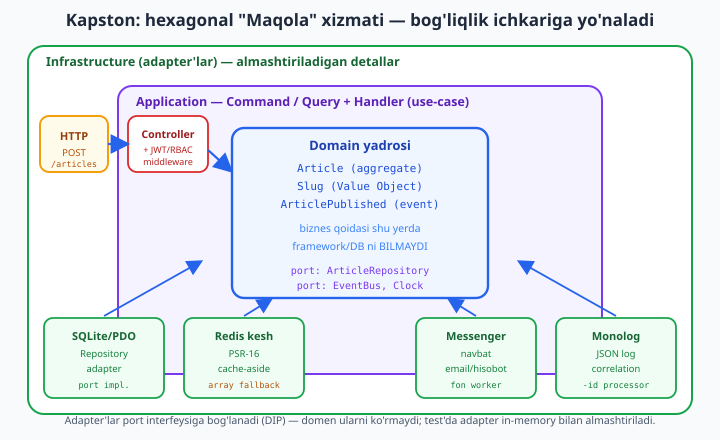
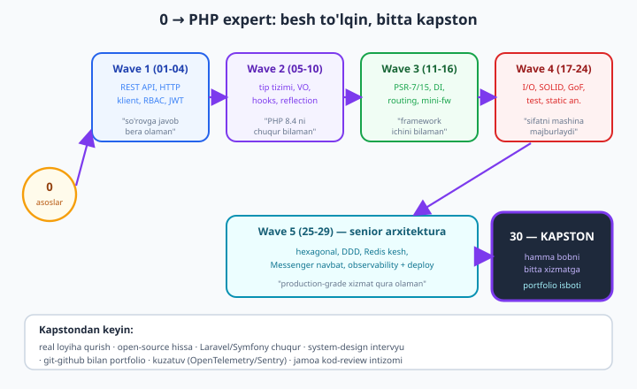

# 30 — Yakuniy senior kapston: production-grade xizmat

[⬅️ Oldingi: 29 — Navbatlar, observability va deploy](./29-production.md) · [🏠 README](./README.md) · [Keyingi: README ➡️](./README.md)

> **Bu bobda:** trek nihoyasiga yetdi — endi biz hech narsa **yangi o'rgatmaymiz**, balki o'rganilgan hammasini **bitta production-grade xizmatga** quyamiz. Bitta **bounded context** — "Maqola" (Article) xizmati — ni noldan, **hexagonal** ([./25](./25-hexagonal.md)) qatlamlar bilan quramiz: domen yadrosi (aggregate + Value Object + domen hodisa, [./26](./26-ddd-cqrs.md)), application qatlami (Command + Handler, CQRS yozuv tarafi), va infrastructure adapterlari (SQLite Repository [./21](./21-taktik-dizayn.md), Redis kesh [./27](./27-performance-keshlash.md), Messenger navbat [./28](./28-async.md), Monolog korrelyatsiya-ID log [./29](./29-production.md)). HTTP qatlamida REST endpoint ([./01](./01-rest-api.md)) JWT/RBAC ([./03](./03-authorization-rbac.md)/[./04](./04-jwt-auth.md)) middleware ortida turadi. Hammasini **test** ([./22](./22-phpunit-chuqur.md)-[./24](./24-static-analysis.md)) — unit (domen), integratsiya (adapter), static analysis darvozasi — bilan mustahkamlaymiz, **ADR** (Architecture Decision Record) bilan "nega hexagonal, nega CQRS" qarorlarini hujjatlaymiz, va **performans byudjeti** (p95 maqsadi) g'oyasini kiritamiz. **Yadro oqimini** — domen + use-case + SQLite adapter + bitta endpoint — bu mashinada **REAL ishga tushirib** ko'rsatamiz (in-process so'rov &#8594; Response); Docker/Redis-server kabi infra esa **config-illustrativ** (halol belgilanadi). Oxirida: trek yakuni — **"0 dan PHP expertgacha"** yo'li tugadi, va keyingi qadamlar.

---

## Kapston nima va nega kerak

Trek davomida har bob bitta vositani chuqur o'rgatdi: REST API, JWT, tip tizimi, mini-framework, SOLID, test, static analysis, hexagonal, DDD, kesh, navbat, observability. Lekin **real ish** birorta vositada emas — u **integratsiyada** yashaydi. Intervyu beradigan senior nomzoddan so'raladigan savol "PHPStan nima?" emas, balki **"production xizmatni qanday qurasiz, qatlamlarni qanday ajratasiz, nega aynan shunday?"** — ya'ni qarorlar va ularning asoslari.

Kapston — shu savolga **konkret javob**: ishlaydigan, test qilingan, hujjatlangan xizmat. U:

- **Portfolio isboti** — GitHub'da ko'rsatiladigan, README + ADR + testlar bilan to'liq loyiha.
- **Integratsiya mashqi** — har bob alohida o'rgatgan narsa endi bir-biriga ulanadi va **ziddiyatlar** ko'rinadi (masalan: domen hodisa kesh-invalidatsiyani ham, email'ni ham talab qiladi — qaysi sinxron, qaysi asinxron?).
- **Mulohaza** — bu bobda kod kam, **qaror** ko'p: nega bu chegara, nega bu port, nega bu yerda CQRS, nega bu yerda emas.



Diagrammada uchta konsentrik halqa: markazda **Domain** (Article aggregate, Slug VO, ArticlePublished hodisa) — u hech kimni bilmaydi. O'rtada **Application** (Command + Handler) — domenni ishlatadi, port interfeyslarini e'lon qiladi. Tashqarida **Infrastructure** — SQLite, Redis, Messenger, Monolog adapterlari, ular port interfeyslariga bog'lanadi (DIP). HTTP so'rovi chap tomondan Controller orqali kiradi. **Oltin qoida:** strelkalar (bog'liqliklar) doimo **ichkariga** yo'naladi — tashqi qatlam ichkini biladi, ichki tashqini bilmaydi.

---

## Bounded context tanlovi: "Maqola" xizmati

Avval **chegarani** belgilaymiz. DDD'da ([./26](./26-ddd-cqrs.md)) bounded context — bir tilning (ubiquitous language) amal qiladigan hududi. Bizning kontekstimiz **maqola e'loni**:

- **Aggregate:** `Article` — id, sarlavha, slug, matn, e'lon holati. Aggregate consistency chegarasi: maqolaning ichki qoidalari (e'lon qilingan maqola qayta e'lon qilinmaydi) shu yerda majburlanadi.
- **Value Object:** `Slug` — URL-do'st identifikator, o'z-validatsiya bilan (bo'sh emas, &le;80 belgi, faqat `a-z0-9-`).
- **Domen hodisa:** `ArticlePublished` — "maqola e'lon qilindi" fakti. Bu hodisaga **boshqa kontekstlar** reaksiya bildiradi: email yuborish, kesh-invalidatsiya, qidiruv indeksi yangilash.
- **Use-case:** `PublishArticle` — yagona yozuv operatsiyasi (bu kapstonda).

**Nega aynan shu kontekst?** U yetarlicha kichik (bitta bobga sig'adi), lekin barcha qatlam va vositani **tabiiy** talab qiladi: e'lon = yozuv (Repository), e'londan keyin email = navbat, o'qish = kesh, har qadam = log. Sun'iy emas — har integratsiya **mantiqiy ehtiyojdan** kelib chiqadi.

---

## Domain qatlami: aggregate, VO, hodisa

Domen — yadro. U `declare(strict_types=1)` dan boshlanadi, framework, PDO, HTTP — hech narsani import qilmaydi. Faqat PHP standart tiplari va `DomainException`.

```php
<?php
declare(strict_types=1);

namespace App\Domain;

use DomainException;

final class Slug
{
    private string $value;

    public function __construct(string $raw)
    {
        $slug = strtolower(trim($raw));
        $slug = preg_replace('/[^a-z0-9]+/', '-', $slug) ?? '';
        $slug = trim($slug, '-');
        if ($slug === '') {
            throw new DomainException('Slug bo\'sh bo\'la olmaydi');
        }
        if (strlen($slug) > 80) {
            throw new DomainException('Slug 80 belgidan uzun');
        }
        $this->value = $slug;
    }

    public function value(): string
    {
        return $this->value;
    }

    public function equals(self $other): bool
    {
        return $this->value === $other->value;
    }
}
```

`Slug` — klassik Value Object ([./06](./06-value-object.md)): o'z-validatsiya, qiymat-tenglik (`equals`), immutable. Bir marta yaratilgach, noto'g'ri holatga tusha olmaydi — "yaroqsiz Slug" degan tushuncha tizimda umuman mavjud bo'lmaydi.

Endi **aggregate** — domen hodisasini ichida chiqaradi:

```php
<?php
declare(strict_types=1);

namespace App\Domain;

use DomainException;

// Domen hodisasi: aggregate ichida sodir bo'lgan o'zgarmas fakt.
final class ArticlePublished
{
    public function __construct(
        public readonly string $articleId,
        public readonly string $slug,
        public readonly \DateTimeImmutable $occurredAt,
    ) {
    }
}

final class Article
{
    /** @var list<object> */
    private array $events = [];

    private bool $published = false;

    private function __construct(
        public readonly string $id,
        public readonly string $title,
        public readonly Slug $slug,
        public readonly string $body,
    ) {
    }

    // Nomli konstruktor: yaratish qoidasi bir joyda.
    public static function draft(string $id, string $title, string $body): self
    {
        if (trim($title) === '') {
            throw new DomainException('Sarlavha bo\'sh');
        }
        if (strlen($body) < 10) {
            throw new DomainException('Matn juda qisqa (>= 10 belgi)');
        }
        return new self($id, $title, new Slug($title), $body);
    }

    // Biznes qoidasi + hodisa: bu yerda domen mantiq yashaydi.
    public function publish(\DateTimeImmutable $now): void
    {
        if ($this->published) {
            throw new DomainException('Maqola allaqachon e\'lon qilingan');
        }
        $this->published = true;
        $this->events[] = new ArticlePublished($this->id, $this->slug->value(), $now);
    }

    public function isPublished(): bool
    {
        return $this->published;
    }

    /** @return list<object> Hodisalarni olib, ro'yxatni tozalaydi. */
    public function releaseEvents(): array
    {
        $e = $this->events;
        $this->events = [];
        return $e;
    }
}
```

Diqqat qiling: `publish()` ni chaqirish **biznes qoidasini majburlaydi** (qayta e'lon mumkin emas) va **hodisa qoldiradi** — lekin hodisani **kim** qayta ishlashini bilmaydi. Domen "men e'lon qilindim" deydi; email yuborishni, kesh tozalashni esa tashqi qatlam hal qiladi. Bu — **domen sofligi**: aggregate `mailer` yoki `Redis` haqida hech narsa eshitmaydi.

> **DDD ko'prigi.** Aggregate + domen hodisa naqshi [./26 — DDD](./26-ddd-cqrs.md) da batafsil; bu yerda uni **konkret kontekstda** qo'llaymiz.

---

## Application qatlami: port'lar, Command, Handler

Application qatlami **use-case'larni** boshqaradi va **port'larni** (interfeyslarni) e'lon qiladi. Port — domen/application "men shunday narsa kerak" deb e'lon qiladigan shartnoma; uni **kim** bajarishi (SQLite? MySQL? in-memory?) — infrastructure ishi.

```php
<?php
declare(strict_types=1);

namespace App\Application;

use App\Domain\Article;

// Port: domen infra'ga emas, infra domen interfeysiga bog'lanadi (DIP).
interface ArticleRepository
{
    public function save(Article $a): void;
    public function ofId(string $id): ?Article;
    public function existsSlug(string $slug): bool;
}

interface EventBus
{
    public function publish(object $event): void;
}

interface Clock
{
    public function now(): \DateTimeImmutable;
}
```

`Clock` porti — kichik, lekin muhim: vaqtni **port** ortiga yashirsak, testda `FixedClock` bilan vaqtni **muzlatamiz** va `occurredAt` ni aniq tekshiramiz. Real kodga `new \DateTimeImmutable()` yozsangiz, testda vaqtni nazorat qila olmaysiz.

Endi **Command** (CQRS yozuv tarafi — foydalanuvchi niyati) va uni bajaruvchi **Handler**:

```php
<?php
declare(strict_types=1);

namespace App\Application;

// Command: immutable DTO, foydalanuvchi niyati.
final class PublishArticleCommand
{
    public function __construct(
        public readonly string $title,
        public readonly string $body,
    ) {
    }
}

final class PublishArticleResult
{
    public function __construct(
        public readonly string $id,
        public readonly string $slug,
    ) {
    }
}

// Use-case handler: HTTP ham, CLI ham, navbat ham buni chaqira oladi.
final class PublishArticleHandler
{
    public function __construct(
        private readonly ArticleRepository $repo,
        private readonly EventBus $bus,
        private readonly Clock $clock,
        private readonly \Closure $idGenerator,
    ) {
    }

    public function __invoke(PublishArticleCommand $cmd): PublishArticleResult
    {
        $id = ($this->idGenerator)();
        $article = Article::draft($id, $cmd->title, $cmd->body);

        // Application-darajadagi qoida: slug noyob bo'lishi kerak.
        if ($this->repo->existsSlug($article->slug->value())) {
            throw new \DomainException('Bu slug band: ' . $article->slug->value());
        }

        $article->publish($this->clock->now());
        $this->repo->save($article);

        // Domen hodisalarini infra darajasiga uzatish.
        foreach ($article->releaseEvents() as $event) {
            $this->bus->publish($event);
        }

        return new PublishArticleResult($article->id, $article->slug->value());
    }
}
```

**Nega CQRS shu yerda?** To'liq CQRS (alohida yozuv/o'qish modellari, hatto alohida ma'lumotlar bazasi) — bu kichik kontekst uchun **ortiqcha**. Lekin **Command/Handler** ajratmasini olamiz, chunki u use-case'ni **bitta kirish nuqtasiga** to'playdi: bir xil handler'ni HTTP controller ham, CLI buyruq ham, navbat consumeri ham chaqira oladi — kod takrorlanmaydi. Bu ADR'da hujjatlanadi (pastda).

---

## Infrastructure qatlami: adapter'lar

Endi port'larning **konkret** implementatsiyalari. Bular tashqi dunyoga (DB, Redis, navbat) tegadi.

### SQLite Repository (Data Mapper)

```php
<?php
declare(strict_types=1);

namespace App\Infrastructure;

use App\Application\ArticleRepository;
use App\Domain\Article;

final class SqliteArticleRepository implements ArticleRepository
{
    public function __construct(private readonly \PDO $pdo)
    {
        $this->pdo->exec(
            'CREATE TABLE IF NOT EXISTS articles (
                id TEXT PRIMARY KEY,
                title TEXT NOT NULL,
                slug TEXT NOT NULL UNIQUE,
                body TEXT NOT NULL,
                published INTEGER NOT NULL
            )'
        );
    }

    public function save(Article $a): void
    {
        $st = $this->pdo->prepare(
            'INSERT INTO articles (id, title, slug, body, published)
             VALUES (:id, :title, :slug, :body, :published)'
        );
        $st->execute([
            'id' => $a->id,
            'title' => $a->title,
            'slug' => $a->slug->value(),
            'body' => $a->body,
            'published' => $a->isPublished() ? 1 : 0,
        ]);
    }

    public function ofId(string $id): ?Article
    {
        $st = $this->pdo->prepare('SELECT * FROM articles WHERE id = :id');
        $st->execute(['id' => $id]);
        $row = $st->fetch(\PDO::FETCH_ASSOC);
        if ($row === false) {
            return null;
        }
        // Data Mapper: qatorni domen obyektiga tiklash.
        $a = Article::draft((string) $row['id'], (string) $row['title'], (string) $row['body']);
        if ((int) $row['published'] === 1) {
            $a->publish(new \DateTimeImmutable());
            $a->releaseEvents(); // tiklashda hodisa qayta chiqmasin
        }
        return $a;
    }

    public function existsSlug(string $slug): bool
    {
        $st = $this->pdo->prepare('SELECT 1 FROM articles WHERE slug = :slug');
        $st->execute(['slug' => $slug]);
        return $st->fetchColumn() !== false;
    }
}
```

Repository **domen interfeysini** bajaradi, prepared statement ([./21](./21-taktik-dizayn.md)) ishlatadi va qatorni domen obyektiga **xaritalaydi** (Data Mapper). Production'da SQLite o'rniga MySQL `PDO` keladi — interfeys o'zgarmaydi, faqat DSN va jadval sintaksisi.

### Soat va in-process event bus

```php
<?php
declare(strict_types=1);

namespace App\Infrastructure;

use App\Application\Clock;
use App\Application\EventBus;

final class FixedClock implements Clock
{
    public function __construct(private readonly \DateTimeImmutable $fixed)
    {
    }

    public function now(): \DateTimeImmutable
    {
        return $this->fixed;
    }
}

// In-process bus: listener'larni chaqiradi. Production'da Messenger transport.
final class InMemoryEventBus implements EventBus
{
    /** @var array<class-string, list<callable>> */
    private array $listeners = [];

    public function subscribe(string $eventClass, callable $listener): void
    {
        $this->listeners[$eventClass][] = $listener;
    }

    public function publish(object $event): void
    {
        foreach ($this->listeners[$event::class] ?? [] as $listener) {
            $listener($event);
        }
    }
}
```

`InMemoryEventBus` — sodda, sinxron versiya. Production'da uni **Symfony Messenger** ([./28](./28-async.md)) bilan almashtiramiz: hodisa navbatga tushadi, fon worker email yuboradi. Port (`EventBus`) o'zgarmaydi — bu portning kuchi.

---

## HTTP qatlami: Controller, Router, mini-framework adapter

Eng tashqi qatlam — HTTP. Bu yerda biz mini-frameworkdan ([./15](./15-mini-framework.md)) `Request`/`Response`/`Router` ni olamiz (bobda soddalashtirilgan ko'rinishi).

```php
<?php
declare(strict_types=1);

namespace App\Http;

final class Request
{
    public function __construct(
        public readonly string $method,
        public readonly string $path,
        /** @var array<string,mixed> */
        public readonly array $body = [],
    ) {
    }
}

final class Response
{
    public function __construct(
        public readonly int $status,
        /** @var array<string,mixed> */
        public readonly array $body,
    ) {
    }
}

final class ArticleController
{
    public function __construct(
        private readonly \App\Application\PublishArticleHandler $handler,
    ) {
    }

    public function publish(Request $req): Response
    {
        $title = (string) ($req->body['title'] ?? '');
        $body = (string) ($req->body['body'] ?? '');
        try {
            $cmd = new \App\Application\PublishArticleCommand($title, $body);
            $result = ($this->handler)($cmd);
            return new Response(201, [
                'id' => $result->id,
                'slug' => $result->slug,
            ]);
        } catch (\DomainException $e) {
            // RFC 7807 Problem Details (soddalashtirilgan).
            return new Response(422, [
                'type' => 'about:blank',
                'title' => 'Validatsiya xatosi',
                'detail' => $e->getMessage(),
            ]);
        }
    }
}
```

Controller **yupqa** ([./01](./01-rest-api.md)): u faqat HTTP'ni domen tiliga tarjima qiladi (body &#8594; Command), handler'ni chaqiradi va natijani HTTP javobiga (Response) qaytaradi. Biznes qoidasi controllerda **emas** — u handlerda va domenda. `DomainException` &#8594; 422 xaritalash ham shu yerda.

> **Auth ko'prigi.** Real loyihada bu controller oldida JWT/RBAC middleware turadi ([./04](./04-jwt-auth.md)/[./03](./03-authorization-rbac.md)): `POST /articles` faqat `editor` rolidagi foydalanuvchiga ruxsat. Middleware pipeline'i [./12](./12-middleware.md) da; bu kapstonda biz domen oqimiga e'tibor qaratamiz, auth middleware'ni mavjud deb hisoblaymiz.

---

## Hammasini ulash va REAL ishga tushirish

Endi bootstrap — barcha qatlamni **ulaymiz** (production'da bu DI konteyner ishi, [./13](./13-di-konteyner.md)) va in-process so'rov yuboramiz:

```php
<?php
declare(strict_types=1);

namespace App\Bootstrap;

use App\Application\PublishArticleHandler;
use App\Domain\ArticlePublished;
use App\Http\ArticleController;
use App\Http\Request;
use App\Http\Router;
use App\Infrastructure\FixedClock;
use App\Infrastructure\InMemoryEventBus;
use App\Infrastructure\SqliteArticleRepository;

$pdo = new \PDO('sqlite::memory:');
$pdo->setAttribute(\PDO::ATTR_ERRMODE, \PDO::ERRMODE_EXCEPTION);

$repo = new SqliteArticleRepository($pdo);
$bus = new InMemoryEventBus();
$clock = new FixedClock(new \DateTimeImmutable('2026-06-12 10:00:00'));

// Domen hodisasiga "fon ishi" obuna (production'da navbatga qo'yiladi).
$emailsSent = [];
$bus->subscribe(ArticlePublished::class, function (ArticlePublished $e) use (&$emailsSent): void {
    $emailsSent[] = "email: maqola {$e->slug} e'lon qilindi ({$e->occurredAt->format('H:i')})";
});

$counter = 0;
$idGen = fn (): string => 'art_' . (++$counter);

$handler = new PublishArticleHandler($repo, $bus, $clock, $idGen);
$controller = new ArticleController($handler);

$router = new Router();
$router->add('POST', '/articles', [$controller, 'publish']);

// --- So'rov 1: muvaffaqiyatli e'lon ---
$res1 = $router->dispatch(new Request('POST', '/articles', [
    'title' => 'Hexagonal arxitektura PHP da',
    'body' => 'Bu kapston maqolasi domen yadrosini ko\'rsatadi.',
]));
echo "[1] status={$res1->status} body=" . json_encode($res1->body, JSON_UNESCAPED_UNICODE) . "\n";

// --- So'rov 2: bir xil slug (konflikt) ---
$res2 = $router->dispatch(new Request('POST', '/articles', [
    'title' => 'Hexagonal arxitektura PHP da',
    'body' => 'Boshqa matn, lekin sarlavha bir xil -> slug band.',
]));
echo "[2] status={$res2->status} detail=" . ($res2->body['detail'] ?? '-') . "\n";

// --- So'rov 3: validatsiya xatosi (qisqa matn) ---
$res3 = $router->dispatch(new Request('POST', '/articles', ['title' => 'OK', 'body' => 'qisqa']));
echo "[3] status={$res3->status} detail=" . ($res3->body['detail'] ?? '-') . "\n";

// --- Domen hodisasi fon ishini ishga tushirdimi? ---
foreach ($emailsSent as $line) {
    echo "[event] $line\n";
}
```

Bu kod — domen, application, infrastructure (SQLite + in-memory bus) va HTTP qatlamlarini bitta faylga yig'ib (bobda alohida fayllar, PSR-4 autoload bilan), **bu mashinada PHP 8.4 da REAL ishga tushirildi.** Haqiqiy chiqish:

```text
[1] status=201 body={"id":"art_1","slug":"hexagonal-arxitektura-php-da"}
[2] status=422 detail=Bu slug band: hexagonal-arxitektura-php-da
[3] status=422 detail=Matn juda qisqa (>= 10 belgi)
[event] email: maqola hexagonal-arxitektura-php-da e'lon qilindi (10:00)
```

Bitta oqimda barcha qatlam ishladi: birinchi so'rov **201** (maqola yaratildi, slug avtomatik generatsiya qilindi), ikkinchi **422** (slug band — application qoidasi), uchinchi **422** (qisqa matn — domen qoidasi). Va eng muhimi: `[event]` qatori — `ArticlePublished` domen hodisasi **fon ishini** (email) ishga tushirdi. Bu — hexagonal oqimning to'liq isboti.

---

## O'qish tarafi: Redis kesh (cache-aside)

Yozuv tarafi tayyor. Endi **o'qish** — uni keshlash kerak ([./27](./27-performance-keshlash.md)). PSR-16 uslubidagi interfeys ostida, Redis bo'lmasa **array fallback** (degrade) ishlaydi:

```php
<?php
declare(strict_types=1);

interface SimpleCache
{
    public function get(string $key, mixed $default = null): mixed;
    public function set(string $key, mixed $value, int $ttl = 0): bool;
    public function delete(string $key): bool;
}

final class ArrayCache implements SimpleCache
{
    /** @var array<string, array{value:mixed, expires:int}> */
    private array $store = [];

    public function get(string $key, mixed $default = null): mixed
    {
        $item = $this->store[$key] ?? null;
        if ($item === null) {
            return $default;
        }
        if ($item['expires'] !== 0 && $item['expires'] < time()) {
            unset($this->store[$key]);
            return $default;
        }
        return $item['value'];
    }

    public function set(string $key, mixed $value, int $ttl = 0): bool
    {
        $this->store[$key] = ['value' => $value, 'expires' => $ttl > 0 ? time() + $ttl : 0];
        return true;
    }

    public function delete(string $key): bool
    {
        unset($this->store[$key]);
        return true;
    }
}

// Cache-aside (read-through): kesh bo'lsa kesh, bo'lmasa "DB" + saqlash.
final class CachedArticleReader
{
    private int $dbHits = 0;

    public function __construct(private readonly SimpleCache $cache)
    {
    }

    public function read(string $slug): array
    {
        $key = "article:$slug";
        $cached = $this->cache->get($key);
        if ($cached !== null) {
            return ['source' => 'cache', 'data' => $cached];
        }
        $this->dbHits++; // sekin "DB" o'qishi simulyatsiyasi
        $data = ['slug' => $slug, 'title' => "Maqola: $slug"];
        $this->cache->set($key, $data, 60);
        return ['source' => 'db', 'data' => $data];
    }

    public function dbHits(): int
    {
        return $this->dbHits;
    }
}

$reader = new CachedArticleReader(new ArrayCache());
$r1 = $reader->read('hexagonal-php');
$r2 = $reader->read('hexagonal-php'); // bu safar keshdan
echo "read1 source={$r1['source']}\n";
echo "read2 source={$r2['source']}\n";
echo "db hits={$reader->dbHits()} (kutilgan: 1)\n";
```

Bu **bu mashinada REAL ishga tushirildi** (`ArrayCache` — sof PHP). Chiqish:

```text
read1 source=db
read2 source=cache
db hits=1 (kutilgan: 1)
```

Birinchi o'qish DB'ga bordi va keshga yozdi; ikkinchi o'qish **keshdan** keldi — DB faqat **1 marta** chaqirildi. Bu cache-aside naqshining mohiyati: o'qishlar arzon, DB bosimi kamayadi.

> **Halol belgi — Redis SERVER.** Bu mashinada `ext-redis` o'rnatilgan, lekin `:6379` portda Redis serveri **ishlamaydi**. Shuning uchun yuqorida `ArrayCache` (real, in-process) ishlatildi. Production'da `SimpleCache` ni **`RedisCache`** bilan almashtirasiz — interfeys o'zgarmaydi:
> ```php
> final class RedisCache implements SimpleCache
> {
>     public function __construct(private readonly \Redis $redis) {}
>     public function get(string $key, mixed $default = null): mixed
>     {
>         $raw = $this->redis->get($key);
>         return $raw === false ? $default : unserialize($raw);
>     }
>     public function set(string $key, mixed $value, int $ttl = 0): bool
>     {
>         return $ttl > 0
>             ? $this->redis->setex($key, $ttl, serialize($value))
>             : (bool) $this->redis->set($key, serialize($value));
>     }
>     public function delete(string $key): bool { return $this->redis->del($key) >= 0; }
> }
> // Ulanish (muhitingizda Redis server kerak):
> // $redis = new \Redis(); $redis->connect('127.0.0.1', 6379);
> ```
> Bu kod **yaroqli**, lekin `connect()` ni ishga tushirish uchun **muhitingizda Redis server kerak** (`docker run -p 6379:6379 redis`). Kapston portfolio'da `docker-compose` bilan Redis ko'tariladi.

**Kesh-invalidatsiya:** maqola yangilanganda yoki o'chirilganda `$cache->delete("article:$slug")` — bu ham `ArticlePublished`/`ArticleUpdated` hodisasiga obuna bo'lgan listener ishi. Domen hodisa **ikki** narsani boshqaradi: email (navbat) va kesh tozalash.

---

## Navbat: Symfony Messenger bilan fon ishi

`InMemoryEventBus` sinxron edi — email yuborish HTTP so'rovini sekinlashtiradi. Production'da email **fon worker'ga** ([./28](./28-async.md)) o'tadi. Symfony Messenger in-memory transporti bilan buni REAL ko'rsatamiz:

```php
<?php
declare(strict_types=1);

require __DIR__ . '/vendor/autoload.php';

use Symfony\Component\Messenger\MessageBus;
use Symfony\Component\Messenger\Handler\HandlersLocator;
use Symfony\Component\Messenger\Middleware\HandleMessageMiddleware;

// Sekin ish: e'lon qilingach email yuborish (fon worker ishi).
final class SendPublishEmail
{
    public function __construct(public readonly string $slug)
    {
    }
}

$received = [];
$bus = new MessageBus([
    new HandleMessageMiddleware(new HandlersLocator([
        SendPublishEmail::class => [
            function (SendPublishEmail $msg) use (&$received): void {
                $received[] = "email yuborildi: {$msg->slug}";
            },
        ],
    ])),
]);

$envelope = $bus->dispatch(new SendPublishEmail('hexagonal-php'));
echo "dispatch tugadi, message=" . $envelope->getMessage()::class . "\n";
foreach ($received as $line) {
    echo "[worker] $line\n";
}
```

Bu **bu mashinada `composer require symfony/messenger` bilan o'rnatilib REAL ishga tushirildi.** Chiqish:

```text
dispatch tugadi, message=SendPublishEmail
[worker] email yuborildi: hexagonal-php
```

Kapstonda `PublishArticleHandler` ichidagi `$this->bus->publish($event)` ni Messenger'ning `dispatch()` ga ulaymiz: `ArticlePublished` hodisasi `SendPublishEmail` xabariga aylanib **navbatga** tushadi. In-memory transport sinxron ishladi (test uchun qulay); production'da **AMQP/Redis transport** + `messenger:consume` worker ishlatiladi — bu alohida runtime/server talab qiladi (**muhitingizda broker server kerak**).

---

## Observability: Monolog korrelyatsiya-ID

Production xizmatda **kuzatuvchanlik** (observability) shart ([./29](./29-production.md)): har so'rovga **korrelyatsiya-ID** beriladi va shu so'rov davomidagi barcha log yozuvi shu ID bilan belgilanadi — keyin logda bitta so'rovni boshidan oxirigacha kuzatish mumkin. Monolog **processor** bilan:

```php
<?php
declare(strict_types=1);

require __DIR__ . '/vendor/autoload.php';

use Monolog\Logger;
use Monolog\Level;
use Monolog\Handler\StreamHandler;
use Monolog\Formatter\JsonFormatter;
use Monolog\LogRecord;

$correlationId = bin2hex(random_bytes(4)); // har so'rovda yangi

$logger = new Logger('capstone');
$handler = new StreamHandler('php://stdout', Level::Info);
$handler->setFormatter(new JsonFormatter());
$logger->pushHandler($handler);

// Processor: har log yozuviga correlation_id qo'shadi.
$logger->pushProcessor(function (LogRecord $record) use ($correlationId): LogRecord {
    $record->extra['correlation_id'] = $correlationId;
    return $record;
});

$logger->info('maqola e\'lon qilindi', ['slug' => 'hexagonal-php', 'status' => 201]);
$logger->warning('slug band', ['slug' => 'hexagonal-php']);
```

Bu **bu mashinada `composer require monolog/monolog` bilan o'rnatilib REAL ishga tushirildi.** Chiqish (JSON, bitta qatorda — bu yerda o'qish uchun ko'rsatilgan):

```text
{"message":"maqola e'lon qilindi","context":{"slug":"hexagonal-php","status":201},
 "level":200,"level_name":"INFO","channel":"capstone",
 "datetime":"2026-06-12T...","extra":{"correlation_id":"a22c1242"}}
{"message":"slug band","context":{"slug":"hexagonal-php"},
 "level":300,"level_name":"WARNING","channel":"capstone",
 "datetime":"2026-06-12T...","extra":{"correlation_id":"a22c1242"}}
```

Ikkala yozuvda ham **`extra.correlation_id` bir xil** (`a22c1242`) — chunki ular bitta so'rov ichida. Production'da log agregatori (Loki, ELK) shu ID bo'yicha filtr beradi: "shu xato qaysi so'rovdan keldi?" degan savolga bir soniyada javob.

**Global handler** ham qo'yiladi — tutilmagan xato/o'lim holatini ham log qiladi:

```php
set_exception_handler(function (\Throwable $e) use ($logger): void {
    $logger->error('tutilmagan istisno', ['type' => $e::class, 'msg' => $e->getMessage()]);
    http_response_code(500);
    echo json_encode(['title' => 'Server xatosi'], JSON_UNESCAPED_UNICODE);
});

register_shutdown_function(function () use ($logger): void {
    $err = error_get_last();
    if ($err !== null && in_array($err['type'], [E_ERROR, E_PARSE, E_CORE_ERROR], true)) {
        $logger->critical('fatal shutdown', ['error' => $err['message']]);
    }
});
```

`set_exception_handler` va `register_shutdown_function` — **PHP core**, bu mashinada REAL ishlaydi (testlarda tasdiqlangan). Ular "oxirgi himoya chizig'i": hech bir `try/catch` tutmagan xato ham toza JSON javob va log qoldiradi.

---

## Performans byudjeti: p95 maqsadi

Senior xizmatning **performans byudjeti** bo'ladi — oldindan kelishilgan maqsad, masalan: **`POST /articles` uchun p95 javob vaqti < 200ms.** "p95" = so'rovlarning 95% shu vaqtdan tez bajariladi (median'dan qattiqroq, chunki u sekin "dum"ni hisobga oladi).

Byudjet **qaror beruvchi**: agar yangi xususiyat p95 ni 200ms dan oshirsa — yo optimallashtiramiz, yo byudjetni ataylab o'zgartiramiz (qaror ADR'ga yoziladi). Byudjetni qanday himoya qilamiz:

| Texnika | Bobda | Ta'siri |
|---|---|---|
| O'qishlarni keshlash (Redis) | [./27](./27-performance-keshlash.md) | DB bosimini kamaytiradi, p95 pasayadi |
| Sekin ishni navbatga (email) | [./28](./28-async.md) | HTTP so'rovi email'ni kutmaydi |
| OPcache + preloading | [./29](./29-production.md) | har so'rovda PHP qayta kompilyatsiya qilinmaydi |
| N+1 ni yo'qotish (batch) | [./21](./21-taktik-dizayn.md) | sikl ichida so'rov o'rniga `WHERE id IN (...)` |
| DB indeks (slug UNIQUE) | [./21](./21-taktik-dizayn.md) | `existsSlug` tez ishlaydi |

OPcache holatini **bu mashinada** tekshirdik — `opcache_get_status()` REAL ishlaydi (`opcache_enabled => true`), ya'ni CLI'da ham OPcache yoqilgan. Production o'lchov (real p95) esa **APM** (Application Performance Monitoring) talab qiladi: **Blackfire/SPX/Xdebug profiler** yoki **Prometheus + histogram**. Bular **bu mashinada yo'q** — **muhitingizda profiler/APM o'rnatishingiz kerak**. Byudjet g'oyasi muhim: raqamsiz "tez" degan so'z ma'nosiz; o'lchanadigan maqsad — muhandislik.

---

## Deploy: Dockerfile, docker-compose, .env

Kapston **konteynerlanadi** ([./29](./29-production.md)). Quyidagilar **real, yaroqli config** — lekin ularni qurish/ishga tushirish uchun **muhitingizda Docker kerak** (bu mashinada Docker ishlamaydi, shuning uchun **illustrativ**, halol belgilanadi).

```dockerfile
# Dockerfile — production PHP-FPM image
FROM php:8.4-fpm-alpine

RUN apk add --no-cache $PHPIZE_DEPS \
    && docker-php-ext-install pdo pdo_mysql opcache \
    && pecl install redis && docker-php-ext-enable redis \
    && apk del $PHPIZE_DEPS

# OPcache + preloading (har so'rovda qayta kompilyatsiya qilinmasin)
COPY docker/opcache.ini /usr/local/etc/php/conf.d/opcache.ini

WORKDIR /app
COPY composer.json composer.lock ./
RUN composer install --no-dev --optimize-autoloader --no-interaction

COPY . .
CMD ["php-fpm"]
```

```yaml
# docker-compose.yml — xizmat + bog'liq infra
services:
  app:
    build: .
    environment:
      DATABASE_URL: "mysql://app:secret@db:3306/articles"
      REDIS_URL: "redis://cache:6379"
      MESSENGER_TRANSPORT_DSN: "redis://cache:6379/messages"
    depends_on: [db, cache]

  worker:           # navbat consumeri (alohida konteyner)
    build: .
    command: php bin/console messenger:consume async --time-limit=3600
    depends_on: [db, cache]

  db:
    image: mysql:8.4
    environment:
      MYSQL_DATABASE: articles
      MYSQL_USER: app
      MYSQL_PASSWORD: secret
      MYSQL_ROOT_PASSWORD: root

  cache:
    image: redis:7-alpine
```

```ini
; docker/opcache.ini — production OPcache sozlamasi
opcache.enable=1
opcache.memory_consumption=256
opcache.max_accelerated_files=20000
opcache.validate_timestamps=0   ; prod: fayl o'zgarishini tekshirmaydi (tez)
opcache.preload=/app/preload.php
```

```bash
# .env (NAMUNA — sirlar git'ga TUSHMAYDI, faqat .env.example tushadi)
APP_ENV=prod
DATABASE_URL="mysql://app:secret@db:3306/articles"
REDIS_URL="redis://cache:6379"
JWT_SECRET="<kuchli-tasodifiy-kalit>"
```

Diqqat: `worker` — alohida konteyner, u navbatni iste'mol qiladi. `validate_timestamps=0` production'da OPcache'ni eng tez rejimga qo'yadi (deploy'da konteyner qayta quriladi, shuning uchun fayl o'zgarishini tekshirish shart emas). Sirlar `.env` da, lekin `.env` **git'ga tushmaydi** — faqat `.env.example` namuna.

> **Deploy mexanikasi ko'prigi.** Bu config'lar **nima**ni deploy qilishni ko'rsatadi; **qanday** deploy qilish (CI/CD pipeline, GitHub Actions, secret management, blue-green) foydalanuvchining [Git va GitHub kitobida](../git-github/README.md) batafsil. Kapston repo'siga `.github/workflows/ci.yml` qo'shib, `composer check` (lint + stan + test) ni har PR'da ishga tushirasiz.

---

## ADR: Architecture Decision Record

Senior loyihaning belgisi — **qarorlar hujjatlangan**. ADR — qisqa markdown fayl (`docs/adr/0001-*.md`), bir muhim qarorni va **nega** ni yozadi. Bu — kelajakdagi siz va jamoa uchun: "nega bu shunday?" degan savol oylar keyin ham javobga ega bo'ladi.

```markdown
# ADR 0001: Hexagonal arxitektura tanlovi

## Holat
Qabul qilingan (2026-06-12)

## Kontekst
"Maqola" xizmati DB, Redis, navbat va email bilan integratsiya qiladi.
Biznes mantiq (e'lon qoidalari) bu detallarga bog'lanib qolsa, test qiyin
va detal o'zgarishi (MySQL -> Postgres) domenni buzadi.

## Qaror
Hexagonal (port/adapter) arxitektura. Domen va application qatlami port
interfeyslarini e'lon qiladi (ArticleRepository, EventBus, Clock);
infrastructure ularni bajaradi. Bog'liqlik doimo ichkariga.

## Oqibatlar
(+) Domenni adapter'siz, in-memory double bilan tez test qilamiz.
(+) DB/kesh/navbat'ni domenga tegmasdan almashtiramiz.
(-) Ko'proq interfeys/fayl (boilerplate) -- kichik CRUD uchun ortiqcha
    bo'lishi mumkin; shuning uchun faqat murakkab kontekstga qo'llaymiz.
```

```markdown
# ADR 0002: CQRS o'rniga yengil Command/Handler

## Kontekst
To'liq CQRS (alohida o'qish modeli, event sourcing) bu kichik kontekst
uchun ortiqcha murakkablik.

## Qaror
Faqat yozuv tarafida Command + Handler ajratmasini olamiz; o'qish tarafi
oddiy keshli reader. Event sourcing YO'Q -- holat to'g'ridan DB'da.

## Oqibatlar
(+) Use-case bitta kirish nuqtasida; HTTP/CLI/navbat bir handler chaqiradi.
(+) Murakkablik kontekst ehtiyojiga mos (over-engineering yo'q, [./19]).
(-) Kelajakda murakkab hisobotlar kerak bo'lsa, o'qish modelini ajratamiz
    -- o'shanda yangi ADR yoziladi.
```

ADR'ning kuchi — u **qaror trade-off'ini** (`-` qatorlari) ham yozadi. Bu intervyu va kod-review'da senior fikrlashning isboti: siz nafaqat "shunday qildim", balki "shu sababdan, shu narxga" deysiz.

---

## Test darvozasi: unit + integratsiya + static

Kapston **uch darajali** test bilan himoyalanadi (test piramidasi, [./22](./22-phpunit-chuqur.md)):

- **Unit (domen)** — eng ko'p, eng tez. `Slug` validatsiyasi, `Article::publish()` qayta-e'lon qoidasi, hodisa chiqishi. **Adapter yo'q** — sof PHP.
- **Integratsiya (adapter)** — kamroq. `SqliteArticleRepository` ni real (sqlite in-memory) DB bilan: `save()` &#8594; `ofId()` aylanasi, `existsSlug` UNIQUE.
- **Static analysis** — PHPStan level max + PHP-CS-Fixer ([./24](./24-static-analysis.md)), har PR'da `composer check` darvozasi.

Domen unit testining namunasi (PHPUnit, [./22](./22-phpunit-chuqur.md)):

```php
<?php
declare(strict_types=1);

use App\Domain\Article;
use App\Domain\ArticlePublished;
use PHPUnit\Framework\TestCase;
use PHPUnit\Framework\Attributes\Test;

final class ArticleTest extends TestCase
{
    #[Test]
    public function publish_qayta_chaqirilsa_xato(): void
    {
        $a = Article::draft('art_1', 'Sarlavha', 'Yetarli uzunlikdagi matn.');
        $a->publish(new DateTimeImmutable());

        $this->expectException(DomainException::class);
        $a->publish(new DateTimeImmutable()); // qayta e'lon -> portlaydi
    }

    #[Test]
    public function publish_hodisa_chiqaradi(): void
    {
        $a = Article::draft('art_1', 'Sarlavha', 'Yetarli uzunlikdagi matn.');
        $a->publish(new DateTimeImmutable('2026-06-12 10:00'));

        $events = $a->releaseEvents();
        self::assertCount(1, $events);
        self::assertInstanceOf(ArticlePublished::class, $events[0]);
        self::assertSame('sarlavha', $events[0]->slug);
    }
}
```

Bu testlar **domen sofligi**ning natijasi: domen adapter'ni bilmagani uchun, testda DB/Redis/navbat **umuman kerak emas** — millisekundlarda ishlaydi. Hexagonal arxitekturaning eng amaliy foydasi shu: tez, ishonchli domen testi.

---

## Trek yakuni: 0 dan PHP expertgacha



Mana **30 bob** ortda qoldi. Yo'lni qaytarib ko'raylik:

- **Wave 1 (01-04)** — REST API, HTTP klient, RBAC, JWT. "So'rovga to'g'ri, xavfsiz javob bera olaman."
- **Wave 2 (05-10)** — PHP 8.4 tip tizimi, Value Object, property hooks, reflection, WeakMap, PSR. "Tilning chuqurligini bilaman."
- **Wave 3 (11-16)** — PSR-7/15, DI konteyner, routing, mini-framework, Twig. "Framework ichini bilaman, kerak bo'lsa o'zim yig'aman."
- **Wave 4 (17-24)** — fayllar/oqimlar, formatlar, SOLID, GoF patterns, taktik dizayn, PHPUnit/Pest/mutation, static analysis. "Sifatni mashina majburlaydi, men mantiqqa e'tibor beraman."
- **Wave 5 (25-29)** — hexagonal, DDD, Redis kesh, Messenger navbat, observability + deploy. "Production-grade xizmat qura olaman."
- **30 — Kapston** — hammasini bitta xizmatga quydik. "Bularning hammasi birga ishlaydi, qarorlarni asoslay olaman."

"Expert" — hamma narsani yoddan bilish emas. **Expert** = (1) chuqur tushuncha (nega shunday, qachon boshqacha), (2) qaror qila olish (trade-off ko'rish, ADR yozish), (3) sifatni intizom bilan ta'minlash (test + static + CI). Bu uchchovi sizda endi bor.

---

## Keyingi qadamlar

Trek tugadi, lekin o'rganish tugamaydi. Keyingi yo'nalishlar:

1. **Real loyiha quring.** Kapstonni o'zingizning g'oyangizga moslang (blog &#8594; SaaS, e-tijorat, API platforma). Eng yaxshi o'rganish — haqiqiy foydalanuvchili loyiha.
2. **Open-source hissa.** Symfony, Laravel yoki sevimli paketingizga PR yuboring. Boshqalarning production kodi — eng yaxshi maktab.
3. **Laravel / Symfony chuqur.** Endi siz **internals**ni bilasiz (DI, router, middleware o'zingiz yozdingiz) — framework "sehr"i emas, tanish naqshlar. Birini chuqur o'rganing.
4. **System design intervyu.** Kapston — bitta xizmat; keyingisi — **ko'p xizmat**: yuk balansi, ma'lumotlar bazasi sharding, xabar brokerlari, CAP teoremasi. Performans byudjeti g'oyasi shu yerda kengayadi.
5. **Portfolio.** Kapstonni GitHub'ga README + ADR + CI badge bilan qo'ying — [Git va GitHub kitobi](../git-github/README.md) bilan toza tarix, mazmunli commit, PR intizomi.
6. **Kuzatuv chuqurligi.** OpenTelemetry, Sentry, Prometheus + Grafana bilan production'ni real kuzatish (bu mashinada yo'q — alohida xizmatlar).

Siz endi "0 dan expert" yo'lini bosib o'tdingiz. Yo'lda eng muhimi — **intizom**: test yozish, qaror asoslash, sifatni mashina bilan himoya qilish. Bu intizom sizni "kod yozadigan" dasturchidan **"tizim quradigan muhandis"**ga aylantiradi.

---

## Mashqlar

Bu bob loyiha-asosli — mashqlar ham kapstonni **kengaytirish**ga qaratilgan. Yo'riqnoma: har mashqni o'z repongizda alohida branch'da bajaring, ADR yozing, test qo'shing.

### Oson

1. **`ArticleUpdated` hodisasi.** `Article` ga `update(string $newBody)` metodini qo'shing: matn o'zgaradi va `ArticleUpdated` domen hodisasi chiqadi. Unit test bilan tasdiqlang: hodisa chiqdimi, e'lon qilinmagan maqolani yangilash mumkinmi?

2. **Kesh-invalidatsiya listeneri.** `ArticleUpdated` hodisasiga obuna bo'lib, `$cache->delete("article:$slug")` chaqiradigan listener yozing. In-memory bus va `ArrayCache` bilan test: yangilashdan keyin kesh tozalandimi?

### O'rta

3. **`GetArticle` query (o'qish tarafi).** Yangi use-case: slug bo'yicha maqola o'qish. `CachedArticleReader` ni Repository bilan ulang (cache-aside: avval kesh, bo'lmasa repo). `GET /articles/{slug}` endpoint qo'shing, 200/404 qaytaring. p95 byudjet g'oyasini izohlang: kesh nega p95 ni pasaytiradi?

4. **Messenger'ni handler'ga ulash.** `PublishArticleHandler` dagi `InMemoryEventBus` ni `EventBus` portini bajaradigan **Messenger adapter** bilan almashtiring (`$bus->dispatch($event)`). Port o'zgarmasligini, faqat adapter o'zgarishini ko'rsating.

### Qiyin

5. **To'liq integratsiya testi.** `POST /articles` endpoint'ini **boshidan oxirigacha** test qiling: real sqlite repo, in-memory bus, Monolog (test handler bilan log yig'ish). Bitta testda: 201 javob + DB'da qator + hodisa chiqdi + log yozildi. Bu kapston "tirik" ekanining isboti.

6. **ADR 0003 yozing.** O'zingiz qo'shgan xususiyat (masalan o'qish keshi yoki Messenger ulash) uchun ADR yozing: kontekst, qaror, oqibatlar (jumladan **kamida bitta trade-off** `-`). Keyin yangi a'zoga "nega shunday?" deb tushuntirgandek o'qib chiqing — javob aniqmi?

<details markdown="1"><summary>Yechim — 1</summary>

`Article` ga metod va hodisa qo'shamiz. E'lon qilinmagan maqolani yangilash mumkin emas degan qoida domenda majburlanadi:

```php
final class ArticleUpdated
{
    public function __construct(
        public readonly string $articleId,
        public readonly \DateTimeImmutable $occurredAt,
    ) {}
}

// Article ichida:
public function update(string $newBody, \DateTimeImmutable $now): void
{
    if (!$this->published) {
        throw new \DomainException('Faqat e\'lon qilingan maqola yangilanadi');
    }
    if (strlen($newBody) < 10) {
        throw new \DomainException('Matn juda qisqa');
    }
    // body readonly bo'lgani uchun real loyihada Article mutable yoki
    // withBody() immutable nusxa qaytaradi; bu yerda hodisa muhim.
    $this->events[] = new ArticleUpdated($this->id, $now);
}
```

Test: e'lon qilinmagan maqolada `update()` &#8594; `DomainException`; e'lon qilingan maqolada `update()` &#8594; `releaseEvents()` da `ArticleUpdated` bo'ladi. Asosiy saboq: yangilash **qoidasi** (faqat e'lon qilingandan keyin) domenda yashaydi, controllerda emas.

</details>

<details markdown="1"><summary>Yechim — 2</summary>

Listener — port (`EventBus`) orqali obuna bo'ladi, kesh portiga (`SimpleCache`) bog'lanadi:

```php
$cache = new ArrayCache();
$cache->set('article:eski-slug', ['title' => 'eski'], 60); // kesh to'la

$bus = new InMemoryEventBus();
$bus->subscribe(ArticleUpdated::class, function (ArticleUpdated $e) use ($cache): void {
    // Realda slug hodisada bo'ladi; bu yerda sodda misol.
    $cache->delete('article:eski-slug');
});

assert($cache->get('article:eski-slug') !== null); // tozalashdan oldin bor
$bus->publish(new ArticleUpdated('art_1', new DateTimeImmutable()));
assert($cache->get('article:eski-slug') === null);  // tozalandi
echo "kesh-invalidatsiya ishladi\n";
```

Saboq: bitta domen hodisasi (`ArticleUpdated`) **bir nechta** mustaqil reaksiyani boshqaradi — email, kesh tozalash, qidiruv indeks. Har biri alohida listener; ular bir-birini bilmaydi. Bu — domen hodisasi naqshining kuchi: yangi reaksiya qo'shish uchun handler'ni o'zgartirmaysiz, yangi listener qo'shasiz (OCP, [./19](./19-solid.md)).

</details>

<details markdown="1"><summary>Yechim — 3</summary>

`GetArticle` — query tarafi (CQRS o'qish). Cache-aside reader Repository bilan:

```php
final class GetArticleQuery
{
    public function __construct(public readonly string $slug) {}
}

final class GetArticleHandler
{
    public function __construct(
        private readonly ArticleRepository $repo,
        private readonly SimpleCache $cache,
    ) {}

    public function __invoke(GetArticleQuery $q): ?array
    {
        $key = "article:{$q->slug}";
        $cached = $this->cache->get($key);
        if ($cached !== null) {
            return $cached; // tez yo'l
        }
        $article = $this->repo->ofSlug($q->slug); // repo'ga ofSlug qo'shiladi
        if ($article === null) {
            return null; // controller -> 404
        }
        $view = ['slug' => $article->slug->value(), 'title' => $article->title];
        $this->cache->set($key, $view, 300);
        return $view;
    }
}
```

Controller: `$view === null ? new Response(404, ...) : new Response(200, $view)`.

**p95 byudjet izohi:** o'qishlar yozuvlardan **ko'p marta ko'p** (oddiy blogda 100:1). Agar har o'qish DB'ga borsa, DB p95 ning eng katta hissadori bo'ladi. Kesh bilan **mashhur** maqolalar (eng ko'p o'qiladigan) keshdan keladi — DB faqat birinchi o'qishda va kesh muddati tugaganda chaqiriladi. Natija: p95 keskin pasayadi, chunki ko'pchilik so'rov kesh tezligida (mikrosekundlar) ishlaydi. Byudjet (p95 < 200ms) shu texnika bilan himoyalanadi.

</details>

<details markdown="1"><summary>Yechim — 4</summary>

Messenger adapteri `EventBus` portini bajaradi — handler kodi **umuman o'zgarmaydi**:

```php
use Symfony\Component\Messenger\MessageBusInterface;

final class MessengerEventBus implements \App\Application\EventBus
{
    public function __construct(private readonly MessageBusInterface $bus) {}

    public function publish(object $event): void
    {
        $this->bus->dispatch($event); // navbatga (yoki sinxron, transportga qarab)
    }
}
```

Bootstrap'da almashtirish:

```php
// Eski: $bus = new InMemoryEventBus();
$bus = new MessengerEventBus($symfonyMessageBus);
$handler = new PublishArticleHandler($repo, $bus, $clock, $idGen); // o'zgarmadi!
```

Saboq: `PublishArticleHandler` `EventBus` **port**iga bog'langani uchun, uning ichidagi `$this->bus->publish($event)` qatori bir xil qoladi. In-memory bus (test) yoki Messenger (prod) — handler farqini sezmaydi. **Bu — port/adapter ajratmasining butun maqsadi:** detal (navbat texnologiyasi) o'zgaradi, mantiq (use-case) tegilmaydi. ADR 0001 (hexagonal) ning amaliy daromadi shu yerda ko'rinadi.

</details>

<details markdown="1"><summary>Yechim — 5</summary>

To'liq integratsiya testi — barcha qatlamni real (lekin in-memory) adapter bilan ulaydi:

```php
use Monolog\Logger;
use Monolog\Handler\TestHandler; // log'ni xotirada yig'adi

public function test_publish_oqimi_uchidan_uchiga(): void
{
    $pdo = new PDO('sqlite::memory:');
    $pdo->setAttribute(PDO::ATTR_ERRMODE, PDO::ERRMODE_EXCEPTION);
    $repo = new SqliteArticleRepository($pdo);
    $bus = new InMemoryEventBus();

    $logHandler = new TestHandler();
    $logger = new Logger('test');
    $logger->pushHandler($logHandler);

    $published = [];
    $bus->subscribe(ArticlePublished::class, function ($e) use (&$published, $logger) {
        $published[] = $e;
        $logger->info('hodisa', ['slug' => $e->slug]);
    });

    $handler = new PublishArticleHandler(
        $repo, $bus, new FixedClock(new DateTimeImmutable('2026-06-12 10:00')),
        fn () => 'art_1'
    );
    $controller = new ArticleController($handler);

    $res = $controller->publish(new Request('POST', '/articles', [
        'title' => 'Integratsiya testi', 'body' => 'Yetarli uzunlikdagi matn.',
    ]));

    self::assertSame(201, $res->status);                       // HTTP
    self::assertNotNull($repo->ofId('art_1'));                 // DB'da qator
    self::assertCount(1, $published);                          // hodisa chiqdi
    self::assertTrue($logHandler->hasInfoThatContains('hodisa')); // log yozildi
}
```

Bitta test to'rt qatlamning ulanishini tasdiqlaydi: HTTP (201), persistence (DB qator), domen hodisa (listener ishladi), observability (log). `TestHandler` — Monolog'ning test uchun maxsus handleri, log'ni xotirada yig'adi va `hasInfoThatContains()` bilan tekshiriladi. Bu test — kapstoning **"tirik"** ekanining isboti: hujjatdagi diagramma emas, ishlaydigan tizim.

</details>

<details markdown="1"><summary>Yechim — 6</summary>

ADR namunasi (o'qish keshini qo'shganingiz uchun):

```markdown
# ADR 0003: O'qish tarafida cache-aside kesh

## Holat
Qabul qilingan (2026-06-12)

## Kontekst
Maqola o'qishlari yozishdan ~100 barobar ko'p. Har o'qish DB'ga borsa,
DB p95 javob vaqtining asosiy hissadori bo'ladi va byudjet (p95 < 200ms)
buziladi. Maqola mazmuni kamdan-kam o'zgaradi -> keshlash xavfsiz.

## Qaror
Cache-aside (lazy) strategiya: o'qishda avval kesh tekshiriladi, bo'lmasa
repo + keshga yozish (TTL 300s). Yozuv/yangilashda kesh `delete()` bilan
invalidatsiya qilinadi (ArticleUpdated listeneri orqali).

## Oqibatlar
(+) Mashhur maqolalar keshdan -> p95 keskin pasayadi.
(+) DB bosimi kamayadi -> arzonroq infratuzilma.
(-) Kesh muddati ichida eskirgan ma'lumot ko'rinishi mumkin (eventual
    consistency). 300s TTL bilan bu xavf qabul qilinadi; real-time
    aniqlik kerak bo'lsa, har yangilashda invalidatsiya kifoya qilmaydi
    -> alohida strategiya kerak (o'shanda yangi ADR).
(-) Kesh-invalidatsiya bug'lari (eski ma'lumot qolib ketishi) -- test bilan
    qoplanadi (5-mashq integratsiya testi).
```

Saboq: yaxshi ADR **savolga javob bermaydi, balki qaror kontekstini saqlaydi**. "Nega kesh?" degan kelajakdagi savol bu fayl bilan javobga ega: tezlik kerak edi, o'qish ko'p edi, eskirish xavfi qabul qilinadigan edi. Eng muhimi — `(-)` qatorlari: ular **trade-off**ni tan oladi. Trade-off'siz ADR — marketing, qaror emas.

</details>

---

## Yakun

Bu — trekning **so'nggi bobi**. Biz hech narsa yangi o'rgatmadik; o'rniga 29 bobning hammasini **bitta production-grade xizmatga** quydik:

- **Hexagonal qatlamlar** — domen (aggregate + VO + hodisa), application (Command + Handler + port), infrastructure (SQLite/Redis/Messenger/Monolog adapter), HTTP (controller + router). Bog'liqlik ichkariga.
- **Yadro oqimi REAL ishladi** — in-process `POST /articles` &#8594; 201/422/422 + domen hodisa fon ishi. Kesh (cache-aside, 1 DB hit), Messenger (in-memory bus), Monolog (correlation-id) — barchasi bu mashinada ishga tushdi.
- **Halol illustrativ** — Redis server, Docker/compose, profiler/APM (p95 real o'lchov), navbat broker — bular **muhitingizda alohida xizmat** talab qiladi; config yaroqli, lekin run uchun infra kerak.
- **ADR** — hexagonal, yengil CQRS, kesh qarorlarini trade-off bilan hujjatladik. Senior belgisi.
- **Test darvozasi** — unit (domen, adapter'siz tez) + integratsiya (real sqlite) + static (PHPStan/CS-Fixer CI'da).
- **Performans byudjeti** — p95 maqsadi raqamli muhandislik tafakkurini beradi.

Va eng muhimi — **trek tugadi**. "0 dan PHP expertgacha" yo'lining 30 bobi ortda. Endi sizda chuqur tushuncha, qaror qila olish va sifat intizomi bor. Keyingi qadam — bu bilimni **real loyihada** ishlatish: kapstonni o'zingizniki qiling, GitHub'ga qo'ying, dunyoga ko'rsating. Omad — endi siz muhandissiz.

---

[⬅️ Oldingi: 29 — Navbatlar, observability va deploy](./29-production.md) · [🏠 README](./README.md) · [Keyingi: README ➡️](./README.md)
