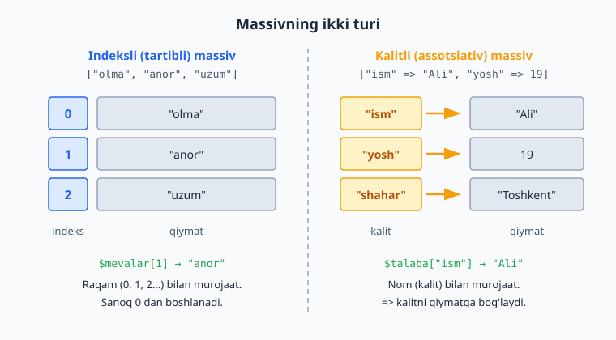

# 1.8 Ro'yxatlar (massivlar)

[⬅️ Oldingi: 1.7 Takrorlash (sikllar)](./10-takrorlash.md) · [🏠 README](./README.md) · [Keyingi: 1.9 Funksiyalar ➡️](./12-funksiyalar.md)

---

Hozirgacha bitta o'zgaruvchiga bitta qiymat saqlardik. Lekin ko'pincha **ro'yxat** kerak bo'ladi: 30 ta talaba ismi, 10 ta mahsulot narxi. Har biriga alohida o'zgaruvchi yaratish (`$talaba1`, `$talaba2`, ...) juda noqulay. Yechim — **massiv** (array): bitta o'zgaruvchiga **ko'p qiymat** saqlash.

Massivni "bo'limli quti" deb tasavvur qiling: bitta quti, lekin ichida ko'p bo'lim, har bir bo'limda alohida narsa.

### Oddiy (tartibli) massiv

Qiymatlar `[ ]` ichida, vergul bilan ajratib yoziladi:

```php
<?php
$mevalar = ["olma", "anor", "uzum"];
```

Bu massivda 3 ta qiymat bor. Har biriga **tartib raqami** (indeks) orqali murojaat qilamiz. **Diqqat: sanoq 0 dan boshlanadi** (1.5'da aytib o'tgandek):

```php
<?php
$mevalar = ["olma", "anor", "uzum"];

echo $mevalar[0];   // olma   (birinchi element — 0-indeks)
echo $mevalar[1];   // anor   (ikkinchi — 1-indeks)
echo $mevalar[2];   // uzum   (uchinchi — 2-indeks)
```

`$mevalar[0]` — "mevalar massivining 0-elementi" degani. Kvadrat qavs ichida indeks turadi.

### Massivga element qo'shish

```php
<?php
$mevalar = ["olma", "anor"];
$mevalar[] = "uzum";       // oxiriga qo'shadi
$mevalar[] = "shaftoli";

echo $mevalar[2];   // uzum
echo $mevalar[3];   // shaftoli
```

Bo'sh `[]` — "oxiriga yangi element qo'sh" degani.

### Massivdagi elementlar sonini bilish — `count`

```php
<?php
$mevalar = ["olma", "anor", "uzum"];
echo count($mevalar);   // 3
```

### Massivni ko'rish — `print_r`

Massiv ichida nima borligini ko'rish uchun `echo` ishlamaydi (massivni butunligicha chiqarib bo'lmaydi). Buning uchun `print_r` ishlatamiz:

```php
<?php
$mevalar = ["olma", "anor", "uzum"];
print_r($mevalar);
// Array ( [0] => olma [1] => anor [2] => uzum )
```

`print_r` har bir indeks va uning qiymatini ko'rsatadi. Bu tekshirish uchun foydali.

### `foreach` — massivni aylanib chiqish

Massivdagi **har bir** element ustida amal bajarish kerak bo'lsa, `foreach` sikli ishlatiladi. Bu — massivlar uchun maxsus, eng qulay sikl:

```php
<?php
$mevalar = ["olma", "anor", "uzum"];

foreach ($mevalar as $meva) {
    echo $meva . "<br>";
}
// olma
// anor
// uzum
```

`foreach ($mevalar as $meva)` shunday o'qiladi: "`$mevalar` massividagi **har bir** elementni navbat bilan `$meva`ga sol va ichidagi kodni bajar". Sikl avtomatik ravishda har bir element bo'ylab yuradi — indeks bilan ovora bo'lishingiz shart emas.

> `for` sikli bilan ham massivni aylanib chiqsa bo'ladi (`for ($i = 0; $i < count($mevalar); $i++)`), lekin `foreach` ancha sodda va xavfsiz. Massivlar uchun `foreach`ni afzal ko'ring.

### Kalitli massiv (associative array)

Ba'zan tartib raqami emas, **nom** bo'yicha murojaat qilish qulayroq. Masalan, bir talaba haqida ma'lumot: ismi, yoshi, shahri. Bunda har bir qiymatga **kalit** (nom) beramiz:

```php
<?php
$talaba = [
    "ism" => "Ali",
    "yosh" => 19,
    "shahar" => "Toshkent",
];

echo $talaba["ism"];     // Ali
echo $talaba["yosh"];    // 19
echo $talaba["shahar"];  // Toshkent
```

Bu yerda `=>` belgisi "kalit va qiymat" juftligini bog'laydi: `"ism" => "Ali"` degani "ism kaliti ostida Ali turibdi". Endi `$talaba["ism"]` deb nom orqali murojaat qilamiz (raqam orqali emas). Bu — bir narsa haqida bog'liq ma'lumotlarni birga saqlashning qulay yo'li.

Quyidagi sxema ikki turning farqini ko'rsatadi: indeksli massivda raqamli tartib, kalitli massivda esa har bir qiymat o'z nomi (kaliti) bilan turadi.



Kalitli massivni ham `foreach` bilan aylanib chiqish mumkin — bunda kalitni ham olamiz:

```php
<?php
$talaba = ["ism" => "Ali", "yosh" => 19, "shahar" => "Toshkent"];

foreach ($talaba as $kalit => $qiymat) {
    echo $kalit . ": " . $qiymat . "<br>";
}
// ism: Ali
// yosh: 19
// shahar: Toshkent
```

### Foydali tayyor massiv funksiyalari

PHP massivlar bilan ishlash uchun ko'p tayyor funksiya beradi. Eng keraklilari:

```php
<?php
$mevalar = ["olma", "anor", "uzum"];

// Element bormi? — in_array
var_dump(in_array("anor", $mevalar));    // true
var_dump(in_array("banan", $mevalar));   // false

// Saralash (massivning o'zini o'zgartiradi)
$sonlar = [3, 1, 4, 1, 5];
sort($sonlar);     // o'sish:   [1, 1, 3, 4, 5]
rsort($sonlar);    // kamayish: [5, 4, 3, 1, 1]

// Hisob-kitob
echo array_sum([10, 20, 30]);   // 60
echo max([10, 20, 30]);         // 30
echo min([10, 20, 30]);         // 10
echo count($mevalar);           // 3  (1.8 boshida ko'rgan)
```

Kalitli massivlar uchun:

```php
<?php
$talaba = ["ism" => "Ali", "yosh" => 19, "shahar" => "Toshkent"];

print_r(array_keys($talaba));     // ["ism", "yosh", "shahar"]  — faqat kalitlar
print_r(array_values($talaba));   // ["Ali", 19, "Toshkent"]    — faqat qiymatlar
```

- **`in_array($qiymat, $massiv)`** — qiymat massivda bormi (`true`/`false`).
- **`sort` / `rsort`** — o'sish / kamayish tartibida saralaydi. Diqqat: ular massivning **o'zini** o'zgartiradi (yangi massiv qaytarmaydi).
- **`array_sum`, `max`, `min`, `count`** — yig'indi, eng katta, eng kichik, soni.
- **`array_keys` / `array_values`** — kalitli massivdan faqat kalitlarni yoki faqat qiymatlarni ajratib oladi.

> **Why:** bu funksiyalarni o'zingiz `foreach` bilan yozish mumkin (1.8 mashqlarida shuni qildik), lekin tayyor funksiya — qisqaroq, tezroq va xatosizroq. "Eng katta sonni topish"ni qo'lda yozish — yaxshi mashq; real kodda esa `max()` ishlatiladi. Murakkabroq, "o'z qoidam bilan" saralashni (masalan, narx bo'yicha) keyingi bo'limda (`usort`) ko'ramiz.

### Mashqlar

**Oson**
1. 5 ta shahar nomidan massiv yarating va birinchi hamda oxirgisini chiqaring.
2. Massivga `[]` bilan yangi element qo'shing.
3. `count` bilan massivdagi elementlar sonini chiqaring.
4. `foreach` bilan massivdagi barcha elementlarni chiqaring.
5. Kalitli massiv yarating (kitob haqida: nomi, muallifi, yili) va har birini nom orqali chiqaring.

**O'rta**
6. Sonlardan iborat massiv (`[10, 20, 30, 40]`) yarating va `foreach` bilan ularning yig'indisini hisoblang.
7. Mahsulotlar massivini `foreach` bilan chiqaring, har birining oldiga raqam qo'ying (1. olma, 2. anor...). Maslahat: sikl tashqarisida hisoblagich yarating.
8. Kalitli massiv (talaba ma'lumoti) ni `foreach` bilan kalit-qiymat ko'rinishida chiqaring.
9. Massivdagi eng katta sonni toping (`foreach` bilan har bir elementni joriy eng katta bilan solishtiring).

**Qiyin**
10. Talabalar ro'yxati — bu yerda massiv **ichida** kalitli massivlar bo'ladi: har bir talaba alohida kalitli massiv (ism, ball). Hammasini `foreach` bilan chiqaring (`Ali - 85 ball` ko'rinishida).
11. Sonlar massividagi qiymatlarning o'rtachasini hisoblang (yig'indini elementlar soniga bo'ling).
12. Bir massivdagi sonlardan faqat juftlarini yangi massivga yig'ing va chiqaring.
13. `[12, 45, 23, 8, 67]` massivida: `array_sum`, `max`, `min` bilan yig'indi, eng katta va eng kichikni chiqaring; `in_array` bilan `67` borligini tekshiring.
14. `$narxlar = [300, 100, 500, 200]` ni `sort` bilan o'sish, `rsort` bilan kamayish tartibida chiqaring (har birini `implode` bilan).

<details markdown="1">
<summary>Yechim — 6</summary>

```php
<?php
$sonlar = [10, 20, 30, 40];
$yigindi = 0;

foreach ($sonlar as $son) {
    $yigindi += $son;   // har bir sonni yig'indiga qo'shamiz
}

echo "Yig'indi: " . $yigindi;   // 100
```
</details>

<details markdown="1">
<summary>Yechim — 9 (eng katta son)</summary>

```php
<?php
$sonlar = [12, 45, 23, 8, 67, 34];
$eng_katta = $sonlar[0];   // birinchisini "hozircha eng katta" deb olamiz

foreach ($sonlar as $son) {
    if ($son > $eng_katta) {
        $eng_katta = $son;   // kattaroq topilsa, yangilaymiz
    }
}

echo "Eng katta: " . $eng_katta;   // 67
```
Mantiq: birinchi elementni boshlang'ich "g'olib" deb olamiz, keyin har birini u bilan solishtiramiz; kattarog'i chiqsa — uni yangi g'olib qilamiz.
</details>

<details markdown="1">
<summary>Yechim — 10 (massiv ichida massiv)</summary>

```php
<?php
$talabalar = [
    ["ism" => "Ali", "ball" => 85],
    ["ism" => "Vali", "ball" => 72],
    ["ism" => "Guli", "ball" => 95],
];

foreach ($talabalar as $talaba) {
    echo $talaba["ism"] . " - " . $talaba["ball"] . " ball<br>";
}
// Ali - 85 ball
// Vali - 72 ball
// Guli - 95 ball
```
Bu yerda `$talabalar` — massiv, uning har bir elementi yana kalitli massiv. `foreach` har bir talabani oladi, keyin uning ichidagi `["ism"]` va `["ball"]` ga murojaat qilamiz. Bunday "massiv ichida massiv" tuzilmasi real dasturlarda juda ko'p uchraydi (masalan, bazadan kelgan ma'lumotlar shunday ko'rinadi).
</details>

<details markdown="1">
<summary>Yechim — 11 (o'rtacha qiymat)</summary>

```php
<?php
$sonlar = [10, 25, 30, 45];

$yigindi = 0;
foreach ($sonlar as $son) {
    $yigindi += $son;
}

$ortacha = $yigindi / count($sonlar);   // yig'indini elementlar soniga bo'lamiz
echo "O'rtacha: " . $ortacha;            // 27.5
```
O'rtacha = yig'indi ÷ elementlar soni. `count($sonlar)` elementlar sonini beradi. (Buni `array_sum($sonlar) / count($sonlar)` bilan bir qatorda ham yozish mumkin — 1.8'dagi tayyor funksiyalarni eslang.)
</details>

<details markdown="1">
<summary>Yechim — 12 (juft sonlarni yangi massivga yig'ish)</summary>

```php
<?php
$hammasi = [1, 2, 3, 4, 5, 6, 7, 8];
$juftlar = [];                    // bo'sh massiv

foreach ($hammasi as $son) {
    if ($son % 2 == 0) {
        $juftlar[] = $son;        // juft bo'lsa, yangi massivga qo'sh
    }
}

echo implode(", ", $juftlar);     // 2, 4, 6, 8
```
Bo'sh massivdan boshlaymiz, `foreach` bilan har bir sonni tekshiramiz, juft bo'lsa `$juftlar[]` bilan oxiriga qo'shamiz. (1.10'da buni `array_filter` bilan bitta qatorda qilishni ko'rasiz.)
</details>

<details markdown="1">
<summary>Yechim — 13 (tayyor funksiyalar bilan)</summary>

```php
<?php
$sonlar = [12, 45, 23, 8, 67];

echo "Yig'indi: " . array_sum($sonlar) . "<br>";   // 155
echo "Eng katta: " . max($sonlar) . "<br>";        // 67
echo "Eng kichik: " . min($sonlar) . "<br>";       // 8
var_dump(in_array(67, $sonlar));                    // true
```
9-mashqda eng katta sonni `foreach` bilan qo'lda topgandik. Bu yerda esa `max()` bir so'zda qiladi — tayyor funksiyalar shu uchun foydali.
</details>

<details markdown="1">
<summary>Yechim — 14 (sort / rsort)</summary>

```php
<?php
$narxlar = [300, 100, 500, 200];

sort($narxlar);                      // o'sish tartibida
echo implode(", ", $narxlar);        // 100, 200, 300, 500

echo "<br>";

rsort($narxlar);                     // kamayish tartibida
echo implode(", ", $narxlar);        // 500, 300, 200, 100
```
Diqqat: `sort`/`rsort` massivning **o'zini** o'zgartiradi — natijani alohida o'zgaruvchiga olish shart emas, `$narxlar`ning o'zi saralangan bo'ladi.
</details>
