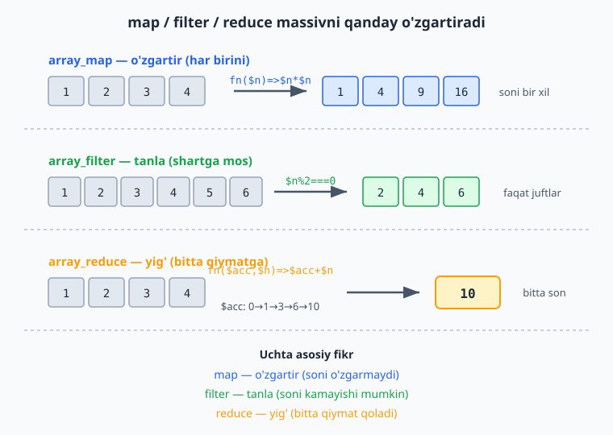

# 1.10 Anonim funksiyalar va massiv vositalari (map / filter / reduce)

[⬅️ Oldingi: 1.9 Funksiyalar](./12-funksiyalar.md) · [🏠 README](./README.md) · [Keyingi: 2.1 Class va obyekt — eng asosiy tushuncha ➡️](./14-class-va-obyekt-eng-asosiy-tushuncha.md)

---

Bu — 1-QISMning eng "kuchaytiruvchi" bo'limi. Avvaliga biroz yangi tuyuladi, lekin o'zlashtirsangiz, massivlar bilan ishlash ancha qisqa va chiroyli bo'ladi. Shoshilmang, har misolni yozib ko'ring.

### Anonim (nomsiz) funksiya

Hozirgacha funksiyaga nom berardik (`function salom() {...}`). Lekin PHP'da **nomsiz** funksiya ham yaratish va uni o'zgaruvchiga saqlash mumkin:

```php
<?php
$salom = function(string $ism): string {
    return "Salom, $ism";
};

echo $salom("Ali");   // Salom, Ali
```

Funksiya endi `$salom` o'zgaruvchisida "yashaydi"; uni `$salom(...)` orqali chaqiramiz. Bu g'alati ko'rinishi mumkin, lekin foydasi pastda ochiladi: funksiyani **boshqa funksiyaga uzatish** mumkin bo'ladi.

### Arrow function (`fn`) — qisqa shakl

Funksiya bitta ifodadan iborat bo'lsa, uni `fn` bilan ancha qisqa yozish mumkin:

```php
<?php
// Bu ikkisi bir xil:
$kvadrat = function(int $n): int { return $n * $n; };
$kvadrat = fn(int $n): int => $n * $n;     // qisqa: { return ... } o'rniga => ifoda

echo $kvadrat(5);   // 25
```

`fn(parametrlar) => ifoda` — `{ }` va `return` yo'q, bitta ifoda natijasi avtomatik qaytadi. Pastdagi `array_map`/`filter` bilan ayniqsa qulay.

### Closure — tashqi o'zgaruvchini "ushlab qolish" (`use`)

Oddiy funksiya tashqaridagi o'zgaruvchini ko'rmaydi (1.9). Anonim funksiya esa `use` orqali tashqi o'zgaruvchini "ichiga olib kirishi" mumkin:

```php
<?php
$soliq = 12;

$narxHisobla = function(float $narx) use ($soliq): float {
    return $narx + ($narx * $soliq / 100);   // tashqi $soliq ishlatilyapti
};

echo $narxHisobla(1000);   // 1120
```

`use ($soliq)` — "tashqaridagi `$soliq`ni shu funksiya ichida ham ishlat". Bunday "atrofidagi o'zgaruvchini eslab qolgan" funksiya **closure** deyiladi. (Arrow `fn` esa tashqi o'zgaruvchilarni `use`siz, avtomatik ko'radi.)

### `array_map` — har bir elementni o'zgartirish

Mana endi asosiy foyda. `array_map` massivning **har bir elementiga** funksiya qo'llab, **yangi massiv** qaytaradi:

```php
<?php
$sonlar = [1, 2, 3, 4];

$kvadratlar = array_map(fn($n) => $n * $n, $sonlar);
// [1, 4, 9, 16]
```

`foreach` bilan yozsangiz 4 qator kerak edi; `array_map` bilan — bitta qator. "Har bir elementni shu funksiyadan o'tkaz" degani.

### `array_filter` — shart bo'yicha tanlash

`array_filter` faqat shartni qondiradigan elementlarni qoldiradi:

```php
<?php
$sonlar = [1, 2, 3, 4, 5, 6];

$juftlar = array_filter($sonlar, fn($n) => $n % 2 === 0);
// [2, 4, 6]
```

Funksiya `true` qaytarsa — element qoladi, `false` qaytarsa — tashlanadi.

### `array_reduce` — massivni bitta qiymatga yig'ish

`array_reduce` butun massivni **bitta natijaga** "yig'adi" (yig'indi, ko'paytma, eng katta...):

```php
<?php
$sonlar = [1, 2, 3, 4];

$yigindi = array_reduce($sonlar, fn($acc, $n) => $acc + $n, 0);
// 10
```

- `$acc` — "to'planayotgan natija" (accumulator), `0` — uning boshlang'ich qiymati.
- Har qadamda: `$acc = $acc + $n`. Oxirida `$acc` — yakuniy yig'indi.

> **map / filter / reduce — uchta asosiy fikr:** `map` — *o'zgartir* (har birini), `filter` — *tanla* (shartga mos), `reduce` — *yig'* (bitta qiymatga). Bularning hammasini `foreach` bilan yozsa bo'ladi, lekin bu uchtasi — qisqaroq, niyatni aniqroq ko'rsatadi va kamroq xato. Ular zamonaviy kodda (va boshqa tillarda — JS, Python) hamma joyda uchraydi.

Quyidagi sxema uchalasi massivni qanday o'zgartirishini yonma-yon ko'rsatadi.



### `usort` — o'z qoidang bilan saralash

1.8'dagi `sort` oddiy saralardi. Lekin "narx bo'yicha", "ism uzunligi bo'yicha" kabi **o'z qoidangiz** bilan saralash uchun `usort` ishlatiladi — unga "ikkitasini qanday solishtirish" funksiyasini berasiz:

```php
<?php
$mahsulotlar = [
    ["nom" => "A", "narx" => 300],
    ["nom" => "B", "narx" => 100],
    ["nom" => "C", "narx" => 200],
];

// Narx bo'yicha o'sish tartibida:
usort($mahsulotlar, fn($a, $b) => $a["narx"] <=> $b["narx"]);
// endi tartib: B(100), C(200), A(300)
```

**`<=>`** — "kosmik kema" (spaceship) operatori: `$a <=> $b` chapi kichik bo'lsa `-1`, teng bo'lsa `0`, katta bo'lsa `1` qaytaradi — aynan `usort` kutadigan narsa. Kamayish tartibi uchun `$b["narx"] <=> $a["narx"]` (joyini almashtiring).

### Mashqlar

**Oson**
1. Anonim funksiyani o'zgaruvchiga saqlang (`$kvadrat`) va uni chaqiring.
2. Shu funksiyani `fn` (arrow) ko'rinishida qayta yozing.
3. `array_map` bilan `[1,2,3,4,5]` har bir elementini 10 ga ko'paytiring.
4. `array_filter` bilan `[5, 12, 8, 20, 3]` dan 10 dan kattalarini tanlang.

**O'rta**
5. Closure: tashqi `$boshlangich` o'zgaruvchisini `use` bilan olgan funksiya yozing.
6. `array_map` bilan ismlar massivining har birini `strtoupper` bilan katta harfga aylantiring.
7. `array_reduce` bilan `[10, 20, 30, 40]` yig'indisini hisoblang.
8. `array_filter` + `count` bilan massivda nechta juft son borligini toping.

**Qiyin**
9. `usort` bilan talabalar massivini (`["ism"=>..., "ball"=>...]`) ball bo'yicha **kamayish** tartibida saralang.
10. Bitta zanjirda: sonlar massividan avval juftlarini `array_filter` bilan oling, keyin `array_map` bilan kvadratga aylantiring, oxirida `array_reduce` (yoki `array_sum`) bilan yig'indisini toping.
11. `array_map` ni ikkita massiv bilan ishlating: narxlar va sonlar massivlaridan har bir mahsulotning jami narxini (`narx * soni`) hisoblang.

<details markdown="1">
<summary>Yechim — 9 (usort bilan ball bo'yicha saralash)</summary>

```php
<?php
$talabalar = [
    ["ism" => "Ali",  "ball" => 85],
    ["ism" => "Vali", "ball" => 72],
    ["ism" => "Guli", "ball" => 95],
];

// Kamayish: kattadan kichikka — $b ni $a dan oldin qo'yamiz
usort($talabalar, fn($a, $b) => $b["ball"] <=> $a["ball"]);

foreach ($talabalar as $t) {
    echo $t["ism"] . " - " . $t["ball"] . "<br>";
}
// Guli - 95
// Ali - 85
// Vali - 72
```
`<=>` solishtiradi; `$b <=> $a` (teskari tartibda) kamayishni beradi. O'sish kerak bo'lsa `$a <=> $b`.
</details>

<details markdown="1">
<summary>Yechim — 10 (filter → map → reduce zanjiri)</summary>

```php
<?php
$sonlar = [1, 2, 3, 4, 5, 6];

$juftlar   = array_filter($sonlar, fn($n) => $n % 2 === 0);   // [2, 4, 6]
$kvadratlar = array_map(fn($n) => $n * $n, $juftlar);          // [4, 16, 36]
$yigindi   = array_sum($kvadratlar);                          // 56

echo $yigindi;   // 56
```
Bu — "ma'lumot quvuri" (pipeline): tanla → o'zgartir → yig'. Har bosqich oldingisining natijasi ustida ishlaydi. Bunday zanjir real kodda juda ko'p uchraydi.
</details>

<details markdown="1">
<summary>Yechim — 11 (ikki massivli array_map)</summary>

```php
<?php
$narxlar = [1000, 2000, 500];
$sonlar  = [2, 1, 4];

// array_map bir nechta massivni parallel oladi:
$jami = array_map(fn($narx, $soni) => $narx * $soni, $narxlar, $sonlar);
// [2000, 2000, 2000]

echo array_sum($jami);   // 6000
```
`array_map` ikkita massivni "parallel" yuradi: birinchi narx × birinchi soni, ikkinchi × ikkinchi... Funksiya ikki parametr (`$narx, $soni`) oladi.
</details>

---

> **1-QISM yakunlandi.** Tabriklaymiz! Endi siz: o'zgaruvchilar, ma'lumot turlari, amallar, matn, shartlar (`if`, `switch`, `match`, ternary, `??`), sikllar, massivlar (va `map`/`filter`/`reduce`) hamda funksiyalar (tip e'lonlari bilan) bilan ishlay olasiz. Bu — har qanday dasturning poydevori. Bularni mustahkam o'zlashtirsangiz, oddiy lekin haqiqiy dasturlar (kalkulyator, baholar hisoblagichi, ro'yxat boshqaruvi) yoza olasiz.
>
> Keyingi qism — **OOP (Obyektga yo'naltirilgan dasturlash):** kodni yanada chiroyli va katta loyihalarga mos tarzda tashkil qilish usuli. Undan keyin — **ma'lumotlar bazasi** (ma'lumotni doimiy saqlash) va boshqa ilg'or mavzular, har biri shu — soddadan murakkabga, batafsil tushuntirish bilan.
