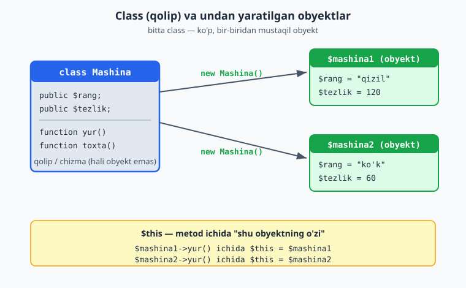

# 2.1 Class va obyekt — eng asosiy tushuncha

[⬅️ Oldingi: 1.14 CLI — terminal skriptlari](./cli-skriptlar.md) · [🏠 README](./README.md) · [Keyingi: 2.2 Konstruktor ➡️](./15-konstruktor.md)

---

Bu qism — yangi fikrlash usuli. Avvaliga g'alati tuyulishi mumkin, lekin sekin-asta, ko'p misol bilan tushuntiraman. Shoshilmang.

### Muammo: ma'lumot va amallar alohida

1-QISMda **ma'lumot** (o'zgaruvchilar) va **amallar** (funksiyalar) alohida edi. Kichik dasturda bu yetarli. Lekin dastur kattalashganda, bir-biriga bog'liq narsalar tarqalib ketadi.

Masalan, bir mashinani tasvirlamoqchimiz. Uning **ma'lumotlari** bor: rangi, tezligi. Va **amallari** bor: yurish, to'xtash. Procedural usulda bularning hammasi alohida o'zgaruvchi va funksiyalarda sochilib yotadi. Agar 10 ta mashina bo'lsa — chalkashlik kuchayadi.

**OOP yechimi:** bir-biriga tegishli ma'lumot va amallarni **bitta birlikka** jamlaymiz. Bu birlik — **obyekt** deyiladi.

### Class va obyekt — qolip va undan yasalgan narsa

Ikki muhim so'z:

- **Class (klass)** — bu **qolip**, **andoza**, **chizma**. U "mashina qanday bo'lishi kerakligini" tasvirlaydi: har bir mashinada rang bo'ladi, tezlik bo'ladi, yura oladi, to'xtaydi. Lekin class — bu hali mashina emas, faqat uning "chizmasi".

- **Obyekt (object)** — bu chizmadan **yasalgan haqiqiy narsa**. Bitta chizmadan (class) ko'p mashina (obyekt) yasash mumkin: qizil Cobalt, oq Malibu — har biri alohida obyekt, lekin hammasi bir xil chizma asosida.

Yana bir misol: **quvur (cookie cutter) va pechenye.** Quvur — class (bitta shakl beradi). Undan yasagan har bir pechenye — obyekt. Pechenyelar bir xil shaklda, lekin alohida-alohida.

### Birinchi class

Keling, mashina classini yozamiz:

```php
<?php
class Mashina {
    // Xususiyatlar (ma'lumotlar) — har bir mashinada nima bor
    public $rang;
    public $tezlik;

    // Metodlar (amallar) — mashina nima qila oladi
    public function yur() {
        echo "Mashina yuryapti";
    }

    public function toxta() {
        echo "Mashina to'xtadi";
    }
}
```

Tushuntiramiz:
- **`class Mashina { ... }`** — "Mashina degan class yarataman". Class nomi odatda **bosh harf** bilan boshlanadi (`Mashina`, `Talaba`) — bu qabul qilingan qoida.
- **`public $rang;` va `public $tezlik;`** — bular **xususiyatlar** (properties). Ya'ni "har bir mashinada rang va tezlik bo'ladi". Xususiyat — bu class ichidagi o'zgaruvchi. (`public` so'zini hozircha shunchaki yozavering — uni 2.3'da tushuntiramiz.)
- **`public function yur() { ... }`** — bu **metod** (method). Metod — bu class ichidagi funksiya. "Mashina yura oladi" degan amalni bildiradi.

> **Eslab qoling:** class ichidagi o'zgaruvchi — **xususiyat** (property), class ichidagi funksiya — **metod** (method). Bu — yangi atamalar, lekin aslida tanish narsalar (o'zgaruvchi va funksiya), faqat class ichida.

### Classdan obyekt yaratish

Class — faqat chizma. Undan haqiqiy obyekt yaratish uchun `new` so'zi ishlatiladi:

```php
<?php
class Mashina {
    public $rang;
    public $tezlik;

    public function yur() {
        echo "Mashina yuryapti";
    }
}

// Obyekt yaratamiz (chizmadan haqiqiy mashina):
$mashina1 = new Mashina();

// Xususiyatlariga qiymat beramiz:
$mashina1->rang = "qizil";
$mashina1->tezlik = 120;

// Xususiyatlarini o'qiymiz:
echo $mashina1->rang;     // qizil
echo "<br>";
echo $mashina1->tezlik;   // 120

// Metodini chaqiramiz:
$mashina1->yur();         // Mashina yuryapti
```

Diqqat qiling:
- **`$mashina1 = new Mashina();`** — `new` so'zi bilan classdan obyekt yaratiladi va `$mashina1`ga saqlanadi.
- **`->`** (o'q belgisi) — obyektning xususiyati yoki metodiga murojaat qilish uchun. `$mashina1->rang` — "mashina1ning rangi". `$mashina1->yur()` — "mashina1ning yur metodini chaqir".

> **Yangi belgi: `->`**. Massivda `$massiv["kalit"]` (kvadrat qavs) ishlatardik. Obyektda esa `$obyekt->xususiyat` (o'q belgisi) ishlatamiz. Ikkisini aralashtirmang: massiv → `[ ]`, obyekt → `->`.

### Ko'p obyekt — bir class

Eng muhim tushuncha shu: bitta classdan **ko'p, bir-biridan mustaqil obyekt** yaratish mumkin:

```php
<?php
class Mashina {
    public $rang;
}

$mashina1 = new Mashina();
$mashina1->rang = "qizil";

$mashina2 = new Mashina();
$mashina2->rang = "ko'k";

echo $mashina1->rang;   // qizil
echo "<br>";
echo $mashina2->rang;   // ko'k
```

`$mashina1` va `$mashina2` — ikki **alohida** obyekt. Biri qizil, biri ko'k. Bittasini o'zgartirsangiz, ikkinchisiga ta'sir qilmaydi. Xuddi bir chizmadan yasalgan ikki mashina kabi.

Quyidagi diagramma class (qolip) dan `new` bilan ko'p mustaqil obyekt yaratilishini va metod ichidagi `$this` har bir obyektga qanday ishora qilishini ko'rsatadi:



### `$this` — "o'zim" degani

Metod ichida, ayni shu obyektning xususiyatiga murojaat qilish kerak bo'ladi. Buning uchun **`$this`** so'zi ishlatiladi. `$this` — "shu obyektning o'zi" degani:

```php
<?php
class Mashina {
    public $rang;

    public function rangniAyt() {
        // $this->rang — "shu obyektning rangi"
        echo "Mashina rangi: " . $this->rang;
    }
}

$m = new Mashina();
$m->rang = "qizil";
$m->rangniAyt();   // Mashina rangi: qizil
```

`rangniAyt` metodi `$this->rang` orqali **o'zining** rangiga murojaat qiladi. Agar boshqa obyektda chaqirsangiz, `$this` o'sha obyektga ishora qiladi. Ya'ni `$this` har doim "metod chaqirilgan obyekt"ni bildiradi.

> `$this` faqat metod **ichida** ishlatiladi. Tashqarida `$mashina1->rang` deysiz; metod ichida `$this->rang` deysiz. Ikkalasi ham "shu obyektning rangi" — faqat qaysi joydan murojaat qilishingizga qarab farq qiladi.

### Mashqlar

**Oson**
1. `Mashina` classini yarating (xususiyat: `rang`, `tezlik`). Bitta obyekt yarating va xususiyatlarini chiqaring.
2. `Mashina`ga `yur()` metodini qo'shing va uni obyekt orqali chaqiring.
3. Ikkita mashina obyekti yarating, har biriga boshqa rang bering va ikkalasini chiqaring.
4. `Talaba` classini yarating (xususiyat: `ism`, `yosh`). Obyekt yarating, qiymat bering, chiqaring.
5. `Itoat` — yo'q, oddiyroq: `It` classini yarating (xususiyat: `nomi`), `huradi()` metodi "Vov-vov!" chiqarsin.

**O'rta**
6. `Talaba` classiga `malumot()` metodini qo'shing — `$this` orqali ism va yoshni "Ali, 19 yosh" ko'rinishida chiqarsin.
7. `Mahsulot` classini yarating (xususiyat: `nom`, `narx`). Uchta mahsulot obyekti yarating va har birining ma'lumotini chiqaring.
8. `Hisob` (bank hisobi) classini yarating (xususiyat: `balans`). `korsat()` metodi balansni chiqarsin.
9. `Aylana` classini yarating (xususiyat: `radius`). `yuza()` metodi yuzani hisoblab qaytarsin (`3.14 * radius * radius`).

**Qiyin**
10. `Talaba` classiga `ball` xususiyatini va `otdimi()` metodini qo'shing — ball 60 dan katta yoki teng bo'lsa "O'tdi", aks holda "Yiqildi" qaytarsin (`$this->ball` va `if` bilan).
11. `Mashina`ga `tezlik` xususiyati va `tezlash($qiymat)` metodini qo'shing — metod tezlikni berilgan qiymatga oshirsin (`$this->tezlik += $qiymat`).
12. `Hisob` classiga `pulQoshish($summa)` va `pulYechish($summa)` metodlarini qo'shing — balansni mos ravishda oshirib/kamaytirsin.

<details markdown="1">
<summary>Yechim — 6</summary>

```php
<?php
class Talaba {
    public $ism;
    public $yosh;

    public function malumot() {
        echo $this->ism . ", " . $this->yosh . " yosh";
    }
}

$t = new Talaba();
$t->ism = "Ali";
$t->yosh = 19;
$t->malumot();   // Ali, 19 yosh
```
`malumot()` metodi `$this->ism` va `$this->yosh` orqali **o'z** obyektining ma'lumotlariga murojaat qiladi.
</details>

<details markdown="1">
<summary>Yechim — 10 (Talaba: ball va otdimi)</summary>

```php
<?php
class Talaba {
    public $ism;
    public $ball;

    public function otdimi() {
        if ($this->ball >= 60) {
            return "O'tdi";
        } else {
            return "Yiqildi";
        }
    }
}

$t = new Talaba();
$t->ism = "Ali";
$t->ball = 75;
echo $t->ism . ": " . $t->otdimi();   // Ali: O'tdi
```
`otdimi()` metodi `$this->ball` orqali **o'z** obyektining balliga qarab qaror qiladi. (Shartni `return $this->ball >= 60 ? "O'tdi" : "Yiqildi";` deb qisqaroq ham yozsa bo'ladi — 1.6'dagi ternary.)
</details>

<details markdown="1">
<summary>Yechim — 11 (Mashina: tezlash)</summary>

```php
<?php
class Mashina {
    public $tezlik = 0;   // boshlang'ich tezlik

    public function tezlash($qiymat) {
        $this->tezlik += $qiymat;   // joriy tezlikka qo'shamiz
    }
}

$m = new Mashina();
$m->tezlash(50);
$m->tezlash(30);
echo $m->tezlik;   // 80
```
Metod `$this->tezlik` ni o'zgartiradi — har chaqiruvda tezlik to'planib boradi. Obyektning holati (tezligi) metodlar orqali o'zgaradi: OOP'ning asosiy g'oyasi.
</details>

<details markdown="1">
<summary>Yechim — 12 (bank hisobi)</summary>

```php
<?php
class Hisob {
    public $balans = 0;   // boshlang'ich balans 0

    public function pulQoshish($summa) {
        $this->balans += $summa;
    }

    public function pulYechish($summa) {
        $this->balans -= $summa;
    }

    public function korsat() {
        echo "Balans: " . $this->balans . " so'm";
    }
}

$hisob = new Hisob();
$hisob->pulQoshish(100000);
$hisob->pulYechish(30000);
$hisob->korsat();   // Balans: 70000 so'm
```
E'tibor bering: bu yerda ma'lumot (`balans`) va u bilan ishlaydigan amallar (`pulQoshish`, `pulYechish`) **bitta joyda** — class ichida. Bu OOP'ning asosiy g'oyasi. Keyingi bo'limda (2.3) buni yanada xavfsizroq qilishni o'rganamiz.
</details>
