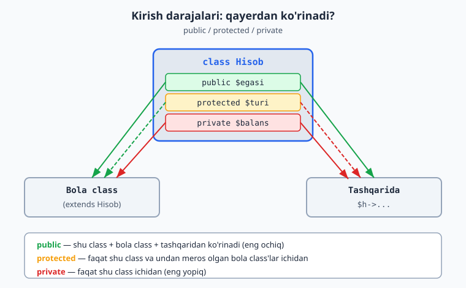

# 2.3 Kirish darajalari: public va private

[⬅️ Oldingi: 2.2 Konstruktor](./15-konstruktor.md) · [🏠 README](./README.md) · [Keyingi: 2.4 Meros (inheritance) ➡️](./17-meros.md)

---

Hozirgacha har bir xususiyat va metod oldiga `public` yozdik, lekin nima ekanini tushuntirmadik. Endi vaqti keldi.

### Muammo: hamma narsani tashqaridan o'zgartirish mumkin

`public` xususiyatni tashqaridan **istalgancha** o'zgartirish mumkin. Bu ba'zan xavfli. Bank hisobi misolini ko'raylik:

```php
<?php
class Hisob {
    public $balans = 0;
}

$h = new Hisob();
$h->balans = -50000;   // muammo! Balansni to'g'ridan-to'g'ri manfiy qildik
```

Bu noto'g'ri — bank hisobida balans manfiy bo'lmasligi kerak (yoki faqat ma'lum qoidalar bilan). Lekin `public` bo'lgani uchun, hech qanday tekshiruvsiz, istalgan qiymat berildi. Demak, ma'lumotni **himoyalash** kerak.

### Yechim: `private` — "faqat ichkaridan"

PHP'da xususiyat va metodlarga **kirish darajasi** belgilash mumkin:

- **`public`** — "ochiq". Tashqaridan ham, ichkaridan ham murojaat qilish mumkin.
- **`private`** — "yopiq". Faqat **shu class ichidan** murojaat qilish mumkin. Tashqaridan — mumkin emas.

```php
<?php
class Hisob {
    private $balans = 0;   // endi yopiq

    public function pulQoshish($summa) {
        if ($summa > 0) {              // tekshiruv!
            $this->balans += $summa;
        }
    }

    public function balansniKorish() {
        return $this->balans;
    }
}

$h = new Hisob();
$h->pulQoshish(100000);        // to'g'ri yo'l — metod orqali
echo $h->balansniKorish();     // 100000

// $h->balans = -50000;        // XATO! balans private, tashqaridan tegib bo'lmaydi
```

Endi `balans`ga tashqaridan **to'g'ridan-to'g'ri** tegib bo'lmaydi. Uni o'zgartirishning yagona yo'li — `pulQoshish` metodi orqali, u esa **tekshiruv** qiladi (manfiy summani qabul qilmaydi). Bu — ma'lumotni himoyalash.

### Bu g'oya: "inkapsulyatsiya" (encapsulation)

Bu yondashuvning nomi bor — **inkapsulyatsiya**. Ma'nosi: ma'lumotni (xususiyatni) yopib, unga faqat nazorat ostidagi metodlar orqali ruxsat berish.

Buni dori qutisiga o'xshatish mumkin: dorini to'g'ridan-to'g'ri olib bo'lmaydi, "bolalarga qarshi" qopqoq bor — uni faqat to'g'ri usulda ochasiz. Yoki bankomat: pulga to'g'ridan-to'g'ri qo'l yetkazmaysiz, faqat tugmalar (metodlar) orqali olasiz, ular esa qoidalarni tekshiradi (balans yetarlimi va h.k.).

### Getter va setter — o'qish va yozish metodlari

Yopiq xususiyatni o'qish va yozish uchun maxsus metodlar yoziladi. Ularni odatda **getter** (o'qish) va **setter** (yozish) deb atashadi:

```php
<?php
class Talaba {
    private $ism;

    public function __construct($ism) {
        $this->ism = $ism;
    }

    // getter — qiymatni o'qish
    public function getIsm() {
        return $this->ism;
    }

    // setter — qiymatni o'zgartirish (tekshiruv bilan)
    public function setIsm($yangiIsm) {
        if (strlen($yangiIsm) > 0) {     // bo'sh ism qabul qilinmaydi
            $this->ism = $yangiIsm;
        }
    }
}

$t = new Talaba("Ali");
echo $t->getIsm();        // Ali  (o'qidik)
$t->setIsm("Vali");       // o'zgartirdik
echo $t->getIsm();        // Vali
```

Getter/setter orqali siz **nazoratni** qo'lda ushlaysiz: setter ichida tekshiruv qo'yib, noto'g'ri qiymatni rad eta olasiz.

> **Qachon `public`, qachon `private`?** Umumiy qoida: **xususiyatlarni `private` qiling**, ularga metodlar (`public`) orqali ruxsat bering. Bu ma'lumotni himoyalaydi va keyinroq qoidalarni o'zgartirishni osonlashtiradi. Metodlarning ko'pi `public` bo'ladi (chunki ular class "interfeysi" — tashqaridan ishlatiladi), lekin faqat ichki yordamchi metodlarni `private` qilish mumkin.

Quyidagi diagramma har bir kirish darajasi qayerdan ko'rinishini taqqoslaydi (`protected` bilan keyingi bo'limda — meros — tanishasiz, lekin u shu yerda umumiy manzarada ko'rsatilgan):



### Mashqlar

**Oson**
1. `Hisob` classida `balans`ni `private` qiling. `pulQoshish` metodi orqali to'ldiring va `balansniKorish` orqali o'qing.
2. Tashqaridan `private` xususiyatga to'g'ridan-to'g'ri tegishga urinib ko'ring (`$h->balans = 100;`) — xatoni ko'ring.
3. `Talaba` classida `ism`ni private qiling, `getIsm()` getterini yozing.
4. `Talaba`ga `setIsm()` setterini qo'shing va ismni o'zgartiring.
5. `Mahsulot` classida `narx`ni private qiling, getter va setter yozing.

**O'rta**
6. `Hisob`ning `pulYechish` metodini yozing — balansdan ko'p pul yechishga ruxsat bermasin (`if ($summa <= $this->balans)`).
7. `Talaba`ning `setBall` setterida ball 0-100 oralig'ida ekanini tekshiring; tashqaridagi qiymat noto'g'ri bo'lsa, qabul qilmasin.
8. `Mahsulot`ning `setNarx` setterida narx manfiy bo'lmasligini ta'minlang.
9. `Foydalanuvchi` classi: `parol` private bo'lsin; `parolniOzgartir($eski, $yangi)` metodi faqat eski parol to'g'ri bo'lsa o'zgartirsin.

**Qiyin**
10. To'liq `Hisob` classi: `balans` private, `pulQoshish` (musbat tekshiruvi bilan), `pulYechish` (yetarlilik tekshiruvi bilan), `balansniKorish`. Bir nechta amal bajarib sinab ko'ring.
11. `Mahsulot` classida `narx` va `chegirma` (foiz) private bo'lsin. `yakuniyNarx()` metodi chegirmani hisobga olib yakuniy narxni qaytarsin. `setChegirma` 0-100 oralig'ini tekshirsin.
12. `Termometr` classi: `harorat` private. `setHarorat` -50 dan +50 gacha oraliqni tekshirsin. `holat()` metodi haroratga qarab "sovuq/normal/issiq" qaytarsin.

<details markdown="1">
<summary>Yechim — 6 (xavfsiz pul yechish)</summary>

```php
<?php
class Hisob {
    private $balans = 0;

    public function pulQoshish($summa) {
        if ($summa > 0) {
            $this->balans += $summa;
        }
    }

    public function pulYechish($summa) {
        if ($summa > 0 && $summa <= $this->balans) {   // yetarli pul bormi?
            $this->balans -= $summa;
            return true;    // muvaffaqiyatli
        }
        return false;       // yechib bo'lmadi
    }

    public function balansniKorish() {
        return $this->balans;
    }
}

$h = new Hisob();
$h->pulQoshish(100000);
$h->pulYechish(150000);   // false — pul yetarli emas, balans o'zgarmaydi
echo $h->balansniKorish(); // 100000
$h->pulYechish(30000);    // true
echo "<br>" . $h->balansniKorish(); // 70000
```
Mana inkapsulyatsiyaning kuchi: `balans` himoyalangani uchun, undan ko'p pul yechib bo'lmaydi — qoida class ichida kafolatlangan.
</details>

<details markdown="1">
<summary>Yechim — 10 (to'liq, himoyalangan Hisob)</summary>

Bu — 6-mashqdagi `Hisob` class'ining to'liq ko'rinishi. Endi uni amalda sinab ko'ramiz:

```php
<?php
class Hisob {
    private $balans = 0;

    public function pulQoshish($summa) {
        if ($summa > 0) {                  // faqat musbat summa
            $this->balans += $summa;
        }
    }

    public function pulYechish($summa) {
        if ($summa > 0 && $summa <= $this->balans) {
            $this->balans -= $summa;
            return true;
        }
        return false;
    }

    public function balansniKorish() {
        return $this->balans;
    }
}

$h = new Hisob();
$h->pulQoshish(200000);
$h->pulQoshish(-5000);     // e'tiborsiz qoldiriladi (musbat emas)
$h->pulYechish(50000);     // true
$h->pulYechish(999999);    // false (yetarli emas)

echo $h->balansniKorish();   // 150000
```
`balans` `private` — unga faqat class metodlari orqali tegish mumkin. Shuning uchun "manfiy pul qo'shish" yoki "yo'q pulni yechish" kabi noto'g'ri holatlar oldindan to'siladi. Ma'lumotni himoyalashning butun maqsadi shu.
</details>

<details markdown="1">
<summary>Yechim — 11 (Mahsulot: narx va chegirma)</summary>

```php
<?php
class Mahsulot {
    private $narx;
    private $chegirma = 0;   // foizda, standart 0

    public function __construct($narx) {
        $this->narx = $narx;
    }

    public function setChegirma($foiz) {
        if ($foiz >= 0 && $foiz <= 100) {   // faqat 0-100 oralig'i
            $this->chegirma = $foiz;
        }
    }

    public function yakuniyNarx() {
        return $this->narx - ($this->narx * $this->chegirma / 100);
    }
}

$p = new Mahsulot(1000);
$p->setChegirma(25);
echo $p->yakuniyNarx();   // 750

$p->setChegirma(150);     // noto'g'ri — e'tiborsiz qoldiriladi, chegirma 25 qoladi
echo "<br>" . $p->yakuniyNarx();   // 750
```
`setChegirma` setteri chegirma 0-100 oralig'ida ekanini kafolatlaydi — noto'g'ri qiymat (150%) qabul qilinmaydi. Bu — setterning asosiy foydasi: o'zgaruvchiga noto'g'ri ma'lumot tushishini oldini oladi.
</details>

<details markdown="1">
<summary>Yechim — 12 (Termometr)</summary>

```php
<?php
class Termometr {
    private $harorat = 0;

    public function setHarorat($qiymat) {
        if ($qiymat >= -50 && $qiymat <= 50) {
            $this->harorat = $qiymat;
        }
    }

    public function holat() {
        return match(true) {
            $this->harorat < 10  => "sovuq",
            $this->harorat <= 25 => "normal",
            default              => "issiq",
        };
    }
}

$t = new Termometr();
$t->setHarorat(30);
echo $t->holat();   // issiq

$t->setHarorat(15);
echo "<br>" . $t->holat();   // normal
```
`setHarorat` qiymatni mantiqiy oraliqda (-50..+50) ushlaydi, `holat()` esa `match` bilan haroratga qarab so'z qaytaradi (1.6'dagi `match`ni eslang).
</details>
