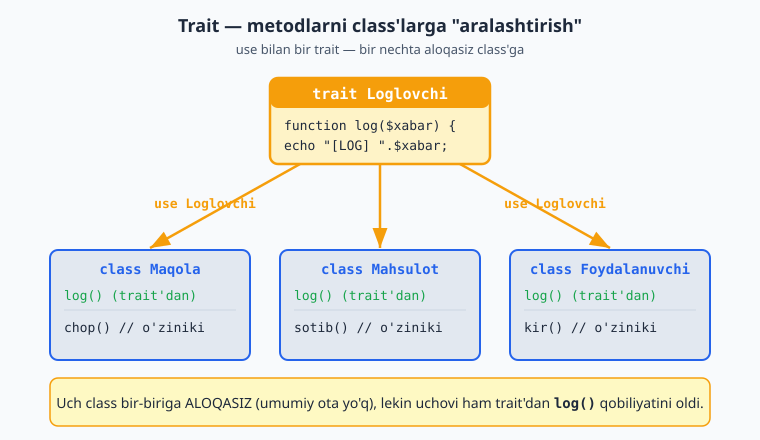

# 2.8 Trait — metodlarni ulashish

[⬅️ Oldingi: 2.7 Static xususiyat va metodlar](./20-static-xususiyat-va-metodlar.md) · [🏠 README](./README.md) · [Keyingi: 2.9 Enum — cheklangan tanlovlar ➡️](./22-enum-cheklangan-tanlovlar.md)

---

### Muammo: meros yetmaydigan holat

Meros (2.4) bir class'dan umumiy kod olishga yordam berardi. Lekin muammo: PHP'da bitta class faqat **bitta** ota class'dan meros oladi. Agar siz turli, bir-biriga aloqasiz class'larga **bir xil metodni** qo'shmoqchi bo'lsangiz-chi?

Masalan, `Maqola`, `Mahsulot`, `Foydalanuvchi` — uchovi ham bir-biriga aloqasiz, lekin uchoviga ham "logga yozish" (`log()`) metodi kerak. Ularning umumiy ota class'i yo'q. Har biriga `log()` ni nusxalash — takrorlanish. **Trait** ana shuni hal qiladi.

### Trait — qayta ishlatiladigan metodlar to'plami

**Trait — class emas, balki metodlar to'plami**, uni istalgan class'ga "qo'shib" (`use`) ishlatish mumkin. Buni "nusxalanadigan metodlar" deb tasavvur qiling — lekin to'g'ri, tartibli usulda:

```php
<?php
// Trait — qayta ishlatiladigan metodlar
trait Loglovchi {
    public function log($xabar) {
        echo "[LOG] " . $xabar . "<br>";
    }
}

// Turli class'lar shu trait'dan foydalanadi:
class Maqola {
    use Loglovchi;   // trait metodlarini "qo'shamiz"

    public function chop() {
        $this->log("Maqola chop etildi");
    }
}

class Mahsulot {
    use Loglovchi;   // xuddi shu trait

    public function sotib() {
        $this->log("Mahsulot sotildi");
    }
}

$m = new Maqola();
$m->chop();   // [LOG] Maqola chop etildi

$p = new Mahsulot();
$p->sotib();  // [LOG] Mahsulot sotildi
```

Tushuntiramiz:
- **`trait Loglovchi { ... }`** — trait e'lon qilinadi. Ichida metodlar bor (class'dagidek).
- **`use Loglovchi;`** — class ichida shunday yozsangiz, trait'dagi barcha metodlar shu class'ga **qo'shiladi**, xuddi o'sha class'da yozilgandek.
- `Maqola` ham, `Mahsulot` ham — bir-biriga aloqasiz, lekin ikkalasi ham `log()` metodiga ega bo'ldi, uni nusxalamasdan.

Quyidagi diagramma bir trait'ning metodlari `use` orqali bir nechta aloqasiz class'ga qanday "aralashtirilishini" ko'rsatadi:



> **Trait va meros farqi:** meros — "...bu ham bir turdagi narsa" munosabati uchun (It — bu Hayvon). Trait — shunday munosabat yo'q, lekin **umumiy qobiliyat** ulashish kerak bo'lganda (Maqola ham, Mahsulot ham "loglay oladi", lekin ular bir tur emas). Bir class bir nechta trait'dan foydalanishi mumkin (`use A, B;`).

### Mashqlar

**Oson**
1. `Loglovchi` trait'ini yarating (`log($xabar)` bilan) va bitta class'da `use` qiling.
2. Xuddi shu trait'ni ikkinchi, aloqasiz class'da ham ishlating.
3. `Salomlashuvchi` trait'i (`salom()` "Salom!" chiqarsin) → ikki xil class'da ishlating.
4. Trait'ga ikkita metod qo'shing va class'da ikkalasini ham ishlating.
5. Bir class'da ikkita trait'ni birdan ishlating (`use A, B;`).

**O'rta**
6. `Sanaqli` trait'i: `$soni` xususiyati va `oshir()` metodi bilan (trait'da xususiyat ham bo'lishi mumkin). Uni class'da ishlating.
7. `Formatlovchi` trait'i: `narxFormat($son)` metodi narxni chiroyli ko'rinishda qaytarsin. Uni `Mahsulot` va `Buyurtma` class'larida ishlating.
8. `Vaqtli` trait'i: `hozir()` metodi joriy vaqtni qaytarsin (`date("H:i:s")`). Bir nechta class'da ishlating.

**Qiyin**
9. `Loglovchi` va `Vaqtli` trait'larini birga ishlating: `log()` metodi xabar oldiga vaqtni qo'shsin (`[12:30:05] xabar`). Ikki trait'ni bitta class'da birlashtiring.
10. To'liq misol: `Maqola` va `Sharh` class'lari — ikkalasi ham `Loglovchi` va `Saqlanadigan` (`saqla()`) trait'laridan foydalansin. Har birining o'ziga xos metodlari ham bo'lsin.

<details markdown="1">
<summary>Yechim — 6 (xususiyatli trait)</summary>

```php
<?php
trait Sanaqli {
    public $soni = 0;

    public function oshir() {
        $this->soni++;
    }
}

class Savat {
    use Sanaqli;
}

$s = new Savat();
$s->oshir();
$s->oshir();
echo $s->soni;   // 2
```
Trait nafaqat metod, balki xususiyat ham bera oladi. `Savat` class'i `Sanaqli` trait'idan `$soni` xususiyati va `oshir()` metodini "meros" oldi (aniqrog'i — qo'shib oldi).
</details>

<details markdown="1">
<summary>Yechim — 9 (Loglovchi + Vaqtli birga)</summary>

```php
<?php
trait Vaqtli {
    public function hozir() {
        return date("H:i:s");   // joriy vaqt
    }
}

trait Loglovchi {
    public function log($xabar) {
        // Bu trait Vaqtli'dagi hozir() ga tayanadi
        echo "[" . $this->hozir() . "] " . $xabar . "<br>";
    }
}

class Tizim {
    use Vaqtli, Loglovchi;   // ikkala trait birga
}

$s = new Tizim();
$s->log("Tizim ishga tushdi");   // [14:30:05] Tizim ishga tushdi
```
Bitta class'da ikkita trait'ni `use Vaqtli, Loglovchi;` bilan birga ishlatdik. `log()` (Loglovchi'dan) `hozir()` (Vaqtli'dan) ni chaqiradi — ikkala trait ham bitta obyektga qo'shilgani uchun bir-birini "ko'radi".
</details>

<details markdown="1">
<summary>Yechim — 10 (Maqola va Sharh: umumiy qobiliyatlar)</summary>

```php
<?php
trait Loglovchi {
    public function log($xabar) { echo "[LOG] " . $xabar . "<br>"; }
}
trait Saqlanadigan {
    public function saqla() { echo "Bazaga saqlandi<br>"; }
}

class Maqola {
    use Loglovchi, Saqlanadigan;
    public function chopEt() { echo "Maqola chop etildi<br>"; }
}

class Sharh {
    use Loglovchi, Saqlanadigan;
    public function javobBer() { echo "Sharhga javob berildi<br>"; }
}

$m = new Maqola();
$m->log("yangi maqola");
$m->saqla();
$m->chopEt();

$sh = new Sharh();
$sh->saqla();
$sh->javobBer();
```
`Maqola` va `Sharh` — bir-biriga aloqasiz (umumiy ota class yo'q), lekin ikkalasiga ham "loglash" va "saqlash" qobiliyati kerak. Trait'lar shuni beradi — har biri o'z maxsus metodiga (`chopEt`, `javobBer`) ham ega. Meros bilan buni qilib bo'lmasdi (PHP bitta otadan meros oladi).
</details>
