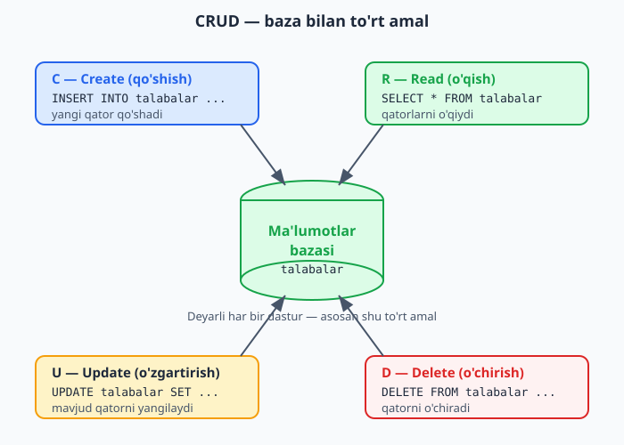

# 4.2 To'liq mini-loyiha: talabalar ro'yxati (CRUD)

[⬅️ Oldingi: 4.1 Formalar va foydalanuvchi ma'lumoti](./31-formalar-va-foydalanuvchi-malumoti.md) · [🏠 README](./README.md) · [Keyingi: 4.3 Sessiyalar va login ➡️](./33-sessiyalar-va-login.md)

---

Endi hamma narsani birlashtiramiz! PHP mantiq (1-QISM) + ma'lumotlar bazasi (3-QISM) + formalar (4.1) — birgalikda **haqiqiy, ishlaydigan dastur**. Talabalarni qo'shish, ro'yxatini ko'rish va o'chirish mumkin bo'lgan kichik tizim yasaymiz.

Bunday "qo'shish-ko'rish-o'zgartirish-o'chirish" amallari to'plami **CRUD** deb ataladi (3.3'da ko'rgan: Create, Read, Update, Delete). Deyarli har bir dastur — asosan CRUD.

Mana to'rt amal ma'lumotlar bazasi bilan qanday bog'lanishi:



> **Tayyorgarlik:** `maktab` bazasi va `talabalar` jadvali (`id`, `ism`, `yosh`, `shahar`) tayyor bo'lsin (3.2'dagidek). Fayllarni `htdocs/darslar` ichida yarating.

### 1-fayl: `ulanish.php` — bazaga ulanish

Ulanishni alohida faylga yozamiz, keyin uni boshqa fayllarda ishlatamiz (takrorlamaslik uchun — 1.9'dagi g'oya):

```php
<?php
// ulanish.php
$pdo = new PDO("mysql:host=localhost;dbname=maktab;charset=utf8mb4", "root", "");
```

### 2-fayl: `royxat.php` — talabalar ro'yxati va qo'shish formasi

Bu — asosiy sahifa. Talabalar ro'yxatini ko'rsatadi va yangi talaba qo'shish formasini beradi:

```php
<?php
// royxat.php
require 'ulanish.php';   // bazaga ulanishni "ulab olamiz"

// Barcha talabalarni bazadan o'qiymiz
$natija = $pdo->query("SELECT * FROM talabalar ORDER BY id DESC");
?>

<h1>Talabalar ro'yxati</h1>

<!-- Yangi talaba qo'shish formasi -->
<form method="post" action="qoshish.php">
    <input type="text" name="ism" placeholder="Ism" required>
    <input type="number" name="yosh" placeholder="Yosh" required>
    <input type="text" name="shahar" placeholder="Shahar" required>
    <button type="submit">Qo'shish</button>
</form>

<hr>

<!-- Talabalar jadvali -->
<table border="1" cellpadding="8">
    <tr>
        <th>ID</th>
        <th>Ism</th>
        <th>Yosh</th>
        <th>Shahar</th>
        <th>Amal</th>
    </tr>
    <?php foreach ($natija as $t): ?>
        <tr>
            <td><?= $t['id'] ?></td>
            <td><?= htmlspecialchars($t['ism']) ?></td>
            <td><?= $t['yosh'] ?></td>
            <td><?= htmlspecialchars($t['shahar']) ?></td>
            <td>
                <a href="ochirish.php?id=<?= $t['id'] ?>">O'chirish</a>
            </td>
        </tr>
    <?php endforeach; ?>
</table>
```

Tushuntiramiz:
- **`require 'ulanish.php'`** — `ulanish.php` faylidagi kodni shu yerga "qo'shadi" (xuddi shu faylda yozgandek). Endi `$pdo` shu yerda mavjud. Bu — kodni bo'lib, qayta ishlatishning oddiy usuli.
- Bazadan barcha talabalarni o'qiymiz va `foreach` bilan jadvalga chiqaramiz.
- Har bir qatorda "O'chirish" havolasi bor: `ochirish.php?id=5` — ya'ni o'chirish fayliga talaba `id`'sini GET orqali yuboradi.
- `placeholder` — maydon ichidagi yo'l-yo'riq matni. `required` — maydon bo'sh qoldirilmasligi kerakligini bildiradi.

### 3-fayl: `qoshish.php` — yangi talaba qo'shish

Forma yuborilganda ishlaydigan fayl:

```php
<?php
// qoshish.php
require 'ulanish.php';

// Forma ma'lumotini olamiz va tozalaymiz
$ism = trim($_POST['ism']);
$yosh = (int) $_POST['yosh'];        // (int) — songa aylantirish
$shahar = trim($_POST['shahar']);

// Bo'sh emasligini tekshiramiz
if ($ism != "" && $shahar != "") {
    // XAVFSIZ qo'shish — prepared statement (3.6)
    $stmt = $pdo->prepare("INSERT INTO talabalar (ism, yosh, shahar) VALUES (?, ?, ?)");
    $stmt->execute([$ism, $yosh, $shahar]);
}

// Ro'yxat sahifasiga qaytaramiz
header("Location: royxat.php");
```

Tushuntiramiz:
- Forma ma'lumotini olamiz, `trim` bilan tozalaymiz, yoshni `(int)` bilan songa aylantiramiz.
- **Prepared statement** bilan xavfsiz qo'shamiz (3.6'dagi SQL injection himoyasi — bu yerda majburiy, chunki ma'lumot foydalanuvchidan keladi).
- **`header("Location: royxat.php")`** — foydalanuvchini avtomatik `royxat.php` ga qaytaradi. Shunda u yangilangan ro'yxatni ko'radi. (`header` — brauzerga "boshqa sahifaga o't" degan buyruq.)

### 4-fayl: `ochirish.php` — talabani o'chirish

```php
<?php
// ochirish.php
require 'ulanish.php';

$id = (int) $_GET['id'];   // o'chiriladigan talaba id'si (havoladan)

// XAVFSIZ o'chirish — prepared statement
$stmt = $pdo->prepare("DELETE FROM talabalar WHERE id = ?");
$stmt->execute([$id]);

// Ro'yxatga qaytaramiz
header("Location: royxat.php");
```

`royxat.php`dagi "O'chirish" havolasi (`ochirish.php?id=5`) shu faylga `id`ni yuboradi, fayl esa o'sha id'li talabani o'chirib, ro'yxatga qaytaradi.

### Ishga tushirish

1. Brauzerda `http://localhost/darslar/royxat.php` ni oching.
2. Talaba qo'shing — forma to'ldirib, "Qo'shish" bosing. Ro'yxatda paydo bo'ladi.
3. "O'chirish" bosing — talaba o'chadi.

**Tabriklaymiz — siz haqiqiy, ma'lumotlar bazasi bilan ishlaydigan veb-dastur yasadingiz!** Bu — PHP'da yoziladigan dasturlarning asosiy namunasi. Onlayn do'kon, blog, boshqaruv panellari — hammasi shu tamoyil asosida, faqat kattaroq ko'lamda.

### Mashqlar

**Oson**
1. Yuqoridagi 4 faylni yarating va ishga tushiring. Talaba qo'shib, o'chirib ko'ring.
2. Formaga yangi maydon (masalan, `email`) qo'shing (avval jadvalga ham ustun qo'shing).
3. Ro'yxatni `ORDER BY ism` qilib, alifbo tartibida chiqaring.

**O'rta**
4. Ro'yxat tepasiga "Jami: N ta talaba" deb sonni chiqaring (`count` yoki SQL `COUNT`).
5. `qoshish.php` da ma'lumot to'liq emas bo'lsa, qo'shmasdan ro'yxatga qaytaring (xato bilan).
6. Ro'yxatga oddiy qidiruv qo'shing: yuqorida qidiruv formasi (GET), kiritilgan ism bo'yicha `WHERE ism LIKE ?` bilan filtrlang.

**Qiyin**
7. **Tahrirlash (Update) qo'shing** — CRUD'ni to'liq qiling: har qatorga "Tahrirlash" havolasi, `tahrirlash.php?id=5` talaba ma'lumotini formaga to'ldirib ko'rsatsin, `saqlash.php` esa `UPDATE` bilan o'zgartirsin. Bu — eng muhim mashq, butun CRUD'ni tushunganingizni ko'rsatadi.
8. O'chirishdan oldin tasdiq so'rang ("Rostdan o'chirilsinmi?") — `<a href="..." onclick="return confirm('Ishonchingiz komilmi?')">` bilan.
9. Talabalarni `mahsulotlar` jadvali bilan almashtirib, butun mini-loyihani mahsulotlar boshqaruvi sifatida qayta yozing (nom, narx, soni bilan).

<details markdown="1">
<summary>Yechim — 7 (Tahrirlash / Update)</summary>

```php
<?php
// tahrirlash.php — talaba ma'lumotini formaga chiqaradi
require 'ulanish.php';
$id = (int) $_GET['id'];

$stmt = $pdo->prepare("SELECT * FROM talabalar WHERE id = ?");
$stmt->execute([$id]);
$t = $stmt->fetch();
?>

<h1>Talabani tahrirlash</h1>
<form method="post" action="saqlash.php">
    <!-- id ni yashirin maydonda yuboramiz -->
    <input type="hidden" name="id" value="<?= $t['id'] ?>">
    <input type="text" name="ism" value="<?= htmlspecialchars($t['ism']) ?>">
    <input type="number" name="yosh" value="<?= $t['yosh'] ?>">
    <input type="text" name="shahar" value="<?= htmlspecialchars($t['shahar']) ?>">
    <button type="submit">Saqlash</button>
</form>
```

```php
<?php
// saqlash.php — o'zgarishni bazaga yozadi
require 'ulanish.php';

$id = (int) $_POST['id'];
$ism = trim($_POST['ism']);
$yosh = (int) $_POST['yosh'];
$shahar = trim($_POST['shahar']);

$stmt = $pdo->prepare("UPDATE talabalar SET ism = ?, yosh = ?, shahar = ? WHERE id = ?");
$stmt->execute([$ism, $yosh, $shahar, $id]);

header("Location: royxat.php");
```

Asosiy g'oya: tahrirlash formasi mavjud ma'lumotni `value` orqali ko'rsatadi (foydalanuvchi ko'rib, o'zgartiradi), `id` esa yashirin maydonda yuboriladi (qaysi talabani yangilashni bilish uchun). `saqlash.php` esa `UPDATE ... WHERE id = ?` bilan o'sha talabani yangilaydi. Endi sizda to'liq CRUD bor!
</details>

<details markdown="1">
<summary>Yechim — 8 (o'chirishdan oldin tasdiq)</summary>

Ro'yxatdagi "O'chirish" havolasiga JavaScript tasdig'ini qo'shamiz:

```php
<td>
    <a href="ochirish.php?id=<?= $qator['id'] ?>"
       onclick="return confirm('Rostdan o\'chirilsinmi?')">O'chirish</a>
</td>
```
`onclick="return confirm(...)"` — bosilganda brauzer "OK/Bekor" oynasini chiqaradi. Foydalanuvchi "OK" bossa (`true`) — havola ishlaydi; "Bekor" bossa (`false`) — to'xtaydi. Bu — tasodifiy o'chirishdan saqlaydigan oddiy, ammo muhim qadam. (Bu — kichik JavaScript; PHP emas, lekin foydali bilib qo'yish.)
</details>

<details markdown="1">
<summary>Yechim — 9 (mahsulotlar boshqaruvi)</summary>

Mini-loyihaning aynan o'zi, faqat `talabalar` o'rniga `mahsulotlar` (`id`, `nom`, `narx`, `soni`). Faqat SQL va maydonlar o'zgaradi, tuzilma bir xil:

```php
<?php
// mahsulotlar.php
require 'ulanish.php';

// Qo'shish
if (!empty($_POST['nom'])) {
    $stmt = $pdo->prepare("INSERT INTO mahsulotlar (nom, narx, soni) VALUES (?, ?, ?)");
    $stmt->execute([trim($_POST['nom']), (int) $_POST['narx'], (int) $_POST['soni']]);
    header("Location: mahsulotlar.php");
    exit;
}

$mahsulotlar = $pdo->query("SELECT * FROM mahsulotlar ORDER BY id DESC")->fetchAll();
?>

<form method="post">
    <input name="nom" placeholder="Nom" required>
    <input name="narx" type="number" placeholder="Narx" required>
    <input name="soni" type="number" placeholder="Soni" required>
    <button>Qo'shish</button>
</form>

<table border="1" cellpadding="8">
    <?php foreach ($mahsulotlar as $m): ?>
        <tr>
            <td><?= htmlspecialchars($m['nom']) ?></td>
            <td><?= number_format($m['narx']) ?> so'm</td>
            <td><?= $m['soni'] ?> dona</td>
        </tr>
    <?php endforeach; ?>
</table>
```
Ko'ryapsizmi — talabalar mini-loyihasi bilan tuzilma bir xil, faqat jadval nomi va ustunlar boshqacha. Bu — CRUD'ning kuchi: bir marta tushunsangiz, har qanday "ro'yxat boshqaruvi" (mahsulotlar, buyurtmalar, izohlar) shu naqsh bo'yicha yoziladi.
</details>
