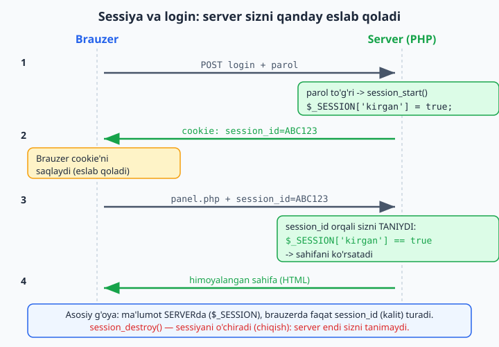

# 4.3 Sessiyalar va login

[⬅️ Oldingi: 4.2 To'liq mini-loyiha: talabalar ro'yxati (CRUD)](./32-toliq-mini-loyiha-talabalar-royxati.md) · [🏠 README](./README.md) · [Keyingi: 4.4 Xavfsizlik asoslari ➡️](./34-xavfsizlik-asoslari.md)

---

### Muammo: sayt sizni "eslamaydi"

Veb-saytda har bir sahifa — alohida so'rov. PHP har safar noldan ishlaydi va oldingi sahifada nima bo'lganini **eslamaydi**. Lekin saytlar sizni eslab qoladi: bir marta login qilsangiz, boshqa sahifalarda ham tizimga kirgan bo'lib qolasiz. Buni qanday qiladi? **Sessiyalar** orqali.

### Sessiya nima?

**Sessiya (session) — foydalanuvchi haqidagi ma'lumotni sahifalar orasida saqlaydigan mexanizm.** Masalan, "bu foydalanuvchi tizimga kirgan", "uning ismi Ali". Bu ma'lumot serverda saqlanadi va har bir sahifada mavjud bo'ladi.

Sessiyani ishlatish uchun har bir faylning **eng boshida** `session_start()` yoziladi:

```php
<?php
session_start();   // sessiyani boshlaymiz (HAR fayl boshida, eng tepada)

// Sessiyaga ma'lumot saqlash
$_SESSION['ism'] = "Ali";
$_SESSION['kirgan'] = true;
```

`$_SESSION` — bu maxsus kalitli massiv (yana massiv!). Unga saqlangan ma'lumot **barcha sahifalarda** mavjud bo'ladi (sessiya tugaguncha — odatda brauzer yopilguncha).

Boshqa sahifada o'sha ma'lumotni o'qiymiz:

```php
<?php
session_start();

echo "Xush kelibsiz, " . $_SESSION['ism'];   // Ali  (boshqa sahifada ham mavjud!)
```

### Oddiy login tizimi

Sessiyalarning eng keng tarqalgan ishi — login. Mana soddalashtirilgan misol:

```php
<?php
// login.php
session_start();

$xato = "";

if (!empty($_POST['login'])) {
    $login = $_POST['login'];
    $parol = $_POST['parol'];

    // Oddiy tekshiruv (haqiqiy dasturda parol bazadan, hashlangan holda olinadi — 4.4)
    if ($login == "admin" && $parol == "12345") {
        $_SESSION['kirgan'] = true;        // sessiyada "kirgan" deb belgilaymiz
        $_SESSION['login'] = $login;
        header("Location: panel.php");      // boshqaruv paneliga yuboramiz
        exit;                               // header'dan keyin to'xtatamiz
    } else {
        $xato = "Login yoki parol xato";
    }
}
?>

<form method="post">
    <input type="text" name="login" placeholder="Login">
    <input type="password" name="parol" placeholder="Parol">
    <button type="submit">Kirish</button>
</form>
<p style="color:red"><?= $xato ?></p>
```

### Himoyalangan sahifa

Endi faqat tizimga kirganlar ko'ra oladigan sahifa. Boshida sessiyani tekshiramiz:

```php
<?php
// panel.php
session_start();

// Agar tizimga kirmagan bo'lsa — login sahifasiga qaytaramiz
if (empty($_SESSION['kirgan'])) {
    header("Location: login.php");
    exit;
}
?>

<h1>Boshqaruv paneli</h1>
<p>Xush kelibsiz, <?= htmlspecialchars($_SESSION['login']) ?>!</p>
<a href="chiqish.php">Chiqish</a>
```

Agar kirmagan odam `panel.php` ni ochmoqchi bo'lsa, u darrov login sahifasiga qaytariladi. Bu — sahifalarni himoyalashning oddiy usuli.

Quyidagi diagramma sessiya orqali login oqimini ko'rsatadi: server bir marta login qilganingizdan keyin sizni keyingi so'rovlarda qanday eslab qoladi:



### Tizimdan chiqish

```php
<?php
// chiqish.php
session_start();
session_destroy();              // sessiyani o'chiramiz (hamma ma'lumot ketadi)
header("Location: login.php");
exit;
```

`session_destroy()` — sessiyani butunlay o'chiradi. Foydalanuvchi tizimdan chiqadi.

### Mashqlar

**Oson**
1. Bir faylda `session_start()` bilan `$_SESSION['ism']` ga qiymat saqlang, boshqa faylda o'qing.
2. Sessiyaga bir nechta qiymat saqlang (ism, yosh) va ikkalasini boshqa sahifada chiqaring.
3. `session_destroy()` ni sinab ko'ring — keyin ma'lumot yo'qolishini tekshiring.

**O'rta**
4. Oddiy login formasini yarating (yuqoridagidek), to'g'ri login/parolda panelga o'tkazsin.
5. `panel.php` ni himoyalang — kirmaganlarni login sahifasiga qaytarsin.
6. "Chiqish" tugmasini qo'shing (`chiqish.php`).
7. Sessiyada tashriflar sonini sanang: har sahifa ochilganda `$_SESSION['tashrif']` ni 1 ga oshiring va ko'rsating.

**Qiyin**
8. To'liq login tizimini bazaga ulang: `foydalanuvchilar` jadvali (login, parol), kiritilgan ma'lumotni bazadan tekshiring (prepared statement bilan). (Hozircha parolni oddiy saqlang — 4.4'da uni xavfsiz hashlashni qo'shamiz.)
9. Login bo'lgan foydalanuvchining ismini barcha sahifalarda yuqorida ko'rsating, login bo'lmaganlarga "Kirish" havolasini ko'rsating.

<details markdown="1">
<summary>Yechim — 7 (tashriflar hisoblagichi)</summary>

```php
<?php
session_start();

// Agar 'tashrif' hali yo'q bo'lsa, 0 dan boshlaymiz
if (empty($_SESSION['tashrif'])) {
    $_SESSION['tashrif'] = 0;
}

$_SESSION['tashrif']++;   // har sahifa ochilganda oshiramiz

echo "Siz bu sahifani " . $_SESSION['tashrif'] . " marta ochdingiz";
```
Sahifani qayta-qayta yangilang — son ortib boradi. Sessiya ma'lumotni so'rovlar orasida saqlagani uchun bu ishlaydi. Brauzerni yopib qayta ochsangiz (yoki `session_destroy`), hisob noldan boshlanadi.
</details>

<details markdown="1">
<summary>Yechim — 8 (bazaga ulangan login)</summary>

```php
<?php
// login.php
session_start();
require 'ulanish.php';

$xato = "";

if (!empty($_POST['login'])) {
    $stmt = $pdo->prepare("SELECT * FROM foydalanuvchilar WHERE login = ?");
    $stmt->execute([$_POST['login']]);
    $foydalanuvchi = $stmt->fetch();

    // Hozircha parol oddiy taqqoslanadi (4.4'da password_verify bilan xavfsiz qilamiz)
    if ($foydalanuvchi && $foydalanuvchi['parol'] === $_POST['parol']) {
        $_SESSION['kirgan'] = true;
        $_SESSION['login'] = $foydalanuvchi['login'];
        header("Location: panel.php");
        exit;
    } else {
        $xato = "Login yoki parol xato";
    }
}
?>

<form method="post">
    <input name="login" placeholder="Login">
    <input type="password" name="parol" placeholder="Parol">
    <button>Kirish</button>
</form>
<p style="color:red"><?= htmlspecialchars($xato) ?></p>
```
Endi login/parol kod ichida emas, **bazadan** (prepared statement bilan, xavfsiz) tekshiriladi. `foydalanuvchilar` jadvali (`id`, `login`, `parol`) tayyor bo'lsin. (4.4'da parolni `password_hash`/`password_verify` bilan xavfsiz qilamiz — hozir oddiy taqqoslash.)
</details>

<details markdown="1">
<summary>Yechim — 9 (har sahifada login holatini ko'rsatish)</summary>

Har sahifaning tepasiga (`session_start()` dan keyin) shu blokni qo'yamiz:

```php
<?php
session_start();
?>

<div style="background:#eee; padding:8px;">
    <?php if (!empty($_SESSION['login'])): ?>
        Salom, <?= htmlspecialchars($_SESSION['login']) ?>!
        <a href="chiqish.php">Chiqish</a>
    <?php else: ?>
        <a href="login.php">Kirish</a>
    <?php endif; ?>
</div>
```
Sessiyada `login` bor bo'lsa — ismni va "Chiqish"ni, bo'lmasa — "Kirish" havolasini ko'rsatamiz. Bu — deyarli har bir saytning yuqori qismida ko'radigan "header" mantig'i. (Bunday takrorlanadigan qismni alohida faylga olib, har sahifada `require` qilish — 1.9/5.1'dagi DRY g'oyasi.)
</details>
