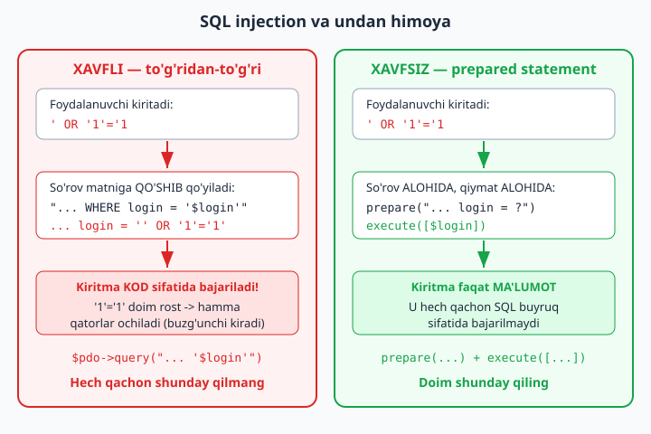

# 4.4 Xavfsizlik asoslari

[⬅️ Oldingi: 4.3 Sessiyalar va login](./33-sessiyalar-va-login.md) · [🏠 README](./README.md) · [Keyingi: 4.5 JSON bilan ishlash va oddiy API ➡️](./35-json-bilan-ishlash-va-oddiy-api.md)

---

Haqiqiy sayt yozyapsiz — demak, uni **himoyalashingiz** kerak. Bitta xavfsizlik xatosi foydalanuvchilar ma'lumotini va butun loyihangizni xavf ostiga qo'yadi. Bu bo'limda har bir veb-dasturchi **bilishi shart** bo'lgan asosiy himoyalarni ko'ramiz.

### 1) Parollarni to'g'ri saqlash

**Eng muhim qoida: parolni hech qachon ochiq (matn ko'rinishida) saqlamang!** Agar bazangizni kimdir o'g'irlasa, barcha parollar ochiq turadi. Buning o'rniga parolni **hashlab** saqlaymiz — "hash" qaytarib ochib bo'lmaydigan, aralashtirilgan ko'rinish.

PHP'da buning uchun tayyor, xavfsiz funksiyalar bor:

```php
<?php
// Parolni saqlashda — hashlash:
$parol = "maxfiy123";
$hash = password_hash($parol, PASSWORD_DEFAULT);
// $hash endi shunga o'xshash: $2y$10$N9qo8uLOickgx2ZMRZoMy...
// Buni bazaga saqlaymiz (ochiq parolni emas!)

// Tekshirishda (login paytida) — solishtirish:
$kiritilgan = "maxfiy123";
if (password_verify($kiritilgan, $hash)) {
    echo "Parol to'g'ri!";
} else {
    echo "Parol xato!";
}
```

- **`password_hash($parol, PASSWORD_DEFAULT)`** — parolni xavfsiz hashga aylantiradi. Shuni bazaga saqlaysiz.
- **`password_verify($kiritilgan, $hash)`** — foydalanuvchi kiritgan parolni saqlangan hash bilan solishtiradi. To'g'ri bo'lsa `true`.

Hashlangan parolni "qaytarib ochib" bo'lmaydi — faqat solishtirish mumkin. Shuning uchun bazangiz o'g'irlansa ham, parollar himoyalangan bo'ladi.

### 2) XSS — zararli kod kiritilishidan himoya

**XSS** — foydalanuvchi matn maydoniga oddiy matn emas, zararli kod (masalan, `<script>`) kiritishi va u boshqa foydalanuvchilar brauzerida ishlashi. Buning oldini olish uchun, foydalanuvchi kiritgan matnni **ekranga chiqarganda** doim `htmlspecialchars` ishlatamiz:

```php
<?php
$izoh = $_POST['izoh'];   // foydalanuvchi kiritgan matn

// ❌ XAVFLI: agar foydalanuvchi <script>...</script> kiritsa, u ishlaydi
echo $izoh;

// ✅ XAVFSIZ: htmlspecialchars zararli belgilarni "zararsiz matnga" aylantiradi
echo htmlspecialchars($izoh);
```

`htmlspecialchars` `<`, `>`, `"` kabi maxsus belgilarni xavfsiz ko'rinishga aylantiradi, shunda ular kod sifatida emas, oddiy matn sifatida ko'rsatiladi. **Qoida: foydalanuvchidan kelgan har qanday matnni ekranga chiqarganda `htmlspecialchars` orqali chiqaring.**

### 3) SQL Injection — bazaga zararli so'rov (takror)

Buni 3.6'da ko'rgan edik, lekin shunchalik muhimki, takrorlaymiz. Foydalanuvchi ma'lumotini SQL so'roviga to'g'ridan-to'g'ri qo'shmang — **prepared statement** ishlating:

```php
<?php
// ❌ XAVFLI:
$natija = $pdo->query("SELECT * FROM foydalanuvchilar WHERE login = '$login'");

// ✅ XAVFSIZ:
$stmt = $pdo->prepare("SELECT * FROM foydalanuvchilar WHERE login = ?");
$stmt->execute([$login]);
```

Quyidagi diagramma nega to'g'ridan-to'g'ri qo'shish xavfli, prepared statement esa xavfsiz ekanini yonma-yon ko'rsatadi:



### 4) Boshqa muhim qoidalar

- **HTTPS ishlating** (haqiqiy saytda) — ma'lumot shifrlangan holda uzatiladi.
- **Maxfiy ma'lumotni kodda saqlamang** — parollar, kalitlar alohida, maxfiy faylda bo'lsin (kodga yozilib, internetga chiqib ketmasin).
- **Foydalanuvchi ma'lumotini doim tekshiring** — bo'sh emasmi, to'g'ri turdami (4.1).
- **Xato xabarlarida ko'p ma'lumot bermang** — "login yoki parol xato" deng, "bunday login yo'q" demang (yomon niyatli odamga yordam bermaslik uchun).

### Xavfsiz login (hashlangan parol bilan)

4.3'dagi login tizimini endi xavfsiz qilamiz:

```php
<?php
// Ro'yxatdan o'tishda — parolni hashlab saqlash:
$hash = password_hash($_POST['parol'], PASSWORD_DEFAULT);
$stmt = $pdo->prepare("INSERT INTO foydalanuvchilar (login, parol) VALUES (?, ?)");
$stmt->execute([$_POST['login'], $hash]);

// Login paytida — tekshirish:
$stmt = $pdo->prepare("SELECT * FROM foydalanuvchilar WHERE login = ?");
$stmt->execute([$_POST['login']]);
$foydalanuvchi = $stmt->fetch();

if ($foydalanuvchi && password_verify($_POST['parol'], $foydalanuvchi['parol'])) {
    // Login muvaffaqiyatli
    $_SESSION['kirgan'] = true;
} else {
    // Login yoki parol xato
}
```

### Mashqlar

**Oson**
1. `password_hash` bilan parolni hashlang va natijani ko'ring.
2. `password_verify` bilan to'g'ri va noto'g'ri parolni tekshiring.
3. Foydalanuvchi matnini `htmlspecialchars` bilan va usiz chiqarib, farqni ko'ring (`<b>salom</b>` kiriting).
4. Nima uchun parolni ochiq saqlash xavfli — o'z so'zingiz bilan yozing.

**O'rta**
5. Ro'yxatdan o'tish formasi: parolni hashlab bazaga saqlang.
6. Login formasi: bazadan foydalanuvchini topib, `password_verify` bilan parolni tekshiring.
7. Izoh formasini yarating: kiritilgan izohlarni `htmlspecialchars` bilan xavfsiz ko'rsating.
8. SQL injection xavfini va prepared statement yechimini misol bilan tushuntiring.

**Qiyin**
9. To'liq, xavfsiz foydalanuvchi tizimi: ro'yxatdan o'tish (hashlangan parol), login (`password_verify`), sessiya bilan himoyalangan panel, chiqish. Hammasi bazaga ulangan, prepared statement va `htmlspecialchars` bilan.
10. Izohlar tizimi (4.2 mini-loyihasiga o'xshash): foydalanuvchilar izoh qoldiradi, izohlar bazaga saqlanadi va xavfsiz (`htmlspecialchars`) ko'rsatiladi. SQL injection va XSS'dan himoyalangan bo'lsin.

<details markdown="1">
<summary>Yechim — 4 (nega ochiq parol xavfli)</summary>

Parolni ochiq saqlash xavfli, chunki:
1. **Baza o'g'irlansa** — barcha foydalanuvchilarning parollari darrov ko'rinadi. Yomon niyatli odam ularning hisoblariga (va ko'pincha boshqa saytlardagi hisoblariga, chunki odamlar bir xil parol ishlatadi) kira oladi.
2. **Ichki xavf** — bazaga kirish huquqi bor har kim (dasturchi, admin) parollarni ko'radi.

Hashlangan parol esa "qaytarib ochilmaydi" — `password_hash` bir tomonlama. Hatto baza o'g'irlansa ham, hujumchi faqat ma'nosiz hashlarni ko'radi, asl parolni emas. Login paytida `password_verify` kiritilgan parolni hash bilan solishtiradi (asl parolni tiklamasdan). Shuning uchun parolni **doim** `password_hash` bilan saqlang.
</details>

<details markdown="1">
<summary>Yechim — 9 (to'liq xavfsiz foydalanuvchi tizimi)</summary>

To'rt fayl. `foydalanuvchilar` jadvali: `id`, `login`, `parol` (hash uchun VARCHAR(255)).

```php
<?php
// 1) royxatdan.php — hashlangan parol bilan ro'yxatga olish
require 'ulanish.php';
if (!empty($_POST['login'])) {
    $hash = password_hash($_POST['parol'], PASSWORD_DEFAULT);
    $stmt = $pdo->prepare("INSERT INTO foydalanuvchilar (login, parol) VALUES (?, ?)");
    $stmt->execute([trim($_POST['login']), $hash]);
    echo "Ro'yxatdan o'tdingiz!";
}
?>
<form method="post">
    <input name="login" placeholder="Login" required>
    <input type="password" name="parol" placeholder="Parol" required>
    <button>Ro'yxatdan o'tish</button>
</form>
```
```php
<?php
// 2) login.php — password_verify bilan tekshirish
session_start();
require 'ulanish.php';
if (!empty($_POST['login'])) {
    $stmt = $pdo->prepare("SELECT * FROM foydalanuvchilar WHERE login = ?");
    $stmt->execute([$_POST['login']]);
    $u = $stmt->fetch();
    if ($u && password_verify($_POST['parol'], $u['parol'])) {
        $_SESSION['kirgan'] = true;
        $_SESSION['login'] = $u['login'];
        header("Location: panel.php"); exit;
    }
    $xato = "Login yoki parol xato";
}
?>
<form method="post">
    <input name="login" placeholder="Login">
    <input type="password" name="parol" placeholder="Parol">
    <button>Kirish</button>
</form>
<p style="color:red"><?= htmlspecialchars($xato ?? "") ?></p>
```
```php
<?php
// 3) panel.php — himoyalangan sahifa
session_start();
if (empty($_SESSION['kirgan'])) { header("Location: login.php"); exit; }
?>
<h1>Panel</h1>
<p>Xush kelibsiz, <?= htmlspecialchars($_SESSION['login']) ?>!</p>
<a href="chiqish.php">Chiqish</a>
```
```php
<?php
// 4) chiqish.php
session_start();
session_destroy();
header("Location: login.php");
```
Bu — to'liq, xavfsiz tizim: parol **hashlab** saqlanadi (`password_hash`), tekshirishda `password_verify`, barcha so'rovlar **prepared statement**, chiqarishda `htmlspecialchars`, sahifa sessiya bilan **himoyalangan**. 4-QISMda o'rgangan hamma narsa shu yerda birlashdi.
</details>

<details markdown="1">
<summary>Yechim — 10 (xavfsiz izohlar tizimi)</summary>

`izohlar` jadvali: `id`, `matn`, `sana`. Bitta fayl izohni qo'shadi va ko'rsatadi:

```php
<?php
// izohlar.php
require 'ulanish.php';

// Yangi izoh qo'shish (prepared — SQL injection'dan himoya)
if (!empty($_POST['matn'])) {
    $stmt = $pdo->prepare("INSERT INTO izohlar (matn) VALUES (?)");
    $stmt->execute([trim($_POST['matn'])]);
    header("Location: izohlar.php");
    exit;
}

$izohlar = $pdo->query("SELECT * FROM izohlar ORDER BY id DESC")->fetchAll();
?>

<form method="post">
    <textarea name="matn" required></textarea>
    <button>Yuborish</button>
</form>

<?php foreach ($izohlar as $izoh): ?>
    <!-- htmlspecialchars — XSS'dan himoya: <script> kod sifatida ishlamaydi -->
    <p><?= htmlspecialchars($izoh['matn']) ?></p>
<?php endforeach; ?>
```
Ikki himoya birga: izoh **prepared statement** bilan saqlanadi (SQL injection'dan), va **`htmlspecialchars`** bilan ko'rsatiladi (XSS'dan — kimdir `<script>` yozsa, u kod emas, oddiy matn bo'lib chiqadi). Foydalanuvchi ma'lumoti bilan ishlaganda bu ikkisi — majburiy odat.
</details>
