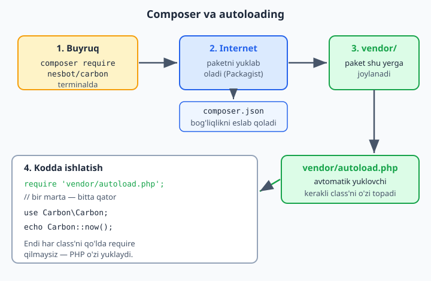

# 5.4 Composer — tashqi kutubxonalar

[⬅️ Oldingi: 5.3 Foydali dizayn andozalari](./38-foydali-dizayn-andozalari.md) · [🏠 README](./README.md) · [Keyingi: Keyingi qadamlar ➡️](./40-keyingi-qadamlar.md)

---

### Muammo: hamma narsani o'zingiz yozish

Dasturlashda ko'p ishlar (email yuborish, PDF yaratish, rasm bilan ishlash, sana boshqaruvi) allaqachon boshqalar tomonidan yozib qo'yilgan va bepul tarqatiladi. Bularni **kutubxona** (library) deyiladi. Har safar noldan yozish o'rniga, tayyor, sinovdan o'tgan kutubxonalarni ishlatish — vaqtni tejaydi va ishonchli.

Lekin bu kutubxonalarni qanday topib, o'rnatib, loyihaga qo'shamiz? **Composer** ana shuni qiladi.

### Composer nima?

**Composer — PHP uchun "kutubxonalar menejeri".** U sizning loyihangizga kerakli kutubxonalarni internetdan topib, yuklab, o'rnatib beradi. Bundan tashqari, u **autoloading** (avtomatik yuklash) ni ta'minlaydi — bu haqida pastda.

> Composer — alohida dastur. Uni `getcomposer.org` saytidan o'rnatasiz (Windows uchun o'rnatuvchi bor). U buyruq qatori (terminal/cmd) orqali ishlaydi.

### Composer'dan foydalanish

Loyiha papkasida terminal ochib, kutubxona o'rnatasiz. Masalan, mashhur "Carbon" kutubxonasi (sana bilan qulay ishlash uchun):

```bash
composer require nesbot/carbon
```

Bu buyruq:
1. Carbon kutubxonasini internetdan yuklaydi.
2. `vendor/` degan papkaga joylaydi (barcha kutubxonalar shu yerda turadi).
3. `composer.json` fayliga yozib qo'yadi (loyiha qaysi kutubxonalarga bog'liqligini eslab qoladi).

Endi kutubxonani kodda ishlatasiz:

```php
<?php
require 'vendor/autoload.php';   // Composer'ning avtomatik yuklovchisi

use Carbon\Carbon;

echo Carbon::now();              // hozirgi sana va vaqt
echo Carbon::now()->addDays(7);  // 7 kundan keyingi sana
```

### Autoloading — `require` dardidan qutulish

Hozirgacha har bir class faylini qo'lda `require` qilardik (`require 'TalabaModel.php'`). Loyihada 50 ta class bo'lsa — 50 ta `require`! Bu noqulay.

**Autoloading** buni hal qiladi: `require 'vendor/autoload.php'` ni bir marta yozasiz, keyin PHP kerakli class faylini **avtomatik** topib yuklaydi. Siz har bir faylni qo'lda `require` qilmaysiz.

Quyidagi diagramma paket Composer orqali qanday o'rnatilishi va autoload bilan avtomatik yuklanishini ko'rsatadi:



> Bu — biroz ilg'or mavzu va buyruq qatori bilan ishlashni talab qiladi. Hozircha shuni bilsangiz yetarli: **haqiqiy loyihalarda kutubxonalarni Composer bilan o'rnatadilar va autoloading ishlatadilar.** Kichik o'quv loyihalarida oddiy `require` ham yetadi. Composer'ni keyinroq, haqiqiy loyihaga o'tganingizda chuqurroq o'rganasiz.

### Mashqlar

**Oson**
1. Composer nima qilishini va nega foydali ekanini o'z so'zingiz bilan tushuntiring.
2. "Kutubxona" nima — misol bilan ayting (tayyor, qayta ishlatiladigan kod).
3. Autoloading qanday muammoni hal qilishini tushuntiring (ko'p `require` dan qutulish).

**O'rta**
4. (Agar imkoningiz bo'lsa) Composer'ni o'rnating va bitta kutubxona (`nesbot/carbon`) o'rnatib ko'ring.
5. `composer.json` fayli nima uchun kerakligini izohlang (loyiha bog'liqliklarini eslab qolish).

**Qiyin**
6. (Ixtiyoriy, ilg'or) Composer bilan kichik loyiha tuzing: bitta kutubxona o'rnating, autoloading orqali o'z class'laringizni ham avtomatik yuklang (`composer.json` da `autoload` sozlamasini o'rganing).

<details markdown="1">
<summary>Yechim — 6 (Composer autoload — yo'riqnoma)</summary>

Bu — ixtiyoriy, ilg'or mashq. Qadamlar:

1. Loyiha papkasida class'laringizni `src/` papkaga joylang (masalan, `src/Talaba.php`).

2. `composer.json` faylida o'z class'laringiz uchun autoload sozlang:

```json
{
    "require": {
        "nesbot/carbon": "^3.0"
    },
    "autoload": {
        "psr-4": {
            "App\\": "src/"
        }
    }
}
```

3. Sozlamani qo'llash uchun terminalda:
```bash
composer install         # kutubxonalarni o'rnatadi
composer dump-autoload    # o'z class'laringiz autoload'ini yangilaydi
```

4. Endi `index.php` da hamma narsani bitta `require` bilan ishlatasiz:
```php
<?php
require 'vendor/autoload.php';   // bitta qator — hammasi avtomatik

use App\Talaba;
use Carbon\Carbon;

$t = new Talaba("Ali");          // o'z class'imiz — qo'lda require'siz yuklandi
echo Carbon::now();              // tashqi kutubxona ham ishlaydi
```

`"psr-4": {"App\\": "src/"}` — "`App\` bilan boshlanadigan class'lar `src/` papkada" degani. Endi har bir class'ni qo'lda `require` qilmaysiz — `vendor/autoload.php` ni bir marta ulaysiz, qolganini Composer o'zi qiladi. Bu — zamonaviy PHP loyihalarining standart tuzilishi (Laravel, Symfony — hammasi shunga asoslanadi).
</details>

> **5-QISM yakunlandi!** Endi siz nafaqat ishlaydigan, balki **professional tashkil etilgan** kod yoza olasiz: toza kod prinsiplari, MVC bilan tartibga solish, foydali dizayn andozalari va tashqi kutubxonalar (Composer). Bu — havaskor va professional dasturchi orasidagi farq.
