# PHP — Mutlaqo Noldan Boshlovchilar Uchun

> **Kimga mo'ljallangan:** dasturlashni umuman bilmaydigan, hayotida birorta ham dastur yozmagan odamga. Sizdan hech qanday oldindan tayyorgarlik talab qilinmaydi.
>
> **Qanday o'qiladi:** har bir mavzuda — avval **oddiy tushuntirish** (bu nima va nega kerak), so'ng **kichik misol**, keyin **mashqlar**. Mashqlar uch darajaga bo'lingan: Oson, O'rta, Qiyin. Ko'p mashqning — **ayniqsa barcha "Qiyin" mashqlarning** — yechimi ham berilgan (yashirin "Yechim" bo'limida). Avval o'zingiz urinib ko'ring, keyin yechimga qarang. "Oson"/"O'rta" mashqlarning bir qismi ataylab yechimsiz qoldirilgan — mustaqil mashq uchun.
>
> **Eng muhim qoida:** faqat o'qib qo'yish yetarli emas. Har bir misolni o'z kompyuteringizda yozib, ishga tushirib ko'ring. Dasturlash — velosiped haydashga o'xshaydi: faqat kitob o'qib o'rganib bo'lmaydi, mashq qilish shart.

---

## Mundarija

**0-QISM — TAYYORGARLIK**
- [0.1 Dasturlash nima va PHP nima?](#01-nima)
- [0.2 PHP'ni kompyuteringizga o'rnatish](#02-ornatish)
- [0.3 Birinchi dasturingiz](#03-birinchi)

**1-QISM — ASOSLAR**
- [1.1 Kod qanday yoziladi (sintaksis)](#11-sintaksis)
- [1.2 O'zgaruvchilar (variables)](#12-ozgaruvchilar)
- [1.3 Ma'lumot turlari](#13-turlar)
- [1.4 Amallar (operatorlar)](#14-operatorlar)
- [1.5 Matn bilan ishlash (string)](#15-matn)
- [1.6 Shartlar (if/else)](#16-shartlar)
- [1.7 Takrorlash (sikllar)](#17-sikllar)
- [1.8 Ro'yxatlar (massivlar)](#18-massivlar)
- [1.9 Funksiyalar](#19-funksiyalar)
- [1.10 Anonim funksiyalar va massiv vositalari (map/filter/reduce)](#110-funksional)

**2-QISM — OOP (Obyektga yo'naltirilgan dasturlash)**
- [2.1 Class va obyekt](#21-class)
- [2.2 Konstruktor](#22-konstruktor)
- [2.3 Kirish darajalari: public va private](#23-visibility)
- [2.4 Meros (inheritance)](#24-meros)
- [2.5 Abstrakt class'lar](#25-abstrakt)
- [2.6 Interfeys (interface)](#26-interfeys)
- [2.7 Static xususiyat va metodlar](#27-static)
- [2.8 Trait — metodlarni ulashish](#28-trait)
- [2.9 Enum — cheklangan tanlovlar](#29-enum)
- [2.10 Xatolarni boshqarish (try/catch)](#210-xato)

**3-QISM — MA'LUMOTLAR BAZASI**
- [3.1 Ma'lumotlar bazasi nima va nega kerak?](#31-baza-nima)
- [3.2 phpMyAdmin va birinchi jadval](#32-phpmyadmin)
- [3.3 SQL asoslari — ma'lumot bilan ishlash](#33-sql)
- [3.4 Filtrlash va saralash (WHERE, ORDER BY, LIMIT)](#34-filtr)
- [3.5 Jadvallarni bog'lash (JOIN)](#35-join)
- [3.6 PHP'dan bazaga ulanish (PDO)](#36-pdo)
- [3.7 PostgreSQL va MySQL'dan farqlari](#37-postgresql)

**4-QISM — VEB DASTURLASH (Formalar va Amaliyot)**
- [4.1 Formalar va foydalanuvchi ma'lumoti](#41-formalar)
- [4.2 To'liq mini-loyiha: talabalar ro'yxati (CRUD)](#42-loyiha)
- [4.3 Sessiyalar va login](#43-sessiya)
- [4.4 Xavfsizlik asoslari](#44-xavfsizlik)
- [4.5 JSON bilan ishlash va oddiy API](#45-json)

**5-QISM — KODNI PROFESSIONAL TASHKIL QILISH**
- [5.1 Toza kod prinsiplari](#51-toza-kod)
- [5.2 MVC — loyihani tartibga solish](#52-mvc)
- [5.3 Foydali dizayn andozalari](#53-andoza)
- [5.4 Composer — tashqi kutubxonalar](#54-composer)

**6-QISM — KEYINGI QADAMLAR**
- [Yo'l xaritasi va maslahatlar](#6-keyingi)

---

<a name="01-nima"></a>
# 0-QISM — TAYYORGARLIK

## 0.1 Dasturlash nima va PHP nima?

Keling, eng boshidan boshlaymiz.

**Kompyuter — juda tez, lekin o'zicha hech narsa qila olmaydigan mashina.** U faqat unga aytilgan ishni bajaradi. Kompyuterga "nima qilish kerakligini" yozib aytish — bu **dasturlash** deyiladi. Siz yozgan buyruqlar to'plami esa — **dastur**.

Lekin kompyuter biz gapiradigan tilni (o'zbekcha, inglizcha) tushunmaydi. Shuning uchun maxsus **dasturlash tillari** o'ylab topilgan. Bu tillar inson ham, kompyuter ham tushuna oladigan "oraliq til" vazifasini bajaradi.

**PHP — ana shunday dasturlash tillaridan biri.** U asosan **veb-saytlar** uchun ishlatiladi. Ya'ni siz brauzerda ochadigan saytlar (do'konlar, ijtimoiy tarmoqlar, bloglar) ortida ko'pincha PHP kabi tillar ishlaydi.

Buni shunday tasavvur qiling:
- Siz brauzerda saytni ochasiz (masalan, biror onlayn do'kon).
- Saytning "ko'rinadigan qismi" (rang, tugma, rasm) — bu boshqa narsa (HTML, CSS).
- Lekin "Buyurtma berish" tugmasini bosganingizda — kimdir buyurtmani qabul qilishi, narxni hisoblashi, ma'lumotni saqlashi kerak. **Ana shu "ko'rinmas ishlarni" PHP bajaradi.**

PHP **serverda** ishlaydi. Server — bu sayt joylashgan, doim ishlab turadigan kuchli kompyuter. Lekin xavotir olmang: hozir biz hech qanday serverga muhtoj emasmiz — **hammasini o'z shaxsiy kompyuteringizda o'rganamiz.** Buning uchun keyingi bo'limda kompyuteringizga kerakli dasturni o'rnatamiz.

**Nega aynan PHP?**
- O'rganish nisbatan oson — boshlovchilar uchun yaxshi til.
- Dunyoda juda ko'p sayt PHP'da yozilgan, shuning uchun ish topish imkoni katta.
- Bepul va deyarli barcha kompyuterda ishlaydi.

Hozircha shuni bilsangiz yetarli. Ortiqcha tushunchalarga sho'ng'imaymiz — keling, amaliyotga o'tamiz.

---

<a name="02-ornatish"></a>
## 0.2 PHP'ni kompyuteringizga o'rnatish

PHP kodini yozish uchun ikkita narsa kerak:
1. **PHP dasturi** — yozgan kodingizni "tushunadigan" va ishga tushiradigan vosita.
2. **Matn muharriri (kod yozadigan dastur)** — kodni yozadigan joy.

Buni eng oson yo'li — **XAMPP** degan dasturni o'rnatish. XAMPP bitta o'rnatishda PHP'ni va kerakli barcha narsalarni birdaniga o'rnatib beradi. (Keyinroq, ma'lumotlar bazasi mavzusiga kelganda, XAMPP'dagi boshqa qismlar ham asqotadi.)

> Eslatma: bu yerda **Windows** kompyuter uchun tushuntiriladi, chunki ko'pchilik shundan foydalanadi. Mac yoki Linux'da ham XAMPP bor, o'rnatish jarayoni shunga o'xshash.

### 1-qadam: XAMPP'ni o'rnatish (Windows)

1. Brauzerda `apachefriends.org` saytiga kiring (bu XAMPP'ning rasmiy sayti).
2. "XAMPP for Windows" tugmasini bosib, o'rnatish faylini yuklab oling.
3. Yuklangan faylni ishga tushiring. Ochilgan oynalarda "Next" tugmasini bosib ketavering (standart sozlamalar yetarli).
4. Odatda XAMPP `C:\xampp` papkasiga o'rnatiladi.

### 2-qadam: Kod muharririni o'rnatish

Kodni oddiy "Bloknot"da ham yozish mumkin, lekin maxsus muharrir ishni ancha osonlashtiradi (xatolarni ko'rsatadi, ranglar bilan ajratadi).

Eng ko'p ishlatiladigani — **Visual Studio Code** (qisqacha **VS Code**), bepul:
1. `code.visualstudio.com` saytiga kiring.
2. Windows uchun yuklab oling va o'rnating.

### 3-qadam: Kod yozadigan papkani tayyorlash

XAMPP o'rnatilgach, `C:\xampp\htdocs` degan papka paydo bo'ladi. **Bu — muhim papka:** veb-saytlaringiz aynan shu yerda turishi kerak.

- `htdocs` ichida yangi papka yarating, masalan: `darslar`.
- VS Code'ni oching → "File" → "Open Folder" → `C:\xampp\htdocs\darslar` papkasini tanlang.

Endi siz shu papka ichida fayllar yaratasiz.

### 4-qadam: XAMPP'ni ishga tushirish

1. Boshlash menyusidan **XAMPP Control Panel**ni oching.
2. "Apache" qatorining yonidagi **"Start"** tugmasini bosing. Yashil rang paydo bo'lsa — ishladi.

Apache — bu kompyuteringizni "kichik server"ga aylantiradigan dastur. U ishlayotgan bo'lsa, brauzerda `http://localhost` manzili orqali fayllaringizni ochish mumkin bo'ladi.

Hammasi tayyor! Keyingi bo'limda birinchi dasturimizni yozamiz.

> Agar "Start" bosganda xato chiqsa (ko'pincha "port band" degan xato), bu boshqa dastur 80-portni egallaganini bildiradi. Hozircha bu kam uchraydi; agar duch kelsangiz, internetda "XAMPP Apache port 80 band" deb qidiring — oddiy yechimi bor.

---

<a name="03-birinchi"></a>
## 0.3 Birinchi dasturingiz

An'anaga ko'ra, dasturlashda birinchi dastur — ekranga "Salom" deb yozish. Keling, shuni qilamiz.

### Faylni yaratish

1. VS Code'da, ochilgan `darslar` papkasida yangi fayl yarating: "File" → "New File".
2. Faylga nom bering: **`salom.php`**

> **Diqqat:** fayl nomi `.php` bilan tugashi shart. Bu — "bu PHP fayli" degani. Aynan shu kengaytma orqali kompyuter faylni PHP sifatida tushunadi.

### Kodni yozish

Faylga quyidagini yozing:

```php
<?php
echo "Salom, dunyo!";
```

Endi har bir qatorni tushuntiramiz:

- **`<?php`** — bu "PHP kodi shu yerdan boshlanadi" degan belgi. Har bir PHP fayli shu bilan ochiladi. Esda tuting: u `<?php` shaklida yoziladi (oxirida `php` so'zi bilan).
- **`echo`** — bu so'z "ekranga chiqar" degani. PHP'da biror narsani ko'rsatmoqchi bo'lsangiz, `echo` ishlatasiz.
- **`"Salom, dunyo!"`** — bu ekranga chiqadigan matn. Matn doim **qo'shtirnoq** (`" "`) ichida yoziladi.
- **`;`** (nuqtali vergul) — har bir buyruq oxirida qo'yiladi. Bu "buyruq tugadi" degani, xuddi gap oxiridagi nuqta kabi. **Uni unutmaslik muhim** — ko'p boshlovchilar shu sababli xatoga duch keladi.

### Dasturni ishga tushirish

1. XAMPP Control Panel'da Apache ishlab turganiga ishonch hosil qiling (yashil bo'lsin).
2. Brauzerni oching.
3. Manzil qatoriga yozing: **`http://localhost/darslar/salom.php`**
4. Enter bosing.

Ekranda **Salom, dunyo!** degan yozuv chiqishi kerak. Tabriklaymiz — siz birinchi dasturingizni yozdingiz va ishga tushirdingiz!

> **Manzil qanday tuziladi?** `http://localhost/` — bu sizning kompyuteringizdagi server. Undan keyin `htdocs` ichidagi yo'l yoziladi: `darslar/salom.php` — ya'ni `darslar` papkasidagi `salom.php` fayli.

Bu jarayonni sxemada ko'ramiz: brauzer serverga so'rov yuboradi, server PHP kodni bajaradi va tayyor natijani (HTML) qaytaradi.

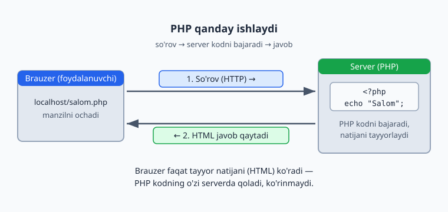

### Agar ishlamasa?

Boshlovchilarda ko'p uchraydigan xatolar:
- **Bo'sh sahifa yoki xato:** `;` (nuqtali vergul) qo'yishni unutgandirsiz, yoki qo'shtirnoqni yopmagandirsiz.
- **Fayl topilmadi (404):** manzilni xato yozgandirsiz yoki fayl boshqa papkada. Fayl `htdocs/darslar` ichidaligiga ishonch hosil qiling.
- **Kod o'zi matn ko'rinishida chiqyapti:** Apache ishlamayapti yoki faylni `localhost` orqali emas, to'g'ridan-to'g'ri ochgansiz. Doim `http://localhost/...` orqali oching.

### Mashqlar

**Oson**
1. Yuqoridagi dasturni ishga tushiring va ekranda matnni ko'ring.
2. Matnni o'zgartiring: `"Salom, dunyo!"` o'rniga o'z ismingizni yozing (masalan, `"Mening ismim Ali"`).
3. `echo`dan keyingi matnni qo'shtirnoqsiz yozib ko'ring (`echo Salom;`) — xato chiqishini ko'ring va nega xato bo'lganini o'ylab ko'ring (matn doim qo'shtirnoq ichida bo'lishi kerak edi).
4. Oxiridagi `;` (nuqtali vergul)ni o'chirib, dasturni ishga tushiring — qanday xato chiqadi? Keyin uni qaytaring.

**O'rta**
5. Ikkita `echo` qatorini ketma-ket yozing (har birining oxirida `;` bo'lsin) va ikkita matn ham chiqishini ko'ring.
6. Bitta `echo` bilan o'zingiz haqingizda bir gap yozing (masalan: `"Men PHP o'rganyapman"`).

**Qiyin**
7. Uchta alohida fayl yarating (`birinchi.php`, `ikkinchi.php`, `uchinchi.php`), har birida boshqacha matn chiqsin. Har birini brauzerda alohida manzil bilan oching.

<details markdown="1">
<summary>Yechim — 5</summary>

```php
<?php
echo "Birinchi qator.";
echo "Ikkinchi qator.";
```

Brauzerda ikkala matn yonma-yon chiqadi: `Birinchi qator.Ikkinchi qator.`
Hozircha ular bir qatorda chiqadi — keyingi mavzularda matnni yangi qatorga tushirishni ham o'rganamiz.
</details>

<details markdown="1">
<summary>Yechim — 7 (uchta fayl)</summary>

Har bir faylni alohida yarating va ichiga boshqacha matn yozing:

```php
<?php
// birinchi.php
echo "Bu — birinchi fayl";
```
```php
<?php
// ikkinchi.php
echo "Bu — ikkinchi fayl";
```
```php
<?php
// uchinchi.php
echo "Bu — uchinchi fayl";
```
Keyin har birini brauzerda alohida oching: `http://localhost/darslar/birinchi.php`, `.../ikkinchi.php`, `.../uchinchi.php`. Maqsad — har bir `.php` fayl mustaqil sahifa ekanini his qilish.
</details>

---

<a name="11-sintaksis"></a>
# 1-QISM — ASOSLAR

## 1.1 Kod qanday yoziladi (sintaksis)

Har bir tilning o'z qoidalari bor: o'zbek tilida gap bosh harf bilan boshlanib, nuqta bilan tugaydi. Dasturlash tillarining ham shunday qoidalari bor — bularga **sintaksis** deyiladi. Keling, PHP'ning asosiy qoidalarini ko'rib chiqamiz.

### Har bir buyruq nuqtali vergul bilan tugaydi

PHP'da har bir buyruq (amal) `;` bilan tugaydi:

```php
<?php
echo "Birinchi buyruq";
echo "Ikkinchi buyruq";
```

Buni gap oxiridagi nuqta deb tasavvur qiling. Agar `;` qo'ymasangiz, PHP buyruq qayerda tugaganini bilmaydi va xato beradi.

### Yangi qatorga o'tkazish

Yuqoridagi misolda ikkala matn brauzerda yonma-yon chiqadi. Sababi: brauzer "yangi qator"ni maxsus belgi orqali tushunadi. Bu belgi — `<br>`:

```php
<?php
echo "Birinchi qator";
echo "<br>";
echo "Ikkinchi qator";
```

Endi ular ikki qatorda chiqadi. `<br>` — bu brauzerga "shu yerda yangi qatorga o't" degan ishora (bu aslida HTML belgisi, lekin hozir tafsilotga kirmaymiz — shunchaki yangi qator uchun ishlatamiz).

### Izohlar (comments) — kompyuter o'qimaydigan yozuvlar

Ba'zan kodga o'zingiz uchun eslatma yozib qo'yishni xohlaysiz: "bu qator nima qilishini" tushuntirish uchun. Bunday yozuvlar **izoh** deyiladi. Kompyuter izohlarni e'tiborsiz qoldiradi — ular faqat odam o'qishi uchun.

```php
<?php
// Bu bir qatorlik izoh. Kompyuter buni o'qimaydi.
echo "Salom";   // Izohni qator oxiriga ham yozish mumkin

/*
  Bu ko'p qatorlik izoh.
  Bir nechta qatorga cho'zilishi mumkin.
*/
echo "Xayr";
```

- `//` — shu belgidan keyingi matn (o'sha qatorda) izoh hisoblanadi.
- `/* ... */` — bir nechta qatorga cho'zilgan izoh shu ichiga yoziladi.

Izohlar juda foydali: keyinroq kodingizga qaytganingizda, "bu yerda nima qilgan ekanman" deb o'ylamaslik uchun izoh yozib qo'yish odat bo'lishi kerak.

### Katta-kichik harf farqi bor

PHP ba'zi joyda katta-kichik harfni farqlaydi, ba'zi joyda yo'q. Hozircha shuni eslang: **buyruqlarni doim kichik harf bilan yozish odat** — `echo` deb yozing, `ECHO` yoki `Echo` emas. Garchi `ECHO` ham ishlasa-da, kichik harf — qabul qilingan to'g'ri uslub.

### Bo'sh joylar muhim emas (deyarli)

Quyidagi ikkala kod bir xil ishlaydi:

```php
<?php
echo "Salom";
```

```php
<?php
echo     "Salom"     ;
```

Ortiqcha bo'sh joylar (probel) kodning ishlashiga ta'sir qilmaydi. Lekin kodni **toza va o'qiladigan** qilib yozish muhim — keraksiz bo'sh joylarni qoldirmang, har buyruqni alohida qatorga yozing.

### Mashqlar

**Oson**
1. Uchta `echo` yozing va orasiga `<br>` qo'yib, uch qatorda matn chiqaring.
2. Kodingizga `//` bilan bitta izoh qo'shing.
3. `/* ... */` bilan ko'p qatorlik izoh yozing va dasturni ishga tushiring — izoh ekranda chiqmasligini ko'ring.
4. `echo` so'zini `ECHO` deb yozib ko'ring — ishlashini tekshiring (ishlaydi, lekin kichik harf to'g'ri uslub).

**O'rta**
5. O'zingiz haqingizda 3 ta gapni 3 ta alohida qatorda chiqaring (ism, yosh, shahar), orasida `<br>` bilan.
6. Bir nechta `echo` orasiga izohlar yozib, har bir qator nima qilishini tushuntiring.

**Qiyin**
7. Bir necha qatorli "tashrifnoma" (vizitka) yarating: ism, kasb, telefon, har biri yangi qatorda. Izohlar bilan kodni tushuntiring.

<details markdown="1">
<summary>Yechim — 5</summary>

```php
<?php
echo "Ism: Ali";
echo "<br>";
echo "Yosh: 19";
echo "<br>";
echo "Shahar: Toshkent";
```

Brauzerda:
```
Ism: Ali
Yosh: 19
Shahar: Toshkent
```
</details>

<details markdown="1">
<summary>Yechim — 7 (izohli tashrifnoma)</summary>

```php
<?php
// Tashrifnoma — har bir qator alohida ma'lumot
echo "Ism: Ali Valiyev";   // to'liq ism
echo "<br>";
echo "Kasb: Dasturchi";    // kasb
echo "<br>";
echo "Telefon: +998 90 123 45 67";
```
Izohlar (`//`) har bir qator nimani chiqarishini tushuntiradi — kompyuter ularni o'qimaydi, faqat siz uchun. `<br>` esa har bir ma'lumotni yangi qatorga tushiradi.
</details>

---

<a name="12-ozgaruvchilar"></a>
## 1.2 O'zgaruvchilar (variables)

### O'zgaruvchi nima?

Tasavvur qiling, sizda bir nechta **qutilar** bor va har biriga nom yozib qo'ygansiz: "ism", "yosh", "narx". Har bir qutiga biror narsa solib qo'yasiz, keyin kerak bo'lganda qutining nomini aytib, ichidagini olasiz.

**O'zgaruvchi — aynan shunday "nomlangan quti".** Ichiga biror ma'lumot (matn, son) saqlaysiz, keyin nomi orqali ishlatasiz.

PHP'da o'zgaruvchi `$` belgisi bilan boshlanadi:

```php
<?php
$ism = "Ali";
$yosh = 19;

echo $ism;
echo "<br>";
echo $yosh;
```

Bu kod ekranga `Ali` va `19` chiqaradi.

Tushuntiramiz:
- **`$ism`** — bu o'zgaruvchi. `$` belgisidan keyin nom keladi (`ism`).
- **`=`** — bu "tenglik" emas, balki "**saqlash**" belgisi. `$ism = "Ali"` degani: "`Ali` degan matnni `ism` qutisiga sol".
- Keyin `echo $ism` deganimizda — quti ichidagi narsa (`Ali`) ekranga chiqadi.

> **Muhim:** `$ism = "Ali"` — bu "ism Ali'ga teng" degani EMAS. Bu "Ali'ni ism qutisiga joyla" degani. Chapdagi quti, o'ngdagi unga solinadigan narsa. Yo'nalish — o'ngdan chapga.

### Nega "o'zgaruvchi" deyiladi?

Chunki ichidagi narsani **o'zgartirish** mumkin:

```php
<?php
$narx = 1000;
echo $narx;        // 1000 chiqadi
echo "<br>";

$narx = 5000;      // endi qutiga yangi qiymat solindi
echo $narx;        // 5000 chiqadi
```

Quti bitta, lekin ichidagi narsa o'zgardi. Oxirgi solingan qiymat saqlanadi.

### O'zgaruvchini matn bilan birga chiqarish

Ko'pincha o'zgaruvchini matn bilan aralashtirib chiqarish kerak bo'ladi. Buning ikki yo'li bor.

**1-yo'l: nuqta bilan ulash.** PHP'da `.` (nuqta) ikkita narsani bir-biriga ulaydi:

```php
<?php
$ism = "Ali";
echo "Salom, " . $ism . "!";   // Salom, Ali!
```

**2-yo'l: o'zgaruvchini to'g'ridan-to'g'ri qo'shtirnoq ichiga yozish:**

```php
<?php
$ism = "Ali";
echo "Salom, $ism!";   // Salom, Ali!
```

Ikkala usul ham `Salom, Ali!` chiqaradi. Boshida sizga qulayrog'ini tanlang.

> **Diqqat:** o'zgaruvchini qo'shtirnoq (`" "`) ichida yozsangiz, uning qiymati chiqadi. Lekin **bittalik tirnoq** (`' '`) ichida yozsangiz, o'zgaruvchi qiymati EMAS, balki nomi xuddi o'zidek chiqadi:
> ```php
> $ism = "Ali";
> echo "Salom $ism";   // Salom Ali
> echo 'Salom $ism';   // Salom $ism  (qiymat chiqmadi!)
> ```
> Shuning uchun o'zgaruvchini chiqarganda **qo'shtirnoq** ishlating.

### O'zgaruvchiga nom berish qoidalari

- `$` bilan boshlanadi: `$ism`, `$narx`.
- Faqat harf, raqam va `_` (pastki chiziq) ishlatiladi. Bo'sh joy bo'lmaydi.
- Nom raqam bilan boshlanmaydi: `$1ism` — xato; `$ism1` — to'g'ri.
- **Mazmunli nom bering:** `$narx` deb yozing, `$n` yoki `$x` emas. Keyinroq kodni o'qiganingizda nima saqlanganini darrov tushunasiz.
- Bir nechta so'zli nomda odatda shunday yoziladi: `$talabaIsmi` yoki `$talaba_ismi`.

### Mashqlar

**Oson**
1. `$ism` o'zgaruvchisiga o'z ismingizni saqlang va ekranga chiqaring.
2. `$shahar` o'zgaruvchisiga shaharingizni saqlang va `"Men ... da yashayman"` shaklida chiqaring.
3. `$narx` o'zgaruvchisiga `2000` saqlang, chiqaring, keyin `3500` saqlab qayta chiqaring.
4. Ikkita o'zgaruvchi (`$ism`, `$yosh`) yarating va ikkalasini bitta gap ichida chiqaring.

**O'rta**
5. `$ism` va `$familiya` o'zgaruvchilarini yarating, ularni bo'sh joy bilan ulab, to'liq ismni chiqaring.
6. Bir o'zgaruvchini qo'shtirnoq ichida (`"$ism"`) va bittalik tirnoq ichida (`'$ism'`) chiqaring — farqini ko'ring.
7. `$mahsulot` va `$narx` o'zgaruvchilari bilan: `"Olma narxi: 5000 so'm"` shaklida chiqaring.

**Qiyin**
8. To'liq tashrifnoma yarating: `$ism`, `$kasb`, `$telefon`, `$shahar` o'zgaruvchilari bilan, har birini alohida qatorda (`<br>` bilan) chiroyli chiqaring.
9. Ikkita o'zgaruvchi qiymatini bir-biriga almashtiring (`$a` da turgan narsa `$b` ga, `$b` dagi `$a` ga o'tsin). Buning uchun uchinchi vaqtinchalik o'zgaruvchi kerak bo'lishi mumkin — o'ylab ko'ring.

<details markdown="1">
<summary>Yechim — 5</summary>

```php
<?php
$ism = "Ali";
$familiya = "Valiyev";
echo $ism . " " . $familiya;   // Ali Valiyev
```
Bu yerda `.` belgisi ism, bo'sh joy (`" "`) va familiyani birlashtiradi.
</details>

<details markdown="1">
<summary>Yechim — 8 (to'liq tashrifnoma)</summary>

```php
<?php
$ism = "Ali Valiyev";
$kasb = "Dasturchi";
$telefon = "+998 90 123 45 67";
$shahar = "Toshkent";

echo "Ism: $ism<br>";
echo "Kasb: $kasb<br>";
echo "Telefon: $telefon<br>";
echo "Shahar: $shahar";
```
Bu yerda har bir ma'lumot o'zgaruvchida saqlanadi va qo'shtirnoq ichida `$ism` ko'rinishida chiqariladi (1.2'dagi interpolatsiya). Avvalgi mashqdagi "qotirilgan" matndan farqi — endi qiymatni bir joyda o'zgartirsak, hamma joyda yangilanadi.
</details>

<details markdown="1">
<summary>Yechim — 9 (qiymatlarni almashtirish)</summary>

```php
<?php
$a = "olma";
$b = "anor";

// To'g'ridan-to'g'ri $a = $b qilsak, $a dagi "olma" yo'qoladi.
// Shuning uchun avval vaqtinchalik qutiga saqlaymiz:
$vaqtinchalik = $a;   // "olma" ni saqlab qo'ydik
$a = $b;              // endi $a = "anor"
$b = $vaqtinchalik;   // $b = "olma"

echo $a;   // anor
echo "<br>";
echo $b;   // olma
```
Bu — boshlovchilar uchun klassik mashq. "Uchinchi quti" hiylasini tushunish muhim.
</details>

---

<a name="13-turlar"></a>
## 1.3 Ma'lumot turlari

O'zgaruvchi ichiga turli xil ma'lumot saqlash mumkin: matn, son, "ha/yo'q" qiymati va boshqalar. Bularning har biri — alohida **tur** (type). PHP'ning asosiy turlarini ko'rib chiqamiz. Buni bilish muhim, chunki turli turdagi ma'lumotlar turlicha ishlaydi.

### 1) Matn (string) — harflar, so'zlar, gaplar

Matn doim **qo'shtirnoq** (yoki bittalik tirnoq) ichida yoziladi:

```php
<?php
$ism = "Ali";
$gap = "Bugun havo issiq";
$telefon = "998901234567";   // bu ham matn (raqam ko'rinishida bo'lsa ham)
```

> Diqqat: `"998901234567"` — bu matn, son emas, chunki tirnoq ichida. Telefon raqami, pasport raqami kabilarni matn sifatida saqlash to'g'ri — chunki ular bilan hisob-kitob qilmaymiz.

### 2) Butun son (integer) — kasrsiz sonlar

Tirnoqsiz yozilgan, nuqtasiz sonlar:

```php
<?php
$yosh = 19;
$narx = 5000;
$temperatura = -10;   // manfiy son ham bo'ladi
```

Bular bilan matematik amallar bajarish mumkin (qo'shish, ayirish va h.k.).

### 3) Kasr son (float) — nuqtali sonlar

Kasr qism bo'lgan sonlar. Kasr **nuqta** bilan yoziladi (vergul emas!):

```php
<?php
$narx = 19.99;
$ball = 4.5;
$pi = 3.14;
```

> Eslatma: o'zbekchada "uch butun o'n to'rt" deb vergul ishlatamiz, lekin dasturlashda **nuqta** ishlatiladi: `3.14`.

### 4) Mantiqiy qiymat (boolean) — faqat "ha" yoki "yo'q"

Ba'zan bizga faqat ikki holatdan biri kerak bo'ladi: rost yoki yolg'on, ha yoki yo'q, yoniq yoki o'chiq. Buni `true` (rost) yoki `false` (yolg'on) bilan ifodalaymiz:

```php
<?php
$tizimga_kirgan = true;    // ha, kirgan
$xat_yuborilgan = false;   // yo'q, yuborilmagan
```

Bu tur ayniqsa "shartlar" mavzusida (1.6) juda kerak bo'ladi. Hozircha shuni bilsangiz yetarli: `true` — rost, `false` — yolg'on.

### 5) Bo'shliq (null) — "hech narsa"

`null` — "bu qutida hozircha hech narsa yo'q" degani:

```php
<?php
$tanlangan_mahsulot = null;   // hali hech narsa tanlanmagan
```

Buni keyinroq ko'proq ishlatamiz. Hozircha shunchaki "bo'sh, hech narsa yo'q" deb eslang.

### Turni tekshirish

O'zgaruvchining turi nima ekanini bilish uchun `var_dump()` ishlatiladi. Bu — kodni tekshirishda juda foydali vosita:

```php
<?php
$ism = "Ali";
$yosh = 19;
$narx = 19.99;
$kirgan = true;

var_dump($ism);    // string(3) "Ali"  → matn, 3 ta harf
var_dump($yosh);   // int(19)           → butun son
var_dump($narx);   // float(19.99)      → kasr son
var_dump($kirgan); // bool(true)        → mantiqiy
```

`var_dump` o'zgaruvchining ham turini, ham qiymatini ko'rsatadi. Kod kutilganidek ishlamayotganda, "o'zgaruvchida nima turibdi ekan?" deb tekshirish uchun ishlatiladi.

### Nima uchun tur muhim?

Chunki turli turdagi ma'lumotlar turlicha "muomala qiladi". Masalan, ikkita sonni qo'shsangiz — ular matematik qo'shiladi. Ikkita matnni esa "qo'shsangiz" — boshqacha natija bo'ladi:

```php
<?php
$a = 5;
$b = 3;
echo $a + $b;     // 8  (sonlar matematik qo'shildi)
```

Buni keyingi bo'limda — amallar mavzusida — batafsil ko'ramiz.

### Mashqlar

**Oson**
1. Har bir turga bittadan o'zgaruvchi yarating: matn, butun son, kasr son, mantiqiy qiymat.
2. Ularning har birini `var_dump` bilan tekshiring va natijani ko'ring.
3. `19` (son) va `"19"` (matn) ni alohida `var_dump` qiling — natijadagi farqni ko'ring.
4. Kasr sonni vergul bilan yozib ko'ring (`$x = 3,14;`) — xato chiqishini ko'ring, keyin nuqta bilan tuzating.

**O'rta**
5. Telefon raqamini saqlash uchun qaysi tur to'g'ri — matnmi yoki sonmi? O'z fikringizni izoh bilan yozing va shunday saqlang.
6. `$kirgan = true;` va `$kirgan = false;` larni alohida `var_dump` qiling.
7. Bitta o'zgaruvchiga avval matn, keyin son saqlang (`$x = "salom";` keyin `$x = 100;`), har safar `var_dump` qiling — turning o'zgarishini kuzating.

**Qiyin**
8. Mahsulot haqida ma'lumotni turli o'zgaruvchilarda saqlang: nomi (matn), narxi (kasr son), soni (butun son), mavjudligi (mantiqiy). Hammasini chiqaring va `var_dump` bilan tekshiring.

<details markdown="1">
<summary>Yechim — 3</summary>

```php
<?php
var_dump(19);     // int(19)        → bu butun son
var_dump("19");   // string(2) "19" → bu matn, 2 ta belgidan iborat
```

Ko'rib turganingizdek, ekranda `19` bir xil ko'rinsa ham, kompyuter uchun ular **ikki xil narsa**: biri son (u bilan hisob qilish mumkin), ikkinchisi matn (ikkita belgi: "1" va "9"). Bu farqni tushunish keyinroq juda asqotadi.
</details>

<details markdown="1">
<summary>Yechim — 8 (mahsulot ma'lumoti, har xil turlar)</summary>

```php
<?php
$nom = "Noutbuk";       // matn (string)
$narx = 7499.99;        // kasr son (float)
$soni = 3;              // butun son (int)
$mavjud = true;         // mantiqiy (bool)

echo "$nom — $narx so'm, $soni dona<br>";

var_dump($nom);     // string(7) "Noutbuk"
var_dump($narx);    // float(7499.99)
var_dump($soni);    // int(3)
var_dump($mavjud);  // bool(true)
```
Bitta mahsulot — to'rtta har xil turdagi ma'lumot. `var_dump` har birining turini aniq ko'rsatadi. E'tibor bering: `$narx` kasr bo'lgani uchun `float`, `$soni` butun bo'lgani uchun `int`.
</details>

---

<a name="14-operatorlar"></a>
## 1.4 Amallar (operatorlar)

**Operator** — bu ma'lumot ustida biror amal bajaradigan belgi. Masalan, `+` qo'shadi, `-` ayiradi. Keling, eng kerakli amallarni ko'rib chiqamiz.

### Matematik amallar

```php
<?php
$a = 10;
$b = 3;

echo $a + $b;   // 13  (qo'shish)
echo "<br>";
echo $a - $b;   // 7   (ayirish)
echo "<br>";
echo $a * $b;   // 30  (ko'paytirish)
echo "<br>";
echo $a / $b;   // 3.333...  (bo'lish)
echo "<br>";
echo $a % $b;   // 1   (qoldiq: 10 ni 3 ga bo'lganda qoldiq)
```

Ko'pchiligi maktab matematikasiga o'xshaydi. Faqat ikkitasiga e'tibor bering:
- **`*`** — ko'paytirish (× emas, yulduzcha).
- **`%`** — bu **qoldiq** topadi. `10 % 3` degani: "10 ni 3 ga bo'lganda nechta qoldiq qoladi?" → 3×3=9, qoldiq 1. Bu amal keyinroq (masalan, juft/toq son aniqlashda) juda foydali bo'ladi.

### Amallar tartibi

Maktabdagidek: avval ko'paytirish/bo'lish, keyin qo'shish/ayirish. Tartibni o'zgartirish uchun qavs ishlating:

```php
<?php
echo 2 + 3 * 4;     // 14  (avval 3*4=12, keyin +2)
echo "<br>";
echo (2 + 3) * 4;   // 20  (avval qavs ichi 2+3=5, keyin *4)
```

### O'zgaruvchini o'zgartirish (qisqa yozuv)

Ko'pincha o'zgaruvchining qiymatini oshirish kerak bo'ladi:

```php
<?php
$ball = 10;
$ball = $ball + 5;   // $ball endi 15
echo $ball;
```

`$ball = $ball + 5` — "ballning hozirgi qiymatiga 5 qo'shib, qayta ballga sol" degani. Buni qisqaroq yozish mumkin:

```php
<?php
$ball = 10;
$ball += 5;   // yuqoridagining qisqasi: $ball = $ball + 5
echo $ball;   // 15
```

Shunga o'xshash qisqa yozuvlar:
- `$x += 5;` → `$x = $x + 5`
- `$x -= 5;` → `$x = $x - 5`
- `$x *= 2;` → `$x = $x * 2`
- `$x++;` → `$x ni 1 ga oshir` (`$x = $x + 1`)
- `$x--;` → `$x ni 1 ga kamaytir`

`$x++` ayniqsa sikllar mavzusida (1.7) doim ishlatiladi.

### Matnlarni ulash

Sonlarda `+` qo'shish edi. Matnlarni esa ulash uchun `.` (nuqta) ishlatiladi (buni 1.2'da ko'rgan edik):

```php
<?php
$ism = "Ali";
$salom = "Salom, " . $ism;   // Salom, Ali
echo $salom;
```

> **Muhim farq:** sonlarni qo'shganda `+`, matnlarni ulaganda `.`. Buni aralashtirib yubormang.

### Taqqoslash amallari

Ikki narsani solishtirish uchun. Bu amallar natijasi doim `true` (rost) yoki `false` (yolg'on) bo'ladi. Ular asosan "shartlar" (1.6) bilan birga ishlatiladi:

```php
<?php
$a = 10;
$b = 5;

var_dump($a > $b);    // true   (a, b dan katta?)
var_dump($a < $b);    // false  (a, b dan kichik?)
var_dump($a == $b);   // false  (a, b ga teng?)
var_dump($a != $b);   // true   (a, b ga teng emas?)
var_dump($a >= 10);   // true   (a, 10 dan katta yoki teng?)
var_dump($a <= 9);    // false  (a, 9 dan kichik yoki teng?)
```

E'tibor bering:
- Tenglikni tekshirishda **ikkita** teng belgisi (`==`) ishlatiladi. Bitta `=` — bu "saqlash" edi (1.2). Buni aralashtirib yuborish — boshlovchilarda eng ko'p uchraydigan xato!
  - `$a = 5` → "5 ni a ga sol"
  - `$a == 5` → "a, 5 ga tengmi?"
- `!=` — "teng emas".

### Mashqlar

**Oson**
1. Ikkita son yarating va ularning yig'indisi, ayirmasi, ko'paytmasini chiqaring.
2. `17 % 5` ni hisoblang va natijani ko'ring (qoldiq necha?).
3. `$ball = 100;` yarating, `$ball += 50;` qiling va chiqaring.
4. `$soni = 5;` yarating, `$soni++;` qiling va chiqaring (necha bo'ldi?).
5. `2 + 3 * 4` va `(2 + 3) * 4` natijalarini solishtiring.

**O'rta**
6. Do'kon hisobi: `$narx = 5000;` va `$soni = 3;` — umumiy summani (`narx * soni`) hisoblang.
7. Ikkita son teng yoki teng emasligini `==` va `!=` bilan tekshiring (`var_dump` orqali).
8. `$a = 10; $b = 20;` — `$a > $b` va `$a < $b` natijalarini chiqaring.
9. Bir o'zgaruvchining qiymatini avval `*= 2`, keyin `+= 10` qilib o'zgartiring, har bosqichda chiqaring.

**Qiyin**
10. To'liq xarid hisobi: 3 ta mahsulot (har birining narxi va soni), umumiy summani hisoblang va chiqaring.
11. Ikki xonali sonning birliklar xonasini toping. Maslahat: `% 10` (10 ga bo'lgandagi qoldiq) birliklar xonasini beradi. Masalan, `47 % 10 = 7`.

<details markdown="1">
<summary>Yechim — 6</summary>

```php
<?php
$narx = 5000;
$soni = 3;
$umumiy = $narx * $soni;
echo "Umumiy summa: " . $umumiy . " so'm";   // Umumiy summa: 15000 so'm
```
</details>

<details markdown="1">
<summary>Yechim — 10 (to'liq xarid hisobi)</summary>

```php
<?php
$jami = 0;

$jami += 5000 * 3;     // 1-mahsulot: narx 5000, 3 dona = 15000
$jami += 12000 * 2;    // 2-mahsulot: 24000
$jami += 800 * 10;     // 3-mahsulot: 8000

echo "Umumiy summa: " . $jami . " so'm";   // 47000 so'm
```
Har bir mahsulot uchun `narx * soni` ni `$jami`ga qo'shamiz (`+=`). Oxirida `$jami` — butun xarid summasi. (Keyinroq, massiv va sikllar bilan, buni yanada chiroyli yozish mumkin bo'ladi.)
</details>

<details markdown="1">
<summary>Yechim — 11</summary>

```php
<?php
$son = 47;
$birliklar = $son % 10;   // 47 ni 10 ga bo'lganda qoldiq = 7
echo "Birliklar xonasi: " . $birliklar;   // 7
```

`% 10` har doim oxirgi raqamni beradi: `123 % 10 = 3`, `90 % 10 = 0`. Bu kichik hiyla turli joyda asqotadi.
</details>

---

<a name="15-matn"></a>
## 1.5 Matn bilan ishlash (string)

Matn (string) — dasturlashda eng ko'p ishlatiladigan ma'lumot turlaridan biri: ismlar, manzillar, xabarlar, sarlavhalar. PHP'da matn ustida turli amallar bajarish uchun maxsus **funksiyalar** bor. Funksiya — bu "tayyor vosita": unga biror narsa berasiz, u natija qaytaradi. (Funksiyalarni o'zingiz yozishni 1.9'da o'rganamiz; hozircha PHP bergan tayyor funksiyalardan foydalanamiz.)

Funksiya shunday ishlatiladi: `funksiya_nomi(nimadir)`. Qavs ichiga "nima ustida ishlashini" yozasiz.

### Matn uzunligini topish — `strlen`

`strlen` matndagi belgilar sonini qaytaradi:

```php
<?php
$ism = "Ali";
echo strlen($ism);   // 3  (3 ta harf)

$parol = "12345";
echo strlen($parol); // 5
```

Bu, masalan, "parol kamida 8 ta belgidan iborat bo'lsin" degan tekshiruvda kerak bo'ladi.

### Katta/kichik harfga o'tkazish — `strtoupper`, `strtolower`

```php
<?php
$ism = "ali";
echo strtoupper($ism);   // ALI   (hammasi katta harf)
echo "<br>";
echo strtolower("SALOM"); // salom (hammasi kichik harf)
```

### Birinchi harfni katta qilish — `ucfirst`

```php
<?php
echo ucfirst("ali");        // Ali
echo "<br>";
echo ucwords("ali valiyev"); // Ali Valiyev  (har so'zning birinchi harfi)
```

### Matnni almashtirish — `str_replace`

Matndagi biror so'zni boshqasiga almashtiradi. Uch narsa beriladi: nimani, nimaga, qayerda:

```php
<?php
$gap = "Men olma yaxshi ko'raman";
echo str_replace("olma", "anor", $gap);   // Men anor yaxshi ko'raman
```

Bu yerda: `"olma"`ni topib, `"anor"`ga almashtir, `$gap` ichida.

### Matnning bir qismini olish — `substr`

Matnning ma'lum qismini kesib oladi. **Diqqat:** dasturlashda sanash **0 dan** boshlanadi (1 dan emas!). Ya'ni birinchi harf — 0-o'rinda, ikkinchisi — 1-o'rinda.

```php
<?php
$soz = "Dasturlash";
echo substr($soz, 0, 4);   // Dast  (0-o'rindan boshlab, 4 ta belgi)
echo "<br>";
echo substr($soz, 4);      // urlash (4-o'rindan oxirigacha)
```

> **Nega 0 dan?** Bu dasturlashda umumiy qoida — deyarli barcha tillarda sanoq 0 dan boshlanadi. Avvaliga g'alati tuyuladi, lekin tez ko'nikasiz. Massivlar (1.8) mavzusida buni yana ko'ramiz.

### Ortiqcha bo'sh joylarni olib tashlash — `trim`

Foydalanuvchi matn kiritganda, ba'zan boshida yoki oxirida keraksiz bo'sh joy qoladi. `trim` ularni tozalaydi:

```php
<?php
$kiritilgan = "   Ali   ";
echo trim($kiritilgan);   // "Ali"  (atrofdagi bo'sh joylar ketdi)
```

### Matnni qidirish — `str_contains`

Matn ichida biror so'z bor-yo'qligini tekshiradi. Natija `true` yoki `false` bo'ladi:

```php
<?php
$gap = "Bugun havo issiq";
var_dump(str_contains($gap, "havo"));   // true  (bor)
var_dump(str_contains($gap, "sovuq"));  // false (yo'q)
```

### Matnni bo'laklarga ajratish va birlashtirish — `explode`, `implode`

Ko'pincha matnni belgilangan ajratgich bo'yicha bo'laklarga ajratish kerak bo'ladi (masalan, vergul bilan yozilgan ro'yxatni). `explode` matnni **massivga** (1.8) aylantiradi:

```php
<?php
$gap = "olma,anor,uzum";
$mevalar = explode(",", $gap);   // ["olma", "anor", "uzum"]
echo $mevalar[1];                // anor
```

`implode` esa aksini qiladi — massivni bitta matnga **birlashtiradi**:

```php
<?php
$royxat = ["Ali", "Vali", "Guli"];
echo implode(", ", $royxat);   // Ali, Vali, Guli
```

`explode("ajratgich", $matn)` — "matnni shu belgi bo'yicha bo'l"; `implode("ulagich", $massiv)` — "massiv elementlarini shu belgi bilan ula". Bu ikkisi matn ↔ massiv o'rtasidagi ko'prik.

### Sonni chiroyli formatlash — `number_format`

Katta sonlarni o'qishli ko'rinishda chiqarish (minglik ajratgich, kasr):

```php
<?php
echo number_format(1234567.891, 2);            // 1,234,567.89
echo number_format(1234567, 0, ".", " ");      // 1 234 567  (o'zbekcha uslub)
```

`number_format(son, kasr_xona, kasr_belgisi, minglik_belgisi)`. Narxlarni ko'rsatishda juda ko'p kerak bo'ladi.

### Andoza bo'yicha matn yasash — `sprintf`

`sprintf` "andoza"ga qiymatlarni joylab, **yangi matn qaytaradi** (`echo` qilmaydi — natijani saqlash mumkin):

```php
<?php
$matn = sprintf("%s — %d yoshda", "Ali", 19);
echo $matn;                          // Ali — 19 yoshda

echo sprintf("Narx: %.2f so'm", 5000);   // Narx: 5000.00 so'm
echo sprintf("ID: %05d", 42);            // ID: 00042  (5 xona, nol bilan)
```

- **`%s`** — matn (string) o'rni, **`%d`** — butun son, **`%.2f`** — 2 kasrli son, **`%05d`** — 5 xonali, yetmasa nol bilan to'ldiriladi.
- Qiymatlar andozadan keyin, tartibda yoziladi.

> **`echo` bilan farqi:** `echo "Ali" . " — " . 19` ham ishlaydi, lekin ko'p qiymat bo'lsa `.` bilan ulash chalkash ko'rinadi. `sprintf` andozani aniq ko'rsatadi — ayniqsa formatlash (kasr, nol to'ldirish) kerak bo'lganda qulay.

### Mashqlar

**Oson**
1. Bir ismni `strlen` bilan o'lchang va uzunligini chiqaring.
2. O'z ismingizni `strtoupper` bilan katta harfda chiqaring.
3. `ucfirst` bilan kichik harfli so'zning birinchi harfini katta qiling.
4. Bir gapdagi so'zni `str_replace` bilan boshqasiga almashtiring.
5. "Dasturlash" so'zining birinchi 4 harfini `substr` bilan oling.

**O'rta**
6. Foydalanuvchi ismi `"  ali  "` shaklida (bo'sh joylar bilan) berilgan. `trim` bilan tozalang, keyin `ucfirst` bilan birinchi harfini katta qiling. Natija: `Ali`.
7. Bir gapda biror so'z bor-yo'qligini `str_contains` bilan tekshiring.
8. To'liq ism (`"ali valiyev"`) ning har bir so'zini `ucwords` bilan katta harf bilan boshlang.
9. Parol uzunligini `strlen` bilan o'lchang va `var_dump` orqali "8 dan katta yoki tengmi" (`>= 8`) ekanini tekshiring.

**Qiyin**
10. Bir ismni oling, uni katta harfga o'tkazing va uzunligini bitta gapda chiqaring: masalan, `"ALI - 3 ta harf"`. (Maslahat: `strtoupper`, `strlen` va `.` ulashdan foydalaning.)
11. Email manzil (`"ali@mail.com"`) ichida `"@"` belgisi bor-yo'qligini tekshiring (`str_contains`). Bu — oddiy email tekshiruvining boshlanishi.
12. `"olma,anor,uzum"` matnini `explode` bilan massivga aylantiring, sonini (`count`) chiqaring, keyin `implode` bilan `" | "` ajratgich bilan qayta birlashtiring.
13. Narx `1234567.5` ni `number_format` bilan minglik ajratgich va 2 kasr bilan chiqaring; keyin `sprintf` bilan `"Mahsulot: <nom>, narxi: <narx> so'm"` ko'rinishida bitta matn yasang.

<details markdown="1">
<summary>Yechim — 6</summary>

```php
<?php
$kiritilgan = "  ali  ";
$tozalangan = trim($kiritilgan);     // "ali"
$natija = ucfirst($tozalangan);      // "Ali"
echo $natija;
```

Yoki bitta qatorda (funksiyalarni "ichma-ich" ishlatib):
```php
<?php
echo ucfirst(trim("  ali  "));   // Ali
```
Bu yerda avval `trim` bo'sh joylarni oladi, keyin uning natijasini `ucfirst` katta harfga o'tkazadi. Funksiyalarni shunday birlashtirish mumkin.
</details>

<details markdown="1">
<summary>Yechim — 10</summary>

```php
<?php
$ism = "ali";
$katta = strtoupper($ism);       // "ALI"
$uzunlik = strlen($ism);         // 3
echo $katta . " - " . $uzunlik . " ta harf";   // ALI - 3 ta harf
```
</details>

<details markdown="1">
<summary>Yechim — 11 (email tekshiruvining boshlanishi)</summary>

```php
<?php
$email = "ali@mail.com";

if (str_contains($email, "@")) {
    echo "Email ko'rinishi to'g'ri (@ bor)";
} else {
    echo "Noto'g'ri email: @ yo'q";
}
```
Bu — eng oddiy tekshiruv: `@` belgisi bormi. Haqiqiy email tekshiruvi murakkabroq (PHP'da `filter_var($email, FILTER_VALIDATE_EMAIL)` tayyor vositasi bor), lekin `str_contains` bilan asosiy g'oyani tushunish — yaxshi boshlanish.
</details>

<details markdown="1">
<summary>Yechim — 12 (explode / implode)</summary>

```php
<?php
$matn = "olma,anor,uzum";
$mevalar = explode(",", $matn);     // ["olma", "anor", "uzum"]

echo count($mevalar);               // 3
echo "<br>";
echo implode(" | ", $mevalar);      // olma | anor | uzum
```
`explode` matnni massivga ajratdi, `implode` esa boshqa ajratgich bilan qayta birlashtirdi. Bu ikkisi — matn va massiv orasida o'tishning eng tez yo'li.
</details>

<details markdown="1">
<summary>Yechim — 13 (number_format va sprintf)</summary>

```php
<?php
$narx = 1234567.5;

echo number_format($narx, 2);   // 1,234,567.50

$satr = sprintf(
    "Mahsulot: %s, narxi: %s so'm",
    "Noutbuk",
    number_format($narx, 2)
);
echo "<br>" . $satr;            // Mahsulot: Noutbuk, narxi: 1,234,567.50 so'm
```
`number_format` sonni o'qishli qildi (minglik vergul + 2 kasr), `sprintf` esa uni andozaga joylab tayyor matn yasadi.
</details>

---

<a name="16-shartlar"></a>
## 1.6 Shartlar (if/else)

Hozirgacha dasturimiz har doim bir xil ishni bajarardi. Lekin haqiqiy dasturlar **qaror qabul qilishi** kerak: "agar foydalanuvchi katta bo'lsa — ruxsat ber, aks holda — berma", "agar narx yetarli bo'lsa — sotib ol". Ana shu "agar..." mantig'i — **shartlar** orqali yoziladi. Bu — dasturlashning eng muhim tushunchalaridan biri.

### Oddiy `if`

`if` so'zi "agar" degani. Qavs ichiga shart yoziladi; agar shart **rost** (`true`) bo'lsa, `{ }` ichidagi kod ishlaydi:

```php
<?php
$yosh = 20;

if ($yosh >= 18) {
    echo "Siz katta yoshdasiz";
}
```

Bu yerda: "agar yosh 18 dan katta yoki teng bo'lsa, xabarni chiqar". Yosh 20 bo'lgani uchun shart rost — xabar chiqadi.

Tuzilishini ko'ring:
- **`if`** — "agar".
- **`( )`** ichida — tekshiriladigan shart (1.4'da ko'rgan taqqoslash amallari shu yerda ishlatiladi).
- **`{ }`** ichida — shart rost bo'lsa bajariladigan kod.

### `if ... else` — "aks holda"

`else` so'zi "aks holda" degani: agar shart yolg'on bo'lsa, `else` ichidagi kod ishlaydi:

```php
<?php
$yosh = 15;

if ($yosh >= 18) {
    echo "Ruxsat berildi";
} else {
    echo "Ruxsat berilmadi";   // yosh 15, shart yolg'on → shu chiqadi
}
```

Faqat ikkitadan bittasi ishlaydi: yoki `if` ichidagi, yoki `else` ichidagi.

### `if ... elseif ... else` — bir nechta holat

Ko'pincha ikkitadan ko'p holat bo'ladi. `elseif` ("aks holda agar") qo'shimcha shartlarni tekshiradi:

```php
<?php
$ball = 75;

if ($ball >= 90) {
    echo "A baho";
} elseif ($ball >= 80) {
    echo "B baho";
} elseif ($ball >= 70) {
    echo "C baho";   // 75 bu yerga to'g'ri keladi
} else {
    echo "Yiqildi";
}
```

PHP shartlarni **yuqoridan pastga** tekshiradi va birinchi rost bo'lganida to'xtaydi. `$ball = 75` uchun: 90 dan katta emas, 80 dan katta emas, 70 dan katta — ha! "C baho" chiqadi va qolgani tekshirilmaydi.

Quyidagi blok-sxema shu oqimni ko'rsatadi: har shart navbat bilan tekshiriladi, birinchi rost tarmoq bajariladi.

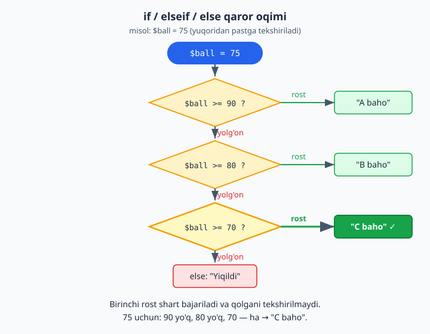

### Mantiqiy amallar — bir nechta shartni birlashtirish

Ba'zan bir vaqtda bir nechta shart tekshirilishi kerak. Buning uchun:

- **`&&`** — "va" (ikkala shart ham rost bo'lishi kerak)
- **`||`** — "yoki" (kamida bittasi rost bo'lsa yetarli)
- **`!`** — "emas" (rostni yolg'onga, yolg'onni rostga aylantiradi)

```php
<?php
$yosh = 25;
$pul = 100000;

// "va" — ikkala shart ham rost bo'lishi kerak
if ($yosh >= 18 && $pul >= 50000) {
    echo "Sotib olishingiz mumkin";
}

// "yoki" — bittasi rost bo'lsa yetarli
$kun = "shanba";
if ($kun == "shanba" || $kun == "yakshanba") {
    echo "Bugun dam olish kuni";
}
```

`&&` ni "ham...ham" deb, `||` ni "yo...yo" deb o'qing.

### Misol: juft yoki toq sonni aniqlash

1.4'da o'rgangan `%` (qoldiq) amalini eslang. Agar son 2 ga bo'linganda qoldiq 0 bo'lsa — u juft son:

```php
<?php
$son = 7;

if ($son % 2 == 0) {
    echo "Juft son";
} else {
    echo "Toq son";   // 7 % 2 = 1, qoldiq 0 emas → toq
}
```

### `switch` — bitta qiymatni ko'p variant bilan solishtirish

Ba'zan bitta o'zgaruvchini ko'p qiymatlardan biriga teng-emasligini tekshiramiz. `if/elseif` bilan bu uzun chiqadi. `switch` shu holat uchun toza ko'rinish beradi:

```php
<?php
$kun = "seshanba";

switch ($kun) {
    case "shanba":
    case "yakshanba":
        echo "Dam olish kuni";
        break;                  // bu variant tugadi — chiqib ket
    default:
        echo "Ish kuni";        // hech qaysi case mos kelmasa
}
```

- **`switch ($kun)`** — qaysi o'zgaruvchini tekshirayotganimiz.
- **`case "shanba":`** — "agar `$kun` `"shanba"` ga teng bo'lsa". Ikki `case` ketma-ket yozilsa (yuqorida shanba/yakshanba) — ikkalasi uchun bir xil kod ishlaydi.
- **`break;`** — JUDA muhim: variant tugaganini bildiradi. Unutsangiz, PHP keyingi `case`ga ham "tushib" ketadi (fall-through) — ko'p uchraydigan xato.
- **`default:`** — hech qaysi variant mos kelmaganda (xuddi `else` kabi).

> **Qachon `switch`, qachon `if`?** Bitta qiymatni aniq variantlarga solishtirsangiz (`$kun` "shanba"mi, "yakshanba"mi...) — `switch` toza. Oraliq/murakkab shartlar bo'lsa (`yosh >= 18 && pul > 0`) — `if/elseif`.

### `match` — `switch`'ning zamonaviy, ixcham ko'rinishi (PHP 8+)

`match` — `switch`'ning yangi, qulayroq versiyasi. Farqi: u **qiymat qaytaradi**, `break` shart emas, va qat'iy (`===` — ham qiymat, ham tur) solishtiradi:

```php
<?php
$baho = 85;

$harf = match(true) {
    $baho >= 90 => "A",
    $baho >= 80 => "B",      // 85 shu yerga to'g'ri keladi
    $baho >= 70 => "C",
    default     => "F",
};

echo $harf;   // B
```

- Har bir variant `shart => natija` ko'rinishida, vergul bilan ajratiladi.
- Natija to'g'ridan-to'g'ri `$harf`ga saqlanadi — `echo` yoki `break` yozish shart emas.
- `match(true)` — "qaysi shart `true` bo'lsa" degani (oraliqlarni tekshirishda qulay). Aniq qiymatlarni solishtirsangiz, `match($kun)` deb yozasiz:

```php
<?php
$kun = "seshanba";
echo match($kun) {
    "shanba", "yakshanba" => "Dam olish kuni",
    default               => "Ish kuni",
};
```

> **Why:** `match` `if/elseif`ning eng toza ko'rinishi — "bir qiymatga qarab turli natija" kerak bo'lganda ishlating. Bir necha variantni bitta natijaga ulash uchun ularni vergul bilan sanang. (2.9 — Enum bo'limida `match`ni yana ko'ramiz.)

### Qisqa shartli yozuvlar: ternary (`?:`) va `??`

Kichik shartlarni bitta qatorda yozishning qisqa yo'llari bor.

**Ternary (`?:`)** — "agar... bo'lsa buni, aks holda buni":

```php
<?php
$yosh = 20;

// To'liq if/else o'rniga:
$holat = ($yosh >= 18) ? "katta" : "kichik";
echo $holat;   // katta
```

`shart ? rost_bo'lsa : yolg'on_bo'lsa` — bu kichik tanlovlar uchun qulay. Lekin uni murakkablashtirib yubormang (ichma-ich ternary o'qishni qiyinlashtiradi) — murakkab bo'lsa, oddiy `if`ga qayting.

**Null-coalescing (`??`)** — "agar bor va `null` bo'lmasa o'shani, aks holda zaxira qiymatni":

```php
<?php
// $_GET['ism'] bor bo'lsa o'shani, bo'lmasa "Mehmon"
$ism = $_GET['ism'] ?? "Mehmon";

$sozlama = [];
$til = $sozlama['til'] ?? "uz";   // 'til' kaliti yo'q → "uz"
echo $til;   // uz
```

`??` ayniqsa foydalanuvchi ma'lumoti bilan ishlaganda (`$_GET`, `$_POST`, massiv kalitlari) juda ko'p kerak bo'ladi: "kalit bormi? bo'lsa qiymatini ol, bo'lmasa standart qiymat ber" — bularning hammasi bitta `??` bilan, xatosiz.

> **Diqqat:** `??` faqat `null` (yoki "umuman yo'q") holatini tekshiradi. `?:` esa har qanday "falsy" (bo'sh, 0) qiymatda zaxiraga o'tadi. Foydalanuvchi ma'lumotini olishda odatda `??` to'g'riroq.

### Mashqlar

**Oson**
1. Bir yosh o'zgaruvchisi yarating. Agar 18 dan katta bo'lsa, "Voyaga yetgan" deb chiqaring.
2. Bir songa `if/else` yozing: agar 100 dan katta bo'lsa "katta son", aks holda "kichik son".
3. Bir sonning juft yoki toqligini aniqlang (`% 2` bilan).
4. Bir baho (0-100) o'zgaruvchisi: agar 60 dan katta yoki teng bo'lsa "O'tdi", aks holda "Yiqildi".
5. Bir ob-havo o'zgaruvchisi (`$harorat`): agar 0 dan kichik bo'lsa "Sovuq" deb chiqaring.

**O'rta**
6. Baho tizimini `elseif` bilan yozing: A (90+), B (80+), C (70+), D (60+), F (qolgani).
7. Foydalanuvchi yoshi 18-65 oralig'idami, tekshiring (`&&` bilan: `>= 18` va `<= 65`).
8. Kun nomini tekshiring: shanba yoki yakshanba bo'lsa "dam olish", aks holda "ish kuni" (`||` bilan).
9. Login tekshiruvi: `$ism == "admin"` **va** `$parol == "12345"` bo'lsa "Xush kelibsiz", aks holda "Xato".
10. Bir son musbat, manfiy yoki nolligini aniqlang (uchta holat: `> 0`, `< 0`, `== 0`).

**Qiyin**
11. Oddiy "chegirma" mantig'i: agar xarid summasi 100000 dan katta bo'lsa, 10% chegirma hisoblang va yakuniy narxni chiqaring; aks holda to'liq narxni chiqaring.
12. Yil kabisa (visokosniy) yilmi? Maslahat: yil 4 ga bo'linsa kabisa, lekin 100 ga bo'linsa kabisa emas, agar 400 ga bo'linsa yana kabisa. (Bu — `%` va mantiqiy amallarning yaxshi mashqi. Avval soddaroq: faqat "4 ga bo'linadimi" bilan boshlang.)
13. Eng katta sonni topish: uchta son berilgan, ularning eng kattasini aniqlang va chiqaring (`if/elseif` yoki `&&` bilan).
14. `switch` bilan: hafta kuni raqami (1–7) berilganda, uning nomini chiqaring (1 → "Dushanba" ... 7 → "Yakshanba"); noto'g'ri raqam uchun `default`da "Noma'lum kun".
15. `match` bilan: baho (0–100) berilganda harf bahosini qaytaring (A/B/C/D/F) va chiqaring.
16. Ternary va `??` bilan: `$_GET['ism']` bo'lsa undan, bo'lmasa "Mehmon" oling (`??`), keyin ternary bilan "Salom, &lt;ism&gt;" yoki uzunligi 3 dan kichik bo'lsa "Ism juda qisqa" chiqaring.

<details markdown="1">
<summary>Yechim — 9</summary>

```php
<?php
$ism = "admin";
$parol = "12345";

if ($ism == "admin" && $parol == "12345") {
    echo "Xush kelibsiz!";
} else {
    echo "Login yoki parol xato";
}
```
`&&` tufayli **ikkala** shart ham to'g'ri bo'lsagina "Xush kelibsiz" chiqadi. Birortasi xato bo'lsa — `else` ishlaydi.
</details>

<details markdown="1">
<summary>Yechim — 11</summary>

```php
<?php
$summa = 150000;

if ($summa > 100000) {
    $chegirma = $summa * 0.10;        // 10% = summaning 0.10 qismi
    $yakuniy = $summa - $chegirma;
    echo "Chegirma: " . $chegirma . " so'm<br>";
    echo "To'lov: " . $yakuniy . " so'm";   // 135000
} else {
    echo "To'lov: " . $summa . " so'm";
}
```
</details>

<details markdown="1">
<summary>Yechim — 12 (kabisa yil)</summary>

```php
<?php
$yil = 2024;

// Kabisa: 4 ga bo'linsa, LEKIN 100 ga bo'linmasa; YOKI 400 ga bo'linsa
$kabisa = ($yil % 4 == 0 && $yil % 100 != 0) || ($yil % 400 == 0);

if ($kabisa) {
    echo "$yil — kabisa yil";
} else {
    echo "$yil — oddiy yil";
}
```

Tekshirib ko'ring: `2000` → kabisa (400 ga bo'linadi), `1900` → oddiy (100 ga bo'linadi, lekin 400 ga emas), `2024` → kabisa (4 ga bo'linadi, 100 ga emas). Mantiq murakkab ko'rinsa ham, uni so'z bilan o'qing: *"4 ga bo'linadi **va** 100 ga bo'linmaydi — **yoki** 400 ga bo'linadi"*. `&&` va `||` ni qavslar bilan to'g'ri guruhlash bu yerda kalit.
</details>

<details markdown="1">
<summary>Yechim — 13 (eng katta son)</summary>

```php
<?php
$a = 12;
$b = 45;
$c = 23;

if ($a >= $b && $a >= $c) {
    echo "Eng katta: " . $a;
} elseif ($b >= $a && $b >= $c) {
    echo "Eng katta: " . $b;
} else {
    echo "Eng katta: " . $c;   // bu holatda 45
}
```
Mantiq: `$a` eng katta bo'lishi uchun u **ham** `$b` dan, **ham** `$c` dan katta (yoki teng) bo'lishi kerak — shuning uchun `&&`.
</details>

<details markdown="1">
<summary>Yechim — 14 (switch bilan hafta kuni)</summary>

```php
<?php
$raqam = 3;

switch ($raqam) {
    case 1: echo "Dushanba";  break;
    case 2: echo "Seshanba";  break;
    case 3: echo "Chorshanba"; break;   // 3 → shu yer ishlaydi
    case 4: echo "Payshanba"; break;
    case 5: echo "Juma";      break;
    case 6: echo "Shanba";    break;
    case 7: echo "Yakshanba"; break;
    default: echo "Noma'lum kun";
}
```
Har bir `case`dan keyin `break` borligiga e'tibor bering — usiz keyingi kunlar ham "tushib" chiqib ketardi.
</details>

<details markdown="1">
<summary>Yechim — 15 (match bilan harf bahosi)</summary>

```php
<?php
$baho = 73;

$harf = match(true) {
    $baho >= 90 => "A",
    $baho >= 80 => "B",
    $baho >= 70 => "C",   // 73 → shu yer
    $baho >= 60 => "D",
    default     => "F",
};

echo $harf;   // C
```
`match(true)` oraliqlarni tekshirish uchun ideal: yuqoridan pastga, birinchi `true` bo'lgan shartning natijasini qaytaradi. 1.6'dagi `if/elseif`li baho tizimi bilan solishtiring — `match` ancha ixcham.
</details>

<details markdown="1">
<summary>Yechim — 16 (ternary va ??)</summary>

```php
<?php
$ism = $_GET['ism'] ?? "Mehmon";   // 'ism' kelmasa — "Mehmon"

echo (strlen($ism) < 3)
    ? "Ism juda qisqa"
    : "Salom, $ism";
```
`??` "yo'q bo'lsa zaxira" ni, ternary esa "shartga qarab ikki javobdan biri"ni beradi. Ikkalasi birga — qisqa, o'qiladigan kod.
</details>

---

<a name="17-sikllar"></a>
## 1.7 Takrorlash (sikllar)

Tasavvur qiling, 1 dan 100 gacha sonlarni ekranga chiqarish kerak. Har birini alohida `echo` bilan yozsangiz — 100 ta qator! Bu juda noqulay. Kompyuterning eng kuchli tomoni — **bir ishni ko'p marta takrorlash**. Buni **sikllar** (loops) yordamida qilamiz: bir kod blokini kerakli marta qaytaramiz.

### `while` sikli — "shart bajarilguncha takrorla"

`while` so'zi "...gacha" degani. Shart rost bo'lib turguncha, kod takrorlanaveradi:

```php
<?php
$son = 1;

while ($son <= 5) {
    echo $son . "<br>";
    $son++;            // har takrorda sonni 1 ga oshiramiz
}
```

Bu kod 1, 2, 3, 4, 5 ni chiqaradi. Qanday ishlaydi:
1. `$son = 1` — boshlang'ich qiymat.
2. `while` shartni tekshiradi: `1 <= 5`? Ha → ichidagi kod ishlaydi (1 chiqadi), keyin `$son` 2 bo'ladi.
3. Yana tekshiradi: `2 <= 5`? Ha → 2 chiqadi, `$son` 3 bo'ladi.
4. ...shu tarzda davom etadi, `$son` 6 bo'lganda: `6 <= 5`? Yo'q → sikl to'xtaydi.

> **JUDA MUHIM:** sikl ichida `$son++` (qiymatni o'zgartirish) bo'lishi shart. Agar uni unutsangiz, shart hech qachon yolg'on bo'lmaydi va sikl **abadiy** takrorlanadi (dastur "osilib qoladi"). Bu — boshlovchilarda ko'p uchraydigan xato. Agar dasturingiz qotib qolsa, brauzer oynasini yopib, shuni tekshiring.

### `for` sikli — "ma'lum marta takrorla"

`for` — sanab takrorlash uchun eng qulay sikl. U `while`ning ixchamroq ko'rinishi: boshlang'ich qiymat, shart va o'zgartirish — hammasi bir qatorda:

```php
<?php
for ($i = 1; $i <= 5; $i++) {
    echo $i . "<br>";
}
```

Bu ham 1 dan 5 gacha chiqaradi. Qavs ichida uch qism, `;` bilan ajratilgan:
1. **`$i = 1`** — boshlang'ich qiymat (sikl boshida bir marta bajariladi).
2. **`$i <= 5`** — shart (har takror oldidan tekshiriladi).
3. **`$i++`** — o'zgartirish (har takror oxirida bajariladi).

> `$i` — bu "hisoblagich" (counter). An'anaga ko'ra ko'pincha `$i` deb nomlanadi (`index` so'zidan). 0 yoki 1 dan boshlanishi vazifaga bog'liq.

`for` sikli "aniq necha marta takrorlanishini bilganda" qulay (masalan, 1 dan 100 gacha). `while` esa "qachongacha ekani noaniq bo'lganda" qulay.

### Misol: 1 dan 10 gacha sonlar yig'indisi

```php
<?php
$yigindi = 0;

for ($i = 1; $i <= 10; $i++) {
    $yigindi += $i;   // har takrorda joriy sonni yig'indiga qo'shamiz
}

echo "Yig'indi: " . $yigindi;   // 55
```

Sikl `$yigindi`ga 1, keyin 2, keyin 3... qo'shib boradi. Oxirida 1+2+...+10 = 55.

### Siklni to'xtatish va o'tkazib yuborish

- **`break`** — siklni butunlay to'xtatadi (undan chiqib ketadi).
- **`continue`** — joriy takrorni o'tkazib yuboradi, keyingisiga o'tadi.

```php
<?php
// break: 5 ga yetganda to'xta
for ($i = 1; $i <= 10; $i++) {
    if ($i == 5) {
        break;        // 5 da sikl tugaydi
    }
    echo $i . " ";    // 1 2 3 4
}

echo "<br>";

// continue: juft sonlarni o'tkazib yubor (faqat toq sonlar chiqsin)
for ($i = 1; $i <= 10; $i++) {
    if ($i % 2 == 0) {
        continue;     // juft bo'lsa, qolganini o'tkazib yubor
    }
    echo $i . " ";    // 1 3 5 7 9
}
```

### Mashqlar

**Oson**
1. `for` sikli bilan 1 dan 10 gacha sonlarni chiqaring.
2. `while` sikli bilan 1 dan 5 gacha sonlarni chiqaring.
3. 1 dan 20 gacha **faqat juft** sonlarni chiqaring (`% 2 == 0` bilan).
4. 10 dan 1 gacha **teskari** sanang (`$i--` ishlatib).
5. "Salom" so'zini 5 marta chiqaring (sikl bilan).

**O'rta**
6. 1 dan 100 gacha sonlar yig'indisini hisoblang.
7. 5 ning ko'paytuv jadvalini chiqaring: `5 x 1 = 5`, `5 x 2 = 10`, ... `5 x 10 = 50`.
8. 1 dan 50 gacha 3 ga bo'linadigan sonlarni chiqaring.
9. `break` bilan: 1 dan boshlab sanang, lekin son 7 ga yetganda to'xtang.
10. `continue` bilan: 1 dan 20 gacha sonlardan faqat toqlarini chiqaring.

**Qiyin**
11. Berilgan sonning faktorialini hisoblang (faktorial: `5! = 1×2×3×4×5 = 120`). Maslahat: yig'indi o'rniga ko'paytma to'plang, boshlang'ich qiymat 1 bo'lsin.
12. Berilgan son tub (prime) sonmi, tekshiring. Tub son — faqat 1 ga va o'ziga bo'linadigan son (2, 3, 5, 7, 11...). Maslahat: sonni 2 dan boshlab o'zidan kichik sonlarga bo'lib ko'ring; agar birortasiga teng bo'linsa — tub emas.
13. To'liq ko'paytuv jadvali (1 dan 9 gacha) — bunda sikl **ichida sikl** kerak bo'ladi (tashqi sikl — qatorlar, ichki sikl — ustunlar).

<details markdown="1">
<summary>Yechim — 7 (ko'paytuv jadvali)</summary>

```php
<?php
$son = 5;

for ($i = 1; $i <= 10; $i++) {
    echo $son . " x " . $i . " = " . ($son * $i) . "<br>";
}
```
Chiqadi: `5 x 1 = 5`, `5 x 2 = 10`, ... `5 x 10 = 50`.
Diqqat: `($son * $i)` qavs ichida — chunki avval ko'paytirib, keyin matnga ulashimiz kerak.
</details>

<details markdown="1">
<summary>Yechim — 11 (faktorial)</summary>

```php
<?php
$son = 5;
$faktorial = 1;        // ko'paytma uchun boshlang'ich 1 (0 emas!)

for ($i = 1; $i <= $son; $i++) {
    $faktorial *= $i;  // 1*1, keyin *2, *3, *4, *5
}

echo $son . "! = " . $faktorial;   // 5! = 120
```
Nega boshlang'ich 1? Chunki ko'paytmada 0 dan boshlasak, hamma narsa 0 bo'lib qoladi. Yig'indida 0 dan, ko'paytmada 1 dan boshlanadi.
</details>

<details markdown="1">
<summary>Yechim — 12 (tub son tekshiruvi)</summary>

```php
<?php
$son = 7;
$tub = true;          // hozircha "tub" deb hisoblaymiz

if ($son < 2) {
    $tub = false;     // 0 va 1 tub emas
} else {
    // 2 dan boshlab, sonning kvadrat ildizigacha bo'lib ko'ramiz
    for ($i = 2; $i * $i <= $son; $i++) {
        if ($son % $i == 0) {
            $tub = false;   // biror songa bo'lindi → tub emas
            break;          // davom etish shart emas
        }
    }
}

echo $son . ($tub ? " — tub son" : " — tub son emas");
```
Mantiq: agar son 2 dan kichik bo'lsa — tub emas. Aks holda 2 dan boshlab `$i * $i <= $son` gacha bo'lib ko'ramiz; birortasiga butun bo'linsa — tub emas, `break` bilan to'xtaymiz. Nega `$i * $i <= $son` (ya'ni $i ildizgacha)? Chunki sonning bo'luvchilari ildizidan keyin takrorlanadi — bu hisobni tezlashtiradi.
</details>

<details markdown="1">
<summary>Yechim — 13 (ichma-ich sikl)</summary>

```php
<?php
for ($qator = 1; $qator <= 9; $qator++) {      // tashqi sikl
    for ($ustun = 1; $ustun <= 9; $ustun++) {  // ichki sikl
        echo ($qator * $ustun) . "\t";          // \t — bo'sh joy (tab)
    }
    echo "<br>";   // har qatordan keyin yangi qatorga o't
}
```
Tashqi sikl har bir qator uchun bir marta, ichki sikl esa har qatorda 9 marta ishlaydi. Natijada 9×9 jadval hosil bo'ladi.
</details>

---

<a name="18-massivlar"></a>
## 1.8 Ro'yxatlar (massivlar)

Hozirgacha bitta o'zgaruvchiga bitta qiymat saqlardik. Lekin ko'pincha **ro'yxat** kerak bo'ladi: 30 ta talaba ismi, 10 ta mahsulot narxi. Har biriga alohida o'zgaruvchi yaratish (`$talaba1`, `$talaba2`, ...) juda noqulay. Yechim — **massiv** (array): bitta o'zgaruvchiga **ko'p qiymat** saqlash.

Massivni "bo'limli quti" deb tasavvur qiling: bitta quti, lekin ichida ko'p bo'lim, har bir bo'limda alohida narsa.

### Oddiy (tartibli) massiv

Qiymatlar `[ ]` ichida, vergul bilan ajratib yoziladi:

```php
<?php
$mevalar = ["olma", "anor", "uzum"];
```

Bu massivda 3 ta qiymat bor. Har biriga **tartib raqami** (indeks) orqali murojaat qilamiz. **Diqqat: sanoq 0 dan boshlanadi** (1.5'da aytib o'tgandek):

```php
<?php
$mevalar = ["olma", "anor", "uzum"];

echo $mevalar[0];   // olma   (birinchi element — 0-indeks)
echo $mevalar[1];   // anor   (ikkinchi — 1-indeks)
echo $mevalar[2];   // uzum   (uchinchi — 2-indeks)
```

`$mevalar[0]` — "mevalar massivining 0-elementi" degani. Kvadrat qavs ichida indeks turadi.

### Massivga element qo'shish

```php
<?php
$mevalar = ["olma", "anor"];
$mevalar[] = "uzum";       // oxiriga qo'shadi
$mevalar[] = "shaftoli";

echo $mevalar[2];   // uzum
echo $mevalar[3];   // shaftoli
```

Bo'sh `[]` — "oxiriga yangi element qo'sh" degani.

### Massivdagi elementlar sonini bilish — `count`

```php
<?php
$mevalar = ["olma", "anor", "uzum"];
echo count($mevalar);   // 3
```

### Massivni ko'rish — `print_r`

Massiv ichida nima borligini ko'rish uchun `echo` ishlamaydi (massivni butunligicha chiqarib bo'lmaydi). Buning uchun `print_r` ishlatamiz:

```php
<?php
$mevalar = ["olma", "anor", "uzum"];
print_r($mevalar);
// Array ( [0] => olma [1] => anor [2] => uzum )
```

`print_r` har bir indeks va uning qiymatini ko'rsatadi. Bu tekshirish uchun foydali.

### `foreach` — massivni aylanib chiqish

Massivdagi **har bir** element ustida amal bajarish kerak bo'lsa, `foreach` sikli ishlatiladi. Bu — massivlar uchun maxsus, eng qulay sikl:

```php
<?php
$mevalar = ["olma", "anor", "uzum"];

foreach ($mevalar as $meva) {
    echo $meva . "<br>";
}
// olma
// anor
// uzum
```

`foreach ($mevalar as $meva)` shunday o'qiladi: "`$mevalar` massividagi **har bir** elementni navbat bilan `$meva`ga sol va ichidagi kodni bajar". Sikl avtomatik ravishda har bir element bo'ylab yuradi — indeks bilan ovora bo'lishingiz shart emas.

> `for` sikli bilan ham massivni aylanib chiqsa bo'ladi (`for ($i = 0; $i < count($mevalar); $i++)`), lekin `foreach` ancha sodda va xavfsiz. Massivlar uchun `foreach`ni afzal ko'ring.

### Kalitli massiv (associative array)

Ba'zan tartib raqami emas, **nom** bo'yicha murojaat qilish qulayroq. Masalan, bir talaba haqida ma'lumot: ismi, yoshi, shahri. Bunda har bir qiymatga **kalit** (nom) beramiz:

```php
<?php
$talaba = [
    "ism" => "Ali",
    "yosh" => 19,
    "shahar" => "Toshkent",
];

echo $talaba["ism"];     // Ali
echo $talaba["yosh"];    // 19
echo $talaba["shahar"];  // Toshkent
```

Bu yerda `=>` belgisi "kalit va qiymat" juftligini bog'laydi: `"ism" => "Ali"` degani "ism kaliti ostida Ali turibdi". Endi `$talaba["ism"]` deb nom orqali murojaat qilamiz (raqam orqali emas). Bu — bir narsa haqida bog'liq ma'lumotlarni birga saqlashning qulay yo'li.

Quyidagi sxema ikki turning farqini ko'rsatadi: indeksli massivda raqamli tartib, kalitli massivda esa har bir qiymat o'z nomi (kaliti) bilan turadi.


Kalitli massivni ham `foreach` bilan aylanib chiqish mumkin — bunda kalitni ham olamiz:

```php
<?php
$talaba = ["ism" => "Ali", "yosh" => 19, "shahar" => "Toshkent"];

foreach ($talaba as $kalit => $qiymat) {
    echo $kalit . ": " . $qiymat . "<br>";
}
// ism: Ali
// yosh: 19
// shahar: Toshkent
```

### Foydali tayyor massiv funksiyalari

PHP massivlar bilan ishlash uchun ko'p tayyor funksiya beradi. Eng keraklilari:

```php
<?php
$mevalar = ["olma", "anor", "uzum"];

// Element bormi? — in_array
var_dump(in_array("anor", $mevalar));    // true
var_dump(in_array("banan", $mevalar));   // false

// Saralash (massivning o'zini o'zgartiradi)
$sonlar = [3, 1, 4, 1, 5];
sort($sonlar);     // o'sish:   [1, 1, 3, 4, 5]
rsort($sonlar);    // kamayish: [5, 4, 3, 1, 1]

// Hisob-kitob
echo array_sum([10, 20, 30]);   // 60
echo max([10, 20, 30]);         // 30
echo min([10, 20, 30]);         // 10
echo count($mevalar);           // 3  (1.8 boshida ko'rgan)
```

Kalitli massivlar uchun:

```php
<?php
$talaba = ["ism" => "Ali", "yosh" => 19, "shahar" => "Toshkent"];

print_r(array_keys($talaba));     // ["ism", "yosh", "shahar"]  — faqat kalitlar
print_r(array_values($talaba));   // ["Ali", 19, "Toshkent"]    — faqat qiymatlar
```

- **`in_array($qiymat, $massiv)`** — qiymat massivda bormi (`true`/`false`).
- **`sort` / `rsort`** — o'sish / kamayish tartibida saralaydi. Diqqat: ular massivning **o'zini** o'zgartiradi (yangi massiv qaytarmaydi).
- **`array_sum`, `max`, `min`, `count`** — yig'indi, eng katta, eng kichik, soni.
- **`array_keys` / `array_values`** — kalitli massivdan faqat kalitlarni yoki faqat qiymatlarni ajratib oladi.

> **Why:** bu funksiyalarni o'zingiz `foreach` bilan yozish mumkin (1.8 mashqlarida shuni qildik), lekin tayyor funksiya — qisqaroq, tezroq va xatosizroq. "Eng katta sonni topish"ni qo'lda yozish — yaxshi mashq; real kodda esa `max()` ishlatiladi. Murakkabroq, "o'z qoidam bilan" saralashni (masalan, narx bo'yicha) keyingi bo'limda (`usort`) ko'ramiz.

### Mashqlar

**Oson**
1. 5 ta shahar nomidan massiv yarating va birinchi hamda oxirgisini chiqaring.
2. Massivga `[]` bilan yangi element qo'shing.
3. `count` bilan massivdagi elementlar sonini chiqaring.
4. `foreach` bilan massivdagi barcha elementlarni chiqaring.
5. Kalitli massiv yarating (kitob haqida: nomi, muallifi, yili) va har birini nom orqali chiqaring.

**O'rta**
6. Sonlardan iborat massiv (`[10, 20, 30, 40]`) yarating va `foreach` bilan ularning yig'indisini hisoblang.
7. Mahsulotlar massivini `foreach` bilan chiqaring, har birining oldiga raqam qo'ying (1. olma, 2. anor...). Maslahat: sikl tashqarisida hisoblagich yarating.
8. Kalitli massiv (talaba ma'lumoti) ni `foreach` bilan kalit-qiymat ko'rinishida chiqaring.
9. Massivdagi eng katta sonni toping (`foreach` bilan har bir elementni joriy eng katta bilan solishtiring).

**Qiyin**
10. Talabalar ro'yxati — bu yerda massiv **ichida** kalitli massivlar bo'ladi: har bir talaba alohida kalitli massiv (ism, ball). Hammasini `foreach` bilan chiqaring (`Ali - 85 ball` ko'rinishida).
11. Sonlar massividagi qiymatlarning o'rtachasini hisoblang (yig'indini elementlar soniga bo'ling).
12. Bir massivdagi sonlardan faqat juftlarini yangi massivga yig'ing va chiqaring.
13. `[12, 45, 23, 8, 67]` massivida: `array_sum`, `max`, `min` bilan yig'indi, eng katta va eng kichikni chiqaring; `in_array` bilan `67` borligini tekshiring.
14. `$narxlar = [300, 100, 500, 200]` ni `sort` bilan o'sish, `rsort` bilan kamayish tartibida chiqaring (har birini `implode` bilan).

<details markdown="1">
<summary>Yechim — 6</summary>

```php
<?php
$sonlar = [10, 20, 30, 40];
$yigindi = 0;

foreach ($sonlar as $son) {
    $yigindi += $son;   // har bir sonni yig'indiga qo'shamiz
}

echo "Yig'indi: " . $yigindi;   // 100
```
</details>

<details markdown="1">
<summary>Yechim — 9 (eng katta son)</summary>

```php
<?php
$sonlar = [12, 45, 23, 8, 67, 34];
$eng_katta = $sonlar[0];   // birinchisini "hozircha eng katta" deb olamiz

foreach ($sonlar as $son) {
    if ($son > $eng_katta) {
        $eng_katta = $son;   // kattaroq topilsa, yangilaymiz
    }
}

echo "Eng katta: " . $eng_katta;   // 67
```
Mantiq: birinchi elementni boshlang'ich "g'olib" deb olamiz, keyin har birini u bilan solishtiramiz; kattarog'i chiqsa — uni yangi g'olib qilamiz.
</details>

<details markdown="1">
<summary>Yechim — 10 (massiv ichida massiv)</summary>

```php
<?php
$talabalar = [
    ["ism" => "Ali", "ball" => 85],
    ["ism" => "Vali", "ball" => 72],
    ["ism" => "Guli", "ball" => 95],
];

foreach ($talabalar as $talaba) {
    echo $talaba["ism"] . " - " . $talaba["ball"] . " ball<br>";
}
// Ali - 85 ball
// Vali - 72 ball
// Guli - 95 ball
```
Bu yerda `$talabalar` — massiv, uning har bir elementi yana kalitli massiv. `foreach` har bir talabani oladi, keyin uning ichidagi `["ism"]` va `["ball"]` ga murojaat qilamiz. Bunday "massiv ichida massiv" tuzilmasi real dasturlarda juda ko'p uchraydi (masalan, bazadan kelgan ma'lumotlar shunday ko'rinadi).
</details>

<details markdown="1">
<summary>Yechim — 11 (o'rtacha qiymat)</summary>

```php
<?php
$sonlar = [10, 25, 30, 45];

$yigindi = 0;
foreach ($sonlar as $son) {
    $yigindi += $son;
}

$ortacha = $yigindi / count($sonlar);   // yig'indini elementlar soniga bo'lamiz
echo "O'rtacha: " . $ortacha;            // 27.5
```
O'rtacha = yig'indi ÷ elementlar soni. `count($sonlar)` elementlar sonini beradi. (Buni `array_sum($sonlar) / count($sonlar)` bilan bir qatorda ham yozish mumkin — 1.8'dagi tayyor funksiyalarni eslang.)
</details>

<details markdown="1">
<summary>Yechim — 12 (juft sonlarni yangi massivga yig'ish)</summary>

```php
<?php
$hammasi = [1, 2, 3, 4, 5, 6, 7, 8];
$juftlar = [];                    // bo'sh massiv

foreach ($hammasi as $son) {
    if ($son % 2 == 0) {
        $juftlar[] = $son;        // juft bo'lsa, yangi massivga qo'sh
    }
}

echo implode(", ", $juftlar);     // 2, 4, 6, 8
```
Bo'sh massivdan boshlaymiz, `foreach` bilan har bir sonni tekshiramiz, juft bo'lsa `$juftlar[]` bilan oxiriga qo'shamiz. (1.10'da buni `array_filter` bilan bitta qatorda qilishni ko'rasiz.)
</details>

<details markdown="1">
<summary>Yechim — 13 (tayyor funksiyalar bilan)</summary>

```php
<?php
$sonlar = [12, 45, 23, 8, 67];

echo "Yig'indi: " . array_sum($sonlar) . "<br>";   // 155
echo "Eng katta: " . max($sonlar) . "<br>";        // 67
echo "Eng kichik: " . min($sonlar) . "<br>";       // 8
var_dump(in_array(67, $sonlar));                    // true
```
9-mashqda eng katta sonni `foreach` bilan qo'lda topgandik. Bu yerda esa `max()` bir so'zda qiladi — tayyor funksiyalar shu uchun foydali.
</details>

<details markdown="1">
<summary>Yechim — 14 (sort / rsort)</summary>

```php
<?php
$narxlar = [300, 100, 500, 200];

sort($narxlar);                      // o'sish tartibida
echo implode(", ", $narxlar);        // 100, 200, 300, 500

echo "<br>";

rsort($narxlar);                     // kamayish tartibida
echo implode(", ", $narxlar);        // 500, 300, 200, 100
```
Diqqat: `sort`/`rsort` massivning **o'zini** o'zgartiradi — natijani alohida o'zgaruvchiga olish shart emas, `$narxlar`ning o'zi saralangan bo'ladi.
</details>

---

<a name="19-funksiyalar"></a>
## 1.9 Funksiyalar

1.5'da PHP bergan tayyor funksiyalardan (`strlen`, `trim`) foydalangan edik. Endi **o'z funksiyalarimizni** yozishni o'rganamiz. Bu — kodni tartibga solishning eng muhim usuli.

### Funksiya nima va nega kerak?

**Funksiya — biror ishni bajaradigan, nom berilgan kod bo'lagi.** Bir marta yozasiz, keyin nomini chaqirib, istalgancha marta ishlatasiz.

Nega kerak? Tasavvur qiling, dasturingizning 5 ta joyida bir xil hisob-kitob bor. Funksiyasiz — o'sha kodni 5 marta nusxalaysiz. Agar xato topilsa — 5 joyni tuzatasiz. Funksiya bilan — bir joyda yozasiz, 5 joyda chaqirasiz, xatoni bir joyda tuzatasiz. Bu — "takrorlanishdan qoching" degan muhim qoidaning asosi.

### Oddiy funksiya

```php
<?php
function salomlash() {
    echo "Salom, xush kelibsiz!";
}

// Funksiyani chaqirish (ishga tushirish):
salomlash();   // Salom, xush kelibsiz!
salomlash();   // yana chaqirsak — yana ishlaydi
```

Tuzilishi:
- **`function`** — "funksiya yarataman" degan so'z.
- **`salomlash`** — funksiya nomi (o'zingiz tanlaysiz, mazmunli bo'lsin).
- **`( )`** — qavs (hozir bo'sh; keyinroq ichiga "kirish ma'lumotlari"ni yozamiz).
- **`{ }`** — funksiya bajaradigan kod shu ichida.

Funksiyani **yozish** — bu uni ishga tushirish emas. U faqat **chaqirilganda** (`salomlash();`) ishlaydi.

### Funksiyaga ma'lumot berish (parametrlar)

Ko'pincha funksiyaga "kirish ma'lumoti" berish kerak. Masalan, "kimni salomlashni" aytish. Bu ma'lumotlar qavs ichiga yoziladi va **parametr** deyiladi:

```php
<?php
function salomlash($ism) {
    echo "Salom, " . $ism . "!";
}

salomlash("Ali");    // Salom, Ali!
salomlash("Vali");   // Salom, Vali!
```

Bu yerda `$ism` — parametr. Funksiyani chaqirganda qavs ichiga bergan qiymat (`"Ali"`) `$ism`ga tushadi. Endi bitta funksiya har xil ism bilan ishlaydi.

Bir nechta parametr ham berish mumkin (vergul bilan):

```php
<?php
function tanishtir($ism, $yosh) {
    echo $ism . ", " . $yosh . " yosh";
}

tanishtir("Ali", 19);   // Ali, 19 yosh
```

### Natija qaytarish — `return`

Hozirgi funksiyalar ekranga chiqarardi (`echo`). Lekin ko'pincha funksiya biror **natijani hisoblab, qaytarishi** kerak — shunda natijani keyin ishlatamiz. Buning uchun `return` ishlatiladi:

```php
<?php
function yigindi($a, $b) {
    return $a + $b;   // natijani qaytaradi (ekranga chiqarmaydi)
}

$natija = yigindi(5, 3);   // funksiya 8 ni qaytaradi, $natija ga tushadi
echo $natija;              // 8

// To'g'ridan-to'g'ri ham ishlatish mumkin:
echo yigindi(10, 20);      // 30
```

**`echo` va `return` farqi — bu muhim:**
- **`echo`** — natijani **darrov ekranga** chiqaradi, lekin uni keyin ishlata olmaysiz.
- **`return`** — natijani **qaytaradi**, siz uni o'zgaruvchiga saqlab, keyin xohlagancha ishlatasiz (qo'shasiz, taqqoslaysiz, chiqarasiz).

Ko'pincha `return` to'g'ri tanlov, chunki u funksiyani moslashuvchanroq qiladi. `return` bajarilgach, funksiya darrov tugaydi (undan keyingi kod ishlamaydi).

Funksiya chaqiruvini sxemada ko'ramiz: argumentlar funksiyaga kiradi, ichida hisob bajariladi, `return` esa natijani tashqariga qaytaradi.

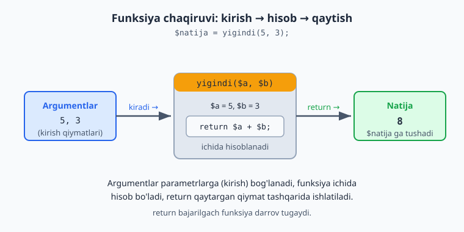

### Standart (default) qiymatli parametr

Parametrga oldindan qiymat berib qo'yish mumkin — agar chaqirganda qiymat berilmasa, shu ishlatiladi:

```php
<?php
function salomlash($ism = "mehmon") {
    echo "Salom, " . $ism;
}

salomlash("Ali");   // Salom, Ali
salomlash();        // Salom, mehmon   (qiymat berilmadi → standart ishlatildi)
```

### Funksiya ichidagi o'zgaruvchilar "tashqarida ko'rinmaydi"

Funksiya ichida yaratilgan o'zgaruvchi faqat o'sha funksiya ichida yashaydi. Tashqarida u mavjud emas:

```php
<?php
function hisobla() {
    $natija = 100;   // bu o'zgaruvchi faqat funksiya ichida
}

hisobla();
// echo $natija;   // XATO! $natija bu yerda mavjud emas
```

Bu — yaxshi narsa: har bir funksiya "o'z dunyosi"da ishlaydi, bir-biriga xalaqit bermaydi. Tashqaridan ma'lumot kerak bo'lsa — parametr orqali berasiz; natija kerak bo'lsa — `return` bilan qaytarasiz.

### Tip e'lonlari (type declarations) — funksiyani ishonchli qilish

Hozirgacha parametrlar tipsiz edi: `function yigindi($a, $b)`. Lekin PHP'da parametr va natija **tipini** ko'rsatish mumkin — bu professional standart. Funksiya qanday ma'lumot kutishini va nima qaytarishini aniq aytadi:

```php
<?php
function yigindi(int $a, int $b): int {
    return $a + $b;
}

echo yigindi(5, 3);   // 8
```

- **`int $a, int $b`** — "bu parametrlar butun son bo'lishi kerak".
- **`: int`** — "funksiya butun son qaytaradi" (qavsdan keyin, `{` dan oldin).

Asosiy tiplar: `int`, `float`, `string`, `bool`, `array`. Standart qiymat bilan birga ham ishlaydi:

```php
<?php
function chegirma(float $narx, float $foiz = 10.0): float {
    return $narx - ($narx * $foiz / 100);
}

echo chegirma(1000);   // 900
```

**`null` bo'lishi mumkin bo'lsa — `?` qo'yiladi**, qiymat qaytarmasa — `void`:

```php
<?php
function salomla(?string $ism): void {     // $ism string yoki null
    echo "Salom, " . ($ism ?? "mehmon");   // void — hech narsa qaytarmaydi
}

salomla(null);    // Salom, mehmon
salomla("Ali");   // Salom, Ali
```

### `strict_types` — qat'iy tip nazorati

Standart holatda PHP tiplarni "yumshoq" tekshiradi: `yigindi("5", 3)` da `"5"` ni avtomatik `5` ga aylantiradi. Bu xatolarni yashirishi mumkin. Buni oldini olish uchun fayl **eng boshiga** (`<?php` dan keyin, birinchi qator) shuni yozing:

```php
<?php
declare(strict_types=1);

function kvadrat(int $n): int {
    return $n * $n;
}

echo kvadrat(5);     // 25  — to'g'ri
echo kvadrat("5");   // ❌ TypeError: int kutilgan, string berildi
```

`strict_types=1` bilan PHP avtomatik aylantirmaydi — noto'g'ri tip berilsa, darrov **TypeError** beradi. Bu yaxshi: xato yashirinib qolmasdan, darrov ko'rinadi.

> **Why:** tip e'lonlari kodni **o'zini-o'zi hujjatlaydigan** va **ishonchli** qiladi. Funksiyani ko'rgan odam (yoki kelajakdagi siz) nima kutilishini darrov tushunadi, noto'g'ri ma'lumot esa yashirinmasdan xato beradi. Professional PHP kodida tiplar va `strict_types=1` — odat. Boshlanishida hamma funksiyaga tip yozishni mashq qiling.

### Mashqlar

**Oson**
1. `salom()` funksiyasini yozing — chaqirilganda "Assalomu alaykum" chiqarsin.
2. `kvadrat($son)` funksiyasini yozing — sonni o'ziga ko'paytirib **qaytarsin** (`return` bilan).
3. `kopaytir($a, $b)` funksiyasini yozing — ikki sonning ko'paytmasini qaytarsin.
4. `tanishtir($ism, $shahar)` funksiyasini yozing — "Men Ali, Toshkentdanman" shaklida chiqarsin.
5. Standart qiymatli funksiya yozing: `salomlash($ism = "do'st")`.

**O'rta**
6. `eng_katta($a, $b)` funksiyasini yozing — ikki sondan kattasini qaytarsin (`if` bilan).
7. `juftmi($son)` funksiyasini yozing — son juft bo'lsa `true`, toq bo'lsa `false` qaytarsin.
8. `salom_narx($narx)` funksiyasi: narxni olib, 12% QQS qo'shilgan yakuniy narxni qaytarsin.
9. `harf_sanash($matn)` funksiyasi: matndagi belgilar sonini qaytarsin (`strlen`dan foydalaning).
10. `chegirma($narx, $foiz)` funksiyasi: narx va chegirma foizini olib, chegirmadan keyingi narxni qaytarsin.

**Qiyin**
11. `massiv_yigindi($sonlar)` funksiyasi: son massivini parametr sifatida olib, ularning yig'indisini qaytarsin (`foreach` bilan).
12. `eng_katta_massivda($sonlar)` funksiyasi: massivdagi eng katta sonni qaytarsin.
13. `salomlash_royxat($ismlar)` funksiyasi: ismlar massivini olib, har birini "Salom, Ali" ko'rinishida chiqarsin.
14. `tubmi($son)` funksiyasi: son tub bo'lsa `true`, aks holda `false` qaytarsin (1.7'dagi tub son mantig'ini funksiyaga aylantiring).
15. Tip e'lonlari bilan: `kopaytir(int $a, int $b): int` funksiyasini yozing. Keyin `kopaytir("5", 2)` deb chaqiring va faylga `declare(strict_types=1)` qo'yib/olib, xulq farqini kuzating.
16. `formatNarx(float $narx, string $valyuta = "so'm"): string` funksiyasi: narxni `number_format` bilan formatlab, valyuta bilan qaytarsin (masalan, `1,500.00 so'm`).

<details markdown="1">
<summary>Yechim — 7</summary>

```php
<?php
function juftmi($son) {
    if ($son % 2 == 0) {
        return true;
    } else {
        return false;
    }
}

var_dump(juftmi(4));   // bool(true)
var_dump(juftmi(7));   // bool(false)
```

Aslida buni qisqaroq ham yozish mumkin, chunki `$son % 2 == 0` ning o'zi `true`/`false` qiymat beradi:
```php
<?php
function juftmi($son) {
    return $son % 2 == 0;   // to'g'ridan-to'g'ri natijani qaytaradi
}
```
Ikkala variant ham bir xil ishlaydi. Ikkinchisi tajribali dasturchilar yozadigan toza usul.
</details>

<details markdown="1">
<summary>Yechim — 11 (massiv yig'indisi funksiyada)</summary>

```php
<?php
function massiv_yigindi($sonlar) {
    $yigindi = 0;
    foreach ($sonlar as $son) {
        $yigindi += $son;
    }
    return $yigindi;
}

$mening_sonlarim = [10, 20, 30];
echo massiv_yigindi($mening_sonlarim);   // 60
```
E'tibor bering: parametr **massiv** ham bo'lishi mumkin. Funksiya massivni qabul qilib, ichidan o'tib, bitta natija qaytaradi. Bu — funksiyalarning kuchini ko'rsatadi: bir marta yozasiz, istalgan massiv bilan ishlaydi.
</details>

<details markdown="1">
<summary>Yechim — 12 (massivdagi eng katta son)</summary>

```php
<?php
function eng_katta_massivda(array $sonlar) {
    $eng_katta = $sonlar[0];          // birinchisini boshlang'ich deb olamiz
    foreach ($sonlar as $son) {
        if ($son > $eng_katta) {
            $eng_katta = $son;
        }
    }
    return $eng_katta;
}

echo eng_katta_massivda([3, 99, 12, 50]);   // 99
```
1.8'dagi "eng katta son" mantig'ini funksiyaga aylantirdik — endi uni istalgan massiv bilan chaqirish mumkin. (Albatta, tayyor `max($sonlar)` ham bor; bu yerda esa mantiqni o'zimiz yozib mashq qildik.)
</details>

<details markdown="1">
<summary>Yechim — 13 (ro'yxatni salomlash)</summary>

```php
<?php
function salomlash_royxat(array $ismlar): void {
    foreach ($ismlar as $ism) {
        echo "Salom, " . $ism . "<br>";
    }
}

salomlash_royxat(["Ali", "Vali", "Guli"]);
// Salom, Ali
// Salom, Vali
// Salom, Guli
```
Funksiya massivni oladi va har bir elementni `foreach` bilan chiqaradi. Hech narsa qaytarmagani uchun `: void`.
</details>

<details markdown="1">
<summary>Yechim — 14 (tubmi funksiyasi)</summary>

```php
<?php
function tubmi(int $son): bool {
    if ($son < 2) {
        return false;
    }
    for ($i = 2; $i * $i <= $son; $i++) {
        if ($son % $i == 0) {
            return false;     // bo'lindi → tub emas
        }
    }
    return true;              // hech narsaga bo'linmadi → tub
}

var_dump(tubmi(7));    // true
var_dump(tubmi(9));    // false
```
1.7'dagi tub son mantig'ini funksiyaga oldik. E'tibor bering: bu yerda `$tub` o'zgaruvchisi kerak emas — bo'linish topilishi bilan darrov `return false` qilamiz; sikl tugaguncha hech narsa topilmasa `return true`. Bu — funksiyada `return`ning qulayligi.
</details>

<details markdown="1">
<summary>Yechim — 15 (tip e'lonlari va strict_types)</summary>

```php
<?php
declare(strict_types=1);

function kopaytir(int $a, int $b): int {
    return $a * $b;
}

echo kopaytir(5, 2);     // 10  — to'g'ri
echo kopaytir("5", 2);   // ❌ TypeError (strict_types=1 tufayli)
```
`declare(strict_types=1)` ni o'chirsangiz, `kopaytir("5", 2)` `"5"` ni `5` ga aylantirib `10` beradi. Qat'iy rejimda esa darrov xato — bu xatolarni yashirinishdan saqlaydi. Shuning uchun professional kodda qat'iy rejim afzal.
</details>

<details markdown="1">
<summary>Yechim — 16 (formatlangan narx funksiyasi)</summary>

```php
<?php
declare(strict_types=1);

function formatNarx(float $narx, string $valyuta = "so'm"): string {
    return number_format($narx, 2) . " " . $valyuta;
}

echo formatNarx(1500);            // 1,500.00 so'm
echo "<br>";
echo formatNarx(2500.5, "USD");   // 2,500.50 USD
```
Funksiya tiplangan (`float`, `string`), standart qiymatli (`$valyuta = "so'm"`) va matn qaytaradi (`: string`). 1.5'da o'rgangan `number_format` shu yerda asqotdi.
</details>

---

<a name="110-funksional"></a>
## 1.10 Anonim funksiyalar va massiv vositalari (map / filter / reduce)

Bu — 1-QISMning eng "kuchaytiruvchi" bo'limi. Avvaliga biroz yangi tuyuladi, lekin o'zlashtirsangiz, massivlar bilan ishlash ancha qisqa va chiroyli bo'ladi. Shoshilmang, har misolni yozib ko'ring.

### Anonim (nomsiz) funksiya

Hozirgacha funksiyaga nom berardik (`function salom() {...}`). Lekin PHP'da **nomsiz** funksiya ham yaratish va uni o'zgaruvchiga saqlash mumkin:

```php
<?php
$salom = function(string $ism): string {
    return "Salom, $ism";
};

echo $salom("Ali");   // Salom, Ali
```

Funksiya endi `$salom` o'zgaruvchisida "yashaydi"; uni `$salom(...)` orqali chaqiramiz. Bu g'alati ko'rinishi mumkin, lekin foydasi pastda ochiladi: funksiyani **boshqa funksiyaga uzatish** mumkin bo'ladi.

### Arrow function (`fn`) — qisqa shakl

Funksiya bitta ifodadan iborat bo'lsa, uni `fn` bilan ancha qisqa yozish mumkin:

```php
<?php
// Bu ikkisi bir xil:
$kvadrat = function(int $n): int { return $n * $n; };
$kvadrat = fn(int $n): int => $n * $n;     // qisqa: { return ... } o'rniga => ifoda

echo $kvadrat(5);   // 25
```

`fn(parametrlar) => ifoda` — `{ }` va `return` yo'q, bitta ifoda natijasi avtomatik qaytadi. Pastdagi `array_map`/`filter` bilan ayniqsa qulay.

### Closure — tashqi o'zgaruvchini "ushlab qolish" (`use`)

Oddiy funksiya tashqaridagi o'zgaruvchini ko'rmaydi (1.9). Anonim funksiya esa `use` orqali tashqi o'zgaruvchini "ichiga olib kirishi" mumkin:

```php
<?php
$soliq = 12;

$narxHisobla = function(float $narx) use ($soliq): float {
    return $narx + ($narx * $soliq / 100);   // tashqi $soliq ishlatilyapti
};

echo $narxHisobla(1000);   // 1120
```

`use ($soliq)` — "tashqaridagi `$soliq`ni shu funksiya ichida ham ishlat". Bunday "atrofidagi o'zgaruvchini eslab qolgan" funksiya **closure** deyiladi. (Arrow `fn` esa tashqi o'zgaruvchilarni `use`siz, avtomatik ko'radi.)

### `array_map` — har bir elementni o'zgartirish

Mana endi asosiy foyda. `array_map` massivning **har bir elementiga** funksiya qo'llab, **yangi massiv** qaytaradi:

```php
<?php
$sonlar = [1, 2, 3, 4];

$kvadratlar = array_map(fn($n) => $n * $n, $sonlar);
// [1, 4, 9, 16]
```

`foreach` bilan yozsangiz 4 qator kerak edi; `array_map` bilan — bitta qator. "Har bir elementni shu funksiyadan o'tkaz" degani.

### `array_filter` — shart bo'yicha tanlash

`array_filter` faqat shartni qondiradigan elementlarni qoldiradi:

```php
<?php
$sonlar = [1, 2, 3, 4, 5, 6];

$juftlar = array_filter($sonlar, fn($n) => $n % 2 === 0);
// [2, 4, 6]
```

Funksiya `true` qaytarsa — element qoladi, `false` qaytarsa — tashlanadi.

### `array_reduce` — massivni bitta qiymatga yig'ish

`array_reduce` butun massivni **bitta natijaga** "yig'adi" (yig'indi, ko'paytma, eng katta...):

```php
<?php
$sonlar = [1, 2, 3, 4];

$yigindi = array_reduce($sonlar, fn($acc, $n) => $acc + $n, 0);
// 10
```

- `$acc` — "to'planayotgan natija" (accumulator), `0` — uning boshlang'ich qiymati.
- Har qadamda: `$acc = $acc + $n`. Oxirida `$acc` — yakuniy yig'indi.

> **map / filter / reduce — uchta asosiy fikr:** `map` — *o'zgartir* (har birini), `filter` — *tanla* (shartga mos), `reduce` — *yig'* (bitta qiymatga). Bularning hammasini `foreach` bilan yozsa bo'ladi, lekin bu uchtasi — qisqaroq, niyatni aniqroq ko'rsatadi va kamroq xato. Ular zamonaviy kodda (va boshqa tillarda — JS, Python) hamma joyda uchraydi.

Quyidagi sxema uchalasi massivni qanday o'zgartirishini yonma-yon ko'rsatadi.


### `usort` — o'z qoidang bilan saralash

1.8'dagi `sort` oddiy saralardi. Lekin "narx bo'yicha", "ism uzunligi bo'yicha" kabi **o'z qoidangiz** bilan saralash uchun `usort` ishlatiladi — unga "ikkitasini qanday solishtirish" funksiyasini berasiz:

```php
<?php
$mahsulotlar = [
    ["nom" => "A", "narx" => 300],
    ["nom" => "B", "narx" => 100],
    ["nom" => "C", "narx" => 200],
];

// Narx bo'yicha o'sish tartibida:
usort($mahsulotlar, fn($a, $b) => $a["narx"] <=> $b["narx"]);
// endi tartib: B(100), C(200), A(300)
```

**`<=>`** — "kosmik kema" (spaceship) operatori: `$a <=> $b` chapi kichik bo'lsa `-1`, teng bo'lsa `0`, katta bo'lsa `1` qaytaradi — aynan `usort` kutadigan narsa. Kamayish tartibi uchun `$b["narx"] <=> $a["narx"]` (joyini almashtiring).

### Mashqlar

**Oson**
1. Anonim funksiyani o'zgaruvchiga saqlang (`$kvadrat`) va uni chaqiring.
2. Shu funksiyani `fn` (arrow) ko'rinishida qayta yozing.
3. `array_map` bilan `[1,2,3,4,5]` har bir elementini 10 ga ko'paytiring.
4. `array_filter` bilan `[5, 12, 8, 20, 3]` dan 10 dan kattalarini tanlang.

**O'rta**
5. Closure: tashqi `$boshlangich` o'zgaruvchisini `use` bilan olgan funksiya yozing.
6. `array_map` bilan ismlar massivining har birini `strtoupper` bilan katta harfga aylantiring.
7. `array_reduce` bilan `[10, 20, 30, 40]` yig'indisini hisoblang.
8. `array_filter` + `count` bilan massivda nechta juft son borligini toping.

**Qiyin**
9. `usort` bilan talabalar massivini (`["ism"=>..., "ball"=>...]`) ball bo'yicha **kamayish** tartibida saralang.
10. Bitta zanjirda: sonlar massividan avval juftlarini `array_filter` bilan oling, keyin `array_map` bilan kvadratga aylantiring, oxirida `array_reduce` (yoki `array_sum`) bilan yig'indisini toping.
11. `array_map` ni ikkita massiv bilan ishlating: narxlar va sonlar massivlaridan har bir mahsulotning jami narxini (`narx * soni`) hisoblang.

<details markdown="1">
<summary>Yechim — 9 (usort bilan ball bo'yicha saralash)</summary>

```php
<?php
$talabalar = [
    ["ism" => "Ali",  "ball" => 85],
    ["ism" => "Vali", "ball" => 72],
    ["ism" => "Guli", "ball" => 95],
];

// Kamayish: kattadan kichikka — $b ni $a dan oldin qo'yamiz
usort($talabalar, fn($a, $b) => $b["ball"] <=> $a["ball"]);

foreach ($talabalar as $t) {
    echo $t["ism"] . " - " . $t["ball"] . "<br>";
}
// Guli - 95
// Ali - 85
// Vali - 72
```
`<=>` solishtiradi; `$b <=> $a` (teskari tartibda) kamayishni beradi. O'sish kerak bo'lsa `$a <=> $b`.
</details>

<details markdown="1">
<summary>Yechim — 10 (filter → map → reduce zanjiri)</summary>

```php
<?php
$sonlar = [1, 2, 3, 4, 5, 6];

$juftlar   = array_filter($sonlar, fn($n) => $n % 2 === 0);   // [2, 4, 6]
$kvadratlar = array_map(fn($n) => $n * $n, $juftlar);          // [4, 16, 36]
$yigindi   = array_sum($kvadratlar);                          // 56

echo $yigindi;   // 56
```
Bu — "ma'lumot quvuri" (pipeline): tanla → o'zgartir → yig'. Har bosqich oldingisining natijasi ustida ishlaydi. Bunday zanjir real kodda juda ko'p uchraydi.
</details>

<details markdown="1">
<summary>Yechim — 11 (ikki massivli array_map)</summary>

```php
<?php
$narxlar = [1000, 2000, 500];
$sonlar  = [2, 1, 4];

// array_map bir nechta massivni parallel oladi:
$jami = array_map(fn($narx, $soni) => $narx * $soni, $narxlar, $sonlar);
// [2000, 2000, 2000]

echo array_sum($jami);   // 6000
```
`array_map` ikkita massivni "parallel" yuradi: birinchi narx × birinchi soni, ikkinchi × ikkinchi... Funksiya ikki parametr (`$narx, $soni`) oladi.
</details>

---

> **1-QISM yakunlandi.** Tabriklaymiz! Endi siz: o'zgaruvchilar, ma'lumot turlari, amallar, matn, shartlar (`if`, `switch`, `match`, ternary, `??`), sikllar, massivlar (va `map`/`filter`/`reduce`) hamda funksiyalar (tip e'lonlari bilan) bilan ishlay olasiz. Bu — har qanday dasturning poydevori. Bularni mustahkam o'zlashtirsangiz, oddiy lekin haqiqiy dasturlar (kalkulyator, baholar hisoblagichi, ro'yxat boshqaruvi) yoza olasiz.
>
> Keyingi qism — **OOP (Obyektga yo'naltirilgan dasturlash):** kodni yanada chiroyli va katta loyihalarga mos tarzda tashkil qilish usuli. Undan keyin — **ma'lumotlar bazasi** (ma'lumotni doimiy saqlash) va boshqa ilg'or mavzular, har biri shu — soddadan murakkabga, batafsil tushuntirish bilan.

---

<a name="21-class"></a>
# 2-QISM — OOP (Obyektga Yo'naltirilgan Dasturlash)

## 2.1 Class va obyekt — eng asosiy tushuncha

Bu qism — yangi fikrlash usuli. Avvaliga g'alati tuyulishi mumkin, lekin sekin-asta, ko'p misol bilan tushuntiraman. Shoshilmang.

### Muammo: ma'lumot va amallar alohida

1-QISMda **ma'lumot** (o'zgaruvchilar) va **amallar** (funksiyalar) alohida edi. Kichik dasturda bu yetarli. Lekin dastur kattalashganda, bir-biriga bog'liq narsalar tarqalib ketadi.

Masalan, bir mashinani tasvirlamoqchimiz. Uning **ma'lumotlari** bor: rangi, tezligi. Va **amallari** bor: yurish, to'xtash. Procedural usulda bularning hammasi alohida o'zgaruvchi va funksiyalarda sochilib yotadi. Agar 10 ta mashina bo'lsa — chalkashlik kuchayadi.

**OOP yechimi:** bir-biriga tegishli ma'lumot va amallarni **bitta birlikka** jamlaymiz. Bu birlik — **obyekt** deyiladi.

### Class va obyekt — qolip va undan yasalgan narsa

Ikki muhim so'z:

- **Class (klass)** — bu **qolip**, **andoza**, **chizma**. U "mashina qanday bo'lishi kerakligini" tasvirlaydi: har bir mashinada rang bo'ladi, tezlik bo'ladi, yura oladi, to'xtaydi. Lekin class — bu hali mashina emas, faqat uning "chizmasi".

- **Obyekt (object)** — bu chizmadan **yasalgan haqiqiy narsa**. Bitta chizmadan (class) ko'p mashina (obyekt) yasash mumkin: qizil Cobalt, oq Malibu — har biri alohida obyekt, lekin hammasi bir xil chizma asosida.

Yana bir misol: **quvur (cookie cutter) va pechenye.** Quvur — class (bitta shakl beradi). Undan yasagan har bir pechenye — obyekt. Pechenyelar bir xil shaklda, lekin alohida-alohida.

### Birinchi class

Keling, mashina classini yozamiz:

```php
<?php
class Mashina {
    // Xususiyatlar (ma'lumotlar) — har bir mashinada nima bor
    public $rang;
    public $tezlik;

    // Metodlar (amallar) — mashina nima qila oladi
    public function yur() {
        echo "Mashina yuryapti";
    }

    public function toxta() {
        echo "Mashina to'xtadi";
    }
}
```

Tushuntiramiz:
- **`class Mashina { ... }`** — "Mashina degan class yarataman". Class nomi odatda **bosh harf** bilan boshlanadi (`Mashina`, `Talaba`) — bu qabul qilingan qoida.
- **`public $rang;` va `public $tezlik;`** — bular **xususiyatlar** (properties). Ya'ni "har bir mashinada rang va tezlik bo'ladi". Xususiyat — bu class ichidagi o'zgaruvchi. (`public` so'zini hozircha shunchaki yozavering — uni 2.3'da tushuntiramiz.)
- **`public function yur() { ... }`** — bu **metod** (method). Metod — bu class ichidagi funksiya. "Mashina yura oladi" degan amalni bildiradi.

> **Eslab qoling:** class ichidagi o'zgaruvchi — **xususiyat** (property), class ichidagi funksiya — **metod** (method). Bu — yangi atamalar, lekin aslida tanish narsalar (o'zgaruvchi va funksiya), faqat class ichida.

### Classdan obyekt yaratish

Class — faqat chizma. Undan haqiqiy obyekt yaratish uchun `new` so'zi ishlatiladi:

```php
<?php
class Mashina {
    public $rang;
    public $tezlik;

    public function yur() {
        echo "Mashina yuryapti";
    }
}

// Obyekt yaratamiz (chizmadan haqiqiy mashina):
$mashina1 = new Mashina();

// Xususiyatlariga qiymat beramiz:
$mashina1->rang = "qizil";
$mashina1->tezlik = 120;

// Xususiyatlarini o'qiymiz:
echo $mashina1->rang;     // qizil
echo "<br>";
echo $mashina1->tezlik;   // 120

// Metodini chaqiramiz:
$mashina1->yur();         // Mashina yuryapti
```

Diqqat qiling:
- **`$mashina1 = new Mashina();`** — `new` so'zi bilan classdan obyekt yaratiladi va `$mashina1`ga saqlanadi.
- **`->`** (o'q belgisi) — obyektning xususiyati yoki metodiga murojaat qilish uchun. `$mashina1->rang` — "mashina1ning rangi". `$mashina1->yur()` — "mashina1ning yur metodini chaqir".

> **Yangi belgi: `->`**. Massivda `$massiv["kalit"]` (kvadrat qavs) ishlatardik. Obyektda esa `$obyekt->xususiyat` (o'q belgisi) ishlatamiz. Ikkisini aralashtirmang: massiv → `[ ]`, obyekt → `->`.

### Ko'p obyekt — bir class

Eng muhim tushuncha shu: bitta classdan **ko'p, bir-biridan mustaqil obyekt** yaratish mumkin:

```php
<?php
class Mashina {
    public $rang;
}

$mashina1 = new Mashina();
$mashina1->rang = "qizil";

$mashina2 = new Mashina();
$mashina2->rang = "ko'k";

echo $mashina1->rang;   // qizil
echo "<br>";
echo $mashina2->rang;   // ko'k
```

`$mashina1` va `$mashina2` — ikki **alohida** obyekt. Biri qizil, biri ko'k. Bittasini o'zgartirsangiz, ikkinchisiga ta'sir qilmaydi. Xuddi bir chizmadan yasalgan ikki mashina kabi.

Quyidagi diagramma class (qolip) dan `new` bilan ko'p mustaqil obyekt yaratilishini va metod ichidagi `$this` har bir obyektga qanday ishora qilishini ko'rsatadi:


### `$this` — "o'zim" degani

Metod ichida, ayni shu obyektning xususiyatiga murojaat qilish kerak bo'ladi. Buning uchun **`$this`** so'zi ishlatiladi. `$this` — "shu obyektning o'zi" degani:

```php
<?php
class Mashina {
    public $rang;

    public function rangniAyt() {
        // $this->rang — "shu obyektning rangi"
        echo "Mashina rangi: " . $this->rang;
    }
}

$m = new Mashina();
$m->rang = "qizil";
$m->rangniAyt();   // Mashina rangi: qizil
```

`rangniAyt` metodi `$this->rang` orqali **o'zining** rangiga murojaat qiladi. Agar boshqa obyektda chaqirsangiz, `$this` o'sha obyektga ishora qiladi. Ya'ni `$this` har doim "metod chaqirilgan obyekt"ni bildiradi.

> `$this` faqat metod **ichida** ishlatiladi. Tashqarida `$mashina1->rang` deysiz; metod ichida `$this->rang` deysiz. Ikkalasi ham "shu obyektning rangi" — faqat qaysi joydan murojaat qilishingizga qarab farq qiladi.

### Mashqlar

**Oson**
1. `Mashina` classini yarating (xususiyat: `rang`, `tezlik`). Bitta obyekt yarating va xususiyatlarini chiqaring.
2. `Mashina`ga `yur()` metodini qo'shing va uni obyekt orqali chaqiring.
3. Ikkita mashina obyekti yarating, har biriga boshqa rang bering va ikkalasini chiqaring.
4. `Talaba` classini yarating (xususiyat: `ism`, `yosh`). Obyekt yarating, qiymat bering, chiqaring.
5. `Itoat` — yo'q, oddiyroq: `It` classini yarating (xususiyat: `nomi`), `huradi()` metodi "Vov-vov!" chiqarsin.

**O'rta**
6. `Talaba` classiga `malumot()` metodini qo'shing — `$this` orqali ism va yoshni "Ali, 19 yosh" ko'rinishida chiqarsin.
7. `Mahsulot` classini yarating (xususiyat: `nom`, `narx`). Uchta mahsulot obyekti yarating va har birining ma'lumotini chiqaring.
8. `Hisob` (bank hisobi) classini yarating (xususiyat: `balans`). `korsat()` metodi balansni chiqarsin.
9. `Aylana` classini yarating (xususiyat: `radius`). `yuza()` metodi yuzani hisoblab qaytarsin (`3.14 * radius * radius`).

**Qiyin**
10. `Talaba` classiga `ball` xususiyatini va `otdimi()` metodini qo'shing — ball 60 dan katta yoki teng bo'lsa "O'tdi", aks holda "Yiqildi" qaytarsin (`$this->ball` va `if` bilan).
11. `Mashina`ga `tezlik` xususiyati va `tezlash($qiymat)` metodini qo'shing — metod tezlikni berilgan qiymatga oshirsin (`$this->tezlik += $qiymat`).
12. `Hisob` classiga `pulQoshish($summa)` va `pulYechish($summa)` metodlarini qo'shing — balansni mos ravishda oshirib/kamaytirsin.

<details markdown="1">
<summary>Yechim — 6</summary>

```php
<?php
class Talaba {
    public $ism;
    public $yosh;

    public function malumot() {
        echo $this->ism . ", " . $this->yosh . " yosh";
    }
}

$t = new Talaba();
$t->ism = "Ali";
$t->yosh = 19;
$t->malumot();   // Ali, 19 yosh
```
`malumot()` metodi `$this->ism` va `$this->yosh` orqali **o'z** obyektining ma'lumotlariga murojaat qiladi.
</details>

<details markdown="1">
<summary>Yechim — 10 (Talaba: ball va otdimi)</summary>

```php
<?php
class Talaba {
    public $ism;
    public $ball;

    public function otdimi() {
        if ($this->ball >= 60) {
            return "O'tdi";
        } else {
            return "Yiqildi";
        }
    }
}

$t = new Talaba();
$t->ism = "Ali";
$t->ball = 75;
echo $t->ism . ": " . $t->otdimi();   // Ali: O'tdi
```
`otdimi()` metodi `$this->ball` orqali **o'z** obyektining balliga qarab qaror qiladi. (Shartni `return $this->ball >= 60 ? "O'tdi" : "Yiqildi";` deb qisqaroq ham yozsa bo'ladi — 1.6'dagi ternary.)
</details>

<details markdown="1">
<summary>Yechim — 11 (Mashina: tezlash)</summary>

```php
<?php
class Mashina {
    public $tezlik = 0;   // boshlang'ich tezlik

    public function tezlash($qiymat) {
        $this->tezlik += $qiymat;   // joriy tezlikka qo'shamiz
    }
}

$m = new Mashina();
$m->tezlash(50);
$m->tezlash(30);
echo $m->tezlik;   // 80
```
Metod `$this->tezlik` ni o'zgartiradi — har chaqiruvda tezlik to'planib boradi. Obyektning holati (tezligi) metodlar orqali o'zgaradi: OOP'ning asosiy g'oyasi.
</details>

<details markdown="1">
<summary>Yechim — 12 (bank hisobi)</summary>

```php
<?php
class Hisob {
    public $balans = 0;   // boshlang'ich balans 0

    public function pulQoshish($summa) {
        $this->balans += $summa;
    }

    public function pulYechish($summa) {
        $this->balans -= $summa;
    }

    public function korsat() {
        echo "Balans: " . $this->balans . " so'm";
    }
}

$hisob = new Hisob();
$hisob->pulQoshish(100000);
$hisob->pulYechish(30000);
$hisob->korsat();   // Balans: 70000 so'm
```
E'tibor bering: bu yerda ma'lumot (`balans`) va u bilan ishlaydigan amallar (`pulQoshish`, `pulYechish`) **bitta joyda** — class ichida. Bu OOP'ning asosiy g'oyasi. Keyingi bo'limda (2.3) buni yanada xavfsizroq qilishni o'rganamiz.
</details>

---

<a name="22-konstruktor"></a>
## 2.2 Konstruktor

Oldingi bo'limda obyekt yaratib, keyin xususiyatlariga alohida qiymat berardik:

```php
<?php
$t = new Talaba();
$t->ism = "Ali";        // bir qator
$t->yosh = 19;          // yana bir qator
```

Bu uzun va noqulay. Agar har bir talabani yaratganda 5 ta xususiyatga qiymat berish kerak bo'lsa-chi? **Konstruktor** ana shuni hal qiladi: obyekt yaratilayotgan paytdayoq xususiyatlarni to'ldiradi.

### Konstruktor nima?

**Konstruktor — obyekt `new` bilan yaratilganda avtomatik ishga tushadigan maxsus metod.** Uning vazifasi — obyektni "boshlang'ich holatga keltirish" (xususiyatlarni to'ldirish). U `__construct` deb nomlanadi (boshida ikkita pastki chiziq):

```php
<?php
class Talaba {
    public $ism;
    public $yosh;

    // Konstruktor — obyekt yaratilganda avtomatik chaqiriladi
    public function __construct($ism, $yosh) {
        $this->ism = $ism;     // kelgan qiymatni xususiyatga saqlaymiz
        $this->yosh = $yosh;
    }
}

// Endi obyekt yaratganda darrov qiymat beramiz:
$t = new Talaba("Ali", 19);

echo $t->ism;    // Ali
echo "<br>";
echo $t->yosh;   // 19
```

Nima sodir bo'ldi:
- `new Talaba("Ali", 19)` deganimizda, `__construct` avtomatik ishga tushdi va `"Ali"`, `19` qiymatlarini qabul qildi.
- Konstruktor ichida `$this->ism = $ism` — kelgan qiymatni obyektning xususiyatiga saqladi.
- Natijada obyekt yaratilishi bilan to'liq tayyor bo'ldi — alohida qatorlar shart emas.

> **`$this->ism = $ism` chalkash tuyulishi mumkin.** Bu yerda ikki xil narsa bor:
> - `$this->ism` — obyektning **xususiyati** (class ichida e'lon qilingan).
> - `$ism` — konstruktorga **kelgan parametr** (tashqaridan berilgan qiymat).
>
> Ya'ni "tashqaridan kelgan `$ism`ni, obyektning `$this->ism` xususiyatiga saqla". Ular bir xil nomda bo'lsa ham — ikki alohida narsa.

### Nima uchun foydali?

1. **Qisqalik:** bir qatorda to'liq obyekt.
2. **Kafolat:** konstruktor talab qilgan ma'lumotsiz obyekt yaratib bo'lmaydi. Yuqoridagi misolda `new Talaba()` (ism va yoshsiz) — xato beradi. Demak, har bir talabada albatta ism va yosh bo'ladi — "yarim to'ldirilgan" obyekt bo'lmaydi.

### Konstruktorda boshlang'ich amal ham bajarish mumkin

Konstruktor faqat qiymat saqlash bilan cheklanmaydi — obyekt yaratilganda kerakli har qanday tayyorgarlikni qilishi mumkin:

```php
<?php
class Hisob {
    public $egasi;
    public $balans;

    public function __construct($egasi) {
        $this->egasi = $egasi;
        $this->balans = 0;        // har bir yangi hisob 0 balans bilan ochiladi
    }
}

$h = new Hisob("Ali");
echo $h->egasi;    // Ali
echo "<br>";
echo $h->balans;   // 0
```

### Standart qiymatli parametr (konstruktorda ham)

1.9'dagi standart qiymat konstruktorda ham ishlaydi:

```php
<?php
class Talaba {
    public $ism;
    public $shahar;

    public function __construct($ism, $shahar = "Toshkent") {
        $this->ism = $ism;
        $this->shahar = $shahar;
    }
}

$t1 = new Talaba("Ali");             // shahar berilmadi → "Toshkent"
$t2 = new Talaba("Vali", "Samarqand");

echo $t1->shahar;   // Toshkent
echo "<br>";
echo $t2->shahar;   // Samarqand
```

### Mashqlar

**Oson**
1. `Talaba` classiga konstruktor qo'shing (`ism`, `yosh`). Obyektni bir qatorda yarating.
2. `Mashina` classiga konstruktor qo'shing (`rang`, `tezlik`) va obyekt yarating.
3. `Mahsulot` classi: konstruktor `nom` va `narx` olsin. Obyekt yaratib, ma'lumotini chiqaring.
4. `Kitob` classi: konstruktor `nom`, `muallif`, `yil` olsin.
5. `Hisob` classi: konstruktor `egasi` olsin, `balans` esa konstruktor ichida 0 ga o'rnatilsin.

**O'rta**
6. `Talaba` classiga konstruktor (`ism`, `ball`) va `otdimi()` metodini qo'shing (ball 60+ bo'lsa "O'tdi").
7. `Aylana` classi: konstruktor `radius` olsin, `yuza()` metodi yuzani qaytarsin.
8. `Mahsulot` classiga standart qiymatli parametr qo'shing: `valyuta = "so'm"`.
9. `Foydalanuvchi` classi: konstruktor `ism`, `email` olsin, `parol` esa standart qiymatga ega bo'lsin.
10. `Tortburchak` classi: konstruktor `eni`, `boyi` olsin; `yuza()` va `perimetr()` metodlari bo'lsin.

**Qiyin**
11. `Hisob` classi: konstruktor `egasi` va ixtiyoriy `boshlangichBalans` (standart 0) olsin. `pulQoshish`, `pulYechish`, `korsat` metodlari bo'lsin.
12. `Talaba` classi: konstruktor `ism` va bir nechta `ball`larni massiv sifatida olsin; `ortacha()` metodi o'rtacha ballni hisoblab qaytarsin.
13. `Mashina` classi: konstruktor `rang` olsin, `tezlik` 0 dan boshlansin; `tezlash()` har chaqirilganda tezlikni 10 ga oshirsin, `tormoz()` 10 ga kamaytirsin (lekin 0 dan past bo'lmasin).

<details markdown="1">
<summary>Yechim — 7</summary>

```php
<?php
class Aylana {
    public $radius;

    public function __construct($radius) {
        $this->radius = $radius;
    }

    public function yuza() {
        return 3.14 * $this->radius * $this->radius;
    }
}

$a = new Aylana(5);
echo "Yuza: " . $a->yuza();   // Yuza: 78.5
```
Konstruktor radiusni saqlaydi, `yuza()` metodi esa `$this->radius` orqali o'sha radiusdan yuzani hisoblaydi.
</details>

<details markdown="1">
<summary>Yechim — 11 (Hisob: ixtiyoriy boshlang'ich balans)</summary>

```php
<?php
class Hisob {
    public $egasi;
    public $balans;

    public function __construct($egasi, $boshlangichBalans = 0) {
        $this->egasi = $egasi;
        $this->balans = $boshlangichBalans;   // berilmasa — 0
    }

    public function pulQoshish($summa) {
        $this->balans += $summa;
    }

    public function pulYechish($summa) {
        if ($summa <= $this->balans) {
            $this->balans -= $summa;
        }
    }

    public function korsat() {
        return $this->egasi . ": " . $this->balans . " so'm";
    }
}

$h = new Hisob("Ali", 100000);   // boshlang'ich balans bilan
$h->pulQoshish(50000);
$h->pulYechish(30000);
echo $h->korsat();   // Ali: 120000 so'm

$h2 = new Hisob("Vali");         // boshlang'ich balanssiz — 0 dan
echo "<br>" . $h2->korsat();     // Vali: 0 so'm
```
`$boshlangichBalans = 0` — standart qiymatli parametr: berilsa o'shani, berilmasa 0 ni oladi. Shu tufayli `new Hisob("Ali", 100000)` ham, `new Hisob("Vali")` ham ishlaydi.
</details>

<details markdown="1">
<summary>Yechim — 12 (o'rtacha ball)</summary>

```php
<?php
class Talaba {
    public $ism;
    public $ballar;

    public function __construct($ism, $ballar) {
        $this->ism = $ism;
        $this->ballar = $ballar;   // bu — massiv
    }

    public function ortacha() {
        $yigindi = 0;
        foreach ($this->ballar as $ball) {
            $yigindi += $ball;
        }
        return $yigindi / count($this->ballar);
    }
}

$t = new Talaba("Ali", [80, 90, 70]);
echo $t->ism . " o'rtacha bali: " . $t->ortacha();   // Ali o'rtacha bali: 80
```
Bu yerda xususiyat **massiv** bo'lishi mumkinligini ko'ramiz. `ortacha()` metodi 1.8'da o'rgangan "massiv yig'indisi" mantig'ini class ichida ishlatadi.
</details>

<details markdown="1">
<summary>Yechim — 13 (Mashina: tezlash va tormoz)</summary>

```php
<?php
class Mashina {
    public $rang;
    public $tezlik = 0;   // har doim 0 dan boshlanadi

    public function __construct($rang) {
        $this->rang = $rang;
    }

    public function tezlash() {
        $this->tezlik += 10;
    }

    public function tormoz() {
        $this->tezlik -= 10;
        if ($this->tezlik < 0) {
            $this->tezlik = 0;   // manfiy bo'lib ketmasin
        }
    }
}

$m = new Mashina("qizil");
$m->tezlash();   // 10
$m->tezlash();   // 20
$m->tormoz();    // 10
echo $m->tezlik; // 10

$m->tormoz();    // 0
$m->tormoz();    // hali ham 0 (manfiy emas)
echo "<br>" . $m->tezlik;   // 0
```
`tormoz()` da `if ($this->tezlik < 0)` tekshiruvi tezlikning manfiy bo'lib ketishini oldini oladi. (Buni `$this->tezlik = max(0, $this->tezlik - 10);` deb bitta qatorda ham yozsa bo'ladi.)
</details>

---

<a name="23-visibility"></a>
## 2.3 Kirish darajalari: public va private

Hozirgacha har bir xususiyat va metod oldiga `public` yozdik, lekin nima ekanini tushuntirmadik. Endi vaqti keldi.

### Muammo: hamma narsani tashqaridan o'zgartirish mumkin

`public` xususiyatni tashqaridan **istalgancha** o'zgartirish mumkin. Bu ba'zan xavfli. Bank hisobi misolini ko'raylik:

```php
<?php
class Hisob {
    public $balans = 0;
}

$h = new Hisob();
$h->balans = -50000;   // muammo! Balansni to'g'ridan-to'g'ri manfiy qildik
```

Bu noto'g'ri — bank hisobida balans manfiy bo'lmasligi kerak (yoki faqat ma'lum qoidalar bilan). Lekin `public` bo'lgani uchun, hech qanday tekshiruvsiz, istalgan qiymat berildi. Demak, ma'lumotni **himoyalash** kerak.

### Yechim: `private` — "faqat ichkaridan"

PHP'da xususiyat va metodlarga **kirish darajasi** belgilash mumkin:

- **`public`** — "ochiq". Tashqaridan ham, ichkaridan ham murojaat qilish mumkin.
- **`private`** — "yopiq". Faqat **shu class ichidan** murojaat qilish mumkin. Tashqaridan — mumkin emas.

```php
<?php
class Hisob {
    private $balans = 0;   // endi yopiq

    public function pulQoshish($summa) {
        if ($summa > 0) {              // tekshiruv!
            $this->balans += $summa;
        }
    }

    public function balansniKorish() {
        return $this->balans;
    }
}

$h = new Hisob();
$h->pulQoshish(100000);        // to'g'ri yo'l — metod orqali
echo $h->balansniKorish();     // 100000

// $h->balans = -50000;        // XATO! balans private, tashqaridan tegib bo'lmaydi
```

Endi `balans`ga tashqaridan **to'g'ridan-to'g'ri** tegib bo'lmaydi. Uni o'zgartirishning yagona yo'li — `pulQoshish` metodi orqali, u esa **tekshiruv** qiladi (manfiy summani qabul qilmaydi). Bu — ma'lumotni himoyalash.

### Bu g'oya: "inkapsulyatsiya" (encapsulation)

Bu yondashuvning nomi bor — **inkapsulyatsiya**. Ma'nosi: ma'lumotni (xususiyatni) yopib, unga faqat nazorat ostidagi metodlar orqali ruxsat berish.

Buni dori qutisiga o'xshatish mumkin: dorini to'g'ridan-to'g'ri olib bo'lmaydi, "bolalarga qarshi" qopqoq bor — uni faqat to'g'ri usulda ochasiz. Yoki bankomat: pulga to'g'ridan-to'g'ri qo'l yetkazmaysiz, faqat tugmalar (metodlar) orqali olasiz, ular esa qoidalarni tekshiradi (balans yetarlimi va h.k.).

### Getter va setter — o'qish va yozish metodlari

Yopiq xususiyatni o'qish va yozish uchun maxsus metodlar yoziladi. Ularni odatda **getter** (o'qish) va **setter** (yozish) deb atashadi:

```php
<?php
class Talaba {
    private $ism;

    public function __construct($ism) {
        $this->ism = $ism;
    }

    // getter — qiymatni o'qish
    public function getIsm() {
        return $this->ism;
    }

    // setter — qiymatni o'zgartirish (tekshiruv bilan)
    public function setIsm($yangiIsm) {
        if (strlen($yangiIsm) > 0) {     // bo'sh ism qabul qilinmaydi
            $this->ism = $yangiIsm;
        }
    }
}

$t = new Talaba("Ali");
echo $t->getIsm();        // Ali  (o'qidik)
$t->setIsm("Vali");       // o'zgartirdik
echo $t->getIsm();        // Vali
```

Getter/setter orqali siz **nazoratni** qo'lda ushlaysiz: setter ichida tekshiruv qo'yib, noto'g'ri qiymatni rad eta olasiz.

> **Qachon `public`, qachon `private`?** Umumiy qoida: **xususiyatlarni `private` qiling**, ularga metodlar (`public`) orqali ruxsat bering. Bu ma'lumotni himoyalaydi va keyinroq qoidalarni o'zgartirishni osonlashtiradi. Metodlarning ko'pi `public` bo'ladi (chunki ular class "interfeysi" — tashqaridan ishlatiladi), lekin faqat ichki yordamchi metodlarni `private` qilish mumkin.

Quyidagi diagramma har bir kirish darajasi qayerdan ko'rinishini taqqoslaydi (`protected` bilan keyingi bo'limda — meros — tanishasiz, lekin u shu yerda umumiy manzarada ko'rsatilgan):


### Mashqlar

**Oson**
1. `Hisob` classida `balans`ni `private` qiling. `pulQoshish` metodi orqali to'ldiring va `balansniKorish` orqali o'qing.
2. Tashqaridan `private` xususiyatga to'g'ridan-to'g'ri tegishga urinib ko'ring (`$h->balans = 100;`) — xatoni ko'ring.
3. `Talaba` classida `ism`ni private qiling, `getIsm()` getterini yozing.
4. `Talaba`ga `setIsm()` setterini qo'shing va ismni o'zgartiring.
5. `Mahsulot` classida `narx`ni private qiling, getter va setter yozing.

**O'rta**
6. `Hisob`ning `pulYechish` metodini yozing — balansdan ko'p pul yechishga ruxsat bermasin (`if ($summa <= $this->balans)`).
7. `Talaba`ning `setBall` setterida ball 0-100 oralig'ida ekanini tekshiring; tashqaridagi qiymat noto'g'ri bo'lsa, qabul qilmasin.
8. `Mahsulot`ning `setNarx` setterida narx manfiy bo'lmasligini ta'minlang.
9. `Foydalanuvchi` classi: `parol` private bo'lsin; `parolniOzgartir($eski, $yangi)` metodi faqat eski parol to'g'ri bo'lsa o'zgartirsin.

**Qiyin**
10. To'liq `Hisob` classi: `balans` private, `pulQoshish` (musbat tekshiruvi bilan), `pulYechish` (yetarlilik tekshiruvi bilan), `balansniKorish`. Bir nechta amal bajarib sinab ko'ring.
11. `Mahsulot` classida `narx` va `chegirma` (foiz) private bo'lsin. `yakuniyNarx()` metodi chegirmani hisobga olib yakuniy narxni qaytarsin. `setChegirma` 0-100 oralig'ini tekshirsin.
12. `Termometr` classi: `harorat` private. `setHarorat` -50 dan +50 gacha oraliqni tekshirsin. `holat()` metodi haroratga qarab "sovuq/normal/issiq" qaytarsin.

<details markdown="1">
<summary>Yechim — 6 (xavfsiz pul yechish)</summary>

```php
<?php
class Hisob {
    private $balans = 0;

    public function pulQoshish($summa) {
        if ($summa > 0) {
            $this->balans += $summa;
        }
    }

    public function pulYechish($summa) {
        if ($summa > 0 && $summa <= $this->balans) {   // yetarli pul bormi?
            $this->balans -= $summa;
            return true;    // muvaffaqiyatli
        }
        return false;       // yechib bo'lmadi
    }

    public function balansniKorish() {
        return $this->balans;
    }
}

$h = new Hisob();
$h->pulQoshish(100000);
$h->pulYechish(150000);   // false — pul yetarli emas, balans o'zgarmaydi
echo $h->balansniKorish(); // 100000
$h->pulYechish(30000);    // true
echo "<br>" . $h->balansniKorish(); // 70000
```
Mana inkapsulyatsiyaning kuchi: `balans` himoyalangani uchun, undan ko'p pul yechib bo'lmaydi — qoida class ichida kafolatlangan.
</details>

<details markdown="1">
<summary>Yechim — 10 (to'liq, himoyalangan Hisob)</summary>

Bu — 6-mashqdagi `Hisob` class'ining to'liq ko'rinishi. Endi uni amalda sinab ko'ramiz:

```php
<?php
class Hisob {
    private $balans = 0;

    public function pulQoshish($summa) {
        if ($summa > 0) {                  // faqat musbat summa
            $this->balans += $summa;
        }
    }

    public function pulYechish($summa) {
        if ($summa > 0 && $summa <= $this->balans) {
            $this->balans -= $summa;
            return true;
        }
        return false;
    }

    public function balansniKorish() {
        return $this->balans;
    }
}

$h = new Hisob();
$h->pulQoshish(200000);
$h->pulQoshish(-5000);     // e'tiborsiz qoldiriladi (musbat emas)
$h->pulYechish(50000);     // true
$h->pulYechish(999999);    // false (yetarli emas)

echo $h->balansniKorish();   // 150000
```
`balans` `private` — unga faqat class metodlari orqali tegish mumkin. Shuning uchun "manfiy pul qo'shish" yoki "yo'q pulni yechish" kabi noto'g'ri holatlar oldindan to'siladi. Ma'lumotni himoyalashning butun maqsadi shu.
</details>

<details markdown="1">
<summary>Yechim — 11 (Mahsulot: narx va chegirma)</summary>

```php
<?php
class Mahsulot {
    private $narx;
    private $chegirma = 0;   // foizda, standart 0

    public function __construct($narx) {
        $this->narx = $narx;
    }

    public function setChegirma($foiz) {
        if ($foiz >= 0 && $foiz <= 100) {   // faqat 0-100 oralig'i
            $this->chegirma = $foiz;
        }
    }

    public function yakuniyNarx() {
        return $this->narx - ($this->narx * $this->chegirma / 100);
    }
}

$p = new Mahsulot(1000);
$p->setChegirma(25);
echo $p->yakuniyNarx();   // 750

$p->setChegirma(150);     // noto'g'ri — e'tiborsiz qoldiriladi, chegirma 25 qoladi
echo "<br>" . $p->yakuniyNarx();   // 750
```
`setChegirma` setteri chegirma 0-100 oralig'ida ekanini kafolatlaydi — noto'g'ri qiymat (150%) qabul qilinmaydi. Bu — setterning asosiy foydasi: o'zgaruvchiga noto'g'ri ma'lumot tushishini oldini oladi.
</details>

<details markdown="1">
<summary>Yechim — 12 (Termometr)</summary>

```php
<?php
class Termometr {
    private $harorat = 0;

    public function setHarorat($qiymat) {
        if ($qiymat >= -50 && $qiymat <= 50) {
            $this->harorat = $qiymat;
        }
    }

    public function holat() {
        return match(true) {
            $this->harorat < 10  => "sovuq",
            $this->harorat <= 25 => "normal",
            default              => "issiq",
        };
    }
}

$t = new Termometr();
$t->setHarorat(30);
echo $t->holat();   // issiq

$t->setHarorat(15);
echo "<br>" . $t->holat();   // normal
```
`setHarorat` qiymatni mantiqiy oraliqda (-50..+50) ushlaydi, `holat()` esa `match` bilan haroratga qarab so'z qaytaradi (1.6'dagi `match`ni eslang).
</details>

---

<a name="24-meros"></a>
## 2.4 Meros (inheritance)

### Muammo: takrorlanuvchi class'lar

Tasavvur qiling, sizda ikkita class bor: `It` va `Mushuk`. Ikkalasida ham `nom` xususiyati va `ovqatlan()` metodi bor — bir xil. Faqat ovoz chiqarishi farq qiladi (it huradi, mushuk miyovlaydi). Bir xil kodni ikki marta yozish — yomon (xato topilsa, ikki joyni tuzatasiz).

**Meros** ana shuni hal qiladi: umumiy narsalarni bitta "ota class"ga yozasiz, qolgan class'lar undan **meros olib**, faqat o'ziga xos qismni qo'shadi.

### Meros qanday ishlaydi

Bir nechta class uchun umumiy narsalarni **ota class** (parent) ga yozamiz. Boshqa class'lar undan `extends` so'zi bilan meros oladi:

```php
<?php
// Ota class — umumiy narsalar
class Hayvon {
    public $nom;

    public function __construct($nom) {
        $this->nom = $nom;
    }

    public function ovqatlan() {
        echo $this->nom . " ovqatlanyapti";
    }
}

// Bola class — Hayvondan meros oladi
class It extends Hayvon {
    public function ovoz() {
        echo $this->nom . ": Vov-vov!";
    }
}

class Mushuk extends Hayvon {
    public function ovoz() {
        echo $this->nom . ": Miyov!";
    }
}

$it = new It("Bobik");
$it->ovqatlan();   // Bobik ovqatlanyapti   ← Hayvondan meros olingan!
echo "<br>";
$it->ovoz();       // Bobik: Vov-vov!        ← It'ning o'ziniki

$mushuk = new Mushuk("Mosya");
$mushuk->ovqatlan(); // Mosya ovqatlanyapti  ← yana meros
$mushuk->ovoz();     // Mosya: Miyov!
```

Nima sodir bo'ldi:
- **`class It extends Hayvon`** — "It class'i Hayvon'dan meros oladi". `extends` — "kengaytiradi/meros oladi" degani.
- `It` o'zida `nom` va `ovqatlan()` ni yozmadi, lekin ularga **ega** — chunki `Hayvon`dan meros oldi.
- `It` faqat o'ziga xos `ovoz()` metodini qo'shdi.

Demak: **bola class ota class'dagi hamma narsaga ega bo'ladi, ustiga o'ziniki qo'shadi.** Umumiy kod bir joyda (ota class'da) — takrorlanish yo'q.

### Metodni qayta yozish (override)

Bola class ota class'dagi metodni "o'ziga moslab" qayta yozishi mumkin. Bu — **override** (qayta belgilash):

```php
<?php
class Hayvon {
    public $nom;

    public function __construct($nom) {
        $this->nom = $nom;
    }

    public function ovoz() {
        echo $this->nom . ": (umumiy ovoz)";
    }
}

class It extends Hayvon {
    // Hayvon'dagi ovoz() ni o'zgartiramiz (override)
    public function ovoz() {
        echo $this->nom . ": Vov-vov!";
    }
}

$it = new It("Bobik");
$it->ovoz();   // Bobik: Vov-vov!   ← bola class versiyasi ishladi
```

Bola class'da bir xil nomli metod yozsangiz, u ota class'nikini "ustini bosadi" — bola class obyektida bola versiyasi ishlaydi.

Quyidagi diagramma meros daraxtini ko'rsatadi: ota `Hayvon`dagi `$nom` va `ovqatlan()` bolalarga meros bo'ladi, har bir bola esa `ovoz()` ni o'ziga moslab override qiladi:

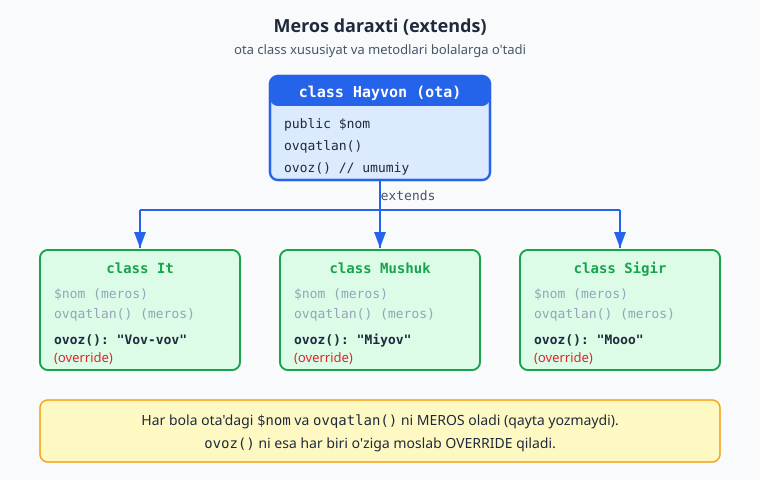

### `parent::` — ota class'ga murojaat

Ba'zan bola class ota class'ning metodini chaqirib, **ustiga** o'ziniki qo'shmoqchi bo'ladi. Buning uchun `parent::` ishlatiladi ("ota" degani):

```php
<?php
class Hayvon {
    public $nom;

    public function __construct($nom) {
        $this->nom = $nom;
    }
}

class It extends Hayvon {
    public $zot;

    public function __construct($nom, $zot) {
        parent::__construct($nom);   // ota class konstruktorini chaqiramiz
        $this->zot = $zot;           // keyin o'zimiznikini qo'shamiz
    }
}

$it = new It("Bobik", "Labrador");
echo $it->nom;   // Bobik   (ota class konstruktori to'ldirdi)
echo "<br>";
echo $it->zot;   // Labrador (bola class konstruktori to'ldirdi)
```

`parent::__construct($nom)` — "ota class'ning konstruktorini ishga tushir va `$nom`ni unga ber". Shunday qilib, ota class o'z ishini qiladi (nomni saqlaydi), bola class qolganini qo'shadi (zotni saqlaydi). Bu — takrorlamaslikning yaxshi usuli.

### Nega meros foydali?

1. **Takrorlanmaslik:** umumiy kod bir joyda.
2. **Tartib:** o'xshash narsalar bir "oila"ga birlashtiriladi (`Hayvon` → `It`, `Mushuk`).
3. **Kengaytirish:** yangi tur qo'shish oson — yangi bola class yozasiz, umumiy qismni qayta yozmaysiz.

> **Diqqat:** merosni haddan tashqari ishlatmang. U faqat haqiqiy "...bu ham bir turdagi..." munosabati bo'lganda mantiqiy: "It — bu bir Hayvon", "Yuk mashinasi — bu bir Mashina". Agar shunday munosabat bo'lmasa, meros o'rniga boshqa usul (masalan, oddiy xususiyat) to'g'riroq bo'ladi.

### Mashqlar

**Oson**
1. `Hayvon` (ota, `nom` bilan) va `It` (bola) class'larini yarating. It Hayvon'dan meros olsin.
2. `It`ga o'ziga xos `ovoz()` metodini qo'shing va ota class'dan kelgan `ovqatlan()` ni ham ishlating.
3. `Mushuk` class'ini ham `Hayvon`dan meros qildiring.
4. `Mashina` (ota) va `YukMashinasi` (bola) class'larini yarating.
5. `Foydalanuvchi` (ota) va `Admin` (bola) class'larini yarating.

**O'rta**
6. `Hayvon`dagi `ovoz()` ni `It`da override qiling (it uchun "Vov-vov").
7. `Shakl` (ota, `yuza()` umumiy) → `Kvadrat` va `Aylana` (bolalar, har biri o'z `yuza()` siga ega) — override bilan.
8. `Mashina` (ota, konstruktor `rang`) → `ElektrMashina` (bola, qo'shimcha `batareya`). `parent::__construct` ishlating.
9. `Xodim` (ota, `ism`, `maosh`) → `Menejer` (bola, qo'shimcha `bonus`). `parent::__construct` bilan.

**Qiyin**
10. `Hayvon` ota class: `nom`, `ovqatlan()`, `ovoz()` (umumiy). `It`, `Mushuk`, `Sigir` bolalar — har biri `ovoz()` ni override qilsin. Hammasini yaratib, ovozlarini chiqaring.
11. `Xodim` (ota, `maoshHisobla()` umumiy maosh qaytaradi) → `Menejer` (bola, `maoshHisobla()` ni override qilib, maosh + bonus qaytaradi; `parent::maoshHisobla()` dan foydalaning).
12. `Tolov` (ota, `summa`, `tasdiqla()`) → `NaqdTolov` va `KartaTolov` (bolalar, har biri `tasdiqla()` ni o'ziga xos qilib override qiladi).

<details markdown="1">
<summary>Yechim — 8 (parent::__construct)</summary>

```php
<?php
class Mashina {
    public $rang;

    public function __construct($rang) {
        $this->rang = $rang;
    }

    public function malumot() {
        echo "Rang: " . $this->rang;
    }
}

class ElektrMashina extends Mashina {
    public $batareya;

    public function __construct($rang, $batareya) {
        parent::__construct($rang);   // ota class rangni saqlaydi
        $this->batareya = $batareya;  // bola batareyani qo'shadi
    }

    public function malumot() {
        parent::malumot();            // ota class malumotini chiqaradi
        echo ", Batareya: " . $this->batareya . "%";  // ustiga qo'shadi
    }
}

$e = new ElektrMashina("oq", 80);
$e->malumot();   // Rang: oq, Batareya: 80%
```
Bu yerda `parent::` ni ikki joyda ishlatdik: konstruktorda (rangni saqlash) va `malumot`da (umumiy ma'lumotni chiqarish). Bola class faqat o'ziga xos qismni qo'shadi — qolgani ota class'da.
</details>

<details markdown="1">
<summary>Yechim — 10 (Hayvon va bolalari)</summary>

```php
<?php
class Hayvon {
    public $nom;

    public function __construct($nom) {
        $this->nom = $nom;
    }

    public function ovqatlan() {
        echo $this->nom . " ovqatlanyapti<br>";
    }

    public function ovoz() {
        echo "...";   // umumiy (bolalar override qiladi)
    }
}

class It extends Hayvon {
    public function ovoz() { echo "Vov-vov"; }
}
class Mushuk extends Hayvon {
    public function ovoz() { echo "Miyov"; }
}
class Sigir extends Hayvon {
    public function ovoz() { echo "Mooo"; }
}

$hayvonlar = [new It("Bobik"), new Mushuk("Pishi"), new Sigir("Zumrad")];
foreach ($hayvonlar as $h) {
    echo $h->nom . ": ";
    $h->ovoz();
    echo "<br>";
}
// Bobik: Vov-vov
// Pishi: Miyov
// Zumrad: Mooo
```
Har bir bola `ovoz()` ni o'zicha **override** qiladi (qayta yozadi). Bir massivda turli hayvonlarni saqlab, bittagina `foreach` bilan hammasini "gapirtirdik" — har biri o'z ovozini chiqaradi. Bu — polimorfizm: "bir buyruq, har xil natija".
</details>

<details markdown="1">
<summary>Yechim — 11 (maosh + bonus)</summary>

```php
<?php
class Xodim {
    protected $maosh;   // protected — pastda izoh

    public function __construct($maosh) {
        $this->maosh = $maosh;
    }

    public function maoshHisobla() {
        return $this->maosh;
    }
}

class Menejer extends Xodim {
    private $bonus;

    public function __construct($maosh, $bonus) {
        parent::__construct($maosh);
        $this->bonus = $bonus;
    }

    public function maoshHisobla() {
        return parent::maoshHisobla() + $this->bonus;   // asosiy maosh + bonus
    }
}

$x = new Xodim(5000000);
echo $x->maoshHisobla();      // 5000000

$m = new Menejer(5000000, 2000000);
echo "<br>" . $m->maoshHisobla();  // 7000000
```

> **Yangi so'z: `protected`.** Bu — `public` va `private` orasidagi uchinchi daraja. `private` faqat shu class ichida ishlaydi; `protected` esa shu class **va undan meros olgan bola class'lar** ichida ishlaydi (lekin tashqaridan emas). Bu yerda `$maosh` ni `protected` qildik, shunda `Menejer` (bola) unga murojaat qila olsin. Agar `private` bo'lsa, bola class undan foydalana olmasdi.
</details>

<details markdown="1">
<summary>Yechim — 12 (Tolov turlari)</summary>

```php
<?php
class Tolov {
    protected $summa;

    public function __construct($summa) {
        $this->summa = $summa;
    }

    public function tasdiqla() {
        echo "To'lov: " . $this->summa . " so'm";
    }
}

class NaqdTolov extends Tolov {
    public function tasdiqla() {
        echo "Naqd: " . $this->summa . " so'm qabul qilindi";
    }
}

class KartaTolov extends Tolov {
    public function tasdiqla() {
        echo "Karta: " . $this->summa . " so'm yechildi";
    }
}

(new NaqdTolov(5000))->tasdiqla();    // Naqd: 5000 so'm qabul qilindi
echo "<br>";
(new KartaTolov(12000))->tasdiqla();  // Karta: 12000 so'm yechildi
```
Ota `Tolov` `summa`ni saqlaydi va umumiy `tasdiqla()` beradi; har bir bola uni o'z usulida override qiladi. (Keyingi bo'limda — interfeys — bu g'oyani yanada qat'iyroq ko'rinishda ko'ramiz.)
</details>

---

<a name="25-abstrakt"></a>
## 2.5 Abstrakt class'lar

Bu va keyingi bo'lim (interfeys) — biroz mavhumroq tushunchalar. Sabrli bo'ling: misollar bilan oydinlashadi.

### Muammo

`Shakl` degan class bo'lsin. Har bir shaklning yuzasi bor (`yuza()`). Lekin "umuman shakl"ning yuzasini hisoblab bo'lmaydi — yuza shaklga bog'liq: kvadratniki bir xil formula, aylananiki boshqa. Ya'ni:
- "Har bir shaklda yuza **bo'lishi shart**" — buni ayta olamiz.
- Lekin "umumiy shakl yuzasi" — ma'noga ega emas. Faqat aniq shakl (kvadrat, aylana) yuzasini hisoblay olamiz.
- Va "umuman shakl" obyektini yaratish ham mantiqsiz — "qanaqa shakl?" degan savol qoladi.

**Abstrakt class** ana shuni ifodalaydi: u "tugallanmagan andoza" — qoidalarni belgilaydi, lekin to'liq emas; undan to'g'ridan-to'g'ri obyekt yaratib bo'lmaydi.

### Abstrakt class

`abstract` so'zi bilan e'lon qilinadi. Ichida **abstrakt metod** bo'lishi mumkin — bu metodning faqat nomi e'lon qilinadi, ichi (kodi) yozilmaydi. Ichini meros oluvchi bola class to'ldirishi **shart**:

```php
<?php
abstract class Shakl {
    // Abstrakt metod — faqat e'lon, ichi yo'q.
    // "Har bir shaklda yuza() bo'lishi SHART" degani.
    abstract public function yuza();

    // Oddiy metod ham bo'lishi mumkin (umumiy, ichi bor)
    public function tasvirla() {
        echo "Bu shaklning yuzasi: " . $this->yuza();
    }
}

class Kvadrat extends Shakl {
    private $tomon;

    public function __construct($tomon) {
        $this->tomon = $tomon;
    }

    // Abstrakt metodni TO'LDIRISH shart:
    public function yuza() {
        return $this->tomon * $this->tomon;
    }
}

class Aylana extends Shakl {
    private $radius;

    public function __construct($radius) {
        $this->radius = $radius;
    }

    public function yuza() {
        return 3.14 * $this->radius * $this->radius;
    }
}

$k = new Kvadrat(5);
$k->tasvirla();   // Bu shaklning yuzasi: 25

$a = new Aylana(3);
$a->tasvirla();   // Bu shaklning yuzasi: 28.26

// $s = new Shakl();   // XATO! Abstrakt class'dan obyekt yaratib bo'lmaydi
```

Nima sodir bo'ldi:
- **`abstract class Shakl`** — bu "to'liq bo'lmagan" class. Undan to'g'ridan-to'g'ri obyekt (`new Shakl()`) yaratib bo'lmaydi.
- **`abstract public function yuza();`** — abstrakt metod. Faqat nomi bor, `{ }` ichi yo'q (oxirida `;` bilan tugaydi). Bu "qoida": "mendan meros oladigan har bir class `yuza()` metodini **albatta** yozishi kerak".
- `Kvadrat` va `Aylana` — `Shakl`dan meros oladi va `yuza()` ni **o'ziga moslab** to'ldiradi.
- `tasvirla()` — umumiy metod, ota class'da to'liq yozilgan, hamma bolalar uni meros oladi.

### Nega foydali?

Abstrakt class **majburlaydi**: "mendan meros olsang, `yuza()` ni yozishing shart". Agar bola class `yuza()` ni yozmasa — PHP xato beradi. Bu — "esdan chiqib qolishi"ning oldini oladi. Demak abstrakt class umumiy qoidalarni o'rnatadi va bola class'larni to'ldirilishga majbur qiladi.

> **Oddiy class va abstrakt class farqi:** oddiy class'dan obyekt yaratish mumkin va u to'liq. Abstrakt class — "yarim tayyor andoza", undan obyekt yaratib bo'lmaydi, u faqat meros olish uchun mavjud va bola class'larni biror metodni yozishga majbur qiladi.

### Mashqlar

**Oson**
1. `Shakl` abstrakt class'ini yarating (abstrakt `yuza()` metodi bilan). Undan obyekt yaratishga urinib ko'ring — xatoni ko'ring.
2. `Kvadrat` class'ini `Shakl`dan meros qildiring va `yuza()` ni to'ldiring.
3. `Aylana` class'ini ham yarating va `yuza()` ni to'ldiring.
4. Abstrakt class'ga oddiy (ichi bor) metod ham qo'shing va bola class'da ishlating.
5. `Hayvon` abstrakt class'i (abstrakt `ovoz()` bilan) → `It` va `Mushuk` uni to'ldirsin.

**O'rta**
6. `Shakl` abstrakt class'iga `tasvirla()` umumiy metodini qo'shing (yuzani chiqaradi). `Kvadrat`, `Aylana`, `Tortburchak` bola class'larini yarating.
7. `Tolov` abstrakt class'i (abstrakt `tasdiqla()` bilan) → `NaqdTolov`, `KartaTolov` har biri o'z tasdiqlashini yozsin.
8. `Xodim` abstrakt class'i (abstrakt `maoshHisobla()`, oddiy `malumot()`) → `Soatbay` va `Oylikli` xodimlar har xil maosh hisoblasin.
9. Bola class abstrakt metodni yozmasa nima bo'lishini sinab ko'ring (xatoni o'qing va tushuning).

**Qiyin**
10. To'liq shakllar tizimi: `Shakl` abstrakt (`yuza()`, `perimetr()` abstrakt; `hisobot()` umumiy — ikkalasini chiqaradi). `Kvadrat`, `Togriburchak`, `Aylana` bolalarini yarating. Bir nechta shakl yaratib, hisobotini chiqaring.
11. `Transport` abstrakt class'i (`tezlik()` abstrakt) → `Mashina`, `Velosiped`, `Samolyot` — har biri o'z taxminiy tezligini qaytarsin. Massiv ichida har xil transportni saqlab, hammasining tezligini `foreach` bilan chiqaring.

<details markdown="1">
<summary>Yechim — 8 (turli xodim turlari)</summary>

```php
<?php
abstract class Xodim {
    protected $ism;

    public function __construct($ism) {
        $this->ism = $ism;
    }

    // Har bir xodim turi maoshni o'zicha hisoblaydi:
    abstract public function maoshHisobla();

    // Umumiy metod:
    public function malumot() {
        echo $this->ism . " maoshi: " . $this->maoshHisobla() . " so'm";
    }
}

class Oylikli extends Xodim {
    private $oylik;

    public function __construct($ism, $oylik) {
        parent::__construct($ism);
        $this->oylik = $oylik;
    }

    public function maoshHisobla() {
        return $this->oylik;   // oddiy: belgilangan oylik
    }
}

class Soatbay extends Xodim {
    private $soatlar;
    private $stavka;

    public function __construct($ism, $soatlar, $stavka) {
        parent::__construct($ism);
        $this->soatlar = $soatlar;
        $this->stavka = $stavka;
    }

    public function maoshHisobla() {
        return $this->soatlar * $this->stavka;   // soat × stavka
    }
}

$a = new Oylikli("Ali", 6000000);
$a->malumot();   // Ali maoshi: 6000000 so'm

$v = new Soatbay("Vali", 160, 50000);
echo "<br>";
$v->malumot();   // Vali maoshi: 8000000 so'm
```
`malumot()` umumiy (ota class'da), lekin u `maoshHisobla()` ni chaqiradi — har bir bola class uni o'zicha hisoblaydi. Bu — abstrakt class'ning kuchi: umumiy mantiq bir joyda, o'ziga xos qism bolalarda.
</details>

<details markdown="1">
<summary>Yechim — 10 (to'liq shakllar tizimi)</summary>

```php
<?php
abstract class Shakl {
    abstract public function yuza();
    abstract public function perimetr();

    // Umumiy metod — ikkalasini chiqaradi:
    public function hisobot() {
        echo "Yuza: " . $this->yuza() . ", Perimetr: " . $this->perimetr() . "<br>";
    }
}

class Kvadrat extends Shakl {
    private $tomon;
    public function __construct($tomon) { $this->tomon = $tomon; }
    public function yuza()     { return $this->tomon * $this->tomon; }
    public function perimetr() { return $this->tomon * 4; }
}

class Togriburchak extends Shakl {
    private $eni;
    private $boyi;
    public function __construct($eni, $boyi) {
        $this->eni = $eni;
        $this->boyi = $boyi;
    }
    public function yuza()     { return $this->eni * $this->boyi; }
    public function perimetr() { return 2 * ($this->eni + $this->boyi); }
}

$shakllar = [new Kvadrat(5), new Togriburchak(4, 6)];
foreach ($shakllar as $shakl) {
    $shakl->hisobot();
}
// Yuza: 25, Perimetr: 20
// Yuza: 24, Perimetr: 20
```
`yuza()` va `perimetr()` abstrakt (har shakl o'zicha hisoblaydi), `hisobot()` esa umumiy — u ikkalasini chaqiradi. Bir massivda turli shakllarni saqlab, bittagina sikl bilan hammasining hisobotini chiqardik.
</details>

<details markdown="1">
<summary>Yechim — 11 (Transport tezligi)</summary>

```php
<?php
abstract class Transport {
    abstract public function tezlik();   // har transport o'zicha
}

class Mashina extends Transport {
    public function tezlik() { return 120; }
}
class Velosiped extends Transport {
    public function tezlik() { return 25; }
}
class Samolyot extends Transport {
    public function tezlik() { return 900; }
}

$transportlar = [new Mashina(), new Velosiped(), new Samolyot()];
foreach ($transportlar as $t) {
    echo get_class($t) . ": " . $t->tezlik() . " km/soat<br>";
}
// Mashina: 120 km/soat
// Velosiped: 25 km/soat
// Samolyot: 900 km/soat
```
`get_class($t)` obyektning class nomini qaytaradi. Abstrakt `Transport` "har bir transportda `tezlik()` bo'lishi shart" deb majburlaydi — har biri o'z qiymatini beradi.
</details>

---

<a name="26-interfeys"></a>
## 2.6 Interfeys (interface)

Interfeys — abstrakt class'ga o'xshash, lekin yanada "qat'iy" tushuncha. Keling, farqini tushunamiz.

### Interfeys — "shartnoma"

**Interfeys — bu shartnoma (ro'yxat):** "agar bu interfeysni qabul qilsang, ushbu metodlarni **albatta** yozishing kerak". Interfeys faqat metod **nomlari**ni belgilaydi — ichi (kodi) umuman bo'lmaydi. U "nima qilinishi kerakligini" aytadi, "qanday qilinishini" emas.

Buni elektr rozetkasiga o'xshatish mumkin: rozetka — "shartnoma". Unga ulanmoqchi bo'lgan har qanday qurilma (changyutgich, telefon zaryadlovchisi, choynak) bir xil vilka shakliga ega bo'lishi kerak. Qurilma ichida nima borligi muhim emas — faqat vilka mos kelsa, ulanadi.

```php
<?php
// Interfeys — "shartnoma". interface so'zi bilan, metodlar faqat nomlari bilan.
interface Tolov {
    public function tasdiqla($summa);
    public function bekorQil();
}

// "implements" — "men bu shartnomani bajaraman" degani
class NaqdTolov implements Tolov {
    public function tasdiqla($summa) {
        echo "Naqd to'lov tasdiqlandi: " . $summa . " so'm";
    }

    public function bekorQil() {
        echo "Naqd to'lov bekor qilindi";
    }
}

class KartaTolov implements Tolov {
    public function tasdiqla($summa) {
        echo "Kartadan yechildi: " . $summa . " so'm";
    }

    public function bekorQil() {
        echo "Kartaga qaytarildi";
    }
}

$t1 = new NaqdTolov();
$t1->tasdiqla(50000);   // Naqd to'lov tasdiqlandi: 50000 so'm

$t2 = new KartaTolov();
$t2->tasdiqla(50000);   // Kartadan yechildi: 50000 so'm
```

Tushuntiramiz:
- **`interface Tolov { ... }`** — interfeys e'lon qilinadi. Ichida metodlarning faqat nomlari bor (ichi yo'q, `;` bilan tugaydi).
- **`class NaqdTolov implements Tolov`** — "NaqdTolov class'i Tolov shartnomasini bajaradi". `implements` — "amalga oshiradi/bajaradi" degani.
- Shartnomani qabul qilgan class **barcha** metodlarni yozishi shart. Agar `bekorQil()` ni yozmasangiz — PHP xato beradi.

### Nega foydali? Almashtirib bo'ladigan qismlar

Interfeysning eng katta foydasi: bir xil shartnomaga ega obyektlarni **bir-biriga almashtirish** mumkin. Masalan, to'lov turini istalgan vaqtda o'zgartira olasiz, qolgan kod o'zgarmaydi:

```php
<?php
// Bu funksiya har qanday "Tolov" shartnomasini bajaradigan obyekt bilan ishlaydi
function tolovniBajar(Tolov $tolov, $summa) {
    $tolov->tasdiqla($summa);
}

tolovniBajar(new NaqdTolov(), 50000);   // Naqd to'lov tasdiqlandi: 50000 so'm
tolovniBajar(new KartaTolov(), 50000);  // Kartadan yechildi: 50000 so'm
```

`tolovniBajar` funksiyasi qanday to'lov ekanini bilmaydi — u faqat "Tolov shartnomasini bajaradigan biror narsa" kutadi. Naqd ham, karta ham bo'lishi mumkin. Ertaga "PaymeTolov" qo'shsangiz — bu funksiyani umuman o'zgartirmaysiz, faqat yangi class yozasiz. Bu — moslashuvchan, kengaytiriladigan kodning kaliti.

### Abstrakt class va interfeys farqi

Ikkalasi ham "majburlaydi", lekin farqlari bor:

| | Abstrakt class | Interfeys |
|---|---|---|
| Metod ichi (kod) | Ba'zilarida bo'lishi mumkin | Umuman bo'lmaydi (faqat nomlar) |
| Xususiyat | Bo'lishi mumkin | Bo'lmaydi |
| Nechtasini qabul qilish | Faqat bittadan meros | **Bir nechta** interfeysni qabul qilsa bo'ladi |
| Maqsad | Umumiy kod + qoidani birlashtirish | Faqat shartnoma (qoida) |

Oddiy qilib: **abstrakt class** "qisman tayyor andoza + qoidalar"; **interfeys** "faqat qoidalar ro'yxati". Bitta class bir nechta interfeysni bajarishi mumkin (`class X implements A, B`), lekin faqat bitta class'dan meros oladi.

Quyidagi diagramma bu farqni yonma-yon ko'rsatadi:

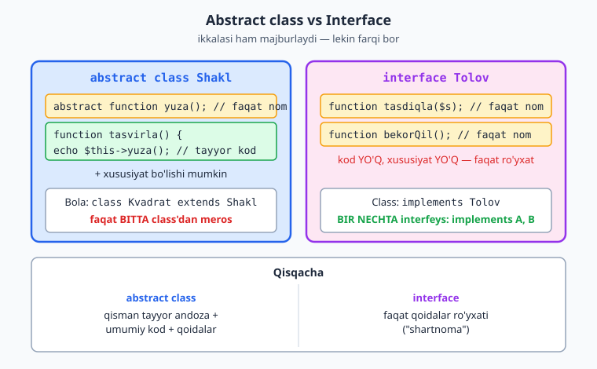

> **Qachon qaysi biri?** Agar bola class'larga **umumiy tayyor kod** bermoqchi bo'lsangiz — abstrakt class. Agar faqat "shu metodlar bo'lsin" degan **qoida** o'rnatmoqchi bo'lsangiz — interfeys. Boshlanishida ko'p o'ylab o'tirmang; tajriba bilan qaysi biri qachon to'g'ri kelishini his qilasiz.

### Mashqlar

**Oson**
1. `Tolov` interfeysini yarating (`tasdiqla()`, `bekorQil()` bilan). `NaqdTolov` class'ida uni bajaring.
2. `KartaTolov` class'ini ham yarating va interfeysni bajaring.
3. Interfeys metodlaridan birini class'da yozishni unutib ko'ring — xatoni ko'ring.
4. `Ovoz` interfeysi (`chiqar()` bilan) → `It` va `Mushuk` uni bajarsin.
5. `Saqlanadigan` interfeysi (`saqla()` bilan) → `Fayl` class'ida bajaring.

**O'rta**
6. `Tolov` interfeysini bajaradigan obyektni parametr sifatida qabul qiluvchi funksiya yozing.
7. `Shakl` interfeysi (`yuza()`, `perimetr()`) → `Kvadrat`, `Aylana` uni bajarsin.
8. Ikki interfeysni bir class'da bajaring: `class Robot implements Yuruvchi, Gapiruvchi` (har birida bittadan metod).
9. `Bildirishnoma` interfeysi (`yubor($xabar)`) → `Email`, `SMS`, `Telegram` class'lari har biri o'z usulida yuborsin.

**Qiyin**
10. To'lov tizimi: `Tolov` interfeysi (`tasdiqla`, `bekorQil`). `NaqdTolov`, `KartaTolov`, `OnlaynTolov` class'lari. Bir massivga turli to'lovlarni solib, `foreach` bilan hammasini tasdiqlang.
11. `Bildirishnoma` interfeysini bajaradigan bir nechta class (`Email`, `SMS`) yarating. `hammaganYubor($kanallar, $xabar)` funksiyasi massivdagi har bir kanaldan xabar yuborsin — funksiya kanal turini bilmasin (faqat interfeysga tayansin).
12. `Saralanadigan` g'oyasini sinab ko'ring: `narx()` metodini talab qiladigan interfeys yarating, uni bir nechta mahsulot class'ida bajaring, keyin mahsulotlarni narxi bo'yicha solishtiruvchi oddiy kod yozing.

<details markdown="1">
<summary>Yechim — 10 (to'lov tizimi: turli to'lovlar bir massivda)</summary>

```php
<?php
interface Tolov {
    public function tasdiqla($summa);
}

class NaqdTolov implements Tolov {
    public function tasdiqla($summa) { echo "Naqd: $summa so'm<br>"; }
}
class KartaTolov implements Tolov {
    public function tasdiqla($summa) { echo "Karta: $summa so'm<br>"; }
}
class OnlaynTolov implements Tolov {
    public function tasdiqla($summa) { echo "Onlayn: $summa so'm<br>"; }
}

// Turli to'lovlar bir massivda — hammasi "Tolov" interfeysiga ega
$tolovlar = [new NaqdTolov(), new KartaTolov(), new OnlaynTolov()];
foreach ($tolovlar as $tolov) {
    $tolov->tasdiqla(1000);
}
// Naqd: 1000 so'm
// Karta: 1000 so'm
// Onlayn: 1000 so'm
```
`foreach` har bir to'lovning turini bilmaydi — faqat ularda `tasdiqla()` borligiga (interfeys kafolatlaydi) tayanadi. Yangi to'lov turi qo'shsangiz, bu sikl o'zgarmaydi. Bu — interfeyslarning kuchi.
</details>

<details markdown="1">
<summary>Yechim — 12 (narx interfeysi va solishtirish)</summary>

```php
<?php
interface Narxli {
    public function narx(): int;
}

class Kitob implements Narxli {
    private $narx;
    public function __construct($narx) { $this->narx = $narx; }
    public function narx(): int { return $this->narx; }
}

$mahsulotlar = [new Kitob(300), new Kitob(100), new Kitob(200)];

// Narx bo'yicha o'sish tartibida saralash (1.10'dagi usort):
usort($mahsulotlar, fn($a, $b) => $a->narx() <=> $b->narx());

foreach ($mahsulotlar as $m) {
    echo $m->narx() . "<br>";
}
// 100
// 200
// 300
```
`Narxli` interfeysi "narx() bo'lishi shart" deb kafolatlaydi — shuning uchun `usort` ichida xotirjam `$a->narx()` deymiz. Interfeys + 1.10'dagi `usort` birgalikda kuchli vosita.
</details>

<details markdown="1">
<summary>Yechim — 11 (universal bildirishnoma)</summary>

```php
<?php
interface Bildirishnoma {
    public function yubor($xabar);
}

class Email implements Bildirishnoma {
    public function yubor($xabar) {
        echo "Email yuborildi: " . $xabar . "<br>";
    }
}

class SMS implements Bildirishnoma {
    public function yubor($xabar) {
        echo "SMS yuborildi: " . $xabar . "<br>";
    }
}

// Bu funksiya kanal turini BILMAYDI — faqat "Bildirishnoma" ekanini biladi
function hammaganYubor($kanallar, $xabar) {
    foreach ($kanallar as $kanal) {
        $kanal->yubor($xabar);
    }
}

$kanallar = [new Email(), new SMS()];
hammaganYubor($kanallar, "Salom!");
// Email yuborildi: Salom!
// SMS yuborildi: Salom!
```
Diqqat: `hammaganYubor` faqat interfeysga (`yubor` metodi bor-yo'qligiga) tayanadi. Email, SMS, ertaga qo'shiladigan Telegram — hammasi ishlaydi, funksiyani o'zgartirmaymiz. Bu — interfeyslarning asosiy kuchi: "qism"larni almashtirsa bo'ladi.
</details>

---

<a name="27-static"></a>
## 2.7 Static xususiyat va metodlar

### Obyektga emas, class'ning o'ziga tegishli

Hozirgacha xususiyat va metodlar **har bir obyektga** tegishli edi: `$mashina1->rang`, `$mashina2->rang` — har birida alohida. Lekin ba'zan ma'lumot yoki amal **butun class'ga** tegishli bo'ladi, alohida obyektga emas. Ana shunda **static** ishlatiladi.

Misol: nechta obyekt yaratilganini sanash. Bu son birorta obyektga emas, butun class'ga tegishli.

```php
<?php
class Talaba {
    public static $soni = 0;   // static — butun class'ga tegishli

    public function __construct() {
        self::$soni++;   // har obyekt yaratilganda umumiy hisobni oshiramiz
    }
}

new Talaba();
new Talaba();
new Talaba();

echo Talaba::$soni;   // 3
```

Diqqat qiling:
- **`public static $soni = 0;`** — `static` so'zi: bu xususiyat obyektlarga emas, **class'ning o'ziga** tegishli. U bitta, hamma obyektlar uchun umumiy.
- **`self::$soni`** — static xususiyatga class **ichidan** murojaat. `self` — "shu class" degani (`$this` "shu obyekt" edi; `self` "shu class").
- **`Talaba::$soni`** — static xususiyatga **tashqaridan** murojaat. Obyekt orqali emas (`$t->soni` emas), balki **class nomi** orqali (`Talaba::$soni`). `::` belgisi static narsalar uchun ishlatiladi.

Uchta obyekt yaratdik, har biri konstruktorda `self::$soni++` qildi — natijada umumiy hisob 3 bo'ldi.

### Static metodlar

Metod ham static bo'lishi mumkin — bunda uni obyekt yaratmasdan, to'g'ridan-to'g'ri class orqali chaqirasiz. Bu odatda "yordamchi" (utility) funksiyalar uchun ishlatiladi:

```php
<?php
class Matematika {
    public static function kvadrat($son) {
        return $son * $son;
    }

    public static function kub($son) {
        return $son * $son * $son;
    }
}

// Obyekt yaratish SHART EMAS — to'g'ridan-to'g'ri class orqali:
echo Matematika::kvadrat(5);   // 25
echo "<br>";
echo Matematika::kub(3);       // 27
```

`Matematika::kvadrat(5)` — obyekt yaratmadik (`new` yo'q), to'g'ridan-to'g'ri class orqali metodni chaqirdik. Bu mantiqiy: "kvadratni hisoblash" uchun "matematika obyekti" yaratish shart emas — funksiyaning o'zi yetarli.

> **Qachon static?** Agar metod yoki ma'lumot **biror aniq obyektga bog'liq bo'lmasa** — static qiling. Masalan, "kvadratni hisoblash" hech qaysi obyektga bog'liq emas → static. Lekin "shu hisobning balansi" — aniq obyektga bog'liq → static EMAS. Boshlanishida static'ni kam ishlating; ko'pincha oddiy (obyektga tegishli) metodlar to'g'ri tanlov.

### Mashqlar

**Oson**
1. `Talaba` class'iga static `$soni` qo'shing. Bir nechta obyekt yarating va umumiy sonni chiqaring.
2. `Matematika` class'iga static `kvadrat($son)` metodini qo'shing, obyektsiz chaqiring.
3. `Matematika`ga static `kub()` va `ikkilantir()` metodlarini qo'shing.
4. Static xususiyatga obyekt orqali emas, class nomi (`::`) orqali murojaat qiling.
5. `Konvertor` class'i: static `kmdanMilga($km)` metodi (km × 0.621) qaytarsin.

**O'rta**
6. `Mahsulot` class'i: static `$umumiySoni` har obyekt yaratilganda oshsin. 5 ta mahsulot yaratib, sonini chiqaring.
7. `Yordamchi` class'i: static `formatNarx($son)` metodi sonni `"5 000 so'm"` ko'rinishida qaytarsin (`number_format` dan foydalaning).
8. `Hisoblagich` class'i: static `$qiymat`, static `oshir()` va `qiymatniOl()` metodlari bilan.
9. `Tasodif` class'i: static `tanga()` metodi tasodifiy "bosh" yoki "tail" qaytarsin (`rand(0, 1)` dan foydalaning).

**Qiyin**
10. `IDgenerator` class'i: static `$oxirgiId = 0`. Static `yangiId()` metodi har chaqirilganda IDni 1 ga oshirib qaytarsin (1, 2, 3, ...). Bu — har bir yangi yozuvga noyob raqam berishning oddiy usuli.
11. `Foydalanuvchi` class'i: konstruktor `ism` olsin va static `$royxat` massiviga o'zini qo'shsin. Static `hammasi()` metodi barcha foydalanuvchilar ro'yxatini qaytarsin.
12. `Statistika` class'i: static metodlar bilan son massividan eng katta, eng kichik va o'rtacha qiymatni qaytaruvchi vositalar to'plamini yarating.

<details markdown="1">
<summary>Yechim — 10 (ID generator)</summary>

```php
<?php
class IDgenerator {
    public static $oxirgiId = 0;

    public static function yangiId() {
        self::$oxirgiId++;        // umumiy hisobni oshiramiz
        return self::$oxirgiId;
    }
}

echo IDgenerator::yangiId();   // 1
echo "<br>";
echo IDgenerator::yangiId();   // 2
echo "<br>";
echo IDgenerator::yangiId();   // 3
```
Static bo'lgani uchun `$oxirgiId` bitta va saqlanib turadi — har chaqiruvda davom etadi. Bu obyektga bog'liq bo'lmagan, "umumiy hisoblagich" uchun ajoyib misol.
</details>

<details markdown="1">
<summary>Yechim — 11 (Foydalanuvchilar ro'yxati)</summary>

```php
<?php
class Foydalanuvchi {
    public static $royxat = [];   // barcha foydalanuvchilar — butun class'ga umumiy
    public $ism;

    public function __construct($ism) {
        $this->ism = $ism;
        self::$royxat[] = $ism;    // o'zini umumiy ro'yxatga qo'shadi
    }

    public static function hammasi() {
        return self::$royxat;
    }
}

new Foydalanuvchi("Ali");
new Foydalanuvchi("Vali");
new Foydalanuvchi("Guli");

print_r(Foydalanuvchi::hammasi());   // ["Ali", "Vali", "Guli"]
```
`$royxat` static — u bitta va barcha obyektlar uchun umumiy. Har bir yangi foydalanuvchi konstruktorda `self::$royxat`ga qo'shiladi, shuning uchun `hammasi()` to'liq ro'yxatni beradi. `self::` — "shu class'ning static a'zosi" (obyektda `$this`, static'da `self`).
</details>

<details markdown="1">
<summary>Yechim — 12 (Statistika vositalari)</summary>

```php
<?php
class Statistika {
    public static function engKatta(array $sonlar) {
        return max($sonlar);
    }
    public static function engKichik(array $sonlar) {
        return min($sonlar);
    }
    public static function ortacha(array $sonlar) {
        return array_sum($sonlar) / count($sonlar);
    }
}

$ballar = [85, 90, 70, 95, 60];

echo "Eng katta: "  . Statistika::engKatta($ballar)  . "<br>";   // 95
echo "Eng kichik: " . Statistika::engKichik($ballar) . "<br>";   // 60
echo "O'rtacha: "   . Statistika::ortacha($ballar);              // 80
```
Bu metodlar hech qaysi obyektga bog'liq emas — ular shunchaki "vosita". Shuning uchun static: obyekt yaratmasdan, `Statistika::ortacha(...)` deb to'g'ridan-to'g'ri ishlatamiz. Bu — "yordamchi funksiyalar to'plami" uchun mos naqsh.
</details>

---

<a name="28-trait"></a>
## 2.8 Trait — metodlarni ulashish

### Muammo: meros yetmaydigan holat

Meros (2.4) bir class'dan umumiy kod olishga yordam berardi. Lekin muammo: PHP'da bitta class faqat **bitta** ota class'dan meros oladi. Agar siz turli, bir-biriga aloqasiz class'larga **bir xil metodni** qo'shmoqchi bo'lsangiz-chi?

Masalan, `Maqola`, `Mahsulot`, `Foydalanuvchi` — uchovi ham bir-biriga aloqasiz, lekin uchoviga ham "logga yozish" (`log()`) metodi kerak. Ularning umumiy ota class'i yo'q. Har biriga `log()` ni nusxalash — takrorlanish. **Trait** ana shuni hal qiladi.

### Trait — qayta ishlatiladigan metodlar to'plami

**Trait — class emas, balki metodlar to'plami**, uni istalgan class'ga "qo'shib" (`use`) ishlatish mumkin. Buni "nusxalanadigan metodlar" deb tasavvur qiling — lekin to'g'ri, tartibli usulda:

```php
<?php
// Trait — qayta ishlatiladigan metodlar
trait Loglovchi {
    public function log($xabar) {
        echo "[LOG] " . $xabar . "<br>";
    }
}

// Turli class'lar shu trait'dan foydalanadi:
class Maqola {
    use Loglovchi;   // trait metodlarini "qo'shamiz"

    public function chop() {
        $this->log("Maqola chop etildi");
    }
}

class Mahsulot {
    use Loglovchi;   // xuddi shu trait

    public function sotib() {
        $this->log("Mahsulot sotildi");
    }
}

$m = new Maqola();
$m->chop();   // [LOG] Maqola chop etildi

$p = new Mahsulot();
$p->sotib();  // [LOG] Mahsulot sotildi
```

Tushuntiramiz:
- **`trait Loglovchi { ... }`** — trait e'lon qilinadi. Ichida metodlar bor (class'dagidek).
- **`use Loglovchi;`** — class ichida shunday yozsangiz, trait'dagi barcha metodlar shu class'ga **qo'shiladi**, xuddi o'sha class'da yozilgandek.
- `Maqola` ham, `Mahsulot` ham — bir-biriga aloqasiz, lekin ikkalasi ham `log()` metodiga ega bo'ldi, uni nusxalamasdan.

Quyidagi diagramma bir trait'ning metodlari `use` orqali bir nechta aloqasiz class'ga qanday "aralashtirilishini" ko'rsatadi:


> **Trait va meros farqi:** meros — "...bu ham bir turdagi narsa" munosabati uchun (It — bu Hayvon). Trait — shunday munosabat yo'q, lekin **umumiy qobiliyat** ulashish kerak bo'lganda (Maqola ham, Mahsulot ham "loglay oladi", lekin ular bir tur emas). Bir class bir nechta trait'dan foydalanishi mumkin (`use A, B;`).

### Mashqlar

**Oson**
1. `Loglovchi` trait'ini yarating (`log($xabar)` bilan) va bitta class'da `use` qiling.
2. Xuddi shu trait'ni ikkinchi, aloqasiz class'da ham ishlating.
3. `Salomlashuvchi` trait'i (`salom()` "Salom!" chiqarsin) → ikki xil class'da ishlating.
4. Trait'ga ikkita metod qo'shing va class'da ikkalasini ham ishlating.
5. Bir class'da ikkita trait'ni birdan ishlating (`use A, B;`).

**O'rta**
6. `Sanaqli` trait'i: `$soni` xususiyati va `oshir()` metodi bilan (trait'da xususiyat ham bo'lishi mumkin). Uni class'da ishlating.
7. `Formatlovchi` trait'i: `narxFormat($son)` metodi narxni chiroyli ko'rinishda qaytarsin. Uni `Mahsulot` va `Buyurtma` class'larida ishlating.
8. `Vaqtli` trait'i: `hozir()` metodi joriy vaqtni qaytarsin (`date("H:i:s")`). Bir nechta class'da ishlating.

**Qiyin**
9. `Loglovchi` va `Vaqtli` trait'larini birga ishlating: `log()` metodi xabar oldiga vaqtni qo'shsin (`[12:30:05] xabar`). Ikki trait'ni bitta class'da birlashtiring.
10. To'liq misol: `Maqola` va `Sharh` class'lari — ikkalasi ham `Loglovchi` va `Saqlanadigan` (`saqla()`) trait'laridan foydalansin. Har birining o'ziga xos metodlari ham bo'lsin.

<details markdown="1">
<summary>Yechim — 6 (xususiyatli trait)</summary>

```php
<?php
trait Sanaqli {
    public $soni = 0;

    public function oshir() {
        $this->soni++;
    }
}

class Savat {
    use Sanaqli;
}

$s = new Savat();
$s->oshir();
$s->oshir();
echo $s->soni;   // 2
```
Trait nafaqat metod, balki xususiyat ham bera oladi. `Savat` class'i `Sanaqli` trait'idan `$soni` xususiyati va `oshir()` metodini "meros" oldi (aniqrog'i — qo'shib oldi).
</details>

<details markdown="1">
<summary>Yechim — 9 (Loglovchi + Vaqtli birga)</summary>

```php
<?php
trait Vaqtli {
    public function hozir() {
        return date("H:i:s");   // joriy vaqt
    }
}

trait Loglovchi {
    public function log($xabar) {
        // Bu trait Vaqtli'dagi hozir() ga tayanadi
        echo "[" . $this->hozir() . "] " . $xabar . "<br>";
    }
}

class Tizim {
    use Vaqtli, Loglovchi;   // ikkala trait birga
}

$s = new Tizim();
$s->log("Tizim ishga tushdi");   // [14:30:05] Tizim ishga tushdi
```
Bitta class'da ikkita trait'ni `use Vaqtli, Loglovchi;` bilan birga ishlatdik. `log()` (Loglovchi'dan) `hozir()` (Vaqtli'dan) ni chaqiradi — ikkala trait ham bitta obyektga qo'shilgani uchun bir-birini "ko'radi".
</details>

<details markdown="1">
<summary>Yechim — 10 (Maqola va Sharh: umumiy qobiliyatlar)</summary>

```php
<?php
trait Loglovchi {
    public function log($xabar) { echo "[LOG] " . $xabar . "<br>"; }
}
trait Saqlanadigan {
    public function saqla() { echo "Bazaga saqlandi<br>"; }
}

class Maqola {
    use Loglovchi, Saqlanadigan;
    public function chopEt() { echo "Maqola chop etildi<br>"; }
}

class Sharh {
    use Loglovchi, Saqlanadigan;
    public function javobBer() { echo "Sharhga javob berildi<br>"; }
}

$m = new Maqola();
$m->log("yangi maqola");
$m->saqla();
$m->chopEt();

$sh = new Sharh();
$sh->saqla();
$sh->javobBer();
```
`Maqola` va `Sharh` — bir-biriga aloqasiz (umumiy ota class yo'q), lekin ikkalasiga ham "loglash" va "saqlash" qobiliyati kerak. Trait'lar shuni beradi — har biri o'z maxsus metodiga (`chopEt`, `javobBer`) ham ega. Meros bilan buni qilib bo'lmasdi (PHP bitta otadan meros oladi).
</details>

---

<a name="29-enum"></a>
## 2.9 Enum — cheklangan tanlovlar

### Muammo: "sehrli matnlar"

Tasavvur qiling, buyurtmaning holatini saqlaymiz. Holat faqat ma'lum qiymatlardan biri bo'lishi mumkin: "yangi", "yo'lda", "yetkazildi", "bekor qilindi". Buni oddiy matn bilan saqlasak:

```php
<?php
$holat = "yetkazildi";
```

Muammo: bu yerda matnni xato yozish oson. `"yetkzildi"` (harf tushib qolgan) deb yozsangiz, PHP buni xato deb aytmaydi — shunchaki noto'g'ri ishlaydi. Yoki `"Yetkazildi"` (katta harf bilan) — boshqa qiymat hisoblanadi. Bunday "sehrli matnlar" (magic strings) — xatolar manbai.

**Enum** ana shuni hal qiladi: faqat **oldindan belgilangan** qiymatlar ro'yxatini yaratadi, boshqasiga ruxsat bermaydi.

### Enum nima?

**Enum (enumeration) — cheklangan, nomlangan qiymatlar to'plami.** "Faqat shu variantlardan biri bo'lishi mumkin" degani:

```php
<?php
enum Holat {
    case Yangi;
    case Yolda;
    case Yetkazildi;
    case BekorQilindi;
}

// Endi holat faqat shu to'rttadan biri bo'lishi mumkin:
$holat = Holat::Yetkazildi;

if ($holat == Holat::Yetkazildi) {
    echo "Buyurtma yetkazildi";
}
```

Tushuntiramiz:
- **`enum Holat { ... }`** — Holat degan enum yaratamiz.
- **`case Yangi;`** — har bir mumkin bo'lgan qiymat `case` bilan e'lon qilinadi.
- **`Holat::Yetkazildi`** — qiymatga shunday murojaat qilamiz (class'dagi static kabi, `::` bilan).

Endi `Holat::Yetkzildi` (xato yozsangiz) — PHP **darrov xato beradi**, chunki bunday `case` yo'q. Bu matnda mumkin emas edi. Enum sizni xatolardan himoyalaydi.

### Qiymatli enum (backed enum)

Ko'pincha enumning har bir variantiga aniq qiymat (matn yoki son) biriktirish kerak bo'ladi — masalan, bazaga saqlash uchun:

```php
<?php
enum Holat: string {
    case Yangi = 'yangi';
    case Yolda = 'yolda';
    case Yetkazildi = 'yetkazildi';
}

$holat = Holat::Yetkazildi;
echo $holat->value;   // yetkazildi   (biriktirilgan qiymat)
```

`enum Holat: string` — "har bir variantning matn qiymati bor" degani. `$holat->value` orqali o'sha qiymatni olamiz. Bu, masalan, holatni bazaga `"yetkazildi"` deb saqlash uchun qulay.

### Foydasi

1. **Xatosizlik:** faqat ruxsat etilgan qiymatlar. Xato matn yozib bo'lmaydi.
2. **Aniqlik:** kod o'qiganda `Holat::Yetkazildi` — `"yetkazildi"` matnidan ravshanroq.
3. **Bir joyda:** barcha mumkin bo'lgan holatlar bir joyda ro'yxatlangan.

Enum, masalan, holat (buyurtma holati), rol (foydalanuvchi roli: admin/oddiy), kun (hafta kunlari) kabi "cheklangan variantlar" uchun ideal.

### Mashqlar

**Oson**
1. `Holat` enum'ini yarating (`Yangi`, `Yolda`, `Yetkazildi`). Bir o'zgaruvchiga qiymat bering va `if` bilan tekshiring.
2. `Kun` enum'ini yarating (hafta kunlari) va bittasini tanlang.
3. `Rol` enum'ini yarating (`Admin`, `Oddiy`, `Mehmon`).
4. Qiymatli enum yarating (`Holat: string`) va `->value` ni chiqaring.
5. `Yonalish` enum'i (`Shimol`, `Janub`, `Sharq`, `Garb`) yarating.

**O'rta**
6. `Rol` enum'i bilan: foydalanuvchi roli `Admin` bo'lsa "Boshqaruv paneli", aks holda "Oddiy sahifa" chiqaring.
7. `Holat: string` enum'ining qiymatini bazaga saqlanadigandek `->value` orqali chiqaring.
8. Buyurtma class'i yarating, uning `holat` xususiyati enum turida bo'lsin (konstruktorda qabul qilsin).
9. `Baho` enum'i (`A`, `B`, `C`, `D`, `F`) yarating va bir nechta talaba bahosini saqlang.

**Qiyin**
10. `Buyurtma` class'i: konstruktor `holat`ni `Holat` enum sifatida olsin. `holatniOzgartir($yangiHolat)` metodi holatni yangilasin. `holatMatn()` metodi joriy holatni o'qiladigan matn ko'rinishida qaytarsin (`match` bilan).
11. Enum'ga metod qo'shish (PHP enum'larida metod bo'lishi mumkin!): `Holat` enum'iga `tavsif()` metodi qo'shing — har bir holat uchun o'zbekcha izoh qaytarsin (`match($this)` ishlatib).

<details markdown="1">
<summary>Yechim — 10 (Buyurtma holati)</summary>

```php
<?php
enum Holat {
    case Yangi;
    case Yolda;
    case Yetkazildi;
}

class Buyurtma {
    public $holat;

    public function __construct(Holat $holat) {   // tip — enum!
        $this->holat = $holat;
    }

    public function holatniOzgartir(Holat $yangiHolat) {
        $this->holat = $yangiHolat;
    }

    public function holatMatn(): string {
        return match($this->holat) {
            Holat::Yangi      => "Buyurtma qabul qilindi",
            Holat::Yolda      => "Buyurtma yo'lda",
            Holat::Yetkazildi => "Buyurtma yetkazildi",
        };
    }
}

$b = new Buyurtma(Holat::Yangi);
echo $b->holatMatn();              // Buyurtma qabul qilindi

$b->holatniOzgartir(Holat::Yolda);
echo "<br>" . $b->holatMatn();     // Buyurtma yo'lda
```
E'tibor bering: konstruktor va metod parametri tipi `Holat` (enum). Shuning uchun `holat`ga faqat haqiqiy `Holat` qiymati tushadi — xato matn ("yetkzildi") berib bo'lmaydi. `holatMatn()` esa `match` bilan har bir holatga o'qiladigan izoh beradi. Enum + tip e'loni + `match` — birgalikda juda ishonchli.
</details>

<details markdown="1">
<summary>Yechim — 11 (metodli enum)</summary>

```php
<?php
enum Holat: string {
    case Yangi = 'yangi';
    case Yolda = 'yolda';
    case Yetkazildi = 'yetkazildi';

    // Enum ichida metod ham bo'lishi mumkin
    public function tavsif(): string {
        return match($this) {
            Holat::Yangi       => "Buyurtma qabul qilindi",
            Holat::Yolda       => "Buyurtma yo'lda",
            Holat::Yetkazildi  => "Buyurtma yetkazib berildi",
        };
    }
}

$holat = Holat::Yolda;
echo $holat->tavsif();   // Buyurtma yo'lda
```

> **Yangi narsa: `match`.** Bu — `if/elseif` ning ixcham ko'rinishi. `match($this)` joriy qiymatni tekshiradi va mos kelganini qaytaradi. `Holat::Yangi => "..."` degani: "agar joriy holat Yangi bo'lsa, shu matnni qaytar". `match` ayniqsa "bir qiymatga qarab turli natija" kerak bo'lganda qulay va `if/elseif`dan toza ko'rinadi.
</details>

---

<a name="210-xato"></a>
## 2.10 Xatolarni boshqarish (try / catch)

### Muammo: xatolar dasturni "o'ldiradi"

Ba'zan kodda xato yuz beradi: foydalanuvchi noto'g'ri ma'lumot kiritadi, fayl topilmaydi, nolga bo'lish sodir bo'ladi. Agar buni boshqarmasangiz, dastur to'satdan to'xtaydi va foydalanuvchi xunuk xato xabarini ko'radi. Bizga xatolarni **chiroyli boshqarish** kerak.

### `try` / `catch` — xatoni "ushlash"

Asosiy g'oya: xato bo'lishi mumkin bo'lgan kodni `try` ("urinib ko'r") blokiga yozasiz. Agar xato yuz bersa, `catch` ("ushla") bloki uni ushlaydi va dastur to'xtamaydi:

```php
<?php
try {
    // Xato bo'lishi mumkin bo'lgan kod
    $natija = 10 / 0;   // nolga bo'lish — xato!
    echo $natija;
} catch (DivisionByZeroError $e) {
    // Xato yuz bersa — bu yer ishlaydi
    echo "Xato: nolga bo'lib bo'lmaydi!";
}

echo "<br>Dastur davom etmoqda...";   // dastur to'xtamadi
```

Nima sodir bo'ldi:
- **`try { ... }`** — "shu kodni bajarishga urinib ko'r".
- Ichida xato yuz berdi (nolga bo'lish).
- **`catch (...) { ... }`** — xato yuz berganda darrov bu yerga "sakraydi" va xato xabarini chiqaradi.
- Eng muhimi: dastur **to'xtamadi** — keyingi kod ("Dastur davom etmoqda...") ham ishladi.

`$e` — bu "xato haqidagi ma'lumot" (error obyekti). Undan xato haqida ma'lumot olish mumkin: `$e->getMessage()` xato matnini qaytaradi.

### O'zingiz xato "tashlash" — `throw`

Ba'zan o'zingiz xato signalini berishingiz kerak. Masalan, "yosh manfiy bo'lmasligi kerak". Buning uchun `throw` ("tashla") ishlatiladi:

```php
<?php
function yoshTekshir($yosh) {
    if ($yosh < 0) {
        throw new Exception("Yosh manfiy bo'lishi mumkin emas");
    }
    return "Yosh: " . $yosh;
}

try {
    echo yoshTekshir(-5);   // bu xato tashlaydi
} catch (Exception $e) {
    echo "Xatolik: " . $e->getMessage();   // Xatolik: Yosh manfiy bo'lishi mumkin emas
}
```

Tushuntiramiz:
- **`throw new Exception("...")`** — "xato signalini tashla, shu matn bilan". `throw` bajarilishi bilan funksiya darrov to'xtaydi va xato "yuqoriga" — uni chaqirgan `try` ga uchadi.
- `catch` uni ushlaydi va `$e->getMessage()` orqali xato matnini oladi.

Bu — ma'lumotni tekshirishning toza usuli: funksiya "men bu ma'lumot bilan ishlay olmayman" deb signal beradi, chaqiruvchi esa uni `try/catch` bilan boshqaradi.

### `finally` — har doim bajariladigan qism

Ba'zan, xato bo'ladimi-yo'qmi, biror ish **albatta** bajarilishi kerak (masalan, faylni yopish). Buning uchun `finally` bor:

```php
<?php
try {
    echo "Ish boshlandi<br>";
    throw new Exception("Biror xato");
} catch (Exception $e) {
    echo "Xato ushlandi<br>";
} finally {
    echo "Bu qism HAR DOIM bajariladi";   // xato bo'lsa ham, bo'lmasa ham
}
```

Quyidagi diagramma `try / catch / finally` oqimini ko'rsatadi: `try` ichida xato bo'lsa `catch` ushlaydi, bo'lmasa `catch` o'tkazib yuboriladi — `finally` esa har ikki holatda ham bajariladi va dastur to'xtamaydi:

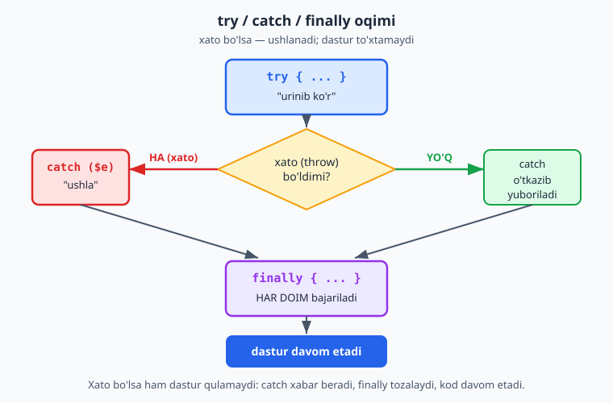

### Nega foydali?

1. **Dastur qulamaydi:** xato bo'lsa ham, foydalanuvchiga chiroyli xabar berasiz.
2. **Nazorat:** xatolarni bir joyda, tartibli boshqarasiz.
3. **Ishonch:** "nima noto'g'ri ketishi mumkin"ni oldindan o'ylab, tayyor turasiz.

### Mashqlar

**Oson**
1. `try/catch` bilan nolga bo'lishni ushlang va chiroyli xabar chiqaring.
2. `throw new Exception(...)` bilan o'z xatongizni tashlang va ushlang.
3. Xato xabarini `$e->getMessage()` orqali chiqaring.
4. `finally` blokini qo'shing va u har doim ishlashini ko'ring.
5. `try` ichida xato bo'lmasa, `catch` ishlamasligini (faqat `try` ishlashini) ko'ring.

**O'rta**
6. `yoshTekshir($yosh)` funksiyasi: yosh manfiy yoki 150 dan katta bo'lsa xato tashlasin.
7. `bol($a, $b)` funksiyasi: `$b` nol bo'lsa xato tashlasin, aks holda bo'linmani qaytarsin.
8. `parolTekshir($parol)` funksiyasi: parol 8 belgidan qisqa bo'lsa xato tashlasin.
9. Bir nechta `throw` holatini bitta funksiyada qo'llang (turli noto'g'ri inputlar uchun turli xato xabarlari).

**Qiyin**
10. `Hisob` class'ining `pulYechish` metodini xato bilan ishlang: pul yetarli bo'lmasa `throw new Exception("Mablag' yetarli emas")`. Chaqirilganda `try/catch` bilan ushlang.
11. Foydalanuvchi ro'yxatdan o'tishini tekshiruvchi funksiya yozing: bo'sh ism, noto'g'ri email (`@` yo'q), qisqa parol — har biri uchun alohida xato tashlasin. `try/catch` bilan har bir holatni sinab ko'ring.
12. `finally` ning amaliy foydasini ko'rsating: "ulanish ochildi" → ish (xato bo'lishi mumkin) → `finally` da "ulanish yopildi" har doim chiqsin.

<details markdown="1">
<summary>Yechim — 10 (xavfsiz pul yechish, xato bilan)</summary>

```php
<?php
class Hisob {
    private $balans;

    public function __construct($balans) {
        $this->balans = $balans;
    }

    public function pulYechish($summa) {
        if ($summa > $this->balans) {
            throw new Exception("Mablag' yetarli emas. Balans: " . $this->balans);
        }
        $this->balans -= $summa;
        return $this->balans;
    }
}

$hisob = new Hisob(100000);

try {
    $hisob->pulYechish(150000);   // xato tashlaydi
} catch (Exception $e) {
    echo "Amal bajarilmadi: " . $e->getMessage();
    // Amal bajarilmadi: Mablag' yetarli emas. Balans: 100000
}
```
2.3'da `pulYechish` `false` qaytarardi. Bu yerda esa `throw` bilan **aniq xato** beramiz — chaqiruvchi nima uchun amal bajarilmaganini aniq biladi. Ikkala usul ham to'g'ri; `throw` murakkabroq holatlarda foydaliroq, chunki xato sababini aniq yetkazadi.
</details>

<details markdown="1">
<summary>Yechim — 11 (ro'yxatdan o'tishni tekshirish)</summary>

```php
<?php
function royxatdanOtkaz($ism, $email, $parol) {
    if (empty($ism)) {
        throw new Exception("Ism bo'sh bo'lmasligi kerak");
    }
    if (!str_contains($email, "@")) {
        throw new Exception("Email noto'g'ri (@ yo'q)");
    }
    if (strlen($parol) < 8) {
        throw new Exception("Parol kamida 8 belgidan iborat bo'lsin");
    }
    return "Ro'yxatdan o'tdingiz: " . $ism;
}

// Har xil holatlarni sinab ko'ramiz:
$testlar = [
    ["",      "a@b.uz", "12345678"],   // ism bo'sh
    ["Ali",   "xato",   "12345678"],   // email noto'g'ri
    ["Vali",  "v@b.uz", "123"],        // parol qisqa
    ["Guli",  "g@b.uz", "maxfiy123"],  // hammasi to'g'ri
];

foreach ($testlar as $t) {
    try {
        echo royxatdanOtkaz($t[0], $t[1], $t[2]) . "<br>";
    } catch (Exception $e) {
        echo "Xato: " . $e->getMessage() . "<br>";
    }
}
// Xato: Ism bo'sh bo'lmasligi kerak
// Xato: Email noto'g'ri (@ yo'q)
// Xato: Parol kamida 8 belgidan iborat bo'lsin
// Ro'yxatdan o'tdingiz: Guli
```
Funksiya har bir noto'g'ri holat uchun alohida, aniq xato tashlaydi. `try/catch` har birini ushlab, tegishli xabarni ko'rsatadi. Bu — formani tekshirishning toza usuli: funksiya "qoidani" biladi, chaqiruvchi "javobni" boshqaradi.
</details>

<details markdown="1">
<summary>Yechim — 12 (finally bilan ulanishni yopish)</summary>

```php
<?php
function malumotOqi($xatoBoladimi) {
    echo "Ulanish ochildi<br>";
    try {
        if ($xatoBoladimi) {
            throw new Exception("O'qishda xato yuz berdi");
        }
        echo "Ma'lumot o'qildi<br>";
    } catch (Exception $e) {
        echo "Xato: " . $e->getMessage() . "<br>";
    } finally {
        echo "Ulanish yopildi<br>";   // HAR DOIM bajariladi
    }
}

malumotOqi(false);
echo "---<br>";
malumotOqi(true);
// Ulanish ochildi / Ma'lumot o'qildi / Ulanish yopildi
// ---
// Ulanish ochildi / Xato: O'qishda xato yuz berdi / Ulanish yopildi
```
`finally` ning amaliy foydasi shu: xato bo'ladimi yoki yo'qmi, "ulanishni yopish" kabi tozalash ishi **har doim** bajariladi. Real kodda bu — fayl, baza ulanishi yoki boshqa resursni xato bo'lganda ham to'g'ri yopish uchun ishlatiladi.
</details>

---

> **2-QISM yakunlandi!** Bu — qo'llanmaning eng murakkab qismlaridan biri edi. Endi siz: class va obyekt, konstruktor, inkapsulyatsiya (public/private), meros, abstrakt class, interfeys, static, trait, enum va xatolarni boshqarishni bilasiz. Bu — katta, tartibli dasturlar yozishning asosi.
>
> Agar hammasi hali to'liq "o'tirmagan" bo'lsa — tabiiy. OOP'ni tushunish vaqt va mashq talab qiladi. Misollarni qayta yozib, o'zgartirib ko'ring. Keyingi qism — **ma'lumotlar bazasi:** ma'lumotni doimiy (dastur yopilgandan keyin ham) saqlash. Bu — haqiqiy, foydali dasturlar yozishning keyingi katta qadami.

---

<a name="31-baza-nima"></a>
# 3-QISM — MA'LUMOTLAR BAZASI

## 3.1 Ma'lumotlar bazasi nima va nega kerak?

### Muammo: ma'lumot yo'qolib ketadi

Hozirgacha barcha ma'lumotlarimiz o'zgaruvchilarda va massivlarda edi. Lekin bir narsani sezgan bo'lsangiz kerak: **dastur tugashi bilan hamma narsa yo'qoladi.** Sahifani yangilasangiz — massivdagi talabalar ro'yxati g'oyib bo'ladi. Chunki o'zgaruvchilar faqat dastur ishlayotgan paytda, kompyuter "tezkor xotirasi"da yashaydi.

Lekin haqiqiy dasturda ma'lumot **saqlanib qolishi** kerak. Onlayn do'kon mahsulotlarni, foydalanuvchilarni, buyurtmalarni eslab qolishi shart — sayt o'chib-yonsa ham. Ana shu — **doimiy saqlash** muammosi.

### Yechim: ma'lumotlar bazasi

**Ma'lumotlar bazasi (database) — ma'lumotni tartibli va doimiy saqlaydigan tizim.** U ma'lumotni diskka yozadi, shuning uchun dastur yopilsa ham, kompyuter o'chsa ham — ma'lumot saqlanib qoladi. Bundan tashqari, undan ma'lumotni tez topish, qidirish, saralash mumkin.

Ma'lumotni oddiy faylga ham yozish mumkin. Lekin baza ancha kuchli: u minglab yozuvni tez qidiradi, tartibga soladi, bog'laydi va bir vaqtning o'zida ko'p odam bilan ishlay oladi.

### Jadval — Excel jadvaliga o'xshaydi

Bazada ma'lumot **jadvallarda** (table) saqlanadi. Agar Excel yoki Google Sheets ko'rgan bo'lsangiz, jadvalni allaqachon tasavvur qilasiz: **qatorlar** (satrlar) va **ustunlar**.

Masalan, talabalar jadvali shunday ko'rinadi:

```
+----+-------------+------+----------+
| id | ism         | yosh | shahar   |
+----+-------------+------+----------+
| 1  | Ali Valiyev | 19   | Toshkent |
| 2  | Vali Aliyev | 21   | Samarqand|
| 3  | Guli Karim  | 20   | Buxoro   |
+----+-------------+------+----------+
```

- **Ustunlar** (`id`, `ism`, `yosh`, `shahar`) — har bir talaba haqida **qanday ma'lumot** saqlanishini bildiradi. Ular oldindan belgilanadi.
- **Qatorlar** — har bir alohida **yozuv** (bitta talaba). Yuqorida 3 ta talaba bor.
- **`id`** ustuni — har bir qatorning **noyob raqami**. Hech qachon takrorlanmaydi. Bu — har bir yozuvni aniq ajratib olish uchun (xuddi pasport raqami kabi). Deyarli har bir jadvalda `id` bo'ladi.

> Bu — 1.8'da ko'rgan "massiv ichida massiv" tuzilmasiga juda o'xshaydi: ro'yxatdagi har bir element — kalitli ma'lumotlar to'plami. Baza shu g'oyani diskda, tartibli va kuchli tarzda amalga oshiradi.

### MySQL — biz ishlatadigan baza

Ma'lumotlar bazasining turli xil tizimlari bor. Eng mashhurlaridan biri — **MySQL**. Yaxshi xabar: siz uni allaqachon o'rnatgansiz! **XAMPP MySQL'ni ham o'z ichiga oladi.** Shuning uchun alohida hech narsa o'rnatishingiz shart emas.

> MySQL — bu baza **tizimi** (ma'lumotni saqlaydigan dastur). Biz u bilan **SQL** degan til orqali "gaplashamiz" (3.3'da o'rganamiz). Hozircha shuni eslang: MySQL — ombor, SQL — u bilan gaplashish tili.

Keyingi bo'limda XAMPP orqali birinchi bazamizni va jadvalimizni yaratamiz — buni ko'rinadigan, qulay vosita (phpMyAdmin) orqali qilamiz.

---

<a name="32-phpmyadmin"></a>
## 3.2 phpMyAdmin va birinchi jadval

**phpMyAdmin** — bu MySQL bazasini ko'rinadigan, sichqoncha bilan boshqariladigan vosita. U ham XAMPP bilan birga keladi. U yordamida baza va jadvallarni kod yozmasdan, vizual yaratish mumkin — bu boshlovchilar uchun ideal boshlanish.

### phpMyAdmin'ni ochish

1. XAMPP Control Panel'da **Apache** va **MySQL** ikkalasini ham ishga tushiring ("Start" tugmasi, ikkalasi ham yashil bo'lsin).
2. Brauzerda oching: **`http://localhost/phpmyadmin`**
3. phpMyAdmin sahifasi ochiladi — chap tomonda bazalar ro'yxati ko'rinadi.

### Baza yaratish

1. Yuqori menyudan **"Databases"** (Ma'lumotlar bazalari) bo'limiga o'ting.
2. "Create database" maydoniga baza nomini yozing, masalan: **`maktab`**.
3. Yonidagi tanlovni `utf8mb4_general_ci` qoldiring (bu o'zbekcha harflar va emoji to'g'ri saqlanishini ta'minlaydi).
4. **"Create"** tugmasini bosing.

Tabriklaymiz — `maktab` degan bo'sh bazangiz tayyor. Endi unga jadval qo'shamiz.

### Jadval yaratish

1. Chap tomondan yangi yaratgan `maktab` bazasini bosing.
2. "Create table" qismida jadval nomini yozing: **`talabalar`**, ustunlar soni (Number of columns): **4**, "Create" bosing.
3. Endi 4 ta ustunni belgilaymiz:

| Ustun nomi (Name) | Turi (Type) | Uzunlik/qiymat | Qo'shimcha |
|---|---|---|---|
| `id` | INT | — | "A_I" (Auto Increment) belgilang + Primary kalit |
| `ism` | VARCHAR | 100 | — |
| `yosh` | INT | — | — |
| `shahar` | VARCHAR | 50 | — |

4. **"Save"** tugmasini bosing.

Ustun turlari haqida qisqacha:
- **INT** — butun son (`id`, `yosh` kabi).
- **VARCHAR** — qisqa matn (ism, shahar). Yonidagi son (`100`) — eng ko'p necha belgi sig'ishini bildiradi.
- **TEXT** — uzun matn (maqola, izoh kabi). (Bu jadvalda ishlatmadik, lekin bilib qo'ying.)
- **DATE** — sana (`2024-05-20` ko'rinishida).

**`id` ustuni haqida muhim narsa:**
- **AUTO_INCREMENT (A_I)** — "avtomatik o'sish". Har yangi qator qo'shilganda `id` o'zi 1, 2, 3... deb ortadi. Siz `id` haqida o'ylashingiz shart emas — baza o'zi beradi.
- **Primary kalit (PRIMARY KEY)** — bu ustun har bir qatorni noyob qiladigan "asosiy kalit". `id` odatda primary kalit bo'ladi.

Quyidagi diagramma jadvalning asosiy qismlarini ko'rsatadi — ustun (vertikal), qator (gorizontal) va har qatorni noyob qiladigan primary kalit:

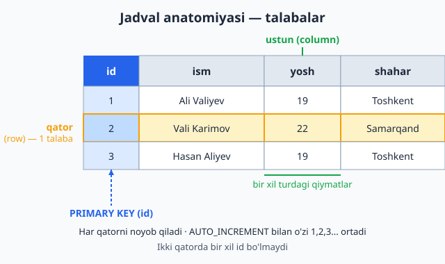

### Ma'lumot qo'shish (vizual)

1. Jadval ochilgach, yuqoridan **"Insert"** bo'limiga o'ting.
2. `ism`, `yosh`, `shahar` maydonlarini to'ldiring (`id` ni bo'sh qoldiring — u avtomatik to'ladi).
3. **"Go"** bosing.
4. **"Browse"** bo'limiga o'tib, qo'shilgan qatorni ko'ring.

Bir nechta talaba qo'shing. Endi sizda haqiqiy, diskda saqlanadigan ma'lumot bor — sahifani yangilasangiz ham, kompyuterni o'chirsangiz ham, u joyida qoladi!

> phpMyAdmin — qulay boshlanish, lekin haqiqiy dasturlarda ma'lumotni **kod orqali** qo'shamiz va o'qiymiz. Buning uchun esa MySQL bilan "gaplashish tili" — **SQL** ni o'rganishimiz kerak. Keyingi bo'limda aynan shu.

### Mashqlar

**Oson**
1. phpMyAdmin'ni oching va `maktab` bazasini yarating.
2. `talabalar` jadvalini yuqoridagi 4 ustun bilan yarating.
3. "Insert" orqali 3 ta talaba qo'shing.
4. "Browse" orqali qatorlarni ko'ring.
5. Yangi `shahar` qatorli talaba qo'shib, `id` avtomatik ortishini kuzating.

**O'rta**
6. `mahsulotlar` degan yangi jadval yarating: `id`, `nom` (VARCHAR), `narx` (INT), `soni` (INT).
7. `mahsulotlar`ga 5 ta mahsulot qo'shing.
8. Bir qatorni "Edit" (tahrirlash) orqali o'zgartiring (masalan, narxini).
9. Bir qatorni "Delete" orqali o'chiring va natijani ko'ring.

**Qiyin**
10. `kitoblar` jadvali yarating: `id`, `nom`, `muallif`, `yil` (INT), `mavjud` (bu yerda turini `TINYINT` qiling — 1 yoki 0, ya'ni ha/yo'q). Bir nechta kitob qo'shing.
11. `talabalar` jadvaliga `email` (VARCHAR) ustunini keyinroq qo'shing ("Structure" bo'limidan), mavjud qatorlarga email kiriting.

<details markdown="1">
<summary>Yechim — 10 (kitoblar jadvali)</summary>

phpMyAdmin'da vizual yaratasiz, lekin "ortida" quyidagi SQL ishlaydi (uni "SQL" bo'limida ham bajarish mumkin):

```sql
CREATE TABLE kitoblar (
    id INT AUTO_INCREMENT PRIMARY KEY,
    nom VARCHAR(150),
    muallif VARCHAR(100),
    yil INT,
    mavjud TINYINT      -- 1 = bor, 0 = yo'q
);

INSERT INTO kitoblar (nom, muallif, yil, mavjud) VALUES
('O''tkan kunlar', 'Abdulla Qodiriy', 1925, 1),
('Sarob', 'Abdulla Qahhor', 1943, 0);
```

> **`TINYINT` nega "ha/yo'q" uchun?** MySQL'da alohida "boolean" tur yo'q — odatda `TINYINT` ishlatiladi: `1` (ha/true) yoki `0` (yo'q/false). SQL ichida matnda `'` ni ikki marta (`''`) yozib "qochiramiz" (`O''tkan` → `O'tkan`).
</details>

<details markdown="1">
<summary>Yechim — 11 (ustun qo'shish — ALTER TABLE)</summary>

"Structure" bo'limidan vizual qo'shasiz; SQL ko'rinishi:

```sql
-- Yangi ustun qo'shish:
ALTER TABLE talabalar ADD email VARCHAR(150);

-- Mavjud qatorlarga email kiritish:
UPDATE talabalar SET email = 'ali@mail.uz'  WHERE id = 1;
UPDATE talabalar SET email = 'vali@mail.uz' WHERE id = 2;
```
`ALTER TABLE ... ADD` — mavjud jadvalga yangi ustun qo'shadi. Diqqat: yangi ustun avval bo'sh (`NULL`) bo'ladi — keyin `UPDATE` bilan (har doim `WHERE` bilan!) to'ldiramiz.
</details>

---

<a name="33-sql"></a>
## 3.3 SQL asoslari — ma'lumot bilan ishlash

**SQL (Structured Query Language)** — ma'lumotlar bazasi bilan "gaplashish" tili. Bazadan ma'lumot olish, qo'shish, o'zgartirish, o'chirish — hammasi SQL buyruqlari orqali bajariladi. SQL — alohida til (PHP emas), lekin uni o'rganish oson, chunki u deyarli oddiy inglizchaga o'xshaydi.

> **SQL'ni qayerda sinab ko'rish mumkin?** phpMyAdmin'da bazani ochib, yuqoridagi **"SQL"** bo'limiga o'ting — u yerga SQL buyruqlarini yozib, "Go" bosib, natijani ko'rish mumkin. Bu — SQL'ni mashq qilishning eng oson yo'li. Quyidagi barcha buyruqlarni shu yerda sinab ko'ring.

Bazada to'rtta asosiy amal bor. Ularni ko'pincha **CRUD** deb atashadi:
- **C**reate (qo'shish) — `INSERT`
- **R**ead (o'qish) — `SELECT`
- **U**pdate (o'zgartirish) — `UPDATE`
- **D**elete (o'chirish) — `DELETE`

### O'qish — `SELECT`

Eng ko'p ishlatiladigan buyruq. Jadvaldan ma'lumot oladi:

```sql
-- Barcha talabalarning hamma ma'lumotini olish
SELECT * FROM talabalar;
```

- **`SELECT`** — "tanla/ol".
- **`*`** — "hamma ustunlar" degani (yulduzcha).
- **`FROM talabalar`** — "talabalar jadvalidan".

Faqat kerakli ustunlarni olish ham mumkin:

```sql
-- Faqat ism va shaharni olish
SELECT ism, shahar FROM talabalar;
```

> SQL buyruqlari ham `;` (nuqtali vergul) bilan tugaydi — PHP'dagidek. SQL kalit so'zlari (`SELECT`, `FROM`) odatda KATTA harfda yoziladi — bu majburiy emas, lekin o'qishni osonlashtiradigan an'ana.

### Qo'shish — `INSERT`

Jadvalga yangi qator qo'shadi:

```sql
INSERT INTO talabalar (ism, yosh, shahar)
VALUES ('Ali Valiyev', 19, 'Toshkent');
```

- **`INSERT INTO talabalar (...)`** — "talabalar jadvaliga qo'sh, mana shu ustunlarga".
- **`VALUES (...)`** — "mana shu qiymatlarni".
- Ustunlar tartibi va qiymatlar tartibi mos kelishi kerak: `ism` → `'Ali Valiyev'`, `yosh` → `19`, `shahar` → `'Toshkent'`.
- `id` ni yozmadik — chunki u AUTO_INCREMENT, baza o'zi beradi.

> **Diqqat:** SQL'da matn **bittalik tirnoq** (`' '`) ichida yoziladi (`'Ali Valiyev'`), sonlar tirnoqsiz (`19`). Bu PHP'dan biroz farq qiladi (PHP'da qo'shtirnoq ham ishlardi); SQL'da bittalik tirnoq odat.

### O'zgartirish — `UPDATE`

Mavjud qatorni o'zgartiradi:

```sql
UPDATE talabalar
SET shahar = 'Samarqand'
WHERE id = 1;
```

- **`UPDATE talabalar`** — "talabalar jadvalini o'zgartir".
- **`SET shahar = 'Samarqand'`** — "shahar ustunini Samarqandga o'zgartir".
- **`WHERE id = 1`** — "faqat id'si 1 bo'lgan qatorda".

> **JUDA MUHIM:** `UPDATE`da `WHERE` ni **unutmang!** Agar `WHERE` yozmasangiz, **barcha** qatorlar o'zgaradi! Ya'ni `UPDATE talabalar SET shahar = 'Samarqand'` — hamma talabaning shahrini Samarqand qilib qo'yadi. Bu — xavfli xato. Doim `WHERE` bilan qaysi qatorni o'zgartirayotganingizni aniq belgilang.

### O'chirish — `DELETE`

Qatorni o'chiradi:

```sql
DELETE FROM talabalar WHERE id = 3;
```

- **`DELETE FROM talabalar`** — "talabalar jadvalidan o'chir".
- **`WHERE id = 3`** — "id'si 3 bo'lgan qatorni".

> **`DELETE`da ham `WHERE` shart!** `WHERE`siz `DELETE FROM talabalar` — **butun jadvalni** bo'shatadi! Ehtiyot bo'ling.

### Mashqlar

> Quyidagilarni phpMyAdmin'ning "SQL" bo'limida bajaring (avval `talabalar` jadvali to'ldirilgan bo'lsin).

**Oson**
1. `SELECT * FROM talabalar` bilan barcha talabalarni ko'ring.
2. Faqat `ism` ustunini tanlang.
3. `INSERT` bilan yangi talaba qo'shing.
4. `UPDATE` bilan bitta talabaning yoshini o'zgartiring (`WHERE id = ...` bilan).
5. `DELETE` bilan bitta talabani o'chiring.

**O'rta**
6. `ism` va `yosh` ustunlarini birga tanlang.
7. `mahsulotlar` jadvaliga 3 ta yangi mahsulot qo'shing (`INSERT`).
8. Bir mahsulotning narxini `UPDATE` bilan o'zgartiring.
9. Bir talabaning ham yoshini, ham shahrini bir `UPDATE` buyrug'ida o'zgartiring (`SET yosh = ..., shahar = ...`).

**Qiyin**
10. `WHERE`siz `UPDATE` bajarsangiz nima bo'lishini (avval bitta sinov jadvalida) tushuntiring — nega bu xavfli? (Sinab ko'rmang, faqat tushuntiring yoki ehtiyot bo'lib alohida jadvalda sinang.)
11. `kitoblar` jadvalida: barcha 2020-yildan keyin chiqqan kitoblarni tanlash buyrug'ini yozing (`WHERE yil > 2020`). Bu — keyingi bo'lim (filtrlash) ga ko'prik.

<details markdown="1">
<summary>Yechim — 9</summary>

```sql
UPDATE talabalar
SET yosh = 22, shahar = 'Buxoro'
WHERE id = 2;
```
Bir vaqtda bir nechta ustunni o'zgartirish uchun `SET` dan keyin ularni vergul bilan ajratamiz. `WHERE id = 2` esa faqat 2-talabaga ta'sir qilishini kafolatlaydi.
</details>

<details markdown="1">
<summary>Yechim — 10 (WHERE'siz UPDATE nega xavfli)</summary>

```sql
-- ❌ XAVFLI: WHERE yo'q — BARCHA qatorlar o'zgaradi!
UPDATE talabalar SET shahar = 'Toshkent';
-- Endi har bir talabaning shahri "Toshkent" bo'lib qoldi.

-- ✅ TO'G'RI: WHERE bilan aniq qator(lar)ni belgilash
UPDATE talabalar SET shahar = 'Toshkent' WHERE id = 1;
```
`WHERE` yozilmasa, `UPDATE` (va `DELETE`) **butun jadvalga** ta'sir qiladi — bu real loyihada falokat (masalan, hamma foydalanuvchining parolini bittaga aylantirib qo'yish). Shuning uchun `UPDATE`/`DELETE` yozganda **birinchi navbatda `WHERE` haqida o'ylang**. Sinab ko'rmoqchi bo'lsangiz — alohida sinov jadvalida qiling.
</details>

<details markdown="1">
<summary>Yechim — 11 (2020-yildan keyingi kitoblar)</summary>

```sql
SELECT * FROM kitoblar WHERE yil > 2020;
```
`WHERE yil > 2020` faqat `yil` ustuni 2020 dan katta bo'lgan qatorlarni qaytaradi. Bu — keyingi bo'limdagi filtrlashning oddiy ko'rinishi.
</details>

---

<a name="34-filtr"></a>
## 3.4 Filtrlash va saralash (WHERE, ORDER BY, LIMIT)

Oldingi bo'limda `SELECT * FROM talabalar` barcha qatorlarni olardi. Lekin ko'pincha bizga **hammasi emas, ma'lum qatorlar** kerak bo'ladi: "faqat Toshkentdagilar", "eng yoshlari", "birinchi 10 tasi". SQL buni juda qulay qiladi.

### Filtrlash — `WHERE`

`WHERE` (3.3'da ko'rgan) faqat shartga mos qatorlarni qaytaradi:

```sql
-- Faqat 20 yoshdan kattalarni olish
SELECT * FROM talabalar WHERE yosh > 20;

-- Faqat Toshkentdagilarni olish
SELECT * FROM talabalar WHERE shahar = 'Toshkent';
```

`WHERE`da 1.4'da o'rgangan taqqoslash amallari ishlaydi: `>`, `<`, `>=`, `<=`, `=` (SQL'da tenglik **bitta** `=` bilan!), `!=`.

Bir nechta shartni birlashtirish (`AND`, `OR` — bular `&&`, `||` ning SQL versiyasi):

```sql
-- 18 dan katta VA Toshkentdagilar
SELECT * FROM talabalar WHERE yosh > 18 AND shahar = 'Toshkent';

-- Toshkent YOKI Samarqanddagilar
SELECT * FROM talabalar WHERE shahar = 'Toshkent' OR shahar = 'Samarqand';
```

Quyidagi diagramma `WHERE` qanday ishlashini ko'rsatadi: har bir qator shart bilan tekshiriladi, faqat shartga mos (rost) qatorlar natijaga kiradi:

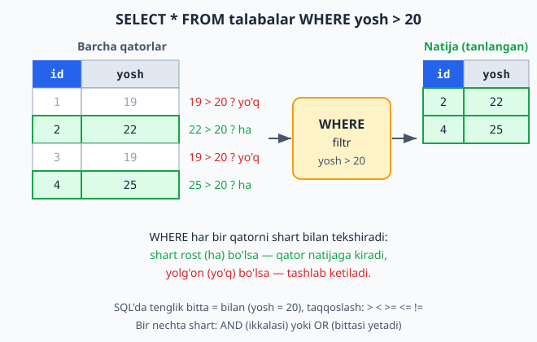

> **Diqqat:** SQL'da tenglikni tekshirish **bitta** `=` bilan (`WHERE yosh = 20`). PHP'da `==` edi. SQL'da `=` ham saqlash, ham taqqoslash uchun — chunki kontekst aniq. Buni aralashtirmang.

### Qidiruv — `LIKE`

Matn ichida qidirish uchun `LIKE` ishlatiladi. `%` belgisi "istalgan narsa" degani:

```sql
-- Ismi 'Ali' bilan boshlanadiganlar
SELECT * FROM talabalar WHERE ism LIKE 'Ali%';

-- Ismida 'val' bo'lganlar (qayerda bo'lsa ham)
SELECT * FROM talabalar WHERE ism LIKE '%val%';
```

`'Ali%'` — "Ali bilan boshlanadigan"; `'%val%'` — "ichida val bo'lgan". `%` — joker belgi (o'rnida istalgancha belgi bo'lishi mumkin).

### Saralash — `ORDER BY`

Natijani tartiblaydi:

```sql
-- Yosh bo'yicha o'sish tartibida (kichikdan kattaga)
SELECT * FROM talabalar ORDER BY yosh ASC;

-- Yosh bo'yicha kamayish tartibida (kattadan kichikka)
SELECT * FROM talabalar ORDER BY yosh DESC;

-- Ism bo'yicha alifbo tartibida
SELECT * FROM talabalar ORDER BY ism ASC;
```

- **`ORDER BY yosh`** — "yosh bo'yicha tartibla".
- **`ASC`** — o'sish (ascending, kichikdan kattaga). Standart — agar yozmasangiz, ASC bo'ladi.
- **`DESC`** — kamayish (descending, kattadan kichikka).

### Cheklash — `LIMIT`

Faqat ma'lum sondagi qatorni qaytaradi:

```sql
-- Faqat birinchi 5 ta qator
SELECT * FROM talabalar LIMIT 5;

-- Eng yosh 3 talaba (saralab, keyin cheklash)
SELECT * FROM talabalar ORDER BY yosh ASC LIMIT 3;
```

`LIMIT` ayniqsa katta jadvallarda foydali — "barcha 10000 qatorni emas, faqat birinchi 20 tasini ko'rsat" (masalan, saytda sahifalash uchun).

### Hammasini birga ishlatish

SQL'ning kuchi — bularni birlashtirish mumkin:

```sql
-- Toshkentdagi talabalarni, yoshi bo'yicha kamayish tartibida, eng katta 5 tasi
SELECT ism, yosh
FROM talabalar
WHERE shahar = 'Toshkent'
ORDER BY yosh DESC
LIMIT 5;
```

Tartib muhim: avval `SELECT ... FROM`, keyin `WHERE`, keyin `ORDER BY`, oxirida `LIMIT`.

### Mashqlar

**Oson**
1. `WHERE` bilan 20 yoshdan kattalarni tanlang.
2. `WHERE` bilan ma'lum shahardagilarni tanlang.
3. `ORDER BY` bilan talabalarni yosh bo'yicha saralang.
4. `LIMIT` bilan faqat birinchi 3 qatorni oling.
5. `ORDER BY ism` bilan alifbo tartibida saralang.

**O'rta**
6. `AND` bilan ikki shartni birlashtiring (yosh > 18 va shahar = 'Toshkent').
7. `OR` bilan ikki shahardan birini tanlang.
8. `LIKE 'A%'` bilan ismi A bilan boshlanadiganlarni toping.
9. Eng yosh 3 talabani toping (`ORDER BY yosh ASC LIMIT 3`).
10. `mahsulotlar` dan narxi 50000 dan arzonlarini, narx bo'yicha o'sish tartibida tanlang.

**Qiyin**
11. Toshkentdagi, 20 yoshdan katta talabalarni, ism bo'yicha alifbo tartibida, eng ko'pi 10 ta qilib tanlang (barcha qismlarni birga: `WHERE ... AND ... ORDER BY ... LIMIT ...`).
12. `mahsulotlar` dan: nomida "telefon" so'zi bo'lgan (`LIKE '%telefon%'`), narxi bo'yicha eng qimmat 5 tasini toping.
13. `BETWEEN` ni o'rganing (internetdan): 18 dan 25 gacha bo'lgan talabalarni `WHERE yosh BETWEEN 18 AND 25` bilan toping. Bu `yosh >= 18 AND yosh <= 25` bilan bir xil.

<details markdown="1">
<summary>Yechim — 11</summary>

```sql
SELECT *
FROM talabalar
WHERE shahar = 'Toshkent' AND yosh > 20
ORDER BY ism ASC
LIMIT 10;
```
Diqqat: qismlar aniq tartibda — `WHERE` (filtr), `ORDER BY` (saralash), `LIMIT` (cheklash). Bu tartibni SQL talab qiladi.
</details>

<details markdown="1">
<summary>Yechim — 12 (LIKE va eng qimmat 5 ta)</summary>

```sql
SELECT * FROM mahsulotlar
WHERE nom LIKE '%telefon%'
ORDER BY narx DESC
LIMIT 5;
```
`LIKE '%telefon%'` — nomida "telefon" so'zi bo'lgan (boshida, o'rtasida yoki oxirida) mahsulotlarni topadi. `ORDER BY narx DESC` ularni narx bo'yicha kamayish (qimmatdan arzonga) tartiblaydi, `LIMIT 5` esa eng qimmat 5 tasini qoldiradi.
</details>

<details markdown="1">
<summary>Yechim — 13 (BETWEEN bilan oraliq)</summary>

```sql
SELECT * FROM talabalar WHERE yosh BETWEEN 18 AND 25;

-- Bu quyidagi bilan bir xil:
SELECT * FROM talabalar WHERE yosh >= 18 AND yosh <= 25;
```
`BETWEEN 18 AND 25` — 18 dan 25 gacha (chegaralar **ham kiradi**). Bu `yosh >= 18 AND yosh <= 25` ning qisqa, o'qishli ko'rinishi. Oraliq bo'yicha qidirishda qulay.
</details>

---

<a name="35-join"></a>
## 3.5 Jadvallarni bog'lash (JOIN)

### Muammo: takrorlanuvchi ma'lumot

Tasavvur qiling, kitoblar jadvalini yaratyapmiz. Har bir kitobning muallifi bor. Eng oddiy yo'l — muallif ismini to'g'ridan-to'g'ri kitoblar jadvaliga yozish:

```
kitoblar:
+----+------------------+------------------+
| id | nom              | muallif          |
+----+------------------+------------------+
| 1  | O'tkan kunlar    | Abdulla Qodiriy  |
| 2  | Mehrobdan chayon | Abdulla Qodiriy  |
| 3  | Sarob            | Abdulla Qahhor   |
+----+------------------+------------------+
```

Muammo ko'rinyaptimi? "Abdulla Qodiriy" ikki marta yozilgan. Agar uning 50 ta kitobi bo'lsa — ism 50 marta takrorlanadi. Va agar ismda xato topilsa (yoki o'zgartirish kerak bo'lsa) — 50 joyni tuzatish kerak. Bu — isrof va xatolar manbai.

### Yechim: ma'lumotni ajratish va bog'lash

To'g'ri yondashuv: mualliflarni **alohida jadvalga** chiqaramiz, kitoblarda esa faqat muallifning **id**'sini saqlaymiz:

```
mualliflar:                      kitoblar:
+----+------------------+        +----+------------------+-----------+
| id | ism              |        | id | nom              | muallif_id|
+----+------------------+        +----+------------------+-----------+
| 1  | Abdulla Qodiriy  |        | 1  | O'tkan kunlar    | 1         |
| 2  | Abdulla Qahhor   |        | 2  | Mehrobdan chayon | 1         |
+----+------------------+        | 3  | Sarob            | 2         |
                                 +----+------------------+-----------+
```

Endi har bir muallif **bir marta** yoziladi. Kitoblar jadvalidagi `muallif_id` ustuni mualliflar jadvalidagi `id` ga ishora qiladi. Masalan, "O'tkan kunlar"ning `muallif_id` = 1, demak uning muallifi — mualliflar jadvalidagi id'si 1 bo'lgan inson (Abdulla Qodiriy).

Bu — **bog'liq jadvallar** (relational database) g'oyasi. `muallif_id` kabi, boshqa jadvalga ishora qiluvchi ustun **tashqi kalit** (foreign key) deb ataladi.

### JOIN — bog'langan ma'lumotni birlashtirish

Endi muammo: kitob nomini **va** muallif ismini birga ko'rsatmoqchimiz. Lekin ular ikki alohida jadvalda. **JOIN** ana shu ikki jadvalni `id` orqali "bir-biriga ulaydi":

```sql
SELECT kitoblar.nom, mualliflar.ism
FROM kitoblar
JOIN mualliflar ON kitoblar.muallif_id = mualliflar.id;
```

Natija:
```
+------------------+------------------+
| nom              | ism              |
+------------------+------------------+
| O'tkan kunlar    | Abdulla Qodiriy  |
| Mehrobdan chayon | Abdulla Qodiriy  |
| Sarob            | Abdulla Qahhor   |
+------------------+------------------+
```

Tushuntiramiz:
- **`SELECT kitoblar.nom, mualliflar.ism`** — ikki jadvaldan ustun olamiz. `jadval.ustun` ko'rinishida yozamiz, chunki ikki jadval bor (qaysi jadvalning ustuni ekanini aniqlash uchun).
- **`FROM kitoblar`** — asosiy jadval.
- **`JOIN mualliflar ON kitoblar.muallif_id = mualliflar.id`** — "mualliflar jadvalini ham qo'sh, ularni shu shart bo'yicha bog'la: kitobning `muallif_id`'si muallifning `id`'siga teng bo'lganda".

`ON` qismi — eng muhimi: u ikki jadvalni qanday bog'lashni aytadi. Bu yerda: "har bir kitobni, uning `muallif_id`'siga mos keladigan muallif bilan birlashtir".

Quyidagi diagramma `JOIN` jarayonini ko'rsatadi: kitoblar jadvalidagi `muallif_id` mualliflar jadvalidagi `id` ga bog'lanadi va ikki jadval bitta natijaga birlashadi:

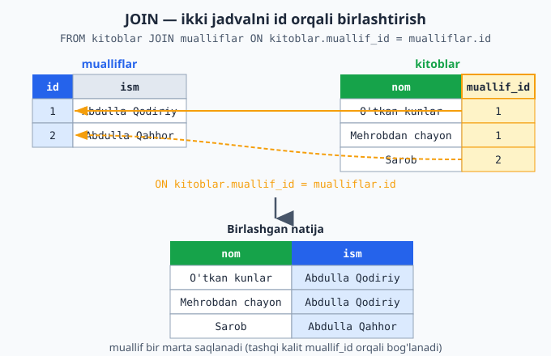

### Nega foydali?

1. **Takrorlanmaslik:** har ma'lumot bir marta saqlanadi (muallif ismi bir joyda).
2. **Oson o'zgartirish:** muallif ismi o'zgarsa — bir joyni tuzatasiz, hamma kitoblarga ta'sir qiladi.
3. **Tartib:** ma'lumot mantiqiy bo'linadi (mualliflar alohida, kitoblar alohida), keyin kerak bo'lganda birlashtiriladi.

> Bu — boshlovchilar uchun biroz murakkab mavzu. Asosiy g'oyani tushunsangiz yetarli: **bog'liq ma'lumotni alohida jadvallarga ajratamiz, keyin JOIN bilan birlashtiramiz.** Amalda ko'p mashq qilsangiz, oydinlashadi.

### Mashqlar

> Avval `mualliflar` va `kitoblar` jadvallarini yarating (phpMyAdmin'da), ma'lumot bilan to'ldiring.

**Oson**
1. `mualliflar` (id, ism) va `kitoblar` (id, nom, muallif_id) jadvallarini yarating.
2. 2 ta muallif va 4 ta kitob qo'shing (kitoblarning `muallif_id`'sini to'g'ri bog'lang).
3. Oddiy `JOIN` bilan kitob nomi va muallif ismini birga chiqaring.

**O'rta**
4. JOIN natijasini muallif ismi bo'yicha saralang (`ORDER BY mualliflar.ism`).
5. Faqat ma'lum bir muallifning kitoblarini JOIN + WHERE bilan toping.
6. `talabalar` va `baholar` (id, talaba_id, fan, ball) jadvallarini yarating, JOIN bilan har bir talabaning bahosini ism bilan chiqaring.

**Qiyin**
7. `talabalar`, `kurslar` (id, nom) va `yozilishlar` (id, talaba_id, kurs_id) jadvallarini yarating. Bu — "ko'pga-ko'p" bog'lanish (bir talaba ko'p kursga, bir kursga ko'p talaba). Ikki JOIN bilan: qaysi talaba qaysi kursga yozilganini ism va kurs nomi bilan chiqaring.
8. JOIN + WHERE + ORDER BY ni birga ishlating: ma'lum bir kursga yozilgan talabalarni, ism bo'yicha tartiblab chiqaring.

<details markdown="1">
<summary>Yechim — 6 (talaba baholari)</summary>

```sql
-- Jadvallar:
-- talabalar (id, ism)
-- baholar (id, talaba_id, fan, ball)

SELECT talabalar.ism, baholar.fan, baholar.ball
FROM baholar
JOIN talabalar ON baholar.talaba_id = talabalar.id
ORDER BY talabalar.ism;
```
Natija har bir bahoni talaba ismi bilan ko'rsatadi, masalan: `Ali | Matematika | 90`. JOIN `baholar.talaba_id` ni `talabalar.id` ga bog'lab, qaysi baho qaysi talabaga tegishli ekanini aniqlaydi.
</details>

<details markdown="1">
<summary>Yechim — 7 (ko'pga-ko'p bog'lanish: ikki JOIN)</summary>

```sql
-- Jadvallar:
-- talabalar (id, ism)
-- kurslar (id, nom)
-- yozilishlar (id, talaba_id, kurs_id)   -- "bog'lovchi" jadval

SELECT talabalar.ism, kurslar.nom
FROM yozilishlar
JOIN talabalar ON yozilishlar.talaba_id = talabalar.id
JOIN kurslar   ON yozilishlar.kurs_id   = kurslar.id;
```
"Ko'pga-ko'p" (bir talaba ko'p kursga, bir kursga ko'p talaba) bog'lanish uchun **oraliq (bog'lovchi) jadval** — `yozilishlar` — ishlatiladi. U faqat ikkita `id`ni (talaba va kurs) bog'laydi. So'rovda **ikkita JOIN**: biri talaba ismini, ikkinchisi kurs nomini olib keladi. Natija: `Ali | Matematika`, `Ali | Fizika`, `Vali | Matematika` ...
</details>

<details markdown="1">
<summary>Yechim — 8 (JOIN + WHERE + ORDER BY)</summary>

```sql
SELECT talabalar.ism
FROM yozilishlar
JOIN talabalar ON yozilishlar.talaba_id = talabalar.id
JOIN kurslar   ON yozilishlar.kurs_id   = kurslar.id
WHERE kurslar.nom = 'Matematika'
ORDER BY talabalar.ism;
```
Bu — "Matematika" kursiga yozilgan talabalarni, ism bo'yicha alifbo tartibida beradi. `JOIN` jadvallarni bog'laydi, `WHERE` kurs bo'yicha filtrlaydi, `ORDER BY` saralaydi — uchalasi birga ishlaydi.
</details>

---

<a name="36-pdo"></a>
## 3.6 PHP'dan bazaga ulanish (PDO)

Hozirgacha SQL'ni phpMyAdmin'da qo'lda yozdik. Lekin haqiqiy dasturda **PHP kodi** bazaga ulanib, SQL buyruqlarini yuborishi kerak. Mana shu — PHP va ma'lumotlar bazasini birlashtiradigan eng muhim qadam. Buning uchun **PDO** degan vositadan foydalanamiz.

**PDO (PHP Data Objects)** — PHP'ni ma'lumotlar bazasiga ulaydigan standart, xavfsiz vosita.

### Bazaga ulanish

```php
<?php
$pdo = new PDO(
    "mysql:host=localhost;dbname=maktab;charset=utf8mb4",
    "root",   // foydalanuvchi nomi (XAMPP'da odatda "root")
    ""        // parol (XAMPP'da odatda bo'sh)
);
```

Tushuntiramiz:
- **`new PDO(...)`** — bazaga ulanish obyektini yaratamiz (PDO — class, biz undan obyekt yaratamiz).
- **`"mysql:host=localhost;dbname=maktab;..."`** — ulanish ma'lumotlari: `mysql` turi, `localhost` (shu kompyuter), `dbname=maktab` (qaysi baza).
- **`"root"`** va **`""`** — foydalanuvchi va parol. XAMPP'da standart sozlama: foydalanuvchi `root`, parol bo'sh.

> Agar ulanish xato bersa, MySQL XAMPP'da ishlab turganini tekshiring va baza nomi to'g'riligiga ishonch hosil qiling.

### Ma'lumot o'qish — `query`

Oddiy o'qish so'rovini `query` bilan yuboramiz va natijani `foreach` bilan aylanib chiqamiz:

```php
<?php
$pdo = new PDO("mysql:host=localhost;dbname=maktab;charset=utf8mb4", "root", "");

$natija = $pdo->query("SELECT * FROM talabalar");

foreach ($natija as $qator) {
    echo $qator['ism'] . " - " . $qator['yosh'] . " yosh<br>";
}
```

Nima sodir bo'ldi:
- `$pdo->query("SELECT ...")` — bazaga so'rov yuboradi va natijani qaytaradi.
- Natija — qatorlar to'plami. Har bir qator — **kalitli massiv** (1.8'da o'rgangan!), kalitlari ustun nomlari (`ism`, `yosh`).
- `foreach` bilan har bir qatorni olamiz, `$qator['ism']` orqali ustun qiymatini o'qiymiz.

Ko'ryapsizmi — bu yerda hamma narsa birlashdi: PHP (`foreach`, massiv) + SQL (`SELECT`) + baza. Bazadagi ma'lumot endi PHP kodingizga keldi.

### Foydalanuvchi ma'lumoti bilan ishlash — XAVFSIZLIK

Endi eng muhim mavzu. Ko'pincha so'rovga **foydalanuvchidan kelgan** ma'lumot qo'shamiz. Masalan, "id'si shu bo'lgan talabani top". Buni **noto'g'ri** qilish — jiddiy xavfsizlik teshigiga olib keladi.

**❌ XAVFLI usul — hech qachon bunday qilmang:**

```php
<?php
$id = $_GET['id'];   // foydalanuvchidan kelgan ma'lumot
// XAVFLI: foydalanuvchi ma'lumotini to'g'ridan-to'g'ri so'rovga qo'shish
$natija = $pdo->query("SELECT * FROM talabalar WHERE id = $id");
```

Nega xavfli? Chunki foydalanuvchi `$id` o'rniga zararli SQL kodini kiritishi mumkin. Bu — **SQL injection** degan hujum. Yomon niyatli odam shu orqali butun bazangizni o'qishi yoki o'chirishi mumkin. Bu — eng keng tarqalgan va xavfli xatolardan biri.

**✅ TO'G'RI usul — "prepared statement" (tayyorlangan so'rov):**

```php
<?php
$id = $_GET['id'];

// 1) So'rovni "tayyorlaymiz" — qiymat o'rniga ? belgisi qo'yamiz
$stmt = $pdo->prepare("SELECT * FROM talabalar WHERE id = ?");

// 2) Qiymatni alohida, xavfsiz tarzda beramiz
$stmt->execute([$id]);

// 3) Natijani olamiz
$talaba = $stmt->fetch();

echo $talaba['ism'];
```

Tushuntiramiz:
- **`prepare("... WHERE id = ?")`** — so'rovni tayyorlaymiz, qiymat o'rniga **`?`** (savol belgisi) qo'yamiz.
- **`execute([$id])`** — qiymatni alohida beramiz. PHP uni xavfsiz tarzda joylaydi — endi zararli kod ishlamaydi.
- **`fetch()`** — bitta qatorni oladi (`fetchAll()` — barcha qatorlarni).

**Asosiy qoida:** foydalanuvchidan kelgan har qanday ma'lumot so'rovga `?` orqali, `prepare`/`execute` bilan qo'shilishi shart. Hech qachon to'g'ridan-to'g'ri so'rov ichiga yozmang. Bu — sizning bazangizni himoyalaydi.

Quyidagi diagramma butun oqimni ko'rsatadi: PHP qiymatni PDO'ga beradi, PDO uni prepared statement bilan bazaga xavfsiz yuboradi va natijani PHP'ga qaytaradi:

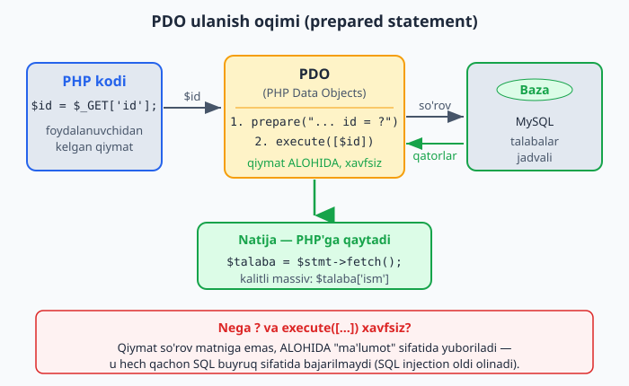

### Ma'lumot qo'shish (xavfsiz)

```php
<?php
$ism = "Yangi Talaba";
$yosh = 18;
$shahar = "Toshkent";

$stmt = $pdo->prepare("INSERT INTO talabalar (ism, yosh, shahar) VALUES (?, ?, ?)");
$stmt->execute([$ism, $yosh, $shahar]);

echo "Talaba qo'shildi!";
```

Bir nechta qiymat bo'lsa, har biriga bitta `?` qo'yamiz va `execute`ga massiv sifatida (tartibda) beramiz.

### Mashqlar

> Bu mashqlar uchun `maktab` bazasi va `talabalar` jadvali tayyor bo'lsin. Fayllarni `htdocs/darslar` ichida yarating, `http://localhost/...` orqali oching.

**Oson**
1. PDO bilan `maktab` bazasiga ulaning (xato bo'lmasligini tekshiring).
2. `query` bilan barcha talabalarni o'qing va `foreach` bilan ismlarini chiqaring.
3. Har bir talabaning ism va yoshini birga chiqaring.
4. `prepare`/`execute` bilan id'si 1 bo'lgan talabani toping va chiqaring.
5. `prepare`/`execute` bilan yangi talaba qo'shing.

**O'rta**
6. Faqat Toshkentdagi talabalarni o'qing (`WHERE shahar = ?` bilan, prepared).
7. `fetchAll()` bilan barcha talabalarni massivga oling va sonini (`count`) chiqaring.
8. `mahsulotlar` jadvalidagi barcha mahsulotlarni narxi bilan chiqaring.
9. Foydalanuvchidan kelgan `$_GET['id']` bo'yicha talabani xavfsiz (prepared) qidiring.
10. Bir talabaning yoshini `UPDATE` + prepared statement bilan o'zgartiring.

**Qiyin**
11. To'liq "talabalar ro'yxati" sahifasini yarating: bazadan barcha talabalarni o'qib, ularni HTML jadval (`<table>`) ko'rinishida chiqaring. (`<table>`, `<tr>`, `<td>` teglaridan foydalaning — internetdan ko'ring.)
12. SQL injection xavfini amalda tushuntiring: nima uchun `"WHERE id = $id"` xavfli va `"WHERE id = ?"` xavfsiz ekanini o'z so'zingiz bilan yozing.
13. JOIN'ni PHP'dan ishlating: `kitoblar` va `mualliflar` ni JOIN qilib, har bir kitob nomi va muallifini PHP bilan o'qib chiqaring.

<details markdown="1">
<summary>Yechim — 11 (talabalar ro'yxati sahifasi)</summary>

```php
<?php
$pdo = new PDO("mysql:host=localhost;dbname=maktab;charset=utf8mb4", "root", "");
$natija = $pdo->query("SELECT * FROM talabalar ORDER BY ism");
?>

<table border="1" cellpadding="8">
    <tr>
        <th>ID</th>
        <th>Ism</th>
        <th>Yosh</th>
        <th>Shahar</th>
    </tr>
    <?php foreach ($natija as $qator): ?>
        <tr>
            <td><?= $qator['id'] ?></td>
            <td><?= $qator['ism'] ?></td>
            <td><?= $qator['yosh'] ?></td>
            <td><?= $qator['shahar'] ?></td>
        </tr>
    <?php endforeach; ?>
</table>
```

> **Yangi narsa: `<?= ... ?>`**. Bu — `<?php echo ... ?>` ning qisqa shakli. HTML ichida PHP qiymatini chiqarish uchun qulay. `<?= $qator['ism'] ?>` degani — "shu yerga ismni chiqar".
>
> Bu misol PHP va HTML'ni birlashtiradi: PHP bazadan ma'lumot oladi, HTML uni chiroyli jadval qilib ko'rsatadi. Bu — haqiqiy veb-sahifaning oddiy ko'rinishi!
</details>

<details markdown="1">
<summary>Yechim — 12 (SQL injection nega xavfli)</summary>

`"WHERE id = $id"` xavfli, chunki foydalanuvchi `$id` o'rniga oddiy son emas, **zararli SQL** kiritishi mumkin. Masalan, manzilga `?id=0 OR 1=1` yozsa, so'rov shunday bo'ladi:

```sql
SELECT * FROM talabalar WHERE id = 0 OR 1=1
```

`1=1` har doim rost — natijada **barcha** talabalar qaytadi. Yomonroq holatda hujumchi `DROP TABLE`, parollarni o'qish kabi buyruqlar qo'shishi mumkin.

`"WHERE id = ?"` (prepared statement) xavfsiz, chunki:

```php
<?php
$stmt = $pdo->prepare("SELECT * FROM talabalar WHERE id = ?");
$stmt->execute([$id]);
```

Bu yerda `$id` **alohida**, "ma'lumot" sifatida yuboriladi — u hech qachon "buyruq" (SQL kod) sifatida bajarilmaydi. Foydalanuvchi `0 OR 1=1` yozsa ham, PHP uni butun matn sifatida `id` ga qo'yadi, kod sifatida emas. Shuning uchun **qoida:** foydalanuvchi ma'lumotini hech qachon so'rov matniga to'g'ridan-to'g'ri qo'shmang — doim `?` va `execute([...])` ishlating.
</details>

<details markdown="1">
<summary>Yechim — 13 (PHP'dan JOIN)</summary>

```php
<?php
$pdo = new PDO("mysql:host=localhost;dbname=maktab;charset=utf8mb4", "root", "");

$sql = "SELECT kitoblar.nom, mualliflar.ism
        FROM kitoblar
        JOIN mualliflar ON kitoblar.muallif_id = mualliflar.id";

$natija = $pdo->query($sql);

foreach ($natija as $qator) {
    echo $qator['nom'] . " — " . $qator['ism'] . "<br>";
}
// O'tkan kunlar — Abdulla Qodiriy
// Mehrobdan chayon — Abdulla Qodiriy
// Sarob — Abdulla Qahhor
```
JOIN'li so'rov PHP'da ham xuddi oddiy `SELECT` kabi ishlaydi: `query` bilan yuboramiz, `foreach` bilan aylanib chiqamiz. Har bir `$qator` ikkala jadvaldan kelgan ustunlarni (`nom`, `ism`) o'z ichiga oladi. (Bu so'rovda foydalanuvchi ma'lumoti yo'q, shuning uchun `query` yetadi; bo'lsa — `prepare`/`execute` ishlatardik.)
</details>

---

<a name="37-postgresql"></a>
## 3.7 PostgreSQL va MySQL'dan farqlari

Hozirgacha MySQL bilan ishladik (XAMPP'da bor). Lekin boshqa baza tizimlari ham mavjud. Eng kuchlilaridan biri — **PostgreSQL** (qisqacha "Postgres"). Uni bilish foydali, chunki ko'p loyihalarda ishlatiladi.

Yaxshi xabar: **siz o'rgangan SQL'ning deyarli hammasi PostgreSQL'da ham bir xil ishlaydi.** `SELECT`, `INSERT`, `UPDATE`, `DELETE`, `WHERE`, `ORDER BY`, `JOIN` — barchasi o'sha-o'sha. Faqat ba'zi kichik farqlar bor.

### Asosiy farqlar

| Mavzu | MySQL | PostgreSQL |
|---|---|---|
| Avtomatik ID | `INT AUTO_INCREMENT` | `SERIAL` |
| Matn turi | `VARCHAR`, `TEXT` | `VARCHAR`, `TEXT` (bir xil) |
| Katta/kichik harf (matn qidirishda) | farq qilmaydi (`=`) | farq qiladi |
| Qidiruvda harf sezmaslik | `LIKE` | `ILIKE` (harf sezmaydigan) |
| Standart o'rnatish | XAMPP'da bor | alohida o'rnatiladi |

Masalan, jadval yaratishda farq faqat ID turida:

```sql
-- MySQL:
CREATE TABLE talabalar (
    id INT AUTO_INCREMENT PRIMARY KEY,
    ism VARCHAR(100),
    yosh INT
);

-- PostgreSQL — deyarli bir xil, faqat id boshqacha:
CREATE TABLE talabalar (
    id SERIAL PRIMARY KEY,
    ism VARCHAR(100),
    yosh INT
);
```

Ko'ryapsizmi — farq juda kichik. SQL bilimingiz ikkala bazaga ham yaraydi.

### PHP'dan PostgreSQL'ga ulanish

Eng yoqimli tomoni: PDO ikkala baza bilan ham deyarli bir xil ishlaydi. Faqat **ulanish satrida** `mysql` o'rniga `pgsql` yoziladi:

```php
<?php
// MySQL:
$pdo = new PDO("mysql:host=localhost;dbname=maktab", "root", "");

// PostgreSQL — faqat boshi o'zgaradi:
$pdo = new PDO("pgsql:host=localhost;dbname=maktab", "postgres", "parol");
```

Ulangandan keyin — `query`, `prepare`, `execute`, `fetch` — hammasi bir xil. PDO'ning kuchi shu: bir marta o'rgansangiz, turli bazalar bilan ishlay olasiz.

### Qaysi birini tanlash?

- **MySQL** — keng tarqalgan, o'rganish oson, ko'p hosting qo'llab-quvvatlaydi. Boshlovchi uchun ideal va XAMPP'da tayyor. Hozircha shuni ishlatavering.
- **PostgreSQL** — murakkabroq loyihalar, qat'iyroq qoidalar va kuchli imkoniyatlar kerak bo'lganda yaxshi tanlov.

> **Boshlovchi uchun maslahat:** hozircha MySQL'ga e'tibor bering — u sizda bor va hamma narsani o'rganish uchun yetarli. PostgreSQL borligini va SQL bilimingiz unga ham yarashini bilib qo'ying; kelajakda kerak bo'lganda, uni alohida o'rnatib (rasmiy saytidan), o'sha bilim bilan ishlatasiz.

### Mashqlar

**Oson**
1. MySQL va PostgreSQL'da `CREATE TABLE` ning farqini (faqat ID qismi) yozing.
2. PostgreSQL uchun `talabalar` jadvalini yaratish SQL'ini yozing (`SERIAL` bilan).
3. PDO ulanish satrini MySQL va PostgreSQL uchun yonma-yon yozing.

**O'rta**
4. O'rgangan biror `SELECT ... WHERE ... ORDER BY` so'rovingizni oling — u ikkala bazada ham bir xil ishlashiga ishonch hosil qiling (o'zgartirish kerakmas).
5. `LIKE` (MySQL) va `ILIKE` (PostgreSQL) farqini izohlang — qaysi biri harf katta-kichikligini sezmaydi?

**Qiyin**
6. Agar imkoningiz bo'lsa, PostgreSQL'ni o'rnatib ko'ring (rasmiy saytdan), bitta jadval yarating va MySQL'dagi bilimlaringizni unda sinab ko'ring. (Ixtiyoriy — hozir shart emas.)

<details markdown="1">
<summary>Yechim — 6 (PostgreSQL'da sinash — yo'riqnoma)</summary>

Bu — amaliy, ixtiyoriy mashq. Qadamlar:

1. `postgresql.org/download` dan o'rnating (Windows uchun o'rnatuvchi bor; u bilan birga `pgAdmin` ham keladi — bu PostgreSQL'ning phpMyAdmin'iga o'xshash vositasi).
2. `pgAdmin`da baza yarating (masalan, `maktab`).
3. Jadval yarating — MySQL'dan farqi faqat `id`da:

```sql
CREATE TABLE talabalar (
    id SERIAL PRIMARY KEY,    -- MySQL'dagi AUTO_INCREMENT o'rniga SERIAL
    ism VARCHAR(100),
    yosh INT
);

INSERT INTO talabalar (ism, yosh) VALUES ('Ali', 19);
SELECT * FROM talabalar WHERE yosh > 18 ORDER BY ism;
```

Ko'rasizki, `SELECT`, `INSERT`, `WHERE`, `ORDER BY` — hammasi MySQL'dagidek. Bilimingiz to'liq ishlaydi, faqat `SERIAL` va ulanish qatori (`pgsql:...`) farq qiladi. Maqsad — "SQL bilimi bazadan bazaga ko'chadi" degan ishonchni amalda his qilish.
</details>

---

> **3-QISM yakunlandi!** Endi siz ma'lumotni **doimiy saqlay olasiz** — bu haqiqiy dasturlar yo'lidagi katta qadam. Siz: ma'lumotlar bazasi nima ekanini, phpMyAdmin'da jadval yaratishni, SQL bilan ma'lumot qo'shish/o'qish/o'zgartirish/o'chirishni, filtrlash va saralashni, jadvallarni JOIN bilan bog'lashni, PHP'dan PDO orqali xavfsiz ulanishni (SQL injection'dan himoya bilan) va PostgreSQL farqlarini bilasiz.
>
> Endi sizda haqiqiy dastur yozish uchun barcha asosiy qismlar bor: PHP mantiq (1-QISM), tartibli kod (2-QISM, OOP) va doimiy ma'lumot (3-QISM, baza). Keyingi qismlarda bularni birlashtirib, kodni **professional** darajada tashkil qilishni va ilg'or mavzularni — har birini batafsil tushuntirish bilan — ko'rib chiqamiz.

---

<a name="41-formalar"></a>
# 4-QISM — VEB DASTURLASH (Formalar va Amaliyot)

## 4.1 Formalar va foydalanuvchi ma'lumoti

Hozirgacha ma'lumotni kod ichida o'zimiz yozardik (`$ism = "Ali"`). Lekin haqiqiy saytda ma'lumotni **foydalanuvchi** kiritadi: ro'yxatdan o'tish formasi, qidiruv maydoni, izoh yozish. Bu bo'limda foydalanuvchidan ma'lumot olishni o'rganamiz — bu PHP'ning asosiy vazifalaridan biri.

### Forma — ma'lumot kiritish oynasi

**Forma (form)** — bu sahifadagi maydonlar (matn katakchasi, tugma va h.k.) orqali foydalanuvchidan ma'lumot oladigan qism. Forma HTML bilan yoziladi:

```html
<form method="post" action="natija.php">
    Ismingiz: <input type="text" name="ism">
    <br>
    Yoshingiz: <input type="number" name="yosh">
    <br>
    <button type="submit">Yuborish</button>
</form>
```

Tushuntiramiz:
- **`<form>`** — forma boshlanishi.
- **`method="post"`** — ma'lumot qanday yuborilishi (pastda tushuntiramiz).
- **`action="natija.php"`** — ma'lumot **qaysi faylga** yuboriladi. "Yuborish" bosilganda, forma `natija.php` ga ma'lumotni jo'natadi.
- **`<input type="text" name="ism">`** — matn kiritish maydoni. **`name="ism"`** juda muhim: bu maydonning "nomi", PHP'da shu nom orqali qiymatni olamiz.
- **`<button type="submit">`** — yuborish tugmasi.

### Ma'lumotni PHP'da olish — `$_POST`

Forma yuborilganda, ma'lumot `action`dagi faylga keladi. PHP uni **`$_POST`** degan maxsus massivdan oladi (`method="post"` bo'lsa):

```php
<?php
// natija.php fayli
$ism = $_POST['ism'];     // formadagi name="ism" maydonidan
$yosh = $_POST['yosh'];   // name="yosh" maydonidan

echo "Salom, " . $ism . "! Siz " . $yosh . " yoshdasiz.";
```

`$_POST` — bu PHP avtomatik to'ldiradigan **kalitli massiv** (1.8'da o'rgangan!). Kalitlari — formadagi maydon nomlari (`name`). `$_POST['ism']` — "formadagi ism maydonining qiymati".

> **Ikki fayl ishtirok etadi:** biri forma (HTML) — uni brauzerda ochib to'ldirasiz; ikkinchisi natija fayli (PHP) — forma yuborilganda ishlaydi va ma'lumotni qabul qiladi. `action` ularni bog'laydi.

### `$_GET` va `$_POST` farqi

Ma'lumot yuborishning ikki usuli bor:

- **POST** (`$_POST`) — ma'lumot "yashirin" yuboriladi (manzilda ko'rinmaydi). Parol, shaxsiy ma'lumot, ma'lumot saqlash uchun ishlatiladi.
- **GET** (`$_GET`) — ma'lumot **manzil qatorida** yuboriladi (`sayt.php?ism=Ali&yosh=19` ko'rinishida). Qidiruv, filtrlash, havola orqali ma'lumot uzatish uchun.

```php
<?php
// Manzil: natija.php?ism=Ali
echo $_GET['ism'];   // Ali
```

Oddiy qoida: **ma'lumotni o'zgartirish/saqlash** (forma yuborish, ro'yxatdan o'tish) → POST. **Ma'lumot olish/qidirish** → GET.

Quyidagi diagramma formadan ma'lumot serverga qanday borishini va POST hamda GET farqini ko'rsatadi:

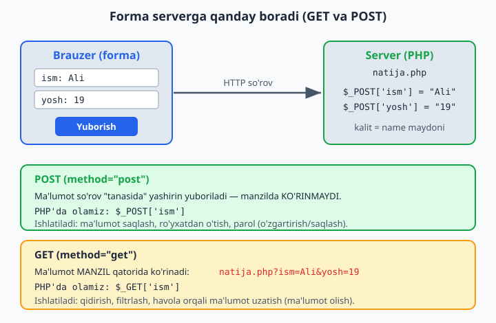

### Ma'lumotni tekshirish (juda muhim!)

Foydalanuvchi ma'lumotiga **hech qachon ishonmang** — u bo'sh, noto'g'ri yoki zararli bo'lishi mumkin. Doim tekshiring:

```php
<?php
// Maydon to'ldirilganmi, tekshiramiz
if (empty($_POST['ism'])) {
    echo "Iltimos, ismingizni kiriting!";
} else {
    $ism = trim($_POST['ism']);   // ortiqcha bo'sh joyni tozalaymiz (1.5)
    echo "Salom, " . htmlspecialchars($ism);
}
```

- **`empty(...)`** — maydon bo'sh yoki to'ldirilmaganmi, tekshiradi.
- **`trim(...)`** — ortiqcha bo'sh joyni oladi.
- **`htmlspecialchars(...)`** — bu **muhim xavfsizlik vositasi**: foydalanuvchi kiritgan matnni "zararsizlantiradi". Buni 4.4'da (xavfsizlik) batafsil ko'ramiz — hozircha shuni eslang: foydalanuvchi matnini ekranga chiqarganda doim `htmlspecialchars` orqali chiqaring.

### Mashqlar

> Bu mashqlar uchun ikki fayl yarating: `forma.php` (HTML forma) va `natija.php` (qabul qiluvchi PHP). `forma.php` ni brauzerda oching.

**Oson**
1. Bitta matn maydonli forma yarating (ism uchun), yuborilganda ismni chiqaring.
2. Formaga yosh maydonini ham qo'shing, ikkalasini ham chiqaring.
3. `$_POST` o'rniga `$_GET` ishlatib ko'ring (`method="get"`), manzilda ma'lumot ko'rinishini kuzating.
4. Forma orqali kelgan ismni katta harfda (`strtoupper`) chiqaring.
5. `empty` bilan ism bo'sh yuborilsa "Ism kiriting" deb chiqaring.

**O'rta**
6. Ro'yxatdan o'tish formasi: ism, email, yosh. Hammasini olib, chiroyli chiqaring.
7. Forma orqali ikkita son olib, ularning yig'indisini chiqaring (kalkulyator).
8. Kelgan ismni `trim` va `htmlspecialchars` bilan tozalab chiqaring.
9. Forma maydonlarining hammasi to'ldirilganini tekshiring; biror bo'sh bo'lsa, qaysi biri ekanini ayting.
10. Yoshni tekshiring: agar 18 dan kichik bo'lsa "Voyaga yetmagan", aks holda "Voyaga yetgan".

**Qiyin**
11. To'liq kalkulyator formasi: ikki son va amal (qo'shish/ayirish/ko'paytirish — `<select>` orqali tanlash). Tanlangan amalni bajarib, natijani chiqaring (`if`/`match` bilan).
12. Bir faylda forma **va** uni qabul qilish (alohida fayl emas): forma `action` ni o'ziga (bo'sh `action` yoki o'sha fayl) yo'naltiring, PHP qismida `if ($_POST)` bilan ma'lumot kelgan-kelmaganini tekshiring.

<details markdown="1">
<summary>Yechim — 11 (to'liq kalkulyator)</summary>

```php
<?php
// kalkulyator.php — forma va hisob bir faylda
$natija = null;

if (!empty($_POST['a']) && !empty($_POST['b'])) {
    $a = (float) $_POST['a'];
    $b = (float) $_POST['b'];

    $natija = match($_POST['amal']) {
        'qoshish'     => $a + $b,
        'ayirish'     => $a - $b,
        'kopaytirish' => $a * $b,
        'bolish'      => $b != 0 ? $a / $b : "0 ga bo'lib bo'lmaydi",
        default       => "Noma'lum amal",
    };
}
?>

<form method="post">
    <input type="number" name="a" step="any" required>
    <select name="amal">
        <option value="qoshish">+</option>
        <option value="ayirish">−</option>
        <option value="kopaytirish">×</option>
        <option value="bolish">÷</option>
    </select>
    <input type="number" name="b" step="any" required>
    <button type="submit">=</button>
</form>

<?php if ($natija !== null): ?>
    <p>Natija: <strong><?= htmlspecialchars((string) $natija) ?></strong></p>
<?php endif; ?>
```
`<select>` dan tanlangan amal `$_POST['amal']` ga keladi; `match` uni tegishli hisobga yo'naltiradi. `(float)` — kelgan matnni songa aylantiradi (forma har doim matn yuboradi). Nolga bo'lishni alohida tekshirdik. Forma o'ziga yuboriladi (`action` yo'q), natija pastda chiqadi.
</details>

<details markdown="1">
<summary>Yechim — 12 (forma + qabul bir faylda)</summary>

```php
<?php
// salom.php — forma va qabul bir faylda
$xabar = "";

if (!empty($_POST['ism'])) {              // forma yuborilganmi?
    $ism = htmlspecialchars(trim($_POST['ism']));
    $xabar = "Salom, " . $ism . "!";
}
?>

<form method="post">
    Ismingiz: <input type="text" name="ism">
    <button type="submit">Yuborish</button>
</form>

<p><?= $xabar ?></p>
```
Bu — keng tarqalgan uslub: bitta fayl ham formani ko'rsatadi, ham yuborilganda qabul qiladi. `action` yozilmagani uchun, forma o'ziga yuboriladi. PHP avval ma'lumot kelgan-kelmaganini tekshiradi (`if (!empty(...))`), kelgan bo'lsa — javob tayyorlaydi.
</details>

---

<a name="42-loyiha"></a>
## 4.2 To'liq mini-loyiha: talabalar ro'yxati (CRUD)

Endi hamma narsani birlashtiramiz! PHP mantiq (1-QISM) + ma'lumotlar bazasi (3-QISM) + formalar (4.1) — birgalikda **haqiqiy, ishlaydigan dastur**. Talabalarni qo'shish, ro'yxatini ko'rish va o'chirish mumkin bo'lgan kichik tizim yasaymiz.

Bunday "qo'shish-ko'rish-o'zgartirish-o'chirish" amallari to'plami **CRUD** deb ataladi (3.3'da ko'rgan: Create, Read, Update, Delete). Deyarli har bir dastur — asosan CRUD.

Mana to'rt amal ma'lumotlar bazasi bilan qanday bog'lanishi:


> **Tayyorgarlik:** `maktab` bazasi va `talabalar` jadvali (`id`, `ism`, `yosh`, `shahar`) tayyor bo'lsin (3.2'dagidek). Fayllarni `htdocs/darslar` ichida yarating.

### 1-fayl: `ulanish.php` — bazaga ulanish

Ulanishni alohida faylga yozamiz, keyin uni boshqa fayllarda ishlatamiz (takrorlamaslik uchun — 1.9'dagi g'oya):

```php
<?php
// ulanish.php
$pdo = new PDO("mysql:host=localhost;dbname=maktab;charset=utf8mb4", "root", "");
```

### 2-fayl: `royxat.php` — talabalar ro'yxati va qo'shish formasi

Bu — asosiy sahifa. Talabalar ro'yxatini ko'rsatadi va yangi talaba qo'shish formasini beradi:

```php
<?php
// royxat.php
require 'ulanish.php';   // bazaga ulanishni "ulab olamiz"

// Barcha talabalarni bazadan o'qiymiz
$natija = $pdo->query("SELECT * FROM talabalar ORDER BY id DESC");
?>

<h1>Talabalar ro'yxati</h1>

<!-- Yangi talaba qo'shish formasi -->
<form method="post" action="qoshish.php">
    <input type="text" name="ism" placeholder="Ism" required>
    <input type="number" name="yosh" placeholder="Yosh" required>
    <input type="text" name="shahar" placeholder="Shahar" required>
    <button type="submit">Qo'shish</button>
</form>

<hr>

<!-- Talabalar jadvali -->
<table border="1" cellpadding="8">
    <tr>
        <th>ID</th>
        <th>Ism</th>
        <th>Yosh</th>
        <th>Shahar</th>
        <th>Amal</th>
    </tr>
    <?php foreach ($natija as $t): ?>
        <tr>
            <td><?= $t['id'] ?></td>
            <td><?= htmlspecialchars($t['ism']) ?></td>
            <td><?= $t['yosh'] ?></td>
            <td><?= htmlspecialchars($t['shahar']) ?></td>
            <td>
                <a href="ochirish.php?id=<?= $t['id'] ?>">O'chirish</a>
            </td>
        </tr>
    <?php endforeach; ?>
</table>
```

Tushuntiramiz:
- **`require 'ulanish.php'`** — `ulanish.php` faylidagi kodni shu yerga "qo'shadi" (xuddi shu faylda yozgandek). Endi `$pdo` shu yerda mavjud. Bu — kodni bo'lib, qayta ishlatishning oddiy usuli.
- Bazadan barcha talabalarni o'qiymiz va `foreach` bilan jadvalga chiqaramiz.
- Har bir qatorda "O'chirish" havolasi bor: `ochirish.php?id=5` — ya'ni o'chirish fayliga talaba `id`'sini GET orqali yuboradi.
- `placeholder` — maydon ichidagi yo'l-yo'riq matni. `required` — maydon bo'sh qoldirilmasligi kerakligini bildiradi.

### 3-fayl: `qoshish.php` — yangi talaba qo'shish

Forma yuborilganda ishlaydigan fayl:

```php
<?php
// qoshish.php
require 'ulanish.php';

// Forma ma'lumotini olamiz va tozalaymiz
$ism = trim($_POST['ism']);
$yosh = (int) $_POST['yosh'];        // (int) — songa aylantirish
$shahar = trim($_POST['shahar']);

// Bo'sh emasligini tekshiramiz
if ($ism != "" && $shahar != "") {
    // XAVFSIZ qo'shish — prepared statement (3.6)
    $stmt = $pdo->prepare("INSERT INTO talabalar (ism, yosh, shahar) VALUES (?, ?, ?)");
    $stmt->execute([$ism, $yosh, $shahar]);
}

// Ro'yxat sahifasiga qaytaramiz
header("Location: royxat.php");
```

Tushuntiramiz:
- Forma ma'lumotini olamiz, `trim` bilan tozalaymiz, yoshni `(int)` bilan songa aylantiramiz.
- **Prepared statement** bilan xavfsiz qo'shamiz (3.6'dagi SQL injection himoyasi — bu yerda majburiy, chunki ma'lumot foydalanuvchidan keladi).
- **`header("Location: royxat.php")`** — foydalanuvchini avtomatik `royxat.php` ga qaytaradi. Shunda u yangilangan ro'yxatni ko'radi. (`header` — brauzerga "boshqa sahifaga o't" degan buyruq.)

### 4-fayl: `ochirish.php` — talabani o'chirish

```php
<?php
// ochirish.php
require 'ulanish.php';

$id = (int) $_GET['id'];   // o'chiriladigan talaba id'si (havoladan)

// XAVFSIZ o'chirish — prepared statement
$stmt = $pdo->prepare("DELETE FROM talabalar WHERE id = ?");
$stmt->execute([$id]);

// Ro'yxatga qaytaramiz
header("Location: royxat.php");
```

`royxat.php`dagi "O'chirish" havolasi (`ochirish.php?id=5`) shu faylga `id`ni yuboradi, fayl esa o'sha id'li talabani o'chirib, ro'yxatga qaytaradi.

### Ishga tushirish

1. Brauzerda `http://localhost/darslar/royxat.php` ni oching.
2. Talaba qo'shing — forma to'ldirib, "Qo'shish" bosing. Ro'yxatda paydo bo'ladi.
3. "O'chirish" bosing — talaba o'chadi.

**Tabriklaymiz — siz haqiqiy, ma'lumotlar bazasi bilan ishlaydigan veb-dastur yasadingiz!** Bu — PHP'da yoziladigan dasturlarning asosiy namunasi. Onlayn do'kon, blog, boshqaruv panellari — hammasi shu tamoyil asosida, faqat kattaroq ko'lamda.

### Mashqlar

**Oson**
1. Yuqoridagi 4 faylni yarating va ishga tushiring. Talaba qo'shib, o'chirib ko'ring.
2. Formaga yangi maydon (masalan, `email`) qo'shing (avval jadvalga ham ustun qo'shing).
3. Ro'yxatni `ORDER BY ism` qilib, alifbo tartibida chiqaring.

**O'rta**
4. Ro'yxat tepasiga "Jami: N ta talaba" deb sonni chiqaring (`count` yoki SQL `COUNT`).
5. `qoshish.php` da ma'lumot to'liq emas bo'lsa, qo'shmasdan ro'yxatga qaytaring (xato bilan).
6. Ro'yxatga oddiy qidiruv qo'shing: yuqorida qidiruv formasi (GET), kiritilgan ism bo'yicha `WHERE ism LIKE ?` bilan filtrlang.

**Qiyin**
7. **Tahrirlash (Update) qo'shing** — CRUD'ni to'liq qiling: har qatorga "Tahrirlash" havolasi, `tahrirlash.php?id=5` talaba ma'lumotini formaga to'ldirib ko'rsatsin, `saqlash.php` esa `UPDATE` bilan o'zgartirsin. Bu — eng muhim mashq, butun CRUD'ni tushunganingizni ko'rsatadi.
8. O'chirishdan oldin tasdiq so'rang ("Rostdan o'chirilsinmi?") — `<a href="..." onclick="return confirm('Ishonchingiz komilmi?')">` bilan.
9. Talabalarni `mahsulotlar` jadvali bilan almashtirib, butun mini-loyihani mahsulotlar boshqaruvi sifatida qayta yozing (nom, narx, soni bilan).

<details markdown="1">
<summary>Yechim — 7 (Tahrirlash / Update)</summary>

```php
<?php
// tahrirlash.php — talaba ma'lumotini formaga chiqaradi
require 'ulanish.php';
$id = (int) $_GET['id'];

$stmt = $pdo->prepare("SELECT * FROM talabalar WHERE id = ?");
$stmt->execute([$id]);
$t = $stmt->fetch();
?>

<h1>Talabani tahrirlash</h1>
<form method="post" action="saqlash.php">
    <!-- id ni yashirin maydonda yuboramiz -->
    <input type="hidden" name="id" value="<?= $t['id'] ?>">
    <input type="text" name="ism" value="<?= htmlspecialchars($t['ism']) ?>">
    <input type="number" name="yosh" value="<?= $t['yosh'] ?>">
    <input type="text" name="shahar" value="<?= htmlspecialchars($t['shahar']) ?>">
    <button type="submit">Saqlash</button>
</form>
```

```php
<?php
// saqlash.php — o'zgarishni bazaga yozadi
require 'ulanish.php';

$id = (int) $_POST['id'];
$ism = trim($_POST['ism']);
$yosh = (int) $_POST['yosh'];
$shahar = trim($_POST['shahar']);

$stmt = $pdo->prepare("UPDATE talabalar SET ism = ?, yosh = ?, shahar = ? WHERE id = ?");
$stmt->execute([$ism, $yosh, $shahar, $id]);

header("Location: royxat.php");
```

Asosiy g'oya: tahrirlash formasi mavjud ma'lumotni `value` orqali ko'rsatadi (foydalanuvchi ko'rib, o'zgartiradi), `id` esa yashirin maydonda yuboriladi (qaysi talabani yangilashni bilish uchun). `saqlash.php` esa `UPDATE ... WHERE id = ?` bilan o'sha talabani yangilaydi. Endi sizda to'liq CRUD bor!
</details>

<details markdown="1">
<summary>Yechim — 8 (o'chirishdan oldin tasdiq)</summary>

Ro'yxatdagi "O'chirish" havolasiga JavaScript tasdig'ini qo'shamiz:

```php
<td>
    <a href="ochirish.php?id=<?= $qator['id'] ?>"
       onclick="return confirm('Rostdan o\'chirilsinmi?')">O'chirish</a>
</td>
```
`onclick="return confirm(...)"` — bosilganda brauzer "OK/Bekor" oynasini chiqaradi. Foydalanuvchi "OK" bossa (`true`) — havola ishlaydi; "Bekor" bossa (`false`) — to'xtaydi. Bu — tasodifiy o'chirishdan saqlaydigan oddiy, ammo muhim qadam. (Bu — kichik JavaScript; PHP emas, lekin foydali bilib qo'yish.)
</details>

<details markdown="1">
<summary>Yechim — 9 (mahsulotlar boshqaruvi)</summary>

Mini-loyihaning aynan o'zi, faqat `talabalar` o'rniga `mahsulotlar` (`id`, `nom`, `narx`, `soni`). Faqat SQL va maydonlar o'zgaradi, tuzilma bir xil:

```php
<?php
// mahsulotlar.php
require 'ulanish.php';

// Qo'shish
if (!empty($_POST['nom'])) {
    $stmt = $pdo->prepare("INSERT INTO mahsulotlar (nom, narx, soni) VALUES (?, ?, ?)");
    $stmt->execute([trim($_POST['nom']), (int) $_POST['narx'], (int) $_POST['soni']]);
    header("Location: mahsulotlar.php");
    exit;
}

$mahsulotlar = $pdo->query("SELECT * FROM mahsulotlar ORDER BY id DESC")->fetchAll();
?>

<form method="post">
    <input name="nom" placeholder="Nom" required>
    <input name="narx" type="number" placeholder="Narx" required>
    <input name="soni" type="number" placeholder="Soni" required>
    <button>Qo'shish</button>
</form>

<table border="1" cellpadding="8">
    <?php foreach ($mahsulotlar as $m): ?>
        <tr>
            <td><?= htmlspecialchars($m['nom']) ?></td>
            <td><?= number_format($m['narx']) ?> so'm</td>
            <td><?= $m['soni'] ?> dona</td>
        </tr>
    <?php endforeach; ?>
</table>
```
Ko'ryapsizmi — talabalar mini-loyihasi bilan tuzilma bir xil, faqat jadval nomi va ustunlar boshqacha. Bu — CRUD'ning kuchi: bir marta tushunsangiz, har qanday "ro'yxat boshqaruvi" (mahsulotlar, buyurtmalar, izohlar) shu naqsh bo'yicha yoziladi.
</details>

---

<a name="43-sessiya"></a>
## 4.3 Sessiyalar va login

### Muammo: sayt sizni "eslamaydi"

Veb-saytda har bir sahifa — alohida so'rov. PHP har safar noldan ishlaydi va oldingi sahifada nima bo'lganini **eslamaydi**. Lekin saytlar sizni eslab qoladi: bir marta login qilsangiz, boshqa sahifalarda ham tizimga kirgan bo'lib qolasiz. Buni qanday qiladi? **Sessiyalar** orqali.

### Sessiya nima?

**Sessiya (session) — foydalanuvchi haqidagi ma'lumotni sahifalar orasida saqlaydigan mexanizm.** Masalan, "bu foydalanuvchi tizimga kirgan", "uning ismi Ali". Bu ma'lumot serverda saqlanadi va har bir sahifada mavjud bo'ladi.

Sessiyani ishlatish uchun har bir faylning **eng boshida** `session_start()` yoziladi:

```php
<?php
session_start();   // sessiyani boshlaymiz (HAR fayl boshida, eng tepada)

// Sessiyaga ma'lumot saqlash
$_SESSION['ism'] = "Ali";
$_SESSION['kirgan'] = true;
```

`$_SESSION` — bu maxsus kalitli massiv (yana massiv!). Unga saqlangan ma'lumot **barcha sahifalarda** mavjud bo'ladi (sessiya tugaguncha — odatda brauzer yopilguncha).

Boshqa sahifada o'sha ma'lumotni o'qiymiz:

```php
<?php
session_start();

echo "Xush kelibsiz, " . $_SESSION['ism'];   // Ali  (boshqa sahifada ham mavjud!)
```

### Oddiy login tizimi

Sessiyalarning eng keng tarqalgan ishi — login. Mana soddalashtirilgan misol:

```php
<?php
// login.php
session_start();

$xato = "";

if (!empty($_POST['login'])) {
    $login = $_POST['login'];
    $parol = $_POST['parol'];

    // Oddiy tekshiruv (haqiqiy dasturda parol bazadan, hashlangan holda olinadi — 4.4)
    if ($login == "admin" && $parol == "12345") {
        $_SESSION['kirgan'] = true;        // sessiyada "kirgan" deb belgilaymiz
        $_SESSION['login'] = $login;
        header("Location: panel.php");      // boshqaruv paneliga yuboramiz
        exit;                               // header'dan keyin to'xtatamiz
    } else {
        $xato = "Login yoki parol xato";
    }
}
?>

<form method="post">
    <input type="text" name="login" placeholder="Login">
    <input type="password" name="parol" placeholder="Parol">
    <button type="submit">Kirish</button>
</form>
<p style="color:red"><?= $xato ?></p>
```

### Himoyalangan sahifa

Endi faqat tizimga kirganlar ko'ra oladigan sahifa. Boshida sessiyani tekshiramiz:

```php
<?php
// panel.php
session_start();

// Agar tizimga kirmagan bo'lsa — login sahifasiga qaytaramiz
if (empty($_SESSION['kirgan'])) {
    header("Location: login.php");
    exit;
}
?>

<h1>Boshqaruv paneli</h1>
<p>Xush kelibsiz, <?= htmlspecialchars($_SESSION['login']) ?>!</p>
<a href="chiqish.php">Chiqish</a>
```

Agar kirmagan odam `panel.php` ni ochmoqchi bo'lsa, u darrov login sahifasiga qaytariladi. Bu — sahifalarni himoyalashning oddiy usuli.

Quyidagi diagramma sessiya orqali login oqimini ko'rsatadi: server bir marta login qilganingizdan keyin sizni keyingi so'rovlarda qanday eslab qoladi:


### Tizimdan chiqish

```php
<?php
// chiqish.php
session_start();
session_destroy();              // sessiyani o'chiramiz (hamma ma'lumot ketadi)
header("Location: login.php");
exit;
```

`session_destroy()` — sessiyani butunlay o'chiradi. Foydalanuvchi tizimdan chiqadi.

### Mashqlar

**Oson**
1. Bir faylda `session_start()` bilan `$_SESSION['ism']` ga qiymat saqlang, boshqa faylda o'qing.
2. Sessiyaga bir nechta qiymat saqlang (ism, yosh) va ikkalasini boshqa sahifada chiqaring.
3. `session_destroy()` ni sinab ko'ring — keyin ma'lumot yo'qolishini tekshiring.

**O'rta**
4. Oddiy login formasini yarating (yuqoridagidek), to'g'ri login/parolda panelga o'tkazsin.
5. `panel.php` ni himoyalang — kirmaganlarni login sahifasiga qaytarsin.
6. "Chiqish" tugmasini qo'shing (`chiqish.php`).
7. Sessiyada tashriflar sonini sanang: har sahifa ochilganda `$_SESSION['tashrif']` ni 1 ga oshiring va ko'rsating.

**Qiyin**
8. To'liq login tizimini bazaga ulang: `foydalanuvchilar` jadvali (login, parol), kiritilgan ma'lumotni bazadan tekshiring (prepared statement bilan). (Hozircha parolni oddiy saqlang — 4.4'da uni xavfsiz hashlashni qo'shamiz.)
9. Login bo'lgan foydalanuvchining ismini barcha sahifalarda yuqorida ko'rsating, login bo'lmaganlarga "Kirish" havolasini ko'rsating.

<details markdown="1">
<summary>Yechim — 7 (tashriflar hisoblagichi)</summary>

```php
<?php
session_start();

// Agar 'tashrif' hali yo'q bo'lsa, 0 dan boshlaymiz
if (empty($_SESSION['tashrif'])) {
    $_SESSION['tashrif'] = 0;
}

$_SESSION['tashrif']++;   // har sahifa ochilganda oshiramiz

echo "Siz bu sahifani " . $_SESSION['tashrif'] . " marta ochdingiz";
```
Sahifani qayta-qayta yangilang — son ortib boradi. Sessiya ma'lumotni so'rovlar orasida saqlagani uchun bu ishlaydi. Brauzerni yopib qayta ochsangiz (yoki `session_destroy`), hisob noldan boshlanadi.
</details>

<details markdown="1">
<summary>Yechim — 8 (bazaga ulangan login)</summary>

```php
<?php
// login.php
session_start();
require 'ulanish.php';

$xato = "";

if (!empty($_POST['login'])) {
    $stmt = $pdo->prepare("SELECT * FROM foydalanuvchilar WHERE login = ?");
    $stmt->execute([$_POST['login']]);
    $foydalanuvchi = $stmt->fetch();

    // Hozircha parol oddiy taqqoslanadi (4.4'da password_verify bilan xavfsiz qilamiz)
    if ($foydalanuvchi && $foydalanuvchi['parol'] === $_POST['parol']) {
        $_SESSION['kirgan'] = true;
        $_SESSION['login'] = $foydalanuvchi['login'];
        header("Location: panel.php");
        exit;
    } else {
        $xato = "Login yoki parol xato";
    }
}
?>

<form method="post">
    <input name="login" placeholder="Login">
    <input type="password" name="parol" placeholder="Parol">
    <button>Kirish</button>
</form>
<p style="color:red"><?= htmlspecialchars($xato) ?></p>
```
Endi login/parol kod ichida emas, **bazadan** (prepared statement bilan, xavfsiz) tekshiriladi. `foydalanuvchilar` jadvali (`id`, `login`, `parol`) tayyor bo'lsin. (4.4'da parolni `password_hash`/`password_verify` bilan xavfsiz qilamiz — hozir oddiy taqqoslash.)
</details>

<details markdown="1">
<summary>Yechim — 9 (har sahifada login holatini ko'rsatish)</summary>

Har sahifaning tepasiga (`session_start()` dan keyin) shu blokni qo'yamiz:

```php
<?php
session_start();
?>

<div style="background:#eee; padding:8px;">
    <?php if (!empty($_SESSION['login'])): ?>
        Salom, <?= htmlspecialchars($_SESSION['login']) ?>!
        <a href="chiqish.php">Chiqish</a>
    <?php else: ?>
        <a href="login.php">Kirish</a>
    <?php endif; ?>
</div>
```
Sessiyada `login` bor bo'lsa — ismni va "Chiqish"ni, bo'lmasa — "Kirish" havolasini ko'rsatamiz. Bu — deyarli har bir saytning yuqori qismida ko'radigan "header" mantig'i. (Bunday takrorlanadigan qismni alohida faylga olib, har sahifada `require` qilish — 1.9/5.1'dagi DRY g'oyasi.)
</details>

---

<a name="44-xavfsizlik"></a>
## 4.4 Xavfsizlik asoslari

Haqiqiy sayt yozyapsiz — demak, uni **himoyalashingiz** kerak. Bitta xavfsizlik xatosi foydalanuvchilar ma'lumotini va butun loyihangizni xavf ostiga qo'yadi. Bu bo'limda har bir veb-dasturchi **bilishi shart** bo'lgan asosiy himoyalarni ko'ramiz.

### 1) Parollarni to'g'ri saqlash

**Eng muhim qoida: parolni hech qachon ochiq (matn ko'rinishida) saqlamang!** Agar bazangizni kimdir o'g'irlasa, barcha parollar ochiq turadi. Buning o'rniga parolni **hashlab** saqlaymiz — "hash" qaytarib ochib bo'lmaydigan, aralashtirilgan ko'rinish.

PHP'da buning uchun tayyor, xavfsiz funksiyalar bor:

```php
<?php
// Parolni saqlashda — hashlash:
$parol = "maxfiy123";
$hash = password_hash($parol, PASSWORD_DEFAULT);
// $hash endi shunga o'xshash: $2y$10$N9qo8uLOickgx2ZMRZoMy...
// Buni bazaga saqlaymiz (ochiq parolni emas!)

// Tekshirishda (login paytida) — solishtirish:
$kiritilgan = "maxfiy123";
if (password_verify($kiritilgan, $hash)) {
    echo "Parol to'g'ri!";
} else {
    echo "Parol xato!";
}
```

- **`password_hash($parol, PASSWORD_DEFAULT)`** — parolni xavfsiz hashga aylantiradi. Shuni bazaga saqlaysiz.
- **`password_verify($kiritilgan, $hash)`** — foydalanuvchi kiritgan parolni saqlangan hash bilan solishtiradi. To'g'ri bo'lsa `true`.

Hashlangan parolni "qaytarib ochib" bo'lmaydi — faqat solishtirish mumkin. Shuning uchun bazangiz o'g'irlansa ham, parollar himoyalangan bo'ladi.

### 2) XSS — zararli kod kiritilishidan himoya

**XSS** — foydalanuvchi matn maydoniga oddiy matn emas, zararli kod (masalan, `<script>`) kiritishi va u boshqa foydalanuvchilar brauzerida ishlashi. Buning oldini olish uchun, foydalanuvchi kiritgan matnni **ekranga chiqarganda** doim `htmlspecialchars` ishlatamiz:

```php
<?php
$izoh = $_POST['izoh'];   // foydalanuvchi kiritgan matn

// ❌ XAVFLI: agar foydalanuvchi <script>...</script> kiritsa, u ishlaydi
echo $izoh;

// ✅ XAVFSIZ: htmlspecialchars zararli belgilarni "zararsiz matnga" aylantiradi
echo htmlspecialchars($izoh);
```

`htmlspecialchars` `<`, `>`, `"` kabi maxsus belgilarni xavfsiz ko'rinishga aylantiradi, shunda ular kod sifatida emas, oddiy matn sifatida ko'rsatiladi. **Qoida: foydalanuvchidan kelgan har qanday matnni ekranga chiqarganda `htmlspecialchars` orqali chiqaring.**

### 3) SQL Injection — bazaga zararli so'rov (takror)

Buni 3.6'da ko'rgan edik, lekin shunchalik muhimki, takrorlaymiz. Foydalanuvchi ma'lumotini SQL so'roviga to'g'ridan-to'g'ri qo'shmang — **prepared statement** ishlating:

```php
<?php
// ❌ XAVFLI:
$natija = $pdo->query("SELECT * FROM foydalanuvchilar WHERE login = '$login'");

// ✅ XAVFSIZ:
$stmt = $pdo->prepare("SELECT * FROM foydalanuvchilar WHERE login = ?");
$stmt->execute([$login]);
```

Quyidagi diagramma nega to'g'ridan-to'g'ri qo'shish xavfli, prepared statement esa xavfsiz ekanini yonma-yon ko'rsatadi:


### 4) Boshqa muhim qoidalar

- **HTTPS ishlating** (haqiqiy saytda) — ma'lumot shifrlangan holda uzatiladi.
- **Maxfiy ma'lumotni kodda saqlamang** — parollar, kalitlar alohida, maxfiy faylda bo'lsin (kodga yozilib, internetga chiqib ketmasin).
- **Foydalanuvchi ma'lumotini doim tekshiring** — bo'sh emasmi, to'g'ri turdami (4.1).
- **Xato xabarlarida ko'p ma'lumot bermang** — "login yoki parol xato" deng, "bunday login yo'q" demang (yomon niyatli odamga yordam bermaslik uchun).

### Xavfsiz login (hashlangan parol bilan)

4.3'dagi login tizimini endi xavfsiz qilamiz:

```php
<?php
// Ro'yxatdan o'tishda — parolni hashlab saqlash:
$hash = password_hash($_POST['parol'], PASSWORD_DEFAULT);
$stmt = $pdo->prepare("INSERT INTO foydalanuvchilar (login, parol) VALUES (?, ?)");
$stmt->execute([$_POST['login'], $hash]);

// Login paytida — tekshirish:
$stmt = $pdo->prepare("SELECT * FROM foydalanuvchilar WHERE login = ?");
$stmt->execute([$_POST['login']]);
$foydalanuvchi = $stmt->fetch();

if ($foydalanuvchi && password_verify($_POST['parol'], $foydalanuvchi['parol'])) {
    // Login muvaffaqiyatli
    $_SESSION['kirgan'] = true;
} else {
    // Login yoki parol xato
}
```

### Mashqlar

**Oson**
1. `password_hash` bilan parolni hashlang va natijani ko'ring.
2. `password_verify` bilan to'g'ri va noto'g'ri parolni tekshiring.
3. Foydalanuvchi matnini `htmlspecialchars` bilan va usiz chiqarib, farqni ko'ring (`<b>salom</b>` kiriting).
4. Nima uchun parolni ochiq saqlash xavfli — o'z so'zingiz bilan yozing.

**O'rta**
5. Ro'yxatdan o'tish formasi: parolni hashlab bazaga saqlang.
6. Login formasi: bazadan foydalanuvchini topib, `password_verify` bilan parolni tekshiring.
7. Izoh formasini yarating: kiritilgan izohlarni `htmlspecialchars` bilan xavfsiz ko'rsating.
8. SQL injection xavfini va prepared statement yechimini misol bilan tushuntiring.

**Qiyin**
9. To'liq, xavfsiz foydalanuvchi tizimi: ro'yxatdan o'tish (hashlangan parol), login (`password_verify`), sessiya bilan himoyalangan panel, chiqish. Hammasi bazaga ulangan, prepared statement va `htmlspecialchars` bilan.
10. Izohlar tizimi (4.2 mini-loyihasiga o'xshash): foydalanuvchilar izoh qoldiradi, izohlar bazaga saqlanadi va xavfsiz (`htmlspecialchars`) ko'rsatiladi. SQL injection va XSS'dan himoyalangan bo'lsin.

<details markdown="1">
<summary>Yechim — 4 (nega ochiq parol xavfli)</summary>

Parolni ochiq saqlash xavfli, chunki:
1. **Baza o'g'irlansa** — barcha foydalanuvchilarning parollari darrov ko'rinadi. Yomon niyatli odam ularning hisoblariga (va ko'pincha boshqa saytlardagi hisoblariga, chunki odamlar bir xil parol ishlatadi) kira oladi.
2. **Ichki xavf** — bazaga kirish huquqi bor har kim (dasturchi, admin) parollarni ko'radi.

Hashlangan parol esa "qaytarib ochilmaydi" — `password_hash` bir tomonlama. Hatto baza o'g'irlansa ham, hujumchi faqat ma'nosiz hashlarni ko'radi, asl parolni emas. Login paytida `password_verify` kiritilgan parolni hash bilan solishtiradi (asl parolni tiklamasdan). Shuning uchun parolni **doim** `password_hash` bilan saqlang.
</details>

<details markdown="1">
<summary>Yechim — 9 (to'liq xavfsiz foydalanuvchi tizimi)</summary>

To'rt fayl. `foydalanuvchilar` jadvali: `id`, `login`, `parol` (hash uchun VARCHAR(255)).

```php
<?php
// 1) royxatdan.php — hashlangan parol bilan ro'yxatga olish
require 'ulanish.php';
if (!empty($_POST['login'])) {
    $hash = password_hash($_POST['parol'], PASSWORD_DEFAULT);
    $stmt = $pdo->prepare("INSERT INTO foydalanuvchilar (login, parol) VALUES (?, ?)");
    $stmt->execute([trim($_POST['login']), $hash]);
    echo "Ro'yxatdan o'tdingiz!";
}
?>
<form method="post">
    <input name="login" placeholder="Login" required>
    <input type="password" name="parol" placeholder="Parol" required>
    <button>Ro'yxatdan o'tish</button>
</form>
```
```php
<?php
// 2) login.php — password_verify bilan tekshirish
session_start();
require 'ulanish.php';
if (!empty($_POST['login'])) {
    $stmt = $pdo->prepare("SELECT * FROM foydalanuvchilar WHERE login = ?");
    $stmt->execute([$_POST['login']]);
    $u = $stmt->fetch();
    if ($u && password_verify($_POST['parol'], $u['parol'])) {
        $_SESSION['kirgan'] = true;
        $_SESSION['login'] = $u['login'];
        header("Location: panel.php"); exit;
    }
    $xato = "Login yoki parol xato";
}
?>
<form method="post">
    <input name="login" placeholder="Login">
    <input type="password" name="parol" placeholder="Parol">
    <button>Kirish</button>
</form>
<p style="color:red"><?= htmlspecialchars($xato ?? "") ?></p>
```
```php
<?php
// 3) panel.php — himoyalangan sahifa
session_start();
if (empty($_SESSION['kirgan'])) { header("Location: login.php"); exit; }
?>
<h1>Panel</h1>
<p>Xush kelibsiz, <?= htmlspecialchars($_SESSION['login']) ?>!</p>
<a href="chiqish.php">Chiqish</a>
```
```php
<?php
// 4) chiqish.php
session_start();
session_destroy();
header("Location: login.php");
```
Bu — to'liq, xavfsiz tizim: parol **hashlab** saqlanadi (`password_hash`), tekshirishda `password_verify`, barcha so'rovlar **prepared statement**, chiqarishda `htmlspecialchars`, sahifa sessiya bilan **himoyalangan**. 4-QISMda o'rgangan hamma narsa shu yerda birlashdi.
</details>

<details markdown="1">
<summary>Yechim — 10 (xavfsiz izohlar tizimi)</summary>

`izohlar` jadvali: `id`, `matn`, `sana`. Bitta fayl izohni qo'shadi va ko'rsatadi:

```php
<?php
// izohlar.php
require 'ulanish.php';

// Yangi izoh qo'shish (prepared — SQL injection'dan himoya)
if (!empty($_POST['matn'])) {
    $stmt = $pdo->prepare("INSERT INTO izohlar (matn) VALUES (?)");
    $stmt->execute([trim($_POST['matn'])]);
    header("Location: izohlar.php");
    exit;
}

$izohlar = $pdo->query("SELECT * FROM izohlar ORDER BY id DESC")->fetchAll();
?>

<form method="post">
    <textarea name="matn" required></textarea>
    <button>Yuborish</button>
</form>

<?php foreach ($izohlar as $izoh): ?>
    <!-- htmlspecialchars — XSS'dan himoya: <script> kod sifatida ishlamaydi -->
    <p><?= htmlspecialchars($izoh['matn']) ?></p>
<?php endforeach; ?>
```
Ikki himoya birga: izoh **prepared statement** bilan saqlanadi (SQL injection'dan), va **`htmlspecialchars`** bilan ko'rsatiladi (XSS'dan — kimdir `<script>` yozsa, u kod emas, oddiy matn bo'lib chiqadi). Foydalanuvchi ma'lumoti bilan ishlaganda bu ikkisi — majburiy odat.
</details>

---

<a name="45-json"></a>
## 4.5 JSON bilan ishlash va oddiy API

### JSON nima va nega kerak?

Zamonaviy saytlarda backend (PHP) va frontend (JavaScript), yoki bir dastur va boshqasi, ma'lumot almashadi. Lekin ular bir-biriga PHP massivini "to'g'ridan-to'g'ri" jo'nata olmaydi. Kerak — barcha tillar tushunadigan **umumiy matn formati**. Ana shu — **JSON** (JavaScript Object Notation).

JSON oddiy matn ko'rinishida, lekin tuzilmali. Bizning kalitli massivga juda o'xshaydi:

```json
{
  "ism": "Ali",
  "yosh": 19,
  "faol": true
}
```

> JSON 1.8'dagi kalitli massivga o'xshashi bejiz emas — u aynan shunday "kalit: qiymat" tuzilmasini matn ko'rinishida ifodalaydi. Shuning uchun PHP massivini JSON'ga (va aksincha) aylantirish juda oson.

### PHP massivini JSON'ga — `json_encode`

```php
<?php
$talaba = ["ism" => "Ali", "yosh" => 19, "faol" => true];

$json = json_encode($talaba);
echo $json;   // {"ism":"Ali","yosh":19,"faol":true}
```

O'zbekcha (va boshqa) harflar to'g'ri chiqishi va chiroyli ko'rinish uchun ikkita "flag" qo'shamiz:

```php
<?php
$talaba = ["ism" => "Ali", "shahar" => "Toshkent"];

echo json_encode($talaba, JSON_UNESCAPED_UNICODE | JSON_PRETTY_PRINT);
// {
//     "ism": "Ali",
//     "shahar": "Toshkent"
// }
```

- **`JSON_UNESCAPED_UNICODE`** — o'zbekcha/kirill harflarni `\u...` ko'rinishida emas, o'zidek chiqaradi.
- **`JSON_PRETTY_PRINT`** — chiroyli, qatorlarga bo'lib (o'qishga qulay). Ikkalasini `|` bilan birga beramiz.

### JSON'ni PHP massiviga — `json_decode`

Aksincha, kelgan JSON matnni PHP massiviga aylantiramiz:

```php
<?php
$matn = '{"ism":"Vali","yosh":21}';

$data = json_decode($matn, true);   // true → kalitli massiv qaytaradi

echo $data["ism"];    // Vali
echo $data["yosh"];   // 21
```

> **Diqqat: ikkinchi parametr `true`.** Usiz `json_decode` obyekt qaytaradi (`$data->ism`). `true` bersangiz — bizga tanish kalitli massiv (`$data["ism"]`). Boshlanishida `true` bilan ishlash osonroq.

### Oddiy API — PHP ma'lumotni JSON sifatida qaytaradi

"API" — bu sahifa HTML emas, **JSON qaytaradigan** manzil. Frontend (JavaScript) shu manzilga murojaat qilib, ma'lumotni oladi. Mana bazadan o'qib, JSON beradigan oddiy API:

```php
<?php
// api_talabalar.php
require 'ulanish.php';

header('Content-Type: application/json; charset=utf-8');   // "men JSON qaytaraman"

$talabalar = $pdo->query("SELECT id, ism, yosh FROM talabalar")->fetchAll(PDO::FETCH_ASSOC);

echo json_encode($talabalar, JSON_UNESCAPED_UNICODE);
// [{"id":1,"ism":"Ali","yosh":19}, {"id":2,"ism":"Vali","yosh":21}]
```

- **`header('Content-Type: application/json...')`** — brauzerga "bu HTML emas, JSON" deb aytadi. Bu qator har qanday `echo`'dan **oldin** turishi kerak.
- Bazadan kelgan qatorlar (massivlar massivi) `json_encode` bilan to'g'ridan-to'g'ri JSON'ga aylanadi.

Bu — zamonaviy veb-ning asosi: PHP ma'lumotni JSON sifatida beradi, JavaScript uni olib, sahifada ko'rsatadi (sahifani qayta yuklamasdan). 6-QISMda bu yo'nalishni ("API va frontend") yana ko'rasiz.

### Mashqlar

**Oson**
1. Bir kalitli massiv (kitob: nom, muallif, yil) yarating va `json_encode` bilan JSON chiqaring.
2. `JSON_UNESCAPED_UNICODE | JSON_PRETTY_PRINT` flaglari bilan o'zbekcha matnli massivni chiroyli JSON qiling.
3. Berilgan JSON matnni (`'{"nom":"Olma","narx":5000}'`) `json_decode` bilan massivga aylantiring va qiymatlarini chiqaring.

**O'rta**
4. Massivlar massivini (3 ta mahsulot) JSON'ga aylantiring.
5. JSON matndagi mahsulotlar ro'yxatini `json_decode` bilan o'qib, `foreach` bilan har birini chiqaring.
6. `json_encode` natijasini `json_decode` bilan qayta massivga aylantiring (aylanma yo'l) va asl bilan solishtiring.

**Qiyin**
7. Oddiy API yarating: `talabalar` jadvalidan o'qib, JSON qaytaring (`header` bilan, `JSON_UNESCAPED_UNICODE`). Brauzerda manzilni ochib, JSON natijani ko'ring.
8. JSON faylni (`malumot.json`) o'qib (`file_get_contents`), `json_decode` qilib, ichidagi ma'lumotni jadval ko'rinishida chiqaring.

<details markdown="1">
<summary>Yechim — 5 (JSON ro'yxatni o'qish)</summary>

```php
<?php
$matn = '[
    {"nom":"Olma","narx":5000},
    {"nom":"Anor","narx":12000},
    {"nom":"Uzum","narx":8000}
]';

$mahsulotlar = json_decode($matn, true);   // massivlar massivi

foreach ($mahsulotlar as $m) {
    echo $m["nom"] . " — " . number_format($m["narx"]) . " so'm<br>";
}
// Olma — 5,000 so'm
// Anor — 12,000 so'm
// Uzum — 8,000 so'm
```
`json_decode(..., true)` JSON ro'yxatni kalitli massivlar massiviga aylantirdi — keyin uni xuddi 1.8'dagidek `foreach` bilan aylanib chiqamiz.
</details>

<details markdown="1">
<summary>Yechim — 7 (oddiy JSON API)</summary>

```php
<?php
// api_talabalar.php
require 'ulanish.php';

header('Content-Type: application/json; charset=utf-8');

$talabalar = $pdo
    ->query("SELECT id, ism, yosh, shahar FROM talabalar ORDER BY id")
    ->fetchAll(PDO::FETCH_ASSOC);

echo json_encode($talabalar, JSON_UNESCAPED_UNICODE);
```
Brauzerda `http://localhost/darslar/api_talabalar.php` ni ochsangiz — HTML emas, sof JSON ko'rasiz. Bu — frontend (JavaScript) "iste'mol qiladigan" API. `header(...)` `echo`'dan oldin turishi shart.
</details>

<details markdown="1">
<summary>Yechim — 8 (JSON faylni o'qish)</summary>

`malumot.json` faylida:
```json
[
    {"nom": "Olma", "narx": 5000},
    {"nom": "Anor", "narx": 12000}
]
```

PHP uni o'qib, jadval qiladi:
```php
<?php
$matn = file_get_contents("malumot.json");   // faylni matn sifatida o'qiydi
$mahsulotlar = json_decode($matn, true);      // JSON → massiv
?>

<table border="1" cellpadding="8">
    <tr><th>Nom</th><th>Narx</th></tr>
    <?php foreach ($mahsulotlar as $m): ?>
        <tr>
            <td><?= htmlspecialchars($m['nom']) ?></td>
            <td><?= number_format($m['narx']) ?> so'm</td>
        </tr>
    <?php endforeach; ?>
</table>
```
`file_get_contents("fayl")` faylni butunligicha matn sifatida o'qiydi, `json_decode(..., true)` esa uni massivga aylantiradi. Keyin xuddi bazadan kelgandek `foreach` bilan jadval qilamiz. Ko'p tashqi xizmatlar (ob-havo, valyuta kurslari) ma'lumotni aynan JSON sifatida beradi — shuning uchun JSON o'qishni bilish muhim.
</details>

---

> **4-QISM yakunlandi!** Endi siz haqiqiy veb-dastur yoza olasiz: formalar orqali foydalanuvchi bilan muloqot, ma'lumotlar bazasi bilan to'liq CRUD, sessiyalar va login tizimi, asosiy xavfsizlik (parol hashlash, XSS, SQL injection himoyasi) va ma'lumotni JSON sifatida almashish (oddiy API). Bu — haqiqiy, foydalanuvchilar ishlatadigan dastur yozish darajasi.

---

<a name="51-toza-kod"></a>
# 5-QISM — KODNI PROFESSIONAL TASHKIL QILISH

## 5.1 Toza kod prinsiplari

Kod "ishlasa bo'ldi" emas. Yaxshi dasturchi **toza, o'qiladigan, oson o'zgartiriladigan** kod yozadi. Sababi: kodni bir marta yozasiz, lekin ko'p marta o'qiysiz va o'zgartirasiz (o'zingiz ham, boshqalar ham). Toza kod — vaqtingizni va asablaringizni tejaydi. Bu bo'limda asosiy odatlarni ko'ramiz.

### 1) Mazmunli nomlar

O'zgaruvchi, funksiya, class nomlari **nima ekanini** aytib turishi kerak:

```php
<?php
// ❌ Yomon — nima ekani noaniq
$x = 25;
$d = $x * 12;
function hsb($a, $b) { return $a * $b; }

// ✅ Yaxshi — nom o'zi tushuntiradi
$oylikMaosh = 25;
$yillikMaosh = $oylikMaosh * 12;
function maydonHisobla($eni, $boyi) { return $eni * $boyi; }
```

Yaxshi nom — eng yaxshi izoh. `$yillikMaosh` ni ko'rganda hech narsa tushuntirish shart emas. `$d` esa — jumboq.

### 2) Funksiya bitta ish qilsin

Bitta funksiya bitta aniq ishni bajarsin, juda uzun bo'lmasin. Agar funksiya "ham buni, ham buni, yana buni" qilayotgan bo'lsa — uni bo'ling:

```php
<?php
// ❌ Yomon — bitta funksiya hamma ishni qilyapti
function foydalanuvchiniQayta($data) {
    // tekshirish... bazaga yozish... email yuborish... hisobot... (50 qator)
}

// ✅ Yaxshi — har biri bitta ish, alohida funksiya
function malumotniTekshir($data) { /* faqat tekshiradi */ }
function bazagaSaqla($data) { /* faqat saqlaydi */ }
function emailYubor($email) { /* faqat email yuboradi */ }
```

Har bir funksiya kichik va bitta maqsadli bo'lsa: o'qish oson, sinash oson, xato topish oson, qayta ishlatish oson.

### 3) DRY — o'zingizni takrorlamang

**DRY = "Don't Repeat Yourself"** (o'zingizni takrorlamang). Agar bir xil kodni ikki-uch joyga nusxalayotgan bo'lsangiz — to'xtang. Uni funksiyaga oling:

```php
<?php
// ❌ Yomon — bir xil hisob 3 joyda takrorlangan
$narx1 = $asl1 + ($asl1 * 0.12);
$narx2 = $asl2 + ($asl2 * 0.12);
$narx3 = $asl3 + ($asl3 * 0.12);

// ✅ Yaxshi — bir marta funksiyada, qayta ishlatamiz
function qqsQoshib($narx) {
    return $narx + ($narx * 0.12);
}
$narx1 = qqsQoshib($asl1);
$narx2 = qqsQoshib($asl2);
$narx3 = qqsQoshib($asl3);
```

Foydasi: agar QQS 12% dan 15% ga o'zgarsa — bitta joyni (funksiyani) tuzatasiz, hamma joyga ta'sir qiladi. Takrorlangan kodda esa 3 joyni tuzatib, bittasini unutib qo'yish xavfi bor.

### 4) Foydali izohlar

Izoh (1.1) **nima** qilayotganini emas (kod buni o'zi ko'rsatadi), **nega** qilayotganingizni tushuntirsin:

```php
<?php
// ❌ Foydasiz izoh — kod allaqachon ko'rsatib turibdi
$yosh = $yosh + 1;   // yoshni bittaga oshiramiz

// ✅ Foydali izoh — NEGA shundayligini tushuntiradi
// Tug'ilgan kun o'tgani uchun yoshni yangilaymiz
$yosh = $yosh + 1;
```

Eng yaxshi kod — izohsiz ham tushunarli (mazmunli nomlar tufayli). Izohni faqat "nega" aniq bo'lmaganda qo'shing.

### 5) Bir xil uslub

Butun loyihada bir xil uslubda yozing: bir xil nomlash usuli (`$talabaIsmi` yoki `$talaba_ismi` — bittasini tanlang va doim shuni ishlating), bir xil joylashuv (chekinish/indentatsiya). Bir xil uslub — kodni o'qishni osonlashtiradi.

> **Asosiy g'oya:** kodni "6 oydan keyin bu yerga qaytib kelganimda o'zim tushunamanmi?" degan savol bilan yozing. Yoki "boshqa odam buni o'qiy oladimi?". Agar javob "ha" bo'lsa — toza kod yozyapsiz.

### Mashqlar

**Oson**
1. Yomon nomli o'zgaruvchilarni (`$x`, `$a`, `$temp`) mazmunli nomlarga o'zgartiring.
2. Bir xil takrorlangan kodni (masalan, 3 ta joyda narx hisobi) funksiyaga oling (DRY).
3. "Nima" qilayotganini takrorlaydigan foydasiz izohni "nega" tushuntiradigan izohga aylantiring.
4. Hamma ishni qiladigan uzun funksiyani 2-3 ta kichik funksiyaga bo'ling.

**O'rta**
5. Berilgan "iflos" kodni (yomon nomlar, takror, izohsiz) toza ko'rinishga keltiring.
6. O'zingizning oldingi mashqlaringizdan birini oling va toza kod prinsiplari bilan qayta yozing.
7. Bir nechta joyda ishlatiladigan mantiqni (masalan, sana formatlash) funksiyaga ajrating.

**Qiyin**
8. 4.2'dagi mini-loyihani toza kod nuqtai nazaridan ko'rib chiqing: takrorlangan kodni funksiyalarga oling, nomlarni yaxshilang. Masalan, har faylda ulanish kodini takrorlamaslik uchun (allaqachon `ulanish.php` da qildik), boshqa takrorlarni ham toping va bartaraf eting.

<details markdown="1">
<summary>Yechim — 5 (iflos kodni tozalash)</summary>

```php
<?php
// ❌ OLDIN — iflos:
$a = 50000;
$b = 3;
$c = $a * $b;
$d = $c + ($c * 0.12);
echo $d;

// ✅ KEYIN — toza:
function jamiNarxniHisobla($narx, $soni) {
    $oraliq = $narx * $soni;
    return $oraliq + ($oraliq * 0.12);   // QQS qo'shilgan yakuniy narx
}

$mahsulotNarxi = 50000;
$mahsulotSoni = 3;
$jamiNarx = jamiNarxniHisobla($mahsulotNarxi, $mahsulotSoni);
echo $jamiNarx;
```
Farqni ko'ring: nomlar o'zi tushuntiradi, mantiq funksiyada (qayta ishlatsa bo'ladi), kod o'qiladi. `$a`, `$b`, `$c`, `$d` jumboq edi; endi har bir narsa aniq.
</details>

<details markdown="1">
<summary>Yechim — 8 (mini-loyihani toza kod bilan ko'rib chiqish)</summary>

4.2'dagi mini-loyihani toza kod nuqtai nazaridan baholaymiz — qaysi prinsiplarni qo'llash kerak:

1. **DRY (ulanish):** bazaga ulanish allaqachon `ulanish.php` da, har faylda `require 'ulanish.php'` — ✅ to'g'ri (kod takrorlanmaydi).

2. **DRY (takroriy tekshiruv):** bir nechta faylda `htmlspecialchars(trim($_POST[...]))` takrorlanadi. Buni funksiyaga oling:

```php
<?php
// yordamchi.php
function inputOl($kalit) {
    return htmlspecialchars(trim($_POST[$kalit] ?? ""));
}
// Endi: $ism = inputOl('ism');  — bir joyda, hamma joyda ishlatiladi
```

3. **Mazmunli nomlar:** `$natija`, `$qator` o'rniga `$talabalar`, `$talaba` kabi aniq nomlar.

4. **Funksiya bitta ish qilsin:** `royxat.php` ham qo'shadi, ham ko'rsatadi — buni Model'ga (SQL) va View'ga (HTML) ajratish keyingi bo'lim (5.2 — MVC) vazifasi.

Asosiy g'oya: ishlaydigan kodni "tozalash" — takrorni funksiyaga olish, nomlarni aniqlash, vazifalarni ajratish. Bu kod hajmini emas, **tushunarliligini** oshiradi.
</details>

---

<a name="52-mvc"></a>
## 5.2 MVC — loyihani tartibga solish

### Muammo: hamma narsa bir faylda aralash

4.2'dagi mini-loyihada PHP mantiq, SQL so'rovlar va HTML — hammasi bitta faylda aralash edi. Kichik loyihada bu yetadi. Lekin loyiha kattalashganda, bunday "aralash" kod tartibsiz va boshqarib bo'lmas holga keladi. Yechim — kodni **vazifalariga ko'ra ajratish**.

### MVC nima?

**MVC** — kodni uchta qismga ajratuvchi mashhur tashkil qilish usuli. Har bir qism bitta vazifaga javob beradi:

- **Model** — **ma'lumot** bilan ishlaydi (ma'lumotlar bazasi: o'qish, yozish). "Ma'lumot qayerda va qanday saqlanadi" — shu qism biladi.
- **View** — **ko'rinish** (HTML). Foydalanuvchi ko'radigan narsa. "Ma'lumot qanday ko'rsatiladi" — shu qism biladi.
- **Controller** — **boshqaruvchi**. So'rovni qabul qiladi, Model'dan ma'lumot oladi, View'ga uzatadi. "Nima qilinishi kerak" — shu qism muvofiqlashtiradi.

Buni restoranga o'xshatish mumkin: **Controller** — ofitsiant (buyurtmani oladi, oshxonaga uzatadi, taomni stolga keltiradi). **Model** — oshpaz (taomni tayyorlaydi, ovqat qayerdaligini biladi). **View** — chiroyli tovoq (taom mijozga qanday ko'rinishi). Har biri o'z ishini qiladi, bir-biriga aralashmaydi.

### Nega bu foydali?

1. **Tartib:** har narsa o'z joyida — ma'lumot mantiqi alohida, ko'rinish alohida.
2. **O'zgartirish oson:** dizaynni (View) o'zgartirsangiz, ma'lumot mantig'iga (Model) tegmaysiz, aksincha ham.
3. **Jamoa ishi:** bir kishi View (dizayn), boshqasi Model (ma'lumot) ustida ishlay oladi.

### Oddiy misol

4.2'dagi talabalar ro'yxatini MVC ruhida ajratamiz. Murakkab freymvork shart emas — shunchaki kodni mantiqiy bo'lamiz:

**Model** (`TalabaModel.php`) — faqat ma'lumot bilan ishlaydi:

```php
<?php
// TalabaModel.php — faqat baza bilan ishlaydi, HTML yo'q
class TalabaModel {
    private $pdo;

    public function __construct($pdo) {
        $this->pdo = $pdo;
    }

    public function hammasi() {
        return $this->pdo->query("SELECT * FROM talabalar ORDER BY id DESC")->fetchAll();
    }

    public function qoshish($ism, $yosh, $shahar) {
        $stmt = $this->pdo->prepare("INSERT INTO talabalar (ism, yosh, shahar) VALUES (?, ?, ?)");
        $stmt->execute([$ism, $yosh, $shahar]);
    }

    public function ochirish($id) {
        $stmt = $this->pdo->prepare("DELETE FROM talabalar WHERE id = ?");
        $stmt->execute([$id]);
    }
}
```

**Controller** (`royxat.php`) — so'rovni boshqaradi, Model'ni ishlatadi:

```php
<?php
// royxat.php — boshqaruvchi
require 'ulanish.php';
require 'TalabaModel.php';

$model = new TalabaModel($pdo);

// Agar forma yuborilgan bo'lsa — qo'shamiz (Model orqali)
if (!empty($_POST['ism'])) {
    $model->qoshish(trim($_POST['ism']), (int)$_POST['yosh'], trim($_POST['shahar']));
    header("Location: royxat.php");
    exit;
}

// Ma'lumotni Model'dan olamiz
$talabalar = $model->hammasi();

// View'ni ko'rsatamiz (ma'lumotni unga uzatib)
require 'talabalar_view.php';
```

**View** (`talabalar_view.php`) — faqat ko'rinish (HTML):

```php
<?php // talabalar_view.php — faqat HTML/ko'rinish ?>
<h1>Talabalar</h1>
<form method="post">
    <input name="ism" placeholder="Ism" required>
    <input name="yosh" type="number" placeholder="Yosh" required>
    <input name="shahar" placeholder="Shahar" required>
    <button>Qo'shish</button>
</form>

<table border="1" cellpadding="8">
    <?php foreach ($talabalar as $t): ?>
        <tr>
            <td><?= htmlspecialchars($t['ism']) ?></td>
            <td><?= $t['yosh'] ?></td>
            <td><?= htmlspecialchars($t['shahar']) ?></td>
        </tr>
    <?php endforeach; ?>
</table>
```

Endi har bir qism aniq: **Model** baza bilan ishlaydi (SQL shu yerda), **View** faqat ko'rinish (HTML shu yerda), **Controller** ularni bog'laydi. Dizaynni o'zgartirmoqchi bo'lsangiz — faqat View'ga tegasiz. SQL so'rovni o'zgartirmoqchi bo'lsangiz — faqat Model'ga.

Quyidagi diagramma so'rov MVC qismlari orasidan qanday oqishini ko'rsatadi:

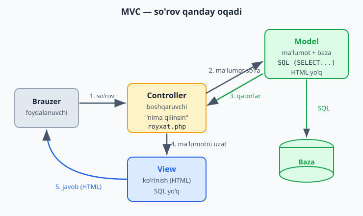

> **Muhim:** bu — MVC'ning **soddalashtirilgan**, "qo'lda" ko'rinishi. Haqiqiy katta loyihalarda MVC'ni tayyor freymvorklar (maxsus vositalar) yordamida qo'llashadi — ular bu tuzilmani avtomatik va kuchli tarzda beradi. Lekin g'oya bir xil: **ma'lumot, ko'rinish va boshqaruvni ajratish.** Freymvorklarni keyingi qadam sifatida (6-QISM) o'rganasiz; hozir g'oyani tushunish muhim.

### Mashqlar

**Oson**
1. MVC'ning uch qismini (Model, View, Controller) o'z so'zingiz bilan tushuntiring.
2. Restoran analogiyasida har bir qism nimaga to'g'ri kelishini ayting.
3. Quyidagi kodlarning qaysi biri Model, qaysi biri View ekanini ayting (SQL bormi yoki HTML bormi).

**O'rta**
4. 4.2'dagi mini-loyihangizni yuqoridagidek uch qismga (Model, Controller, View) ajrating.
5. `TalabaModel`ga `bittasi($id)` metodini qo'shing (bitta talabani id bo'yicha qaytarsin).
6. View'ni o'zgartiring (ranglar, dizayn qo'shing) — Model va Controller'ga tegmasdan. Bu — ajratishning foydasini ko'rsatadi.

**Qiyin**
7. `mahsulotlar` uchun to'liq MVC tuzilmasini yarating: `MahsulotModel` (baza), controller (`mahsulotlar.php`) va view (`mahsulotlar_view.php`). To'liq CRUD (qo'shish, ko'rish, o'chirish) Model metodlari orqali ishlasin.
8. Ikkita Model (`TalabaModel`, `MahsulotModel`) bo'lgan loyihada umumiy ulanish kodini bir joyda ushlang, har bir Model'ni alohida faylda saqlang — toza tashkil etishni mashq qiling.

<details markdown="1">
<summary>Yechim — 3 (Model vs View ni ajratish)</summary>

Qoidani eslang:
- **Model** — ichida **SQL** va baza bilan ishlash bor, HTML yo'q. Masalan, `$pdo->query("SELECT ...")` bor kod — bu Model.
- **View** — ichida **HTML** bor (`<table>`, `<form>`, `<?= ... ?>`), SQL yo'q. Faqat ma'lumotni ko'rsatadi.
- **Controller** — Model'ni chaqiradi va View'ni yuklaydi, lekin o'zida na SQL, na ko'p HTML bo'ladi — u faqat "ulab beradi".

Sinov: kodda `SELECT`/`INSERT` ko'rsangiz → Model. `<table>`/`<form>` ko'rsangiz → View. `require Model` + `require View` ko'rsangiz → Controller.
</details>

<details markdown="1">
<summary>Yechim — 7 (mahsulotlar uchun to'liq MVC)</summary>

```php
<?php
// MahsulotModel.php — faqat baza (SQL shu yerda)
class MahsulotModel {
    private $pdo;
    public function __construct($pdo) { $this->pdo = $pdo; }

    public function hammasi() {
        return $this->pdo->query("SELECT * FROM mahsulotlar ORDER BY id DESC")->fetchAll();
    }
    public function qoshish($nom, $narx) {
        $stmt = $this->pdo->prepare("INSERT INTO mahsulotlar (nom, narx) VALUES (?, ?)");
        $stmt->execute([$nom, $narx]);
    }
    public function ochirish($id) {
        $stmt = $this->pdo->prepare("DELETE FROM mahsulotlar WHERE id = ?");
        $stmt->execute([$id]);
    }
}
```
```php
<?php
// mahsulotlar.php — Controller (boshqaruvchi)
require 'ulanish.php';
require 'MahsulotModel.php';

$model = new MahsulotModel($pdo);

if (!empty($_POST['nom'])) {
    $model->qoshish(trim($_POST['nom']), (int) $_POST['narx']);
    header("Location: mahsulotlar.php");
    exit;
}

$mahsulotlar = $model->hammasi();   // Model'dan ma'lumot
require 'mahsulotlar_view.php';     // View'ga uzatamiz
```
```php
<?php // mahsulotlar_view.php — faqat ko'rinish (HTML) ?>
<form method="post">
    <input name="nom" placeholder="Nom" required>
    <input name="narx" type="number" placeholder="Narx" required>
    <button>Qo'shish</button>
</form>
<table border="1" cellpadding="8">
    <?php foreach ($mahsulotlar as $m): ?>
        <tr><td><?= htmlspecialchars($m['nom']) ?></td><td><?= number_format($m['narx']) ?> so'm</td></tr>
    <?php endforeach; ?>
</table>
```
Talabalar MVC'si bilan tuzilma bir xil: **Model** (SQL), **Controller** (boshqaruv), **View** (HTML) — faqat jadval/maydonlar mahsulotlarga moslangan. Har bir qism o'z ishini qiladi.
</details>

<details markdown="1">
<summary>Yechim — 8 (ikkita Model, umumiy ulanish)</summary>

Fayl tuzilmasi:
```
ulanish.php          → faqat $pdo ni yaratadi (umumiy, bir joyda)
TalabaModel.php      → class TalabaModel  (talabalar bilan ishlaydi)
MahsulotModel.php    → class MahsulotModel (mahsulotlar bilan ishlaydi)
index.php            → controller: ulanishni va kerakli Model(lar)ni yuklaydi
```
```php
<?php
// index.php
require 'ulanish.php';          // $pdo bir marta yaratiladi
require 'TalabaModel.php';
require 'MahsulotModel.php';

$talabaModel   = new TalabaModel($pdo);     // bitta ulanish...
$mahsulotModel = new MahsulotModel($pdo);   // ...ikkala Model'ga beriladi (DI)

$talabalar   = $talabaModel->hammasi();
$mahsulotlar = $mahsulotModel->hammasi();
```
Asosiy g'oya: ulanish (`$pdo`) **bir joyda** yaratiladi va kerakli har bir Model'ga **konstruktor orqali** beriladi (bu — Dependency Injection, 5.3'da ko'ramiz). Har bir Model alohida faylda, faqat o'z jadvali bilan ishlaydi. Bu — toza, kengaytiriladigan tuzilma.
</details>

---

<a name="53-andoza"></a>
## 5.3 Foydali dizayn andozalari

**Dizayn andozasi (design pattern)** — tez-tez uchraydigan muammolar uchun tayyor, sinovdan o'tgan yechim usuli. Ularni yoddan o'rganish shart emas — aksincha, ko'pini siz allaqachon (bilmasdan) ishlatdingiz! Bu bo'limda eng oddiy va foydalilarini, tanish misollar bilan ko'rsatamiz.

### 1) Bog'liqlikni uzatish (Dependency Injection)

Buni 5.2'da allaqachon ishlatdingiz! `TalabaModel`ga `$pdo`ni **konstruktor orqali berdik**:

```php
<?php
class TalabaModel {
    private $pdo;

    public function __construct($pdo) {   // bog'liqlikni tashqaridan olamiz
        $this->pdo = $pdo;
    }
}

$model = new TalabaModel($pdo);   // kerakli narsani uzatamiz
```

Bunga **Dependency Injection** ("bog'liqlikni uzatish") deyiladi: class o'ziga kerakli narsani (bu yerda — bazaga ulanish) **ichida yaratmaydi**, balki **tashqaridan oladi**.

Nega yaxshi? Agar `TalabaModel` ichida o'zi `new PDO(...)` qilsa, uni sinash yoki o'zgartirish qiyin bo'lardi. Tashqaridan berganimizda — moslashuvchan: turli ulanishlar berishimiz mumkin (masalan, sinov uchun boshqasini). Oddiy qoida: **class'ga kerakli narsalarni konstruktor orqali bering.**

### 2) Almashtiriladigan xulq (Strategy)

Buni ham ko'rgansiz — 2.6'dagi interfeyslar! Esingizdami, `Tolov` interfeysi bo'lib, `NaqdTolov` va `KartaTolov` uni har xil amalga oshirardi, va ularni bir-biriga almashtirsa bo'lardi:

```php
<?php
interface Tolov {
    public function tasdiqla($summa);
}

class NaqdTolov implements Tolov { /* ... */ }
class KartaTolov implements Tolov { /* ... */ }

// To'lov turini istalgan vaqtda almashtirsa bo'ladi:
function buyurtmaTola(Tolov $tolov, $summa) {
    $tolov->tasdiqla($summa);
}
```

Bu — **Strategy** andozasi: bir vazifani bajarishning turli usullarini (strategiyalarini) interfeys orqali almashtiriladigan qilish. Yangi usul qo'shsangiz (masalan, `OnlaynTolov`) — mavjud kodni o'zgartirmaysiz, faqat yangi class yozasiz.

### 3) Yaratishni bir joyga jamlash (Factory)

Ba'zan obyekt yaratish mantig'i murakkab yoki bir necha joyda kerak bo'ladi. Uni bitta funksiya/class'ga jamlaymiz — bu **Factory** ("fabrika"):

```php
<?php
class TolovFactory {
    public static function yarat($tur) {
        return match($tur) {
            'naqd'  => new NaqdTolov(),
            'karta' => new KartaTolov(),
            default => throw new Exception("Noma'lum to'lov turi"),
        };
    }
}

// Endi obyekt yaratish bir joyda, oddiy:
$tolov = TolovFactory::yarat('karta');
```

Foydasi: obyekt yaratish mantig'i bir joyda. Yangi tur qo'shsangiz — faqat bu yerni yangilaysiz, butun loyiha bo'ylab emas.

### Muhim ogohlantirish: andozani majburlamang

Andozalar — foydali, lekin ularni **kerak bo'lmagan joyda** ishlatmang. Oddiy ishga murakkab andoza qo'shish — kodni soddalashtirmaydi, balki chalkashtiradi. Andozani faqat u **haqiqiy muammoni** (masalan, almashtirib bo'ladigan xulq kerakligini) hal qilganda qo'llang. Boshlovchi sifatida: avval oddiy yozing; muammo paydo bo'lganda, mos andozani qo'llang. Tajriba bilan qaysi andoza qachon kerakligini his qilasiz.

### Mashqlar

**Oson**
1. Dependency Injection: bir class'ga bog'liqlikni (masalan, `$pdo` yoki boshqa obyekt) konstruktor orqali bering.
2. 2.6'dagi `Tolov` interfeysi misolini Strategy andozasi sifatida qayta ko'rib chiqing — nega bu "almashtiriladigan xulq"?
3. Oddiy Factory yozing: tur nomiga qarab mos obyekt qaytaruvchi `yarat($tur)` metodi.

**O'rta**
4. `Bildirishnoma` Factory'si: `'email'`, `'sms'` turlariga qarab mos class obyektini qaytarsin.
5. Strategy bilan: turli "chegirma" usullarini (`OddiyChegirma`, `VIPChegirma`) interfeys orqali almashtiriladigan qiling.
6. Dependency Injection foydasini ko'rsating: ichida `new` qiladigan class va konstruktor orqali oladigan class'ni yonma-yon yozing, farqini izohlang.

**Qiyin**
7. To'lov tizimini uchala andoza bilan birlashtiring: `TolovFactory` (yaratish) + `Tolov` interfeysi (Strategy, almashtirish) + Dependency Injection (kerakli obyektlarni uzatish). Qaysi andoza qaysi muammoni hal qilishini izohlang.

<details markdown="1">
<summary>Yechim — 6 (DI farqi)</summary>

```php
<?php
// ❌ Bog'liqlikni ichida yaratish — moslashuvchan emas:
class HisobotYomon {
    private $pdo;
    public function __construct() {
        // ulanish ma'lumoti shu yerga "qotirilgan" — o'zgartirish/sinash qiyin
        $this->pdo = new PDO("mysql:host=localhost;dbname=maktab", "root", "");
    }
}

// ✅ Bog'liqlikni tashqaridan olish (DI) — moslashuvchan:
class HisobotYaxshi {
    private $pdo;
    public function __construct($pdo) {   // ulanish tashqaridan keladi
        $this->pdo = $pdo;
    }
}

// Yaxshi versiyada turli ulanish bera olamiz (masalan, sinov uchun boshqasini):
$pdo = new PDO("mysql:host=localhost;dbname=maktab", "root", "");
$hisobot = new HisobotYaxshi($pdo);
```
Farq: yomon versiyada ulanish class ichiga "qotirilgan" — uni o'zgartirib yoki sinab bo'lmaydi. Yaxshi versiyada tashqaridan beramiz — moslashuvchan va sinash oson. Shuning uchun kerakli narsalarni konstruktor orqali uzating.
</details>

<details markdown="1">
<summary>Yechim — 7 (uchala andozani birlashtirish)</summary>

```php
<?php
// 1) Tolov — interfeys (Strategy: almashtiriladigan xulq)
interface Tolov {
    public function tasdiqla($summa);
}

class NaqdTolov implements Tolov {
    public function tasdiqla($summa) { return "Naqd: $summa so'm qabul qilindi"; }
}
class KartaTolov implements Tolov {
    public function tasdiqla($summa) { return "Karta: $summa so'm yechildi"; }
}

// 2) TolovFactory — yaratishni bir joyga jamlaydi (Factory)
class TolovFactory {
    public static function yarat($tur): Tolov {
        return match($tur) {
            'naqd'  => new NaqdTolov(),
            'karta' => new KartaTolov(),
            default => throw new Exception("Noma'lum to'lov turi"),
        };
    }
}

// 3) Buyurtma — to'lovni TASHQARIDAN oladi (Dependency Injection)
class Buyurtma {
    private $tolov;
    public function __construct(Tolov $tolov) {   // har qanday Tolov bo'lishi mumkin
        $this->tolov = $tolov;
    }
    public function tola($summa) {
        return $this->tolov->tasdiqla($summa);
    }
}

// Ishlatish:
$tolov = TolovFactory::yarat('karta');   // Factory yaratadi
$buyurtma = new Buyurtma($tolov);        // DI orqali beramiz
echo $buyurtma->tola(50000);             // Karta: 50000 so'm yechildi
```

Har bir andoza o'z muammosini hal qiladi:
- **Interfeys (Strategy):** `Buyurtma` to'lov turini bilmaydi — har qanday `Tolov`ni qabul qiladi. Yangi tur (`OnlaynTolov`) qo'shsangiz, `Buyurtma`ni o'zgartirmaysiz.
- **Factory:** obyekt yaratish mantig'i bir joyda (`TolovFactory`). Yangi tur qo'shsangiz — faqat shu yerni yangilaysiz.
- **Dependency Injection:** `Buyurtma` to'lovni o'zi yaratmaydi, **tashqaridan** oladi — moslashuvchan va sinash oson.

Uchovi birga — kengaytiriladigan, toza tizim. Lekin esda tuting (5.3 boshidagi ogohlantirish): andozalarni faqat **haqiqiy muammoni** hal qilganda qo'llang.
</details>

---

<a name="54-composer"></a>
## 5.4 Composer — tashqi kutubxonalar

### Muammo: hamma narsani o'zingiz yozish

Dasturlashda ko'p ishlar (email yuborish, PDF yaratish, rasm bilan ishlash, sana boshqaruvi) allaqachon boshqalar tomonidan yozib qo'yilgan va bepul tarqatiladi. Bularni **kutubxona** (library) deyiladi. Har safar noldan yozish o'rniga, tayyor, sinovdan o'tgan kutubxonalarni ishlatish — vaqtni tejaydi va ishonchli.

Lekin bu kutubxonalarni qanday topib, o'rnatib, loyihaga qo'shamiz? **Composer** ana shuni qiladi.

### Composer nima?

**Composer — PHP uchun "kutubxonalar menejeri".** U sizning loyihangizga kerakli kutubxonalarni internetdan topib, yuklab, o'rnatib beradi. Bundan tashqari, u **autoloading** (avtomatik yuklash) ni ta'minlaydi — bu haqida pastda.

> Composer — alohida dastur. Uni `getcomposer.org` saytidan o'rnatasiz (Windows uchun o'rnatuvchi bor). U buyruq qatori (terminal/cmd) orqali ishlaydi.

### Composer'dan foydalanish

Loyiha papkasida terminal ochib, kutubxona o'rnatasiz. Masalan, mashhur "Carbon" kutubxonasi (sana bilan qulay ishlash uchun):

```bash
composer require nesbot/carbon
```

Bu buyruq:
1. Carbon kutubxonasini internetdan yuklaydi.
2. `vendor/` degan papkaga joylaydi (barcha kutubxonalar shu yerda turadi).
3. `composer.json` fayliga yozib qo'yadi (loyiha qaysi kutubxonalarga bog'liqligini eslab qoladi).

Endi kutubxonani kodda ishlatasiz:

```php
<?php
require 'vendor/autoload.php';   // Composer'ning avtomatik yuklovchisi

use Carbon\Carbon;

echo Carbon::now();              // hozirgi sana va vaqt
echo Carbon::now()->addDays(7);  // 7 kundan keyingi sana
```

### Autoloading — `require` dardidan qutulish

Hozirgacha har bir class faylini qo'lda `require` qilardik (`require 'TalabaModel.php'`). Loyihada 50 ta class bo'lsa — 50 ta `require`! Bu noqulay.

**Autoloading** buni hal qiladi: `require 'vendor/autoload.php'` ni bir marta yozasiz, keyin PHP kerakli class faylini **avtomatik** topib yuklaydi. Siz har bir faylni qo'lda `require` qilmaysiz.

Quyidagi diagramma paket Composer orqali qanday o'rnatilishi va autoload bilan avtomatik yuklanishini ko'rsatadi:


> Bu — biroz ilg'or mavzu va buyruq qatori bilan ishlashni talab qiladi. Hozircha shuni bilsangiz yetarli: **haqiqiy loyihalarda kutubxonalarni Composer bilan o'rnatadilar va autoloading ishlatadilar.** Kichik o'quv loyihalarida oddiy `require` ham yetadi. Composer'ni keyinroq, haqiqiy loyihaga o'tganingizda chuqurroq o'rganasiz.

### Mashqlar

**Oson**
1. Composer nima qilishini va nega foydali ekanini o'z so'zingiz bilan tushuntiring.
2. "Kutubxona" nima — misol bilan ayting (tayyor, qayta ishlatiladigan kod).
3. Autoloading qanday muammoni hal qilishini tushuntiring (ko'p `require` dan qutulish).

**O'rta**
4. (Agar imkoningiz bo'lsa) Composer'ni o'rnating va bitta kutubxona (`nesbot/carbon`) o'rnatib ko'ring.
5. `composer.json` fayli nima uchun kerakligini izohlang (loyiha bog'liqliklarini eslab qolish).

**Qiyin**
6. (Ixtiyoriy, ilg'or) Composer bilan kichik loyiha tuzing: bitta kutubxona o'rnating, autoloading orqali o'z class'laringizni ham avtomatik yuklang (`composer.json` da `autoload` sozlamasini o'rganing).

<details markdown="1">
<summary>Yechim — 6 (Composer autoload — yo'riqnoma)</summary>

Bu — ixtiyoriy, ilg'or mashq. Qadamlar:

1. Loyiha papkasida class'laringizni `src/` papkaga joylang (masalan, `src/Talaba.php`).

2. `composer.json` faylida o'z class'laringiz uchun autoload sozlang:

```json
{
    "require": {
        "nesbot/carbon": "^3.0"
    },
    "autoload": {
        "psr-4": {
            "App\\": "src/"
        }
    }
}
```

3. Sozlamani qo'llash uchun terminalda:
```bash
composer install         # kutubxonalarni o'rnatadi
composer dump-autoload    # o'z class'laringiz autoload'ini yangilaydi
```

4. Endi `index.php` da hamma narsani bitta `require` bilan ishlatasiz:
```php
<?php
require 'vendor/autoload.php';   // bitta qator — hammasi avtomatik

use App\Talaba;
use Carbon\Carbon;

$t = new Talaba("Ali");          // o'z class'imiz — qo'lda require'siz yuklandi
echo Carbon::now();              // tashqi kutubxona ham ishlaydi
```

`"psr-4": {"App\\": "src/"}` — "`App\` bilan boshlanadigan class'lar `src/` papkada" degani. Endi har bir class'ni qo'lda `require` qilmaysiz — `vendor/autoload.php` ni bir marta ulaysiz, qolganini Composer o'zi qiladi. Bu — zamonaviy PHP loyihalarining standart tuzilishi (Laravel, Symfony — hammasi shunga asoslanadi).
</details>

> **5-QISM yakunlandi!** Endi siz nafaqat ishlaydigan, balki **professional tashkil etilgan** kod yoza olasiz: toza kod prinsiplari, MVC bilan tartibga solish, foydali dizayn andozalari va tashqi kutubxonalar (Composer). Bu — havaskor va professional dasturchi orasidagi farq.

---

<a name="6-keyingi"></a>
# 6-QISM — KEYINGI QADAMLAR

Tabriklaymiz — siz katta yo'lni bosib o'tdingiz! Noldan boshlab, endi haqiqiy, xavfsiz, professional tashkil etilgan veb-dasturlar yoza olasiz. Bu — jiddiy yutuq. Endi qayerga borish kerakligini ko'rsatamiz.

### Avvalo: mustahkamlang

Yangi mavzularga shoshilmang. Eng muhimi — **o'rganganlaringizni amalda mustahkamlash.** Buning eng yaxshi yo'li — **o'z loyihangizni qurish.** Masalan:
- Shaxsiy "vazifalar ro'yxati" (to-do) dasturi.
- Oddiy blog (maqola qo'shish, ko'rish, izoh qoldirish).
- Mini onlayn do'kon (mahsulotlar, savat).
- Kontaktlar yoki xarajatlar daftari.

Loyiha qurganda muqarrar muammolarga duch kelasiz — ularni yechish jarayonida haqiqiy o'rganish sodir bo'ladi. Kitob o'qish — bilim; loyiha qurish — mahorat.

### Keyingi texnik mavzular

Tayyor bo'lganingizda, quyidagilarni o'rganing (taxminan shu tartibda):

**1) Git va GitHub** — kodingiz tarixini saqlash va boshqarish vositasi. Har bir dasturchi buni biladi. "O'zgarishlarni saqlash, eski holatga qaytish, boshqalar bilan birga ishlash" — Git shuni qiladi. Bu — keyingi eng muhim ko'nikma.

**2) Framework (eng katta keyingi qadam)** — siz 5-QISMda MVC'ni "qo'lda" yozdingiz. Haqiqiy loyihalarda esa **framework** ("ish qurilmasi") ishlatiladi — bu tayyor, kuchli tuzilma bo'lib, MVC, xavfsizlik, baza bilan ishlash va boshqa ko'p narsalarni avtomatik beradi. PHP'da eng mashhurlari: **Laravel** va **Symfony**. Framework o'rganish — siz uchun katta tezlanish bo'ladi, lekin **faqat asoslarni (bu qo'llanmadagini) yaxshi tushungandan keyin.** Asossiz frameworkga o'tish — "sehr"ni ko'r-ko'rona ishlatishga olib keladi.

**3) Yanada chuqur SQL va ma'lumotlar bazasi** — murakkabroq so'rovlar, indekslar (bazani tezlashtirish), ma'lumotlar bazasini to'g'ri loyihalash.

**4) API va frontend bilan ishlash** — zamonaviy saytlarda backend (PHP) ma'lumotni "API" orqali beradi, frontend (JavaScript) uni ko'rsatadi. JSON formati, REST API tushunchalari.

**5) Deploy (saytni internetga chiqarish)** — loyihangizni o'z kompyuteringizdan haqiqiy serverga (internetga) joylash. Hosting, domen, server sozlamalari.

### Awareness uchun: kattaroq loyihalar mavzulari

Bular hozir shart emas, lekin borligini bilib qo'ying — kattaroq, yuklamasi yuqori loyihalarda kerak bo'ladi:
- **Kesh (caching)** — tez-tez kerak bo'ladigan ma'lumotni "tezkor xotirada" saqlab, bazaga har safar murojaat qilmaslik (saytni tezlashtiradi). Buning uchun **Redis** kabi vositalar ishlatiladi.
- **Navbat (queue)** — sekin ishlarni (masalan, minglab email yuborish) "fonda", foydalanuvchini kuttirmasdan bajarish.
- **Testlar** — kodingiz to'g'ri ishlashini avtomatik tekshiradigan kod (katta loyihalarda muhim).

Bularning hammasi — siz bugun qo'ygan poydevor ustiga quriladi. Ularni o'z vaqtida, kerak bo'lganda o'rganasiz.

### Yaxshi dasturchi bo'lish sirlari

1. **Har kuni oz bo'lsa ham kod yozing.** Muntazamlik — iqtidordan muhimroq.
2. **Xatolardan qo'rqmang.** Har bir xato — o'rganish imkoni. Xato xabarini diqqat bilan o'qing — u ko'pincha muammoni aniq aytadi.
3. **Hujjat (documentation) o'qishni o'rganing.** PHP'ning rasmiy hujjati (`php.net`) — eng ishonchli manba.
4. **Boshqalarning kodini o'qing.** GitHub'da ochiq loyihalarni ko'ring — qanday yozilganini o'rganing.
5. **Sabrli bo'ling.** Dasturlash — bir kunda emas, oylar va yillar davomida o'rganiladigan mahorat. Hamma boshlovchi bo'lgan.
6. **Savol berishdan uyalmang.** Hamjamiyatlar (forumlar, Telegram guruhlari) — yordam manbai.

### Yakuniy so'z

Bu qo'llanma sizga PHP'ning poydevorini berdi: o'zgaruvchilardan to to'liq, xavfsiz veb-dasturlargacha. Lekin dasturlashda o'rganish hech qachon to'xtamaydi — eng tajribali dasturchilar ham har kuni yangi narsa o'rganadi. Bu — chiroyli tomoni.

Eng muhimi: **qurishda davom eting.** Har bir yozgan dasturingiz sizni kuchliroq qiladi. Bugun "Salom, dunyo!" yozgan bo'lsangiz, ertaga butun bir tizim quryapsiz. Yo'lda omad!

---

*Qo'llanma tugadi. Har bir mavzuni amalda — kod yozib — mustahkamlang. Tushunmagan joy bo'lsa, o'sha bo'limga qaytib, misolni qayta yozib ko'ring. Dasturlash — mashq bilan o'rganiladi.*
