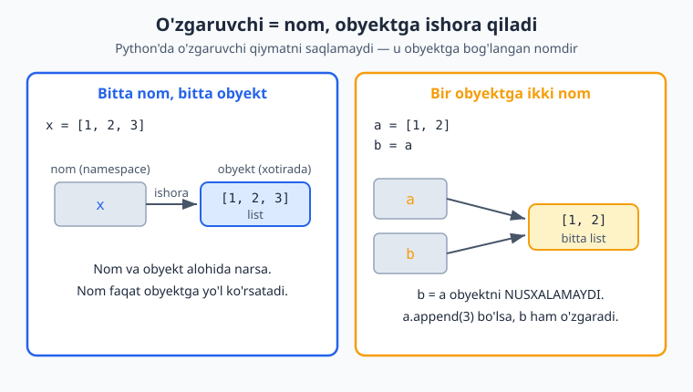
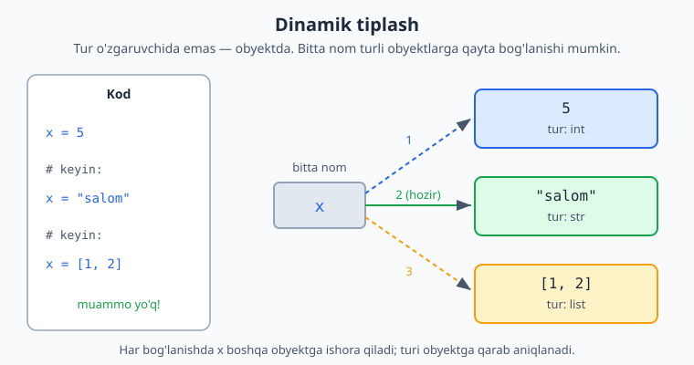
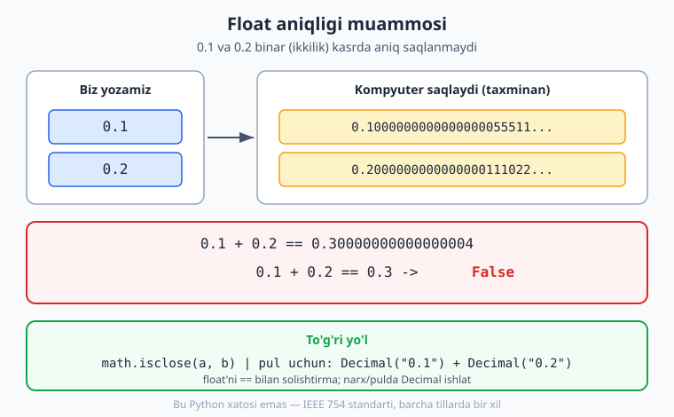
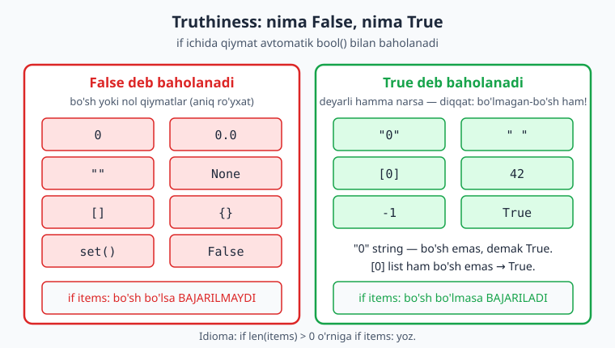
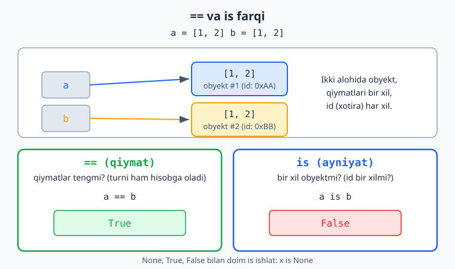

# 01 — Asoslar: sintaksis, tiplar, "Pythonic" tafakkur

[← README](./README.md) | [Keyingi: Boshqaruv va funksiyalar →](./02-boshqaruv-funksiyalar.md)

---

## 1.1 Chekinish (indentation) = sintaksis

Python'da kod bloklari **chekinish** (qatorni bo'sh joy bilan ichkariga surish) orqali aniqlanadi. Qavslar (`{ }`) ishlatilmaydi — qaysi qatorlar blok ichida ekanini aynan chekinish belgilaydi.

```python
if x > 0:
    print("musbat")      # 4 probel — bu blokni bildiradi
    print("hali ham ichida")
print("blokdan tashqarida")
```

Qoidalar:
- Standart — **4 probel** (tab emas; aralashtirib bo'lmaydi).
- `:` blok ochilishini bildiradi (`if`, `for`, `def`, `class` va h.k.).
- Noto'g'ri chekinish → `IndentationError`.

> **Why:** Bu "kosmetik" emas — Python sintaksisni vizual tuzilmaga bog'laydi, shuning uchun "format urushlari" bo'lmaydi va kod doim bir xil ko'rinadi.

---

## 1.2 O'zgaruvchilar va dinamik tiplash

```python
x = 5            # int
x = "salom"      # endi str — muammo yo'q
name = "Oqil"
PI = 3.14159     # konstanta: katta harf bilan yozish — kelishuv, til majburlamaydi
```

- O'zgaruvchini oldindan e'lon qilish (`declare`) shart emas — nom yozib, `=` bilan qiymat berasan, tamom. Nom oldiga maxsus belgi qo'yilmaydi, qator oxiriga `;` ham qo'yilmaydi.
- Python **dinamik tiplangan** (o'zgaruvchining turi qiymatga qarab avtomatik aniqlanadi), lekin ayni paytda **kuchli tiplangan** (strongly typed): `"3" + 5` xato beradi, turlar avtomatik aralashtirilmaydi.

Python'da o'zgaruvchi qiymatni o'z ichida saqlamaydi — u obyektga **ishora qiluvchi nom**dir (reference model). Shuning uchun `b = a` obyektni nusxalamaydi, balki bitta obyektga ikkinchi nom beradi:



Tur nomda emas, **obyektda** turgani uchun bir nomni ketma-ket har xil turdagi obyektlarga bog'lash mumkin — dinamik tiplash aynan shu:



```python
"3" + 5     # TypeError! Python matn va sonni avtomatik qo'shmaydi
"3" + str(5)   # "35"  ✅
int("3") + 5   # 8     ✅
```

### Type hints (tip ko'rsatmalari)

Python'da tiplar majburiy emas, lekin **type hints** yozish — professional standart. Bu funksiya qanday turdagi ma'lumot kutishini va nima qaytarishini ochiq ko'rsatadi:

```python
age: int = 25
name: str = "Oqil"

def greet(name: str) -> str:
    return f"Salom, {name}"
```

> Type hints dastur ishlayotganda (runtime'da) **majburlanmaydi** — ular `mypy`/Pylance kabi statik tekshiruvchilar uchun. Lekin baribir doim yoz — kod o'qilishi osonlashadi va xatolar oldindan topiladi.

---

## 1.3 Raqamli tiplar

```python
a = 10           # int — CHEKSIZ aniqlik (big integer muammosi yo'q!)
b = 3.14         # float (64-bit)
c = 2 + 3j       # complex (kamdan-kam kerak)

2 ** 100         # 1267650600228229401496703205376 — muammosiz, overflow yo'q
```

> **Diqqat:** Python'da butun son (`int`) **cheksiz aniqlikka** ega — son qanchalik katta bo'lmasin, "overflow" (to'lib ketish) muammosi yo'q. Bu katta hisob-kitoblarda juda qulay.

### Bo'lish — eng ko'p chalkashtiriladigan joy

```python
7 / 2      # 3.5   — `/` har doim float (kasr son) qaytaradi
7 // 2     # 3     — butun bo'lish (floor division)
7 % 2      # 1     — qoldiq
-7 // 2    # -4    — pastga yaxlitlaydi, 0 tomon emas!
divmod(7, 2)  # (3, 1) — butun va qoldiq birga
```

### Sonli literallar — katta sonlarni o'qiladigan yozish

Katta sonni `1000000` deb yozsang, nollarni sanab adashish oson. Python sonlar ichida **pastki chiziq** (`_`) ni ajratgich sifatida ruxsat beradi — u faqat ko'z uchun, qiymatga umuman ta'sir qilmaydi:

```python
mln = 1_000_000          # 1000000 — o'qish ancha oson
budjet = 12_500_000      # 12500000
karta = 1234_5678_9012   # raqamlarni guruhlab yozish mumkin
print(mln)               # 1000000  — chiziqlar yo'qoladi
```

Sonni boshqa sanoq sistemalarida ham yozsa bo'ladi — prefiks bilan:

```python
0xFF      # 255  — 16-lik (hex), 0x prefiks
0o17      # 15   — 8-lik (oktal), 0o prefiks
0b1010    # 10   — 2-lik (binar), 0b prefiks

1e6       # 1000000.0  — ilmiy yozuv (1 * 10**6), natija FLOAT
2.5e-3    # 0.0025     — 2.5 * 10**-3
1_000.5   # 1000.5     — kasr sonda ham _ ishlaydi
```

> **Diqqat:** `1e6` natijasi `int` emas, **`float`** (`1000000.0`). Butun son kerak bo'lsa `1_000_000` yoki `10**6` yoz.

### `round()` va yaxlitlash — bir nechta "kutilmagan" joy

`round(son, n)` sonni `n` ta kasr xonasigacha yaxlitlaydi (`n` berilmasa — eng yaqin butunga):

```python
round(3.14159, 2)     # 3.14
round(2.71828, 3)     # 2.718
round(1234.5678, -2)  # 1200.0  — manfiy n: O'NLIK, YUZLIK xonalarga yaxlitlaydi
```

Ammo ikkita narsa ko'pchilikni chalg'itadi:

```python
# 1) "Banker's rounding" — .5 ENG YAQIN JUFT songa yaxlitlanadi (yarmini yuqoriga emas):
round(0.5)    # 0   (1 emas!)
round(1.5)    # 2
round(2.5)    # 2   (3 emas!)
round(3.5)    # 4

# 2) Float aniqligi tufayli .5 ham "aniq" bo'lmasligi mumkin:
round(2.675, 2)   # 2.67  (2.68 emas!) — chunki 2.675 aslida 2.67499... bo'lib saqlanadi
```

> **Why:** "Banker's rounding" (yarmni juftga yaxlitlash) ko'p yaxlitlashda xatoni o'rtacha nolga yaqinlashtiradi — moliyada shu sabab standart. Bu Python xatosi emas, IEEE 754 qoidasi. Aniq pul hisobi kerak bo'lsa — pastdagi `Decimal` ni ishlat.

---

## 1.4 Float aniqligi muammosi va `Decimal`/`Fraction`

`float` (kasr son) kompyuterda **ikkilik (binar) kasr** sifatida saqlanadi va `0.1`, `0.2` kabi ko'p o'nlik sonlar binar ko'rinishda **aniq ifodalanmaydi**. Natijada eng mashhur "tuzoq":

```python
0.1 + 0.2            # 0.30000000000000004  — 0.3 EMAS!
0.1 + 0.2 == 0.3     # False                — shuning uchun
```

Bu Python xatosi emas — bu barcha tillarda (C, Java, JavaScript...) mavjud, chunki ular bir xil IEEE 754 standartiga amal qiladi. Float'larni **`==` bilan solishtirish xavfli**.



### Float'larni qanday to'g'ri solishtirish kerak

```python
import math

a = 0.1 + 0.2
math.isclose(a, 0.3)              # True  — ✅ TO'G'RI yo'l (nisbiy tolerantlik bilan)
round(a, 10) == round(0.3, 10)    # True  — yaxlitlab solishtirish (oddiyroq, lekin qo'polroq)
abs(a - 0.3) < 1e-9               # True  — qo'lda tolerantlik (epsilon)
```

> **Idioma:** Ikki float teng-tengmasligini tekshirish kerak bo'lsa — `==` emas, `math.isclose(a, b)` ishlat.

### `Decimal` — pul va narx uchun aniq o'nlik son

`decimal` modulidagi `Decimal` sonni biz yozgandek **o'nlik** ko'rinishda aniq saqlaydi. Pul, narx, soliq, foiz hisoblarida `float` o'rniga **doim `Decimal`** ishlat:

```python
from decimal import Decimal

Decimal("0.1") + Decimal("0.2")           # Decimal('0.3')  — aniq!
Decimal("0.1") + Decimal("0.2") == Decimal("0.3")   # True   ✅

narx = Decimal("19.99")
soni = 3
narx * soni                                # Decimal('59.97')  — aniq, tiyin yo'qolmaydi
```

> **Eng muhim qoida:** `Decimal` ni **string'dan** yarat — `Decimal("0.1")`. Agar `Decimal(0.1)` (float'dan) yozsang, allaqachon buzilgan `0.1000000...0055` ni olasan, ma'no qolmaydi.

`Decimal` ni `.quantize()` bilan kerakli kasrgacha aniq yaxlitlash mumkin (chek, hisob-faktura uchun):

```python
from decimal import Decimal, ROUND_HALF_UP

jami = Decimal("28.745")
jami.quantize(Decimal("0.01"))                       # Decimal('28.74')  — banker's rounding
jami.quantize(Decimal("0.01"), rounding=ROUND_HALF_UP)  # Decimal('28.75')  — odatiy "yarmni yuqoriga"
```

Mana, savatcha narxini `Decimal` bilan aniq hisoblash:

```python
from decimal import Decimal

narxlar = [Decimal("19.99"), Decimal("5.50"), Decimal("3.25")]
jami = sum(narxlar)                                  # Decimal('28.74')
chegirma = (jami * Decimal("0.10")).quantize(Decimal("0.01"))   # Decimal('2.87')
tolov = jami - chegirma

print(f"Jami:     {jami}")        # Jami:     28.74
print(f"Chegirma: {chegirma}")    # Chegirma: 2.87
print(f"To'lov:   {tolov}")       # To'lov:   25.87
```

### `Fraction` — aniq oddiy kasr (1/3 kabi)

`fractions` modulidagi `Fraction` sonni **surat/maxraj** ko'rinishida aniq saqlaydi — `1/3` float'da `0.333...` bo'lib yaxlitlanmaydi, balki aniq `1/3` bo'lib qoladi:

```python
from fractions import Fraction

Fraction(1, 3) + Fraction(1, 6)    # Fraction(1, 2)  — aniq qisqartiriladi
Fraction("0.1") + Fraction("0.2")  # Fraction(3, 10) — ya'ni aniq 0.3
Fraction(1, 3) * 3                  # Fraction(1, 1)  — aniq 1, yaxlitlanish yo'q!

float(Fraction(1, 3))              # 0.3333333333333333  — kerak bo'lsa float'ga o'tkaz
```

Retsept porsiyasini ko'paytirish — kasrlar aniq qolishi kerak bo'lgan tipik misol:

```python
from fractions import Fraction

bir_porsiya_un = Fraction(2, 3)    # 2/3 stakan
odamlar = 4
print(f"Kerak: {bir_porsiya_un * odamlar} stakan un")   # Kerak: 8/3 stakan un
```

> **Qisqacha:** tezlik kerak va kichik xato muhim emas → `float`. Pul/narx → `Decimal`. Aniq oddiy kasr (3/7, retsept, ehtimollik) → `Fraction`.

---

## 1.5 Boolean va "truthiness"

```python
True, False          # bosh harf bilan!
None                 # "hech narsa" / bo'sh qiymat

# Mantiqiy operatorlar — so'z bilan:
x and y              # &&
x or y               # ||
not x                # !
```

**Truthiness** — bo'sh yoki nol qiymatlar `if` ichida `False` deb baholanadi (aniq qoidalar bilan):

```python
# False deb baholanadi:
bool(0), bool(0.0), bool(""), bool([]), bool({}), bool(None), bool(set())
# True deb baholanadi: deyarli hamma narsa, jumladan "0" (string!), [0], " "
```

Quyidagi diagramma qaysi qiymatlar `False`, qaysilari `True` deb baholanishini aniq ko'rsatadi (diqqat: `"0"` va `[0]` bo'sh emas, demak `True`):



> **Idioma:** `if len(items) > 0:` o'rniga `if items:` yoz. Bo'sh list `False`. Bu Pythonic.

`and`/`or` qiymat qaytaradi (short-circuit), faqat bool emas:

```python
name = user_input or "Mehmon"   # bo'sh bo'lsa "Mehmon" (qisqa, qulay yozuv)
```

---

## 1.6 Zanjirli taqqoslash (chained comparison)

Ko'p tillarda `0 < x < 10` deb yozib bo'lmaydi — `0 < x and x < 10` deyish kerak. Python'da esa **taqqoslashlarni zanjir qilish** mumkin, xuddi matematikadagidek o'qiladi:

```python
x = 5
0 < x < 10        # True   — "x noldan katta VA o'ndan kichik"
1 <= x <= 5       # True   — chegaralarni ham qamrab oladi
0 < x < 10 < 100  # True   — istalgancha uzun zanjir
```

Bu shunchaki qisqartma emas — o'rtadagi qiymat **bir marta** hisoblanadi (`and` orqali yozsang ikki marta hisoblanardi):

```python
yosh = 25
18 <= yosh < 65         # True   — "ishchi yoshdami?"

# Tipik foydalanish — chegaralarni tekshirish:
def baho(ball: int) -> str:
    if 90 <= ball <= 100:
        return "A'lo"
    elif 70 <= ball < 90:
        return "Yaxshi"
    elif 60 <= ball < 70:
        return "Qoniqarli"
    return "Qoniqarsiz"

print(baho(95), baho(72), baho(40))   # A'lo Yaxshi Qoniqarsiz
```

> **Idioma:** `if 0 <= i and i < len(arr):` o'rniga `if 0 <= i < len(arr):` yoz — qisqaroq va o'qish osonroq.

---

## 1.7 `None`, `==` va `is`

```python
x = None
x == None      # ishlaydi, lekin...
x is None      # ✅ to'g'ri uslub — identite (xotira) tekshiruvi
```

- `==` — **qiymat** tengligi (qiymatlarni solishtiradi va turni ham hisobga oladi: `1 == "1"` → `False`).
- `is` — **bir xil obyektmi** (xotirada bir joymi). `None`, `True`, `False` bilan doim `is` ishlat.

```python
a = [1, 2]
b = [1, 2]
a == b     # True  — qiymatlar teng
a is b     # False — alohida obyektlar
```

Bu farqni vizual ko'rinishda: `a` va `b` qiymati bir xil, ammo xotirada ikki **alohida obyekt** — shuning uchun `==` `True`, `is` esa `False` qaytaradi:



---

## 1.8 Bitwise (bit darajasidagi) operatorlar

Bu operatorlar sonni **ikkilik (bit)** ko'rinishida — har bir 0/1 raqami ustida ishlaydi. Kundalik kodda kam, lekin bayroqlar (flags), ruxsatlar, maska va past darajadagi ishlarda kerak bo'ladi:

```python
5 & 3     # 1   — AND  (har ikkalasida ham 1 bo'lsa)   0b101 & 0b011 = 0b001
5 | 3     # 7   — OR   (kamida birida 1 bo'lsa)         0b101 | 0b011 = 0b111
5 ^ 3     # 6   — XOR  (faqat bittasida 1 bo'lsa)        0b101 ^ 0b011 = 0b110
~5        # -6  — NOT  (barcha bitlarni teskari qiladi)
1 << 4    # 16  — chapga surish (= 1 * 2**4)
64 >> 2   # 16  — o'ngga surish (= 64 // 2**2)
```

Eng amaliy foydalanish — **bayroqlarni** bitta songa joylash (har bayroq alohida bit):

```python
OQISH   = 0b001    # 1
YOZISH  = 0b010    # 2
BAJARISH = 0b100   # 4

ruxsat = OQISH | YOZISH        # 0b011 — oqish va yozishni yoqdik
print(bin(ruxsat))             # 0b11

bool(ruxsat & YOZISH)          # True  — yozish ruxsati bormi?
bool(ruxsat & BAJARISH)        # False — bajarish ruxsati yo'q
ruxsat |= BAJARISH             # bajarishni qo'shamiz
ruxsat &= ~YOZISH              # yozishni o'chiramiz
```

> **Diqqat:** `&` va `|` — bu **bit** operatorlari, mantiqiy `and`/`or` emas. `x and y` bilan adashtirma: `5 & 3` → `1` (bit), `5 and 3` → `3` (oxirgi qiymat). Mantiq uchun `and`/`or`, bitlar uchun `&`/`|`.

---

## 1.9 Tip konvertatsiyasi

```python
int("42")        # 42
int("42", 16)    # 66  — 16-lik sanoq sistemasidan
float("3.14")    # 3.14
str(42)          # "42"
bool(0)          # False
list("abc")      # ['a', 'b', 'c']

# Xavfsiz konvertatsiya:
int("abc")       # ValueError — try/except kerak (07-modulda)
```

---

## 1.10 Kiritish/chiqarish (I/O)

```python
print("Salom", "dunyo")              # Salom dunyo  (probel bilan ajraladi)
print("a", "b", sep="-")             # a-b
print("yangi qatorsiz", end="")      # \n qo'shmaydi
print(f"{name} — {age} yosh")        # f-string (eng muhim!)

ism = input("Isming: ")              # har doim STRING qaytaradi
yosh = int(input("Yoshing: "))       # raqam kerak bo'lsa konvertatsiya qil
```

> `input()` **har doim string qaytaradi** — foydalanuvchi raqam yozsa ham, u matn bo'lib keladi. Raqam kerak bo'lsa `int()`/`float()` bilan o'ra.

---

## 1.11 f-string — formatlashning to'g'ri yo'li

```python
name = "Oqil"
age = 25
price = 1234567.891

f"{name} {age} yoshda"               # Oqil 25 yoshda
f"{price:,.2f}"                      # 1,234,567.89  — minglik ajratgich + 2 kasr
f"{age:03d}"                         # 025           — 3 xonali, nol bilan
f"{0.1234:.1%}"                      # 12.3%
f"{name=}"                           # name='Oqil'   — debug uchun (3.8+)
f"{2 + 2}"                           # 4 — ichida ifoda yozish mumkin
```

> f-string — matn ichiga to'g'ridan-to'g'ri o'zgaruvchi va ifoda joylashning eng toza yo'li: `f"..."` ichida `{...}` qavslar orasiga istalgan ifoda va formatlashni yozasan. **Eski usullar (`.format()`, `%`) ni unut — f-string ishlat.**

### Konversiya bayroqlari: `!r`, `!s`, `!a`

`{...}` ichida format'dan oldin `!` bilan qiymatni qaysi ko'rinishga o'tkazishni aytsa bo'ladi:

```python
s = "salom\n"
f"{s}"      # salom    (va yangi qator) — odatiy: str()
f"{s!s}"    # salom    (va yangi qator) — !s = str() (aniq yozilgan)
f"{s!r}"    # 'salom\n'                 — !r = repr(): debug uchun, qo'shtirnoq va \n ko'rinadi
f"{'kofe'!a}"   # 'kofe'                — !a = ascii(): ASCII'dan tashqari belgilarni \u... qiladi
```

- **`!r`** eng foydali: log/debug'da matnni qo'shtirnoq bilan, yashirin belgilar (`\n`, `\t`) ko'rinadigan qilib chiqaradi. "Bu yerda bo'shliq bormi?" degan savolga aniq javob beradi.
- **`!s`** — odatiy holat (str), ko'pincha yozish shart emas.
- **`!a`** — natija faqat ASCII bo'lishi kerak bo'lganda.

```python
class Pul:
    def __init__(self, miqdor): self.miqdor = miqdor
    def __str__(self):  return f"{self.miqdor} so'm"     # odam uchun
    def __repr__(self): return f"Pul({self.miqdor!r})"   # dasturchi uchun

p = Pul(5000)
print(f"{p!s}")    # 5000 so'm   — chiroyli ko'rinish
print(f"{p!r}")    # Pul(5000)   — debug ko'rinishi
```

### Ichma-ich (nested) format: `{val:.{n}f}`

Format spetsifikatori ichida ham `{...}` ishlatib, **kenglik yoki aniqlikni o'zgaruvchidan** olsa bo'ladi:

```python
import math

aniqlik = 3
f"{math.pi:.{aniqlik}f}"     # 3.142   — kasr xona soni o'zgaruvchidan!

kenglik = 10
f"{42:>{kenglik}}"           # '        42'  — o'ng tomonga, kenglik 10
f"{'Oqil':^{kenglik}}"       # '   Oqil   '  — markazga tekislash

# Dinamik jadval ustuni:
def chiqar(qiymat: float, aniqlik: int, kenglik: int) -> str:
    return f"{qiymat:>{kenglik}.{aniqlik}f}"

print(chiqar(3.14159, 2, 8))    # '    3.14'
print(chiqar(3.14159, 4, 8))    # '  3.1416'
```

> **Why:** Aniqlik yoki ustun kengligini foydalanuvchi sozlamasidan yoki hisobdan olishing kerak bo'lsa, nested format yagona toza yechim — `{val:.{n}f}` ko'rinishida `n` ni tashqaridan beradi.

---

## 1.12 Bir nechta qiymat berish (multiple assignment)

```python
a, b, c = 1, 2, 3            # bir vaqtda
a, b = b, a                  # almashtirish — vaqtinchalik o'zgaruvchisiz!
x = y = z = 0                # hammasi 0

first, *rest = [1, 2, 3, 4]  # first=1, rest=[2,3,4]  (unpacking)
```

> `a, b = b, a` — ikki o'zgaruvchini almashtirishning eng nafis yo'li. Ko'p tillarda buning uchun vaqtinchalik uchinchi o'zgaruvchi kerak; Python'da bitta qator yetadi.

---

## 1.13 Walrus operatori `:=` (3.8+)

Ifoda ichida o'zgaruvchiga qiymat berish:

```python
# Oddiy:
data = input()
while data != "quit":
    print(data)
    data = input()

# Walrus bilan:
while (data := input()) != "quit":
    print(data)
```

> Kerak bo'lgandagina ishlat — o'qilishini buzmasin.

---

## 1.14 Izohlar va docstring

```python
# Bir qatorli izoh

"""
Ko'p qatorli — texnik jihatdan string,
lekin izoh sifatida ishlatiladi.
"""

def hisobla(x: int) -> int:
    """Funksiya docstring'i — help() shuni ko'rsatadi."""
    return x * 2

help(hisobla)   # docstring'ni chiqaradi
```

---

## ✍️ Masalalar (26 ta)

> Yechimga qaramasdan ishla. REPL'da sina. Yechimlar fayl oxirida.

**Oson (1–7):**

1. Foydalanuvchidan ism va yoshni so'ra, `"<ism> <yosh> yoshda"` ko'rinishida chiqar (f-string bilan).
2. Ikkita raqamni foydalanuvchidan ol, ularning yig'indisi, ayirmasi, ko'paytmasi, bo'linmasi (`/`), butun bo'linmasi (`//`) va qoldig'ini chiqar.
3. `a = 5`, `b = 10` — vaqtinchalik o'zgaruvchisiz ularni almashtir va natijani chiqar.
4. Sekunddagi vaqtni (masalan 3725) soat, daqiqa, sekundga aylantir: `1:02:05`.
5. Berilgan narx (`1234567.5`) ni minglik ajratgich va 2 kasr bilan chiqar: `1,234,567.50`.
6. `"3"` va `5` ni qo'shib `8` chiqar (tip muammosini hal qilib).
7. Doira radiusini ol, yuzasi va perimetrini hisobla (`PI = 3.14159`).

**O'rta (8–14):**

8. Foydalanuvchidan haroratni Selsiyda ol, Farengeytga aylantir: `F = C * 9/5 + 32`.
9. Ikki xonali sonni ol, uning raqamlari yig'indisini hisobla (masalan `47 → 11`). *(Bo'lish/qoldiq bilan, stringsiz.)*
10. `bool()` ni quyidagilarga qo'llab, qaysi biri `True`/`False` ekanini bashorat qil, keyin tekshir: `0`, `""`, `"0"`, `[]`, `[0]`, `None`, `" "`, `0.0`.
11. `x = 0`, `y = "default"` — `x or y` va `x and y` nima qaytaradi? Bashorat qilib tekshir va sababini tushuntir.
12. Foydalanuvchidan 3 ta baho ol (`input`), o'rtachasini 2 kasr bilan chiqar.
13. `a = [1,2]`, `b = [1,2]`, `c = a` bo'lsa: `a == b`, `a is b`, `a is c` — har birini bashorat qilib tekshir.
14. Bir qatorli kodda 5 ta o'zgaruvchiga (`a,b,c,d,e`) `[10,20,30,40,50]` listidan qiymat ber (unpacking).

**Murakkab (15–20):**

15. `first, *middle, last = [1,2,3,4,5]` — har biri nimaga teng? Yozib tekshir, keyin `*middle` ning tipi nima ekanini ayt.
16. Foydalanuvchidan summa (so'm) va valyuta kursini ol, dollarga aylantirib `$<qiymat>` ko'rinishida 2 kasr bilan chiqar.
17. Walrus operatori bilan: foydalanuvchidan son so'rab, "quit" deguncha har sonning kvadratini chiqaruvchi sikl yoz.
18. `2 ** 1000` ni hisobla — natija nechta xonali ekanini top. *(Maslahat: stringga aylantirib uzunligini ol.)*
19. Bir xonali son `n` (1–9) berilganda, uning quyidagi jadvalini chiqar: `n x 1 = n` dan `n x 9 = 9n` gacha (f-string, hozircha `for` ishlatmasdan 9 ta `print` bilan ham bo'ladi — yoki `for` bilsang, ishlat).
20. `divmod()` dan foydalanib, 1000 daqiqani kun:soat:daqiqaga aylantir (masalan `1500 → 1 kun 1 soat 0 daqiqa`).

**Aniqlik, sonlar va format (21–26):**

21. `0.1 + 0.2 == 0.3` nega `False` ekanini tushuntir va uchta to'g'ri solishtirish usulini yoz (`math.isclose`, `round`, epsilon). Har birini sinab natijani chiqar.
22. Savatchada uchta narx bor: `19.99`, `5.50`, `3.25` (so'm). `Decimal` bilan jami summani hisobla, 10% chegirma qo'llab, to'lovni 2 kasrgacha aniq chiqar. *(Nega `float` emas, `Decimal`?)*
23. `Fraction` bilan: bir retsept 2 odamga `3/4` stakan un talab qiladi. 5 odamga qancha kerak? Natijani aniq kasr ko'rinishida, keyin float'ga aylantirib chiqar.
24. Quyidagi literallarni o'qib, har birining o'nlik (decimal) qiymatini chiqar: `0xFF`, `0o17`, `0b1011`, `1_000_000`, `1e6`. Qaysi biri `float`?
25. Foydalanuvchi yoshini ol va zanjirli taqqoslash bilan toifaga ajrat: `0–12` bola, `13–17` o'smir, `18–64` katta, `65+` keksa.
26. Bitwise bayroqlar bilan fayl ruxsatini modellashtir: `OQISH=1`, `YOZISH=2`, `BAJARISH=4`. `OQISH | YOZISH` ruxsatini yarat, unda `YOZISH` va `BAJARISH` bor-yo'qligini tekshir, keyin `BAJARISH` ni qo'shib `bin()` bilan chiqar.

---

## ✅ Yechimlar

<details markdown="1">
<summary>Ko'rsatish uchun ochish</summary>

```python
# 1
ism = input("Isming: ")
yosh = input("Yoshing: ")
print(f"{ism} {yosh} yoshda")

# 2
a = int(input())
b = int(input())
print(a + b, a - b, a * b, a / b, a // b, a % b)

# 3
a, b = 5, 10
a, b = b, a
print(a, b)        # 10 5

# 4
t = 3725
soat = t // 3600
daqiqa = (t % 3600) // 60
sekund = t % 60
print(f"{soat}:{daqiqa:02d}:{sekund:02d}")   # 1:02:05

# 5
narx = 1234567.5
print(f"{narx:,.2f}")        # 1,234,567.50

# 6
print(int("3") + 5)          # 8

# 7
PI = 3.14159
r = float(input("Radius: "))
print(f"Yuza: {PI * r ** 2:.2f}, Perimetr: {2 * PI * r:.2f}")

# 8
c = float(input("Selsiy: "))
print(f"{c * 9/5 + 32:.1f} F")

# 9
n = 47
print(n // 10 + n % 10)      # 11

# 10
for v in (0, "", "0", [], [0], None, " ", 0.0):
    print(repr(v), "->", bool(v))
# 0->False, ''->False, '0'->True, []->False, [0]->True, None->False, ' '->True, 0.0->False

# 11
x, y = 0, "default"
print(x or y)     # "default"  (x falsy bo'lgani uchun y qaytadi)
print(x and y)    # 0          (x falsy bo'lsa and to'xtaydi, x ni qaytaradi)

# 12
a, b, c = int(input()), int(input()), int(input())
print(f"{(a + b + c) / 3:.2f}")

# 13
a, b = [1, 2], [1, 2]
c = a
print(a == b)     # True   qiymat teng
print(a is b)     # False  alohida obyekt
print(a is c)     # True   c — a ning o'zi

# 14
a, b, c, d, e = [10, 20, 30, 40, 50]
print(a, b, c, d, e)

# 15
first, *middle, last = [1, 2, 3, 4, 5]
print(first, middle, last)   # 1 [2, 3, 4] 5
print(type(middle))          # <class 'list'>  — har doim list

# 16
summa = float(input("So'm: "))
kurs = float(input("Kurs: "))
print(f"${summa / kurs:.2f}")

# 17
while (son := input("Son ('quit' to'xtatadi): ")) != "quit":
    print(int(son) ** 2)

# 18
print(len(str(2 ** 1000)))   # 302

# 19
n = int(input("Son (1-9): "))
for i in range(1, 10):
    print(f"{n} x {i} = {n * i}")

# 20
daqiqa = 1500
kun, qoldiq = divmod(daqiqa, 24 * 60)
soat, daq = divmod(qoldiq, 60)
print(f"{kun} kun {soat} soat {daq} daqiqa")   # 1 kun 1 soat 0 daqiqa
```

</details>

<details markdown="1">
<summary>Masala 21</summary>

```python
import math

a = 0.1 + 0.2
# Nega False: 0.1 va 0.2 binar float'da aniq saqlanmaydi,
# yig'indi 0.30000000000000004 bo'lib chiqadi.
print(a)                       # 0.30000000000000004
print(a == 0.3)                # False

# 1) math.isclose — eng to'g'ri yo'l
print(math.isclose(a, 0.3))    # True

# 2) round bilan yaxlitlab solishtirish
print(round(a, 10) == round(0.3, 10))   # True

# 3) qo'lda epsilon (tolerantlik)
print(abs(a - 0.3) < 1e-9)     # True
```

</details>

<details markdown="1">
<summary>Masala 22</summary>

```python
from decimal import Decimal

# Nega Decimal: pul hisobida float xatosi tiyinlarni yo'qotadi/qo'shadi.
# Decimal o'nlik sonni aniq saqlaydi.
narxlar = [Decimal("19.99"), Decimal("5.50"), Decimal("3.25")]
jami = sum(narxlar)                                  # Decimal('28.74')
chegirma = (jami * Decimal("0.10")).quantize(Decimal("0.01"))   # Decimal('2.87')
tolov = jami - chegirma

print(f"Jami:     {jami}")        # Jami:     28.74
print(f"Chegirma: {chegirma}")    # Chegirma: 2.87
print(f"To'lov:   {tolov}")       # To'lov:   25.87
```

</details>

<details markdown="1">
<summary>Masala 23</summary>

```python
from fractions import Fraction

un_2_odam = Fraction(3, 4)        # 2 odamga 3/4 stakan
bir_odam = un_2_odam / 2          # Fraction(3, 8)
besh_odam = bir_odam * 5          # Fraction(15, 8)

print(besh_odam)                  # 15/8   — aniq kasr
print(float(besh_odam))           # 1.875  — float ko'rinishi
```

</details>

<details markdown="1">
<summary>Masala 24</summary>

```python
print(0xFF)         # 255       — int (16-lik)
print(0o17)         # 15        — int (8-lik)
print(0b1011)       # 11        — int (2-lik)
print(1_000_000)    # 1000000   — int (_ faqat o'qish uchun)
print(1e6)          # 1000000.0 — FLOAT (ilmiy yozuv har doim float)

# Faqat 1e6 — float. Qolganlari int.
print(type(1e6))    # <class 'float'>
```

</details>

<details markdown="1">
<summary>Masala 25</summary>

```python
yosh = int(input("Yoshing: "))

if 0 <= yosh <= 12:
    toifa = "bola"
elif 13 <= yosh <= 17:
    toifa = "o'smir"
elif 18 <= yosh <= 64:
    toifa = "katta"
else:
    toifa = "keksa"

print(toifa)
```

</details>

<details markdown="1">
<summary>Masala 26</summary>

```python
OQISH, YOZISH, BAJARISH = 1, 2, 4

ruxsat = OQISH | YOZISH            # 0b011

print("yozish bormi:  ", bool(ruxsat & YOZISH))     # True
print("bajarish bormi:", bool(ruxsat & BAJARISH))   # False

ruxsat |= BAJARISH                 # bajarishni qo'shamiz
print(bin(ruxsat))                 # 0b111
```

</details>

---

[← README](./README.md) | [Keyingi: Boshqaruv va funksiyalar →](./02-boshqaruv-funksiyalar.md)
