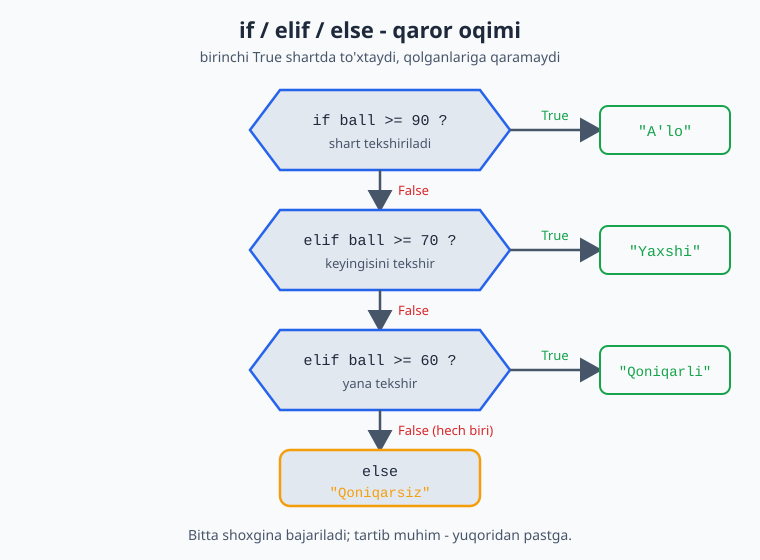
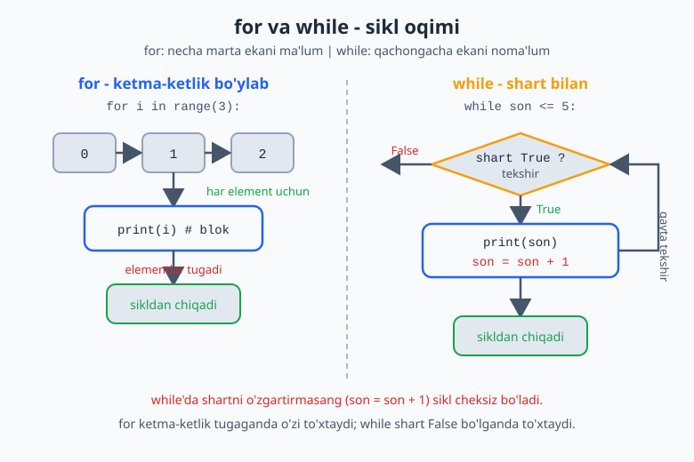
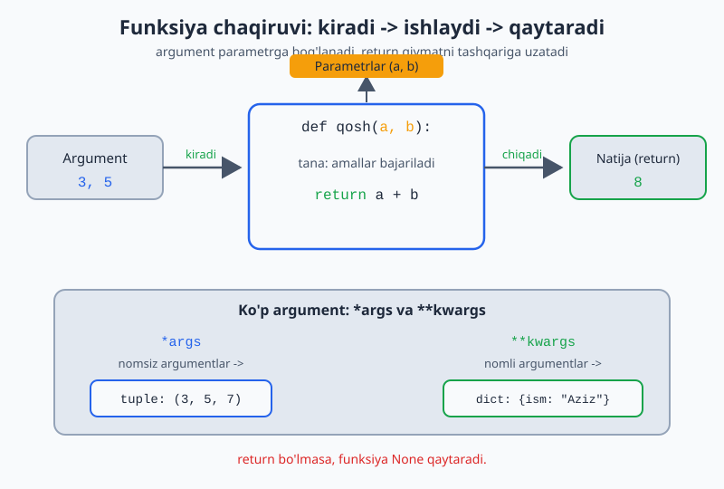
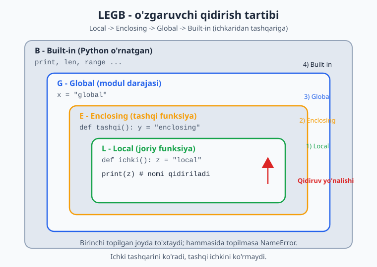

# 02 — Boshqaruv va funksiyalar

Hozirgacha kod yuqoridan pastga, har bir qator ketma-ket bajarilardi. Endi dasturlashning yuragini o'rganamiz: **shartga qarab qaror qabul qilish** (`if`) va **takrorlash** (`for`, `while`). Shundan keyin o'z **funksiyalaring**ni yozasan.

> **Bu modulda:** if/elif/else bilan tanlash, for va while sikllari, break/continue, va funksiyalar yaratish.

---

## 2.1 Bloklar va bo'sh joy (indentatsiya)

1-modulda aytib o'tgandik: Python'da kod **bloklari** chap tomondagi bo'sh joy (indentatsiya) bilan ajraladi. Endi buni amalda ko'ramiz.

Blok — bir guruh qator bo'lib, ular birga bajariladi. Blok ochilishidan oldin `:` (ikki nuqta) qo'yiladi, blok ichidagi qatorlar esa **4 ta bo'sh joy** bilan suriladi:

```python
yosh = 20

if yosh >= 18:
    print("Voyaga yetgan")      # 4 ta bo'sh joy — bu qator if blokiga tegishli
    print("Ovoz berishi mumkin")  # bu ham if blokida
print("Bu qator har doim bajariladi")   # surilmagan — blokdan tashqarida
```

> **Qoidalar:**
> - Blok ichi aniq **4 ta bo'sh joy** bilan suriladi (Tab tugmasi emas — ko'pchilik muharrirlar Tab'ni 4 bo'sh joyga aylantiradi).
> - Noto'g'ri bo'sh joy → `IndentationError` xatosi.
> - Bu Python qoidasi, xohish emas. Lekin foydasi bor: kod doim toza va bir xil ko'rinadi.

---

## 2.2 `if` / `elif` / `else` — qaror qabul qilish

`if` — "agar" degani. Shart `True` bo'lsa, blok bajariladi:

```python
yosh = 20

if yosh >= 18:
    print("Kirishingiz mumkin")
```

`else` — "aks holda". Shart bajarilmasa, `else` bloki ishlaydi:

```python
yosh = 15

if yosh >= 18:
    print("Kirishingiz mumkin")
else:
    print("Kirish mumkin emas")     # shu chiqadi
```

`elif` ("aks holda agar") — bir nechta shartni ketma-ket tekshirish uchun:

```python
ball = 75

if ball >= 90:
    print("A'lo")
elif ball >= 70:
    print("Yaxshi")           # shu chiqadi (75 >= 70)
elif ball >= 60:
    print("Qoniqarli")
else:
    print("Qoniqarsiz")
```

> Python yuqoridan pastga tekshiradi va **birinchi to'g'ri** shartda to'xtaydi. Qolganlariga qaramaydi. Shuning uchun shartlar tartibi muhim.

Quyidagi blok-sxema shartlarning yuqoridan pastga qanday tekshirilishini ko'rsatadi:



Shartlarni `and`, `or`, `not` bilan birlashtirish (1-modulda ko'rgan edik):

```python
yosh = 25
chipta = True

if yosh >= 18 and chipta:
    print("Konsertga kirishingiz mumkin")
```

---

## 2.3 `for` sikli — ketma-ketlik bo'ylab takrorlash

`for` sikli biror ketma-ketlik (sonlar, ro'yxat, matn...) bo'ylab harakatlanib, har bir element uchun blokni bajaradi.

**`range()` bilan sonlar bo'ylab:**

```python
for i in range(5):       # 0, 1, 2, 3, 4  (5 ning O'ZI kirmaydi!)
    print(i)
```

`range()` ning shakllari:

```python
range(5)         # 0, 1, 2, 3, 4
range(1, 6)      # 1, 2, 3, 4, 5     (1 dan boshlab, 6 gacha lekin 6 kirmaydi)
range(0, 10, 2)  # 0, 2, 4, 6, 8     (2 qadam bilan)
```

**Matn yoki ro'yxat bo'ylab** (ro'yxatni 3-modulda batafsil ko'rasan):

```python
for harf in "salom":
    print(harf)          # s, a, l, o, m  — har harf alohida qatorda

mevalar = ["olma", "banan", "uzum"]
for meva in mevalar:
    print(meva)
```

> `for i in range(n)` — "n marta takrorla" degani. `i` har aylanishda navbatdagi qiymatni oladi. O'zgaruvchi nomini ixtiyoriy tanlaysan (`i`, `son`, `harf`...).

---

## 2.4 `while` sikli — shart bajarilguncha takrorlash

`while` — shart `True` bo'lib turguncha takrorlaydi:

```python
son = 1
while son <= 5:
    print(son)
    son = son + 1        # MUHIM: shartni o'zgartirmasang, sikl cheksiz bo'ladi!
```

> **Diqqat — cheksiz sikl:** agar shart hech qachon `False` bo'lmasa, dastur to'xtamay qoladi. Yuqoridagi misolda `son = son + 1` bo'lmasa, `son` doim 1 bo'lib qoladi va sikl tugamaydi. Har `while` da shartni o'zgartirayotganingni tekshir.

`for` qancha marta takrorlashni oldindan bilganda, `while` esa "qachongacha"ni bilmaganda qulay (masalan, foydalanuvchi to'g'ri javob berguncha).

Quyidagi sxema ikki siklning oqimini yonma-yon solishtiradi:



---

## 2.5 `break` va `continue`

Sikl ichida oqimni boshqarish:

```python
# break — siklni butunlay to'xtatadi
for i in range(10):
    if i == 5:
        break            # 5 ga yetganda chiqadi
    print(i)             # 0, 1, 2, 3, 4

# continue — shu aylanishni o'tkazib, keyingisiga o'tadi
for i in range(5):
    if i == 2:
        continue         # 2 ni o'tkazib yuboradi
    print(i)             # 0, 1, 3, 4
```

---

## 2.6 Funksiyalar — kodni qayta ishlatish

Funksiya — bir vazifani bajaradigan, nom berilgan kod bo'lagi. Bir marta yozasan, keyin xohlagancha chaqirasan. Bu takrorni kamaytiradi va kodni tartibli qiladi.

```python
def salomlash():               # def bilan e'lon qilinadi
    print("Salom!")
    print("Xush kelibsiz!")

salomlash()                    # funksiyani chaqirish — kod shu yerda bajariladi
salomlash()                    # yana bir marta
```

**Parametrlar** — funksiyaga ma'lumot uzatish:

```python
def salomlash(ism):            # ism — parametr
    print(f"Salom, {ism}!")

salomlash("Aziz")              # Salom, Aziz!
salomlash("Malika")            # Salom, Malika!
```

**`return`** — funksiyadan natija qaytarish:

```python
def qosh(a, b):
    return a + b               # natijani qaytaradi

natija = qosh(3, 5)            # natija = 8
print(natija)                  # 8
print(qosh(10, 20))            # 30
```

> **`print` va `return` farqi** — yangi boshlovchilar buni tez chalkashtiradi:
> - `print` — qiymatni **ekranga ko'rsatadi**, lekin qaytarmaydi.
> - `return` — qiymatni **qaytaradi**, uni o'zgaruvchiga saqlab, keyin ishlatish mumkin.
>
> Hisob-kitob qiluvchi funksiyalar odatda `return` ishlatadi, shunda natijani keyinroq foydalanasan.

Quyidagi sxema argument parametrga qanday kirib, `return` natijani qanday qaytarishini, hamda ko'p argument uchun `*args`/`**kwargs`ni ko'rsatadi:



Funksiya ichida biror nomni ishlatganingda, Python uni qaysi tartibda qidiradi? Quyidagi sxema **LEGB** qoidasini ko'rsatadi — Python nomni Local -> Enclosing -> Global -> Built-in tartibida, ichkaridan tashqariga qarab qidiradi va birinchi topilgan joyda to'xtaydi:



---

## 2.7 Standart parametr qiymatlari

Parametrga oldindan qiymat berib qo'yish mumkin — chaqirilganda berilmasa, shu ishlatiladi:

```python
def salomlash(ism, salom="Salom"):
    print(f"{salom}, {ism}!")

salomlash("Aziz")                  # Salom, Aziz!     (standart ishlatildi)
salomlash("Aziz", "Assalomu alaykum")   # Assalomu alaykum, Aziz!
```

> Standart qiymatli parametrlar funksiyani moslashuvchan qiladi: ko'p hollarda standart yetadi, kerak bo'lganda boshqasini berasan.

---

## ✍️ Masalalar (20 ta)

> Bu masalalar shu modul va 1-modul mavzulariga asoslangan. Yechimga qaramasdan ishlashga harakat qil.

**Oson (1–7):**

1. Foydalanuvchidan son so'ra. Agar musbat bo'lsa "musbat", aks holda "musbat emas" deb chiqar.
2. Foydalanuvchidan yoshini so'ra. 18 dan katta yoki teng bo'lsa "voyaga yetgan", aks holda "voyaga yetmagan" deb yoz.
3. `for` sikli bilan 1 dan 10 gacha sonlarni chiqar.
4. `for` va `range` bilan 1 dan 10 gacha **juft** sonlarni chiqar (maslahat: `range(2, 11, 2)`).
5. `while` sikli bilan 5 dan 1 gacha teskari sanab chiqar.
6. `salom()` nomli funksiya yoz — chaqirilganda "Salom, dunyo!" chiqarsin. Uni 3 marta chaqir.
7. Ikkita sonni qabul qilib, ularning ko'paytmasini **qaytaradigan** (`return`) funksiya yoz.

**O'rta (8–14):**

8. Foydalanuvchidan ball so'ra (0–100). `if/elif/else` bilan baho qo'y: 90+ → "A'lo", 70+ → "Yaxshi", 60+ → "Qoniqarli", aks holda "Qoniqarsiz".
9. `for` sikli bilan 1 dan 100 gacha sonlarning yig'indisini hisobla va chiqar.
10. Foydalanuvchidan son so'ra, uning ko'paytuv jadvalini (1 dan 9 gacha) chiqar (`for` bilan, masalan `7 x 1 = 7`).
11. `while` sikli bilan foydalanuvchi "stop" deb yozguncha har safar undan biror so'z so'rab, uni qaytarib chiqar.
12. Sonni qabul qilib, juft yoki toq ekanini **qaytaradigan** funksiya yoz (maslahat: `%` ishlat, natija matn bo'lsin).
13. `for` va `break` bilan 1 dan boshlab sonlarni chiqar, lekin son 7 ga yetganda to'xta.
14. `for` va `continue` bilan 1 dan 10 gacha sonlarni chiqar, lekin 5 ni o'tkazib yubor.

**Murakkab (15–20):**

15. Foydalanuvchidan son so'rab, u **tub son** (faqat 1 va o'ziga bo'linadigan) ekanini tekshiruvchi dastur yoz (maslahat: `for` bilan 2 dan son-1 gacha bo'linishini tekshir).
16. Ikkita sonni va amalni (`+`, `-`, `*`, `/`) qabul qiladigan oddiy kalkulyator funksiya yoz (`if/elif` bilan amalni tanla, natijani `return` qil).
17. `for` sikli bilan 1 dan 50 gacha sonlardan faqat 3 ga **ham**, 5 ga **ham** bo'linadiganlarini chiqar.
18. Foydalanuvchidan parol so'ra. To'g'ri parol (`"python123"`) kiritilmaguncha `while` bilan qayta-qayta so'ra. To'g'ri bo'lganda "Kirish muvaffaqiyatli" deb yoz.
19. Berilgan son uchun **faktorial** hisoblaydigan funksiya yoz (`n!` = 1×2×...×n; masalan `5! = 120`). `for` yoki `while` bilan.
20. 1 dan 100 gacha "FizzBuzz" o'yini: 3 ga bo'linsa "Fizz", 5 ga bo'linsa "Buzz", ikkalasiga bo'linsa "FizzBuzz", aks holda sonning o'zini chiqar.

---

## ✅ Yechimlar

<details markdown="1">
<summary>Ko'rsatish uchun ochish</summary>

```python
# 1
son = int(input("Son: "))
if son > 0:
    print("musbat")
else:
    print("musbat emas")

# 2
yosh = int(input("Yosh: "))
if yosh >= 18:
    print("voyaga yetgan")
else:
    print("voyaga yetmagan")

# 3
for i in range(1, 11):
    print(i)

# 4
for i in range(2, 11, 2):
    print(i)

# 5
son = 5
while son >= 1:
    print(son)
    son = son - 1

# 6
def salom():
    print("Salom, dunyo!")
salom()
salom()
salom()

# 7
def kopaytir(a, b):
    return a * b
print(kopaytir(4, 5))     # 20

# 8
ball = int(input("Ball: "))
if ball >= 90:
    print("A'lo")
elif ball >= 70:
    print("Yaxshi")
elif ball >= 60:
    print("Qoniqarli")
else:
    print("Qoniqarsiz")

# 9
yigindi = 0
for i in range(1, 101):
    yigindi = yigindi + i
print(yigindi)            # 5050

# 10
n = int(input("Son: "))
for i in range(1, 10):
    print(f"{n} x {i} = {n * i}")

# 11
while True:
    soz = input("So'z ('stop' to'xtatadi): ")
    if soz == "stop":
        break
    print(soz)

# 12
def juft_toq(n):
    if n % 2 == 0:
        return "juft"
    else:
        return "toq"
print(juft_toq(10))       # juft

# 13
for i in range(1, 20):
    if i == 7:
        break
    print(i)              # 1..6

# 14
for i in range(1, 11):
    if i == 5:
        continue
    print(i)              # 5 dan tashqari hammasi

# 15
son = int(input("Son: "))
tubmi = True
if son < 2:
    tubmi = False
for i in range(2, son):
    if son % i == 0:
        tubmi = False
        break
print("tub son" if tubmi else "tub son emas")

# 16
def kalkulyator(a, b, amal):
    if amal == "+":
        return a + b
    elif amal == "-":
        return a - b
    elif amal == "*":
        return a * b
    elif amal == "/":
        return a / b
print(kalkulyator(10, 3, "*"))   # 30

# 17
for i in range(1, 51):
    if i % 3 == 0 and i % 5 == 0:
        print(i)          # 15, 30, 45

# 18
while True:
    parol = input("Parol: ")
    if parol == "python123":
        print("Kirish muvaffaqiyatli")
        break

# 19
def faktorial(n):
    natija = 1
    for i in range(1, n + 1):
        natija = natija * i
    return natija
print(faktorial(5))       # 120

# 20
for i in range(1, 101):
    if i % 3 == 0 and i % 5 == 0:
        print("FizzBuzz")
    elif i % 3 == 0:
        print("Fizz")
    elif i % 5 == 0:
        print("Buzz")
    else:
        print(i)
```

</details>

---

[← Asoslar](./01-asoslar.md) | [Boshlovchilar README ↑](./README.md) | [Keyingi: Ma'lumot tuzilmalari →](./03-malumot-tuzilmalari.md)
