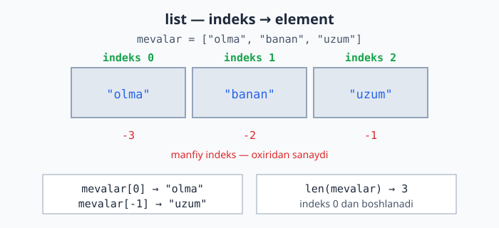
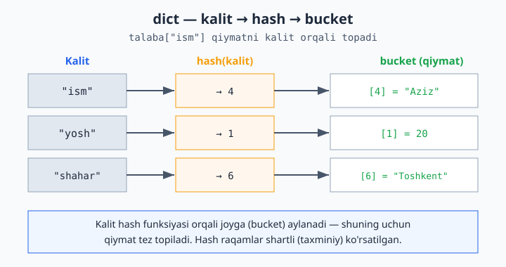
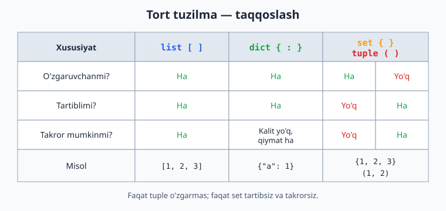

# 03 — Ma'lumot tuzilmalari

Hozirgacha bitta o'zgaruvchida bitta qiymat saqladik. Lekin ko'pincha **bir nechta qiymatni birga** saqlash kerak bo'ladi — masalan, o'quvchilar ro'yxati yoki mahsulot narxlari. Buning uchun Python'da maxsus tuzilmalar bor: **ro'yxat**, **lug'at**, **to'plam** va **tuple**.

> **Bu modulda:** ro'yxat (list) va uning metodlari, slicing, lug'at (dict), to'plam (set), tuple, va list comprehension.

---

## 3.1 Ro'yxat (list) — eng ko'p ishlatiladigan tuzilma

Ro'yxat — tartiblangan qiymatlar to'plami. Kvadrat qavs `[ ]` ichida, vergul bilan ajratiladi:

```python
mevalar = ["olma", "banan", "uzum"]
sonlar = [10, 20, 30, 40]
aralash = [1, "salom", 3.14, True]    # turli tiplar ham bo'lishi mumkin
bosh = []                              # bo'sh ro'yxat
```

**Elementga murojaat** — har bir element o'z **indeksi** (raqami) bilan. Diqqat: indeks **0 dan** boshlanadi:

```python
mevalar = ["olma", "banan", "uzum"]
print(mevalar[0])     # olma    (birinchi element)
print(mevalar[1])     # banan
print(mevalar[2])     # uzum
print(mevalar[-1])    # uzum    (oxirgisi — manfiy indeks oxiridan sanaydi)
print(mevalar[-2])    # banan
```

Ro'yxat ichida har bir element o'z indeksiga bog'langan; quyidagi diagramma musbat va manfiy indekslarning bir xil katakka qanday ishora qilishini ko'rsatadi:



**Elementni o'zgartirish:**

```python
mevalar[0] = "anor"
print(mevalar)        # ['anor', 'banan', 'uzum']
```

**Uzunligini bilish** — `len()`:

```python
print(len(mevalar))   # 3
```

**Ro'yxat bo'ylab aylanish** (`for` bilan, 2-modulda ko'rgan edik):

```python
for meva in mevalar:
    print(meva)
```

---

## 3.2 Ro'yxat metodlari

Ro'yxatga amal qilish uchun tayyor metodlar bor. Metod — `royxat.metod()` ko'rinishida chaqiriladi:

```python
sonlar = [3, 1, 2]

sonlar.append(4)        # oxiriga qo'shadi → [3, 1, 2, 4]
sonlar.insert(0, 9)     # 0-indeksga qo'yadi → [9, 3, 1, 2, 4]
sonlar.remove(1)        # qiymat 1 ni o'chiradi → [9, 3, 2, 4]
oxirgi = sonlar.pop()   # oxirgini olib tashlaydi va qaytaradi → oxirgi=4
sonlar.sort()           # tartiblaydi → [2, 3, 9]
sonlar.reverse()        # teskari qiladi → [9, 3, 2]

print(len(sonlar))      # nechta element
print(3 in sonlar)      # True  — 3 ro'yxatda bormi?
print(sonlar.count(3))  # 3 nechta marta uchraydi
```

> **Eng ko'p ishlatiladigani — `append()`.** Ko'pincha bo'sh ro'yxatdan boshlab, sikl ichida `append` bilan to'ldirasan:
> ```python
> kvadratlar = []
> for i in range(1, 6):
>     kvadratlar.append(i * i)
> print(kvadratlar)      # [1, 4, 9, 16, 25]
> ```

---

## 3.3 Slicing — ro'yxatning bir qismini olish

Slicing (kesib olish) — ro'yxatdan bir qismini ajratib olish. `[boshlanish:tugash]` ko'rinishida (tugash indeksi **kirmaydi**):

```python
sonlar = [0, 1, 2, 3, 4, 5]

print(sonlar[1:4])     # [1, 2, 3]      (1-indeksdan 4 gacha, 4 kirmaydi)
print(sonlar[:3])      # [0, 1, 2]      (boshidan 3 gacha)
print(sonlar[3:])      # [3, 4, 5]      (3-indeksdan oxirigacha)
print(sonlar[-2:])     # [4, 5]         (oxirgi 2 ta)
print(sonlar[::2])     # [0, 2, 4]      (har 2-element)
```

Quyidagi diagramma `[start:stop:step]` qanday ishlashini ko'rsatadi — `start` kiradi, `stop` esa kirmaydi:

![slicing [start:stop:step] qanday ishlaydi](rasmlar/py03-slicing.svg)

> Slicing matnlarda ham xuddi shunday ishlaydi (4-modulda ko'rasan). U **yangi** ro'yxat qaytaradi, aslini o'zgartirmaydi.

---

## 3.4 Lug'at (dict) — kalit–qiymat juftliklari

Lug'at — har bir qiymat **nom** (kalit) bilan saqlanadigan tuzilma. Ro'yxatda elementlar raqam (indeks) bilan, lug'atda esa **kalit** bilan topiladi. Jingalak qavs `{ }` ichida `kalit: qiymat` ko'rinishida:

```python
talaba = {
    "ism": "Aziz",
    "yosh": 20,
    "shahar": "Toshkent",
}
```

**Qiymatga murojaat** — kalit orqali:

```python
print(talaba["ism"])      # Aziz
print(talaba["yosh"])     # 20
```

Lug'at qiymatni shu qadar tez topishining sababi — kalit ichkarida **hash** qiymatiga aylantiriladi va shu orqali saqlangan joy (bucket) aniqlanadi:



**Qo'shish va o'zgartirish:**

```python
talaba["telefon"] = "998901234567"   # yangi kalit qo'shadi
talaba["yosh"] = 21                  # mavjud kalitni o'zgartiradi
```

**Xavfsiz murojaat** — `get()` (kalit yo'q bo'lsa xato bermaydi):

```python
print(talaba.get("email"))            # None  (kalit yo'q, lekin xato yo'q)
print(talaba.get("email", "yo'q"))    # yo'q  (standart qiymat berish mumkin)
# Solishtirish uchun: talaba["email"] — KeyError xatosi berardi
```

**Lug'at bo'ylab aylanish:**

```python
for kalit in talaba:
    print(kalit, "=", talaba[kalit])

# yoki kalit va qiymatni birga:
for kalit, qiymat in talaba.items():
    print(f"{kalit}: {qiymat}")
```

> **Qachon ro'yxat, qachon lug'at?** Tartibli, bir xil turdagi narsalar uchun (mevalar, ballar) — ro'yxat. Har bir narsaning "nomi"/xususiyati bo'lsa (ism, yosh, shahar) — lug'at.

---

## 3.5 To'plam (set) — takrorlanmas qiymatlar

To'plam — takrorlanmaydigan qiymatlar to'plami. Tartib yo'q, takror yo'q. Jingalak qavs `{ }` (lekin kalit-qiymat emas, faqat qiymatlar):

```python
ranglar = {"qizil", "yashil", "qizil", "ko'k"}
print(ranglar)        # {'qizil', 'yashil', 'ko'k'}  — takror avtomatik o'chdi
```

Eng foydali ishlatilishi — **takrorlarni olib tashlash**:

```python
sonlar = [1, 2, 2, 3, 3, 3, 4]
noyob = set(sonlar)
print(noyob)          # {1, 2, 3, 4}
print(len(noyob))     # 4  — nechta xil son bor
```

To'plam amallari:

```python
a = {1, 2, 3}
b = {2, 3, 4}
print(a & b)          # {2, 3}      — umumiy (kesishma)
print(a | b)          # {1, 2, 3, 4}  — birlashma
print(a - b)          # {1}         — a da bor, b da yo'q
```

---

## 3.6 Tuple — o'zgarmas ro'yxat

Tuple — ro'yxatga o'xshaydi, lekin **o'zgartirib bo'lmaydi** (qiymat berib qo'yilgandan keyin qo'shish/o'chirish/o'zgartirish mumkin emas). Oddiy qavs `( )` ichida:

```python
koordinata = (41.31, 69.28)
print(koordinata[0])      # 41.31
# koordinata[0] = 50      # XATO — tuple o'zgarmas
```

> **Qachon tuple?** O'zgarmasligi kerak bo'lgan ma'lumotlar uchun — masalan koordinata, RGB rang, yoki bir nechta qiymatni birga qaytarish. Tasodifan o'zgartirib qo'yishdan himoya qiladi.

Endi to'rttala tuzilmani bir joyda taqqoslab ko'ramiz — qaysi biri o'zgaruvchan, tartibli yoki takrorga ruxsat berishini quyidagi jadval umumlashtiradi:



Funksiyadan bir nechta qiymat qaytarishda tuple qulay:

```python
def min_max(sonlar):
    return min(sonlar), max(sonlar)   # tuple qaytaradi

eng_kichik, eng_katta = min_max([5, 2, 8, 1])
print(eng_kichik, eng_katta)          # 1 8
```

---

## 3.7 List comprehension — ro'yxatni qisqa yo'l bilan yaratish

Ko'pincha bir ro'yxatdan boshqasini yasaymiz. Buni `for` bilan ham qilsa bo'ladi, lekin **list comprehension** qisqaroq:

```python
# Oddiy usul (for bilan):
kvadratlar = []
for i in range(1, 6):
    kvadratlar.append(i * i)

# List comprehension bilan — bir qatorda:
kvadratlar = [i * i for i in range(1, 6)]
print(kvadratlar)         # [1, 4, 9, 16, 25]
```

Shart qo'shish ham mumkin (`if` bilan):

```python
juftlar = [i for i in range(1, 11) if i % 2 == 0]
print(juftlar)            # [2, 4, 6, 8, 10]
```

> Boshida `for` bilan yozaver — comprehension ko'zga o'rganib qolgach, qisqaroq variantga o'tasan. Ikkalasi bir xil natija beradi.

---

## ✍️ Masalalar (20 ta)

> Bu masalalar 1–3 modullar mavzulariga asoslangan.

**Oson (1–7):**

1. `["olma", "banan", "uzum"]` ro'yxatini yarat. Birinchi va oxirgi elementini chiqar.
2. Bo'sh ro'yxat yarat, unga `append` bilan 3 ta son qo'sh, keyin ro'yxatni chiqar.
3. `[5, 2, 8, 1, 9]` ro'yxatini `sort` bilan tartibla va chiqar. Keyin `len` bilan uzunligini chiqar.
4. `[10, 20, 30, 40, 50]` ro'yxatidan slicing bilan o'rtadagi 3 tasini (`[20, 30, 40]`) ol.
5. `talaba` lug'atini yarat (`ism`, `yosh`, `shahar`). Har bir kalitning qiymatini chiqar.
6. `[1, 1, 2, 3, 3, 3, 4]` ro'yxatidan `set` bilan takrorlarni olib tashla va nechta xil son borligini chiqar.
7. Bir lug'atga yangi kalit qo'sh va mavjud kalitning qiymatini o'zgartir.

**O'rta (8–14):**

8. Sonlar ro'yxatining yig'indisini va o'rtachasini hisobla (`sum()` va `len()` ishlat).
9. Ro'yxatdagi eng katta va eng kichik sonni top (`max()`, `min()`).
10. Foydalanuvchidan 5 ta son so'rab (sikl bilan), ularni ro'yxatga `append` qil, keyin ro'yxatni tartiblab chiqar.
11. Lug'at bo'ylab `items()` bilan aylanib, har bir juftlikni `kalit: qiymat` ko'rinishida chiqar.
12. List comprehension bilan 1 dan 20 gacha sonlarning kvadratlari ro'yxatini yasa.
13. List comprehension va `if` bilan 1 dan 30 gacha 3 ga bo'linadigan sonlar ro'yxatini yasa.
14. Ikkita ro'yxatning umumiy elementlarini top (`set` va `&` ishlat): `[1,2,3,4]` va `[3,4,5,6]`.

**Murakkab (15–20):**

15. So'zlar ro'yxati berilgan. Har bir so'z necha marta uchraganini sanab, lug'atga yoz (maslahat: lug'at + `get`). Masalan `["a","b","a","c","a"]` → `{"a":3, "b":1, "c":1}`.
16. Talabalar ro'yxati (har biri lug'at: `ism`, `ball`). Ballari 60 dan yuqorilarning ismlarini chiqar.
17. Sonlar ro'yxatidan faqat juftlarini yangi ro'yxatga ajrat (ham `for` bilan, ham list comprehension bilan — ikki usulda).
18. Foydalanuvchidan so'zlar kiritishini so'ra ("stop" deguncha), ularni ro'yxatga yig'. Oxirida nechta so'z kiritilganini va ularni alifbo tartibida chiqar.
19. Bir lug'atda mahsulot nomi → narxi saqlangan. Barcha narxlar yig'indisini hisobla va eng qimmat mahsulot nomini top.
20. Telefon kitobchasi: foydalanuvchi "qo'shish", "qidirish" yoki "chiqish" tanlasin. Qo'shishda ism va raqamni lug'atga saqla, qidirishda ism bo'yicha raqamni chiqar (`while` sikli bilan davomli ishlasin).

---

## ✅ Yechimlar

<details markdown="1">
<summary>Ko'rsatish uchun ochish</summary>

```python
# 1
mevalar = ["olma", "banan", "uzum"]
print(mevalar[0], mevalar[-1])     # olma uzum

# 2
sonlar = []
sonlar.append(10)
sonlar.append(20)
sonlar.append(30)
print(sonlar)                      # [10, 20, 30]

# 3
sonlar = [5, 2, 8, 1, 9]
sonlar.sort()
print(sonlar)                      # [1, 2, 5, 8, 9]
print(len(sonlar))                 # 5

# 4
sonlar = [10, 20, 30, 40, 50]
print(sonlar[1:4])                 # [20, 30, 40]

# 5
talaba = {"ism": "Aziz", "yosh": 20, "shahar": "Toshkent"}
print(talaba["ism"])
print(talaba["yosh"])
print(talaba["shahar"])

# 6
sonlar = [1, 1, 2, 3, 3, 3, 4]
print(len(set(sonlar)))            # 4

# 7
talaba = {"ism": "Aziz", "yosh": 20}
talaba["shahar"] = "Toshkent"      # qo'shish
talaba["yosh"] = 21                # o'zgartirish
print(talaba)

# 8
sonlar = [10, 20, 30, 40]
print(sum(sonlar))                 # 100
print(sum(sonlar) / len(sonlar))   # 25.0

# 9
sonlar = [5, 2, 8, 1, 9]
print(max(sonlar), min(sonlar))    # 9 1

# 10
sonlar = []
for i in range(5):
    sonlar.append(int(input(f"{i+1}-son: ")))
sonlar.sort()
print(sonlar)

# 11
talaba = {"ism": "Aziz", "yosh": 20, "shahar": "Toshkent"}
for kalit, qiymat in talaba.items():
    print(f"{kalit}: {qiymat}")

# 12
kvadratlar = [i * i for i in range(1, 21)]
print(kvadratlar)

# 13
uchga = [i for i in range(1, 31) if i % 3 == 0]
print(uchga)                       # [3, 6, 9, ..., 30]

# 14
a = [1, 2, 3, 4]
b = [3, 4, 5, 6]
print(set(a) & set(b))             # {3, 4}

# 15
sozlar = ["a", "b", "a", "c", "a"]
hisob = {}
for soz in sozlar:
    hisob[soz] = hisob.get(soz, 0) + 1
print(hisob)                       # {'a': 3, 'b': 1, 'c': 1}

# 16
talabalar = [
    {"ism": "Aziz", "ball": 85},
    {"ism": "Malika", "ball": 55},
    {"ism": "Bobur", "ball": 72},
]
for t in talabalar:
    if t["ball"] > 60:
        print(t["ism"])            # Aziz, Bobur

# 17
sonlar = [1, 2, 3, 4, 5, 6]
# for bilan:
juftlar = []
for s in sonlar:
    if s % 2 == 0:
        juftlar.append(s)
print(juftlar)                     # [2, 4, 6]
# comprehension bilan:
juftlar2 = [s for s in sonlar if s % 2 == 0]
print(juftlar2)                    # [2, 4, 6]

# 18
sozlar = []
while True:
    soz = input("So'z ('stop' to'xtatadi): ")
    if soz == "stop":
        break
    sozlar.append(soz)
sozlar.sort()
print(f"{len(sozlar)} ta so'z:", sozlar)

# 19
mahsulotlar = {"olma": 12000, "non": 4000, "go'sht": 90000}
print("Jami:", sum(mahsulotlar.values()))
eng_qimmat = ""
eng_narx = 0
for nom, narx in mahsulotlar.items():
    if narx > eng_narx:
        eng_narx = narx
        eng_qimmat = nom
print("Eng qimmat:", eng_qimmat)   # go'sht

# 20
kitobcha = {}
while True:
    amal = input("qo'shish / qidirish / chiqish: ")
    if amal == "chiqish":
        break
    elif amal == "qo'shish":
        ism = input("Ism: ")
        raqam = input("Raqam: ")
        kitobcha[ism] = raqam
    elif amal == "qidirish":
        ism = input("Ism: ")
        print(kitobcha.get(ism, "topilmadi"))
```

</details>

---

[← Boshqaruv va funksiyalar](./02-boshqaruv-funksiyalar.md) | [Boshlovchilar README ↑](./README.md) | [Keyingi: Stringlar →](./04-stringlar.md)
