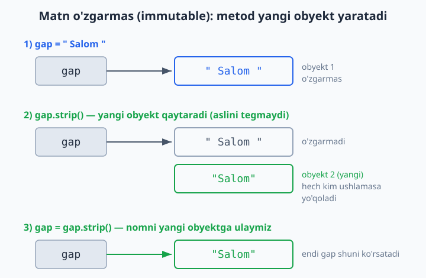
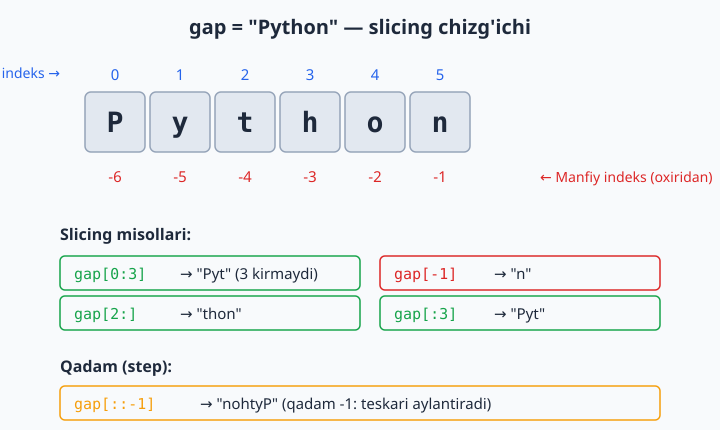

# 04 — Stringlar (matn bilan ishlash)

Matn (string) — dasturlashda eng ko'p ishlatiladigan ma'lumot turlaridan biri: ismlar, xabarlar, fayl matni, foydalanuvchi kiritgan ma'lumot. Bu modulda matnni qanday tahlil qilish, o'zgartirish va formatlashni o'rganasan.

> **Bu modulda:** matn metodlari (katta/kichik harf, bo'sh joy tozalash, almashtirish), matnni bo'laklarga ajratish va birlashtirish, slicing, va matn ichidan qidirish.

---

## 4.1 Matn asoslari

Matn qo'shtirnoq `" "` yoki bittirnoq `' '` ichida yoziladi (farqi yo'q, lekin bittasini tanlab izchil ishlat):

```python
ism = "Aziz"
jumla = 'Bugun havo issiq'
```

Matn ichida qo'shtirnoq kerak bo'lsa, tashqarisiga bittirnoq ishlat (yoki teskari):

```python
gap = 'U "salom" dedi'
gap2 = "It's a book"
```

**Uzunligi** — `len()`:

```python
print(len("salom"))      # 5
```

**Matnni birlashtirish va takrorlash:**

```python
ism = "Aziz"
familiya = "Karimov"
print(ism + " " + familiya)    # Aziz Karimov   (+ birlashtiradi)
print("=" * 20)                # ====================   (* takrorlaydi)
```

> **Diqqat:** `+` faqat matnni matn bilan birlashtiradi. Matnga son qo'shmoqchi bo'lsang, avval sonni `str()` bilan matnga aylantir:
> ```python
> yosh = 25
> print("Yosh: " + str(yosh))    # Yosh: 25
> # yoki osonroq — f-string:
> print(f"Yosh: {yosh}")         # Yosh: 25
> ```

---

## 4.2 Matn metodlari

Matnga amal qiladigan ko'plab tayyor metodlar bor. `matn.metod()` ko'rinishida chaqiriladi:

```python
gap = "  Salom Dunyo  "

print(gap.upper())          # "  SALOM DUNYO  "   — katta harf
print(gap.lower())          # "  salom dunyo  "   — kichik harf
print(gap.strip())          # "Salom Dunyo"        — chetdagi bo'sh joylarni olib tashlaydi
print(gap.replace("Dunyo", "Olam"))   # "  Salom Olam  "  — almashtiradi
print(gap.title())          # "  Salom Dunyo  "   — har so'z bosh harf bilan
```

> **Muhim:** matn metodlari aslini **o'zgartirmaydi** — yangi matn qaytaradi. Natijani saqlash uchun o'zgaruvchiga ber:
> ```python
> gap = "  Salom  "
> gap = gap.strip()        # natijani qayta saqladik
> print(gap)               # "Salom"
> ```

Quyidagi diagramma matn **o'zgarmasligini** (immutable) ko'rsatadi: metod aslini tegmaydi, balki yangi obyekt yaratadi va u faqat o'zgaruvchiga qayta saqlasang qoladi.



Tekshiruv metodlari (`True`/`False` qaytaradi):

```python
"salom".startswith("sal")    # True   — "sal" bilan boshlanadimi?
"rasm.jpg".endswith(".jpg")  # True   — ".jpg" bilan tugaydimi?
"12345".isdigit()            # True   — faqat raqamlardan iboratmi?
"salom".isalpha()            # True   — faqat harflardanmi?
"Salom" in "Salom Dunyo"     # True   — ichida bormi?
```

---

## 4.3 Matnni bo'laklarga ajratish va birlashtirish

**`split()`** — matnni bo'laklarga ajratib, ro'yxat qaytaradi:

```python
gap = "olma banan uzum"
sozlar = gap.split()          # bo'sh joy bo'yicha ajratadi
print(sozlar)                 # ['olma', 'banan', 'uzum']

sana = "2026-06-09"
qismlar = sana.split("-")     # "-" bo'yicha ajratadi
print(qismlar)                # ['2026', '06', '09']
```

**`join()`** — ro'yxatni matnga birlashtiradi (`split` ning teskarisi):

```python
sozlar = ["olma", "banan", "uzum"]
print(", ".join(sozlar))      # "olma, banan, uzum"   — vergul bilan birlashtirdi
print(" ".join(sozlar))       # "olma banan uzum"
```

> **Eslab qol:** `ajratuvchi.join(royxat)` — ajratuvchi belgi matnga ulanib turadi. Bu yangi boshlovchilarni chalkashtiradi: `join` ro'yxatning emas, **ajratuvchi matnning** metodi.

---

## 4.4 Slicing — matnning bir qismini olish

Matn ham xuddi ro'yxatdek indekslanadi (0 dan boshlab) va slicing bilan kesib olinadi:

```python
gap = "Python"

print(gap[0])        # P       (birinchi harf)
print(gap[-1])       # n       (oxirgi harf)
print(gap[0:3])      # Pyt     (0 dan 3 gacha, 3 kirmaydi)
print(gap[2:])       # thon    (2-indeksdan oxirigacha)
print(gap[:3])       # Pyt     (boshidan 3 gacha)
print(gap[::-1])     # nohtyP  (teskari — matnni teskari aylantirish hiylasi!)
```

Quyidagi chizg'ich indekslar qanday ishlashini ko'rsatadi: musbat indeks boshidan (0 dan), manfiy indeks oxiridan (-1 dan) sanaladi, qadam (step) esa yo'nalish va sakrashni belgilaydi.



Matn bo'ylab aylanish:

```python
for harf in "abc":
    print(harf)          # a, b, c
```

---

## 4.5 f-string bilan formatlash (kengaytirilgan)

1-modulda f-string'ni ko'rgan edik. Eng muhim formatlash variantlarini takrorlaymiz:

```python
ism = "Aziz"
narx = 1234567.5
foiz = 0.85

f"Salom, {ism}!"             # Salom, Aziz!
f"{narx:,.2f}"               # 1,234,567.50   — minglik ajratgich + 2 kasr
f"{foiz:.1%}"                # 85.0%          — foiz
f"{ism:>10}"                 # "      Aziz"   — o'ngga tekislash, 10 belgi kenglikda
f"{ism:<10}"                 # "Aziz      "   — chapga tekislash
f"{ism:^10}"                 # "   Aziz   "   — markazga
```

Tekislash jadval ko'rinishidagi chiqarish uchun foydali:

```python
mahsulotlar = [("Olma", 12000), ("Non", 4000), ("Go'sht", 90000)]
for nom, narx in mahsulotlar:
    print(f"{nom:<10} {narx:>10,} so'm")
# Olma            12,000 so'm
# Non              4,000 so'm
# Go'sht          90,000 so'm
```

---

## 4.6 Matn ichidan qidirish (boshlang'ich)

Oddiy qidiruv uchun yuqoridagi metodlar (`in`, `startswith`, `find`) yetadi:

```python
gap = "Salom Dunyo"
print("Dunyo" in gap)        # True
print(gap.find("Dunyo"))     # 6      — qaysi indeksdan boshlanishini qaytaradi
print(gap.find("yo'q"))      # -1     — topilmasa -1
print(gap.count("o"))        # 2      — necha marta uchraydi
```

> **Ilg'or qidiruv:** murakkab namunalar (masalan "har qanday telefon raqamini top") uchun Python'da `re` (regular expressions) moduli bor. U kuchli, lekin boshlovchi uchun erta — keyingi modullarda ko'rib chiqamiz. Hozircha yuqoridagi oddiy metodlar ko'p ishni hal qiladi.

---

## ✍️ Masalalar (20 ta)

> Bu masalalar 1–4 modullar mavzulariga asoslangan.

**Oson (1–7):**

1. Foydalanuvchidan ism va familiyani alohida so'rab, ularni bo'sh joy bilan birlashtirib chiqar.
2. Bir matnni `upper()` va `lower()` bilan katta va kichik harfda chiqar.
3. `"  salom  "` matnidan chetdagi bo'sh joylarni `strip()` bilan olib tashlab chiqar.
4. Bir matnning uzunligini (`len`) chiqar.
5. `"="` belgisini 30 marta chiqar (`*` ishlat).
6. `"Python dasturlash"` matnini `split()` bilan so'zlarga ajratib chiqar.
7. `["a", "b", "c"]` ro'yxatini `"-"` bilan birlashtirib chiqar (`a-b-c`).

**O'rta (8–14):**

8. Foydalanuvchidan email so'ra. Agar ichida `"@"` bo'lsa "to'g'ri", aks holda "noto'g'ri" deb chiqar.
9. Bir so'zni slicing bilan teskari aylantir (`"salom"` → `"molas"`).
10. Foydalanuvchidan jumla so'rab, undagi so'zlar sonini chiqar (`split()` + `len`).
11. Bir matndagi biror harf (masalan `"a"`) necha marta uchrashini sana (`count`).
12. Fayl nomini (masalan `"rasm.jpg"`) tekshir: `.jpg` bilan tugasa "rasm", `.txt` bilan tugasa "matn", aks holda "boshqa" deb chiqar.
13. Foydalanuvchidan to'liq ismni (`"Aziz Karimov"`) so'rab, faqat ismini (birinchi so'z) chiqar (`split` + indeks).
14. Bir jumladagi har bir so'zni alohida qatorda chiqar (`split` + `for`).

**Murakkab (15–20):**

15. Foydalanuvchidan jumla so'rab, undagi har so'zning bosh harfini katta qil (`title()` ishlatmasdan, `split` + `for` + slicing bilan qilib ko'r).
16. Palindrom tekshir: foydalanuvchidan so'z so'rab, u teskarisiga ham bir xil o'qiladimi tekshir (`"radar"` → palindrom). Bo'sh joy va katta-kichik harfni hisobga olma.
17. Foydalanuvchidan jumla so'rab, undagi unli harflar (`a, e, i, o, u`) sonini sana.
18. Bir matndagi barcha bo'sh joylarni `"_"` ga almashtir (`replace`) va natijani chiqar.
19. Sana matnini (`"2026-06-09"`) `split("-")` bilan ajratib, `"9-iyun, 2026-yil"` ko'rinishida chiqar (oylar nomini lug'atdan ol).
20. Oddiy "shifrlash": foydalanuvchidan so'z so'rab, har bir harfni keyingi harfga almashtir (`"abc"` → `"bcd"`). Maslahat: `ord()` harfni songa, `chr()` sonni harfga aylantiradi.

---

## ✅ Yechimlar

<details markdown="1">
<summary>Ko'rsatish uchun ochish</summary>

```python
# 1
ism = input("Ism: ")
familiya = input("Familiya: ")
print(ism + " " + familiya)

# 2
gap = "Salom"
print(gap.upper())        # SALOM
print(gap.lower())        # salom

# 3
print("  salom  ".strip())    # "salom"

# 4
print(len("Python"))      # 6

# 5
print("=" * 30)

# 6
print("Python dasturlash".split())    # ['Python', 'dasturlash']

# 7
print("-".join(["a", "b", "c"]))       # a-b-c

# 8
email = input("Email: ")
if "@" in email:
    print("to'g'ri")
else:
    print("noto'g'ri")

# 9
soz = "salom"
print(soz[::-1])          # molas

# 10
jumla = input("Jumla: ")
print(len(jumla.split()))

# 11
gap = "banana"
print(gap.count("a"))     # 3

# 12
fayl = "rasm.jpg"
if fayl.endswith(".jpg"):
    print("rasm")
elif fayl.endswith(".txt"):
    print("matn")
else:
    print("boshqa")

# 13
toliq = input("To'liq ism: ")
print(toliq.split()[0])   # birinchi so'z

# 14
jumla = input("Jumla: ")
for soz in jumla.split():
    print(soz)

# 15
jumla = input("Jumla: ")
natija = []
for soz in jumla.split():
    natija.append(soz[0].upper() + soz[1:])
print(" ".join(natija))

# 16
soz = input("So'z: ").lower().replace(" ", "")
if soz == soz[::-1]:
    print("palindrom")
else:
    print("palindrom emas")

# 17
jumla = input("Jumla: ").lower()
hisob = 0
for harf in jumla:
    if harf in "aeiou":
        hisob += 1
print("Unlilar soni:", hisob)

# 18
gap = input("Matn: ")
print(gap.replace(" ", "_"))

# 19
sana = "2026-06-09"
yil, oy, kun = sana.split("-")
oylar = {
    "01": "yanvar", "02": "fevral", "03": "mart", "04": "aprel",
    "05": "may", "06": "iyun", "07": "iyul", "08": "avgust",
    "09": "sentabr", "10": "oktabr", "11": "noyabr", "12": "dekabr",
}
print(f"{int(kun)}-{oylar[oy]}, {yil}-yil")    # 9-iyun, 2026-yil

# 20
soz = input("So'z: ")
natija = ""
for harf in soz:
    natija += chr(ord(harf) + 1)
print(natija)             # "abc" -> "bcd"
```

</details>

---

[← Ma'lumot tuzilmalari](./03-malumot-tuzilmalari.md) | [Boshlovchilar README ↑](./README.md) | [Keyingi: OOP (klasslar) →](./05-oop.md)
