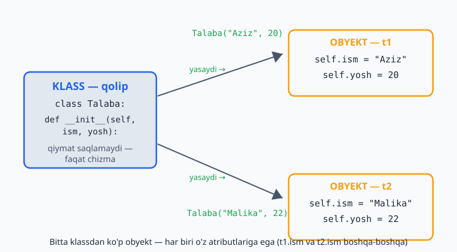
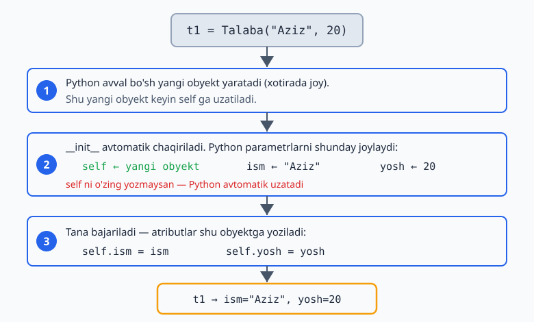
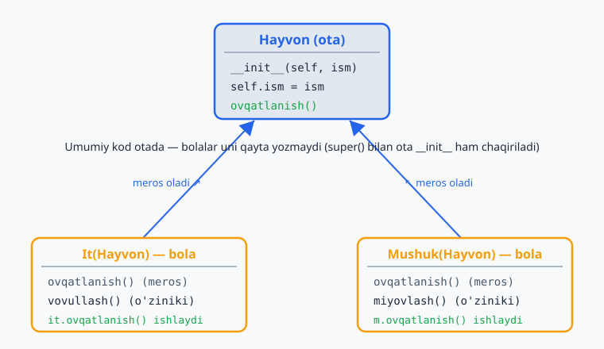

# 05 — OOP: klasslar va obyektlar

Hozirgacha ma'lumotni alohida o'zgaruvchilarda saqladik. Lekin ko'pincha **ma'lumot va u bilan bog'liq amallarni birga** saqlash qulay. Masalan, "talaba"ning ismi, yoshi (ma'lumot) va "salomlash", "imtihon topshirish" (amallar) — bularni bitta joyda jamlash mumkin. Bu — **OOP** (obyektga yo'naltirilgan dasturlash), va u **klass** hamda **obyekt** tushunchalariga asoslanadi.

> **Bu modulda:** klass va obyekt nima, `__init__` va `self`, atributlar va metodlar, `__str__`, hamda meros (inheritance).

---

## 5.1 Klass va obyekt nima?

**Klass** — bu "qolip" yoki "chizma". **Obyekt** — shu qolipdan yasalgan aniq narsa.

Misol: "Mashina" — bu klass (umumiy tushuncha, chizma). Sening qo'shningning oq Malibusi — bu obyekt (aniq mashina). Bitta chizmadan ko'p mashina yasash mumkin, har biri alohida obyekt.

```python
class Mashina:           # klass — qolip
    pass                 # hozircha bo'sh

mening_mashinam = Mashina()    # obyekt — qolipdan yasaldi
qoshnining = Mashina()         # yana bir obyekt
```

> **Kelishuv:** klass nomi katta harf bilan boshlanadi (`Mashina`, `Talaba`), o'zgaruvchilar kichik harf bilan.

---

## 5.2 `__init__` va `self` — obyektga ma'lumot berish

`__init__` — maxsus metod, obyekt yaratilganda **avtomatik** ishlaydi. Unda obyektning boshlang'ich ma'lumotlarini o'rnatasan. `self` — "shu obyektning o'zi" degani:

```python
class Talaba:
    def __init__(self, ism, yosh):
        self.ism = ism        # bu obyektning ismi
        self.yosh = yosh       # bu obyektning yoshi

t1 = Talaba("Aziz", 20)        # __init__ avtomatik chaqiriladi
t2 = Talaba("Malika", 22)

print(t1.ism)                  # Aziz
print(t2.yosh)                 # 22
```

`self.ism = ism` ni shunday tushun: "shu obyektga `ism` degan xususiyat (atribut) qo'yib, unga berilgan qiymatni saqla". Har bir obyekt o'z atributlariga ega — `t1.ism` va `t2.ism` boshqa-boshqa.

Quyidagi diagramma bitta klassdan ikki alohida obyekt yasalishini va har birining o'z atributlariga ega ekanini ko'rsatadi:



> **`self` haqida:** har bir metodning birinchi parametri `self` bo'ladi. Uni chaqirayotganda **o'zing yozmaysan** — Python avtomatik uzatadi. `t1.salomla()` desang, Python `self` o'rniga `t1` ni qo'yadi.

Mana `t1 = Talaba("Aziz", 20)` yozilganda Python ichkarida nima qilishi — `__init__` va `self` qadam-baqadam:



---

## 5.3 Metodlar — obyektning amallari

Metod — klass ichidagi funksiya. U obyekt bilan biror ish qiladi:

```python
class Talaba:
    def __init__(self, ism, yosh):
        self.ism = ism
        self.yosh = yosh

    def salomla(self):                 # metod — birinchi parametr self
        print(f"Salom, men {self.ism}")

    def tugilgan_kun(self):
        self.yosh = self.yosh + 1      # obyektning atributini o'zgartiradi
        print(f"{self.ism} endi {self.yosh} yoshda")

t = Talaba("Aziz", 20)
t.salomla()              # Salom, men Aziz
t.tugilgan_kun()         # Aziz endi 21 yoshda
```

Metod ichida boshqa atributlarga `self.` orqali murojaat qilasan. Metod qiymat ham qaytarishi mumkin (`return`):

```python
class Hisob:
    def __init__(self, balans):
        self.balans = balans

    def qoshish(self, summa):
        self.balans += summa

    def hisobot(self):
        return f"Balans: {self.balans} so'm"

h = Hisob(1000)
h.qoshish(500)
print(h.hisobot())       # Balans: 1500 so'm
```

---

## 5.4 `__str__` — obyektni chiroyli chiqarish

Obyektni to'g'ridan-to'g'ri `print` qilsang, tushunarsiz narsa chiqadi:

```python
t = Talaba("Aziz", 20)
print(t)        # <__main__.Talaba object at 0x7f...>   — foydasiz
```

`__str__` metodini qo'shsang, `print` shuni ko'rsatadi:

```python
class Talaba:
    def __init__(self, ism, yosh):
        self.ism = ism
        self.yosh = yosh

    def __str__(self):
        return f"Talaba: {self.ism}, {self.yosh} yosh"

t = Talaba("Aziz", 20)
print(t)        # Talaba: Aziz, 20 yosh
```

---

## 5.5 Meros (inheritance) — klassdan klass yasash

Meros — bir klass boshqasining xususiyatlarini "meros qilib olishi". Umumiy narsalarni asosiy klassga yozasan, maxsus narsalarni avlod klasslarga qoldirasan. Bu takrorni kamaytiradi.

```python
class Hayvon:
    def __init__(self, ism):
        self.ism = ism

    def ovqatlanish(self):
        print(f"{self.ism} ovqatlanmoqda")

class It(Hayvon):                # It — Hayvon'dan meros oladi
    def vovullash(self):
        print(f"{self.ism}: Vov-vov!")

class Mushuk(Hayvon):            # Mushuk ham
    def miyovlash(self):
        print(f"{self.ism}: Miyov!")

it = It("Boburjon")
it.ovqatlanish()      # Boburjon ovqatlanmoqda   — Hayvon'dan merosga olindi
it.vovullash()        # Boburjon: Vov-vov!         — It'ning o'ziniki
```

Quyidagi meros daraxti ota klass (`Hayvon`) va undan meros oluvchi bola klasslar (`It`, `Mushuk`) qanday bog'lanishini hamda metod merosini ko'rsatadi:



**`super()`** — asosiy klassning `__init__` ini chaqirish uchun (avlod qo'shimcha atribut qo'shsa):

```python
class It(Hayvon):
    def __init__(self, ism, zot):
        super().__init__(ism)    # Hayvon'ning __init__ ini chaqiradi (ism o'rnatiladi)
        self.zot = zot           # qo'shimcha atribut

it = It("Boburjon", "Labrador")
print(it.ism, it.zot)            # Boburjon Labrador
```

> **Qachon meros?** Agar "B — bu A turi" desa bo'lsa (It — bu Hayvon, Talaba — bu Inson), meros mos keladi. Umumiy kodni qayta yozmaslik uchun foydali.

---

## 5.6 Ilg'or mavzular (hozircha qisqacha)

Python OOP'da yana ko'p imkoniyatlar bor — ularni keyinroq, tajriba ortgach o'rganasan:
- `@property` — atributga "o'qishda" hisoblanuvchi qiymat berish.
- `dataclass` — faqat ma'lumot saqlovchi klasslarni qisqa yozish.
- Maxsus metodlar (`__eq__`, `__len__`...) — obyektlarga `+`, `==`, `len()` kabi amallarni qo'shish.

Hozircha yuqoridagi asoslar — klass, `__init__`, metod, meros — kundalik ishning 90% ini qoplaydi.

---

## ✍️ Masalalar (20 ta)

> Bu masalalar 1–5 modullar mavzulariga asoslangan.

**Oson (1–7):**

1. `Kitob` klassini yarat: `__init__` da `nom` va `muallif` atributlarini o'rnat. Bitta obyekt yaratib, atributlarini chiqar.
2. `Talaba` klassiga `salomla()` metodini qo'sh — "Salom, men {ism}" deb chiqarsin.
3. `Doira` klassini yarat: `__init__` da `radius` ni ol, `yuza()` metodi yuzasini (`3.14159 * r * r`) qaytarsin.
4. `Hisoblagich` klassini yarat: `son` atributi 0 dan boshlansin, `oshir()` metodi 1 ga oshirsin.
5. `It` klassiga `__str__` qo'sh — "It: {ism}" ko'rinishida chiqarsin.
6. `Hisob` (bank hisobi) klassini yarat: `balans` atributi bo'lsin, `qoy(summa)` va `yech(summa)` metodlari balansni o'zgartirsin.
7. Bitta `Talaba` klassidan 3 ta obyekt yaratib, har birining ismini chiqar.

**O'rta (8–14):**

8. `Talaba` klassiga `ballar` (ro'yxat) atributini qo'sh. `ball_qosh(b)` metodi ballni ro'yxatga qo'shsin, `ortacha()` metodi o'rtachani qaytarsin.
9. `Hisob` klassining `yech` metodida tekshiruv qo'sh: balansdan ko'p yechib bo'lmasin (yetarli bo'lmasa "mablag' yetarli emas" deb yoz).
10. `Hayvon` asosiy klassini yarat (`ism` + `ovqatlanish()`), undan `It` va `Mushuk` avlod klasslarini yasab, har biriga o'z ovozini qo'sh.
11. `super()` ishlatib: `Mashina` klassi (`marka`) va undan `ElektrMashina` (`marka` + `batareya`) yarat.
12. `Toringoq` (to'rtburchak) klassini yarat: `eni`, `boyi` atributlari; `yuza()` va `perimetr()` metodlari.
13. `Kitob` klassiga `__str__` qo'sh: "{nom} — {muallif}" ko'rinishida. Kitoblar ro'yxatini yaratib, har birini `print` qil.
14. `Talaba` klassining ikkita obyektini yarat, ballari o'rtachasini taqqoslab, kim yuqori ekanini chiqar.

**Murakkab (15–20):**

15. `Stack` (suzgich) klassini yarat: `push(x)` (qo'shish), `pop()` (oxirgini olib qaytarish), `bosh()` (bo'shmi tekshirish) metodlari (ichida ro'yxat ishlat).
16. `Kutubxona` klassini yarat: kitoblarni ro'yxatda saqlasin; `qosh(kitob)`, `royxat()` (barchasini chiqarish), `qidir(nom)` metodlari bo'lsin.
17. `Hayvon` dan meros olgan kamida 3 ta klass yarat. Ularni bitta ro'yxatga solib, sikl bilan har birining ovozini chiqar (har biri o'zicha ovoz chiqarsin).
18. `Vaqt` klassini yarat: `soat`, `daqiqa`; `__str__` "SS:MM" ko'rinishida (`{:02d}`); `daqiqa_qosh(n)` metodi vaqtni to'g'ri oshirsin (60 daqiqa = 1 soat).
19. Oddiy "Do'kon" tizimi: `Mahsulot` klassi (`nom`, `narx`, `soni`) va `Savat` klassi (mahsulotlarni qo'shish, umumiy summani hisoblash).
20. `BankHisobi` klassini to'liq yoz: `qoy`, `yech` (yetarli mablag' tekshiruvi bilan), va har amalni `tarix` ro'yxatiga yozsin; `tarixni_chiqar()` metodi barcha amallarni ko'rsatsin.

---

## ✅ Yechimlar

<details markdown="1">
<summary>Ko'rsatish uchun ochish</summary>

```python
# 1
class Kitob:
    def __init__(self, nom, muallif):
        self.nom = nom
        self.muallif = muallif
k = Kitob("O'tkan kunlar", "A. Qodiriy")
print(k.nom, "-", k.muallif)

# 2
class Talaba:
    def __init__(self, ism):
        self.ism = ism
    def salomla(self):
        print(f"Salom, men {self.ism}")
Talaba("Aziz").salomla()

# 3
class Doira:
    def __init__(self, radius):
        self.radius = radius
    def yuza(self):
        return 3.14159 * self.radius ** 2
print(Doira(5).yuza())        # 78.53975

# 4
class Hisoblagich:
    def __init__(self):
        self.son = 0
    def oshir(self):
        self.son += 1
h = Hisoblagich(); h.oshir(); h.oshir()
print(h.son)                  # 2

# 5
class It:
    def __init__(self, ism):
        self.ism = ism
    def __str__(self):
        return f"It: {self.ism}"
print(It("Boburjon"))         # It: Boburjon

# 6
class Hisob:
    def __init__(self, balans):
        self.balans = balans
    def qoy(self, summa):
        self.balans += summa
    def yech(self, summa):
        self.balans -= summa
h = Hisob(1000); h.qoy(500); h.yech(200)
print(h.balans)               # 1300

# 7
class Talaba:
    def __init__(self, ism):
        self.ism = ism
talabalar = [Talaba("Aziz"), Talaba("Malika"), Talaba("Bobur")]
for t in talabalar:
    print(t.ism)

# 8
class Talaba:
    def __init__(self, ism):
        self.ism = ism
        self.ballar = []
    def ball_qosh(self, b):
        self.ballar.append(b)
    def ortacha(self):
        return sum(self.ballar) / len(self.ballar)
t = Talaba("Aziz"); t.ball_qosh(80); t.ball_qosh(90)
print(t.ortacha())            # 85.0

# 9
class Hisob:
    def __init__(self, balans):
        self.balans = balans
    def yech(self, summa):
        if summa > self.balans:
            print("mablag' yetarli emas")
        else:
            self.balans -= summa
h = Hisob(500); h.yech(1000)  # mablag' yetarli emas

# 10
class Hayvon:
    def __init__(self, ism):
        self.ism = ism
    def ovqatlanish(self):
        print(f"{self.ism} ovqatlanmoqda")
class It(Hayvon):
    def ovoz(self):
        print(f"{self.ism}: Vov!")
class Mushuk(Hayvon):
    def ovoz(self):
        print(f"{self.ism}: Miyov!")
It("Rex").ovoz()
Mushuk("Kitty").ovoz()

# 11
class Mashina:
    def __init__(self, marka):
        self.marka = marka
class ElektrMashina(Mashina):
    def __init__(self, marka, batareya):
        super().__init__(marka)
        self.batareya = batareya
e = ElektrMashina("Tesla", 100)
print(e.marka, e.batareya)    # Tesla 100

# 12
class Tortburchak:
    def __init__(self, eni, boyi):
        self.eni = eni
        self.boyi = boyi
    def yuza(self):
        return self.eni * self.boyi
    def perimetr(self):
        return 2 * (self.eni + self.boyi)
t = Tortburchak(4, 6)
print(t.yuza(), t.perimetr())  # 24 20

# 13
class Kitob:
    def __init__(self, nom, muallif):
        self.nom = nom
        self.muallif = muallif
    def __str__(self):
        return f"{self.nom} — {self.muallif}"
kitoblar = [Kitob("Mehrobdan chayon", "A. Qodiriy"), Kitob("Sarob", "A. Qahhor")]
for k in kitoblar:
    print(k)

# 14
class Talaba:
    def __init__(self, ism, ball):
        self.ism = ism
        self.ball = ball
a = Talaba("Aziz", 85)
b = Talaba("Bobur", 72)
print(a.ism if a.ball > b.ball else b.ism)   # Aziz

# 15
class Stack:
    def __init__(self):
        self.items = []
    def push(self, x):
        self.items.append(x)
    def pop(self):
        return self.items.pop()
    def bosh(self):
        return len(self.items) == 0
s = Stack(); s.push(1); s.push(2)
print(s.pop(), s.bosh())      # 2 False

# 16
class Kutubxona:
    def __init__(self):
        self.kitoblar = []
    def qosh(self, kitob):
        self.kitoblar.append(kitob)
    def royxat(self):
        for k in self.kitoblar:
            print(k)
    def qidir(self, nom):
        for k in self.kitoblar:
            if k == nom:
                return True
        return False
kt = Kutubxona(); kt.qosh("Sarob"); kt.qosh("O'tkan kunlar")
print(kt.qidir("Sarob"))      # True

# 17
class Hayvon:
    def __init__(self, ism):
        self.ism = ism
    def ovoz(self):
        print(f"{self.ism}: ...")
class It(Hayvon):
    def ovoz(self):
        print(f"{self.ism}: Vov!")
class Mushuk(Hayvon):
    def ovoz(self):
        print(f"{self.ism}: Miyov!")
class Sigir(Hayvon):
    def ovoz(self):
        print(f"{self.ism}: Mu!")
hayvonlar = [It("Rex"), Mushuk("Kitty"), Sigir("Zebo")]
for h in hayvonlar:
    h.ovoz()

# 18
class Vaqt:
    def __init__(self, soat, daqiqa):
        self.soat = soat
        self.daqiqa = daqiqa
    def __str__(self):
        return f"{self.soat:02d}:{self.daqiqa:02d}"
    def daqiqa_qosh(self, n):
        jami = self.soat * 60 + self.daqiqa + n
        self.soat = (jami // 60) % 24
        self.daqiqa = jami % 60
v = Vaqt(10, 50); v.daqiqa_qosh(20)
print(v)                      # 11:10

# 19
class Mahsulot:
    def __init__(self, nom, narx, soni):
        self.nom = nom
        self.narx = narx
        self.soni = soni
class Savat:
    def __init__(self):
        self.mahsulotlar = []
    def qosh(self, m):
        self.mahsulotlar.append(m)
    def jami(self):
        return sum(m.narx * m.soni for m in self.mahsulotlar)
s = Savat()
s.qosh(Mahsulot("Olma", 12000, 2))
s.qosh(Mahsulot("Non", 4000, 3))
print(s.jami())               # 36000

# 20
class BankHisobi:
    def __init__(self, balans=0):
        self.balans = balans
        self.tarix = []
    def qoy(self, summa):
        self.balans += summa
        self.tarix.append(f"+{summa}")
    def yech(self, summa):
        if summa > self.balans:
            self.tarix.append(f"RAD: {summa} (mablag' yetarli emas)")
        else:
            self.balans -= summa
            self.tarix.append(f"-{summa}")
    def tarixni_chiqar(self):
        for amal in self.tarix:
            print(amal)
b = BankHisobi(1000)
b.qoy(500)
b.yech(2000)
b.yech(300)
b.tarixni_chiqar()
print("Balans:", b.balans)    # 1200
```

</details>

---

[← Stringlar](./04-stringlar.md) | [Boshlovchilar README ↑](./README.md) | [Keyingi: Modullar va muhit →](./06-modullar-muhit.md)
