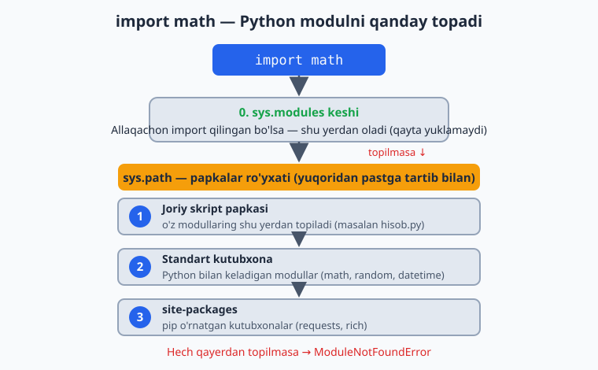
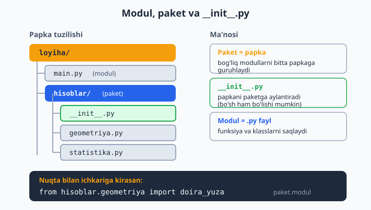
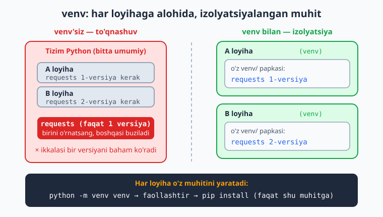

# 06 — Modullar va muhit

Dasturlaring kattalashganda, butun kodni bitta faylga yozish noqulay bo'lib qoladi. Python kodni **modullar**ga (alohida fayllarga) bo'lish va boshqalar yozgan tayyor kutubxonalardan foydalanish imkonini beradi. Bu modulda kodni qanday bo'lish, paketlarga guruhlash, tashqi kutubxonalarni o'rnatish, zamonaviy loyiha standartini (`pyproject.toml`) sozlash va loyihalarni toza saqlashni o'rganasan.

> **Bu modulda:** `import`, standart kutubxonadan foydalanish, o'z modulingni yozish, `if __name__ == "__main__"`, paket strukturasi (`__init__.py`, nisbiy import, `__all__`, sub-paketlar), `pip` bilan kutubxona o'rnatish, virtual muhit (venv), `pyproject.toml` (PEP 621), editable install, `uv`/`poetry`, semantik versiyalash va muhit o'zgaruvchilari (`os.environ`, `.env`).

---

## 6.1 Modul nima? `import`

Modul — bu Python kodi bo'lgan `.py` fayl. Boshqa fayldagi kodni `import` orqali olib ishlatasan. Python o'zida ko'plab tayyor modullar bilan keladi (standart kutubxona).

`import` qilganingda Python modulni qator joylardan ma'lum tartib bilan qidiradi — quyidagi diagramma shu jarayonni ko'rsatadi:



```python
import math                  # butun modulni import qilish

print(math.sqrt(16))         # 4.0    — modul nomi.funksiya
print(math.pi)               # 3.14159...
```

Faqat kerakli qismini olish (`from`):

```python
from math import sqrt, pi    # faqat sqrt va pi

print(sqrt(25))              # 5.0   — endi math. yozish shart emas
print(pi)
```

Modulga qisqa nom berish (`as`):

```python
import random as r           # random ni r deb chaqiramiz

print(r.randint(1, 6))       # 1..6 oralig'ida tasodifiy son
```

Bir nechta foydali standart modul:

```python
import math       # matematik funksiyalar (sqrt, ceil, floor, pi...)
import random     # tasodifiy sonlar va tanlovlar
import datetime    # sana va vaqt
```

```python
import random
print(random.choice(["olma", "banan", "uzum"]))   # tasodifiy bittasi
print(random.randint(1, 100))                       # 1..100 tasodifiy
```

> **Eslatma — `from modul import *` dan saqlan.** Goho `from os import *` ko'rinishidagi kodni uchratasan: bu modulning **hamma** nomini joriy fayl bo'shlig'iga to'kib tashlaydi va qaysi nom qaerdan kelganini chalkashtiradi. Professional kodda deyarli har doim `import os` yoki aniq `from os import getenv` yoziladi. `*` import'i faqat modulning `__all__` ro'yxatidagi nomlarni oladi (buni 6.4-bo'limda ko'ramiz).

---

## 6.2 O'z modulingni yozish

Har qanday `.py` fayl — modul. Masalan `hisob.py` faylini yarat. Bu yerda funksiyalarni darrov **type hint** bilan yozamiz — Python 3.13 uslubi (`int`, `float`), shunda muharrirlaring xatoni oldindan ko'rsatadi va kod o'qish oson bo'ladi:

```python
# hisob.py
def qosh(a: int, b: int) -> int:
    return a + b

def kop(a: int, b: int) -> int:
    return a * b

PI: float = 3.14159
```

Boshqa fayldan (masalan `main.py`) uni import qilasan:

```python
# main.py  (hisob.py bilan bir papkada)
import hisob

print(hisob.qosh(3, 5))      # 8
print(hisob.PI)              # 3.14159

# yoki:
from hisob import qosh
print(qosh(10, 20))          # 30
```

> Bu kodni tartibli saqlashning asosiy yo'li: bog'liq funksiyalarni alohida modullarga ajratasan (masalan `hisob.py`, `fayllar.py`, `foydalanuvchi.py`), keyin `main.py` da birlashtirasan.

Loyiha o'sganda bog'liq modullarni bitta papkaga — **paket**ga — guruhlaysan. Papka `__init__.py` faylini olganida paketga aylanadi va ichidagi modullarga nuqta bilan murojaat qilasan:



Paket strukturasini keyingi bo'limda chuqurroq ochamiz.

---

## 6.3 `if __name__ == "__main__":`

Bu satrni Python fayllarida tez-tez ko'rasan. Uning ma'nosi: **"agar bu fayl to'g'ridan-to'g'ri ishga tushirilsa"** (import qilinmasa).

```python
# hisob.py
def qosh(a: int, b: int) -> int:
    return a + b

if __name__ == "__main__":
    # bu blok faqat 'python hisob.py' deganda ishlaydi,
    # 'import hisob' qilinganda ishlamaydi
    print("Test:", qosh(2, 3))
```

> **Nega kerak?** Modulingni boshqa joydan import qilganda, undagi test/namoyish kodi avtomatik ishlab ketmasligi uchun. Funksiyalar import qilinadi, lekin `if __name__ == "__main__":` ichidagi kod faqat fayl o'zi ishga tushirilganda bajariladi. Hozircha "fayl bevosita ishga tushganda ishlaydigan kod" deb tushun.

Har bir modulda Python avtomatik `__name__` o'zgaruvchisini o'rnatadi. Fayl bevosita ishga tushganda u `"__main__"` ga teng bo'ladi, import qilinganda esa modul nomiga (`"hisob"`). Buni o'z ko'zing bilan ko'rsang ishonchli bo'ladi:

```python
# hisob.py oxiriga:
print(f"hisob.py yuklandi, __name__ = {__name__!r}")
```

Endi `python hisob.py` desang `__name__ = '__main__'`, `import hisob` qilsang `__name__ = 'hisob'` chiqadi. Aynan shu farq blokni ishlatadi yoki ishlatmaydi.

---

## 6.4 Paket strukturasi — `__init__.py`, nisbiy import, `__all__`

Loyiha bir nechta modulga o'sganda, ularni **paket** ichiga guruhlash kerak. Paket — bu `__init__.py` fayli bo'lgan papka. Quyidagi struktura odatiy:

```
mypkg/
├── __init__.py        # paketni belgilaydi, "fasad" vazifasini bajaradi
├── hisob.py           # modul
├── matn.py            # modul
└── geom/              # sub-paket (paket ichidagi paket)
    ├── __init__.py
    └── doira.py
```

Modullar ichida oddiy funksiyalar:

```python
# mypkg/hisob.py
def qosh(a: int, b: int) -> int:
    return a + b

def ayir(a: int, b: int) -> int:
    return a - b
```

```python
# mypkg/matn.py
def teskari(s: str) -> str:
    return s[::-1]
```

```python
# mypkg/geom/doira.py
import math

def yuza(r: float) -> float:
    return math.pi * r * r
```

**Nisbiy import (`from . import ...`).** Paket *ichidagi* modullar bir-birini import qilganda nuqta bilan boshlanadigan nisbiy yo'ldan foydalanadi: bitta nuqta `.` — shu paket, ikkita nuqta `..` — bir pog'ona yuqori. Bu paket nomini qattiq kodlamaslik (hardcode) imkonini beradi — paketni qayta nomlasang ham ishlaydi.

```python
# mypkg/geom/__init__.py
from .doira import yuza          # "." = shu sub-paket (geom)

__all__ = ["yuza"]               # 'from mypkg.geom import *' nimani oladi
```

**`__init__.py` — paketning fasadi.** Asosiy `__init__.py` ichida kichik modullardan kerakli nomlarni yuqoriga "ko'taras" — shunda foydalanuvchi `mypkg.hisob.qosh` o'rniga to'g'ridan-to'g'ri `mypkg.qosh` yozadi:

```python
# mypkg/__init__.py
from .hisob import qosh, ayir    # "." = shu paket (mypkg)
from .matn import teskari
from .geom import yuza           # sub-paketdan

# 'from mypkg import *' aynan shularni oladi (boshqasini emas):
__all__ = ["qosh", "ayir", "teskari", "yuza"]

# Paket versiyasi — keng tarqalgan konvensiya:
__version__ = "1.0.0"
```

Endi tashqaridan ishlatish toza va qisqa:

```python
# main.py  (mypkg papkasi yonida)
import mypkg
from mypkg import qosh, teskari       # fasad orqali
from mypkg.geom import yuza           # sub-paketdan

print(qosh(3, 5))            # 8
print(teskari("salom"))      # molas
print(round(yuza(2), 3))     # 12.566
print(mypkg.__version__)     # 1.0.0
```

> **`__all__` nima qiladi?** Bu ro'yxat ikki ishni boshqaradi: (1) `from mypkg import *` qaysi nomlarni oladi va (2) paketning "rasmiy" ommaviy interfeysini hujjatlaydi. Ro'yxatdan tashqaridagi nomlar (masalan, ichki yordamchi funksiyalar) `*` bilan kelmaydi — bu kapsulalashning bir ko'rinishi. `__all__` bo'lmasa, `*` pastki chiziq bilan boshlanmagan hamma nomni oladi.

> **Nisbiy yoki absolyut import?** Paket *ichida* — nisbiy (`from . import hisob`). Paketni *tashqaridan* ishlatganda — absolyut (`from mypkg import qosh`). Eslatma: nisbiy import faqat paket ichidagi modullarda ishlaydi; faylni to'g'ridan-to'g'ri `python mypkg/hisob.py` deb ishga tushirsang nisbiy import xato beradi (chunki u "paket konteksti"ni yo'qotadi). Shuning uchun paket modullarini `python -m mypkg.hisob` ko'rinishida ishga tushirish odat.

---

## 6.5 `pip` — tashqi kutubxonalarni o'rnatish

Standart kutubxonadan tashqari, jamoa yozgan minglab kutubxonalar bor (internetda, PyPI omborida). Ularni `pip` bilan o'rnatasan (terminalda):

```bash
pip install requests       # 'requests' kutubxonasini o'rnatadi (internet so'rovlari uchun)
pip install rich           # chiroyli terminal chiqishi uchun
```

O'rnatilgandan keyin koddan ishlatasan:

```python
import requests            # endi import qilish mumkin
```

Foydali buyruqlar:

```bash
pip list                   # o'rnatilgan kutubxonalar ro'yxati
pip install --upgrade requests   # yangilash
pip uninstall requests     # o'chirish
pip show requests          # kutubxona haqida ma'lumot (versiya, bog'liqliklar)
```

> **Maslahat — `pip` ni modul sifatida chaqir.** Bir nechta Python o'rnatilgan tizimda `pip install` qaysi Python'ga o'rnatayotganini bilish qiyin. Aniqlik uchun `python -m pip install requests` yoz — bu aynan shu `python` ning `pip` ini ishlatadi. Bu eng ishonchli usul.

---

## 6.6 Virtual muhit (venv) — loyihalarni ajratish

Har loyihaning o'z kutubxonalar to'plami bo'lishi kerak. Aks holda turli loyihalar bir-biriga xalaqit beradi (biriga kerakli versiya boshqasini buzishi mumkin). **Virtual muhit (venv)** — har loyiha uchun alohida, izolyatsiyalangan Python muhiti.

```bash
# 1. Virtual muhit yaratish (loyiha papkasida):
python -m venv venv

# 2. Uni faollashtirish:
#    Linux / macOS:
source venv/bin/activate
#    Windows:
venv\Scripts\activate

# 3. Endi pip install shu muhitga o'rnatadi (tizimga emas):
pip install requests

# 4. Ishni tugatib, chiqish:
deactivate
```

Faollashtirilganda terminalda `(venv)` belgisi paydo bo'ladi — demak izolyatsiyalangan muhitdasan.

> **Nega muhim?** Tasavvur qil: A loyihaga kutubxonaning 1-versiyasi, B loyihaga 2-versiyasi kerak. Virtual muhitsiz ular to'qnashadi. Har loyihaga alohida venv — har birida kerakli versiya. Bu professional amaliyot, har doim ishlat.

Quyidagi diagramma venv'siz to'qnashuv va venv bilan izolyatsiya o'rtasidagi farqni ko'rsatadi:



---

## 6.7 `requirements.txt` — loyiha bog'liqliklari

Loyihangda qaysi kutubxonalar kerakligini bitta faylda saqlaysan — `requirements.txt`. Shunda boshqa odam (yoki sen boshqa kompyuterda) hammasini bir buyruq bilan o'rnatadi:

```bash
# Joriy kutubxonalarni faylga yozish:
pip freeze > requirements.txt

# Boshqa joyda hammasini o'rnatish:
pip install -r requirements.txt
```

`requirements.txt` taxminan shunday ko'rinadi:

```
requests==2.31.0
rich==13.7.0
```

> Loyihangni GitHub'ga qo'yganingda `requirements.txt` ni ham qo'sh — shunda boshqalar loyihangni oson ishga tushiradi. `venv/` papkasini esa qo'shma (u katta va har kompyuterda qayta yaratiladi).

> **`pip freeze` ning kamchiligi (antipattern haqida).** `pip freeze > requirements.txt` muhitdagi **hamma** paketni — sen bevosita talab qilganlarni ham, ularning ichki bog'liqliklarini ham — bir tekis ro'yxatga to'kadi. Natijada qaysi paket senga *kerak*, qaysisi shunchaki *boshqasi tortib kelgan* — bilib bo'lmaydi. Kichik skript uchun bu yetarli, lekin haqiqiy loyihada zamonaviy yo'l boshqacha: bevosita bog'liqliklarni **`pyproject.toml`** da nomli ro'yxat sifatida saqlash. Buni keyingi bo'limda ko'ramiz.

---

## 6.8 `pyproject.toml` — zamonaviy loyiha standarti (PEP 621)

Bugungi Python loyihasining "pasporti" — `pyproject.toml` fayli. Bu standart (PEP 621) loyiha nomi, versiyasi, bog'liqliklari va metama'lumotlarini **bitta** odam o'qiy oladigan faylda jamlaydi. U `requirements.txt` ni ham, eski `setup.py` ni ham almashtiradi.

Loyiha ildizida `pyproject.toml` shunday ko'rinadi:

```toml
[build-system]
requires = ["hatchling"]
build-backend = "hatchling.build"

[project]
name = "mening-loyiham"
version = "1.0.0"
description = "Kichik namuna loyiha"
readme = "README.md"
requires-python = ">=3.13"
authors = [
    { name = "Oqil Imomnazarov", email = "imomnazarovoqil@gmail.com" },
]
license = "MIT"

# Bevosita bog'liqliklar — sen TALAB qilgan kutubxonalar (ichki emas):
dependencies = [
    "requests>=2.31",
    "rich>=13.7",
]

[project.optional-dependencies]
# Faqat ishlab chiqishda kerak bo'ladigan qo'shimcha paketlar:
dev = [
    "pytest>=8.0",
    "ruff>=0.5",
]

[project.scripts]
# Terminalga buyruq qo'shadi: o'rnatgandan keyin 'salom' deb yozish mumkin
salom = "mypkg:main"
```

Buning afzalligi `pip freeze` ga nisbatan: bu yerda **faqat sen tanlaganlar** turadi (`requests`, `rich`), ularning ichki bog'liqliklari avtomatik hal qilinadi. Bog'liqliklar qaysi versiya oralig'ida ishlashini ham aniq ko'rsatasan (`>=2.31`).

O'rnatish endi sodda:

```bash
# Loyihani va uning bog'liqliklarini o'rnatish:
pip install .

# Dev qo'shimchalari bilan birga:
pip install ".[dev]"
```

> **`pyproject.toml` qaerdan o'qiladi?** Bu fayl Python ekotizimida umumiy: `pip`, `uv`, `poetry`, `ruff`, `pytest`, `black` — barchasi shu bir fayldan sozlama oladi (har biri o'z `[tool.*]` bo'limida). Bitta fayl — butun loyihaning markazi.

---

## 6.9 Editable install — `pip install -e .`

O'z paketingni yozayotganda uni qayta-qayta o'rnatib o'tirish zerikarli: kodni o'zgartirsang, yana `pip install .` qilishing kerak bo'lardi. Buni hal qiluvchi yo'l — **editable (tahrirlash) rejimida o'rnatish**:

```bash
pip install -e .
```

`-e` (editable) bilan o'rnatganda Python paketni nusxalamaydi, balki uning manba papkasiga **havola** qo'yadi. Endi `import mypkg` har joydan ishlaydi, lekin sen kodni o'zgartirsang — qayta o'rnatishsiz **darrov** kuchga kiradi. Bu o'z kutubxonangni ishlab chiqayotganda standart amaliyot:

```bash
# Tipik ishlash tartibi:
python -m venv venv
source venv/bin/activate        # Windows: venv\Scripts\activate
pip install -e ".[dev]"         # loyihani editable + dev paketlar bilan

# Endi kodni tahrirla, darrov sina:
python -c "import mypkg; print(mypkg.__version__)"
```

> **Nima uchun `-e` kerak?** Editable install paketni "ishlab chiqilayapti" deb belgilaydi: import yo'li to'g'ri ishlaydi (paket istalgan papkadan import qilinadi), ammo manba sening nazoratingda qoladi. Editable bo'lmagan oddiy `pip install .` esa nusxa oladi — har o'zgarishdan keyin qayta o'rnatish kerak bo'ladi. Demak: kutubxonani *ishlatuvchi* — oddiy `pip install`, kutubxonani *yozuvchi* — `pip install -e`.

---

## 6.10 `uv` va `poetry` — zamonaviy boshqaruvchilar

`pip` + `venv` + `requirements.txt` uchligi ishlaydi, lekin uch alohida vosita. Zamonaviy loyihalar ko'pincha hammasini **bitta** vosita bilan boshqaradi. Eng mashhuri ikkitasi:

**`uv`** — Rust'da yozilgan, juda tez (pip'dan o'nlab marta tez) yangi vosita. Virtual muhit, o'rnatish va loyiha boshqaruvini birlashtiradi:

```bash
# Yangi loyiha yaratish (pyproject.toml avtomatik tuziladi):
uv init mening-loyiham
cd mening-loyiham

# Bog'liqlik qo'shish (pyproject.toml ni o'zi yangilaydi):
uv add requests
uv add --dev pytest          # dev guruhiga

# Loyihani ishga tushirish (venv'ni o'zi yaratib, faollashtiradi):
uv run main.py
```

**`poetry`** — biroz eskiroq, keng tarqalgan boshqaruvchi:

```bash
poetry new mening-loyiham    # tayyor struktura yaratadi
cd mening-loyiham
poetry add requests          # bog'liqlik qo'shadi
poetry install               # hammasini o'rnatadi
poetry run python main.py    # loyiha muhitida ishga tushiradi
```

Har ikkalasi ham **lock-fayl** (`uv.lock` yoki `poetry.lock`) yuritadi: bu aynan qaysi versiyalar o'rnatilganini belgilab qo'yadi — shunda jamoadagi hamma **bir xil** muhitni oladi (takrorlanuvchi build).

> **Nimani tanlash kerak?** O'rganish bosqichida `pip` + `venv` yetarli — ostidagi mexanizmni tushunasan. Loyiha o'sganda `uv` ga o'tish tavsiya etiladi: tez, sodda va `pyproject.toml` standartiga to'liq mos. Bu kitobda biz `pip` + `venv` ni ishlatamiz, lekin ish joyida `uv` ni uchratishing ehtimoli yuqori.

---

## 6.11 Semantik versiyalash (SemVer)

Kutubxona versiyalari tasodifiy raqamlar emas. Eng keng tarqalgan kelishuv — **semantik versiyalash (SemVer)**: `MAJOR.MINOR.PATCH` (masalan `2.4.1`). Har bir qism aniq narsani anglatadi:

| Qism | Misol | Qachon oshadi | Mosligi |
|------|-------|---------------|---------|
| **MAJOR** | `2`.4.1 | Eski kodni **buzadigan** o'zgarish | mos kelmaydi |
| **MINOR** | 2.`4`.1 | Yangi imkoniyat, **orqaga mos** | mos keladi |
| **PATCH** | 2.4.`1` | Xato tuzatish, **orqaga mos** | mos keladi |

Shuning uchun `pyproject.toml` da `requests>=2.31` yozganingda: "2.31 yoki undan yuqori istalgan minor/patch ishlaydi, lekin 3.0 (major) — ehtiyot bo'l, u buzishi mumkin" degan ma'noni bildirasan. `^2.31` (caret) belgisi esa "2.x.x ichida istalgani, lekin 3.0 emas" deydi.

Versiyalarni dasturda taqqoslash uchun ularni sonlar uchligiga aylantirish kifoya. Buni `dataclass` bilan toza qilamiz (Python 3.13 uslubi — `frozen=True` o'zgarmas qiladi, `order=True` esa `<`, `>` taqqoslashlarini avtomatik beradi):

```python
from dataclasses import dataclass

@dataclass(frozen=True, order=True)
class Versiya:
    major: int
    minor: int
    patch: int

    @classmethod
    def matndan(cls, s: str) -> "Versiya":
        major, minor, patch = (int(qism) for qism in s.split("."))
        return cls(major, minor, patch)

    def __str__(self) -> str:
        return f"{self.major}.{self.minor}.{self.patch}"

a = Versiya.matndan("2.3.1")
b = Versiya.matndan("2.4.0")
print(a < b)        # True   — minor oshdi, b yangiroq
print(max(a, b))    # 2.4.0

def mos_keladimi(talab: Versiya, mavjud: Versiya) -> bool:
    # ^2.3.1 mantiqi: major bir xil bo'lsin va mavjud >= talab
    return mavjud.major == talab.major and mavjud >= talab

print(mos_keladimi(Versiya.matndan("2.3.1"), Versiya.matndan("2.9.0")))  # True
print(mos_keladimi(Versiya.matndan("2.3.1"), Versiya.matndan("3.0.0")))  # False
```

> **Senga nima beradi?** O'z kutubxonangni nashr qilganda: xato tuzatsang PATCH oshir, yangi funksiya qo'shsang MINOR, eski interfeysni buzsang MAJOR. Shunda ishlatuvchilar versiya raqamiga qarab xavfsiz yangilay oladi. `pyproject.toml` dagi `version = "1.0.0"` aynan shu qoidaga bo'ysunadi.

---

## 6.12 Muhit o'zgaruvchilari — `os.environ` va `.env`

Maxfiy ma'lumot (API kalitlari, parollar, ulanish manzillari) va sozlamalarni **koddan tashqarida** saqlash kerak. Birinchidan — xavfsizlik (kalitni GitHub'ga yuklab qo'ymaslik uchun), ikkinchidan — moslashuvchanlik (bir kod, lekin dev/prod muhitda har xil sozlama). Standart yo'l — **muhit o'zgaruvchilari**.

`os` moduli orqali ularni o'qiysan:

```python
import os

# 1-usul (xavfsiz): yo'q bo'lsa standart qiymat qaytaradi
api_kalit = os.getenv("API_KEY", "kalit-yoq")
rejim = os.getenv("APP_REJIM", "dev")
print(api_kalit, rejim)

# 2-usul: os.environ lug'at kabi ishlaydi (yo'q bo'lsa KeyError)
print(os.environ.get("PATH"))      # tizim yo'li (har doim bor)

# Dasturdan o'zgaruvchi o'rnatish (faqat shu jarayon uchun):
os.environ["APP_REJIM"] = "prod"
```

Sozlamani `match/case` bilan tahlil qilish — toza va o'qiladigan (Python 3.10+ imkoniyati):

```python
import os

def rejim_tavsifi(rejim: str) -> str:
    match rejim.lower():
        case "dev" | "development":
            return "Ishlab chiqish rejimi"
        case "prod" | "production":
            return "Ishlab chiqarish rejimi"
        case "test":
            return "Test rejimi"
        case _:
            return "Noma'lum rejim"

print(rejim_tavsifi(os.getenv("APP_REJIM", "dev")))   # Ishlab chiqish rejimi
```

**`.env` fayli.** Har safar terminalda o'zgaruvchi o'rnatish noqulay. Odatda loyiha ildizida `.env` faylida saqlanadi:

```
# .env
API_KEY=12345
DEBUG=true
DB_HOST=localhost
```

Bu faylni **hech qachon Git'ga yuklama** — `.gitignore` ga `.env` qatorini qo'sh (ichida maxfiy kalitlar bor). Odatda `.env.example` (qiymatlarsiz namuna) ni esa Git'ga qo'yib, boshqalar nimani to'ldirish kerakligini biladi.

Amaliyotda `.env` ni `python-dotenv` kutubxonasi bilan o'qiydilar (`pip install python-dotenv`). Lekin mexanizmni tushunish uchun uni o'zimiz qo'lda yozib ko'ramiz — `.env` shunchaki `KALIT=qiymat` qatorlari:

```python
import os
from pathlib import Path

def env_yukla(fayl: str = ".env") -> None:
    """.env faylidagi KALIT=qiymat qatorlarini os.environ ga yuklaydi."""
    yol = Path(fayl)
    if not yol.exists():
        return
    for qator in yol.read_text(encoding="utf-8").splitlines():
        qator = qator.strip()
        if not qator or qator.startswith("#"):   # bo'sh va izoh qatorlarini o'tkaz
            continue
        kalit, _, qiymat = qator.partition("=")
        os.environ.setdefault(kalit.strip(), qiymat.strip())

env_yukla()
print(os.getenv("API_KEY", "yoq"))      # 12345  (.env dan)
print(os.getenv("DEBUG", "false"))      # true
```

> **Qoida:** kod — ochiq (GitHub'da), sozlama — yopiq (`.env`, lokal). Hech qachon parol yoki kalitni to'g'ridan-to'g'ri kodga yozma. `os.getenv("KALIT", standart)` — har doim standart qiymatni ber, shunda o'zgaruvchi yo'q bo'lsa ham dastur qulamaydi.

---

## ✍️ Masalalar (26 ta)

> Ba'zi masalalar terminalda buyruq bajarishni talab qiladi. Modul yozish masalalarida ikkita fayl yaratib sina.

**Oson (1–7):**

1. `math` modulini import qilib, 144 ning kvadrat ildizini chiqar.
2. `random` modulidan `randint` bilan 1–6 oralig'ida tasodifiy son chiqar (zar tashlash).
3. `from math import pi` qilib, radiusi 5 bo'lgan doira yuzasini hisobla.
4. `random.choice` bilan ro'yxatdan tasodifiy element tanla.
5. `import random as r` qilib, `r.randint` bilan 3 ta tasodifiy son chiqar.
6. Terminalda `pip list` ni ishga tushirib, o'rnatilgan kutubxonalarni ko'r (kod emas, terminal).
7. `math.ceil` va `math.floor` bilan `4.3` ni yuqoriga va pastga yaxlitla.

**O'rta (8–14):**

8. `hisob.py` moduli yarat (`qosh`, `ayir` funksiyalari bilan), uni `main.py` dan import qilib ishlat.
9. `salom.py` modul yarat (`salomlash(ism)` funksiyasi), boshqa fayldan `from salom import salomlash` qilib chaqir.
10. `hisob.py` ga `if __name__ == "__main__":` qo'shib, ichida test kodi yoz. Faylni to'g'ridan-to'g'ri ishga tushirib tekshir.
11. `random.shuffle` bilan `[1,2,3,4,5]` ro'yxatini aralashtir.
12. `datetime` modulidan foydalanib, bugungi sanani chiqar (`datetime.date.today()`).
13. Terminalda virtual muhit yarat (`python -m venv venv`) va faollashtir.
14. Virtual muhitda biror kutubxona o'rnat (`pip install rich`) va `pip list` bilan tekshir.

**Murakkab (15–20):**

15. Ikkita modul yarat: `geometriya.py` (`doira_yuza`, `tortburchak_yuza`) va `main.py` (ularni import qilib ishlatadi).
16. `random` bilan oddiy "son top" o'yini: kompyuter 1–100 oralig'ida son o'ylasin, foydalanuvchi topguncha "katta"/"kichik" deb yo'naltir.
17. `utils.py` moduli yarat: kamida 3 ta foydali funksiya (masalan `katta_harf`, `teskari`, `unli_sanash`), `main.py` dan hammasini ishlat.
18. Loyiha yarat: virtual muhit, `requirements.txt`, va `pip freeze` bilan uni to'ldir.
19. `random` va `math` ni birga ishlatib: 5 ta tasodifiy sonning kvadrat ildizlari yig'indisini hisobla.
20. Ikki moduldan iborat kichik loyiha: `bank.py` (`Hisob` klassi — 5-moduldan) va `main.py` (hisob yaratib, amallar bajaradi). Klassni modulga joylashtirib, import qilib ishlat.

**Qo'shimcha (21–26) — paket, pyproject, muhit:**

21. `mypkg/` paketi yarat: `__init__.py`, `hisob.py` (`qosh`, `ayir`) va `matn.py` (`teskari`). `__init__.py` da uchala funksiyani fasad sifatida ko'tarib, `__all__` belgila. Tashqi `main.py` dan `from mypkg import qosh, teskari` qilib ishlat.
22. 21-masaladagi paketga `geom/` sub-paketini qo'sh (`doira.py` ichida `yuza(r)`). `geom/__init__.py` da nisbiy import (`from .doira import yuza`) qilib, asosiy `__init__.py` dan ko'tar.
23. Kichik loyiha uchun `pyproject.toml` yoz (PEP 621): `name`, `version`, `requires-python`, `dependencies` (`requests>=2.31`) va `[project.optional-dependencies]` dagi `dev` (`pytest`). Bu kod emas — TOML fayli.
24. Muhit o'zgaruvchisini o'qib chiqaruvchi funksiya yoz: `os.getenv("APP_REJIM", "dev")` ni olib, `match/case` bilan "dev"/"prod"/"test" uchun mos tavsif qaytar.
25. `.env` faylini (`KALIT=qiymat` qatorlari) o'qib `os.environ` ga yuklovchi `env_yukla()` funksiyasini yoz (izoh va bo'sh qatorlarni o'tkazib). `API_KEY` ni o'qib chiqar.
26. Versiya satrlarini (`["1.2.0", "1.10.0", "1.1.5"]`) **to'g'ri** semantik tartibda sarala (string saralash xato beradi — sonlar uchligiga aylantir).

---

## ✅ Yechimlar

<details markdown="1">
<summary>Ko'rsatish uchun ochish (1–20)</summary>

```python
# 1
import math
print(math.sqrt(144))         # 12.0

# 2
import random
print(random.randint(1, 6))

# 3
from math import pi
print(pi * 5 ** 2)            # 78.539...

# 4
import random
print(random.choice(["olma", "banan", "uzum"]))

# 5
import random as r
print(r.randint(1, 100), r.randint(1, 100), r.randint(1, 100))

# 6
# Terminalda:  pip list

# 7
import math
print(math.ceil(4.3), math.floor(4.3))    # 5 4

# 8
# hisob.py:
#   def qosh(a: int, b: int) -> int: return a + b
#   def ayir(a: int, b: int) -> int: return a - b
# main.py:
import hisob
print(hisob.qosh(3, 5))       # 8
print(hisob.ayir(10, 4))      # 6

# 9
# salom.py:
#   def salomlash(ism: str) -> None: print(f"Salom, {ism}!")
# main.py:
from salom import salomlash
salomlash("Aziz")             # Salom, Aziz!

# 10
# hisob.py:
def qosh(a: int, b: int) -> int:
    return a + b
if __name__ == "__main__":
    print("Test:", qosh(2, 3))    # faqat 'python hisob.py' deganda chiqadi

# 11
import random
sonlar = [1, 2, 3, 4, 5]
random.shuffle(sonlar)
print(sonlar)                 # masalan [3, 1, 5, 2, 4]

# 12
import datetime
print(datetime.date.today())  # masalan 2026-06-11

# 13
# Terminalda:
#   python -m venv venv
#   source venv/bin/activate     (Windows: venv\Scripts\activate)

# 14
# Terminalda (venv faol):
#   pip install rich
#   pip list

# 15
# geometriya.py:
#   import math
#   def doira_yuza(r: float) -> float: return math.pi * r * r
#   def tortburchak_yuza(a: float, b: float) -> float: return a * b
# main.py:
import geometriya
print(geometriya.doira_yuza(5))
print(geometriya.tortburchak_yuza(4, 6))

# 16
import random
maxfiy = random.randint(1, 100)
while True:
    taxmin = int(input("Taxminingiz (1-100): "))
    if taxmin == maxfiy:
        print("Topdingiz!")
        break
    elif taxmin < maxfiy:
        print("Kattaroq son")
    else:
        print("Kichikroq son")

# 17
# utils.py:
#   def katta_harf(s: str) -> str: return s.upper()
#   def teskari(s: str) -> str: return s[::-1]
#   def unli_sanash(s: str) -> int: return sum(1 for h in s.lower() if h in "aeiou")
# main.py:
from utils import katta_harf, teskari, unli_sanash
print(katta_harf("salom"))    # SALOM
print(teskari("salom"))       # molas
print(unli_sanash("salom"))   # 2

# 18
# Terminalda:
#   python -m venv venv
#   source venv/bin/activate
#   pip install requests
#   pip freeze > requirements.txt

# 19
import random, math
sonlar = [random.randint(1, 100) for _ in range(5)]
print(sum(math.sqrt(s) for s in sonlar))

# 20
# bank.py:
#   class Hisob:
#       def __init__(self, balans: int = 0) -> None: self.balans = balans
#       def qoy(self, s: int) -> None: self.balans += s
#       def yech(self, s: int) -> None: self.balans -= s
# main.py:
from bank import Hisob
h = Hisob(1000)
h.qoy(500)
h.yech(200)
print(h.balans)               # 1300
```

</details>

<details markdown="1">
<summary>Masala 21</summary>

```python
# mypkg/hisob.py:
#   def qosh(a: int, b: int) -> int: return a + b
#   def ayir(a: int, b: int) -> int: return a - b
#
# mypkg/matn.py:
#   def teskari(s: str) -> str: return s[::-1]
#
# mypkg/__init__.py:
from .hisob import qosh, ayir
from .matn import teskari
__all__ = ["qosh", "ayir", "teskari"]

# main.py (mypkg yonida):
from mypkg import qosh, teskari
print(qosh(3, 5))         # 8
print(teskari("salom"))   # molas
```

</details>

<details markdown="1">
<summary>Masala 22</summary>

```python
# mypkg/geom/doira.py:
#   import math
#   def yuza(r: float) -> float: return math.pi * r * r
#
# mypkg/geom/__init__.py:
from .doira import yuza          # "." = geom sub-paketi
__all__ = ["yuza"]

# mypkg/__init__.py (avvalgilarga qo'shimcha):
from .geom import yuza
# __all__ ga "yuza" ni ham qo'sh: __all__ = ["qosh", "ayir", "teskari", "yuza"]

# main.py:
from mypkg.geom import yuza
print(round(yuza(2), 3))        # 12.566
```

</details>

<details markdown="1">
<summary>Masala 23</summary>

```toml
# pyproject.toml
[build-system]
requires = ["hatchling"]
build-backend = "hatchling.build"

[project]
name = "mening-loyiham"
version = "0.1.0"
requires-python = ">=3.13"
dependencies = [
    "requests>=2.31",
]

[project.optional-dependencies]
dev = [
    "pytest>=8.0",
]
```

```bash
# O'rnatish:
pip install ".[dev]"
```

</details>

<details markdown="1">
<summary>Masala 24</summary>

```python
import os

def rejim_tavsifi() -> str:
    rejim = os.getenv("APP_REJIM", "dev")
    match rejim.lower():
        case "dev" | "development":
            return "Ishlab chiqish rejimi"
        case "prod" | "production":
            return "Ishlab chiqarish rejimi"
        case "test":
            return "Test rejimi"
        case _:
            return f"Noma'lum rejim: {rejim}"

print(rejim_tavsifi())              # Ishlab chiqish rejimi (standart)
os.environ["APP_REJIM"] = "prod"
print(rejim_tavsifi())              # Ishlab chiqarish rejimi
```

</details>

<details markdown="1">
<summary>Masala 25</summary>

```python
import os
from pathlib import Path

def env_yukla(fayl: str = ".env") -> None:
    yol = Path(fayl)
    if not yol.exists():
        return
    for qator in yol.read_text(encoding="utf-8").splitlines():
        qator = qator.strip()
        if not qator or qator.startswith("#"):
            continue
        kalit, _, qiymat = qator.partition("=")
        os.environ.setdefault(kalit.strip(), qiymat.strip())

# Sinov uchun .env yaratamiz:
Path(".env").write_text("# sozlama\nAPI_KEY=12345\nDEBUG=true\n", encoding="utf-8")

env_yukla()
print(os.getenv("API_KEY"))      # 12345
print(os.getenv("DEBUG"))        # true
```

</details>

<details markdown="1">
<summary>Masala 26</summary>

```python
versiyalar = ["1.2.0", "1.10.0", "1.1.5"]

# Xato (string saralash): "1.10.0" < "1.2.0" deb hisoblaydi!
print(sorted(versiyalar))        # ['1.1.5', '1.10.0', '1.2.0']  -- noto'g'ri

# To'g'ri: har versiyani sonlar uchligiga aylantirib sarala
def kalit(v: str) -> tuple[int, int, int]:
    major, minor, patch = (int(x) for x in v.split("."))
    return (major, minor, patch)

print(sorted(versiyalar, key=kalit))   # ['1.1.5', '1.2.0', '1.10.0']  -- to'g'ri
```

</details>

---

[← OOP](./05-oop.md) | [Boshlovchilar README ↑](./README.md) | [Keyingi: Xatolarni boshqarish →](./07-xatolar-context.md)
