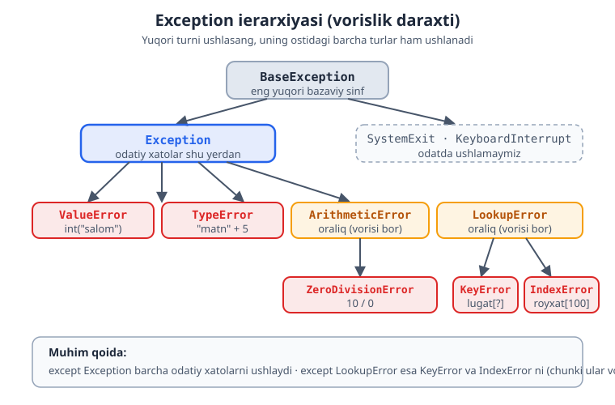
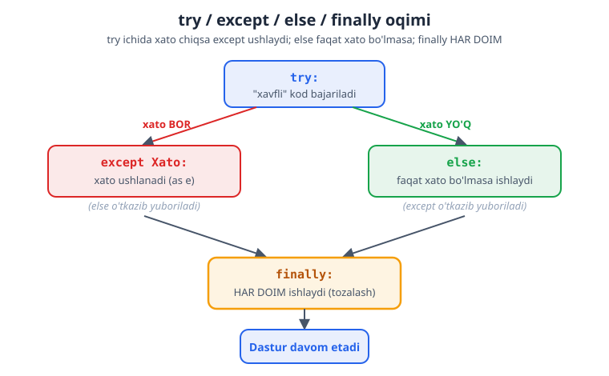
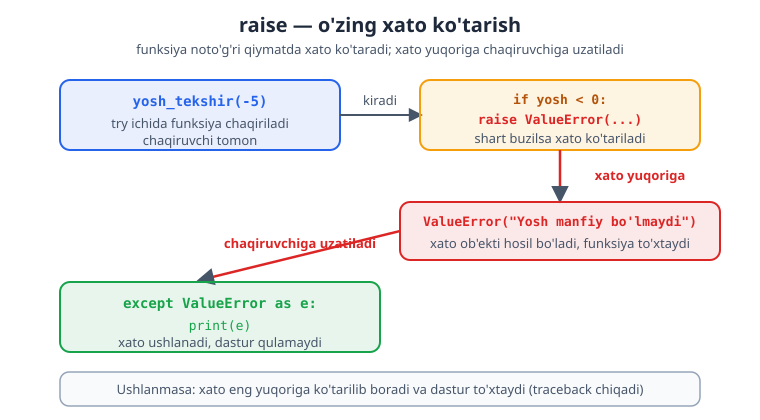

# 07 — Xatolarni boshqarish (`try` / `except`)

Dasturlarda xatolar muqarrar: foydalanuvchi raqam o'rniga matn kiritadi, fayl topilmaydi, nolga bo'lish sodir bo'ladi. Agar xatoni boshqarmasang, dastur **to'satdan to'xtaydi** (qulaydi). Bu modulda xatolarni ushlab, dasturni nazoratda saqlashni o'rganasan.

> **Bu modulda:** xato (exception) nima, `try`/`except`, aniq xato turlarini ushlash, `else`/`finally`, o'zing xato chaqirish (`raise`), o'z xato klasslaringni yaratish (custom exception ierarxiya), exception zanjiri (`raise ... from`, `__cause__`/`__context__`), `bare raise`, `except*`/`ExceptionGroup`, va resurslarni xavfsiz boshqarish — **context manager** (`with`, `__enter__`/`__exit__`, `@contextmanager`, `suppress`, `ExitStack`).

---

## 7.1 Xato nima? Nega dastur "qulaydi"?

Xato yuz berganda, agar uni ushlamasang, dastur shu yerda to'xtaydi:

```python
yosh = int(input("Yoshing: "))     # foydalanuvchi "salom" yozsa...
print(yosh)
# ValueError: invalid literal for int() ... — dastur QULADI, keyingi kod ishlamaydi
```

Tez-tez uchraydigan xato turlari:

| Xato | Qachon | Misol |
|------|--------|-------|
| `ValueError` | qiymat noto'g'ri | `int("salom")` |
| `ZeroDivisionError` | nolga bo'lish | `10 / 0` |
| `TypeError` | tip mos kelmaydi | `"matn" + 5` |
| `KeyError` | lug'atda kalit yo'q | `lugat["yo'q"]` |
| `IndexError` | ro'yxatda indeks yo'q | `royxat[100]` |
| `FileNotFoundError` | fayl topilmadi | mavjud bo'lmagan faylni ochish |

---

## 7.2 `try` / `except` — xatoni ushlash

`try` blokiga "xato bo'lishi mumkin" kodni yozasan, `except` ga xato yuz berganda nima qilishni:

```python
try:
    yosh = int(input("Yoshing: "))
    print(f"Siz {yosh} yoshdasiz")
except ValueError:
    print("Iltimos, to'g'ri raqam kiriting")
```

Endi foydalanuvchi "salom" yozsa, dastur qulamaydi — `except` bloki ishlaydi va dastur davom etadi.

```python
try:
    natija = 10 / 0
except ZeroDivisionError:
    print("Nolga bo'lib bo'lmaydi!")    # shu chiqadi, dastur tirik qoladi
```

> **Eslatma:** `except:` (turi ko'rsatilmagan, "yalang'och") yozish mumkin, lekin tavsiya etilmaydi — u **hamma** xatoni, hatto sening kodingdagi xatolarni ham yutib yuboradi. Doim aniq turni yoz (yuqorida `ValueError`, `ZeroDivisionError`). Buning sababini keyingi bo'limda ko'rasan.

---

## 7.3 Aniq xato turini ushlash

Har qanday xatoni emas, **aniq turini** ushlash yaxshiroq — shunda har xil xatoga har xil javob berasan:

```python
try:
    son = int(input("Son: "))
    natija = 100 / son
    print(natija)
except ValueError:
    print("Bu raqam emas!")
except ZeroDivisionError:
    print("Nolga bo'lib bo'lmaydi!")
```

> **Nega aniq tur?** "Hamma xatoni ushla" (`except:`) ba'zan haqiqiy muammoni yashiradi — masalan kodingdagi xatoni ham "yutib" yuboradi. Aniq turni ushlasang, faqat kutgan xatoga javob berasan, kutilmagani esa ko'rinadi (va sen tuzatasan).

Bir nechta turni birga ushlash:

```python
try:
    ...
except (ValueError, TypeError):
    print("Qiymat yoki tip xatosi")
```

Xato haqida ma'lumot olish (`as`):

```python
try:
    int("salom")
except ValueError as e:
    print(f"Xato yuz berdi: {e}")    # Xato yuz berdi: invalid literal for int()...
```

Xato turlari tasodifiy emas — ular vorislik daraxti (ierarxiya) bo'yicha tartibga solingan, va yuqori turni ushlasang uning ostidagi barcha turlar ham ushlanadi:



---

## 7.4 `else` va `finally`

**`else`** — xato **bo'lmaganda** ishlaydi:

```python
try:
    son = int(input("Son: "))
except ValueError:
    print("Noto'g'ri kiritish")
else:
    print(f"Rahmat! Siz {son} kiritdingiz")    # faqat xato bo'lmasa
```

**`finally`** — xato bo'ladimi-yo'qmi, **doim** ishlaydi (odatda tozalash uchun — faylni yopish va h.k.):

```python
try:
    fayl_ochish()
except FileNotFoundError:
    print("Fayl topilmadi")
finally:
    print("Bu har doim bajariladi")    # tozalash kodi shu yerga
```

Quyidagi diagramma to'rt blokning oqimini ko'rsatadi — xato bo'lganda va bo'lmaganda qaysi blok ishlashini:



---

## 7.5 `raise` — o'zing xato chaqirish

Ba'zan o'zing xato "chaqirishing" kerak — masalan, noto'g'ri qiymat berilganda dasturni to'xtatish uchun:

```python
def yosh_tekshir(yosh: int) -> int:
    if yosh < 0:
        raise ValueError("Yosh manfiy bo'lishi mumkin emas")
    return yosh

try:
    yosh_tekshir(-5)
except ValueError as e:
    print(e)        # Yosh manfiy bo'lishi mumkin emas
```

> **Qachon `raise`?** Funksiyangga noto'g'ri ma'lumot kelganda, uni jimgina qabul qilish o'rniga xato chaqir. Shunda muammo erta ko'rinadi va chaqiruvchi kod uni ushlab, to'g'ri javob beradi.

Quyidagi diagramma `raise` qilingan xato funksiyadan chaqiruvchi tomonga qanday uzatilishini va u yerda `except` bilan ushlanishini ko'rsatadi:



---

## 7.6 Amaliy namuna: ishonchli kiritish

Xato boshqarishning eng keng tarqalgan ishlatilishi — foydalanuvchi to'g'ri ma'lumot kiritguncha qayta-qayta so'rash:

```python
while True:
    try:
        yosh = int(input("Yoshingiz: "))
        break                          # to'g'ri raqam — sikldan chiqamiz
    except ValueError:
        print("Iltimos, butun son kiriting")

print(f"Yoshingiz: {yosh}")
```

> Bu naqsh (`while True` + `try/except` + `break`) juda foydali — foydalanuvchi xato qilsa, dastur qulamaydi, balki muloyim qayta so'raydi.

---

## 7.7 O'z xato klasslaring — custom exception ierarxiya

Hozircha biz tayyor xatolardan (`ValueError`, `ZeroDivisionError`) foydalandik. Lekin **professional kodda** o'z xatolaringni yaratasan. Nega? Tasavvur qil — bank dasturida "mablag' yetarli emas" ham, "hisob bloklangan" ham `ValueError` bo'lsa, chaqiruvchi kod ularni **bir-biridan ajrata olmaydi**. O'z xato klassing bo'lsa, har bir holatga aniq nom va aniq javob berasan.

O'z xatong shunchaki `Exception` (yoki uning avlodi) dan meros oluvchi klass:

```python
class ManbaXatosi(Exception):
    """Loyihadagi barcha xatolar uchun asosiy (bazaviy) klass."""

class ValidatsiyaXatosi(ManbaXatosi):
    """Kiruvchi ma'lumot noto'g'ri bo'lganda."""

class TarmoqXatosi(ManbaXatosi):
    """Tarmoq/ulanish muammosi bo'lganda."""
```

Bu **ierarxiya** (daraxt): tepada bitta asosiy klass (`ManbaXatosi`), ostida aniqroq xatolar. Foydasi — chaqiruvchi xohlasa **aniq** turni ushlaydi (`except ValidatsiyaXatosi`), xohlasa **butun guruhni** bir joyda ushlaydi (`except ManbaXatosi`):

```python
def amal_bajar(turi: str) -> None:
    if turi == "validatsiya":
        raise ValidatsiyaXatosi("ism bo'sh")
    if turi == "tarmoq":
        raise TarmoqXatosi("server javob bermadi")

# Variant A: aniq turni ushlash
try:
    amal_bajar("validatsiya")
except ValidatsiyaXatosi as e:
    print(f"Ma'lumot xatosi: {e}")
except TarmoqXatosi as e:
    print(f"Tarmoq xatosi: {e}")

# Variant B: butun guruhni bitta joyda ushlash (asosiy klass orqali)
try:
    amal_bajar("tarmoq")
except ManbaXatosi as e:      # ham ValidatsiyaXatosi, ham TarmoqXatosi shu yerga tushadi
    print(f"Loyiha xatosi: {type(e).__name__}: {e}")
```

```
Ma'lumot xatosi: ism bo'sh
Loyiha xatosi: TarmoqXatosi: server javob bermadi
```

### Qo'shimcha atribut bilan xato

Eng kuchli tomoni — xatoga **qo'shimcha ma'lumot** biriktirib qo'yish. Masalan, qaysi maydon noto'g'ri va qanday qiymat kelgani. Buning uchun `__init__` ni qaytadan yozamiz va `super().__init__(...)` ni chaqiramiz:

```python
class ValidatsiyaXatosi(Exception):
    def __init__(self, maydon: str, qiymat: object) -> None:
        self.maydon = maydon
        self.qiymat = qiymat
        super().__init__(f"'{maydon}' maydoni noto'g'ri: {qiymat!r}")

def yosh_tekshir(yosh: int) -> int:
    if yosh < 0:
        raise ValidatsiyaXatosi("yosh", yosh)
    return yosh

try:
    yosh_tekshir(-5)
except ValidatsiyaXatosi as e:
    print(e)                 # 'yosh' maydoni noto'g'ri: -5
    print("Maydon:", e.maydon)     # Maydon: yosh
    print("Qiymat:", e.qiymat)     # Qiymat: -5
```

```
'yosh' maydoni noto'g'ri: -5
Maydon: yosh
Qiymat: -5
```

> Endi `except` bloki nafaqat "xato bo'ldi" deyishi, balki `e.maydon` orqali **aniq qaysi maydon** muammoligini bilib, foydalanuvchiga aniq xabar berishi mumkin. Bu — haqiqiy dasturlarda (web, ma'lumotlar bazasi, API) doim qo'llaniladigan naqsh.

> **Qoida:** loyihada bitta **asosiy** xato klassi yarat (masalan `class AppError(Exception)`), qolgan barcha xatolaring undan meros olsin. Shunda foydalanuvchi `except AppError` bilan sening **barcha** xatolaringni ushlaydi, lekin tasodifiy `KeyError`/`TypeError` (kodingdagi haqiqiy buglar) o'tib ketib, ko'rinib qoladi.

---

## 7.8 Exception zanjiri — `raise ... from`, `__cause__`, `__context__`

Ko'pincha bir xatoni ushlab, uning o'rniga **o'zingning, mazmunliroq** xatongni chaqirasan. Masalan, ichkarida `ValueError` chiqdi, lekin foydalanuvchiga "konfiguratsiya fayli buzuq" deyish ma'noliroq. Bunda **eski xatoni yo'qotib qo'ymaslik** kerak — aks holda asl sabab izsiz ketadi. Buning uchun `raise ... from` ishlatiladi:

```python
class KonfigXatosi(Exception):
    pass

def port_oqi(matn: str) -> int:
    try:
        return int(matn)
    except ValueError as asl_xato:
        raise KonfigXatosi(f"port noto'g'ri: {matn!r}") from asl_xato

try:
    port_oqi("salom")
except KonfigXatosi as e:
    print("Yuqori xato:", e)
    print("Asl sabab:", repr(e.__cause__))
```

```
Yuqori xato: port noto'g'ri: 'salom'
Asl sabab: ValueError("invalid literal for int() with base 10: 'salom'")
```

`from asl_xato` Python ga "bu yangi xato **o'sha** xato sababli chiqdi" deb aytadi. Natijada `e.__cause__` da asl xato saqlanadi va traceback da `The above exception was the direct cause...` deb ko'rsatiladi. Bu — debugging (xato qidirish) ni juda osonlashtiradi.

### `__context__` — avtomatik (implicit) zanjir

Agar `except` blokining ichida **`from` ishlatmasdan** yangi xato chaqirsang, Python eski xatoni avtomatik ravishda `__context__` ga saqlaydi:

```python
def f() -> None:
    try:
        1 / 0                          # ZeroDivisionError
    except ZeroDivisionError:
        raise ValueError("yangi muammo")   # from YO'Q

try:
    f()
except ValueError as e:
    print("Xato:", e)
    print("__context__:", type(e.__context__).__name__)  # ZeroDivisionError
    print("__cause__:", e.__cause__)                      # None
```

```
Xato: yangi muammo
__context__: ZeroDivisionError
__cause__: None
```

Farqi:

| | `__context__` | `__cause__` |
|---|---|---|
| Qachon | `except` ichida yangi xato chaqirilsa | `raise ... from X` yozilsa |
| Ma'nosi | "shu paytda boshqa xato ham bor edi" (avtomatik) | "bu xato AYNAN o'sha sababli chiqdi" (atayin) |
| Tavsiya | o'z-o'zidan to'ladi | sabab aniq bo'lsa, doim `from` yoz |

> **Maslahat:** sabab haqiqatan ham bog'liq bo'lsa, doim `raise ... from asl` yoz — bu niyatingni aniq bildiradi. Agar eski xatoni **ataylab** uzmoqchi bo'lsang, `raise YangiXato(...) from None` yoz — u zanjirni "tozalaydi".

### `bare raise` — xatoni qayta tashlash

`except` ichida shunchaki `raise` (argumentsiz) yozsang, **hozir ushlangan o'sha xatoni** o'zgartirmasdan qayta tashlaydi. Bu — xatoni "ko'rib, biror ish qilib (masalan jurnalga yozib), keyin yuqoriga uzatish" uchun ideal:

```python
def jurnalga_yoz(e: Exception) -> None:
    print(f"[LOG] {type(e).__name__}: {e}")

def hisobla(a: int, b: int) -> float:
    try:
        return a / b
    except ZeroDivisionError as e:
        jurnalga_yoz(e)     # xatoni qayd qilamiz
        raise               # bare raise — O'SHA xatoni o'zgartirmay qayta tashlaymiz

try:
    hisobla(10, 0)
except ZeroDivisionError:
    print("Yuqori darajada ushlandi va to'g'ri javob berildi")
```

```
[LOG] ZeroDivisionError: division by zero
Yuqori darajada ushlandi va to'g'ri javob berildi
```

> `raise e` (xato obyektini qayta ko'rsatib) emas, faqat `raise` yoz — shunda asl traceback (xato qayerdan boshlangani) saqlanadi. `raise e` esa traceback ni "shu satrdan" qayta boshlaydi va asl manbani yashirishi mumkin.

---

## 7.9 `except*` va `ExceptionGroup` — bir nechta xatoni birgalikda (3.11+)

Ba'zan **bir vaqtning o'zida bir nechta xato** yuz beradi va sen ularning **hammasini** ushlamoqchisan, birini emas. Masalan, formada 5 ta maydonni tekshirayapsan — 3 tasi noto'g'ri bo'lsa, foydalanuvchiga **uchalasini ham** ko'rsatish kerak, birinchisida to'xtab qolmaslik.

Python 3.11 dan boshlab buning uchun `ExceptionGroup` (xatolar guruhi) va uni ushlash uchun `except*` (yulduzchali except) bor:

```python
def hammasini_tekshir(qiymatlar: list[str]) -> list[int]:
    natija: list[int] = []
    xatolar: list[Exception] = []
    for q in qiymatlar:
        try:
            natija.append(int(q))
        except ValueError as e:
            xatolar.append(e)          # xatoni darrov tashlamaymiz, yig'amiz
    if xatolar:
        raise ExceptionGroup("ba'zi qiymatlar noto'g'ri", xatolar)
    return natija

try:
    hammasini_tekshir(["1", "x", "3", "y"])
except* ValueError as eg:
    print("Noto'g'rilar soni:", len(eg.exceptions))
    for sub in eg.exceptions:
        print("  -", sub)
```

```
Noto'g'rilar soni: 2
  - invalid literal for int() with base 10: 'x'
  - invalid literal for int() with base 10: 'y'
```

`except*` guruhdan **faqat shu turdagi** xatolarni ajratib oladi (bir nechta `except*` blokini ketma-ket yozish mumkin — har biri o'z turini oladi), va `eg.exceptions` orqali guruh ichidagi barcha xatolarga kirasan.

> **Qachon kerak?** Asosan **parallel ishlar** (`asyncio.TaskGroup`) yoki **ko'p bosqichli validatsiya** da. Oddiy ketma-ket kodda kamdan-kam, lekin zamonaviy kutubxonalar (ayniqsa async) buni qaytaradi, shuning uchun `except*` ni tanib olishing muhim. Oddiy `except` `ExceptionGroup` ni **butunligicha** ushlaydi, `except*` esa uni **qismlarga ajratib** ushlaydi — asosiy farq shu.

---

## 7.10 Context manager — `with`, `__enter__`/`__exit__`

Bu bobning nomida "context" bor — endi uning ma'nosiga keldik. **Context manager** ("kontekst boshqaruvchisi") — bu resurslarni **xavfsiz ochib-yopish** uslubi: fayl, ulanish, qulf (lock) va h.k. Sen allaqachon uni ko'rgansan:

```python
with open("fayl.txt") as f:
    matn = f.read()
# bu yerda fayl AVTOMATIK yopilgan — hatto ichkarida xato bo'lsa ham!
```

`with` ning sehri shundaki — blok ichida **xato bo'lsa ham**, blok tugashi bilan resurs **albatta yopiladi**. Bu `try/finally` ning chiroyli, qisqa shakli. Quyidagi ikki kod aynan bir xil ishlaydi:

```python
# with bilan — qisqa va xavfsiz
with open("fayl.txt") as f:
    matn = f.read()

# qo'lda try/finally bilan — xuddi shu, lekin uzunroq
f = open("fayl.txt")
try:
    matn = f.read()
finally:
    f.close()
```

### O'z context manageringni yozish (klass usuli)

Har qanday klassni context manager qilish uchun unga ikkita "sehrli" metod qo'shasan:

- `__enter__(self)` — `with` ga **kirganda** ishlaydi; `as` dan keyingi o'zgaruvchiga qaytaradigan qiymatni `return` qiladi.
- `__exit__(self, exc_type, exc_val, exc_tb)` — `with` dan **chiqqanda** (xato bo'lsa ham) ishlaydi; bu yerda tozalash kodi.

```python
class Ulanish:
    def __init__(self, nom: str) -> None:
        self.nom = nom
        self.ochiq = False

    def __enter__(self) -> "Ulanish":
        self.ochiq = True
        print(f"{self.nom}: ulanish ochildi")
        return self                       # 'as' shu obyektni oladi

    def __exit__(self, exc_type, exc_val, exc_tb) -> bool:
        self.ochiq = False
        print(f"{self.nom}: ulanish yopildi")
        return False                      # xatoni YUTMAYMIZ (pastga qarang)

    def sorov(self, matn: str) -> str:
        if not self.ochiq:
            raise RuntimeError("ulanish yopiq")
        return f"natija({matn})"

with Ulanish("baza") as db:
    print(db.sorov("SELECT 1"))
print("Blokdan keyin ochiqmi?", db.ochiq)
```

```
baza: ulanish ochildi
natija(SELECT 1)
baza: ulanish yopildi
Blokdan keyin ochiqmi? False
```

**`__exit__` ning qaytar qiymati muhim:**

- `return False` (yoki hech narsa qaytarmaslik) — agar blok ichida xato bo'lgan bo'lsa, u **yuqoriga uzatiladi** (oddiy holat).
- `return True` — xatoni **yutadi** (go'yo xato bo'lmagandek davom etadi). Ehtiyot bo'l: kerak bo'lmasa `True` qaytarma, aks holda xatolarni yashirib qo'yasan.

`__exit__` xato bo'lganda ham doim ishlashini ko'ramiz:

```python
class Taymer:
    def __enter__(self) -> "Taymer":
        print("kirish")
        return self
    def __exit__(self, exc_type, exc_val, exc_tb) -> bool:
        print("chiqish (har doim)")
        if exc_type is not None:
            print(f"  (ichkarida xato bo'ldi: {exc_type.__name__})")
        return False

try:
    with Taymer():
        raise ValueError("ichki xato")
except ValueError as e:
    print("tashqarida ushlandi:", e)
```

```
kirish
chiqish (har doim)
  (ichkarida xato bo'ldi: ValueError)
tashqarida ushlandi: ichki xato
```

Ko'ryapsanmi — xato bo'lishiga qaramay `__exit__` ("chiqish") **baribir** ishladi. Aynan shu xususiyat resurslarni hech qachon "ochiq qolib ketmasligini" kafolatlaydi.

---

## 7.11 `@contextmanager`, `suppress`, `ExitStack`

Har safar to'liq klass yozish uzun. `contextlib` moduli buni osonlashtiradi.

### `@contextmanager` — funksiya orqali (yield bilan)

`@contextmanager` dekoratori bitta `yield` li **generator funksiya** ni context manager ga aylantiradi. `yield` dan **oldingi** kod = `__enter__`, `yield` dan **keyingi** kod = `__exit__`. Tozalashni `try/finally` ichiga qo'yasan, shunda xato bo'lsa ham ishlaydi:

```python
from contextlib import contextmanager

@contextmanager
def vaqt_olchovchi(nom: str):
    print(f"[{nom}] boshlandi")
    try:
        yield nom                  # bu qiymat 'as' ga boradi
    finally:
        print(f"[{nom}] tugadi")   # bu doim ishlaydi (xato bo'lsa ham)

with vaqt_olchovchi("hisob") as n:
    print(f"ishlayapti: {n}")
```

```
[hisob] boshlandi
ishlayapti: hisob
[hisob] tugadi
```

Bu klass usuli bilan aynan bir xil ishlaydi, lekin ancha qisqa. Oddiy "och - foydalan - yop" holatlari uchun shu eng qulay yo'l.

### Bir nechta context bitta `with` da

Bir vaqtda bir nechta resurs ochish kerak bo'lsa, ularni vergul bilan sanaysan:

```python
with vaqt_olchovchi("A") as a, vaqt_olchovchi("B") as b:
    print(f"ikkalasi ochiq: {a}, {b}")
```

```
[A] boshlandi
[B] boshlandi
ikkalasi ochiq: A, B
[B] tugadi
[A] tugadi
```

> E'tibor ber — yopilish **teskari** tartibda: oxirgi ochilgan (`B`) birinchi yopiladi. Bu mantiqiy: `B` ochilishi `A` ga bog'liq bo'lishi mumkin.

### `suppress` — ma'lum xatoni jimgina yutish

Ba'zan biror xato bo'lsa, hech narsa qilmasdan davom etmoqchisan. `try/except ...: pass` o'rniga `suppress` toza ko'rinadi:

```python
from contextlib import suppress
import os

# Eski usul (uzun):
try:
    os.remove("yoq-fayl.txt")
except FileNotFoundError:
    pass

# suppress bilan (qisqa, o'qishga oson):
with suppress(FileNotFoundError):
    os.remove("yoq-fayl.txt")

print("Fayl bo'lmasa ham, dastur davom etdi")
```

```
Fayl bo'lmasa ham, dastur davom etdi
```

> `suppress` ga bir nechta tur ham berish mumkin: `suppress(FileNotFoundError, PermissionError)`. Lekin uni juda keng ishlatma — faqat **chindan ham e'tiborsiz qoldirsa bo'ladigan** xatolar uchun.

### `ExitStack` — son oldindan noma'lum bo'lgan context lar

`with A, B, C:` yaxshi, lekin nechta resurs ochishni **oldindan bilmasang**-chi? Masalan, ro'yxatdagi har bir fayl uchun? `ExitStack` har bir context ni dinamik qo'shib, blok oxirida hammasini (teskari tartibda) yopadi:

```python
from contextlib import ExitStack

@contextmanager
def resurs(nom: str):
    print(f"{nom}: ochildi")
    try:
        yield nom
    finally:
        print(f"{nom}: yopildi")

nomlar = ["fayl1", "fayl2", "fayl3"]   # son o'zgaruvchan bo'lishi mumkin

with ExitStack() as stack:
    ochiqlar = [stack.enter_context(resurs(n)) for n in nomlar]
    print("Hammasi ochiq:", ochiqlar)
# blokdan chiqishda hammasi teskari tartibda yopiladi
```

```
fayl1: ochildi
fayl2: ochildi
fayl3: ochildi
Hammasi ochiq: ['fayl1', 'fayl2', 'fayl3']
fayl3: yopildi
fayl2: yopildi
fayl1: yopildi
```

> **Xulosa:** resurs (fayl, ulanish, qulf) bilan ishlaganda doim `with` ishlat — u xato bo'lganda ham resursni yopadi, kodni toza qiladi. Oddiy holatlar uchun `@contextmanager`, dinamik holatlar uchun `ExitStack`, "e'tiborsiz xato" uchun `suppress`.

---

## ✍️ Masalalar (26 ta)

> Bu masalalar 1–7 modullar mavzulariga asoslangan.

**Oson (1–7):**

1. Foydalanuvchidan son so'ra. `try/except` bilan: raqam bo'lmasa "Bu raqam emas" deb chiqar.
2. `10 / 0` ni `try/except` ichida yozib, `ZeroDivisionError` ni ushla.
3. Foydalanuvchidan ikki son so'rab, birinchisini ikkinchisiga bo'l. Nolga bo'lishni ushlab, xabar chiqar.
4. Ro'yxat `[1,2,3]` ning 10-indeksiga murojaat qilib, `IndexError` ni ushla.
5. Lug'atdan mavjud bo'lmagan kalitni so'rab, `KeyError` ni ushla.
6. `int("salom")` ni `try/except ValueError` bilan ushlab, xato xabarini (`as e`) chiqar.
7. `try/except/else` ishlat: son to'g'ri kiritilsa `else` da "rahmat" deb yoz.

**O'rta (8–14):**

8. `while True` + `try/except` bilan: foydalanuvchi to'g'ri butun son kiritguncha qayta so'ra.
9. Bir funksiya yoz: ikki sonni bo'lsin, lekin nolga bo'lishni `try/except` bilan ushlab, `None` qaytarsin.
10. Ikki xil xatoni alohida ushla (`ValueError` va `ZeroDivisionError`), har biriga boshqa xabar ber.
11. `finally` ishlat: xato bo'ladimi-yo'qmi, oxirida "Tugadi" deb chiqaruvchi kod yoz.
12. `raise` ishlat: `yosh < 0` bo'lsa `ValueError` chaqiradigan funksiya yoz.
13. Foydalanuvchidan ro'yxat indeksini so'rab, shu indeksdagi elementni chiqar. Noto'g'ri indeks bo'lsa "Bunday element yo'q" deb yoz.
14. Bir funksiya yoz: matnni songa aylantirsin, agar aylantirib bo'lmasa 0 qaytarsin (xatoni ushlab).

**Murakkab (15–20):**

15. Oddiy kalkulyator: ikki son va amal so'ra. Noto'g'ri son yoki nolga bo'lishni `try/except` bilan boshqarib, foydalanuvchini qulatmagin.
16. `raise` ishlat: bank hisobidan balansdan ko'p yechishga urinilsa `ValueError("mablag' yetarli emas")` chaqiruvchi funksiya yoz, uni `try/except` bilan sina.
17. Foydalanuvchidan bir nechta son so'rab (sikl bilan), faqat to'g'ri kiritilganlarini ro'yxatga qo'sh, xato kiritilganlarni o'tkazib yubor.
18. Lug'atdan xavfsiz qiymat oluvchi funksiya yoz: kalit bo'lsa qiymatni, bo'lmasa "topilmadi" qaytarsin (`try/except KeyError` bilan, keyin `get` bilan ham qilib taqqosla).
19. O'z funksiyangda kirish tekshiruvi: `bolish(a, b)` funksiyasi `b == 0` bo'lsa o'zi xato chaqirsin (`raise`), chaqiruvchi tomon esa ushlasin.
20. "Ishonchli son kiritish" funksiyasini yoz: parametr sifatida savol matnini olsin, foydalanuvchi to'g'ri butun son kiritguncha so'rasin, va sonni qaytarsin. Bir nechta joyda qayta ishlatib ko'r.

**Pro (21–26) — custom exception va context manager:**

21. Custom exception ierarxiya yoz: asosiy `HisobXatosi(Exception)`, undan meros oluvchi `MablagYetarliEmas`. Ikkinchisi qo'shimcha `balans` va `summa` atributlarini saqlasin. `yech(balans, summa)` funksiyasi yetarli mablag' bo'lmasa shu xatoni chaqirsin, `except` esa yetishmayotgan summani hisoblab chiqarsin.
22. `raise ... from` ishlat: matnni songa aylantiruvchi funksiya yoz, `ValueError` bo'lsa uni o'z `ParseXatosi` ga o'rab, asl xatoni `from` orqali bog'la. `except` da `e.__cause__` turini chiqar.
23. `@contextmanager` bilan "vaqtinchalik holat" context manager yoz: lug'atdagi bir kalitni vaqtincha o'zgartirsin, blok tugagach **eski qiymatni qaytarsin** (xato bo'lsa ham). `finally` dan foydalan.
24. `contextlib.suppress` ishlat: lug'atdan mavjud bo'lmagan kalitni `del` qilishga urin, lekin `KeyError` ni `suppress` bilan jimgina yut. Dastur qulamasin.
25. `ExceptionGroup` va `except*` ishlat: ro'yxatdagi qiymatlarni songa aylantir, **barcha** noto'g'rilarini yig'ib, bitta `ExceptionGroup` da chaqir. `except*` bilan ushlab, noto'g'rilar sonini chiqar.
26. Klass-asosli context manager yoz (`__enter__`/`__exit__`): "ulanish" ni simulyatsiya qilsin (ochilganda `ochiq=True`, chiqishda `ochiq=False`). Blok ichida xato chaqir va `__exit__` baribir ishlaganini (ulanish yopilganini) ko'rsat.

---

## ✅ Yechimlar

<details markdown="1">
<summary>Ko'rsatish uchun ochish</summary>

```python
# 1
try:
    son = int(input("Son: "))
    print(son)
except ValueError:
    print("Bu raqam emas")

# 2
try:
    print(10 / 0)
except ZeroDivisionError:
    print("Nolga bo'lib bo'lmaydi")

# 3
try:
    a = int(input("a: "))
    b = int(input("b: "))
    print(a / b)
except ZeroDivisionError:
    print("Nolga bo'lib bo'lmaydi")

# 4
try:
    print([1, 2, 3][10])
except IndexError:
    print("Bunday indeks yo'q")

# 5
lugat = {"ism": "Aziz"}
try:
    print(lugat["yosh"])
except KeyError:
    print("Bunday kalit yo'q")

# 6
try:
    int("salom")
except ValueError as e:
    print(f"Xato: {e}")

# 7
try:
    son = int(input("Son: "))
except ValueError:
    print("Noto'g'ri")
else:
    print("rahmat")

# 8
while True:
    try:
        son = int(input("Butun son: "))
        break
    except ValueError:
        print("Iltimos, butun son kiriting")
print("Kiritildi:", son)

# 9
def bol(a: float, b: float) -> float | None:
    try:
        return a / b
    except ZeroDivisionError:
        return None
print(bol(10, 2), bol(10, 0))    # 5.0 None

# 10
try:
    son = int(input("Son: "))
    print(100 / son)
except ValueError:
    print("Raqam emas")
except ZeroDivisionError:
    print("Nolga bo'lib bo'lmaydi")

# 11
try:
    print("ishlayapti")
except Exception:
    print("xato")
finally:
    print("Tugadi")

# 12
def yosh_tekshir(yosh: int) -> int:
    if yosh < 0:
        raise ValueError("Yosh manfiy bo'lmaydi")
    return yosh
try:
    yosh_tekshir(-3)
except ValueError as e:
    print(e)

# 13
royxat = [10, 20, 30]
try:
    i = int(input("Indeks: "))
    print(royxat[i])
except (IndexError, ValueError):
    print("Bunday element yo'q")

# 14
def songa(matn: str) -> int:
    try:
        return int(matn)
    except ValueError:
        return 0
print(songa("42"), songa("salom"))   # 42 0

# 15
try:
    a = float(input("1-son: "))
    b = float(input("2-son: "))
    amal = input("Amal (+ - * /): ")
    match amal:
        case "+":
            print(a + b)
        case "-":
            print(a - b)
        case "*":
            print(a * b)
        case "/":
            print(a / b)
        case _:
            print("Noma'lum amal")
except ValueError:
    print("Noto'g'ri son")
except ZeroDivisionError:
    print("Nolga bo'lib bo'lmaydi")

# 16
def yech(balans: float, summa: float) -> float:
    if summa > balans:
        raise ValueError("mablag' yetarli emas")
    return balans - summa
try:
    print(yech(500, 1000))
except ValueError as e:
    print(e)

# 17
sonlar: list[int] = []
for _ in range(5):
    qiymat = input("Son: ")
    try:
        sonlar.append(int(qiymat))
    except ValueError:
        print(f"'{qiymat}' o'tkazib yuborildi")
print(sonlar)

# 18
lugat = {"ism": "Aziz", "yosh": 20}
def olish(kalit: str) -> object:
    try:
        return lugat[kalit]
    except KeyError:
        return "topilmadi"
print(olish("ism"), olish("email"))    # Aziz topilmadi
# get bilan ham:
print(lugat.get("email", "topilmadi"))  # topilmadi

# 19
def bolish(a: float, b: float) -> float:
    if b == 0:
        raise ValueError("nolga bo'lish mumkin emas")
    return a / b
try:
    print(bolish(10, 0))
except ValueError as e:
    print(e)

# 20
def son_sora(savol: str) -> int:
    while True:
        try:
            return int(input(savol))
        except ValueError:
            print("Iltimos, butun son kiriting")
yosh = son_sora("Yoshingiz: ")
miqdor = son_sora("Miqdor: ")
print(yosh, miqdor)

# 21 — custom exception ierarxiya + qo'shimcha atribut
class HisobXatosi(Exception):
    """Hisob bilan bog'liq barcha xatolar uchun asosiy klass."""

class MablagYetarliEmas(HisobXatosi):
    def __init__(self, balans: float, summa: float) -> None:
        self.balans = balans
        self.summa = summa
        super().__init__(f"balans {balans}, lekin {summa} so'raldi")

def yech(balans: float, summa: float) -> float:
    if summa > balans:
        raise MablagYetarliEmas(balans, summa)
    return balans - summa

try:
    yech(500, 1000)
except MablagYetarliEmas as e:
    print(e)                                  # balans 500, lekin 1000 so'raldi
    print("Yetishmayapti:", e.summa - e.balans)   # Yetishmayapti: 500

# 22 — raise ... from (exception zanjiri)
class ParseXatosi(Exception):
    pass

def songa_aylantir(matn: str) -> int:
    try:
        return int(matn)
    except ValueError as asl:
        raise ParseXatosi(f"son kutilgandi, {matn!r} keldi") from asl

try:
    songa_aylantir("xyz")
except ParseXatosi as e:
    print(e)                                   # son kutilgandi, 'xyz' keldi
    print("Asl sabab turi:", type(e.__cause__).__name__)   # ValueError

# 23 — @contextmanager: vaqtinchalik holat
from contextlib import contextmanager

@contextmanager
def vaqtinchalik_holat(d: dict, kalit: str, qiymat: object):
    bor_edi = kalit in d
    eski = d.get(kalit)
    d[kalit] = qiymat
    try:
        yield d
    finally:
        if bor_edi:
            d[kalit] = eski          # eski qiymatni qaytaramiz
        else:
            d.pop(kalit, None)       # umuman yo'q edi — o'chiramiz

sozlama = {"rejim": "ishlab-chiqarish"}
with vaqtinchalik_holat(sozlama, "rejim", "test"):
    print("ichida:", sozlama)        # ichida: {'rejim': 'test'}
print("tashqarida:", sozlama)        # tashqarida: {'rejim': 'ishlab-chiqarish'}

# 24 — suppress
from contextlib import suppress
lugat = {"a": 1, "b": 2}
with suppress(KeyError):
    del lugat["yoq"]                 # KeyError bo'ladi, lekin yutiladi
print("Dastur tirik:", lugat)        # Dastur tirik: {'a': 1, 'b': 2}

# 25 — ExceptionGroup + except*
def hammasini_tekshir(qiymatlar: list[str]) -> list[int]:
    natija: list[int] = []
    xatolar: list[Exception] = []
    for q in qiymatlar:
        try:
            natija.append(int(q))
        except ValueError as e:
            xatolar.append(e)
    if xatolar:
        raise ExceptionGroup("ba'zi qiymatlar noto'g'ri", xatolar)
    return natija

try:
    hammasini_tekshir(["1", "x", "3", "y"])
except* ValueError as eg:
    print("Noto'g'rilar soni:", len(eg.exceptions))   # Noto'g'rilar soni: 2

# 26 — klass-asosli context manager
class Ulanish:
    def __init__(self, nom: str) -> None:
        self.nom = nom
        self.ochiq = False
    def __enter__(self) -> "Ulanish":
        self.ochiq = True
        print(f"{self.nom}: ulandi")
        return self
    def __exit__(self, exc_type, exc_val, exc_tb) -> bool:
        self.ochiq = False
        print(f"{self.nom}: uzildi")
        return False                 # xatoni yutmaymiz, yuqoriga uzatamiz

try:
    with Ulanish("baza") as db:
        print("ulanish ochiq:", db.ochiq)   # True
        raise RuntimeError("kutilmagan muammo")
except RuntimeError as e:
    print("ushlandi:", e)
print("blokdan keyin ochiqmi:", db.ochiq)    # False — __exit__ baribir ishladi
```

</details>

---

[← Modullar va muhit](./06-modullar-muhit.md) | [Boshlovchilar README ↑](./README.md) | [Keyingi: Fayllar, JSON, CSV →](./08-fayl-malumot.md)
