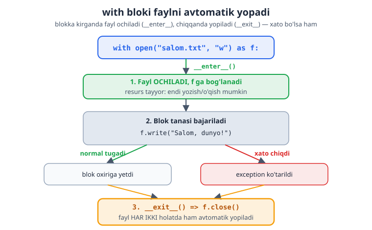
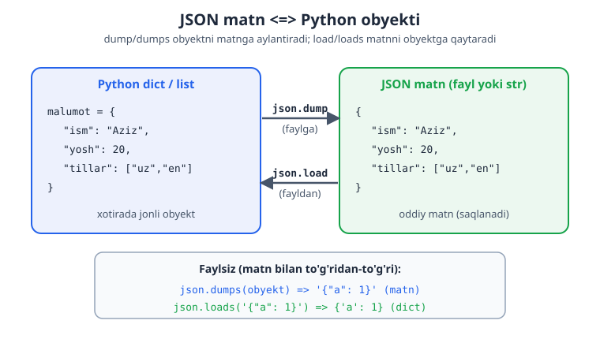
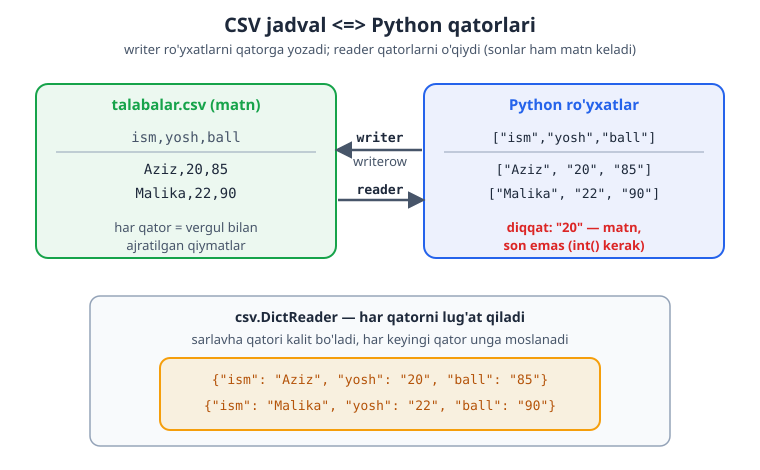

# 08 — Fayllar, JSON va CSV

Hozirgacha ma'lumot faqat dastur ishlab turganda xotirada saqlangan — dastur tugagach yo'qolgan. **Fayllar** ma'lumotni doimiy saqlash imkonini beradi: matn yozish, o'qish, sozlamalarni saqlash. Bu modulda fayllar bilan ishlash, hamda ma'lumotni JSON va CSV formatlarida saqlashni o'rganasan.

> **Bu modulda:** fayl o'qish va yozish (`open`, `with`), `utf-8` kodlash, barcha ochish rejimlari (`r`/`w`/`a`/`x`/`r+`/`rb`/`wb`), `pathlib` (fayl va katalog operatsiyalari), JSON bilan ma'lumot saqlash/yuklash (`default=` serializer bilan), CSV jadvallar (`DictReader`/`DictWriter`), `pickle` (Python obyektini saqlash), `tomllib` (config o'qish) va `shutil` (fayl/papka boshqarish).

---

## 8.1 Faylga yozish

Faylni `open()` bilan ochasan. Eng to'g'ri usul — `with` bilan (u faylni avtomatik yopadi):

```python
with open("salom.txt", "w", encoding="utf-8") as f:
    f.write("Salom, dunyo!\n")
    f.write("Ikkinchi qator\n")
# blok tugaganda fayl avtomatik yopiladi
```

`open()` ning ikkinchi parametri — **rejim**:

| Rejim | Ma'nosi |
|-------|---------|
| `"w"` | yozish (mavjud faylni **o'chirib** qaytadan yozadi) |
| `"a"` | qo'shish (mavjud faylning **oxiriga** qo'shadi) |
| `"r"` | o'qish (standart) |

> **`encoding="utf-8"` — juda muhim!** O'zbekcha (yoki har qanday o'zbek kirill/lotin) matn bilan ishlaganda doim `encoding="utf-8"` yoz. Aks holda ba'zi tizimlarda harflar buzilib chiqishi mumkin. Buni odat qil.

---

## 8.2 Fayldan o'qish

```python
# Butun faylni bir matn sifatida o'qish:
with open("salom.txt", "r", encoding="utf-8") as f:
    matn = f.read()
print(matn)

# Qator-qator o'qish (katta fayllar uchun eng yaxshi yo'l):
with open("salom.txt", "r", encoding="utf-8") as f:
    for qator in f:
        print(qator.strip())     # strip() — qator oxiridagi \n ni olib tashlaydi

# Barcha qatorlarni ro'yxatga olish:
with open("salom.txt", "r", encoding="utf-8") as f:
    qatorlar = f.readlines()     # ['Salom...\n', 'Ikkinchi...\n']
```

> **Nega `with`?** `with` bloki tugaganda fayl avtomatik va ishonchli yopiladi — xato bo'lsa ham. `with`siz `f.close()` ni o'zing yozishing kerak bo'lardi va unutish oson. Doim `with` ishlat.

Quyidagi diagramma `with` blokining ichki mexanizmini ko'rsatadi: blokka kirganda fayl ochiladi, chiqqanda esa (xato bo'lsa ham) avtomatik yopiladi.



---

## 8.3 `pathlib` — fayl yo'llari bilan ishlash

`pathlib` — fayl va papka yo'llari bilan ishlashning zamonaviy usuli:

```python
from pathlib import Path

yol = Path("hujjatlar/salom.txt")

print(yol.name)        # salom.txt    — fayl nomi
print(yol.stem)        # salom        — kengaytmasiz nom
print(yol.suffix)      # .txt         — kengaytma
print(yol.exists())    # True/False   — fayl mavjudmi?

# Yo'llarni / bilan birlashtirish (qulay!):
papka = Path("hujjatlar")
fayl = papka / "yangi.txt"     # hujjatlar/yangi.txt

# pathlib bilan o'qish/yozish — qisqaroq:
Path("salom.txt").write_text("Salom!", encoding="utf-8")
matn = Path("salom.txt").read_text(encoding="utf-8")
```

> **Nega `pathlib`?** Eski uslubda yo'llar oddiy matn sifatida `"papka/" + nom` ko'rinishida birlashtirilardi — bu Windows (`\`) va Linux (`/`) o'rtasida muammo tug'dirardi. `Path` esa har bir tizimda to'g'ri ajratgichni o'zi qo'yadi. Zamonaviy Python kodida fayl yo'llari uchun deyarli har doim `pathlib` ishlatiladi.

---

## 8.4 JSON — ma'lumotni saqlash va yuklash

JSON — ma'lumotni matn ko'rinishida saqlash formati. Python lug'at/ro'yxatlarini faylga saqlab, keyin qayta yuklash uchun ideal (masalan, dastur sozlamalari yoki foydalanuvchi ma'lumotlari).

```python
import json

malumot = {
    "ism": "Aziz",
    "yosh": 20,
    "tillar": ["o'zbek", "ingliz"],
}

# Faylga saqlash:
with open("malumot.json", "w", encoding="utf-8") as f:
    json.dump(malumot, f, ensure_ascii=False, indent=2)

# Fayldan yuklash:
with open("malumot.json", "r", encoding="utf-8") as f:
    yuklangan = json.load(f)

print(yuklangan["ism"])    # Aziz
```

> **`ensure_ascii=False`** — o'zbekcha harflar to'g'ri (o'qiladigan) ko'rinishda saqlanishi uchun. Busiz harflar `\u...` kodlariga aylanib ketadi. **`indent=2`** — faylni chiroyli, o'qish oson qilib formatlaydi.

Matn va Python obyekti orasida aylantirish (faylsiz):

```python
import json
matn = json.dumps({"a": 1})    # obyekt → JSON matn:  '{"a": 1}'
obyekt = json.loads('{"a": 1}')  # JSON matn → obyekt: {'a': 1}
```

Quyidagi diagramma JSON matn va Python obyekti orasidagi ikki tomonlama moslikni ko'rsatadi.



---

## 8.5 CSV — jadval ma'lumotlari

CSV — jadval ko'rinishidagi ma'lumot (Excel kabi: qatorlar va ustunlar). Har qator vergul bilan ajratilgan qiymatlar:

```python
import csv

# Yozish:
with open("talabalar.csv", "w", newline="", encoding="utf-8") as f:
    yozuvchi = csv.writer(f)
    yozuvchi.writerow(["ism", "yosh", "ball"])     # sarlavha qatori
    yozuvchi.writerow(["Aziz", 20, 85])
    yozuvchi.writerow(["Malika", 22, 90])

# O'qish:
with open("talabalar.csv", "r", encoding="utf-8") as f:
    oquvchi = csv.reader(f)
    for qator in oquvchi:
        print(qator)        # ['ism', 'yosh', 'ball'], keyin ['Aziz', '20', '85'], ...
```

Kalit bilan o'qish (`DictReader`) — har qatorni lug'at sifatida:

```python
import csv
with open("talabalar.csv", "r", encoding="utf-8") as f:
    oquvchi = csv.DictReader(f)
    for qator in oquvchi:
        print(qator["ism"], qator["ball"])    # Aziz 85, Malika 90
```

> **`newline=""`** — CSV yozishda bu parametrni qo'sh (ba'zi tizimlarda qo'shimcha bo'sh qatorlar paydo bo'lmasligi uchun). CSV'dan o'qilgan sonlar **matn** ko'rinishida keladi (`"20"`), kerak bo'lsa `int()` bilan aylantir.

Quyidagi diagramma CSV jadval va Python qatorlari orasidagi moslikni ko'rsatadi (`DictReader` har qatorni lug'atga aylantirishi bilan).



### `DictWriter` — lug'atlar ro'yxatini CSV'ga yozish

`csv.writer` bilan har qatorni ro'yxat (`["Aziz", 20, 85]`) ko'rinishida berishing kerak edi. Agar ma'lumoting **lug'atlar** ko'rinishida bo'lsa (`{"ism": "Aziz", ...}`), `DictWriter` ancha qulayroq — u har bir lug'atni avtomatik to'g'ri ustunga joylashtiradi:

```python
import csv

talabalar = [
    {"ism": "Aziz", "yosh": 20, "ball": 85},
    {"ism": "Malika", "yosh": 22, "ball": 90},
    {"ism": "Bobur", "yosh": 21, "ball": 78},
]

with open("talabalar.csv", "w", newline="", encoding="utf-8") as f:
    maydonlar = ["ism", "yosh", "ball"]              # ustun nomlari (tartibi muhim!)
    yozuvchi = csv.DictWriter(f, fieldnames=maydonlar)
    yozuvchi.writeheader()                           # sarlavha qatorini yozadi
    yozuvchi.writerows(talabalar)                    # barcha qatorlarni bir yo'la yozadi
```

Natijada `talabalar.csv` shunday bo'ladi:

```
ism,yosh,ball
Aziz,20,85
Malika,22,90
Bobur,21,78
```

> **`fieldnames`** — ustunlar tartibini belgilaydi. `writeheader()` — birinchi qator (sarlavha) ni yozadi. `writerows()` — lug'atlar ro'yxatini, har birini ustun nomlariga qarab to'g'ri joyga yozadi. Lug'atda yo'q maydon bo'lsa, bo'sh qoladi.

**`DictReader` + `DictWriter` juftligi** ma'lumotni o'qib, o'zgartirib, qayta yozishni juda qulay qiladi:

```python
import csv

# O'qish, har bir ballga 5 qo'shish, qayta yozish:
with open("talabalar.csv", "r", encoding="utf-8") as f:
    qatorlar = list(csv.DictReader(f))

for q in qatorlar:
    q["ball"] = int(q["ball"]) + 5     # CSV'dan kelgan matnni songa aylantirib oshiramiz

with open("talabalar_yangi.csv", "w", newline="", encoding="utf-8") as f:
    yozuvchi = csv.DictWriter(f, fieldnames=["ism", "yosh", "ball"])
    yozuvchi.writeheader()
    yozuvchi.writerows(qatorlar)
```

---

## 8.6 `open()` rejimlari — to'liq

Hozirgacha `"w"`, `"a"`, `"r"` ni ko'rdik. Lekin `open()` ning yana bir nechta muhim rejimi bor. Quyidagi jadval barcha asosiy rejimlarni ko'rsatadi:

| Rejim | Ma'nosi | Fayl yo'q bo'lsa | Fayl bor bo'lsa |
|-------|---------|------------------|-----------------|
| `"r"` | o'qish (standart) | **xato** (`FileNotFoundError`) | ochadi |
| `"w"` | yozish | yangi yaratadi | **butunlay o'chirib** qaytadan yozadi |
| `"a"` | qo'shish | yangi yaratadi | **oxiriga** qo'shadi |
| `"x"` | eksklyuziv yaratish | yangi yaratadi | **xato** (`FileExistsError`) |
| `"r+"` | o'qish **va** yozish | **xato** | ochadi (o'chirmaydi) |

Va har biriga matn (`t`, standart) yoki **binar** (`b`) qo'shimchasi qo'shilishi mumkin: `"rb"`, `"wb"`, `"ab"`, `"rb+"` va h.k.

### `"x"` — faqat yangi fayl yaratish

`"x"` rejimi faylni **faqat u mavjud bo'lmasa** yaratadi. Agar fayl allaqachon bor bo'lsa, `FileExistsError` chiqaradi. Bu mavjud faylni tasodifan o'chirib yuborishdan himoya qiladi:

```python
try:
    with open("muhim.txt", "x", encoding="utf-8") as f:
        f.write("Bu fayl faqat bir marta yaratiladi\n")
    print("Fayl yaratildi")
except FileExistsError:
    print("Fayl allaqachon mavjud — o'chirib yubormadik!")
```

### `"r+"` — o'qish va yozish bir vaqtda

`"r+"` faylni **o'chirmasdan** ochadi va ham o'qish, ham yozish imkonini beradi:

```python
with open("hisob.txt", "w", encoding="utf-8") as f:
    f.write("Boshlang'ich qiymat\n")

with open("hisob.txt", "r+", encoding="utf-8") as f:
    eski = f.read()              # mavjud matnni o'qiymiz
    f.write("Yangi qator qo'shildi\n")   # oxiriga yozamiz
    print("Eski mazmun:", eski.strip())
```

### Binar rejim (`"rb"`, `"wb"`) — matn emas, baytlar

Rasm, audio, video yoki har qanday "matn bo'lmagan" fayl bilan ishlaganda **binar** rejim kerak. Binar rejimda `encoding` bermaysan — `bytes` (baytlar) bilan ishlaysan:

```python
# Binar yozish — b"..." bayt-literal:
with open("data.bin", "wb") as f:
    f.write(b"\x89PNG\r\n")      # masalan, PNG fayl boshlanishi

# Binar o'qish:
with open("data.bin", "rb") as f:
    boshi = f.read(4)            # birinchi 4 baytni o'qish
print(boshi)                     # b'\x89PNG'

# Faylni nusxalash (binar — har qanday fayl turi uchun ishlaydi):
with open("data.bin", "rb") as manba:
    with open("data_nusxa.bin", "wb") as nusxa:
        nusxa.write(manba.read())
```

> **Qachon binar?** Matnli fayllar (`.txt`, `.csv`, `.json`, `.py`) uchun matn rejimi (`encoding="utf-8"`). Rasm/audio/`.pkl`/zip kabi fayllar uchun binar (`"rb"`/`"wb"`). Agar ishonchsiz bo'lsang: matn ko'rinmaydigan fayl — demak binar.

---

## 8.7 `pathlib` bilan katalog operatsiyalari

`pathlib` faqat fayl yo'llarini emas, butun papkalarni boshqarishga ham yordam beradi. Bu — fayl tizimida ishlashning eng zamonaviy va o'qiladigan usuli.

### Katalog yaratish — `mkdir`

```python
from pathlib import Path

# Bitta papka:
Path("hujjatlar").mkdir(exist_ok=True)        # exist_ok=True — bor bo'lsa xato bermaydi

# Ichma-ich papkalar (bir yo'la):
Path("loyiha/manba/ichki").mkdir(parents=True, exist_ok=True)
# parents=True — oraliq papkalarni ham yaratadi
```

> **`exist_ok=True`** bo'lmasa, papka allaqachon mavjud bo'lsa `FileExistsError` chiqadi. **`parents=True`** — `loyiha` va `loyiha/manba` yo'q bo'lsa, ularni ham yaratadi.

### Papka ichini ko'rish — `iterdir`, `glob`, `rglob`

```python
from pathlib import Path

papka = Path("loyiha")

# Tayyorlik: bir nechta fayl yaratamiz
(papka / "manba").mkdir(parents=True, exist_ok=True)
(papka / "asosiy.py").write_text("print('salom')", encoding="utf-8")
(papka / "qayd.txt").write_text("eslatma", encoding="utf-8")
(papka / "manba" / "yordamchi.py").write_text("x = 1", encoding="utf-8")

# iterdir() — papkaning BEVOSITA ichidagilar (fayl va papkalar):
for element in papka.iterdir():
    tur = "papka" if element.is_dir() else "fayl"
    print(f"{element.name}  ({tur})")

# glob() — naqsh bo'yicha FAQAT shu papkada qidirish:
print(list(papka.glob("*.py")))      # [.../asosiy.py]

# rglob() — naqsh bo'yicha BARCHA ichki papkalarda ham qidirish (rekursiv):
print(list(papka.rglob("*.py")))     # [.../asosiy.py, .../manba/yordamchi.py]
```

> **Farqi:** `glob("*.py")` faqat shu papkadagi `.py` fayllarni topadi. `rglob("*.py")` esa ichma-ich barcha papkalarni kezib chiqadi. `r` — "rekursiv".

### Fayl/papka o'chirish va nomini o'zgartirish — `unlink`, `rename`, `rmdir`

```python
from pathlib import Path

fayl = Path("vaqtinchalik.txt")
fayl.write_text("o'chiriladi", encoding="utf-8")

# Faylni o'chirish:
fayl.unlink()                        # faylni o'chiradi
# fayl.unlink(missing_ok=True)       # fayl yo'q bo'lsa ham xato bermaydi

# Nomini o'zgartirish / ko'chirish:
manba = Path("eski_nom.txt")
manba.write_text("matn", encoding="utf-8")
yangi = manba.rename("yangi_nom.txt")   # nomini o'zgartiradi, yangi Path qaytaradi

# Bo'sh papkani o'chirish:
bosh_papka = Path("vaqtinchalik_papka")
bosh_papka.mkdir(exist_ok=True)
bosh_papka.rmdir()                   # FAQAT bo'sh papkani o'chiradi
```

> **`unlink()`** — fayl uchun (papka uchun emas). **`rmdir()`** — faqat **bo'sh** papka uchun. To'la papkani (ichidagi hammasi bilan) o'chirish uchun `shutil.rmtree()` kerak (8.11-bo'limda).

### `.parent`, `.parents`, `.stem`, `.suffix`, `.with_suffix`

```python
from pathlib import Path

yol = Path("loyiha/manba/hisobot.txt")

print(yol.parent)            # loyiha/manba       — ustki papka
print(yol.parent.parent)     # loyiha             — yana yuqoriga
print(yol.stem)              # hisobot            — kengaytmasiz nom
print(yol.suffix)            # .txt               — kengaytma
print(yol.name)              # hisobot.txt        — to'liq fayl nomi

# Kengaytmani almashtirish — hisobotni .md ga aylantirish:
print(yol.with_suffix(".md"))     # loyiha/manba/hisobot.md
```

Quyidagi misol bularning hammasini birlashtiradi — papkadagi har bir `.txt` faylning `.bak` (zaxira) nusxasini yaratadi:

```python
from pathlib import Path

papka = Path("hujjatlar")
papka.mkdir(exist_ok=True)
(papka / "a.txt").write_text("A", encoding="utf-8")
(papka / "b.txt").write_text("B", encoding="utf-8")

for fayl in papka.glob("*.txt"):
    zaxira = fayl.with_suffix(".bak")        # a.txt -> a.bak
    zaxira.write_text(fayl.read_text(encoding="utf-8"), encoding="utf-8")
    print(f"{fayl.name} -> {zaxira.name}")
```

---

## 8.8 JSON chuqurroq — `default=` va o'zbekcha matn

8.4-bo'limda JSON asoslarini ko'rdik. Endi ikkita muhim nozik nuqtani chuqurroq ko'ramiz: **`default=`** (oddiy bo'lmagan obyektlarni saqlash) va o'zbekcha matnni to'g'ri saqlash.

### Muammo: JSON hamma narsani saqlay olmaydi

JSON faqat oddiy turlarni biladi: `str`, `int`, `float`, `bool`, `None`, `list`, `dict`. Agar lug'atingda `datetime` (sana-vaqt) yoki boshqa maxsus obyekt bo'lsa, `json.dump` xato chiqaradi:

```python
import json
from datetime import datetime

malumot = {"ism": "Aziz", "vaqt": datetime(2026, 6, 11, 14, 30)}
# json.dumps(malumot)   # TypeError: Object of type datetime is not JSON serializable
```

### Yechim: `default=` funksiyasi

`default=` — JSON bilmagan obyekt uchrasa, uni **matnga aylantirib** beradigan funksiya. JSON har bir "notanish" obyekt uchun shu funksiyani chaqiradi:

```python
import json
from datetime import datetime, date

def json_serializer(obj: object) -> str:
    """JSON bilmagan obyektlarni matnga aylantiradi."""
    if isinstance(obj, (datetime, date)):
        return obj.isoformat()       # 2026-06-11T14:30:00 ko'rinishida
    raise TypeError(f"Serializatsiya qilib bo'lmaydi: {type(obj).__name__}")

malumot = {
    "ism": "Aziz",
    "ro'yxatga_olingan": datetime(2026, 6, 11, 14, 30),
    "tug'ilgan_kun": date(2005, 3, 20),
}

matn = json.dumps(malumot, default=json_serializer, ensure_ascii=False, indent=2)
print(matn)
```

Natija:

```json
{
  "ism": "Aziz",
  "ro'yxatga_olingan": "2026-06-11T14:30:00",
  "tug'ilgan_kun": "2005-03-20"
}
```

> **`default=` qanday ishlaydi?** JSON oddiy obyektlarni o'zi saqlaydi. "Notanish" obyekt (masalan `datetime`) uchrasa, uni `default` funksiyaga beradi va funksiya qaytargan natijani (matnni) saqlaydi. `isoformat()` — sana-vaqtni standart `2026-06-11T14:30:00` ko'rinishidagi matnga aylantiradi. Funksiya har qanday turni qabul qilolmasa, `TypeError` chiqarishi yaxshi odat.

### `ensure_ascii=False` — o'zbekcha uchun shart!

Buni 8.4 da eslatib o'tdik, lekin u shunchalik muhimki, alohida ko'rib chiqamiz. **`ensure_ascii`** ning standart qiymati `True` — bu har qanday **ASCII bo'lmagan** belgini (kirill harflari, o'zbek lotinidagi maxsus belgilar, emoji va h.k.) `\u...` kodiga aylantiradi. Pastdagi misolda qiymat sifatida kirill harflar bilan yozilgan "Toshkent" so'zini olamiz:

```python
import json

# chr(...) bilan kirill harfli "Toshkent" so'zini tuzamiz (kitob matni ASCII bo'lib qolishi uchun):
toshkent = "".join(chr(k) for k in [0x422, 0x43e, 0x448, 0x43a, 0x435, 0x43d, 0x442])
malumot = {"shahar": toshkent}

# ensure_ascii=True (standart) — kirill harflar \u kodiga aylanadi (O'QISH QIYIN):
print(json.dumps(malumot))
# {"shahar": "\u0422\u043e\u0448\u043a\u0435\u043d\u0442"}   (kirill harflar \u kodiga aylangan)

# ensure_ascii=False — harflar o'z (kirill) holicha qoladi (TO'G'RI, o'qiladigan):
print(json.dumps(malumot, ensure_ascii=False))
# {"shahar": "<kirill harfli Toshkent>"}   (inson o'qiy oladigan, \u kodlarsiz)
```

> **Qoida:** o'zbekcha (yoki har qanday ASCII bo'lmagan) matn saqlaganda **doim `ensure_ascii=False`** yoz. Aks holda fayling `\u0422`, `\u043e` kabi kodlar bilan to'lib ketadi — ma'lumot to'g'ri, lekin inson o'qiy olmaydi. `indent=2` bilan birga ishlatsang, fayling ham chiroyli, ham o'qiladigan bo'ladi.

---

## 8.9 `pickle` — Python obyektini saqlash

JSON faqat oddiy turlarni (lug'at, ro'yxat, son, matn) saqlay oladi. Lekin sen yaratgan **o'z obyektingni** (masalan, `dataclass` yoki klass nusxasini) to'g'ridan-to'g'ri saqlamoqchi bo'lsang-chi? Aynan shu yerda **`pickle`** yordam beradi.

`pickle` — deyarli har qanday Python obyektini **baytlar** ko'rinishida saqlaydi (bunga "serializatsiya" deyiladi) va keyin xuddi o'zidek qayta tiklaydi:

```python
import pickle
from dataclasses import dataclass

@dataclass
class Talaba:
    ism: str
    yosh: int
    ballar: list[int]

t = Talaba("Aziz", 20, [85, 90, 78])

# Saqlash — DIQQAT: "wb" (binar yozish), encoding YO'Q!
with open("talaba.pkl", "wb") as f:
    pickle.dump(t, f)

# Qayta yuklash — "rb" (binar o'qish):
with open("talaba.pkl", "rb") as f:
    yuklangan = pickle.load(f)

print(yuklangan)                 # Talaba(ism='Aziz', yosh=20, ballar=[85, 90, 78])
print(yuklangan.ism)             # Aziz — obyekt to'liq tiklandi!
print(sum(yuklangan.ballar) / len(yuklangan.ballar))   # 84.33...
```

Faylsiz, baytlar bilan ham ishlaydi:

```python
import pickle

baytlar = pickle.dumps({"a": 1, "b": [1, 2, 3]})   # obyekt -> bytes
print(type(baytlar))             # <class 'bytes'>
obyekt = pickle.loads(baytlar)   # bytes -> obyekt
print(obyekt)                    # {'a': 1, 'b': [1, 2, 3]}
```

> **`pickle` vs JSON — qaysi birini tanlash?**
>
> | | JSON | pickle |
> |---|------|--------|
> | Format | matn (o'qiladigan) | baytlar (o'qilmaydigan) |
> | Turlar | faqat oddiy (dict, list, son, matn) | deyarli **har qanday** Python obyekti |
> | Boshqa tillar o'qiy oladimi? | **ha** (universal) | yo'q (faqat Python) |
> | Rejim | `"w"` / `"r"` | `"wb"` / `"rb"` |

> **OGOHLANTIRISH — xavfsizlik:** **hech qachon ishonchsiz manbadan kelgan `.pkl` faylni `pickle.load` qilma!** `pickle` faylni ochganda uning ichidagi kod ishga tushishi mumkin — bu zararli kod bo'lishi mumkin. Faqat o'zing yaratgan yoki to'liq ishonadigan fayllarni och. Boshqalarga ma'lumot uzatish kerak bo'lsa, JSON ishlat.

---

## 8.10 `tomllib` — config (sozlama) fayllarini o'qish

Dasturlar ko'pincha sozlamalarni alohida **config faylida** saqlaydi (ma'lumotlar bazasi manzili, port, til va h.k.). **TOML** — bunday sozlamalar uchun mashhur, o'qish oson format. Python 3.11 dan boshlab `tomllib` moduli standart kutubxonaga kirgan.

Quyida oddiy TOML fayl ko'rinishi:

```toml
title = "Mening dasturim"

[server]
host = "127.0.0.1"
port = 8000
debug = true

[database]
nom = "asosiy"
maks_ulanish = 20
```

Uni `tomllib` bilan o'qish:

```python
import tomllib

# DIQQAT: tomllib fayldan o'qishda "rb" (binar) rejimini talab qiladi!
with open("config.toml", "rb") as f:
    config = tomllib.load(f)

print(config["title"])                    # Mening dasturim
print(config["server"]["port"])           # 8000
print(config["server"]["debug"])          # True (bool!)
print(config["database"]["nom"])          # asosiy
```

TOML matni to'g'ridan-to'g'ri (faylsiz):

```python
import tomllib

matn = '''
port = 5000
nom = "test"
faol = true
'''
d = tomllib.loads(matn)
print(d)        # {'port': 5000, 'nom': 'test', 'faol': True}
```

> **Muhim nuqtalar:**
> - `tomllib` **faqat o'qiydi** (yozish funksiyasi yo'q). Yozish kerak bo'lsa, alohida `tomli-w` paketi ishlatiladi.
> - Faylni `open(..., "rb")` — ya'ni **binar** rejimda ochasan (matn `"r"` emas!). Bu `tomllib`ning talabidir.
> - TOML qiymatlarni **to'g'ri turga** aylantiradi: `port = 8000` -> `int`, `debug = true` -> `bool`. JSON kabi qo'lda aylantirish shart emas.

---

## 8.11 `shutil` — fayl va papkalarni boshqarish

`pathlib` bitta faylni o'chirish/ko'chirishni bilardi, lekin **butun papkani** nusxalash yoki o'chirish uning qo'lidan kelmaydi. Aynan shu ishlar uchun **`shutil`** moduli bor — u yuqori darajadagi fayl operatsiyalarini bajaradi.

```python
import shutil
from pathlib import Path

# Tayyorlik:
Path("manba").mkdir(exist_ok=True)
(Path("manba") / "fayl.txt").write_text("matn", encoding="utf-8")

# 1) copy — bitta faylni nusxalash:
shutil.copy("manba/fayl.txt", "nusxa.txt")

# 2) copytree — BUTUN papkani (ichidagi hammasi bilan) nusxalash:
shutil.copytree("manba", "manba_nusxa")

# 3) move — fayl yoki papkani ko'chirish (yoki nomini o'zgartirish):
shutil.move("nusxa.txt", "yangi_joy.txt")

# 4) rmtree — BUTUN papkani (ichidagi hammasi bilan) o'chirish:
shutil.rmtree("manba_nusxa")
```

| Funksiya | Nima qiladi |
|----------|-------------|
| `shutil.copy(manba, nishon)` | bitta **faylni** nusxalaydi |
| `shutil.copytree(manba, nishon)` | butun **papkani** (rekursiv) nusxalaydi |
| `shutil.move(manba, nishon)` | fayl yoki papkani ko'chiradi |
| `shutil.rmtree(papka)` | butun papkani **ichidagisi bilan** o'chiradi |

> **`pathlib` va `shutil` qachon?** Bitta faylni o'chirish — `Path.unlink()`. Bo'sh papkani o'chirish — `Path.rmdir()`. **To'la** papkani o'chirish — `shutil.rmtree()`. Papkani nusxalash — `shutil.copytree()`. Ya'ni: oddiy yo'l ishlari — `pathlib`, "og'ir" papka ishlari — `shutil`.

> **DIQQAT:** `shutil.rmtree()` papkani **ichidagi hamma narsasi bilan butunlay** o'chiradi va buni ortga qaytarib bo'lmaydi. Manzilni har doim ikki marta tekshir!

Amaliy misol — kunlik zaxira (backup) papkasini yaratish:

```python
import shutil
from pathlib import Path
from datetime import date

manba = Path("loyiha")
manba.mkdir(exist_ok=True)
(manba / "ma'lumot.txt").write_text("muhim", encoding="utf-8")

# Bugungi sana bilan nomlangan zaxira papkasi:
zaxira_nomi = f"backup_{date.today().isoformat()}"    # backup_2026-06-11
if Path(zaxira_nomi).exists():
    shutil.rmtree(zaxira_nomi)                         # eskisini tozalaymiz
shutil.copytree(manba, zaxira_nomi)
print(f"Zaxira tayyor: {zaxira_nomi}")
```

---

## ✍️ Masalalar (27 ta)

> Bu masalalar fayllar bilan ishlaydi — har birini ishga tushirib, yaratilgan fayllarni tekshir.

**Oson (1–7):**

1. `salom.txt` fayliga "Salom, dunyo!" deb yoz (`with open`, `"w"`, `utf-8`).
2. Shu faylni o'qib, mazmunini ekranga chiqar.
3. Faylga uchta qator yoz (har biri yangi qatorda, `\n` bilan).
4. Faylni qator-qator o'qib, har qatorni `strip()` bilan chiqar.
5. `"a"` rejimida faylga yana bir qator **qo'sh** (eskisi o'chmasin).
6. `pathlib.Path` bilan `salom.txt` faylining nomini, kengaytmasini va mavjudligini chiqar.
7. `Path.write_text` bilan faylga matn yozib, `read_text` bilan qayta o'qi.

**O'rta (8–14):**

8. Bir lug'atni (`ism`, `yosh`) `json.dump` bilan faylga saqla (`ensure_ascii=False`, `indent=2`).
9. Shu JSON faylni `json.load` bilan o'qib, qiymatlarini chiqar.
10. Ro'yxatdagi sonlarni faylga yoz (har biri alohida qatorda), keyin o'qib yig'indisini hisobla.
11. Foydalanuvchidan bir nechta ism so'rab (sikl bilan), ularni faylga yoz.
12. CSV faylga 3 ta talaba (ism, yosh, ball) yoz (`csv.writer`).
13. Shu CSV faylni `csv.DictReader` bilan o'qib, har talabaning ism va ballini chiqar.
14. JSON faylga sonlar ro'yxatini saqla, keyin o'qib eng kattasini top.

**Murakkab (15–20):**

15. Oddiy "eslatmalar" dasturi: foydalanuvchi yozgan eslatmalarni faylga qo'shib boradi (`"a"` rejimi), har safar yangi qator.
16. Lug'atlar ro'yxatini (talabalar) JSON faylga saqla, qayta yuklab, ballari 80 dan yuqorilarni chiqar.
17. CSV faylni o'qib, barcha ballarning o'rtachasini hisobla (sonlarni `int` ga aylantirishni unutma).
18. Oddiy "telefon kitobchasi": ma'lumotni JSON faylda saqla. Dastur ishga tushganda yuklasin, yangi kontakt qo'shilganda saqlasin (qo'shish/ko'rish menyusi bilan).
19. Bir matn faylini o'qib, undagi qatorlar sonini, so'zlar sonini va belgilar sonini hisobla.
20. Ma'lumotni CSV'dan o'qib, JSON formatiga o'tkazib saqlovchi dastur yoz (har CSV qatori — JSON'da bitta lug'at bo'lsin).

**Qo'shimcha — yangi modullar (21–27):**

21. Bir `dataclass` (`Kitob`: nom, sahifa) ro'yxatini `pickle` bilan faylga saqla, qayta yuklab, jami sahifa sonini hisobla.
22. Bir papka yaratib, unga uch xil kengaytmali fayl yoz, keyin `pathlib.glob` bilan faqat `.txt` fayllarning sonini hisobla.
23. Tarkibida `datetime` bo'lgan lug'atni `json.dumps` bilan saqla — `default=` serializer yozib, sana-vaqtni `isoformat()` ga aylantir.
24. `shutil.copy` bilan muhim faylning zaxira nusxasini yarat, keyin nusxa mazmunini o'qib chiqar.
25. Bir TOML config faylini yozib (`port`, `nom`), `tomllib` bilan o'qi va qiymatlarni chiqar.
26. `csv.DictWriter` bilan lug'atlar ro'yxatini CSV'ga yoz (`writeheader` + `writerows`), keyin o'qib `soni` ustuni yig'indisini hisobla.
27. Ichma-ich papkalar va fayllar yaratib, `shutil.rmtree` bilan butun papkani bir buyruq bilan o'chir va o'chirilganini tasdiqlab chiqar.

---

## ✅ Yechimlar

<details markdown="1">
<summary>Ko'rsatish uchun ochish</summary>

```python
# 1
with open("salom.txt", "w", encoding="utf-8") as f:
    f.write("Salom, dunyo!")

# 2
with open("salom.txt", "r", encoding="utf-8") as f:
    print(f.read())

# 3
with open("uch.txt", "w", encoding="utf-8") as f:
    f.write("Birinchi\n")
    f.write("Ikkinchi\n")
    f.write("Uchinchi\n")

# 4
with open("uch.txt", "r", encoding="utf-8") as f:
    for qator in f:
        print(qator.strip())

# 5
with open("uch.txt", "a", encoding="utf-8") as f:
    f.write("Qo'shilgan qator\n")

# 6
from pathlib import Path
yol = Path("salom.txt")
print(yol.name, yol.suffix, yol.exists())   # salom.txt .txt True

# 7
from pathlib import Path
Path("test.txt").write_text("Salom!", encoding="utf-8")
print(Path("test.txt").read_text(encoding="utf-8"))   # Salom!

# 8
import json
malumot = {"ism": "Aziz", "yosh": 20}
with open("m.json", "w", encoding="utf-8") as f:
    json.dump(malumot, f, ensure_ascii=False, indent=2)

# 9
import json
with open("m.json", "r", encoding="utf-8") as f:
    d = json.load(f)
print(d["ism"], d["yosh"])    # Aziz 20

# 10
sonlar: list[int] = [10, 20, 30]
with open("sonlar.txt", "w", encoding="utf-8") as f:
    for s in sonlar:
        f.write(f"{s}\n")
with open("sonlar.txt", "r", encoding="utf-8") as f:
    jami = sum(int(q) for q in f)
print(jami)                   # 60

# 11
with open("ismlar.txt", "w", encoding="utf-8") as f:
    for _ in range(3):
        ism = input("Ism: ")
        f.write(ism + "\n")

# 12
import csv
with open("talabalar.csv", "w", newline="", encoding="utf-8") as f:
    w = csv.writer(f)
    w.writerow(["ism", "yosh", "ball"])
    w.writerow(["Aziz", 20, 85])
    w.writerow(["Malika", 22, 90])
    w.writerow(["Bobur", 21, 78])

# 13
import csv
with open("talabalar.csv", "r", encoding="utf-8") as f:
    for q in csv.DictReader(f):
        print(q["ism"], q["ball"])

# 14
import json
with open("nums.json", "w", encoding="utf-8") as f:
    json.dump([5, 12, 8, 20, 3], f)
with open("nums.json", "r", encoding="utf-8") as f:
    nums: list[int] = json.load(f)
print(max(nums))              # 20

# 15
while True:
    eslatma = input("Eslatma ('stop' to'xtatadi): ")
    if eslatma == "stop":
        break
    with open("eslatmalar.txt", "a", encoding="utf-8") as f:
        f.write(eslatma + "\n")

# 16
import json
talabalar: list[dict[str, object]] = [
    {"ism": "Aziz", "ball": 85},
    {"ism": "Malika", "ball": 92},
    {"ism": "Bobur", "ball": 70},
]
with open("t.json", "w", encoding="utf-8") as f:
    json.dump(talabalar, f, ensure_ascii=False, indent=2)
with open("t.json", "r", encoding="utf-8") as f:
    yuklangan = json.load(f)
for t in yuklangan:
    if t["ball"] > 80:
        print(t["ism"])       # Aziz, Malika

# 17
import csv
ballar: list[int] = []
with open("talabalar.csv", "r", encoding="utf-8") as f:
    for q in csv.DictReader(f):
        ballar.append(int(q["ball"]))
print(sum(ballar) / len(ballar))

# 18
import json
from pathlib import Path

FAYL = Path("kontaktlar.json")

def yukla() -> dict[str, str]:
    if FAYL.exists():
        return json.loads(FAYL.read_text(encoding="utf-8"))
    return {}

def saqla(k: dict[str, str]) -> None:
    FAYL.write_text(json.dumps(k, ensure_ascii=False, indent=2), encoding="utf-8")

kontaktlar = yukla()
while True:
    amal = input("qosh / korish / chiqish: ")
    match amal:
        case "chiqish":
            break
        case "qosh":
            ism = input("Ism: ")
            kontaktlar[ism] = input("Raqam: ")
            saqla(kontaktlar)
        case "korish":
            print(kontaktlar)
        case _:
            print("Notog'ri amal")

# 19
with open("uch.txt", "r", encoding="utf-8") as f:
    matn = f.read()
print("Qatorlar:", len(matn.splitlines()))
print("So'zlar:", len(matn.split()))
print("Belgilar:", len(matn))

# 20
import csv, json
qatorlar: list[dict[str, str]] = []
with open("talabalar.csv", "r", encoding="utf-8") as f:
    for q in csv.DictReader(f):
        qatorlar.append(q)
with open("talabalar.json", "w", encoding="utf-8") as f:
    json.dump(qatorlar, f, ensure_ascii=False, indent=2)
print("CSV → JSON tayyor")

# 21
import pickle
from dataclasses import dataclass

@dataclass
class Kitob:
    nom: str
    sahifa: int

kitoblar = [Kitob("Python", 300), Kitob("SQL", 250)]
with open("kitoblar.pkl", "wb") as f:
    pickle.dump(kitoblar, f)
with open("kitoblar.pkl", "rb") as f:
    yuklangan: list[Kitob] = pickle.load(f)
print(sum(k.sahifa for k in yuklangan))   # 550

# 22
from pathlib import Path
papka = Path("test_papka")
papka.mkdir(exist_ok=True)
for nom in ["a.txt", "b.txt", "c.py"]:
    (papka / nom).write_text("x", encoding="utf-8")
txt_soni = len(list(papka.glob("*.txt")))
print(txt_soni)               # 2

# 23
import json
from datetime import datetime

def ser(obj: object) -> str:
    if isinstance(obj, datetime):
        return obj.isoformat()
    raise TypeError(f"Serializatsiya bo'lmaydi: {type(obj).__name__}")

voqea = {"nom": "Uchrashuv", "vaqt": datetime(2026, 6, 11, 10, 0)}
print(json.dumps(voqea, default=ser, ensure_ascii=False))
# {"nom": "Uchrashuv", "vaqt": "2026-06-11T10:00:00"}

# 24
import shutil
from pathlib import Path
Path("muhim.txt").write_text("muhim ma'lumot", encoding="utf-8")
shutil.copy("muhim.txt", "muhim_backup.txt")
print(Path("muhim_backup.txt").read_text(encoding="utf-8"))   # muhim ma'lumot

# 25
import tomllib
from pathlib import Path
Path("sozlama.toml").write_text('port = 5000\nnom = "test"\n', encoding="utf-8")
with open("sozlama.toml", "rb") as f:      # DIQQAT: "rb"!
    cfg = tomllib.load(f)
print(cfg["port"], cfg["nom"])             # 5000 test

# 26
import csv
qatorlar = [{"nom": "A", "soni": 3}, {"nom": "B", "soni": 7}]
with open("hisob.csv", "w", newline="", encoding="utf-8") as f:
    w = csv.DictWriter(f, fieldnames=["nom", "soni"])
    w.writeheader()
    w.writerows(qatorlar)
with open("hisob.csv", "r", encoding="utf-8") as f:
    jami = sum(int(q["soni"]) for q in csv.DictReader(f))
print(jami)                   # 10

# 27
import shutil
from pathlib import Path
chiqindi = Path("chiqindi")
(chiqindi / "ichki").mkdir(parents=True, exist_ok=True)
(chiqindi / "x.txt").write_text("y", encoding="utf-8")
(chiqindi / "ichki" / "z.txt").write_text("z", encoding="utf-8")
shutil.rmtree(chiqindi)
print("O'chirildi:", not chiqindi.exists())   # O'chirildi: True
```

</details>

---

[← Xatolarni boshqarish](./07-xatolar-context.md) | [Boshlovchilar README ↑](./README.md) | [Keyingi: Generator va dekoratorlar →](./09-iterator-generator-decorator.md)
