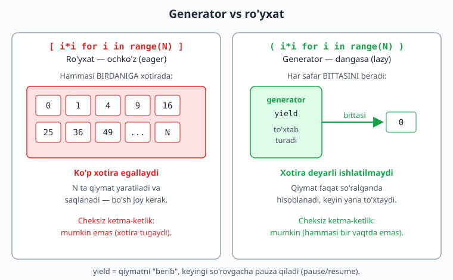
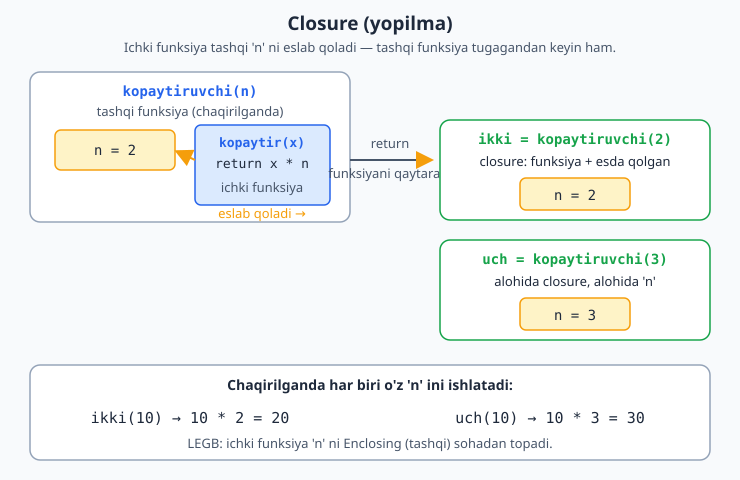
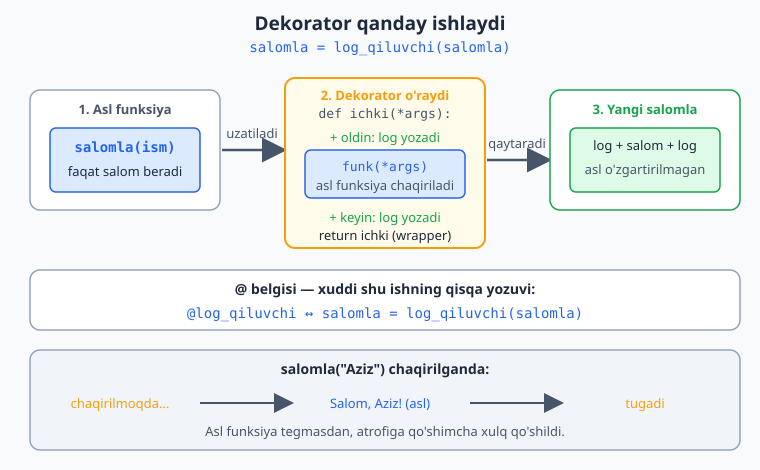

# 09 — Iteratorlar, generatorlar va dekoratorlar

Bu modul Python'ning kuchliroq vositalariga kirish. **Iterator** — `for` siklining "ichidagi mexanizm": ketma-ketlikdan elementlarni birma-bir oluvchi narsa. **Generatorlar** — katta yoki cheksiz ketma-ketliklarni xotirani tejab ishlatish usuli (aslida iteratorning eng oson yozish yo'li). **Dekoratorlar** — funksiyaning xulqini o'zgartirmasdan unga qo'shimcha imkoniyat qo'shish vositasi. Bular boshida biroz murakkab tuyuladi — sekin, misol bilan o'rganamiz.

> **Bu modulda:** iterator protokoli (`__iter__`/`__next__`, `iter()`/`next()`, `StopIteration`), generatorlar (`yield`, `yield from`, `send`/`throw`/`close`), generator ifodalari, closure (yopilma), va dekoratorlar (`functools.wraps`, argumentli dekorator, klass-dekorator, stacking, `@cache`/`@lru_cache`).

---

## 9.1 Iterable va iterator — `for` siklining ichi

Har safar `for x in nimadir:` deb yozganingda, Python orqada ikki bosqichni bajaradi. Buni tushunsang, `for` "sehr" emas, oddiy protokolga aylanadi.

Avval ikki tushunchani ajratamiz:

- **Iterable** (aylantirilsa bo'ladigan) — ustidan `for` yurita oladigan har qanday narsa: ro'yxat, satr, lug'at, to'plam... Ularda `__iter__` metodi bor.
- **Iterator** (aylantiruvchi) — qiymatlarni **birma-bir** beradigan narsa. Unda `__next__` metodi bor va u **bir martalik**: bir marta oxirigacha ishlatilsa, "tugaydi".

`iter()` iterable'dan iterator yasaydi, `next()` esa iteratordan keyingi qiymatni so'raydi:

```python
sonlar = [10, 20, 30]          # ro'yxat — iterable
it = iter(sonlar)              # iterator olamiz
print(type(it))               # <class 'list_iterator'>

print(next(it))               # 10
print(next(it))               # 20
print(next(it))               # 30
try:
    print(next(it))           # endi qiymat yo'q
except StopIteration:
    print("Tugadi! (StopIteration)")

# for sikli aslida xuddi shu ishni qiladi:
for x in [1, 2, 3]:
    print(x)
```

> **Eslab qol:** `for` orqada `iter()` chaqiradi, keyin to'xtamasdan `next()` chaqiraveradi, va `StopIteration` chiqqanda siklni to'xtatadi. Ya'ni `StopIteration` — "qiymat tugadi" degan signal (xato emas, **xabar**).

Muhim farq: **iterable**'ni qayta-qayta aylantirsa bo'ladi (har safar yangi iterator yasaladi), lekin **iterator** bir marta ishlatilgach "ichib bo'linadi" (exhausted):

```python
sonlar = [1, 2, 3]

it1 = iter(sonlar)
it2 = iter(sonlar)
print(next(it1))      # 1
print(next(it1))      # 2
print(next(it2))      # 1  — yangi iterator, boshidan boshlaydi

# iterable'ni necha marta xohlasang aylantirasan:
for _ in sonlar: pass
for _ in sonlar: pass     # yana ishlaydi

# iterator esa FAQAT BIR MARTA ishlaydi:
gen = (x for x in range(3))
print(list(gen))      # [0, 1, 2]
print(list(gen))      # []  — allaqachon "ichib bo'lingan"
```

> **Amaliy ogohlantirish:** generator ham iterator — shuning uchun uni `list()` qilib ikki marta ishlatib bo'lmaydi. Agar natija ikki marta kerak bo'lsa, uni ro'yxatga saqlab qo'y.

---

## 9.2 O'z iterator klassingni yozish — `__iter__` va `__next__`

Iterator protokolini tushunish uchun eng yaxshi yo'l — o'zingniki yozish. Klassni iterator qilish uchun ikki "sehrli" metod kerak:

- `__iter__(self)` — iteratorning **o'zini** qaytaradi (`return self`).
- `__next__(self)` — keyingi qiymatni qaytaradi; qiymat tugasa `raise StopIteration` qiladi.

```python
class Sanagich:
    """0 dan limit-1 gacha sanaydigan o'z iteratorimiz."""
    def __init__(self, limit: int) -> None:
        self.limit = limit
        self.joriy = 0

    def __iter__(self) -> "Sanagich":
        return self                    # o'zini iterator sifatida qaytaradi

    def __next__(self) -> int:
        if self.joriy >= self.limit:
            raise StopIteration        # tugadi degan signal
        qiymat = self.joriy
        self.joriy += 1
        return qiymat


for son in Sanagich(4):
    print(son)                         # 0, 1, 2, 3

print(list(Sanagich(3)))               # [0, 1, 2]
```

Bu klass bilan `for` to'liq ishlaydi, `list()`, `sum()`, `in` — barchasi ishlaydi, chunki ular hammasi shu protokolga tayanadi.

> **Endi tushunarli:** generator (`yield` li funksiya) — aynan shu `__iter__`/`__next__` ni avtomatik yozadigan qulay usul. Pastda ko'ramiz — bir xil natijani 5 qator klass o'rniga 3 qator funksiya bilan olamiz.

---

## 9.3 Generator nima? `yield`

Oddiy funksiya `return` bilan **bitta** qiymat qaytaradi va tugaydi. **Generator** esa `yield` bilan qiymatlarni **birma-bir**, kerak bo'lganda beradi — hammasini birdaniga xotiraga olmaydi.

```python
def sanagich(n):
    for i in range(n):
        yield i              # return emas — yield: qiymatni "berib", to'xtab turadi

for son in sanagich(5):
    print(son)               # 0, 1, 2, 3, 4
```

Yuqoridagi `Sanagich` klassini eslaysanmi? Mana shu generator xuddi shu ishni qiladi — lekin `__iter__`/`__next__`/`StopIteration` ni o'zing yozmaysan, Python avtomatik qiladi. `yield` ga yetganda funksiya to'xtaydi, qiymatni beradi va `next()` so'ralganda aynan o'sha joydan davom etadi.

**Nega foydali?** Tasavvur qil, 1 milliard sonni qayta ishlash kerak. Oddiy ro'yxat hammasini xotiraga oladi (juda ko'p joy egallaydi). Generator esa har safar bittasini beradi — xotira deyarli ishlatilmaydi:

```python
# Ro'yxat — hammasini xotiraga oladi:
sonlar = [i * i for i in range(1000000)]   # ko'p xotira

# Generator — bittadan beradi, xotira tejaladi:
sonlar = (i * i for i in range(1000000))   # ( ) — generator ifodasi
for s in sonlar:
    ...                                     # har safar bittasi
```

> **Eslab qol:** generator "dangasa" (lazy) — qiymatni faqat **so'ralganda** hisoblaydi. Cheksiz ketma-ketliklar bilan ham ishlay oladi (chunki hammasini bir vaqtda yaratmaydi).

Quyidagi diagrammada ro'yxat (hammasini birdaniga xotiraga oladi) va generator (`yield` bilan to'xtab-to'xtab, bittadan beradi) yonma-yon taqqoslangan:



Generator ifodasi — list comprehension'ga o'xshaydi, lekin `[ ]` o'rniga `( )`:

```python
kvadratlar = (x * x for x in range(5))     # generator
print(sum(kvadratlar))                      # 30  — yig'indi, oraliq ro'yxatsiz
```

---

## 9.4 Generator vs ro'yxat — xotira farqini "ko'rish"

Yuqorida "xotira tejaladi" dedik — buni `sys.getsizeof` bilan ko'z bilan ko'ramiz. Ro'yxat har bir elementni saqlaydi, generator esa faqat "retsept"ni (qanday hisoblashni) saqlaydi:

```python
import sys

royxat = [i for i in range(100_000)]      # hammasi xotirada
gen = (i for i in range(100_000))         # faqat "retsept"

print("Ro'yxat:", sys.getsizeof(royxat), "bayt")   # ~ 800984 bayt
print("Generator:", sys.getsizeof(gen), "bayt")     # 200 bayt (doimiy!)
```

Ro'yxat ~800 KB joy egallaydi, generator esa atigi ~200 bayt — va bu son element sonidan **mutlaqo qat'i nazar** doimiy qoladi (`range(1)` bo'ladimi, `range(10**9)` bo'ladimi — generatorning o'zi bir xil hajmda).

> **Qachon qaysi?** Natija ustidan bir marta yursang va kattaligi katta bo'lsa — **generator**. Natijani ikki marta ishlatish, indeks bo'yicha olish (`x[5]`), uzunligini bilish (`len`) kerak bo'lsa — **ro'yxat**.

---

## 9.5 `yield from` — generatorni boshqa generatorga ulash

Ko'pincha bir generator ichida boshqa iterable'ning hamma qiymatini "uzatish" kerak bo'ladi. Buni `for` + `yield` bilan yozsa bo'ladi, lekin `yield from` qisqaroq va aniqroq:

```python
def birinchi():
    yield 1
    yield 2

def ikkinchi():
    yield 3
    yield 4

def hammasi():
    yield from birinchi()      # birinchi() ning hamma qiymatini "uzatadi"
    yield from ikkinchi()
    yield 5

print(list(hammasi()))         # [1, 2, 3, 4, 5]
```

`yield from birinchi()` — bu `for x in birinchi(): yield x` ning qisqa shakli. Eng kuchli tomoni — **rekursiv** holatlarda ko'rinadi. Mana ichma-ich (nested) ro'yxatni yassilash (flatten):

```python
def yassila(ichma_ich):
    for element in ichma_ich:
        if isinstance(element, list):
            yield from yassila(element)    # rekursiv yield from
        else:
            yield element

print(list(yassila([1, [2, 3], [4, [5, 6]]])))   # [1, 2, 3, 4, 5, 6]
```

> `yield from` ichki generator nima bersa, hammasini tashqariga "oqizib" beradi — siz qo'lda sikl yozmaysiz.

---

## 9.6 Generatorga ma'lumot yuborish — `send()`, `throw()`, `close()`

Hozirgacha generatordan faqat **oldik** (`next()`). Aslida `yield` ikki tomonlama: u qiymat **beradi** va `send()` orqali tashqaridan qiymat **qabul ham qiladi**. `qiymat = yield jami` qatorida `yield jami` tashqariga `jami` ni beradi, `qiymat` ga esa `send()` yuborgan narsa tushadi.

```python
def hisoblagich():
    jami = 0
    while True:
        qiymat = yield jami        # yield ham BERADI, ham qabul qiladi
        if qiymat is None:
            qiymat = 0
        jami += qiymat

g = hisoblagich()
print(next(g))        # 0   — generatorni "ishga tushiramiz" (birinchi yield gacha)
print(g.send(10))     # 10  — yield ga 10 yuboramiz, jami=10
print(g.send(5))      # 15  — jami=15
print(g.send(100))    # 115

g.close()             # generatorni yopamiz
try:
    g.send(1)
except StopIteration:
    print("Generator yopilgan")
```

> **Muhim:** `send()` dan oldin generatorni `next(g)` (yoki `g.send(None)`) bilan birinchi `yield` gacha "uyg'otish" shart. Aks holda Python xato beradi — chunki hali hech qaysi `yield` da to'xtab turmagan.

`throw()` — generator ichiga xato "tashlaydi" (masalan, uni majburan to'xtatib, tozalash kodini ishga tushirish uchun). `close()` — generatorni yopib, ichidagi `finally`/tozalashni ishga tushiradi:

```python
def hodisalar():
    try:
        while True:
            x = yield
            print("Qabul qilindi:", x)
    except ValueError:
        print("ValueError ushlandi, tozalanmoqda")

h = hodisalar()
next(h)               # ishga tushirish
h.send("salom")       # Qabul qilindi: salom
try:
    h.throw(ValueError)   # generator ichiga xato yuboramiz
except StopIteration:
    print("Generator tozalanib tugadi")
# Chiqish:
#   Qabul qilindi: salom
#   ValueError ushlandi, tozalanmoqda
#   Generator tozalanib tugadi
```

> Bu imkoniyatlar boshida kam kerak bo'ladi, lekin koroutinlar (asinxron dasturlash) poydevori aynan shu — `send`/`throw`/`close`. Hozircha "generator ikki tomonlama gaplasha oladi" deb eslab qol.

---

## 9.7 Closure (yopilma) — funksiya qaytaruvchi funksiya

Funksiya ichida boshqa funksiya yaratib, uni qaytarish mumkin. Ichki funksiya tashqi funksiyaning o'zgaruvchilarini "eslab qoladi" — bu **closure**:

```python
def kopaytiruvchi(n):
    def kopaytir(x):
        return x * n         # tashqi 'n' ni eslab qoladi
    return kopaytir          # funksiyaning O'ZINI qaytaramiz (chaqirmasdan)

ikki = kopaytiruvchi(2)      # n=2 bo'lgan funksiya
uch = kopaytiruvchi(3)       # n=3 bo'lgan funksiya

print(ikki(10))              # 20
print(uch(10))              # 30
```

> Bu boshida g'alati tuyuladi: funksiya **qiymat** emas, **boshqa funksiya** qaytaradi. Closure dekoratorlarni tushunish uchun zarur — keyingi bo'limga poydevor.

Quyidagi diagrammada ichki funksiya tashqi `n` ni qanday "eslab qolishi" va har bir chaqiruv o'z `n` ini olib yurishi ko'rsatilgan:



---

## 9.8 Dekoratorlar — funksiyaga qo'shimcha imkoniyat qo'shish

Dekorator — bir funksiyani "o'rab", unga qo'shimcha xulq qo'shadigan funksiya. Masalan, funksiya ishlashidan oldin/keyin biror narsa qilish (log yozish, vaqt o'lchash) — asl funksiyani o'zgartirmasdan.

Avval dekoratorning "ichini" ko'ramiz:

```python
def log_qiluvchi(funk):
    def ichki(*args, **kwargs):
        print(f"{funk.__name__} chaqirilmoqda...")
        natija = funk(*args, **kwargs)       # asl funksiyani chaqiramiz
        print(f"{funk.__name__} tugadi")
        return natija
    return ichki

def salomla(ism):
    print(f"Salom, {ism}!")

salomla = log_qiluvchi(salomla)      # funksiyani "o'radik"
salomla("Aziz")
# Chiqish:
#   salomla chaqirilmoqda...
#   Salom, Aziz!
#   salomla tugadi
```

`@` belgisi — xuddi shu ishning qisqa yozuvi:

```python
def log_qiluvchi(funk):
    def ichki(*args, **kwargs):
        print(f"{funk.__name__} chaqirilmoqda...")
        natija = funk(*args, **kwargs)
        print(f"{funk.__name__} tugadi")
        return natija
    return ichki

@log_qiluvchi                  # = salomla = log_qiluvchi(salomla)
def salomla(ism):
    print(f"Salom, {ism}!")

salomla("Aziz")                # avtomatik o'ralgan holda ishlaydi
```

Quyidagi diagrammada dekorator asl funksiyani qanday o'rab, wrapper (ichki funksiya) orqali unga qo'shimcha xulq qo'shishi bosqichma-bosqich ko'rsatilgan:



> **`*args, **kwargs` nima?** Bular dekorator har qanday funksiyani (qanday argument olsa ham) o'rashi uchun. `*args` — barcha oddiy argumentlar, `**kwargs` — barcha nomli argumentlar. Hozircha "har qanday argumentni qabul qiladi" deb tushun.

Amaliy misol — vaqt o'lchovchi dekorator:

```python
import time

def vaqt_olchash(funk):
    def ichki(*args, **kwargs):
        boshlanish = time.perf_counter()
        natija = funk(*args, **kwargs)
        davomiylik = time.perf_counter() - boshlanish
        print(f"{funk.__name__}: {davomiylik:.4f} soniya")
        return natija
    return ichki

@vaqt_olchash
def sekin_ish():
    time.sleep(1)

sekin_ish()      # sekin_ish: 1.0001 soniya
```

---

## 9.9 `functools.wraps` — dekoratorda metadata'ni saqlash

Yuqoridagi dekoratorlarda yashirin bir muammo bor: o'ralgan funksiyaning **nomi va docstring**'i yo'qoladi. Sabab — `salomla` endi aslida `ichki` ga ishora qiladi, shuning uchun `salomla.__name__` "ichki" deb chiqadi. Bu xatolarni qiyinlashtiradi va `help()`, debug, hujjat vositalarini chalg'itadi.

```python
from functools import wraps

# wraps SIZ — metadata yo'qoladi:
def log_yomon(funk):
    def ichki(*args, **kwargs):
        return funk(*args, **kwargs)
    return ichki

@log_yomon
def salomla(ism: str) -> str:
    "Foydalanuvchini salomlaydi."
    return f"Salom, {ism}!"

print(salomla.__name__)      # ichki   — XATO! asl nom yo'qoldi
print(salomla.__doc__)       # None    — docstring ham yo'qoldi
```

Yechim — ichki funksiyaga `@wraps(funk)` qo'yish. U asl funksiyaning `__name__`, `__doc__` va boshqa metadata'sini wrapper'ga ko'chiradi:

```python
from functools import wraps

# wraps BILAN — metadata saqlanadi:
def log_yaxshi(funk):
    @wraps(funk)             # asl funksiya metadata'sini ko'chiradi
    def ichki(*args, **kwargs):
        return funk(*args, **kwargs)
    return ichki

@log_yaxshi
def salomla2(ism: str) -> str:
    "Foydalanuvchini salomlaydi."
    return f"Salom, {ism}!"

print(salomla2.__name__)     # salomla2  — to'g'ri!
print(salomla2.__doc__)      # Foydalanuvchini salomlaydi.
```

> **Qoida:** har doim dekorator yozsang, ichki wrapper ustiga `@wraps(funk)` qo'y. Bu "yaxshi odat" — bundan keyingi barcha misollarda shunday qilamiz.

---

## 9.10 Argumentli dekorator (dekorator fabrikasi)

Ba'zan dekoratorga **sozlama** berish kerak bo'ladi: masalan, "funksiyani 3 marta ishlat" yoki "shu darajadagi log yoz". Buning uchun yana **bitta qavat** funksiya qo'shamiz. Natijada uch qavatli tuzilma chiqadi:

1. Tashqi funksiya — **argumentni** oladi (masalan `marta`).
2. O'rta funksiya — **funksiyani** oladi (oddiy dekorator).
3. Ichki funksiya — **chaqiruvni** oladi (`*args, **kwargs`).

```python
from functools import wraps

def takror(marta: int):                 # 1-qavat: argument oladi
    def dekorator(funk):                # 2-qavat: funksiyani oladi
        @wraps(funk)
        def ichki(*args, **kwargs):     # 3-qavat: chaqiruvni oladi
            natija = None
            for _ in range(marta):
                natija = funk(*args, **kwargs)
            return natija
        return ichki
    return dekorator


@takror(3)                              # funksiyani 3 marta ishlatadi
def salom():
    print("Salom!")

salom()
# Salom!
# Salom!
# Salom!


@takror(marta=2)
def chiziq():
    print("-" * 10)

chiziq()
```

> **Kalit fikr:** `@takror(3)` aslida `takror(3)` ni **chaqiradi** va u qaytargan `dekorator` ni funksiyaga qo'llaydi. Ya'ni `@takror(3)` = `salom = takror(3)(salom)`. Oddiy dekoratorda qavs yo'q (`@log_qiluvchi`), argumentli dekoratorda esa qavs bor (`@takror(3)`).

---

## 9.11 Klass-dekorator — `__call__` orqali

Dekorator faqat funksiya bo'lishi shart emas — **klass** ham bo'la oladi. Klass o'ralganda holatni (state) saqlash qulay: masalan, funksiya nechi marta chaqirilganini eslab qolish. Buning uchun klassda `__call__` metodi bo'lishi kerak — u obyekt "funksiyadek chaqirilganda" ishlaydi.

```python
from functools import wraps

class Sanagich:
    """Funksiya nechi marta chaqirilganini saqlaydigan klass-dekorator."""
    def __init__(self, funk):
        wraps(funk)(self)          # metadata'ni self ga ko'chiramiz
        self.funk = funk
        self.soni = 0

    def __call__(self, *args, **kwargs):
        self.soni += 1
        print(f"{self.funk.__name__}: {self.soni}-chaqiruv")
        return self.funk(*args, **kwargs)


@Sanagich
def qosh(a: int, b: int) -> int:
    return a + b

print(qosh(2, 3))      # qosh: 1-chaqiruv  ->  5
print(qosh(10, 20))    # qosh: 2-chaqiruv  ->  30
print("Jami chaqiruvlar:", qosh.soni)   # 2
```

> `@Sanagich` qo'yilganda `qosh = Sanagich(qosh)` bo'ladi — endi `qosh` obyekt. Uni chaqirsak `__call__` ishlaydi. Holat (`self.soni`) obyekt ichida yashaydi, shuning uchun chaqiruvlar orasida saqlanadi.

---

## 9.12 Bir nechta dekorator — stacking (ustma-ust qo'yish)

Bir funksiyaga bir nechta dekorator qo'ysa bo'ladi. Ular **pastdan yuqoriga** qo'llanadi: funksiyaga eng yaqini avval, eng tepadagisi oxirgi bo'lib o'raydi.

```python
from functools import wraps

def qalin(funk):
    @wraps(funk)
    def ichki(*args, **kwargs):
        return f"**{funk(*args, **kwargs)}**"
    return ichki

def qiya(funk):
    @wraps(funk)
    def ichki(*args, **kwargs):
        return f"_{funk(*args, **kwargs)}_"
    return ichki


@qalin                       # ENG TASHQI (oxirgi qo'llaniladi)
@qiya                        # avval shu qo'llaniladi
def matn():
    return "Salom"

print(matn())                # **_Salom_**
# Tartib: qalin(qiya(matn)) — pastdan yuqoriga o'raladi
```

> **Eslab qol:** `@qalin` / `@qiya` ketma-ketligi `qalin(qiya(matn))` ga teng. Ichkaridan tashqariga: avval `qiya` "_Salom_" qiladi, keyin `qalin` uni "**_Salom_**" ga aylantiradi. Tartibni o'zgartirsang, natija ham o'zgaradi.

---

## 9.13 Tayyor foydali dekoratorlar — `@cache` va `@lru_cache`

Python o'zida foydali dekoratorlar bilan keladi. Eng mashhuri — natijani eslab qolib, takror hisoblamaydigan **keshlovchi** dekoratorlar. Python 3.9+ da `@cache` bor (eng oddiy, chegarasiz kesh), `@lru_cache` esa kesh hajmini cheklash imkonini beradi:

```python
from functools import cache, lru_cache

@cache                          # Python 3.9+: chegarasiz kesh (lru_cache(maxsize=None))
def fib(n: int) -> int:
    if n < 2:
        return n
    return fib(n - 1) + fib(n - 2)

print(fib(50))                  # 12586269025  — bir zumda
print(fib.cache_info())         # CacheInfo(hits=48, misses=51, maxsize=None, currsize=51)
```

`@lru_cache(maxsize=...)` faqat oxirgi N ta natijani saqlaydi (LRU — Least Recently Used, ya'ni eng kam ishlatilgani o'chadi). `cache_info()` keshning statistikasini, `cache_clear()` esa keshni tozalashni beradi:

```python
from functools import lru_cache

@lru_cache(maxsize=3)           # faqat oxirgi 3 ta natijani saqlaydi
def kvadrat(n: int) -> int:
    print(f"  hisoblayapman {n}...")
    return n * n

kvadrat(2)        # hisoblayapman 2...
kvadrat(2)        # (kesh) hisoblamaydi — natija eslab qolingan
kvadrat(3)        # hisoblayapman 3...
print(kvadrat.cache_info())     # CacheInfo(hits=1, misses=2, maxsize=3, currsize=2)

kvadrat.cache_clear()           # keshni tozalash
print(kvadrat.cache_info())     # CacheInfo(hits=0, misses=0, maxsize=3, currsize=0)
```

`cache_info()` dagi `hits` — keshdan topilgan chaqiruvlar, `misses` — qaytadan hisoblanganlar. `fib(50)` da 48 ta hit bo'ldi — demak deyarli hamma ishni kesh bajardi.

> **Diqqat:** kesh faqat argument bir xil bo'lganda ishlaydi va argumentlar **hashlanadigan** (o'zgarmas: `int`, `str`, `tuple`...) bo'lishi shart. Ro'yxat yoki lug'atni argument qilib bo'lmaydi. Shuningdek, nojo'ya ta'siri bor (masalan fayl yozadigan, tasodifiy son qaytaradigan) funksiyalarni keshlamang — eski natija qaytib qolishi mumkin.

> Hozircha dekoratorlarni faqat "ishlatish" darajasida bilsang yetadi (`@cache`, `@lru_cache` kabi tayyorlarni). O'z dekoratoringni yozish — yuqorida ko'rgan namuna bo'yicha, vaqt o'tib mashq qilasan.

---

## ✍️ Masalalar (26 ta)

> Bu masalalar oldingi modullarga (ayniqsa funksiyalar va sikllarga) tayanadi.

**Oson (1–7):**

1. `sanagich(n)` generatorini yoz: 0 dan n gacha sonlarni `yield` qilsin. `for` bilan chiqar.
2. `list()` bilan generator natijasini ro'yxatga aylantir: `list(sanagich(5))`.
3. Generator ifodasi `(x*2 for x in range(5))` yarat va `for` bilan chiqar.
4. `sum()` ni generator ifodasi bilan ishlat: 1 dan 100 gacha sonlar yig'indisi.
5. `kvadratlar(n)` generatorini yoz: 0 dan n gacha sonlarning kvadratlarini bersin.
6. `kopaytiruvchi(n)` closure yoz (n ga ko'paytiruvchi funksiya qaytarsin). `ikki = kopaytiruvchi(2)` qilib ishlat.
7. `@lru_cache` ishlatib rekursiv funksiya yoz (masalan faktorial yoki Fibonachchi).

**O'rta (8–14):**

8. Juft sonlarni beruvchi generator yoz: `juftlar(n)` — 0 dan n gacha faqat juftlarni `yield` qilsin.
9. Closure yoz: `qoshuvchi(n)` — `n` ni qo'shuvchi funksiya qaytarsin (`besh = qoshuvchi(5)`, `besh(10)` → 15).
10. Oddiy dekorator yoz: `@salom` — funksiya chaqirilishidan oldin "Salom!" deb chiqarsin.
11. Funksiya nomini chop etuvchi dekorator yoz (`funk.__name__` ishlat).
12. Vaqt o'lchovchi dekorator yoz (`time.perf_counter`), uni biror funksiyaga qo'lla.
13. Generator yoz: berilgan ro'yxatdan faqat musbat sonlarni `yield` qilsin.
14. `@lru_cache` bilan va usiz Fibonachchi yozib, tezligini taqqosla (`time` bilan).

**Murakkab (15–20):**

15. Cheksiz generator yoz: `sanoq(boshlanish)` — to'xtamasdan sonlarni `yield` qilsin. `for` + `break` bilan birinchi 5 tasini ol.
16. Dekorator yoz: funksiya nechi marta chaqirilganini sanasin va har chaqiruvda chop etsin.
17. Natijani 2 ga ko'paytiruvchi dekorator yoz: o'ralgan funksiya nima qaytarsa, uni 2 ga ko'paytirib qaytarsin.
18. Generator yoz: matndagi har bir so'zni bittadan `yield` qilsin (`split` + `yield`).
19. Dekorator yoz: funksiya xato bersa, uni ushlab "Xato yuz berdi" deb chiqarsin (funksiya qulamasin) — `try/except` ni dekorator ichida ishlat.
20. "Faqat musbat" dekoratori yoz: funksiyaga uzatilgan barcha sonlar musbat bo'lishini tekshirsin; biror salbiy bo'lsa `ValueError` chaqirsin, aks holda funksiyani normal ishlatsin.

**Qo'shimcha — iterator va dekorator chuqurroq (21–26):**

21. O'z iterator klassingni yoz: `TeskariSanagich(n)` — `n` dan 1 gacha **teskari** sanasin (`__iter__`/`__next__`/`StopIteration` ishlat). `list()` bilan tekshir.
22. `iter()` va `next()` ni qo'lda ishlat: ro'yxatdan iterator olib, `next()` bilan elementlarni birma-bir chiqar. Oxirida `next(it, "tugadi")` ishlatib, `StopIteration` siz tugashni ko'rsat.
23. `yield from` ishlatib `zanjir(*royxatlar)` generator yoz: bir nechta ro'yxatni ketma-ket birlashtirib `yield` qilsin.
24. `functools.wraps` qo'shilgan dekorator yoz, o'ralgan funksiyaning `__name__` va `__doc__` saqlanganini chop etib ko'rsat.
25. Argumentli dekorator yoz: `@takrorla(n)` — funksiya natijasini `n` martalik ro'yxat qilib qaytarsin (`@takrorla(3)` bilan `"hi"` → `['hi', 'hi', 'hi']`).
26. `send()` ishlatib yig'indi to'plovchi generator yoz: har `send(x)` da yangi sonni qo'shib, joriy yig'indini qaytarsin.

---

## ✅ Yechimlar

<details markdown="1">
<summary>Ko'rsatish uchun ochish</summary>

```python
# 1
def sanagich(n):
    for i in range(n):
        yield i
for s in sanagich(5):
    print(s)                  # 0,1,2,3,4

# 2
print(list(sanagich(5)))      # [0, 1, 2, 3, 4]

# 3
for x in (x * 2 for x in range(5)):
    print(x)                  # 0,2,4,6,8

# 4
print(sum(x for x in range(1, 101)))    # 5050

# 5
def kvadratlar(n):
    for i in range(n):
        yield i * i
print(list(kvadratlar(5)))    # [0, 1, 4, 9, 16]

# 6
def kopaytiruvchi(n):
    def kopaytir(x):
        return x * n
    return kopaytir
ikki = kopaytiruvchi(2)
print(ikki(10))               # 20

# 7
from functools import lru_cache
@lru_cache
def fakt(n):
    return 1 if n <= 1 else n * fakt(n - 1)
print(fakt(10))               # 3628800

# 8
def juftlar(n):
    for i in range(n):
        if i % 2 == 0:
            yield i
print(list(juftlar(10)))      # [0, 2, 4, 6, 8]

# 9
def qoshuvchi(n):
    def qosh(x):
        return x + n
    return qosh
besh = qoshuvchi(5)
print(besh(10))               # 15

# 10
def salom(funk):
    def ichki(*args, **kwargs):
        print("Salom!")
        return funk(*args, **kwargs)
    return ichki
@salom
def ish():
    print("Ish bajarildi")
ish()                         # Salom! / Ish bajarildi

# 11
def nom_chop(funk):
    def ichki(*args, **kwargs):
        print(f"Chaqirilmoqda: {funk.__name__}")
        return funk(*args, **kwargs)
    return ichki
@nom_chop
def hisob():
    return 42
print(hisob())

# 12
import time
def vaqt_olchash(funk):
    def ichki(*args, **kwargs):
        b = time.perf_counter()
        n = funk(*args, **kwargs)
        print(f"{funk.__name__}: {time.perf_counter() - b:.4f}s")
        return n
    return ichki
@vaqt_olchash
def sekin():
    time.sleep(0.5)
sekin()

# 13
def musbatlar(royxat):
    for s in royxat:
        if s > 0:
            yield s
print(list(musbatlar([-2, 3, -1, 5, 0, 8])))   # [3, 5, 8]

# 14
import time
from functools import lru_cache
def fib1(n):
    return n if n < 2 else fib1(n - 1) + fib1(n - 2)
@lru_cache
def fib2(n):
    return n if n < 2 else fib2(n - 1) + fib2(n - 2)
b = time.perf_counter(); fib1(30); print("keshsiz:", round(time.perf_counter() - b, 3))
b = time.perf_counter(); fib2(30); print("keshli:", round(time.perf_counter() - b, 6))

# 15
def sanoq(boshlanish):
    son = boshlanish
    while True:
        yield son
        son += 1
natija = []
for s in sanoq(10):
    if len(natija) >= 5:
        break
    natija.append(s)
print(natija)                 # [10, 11, 12, 13, 14]

# 16
def sanagich_dek(funk):
    funk.soni = 0
    def ichki(*args, **kwargs):
        funk.soni += 1
        print(f"{funk.soni}-marta chaqirildi")
        return funk(*args, **kwargs)
    return ichki
@sanagich_dek
def salom():
    pass
salom(); salom()              # 1-marta / 2-marta

# 17
def ikki_barobar(funk):
    def ichki(*args, **kwargs):
        return funk(*args, **kwargs) * 2
    return ichki
@ikki_barobar
def qosh(a, b):
    return a + b
print(qosh(3, 4))             # 14  ((3+4)*2)

# 18
def sozlar(matn):
    for soz in matn.split():
        yield soz
print(list(sozlar("Python juda zor")))   # ['Python', 'juda', 'zor']

# 19
def xatoni_ushla(funk):
    def ichki(*args, **kwargs):
        try:
            return funk(*args, **kwargs)
        except Exception:
            print("Xato yuz berdi")
    return ichki
@xatoni_ushla
def bol(a, b):
    return a / b
print(bol(10, 2))             # 5.0
bol(10, 0)                    # Xato yuz berdi

# 20
def faqat_musbat(funk):
    def ichki(*args, **kwargs):
        for a in args:
            if isinstance(a, (int, float)) and a < 0:
                raise ValueError("Faqat musbat sonlar")
        return funk(*args, **kwargs)
    return ichki
@faqat_musbat
def qosh(a, b):
    return a + b
print(qosh(2, 3))             # 5
try:
    qosh(2, -1)
except ValueError as e:
    print(e)                  # Faqat musbat sonlar

# 21
class TeskariSanagich:
    def __init__(self, boshlanish: int) -> None:
        self.joriy = boshlanish
    def __iter__(self) -> "TeskariSanagich":
        return self
    def __next__(self) -> int:
        if self.joriy <= 0:
            raise StopIteration
        self.joriy -= 1
        return self.joriy + 1
print(list(TeskariSanagich(3)))     # [3, 2, 1]

# 22
it = iter([10, 20])
print(next(it))                     # 10
print(next(it))                     # 20
print(next(it, "tugadi"))           # tugadi  (standart qiymat — StopIteration o'rniga)

# 23
def zanjir(*royxatlar):
    for r in royxatlar:
        yield from r
print(list(zanjir([1, 2], [3, 4], [5])))   # [1, 2, 3, 4, 5]

# 24
from functools import wraps
def belgi(funk):
    @wraps(funk)
    def ichki(*args, **kwargs):
        return funk(*args, **kwargs)
    return ichki
@belgi
def ish() -> None:
    "Ishni bajaradi."
    pass
print(ish.__name__, "/", ish.__doc__)       # ish / Ishni bajaradi.

# 25
from functools import wraps
def takrorla(n: int):
    def dek(funk):
        @wraps(funk)
        def ichki(*args, **kwargs):
            return [funk(*args, **kwargs) for _ in range(n)]
        return ichki
    return dek
@takrorla(3)
def salom() -> str:
    return "hi"
print(salom())                      # ['hi', 'hi', 'hi']

# 26
def yigindi():
    jami = 0
    while True:
        x = yield jami
        jami += (x or 0)
g = yigindi()
next(g)                             # ishga tushirish
print(g.send(5))                    # 5
print(g.send(10))                   # 15
```

</details>

---

[← Fayllar, JSON, CSV](./08-fayl-malumot.md) | [Boshlovchilar README ↑](./README.md) | [Keyingi: Tip ko'rsatmalari →](./10-typing-functional.md)
