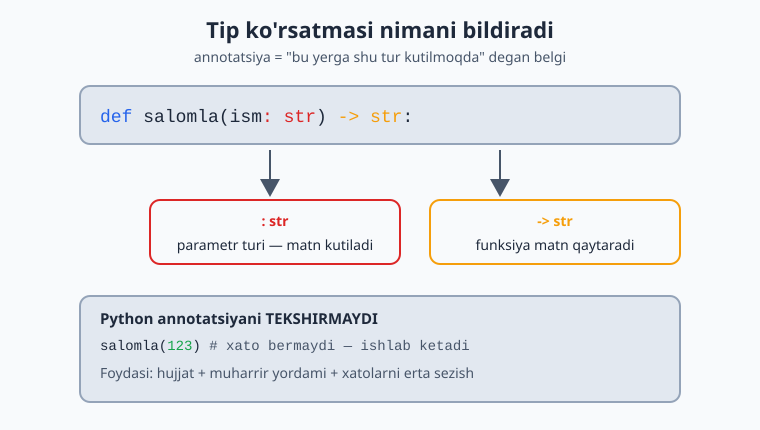
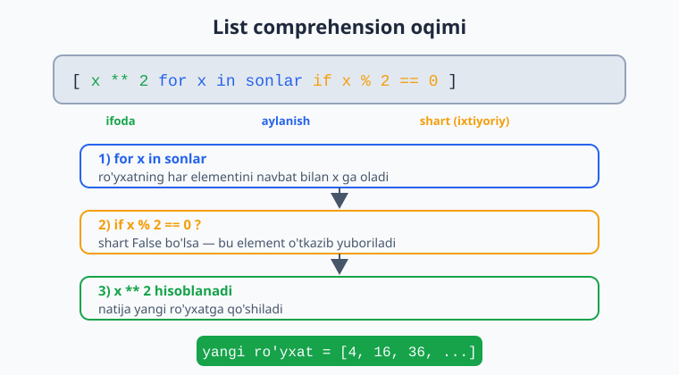

# 10 — Tip ko'rsatmalari va `map`/`filter`

Python o'zgaruvchi turini oldindan e'lon qilishni talab qilmaydi. Lekin **tip ko'rsatmalari** (type hints) yozish — kodni o'qishni osonlashtiradi, muharring (VS Code va h.k.) yordamini yaxshilaydi va xatolarni erta topishga ko'maklashadi. Bu modulda type hints'ni va funksional uslubdagi `map`/`filter`ni o'rganasan.

> **Bu modulda:** tip ko'rsatmalari (`int`, `str`, `list[int]`...), `Optional`/`| None`, va `map`/`filter`.

---

## 10.1 Tip ko'rsatmalari — asoslari

O'zgaruvchi yoki funksiya parametriga uning turini yozib qo'yasan. Bu Python'ni o'zgartirmaydi — faqat "bu yerga shu tur kutilmoqda" deb belgilaydi:

```python
ism: str = "Aziz"
yosh: int = 25
narx: float = 19.99
faolmi: bool = True

def salomla(ism: str) -> str:        # ism — str, qaytaradi — str
    return f"Salom, {ism}"
```

`-> str` qismi — funksiya **nima qaytarishini** bildiradi. Hech narsa qaytarmasa `-> None`:

```python
def chiqar(matn: str) -> None:       # hech narsa qaytarmaydi
    print(matn)
```

> **Juda muhim:** tip ko'rsatmalari Python tomonidan **tekshirilmaydi**. Quyidagi kod xato bermaydi:
> ```python
> def qosh(a: int, b: int) -> int:
>     return a + b
> qosh("salom", "dunyo")    # ishlaydi! "salomdunyo" qaytaradi
> ```
> Ular faqat **hujjat** va **muharrir/vosita** uchun. Lekin baribir doim yoz — kod ancha tushunarli bo'ladi va muharrir xatolarni ko'rsatadi.

Quyidagi diagramma annotatsiyaning har bir qismi nimani bildirishini va Python uni tekshirmasligini ko'rsatadi:



---

## 10.2 To'plamlar uchun tip ko'rsatmalari

Ro'yxat, lug'at va boshqalar uchun ichidagi turni ham ko'rsatasan:

```python
ismlar: list[str] = ["Ali", "Vali"]          # str'lardan iborat ro'yxat
sonlar: list[int] = [1, 2, 3]                 # int'lardan
narxlar: dict[str, float] = {"olma": 1.5}     # kalit str, qiymat float
koordinata: tuple[int, int] = (10, 20)        # ikkita int

def jami(sonlar: list[int]) -> int:
    return sum(sonlar)
```

---

## 10.3 `Optional` / `| None` — "qiymat bo'lmasligi ham mumkin"

Ba'zan funksiya qiymat qaytaradi yoki hech narsa (`None`) qaytaradi. Buni `| None` bilan ko'rsatasan:

```python
def topish(ismlar: list[str], qidiruv: str) -> int | None:
    for i, ism in enumerate(ismlar):
        if ism == qidiruv:
            return i           # topildi — indeks
    return None                # topilmadi — None

# `enumerate` — ro'yxat bo'ylab indeks bilan birga aylanish:
for indeks, qiymat in enumerate(["a", "b", "c"]):
    print(indeks, qiymat)      # 0 a, 1 b, 2 c
```

> `int | None` — "int yoki None" degani. Bu "qiymat bor yoki yo'q" holatlarni aniq ifodalaydi. (Eski kodda `Optional[int]` ko'rishing mumkin — bir xil ma'no.)

---

## 10.4 `map` — har elementga funksiya qo'llash

`map` ro'yxatning har bir elementiga funksiyani qo'llaydi:

```python
sonlar = [1, 2, 3, 4]

# Har birini kvadratga:
kvadratlar = list(map(lambda x: x ** 2, sonlar))
print(kvadratlar)        # [1, 4, 9, 16]

# Tayyor funksiya bilan — har birini matnga aylantirish:
matnlar = list(map(str, sonlar))
print(matnlar)           # ['1', '2', '3', '4']
```

`map` har elementga bir xil funksiyani qo'llaydi va element soni o'zgarmaydi — quyidagi diagrammada bu ko'rinadi:

![map har bir elementga funksiya qo'llaydi: [1,2,3,4] dan kvadratlar [1,4,9,16] hosil bo'ladi](rasmlar/py10-map.svg)

> **`lambda` nima?** `lambda` — nomsiz, qisqa funksiya. `lambda x: x ** 2` = "x ni olib, kvadratini qaytaradi". Faqat bitta ifoda uchun ishlatiladi. Ko'p hollarda comprehension o'qilishi osonroq (pastga qara).

---

## 10.5 `filter` — shartga mos elementlarni tanlash

`filter` faqat shart `True` bo'lgan elementlarni qoldiradi:

```python
sonlar = [1, 2, 3, 4, 5, 6]

juftlar = list(filter(lambda x: x % 2 == 0, sonlar))
print(juftlar)           # [2, 4, 6]
```

Diagrammada shart `True` bo'lgan elementlar o'tishi, qolganlari tushib qolishi ko'rsatilgan:

![filter shartga mos elementlarni tanlaydi: [1..6] dan juftlar [2,4,6] o'tadi, toqlar tushib qoladi](rasmlar/py10-filter.svg)

> **Maslahat:** ko'p hollarda `map`/`filter` o'rniga **comprehension** (3-moduldan) o'qilishi osonroq:
> ```python
> kvadratlar = [x ** 2 for x in sonlar]              # map o'rniga
> juftlar = [x for x in sonlar if x % 2 == 0]        # filter o'rniga
> ```
> `map`/`filter` ni asosan tayyor funksiya bor bo'lganda ishlat (`map(str, sonlar)`). Comprehension'ni esa odat qil — u Pythonda eng keng tarqalgan.

Comprehension qanday o'qilishini quyidagi oqim diagrammasi yordamida tushunish oson — aylanish, ixtiyoriy shart va ifoda ketma-ketligi:



---

## 10.6 Ilg'or mavzular (hozircha qisqacha)

Tip ko'rsatmalari bo'yicha yana ko'p narsa bor — keyinroq o'rganasan:
- `mypy` — kodni ishga tushirmasdan tip xatolarini topuvchi vosita.
- `Generic`, `Protocol`, `TypedDict` — murakkab loyihalar uchun kuchli tip vositalari.
- `functools` moduli — `reduce`, `partial` kabi funksional vositalar.

Hozircha asosiy ko'rsatmalar (`int`, `str`, `list[int]`, `| None`) va `map`/`filter` yetadi.

---

## ✍️ Masalalar (20 ta)

> Bu masalalar oldingi modullarga tayanadi.

**Oson (1–7):**

1. `kop(a: int, b: int) -> int` funksiyasini tip ko'rsatmalari bilan yoz, ko'paytirsin.
2. `salomla(ism: str) -> str` yoz: "Salom, {ism}" qaytarsin.
3. `ortacha(sonlar: list[float]) -> float` yoz: o'rtachani qaytarsin.
4. `map` bilan `["1","2","3"]` ni `[1,2,3]` ga aylantir (`int` ishlat).
5. `filter` bilan `range(20)` dan 3 ga bo'linadiganlarini ol.
6. 4-masalani comprehension bilan ham yoz, ikkalasini taqqosla.
7. `chiqar(matn: str) -> None` yoz: matnni chop etsin (hech narsa qaytarmasin).

**O'rta (8–14):**

8. `list[int]` qabul qiladigan funksiya yoz: ro'yxatning yig'indisini qaytarsin.
9. `topish(ismlar: list[str], qidiruv: str) -> int | None` yoz: indeksni yoki `None` qaytarsin.
10. `enumerate` bilan ro'yxat elementlarini "0: olma", "1: banan" ko'rinishida chiqar.
11. `map` bilan har bir ismni katta harfga aylantir (`str.upper` ishlat).
12. `filter` bilan ismlar ro'yxatidan uzunligi 4 dan katta bo'lganlarini ol.
13. `dict[str, int]` qaytaradigan funksiya yoz: so'zlar ro'yxatidan har so'z uzunligini lug'at qilib qaytarsin.
14. `map` va `lambda` bilan har bir narxga 20% chegirma qo'llab yangi ro'yxat yasa.

**Murakkab (15–20):**

15. `Callable` ishlat: `qolla(funk, royxat)` yoz — har elementga funksiyani qo'llab yangi ro'yxat qaytarsin (`from typing import Callable`).
16. `filter` + `map` ni birga ishlat: ro'yxatdagi juft sonlarni olib, har birini kvadratga aylantir.
17. Tip ko'rsatmalari bilan to'liq funksiya yoz: `talabalar: list[dict]` qabul qilsin, ballari 60 dan yuqorilarning ismlarini `list[str]` qilib qaytarsin.
18. `int | None` qaytaradigan "xavfsiz bo'lish" funksiyasini yoz: nolga bo'lishda `None` qaytarsin.
19. Comprehension va `map`/`filter` bilan bir xil natijani uch xil usulda yoz (1–100 dan juft sonlarning kvadratlari), uchalasi bir xil natija berishini tekshir.
20. To'liq tipli kichik dastur: `Talaba` ma'lumotlari (`dict`) ro'yxatini olib, o'rtacha ball, eng yuqori ballli talaba ismi va o'tganlar (60+) sonini qaytaradigan funksiyalar yoz.

---

## ✅ Yechimlar

<details markdown="1">
<summary>Ko'rsatish uchun ochish</summary>

```python
# 1
def kop(a: int, b: int) -> int:
    return a * b
print(kop(3, 4))              # 12

# 2
def salomla(ism: str) -> str:
    return f"Salom, {ism}"

# 3
def ortacha(sonlar: list[float]) -> float:
    return sum(sonlar) / len(sonlar)

# 4
print(list(map(int, ["1", "2", "3"])))    # [1, 2, 3]

# 5
print(list(filter(lambda x: x % 3 == 0, range(20))))   # [0,3,6,9,12,15,18]

# 6
print([int(x) for x in ["1", "2", "3"]])  # comprehension — o'qilishi osonroq

# 7
def chiqar(matn: str) -> None:
    print(matn)

# 8
def jami(sonlar: list[int]) -> int:
    return sum(sonlar)
print(jami([10, 20, 30]))     # 60

# 9
def topish(ismlar: list[str], qidiruv: str) -> int | None:
    for i, ism in enumerate(ismlar):
        if ism == qidiruv:
            return i
    return None
print(topish(["a", "b", "c"], "b"))    # 1

# 10
for i, x in enumerate(["olma", "banan"]):
    print(f"{i}: {x}")

# 11
print(list(map(str.upper, ["ali", "vali"])))   # ['ALI', 'VALI']

# 12
ismlar = ["Ali", "Malika", "Bobur", "Gul"]
print(list(filter(lambda s: len(s) > 4, ismlar)))   # ['Malika', 'Bobur']

# 13
def uzunliklar(sozlar: list[str]) -> dict[str, int]:
    return {s: len(s) for s in sozlar}
print(uzunliklar(["olma", "non"]))    # {'olma': 4, 'non': 3}

# 14
narxlar = [100, 200, 300]
print(list(map(lambda n: n * 0.8, narxlar)))   # [80.0, 160.0, 240.0]

# 15
from typing import Callable
def qolla(funk: Callable[[int], int], royxat: list[int]) -> list[int]:
    return [funk(x) for x in royxat]
print(qolla(lambda x: x + 1, [1, 2, 3]))    # [2, 3, 4]

# 16
sonlar = [1, 2, 3, 4, 5, 6]
natija = list(map(lambda x: x ** 2, filter(lambda x: x % 2 == 0, sonlar)))
print(natija)                 # [4, 16, 36]

# 17
def otganlar(talabalar: list[dict]) -> list[str]:
    return [t["ism"] for t in talabalar if t["ball"] >= 60]
data = [{"ism": "Aziz", "ball": 85}, {"ism": "Gul", "ball": 50}]
print(otganlar(data))         # ['Aziz']

# 18
def xavfsiz_bol(a: int, b: int) -> float | None:
    if b == 0:
        return None
    return a / b
print(xavfsiz_bol(10, 2), xavfsiz_bol(10, 0))   # 5.0 None

# 19
a = [x ** 2 for x in range(1, 101) if x % 2 == 0]
b = list(map(lambda x: x ** 2, filter(lambda x: x % 2 == 0, range(1, 101))))
c = []
for x in range(1, 101):
    if x % 2 == 0:
        c.append(x ** 2)
print(a == b == c)            # True

# 20
def ortacha_ball(talabalar: list[dict]) -> float:
    return sum(t["ball"] for t in talabalar) / len(talabalar)
def eng_yuqori(talabalar: list[dict]) -> str:
    return max(talabalar, key=lambda t: t["ball"])["ism"]
def otganlar_soni(talabalar: list[dict]) -> int:
    return len([t for t in talabalar if t["ball"] >= 60])
data = [{"ism": "Aziz", "ball": 85}, {"ism": "Gul", "ball": 55}, {"ism": "Bobur", "ball": 72}]
print(ortacha_ball(data))     # 70.66...
print(eng_yuqori(data))       # Aziz
print(otganlar_soni(data))    # 2
```

</details>

---

[← Generatorlar va dekoratorlar](./09-iterator-generator-decorator.md) | [Boshlovchilar README ↑](./README.md) | [Keyingi: Standart kutubxona →](./11-standart-kutubxona.md)
